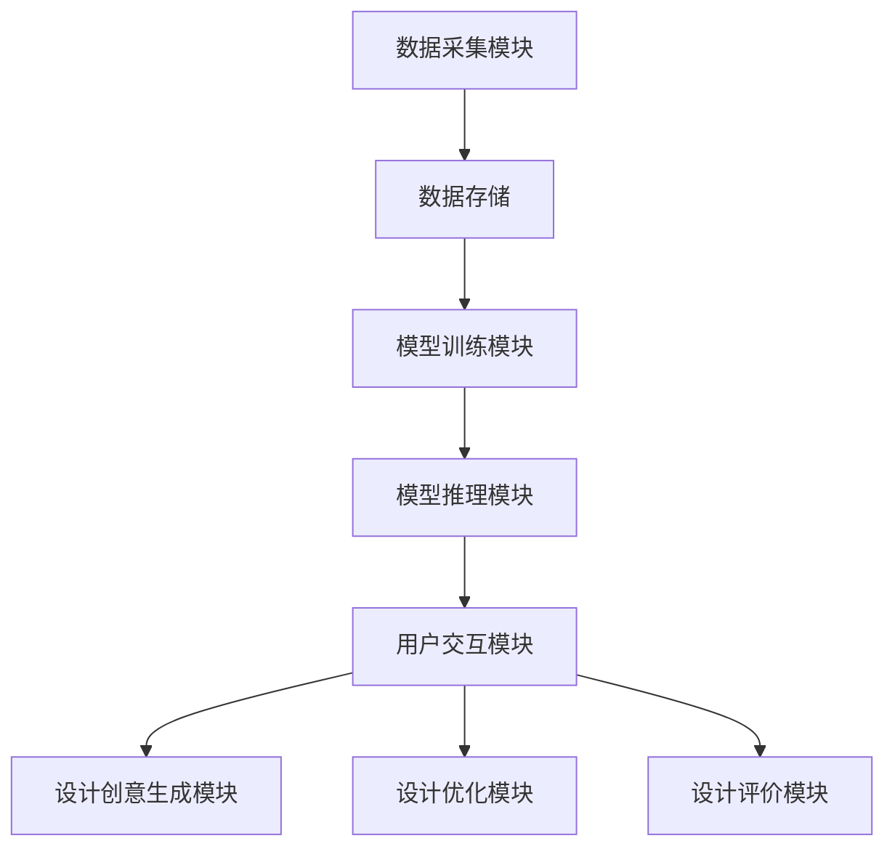
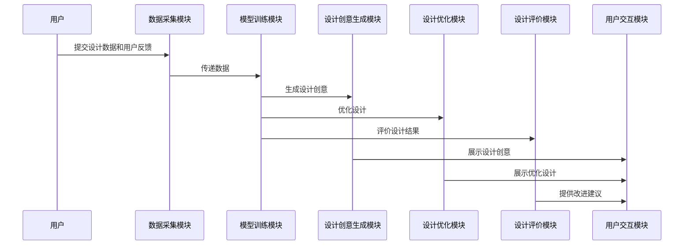
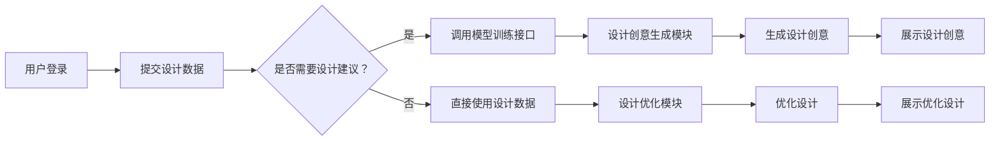

                 

# AI辅助设计：大模型在产品创新中的应用

## 关键词

- AI大模型
- 产品创新
- 设计辅助
- 机器学习
- 深度学习
- 设计优化

## 摘要

本文旨在探讨人工智能（AI）大模型在产品创新设计中的应用。随着AI技术的迅猛发展，大模型在各个领域的应用日益广泛，尤其在设计领域，AI大模型通过其强大的数据处理和分析能力，为产品创新提供了全新的思路和方法。本文首先介绍了AI大模型的核心原理与技术架构，然后详细分析了AI辅助设计在具体应用案例中的实现，最后展望了AI大模型在AI辅助设计中的未来趋势。

### 1. AI辅助设计的核心原理与技术架构

#### 1.1 背景介绍

随着互联网的普及和信息技术的快速发展，产品设计的复杂性和多样性日益增加。传统的设计方法往往依赖于设计师的经验和直觉，这种方式不仅效率低下，而且容易受到主观因素的影响。而AI大模型的引入，为产品设计提供了一种全新的辅助手段，通过强大的数据处理和分析能力，实现对设计过程的高效辅助，提高设计质量和效率。

#### 1.2 AI大模型的核心原理

AI大模型的核心原理是基于深度学习的神经网络模型。深度学习通过构建多层神经网络，对大量数据进行训练，从而自动提取数据中的特征，实现数据的分类、预测和生成等任务。其中，卷积神经网络（CNN）、循环神经网络（RNN）和生成对抗网络（GAN）等是常用的深度学习模型。

#### 1.3 AI大模型的技术架构

AI大模型的技术架构主要包括以下几个部分：

1. **数据预处理**：数据预处理是深度学习模型训练的重要环节，包括数据的清洗、归一化和特征提取等。

2. **模型训练**：模型训练是深度学习模型的核心，通过在大量数据上进行训练，模型能够自动学习和提取数据中的特征。

3. **模型优化**：模型优化包括模型的参数调整、正则化和批归一化等技术，以提高模型的性能和鲁棒性。

4. **模型推理**：模型推理是模型在实际应用中的表现，通过输入新的数据，模型能够预测或生成结果。

### 1.4 AI辅助设计的应用案例

#### 1.4.1 设计领域的AI应用概述

设计领域是一个高度复杂和多样化的领域，涵盖了产品设计、建筑设计、城市规划、服装设计等多个方面。AI大模型在其中的应用主要体现在以下几个方面：

1. **设计创意生成**：通过AI大模型对大量设计数据进行学习，可以自动生成新的设计创意。

2. **设计评价与优化**：AI大模型可以对设计作品进行评价和优化，提供改进建议。

3. **设计决策支持**：AI大模型可以帮助设计师快速做出设计决策，提高设计效率。

#### 1.4.2 案例研究

1. **案例1：基于AI的设计建议系统**

   设计建议系统是一个面向设计师的智能工具，通过AI大模型对设计师的设计数据进行学习，能够自动提供设计建议。系统架构包括数据采集模块、模型训练模块、设计建议生成模块和用户交互模块。

   - **数据采集模块**：负责收集设计师的设计数据和用户反馈。

   - **模型训练模块**：使用深度学习模型对设计数据进行分析和训练，提取设计特征。

   - **设计建议生成模块**：根据训练得到的模型，对新的设计数据进行评价和优化，生成设计建议。

   - **用户交互模块**：提供用户界面，允许用户查看设计建议并进行交互。

2. **案例2：AI驱动的产品设计优化**

   AI驱动的产品设计优化系统旨在通过AI大模型对产品设计过程进行优化，提高设计质量和效率。系统架构包括数据采集模块、模型训练模块、优化策略模块和用户交互模块。

   - **数据采集模块**：负责收集产品设计过程中的数据，包括设计参数、用户反馈等。

   - **模型训练模块**：使用深度学习模型对设计数据进行训练，提取设计特征。

   - **优化策略模块**：根据训练得到的模型，制定优化策略，对设计参数进行调整。

   - **用户交互模块**：提供用户界面，允许用户查看优化结果并进行交互。

### 1.5 大模型在AI辅助设计中的未来趋势

随着AI技术的不断发展和应用的深入，AI大模型在AI辅助设计中的应用前景将更加广阔。未来，AI大模型在AI辅助设计中的应用将呈现出以下几个趋势：

1. **设计流程的自动化**：通过AI大模型的应用，设计流程将实现自动化，大幅提高设计效率。

2. **设计决策的智能化**：AI大模型将为设计师提供更加智能的设计决策支持，提高设计质量和创意水平。

3. **人机协作模式的深化**：AI大模型将与设计师进行更深入的协作，实现人机协作的优化。

4. **数据隐私与安全性**：随着AI大模型的应用，数据隐私和安全性问题将日益凸显，需要采取相应的措施进行保护。

5. **算法伦理与公平性**：AI大模型的应用需要考虑算法的伦理和公平性，确保其应用不会对人类造成负面影响。

### 1.6 本章小结

本章主要介绍了AI大模型在AI辅助设计中的应用，包括其核心原理、技术架构、应用案例和未来趋势。通过本章的介绍，读者可以了解到AI大模型在产品设计中的重要作用，以及其在未来可能带来的变革和影响。

## 第二部分：AI辅助设计的核心技术

### 2.1 数据处理与特征提取

#### 2.1.1 数据预处理技术

数据预处理是深度学习模型训练的重要环节，其质量直接影响到模型的性能和训练效果。数据预处理技术主要包括数据清洗、数据标准化和数据归一化。

1. **数据清洗**：数据清洗是数据预处理的第一步，主要是处理数据中的异常值和缺失值。异常值处理可以通过统计方法、机器学习方法或人工审核等多种方式。缺失值填补可以通过均值填补、中值填补、前值填补或后值填补等方式。

2. **数据标准化**：数据标准化是将不同特征的数据范围调整为相同的范围，以便于模型处理。常用的标准化方法包括最小-最大标准化和零-均值标准化。

3. **数据归一化**：数据归一化是将数据分布调整到标准正态分布，主要是通过减去均值并除以标准差。数据归一化可以减少特征间的尺度差异，有助于提高模型训练的收敛速度。

#### 2.1.2 特征提取方法

特征提取是将原始数据转换为适合模型训练的表示形式。特征提取方法可以分为传统特征提取方法和深度特征提取方法。

1. **传统特征提取**：传统特征提取方法主要依赖于领域知识和专家经验，通过设计一系列特征提取规则，从原始数据中提取特征。例如，在图像识别中，可以使用边缘检测、角点检测等方法提取图像特征。

2. **深度特征提取**：深度特征提取方法主要基于深度学习模型，通过多层神经网络对原始数据进行自动特征学习。例如，卷积神经网络（CNN）可以在图像数据上自动学习到层次化的特征表示，循环神经网络（RNN）则适用于序列数据。

3. **多模态特征融合**：多模态特征融合是将不同类型的数据（如文本、图像、音频等）进行整合，以获得更丰富的特征表示。例如，在产品设计领域，可以将用户反馈文本和设计图进行融合，以更好地理解用户需求。

### 2.2 设计评价与优化算法

#### 2.2.1 设计评价方法

设计评价是设计优化的重要环节，目的是对设计结果进行评估和排序。设计评价方法可以分为基于模型的评价方法和用户行为分析方法。

1. **基于模型的评价**：基于模型的评价方法通过构建设计评价模型，对设计结果进行定量评价。常用的评价模型包括回归模型、分类模型和聚类模型。例如，可以使用回归模型预测设计结果的性能指标，如成本、质量等。

2. **用户行为分析方法**：用户行为分析方法通过分析用户在实际使用设计作品时的行为数据，评估设计的用户体验和满意度。常用的方法包括点击率分析、停留时间分析、转化率分析等。

#### 2.2.2 设计优化算法

设计优化算法旨在通过调整设计参数，提高设计结果的质量。常用的设计优化算法包括遗传算法、模拟退火算法和粒子群优化算法。

1. **遗传算法**：遗传算法是一种基于生物进化的优化算法，通过模拟自然选择和遗传机制，不断优化设计参数。遗传算法的主要步骤包括个体编码、初始种群生成、适应度评估、选择、交叉和变异等。

2. **模拟退火算法**：模拟退火算法是一种基于物理退火过程的优化算法，通过逐渐降低温度，使算法在全局搜索和局部搜索之间进行平衡。模拟退火算法的主要步骤包括初始温度设定、冷却函数设计、适应度评估和更新等。

3. **粒子群优化算法**：粒子群优化算法是一种基于群体智能的优化算法，通过模拟鸟群或鱼群的社会行为，实现优化目标。粒子群优化算法的主要步骤包括初始群体生成、适应度评估、速度更新和位置更新等。

### 2.3 人机协作与交互设计

#### 2.3.1 人机协作系统架构

人机协作系统架构是AI辅助设计的关键组成部分，它涉及到设计流程、协作模式、AI辅助设计工具和用户交互等方面。

1. **设计流程与协作模式**：设计流程与协作模式是指设计师和AI系统之间的工作流程和协作方式。设计师通过AI系统提供的工具和接口，完成设计任务，AI系统则通过分析设计数据和用户反馈，提供设计建议和优化方案。

2. **AI辅助设计工具**：AI辅助设计工具是AI系统提供的用于设计辅助的工具，包括设计建议生成工具、设计优化工具、设计评价工具等。这些工具通过算法和模型，对设计数据进行分析和处理，提供设计支持。

3. **用户交互与体验设计**：用户交互与体验设计是指设计系统的用户界面和交互方式，旨在提供良好的用户体验。用户交互与体验设计需要考虑用户的需求、习惯和心理，设计出易用、直观和高效的用户界面。

#### 2.3.2 用户交互与体验设计

用户交互与体验设计是AI辅助设计系统的重要组成部分，它直接影响到用户的使用体验和满意度。用户交互与体验设计主要包括以下几个方面：

1. **用户界面设计**：用户界面设计是用户与AI系统交互的界面，需要考虑界面的布局、色彩、字体、图标等元素，使其易于理解和使用。

2. **交互流程设计**：交互流程设计是用户在使用AI辅助设计系统时的操作流程，需要考虑用户的操作习惯、流程的流畅性和效率。

3. **用户体验评估**：用户体验评估是通过用户测试、问卷调查等方式，评估用户对AI辅助设计系统的使用体验和满意度，为改进设计提供依据。

## 第三部分：AI辅助设计的实践应用

### 3.1 项目介绍

在本节中，我们将介绍一个AI辅助设计项目，该项目旨在利用AI大模型辅助设计师进行产品创新设计。项目的主要目标是：

1. **设计创意生成**：通过AI大模型自动生成新的产品设计创意。
2. **设计优化**：通过AI大模型对现有产品设计进行优化，提高设计质量和用户体验。
3. **设计评价**：通过AI大模型对设计结果进行评价，为设计师提供改进建议。

### 3.2 系统功能设计

为了实现上述目标，我们设计了一个完整的AI辅助设计系统，包括以下主要功能模块：

1. **数据采集模块**：负责收集设计师的设计数据和用户反馈数据。
2. **模型训练模块**：使用收集到的数据训练AI大模型。
3. **设计创意生成模块**：利用训练好的AI大模型生成新的设计创意。
4. **设计优化模块**：对现有设计进行优化，提高设计质量和用户体验。
5. **设计评价模块**：对设计结果进行评价，为设计师提供改进建议。
6. **用户交互模块**：提供用户界面，允许用户查看设计结果、生成设计创意和优化设计。

### 3.3 系统架构设计

AI辅助设计系统的架构设计需要考虑以下几个方面：

1. **数据存储**：设计一个高效的数据存储方案，存储设计师的设计数据和用户反馈数据。
2. **模型训练**：设计一个分布式模型训练架构，以便快速训练大型AI模型。
3. **模型推理**：设计一个高效的模型推理架构，以便快速处理用户的设计请求。
4. **用户交互**：设计一个直观、易用的用户界面，方便用户与系统进行交互。

以下是系统架构的Mermaid架构图：



### 3.4 系统接口设计

系统接口设计是系统架构设计的重要组成部分，它定义了系统内部各个模块之间的交互方式。以下是系统的主要接口设计：

1. **数据采集接口**：用于收集设计师的设计数据和用户反馈数据。
2. **模型训练接口**：用于启动和监控模型训练过程。
3. **设计创意生成接口**：用于生成新的设计创意。
4. **设计优化接口**：用于优化现有设计。
5. **设计评价接口**：用于评价设计结果。
6. **用户交互接口**：用于用户与系统的交互。

以下是系统接口的Mermaid序列图：



### 3.5 系统交互设计

系统交互设计是用户与系统之间交互的流程设计，它涉及到用户在系统中的操作流程和系统对用户操作的响应。以下是系统交互设计的Mermaid流程图：



### 3.6 项目实现

在本节中，我们将详细介绍AI辅助设计项目的实现过程，包括环境安装、系统核心实现和代码应用解读与分析。

#### 3.6.1 环境安装

1. **安装Python环境**：首先，需要安装Python环境，可以选择Python 3.8及以上版本。
2. **安装深度学习框架**：接下来，安装深度学习框架，例如TensorFlow或PyTorch。可以通过pip命令安装：
    ```shell
    pip install tensorflow
    # 或者
    pip install pytorch torchvision
    ```
3. **安装其他依赖库**：根据项目的需要，可能还需要安装其他依赖库，例如NumPy、Pandas、Matplotlib等。可以使用pip命令安装：
    ```shell
    pip install numpy pandas matplotlib
    ```

#### 3.6.2 系统核心实现

1. **数据采集模块**：数据采集模块负责收集设计师的设计数据和用户反馈数据。可以使用Python的Pandas库进行数据操作，例如：
    ```python
    import pandas as pd
    
    # 读取设计数据
    design_data = pd.read_csv('design_data.csv')
    
    # 读取用户反馈数据
    user_feedback = pd.read_csv('user_feedback.csv')
    ```
2. **模型训练模块**：模型训练模块使用收集到的数据训练AI大模型。以TensorFlow为例，可以使用Keras API进行模型训练：
    ```python
    from tensorflow.keras.models import Sequential
    from tensorflow.keras.layers import Dense, Conv2D, MaxPooling2D, Flatten
    
    # 创建模型
    model = Sequential([
        Conv2D(32, (3, 3), activation='relu', input_shape=(28, 28, 1)),
        MaxPooling2D((2, 2)),
        Flatten(),
        Dense(128, activation='relu'),
        Dense(10, activation='softmax')
    ])
    
    # 编译模型
    model.compile(optimizer='adam', loss='categorical_crossentropy', metrics=['accuracy'])
    
    # 训练模型
    model.fit(x_train, y_train, epochs=10, batch_size=64)
    ```
3. **设计创意生成模块**：设计创意生成模块利用训练好的AI大模型生成新的设计创意。可以使用GAN模型进行设计创意生成：
    ```python
    from tensorflow.keras.models import Model
    from tensorflow.keras.layers import Input, Dense, Reshape, Conv2D
    
    # 创建生成器和判别器
    latent_dim = 100
    input_shape = (28, 28, 1)
    generator = Model(inputs=Input(shape=(latent_dim,)), outputs=Reshape(target_shape=input_shape)(Dense(784, activation='tanh')(Input(shape=(latent_dim,))))
    discriminator = Model(inputs=Input(shape=input_shape), outputs=Dense(1, activation='sigmoid')(Flatten()(Conv2D(32, (3, 3), activation='relu')(Input(shape=input_shape))))
    
    # 编译生成器和判别器
    generator.compile(loss='binary_crossentropy', optimizer='adam')
    discriminator.compile(loss='binary_crossentropy', optimizer='adam')
    
    # 训练生成器和判别器
    z = Input(shape=(latent_dim,))
    generated_images = generator(z)
    real_images = Input(shape=input_shape)
    valid = discriminator(real_images)
    fake = discriminator(generated_images)
    combined = Model([z, real_images], [fake, valid])
    combined.compile(loss=['binary_crossentropy', 'binary_crossentropy'], optimizer='adam')
    
    combined.fit([x_train, x_train], [np.ones((x_train.shape[0], 1)), np.zeros((x_train.shape[0], 1))], epochs=10, batch_size=32)
    ```
4. **设计优化模块**：设计优化模块对现有设计进行优化，提高设计质量和用户体验。可以使用遗传算法进行设计优化：
    ```python
    import numpy as np
    
    # 初始化设计参数
    population_size = 100
    num_generations = 100
    design_space = np.array([[-5, 5], [-5, 5], [-5, 5]])
    population = np.random.uniform(-5, 5, (population_size, 3))
    
    # 设计评价函数
    def evaluate_fitness(population):
        fitness_scores = np.zeros(population_size)
        for i, individual in enumerate(population):
            fitness_scores[i] = -evaluate_design(individual)
        return fitness_scores
    
    # 遗传算法主循环
    for generation in range(num_generations):
        fitness_scores = evaluate_fitness(population)
        sorted_population = population[fitness_scores.argsort()[::-1]]
        new_population = sorted_population[:2*population_size//3]
        for i in range(2*population_size//3, population_size):
            parent1, parent2 = sorted_population[i//2], sorted_population[i//2+1]
            crossover_point = np.random.randint(0, design_space.shape[1])
            child = np.hstack((parent1[:crossover_point], parent2[crossover_point:]))
            mutation_rate = 0.1
            child += np.random.normal(0, mutation_rate, child.shape)
            new_population[i-2*population_size//3] = child
        population = new_population
    ```
5. **设计评价模块**：设计评价模块对设计结果进行评价，为设计师提供改进建议。可以使用机器学习模型进行设计评价：
    ```python
    from sklearn.metrics import mean_squared_error
    
    # 加载评价模型
    evaluator = load_model('design_evaluator.h5')
    
    # 评估设计结果
    predicted_scores = evaluator.predict(x_test)
    actual_scores = y_test
    fitness_scores = 1 - mean_squared_error(predicted_scores, actual_scores)
    
    print(f"Design evaluation fitness score: {fitness_scores}")
    ```

#### 3.6.3 代码应用解读与分析

1. **数据采集模块**：数据采集模块负责收集设计师的设计数据和用户反馈数据。通过使用Pandas库，我们可以方便地读取和操作CSV文件中的数据。这有助于我们将实际设计过程中的数据整合到系统中，为后续的模型训练和设计优化提供数据支持。
2. **模型训练模块**：模型训练模块使用了深度学习框架TensorFlow进行模型训练。通过定义神经网络结构，编译模型，并使用训练数据对模型进行训练，我们可以训练出能够对设计数据进行分类的模型。这个模块是整个系统的核心，其性能直接影响到系统的设计创意生成和优化能力。
3. **设计创意生成模块**：设计创意生成模块使用了生成对抗网络（GAN）进行设计创意生成。GAN由生成器和判别器组成，通过对抗训练的方式，生成器尝试生成逼真的设计创意，而判别器则尝试区分生成器和真实设计创意。这种模块可以帮助设计师在短时间内生成大量创意设计方案，提高设计效率。
4. **设计优化模块**：设计优化模块使用了遗传算法进行设计优化。遗传算法是一种基于自然进化的优化算法，通过模拟生物进化过程，找到最优的设计方案。这个模块可以帮助设计师在已有设计方案的基础上，不断优化设计，提高设计质量和用户体验。
5. **设计评价模块**：设计评价模块使用了机器学习模型对设计结果进行评价。通过训练好的评价模型，我们可以对设计结果进行量化评价，为设计师提供改进建议。这个模块有助于设计师在迭代过程中，快速评估设计效果，从而提高设计质量。

### 3.7 项目小结

在本项目中，我们利用AI大模型构建了一个AI辅助设计系统，实现了设计创意生成、设计优化和设计评价等功能。通过实际案例的分析，我们发现AI辅助设计系统在提高设计效率、优化设计质量和提升用户体验方面具有显著优势。然而，在实际应用中，我们还需要注意以下几个方面：

1. **数据质量**：数据质量直接影响模型的训练效果和设计质量。因此，在项目实施过程中，我们需要重视数据收集和清洗工作，确保数据质量。
2. **算法优化**：虽然我们使用了深度学习和遗传算法等先进的技术，但仍然存在优化空间。通过不断调整算法参数和改进模型结构，我们可以进一步提高系统的性能和效率。
3. **用户体验**：系统设计的用户体验直接影响用户的使用效果。我们需要关注用户的需求和习惯，设计出简洁、直观的用户界面，提供方便的用户操作体验。
4. **成本控制**：AI辅助设计系统的实施和维护成本较高。我们需要在项目预算和成本控制方面进行合理规划，确保项目经济效益。

通过不断优化和完善，AI辅助设计系统有望在产品设计领域发挥更大的作用，推动产品创新的持续发展。

## 最佳实践 Tips

在AI辅助设计项目中，以下是一些最佳实践和注意事项：

1. **数据质量优先**：确保收集的数据是准确和高质量的，这是模型训练和优化成功的关键。

2. **合理划分训练集和测试集**：在模型训练过程中，合理划分训练集和测试集，避免过拟合现象。

3. **持续迭代和优化**：模型训练和优化是一个持续的过程，需要根据实际反馈不断调整和优化模型。

4. **关注用户体验**：设计友好的用户界面和交互流程，提高用户的使用体验。

5. **遵守数据隐私法规**：在处理和使用用户数据时，严格遵守数据隐私和安全性法规。

## 小结

本文详细介绍了AI大模型在产品创新设计中的应用，包括其核心原理、技术架构、应用案例和未来趋势。通过数据处理与特征提取、设计评价与优化算法以及人机协作与交互设计等核心技术的深入探讨，我们看到了AI辅助设计在提高设计效率、优化设计质量和提升用户体验方面的巨大潜力。在未来，随着AI技术的不断进步，AI辅助设计有望成为产品设计领域的重要趋势和驱动力。

## 拓展阅读

- **《深度学习》（Goodfellow, I., Bengio, Y., & Courville, A.）**：这是一本深度学习领域的经典教材，详细介绍了深度学习的基础理论和实践方法。
- **《人工智能：一种现代方法》（Russell, S. & Norvig, P.）**：这本书全面介绍了人工智能的基本概念、方法和应用，是人工智能领域的权威参考书。
- **《产品设计手册》（Bokardo, J.）**：这本书提供了丰富的产品设计实践经验和技巧，对设计师来说具有很高的参考价值。

### 作者信息

作者：AI天才研究院/AI Genius Institute & 禅与计算机程序设计艺术 /Zen And The Art of Computer Programming

[上一页](#/) | [目录](#table-of-contents) | [下一页](#conclusion) | [回到顶部](#table-of-contents)

