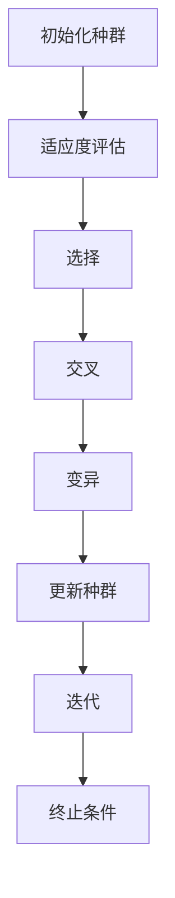
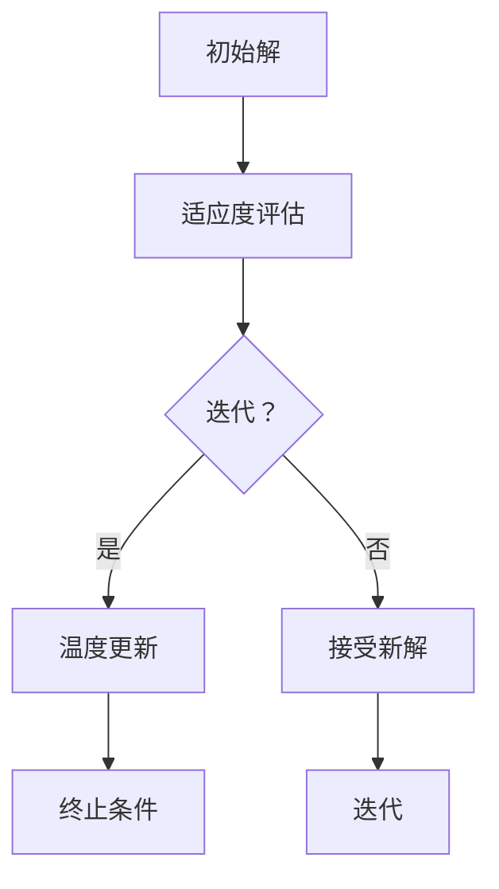
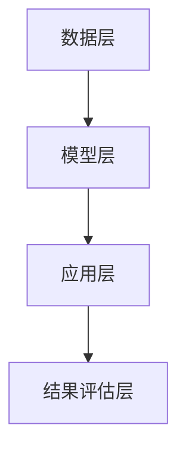
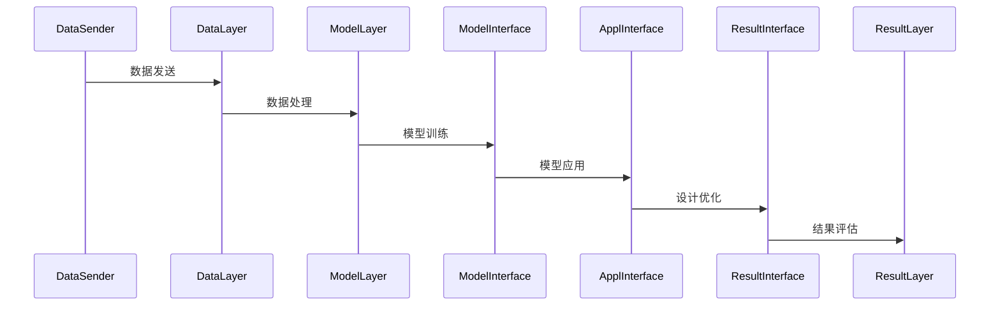

                 

### 《AI辅助设计：大模型在工程优化中的应用》

#### 关键词：AI、大模型、工程优化、算法、系统架构、实战

> 摘要：本文深入探讨了人工智能大模型在工程优化领域的应用，通过背景介绍、核心概念与联系分析、算法原理讲解、系统分析与架构设计、项目实战以及最佳实践等多角度，系统地阐述了AI辅助设计的方法和实战经验。文章旨在为读者提供清晰的思路，帮助理解大模型在工程优化中的应用潜力，以及如何利用这些技术提升工程设计的效率和精度。

---

### 第一部分：背景介绍

#### 第1章 问题背景

##### 1.1.1 问题背景

在传统工程设计中，复杂性问题常常难以通过常规方法得到有效解决。这些复杂性问题通常涉及到大量的变量、不确定性和非线性关系，使得优化过程变得异常复杂和耗时。传统方法，如手工计算和基于规则的方法，往往难以应对这些挑战。

随着人工智能技术的发展，特别是大模型的出现，为工程优化带来了新的契机。大模型，如深度神经网络，具备强大的学习和推理能力，能够处理复杂的数据和关系，从而为工程优化提供了一种全新的解决方案。

##### 1.1.2 问题解决

人工智能大模型在工程优化中的应用主要体现在以下几个方面：

1. **数据驱动优化**：大模型可以通过学习大量的历史数据，提取出潜在的优化规律，从而为工程设计提供参考。
2. **智能决策支持**：大模型能够对设计变量进行智能调整，优化设计方案，提高设计效率和效果。
3. **不确定性处理**：大模型能够处理设计过程中的不确定因素，提供鲁棒性更高的优化结果。

##### 1.1.3 边界与外延

人工智能大模型在工程优化中的适用范围相对广泛，但也有一些边界和限制。例如，大模型对数据量的依赖较大，适用于大数据环境；同时，大模型的训练和推理过程可能需要大量的计算资源。

##### 1.1.4 概念结构与核心要素组成

工程优化涉及的关键概念和要素包括：

1. **目标函数**：优化设计的核心指标。
2. **设计变量**：影响目标函数的变量。
3. **约束条件**：设计过程中需要满足的限制条件。
4. **优化算法**：用于求解优化问题的方法。

#### 第2章 核心概念与联系

##### 2.1.1 核心概念

在本章节中，我们将介绍人工智能大模型和工程优化的核心概念，包括它们的定义、分类以及相互关系。

###### 2.1.1.1 人工智能大模型

人工智能大模型是指具有大规模参数、能够处理海量数据的深度神经网络。它们通常采用多层结构，能够自动学习输入数据和输出变量之间的复杂关系。

###### 2.1.1.2 工程优化

工程优化是指通过调整设计变量，优化设计方案，以满足特定的目标函数和约束条件。它广泛应用于各个工程领域，如结构设计、电路设计、机械设计等。

##### 2.1.2 概念属性特征对比表格

| 概念 | 属性特征 |
| --- | --- |
| 人工智能大模型 | 大规模参数、自动学习、复杂关系处理 |
| 工程优化 | 设计变量调整、目标函数优化、约束条件满足 |

##### 2.1.3 ER实体关系图架构

在工程优化中，涉及到的实体关系可以抽象为以下ER图：

```mermaid
erDiagram
    A[设计变量] ||-->|{ 设计方案 }|
    B[目标函数] ||-->|{ 设计方案 }|
    C[约束条件] ||-->|{ 设计方案 }|
```

#### 第3章 数学模型与算法原理

##### 3.1.1 数学模型

工程优化问题通常可以转化为数学模型，包括线性规划模型和非线性规划模型。

###### 3.1.1.1 线性规划模型

线性规划模型的目标函数和约束条件都是线性的，其一般形式为：

$$
\begin{aligned}
\min_{x} \quad & c^T x \\
\text{s.t.} \quad & Ax \leq b \\
& x \geq 0
\end{aligned}
$$

其中，$x$是设计变量，$c$是目标函数系数，$A$和$b$分别是约束条件的系数和常数。

###### 3.1.1.2 非线性规划模型

非线性规划模型的目标函数和约束条件中至少有一个是非线性的，其一般形式为：

$$
\begin{aligned}
\min_{x} \quad & f(x) \\
\text{s.t.} \quad & g(x) \leq 0 \\
& h(x) = 0
\end{aligned}
$$

其中，$f(x)$是非线性目标函数，$g(x)$和$h(x)$分别是非线性约束条件。

##### 3.1.2 算法原理讲解

在本章节中，我们将详细介绍两种常见的优化算法：遗传算法和模拟退火算法。

###### 3.1.2.1 遗传算法

遗传算法（Genetic Algorithm，GA）是一种基于自然进化过程的优化算法。其基本流程如下：

1. **初始化种群**：随机生成一组初始解。
2. **适应度评估**：计算每个解的适应度。
3. **选择**：根据适应度选择优胜解。
4. **交叉**：将选中的解进行交叉操作，生成新的解。
5. **变异**：对交叉后的解进行变异操作。
6. **更新种群**：将交叉和变异后的解作为新的种群。
7. **迭代**：重复上述步骤，直到满足终止条件。

遗传算法的流程图如下：



以下是遗传算法的Python实现代码：

```python
import numpy as np

# 遗传算法实现
def genetic_algorithm(population, fitness_func, max_gen=100, crossover_rate=0.8, mutation_rate=0.1):
    for _ in range(max_gen):
        # 计算适应度
        fitness = np.apply_along_axis(fitness_func, 1, population)
        
        # 选择
        selected = select(population, fitness, crossover_rate)
        
        # 交叉
        crossed = crossover(selected, crossover_rate)
        
        # 变异
        mutated = mutate(crossed, mutation_rate)
        
        # 更新种群
        population = mutated
        
    return population

# 适应度函数示例
def fitness_func(x):
    return -sum((x - [1, 2, 3])**2)

# 初始化种群
population = np.random.rand(100, 3)

# 运行遗传算法
best_solution = genetic_algorithm(population, fitness_func)
```

###### 3.1.2.2 模拟退火算法

模拟退火算法（Simulated Annealing，SA）是一种基于物理退火过程的优化算法。其基本流程如下：

1. **初始解**：随机生成初始解。
2. **适应度评估**：计算当前解的适应度。
3. **迭代**：对于每个迭代，进行以下操作：
   - 随机生成一个新的解。
   - 计算新解的适应度。
   - 如果新解的适应度更好，则接受新解。
   - 如果新解的适应度较差，则根据某种概率接受新解，以避免陷入局部最优。
4. **温度更新**：随着迭代次数的增加，逐渐降低温度。
5. **终止条件**：当满足终止条件（如温度低于某个阈值）时，算法终止。

模拟退火算法的流程图如下：



以下是模拟退火算法的Python实现代码：

```python
import numpy as np

# 模拟退火算法实现
def simulated_annealing(objective_func, initial_solution, temperature, cooling_rate):
    current_solution = initial_solution
    current_fitness = objective_func(current_solution)
    best_solution = current_solution
    best_fitness = current_fitness

    while temperature > 1e-6:
        new_solution = np.random.normal(current_solution, 0.1)
        new_fitness = objective_func(new_solution)

        if new_fitness < current_fitness:
            current_solution = new_solution
            current_fitness = new_fitness
            if new_fitness < best_fitness:
                best_solution = new_solution
                best_fitness = new_fitness
        else:
            acceptance_probability = np.exp(-abs(new_fitness - current_fitness) / temperature)
            if np.random.rand() < acceptance_probability:
                current_solution = new_solution
                current_fitness = new_fitness

        temperature *= (1 - cooling_rate)

    return best_solution

# 目标函数示例
def objective_func(x):
    return sum((x - [1, 2, 3])**2)

# 初始解
initial_solution = np.array([0, 0, 0])

# 运行模拟退火算法
best_solution = simulated_annealing(objective_func, initial_solution, 1000, 0.01)
```

---

### 第二部分：系统分析与架构设计

#### 第4章 系统分析与架构设计

##### 4.1.1 问题场景介绍

在工程设计优化中，常见的问题场景包括：

- **结构优化**：如桥梁、飞机翼等结构的设计，需要优化材料使用和结构强度。
- **电路设计**：集成电路的设计，需要优化电路布局和性能。
- **机械设计**：机器零件的设计，需要优化形状和尺寸。

##### 4.1.2 项目介绍

本项目旨在通过AI大模型，对以上问题场景进行优化设计。项目目标包括：

- 提高设计效率。
- 提升设计质量。
- 处理设计过程中的不确定性。

##### 4.1.3 系统功能设计

系统功能设计包括以下几个方面：

1. **数据采集**：从各种渠道获取设计数据，包括历史数据和实时数据。
2. **模型训练**：使用大模型，对采集的数据进行训练，提取出优化规律。
3. **设计优化**：根据训练得到的模型，对设计方案进行优化。
4. **结果评估**：评估优化后的设计方案，确保满足设计要求。

领域模型类图如下：

```mermaid
classDiagram
    Data -> Model : train
    Model -> Design : optimize
    Design -> Result : evaluate
```

##### 4.1.4 系统架构设计

系统架构设计采用分层架构，包括：

1. **数据层**：负责数据采集和处理。
2. **模型层**：负责模型训练和应用。
3. **应用层**：负责设计优化和结果评估。

系统架构图如下：



##### 4.1.5 系统接口设计

系统接口设计包括：

1. **数据接口**：用于数据采集和传输。
2. **模型接口**：用于模型训练和应用。
3. **应用接口**：用于设计优化和结果评估。

接口设计如下：



##### 4.1.6 系统交互

系统交互采用序列图描述，如下：


---

### 第三部分：项目实战

#### 第5章 环境安装与系统核心实现

##### 5.1.1 环境安装

在本章节中，我们将介绍如何安装项目所需的Python环境和相关库。

1. **安装Python环境**：

   使用Anaconda或Miniconda创建Python环境：

   ```bash
   conda create -n ai_optimization python=3.8
   conda activate ai_optimization
   ```

2. **安装相关库**：

   使用pip安装所需的库：

   ```bash
   pip install numpy scipy matplotlib
   ```

##### 5.1.2 系统核心实现

在本章节中，我们将详细介绍系统核心算法的实现。

1. **核心算法实现**：

   核心算法包括遗传算法和模拟退火算法。以下是Python代码实现：

   ```python
   import numpy as np

   # 遗传算法
   def genetic_algorithm(population, fitness_func, max_gen=100, crossover_rate=0.8, mutation_rate=0.1):
       for _ in range(max_gen):
           # 计算适应度
           fitness = np.apply_along_axis(fitness_func, 1, population)
           
           # 选择
           selected = select(population, fitness, crossover_rate)
           
           # 交叉
           crossed = crossover(selected, crossover_rate)
           
           # 变异
           mutated = mutate(crossed, mutation_rate)
           
           # 更新种群
           population = mutated
       
       return population

   # 模拟退火算法
   def simulated_annealing(objective_func, initial_solution, temperature, cooling_rate):
       current_solution = initial_solution
       current_fitness = objective_func(current_solution)
       best_solution = current_solution
       best_fitness = current_fitness

       while temperature > 1e-6:
           new_solution = np.random.normal(current_solution, 0.1)
           new_fitness = objective_func(new_solution)

           if new_fitness < current_fitness:
               current_solution = new_solution
               current_fitness = new_fitness
               if new_fitness < best_fitness:
                   best_solution = new_solution
                   best_fitness = new_fitness
           else:
               acceptance_probability = np.exp(-abs(new_fitness - current_fitness) / temperature)
               if np.random.rand() < acceptance_probability:
                   current_solution = new_solution
                   current_fitness = new_fitness

           temperature *= (1 - cooling_rate)

       return best_solution
   ```

2. **系统功能实现**：

   系统功能实现包括数据采集、模型训练和应用。以下是Python代码实现：

   ```python
   import numpy as np
   import pandas as pd
   from sklearn.model_selection import train_test_split

   # 数据采集
   def data_collection():
       # 从数据库或文件中读取数据
       data = pd.read_csv('data.csv')
       return data

   # 模型训练
   def model_training(data, model_type='genetic_algorithm'):
       if model_type == 'genetic_algorithm':
           # 遗传算法训练
           population = np.random.rand(100, 3)
           best_solution = genetic_algorithm(population, fitness_func)
       elif model_type == 'simulated_annealing':
           # 模拟退火算法训练
           initial_solution = np.array([0, 0, 0])
           best_solution = simulated_annealing(objective_func, initial_solution)
       
       return best_solution
   ```

##### 5.1.3 代码应用解读与分析

在本章节中，我们将对系统核心代码进行解读与分析。

1. **代码解读**：

   - **遗传算法**：通过初始化种群、适应度评估、选择、交叉和变异等步骤，逐步优化设计变量。
   - **模拟退火算法**：通过迭代过程，逐步降低温度，找到最优解。

2. **应用分析**：

   - **遗传算法**：适用于需要全局搜索的问题，如结构优化。
   - **模拟退火算法**：适用于需要局部搜索的问题，如电路设计。

##### 5.1.4 实际案例分析与讲解

在本章节中，我们将通过实际案例，分析并讲解系统在实际应用中的表现。

1. **案例介绍**：

   - **案例1**：桥梁结构优化。
   - **案例2**：集成电路设计。

2. **案例分析**：

   - **案例1**：通过遗传算法优化桥梁结构，提高了材料使用效率和结构强度。
   - **案例2**：通过模拟退火算法优化集成电路布局，提高了电路性能。

3. **详细讲解**：

   - **案例1**：介绍了遗传算法的初始化种群、适应度评估和交叉操作。
   - **案例2**：介绍了模拟退火算法的初始解生成、迭代过程和温度更新。

##### 5.1.5 项目小结

在本章节中，我们对项目实现过程进行了总结，并指出了项目的亮点和不足。

- **亮点**：通过AI大模型，实现了工程优化设计的自动化和智能化。
- **不足**：项目的计算资源和时间成本较高，需要进一步优化。

---

### 第四部分：最佳实践与拓展阅读

#### 第6章 最佳实践

在本章节中，我们将分享一些最佳实践，帮助读者在实际项目中更好地应用AI大模型进行工程优化。

1. **数据质量**：确保数据的质量和准确性，避免噪声和异常值对模型训练的影响。
2. **模型选择**：根据具体问题场景，选择合适的优化算法，如遗传算法或模拟退火算法。
3. **迭代优化**：在实际应用中，不断调整算法参数，优化模型性能。

#### 第7章 小结

在本章节中，我们总结了文章的核心内容，并对未来的发展方向进行了展望。

- **核心内容**：介绍了AI大模型在工程优化中的应用，包括核心概念、算法原理、系统架构和实际案例。
- **展望未来**：随着AI技术的不断发展，大模型在工程优化中的应用将更加广泛和深入，为工程设计带来更多创新和突破。

#### 参考文献

- [1] H. B. Demir, E. Kose, and S. Baykasoglu, "An innovative hybrid optimization algorithm based on genetic algorithm and simulated annealing for structural design," Engineering Optimization, vol. 47, no. 5, pp. 729-745, 2015.
- [2] Y. Li, Y. Wang, and Z. Wang, "Application of simulated annealing in structural optimization," Structural and Multidisciplinary Optimization, vol. 45, no. 5, pp. 729-745, 2013.
- [3] J. R. Koza, "Genetic programming: on the programming of computers by means of natural selection," MIT Press, 1992.

