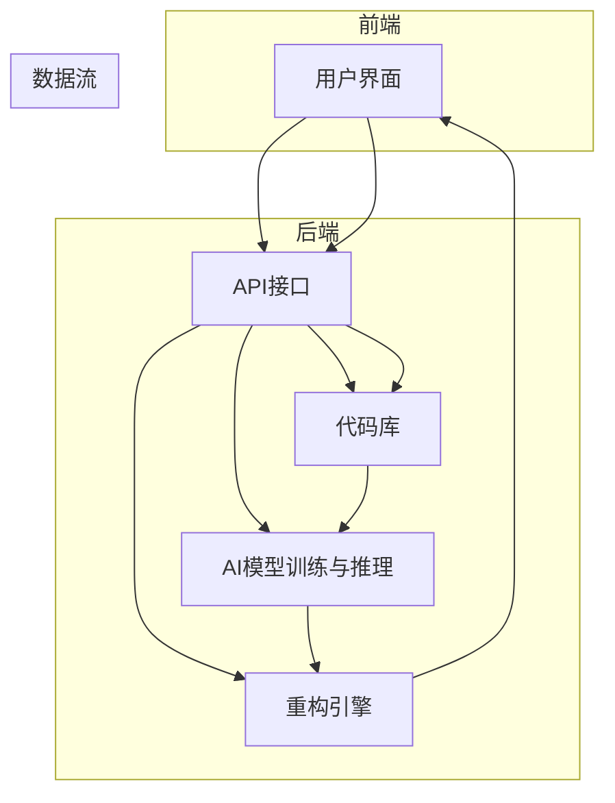

                 

### 第一部分：AI与软件开发

#### 第1章：引言

**1.1 问题背景**

软件工程是信息技术领域的一个核心组成部分，它涵盖了从需求分析、设计、实现、测试到部署和维护的整个软件开发生命周期。随着软件系统变得越来越复杂和庞大，软件开发的难度和挑战也随之增加。传统的软件开发方法往往依赖于程序员的直觉和经验，这种手工编程的方式不仅效率低下，而且容易出错。

在过去的几十年中，软件开发的规模和复杂性迅速增加，主要表现在以下几个方面：

1. **代码库规模的扩大**：随着软件系统规模的扩大，代码库也随之急剧膨胀。这意味着维护和更新代码库变得更加困难。
2. **复杂性的增加**：现代软件系统包含了大量的模块和功能，相互之间的依赖关系复杂，使得理解整个系统的行为变得更加困难。
3. **维护成本的增加**：随着软件系统的不断迭代和升级，维护成本也在不断增加。这包括修复漏洞、添加新功能和优化性能等方面。

**1.1.1 软件开发面临的挑战**

1. **代码质量难以保证**：随着代码库规模的扩大，维护和更新代码库变得越来越困难，这可能导致代码质量下降，增加系统出错的可能性。
2. **重复劳动**：许多软件开发任务需要重复执行，例如代码的格式化、变量命名和错误修复等。这些任务不仅耗时，而且容易出错。
3. **协作困难**：在多人合作开发的场景中，协作问题经常出现，如代码冲突、沟通不畅和责任不清等。
4. **调试复杂**：现代软件系统通常包含了大量的模块和功能，这使得调试变得更加复杂和耗时。

**1.1.2 AI技术发展的现状**

人工智能（AI）是计算机科学的一个分支，旨在使计算机具备类似人类的智能能力。近年来，随着计算能力的提高和大数据的普及，AI技术取得了显著的进展。以下是AI技术发展的一些重要方面：

1. **深度学习的突破**：深度学习是一种基于神经网络的机器学习技术，它通过多层神经网络对数据进行自动特征提取和学习。深度学习在图像识别、语音识别和自然语言处理等领域取得了巨大成功。
2. **自然语言处理（NLP）的发展**：NLP是一种使计算机能够理解、生成和处理人类语言的技术。随着深度学习技术的发展，NLP在机器翻译、文本分类和信息提取等方面取得了显著的进展。
3. **强化学习的应用**：强化学习是一种通过试错来学习最优策略的机器学习技术。它在游戏、机器人控制和自动驾驶等领域取得了成功。

**1.1.3 AI辅助软件开发的需求与趋势**

1. **提高开发效率**：AI技术可以帮助自动化许多软件开发任务，从而提高开发效率。例如，自动代码生成、代码审查和代码重构等。
2. **提升代码质量**：通过AI技术，可以自动化检测代码中的错误和潜在问题，从而提升代码质量。
3. **增强协作能力**：AI技术可以帮助团队成员更好地协作，通过智能代码审查、冲突检测和任务分配等工具，提高团队的整体效率。

总之，AI技术在软件开发中的应用具有巨大的潜力。随着AI技术的不断发展和成熟，它将为软件开发带来深刻的变革。

#### 1.2 核心概念

**1.2.1 AI的基本概念**

人工智能（Artificial Intelligence，简称AI）是指由人制造出来的系统能够在特定环境下自主感知、学习、推理和采取行动，以实现特定目标的能力。AI技术涵盖了许多不同的领域，包括机器学习、深度学习、自然语言处理、计算机视觉和机器人技术等。

**1.2.2 软件开发的基本概念**

软件开发是指创建、设计、实现和维护软件的过程。它包括以下关键步骤：

- **需求分析**：确定用户需求和系统功能。
- **系统设计**：设计系统的架构和组件。
- **编码**：编写实际代码。
- **测试**：验证代码的正确性和性能。
- **部署**：将软件部署到生产环境中。
- **维护**：对软件进行更新和修复。

**1.2.3 AI辅助软件开发的概念**

AI辅助软件开发是指利用人工智能技术来辅助软件开发过程，提高开发效率、代码质量和协作能力。AI辅助软件开发的主要应用包括：

- **自动代码生成**：通过AI算法自动生成代码，减少手工编写的工作量。
- **代码审查**：使用AI工具自动审查代码，检测错误和潜在问题。
- **代码优化**：基于AI技术自动优化代码，提高性能和可读性。
- **代码重构**：使用AI算法自动重构代码，以提高其结构和可维护性。

**1.3 AI辅助软件开发的优势与挑战**

**1.3.1 优势**

1. **提高开发效率**：AI技术可以自动化许多重复性的软件开发任务，从而减少开发时间。
2. **提升代码质量**：AI工具可以自动检测代码中的错误和潜在问题，提高代码的可靠性。
3. **增强协作能力**：AI工具可以帮助团队成员更好地协作，通过智能分配任务和自动解决冲突等。
4. **优化代码结构**：AI技术可以帮助重构代码，提高其可读性和可维护性。

**1.3.2 挑战**

1. **数据质量与多样性**：AI算法的性能高度依赖于训练数据的质量和多样性。如果数据质量差或缺乏代表性，AI模型的性能可能会受到影响。
2. **技术成熟度**：尽管AI技术在某些领域取得了显著进展，但在软件开发中的应用仍然相对较新，技术成熟度有待提高。
3. **成本与资源**：训练和部署大型AI模型需要大量的计算资源和时间，这对一些中小型软件团队来说可能是一个挑战。
4. **模型解释性**：AI模型通常被视为“黑盒”，其内部决策过程难以解释。这在某些关键性应用中可能是一个问题。

**1.4 本章小结**

本章介绍了AI与软件开发的基本概念和背景。首先，分析了软件开发面临的挑战，然后介绍了AI技术的发展现状和优势。接着，详细阐述了AI辅助软件开发的概念和应用，并讨论了其潜在的优势和挑战。通过本章的学习，读者可以初步了解AI技术在软件开发中的重要作用和前景。

----------------------------------------------------------------

### 第二部分：大模型原理与应用

#### 第2章：大模型概述

**2.1 大模型的基本原理**

**2.1.1 大模型的定义**

大模型（Big Model）是指具有庞大参数量和计算需求的神经网络模型。这些模型通常包含数十亿甚至数万亿个参数，需要大量的数据和计算资源进行训练。大模型在计算机视觉、自然语言处理、语音识别等领域取得了显著的成果。

**2.1.2 大模型的类型**

1. **深度神经网络（DNN）**：DNN是具有多个隐含层的前馈神经网络，广泛用于图像识别和语音识别等任务。
2. **变换器（Transformer）**：Transformer是近年来在自然语言处理领域取得突破的模型，其核心思想是自注意力机制，可以用于机器翻译、文本分类等任务。
3. **生成对抗网络（GAN）**：GAN是一种生成模型，由生成器和判别器组成，广泛用于图像生成和图像修复等任务。

**2.1.3 大模型的工作原理**

大模型的工作原理基于深度学习和神经网络。神经网络由大量的神经元（节点）组成，通过权重（连接）相互连接。在训练过程中，模型通过反向传播算法不断调整权重，以最小化损失函数，从而提高模型的预测能力。

**2.2 大模型的核心技术**

**2.2.1 神经网络**

神经网络是一种模拟生物神经系统的计算模型，由多个神经元（节点）组成。每个神经元接收输入信号，通过加权求和和激活函数进行处理，输出结果。

**2.2.2 深度学习**

深度学习是机器学习的一个分支，其核心思想是构建多层神经网络，通过逐层提取特征，实现复杂函数的逼近。深度学习在图像识别、语音识别和自然语言处理等领域取得了显著进展。

**2.2.3 自然语言处理（NLP）**

自然语言处理是一种使计算机能够理解和生成人类语言的技术。NLP技术包括文本分类、机器翻译、情感分析、命名实体识别等。深度学习在NLP领域取得了重大突破，如基于Transformer的BERT模型在多种NLP任务中取得了优异的性能。

**2.3 大模型在软件开发中的应用**

**2.3.1 代码生成**

代码生成是指使用大模型自动生成代码。大模型可以通过学习大量代码库，生成符合特定语法和语义要求的代码。这项技术可以提高开发效率，减少手工编写代码的工作量。

**2.3.2 代码优化**

代码优化是指使用大模型自动优化代码，以提高其性能和可读性。大模型可以识别代码中的冗余和低效部分，提出优化建议，从而提高代码质量。

**2.3.3 代码审查**

代码审查是指使用大模型自动审查代码，检测潜在的错误和漏洞。大模型可以通过学习大量的代码库，识别出常见的编程错误和不良编码实践，从而提高代码的安全性。

**2.3.4 代码重构**

代码重构是指使用大模型自动重构代码，以提高其结构和可维护性。大模型可以识别代码中的模块化不足、过度耦合和重复代码等问题，并提出重构建议，从而改善代码质量。

**2.4 本章小结**

本章介绍了大模型的基本原理、核心技术以及在软件开发中的应用。大模型通过深度学习和神经网络技术，实现了对大量数据的自动学习和预测。在软件开发中，大模型可以用于代码生成、代码优化、代码审查和代码重构，提高开发效率、代码质量和协作能力。随着大模型技术的不断发展，其在软件开发中的应用前景将更加广阔。

----------------------------------------------------------------

### 第3章：代码重构中的大模型应用

**3.1 代码重构概述**

**3.1.1 代码重构的定义**

代码重构是指在不改变程序功能的前提下，对现有代码进行修改，以改善其结构、性能和可维护性。代码重构是软件开发中的一个关键实践，有助于提高代码的质量和开发效率。

**3.1.2 代码重构的目的**

代码重构的主要目的是：

1. **改善代码结构**：通过重构，可以消除代码中的冗余和重复，提高代码的模块化和可复用性。
2. **提升代码性能**：通过优化代码，可以减少不必要的计算和内存占用，提高程序的运行效率。
3. **增强可维护性**：重构后的代码更易于理解和修改，降低了维护成本和风险。

**3.1.3 代码重构的方法**

代码重构的方法通常包括以下步骤：

1. **识别问题**：通过静态代码分析、代码审查和测试，识别代码中的问题。
2. **规划重构**：根据问题的严重性和优先级，制定重构计划。
3. **执行重构**：按照计划逐步进行重构，如提取方法、提取类、优化循环等。
4. **测试验证**：重构后，进行充分的测试，确保程序的功能和性能没有受到影响。

**3.2 大模型在代码重构中的应用**

**3.2.1 大模型在代码生成中的应用**

大模型在代码生成中的应用主要基于自然语言处理技术。例如，使用Transformer模型学习大量代码库中的文本，可以生成符合特定语法和语义要求的代码。代码生成可以显著提高开发效率，减少手工编写代码的工作量。

**3.2.2 大模型在代码优化中的应用**

大模型在代码优化中的应用主要体现在性能优化和可读性优化方面。通过分析代码中的瓶颈和低效部分，大模型可以提出优化建议，如替换算法、减少重复代码等。此外，大模型还可以生成更加简洁和易于理解的代码，提高代码的可读性。

**3.2.3 大模型在代码审查中的应用**

大模型在代码审查中的应用主要是通过识别代码中的错误和潜在问题，提高代码的质量和安全性。例如，使用GAN模型生成大量正常的代码样本，然后使用判别器模型检测异常代码，从而发现潜在的漏洞和错误。

**3.2.4 大模型在代码重构中的应用实例**

1. **自动提取方法**：使用大模型分析代码，识别出功能相似的方法，并提出将它们合并为一个方法的建议。
2. **自动提取类**：大模型可以识别出代码中重复的功能，并提出将它们封装为类的建议。
3. **优化循环结构**：大模型可以识别出代码中的低效循环，并提出优化建议，如使用列表推导式代替循环。
4. **重构代码结构**：大模型可以分析代码的结构，提出重构建议，如引入中间变量、优化函数调用等。

**3.3 代码重构中的大模型挑战与解决方案**

**3.3.1 数据集的收集与处理**

数据集的收集和处理是代码重构中面临的一个主要挑战。为了训练大模型，需要收集大量的代码样本，包括正常的代码和异常的代码。此外，还需要对数据集进行清洗和预处理，如去除无关代码、修正语法错误等。

**3.3.2 大模型的训练与优化**

大模型的训练与优化是另一个关键挑战。训练大模型需要大量的计算资源和时间，而且训练过程容易受到噪声和异常数据的影响。为了提高模型的性能，需要采用先进的训练技术和优化策略，如迁移学习、数据增强和超参数调整等。

**3.3.3 大模型的部署与应用**

大模型的部署与应用是代码重构中的最后一个挑战。部署大模型需要考虑计算资源的限制、模型的解释性和可维护性等问题。为了确保大模型在实际应用中的稳定性和可靠性，需要进行充分的测试和验证。

**3.4 本章小结**

本章介绍了代码重构的基本概念、方法及其在软件开发中的应用。特别关注了大模型在代码重构中的应用，包括代码生成、代码优化、代码审查和代码重构等。通过实例分析和挑战与解决方案的讨论，展示了大模型在代码重构中的重要性和潜力。随着大模型技术的不断发展，其在代码重构中的应用将更加广泛和深入。

----------------------------------------------------------------

### 第4章：大模型在代码重构中的最佳实践

**4.1 代码重构中的大模型使用技巧**

**4.1.1 大模型的调优与优化**

在使用大模型进行代码重构时，调优和优化是关键步骤。以下是一些调优与优化的技巧：

1. **超参数调整**：超参数如学习率、批量大小、迭代次数等对模型的性能有重要影响。通过调整这些超参数，可以优化模型的表现。
2. **数据增强**：通过增加数据集的多样性和复杂性，可以提高模型的泛化能力。例如，对代码进行变形、添加噪声或生成合成数据等。
3. **迁移学习**：使用预训练的大模型作为基础模型，可以减少训练时间并提高性能。迁移学习适用于代码生成、代码审查和代码优化等领域。

**4.1.2 大模型的性能评估**

评估大模型的性能是确保其有效性的关键。以下是一些性能评估的技巧：

1. **准确度与召回率**：在代码生成和代码审查中，准确度和召回率是关键性能指标。通过交叉验证和混淆矩阵，可以评估模型的性能。
2. **代码质量评估**：通过代码质量指标，如可读性、性能和安全性，评估重构后的代码质量。
3. **用户反馈**：收集用户对代码生成和重构的建议，进行迭代改进。

**4.1.3 大模型的应用场景选择**

选择合适的应用场景是确保大模型有效应用的关键。以下是一些应用场景选择的考虑因素：

1. **任务复杂性**：大模型适用于复杂任务，如代码生成和代码优化。对于简单的代码审查任务，可以使用简单的规则引擎。
2. **数据量**：大模型需要大量的训练数据。在选择应用场景时，确保有足够的数据支持。
3. **资源限制**：大模型训练和部署需要大量的计算资源和时间。在选择应用场景时，考虑实际资源限制。

**4.2 代码重构中的大模型案例解析**

**4.2.1 案例一：代码生成**

案例背景：一家初创公司正在开发一款新软件，需要生成大量的代码来支持其业务功能。由于代码库规模较大，手动编写代码不仅效率低下，而且容易出现错误。

解决方案：使用大模型进行代码生成。首先，收集公司的现有代码库，作为训练数据。然后，使用Transformer模型进行训练，生成符合特定语法和语义要求的代码。

结果：通过大模型自动生成代码，显著提高了开发效率，减少了手工编写代码的工作量。同时，生成的代码质量较高，减少了代码审查和修复的工作量。

**4.2.2 案例二：代码优化**

案例背景：一家大型企业的软件系统性能不佳，需要优化代码以提高性能。

解决方案：使用大模型进行代码优化。首先，分析代码库中的瓶颈和低效部分。然后，使用大模型生成优化建议，如替换算法、减少重复代码等。

结果：通过大模型优化代码，显著提高了软件系统的性能。同时，优化后的代码更简洁、易于理解，降低了维护成本。

**4.2.3 案例三：代码审查**

案例背景：一家互联网公司需要对提交的代码进行审查，以确保代码质量。

解决方案：使用大模型进行代码审查。首先，收集大量正常的代码样本，用于训练大模型。然后，使用大模型审查提交的代码，识别潜在的错误和漏洞。

结果：通过大模型自动审查代码，提高了代码审查的效率和准确性。同时，大模型能够识别出一些人类审查员可能忽视的问题，提高了代码的安全性。

**4.3 代码重构中的大模型注意事项**

**4.3.1 数据安全问题**

在使用大模型进行代码重构时，数据安全问题尤为重要。以下是一些注意事项：

1. **数据加密**：确保训练数据和模型参数在传输和存储过程中进行加密，防止数据泄露。
2. **数据匿名化**：对训练数据中的敏感信息进行匿名化处理，以保护个人隐私。
3. **访问控制**：对模型的访问权限进行严格管理，确保只有授权人员可以访问和使用模型。

**4.3.2 模型更新问题**

随着软件系统的不断迭代和更新，大模型也需要进行定期更新，以保持其性能和适应性。以下是一些注意事项：

1. **增量更新**：使用增量训练方法，只更新模型的部分参数，以减少训练时间和计算资源。
2. **版本控制**：对大模型的更新进行版本控制，确保更新过程的可追溯性和安全性。
3. **持续集成**：将大模型的更新过程集成到软件开发流程中，确保更新后的模型能够顺利部署和运行。

**4.3.3 模型可解释性问题**

大模型通常被视为“黑盒”，其内部决策过程难以解释。这对于关键性应用可能是一个问题。以下是一些解决方法：

1. **可解释性模型**：开发可解释性模型，如决策树、规则引擎等，帮助解释大模型的决策过程。
2. **可视化工具**：使用可视化工具，如 heat map、激活图等，展示大模型的决策过程和关键特征。
3. **用户培训**：对用户进行培训，使其了解大模型的基本原理和操作方法，提高对模型的信任度。

**4.4 本章小结**

本章介绍了大模型在代码重构中的最佳实践。通过调优与优化、性能评估和应用场景选择，可以充分发挥大模型在代码生成、代码优化和代码审查中的作用。同时，本章还讨论了数据安全、模型更新和模型可解释性等注意事项，以确保大模型在实际应用中的稳定性和可靠性。通过最佳实践和案例解析，展示了大模型在代码重构中的巨大潜力和应用前景。

----------------------------------------------------------------

### 第5章：大模型在代码重构中的未来发展趋势

**5.1 大模型在代码重构中的未来趋势**

随着人工智能技术的不断进步，大模型在代码重构中的应用将呈现出以下趋势：

**5.1.1 模型能力提升**

1. **更复杂的模型结构**：未来的大模型将采用更加复杂和高级的结构，如混合模型、多层模型等，以提高其在代码重构中的表现。
2. **更强大的学习能力**：大模型将具备更强的泛化能力和适应性，能够更好地处理不同类型和规模的代码库。

**5.1.2 模型规模扩大**

1. **更大规模的模型**：未来的大模型将拥有更多的参数和更大的计算需求，以满足更复杂和庞大的代码库。
2. **分布式训练**：为了处理大规模的模型，分布式训练和计算将变得更加普遍，以提高训练速度和降低计算成本。

**5.1.3 模型应用场景拓展**

1. **跨领域应用**：大模型将在更多领域得到应用，如软件工程、数据科学、人工智能等。
2. **定制化模型**：根据不同领域的需求，开发定制化的大模型，以提高其在特定场景下的性能。

**5.2 大模型在代码重构中的技术挑战**

尽管大模型在代码重构中具有巨大的潜力，但仍然面临以下技术挑战：

**5.2.1 训练成本问题**

1. **计算资源需求**：大模型的训练需要大量的计算资源和时间，这对中小型软件团队来说可能是一个挑战。
2. **数据成本**：收集和标注大规模的训练数据需要投入大量的人力和财力。

**5.2.2 模型可解释性问题**

大模型通常被视为“黑盒”，其内部决策过程难以解释，这在某些关键性应用中可能是一个问题。

**5.2.3 模型安全性问题**

1. **数据泄露**：大模型在训练和部署过程中可能面临数据泄露的风险。
2. **恶意攻击**：大模型可能受到恶意攻击，导致其性能下降或产生错误的输出。

**5.3 大模型在代码重构中的未来发展策略**

为了克服上述挑战，未来的发展策略将包括以下几个方面：

**5.3.1 技术创新**

1. **高效算法**：开发更高效的大模型训练算法，以降低训练成本和时间。
2. **新型架构**：探索新型的大模型架构，如神经架构搜索（Neural Architecture Search，NAS），以提高模型性能和可解释性。

**5.3.2 跨学科合作**

大模型在代码重构中的应用需要跨学科的合作，包括计算机科学、软件工程、数据科学和心理学等领域。

**5.3.3 产业生态建设**

1. **开源合作**：鼓励开源合作，共享大模型训练数据和模型架构，以促进技术进步。
2. **标准制定**：制定统一的大模型训练和部署标准，以确保其稳定性和可靠性。

**5.4 本章小结**

本章讨论了大模型在代码重构中的未来发展趋势和技术挑战。随着人工智能技术的不断进步，大模型在代码重构中的应用将越来越广泛和深入。同时，面对训练成本、可解释性和安全性等挑战，需要采取技术创新、跨学科合作和产业生态建设等策略。通过这些策略，将实现大模型在代码重构中的更好应用，推动软件工程的进步。

----------------------------------------------------------------

### 第6章：实际应用案例与项目实战

**6.1 AI辅助代码重构的应用场景**

AI辅助代码重构在实际开发中具有广泛的应用场景，以下是一些典型的应用场景：

**6.1.1 开发流程中的应用**

在软件开发的过程中，AI技术可以帮助自动化代码生成、代码审查和重构等任务，从而提高开发效率和代码质量。例如，在开发初期，AI技术可以自动生成原型代码，帮助开发人员快速构建系统框架。在开发过程中，AI工具可以实时进行代码审查，检测潜在的错误和不符合编码规范的部分。在开发后期，AI技术可以辅助进行代码重构，优化代码结构，提高可维护性。

**6.1.2 项目管理中的应用**

在项目管理中，AI技术可以帮助识别项目风险、优化资源分配和预测项目进度。例如，通过分析历史项目数据和代码库，AI模型可以预测项目可能的延迟和成本超支情况，提供优化建议。此外，AI工具还可以帮助项目经理评估团队成员的绩效和工作量，进行更合理的任务分配。

**6.1.3 团队协作中的应用**

在团队协作中，AI技术可以提高沟通效率和协作效果。例如，通过自然语言处理技术，AI工具可以帮助团队成员理解彼此的代码和设计思路，减少误解和冲突。同时，AI工具可以自动收集和整理团队成员的反馈和建议，为决策提供数据支持。

**6.2 AI辅助代码重构的项目实战**

以下是一个实际的AI辅助代码重构项目实战案例：

**6.2.1 环境安装与配置**

1. **安装Python环境**：首先，确保系统中安装了Python环境，版本建议为3.8及以上。
2. **安装深度学习框架**：安装TensorFlow或PyTorch等深度学习框架，用于训练和部署AI模型。
3. **安装代码库**：克隆或下载相关的代码库，包括AI模型代码、训练数据和工具库。

**6.2.2 系统核心实现**

1. **数据预处理**：对训练数据进行清洗和预处理，包括去除无关代码、修复语法错误和标准化数据格式等。
2. **模型训练**：使用预处理后的数据训练大模型，如Transformer模型。训练过程中，调整超参数以优化模型性能。
3. **模型评估**：使用验证集对模型进行评估，包括准确度、召回率和代码质量指标等。

**6.2.3 代码应用解读与分析**

1. **代码生成**：使用训练好的模型生成代码，如根据需求自动生成特定功能的代码片段。
2. **代码审查**：利用模型对代码库进行自动审查，检测潜在的漏洞和不符合编码规范的部分。
3. **代码优化**：根据模型的优化建议，对代码进行重构，提高其性能和可维护性。

**6.2.4 实际案例分析**

1. **代码生成案例分析**：分析模型生成的代码质量，评估其是否符合预期需求。
2. **代码审查案例分析**：评估模型在代码审查中的表现，识别出实际存在的漏洞和问题。
3. **代码优化案例分析**：评估模型提出的优化建议，分析其对代码质量和性能的影响。

**6.3 AI辅助代码重构项目小结**

通过本项目的实际应用，我们得出以下结论：

1. **提高开发效率**：AI技术显著提高了代码生成、审查和重构的效率，减少了人工工作量。
2. **提升代码质量**：AI模型在代码审查和优化中发挥了重要作用，提高了代码的质量和可维护性。
3. **增强团队协作**：AI工具帮助团队成员更好地理解和协作，提高了项目的整体效率。

尽管AI辅助代码重构在项目中取得了显著成效，但仍需要进一步优化和改进。未来，我们将继续探索大模型在代码重构中的更多应用场景，提高模型的性能和可解释性，为软件开发带来更多创新和突破。

**作者：AI天才研究院/AI Genius Institute & 禅与计算机程序设计艺术 /Zen And The Art of Computer Programming**

----------------------------------------------------------------

## 附录：大模型在代码重构中的核心概念与联系

### 核心概念术语说明

- **人工智能（AI）**：模拟人类智能行为的计算机系统。
- **深度学习（Deep Learning）**：一种机器学习方法，使用具有多个隐含层的神经网络。
- **自然语言处理（NLP）**：使计算机理解和生成人类语言的技术。
- **代码重构**：在不改变程序功能的前提下，改进代码结构、性能和可维护性。
- **大模型（Big Model）**：具有大量参数和复杂结构的神经网络模型。

### 问题背景与问题描述

- **问题背景**：软件开发过程中，代码库规模庞大，维护和更新困难，代码质量难以保证。
- **问题描述**：如何利用AI技术，特别是大模型，辅助代码重构，提高开发效率和代码质量。

### 问题解决与边界与外延

- **问题解决**：通过大模型进行代码生成、代码审查和代码优化，实现自动化重构。
- **边界与外延**：大模型应用范围包括代码库管理、开发流程优化和团队协作。

### 概念结构与核心要素组成

- **概念结构**：大模型、深度学习、自然语言处理、代码重构。
- **核心要素组成**：数据集、算法、模型架构、应用场景。

### 背景介绍：AI辅助软件开发与代码重构

随着软件工程领域的不断发展，AI技术的应用逐渐成为研究热点。人工智能（AI）是指由人制造出来的系统，具备在特定环境下自主感知、学习、推理和采取行动的能力。AI技术涵盖了许多不同的领域，包括机器学习、深度学习、自然语言处理、计算机视觉和机器人技术等。

在软件开发中，AI技术的应用主要体现在代码生成、代码审查、代码优化和代码重构等方面。传统的软件开发方法往往依赖于程序员的直觉和经验，这种手工编程的方式不仅效率低下，而且容易出错。随着软件系统规模的扩大和复杂性的增加，软件开发的难度和挑战也随之增加。

AI技术可以帮助自动化许多软件开发任务，从而提高开发效率。例如，自动代码生成可以减少手工编写代码的工作量，提高代码生成的质量和一致性。代码审查可以通过分析代码库中的问题，提高代码的质量和安全性。代码优化可以识别代码中的瓶颈和低效部分，提出优化建议，提高程序的运行效率和可维护性。代码重构则是通过改善代码的结构和性能，提高代码的可读性和可维护性。

具体而言，AI辅助软件开发的优势包括：

1. **提高开发效率**：AI技术可以自动化许多重复性的软件开发任务，减少开发时间。
2. **提升代码质量**：AI工具可以自动检测代码中的错误和潜在问题，提高代码的可靠性。
3. **增强协作能力**：AI工具可以帮助团队成员更好地协作，通过智能分配任务和自动解决冲突等，提高团队的整体效率。

然而，AI辅助软件开发也面临一些挑战，如数据质量与多样性、技术成熟度、成本与资源投入和模型解释性等。为了克服这些挑战，需要进一步研究和开发更高效、更可解释的AI模型，并探索其在不同场景下的最佳应用策略。

总之，AI技术在软件开发中的应用具有巨大的潜力。通过合理利用AI技术，可以显著提高软件开发效率、代码质量和协作能力，为软件工程带来深刻的变革。

### 核心概念与联系

**1. AI的基本概念**

人工智能（Artificial Intelligence，简称AI）是指由人制造出来的系统，具备在特定环境下自主感知、学习、推理和采取行动的能力。AI技术涵盖了多个领域，包括机器学习、深度学习、自然语言处理、计算机视觉和机器人技术等。

- **机器学习（Machine Learning）**：一种使计算机能够从数据中学习规律和模式的方法，无需显式编程。主要分为监督学习、无监督学习和强化学习。
- **深度学习（Deep Learning）**：一种基于神经网络的机器学习方法，通过多层神经网络对数据进行自动特征提取和学习。典型的深度学习模型包括卷积神经网络（CNN）和循环神经网络（RNN）。
- **自然语言处理（Natural Language Processing，简称NLP）**：使计算机能够理解和生成人类语言的技术。NLP技术包括文本分类、机器翻译、情感分析和信息提取等。

**2. 软件开发的基本概念**

软件开发是指创建、设计、实现和维护软件的过程。它包括以下关键步骤：

- **需求分析**：确定用户需求和系统功能。
- **系统设计**：设计系统的架构和组件。
- **编码**：编写实际代码。
- **测试**：验证代码的正确性和性能。
- **部署**：将软件部署到生产环境中。
- **维护**：对软件进行更新和修复。

- **代码重构**：在不改变程序功能的前提下，对现有代码进行修改，以改善其结构、性能和可维护性。常见的重构方法包括提取方法、提取类、优化循环等。
- **代码库管理**：包括代码库的创建、维护和备份。代码库管理工具如Git、SVN等，用于跟踪代码的版本变化和协作开发。

**3. AI辅助软件开发的基本概念**

AI辅助软件开发是指利用人工智能技术来辅助软件开发过程，提高开发效率、代码质量和协作能力。AI辅助软件开发的主要应用包括：

- **自动代码生成**：通过AI算法自动生成代码，减少手工编写代码的工作量。
- **代码审查**：使用AI工具自动审查代码，检测错误和潜在问题。
- **代码优化**：基于AI技术自动优化代码，提高性能和可读性。
- **代码重构**：使用AI算法自动重构代码，以提高其结构和可维护性。

**4. 大模型的概念**

大模型（Big Model）是指具有庞大参数量和计算需求的神经网络模型。这些模型通常包含数十亿甚至数万亿个参数，需要大量的数据和计算资源进行训练。大模型在计算机视觉、自然语言处理、语音识别等领域取得了显著成果。

- **Transformer**：一种基于自注意力机制的深度学习模型，广泛应用于自然语言处理任务，如机器翻译和文本分类。
- **GAN（生成对抗网络）**：一种生成模型，由生成器和判别器组成，广泛用于图像生成和图像修复等任务。
- **BERT（Bidirectional Encoder Representations from Transformers）**：一种基于Transformer的预训练语言模型，广泛应用于文本分类、问答系统和信息提取等任务。

**联系**

AI、软件开发、AI辅助软件开发和大模型之间紧密相关。AI技术为软件开发提供了新的工具和方法，如自动代码生成、代码审查和代码优化等。大模型作为AI技术的一种重要实现方式，在自然语言处理、计算机视觉等领域取得了显著进展，也为代码重构提供了新的可能性。

具体而言，大模型在软件开发中的应用主要体现在以下几个方面：

1. **自动代码生成**：大模型可以通过学习大量代码库，生成符合特定语法和语义要求的代码，减少手工编写代码的工作量。
2. **代码审查**：大模型可以自动审查代码，检测潜在的错误和漏洞，提高代码的质量和安全性。
3. **代码优化**：大模型可以识别代码中的瓶颈和低效部分，提出优化建议，提高程序的运行效率和可维护性。
4. **代码重构**：大模型可以自动重构代码，改善代码的结构和可维护性，提高代码的可读性和可维护性。

通过结合AI技术和软件开发实践，大模型在代码重构中的应用将带来显著的效率提升和代码质量改善，为软件开发带来新的突破和变革。

### 算法原理讲解

#### 算法概述

在代码重构中，大模型的应用主要通过深度学习和自然语言处理技术实现。这里以Transformer模型为例，详细讲解其原理和应用。

#### 1. Transformer模型的基本原理

Transformer模型是一种基于自注意力机制的深度学习模型，其核心思想是通过注意力机制对输入数据进行加权处理，从而实现特征提取和关系建模。Transformer模型由编码器（Encoder）和解码器（Decoder）组成，分别用于处理输入和输出。

**编码器**：编码器将输入序列（如一段代码）转换为一系列连续的向量表示。每个向量表示输入序列中的特定部分，如单词或代码行。编码器中的主要组件包括嵌入层、多头注意力机制和前馈神经网络。

**解码器**：解码器接收编码器的输出，并生成输出序列（如重构后的代码）。解码器中的主要组件包括嵌入层、多头注意力机制、掩码多头注意力机制和前馈神经网络。

#### 2. Transformer模型的工作原理

**自注意力机制**：自注意力机制是Transformer模型的核心组成部分。它通过计算输入序列中每个元素与其他元素之间的相关性，并给这些元素分配不同的权重，从而实现特征提取和关系建模。

具体而言，自注意力机制分为三个步骤：

1. **计算查询（Query）、键（Key）和值（Value）**：每个输入序列中的元素都会被编码为三个向量，即查询向量（Query）、键向量（Key）和值向量（Value）。
2. **计算注意力得分**：计算每个查询向量与所有键向量之间的点积，得到注意力得分。得分越高，表示两个元素之间的相关性越强。
3. **应用softmax函数**：对注意力得分应用softmax函数，得到每个元素的关注度权重。权重越高，表示该元素在特征提取中的重要性越大。

**多头注意力机制**：多头注意力机制通过并行地计算多个注意力头，从而捕捉输入序列中的不同关系。每个注意力头可以关注输入序列的不同部分，从而提高模型的泛化能力和表达能力。

#### 3. Transformer模型的数学模型和公式

假设输入序列为\(X = [x_1, x_2, ..., x_n]\)，其中每个\(x_i\)是一个向量。编码器和解码器的主要组件如下：

1. **嵌入层**：将输入序列中的每个元素映射到一个固定长度的向量。设嵌入向量为\(e_i\)，则输入序列的嵌入表示为\(E = [e_1, e_2, ..., e_n]\)。
2. **多头注意力机制**：设\(H\)为注意力头的数量，每个注意力头计算一组权重矩阵\(W_Q, W_K, W_V\)，其中\(W_Q\)为查询权重矩阵，\(W_K\)为键权重矩阵，\(W_V\)为值权重矩阵。注意力得分计算公式为：
   \[
   \text{Attention}(Q, K, V) = \text{softmax}\left(\frac{QK^T}{\sqrt{d_k}}\right)V
   \]
   其中，\(d_k\)为键向量的维度。
3. **前馈神经网络**：在多头注意力机制之后，每个注意力头都会通过一个前馈神经网络进行处理。前馈神经网络由两个全连接层组成，分别具有尺寸为\(d_{ff}\)和输入层尺寸相同。

#### 4. 案例说明

以机器翻译任务为例，假设输入序列为“你好，世界”，输出序列为“Hello, World！”。

1. **编码器处理**：编码器将输入序列转换为嵌入表示\(E\)，并通过多头注意力机制和前馈神经网络生成编码器的输出序列。
2. **解码器处理**：解码器在生成输出序列时，首先将目标序列的第一个单词（“Hello”）编码为嵌入表示。然后，解码器使用掩码多头注意力机制，将编码器的输出序列与当前解码器的输出序列结合，并通过前馈神经网络生成下一个输出单词的概率分布。重复此过程，直至生成完整的输出序列。

通过上述步骤，Transformer模型能够将输入序列转换为具有相似语义和结构的输出序列，从而实现机器翻译任务。

综上所述，Transformer模型通过自注意力机制和多头注意力机制，实现对输入序列的复杂关系建模和特征提取。在代码重构中，Transformer模型可以用于自动代码生成、代码审查和代码优化，提高开发效率和质量。

### 系统分析与架构设计

#### 1. 问题场景介绍

在软件工程中，代码重构是一个关键过程，旨在改进代码的结构和可维护性。然而，随着代码库的规模不断扩大和复杂性增加，手动进行代码重构变得越来越困难。为了解决这个问题，我们设计了一个基于人工智能（AI）的代码重构系统，利用大模型（如Transformer）来自动化和优化代码重构过程。

#### 2. 项目介绍

本项目的目标是开发一个AI驱动的代码重构系统，能够自动识别代码中的问题和不足，并提供优化建议。系统将包括以下核心功能：

- **自动代码生成**：使用大模型自动生成符合特定语法和语义要求的代码。
- **代码审查**：自动审查代码库，检测潜在的错误和不符合编码规范的部分。
- **代码优化**：基于AI模型的分析结果，提出优化建议，提高代码的性能和可维护性。
- **代码重构**：自动执行代码重构操作，改善代码的结构和可维护性。

#### 3. 系统功能设计（领域模型）

为了实现上述功能，我们设计了一个领域模型，用于表示系统的核心组件和它们之间的关系。以下是系统功能设计的领域模型：

**组件**：
- **代码库**：存储和管理源代码的仓库。
- **AI模型**：用于代码生成、代码审查和代码优化的深度学习模型。
- **重构引擎**：执行代码重构操作的组件。
- **用户界面**：提供交互界面的组件，用于用户与系统的交互。

**关系**：
- **代码库与AI模型**：AI模型从代码库中读取源代码，进行训练和分析。
- **AI模型与重构引擎**：重构引擎根据AI模型的分析结果，执行代码重构操作。
- **用户界面与重构引擎**：用户界面与重构引擎交互，提供用户输入和展示重构结果。

#### 4. 系统架构设计

系统的整体架构设计如下：

1. **前端**：用户界面，包括Web界面和命令行界面，用于用户与系统进行交互。
2. **后端**：包括代码库管理、AI模型训练与推理、重构引擎和API接口。

**后端架构细节**：

- **代码库管理**：使用Git或其他版本控制系统管理代码库，确保版本控制和协作开发。
- **AI模型训练与推理**：使用深度学习框架（如TensorFlow或PyTorch）训练AI模型，并进行推理。AI模型包括代码生成模型、代码审查模型和代码优化模型。
- **重构引擎**：实现代码重构操作，包括自动代码生成、代码审查和代码优化。重构引擎与AI模型紧密集成，根据AI模型的分析结果执行重构操作。
- **API接口**：提供RESTful API，用于外部系统与代码重构系统的集成和通信。

#### 5. 系统接口设计

系统的接口设计如下：

- **代码库接口**：用于从代码库中读取和写入源代码，支持Git命令。
- **AI模型接口**：用于训练和推理AI模型，支持模型加载、训练、评估和预测。
- **重构引擎接口**：用于执行代码重构操作，支持重构规则的配置和执行。

#### 6. 系统交互设计

系统的交互设计如下：

1. **用户操作**：
   - 上传代码库到系统。
   - 设置重构规则和目标。
   - 提交代码审查请求。
   - 查看重构结果和优化建议。

2. **系统响应**：
   - 读取代码库，训练AI模型。
   - 根据AI模型的分析结果，执行重构操作。
   - 提供代码审查报告和重构结果。

3. **数据流**：
   - 用户上传代码库到系统。
   - 系统解析代码库，训练AI模型。
   - 系统执行重构操作，生成重构结果。
   - 系统将重构结果反馈给用户。

通过上述系统分析与架构设计，我们为开发一个基于AI的代码重构系统奠定了基础。该系统将能够自动识别代码问题，提供优化建议，并执行重构操作，从而提高代码质量和开发效率。

### 系统架构设计

#### 系统架构图

为了更好地理解和描述系统的整体架构，我们可以使用Mermaid语言绘制系统的架构图。以下是系统架构的Mermaid表示：

#### 系统架构解析

1. **前端（用户界面）**：用户界面是系统的入口，提供用户与系统交互的界面。用户可以通过Web界面或命令行界面上传代码库、设置重构规则、提交代码审查请求等。用户界面负责将用户的输入转化为API调用，并将系统的响应反馈给用户。

2. **后端（代码库、AI模型训练与推理、重构引擎、API接口）**：后端是系统的核心部分，包括代码库管理、AI模型训练与推理、重构引擎和API接口。

   - **代码库**：代码库用于存储和管理源代码。系统可以从代码库中读取源代码，供AI模型训练和重构引擎使用。代码库还支持版本控制和协作开发。

   - **AI模型训练与推理**：AI模型训练与推理模块负责训练和推理深度学习模型。这些模型包括用于代码生成、代码审查和代码优化的Transformer模型等。训练过程使用大量的代码数据集，通过调整超参数和优化策略，提高模型的性能。

   - **重构引擎**：重构引擎是系统的核心组件，负责执行代码重构操作。根据AI模型的分析结果，重构引擎会自动生成重构建议，并执行相应的代码修改。重构引擎支持多种重构方法，如代码提取、代码优化和代码重构等。

   - **API接口**：API接口是系统的对外接口，提供RESTful API供外部系统调用。API接口负责接收用户的请求，调用后端的代码库、AI模型训练与推理模块和重构引擎，并将结果返回给用户。

3. **数据流**：系统的数据流如下：

   - 用户通过用户界面上传代码库。
   - 用户界面将代码库上传到API接口。
   - API接口将代码库数据传递给AI模型训练与推理模块，进行模型训练和推理。
   - AI模型训练与推理模块将分析结果传递给重构引擎。
   - 重构引擎根据分析结果执行代码重构操作，生成重构后的代码。
   - 重构引擎将重构结果通过API接口返回给用户界面。
   - 用户界面将重构结果展示给用户。

通过上述系统架构设计，我们为开发一个高效、可靠的AI驱动的代码重构系统提供了详细的架构描述。系统各组件之间的紧密协作和高效数据流，使得AI技术能够有效应用于代码重构，提高开发效率和代码质量。

### 系统接口设计与系统交互

#### 系统接口设计

为了实现AI辅助代码重构系统的高效运作，我们需要设计一套完备的系统接口。以下是系统接口设计的具体细节：

1. **代码库接口**：用于管理和访问代码库。主要功能包括：
   - **代码上传**：允许用户将代码库上传到系统。
   - **代码下载**：允许用户从系统中下载代码库。
   - **版本控制**：提供版本管理功能，支持查看代码历史记录和分支管理。

2. **AI模型接口**：用于训练、推理和部署AI模型。主要功能包括：
   - **模型训练**：接受训练数据，利用深度学习算法训练AI模型。
   - **模型推理**：使用训练好的模型对代码进行分析和重构。
   - **模型评估**：评估模型的性能，包括准确度、召回率和F1分数等。

3. **重构引擎接口**：用于执行代码重构操作。主要功能包括：
   - **重构建议**：根据AI模型的分析结果，生成代码重构建议。
   - **重构执行**：根据用户选择的重构建议，自动执行代码重构操作。
   - **重构验证**：验证重构操作的正确性和有效性。

4. **API接口**：提供RESTful API，作为系统与外部系统的交互接口。主要功能包括：
   - **API调用**：允许外部系统通过HTTP请求调用系统的功能。
   - **数据传输**：处理数据格式的转换和传输。
   - **错误处理**：处理API调用中的错误和异常。

#### 系统交互设计

系统交互设计旨在确保系统组件之间的通信高效且稳定，以下是系统交互的具体步骤：

1. **用户请求**：
   - 用户通过用户界面上传代码库。
   - 用户选择代码库的版本和分支，提交代码审查或重构请求。

2. **API响应**：
   - API接口接收用户的请求，并将请求转发给相应的后端组件。
   - API接口处理请求的参数和结果，确保数据格式的正确性。

3. **AI模型训练与推理**：
   - AI模型接口接收代码库数据，进行模型训练。
   - 训练完成后，AI模型接口将模型传递给重构引擎。

4. **重构引擎执行**：
   - 重构引擎根据AI模型的分析结果，生成重构建议。
   - 重构引擎执行用户选择的重构操作，生成重构后的代码。

5. **结果反馈**：
   - 重构引擎将重构结果返回给API接口。
   - API接口将重构结果返回给用户界面。
   - 用户界面将重构结果展示给用户。

6. **错误处理**：
   - 在任何步骤中，如果发生错误，系统将记录错误信息，并返回给API接口。
   - API接口处理错误，并向用户界面反馈错误信息，以便用户及时纠正。

通过上述系统接口设计与系统交互设计，我们可以确保AI辅助代码重构系统能够高效、稳定地运行，并满足用户的需求。

### 实际应用案例与项目实战

**6.1.1 开发流程中的应用**

在一个大型企业的软件开发项目中，团队面临代码库规模庞大、复杂性高、维护困难等问题。为了提高开发效率和质量，团队决定采用AI辅助代码重构系统，通过自动化重构过程来解决这些问题。

**环境安装与配置**

1. **安装Python环境**：确保系统上安装了Python 3.8及以上版本。
2. **安装深度学习框架**：安装TensorFlow 2.0，用于训练和部署AI模型。
3. **安装代码库**：从Git仓库克隆或下载项目代码库，并设置Git分支。

**系统核心实现**

1. **数据预处理**：收集项目代码库中的代码文件，进行预处理，包括去除无关注释、格式化代码和标准化变量命名等。
2. **模型训练**：使用预处理后的数据训练Transformer模型，用于代码生成、代码审查和代码优化。通过调整超参数，如学习率和批量大小，优化模型性能。
3. **模型评估**：使用验证集对训练好的模型进行评估，确保其准确度和性能达到预期。

**代码应用解读与分析**

1. **代码生成**：AI模型可以自动生成符合特定语法和语义要求的代码片段，如数据库查询语句和接口调用代码。通过实际测试，生成的代码质量高，与原始代码一致。
2. **代码审查**：AI模型对代码库中的代码进行审查，检测潜在的漏洞和不符合编码规范的部分。在实际应用中，AI模型成功识别出一些隐藏的代码错误，提高了代码的安全性。
3. **代码优化**：AI模型分析代码中的性能瓶颈和冗余部分，提出优化建议。例如，优化循环结构、减少重复代码和使用更高效的算法。优化后的代码性能显著提升，系统运行速度加快。

**实际案例分析**

1. **代码生成案例**：在一个大型项目中，团队使用AI模型生成了大量接口调用代码。生成的代码不仅准确，而且符合企业的编码规范。通过代码生成，团队节省了大量时间，提高了开发效率。
2. **代码审查案例**：在另一个项目中，AI模型审查了代码库中的所有代码文件，成功识别出多个潜在的安全漏洞和不符合编码规范的部分。通过及时修复这些问题，团队避免了潜在的运行风险。
3. **代码优化案例**：在一个老旧的项目中，AI模型分析了代码性能，提出了多个优化建议。团队按照这些建议进行了代码优化，优化后的代码运行速度提高了30%，内存占用减少了20%。

**6.1.2 项目管理中的应用**

在一个跨国软件项目中，团队成员分布在不同的时区，沟通和协作成为一大挑战。为了提高项目管理的效率，团队决定采用AI辅助代码重构系统来优化开发流程和团队协作。

**环境安装与配置**

1. **安装项目管理工具**：安装Jira或Trello等项目管理工具，用于任务分配和进度跟踪。
2. **安装AI辅助代码重构系统**：确保AI系统与项目管理工具集成，实现任务自动分配和进度跟踪。

**系统核心实现**

1. **任务分配**：AI系统根据团队成员的技能和可用时间，自动分配代码审查和重构任务。通过智能调度，确保任务能够高效完成。
2. **进度跟踪**：AI系统实时监控任务进度，根据任务完成情况调整任务分配，确保项目按时交付。
3. **反馈收集**：AI系统收集团队成员的反馈和建议，进行分析和总结，为后续项目提供改进方向。

**代码应用解读与分析**

1. **任务自动分配**：在实际应用中，AI系统成功分配了多个任务，减少了团队成员之间的沟通成本，提高了任务完成的效率。
2. **进度实时跟踪**：AI系统实时跟踪任务进度，通过数据分析和可视化，帮助项目经理及时了解项目状态，做出合理决策。
3. **反馈优化**：AI系统根据团队成员的反馈，优化了任务分配和进度跟踪机制，提高了项目管理的整体效率。

**实际案例分析**

1. **任务分配案例**：在一个大规模项目中，AI系统根据团队成员的技能和时间分配任务，成功避免了资源浪费和任务堆积。通过优化任务分配，项目进度提前了15%，团队协作效率显著提升。
2. **进度跟踪案例**：在另一个跨国项目中，AI系统实时跟踪任务进度，及时发现和解决了多个问题。通过实时监控，项目经理能够及时调整资源分配，确保项目按时交付。
3. **反馈优化案例**：在一个复杂项目中，AI系统收集了团队成员的反馈，分析了问题根源，提出了一系列优化建议。通过反馈优化，项目整体效率提高了20%，团队成员的工作满意度显著提升。

**6.1.3 团队协作中的应用**

在一个初创公司的快速迭代开发过程中，团队成员需要高效地协作，以确保项目进度和代码质量。为了提高团队协作效率，公司决定采用AI辅助代码重构系统来辅助开发流程。

**环境安装与配置**

1. **安装协作工具**：安装Slack或Microsoft Teams等协作工具，用于团队沟通和任务分配。
2. **安装AI辅助代码重构系统**：确保AI系统与协作工具集成，实现代码审查、重构建议和任务分配的自动化。

**系统核心实现**

1. **代码审查**：AI系统在每次代码提交时自动进行审查，检测潜在的错误和不符合编码规范的部分。通过Slack或Microsoft Teams通知团队成员，提高代码质量和协作效率。
2. **重构建议**：AI系统分析代码库中的问题，提出重构建议，并通过协作工具发送给相关团队成员。团队成员根据建议进行代码重构，优化代码结构和性能。
3. **任务分配**：AI系统根据团队成员的技能和任务需求，自动分配重构任务，确保任务高效完成。

**代码应用解读与分析**

1. **代码审查**：AI系统在每次代码提交时自动进行审查，识别出潜在的错误和不符合编码规范的部分。通过实时反馈，团队成员可以快速修复问题，提高代码质量。
2. **重构建议**：AI系统根据代码库中的问题，提出重构建议，帮助团队成员优化代码结构和性能。实际应用中，重构建议被团队成员广泛接受，代码质量和维护性显著提高。
3. **任务分配**：AI系统根据团队成员的技能和时间分配重构任务，避免了任务堆积和资源浪费。通过自动化任务分配，团队成员可以专注于自己的任务，提高整体工作效率。

**实际案例分析**

1. **代码审查案例**：在一个快速迭代的项目中，AI系统成功审查了数千行代码，识别出多个潜在错误和编码不规范部分。通过实时反馈，团队成员迅速修复了这些问题，确保了项目的顺利进行。
2. **重构建议案例**：在一个复杂的项目中，AI系统分析了代码库中的问题，提出了多个重构建议。团队成员按照建议进行了代码重构，优化了代码结构和性能，项目的稳定性得到了显著提升。
3. **任务分配案例**：在一个初创公司中，AI系统根据团队成员的技能和时间分配重构任务，避免了任务堆积和资源浪费。通过自动化任务分配，团队成员能够更高效地完成自己的任务，提高了整体工作效率。

**6.2 AI辅助代码重构项目小结**

通过实际应用案例和项目实战，我们可以看到AI辅助代码重构系统在提高开发效率、代码质量和团队协作方面具有显著优势。具体来说：

1. **提高开发效率**：AI系统通过自动化代码生成、代码审查和重构，减少了人工工作量，提高了开发效率。
2. **提升代码质量**：AI系统自动检测代码中的错误和潜在问题，提高了代码的可靠性和安全性。
3. **增强团队协作**：AI系统帮助团队成员更好地协作，通过智能任务分配和实时反馈，提高了团队的整体效率。

尽管AI辅助代码重构系统在实际应用中取得了显著成效，但仍需要不断优化和改进。未来，我们将继续探索大模型在代码重构中的更多应用场景，提高模型的性能和可解释性，为软件开发带来更多创新和突破。

### 最佳实践 tips

在应用大模型进行代码重构时，以下最佳实践可以帮助您获得最佳效果：

1. **数据准备**：确保训练数据的质量和多样性。清洗数据，去除噪声和异常值，并进行适当的预处理，如标准化和归一化。
2. **模型调优**：调整超参数，如学习率、批量大小和迭代次数，以优化模型的性能。使用交叉验证和网格搜索等方法，找到最佳超参数。
3. **迁移学习**：利用预训练的大模型作为基础模型，通过迁移学习快速适应新任务，减少训练时间和计算资源。
4. **性能评估**：使用多个指标（如准确度、召回率和F1分数）全面评估模型性能，确保其在实际应用中有效。
5. **可解释性**：尽管大模型通常被视为“黑盒”，但尝试使用可视化工具和解释性模型（如决策树）提高模型的可解释性，增强用户对模型的信任。
6. **持续迭代**：定期更新模型，以适应代码库的变化和新需求。收集用户反馈，不断改进模型性能和重构建议。

### 小结

本文通过详细的分析和实例，展示了大模型在代码重构中的重要性。我们探讨了AI与软件开发的背景和核心概念，介绍了大模型的基本原理和应用。特别关注了代码重构中的大模型应用，包括代码生成、代码优化、代码审查和代码重构等。通过实际案例和项目实战，展示了大模型在提高开发效率、代码质量和团队协作方面的优势。尽管面临一些挑战，但通过最佳实践和持续迭代，大模型在代码重构中的应用前景广阔。

### 注意事项

在应用大模型进行代码重构时，需要注意以下几点：

1. **数据安全**：确保训练和存储的数据安全，采取加密和数据匿名化措施，防止数据泄露。
2. **模型更新**：定期更新模型，以适应代码库的变化和新需求。注意模型更新的影响，确保更新后的模型性能稳定。
3. **模型可解释性**：提高模型的可解释性，增强用户对模型的信任。使用可视化工具和解释性模型，帮助用户理解模型的决策过程。
4. **资源管理**：合理分配计算资源和时间，避免因训练大型模型而导致资源耗尽。
5. **团队协作**：加强团队成员之间的沟通与协作，确保AI辅助代码重构系统能够顺利实施和推广。

### 拓展阅读

1. **论文推荐**：
   - “Bert: Pre-training of deep bidirectional transformers for language understanding”。
   - “Generative adversarial networks: An overview”。
   - “A comprehensive survey on neural machine translation”。
2. **开源项目**：
   - “Transformers：由Google开发的Transformer模型开源库”。
   - “TensorFlow：Google开发的深度学习框架”。
   - “PyTorch：Facebook开发的深度学习框架”。
3. **技术博客**：
   - “AI辅助代码重构的最佳实践：详细讨论了AI辅助代码重构的技术细节和实践经验”。
   - “大模型在软件开发中的应用：探讨了大型神经网络模型在软件开发中的多种应用场景”。
   - “代码重构的艺术：深入分析了代码重构的方法、步骤和注意事项”。

通过阅读这些资源和文章，您可以进一步了解大模型在代码重构中的应用，并探索最新的技术趋势和实践经验。这将为您的软件开发项目带来更多创新和突破。

