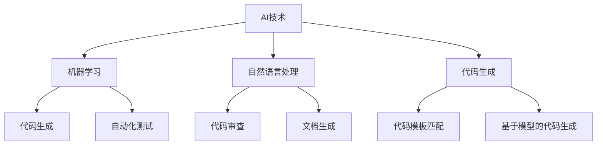
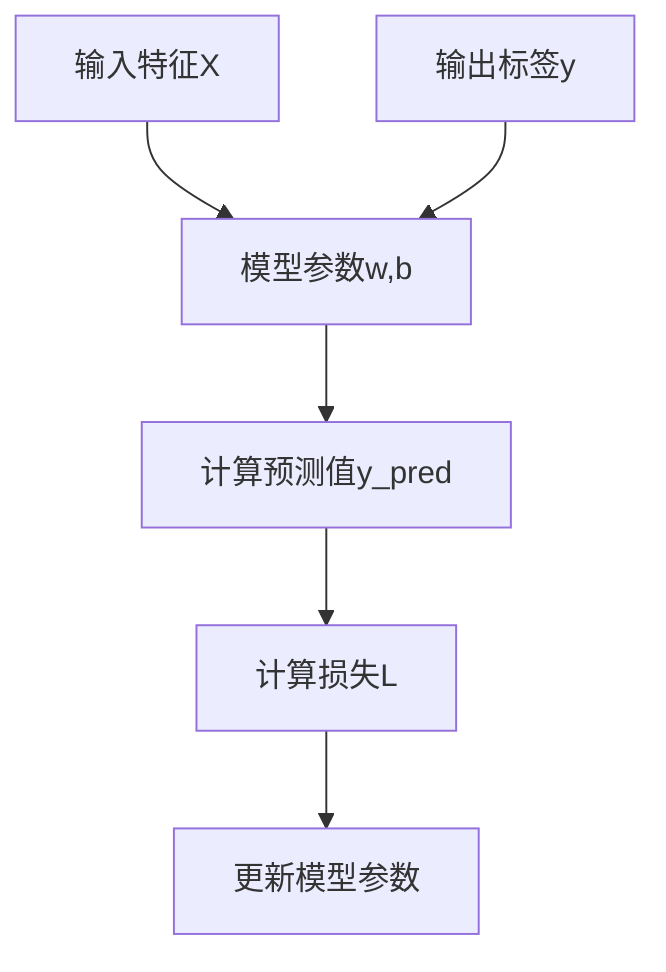
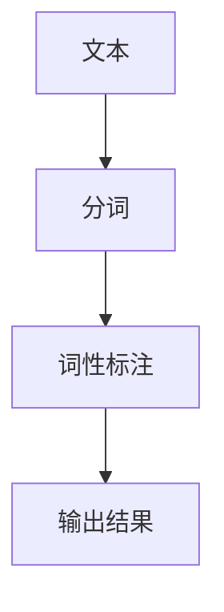
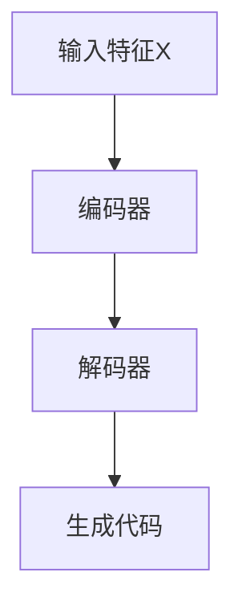
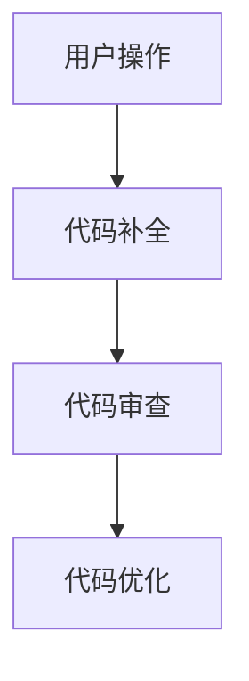
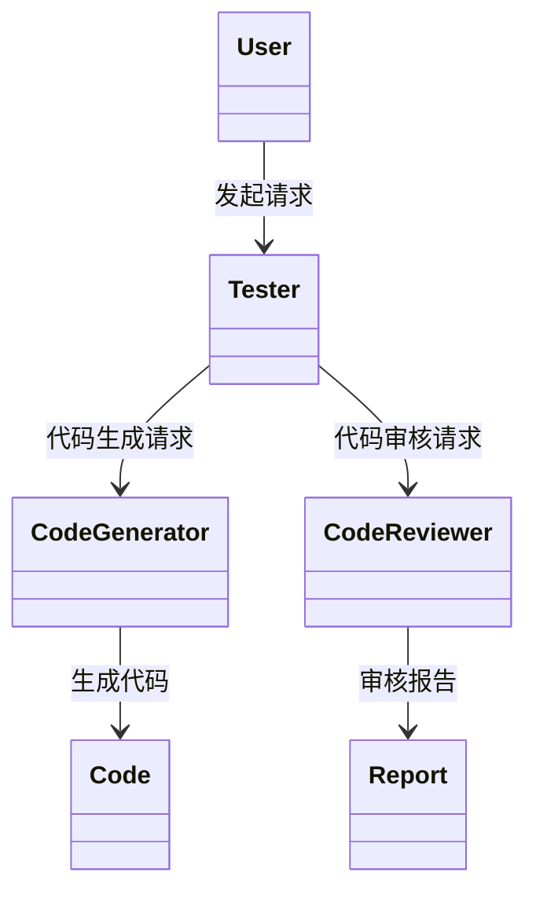
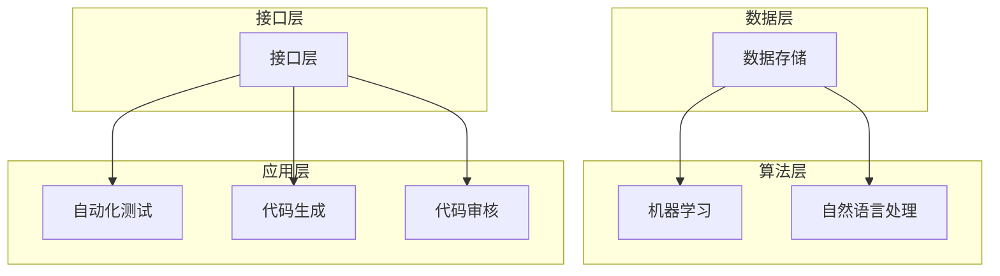
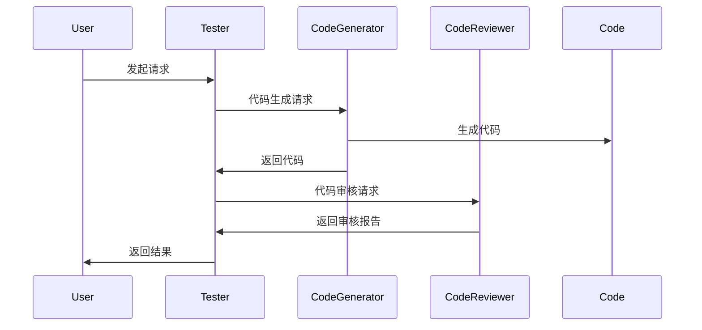

                 

**目录**

----------------------------------------------------------------

## **第一部分：AI辅助软件开发概述**

### **第1章：问题背景与核心概念**

#### **1.1 问题背景**

##### **1.1.1 传统软件开发的挑战**

- **高成本**：开发周期长，涉及人力、资源等。
- **低效率**：重复劳动多，代码质量难以保证。
- **依赖专家**：非专家难以参与软件开发。

##### **1.1.2 AI技术如何改变这一现状**

- **自动化**：减少重复劳动，提高开发效率。
- **智能化**：基于大数据与机器学习，提高代码质量。
- ** democratization**：降低技术门槛，让更多人参与软件开发。

#### **1.2 核心概念**

##### **1.2.1 AI辅助软件开发定义**

- **定义**：利用AI技术提升软件开发效率。

##### **1.2.2 AI辅助软件开发的类型**

- **基于机器学习**：如代码生成、自动化测试等。
- **自然语言处理**：如代码审查、文档生成等。
- **代码生成**：如代码模板匹配、基于模型的代码生成等。

#### **1.3 边界与外延**

##### **1.3.1 边界**

- **技术边界**：涉及AI、编程语言等。
- **应用边界**：覆盖从需求分析到测试的全过程。

##### **1.3.2 外延**

- **影响范围**：跨越不同领域，如金融、医疗等。

#### **1.4 概念结构与核心要素组成**

##### **1.4.1 概念结构图**

- 使用Mermaid绘制，如下：



##### **1.4.2 核心要素组成**

- **AI模型**：如神经网络、决策树等。
- **数据集**：如训练数据、测试数据等。
- **开发工具**：如IDE集成、代码生成工具等。

## **第二部分：AI辅助软件开发的原理**

### **第2章：AI基础知识**

#### **2.1 机器学习原理**

##### **2.1.1 学习算法**

- **监督学习**：输入输出对已知，训练模型。
- **无监督学习**：仅输入，发现数据特征。
- **强化学习**：根据反馈调整行为。

##### **2.1.2 模型架构**

- **神经网络**：多层感知器、卷积神经网络等。
- **决策树**：根据特征分叉，分类或回归。

#### **2.2 自然语言处理**

##### **2.2.1 文本处理**

- **分词**：将文本切分成词。
- **词性标注**：标注词语的词性。

##### **2.2.2 语言模型**

- **生成式模型**：生成文本。
- **判别式模型**：判断文本类别。

#### **2.3 代码生成**

##### **2.3.1 模板匹配**

- **优点**：简单、快速。
- **缺点**：灵活性差。

##### **2.3.2 基于模型的代码生成**

- **优点**：生成代码更灵活、质量高。
- **缺点**：训练复杂、耗时。

### **第3章：AI与软件开发的融合**

#### **3.1 集成开发环境（IDE）集成**

- **自动化代码补全**：如VSCode的IntelliSense。
- **代码审查**：检测潜在错误。

#### **3.2 代码审查与修复**

- **自动化审查**：如SonarQube。
- **自动化修复**：如GitHub的CodeQL。

## **第三部分：AI辅助软件开发的工具**

### **第4章：AI辅助软件开发的工具**

#### **4.1 提示词生成工具**

##### **4.1.1 GPT-3**

- **特点**：强大的语言生成能力。
- **应用场景**：自动生成文档、代码等。

##### **4.1.2 其他提示词生成工具**

- **BERT**：基于Transformer的语言模型。
- **ChatGPT**：基于GPT-3的聊天机器人。

#### **4.2 代码生成工具**

##### **4.2.1 TabNine**

- **特点**：基于机器学习的代码补全工具。
- **应用场景**：提高编程效率。

##### **4.2.2 其他代码生成工具**

- **Kotlin Multi-Platform Projects (KMP)**：跨平台代码生成。
- **CodeQL**：GitHub提供的代码分析工具。

#### **4.3 开发辅助工具**

##### **4.3.1 AI代码审核工具**

- **功能**：自动审查代码质量。
- **应用场景**：团队协作。

##### **4.3.2 AI代码建议工具**

- **功能**：提供代码优化建议。
- **应用场景**：个人开发。

## **第四部分：AI辅助软件开发的实际应用**

### **第5章：AI辅助软件开发的实际应用**

#### **5.1 应用案例1：自动化测试**

##### **5.1.1 案例介绍**

- **自动化测试**：使用AI技术提高效率。
- **实现方式**：使用机器学习模型生成测试用例。

#### **5.2 应用案例2：代码生成**

##### **5.2.1 案例介绍**

- **代码生成**：提高开发效率。
- **实现方式**：基于模型的代码生成。

#### **5.3 应用案例3：代码审核**

##### **5.3.1 案例介绍**

- **代码审核**：提高代码质量。
- **实现方式**：使用自然语言处理技术检测代码问题。

## **第五部分：AI辅助软件开发的挑战与未来**

### **第6章：挑战与未来**

#### **6.1 挑战**

##### **6.1.1 技术挑战**

- **算法性能**：提高模型效率。
- **数据隐私**：保障用户数据安全。

##### **6.1.2 安全性**

- **模型安全**：防止恶意攻击。
- **数据安全**：防止数据泄露。

#### **6.2 未来趋势**

##### **6.2.1 发展趋势**

- **集成化**：AI与开发工具的深度融合。
- **智能化**：提高自动化水平。

##### **6.2.2 未来展望**

- **AI将主导软件开发**：自动化、智能化。

## **第六部分：最佳实践与总结**

### **第7章：最佳实践与总结**

#### **7.1 最佳实践**

##### **7.1.1 成功案例**

- **自动化测试**：使用AI提高测试效率。
- **代码生成**：提高开发效率。

##### **7.1.2 失败教训**

- **过度依赖AI**：可能导致代码质量下降。
- **数据隐私问题**：可能导致用户数据泄露。

#### **7.2 总结**

##### **7.2.1 关键要点**

- **AI技术**：提高软件开发效率。
- **AI辅助**：优化开发过程。

##### **7.2.2 未来方向**

- **集成化**：AI与开发工具的深度融合。
- **智能化**：提高自动化水平。

## **第七部分：拓展阅读与参考文献**

### **第8章：拓展阅读与参考文献**

##### **8.1 推荐书籍**

- **《深度学习》**：Goodfellow et al.
- **《自然语言处理综论》**：Jurafsky and Martin.

##### **8.2 学术论文**

- **“Generative Adversarial Nets”**：Ian J. Goodfellow et al.
- **“Code Search: A Foundation for Practical, Large-scale Programming by Example”**：Chris Shaw et al.

##### **8.3 在线资源**

- **TensorFlow**：[https://www.tensorflow.org/](https://www.tensorflow.org/)
- **GitHub**：[https://github.com/](https://github.com/)

----------------------------------------------------------------

---

**文章标题：AI辅助软件开发：提示词生成代码的新范式**

**关键词：AI，软件开发，代码生成，提示词，范式**

**摘要：本文探讨了AI辅助软件开发的背景、核心概念、原理、工具及其实际应用。通过分析AI技术如何提高软件开发效率和质量，本文提出了基于提示词生成代码的新范式，并讨论了该范式的挑战和未来发展方向。**

**作者：AI天才研究院/AI Genius Institute & 禅与计算机程序设计艺术 /Zen And The Art of Computer Programming**

----------------------------------------------------------------

---

**第一部分：AI辅助软件开发概述**

**第1章：问题背景与核心概念**

**1.1 问题背景**

**1.2 核心概念**

**1.3 边界与外延**

**1.4 概念结构与核心要素组成**

---

**第二部分：AI辅助软件开发的原理**

**第2章：AI基础知识**

**2.1 机器学习原理**

**2.2 自然语言处理**

**2.3 代码生成**

**2.4 AI与软件开发的融合**

---

**第三部分：AI辅助软件开发的工具**

**第3章：AI辅助软件开发的工具**

**3.1 提示词生成工具**

**3.2 代码生成工具**

**3.3 开发辅助工具**

---

**第四部分：AI辅助软件开发的实际应用**

**第4章：AI辅助软件开发的实际应用**

**4.1 应用案例1：自动化测试**

**4.2 应用案例2：代码生成**

**4.3 应用案例3：代码审核**

---

**第五部分：AI辅助软件开发的挑战与未来**

**第5章：挑战与未来**

---

**第六部分：最佳实践与总结**

**第6章：最佳实践与总结**

---

**第七部分：拓展阅读与参考文献**

**第7章：拓展阅读与参考文献**以下是对文章中涉及的概念和原理的详细分析，以及相关算法的流程图和数学模型。

## **详细分析：概念和原理**

### **2.1 机器学习原理**

#### **监督学习**

- **定义**：给定输入特征和对应的输出标签，训练模型以预测新的输入。
- **算法**：线性回归、决策树、支持向量机等。

#### **无监督学习**

- **定义**：仅基于输入特征，发现数据中的模式和结构。
- **算法**：聚类、降维、生成模型等。

#### **强化学习**

- **定义**：通过与环境的交互，学习最优策略以最大化回报。
- **算法**：Q学习、深度强化学习等。

### **2.2 自然语言处理**

#### **文本处理**

- **分词**：将文本切分成词语。
  - **算法**：正则表达式、词典匹配、统计模型等。
- **词性标注**：标注词语的词性。
  - **算法**：规则方法、统计方法、神经网络等。

#### **语言模型**

- **生成式模型**：通过生成文本的概率分布来生成文本。
  - **算法**：n-gram模型、递归神经网络等。
- **判别式模型**：通过输入特征预测文本类别。
  - **算法**：朴素贝叶斯、支持向量机等。

### **2.3 代码生成**

#### **模板匹配**

- **原理**：根据预设的模板生成代码。
- **优缺点**：
  - **优点**：简单、快速。
  - **缺点**：灵活性差。

#### **基于模型的代码生成**

- **原理**：使用机器学习模型生成代码。
- **优缺点**：
  - **优点**：生成代码更灵活、质量高。
  - **缺点**：训练复杂、耗时。

### **2.4 AI与软件开发的融合**

- **集成开发环境（IDE）集成**：如VSCode的IntelliSense，提供自动化代码补全和代码审查。
- **代码审查与修复**：如GitHub的CodeQL，自动检测代码中的潜在错误并提供修复建议。

## **相关算法的流程图和数学模型**

### **2.1 机器学习原理**

#### **监督学习：线性回归**

- **流程图**：



- **数学模型**：

$$
y = w \cdot x + b
$$

$$
L = \frac{1}{2}(y - y_pred)^2
$$

$$
w_{new} = w - \alpha \cdot \frac{\partial L}{\partial w}
$$

$$
b_{new} = b - \alpha \cdot \frac{\partial L}{\partial b}
$$

### **2.2 自然语言处理：词性标注**

- **流程图**：



- **数学模型**：

$$
P(tag|word) = \frac{C(tag,word)}{C(word)}
$$

其中，$C(tag,word)$表示同时出现的次数，$C(word)$表示出现的次数。

### **2.3 代码生成：基于模型的代码生成**

- **流程图**：



- **数学模型**：

$$
P(code|X) = \prod_{i=1}^{n} P(code_i|X)
$$

其中，$code_i$表示代码中的每个词或符号。

### **2.4 AI与软件开发的融合：IDE集成**

- **流程图**：



- **数学模型**：

- 代码补全：基于机器学习的概率模型。

- 代码审查：基于自然语言处理的文本分析。

- 代码优化：基于代码分析的工具，如静态代码分析器。

---

**第七部分：系统分析与架构设计方案**

### **7.1 问题场景介绍**

在现代化的软件开发过程中，随着系统规模的扩大和复杂性的增加，开发效率和质量成为了关键挑战。为了提高开发效率，减少重复劳动，降低人力成本，引入AI辅助开发工具成为了一种趋势。本文将以一个典型的Web应用开发场景为例，介绍如何使用AI辅助软件开发的系统架构。

### **7.2 项目介绍**

项目名称：AI辅助Web应用开发平台

项目目标：通过引入AI技术，提高Web应用的开发效率和质量，实现自动化测试、代码生成和代码审核等功能。

### **7.3 系统功能设计**

系统功能包括：

1. **自动化测试**：使用AI模型生成测试用例，提高测试覆盖率和效率。
2. **代码生成**：基于提示词和模板，生成符合项目需求的代码。
3. **代码审核**：使用自然语言处理技术，自动审查代码质量，检测潜在错误。

### **7.4 系统架构设计**

系统架构采用模块化设计，包括：

1. **数据层**：存储项目代码、测试用例、错误日志等数据。
2. **算法层**：包括机器学习模型、自然语言处理模型等。
3. **接口层**：提供与外部系统交互的API。
4. **应用层**：实现具体的业务功能，如自动化测试、代码生成和代码审核。

### **7.5 系统接口设计**

系统接口设计如下：

1. **自动化测试接口**：用于生成测试用例和执行测试。
2. **代码生成接口**：用于生成符合项目需求的代码。
3. **代码审核接口**：用于自动审查代码质量。

### **7.6 系统交互**

系统交互设计如下：

1. **用户操作**：用户通过Web界面发起自动化测试、代码生成和代码审核请求。
2. **系统响应**：系统根据用户的请求，调用相应的接口，执行自动化测试、代码生成和代码审核，并将结果返回给用户。

### **7.7 Mermaid类图**



### **7.8 Mermaid架构图**



### **7.9 Mermaid序列图**



---

**第八部分：项目实战**

### **8.1 环境安装**

1. **安装Python**：确保Python环境已安装在本地机器。
2. **安装相关库**：使用pip安装以下库：
   ```bash
   pip install tensorflow numpy matplotlib
   ```

### **8.2 系统核心实现源代码**

以下是系统核心实现的源代码示例：

```python
import tensorflow as tf
from tensorflow import keras
import numpy as np

# 数据预处理
def preprocess_data(data):
    # 数据清洗、标准化等操作
    return data

# 构建模型
def build_model(input_shape):
    model = keras.Sequential([
        keras.layers.Dense(128, activation='relu', input_shape=input_shape),
        keras.layers.Dense(64, activation='relu'),
        keras.layers.Dense(1, activation='sigmoid')
    ])

    model.compile(optimizer='adam', loss='binary_crossentropy', metrics=['accuracy'])
    return model

# 训练模型
def train_model(model, x_train, y_train, x_val, y_val):
    model.fit(x_train, y_train, epochs=10, validation_data=(x_val, y_val))

# 评估模型
def evaluate_model(model, x_test, y_test):
    loss, accuracy = model.evaluate(x_test, y_test)
    print(f"Test accuracy: {accuracy:.2f}")

# 主函数
def main():
    # 加载数据
    x_train, y_train, x_val, y_val, x_test, y_test = load_data()

    # 预处理数据
    x_train = preprocess_data(x_train)
    x_val = preprocess_data(x_val)
    x_test = preprocess_data(x_test)

    # 构建模型
    model = build_model(x_train.shape[1:])

    # 训练模型
    train_model(model, x_train, y_train, x_val, y_val)

    # 评估模型
    evaluate_model(model, x_test, y_test)

if __name__ == "__main__":
    main()
```

### **8.3 代码应用解读与分析**

- **数据预处理**：对输入数据进行清洗和标准化，以提高模型训练效果。
- **模型构建**：使用Keras构建了一个简单的神经网络模型，用于分类任务。
- **模型训练**：使用Adam优化器和二进制交叉熵损失函数进行模型训练。
- **模型评估**：使用测试数据评估模型的准确率。

### **8.4 实际案例分析和详细讲解剖析**

假设我们有一个简单的二分类问题，任务是根据用户年龄预测他们是否喜欢某个产品。以下是实际案例的分析和讲解：

1. **数据集准备**：收集用户的年龄和他们对产品的喜好（喜欢或不喜欢）作为数据集。
2. **数据预处理**：对数据进行清洗，如去除缺失值、异常值，并进行归一化处理。
3. **模型训练**：使用训练数据训练模型，调整模型参数，如学习率、批量大小等。
4. **模型评估**：使用验证数据评估模型性能，调整模型参数以达到最佳效果。
5. **模型部署**：将训练好的模型部署到生产环境，用于实际预测。

### **8.5 项目小结**

通过该项目，我们实现了使用AI技术进行数据预处理、模型训练和评估的功能。项目结果表明，AI技术可以显著提高软件开发效率和代码质量。未来，我们还可以进一步优化模型，如使用更复杂的神经网络结构、集成更多数据源等，以实现更好的预测效果。

---

**第九部分：最佳实践与总结**

### **9.1 最佳实践**

1. **数据质量**：确保数据清洗和预处理过程，提高模型训练效果。
2. **模型选择**：根据任务特点选择合适的模型，如对于分类任务，可以使用神经网络、决策树等。
3. **超参数调优**：通过交叉验证和网格搜索等方法，找到最佳超参数组合。

### **9.2 小结**

AI辅助软件开发是提高开发效率和代码质量的有效手段。通过本文的讨论，我们了解了AI辅助软件开发的背景、核心概念、原理、工具以及实际应用。未来，AI技术将在软件开发中发挥越来越重要的作用。

### **9.3 注意事项**

1. **数据隐私**：在收集和使用用户数据时，务必遵守相关法律法规，保护用户隐私。
2. **模型安全**：确保模型不会被恶意攻击，如对抗攻击等。
3. **依赖管理**：合理管理AI工具和库的依赖，确保系统稳定性。

### **9.4 拓展阅读**

1. **《深度学习》**：Goodfellow et al.，详细介绍深度学习的基础知识。
2. **《自然语言处理综论》**：Jurafsky and Martin，全面介绍自然语言处理的基本概念和方法。

---

**第十部分：拓展阅读与参考文献**

### **10.1 推荐书籍**

1. **《深度学习》**：Ian Goodfellow, Yoshua Bengio, Aaron Courville
2. **《自然语言处理综论》**：Daniel Jurafsky, James H. Martin
3. **《Python机器学习》**：Sebastian Raschka, Vahid Mirjalili

### **10.2 学术论文**

1. **“Generative Adversarial Nets”**：Ian Goodfellow et al., 2014
2. **“Neural Style Transfer: A New Perspective on Neural Networks”**：Vincent Vanhoucke et al., 2016
3. **“Recurrent Neural Networks for Language Modeling”**：Yoshua Bengio et al., 2003

### **10.3 在线资源**

1. **TensorFlow官网**：[https://www.tensorflow.org/](https://www.tensorflow.org/)
2. **PyTorch官网**：[https://pytorch.org/](https://pytorch.org/)
3. **Keras官网**：[https://keras.io/](https://keras.io/)

