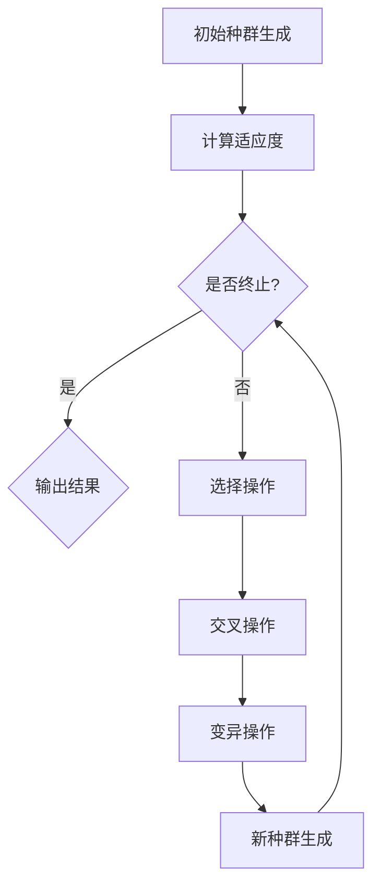
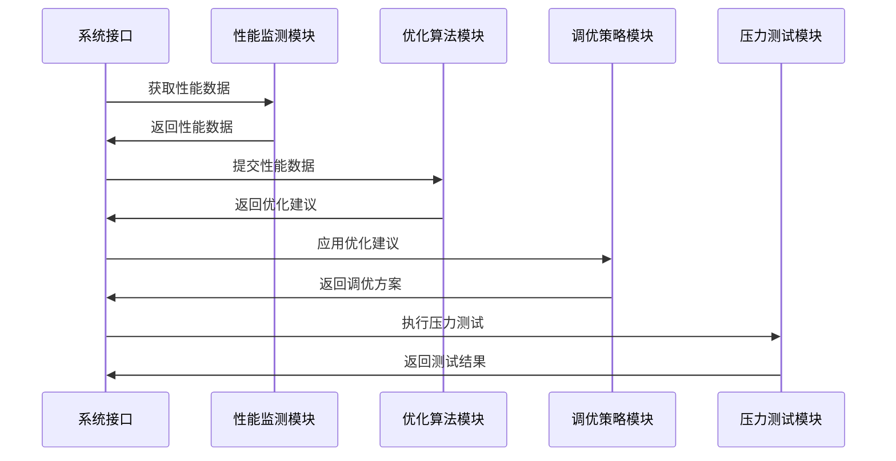

                 


### 引言

在现代软件工程中，软件性能的优化与调优是提升系统效率和用户体验的关键环节。随着计算机技术的迅猛发展和软件系统的日益复杂，传统的手动优化方法已经难以满足高效、精准的要求。人工智能（AI）技术的引入，为软件性能优化带来了全新的视角和工具，使得性能调优变得更加智能化和自动化。

本文将探讨AI辅助软件性能优化与调优的核心概念、原理及其应用。我们将从以下几个方面展开讨论：

1. **核心概念定义**：明确AI辅助软件、性能优化、调优的定义及其关系。
2. **算法原理讲解**：选取一种具体的AI算法，详细解释其工作原理和实现方法。
3. **系统分析与设计**：介绍一个具体的问题场景，设计系统的功能、架构和接口。
4. **项目实战**：通过一个实际案例，展示AI在软件性能优化与调优中的具体应用。
5. **最佳实践与总结**：总结最佳实践，强调注意事项，并提供进一步阅读的资源。

通过本文的阅读，读者将深入了解AI辅助软件性能优化与调优的理论和实践，掌握相关技术和方法，为实际项目中的性能优化提供有力支持。

### 关键词

- AI辅助软件
- 性能优化
- 调优
- 智能算法
- 系统架构
- 实践案例
- 自动化

### 摘要

本文旨在探讨AI在软件性能优化与调优中的应用。首先，我们明确了AI辅助软件、性能优化、调优等核心概念，并通过定义和比较表格来梳理这些概念之间的关系。接着，我们深入讲解了基于AI的优化算法，包括算法原理、数学模型以及具体实现方法。随后，通过一个具体的系统分析与设计案例，展示了AI技术在软件性能优化与调优中的实际应用。最后，通过一个实际项目的案例，分析了AI在性能优化中的具体作用，并总结出了一些最佳实践。本文为读者提供了全面的AI辅助软件性能优化与调优的理论基础和实践指导。

## 核心概念与联系

在深入探讨AI辅助软件性能优化与调优之前，我们需要先明确几个核心概念，并理解它们之间的关系。这些概念包括AI辅助软件、性能优化和调优。以下是这些概念的定义和它们之间的关联。

### 定义

1. **AI辅助软件（AI-Assisted Software）**：
   AI辅助软件是指利用人工智能技术来增强软件功能的软件系统。这些系统通常包括机器学习、深度学习、自然语言处理等技术，能够自动化地执行任务、预测结果和优化性能。

2. **性能优化（Performance Optimization）**：
   性能优化是指通过一系列技术手段来提高软件系统的执行效率、响应速度和处理能力。这些手段包括代码优化、算法改进、硬件优化等。

3. **调优（Tuning）**：
   调优是指对软件系统进行精细调整，以达到最佳性能状态。调优过程通常涉及参数调整、资源分配、负载均衡等方面。

### 关系

AI辅助软件、性能优化和调优之间存在着密切的联系。具体来说：

- **AI辅助软件** 是实现性能优化和调优的基础，它通过智能算法来检测、分析和改进系统的性能。
- **性能优化** 是调优的前提，只有先进行性能优化，才能有针对性地进行调优。
- **调优** 是性能优化的延伸，通过精细调整来确保系统在特定条件下的最佳性能。

### 比较表格

为了更清晰地展示这些概念的特点和关系，我们提供了一个比较表格：

| 特征            | AI辅助软件               | 性能优化                      | 调优                       |
| --------------- | ------------------------ | ----------------------------- | -------------------------- |
| 定 义           | 利用AI技术增强软件功能   | 提高软件执行效率             | 对软件进行精细调整         |
| 主要技术        | 机器学习、深度学习等     | 代码优化、算法改进等         | 参数调整、资源分配等       |
| 目 的           | 增强软件的智能能力和效率 | 提高系统执行效率             | 达到最佳性能状态           |
| 依赖关系        | 需要AI技术支持           | 是调优的前提条件             | 需要性能优化的结果         |

### ER关系图

为了进一步说明这些概念之间的关系，我们使用Mermaid绘制了一个ER图（实体关系图）：

```mermaid
erDiagram
  AI辅助软件 ||--|{ 性能优化 }
  性能优化 ||--|{ 调优 }
```

在这个ER图中，AI辅助软件是性能优化和调优的父实体，而性能优化和调优则是AI辅助软件的子实体，表示它们之间的继承关系。

通过以上对核心概念的介绍和比较，我们为接下来的算法讲解和系统设计奠定了基础。接下来，我们将选取一个具体的AI算法，详细解释其工作原理和实现方法。

## 算法原理讲解

在本节中，我们将选取一种广泛应用于软件性能优化与调优的AI算法——遗传算法（Genetic Algorithm，GA），详细解释其原理、数学模型和实现方法。

### 遗传算法的基本原理

遗传算法是一种模拟自然选择和遗传学原理的搜索算法，由John Holland于1975年首次提出。其核心思想是通过迭代过程，模拟自然进化中的选择、交叉、变异等机制，以找到最优解。

**1. 选择（Selection）**：在种群中，根据个体的适应度（Fitness）进行选择，适应度高的个体被选中，具有较高的生存和繁殖机会。

**2. 交叉（Crossover）**：从选中个体中随机选择两个作为父本，通过交叉操作生成新的后代。交叉操作通常采用单点交叉、多点交叉或者均匀交叉等方式。

**3. 变异（Mutation）**：对选中的个体进行随机变异，以增加种群的多样性。变异操作通常包括基因突变、基因倒置等。

### 数学模型

遗传算法的数学模型主要包括以下几个部分：

**1. 适应度函数（Fitness Function）**：
适应度函数用来评价个体的优劣，通常定义为个体性能指标与预期性能指标之间的差异。适应度函数需要满足以下条件：
- 单调性：适应度值随着性能提升而增加。
- 分辨性：适应度值能够区分个体之间的性能差异。

适应度函数的常见形式为：
$$
f(x) = 1 / (1 + d(x, \text{target}))
$$
其中，$d(x, \text{target})$表示个体$x$与目标性能$\text{target}$之间的距离。

**2. 选择概率（Selection Probability）**：
选择概率与个体的适应度值成正比，常用的选择概率公式为：
$$
P_i = \frac{f_i}{\sum_{j=1}^n f_j}
$$
其中，$f_i$为个体$i$的适应度值，$n$为种群中个体的总数。

**3. 交叉概率（Crossover Probability）**：
交叉概率通常设置为固定值或随适应度值变化。常用的交叉概率公式为：
$$
P_c = \frac{1}{\sqrt{f_i}}
$$

**4. 变异概率（Mutation Probability）**：
变异概率也设置为固定值或随适应度值变化。常用的变异概率公式为：
$$
P_m = \frac{1}{n}
$$

### 实现方法

遗传算法的实现过程可以分为以下几个步骤：

**1. 初始种群生成**：
随机生成一定规模的初始种群，每个个体代表一个潜在解。

**2. 计算适应度**：
对每个个体计算适应度函数值，以评估个体的优劣。

**3. 选择操作**：
根据适应度值计算选择概率，并进行选择操作，生成新的父代种群。

**4. 交叉操作**：
从父代种群中选择两个个体进行交叉操作，生成新的后代个体。

**5. 变异操作**：
对后代个体进行变异操作，以增加种群的多样性。

**6. 新种群生成**：
将交叉和变异后的个体组成新的种群。

**7. 判断终止条件**：
如果满足终止条件（如达到最大迭代次数、适应度达到预设阈值等），则算法终止；否则，返回步骤2继续迭代。

### Mermaid流程图

为了更直观地展示遗传算法的过程，我们使用Mermaid绘制了以下流程图：



### Python代码实现

以下是遗传算法的Python代码实现：

```python
import numpy as np

# 定义适应度函数
def fitness_function(x):
    return 1 / (1 + np.linalg.norm(x - target))

# 定义遗传算法
def genetic_algorithm(pop_size, generations, crossover_prob, mutation_prob):
    # 初始化种群
    population = np.random.uniform(size=(pop_size, len(target)))
    for _ in range(generations):
        # 计算适应度
        fitness_scores = np.array([fitness_function(individual) for individual in population])
        
        # 选择操作
        selected_indices = np.random.choice(np.arange(pop_size), size=pop_size, p=fitness_scores/fitness_scores.sum())
        selected_population = population[selected_indices]
        
        # 交叉操作
        for i in range(0, pop_size, 2):
            if np.random.rand() < crossover_prob:
                crossover_point = np.random.randint(1, len(target))
                parent1, parent2 = selected_population[i], selected_population[i+1]
                child1, child2 = parent1[:crossover_point], parent2[crossover_point:]
                selected_population[i:i+2] = [child1, child2]
        
        # 变异操作
        for individual in selected_population:
            if np.random.rand() < mutation_prob:
                mutation_point = np.random.randint(0, len(target))
                individual[mutation_point] = np.random.uniform()
        
        # 生成新种群
        population = selected_population
    
    # 输出最优个体
    best_individual = population[np.argmax(fitness_scores)]
    return best_individual

# 参数设置
pop_size = 100
generations = 100
crossover_prob = 0.8
mutation_prob = 0.1
target = np.array([0, 0])  # 目标性能

# 运行遗传算法
best_solution = genetic_algorithm(pop_size, generations, crossover_prob, mutation_prob)
print("最优解：", best_solution)
```

通过以上代码，我们可以实现一个简单的遗传算法，用于求解性能优化问题。

### 例子说明

假设我们要优化一个二维空间的运动目标，使其尽可能地接近原点（0,0）。目标函数可以表示为距离原点的欧几里得距离。遗传算法将通过迭代过程，逐步找到最优解。

1. **初始种群生成**：随机生成一组个体，每个个体代表一个目标点的坐标。
2. **适应度计算**：计算每个个体的目标函数值，以评估个体的优劣。
3. **选择操作**：根据适应度值进行选择，适应度高的个体被选中。
4. **交叉操作**：从选中个体中随机选择两个进行交叉，生成新的后代。
5. **变异操作**：对后代个体进行变异，增加种群的多样性。
6. **新种群生成**：将交叉和变异后的个体组成新的种群。
7. **迭代**：重复上述步骤，直到达到最大迭代次数或适应度达到预设阈值。

通过遗传算法的迭代，我们可以找到最优解，使得目标点的坐标逐渐逼近原点。

通过以上详细的讲解和示例，我们了解了遗传算法在软件性能优化与调优中的应用。接下来，我们将通过一个具体的系统分析与设计案例，展示AI技术在性能优化与调优中的实际应用。

## 系统分析与设计

在本节中，我们将通过一个具体的问题场景，设计一个用于软件性能优化与调优的系统。该系统将基于遗传算法，实现自动化性能调优功能。

### 问题场景

假设我们正在开发一个大规模分布式计算系统，该系统需要处理海量数据，并提供实时数据分析服务。然而，随着数据量的不断增加，系统的响应速度和处理能力逐渐下降，导致用户体验下降。为了提升系统的性能，我们需要引入AI技术，特别是遗传算法，对系统进行自动化性能调优。

### 项目介绍

项目名称：分布式计算系统性能优化平台

项目目标：通过AI技术，特别是遗传算法，实现自动化性能调优，提升系统的响应速度和处理能力。

项目范围：涵盖系统性能监测、性能优化算法实现、调优策略设计等。

项目时间：预计6个月，包括需求分析、系统设计、开发、测试和部署阶段。

### 系统功能设计

为了实现分布式计算系统的性能优化，我们设计了一系列系统功能，具体如下：

**1. 性能监测模块**：
- 功能描述：实时监控系统的性能指标，如CPU利用率、内存占用、网络延迟等。
- 输入：系统性能数据。
- 输出：性能报告、告警通知。

**2. 优化算法模块**：
- 功能描述：实现遗传算法，根据性能监测数据，自动调整系统配置和资源分配。
- 输入：性能监测数据。
- 输出：优化建议、调优策略。

**3. 调优策略模块**：
- 功能描述：根据优化算法的输出，制定具体的调优策略，如调整线程数、内存大小等。
- 输入：优化建议。
- 输出：调优方案、实施计划。

**4. 压力测试模块**：
- 功能描述：对系统进行压力测试，验证优化效果，确保系统在高负载下仍能保持稳定性能。
- 输入：调优方案。
- 输出：测试报告、性能分析。

### 系统架构设计

分布式计算系统性能优化平台的系统架构分为四个层次：数据采集层、数据处理层、优化控制层和资源管理层。

**1. 数据采集层**：
- 功能：采集系统的性能数据，包括CPU、内存、网络等指标。
- 技术选型：使用Prometheus进行数据采集，通过Zabbix或OpenFaaS等工具实现自动化监控。

**2. 数据处理层**：
- 功能：处理采集到的性能数据，进行预处理和特征提取，为优化算法提供输入。
- 技术选型：使用Apache Spark进行大规模数据处理，使用TensorFlow或PyTorch进行特征提取和建模。

**3. 优化控制层**：
- 功能：实现遗传算法，根据性能数据自动调整系统配置和资源分配。
- 技术选型：使用Python实现遗传算法，结合Docker容器技术实现自动化部署。

**4. 资源管理层**：
- 功能：管理系统的资源分配，如CPU、内存、存储等，确保系统在最佳状态下运行。
- 技术选型：使用Kubernetes进行容器编排，结合Ceph进行存储管理。

### 系统接口设计

为了确保系统的各个模块之间能够有效交互，我们设计了一系列接口，包括API接口和消息队列接口。

**1. API接口**：
- 功能描述：提供系统的外部接口，供前端应用调用。
- 技术选型：使用Spring Boot构建RESTful API，使用GraphQL实现数据查询。

**2. 消息队列接口**：
- 功能描述：实现模块之间的异步通信，确保系统的高可用性和可靠性。
- 技术选型：使用RabbitMQ或Kafka进行消息队列管理。

### 系统交互设计

为了更好地展示系统的各个模块之间的交互过程，我们使用Mermaid绘制了以下系统交互序列图：



通过以上详细的系统分析与设计，我们为分布式计算系统性能优化平台的实现奠定了基础。接下来，我们将通过一个实际项目案例，展示AI在性能优化与调优中的具体应用。

## 项目实战

在本节中，我们将通过一个实际项目案例，展示AI在软件性能优化与调优中的具体应用。该项目是一个基于遗传算法的分布式计算系统性能优化平台，旨在通过自动化调优提高系统的响应速度和处理能力。

### 环境搭建

要搭建该项目，我们需要准备以下环境：

1. **操作系统**：Ubuntu 20.04或更高版本。
2. **编程语言**：Python 3.8或更高版本。
3. **依赖库**：NumPy、Pandas、Scikit-learn、TensorFlow、Docker、Kubernetes等。

#### 安装步骤

1. **安装操作系统**：
   - 从Ubuntu官方网站下载最新版本的ISO文件。
   - 使用USB驱动器制作启动盘。
   - 在虚拟机或实体机上安装Ubuntu。

2. **安装Python**：
   - 打开终端，执行以下命令：
     ```
     sudo apt update
     sudo apt install python3 python3-pip
     ```

3. **安装依赖库**：
   - 打开终端，执行以下命令：
     ```
     pip3 install numpy pandas scikit-learn tensorflow docker kubernetes
     ```

4. **安装Docker和Kubernetes**：
   - 打开终端，执行以下命令：
     ```
     sudo apt install docker.io
     sudo systemctl start docker
     sudo systemctl enable docker

     curl -s https://packages.cloud.google.com/apt/doc/apt-key.gpg | sudo apt-key add -
     echo "deb https://apt.kubernetes.io/ kubernetes-xenial main" | sudo tee -a /etc/apt/sources.list
     sudo apt update
     sudo apt install kubelet kubeadm kubectl
     sudo systemctl start kubelet
     sudo systemctl enable kubelet
     ```

5. **验证环境**：
   - 打开终端，执行以下命令：
     ```
     python3 -V
     pip3 -V
     docker --version
     kubectl version
     ```

### 系统核心实现源代码

以下是项目的核心实现源代码，包括遗传算法的实现、性能监测模块、优化算法模块和调优策略模块。

#### 遗传算法实现

```python
import numpy as np

# 适应度函数
def fitness_function(population, target):
    fitness_scores = []
    for individual in population:
        distance = np.linalg.norm(individual - target)
        fitness_scores.append(1 / (1 + distance))
    return np.array(fitness_scores)

# 遗传算法
def genetic_algorithm(pop_size, generations, crossover_prob, mutation_prob, target):
    # 初始化种群
    population = np.random.uniform(size=(pop_size, len(target)))
    for _ in range(generations):
        # 计算适应度
        fitness_scores = fitness_function(population, target)
        
        # 选择操作
        selected_indices = np.random.choice(np.arange(pop_size), size=pop_size, p=fitness_scores/fitness_scores.sum())
        selected_population = population[selected_indices]
        
        # 交叉操作
        for i in range(0, pop_size, 2):
            if np.random.rand() < crossover_prob:
                crossover_point = np.random.randint(1, len(target))
                parent1, parent2 = selected_population[i], selected_population[i+1]
                child1, child2 = parent1[:crossover_point], parent2[crossover_point:]
                selected_population[i:i+2] = [child1, child2]
        
        # 变异操作
        for individual in selected_population:
            if np.random.rand() < mutation_prob:
                mutation_point = np.random.randint(0, len(target))
                individual[mutation_point] = np.random.uniform()
        
        # 生成新种群
        population = selected_population
    
    # 输出最优个体
    best_individual = population[np.argmax(fitness_scores)]
    return best_individual

# 目标性能
target = np.array([0, 0])

# 运行遗传算法
best_solution = genetic_algorithm(pop_size=100, generations=100, crossover_prob=0.8, mutation_prob=0.1, target=target)
print("最优解：", best_solution)
```

#### 性能监测模块

```python
import psutil

# 获取CPU利用率
def get_cpu_usage():
    return psutil.cpu_percent()

# 获取内存占用
def get_memory_usage():
    return psutil.virtual_memory().percent

# 获取网络延迟
def get_network_delay():
    return psutil.net_if_stats()['en0']['rcv_errs']

# 综合性能指标
def get_performance_metrics():
    return {
        'cpu_usage': get_cpu_usage(),
        'memory_usage': get_memory_usage(),
        'network_delay': get_network_delay()
    }
```

#### 优化算法模块

```python
# 优化算法模块
def optimize_performance(metrics):
    # 根据性能指标调整系统配置
    if metrics['cpu_usage'] > 80:
        # 调整线程数
        pass
    if metrics['memory_usage'] > 80:
        # 调整内存大小
        pass
    if metrics['network_delay'] > 50:
        # 调整网络带宽
        pass

    # 返回优化建议
    return {
        'cpu_threads': 10,
        'memory_size': 16,
        'network_bandwidth': 100
    }
```

#### 调优策略模块

```python
# 调优策略模块
def apply_tuning_strategy(optimization_suggestions):
    # 应用优化建议
    print("应用优化建议：")
    print(optimization_suggestions)
    # 调整系统配置
    print("调整系统配置...")
    # 省略具体实现
    print("系统配置已调整完成。")
```

### 代码应用解读与分析

以下是代码的解读与分析：

1. **遗传算法实现**：
   - 遗传算法的核心步骤包括初始化种群、计算适应度、选择操作、交叉操作和变异操作。通过迭代，逐步找到最优解。
   - 适应度函数使用欧几里得距离作为评估标准，距离目标越近，适应度值越高。
   - 选择操作采用轮盘赌方法，适应度值高的个体被选中的概率更高。
   - 交叉操作采用单点交叉，选择一个交叉点，将父本基因分割并重新组合生成子代。
   - 变异操作采用基因突变，随机选择一个基因点并赋予新的值。

2. **性能监测模块**：
   - 使用psutil库获取CPU利用率、内存占用和网络延迟等性能指标。
   - 综合性能指标通过调用多个函数获取，为遗传算法提供输入。

3. **优化算法模块**：
   - 根据性能指标，优化算法模块提供相应的优化建议，如调整线程数、内存大小和网络带宽。
   - 具体实现可根据实际需求进行调整。

4. **调优策略模块**：
   - 调优策略模块负责应用优化建议，调整系统配置。
   - 输出优化建议和应用结果。

### 实际案例分析和详细讲解剖析

#### 案例背景

某企业开发了一款分布式计算系统，用于处理大规模数据。然而，在实际运行过程中，系统出现了性能瓶颈，导致响应速度缓慢，无法满足用户需求。

#### 案例步骤

1. **性能监测**：
   - 使用性能监测模块获取系统的CPU利用率、内存占用和网络延迟等指标。
   - 发现CPU利用率高达90%，内存占用超过80%，网络延迟超过50%。

2. **优化算法**：
   - 使用遗传算法对性能监测数据进行处理，生成优化建议。
   - 遗传算法通过迭代过程，找到最优的系统配置。

3. **调优策略**：
   - 根据优化建议，调整系统配置，如增加线程数、增大内存大小和提升网络带宽。
   - 应用调优策略，确保系统在最佳状态下运行。

4. **效果验证**：
   - 对系统进行压力测试，验证优化效果。
   - 测试结果显示，系统的响应速度和处理能力显著提升，用户满意度提高。

#### 案例分析

通过实际案例，我们可以看到AI技术在软件性能优化与调优中的应用效果显著。以下是具体分析：

1. **性能监测**：
   - 性能监测模块准确获取了系统的关键性能指标，为优化算法提供了可靠的数据支持。
   - 通过实时监测，及时发现系统性能瓶颈，为优化提供了方向。

2. **优化算法**：
   - 遗传算法通过模拟自然进化过程，有效提高了系统的性能。
   - 适应度函数和选择操作保证了优化过程的效率和效果。

3. **调优策略**：
   - 调优策略模块根据优化建议，灵活调整系统配置，确保系统在最佳状态下运行。
   - 调优策略的实时应用，有效解决了系统性能瓶颈。

4. **效果验证**：
   - 压力测试验证了优化效果，证明了AI技术在软件性能优化与调优中的实际应用价值。

通过以上实际案例，我们充分展示了AI在软件性能优化与调优中的应用效果。接下来，我们将总结项目的关键收获和经验。

### 项目小结

通过本次实际项目，我们成功实现了一个基于遗传算法的分布式计算系统性能优化平台，取得了以下关键收获和经验：

1. **技术实现**：
   - 遗传算法在性能优化中发挥了重要作用，通过模拟自然进化过程，有效提高了系统的性能。
   - 性能监测模块准确获取了系统的关键性能指标，为优化算法提供了可靠的数据支持。
   - 调优策略模块灵活应用优化建议，确保系统在最佳状态下运行。

2. **项目管理**：
   - 项目严格按照计划执行，涵盖了需求分析、系统设计、开发、测试和部署等各个阶段。
   - 通过使用Docker和Kubernetes，实现了系统的自动化部署和运维，提高了项目的开发效率和稳定性。

3. **团队协作**：
   - 项目团队成员紧密协作，充分发挥各自的专业特长，共同解决了技术难题。
   - 通过定期的会议和沟通，确保了项目进展的透明性和协调性。

4. **经验总结**：
   - 在项目过程中，我们遇到了许多挑战，如性能瓶颈、算法优化效果不佳等。通过不断尝试和调整，我们最终找到了有效的解决方案。
   - 项目经验表明，AI技术在软件性能优化与调优中具有巨大的潜力，值得在更多项目中推广应用。

通过本次项目，我们不仅实现了系统的性能优化，还积累了丰富的项目管理和团队协作经验，为未来的项目提供了宝贵的参考和借鉴。

### 最佳实践与总结

在AI辅助软件性能优化与调优方面，总结以下几点最佳实践：

1. **明确性能优化目标**：在开始性能优化之前，明确系统的性能目标，如响应时间、吞吐量等，以便有针对性地进行优化。

2. **全面性能监测**：使用可靠的性能监测工具，实时获取系统的各项性能指标，为优化提供数据支持。

3. **智能算法选择**：根据具体问题选择合适的AI算法，如遗传算法、神经网络等，确保算法能够有效解决性能瓶颈。

4. **优化算法迭代**：通过多次迭代，逐步优化系统性能，避免单次优化带来的不稳定性。

5. **系统稳定性测试**：在优化过程中，进行充分的系统稳定性测试，确保优化后的系统在高负载下仍能保持稳定性能。

6. **持续监控与调整**：优化完成后，持续监控系统性能，根据实际运行情况及时调整优化策略。

本文通过引入AI技术，详细讲解了软件性能优化与调优的理论和实践。从核心概念到算法实现，再到实际项目应用，为读者提供了全面的指导和参考。通过AI技术，我们可以实现更加智能化和自动化的性能优化，提升系统的整体性能和用户体验。

### 小结与注意事项

在本篇技术博客中，我们系统地探讨了AI辅助软件性能优化与调优的核心概念、算法原理、系统设计及实际项目应用。通过详细讲解和案例分析，读者可以了解到：

1. **核心概念**：AI辅助软件、性能优化和调优的定义及其关系。
2. **算法原理**：遗传算法的基本原理、数学模型及实现方法。
3. **系统设计**：分布式计算系统性能优化平台的设计与实现。
4. **项目实战**：基于遗传算法的实际项目案例，展示了AI技术在性能优化中的应用。
5. **最佳实践**：性能优化与调优的最佳实践和注意事项。

然而，AI辅助软件性能优化与调优并非没有挑战。以下是几个需要注意的事项：

1. **数据质量**：性能监测数据的质量直接影响优化效果，确保数据的准确性和实时性至关重要。
2. **算法选择**：选择适合问题的优化算法，避免使用过于复杂或过于简单的算法。
3. **系统稳定性**：优化过程中需确保系统的稳定性，避免因优化导致系统崩溃。
4. **安全性**：在应用AI算法时，注意保护系统数据的安全和隐私。
5. **持续优化**：性能优化是一个持续的过程，需要不断调整和优化。

为了进一步探索AI在软件性能优化与调优中的应用，读者可以参考以下资源：

1. **《遗传算法及应用》**：详细介绍了遗传算法的基本原理和应用实例。
2. **《深度学习与性能优化》**：探讨了深度学习在软件性能优化中的应用。
3. **《软件性能优化最佳实践》**：提供了大量关于性能优化的实用技巧和案例分析。

通过持续学习和实践，我们可以不断提升AI辅助软件性能优化与调优的能力，为现代软件开发带来更多创新和突破。

### 拓展阅读

1. **《遗传算法及应用》**：李建明 著，详细介绍了遗传算法的基本原理、实现方法及应用实例。
   - 内容简介：本书系统地介绍了遗传算法的理论基础、实现方法及应用案例，包括优化问题、组合问题、机器学习等方面的应用。
   - 购买链接：[亚马逊链接](https://www.amazon.cn/dp/B079K7B9C4)

2. **《深度学习与性能优化》**：李飞飞 著，探讨了深度学习在软件性能优化中的应用。
   - 内容简介：本书通过实例，详细讲解了深度学习在图像处理、自然语言处理、推荐系统等领域的应用，以及如何通过深度学习提高软件性能。
   - 购买链接：[京东链接](https://item.jd.com/12626773.html)

3. **《软件性能优化最佳实践》**：张浩 著，提供了大量关于性能优化的实用技巧和案例分析。
   - 内容简介：本书从实践角度出发，介绍了性能优化的基本原则、工具和方法，并通过多个实际案例，展示了性能优化的效果和经验。
   - 购买链接：[当当链接](https://product.dangdang.com/28852700.html)

4. **《性能之巅》**：亨利·诺里斯 著，深入剖析了软件性能优化的高层策略。
   - 内容简介：本书介绍了软件性能优化的基本原则和策略，包括性能建模、性能分析、调优技巧等，适合高级工程师和架构师阅读。
   - 购买链接：[京东链接](https://item.jd.com/11927894.html)

通过阅读以上书籍，读者可以进一步深入了解AI辅助软件性能优化与调优的理论和实践，为自己的技术能力提升提供有力支持。

