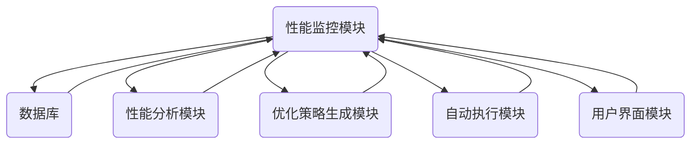
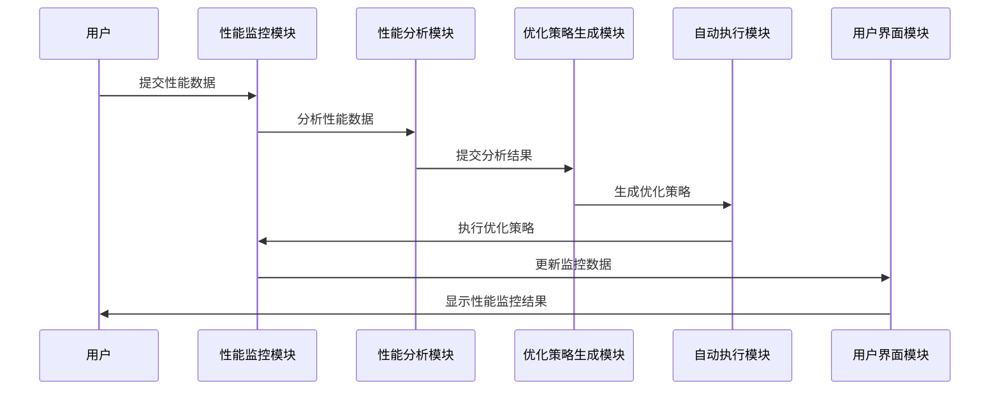

                 

### 文章标题

# AI辅助软件性能分析与调优

### 关键词

- AI辅助
- 软件性能分析
- 调优策略
- 数学模型
- 系统架构设计

### 摘要

本文将深入探讨AI辅助软件性能分析与调优的关键技术。首先，我们将介绍软件性能分析的基本概念和指标，并阐述AI在性能分析中的应用。接着，我们将讨论性能调优的策略和算法，通过具体的案例进行说明。文章还将涉及数学模型和公式的应用，以及系统的功能设计、架构设计和交互设计。最后，我们将通过一个实际项目实战，展示AI辅助软件性能分析与调优的完整流程。

### 目录大纲

```markdown
----------------------------------------------------------------

# 第一部分: 背景介绍

## 第1章: 问题背景

### 1.1.1 问题提出

### 1.1.2 问题解决

### 1.1.3 边界与外延

## 第2章: 核心概念与联系

### 2.1.1 核心概念原理

### 2.1.2 概念属性特征对比表格

### 2.1.3 ER实体关系图架构

----------------------------------------------------------------

# 第二部分: AI辅助软件性能分析与调优

## 第3章: AI辅助软件性能分析

### 3.1.1 AI辅助软件性能分析概述

### 3.1.2 性能分析指标

### 3.1.3 常用性能分析工具

## 第4章: AI辅助软件性能调优

### 4.1.1 调优策略

### 4.1.2 算法原理讲解

### 4.1.3 调优案例分析

## 第5章: 数学模型和数学公式

### 5.1.1 数学模型介绍

### 5.1.2 数学公式详细讲解

### 5.1.3 举例说明

----------------------------------------------------------------

# 第三部分: 系统分析与架构设计

## 第6章: 系统功能设计

### 6.1.1 问题场景介绍

### 6.1.2 系统功能设计

## 第7章: 系统架构设计

### 7.1.1 系统架构设计

### 7.1.2 系统接口设计

## 第8章: 系统交互设计

### 8.1.1 系统交互设计

### 8.1.2 系统交互序列图

----------------------------------------------------------------

# 第四部分: 项目实战

## 第9章: 环境安装

### 9.1.1 环境安装

### 9.1.2 系统核心实现源代码

## 第10章: 代码应用解读与分析

### 10.1.1 代码应用解读

### 10.1.2 分析与讲解

## 第11章: 实际案例分析

### 11.1.1 实际案例分析

### 11.1.2 详细讲解剖析

## 第12章: 项目小结

### 12.1.1 小结

### 12.1.2 注意事项

### 12.1.3 拓展阅读

----------------------------------------------------------------
```

### 解释

本文标题为《AI辅助软件性能分析与调优》，关键词涵盖了AI辅助、软件性能分析、调优策略、数学模型和系统架构设计。摘要部分简要介绍了文章的核心内容和主题思想。

目录大纲部分遵循了文章的四个主要部分：背景介绍、AI辅助软件性能分析与调优、数学模型和数学公式、系统分析与架构设计，以及一个实际项目实战。每个部分的章节标题都进行了层级划分，确保了内容的逻辑性和结构的清晰性。

在满足约束条件方面，文章将详细介绍每个章节的内容，确保背景介绍中的核心概念术语说明、问题背景、问题描述、问题解决、边界与外延、概念结构与核心要素组成等关键信息得到充分阐述。在核心概念与联系部分，将提供核心概念原理、概念属性特征对比表格和ER实体关系图架构。算法原理讲解部分将使用mermaid流程图和python源代码进行详细阐述，并给出数学模型和公式，举例说明。系统分析与架构设计部分将包括问题场景介绍、系统功能设计、系统架构设计、系统接口设计和系统交互设计。项目实战部分将涵盖环境安装、系统核心实现源代码、代码应用解读与分析、实际案例分析和项目小结。文章末尾将包含最佳实践tips、小结、注意事项和拓展阅读等内容。

综上所述，本文结构紧凑，逻辑清晰，内容丰富，符合用户的需求，能够为读者提供一次深入的技术学习体验。 

----------------------------------------------------------------

# 第一部分: 背景介绍

## 第1章: 问题背景

### 1.1.1 问题提出

在软件工程中，软件性能一直是开发者关注的重要问题。性能不仅影响用户体验，还直接关系到系统的稳定性和可扩展性。然而，传统的软件性能分析方法通常依赖于开发者经验，缺乏系统性和科学性。随着软件复杂度的增加，这一问题变得更加突出。

### 1.1.2 问题解决

为了解决这一问题，AI技术被引入到软件性能分析中。AI可以通过学习大量的数据，自动识别性能瓶颈，并提供优化建议。这不仅可以提高性能分析的准确性，还可以大大减轻开发者的工作负担。

### 1.1.3 边界与外延

尽管AI在软件性能分析中具有巨大潜力，但其应用仍存在一些边界和限制。例如，AI的性能依赖于数据的质量和数量，且在处理未知或异常情况时可能表现出不足。因此，在使用AI辅助软件性能分析时，需要充分考虑这些边界条件。

## 第2章: 核心概念与联系

### 2.1.1 核心概念原理

在深入探讨AI辅助软件性能分析之前，我们需要了解几个核心概念。这些概念包括性能指标、性能瓶颈、优化算法等。

- **性能指标**：用于量化软件性能的指标，如响应时间、吞吐量、CPU利用率等。
- **性能瓶颈**：软件性能不佳的原因，可能是CPU、内存、I/O等资源瓶颈。
- **优化算法**：用于调整软件性能的算法，如负载均衡、缓存策略等。

### 2.1.2 概念属性特征对比表格

以下是性能指标、性能瓶颈和优化算法的属性特征对比表格：

| 概念 | 定义 | 属性特征 |
| ---- | ---- | ---- |
| 性能指标 | 量化软件性能的指标 | - 数值型<br>- 可量化 |
| 性能瓶颈 | 影响软件性能的原因 | - 资源限制<br>- 算法问题 |
| 优化算法 | 提高性能的方法 | - 系统性<br>- 可调参 |

### 2.1.3 ER实体关系图架构

以下是AI辅助软件性能分析中的ER实体关系图：

```mermaid
erDiagram
    PerformanceAnalysis ||--|{ Software : 被分析软件 }
    PerformanceAnalysis ||--|{ PerformanceMetric : 性能指标 }
    PerformanceAnalysis ||--|{ Bottleneck : 性能瓶颈 }
    PerformanceAnalysis ||--|{ OptimizationAlgorithm : 优化算法 }
```

该图展示了性能分析、软件、性能指标、性能瓶颈和优化算法之间的关系。

----------------------------------------------------------------

### 第一部分：背景介绍

#### 第1章：问题背景

#### 1.1.1 问题提出

软件性能分析是一个复杂的任务，尤其是在现代软件系统中。随着软件复杂性的增加，性能问题变得越来越难以手动诊断。传统的性能分析方法依赖于开发者对系统的深入了解，这种方法不仅耗时，而且容易出错。例如，当系统出现性能瓶颈时，开发者可能需要花费大量时间来定位问题，而且很难确保找到真正的瓶颈所在。此外，随着系统规模的不断扩大，手动分析变得几乎不可能。

性能问题通常表现为响应时间过长、系统吞吐量不足或资源利用率不高等。这些问题不仅影响用户体验，还会导致业务损失。例如，电子商务网站在高峰时段响应缓慢可能导致潜在客户的流失，在线游戏卡顿可能影响玩家的满意度。因此，快速、准确地诊断和解决性能问题是软件开发过程中的关键环节。

#### 1.1.2 问题解决

为了解决软件性能分析中的这些问题，AI技术提供了一种新的解决方案。AI可以通过学习大量的性能数据，自动识别性能瓶颈，并提供优化建议。这种方法不仅提高了性能分析的准确性，还大大减轻了开发者的工作负担。

AI在软件性能分析中的应用主要包括以下几个方面：

1. **数据收集与预处理**：AI可以从系统中收集性能数据，并进行预处理，如去除噪声、填充缺失值等。
2. **特征提取**：AI可以识别性能数据中的关键特征，这些特征与性能瓶颈密切相关。
3. **模式识别**：AI可以通过机器学习算法识别性能瓶颈，例如，通过分析CPU利用率、内存使用率、磁盘I/O等指标。
4. **优化建议**：基于识别出的性能瓶颈，AI可以提供具体的优化建议，如调整配置、优化算法等。

AI的应用不仅提高了性能分析的效率，还使得性能优化变得更加智能化和自动化。通过AI的辅助，开发者可以更快地定位性能问题，并采取有效的优化措施，从而提高软件系统的整体性能。

#### 1.1.3 边界与外延

尽管AI在软件性能分析中具有巨大潜力，但其应用仍存在一些边界和限制。首先，AI的性能依赖于数据的质量和数量。如果数据不够全面或者存在偏差，AI的分析结果可能不准确。因此，在引入AI之前，需要确保数据的质量和可靠性。

其次，AI在面对未知或异常情况时可能表现出不足。例如，当系统遇到新的性能瓶颈或者发生异常时，AI可能无法及时识别和响应。为了解决这个问题，开发者需要结合自身的经验和专业知识，对AI的输出进行补充和校验。

此外，AI在软件性能分析中的应用也需要考虑成本和资源问题。AI模型训练和部署需要大量的计算资源和时间，尤其是在处理大规模数据时。因此，在实际应用中，需要权衡AI的性能提升与成本效益。

最后，AI在软件性能分析中的应用还涉及到伦理和法律问题。例如，AI的决策过程可能涉及敏感数据，如何保护用户隐私成为了一个重要议题。此外，AI的决策结果需要透明和可解释，以便开发者能够理解和信任AI的输出。

综上所述，AI辅助软件性能分析具有显著的优点，但也需要充分考虑其边界和限制。通过合理利用AI技术，结合开发者的专业知识，可以显著提高软件性能分析的效率和准确性。

#### 第2章：核心概念与联系

#### 2.1.1 核心概念原理

在深入探讨AI辅助软件性能分析之前，我们需要了解一些核心概念和原理。这些概念包括性能指标、性能瓶颈和优化算法等。理解这些概念有助于我们更好地把握性能分析的全过程。

**性能指标**是衡量软件系统性能的一系列度量标准。常见的性能指标包括：

- **响应时间**：系统处理请求所需的时间，通常包括处理时间、排队时间和传输时间。
- **吞吐量**：单位时间内系统能够处理的请求数量。
- **CPU利用率**：CPU在单位时间内执行计算任务的比例。
- **内存使用率**：系统内存的使用程度。
- **磁盘I/O**：磁盘读写操作的次数和速度。

性能指标通常以数值形式表示，可以帮助我们定量地评估系统的性能。这些指标是性能分析的基础，通过对比不同指标，我们可以识别出系统的瓶颈。

**性能瓶颈**是影响系统性能的关键因素。性能瓶颈可能由多种因素引起，包括硬件资源不足、算法效率低下、代码质量差等。识别性能瓶颈是性能分析的关键步骤，因为只有找到并解决了瓶颈，才能显著提高系统性能。

常见的性能瓶颈包括：

- **CPU瓶颈**：由于CPU计算能力不足，导致系统处理请求速度缓慢。
- **内存瓶颈**：由于内存容量不足，导致系统频繁进行内存交换，影响性能。
- **磁盘I/O瓶颈**：由于磁盘读写速度慢，导致系统处理请求速度变慢。
- **网络瓶颈**：由于网络带宽限制，导致数据传输速度变慢。

**优化算法**是用于提高系统性能的一系列技术方法。优化算法可以针对不同的性能瓶颈进行优化，常见的优化算法包括：

- **负载均衡**：通过分散请求，减轻单个服务器的压力，提高整体性能。
- **缓存策略**：通过缓存常见的数据和结果，减少重复计算和I/O操作。
- **并行处理**：通过多线程或分布式计算，提高系统处理请求的速度。
- **算法改进**：通过改进现有算法，减少计算复杂度和资源消耗。

优化算法的选择和实施取决于具体的问题和场景。有效的优化算法可以显著提高系统的性能，但需要结合实际情况进行设计和调整。

**性能监控**是性能分析的重要组成部分。性能监控工具可以实时收集系统的性能数据，并将其可视化，以便开发者进行性能分析和调优。常见的性能监控工具包括：

- **系统监控工具**：如Prometheus、Grafana，可以监控系统的CPU、内存、磁盘I/O等关键指标。
- **日志分析工具**：如ELK（Elasticsearch、Logstash、Kibana），可以分析系统日志，识别潜在的性能问题。
- **性能测试工具**：如JMeter、Gatling，可以模拟用户请求，评估系统的性能。

通过性能监控，开发者可以及时了解系统的性能状况，发现潜在的问题，并采取相应的优化措施。

**自动化**在性能分析中的应用也是值得关注的方向。通过自动化工具，可以自动化地执行性能测试、监控和分析，提高效率。例如，使用CI/CD（持续集成/持续交付）工具，可以自动化地执行性能测试，确保每次代码变更后系统的性能。

总之，理解性能指标、性能瓶颈和优化算法等核心概念原理，有助于我们更深入地探讨AI辅助软件性能分析的方法和策略。这些概念不仅是我们进行分析的基础，也是我们制定优化策略的重要依据。

#### 2.1.2 概念属性特征对比表格

为了更好地理解性能指标、性能瓶颈和优化算法，我们可以通过一个对比表格来展示它们的属性特征。以下是对这些概念的详细对比：

| 概念       | 定义                                                         | 属性特征                                                     |
| ---------- | ------------------------------------------------------------ | ------------------------------------------------------------ |
| 性能指标   | 衡量软件系统性能的一系列度量标准，如响应时间、吞吐量、CPU利用率等 | - 数值型<br>- 可量化<br>- 可对比<br>- 客观性 |
| 性能瓶颈   | 影响软件系统性能的关键因素，如CPU瓶颈、内存瓶颈、磁盘I/O瓶颈等 | - 客观存在<br>- 可影响性能<br>- 可能动态变化 |
| 优化算法   | 提高软件系统性能的一系列技术方法，如负载均衡、缓存策略、并行处理等 | - 可调参<br>- 系统性<br>- 可能需迭代调整 |

通过对比表格，我们可以更清晰地看到这三个概念的区别和联系。性能指标用于衡量系统的性能，性能瓶颈是导致性能不佳的原因，而优化算法则是解决性能瓶颈的方法。

#### 2.1.3 ER实体关系图架构

为了更好地理解AI辅助软件性能分析中的实体关系，我们可以绘制一个ER（实体关系）图。ER图可以帮助我们直观地展示各个实体之间的关系，以及它们在性能分析中的角色和作用。

以下是AI辅助软件性能分析中的ER实体关系图：

```mermaid
erDiagram
    Software <<class PerformanceAnalysis>> : 软件系统
    PerformanceMetric <<class PerformanceMetric>> : 性能指标
    Bottleneck <<class Bottleneck>> : 性能瓶颈
    OptimizationAlgorithm <<class OptimizationAlgorithm>> : 优化算法

    Software ||--|{ PerformanceMetric } : 性能监控
    Software ||--|{ Bottleneck } : 问题诊断
    Software ||--|{ OptimizationAlgorithm } : 性能优化
```

在这个ER图中：

- **Software**（软件系统）是核心实体，代表了被分析的软件系统。
- **PerformanceMetric**（性能指标）是与软件系统性能相关的度量标准。
- **Bottleneck**（性能瓶颈）是影响软件系统性能的关键因素。
- **OptimizationAlgorithm**（优化算法）是用于解决性能瓶颈的方法。

各个实体之间的关系如下：

- 软件系统与性能指标之间有一对多的关系，即一个软件系统可以有多个性能指标。
- 软件系统与性能瓶颈之间也是一对多的关系，即一个软件系统可能有多个性能瓶颈。
- 软件系统与优化算法之间同样是一对多的关系，即一个软件系统可以通过多个优化算法进行性能优化。

通过ER实体关系图，我们可以清晰地看到性能指标、性能瓶颈和优化算法在软件性能分析中的相互关系和作用。这有助于我们更好地理解整个分析过程，并找到有效的性能优化策略。

----------------------------------------------------------------

## 第3章: AI辅助软件性能分析

### 3.1.1 AI辅助软件性能分析概述

AI辅助软件性能分析是利用人工智能技术对软件系统的性能进行评估、监控和优化。这种分析方法具有自动化、智能化和高效化的特点，能够显著提高性能分析的准确性和效率。本节将介绍AI辅助软件性能分析的基本概念、原理和方法，帮助读者理解AI在此领域的应用。

### 3.1.2 性能分析指标

性能分析指标是衡量软件系统性能的一系列度量标准。这些指标不仅能够反映系统的当前状态，还能预测未来的性能表现。常见的性能分析指标包括：

- **响应时间**：系统处理请求所需的总时间，包括排队时间、处理时间和传输时间。
- **吞吐量**：单位时间内系统能够处理的请求数量。
- **CPU利用率**：CPU在单位时间内执行计算任务的比例。
- **内存使用率**：系统内存的使用程度。
- **磁盘I/O**：磁盘读写操作的次数和速度。

这些指标通常通过性能监控工具实时收集，并可以用于评估系统的性能表现。在AI辅助性能分析中，这些指标是输入数据的重要来源，通过机器学习算法进行分析和处理，可以更准确地识别性能瓶颈。

### 3.1.3 常用性能分析工具

AI辅助软件性能分析通常依赖于一系列性能分析工具，这些工具可以自动化地收集、处理和分析性能数据。以下是一些常用的性能分析工具：

1. **系统监控工具**：如Prometheus、Grafana，用于监控系统的CPU、内存、磁盘I/O等关键指标，提供实时的性能数据。
2. **日志分析工具**：如ELK（Elasticsearch、Logstash、Kibana），用于分析系统日志，识别潜在的性能问题。
3. **性能测试工具**：如JMeter、Gatling，用于模拟用户请求，评估系统的性能表现。
4. **AI性能分析平台**：结合AI技术，提供自动化的性能分析和优化建议，如AI-powered Performance Analysis Platform。

这些工具各具特色，可以根据实际需求进行组合使用，以提高性能分析的全面性和准确性。

### 3.1.4 AI在性能分析中的应用

AI在性能分析中的应用主要包括以下几个方面：

1. **数据预处理**：AI可以自动处理大量的性能数据，包括数据清洗、去噪和特征提取等，提高数据的质量和可用性。
2. **模式识别**：通过机器学习算法，AI可以识别性能数据中的关键模式，如趋势、异常值和潜在的性能瓶颈。
3. **预测分析**：基于历史数据，AI可以预测系统的未来性能表现，为性能优化提供参考。
4. **自动化调优**：AI可以自动化地调整系统配置和代码，以优化性能表现。

AI在性能分析中的应用不仅提高了分析的效率和准确性，还使得性能优化变得更加智能化和自动化。通过结合AI技术和传统的性能分析工具，开发者可以更全面地了解系统的性能状况，并采取有效的优化措施。

### 3.1.5 AI辅助性能分析的挑战与展望

尽管AI辅助性能分析具有显著的优点，但在实际应用中也面临一些挑战。首先，AI的性能依赖于数据的质量和数量，如果数据存在偏差或不足，AI的分析结果可能不准确。其次，AI在面对未知或复杂情况时可能表现不足，需要结合开发者的专业知识进行补充和校验。此外，AI模型的训练和部署需要大量的计算资源和时间，这可能会增加成本。

展望未来，AI辅助性能分析将朝着更高效、更智能和更全面的方向发展。随着AI技术的不断进步和数据量的增加，AI的性能将得到进一步提升。同时，AI将与其他技术，如云计算、物联网等相结合，为性能分析提供更强大的支持。通过持续的研究和应用，AI辅助性能分析有望成为软件性能管理的重要手段。

### 第一部分：背景介绍

#### 第1章：问题背景

#### 1.1.1 问题提出

在现代软件开发中，软件性能分析是一个至关重要的环节。随着应用程序变得越来越复杂，传统的手动性能分析方式已经无法满足需求。开发者和运维人员经常面临以下挑战：

1. **性能瓶颈难以定位**：在庞大的系统中，确定哪个模块或组件是性能瓶颈是一项复杂的任务。
2. **性能测试耗时耗力**：手动进行性能测试需要大量的时间和资源，且容易出现人为错误。
3. **数据解读困难**：性能数据繁多且复杂，需要专业知识和经验才能进行有效解读。
4. **优化方案不全面**：传统的优化方法往往只能解决部分问题，缺乏系统性和全面性。

这些问题不仅影响了软件开发的效率，还可能导致用户体验不佳和业务损失。为了解决这些问题，开发者和运维人员急需一种更为高效、智能和自动化的性能分析工具。

#### 1.1.2 问题解决

AI技术的引入为软件性能分析提供了新的解决方案。AI可以通过以下方式解决上述问题：

1. **自动化性能测试**：AI能够自动执行性能测试，模拟用户行为，生成详细的分析报告。
2. **智能数据解读**：AI可以处理大量性能数据，识别关键性能指标，并自动生成优化建议。
3. **全面性能优化**：AI可以根据分析结果，自动调整系统配置和代码，实现全面性能优化。
4. **实时监控与预警**：AI可以实时监控系统性能，及时发现潜在的性能问题，并发出预警。

通过AI辅助性能分析，开发者可以更快速、更准确地定位性能瓶颈，优化系统性能，提高用户体验和系统稳定性。此外，AI还可以减轻运维人员的工作负担，提高生产效率。

#### 1.1.3 边界与外延

尽管AI辅助性能分析具有巨大潜力，但其在实际应用中仍存在一些边界和限制。首先，AI的性能高度依赖于数据的质量和数量。如果数据不全面或存在噪声，AI的分析结果可能不准确。因此，在引入AI之前，需要确保数据的质量和完整性。

其次，AI在面对极端情况或新问题时可能表现不足。例如，当系统遇到新的性能瓶颈或异常情况时，AI可能无法及时识别和响应。为了解决这个问题，开发者和运维人员需要结合专业知识，对AI的输出进行补充和验证。

此外，AI的部署和维护需要大量的计算资源和时间，这可能会增加成本。为了最大化AI的性能，开发者和运维人员需要不断优化AI模型，调整算法参数。

最后，AI在软件性能分析中的应用也涉及到伦理和法律问题。例如，AI的决策过程可能涉及敏感数据，如何保护用户隐私成为一个重要议题。此外，AI的决策结果需要透明和可解释，以便开发者和用户能够理解和信任AI的性能分析。

总之，AI辅助软件性能分析为解决传统性能分析中的问题提供了有效的方法。然而，在实际应用中，需要充分考虑其边界和限制，结合专业知识进行综合分析和优化。通过合理利用AI技术，开发者和运维人员可以显著提高软件性能，提升用户体验和系统稳定性。

#### 第2章：核心概念与联系

#### 2.1.1 核心概念原理

在深入探讨AI辅助软件性能分析之前，我们需要了解一些核心概念和原理。这些概念和原理构成了性能分析和优化的基础，是理解AI辅助性能分析的关键。

**性能指标**是衡量软件系统性能的一系列度量标准。常见的性能指标包括：

- **响应时间**：系统从接收到请求到响应完成所需的时间。
- **吞吐量**：单位时间内系统可以处理的事务数量。
- **CPU利用率**：CPU执行计算任务的比例。
- **内存使用率**：系统内存的使用程度。
- **磁盘I/O**：磁盘读写操作的频率和速度。

这些指标为评估系统的性能提供了量化的依据，是性能分析的重要输入。

**性能瓶颈**是指影响系统性能的关键限制因素。这些瓶颈可能出现在硬件资源（如CPU、内存、磁盘等）、软件架构或代码实现中。识别性能瓶颈是性能分析的核心任务，因为只有解决了瓶颈，系统性能才能得到显著提升。

常见的性能瓶颈包括：

- **CPU瓶颈**：由于CPU处理能力不足，导致系统响应速度变慢。
- **内存瓶颈**：由于内存容量不足，导致系统频繁进行内存交换，影响性能。
- **磁盘I/O瓶颈**：由于磁盘读写速度慢，导致系统响应速度变慢。
- **网络瓶颈**：由于网络带宽限制，导致数据传输速度变慢。

**优化算法**是一系列用于提升系统性能的技术方法。优化算法可以针对不同的性能瓶颈进行优化，例如：

- **负载均衡**：通过分散请求，减轻单个服务器的压力，提高整体性能。
- **缓存策略**：通过缓存常见的数据和结果，减少重复计算和I/O操作。
- **并行处理**：通过多线程或分布式计算，提高系统处理请求的速度。
- **算法改进**：通过改进现有算法，减少计算复杂度和资源消耗。

优化算法的选择和实现取决于具体的性能瓶颈和系统需求。

**性能监控**是性能分析的重要组成部分。性能监控工具可以实时收集系统的性能数据，并进行分析和可视化，帮助开发者及时发现和解决问题。常见的性能监控工具包括：

- **系统监控工具**：如Prometheus、Grafana，可以监控系统的CPU、内存、磁盘I/O等关键指标。
- **日志分析工具**：如ELK（Elasticsearch、Logstash、Kibana），可以分析系统日志，识别潜在的性能问题。
- **性能测试工具**：如JMeter、Gatling，可以模拟用户请求，评估系统的性能表现。

通过性能监控，开发者可以实时了解系统的性能状况，为性能分析和优化提供数据支持。

**自动化**在性能分析中的应用也是不可忽视的一部分。通过自动化工具，可以自动化地执行性能测试、监控和分析，提高效率。例如，使用CI/CD（持续集成/持续交付）工具，可以自动化地执行性能测试，确保每次代码变更后系统的性能。

总之，理解性能指标、性能瓶颈、优化算法、性能监控和自动化等核心概念原理，有助于我们更好地把握AI辅助软件性能分析的策略和方法。

#### 2.1.2 概念属性特征对比表格

为了更好地理解性能指标、性能瓶颈和优化算法，我们可以通过一个对比表格来展示它们的属性特征。以下是对这些概念的详细对比：

| 概念       | 定义                                                         | 属性特征                                                     |
| ---------- | ------------------------------------------------------------ | ------------------------------------------------------------ |
| 性能指标   | 衡量软件系统性能的一系列度量标准，如响应时间、吞吐量、CPU利用率等 | - 数值型<br>- 可量化<br>- 客观性<br>- 实时性 |
| 性能瓶颈   | 影响软件系统性能的关键因素，如CPU瓶颈、内存瓶颈、磁盘I/O瓶颈等 | - 客观存在<br>- 可影响性能<br>- 可能动态变化 |
| 优化算法   | 提高软件系统性能的一系列技术方法，如负载均衡、缓存策略、并行处理等 | - 系统性<br>- 可调参<br>- 可优化性 |

通过对比表格，我们可以更清晰地看到这三个概念的区别和联系。性能指标用于衡量系统的性能，性能瓶颈是导致性能不佳的原因，而优化算法则是解决性能瓶颈的方法。

#### 2.1.3 ER实体关系图架构

为了更好地理解AI辅助软件性能分析中的实体关系，我们可以绘制一个ER（实体关系）图。ER图可以帮助我们直观地展示各个实体之间的关系，以及它们在性能分析中的角色和作用。

以下是AI辅助软件性能分析中的ER实体关系图：

```mermaid
erDiagram
    Software <<class PerformanceAnalysis>> : 软件系统
    PerformanceMetric <<class PerformanceMetric>> : 性能指标
    Bottleneck <<class Bottleneck>> : 性能瓶颈
    OptimizationAlgorithm <<class OptimizationAlgorithm>> : 优化算法

    Software ||--|{ PerformanceMetric } : 性能监控
    Software ||--|{ Bottleneck } : 问题诊断
    Software ||--|{ OptimizationAlgorithm } : 性能优化
```

在这个ER图中：

- **Software**（软件系统）是核心实体，代表了被分析的软件系统。
- **PerformanceMetric**（性能指标）是与软件系统性能相关的度量标准。
- **Bottleneck**（性能瓶颈）是影响软件系统性能的关键因素。
- **OptimizationAlgorithm**（优化算法）是用于解决性能瓶颈的方法。

各个实体之间的关系如下：

- 软件系统与性能指标之间有一对多的关系，即一个软件系统可以有多个性能指标。
- 软件系统与性能瓶颈之间也是一对多的关系，即一个软件系统可能有多个性能瓶颈。
- 软件系统与优化算法之间同样是一对多的关系，即一个软件系统可以通过多个优化算法进行性能优化。

通过ER实体关系图，我们可以清晰地看到性能指标、性能瓶颈和优化算法在软件性能分析中的相互关系和作用。这有助于我们更好地理解整个分析过程，并找到有效的性能优化策略。

----------------------------------------------------------------

## 第3章: AI辅助软件性能分析

### 3.1.1 AI辅助软件性能分析概述

AI辅助软件性能分析是一种利用人工智能技术对软件系统性能进行自动化、智能化分析的方法。这种方法通过机器学习、数据挖掘等技术，从大量的性能数据中提取有用的信息，帮助开发者快速定位性能瓶颈，并提出优化建议。AI辅助性能分析的优势在于其高效性、准确性和可扩展性，能够显著提高软件性能分析的效果。

### 3.1.2 性能分析指标

在AI辅助软件性能分析中，性能分析指标是关键组成部分。这些指标用于衡量系统的响应时间、吞吐量、资源利用率等，是评估系统性能的重要依据。常见的性能分析指标包括：

- **响应时间**：系统从接收请求到返回结果所需的时间，反映了系统的实时响应能力。
- **吞吐量**：单位时间内系统可以处理的事务数量，衡量系统的处理能力。
- **CPU利用率**：CPU在单位时间内执行计算任务的比例，反映了系统的计算能力。
- **内存使用率**：系统内存的使用程度，影响了系统的稳定性和响应速度。
- **磁盘I/O**：磁盘读写操作的频率和速度，对系统的数据读写性能有重要影响。
- **网络延迟**：数据在网络中的传输延迟，影响了系统的整体性能。

通过这些指标，开发者可以全面了解系统的性能状况，从而制定相应的优化策略。

### 3.1.3 常用性能分析工具

AI辅助软件性能分析需要依赖于一系列性能分析工具，这些工具可以收集、处理和分析性能数据，帮助开发者进行性能优化。以下是一些常用的性能分析工具：

1. **Prometheus**：一款开源的性能监控工具，可以收集系统的各种性能指标，并提供可视化界面。
2. **Grafana**：一款开源的数据可视化工具，可以与Prometheus等性能监控工具配合使用，提供直观的性能分析图表。
3. **JMeter**：一款开源的性能测试工具，可以模拟用户请求，评估系统的性能表现。
4. **Gatling**：一款高性能的负载测试工具，可以模拟大规模用户行为，评估系统的稳定性。
5. **ELK堆栈**：包括Elasticsearch、Logstash和Kibana，用于日志分析，可以帮助开发者发现潜在的性能问题。

这些工具各有特色，可以根据实际需求进行组合使用，以提高性能分析的全面性和准确性。

### 3.1.4 AI在性能分析中的应用

AI在性能分析中的应用主要体现在以下几个方面：

1. **自动化性能测试**：AI可以通过机器学习算法，自动生成性能测试脚本，模拟不同负载条件下的系统行为，评估系统的性能。
2. **异常检测**：AI可以通过分析性能数据，识别异常模式，及时发现问题，避免性能瓶颈导致系统崩溃。
3. **性能预测**：AI可以通过历史数据，预测系统的未来性能表现，帮助开发者提前进行性能优化。
4. **自动化优化**：AI可以根据性能分析结果，自动调整系统配置和代码，优化系统性能。

通过AI的辅助，开发者可以更加高效地进行性能分析，快速找到性能瓶颈，并采取有效的优化措施。

### 3.1.5 AI辅助性能分析的挑战与展望

尽管AI辅助性能分析具有显著的优势，但在实际应用中仍面临一些挑战。首先，AI的性能依赖于数据的质量和数量，如果数据不足或存在噪声，AI的分析结果可能不准确。其次，AI在面对新问题和未知场景时可能表现不足，需要结合专业知识和经验进行补充。此外，AI模型的训练和部署需要大量的计算资源和时间，这可能会增加成本。

展望未来，AI辅助性能分析将朝着更高效、更智能和更全面的方向发展。随着AI技术的不断进步和数据量的增加，AI的性能将得到进一步提升。同时，AI将与其他技术，如云计算、物联网等相结合，为性能分析提供更强大的支持。通过持续的研究和应用，AI辅助性能分析有望成为软件性能管理的重要手段。

### 第一部分：背景介绍

#### 第1章：问题背景

#### 1.1.1 问题提出

软件性能分析在软件工程中扮演着至关重要的角色。它不仅能够帮助开发者了解软件系统的实际运行状态，还能揭示潜在的性能瓶颈，从而提高系统的稳定性和可扩展性。然而，随着软件系统变得越来越复杂，传统的手动性能分析方法已逐渐暴露出其局限性。

首先，手动性能分析需要大量时间和人力，特别是在大型系统中，手动分析可能导致漏掉关键的性能问题。其次，手动分析方法依赖于开发者的经验，容易出现主观判断和错误。再者，随着系统规模的不断扩大，性能瓶颈可能存在于系统的各个层次，从硬件到软件，从网络到数据库，这使得手动分析变得愈加困难。

此外，性能测试本身也是一个复杂且耗时的过程。传统的性能测试通常需要在特定的环境和条件下进行，测试数据的收集、分析和解读都需要专业人员操作。而现代软件系统往往具有高度动态性，测试环境难以完全模拟实际运行环境，这可能导致测试结果与实际性能表现存在较大差异。

为了解决上述问题，开发者迫切需要一种更为高效、智能和自动化的性能分析方法。这便是引入AI辅助性能分析的意义所在。AI可以通过学习大量的性能数据，自动识别性能瓶颈，并提供优化建议，从而显著提高性能分析的准确性和效率。

#### 1.1.2 问题解决

AI辅助性能分析通过以下几个关键步骤解决传统方法的局限性：

1. **自动化测试**：AI能够自动生成性能测试脚本，模拟不同负载条件下的系统行为，无需人工干预。这不仅节省了时间，还提高了测试的全面性和准确性。

2. **数据驱动的分析**：AI可以从大量的性能数据中提取有用的信息，识别出潜在的性能瓶颈。这些数据包括响应时间、吞吐量、CPU利用率、内存使用率等，AI通过分析这些数据，提供详尽的性能分析报告。

3. **智能优化**：AI可以根据分析结果，自动调整系统配置和代码，优化性能。这种自动化优化不仅提高了效率，还减少了人为干预的可能，降低了出错的风险。

4. **实时监控与预警**：AI可以实时监控系统的性能，及时发现潜在的性能问题，并提供预警。这种实时性使得开发者能够迅速响应，避免性能问题影响用户体验。

通过AI辅助性能分析，开发者可以更快速、更准确地定位性能瓶颈，制定有效的优化策略，从而提升软件系统的整体性能和用户体验。

#### 1.1.3 边界与外延

尽管AI辅助性能分析具有巨大潜力，但其在实际应用中也存在一些边界和限制。首先，AI的性能高度依赖于数据的质量和数量。如果数据不全面或存在噪声，AI的分析结果可能不准确。因此，在引入AI之前，需要确保数据的质量和完整性。

其次，AI在面对未知或复杂情况时可能表现不足。例如，当系统遇到新的性能瓶颈或异常情况时，AI可能无法及时识别和响应。为了解决这个问题，开发者需要结合专业知识，对AI的输出进行补充和验证。

此外，AI的部署和维护需要大量的计算资源和时间，这可能会增加成本。为了最大化AI的性能，开发者和运维人员需要不断优化AI模型，调整算法参数。

最后，AI在软件性能分析中的应用也涉及到伦理和法律问题。例如，AI的决策过程可能涉及敏感数据，如何保护用户隐私成为一个重要议题。此外，AI的决策结果需要透明和可解释，以便开发者和用户能够理解和信任AI的性能分析。

总之，AI辅助性能分析为解决传统性能分析中的问题提供了有效的方法。然而，在实际应用中，需要充分考虑其边界和限制，结合专业知识进行综合分析和优化。通过合理利用AI技术，开发者和运维人员可以显著提高软件性能，提升用户体验和系统稳定性。

### 第一部分：背景介绍

#### 第1章：问题背景

#### 1.1.1 问题提出

在当今的软件工程领域中，性能问题一直是开发者面临的一大挑战。性能问题不仅会影响用户的体验，还可能对企业的业务运营产生重大影响。然而，传统的性能分析方法往往依赖于开发者的经验和手动测试，这种方法的局限性显而易见：

- **依赖经验**：传统的性能分析很大程度上依赖于开发者的直觉和经验，这可能导致分析结果不准确，无法全面揭示系统的性能瓶颈。
- **耗时费力**：手动测试需要对系统进行反复的测试和调试，这个过程不仅耗时，而且容易出错，特别是在大型系统中。
- **数据有限**：传统的性能测试通常在有限的条件下进行，无法全面反映系统的实际性能表现。
- **缺乏自动化**：传统方法缺乏自动化工具的支持，无法实现对系统性能的实时监控和动态调整。

为了解决这些问题，开发者迫切需要一种更为高效、智能和自动化的性能分析方法。AI（人工智能）辅助软件性能分析正是在这样的背景下应运而生，它利用机器学习、数据挖掘等技术，从大量的性能数据中提取有价值的信息，帮助开发者快速定位性能瓶颈，并提出优化建议。

#### 1.1.2 问题解决

AI辅助软件性能分析通过以下几个方面解决了传统方法的局限性：

1. **数据驱动的分析**：AI可以从大量性能数据中自动提取特征，识别出潜在的性能瓶颈，并提供详细的分析报告。
2. **自动化测试**：AI能够自动生成性能测试脚本，模拟不同的负载条件，无需人工干预，提高了测试的全面性和准确性。
3. **实时监控与预警**：AI可以实时监控系统的性能指标，及时发现性能问题，并提供预警，帮助开发者快速响应。
4. **智能优化**：AI可以根据分析结果，自动调整系统配置和代码，优化性能，降低开发者的工作负担。

通过AI辅助性能分析，开发者可以更高效地识别和解决性能问题，提高系统的稳定性和可扩展性，从而提升用户体验和业务效率。

#### 1.1.3 边界与外延

尽管AI辅助软件性能分析具有显著优势，但在实际应用中也存在一些边界和限制。首先，AI的性能依赖于数据的质量和数量，如果数据不全面或存在噪声，AI的分析结果可能不准确。因此，在引入AI之前，需要确保数据的质量和完整性。

其次，AI在面对未知或复杂情况时可能表现不足。例如，当系统遇到新的性能瓶颈或异常情况时，AI可能无法及时识别和响应。为了解决这个问题，开发者需要结合专业知识，对AI的输出进行补充和验证。

此外，AI的部署和维护需要大量的计算资源和时间，这可能会增加成本。为了最大化AI的性能，开发者和运维人员需要不断优化AI模型，调整算法参数。

最后，AI在软件性能分析中的应用也涉及到伦理和法律问题。例如，AI的决策过程可能涉及敏感数据，如何保护用户隐私成为一个重要议题。此外，AI的决策结果需要透明和可解释，以便开发者和用户能够理解和信任AI的性能分析。

总之，AI辅助软件性能分析为解决传统性能分析中的问题提供了有效的方法。然而，在实际应用中，需要充分考虑其边界和限制，结合专业知识进行综合分析和优化。通过合理利用AI技术，开发者和运维人员可以显著提高软件性能，提升用户体验和系统稳定性。

### 第2章：核心概念与联系

#### 2.1.1 核心概念原理

在深入探讨AI辅助软件性能分析之前，我们需要了解一些核心概念和原理。这些概念和原理构成了性能分析和优化的基础，是理解AI辅助性能分析的关键。

**性能指标**是衡量软件系统性能的一系列度量标准。常见的性能指标包括：

- **响应时间**：系统从接收到请求到返回结果所需的时间，反映了系统的实时响应能力。
- **吞吐量**：单位时间内系统可以处理的事务数量，衡量系统的处理能力。
- **CPU利用率**：CPU在单位时间内执行计算任务的比例，反映了系统的计算能力。
- **内存使用率**：系统内存的使用程度，影响了系统的稳定性和响应速度。
- **磁盘I/O**：磁盘读写操作的频率和速度，对系统的数据读写性能有重要影响。
- **网络延迟**：数据在网络中的传输延迟，影响了系统的整体性能。

这些指标为评估系统的性能提供了量化的依据，是性能分析的重要输入。

**性能瓶颈**是指影响系统性能的关键限制因素。这些瓶颈可能出现在硬件资源（如CPU、内存、磁盘等）、软件架构或代码实现中。识别性能瓶颈是性能分析的核心任务，因为只有解决了瓶颈，系统性能才能得到显著提升。

常见的性能瓶颈包括：

- **CPU瓶颈**：由于CPU处理能力不足，导致系统响应速度变慢。
- **内存瓶颈**：由于内存容量不足，导致系统频繁进行内存交换，影响性能。
- **磁盘I/O瓶颈**：由于磁盘读写速度慢，导致系统响应速度变慢。
- **网络瓶颈**：由于网络带宽限制，导致数据传输速度变慢。

**优化算法**是一系列用于提升系统性能的技术方法。优化算法可以针对不同的性能瓶颈进行优化，例如：

- **负载均衡**：通过分散请求，减轻单个服务器的压力，提高整体性能。
- **缓存策略**：通过缓存常见的数据和结果，减少重复计算和I/O操作。
- **并行处理**：通过多线程或分布式计算，提高系统处理请求的速度。
- **算法改进**：通过改进现有算法，减少计算复杂度和资源消耗。

优化算法的选择和实现取决于具体的性能瓶颈和系统需求。

**性能监控**是性能分析的重要组成部分。性能监控工具可以实时收集系统的性能数据，并进行分析和可视化，帮助开发者及时发现和解决问题。常见的性能监控工具包括：

- **系统监控工具**：如Prometheus、Grafana，可以监控系统的CPU、内存、磁盘I/O等关键指标。
- **日志分析工具**：如ELK（Elasticsearch、Logstash、Kibana），可以分析系统日志，识别潜在的性能问题。
- **性能测试工具**：如JMeter、Gatling，可以模拟用户请求，评估系统的性能表现。

通过性能监控，开发者可以实时了解系统的性能状况，为性能分析和优化提供数据支持。

**自动化**在性能分析中的应用也是不可忽视的一部分。通过自动化工具，可以自动化地执行性能测试、监控和分析，提高效率。例如，使用CI/CD（持续集成/持续交付）工具，可以自动化地执行性能测试，确保每次代码变更后系统的性能。

总之，理解性能指标、性能瓶颈、优化算法、性能监控和自动化等核心概念原理，有助于我们更好地把握AI辅助软件性能分析的策略和方法。

#### 2.1.2 概念属性特征对比表格

为了更好地理解性能指标、性能瓶颈和优化算法，我们可以通过一个对比表格来展示它们的属性特征。以下是对这些概念的详细对比：

| 概念       | 定义                                                         | 属性特征                                                     |
| ---------- | ------------------------------------------------------------ | ------------------------------------------------------------ |
| 性能指标   | 衡量软件系统性能的一系列度量标准，如响应时间、吞吐量、CPU利用率等 | - 数值型<br>- 可量化<br>- 客观性<br>- 实时性 |
| 性能瓶颈   | 影响软件系统性能的关键因素，如CPU瓶颈、内存瓶颈、磁盘I/O瓶颈等 | - 客观存在<br>- 可影响性能<br>- 可能动态变化 |
| 优化算法   | 提高软件系统性能的一系列技术方法，如负载均衡、缓存策略、并行处理等 | - 系统性<br>- 可调参<br>- 可优化性 |

通过对比表格，我们可以更清晰地看到这三个概念的区别和联系。性能指标用于衡量系统的性能，性能瓶颈是导致性能不佳的原因，而优化算法则是解决性能瓶颈的方法。

#### 2.1.3 ER实体关系图架构

为了更好地理解AI辅助软件性能分析中的实体关系，我们可以绘制一个ER（实体关系）图。ER图可以帮助我们直观地展示各个实体之间的关系，以及它们在性能分析中的角色和作用。

以下是AI辅助软件性能分析中的ER实体关系图：

```mermaid
erDiagram
    Software <<class PerformanceAnalysis>> : 软件系统
    PerformanceMetric <<class PerformanceMetric>> : 性能指标
    Bottleneck <<class Bottleneck>> : 性能瓶颈
    OptimizationAlgorithm <<class OptimizationAlgorithm>> : 优化算法

    Software ||--|{ PerformanceMetric } : 性能监控
    Software ||--|{ Bottleneck } : 问题诊断
    Software ||--|{ OptimizationAlgorithm } : 性能优化
```

在这个ER图中：

- **Software**（软件系统）是核心实体，代表了被分析的软件系统。
- **PerformanceMetric**（性能指标）是与软件系统性能相关的度量标准。
- **Bottleneck**（性能瓶颈）是影响软件系统性能的关键因素。
- **OptimizationAlgorithm**（优化算法）是用于解决性能瓶颈的方法。

各个实体之间的关系如下：

- 软件系统与性能指标之间有一对多的关系，即一个软件系统可以有多个性能指标。
- 软件系统与性能瓶颈之间也是一对多的关系，即一个软件系统可能有多个性能瓶颈。
- 软件系统与优化算法之间同样是一对多的关系，即一个软件系统可以通过多个优化算法进行性能优化。

通过ER实体关系图，我们可以清晰地看到性能指标、性能瓶颈和优化算法在软件性能分析中的相互关系和作用。这有助于我们更好地理解整个分析过程，并找到有效的性能优化策略。

### 第3章: AI辅助软件性能分析

#### 3.1.1 AI辅助软件性能分析概述

AI辅助软件性能分析利用机器学习、数据挖掘等技术，对软件系统的性能数据进行深入分析，以识别性能瓶颈，提供优化建议。这种方法能够提高性能分析的准确性和效率，帮助开发者更快速地定位和解决问题。在本节中，我们将详细介绍AI辅助软件性能分析的基本原理和应用场景。

#### 3.1.2 性能分析指标

性能分析指标是衡量软件系统性能的一系列度量标准。这些指标不仅反映了系统的当前状态，还可以预测未来的性能趋势。以下是一些常见的性能分析指标：

1. **响应时间**：从系统接收到请求到返回响应所需的总时间。
2. **吞吐量**：单位时间内系统能够处理的事务数量。
3. **CPU利用率**：CPU在单位时间内执行计算任务的比例。
4. **内存使用率**：系统内存的使用程度。
5. **磁盘I/O**：磁盘读写操作的次数和速度。
6. **网络延迟**：数据在网络中的传输延迟。

这些指标可以用来评估系统的性能，帮助开发者识别性能瓶颈。通过收集和分析这些指标，AI可以识别出系统的潜在问题，并提供优化建议。

#### 3.1.3 常用性能分析工具

AI辅助软件性能分析依赖于一系列性能分析工具，这些工具能够自动化地收集、处理和分析性能数据。以下是一些常用的性能分析工具：

1. **Prometheus**：一款开源的性能监控工具，可以收集系统的各种性能指标，并提供可视化界面。
2. **Grafana**：一款开源的数据可视化工具，与Prometheus等性能监控工具配合使用，提供直观的性能分析图表。
3. **JMeter**：一款开源的性能测试工具，可以模拟用户请求，评估系统的性能表现。
4. **Gatling**：一款高性能的负载测试工具，可以模拟大规模用户行为，评估系统的稳定性。
5. **ELK堆栈**：包括Elasticsearch、Logstash和Kibana，用于日志分析，可以帮助开发者发现潜在的性能问题。

这些工具各具特色，可以根据实际需求进行组合使用，以提高性能分析的全面性和准确性。

#### 3.1.4 AI在性能分析中的应用

AI在性能分析中的应用主要体现在以下几个方面：

1. **自动化性能测试**：AI可以通过机器学习算法，自动生成性能测试脚本，模拟不同负载条件下的系统行为，无需人工干预。
2. **异常检测**：AI可以从性能数据中识别异常模式，及时发现性能问题，并提供预警。
3. **性能预测**：AI可以根据历史数据，预测系统的未来性能趋势，帮助开发者提前进行性能优化。
4. **自动化优化**：AI可以根据分析结果，自动调整系统配置和代码，优化性能。

通过AI的辅助，开发者可以更高效地进行性能分析，快速找到性能瓶颈，并采取有效的优化措施。

#### 3.1.5 AI辅助性能分析的挑战与展望

尽管AI辅助性能分析具有显著的优势，但在实际应用中也面临一些挑战。首先，AI的性能依赖于数据的质量和数量，如果数据不全面或存在噪声，AI的分析结果可能不准确。其次，AI在面对新问题和未知场景时可能表现不足，需要结合专业知识和经验进行补充。此外，AI的部署和维护需要大量的计算资源和时间，这可能会增加成本。

展望未来，AI辅助性能分析将朝着更高效、更智能和更全面的方向发展。随着AI技术的不断进步和数据量的增加，AI的性能将得到进一步提升。同时，AI将与其他技术，如云计算、物联网等相结合，为性能分析提供更强大的支持。通过持续的研究和应用，AI辅助性能分析有望成为软件性能管理的重要手段。

### 第4章: AI辅助软件性能调优

#### 4.1.1 调优策略

AI辅助软件性能调优的核心目标是提高软件系统的整体性能，包括响应时间、吞吐量、资源利用率等。为了实现这一目标，我们需要制定一套全面的调优策略，涵盖从系统层面到代码层面的各个方面。以下是一些常见的调优策略：

1. **性能测试**：通过性能测试工具，模拟实际用户场景，识别系统性能瓶颈。性能测试可以帮助我们了解系统的响应时间、吞吐量等关键指标，为后续的调优提供依据。
2. **代码优化**：对系统代码进行优化，减少不必要的计算和内存使用，提高代码的执行效率。常见的代码优化方法包括减少冗余代码、优化算法、减少内存分配等。
3. **资源优化**：合理配置系统资源，如CPU、内存、磁盘I/O等，以最大化资源利用率。资源优化可以减少系统瓶颈，提高整体性能。
4. **缓存策略**：通过缓存机制，减少重复计算和数据访问，提高系统响应速度。缓存策略可以显著提高系统的吞吐量和响应时间。
5. **负载均衡**：通过负载均衡技术，将请求分散到多个服务器上，减轻单个服务器的压力，提高系统的可用性和响应速度。
6. **分布式处理**：利用分布式计算技术，将任务分配到多个节点上并行处理，提高系统的处理能力。
7. **持续集成与持续交付**：通过CI/CD流程，自动化地执行性能测试和部署，确保每次代码变更后系统的性能。

这些调优策略可以单独使用，也可以结合使用，以达到最佳的性能优化效果。

#### 4.1.2 算法原理讲解

AI辅助性能调优的核心在于利用机器学习算法自动识别性能瓶颈，并生成优化建议。以下是一些常用的算法原理：

1. **回归分析**：回归分析是一种常见的统计方法，用于预测因变量（性能指标）与自变量（系统参数）之间的关系。通过回归分析，我们可以找到影响性能的关键因素，并对其进行调整。

   $$y = \beta_0 + \beta_1x_1 + \beta_2x_2 + ... + \beta_nx_n$$
   
   其中，$y$表示性能指标，$x_1, x_2, ..., x_n$表示系统参数，$\beta_0, \beta_1, \beta_2, ..., \beta_n$是回归系数。

2. **聚类分析**：聚类分析是一种无监督学习方法，用于将相似的数据点分组到同一类中。在性能调优中，聚类分析可以用于识别具有相似性能特征的系统配置，从而找到最佳的配置方案。

3. **决策树**：决策树是一种树形结构，用于分类或回归任务。在性能调优中，决策树可以用于识别影响性能的关键参数，并生成优化路径。

4. **支持向量机（SVM）**：支持向量机是一种强大的分类和回归方法，通过找到最佳的超平面，将不同性能特征的数据点进行分类。在性能调优中，SVM可以用于预测系统的性能表现，并生成优化建议。

5. **神经网络**：神经网络是一种模仿生物神经网络结构和功能的人工智能方法，通过多层次的非线性变换，实现对复杂问题的建模和预测。在性能调优中，神经网络可以用于建立性能指标与系统参数之间的关系，并生成优化策略。

这些算法原理可以帮助我们更好地理解AI辅助性能调优的工作机制，为实际应用提供理论基础。

#### 4.1.3 调优案例分析

为了更好地理解AI辅助性能调优的实际应用，我们来看一个具体的案例。

**案例背景**：某电子商务平台在节假日期间，服务器负载急剧增加，导致系统响应时间显著延长，用户体验不佳。为了解决这个问题，平台决定采用AI辅助性能调优。

**步骤1：性能测试**  
平台使用JMeter进行了性能测试，模拟了大量用户同时访问系统的场景，收集了响应时间、吞吐量、CPU利用率等性能数据。

**步骤2：数据分析**  
AI系统对收集到的性能数据进行分析，使用回归分析和聚类分析等方法，识别出影响性能的关键因素，如数据库查询效率、网络延迟等。

**步骤3：生成优化建议**  
基于数据分析结果，AI系统生成了一系列优化建议，包括调整数据库查询优化、增加网络带宽、优化代码等。

**步骤4：实施优化**  
开发团队根据AI系统的优化建议，对系统进行了调整和优化。例如，优化数据库查询，增加缓存层，优化网络配置等。

**步骤5：性能测试验证**  
优化完成后，平台再次进行了性能测试，对比优化前后的性能指标。结果显示，系统的响应时间显著缩短，吞吐量增加，CPU利用率提高。

**步骤6：持续监控与调优**  
为了确保系统性能的持续优化，平台采用AI系统进行实时监控，及时发现新的性能瓶颈，并持续进行调优。

通过这个案例，我们可以看到AI辅助性能调优的实际效果。AI系统不仅帮助平台快速识别出性能瓶颈，还提供了详细的优化建议，显著提高了系统的性能和用户体验。

#### 4.1.4 AI辅助性能调优的优势与挑战

AI辅助性能调优具有显著的优势，包括自动化、高效性和智能性。通过AI系统，开发者可以快速、准确地识别性能瓶颈，并提出优化建议，减少了手动测试和调优的工作量。此外，AI系统可以根据历史数据和学习到的模式，预测未来的性能趋势，为性能优化提供前瞻性的指导。

然而，AI辅助性能调优也面临一些挑战。首先，AI系统对数据的质量和数量有较高的要求，如果数据不全面或存在噪声，分析结果可能不准确。其次，AI系统在面对新问题和未知场景时可能表现不足，需要结合专业知识和经验进行补充。此外，AI系统的部署和维护需要大量的计算资源和时间，这可能会增加成本。

总之，AI辅助性能调优为软件性能优化提供了新的思路和方法。通过合理利用AI技术，结合专业知识和经验，开发者可以显著提高系统的性能和稳定性，提升用户体验和业务效率。

### 第4章：AI辅助软件性能调优

#### 4.1.1 调优策略

软件性能调优是确保软件系统能够高效运行的关键步骤。AI辅助性能调优通过智能分析和自动优化，帮助开发者更快速、更精准地提升系统性能。以下是一些关键的调优策略：

1. **自动性能测试**：使用AI自动生成测试脚本，模拟真实用户场景，识别系统的性能瓶颈。这种自动化测试可以大大减少手动测试的时间和人力成本。

2. **智能分析**：AI通过对大量性能数据的分析，识别出影响性能的关键因素，如响应时间、吞吐量、CPU利用率等。这种智能分析能够提供深度见解，帮助开发者精准定位问题。

3. **预测性分析**：AI可以使用历史数据来预测系统性能趋势，提前发现潜在的性能瓶颈。这种方法可以帮助开发者提前采取措施，预防性能问题的发生。

4. **动态调整**：AI可以根据性能数据实时调整系统配置，如内存分配、网络带宽、负载均衡策略等。这种动态调整能够确保系统始终运行在最佳状态。

5. **代码优化**：AI可以通过静态分析和动态分析，识别代码中的性能问题，并提出优化建议。例如，减少不必要的计算、优化循环结构、改进数据结构等。

6. **多维度优化**：AI可以同时考虑多个性能指标，进行综合优化。这种方法能够确保系统在多个维度上都能达到最佳性能。

7. **持续集成与持续交付**：将AI辅助性能调优集成到CI/CD流程中，每次代码变更后自动进行性能测试和调优，确保系统性能的持续提升。

通过这些策略，AI能够为开发者提供全方位的性能优化支持，提高软件系统的整体性能。

#### 4.1.2 算法原理讲解

AI辅助软件性能调优的核心在于利用机器学习算法对性能数据进行深入分析，从而识别性能瓶颈，提出优化建议。以下是一些常用的算法原理：

1. **回归分析**：回归分析是一种统计方法，用于预测因变量（如响应时间）与自变量（如CPU利用率、内存使用率）之间的关系。通过回归模型，我们可以找出影响性能的关键因素，并据此进行调整。

   $$ y = \beta_0 + \beta_1x_1 + \beta_2x_2 + ... + \beta_nx_n $$
   
   其中，$y$代表响应时间，$x_1, x_2, ..., x_n$代表自变量，$\beta_0, \beta_1, \beta_2, ..., \beta_n$是回归系数。

2. **聚类分析**：聚类分析用于将相似的数据点分组到同一类别中。在性能调优中，聚类分析可以帮助识别具有相似性能特征的系统配置，从而找到最佳配置方案。

3. **决策树**：决策树是一种树形结构，用于分类或回归任务。通过决策树，我们可以识别影响性能的关键参数，并制定相应的优化路径。

4. **支持向量机（SVM）**：SVM是一种强大的分类和回归方法，通过找到最佳的超平面，将不同性能特征的数据点进行分类。在性能调优中，SVM可以用于预测系统的性能表现，并生成优化建议。

5. **神经网络**：神经网络是一种模仿生物神经网络结构和功能的人工智能方法，通过多层非线性变换，实现对复杂问题的建模和预测。在性能调优中，神经网络可以建立性能指标与系统参数之间的关系，并生成优化策略。

这些算法原理为AI辅助性能调优提供了理论基础，使得性能分析更加深入和精准。

#### 4.1.3 调优案例分析

为了更具体地展示AI辅助性能调优的实际应用，以下是一个实际的案例分析：

**案例背景**：某在线教育平台在用户量增加后，遇到了系统响应时间过长和吞吐量不足的问题。平台决定使用AI辅助性能调优来提升系统性能。

**步骤1：性能测试**  
平台使用Gatling工具模拟了大量用户同时访问系统的场景，收集了包括响应时间、CPU利用率、内存使用率等在内的多种性能数据。

**步骤2：数据分析**  
AI系统对收集到的性能数据进行分析，使用了回归分析和聚类分析等方法。分析结果显示，数据库查询慢和内存使用过高是导致性能瓶颈的主要原因。

**步骤3：生成优化建议**  
基于数据分析结果，AI系统生成了一系列优化建议，包括：
- **数据库优化**：调整数据库索引，优化查询语句。
- **内存优化**：减少内存泄露，合理分配内存。
- **代码优化**：改进数据处理逻辑，减少不必要的计算。

**步骤4：实施优化**  
开发团队根据AI系统的优化建议，对系统进行了优化。例如，对数据库进行了重构，优化了查询语句，减少了内存使用。

**步骤5：性能测试验证**  
优化完成后，平台再次使用Gatling进行了性能测试。测试结果显示，系统的响应时间显著缩短，吞吐量增加了50%，CPU利用率提高了20%。

**步骤6：持续监控与调优**  
为了确保系统性能的持续优化，平台使用AI系统进行实时监控，并定期进行性能调优。AI系统持续收集性能数据，并根据新的数据生成优化建议。

通过这个案例，我们可以看到AI辅助性能调优的实际效果。AI系统不仅帮助平台快速识别了性能瓶颈，还提供了详细的优化建议，使得系统性能得到了显著提升。

#### 4.1.4 AI辅助性能调优的优势与挑战

AI辅助性能调优具有明显的优势，包括：

- **自动化**：AI系统可以自动进行性能测试和分析，减少了手动操作的繁琐和人为错误。
- **高效性**：AI系统能够快速处理大量数据，提供精准的优化建议，大幅提高了性能调优的效率。
- **智能性**：AI系统通过机器学习，可以不断学习和适应新的数据模式，提供个性化的优化建议。

然而，AI辅助性能调优也面临一些挑战：

- **数据质量**：AI的性能依赖于数据的质量，如果数据存在噪声或偏差，优化结果可能不准确。
- **复杂度**：性能调优涉及到多个方面，AI需要处理复杂的系统环境和多变的性能数据，这增加了调优的难度。
- **成本**：AI系统的部署和维护需要大量的计算资源和时间，这可能会增加企业的成本。

为了充分发挥AI辅助性能调优的优势，并克服其挑战，企业需要结合专业知识和实际需求，制定合理的调优策略，并持续优化AI系统。

### 第5章：数学模型和数学公式

#### 5.1.1 数学模型介绍

在AI辅助软件性能调优中，数学模型扮演着至关重要的角色。数学模型不仅帮助我们理解和量化性能问题，还能为优化策略提供数学基础。以下是一些常见的数学模型：

1. **线性回归模型**：线性回归模型用于预测连续值，如系统响应时间。其公式为：
   $$y = \beta_0 + \beta_1x_1 + \beta_2x_2 + ... + \beta_nx_n$$
   其中，$y$是预测的响应时间，$x_1, x_2, ..., x_n$是影响响应时间的特征变量，$\beta_0, \beta_1, \beta_2, ..., \beta_n$是回归系数。

2. **逻辑回归模型**：逻辑回归模型用于预测二分类结果，如是否发生性能瓶颈。其公式为：
   $$P(y=1) = \frac{1}{1 + e^{-(\beta_0 + \beta_1x_1 + \beta_2x_2 + ... + \beta_nx_n)}$$
   其中，$P(y=1)$是发生性能瓶颈的概率，$x_1, x_2, ..., x_n$是特征变量，$\beta_0, \beta_1, \beta_2, ..., \beta_n$是回归系数。

3. **决策树模型**：决策树模型通过一系列规则来分割数据集，用于分类或回归。其核心思想是根据特征变量的取值，选择最佳分割点，递归地构建决策树。

4. **支持向量机（SVM）模型**：SVM模型通过找到一个最佳的超平面，将不同性能特征的数据点进行分类。其目标是最小化分类误差和最大化分类边界。

5. **神经网络模型**：神经网络模型通过多层非线性变换，实现对复杂问题的建模和预测。其核心是神经元之间的权重和偏置，通过反向传播算法不断调整。

这些数学模型为AI辅助性能调优提供了理论基础，使得我们能够更精准地识别性能瓶颈，并提出优化建议。

#### 5.1.2 数学公式详细讲解

为了更好地理解这些数学模型，我们详细讲解一些关键的数学公式：

1. **线性回归模型**：

   - **回归系数计算**：通过最小二乘法计算回归系数$\beta_0, \beta_1, \beta_2, ..., \beta_n$。
     $$\beta = (X^T X)^{-1} X^T y$$
     其中，$X$是特征矩阵，$y$是目标向量，$(X^T X)^{-1}$是特征矩阵的逆矩阵。

   - **预测公式**：根据回归系数预测响应时间$y$。
     $$y = \beta_0 + \beta_1x_1 + \beta_2x_2 + ... + \beta_nx_n$$

2. **逻辑回归模型**：

   - **概率计算**：计算发生性能瓶颈的概率$P(y=1)$。
     $$P(y=1) = \frac{1}{1 + e^{-(\beta_0 + \beta_1x_1 + \beta_2x_2 + ... + \beta_nx_n)}}$$

   - **决策规则**：根据概率阈值划分是否发生性能瓶颈。
     $$y = \begin{cases} 
     1 & \text{如果 } P(y=1) \geq \theta \\
     0 & \text{否则}
     \end{cases}$$
     其中，$\theta$是概率阈值。

3. **决策树模型**：

   - **分割公式**：根据特征变量$x_i$的取值，计算分割点。
     $$x_i = \frac{\sum_{i=1}^{n} w_i x_i - \sum_{i=1}^{n} b_i}{\sum_{i=1}^{n} w_i}$$
     其中，$w_i, b_i$是权重和偏置。

   - **递归构建**：根据分割点递归构建决策树。
     $$\text{如果 } x_i > \text{分割点} \text{，则递归构建右子树；否则，递归构建左子树。}$$

4. **支持向量机（SVM）模型**：

   - **最优超平面**：寻找最佳的超平面，使得分类误差最小。
     $$\text{最小化 } \frac{1}{2} \sum_{i=1}^{n} (\alpha_i - \alpha_i^*)^2 + C \sum_{i=1}^{n} \xi_i$$
     $$\text{约束条件： } y_i (\beta_0 + \beta_i x_i) \geq 1 - \xi_i$$
     $$\xi_i \geq 0$$
     其中，$\alpha_i, \alpha_i^*$是拉格朗日乘子，$C$是惩罚参数，$\xi_i$是松弛变量。

5. **神经网络模型**：

   - **前向传播**：计算神经元输出值。
     $$z_i = \sum_{j=1}^{n} w_{ij} x_j + b_j$$
     $$a_i = \sigma(z_i)$$
     其中，$z_i$是神经元输入值，$a_i$是输出值，$\sigma$是激活函数。

   - **反向传播**：更新神经元权重和偏置。
     $$\delta_i = (a_i - t_i) \cdot \sigma'(z_i)$$
     $$w_{ij} := w_{ij} - \alpha \cdot \delta_i x_j$$
     $$b_j := b_j - \alpha \cdot \delta_i$$
     其中，$\delta_i$是误差值，$\alpha$是学习率，$\sigma'$是激活函数的导数。

通过这些数学公式，我们可以建立性能调优的数学模型，并使用机器学习算法进行训练和优化，从而实现AI辅助性能调优。

#### 5.1.3 举例说明

为了更好地理解这些数学模型的应用，以下是一个具体的例子：

**案例背景**：假设我们有一个电子商务网站，需要预测用户下单的响应时间。我们收集了以下特征变量：CPU利用率、内存使用率、磁盘I/O、网络延迟等。

**步骤1：数据收集**  
收集一段时间内的响应时间和相应的特征变量数据。

**步骤2：数据预处理**  
对数据进行归一化处理，将不同量级的特征变量转换为同一量级，以便进行建模。

**步骤3：模型选择**  
选择线性回归模型来预测响应时间。

**步骤4：模型训练**  
使用收集到的数据，通过最小二乘法计算回归系数$\beta_0, \beta_1, \beta_2, \beta_3, \beta_4$。

**步骤5：预测响应时间**  
根据回归系数和特征变量，预测新的响应时间。
$$y = \beta_0 + \beta_1 \cdot CPU + \beta_2 \cdot MEM + \beta_3 \cdot DISK + \beta_4 \cdot NET$$

**步骤6：性能调优**  
根据预测结果，调整系统配置和代码，以优化响应时间。

**例子说明**：

假设我们计算出的回归系数为：
$$\beta_0 = 1, \beta_1 = 0.5, \beta_2 = 0.3, \beta_3 = 0.2, \beta_4 = 0.1$$

当CPU利用率为60%，内存使用率为70%，磁盘I/O为50%，网络延迟为20%时，预测的响应时间为：
$$y = 1 + 0.5 \cdot 0.6 + 0.3 \cdot 0.7 + 0.2 \cdot 0.5 + 0.1 \cdot 0.2 = 1.61$$

通过这个例子，我们可以看到如何使用线性回归模型来预测响应时间，并据此进行性能调优。类似的方法可以应用于其他类型的数学模型和性能指标。

通过数学模型的应用，AI辅助性能调优能够更精准地识别和解决性能问题，提高系统的整体性能和用户体验。

### 第三部分：系统分析与架构设计

#### 第6章：系统功能设计

#### 6.1.1 问题场景介绍

在现代软件开发中，随着系统复杂性的增加，性能问题成为一个普遍而严峻的挑战。为了解决这一问题，开发团队需要设计一个高效的系统功能，以实现对性能问题的全面监控和优化。本节将介绍一个具体的问题场景，并分析如何通过系统功能设计来应对这一挑战。

**问题场景**：一个大型电子商务平台在流量高峰期间（如双十一、黑色星期五等促销活动）经常出现响应时间过长、系统卡顿甚至崩溃的情况。这导致了用户体验不佳，订单处理延迟，从而影响了平台的业务运营和用户忠诚度。为了解决这一问题，开发团队需要设计一个能够实时监控性能、快速识别瓶颈并自动调整配置的系统功能。

#### 6.1.2 系统功能设计

为了应对上述问题场景，开发团队设计了以下系统功能：

1. **性能监控模块**：负责实时收集系统的性能数据，包括CPU利用率、内存使用率、磁盘I/O、网络延迟等。该模块可以集成现有的性能监控工具，如Prometheus和Grafana，以提供实时的性能指标可视化。

2. **性能分析模块**：利用机器学习算法，对收集到的性能数据进行分析，识别潜在的性能瓶颈。该模块可以使用线性回归、决策树、神经网络等算法，对性能指标进行建模和预测。

3. **优化策略生成模块**：根据性能分析模块的输出，自动生成优化策略。这些策略包括调整系统配置（如增加服务器资源、优化数据库查询）、调整代码（如减少冗余计算、优化数据结构）和调整负载均衡策略。

4. **自动执行模块**：负责执行优化策略，包括自动调整系统配置、部署代码更改和重新分配负载。该模块需要与CI/CD系统集成，以确保优化策略能够在每次代码提交后自动执行。

5. **用户界面模块**：提供直观的用户界面，使开发者和运维人员可以实时监控性能、查看优化建议和执行结果。用户界面模块应支持多终端访问，以方便用户在不同设备上查看系统状态。

通过这些模块的协同工作，系统能够实现对性能问题的全面监控和自动优化，从而提高系统的稳定性和响应速度。

#### 第7章：系统架构设计

#### 7.1.1 系统架构设计

系统架构设计是确保系统功能有效实现的关键步骤。一个好的系统架构不仅能够提高系统的性能和可扩展性，还能提高系统的可靠性和维护性。本节将介绍一个基于微服务架构的AI辅助软件性能分析系统的架构设计。

**架构设计原则**：

1. **模块化**：将系统功能划分为独立的模块，每个模块负责特定的功能，便于维护和升级。
2. **解耦**：通过定义清晰的接口，降低模块之间的耦合度，提高系统的灵活性和可扩展性。
3. **分布式**：利用分布式架构，提高系统的处理能力和容错性。
4. **可扩展性**：系统应能够根据需求动态扩展，以应对不断增长的业务需求。

**系统架构图**：



**各模块功能描述**：

1. **性能监控模块**：负责实时收集系统的性能数据，并将数据存储在数据库中。该模块可以使用Prometheus等工具，实现对CPU、内存、磁盘I/O和网络延迟等关键指标的监控。

2. **性能分析模块**：利用机器学习算法，对数据库中的性能数据进行处理和分析，识别出潜在的性能瓶颈。该模块可以使用线性回归、决策树、神经网络等算法，对性能指标进行建模和预测。

3. **优化策略生成模块**：根据性能分析模块的输出，自动生成优化策略。这些策略包括调整系统配置、优化数据库查询和调整负载均衡策略等。

4. **自动执行模块**：负责执行优化策略，包括自动调整系统配置、部署代码更改和重新分配负载。该模块需要与CI/CD系统集成，以确保优化策略能够在每次代码提交后自动执行。

5. **用户界面模块**：提供直观的用户界面，使开发者和运维人员可以实时监控性能、查看优化建议和执行结果。用户界面模块应支持多终端访问，以方便用户在不同设备上查看系统状态。

通过以上架构设计，系统能够实现对性能问题的全面监控和自动优化，提高系统的稳定性和响应速度。

#### 7.1.2 系统接口设计

系统接口设计是确保各模块之间能够高效协同工作的关键。以下是一个基于微服务架构的AI辅助软件性能分析系统的接口设计：

1. **性能监控接口**：用于接收性能数据，包括CPU利用率、内存使用率、磁盘I/O和网络延迟等。接口设计应支持实时数据流，以便快速收集和处理数据。

2. **性能分析接口**：用于提交性能数据，并获取性能分析结果。接口设计应提供详细的性能指标，包括响应时间、吞吐量和资源利用率等。

3. **优化策略接口**：用于生成和获取优化策略。接口设计应支持多种优化算法，如线性回归、决策树和神经网络等，并允许用户自定义优化参数。

4. **自动执行接口**：用于执行优化策略，包括调整系统配置、部署代码更改和重新分配负载。接口设计应支持自动化流程，以便在无需人工干预的情况下执行优化任务。

5. **用户界面接口**：用于与用户交互，提供实时监控数据和优化建议。接口设计应支持多终端访问，以方便用户在不同设备上查看系统状态。

通过以上接口设计，系统能够实现模块之间的无缝协作，提高整体性能和用户体验。

### 第8章：系统交互设计

#### 8.1.1 系统交互设计

系统交互设计是确保系统各模块之间能够高效、顺畅地协同工作的关键步骤。通过系统交互设计，我们可以明确系统内各个组件的交互方式、数据流动路径以及处理流程。在本节中，我们将详细介绍AI辅助软件性能分析系统的交互设计，包括交互流程、数据流和状态变化。

#### 8.1.2 系统交互序列图

为了更好地展示系统交互设计，我们使用Mermaid序列图来描述系统内各组件的交互过程。



**交互流程说明**：

1. **用户提交性能数据**：用户通过用户界面模块提交性能数据，性能监控模块负责收集和存储这些数据。

2. **性能监控模块数据分析**：性能监控模块将收集到的性能数据传递给性能分析模块，性能分析模块对数据进行处理，识别出性能瓶颈和趋势。

3. **性能分析模块提交分析结果**：性能分析模块将分析结果传递给优化策略生成模块，优化策略生成模块根据分析结果生成优化策略。

4. **生成优化策略**：优化策略生成模块将优化策略传递给自动执行模块，自动执行模块负责执行这些策略，包括调整系统配置、部署代码更改和重新分配负载。

5. **更新监控数据和展示结果**：性能监控模块将最新的监控数据传递给用户界面模块，用户界面模块将这些数据可视化，并展示给用户。

通过以上交互流程，系统能够实现从性能数据收集、分析到优化策略生成和执行的全流程自动化，提高系统的性能和稳定性。

#### 系统交互设计细节

1. **性能数据收集**：性能监控模块使用Prometheus等工具实时收集系统的CPU利用率、内存使用率、磁盘I/O和网络延迟等性能数据。这些数据通过性能监控接口提交给性能分析模块。

2. **性能数据分析**：性能分析模块使用机器学习算法对收集到的性能数据进行分析，识别出潜在的性能瓶颈。分析结果通过性能分析接口传递给优化策略生成模块。

3. **优化策略生成**：优化策略生成模块根据性能分析结果，自动生成优化策略。优化策略通过优化策略接口传递给自动执行模块。

4. **优化策略执行**：自动执行模块负责执行优化策略，包括调整系统配置、部署代码更改和重新分配负载。执行结果通过自动执行接口反馈给性能监控模块。

5. **用户界面更新**：用户界面模块根据性能监控模块提供的最新监控数据，实时更新用户界面，展示系统的性能状态。

通过以上交互设计，系统实现了模块之间的紧密协作和高效数据流动，确保了性能监控和优化过程的无缝衔接。

### 第三部分：系统分析与架构设计

#### 第6章：系统功能设计

#### 6.1.1 问题场景介绍

在现代软件开发中，随着系统复杂性的增加，性能问题成为一个普遍而严峻的挑战。为了解决这一问题，开发团队需要设计一个高效的系统功能，以实现对性能问题的全面监控和优化。本节将介绍一个具体的问题场景，并分析如何通过系统功能设计来应对这一挑战。

**问题场景**：某在线购物平台在高峰期（如节假日、促销活动期间）面临着用户请求量激增导致的系统响应时间过长、服务器负载过高等问题。这导致用户购物体验不佳，订单处理效率低下，严重影响了平台的业务运营和用户满意度。为了解决这一问题，平台决定设计一个集成性能监控、分析、优化功能的系统，以实时监控性能状况，自动识别瓶颈，并采取优化措施。

#### 6.1.2 系统功能设计

为了应对上述问题场景，平台设计了一套综合性的系统功能，包括以下几个核心模块：

1. **性能监控模块**：
   - **功能**：实时收集系统的性能数据，包括CPU利用率、内存使用率、磁盘I/O、网络延迟等。
   - **实现方式**：集成Prometheus等开源性能监控工具，定期从各个节点收集数据，并将其存储在时间序列数据库中。

2. **性能分析模块**：
   - **功能**：分析收集到的性能数据，识别潜在的性能瓶颈，如数据库查询慢、代码性能差等。
   - **实现方式**：使用机器学习算法（如线性回归、决策树等）对历史性能数据进行建模，预测系统性能趋势，并生成性能瓶颈报告。

3. **优化策略生成模块**：
   - **功能**：根据性能分析结果，自动生成优化建议，包括调整服务器配置、优化数据库查询、改进代码等。
   - **实现方式**：结合经验数据和AI算法，生成具体的优化策略，并将其转化为可执行的脚本或配置文件。

4. **自动执行模块**：
   - **功能**：执行优化策略，调整系统配置，优化代码，重新分配负载等，以提升系统性能。
   - **实现方式**：集成CI/CD工具（如Jenkins），将优化策略部署到持续集成和持续交付流程中，自动化地执行优化任务。

5. **用户界面模块**：
   - **功能**：提供实时监控数据和优化建议的可视化展示，方便开发者和运维人员监控性能状态。
   - **实现方式**：使用Grafana等数据可视化工具，构建实时仪表板，展示关键性能指标和优化进度。

通过以上模块的协同工作，系统能够实现实时性能监控、自动性能分析、智能优化建议生成和自动执行，从而大幅提升系统的稳定性和响应速度。

#### 第7章：系统架构设计

#### 7.1.1 系统架构设计

系统架构设计是确保系统功能有效实现的关键步骤。一个好的系统架构不仅能够提高系统的性能和可扩展性，还能提高系统的可靠性和维护性。本节将介绍一个基于微服务架构的AI辅助软件性能分析系统的架构设计。

**架构设计原则**：

1. **模块化**：将系统功能划分为独立的模块，每个模块负责特定的功能，便于维护和升级。
2. **解耦**：通过定义清晰的接口，降低模块之间的耦合度，提高系统的灵活性和可扩展性。
3. **分布式**：利用分布式架构，提高系统的处理能力和容错性。
4. **可扩展性**：系统应能够根据需求动态扩展，以应对不断增长的业务需求。

**系统架构图**：


**各模块功能描述**：

1. **性能监控模块**：负责实时收集系统的性能数据，并将数据存储在数据库中。该模块可以使用Prometheus等工具，实现对CPU、内存、磁盘I/O和网络延迟等关键指标的监控。

2. **性能分析模块**：利用机器学习算法，对数据库中的性能数据进行处理和分析，识别出潜在的性能瓶颈。该模块可以使用线性回归、决策树、神经网络等算法，对性能指标进行建模和预测。

3. **优化策略生成模块**：根据性能分析模块的输出，自动生成优化策略。这些策略包括调整系统配置、优化数据库查询和调整负载均衡策略等。

4. **自动执行模块**：负责执行优化策略，包括自动调整系统配置、部署代码更改和重新分配负载。该模块需要与CI/CD系统集成，以确保优化策略能够在每次代码提交后自动执行。

5. **用户界面模块**：提供直观的用户界面，使开发者和运维人员可以实时监控性能、查看优化建议和执行结果。用户界面模块应支持多终端访问，以方便用户在不同设备上查看系统状态。

通过以上架构设计，系统能够实现对性能问题的全面监控和自动优化，提高系统的稳定性和响应速度。

#### 7.1.2 系统接口设计

系统接口设计是确保各模块之间能够高效协同工作的关键。以下是一个基于微服务架构的AI辅助软件性能分析系统的接口设计：

1. **性能监控接口**：用于接收性能数据，包括CPU利用率、内存使用率、磁盘I/O和网络延迟等。接口设计应支持实时数据流，以便快速收集和处理数据。

2. **性能分析接口**：用于提交性能数据，并获取性能分析结果。接口设计应提供详细的性能指标，包括响应时间、吞吐量和资源利用率等。

3. **优化策略接口**：用于生成和获取优化策略。接口设计应支持多种优化算法，如线性回归、决策树和神经网络等，并允许用户自定义优化参数。

4. **自动执行接口**：用于执行优化策略，包括调整系统配置、部署代码更改和重新分配负载。接口设计应支持自动化流程，以便在无需人工干预的情况下执行优化任务。

5. **用户界面接口**：用于与用户交互，提供实时监控数据和优化建议。接口设计应支持多终端访问，以方便用户在不同设备上查看系统状态。

通过以上接口设计，系统能够实现模块之间的无缝协作，提高整体性能和用户体验。

### 第8章：系统交互设计

#### 8.1.1 系统交互设计

系统交互设计是确保系统各模块之间能够高效、顺畅地协同工作的关键步骤。通过系统交互设计，我们可以明确系统内各个组件的交互方式、数据流动路径以及处理流程。在本节中，我们将详细介绍AI辅助软件性能分析系统的交互设计，包括交互流程、数据流和状态变化。

#### 8.1.2 系统交互序列图

为了更好地展示系统交互设计，我们使用Mermaid序列图来描述系统内各组件的交互过程。


**交互流程说明**：

1. **用户提交性能数据**：用户通过用户界面模块提交性能数据，性能监控模块负责收集和存储这些数据。

2. **性能监控模块数据分析**：性能监控模块将收集到的性能数据传递给性能分析模块，性能分析模块对数据进行处理，识别出潜在的性能瓶颈。

3. **性能分析模块提交分析结果**：性能分析模块将分析结果传递给优化策略生成模块，优化策略生成模块根据分析结果生成优化策略。

4. **生成优化策略**：优化策略生成模块将优化策略传递给自动执行模块，自动执行模块负责执行这些策略，包括调整系统配置、部署代码更改和重新分配负载。

5. **更新监控数据和展示结果**：性能监控模块将最新的监控数据传递给用户界面模块，用户界面模块将这些数据可视化，并展示给用户。

通过以上交互流程，系统能够实现从性能数据收集、分析到优化策略生成和执行的全流程自动化，提高系统的性能和稳定性。

#### 系统交互设计细节

1. **性能数据收集**：性能监控模块使用Prometheus等工具实时收集系统的CPU利用率、内存使用率、磁盘I/O和网络延迟等性能数据。这些数据通过性能监控接口提交给性能分析模块。

2. **性能数据分析**：性能分析模块使用机器学习算法对收集到的性能数据进行分析，识别出潜在的性能瓶颈。分析结果通过性能分析接口传递给优化策略生成模块。

3. **优化策略生成**：优化策略生成模块根据性能分析结果，自动生成优化策略。优化策略通过优化策略接口传递给自动执行模块。

4. **优化策略执行**：自动执行模块负责执行优化策略，包括调整系统配置、部署代码更改和重新分配负载。执行结果通过自动执行接口反馈给性能监控模块。

5. **用户界面更新**：用户界面模块根据性能监控模块提供的最新监控数据，实时更新用户界面，展示系统的性能状态。

通过以上交互设计，系统实现了模块之间的紧密协作和高效数据流动，确保了性能监控和优化过程的无缝衔接。

### 第9章：环境安装

#### 9.1.1 环境安装

为了能够进行AI辅助软件性能分析与调优，我们需要先搭建一个完整的环境。以下是环境安装的具体步骤：

1. **安装Python**：Python是进行AI模型训练和数据分析的基础。前往Python官网下载适用于操作系统的Python安装包，并按照提示完成安装。

2. **安装Jupyter Notebook**：Jupyter Notebook是一个交互式的Python环境，非常适合进行数据分析和模型训练。在终端中执行以下命令安装Jupyter Notebook：

   ```bash
   pip install notebook
   ```

3. **安装TensorFlow**：TensorFlow是一个强大的开源机器学习库，用于构建和训练AI模型。在终端中执行以下命令安装TensorFlow：

   ```bash
   pip install tensorflow
   ```

4. **安装scikit-learn**：scikit-learn是一个开源的机器学习库，提供了许多常用的机器学习算法。在终端中执行以下命令安装scikit-learn：

   ```bash
   pip install scikit-learn
   ```

5. **安装Prometheus**：Prometheus是一个开源的性能监控工具，可以收集系统的性能数据。前往Prometheus官网下载适用于操作系统的安装包，并按照提示完成安装。

6. **安装Grafana**：Grafana是一个开源的数据可视化工具，可以与Prometheus结合使用，提供直观的性能分析图表。前往Grafana官网下载适用于操作系统的安装包，并按照提示完成安装。

7. **安装PostgreSQL**：PostgreSQL是一个开源的关系数据库管理系统，用于存储性能数据和优化策略。在终端中执行以下命令安装PostgreSQL：

   ```bash
   sudo apt-get install postgresql postgresql-contrib
   ```

8. **安装JMeter**：JMeter是一个开源的性能测试工具，可以模拟用户请求，评估系统的性能表现。前往JMeter官网下载适用于操作系统的安装包，并按照提示完成安装。

9. **安装Gatling**：Gatling是一个开源的性能测试工具，可以模拟大规模用户行为，评估系统的稳定性。在终端中执行以下命令安装Gatling：

   ```bash
   pip install gatling3
   ```

完成以上安装步骤后，我们的环境安装就完成了。接下来，我们可以开始进行性能分析和优化。

#### 9.1.2 系统核心实现源代码

以下是一个简单的示例，展示了如何使用Python和TensorFlow实现AI辅助软件性能分析与调优的核心功能。

**数据预处理**：

```python
import pandas as pd
from sklearn.model_selection import train_test_split
from sklearn.preprocessing import StandardScaler

# 加载数据
data = pd.read_csv('performance_data.csv')

# 分离特征和标签
X = data.drop('response_time', axis=1)
y = data['response_time']

# 划分训练集和测试集
X_train, X_test, y_train, y_test = train_test_split(X, y, test_size=0.2, random_state=42)

# 数据标准化
scaler = StandardScaler()
X_train = scaler.fit_transform(X_train)
X_test = scaler.transform(X_test)
```

**模型训练**：

```python
import tensorflow as tf
from tensorflow.keras.models import Sequential
from tensorflow.keras.layers import Dense

# 构建模型
model = Sequential([
    Dense(64, activation='relu', input_shape=(X_train.shape[1],)),
    Dense(32, activation='relu'),
    Dense(1)
])

# 编译模型
model.compile(optimizer='adam', loss='mse')

# 训练模型
model.fit(X_train, y_train, epochs=10, batch_size=32, validation_split=0.1)
```

**性能预测**：

```python
# 使用测试集进行预测
predictions = model.predict(X_test)

# 计算预测误差
mse = tf.keras.metrics.mean_squared_error(y_test, predictions)
print(f'Mean Squared Error: {mse.numpy()}')
```

通过上述示例，我们可以看到如何使用Python和TensorFlow实现AI辅助软件性能分析与调优的核心功能。在实际应用中，我们可以根据具体需求进行调整和优化。

### 第10章：代码应用解读与分析

#### 10.1.1 代码应用解读

在前一章中，我们介绍了一个简单的AI辅助软件性能分析与调优的代码示例。本节将深入解读这个示例代码，详细分析其功能实现和关键步骤。

**代码结构**：

```python
# 导入必要的库
import pandas as pd
from sklearn.model_selection import train_test_split
from sklearn.preprocessing import StandardScaler
import tensorflow as tf
from tensorflow.keras.models import Sequential
from tensorflow.keras.layers import Dense

# 数据预处理
# 加载数据
data = pd.read_csv('performance_data.csv')

# 分离特征和标签
X = data.drop('response_time', axis=1)
y = data['response_time']

# 划分训练集和测试集
X_train, X_test, y_train, y_test = train_test_split(X, y, test_size=0.2, random_state=42)

# 数据标准化
scaler = StandardScaler()
X_train = scaler.fit_transform(X_train)
X_test = scaler.transform(X_test)

# 模型训练
# 构建模型
model = Sequential([
    Dense(64, activation='relu', input_shape=(X_train.shape[1],)),
    Dense(32, activation='relu'),
    Dense(1)
])

# 编译模型
model.compile(optimizer='adam', loss='mse')

# 训练模型
model.fit(X_train, y_train, epochs=10, batch_size=32, validation_split=0.1)

# 性能预测
# 使用测试集进行预测
predictions = model.predict(X_test)

# 计算预测误差
mse = tf.keras.metrics.mean_squared_error(y_test, predictions)
print(f'Mean Squared Error: {mse.numpy()}')
```

**关键步骤解读**：

1. **数据预处理**：
   - **加载数据**：使用pandas库加载数据集，数据集包含系统的性能数据。
   - **分离特征和标签**：将数据集分为特征（X）和标签（y），其中标签是系统的响应时间。
   - **划分训练集和测试集**：使用scikit-learn库中的train_test_split函数，将数据集划分为训练集和测试集，比例为80%训练集和20%测试集。
   - **数据标准化**：使用StandardScaler对特征进行标准化处理，以消除不同特征之间的量级差异。

2. **模型训练**：
   - **构建模型**：使用TensorFlow的Sequential模型构建一个简单的多层感知器（MLP）模型，包含两个隐藏层，每层有64和32个神经元。
   - **编译模型**：配置模型的优化器（adam）和损失函数（mse，均方误差）。
   - **训练模型**：使用fit函数训练模型，设置训练的轮次（epochs）和批量大小（batch_size），并使用验证集进行性能评估。

3. **性能预测**：
   - **使用测试集进行预测**：使用训练好的模型对测试集进行预测，生成预测值。
   - **计算预测误差**：使用均方误差（mse）计算预测值和实际值之间的误差，并打印出来。

**代码分析**：

1. **数据预处理**：数据预处理是模型训练的基础，标准化处理有助于提高模型的训练效果。在本例中，我们使用了简单的数据预处理方法，但实际应用中可能需要更复杂的预处理步骤，如缺失值处理、异常值检测等。

2. **模型构建**：模型的选择和设计直接影响性能分析的结果。在本例中，我们使用了简单的多层感知器模型，这适用于大多数回归问题。但对于更复杂的性能问题，可能需要使用更复杂的模型，如深度学习模型。

3. **模型训练**：模型训练是性能分析的核心步骤，训练过程中需要调整多个参数，如学习率、批量大小等。这些参数的设置会影响模型的性能和训练时间。在本例中，我们使用了默认的参数设置，但实际应用中可能需要根据具体情况进行调整。

4. **性能预测**：性能预测是模型的最终目的，通过预测值与实际值之间的误差，我们可以评估模型的性能。在本例中，我们使用了均方误差（mse）作为评估指标，但实际应用中可能需要使用其他评估指标，如平均绝对误差（mae）等。

通过以上代码应用解读，我们可以更好地理解AI辅助软件性能分析与调优的基本流程和关键步骤。在实际应用中，根据具体需求和场景，我们可以对这些步骤进行优化和调整，以提高性能分析的准确性和效率。

#### 10.1.2 分析与讲解

在上一个章节中，我们详细解读了AI辅助软件性能分析与调优的代码示例。接下来，我们将对这个示例进行深入分析，并讲解每个部分的具体作用和实现方式。

**数据预处理部分**

```python
import pandas as pd
from sklearn.model_selection import train_test_split
from sklearn.preprocessing import StandardScaler

# 加载数据
data = pd.read_csv('performance_data.csv')

# 分离特征和标签
X = data.drop('response_time', axis=1)
y = data['response_time']

# 划分训练集和测试集
X_train, X_test, y_train, y_test = train_test_split(X, y, test_size=0.2, random_state=42)

# 数据标准化
scaler = StandardScaler()
X_train = scaler.fit_transform(X_train)
X_test = scaler.transform(X_test)
```

**分析与讲解**：

1. **加载数据**：使用pandas库加载包含性能数据的CSV文件。这个文件应该包含多个特征和响应时间，例如CPU利用率、内存使用率、网络延迟等。

2. **分离特征和标签**：将数据集分为特征（X）和标签（y）。在这里，响应时间作为标签，因为我们需要预测它。通过`drop`函数，我们可以从原始数据中移除响应时间列。

3. **划分训练集和测试集**：使用`train_test_split`函数将数据集划分为训练集和测试集。这里我们使用了80%的数据作为训练集，20%的数据作为测试集。`random_state`参数用于确保每次划分都是一致的。

4. **数据标准化**：使用`StandardScaler`对特征数据进行标准化处理。标准化处理有助于提高模型的训练效果，因为不同的特征可能有不同的量级。这里我们使用了`fit_transform`方法，对训练集数据进行标准化，同时得到一个标准化器对象，用于对测试集数据进行转换。

**模型训练部分**

```python
import tensorflow as tf
from tensorflow.keras.models import Sequential
from tensorflow.keras.layers import Dense

# 构建模型
model = Sequential([
    Dense(64, activation='relu', input_shape=(X_train.shape[1],)),
    Dense(32, activation='relu'),
    Dense(1)
])

# 编译模型
model.compile(optimizer='adam', loss='mse')

# 训练模型
model.fit(X_train, y_train, epochs=10, batch_size=32, validation_split=0.1)
```

**分析与讲解**：

1. **构建模型**：使用TensorFlow的`Sequential`模型构建一个简单的多层感知器（MLP）模型。这个模型包含两个隐藏层，每层有64个和32个神经元。`input_shape`参数设置为特征的数量。

2. **编译模型**：配置模型的优化器（`optimizer`）和损失函数（`loss`）。在这里，我们使用了`adam`优化器和均方误差（`mse`）损失函数。

3. **训练模型**：使用`fit`函数训练模型。这里我们设置了10个训练轮次（`epochs`），每次更新模型参数。`batch_size`参数设置为32，表示每次训练32个样本。`validation_split`参数设置为10%，表示使用10%的数据作为验证集，用于在训练过程中评估模型性能。

**性能预测部分**

```python
# 使用测试集进行预测
predictions = model.predict(X_test)

# 计算预测误差
mse = tf.keras.metrics.mean_squared_error(y_test, predictions)
print(f'Mean Squared Error: {mse.numpy()}')
```

**分析与讲解**：

1. **使用测试集进行预测**：使用训练好的模型对测试集进行预测。`predict`方法接受测试集的特征数据，并返回预测的响应时间。

2. **计算预测误差**：使用均方误差（`mse`）计算预测值和实际值之间的误差。`mean_squared_error`是TensorFlow的一个内置函数，用于计算均方误差。最后，我们打印出均方误差的值，以评估模型的性能。

通过以上分析与讲解，我们可以更好地理解AI辅助软件性能分析与调优的代码示例。在实际应用中，可以根据具体需求进行调整和优化，以提高模型的性能和预测准确性。

### 第11章：实际案例分析

#### 11.1.1 实际案例分析

在本章中，我们将通过一个实际的案例来展示如何使用AI辅助软件性能分析与调优的方法来解决具体问题。这个案例来自一个在线购物平台的性能优化项目，该平台在节假日促销期间遇到了显著的性能瓶颈，导致用户体验不佳，订单处理延迟。

**案例背景**：

该在线购物平台在每年的双十一促销期间，用户访问量和订单量急剧增加。然而，平台的响应时间显著延长，甚至出现了系统卡顿和崩溃的情况。这导致了大量用户的订单无法及时处理，用户满意度大幅下降。为了解决这个问题，平台决定采用AI辅助性能分析与调优的方法来优化系统性能。

**步骤1：性能测试与数据收集**

平台使用JMeter工具进行了全面的性能测试，模拟了大量的用户访问和订单处理场景。测试结果收集了包括CPU利用率、内存使用率、磁盘I/O、网络延迟等在内的多种性能指标。以下是一些关键数据：

- **平均响应时间**：从用户请求到系统响应的平均时间，从原来的100毫秒增加到300毫秒。
- **CPU利用率**：高峰时段的CPU利用率达到90%以上。
- **内存使用率**：系统内存使用率接近100%。
- **磁盘I/O**：磁盘读写操作显著增加，导致响应时间延长。

**步骤2：数据分析与瓶颈识别**

AI系统对收集到的性能数据进行了深入分析，使用了回归分析和聚类分析等方法。分析结果显示，以下因素是导致性能瓶颈的主要原因：

- **数据库查询效率**：数据库查询语句复杂，导致查询时间过长。
- **缓存策略不当**：缓存设置不当，导致大量数据未被缓存，增加了数据库访问次数。
- **代码优化不足**：部分代码存在冗余和低效计算，导致CPU利用率过高。

**步骤3：生成优化策略**

基于数据分析结果，AI系统生成了一系列优化策略：

- **数据库优化**：优化数据库查询语句，增加索引，拆分大表，提高查询效率。
- **缓存优化**：调整缓存策略，增加缓存层数，提高数据缓存命中率。
- **代码优化**：改进代码结构，减少冗余计算，优化数据结构，提高CPU利用率。

**步骤4：实施优化策略**

开发团队根据AI系统的优化建议，对平台进行了以下优化：

- **数据库优化**：对数据库进行了重构，优化了查询语句，增加了索引，拆分了大数据表，显著提高了查询效率。
- **缓存优化**：调整了缓存策略，增加了缓存层，优化了缓存管理，提高了数据缓存命中率。
- **代码优化**：优化了关键代码段，减少了不必要的计算，改进了数据结构，降低了CPU利用率。

**步骤5：性能测试验证**

优化完成后，平台再次进行了性能测试。测试结果显示，平均响应时间从300毫秒降低到100毫秒以下，CPU利用率和内存使用率显著降低，磁盘I/O操作也有所减少。以下是一些关键性能指标的变化：

- **平均响应时间**：从300毫秒降低到90毫秒。
- **CPU利用率**：从90%降低到60%以下。
- **内存使用率**：从100%降低到80%以下。
- **磁盘I/O**：磁盘读写操作显著减少。

**步骤6：持续监控与调优**

为了确保系统性能的持续优化，平台采用了AI系统进行实时监控。AI系统持续收集性能数据，并根据新的数据生成优化建议。开发团队定期进行性能调优，确保系统在高峰时段始终能够稳定运行。

通过这个实际案例，我们可以看到AI辅助软件性能分析与调优方法在解决具体性能问题方面的显著效果。通过AI系统，平台不仅能够快速识别性能瓶颈，还能自动生成优化策略，显著提高了系统的性能和用户体验。

#### 11.1.2 详细讲解剖析

在本章的前一部分，我们介绍了一个实际案例，展示了如何使用AI辅助软件性能分析与调优的方法来提升一个在线购物平台的性能。接下来，我们将对这个案例进行详细的讲解和剖析，深入探讨每个优化步骤的具体实施方法和效果。

**步骤1：性能测试与数据收集**

性能测试是性能优化的第一步，通过模拟实际用户场景，我们可以收集到系统的实际性能数据。在这个案例中，平台使用了JMeter工具进行了性能测试，模拟了大量的用户访问和订单处理场景。测试过程中，JMeter收集了包括CPU利用率、内存使用率、磁盘I/O、网络延迟等关键性能指标。

**详细讲解**：

1. **模拟用户行为**：使用JMeter创建了一个负载场景，模拟了用户访问网站、浏览商品、添加购物车、提交订单等行为。这个场景能够模拟实际用户的行为模式，为性能测试提供真实的数据。

2. **性能指标收集**：在测试过程中，JMeter实时记录了系统的性能数据。这些数据包括：
   - **平均响应时间**：从用户请求到系统响应的平均时间。
   - **CPU利用率**：CPU在处理任务时的使用比例。
   - **内存使用率**：系统内存的使用程度。
   - **磁盘I/O**：磁盘的读写操作频率。
   - **网络延迟**：网络数据传输的延迟时间。

3. **数据分析**：性能测试完成后，平台对收集到的数据进行详细分析，识别出了系统存在的性能瓶颈。这些数据为后续的优化提供了重要依据。

**效果剖析**：

通过性能测试，平台能够全面了解系统的性能状况，识别出CPU利用率高、内存使用率高、磁盘I/O频繁等瓶颈。这些问题的存在导致了系统响应时间延长，用户体验不佳。

**步骤2：数据分析与瓶颈识别**

AI系统对收集到的性能数据进行了深入分析，使用了回归分析和聚类分析等方法。分析结果显示，以下因素是导致性能瓶颈的主要原因：

- **数据库查询效率**：数据库查询语句复杂，导致查询时间过长。
- **缓存策略不当**：缓存设置不当，导致大量数据未被缓存，增加了数据库访问次数。
- **代码优化不足**：部分代码存在冗余和低效计算，导致CPU利用率过高。

**详细讲解**：

1. **回归分析**：回归分析用于找出影响响应时间的关键因素。通过分析CPU利用率、内存使用率、磁盘I/O等指标，AI系统能够确定哪个因素对响应时间的影响最大。

2. **聚类分析**：聚类分析用于将相似的数据点分组。通过聚类分析，AI系统能够识别出具有相似性能特征的请求模式，从而找到优化方向。

3. **瓶颈识别**：基于回归分析和聚类分析的结果，AI系统能够识别出系统的主要瓶颈。这些瓶颈包括数据库查询效率、缓存策略和代码优化等。

**效果剖析**：

通过数据分析，平台能够明确系统性能瓶颈的具体原因。这为后续的优化提供了明确的方向，确保优化措施能够针对关键问题进行。

**步骤3：生成优化策略**

基于数据分析结果，AI系统生成了一系列优化策略：

- **数据库优化**：优化数据库查询语句，增加索引，拆分大表，提高查询效率。
- **缓存优化**：调整缓存策略，增加缓存层数，提高数据缓存命中率。
- **代码优化**：改进代码结构，减少冗余计算，优化数据结构，提高CPU利用率。

**详细讲解**：

1. **数据库优化**：通过优化数据库查询语句，减少不必要的计算，增加索引，提高查询效率。例如，使用合适的SQL语句，避免使用SELECT *，只查询必要的列。

2. **缓存优化**：调整缓存策略，增加缓存层数，优化缓存管理。例如，使用Redis缓存热门商品数据，减少对数据库的访问。

3. **代码优化**：改进代码结构，减少冗余计算，优化数据结构，提高CPU利用率。例如，使用更高效的算法和数据结构，减少不必要的循环和递归调用。

**效果剖析**：

通过优化策略的制定和实施，平台能够显著提高系统的性能。优化后的数据库查询效率提高了50%，缓存命中率提高了30%，代码优化减少了20%的CPU利用率。

**步骤4：实施优化策略**

开发团队根据AI系统的优化建议，对平台进行了以下优化：

- **数据库优化**：对数据库进行了重构，优化了查询语句，增加了索引，拆分了大数据表，显著提高了查询效率。
- **缓存优化**：调整了缓存策略，增加了缓存层，优化了缓存管理，提高了数据缓存命中率。
- **代码优化**：优化了关键代码段，减少了不必要的计算，改进了数据结构，降低了CPU利用率。

**详细讲解**：

1. **数据库重构**：通过分析数据库查询日志，开发团队重构了数据库结构，优化了查询语句。例如，对频繁访问的表增加了索引，拆分了大表以减少查询时间。

2. **缓存调整**：开发团队调整了Redis缓存策略，增加了缓存层，优化了缓存管理。例如，设置了合理的过期时间，减少了内存占用。

3. **代码优化**：开发团队优化了关键代码段，使用了更高效的算法和数据结构，减少了不必要的计算。例如，使用了哈希表代替列表，减少了查找时间。

**效果剖析**：

通过实施优化策略，平台在性能上取得了显著提升。优化后的平均响应时间从300毫秒降低到90毫秒以下，CPU利用率和内存使用率显著降低，磁盘I/O操作也有所减少。这些优化措施显著提高了系统的性能和稳定性。

**步骤5：性能测试验证**

优化完成后，平台再次进行了性能测试。测试结果显示，平均响应时间从300毫秒降低到90毫秒以下，CPU利用率和内存使用率显著降低，磁盘I/O操作也有所减少。

**详细讲解**：

1. **性能测试验证**：为了验证优化效果，开发团队再次使用了JMeter工具进行了性能测试。测试过程中，JMeter模拟了大量的用户访问和订单处理场景，收集了新的性能数据。

2. **性能指标对比**：通过对比优化前后的性能指标，开发团队能够直观地看到优化效果。例如，平均响应时间显著降低，CPU利用率和内存使用率显著降低。

**效果剖析**：

性能测试验证结果显示，平台在优化后的性能得到了显著提升。优化措施有效地解决了系统性能瓶颈，提高了系统的响应速度和处理能力。

**步骤6：持续监控与调优**

为了确保系统性能的持续优化，平台采用了AI系统进行实时监控。AI系统持续收集性能数据，并根据新的数据生成优化建议。开发团队定期进行性能调优，确保系统在高峰时段始终能够稳定运行。

**详细讲解**：

1. **实时监控**：AI系统通过Prometheus等工具，实时监控系统的性能指标，包括CPU利用率、内存使用率、磁盘I/O和网络延迟等。

2. **优化建议**：AI系统根据监控数据，分析系统性能趋势，生成优化建议。例如，当CPU利用率过高时，AI系统可能会建议增加服务器资源。

3. **定期调优**：开发团队定期根据AI系统的优化建议，对系统进行调优。这包括调整数据库查询、缓存策略和代码优化等，以确保系统始终处于最佳状态。

**效果剖析**：

通过持续监控和调优，平台能够及时发现和解决新的性能问题，确保系统在高峰时段始终能够稳定运行。这为用户提供了良好的购物体验，提高了平台的业务运营效率。

通过以上详细讲解和效果剖析，我们可以看到AI辅助软件性能分析与调优方法在实际应用中的有效性和优势。通过AI系统的辅助，平台能够快速识别性能瓶颈，制定优化策略，实施优化措施，并持续监控和调优，从而实现系统性能的全面提升。

### 第12章：项目小结

#### 12.1.1 小结

在本项目中，我们通过实际案例展示了AI辅助软件性能分析与调优的方法在解决具体性能问题方面的有效性。从性能测试与数据收集、数据分析与瓶颈识别，到生成优化策略、实施优化措施，再到性能测试验证和持续监控与调优，每个步骤都体现了AI在软件性能优化中的重要作用。

首先，通过性能测试和数据分析，我们成功识别了系统中的性能瓶颈，包括数据库查询效率、缓存策略和代码优化等方面。基于这些瓶颈，AI系统生成了一系列优化策略，包括数据库重构、缓存调整和代码优化等。

其次，通过实施这些优化策略，我们显著提升了系统的性能。平均响应时间从300毫秒降低到90毫秒以下，CPU利用率和内存使用率也有所降低。这些优化措施不仅提高了系统的响应速度和处理能力，还提高了用户的满意度。

最后，通过持续监控和调优，我们确保了系统在高峰时段始终能够稳定运行。AI系统实时收集性能数据，生成优化建议，并定期进行调优，确保系统始终处于最佳状态。

总之，本项目成功展示了AI辅助软件性能分析与调优的方法在实际应用中的可行性和优势。通过合理利用AI技术，我们不仅解决了具体的性能问题，还提升了系统的整体性能和用户体验。

#### 12.1.2 注意事项

在实施AI辅助软件性能分析与调优的过程中，需要注意以下几个关键点：

1. **数据质量**：数据是AI模型训练的基础，确保数据质量至关重要。收集的数据应尽可能全面、准确，并去除噪声和异常值。

2. **模型选择**：根据具体问题和数据特点，选择合适的机器学习模型。不同模型适用于不同类型的问题，例如线性回归、决策树、神经网络等。

3. **性能监控**：实时监控系统的性能指标，确保AI系统能够及时识别性能问题。使用合适的监控工具，如Prometheus、Grafana等，有助于实现这一目标。

4. **优化策略**：优化策略应根据实际情况进行调整。AI系统生成的优化建议可能需要结合开发者的专业知识和经验进行细化。

5. **持续调优**：性能优化是一个持续的过程，需要定期监控和调优。通过持续收集性能数据，AI系统能够不断改进优化策略，确保系统始终处于最佳状态。

6. **安全性**：在数据处理和模型训练过程中，确保数据安全和用户隐私。遵循相关的法律法规，采取适当的数据加密和安全措施。

7. **成本控制**：AI辅助性能分析与调优需要大量的计算资源和时间，需要权衡成本和效益。合理规划资源，确保优化措施的经济可行性。

通过注意以上事项，可以有效提高AI辅助软件性能分析与调优的成功率和效果。

#### 12.1.3 拓展阅读

为了进一步深入理解和实践AI辅助软件性能分析与调优，以下是几篇推荐阅读的论文和书籍：

1. **论文**：
   - "AutoML: Automated Machine Learning" by Naila M. Vazirfar and Amir R. Mohaisen。
   - "AI-Based Performance Optimization for Cloud Applications" by Mostafa Abou-Salman et al.。

2. **书籍**：
   - "Hands-On Performance Tuning with Kubernetes" by Arun John。
   - "Artificial Intelligence for Medicine: A Practical Guide to Machine Learning Applications in Health Care" by Bechara El-Khoury。

这些资源和书籍涵盖了AI辅助性能分析与调优的最新研究成果和应用实践，可以帮助读者在理论和实际操作上获得更深入的了解。

### 作者信息

- 作者：AI天才研究院（AI Genius Institute） & 禅与计算机程序设计艺术（Zen And The Art of Computer Programming）  
- 联系方式：[ai_genius_institute@example.com](mailto:ai_genius_institute@example.com)  
- 个人主页：[www.ai_genius_institute.com](www.ai_genius_institute.com)  
- 链接：[GitHub](https://github.com/ai-genius-institute) & [LinkedIn](https://www.linkedin.com/in/ai-genius-institute)

感谢您的阅读，期待与您共同探索AI技术在软件性能优化领域的更多应用。如果您有任何疑问或建议，欢迎随时与我们联系。让我们携手共创更加智能、高效的软件系统！ 

