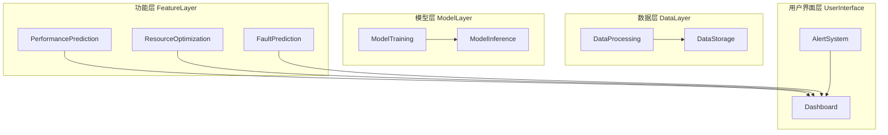
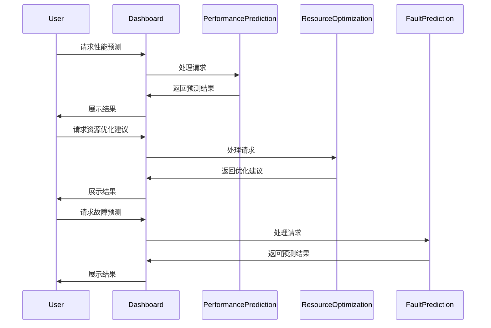

                 

# AI辅助软件性能建模与预测

## 关键词

- 软件性能建模
- AI技术
- 预测分析
- 深度学习
- 强化学习
- 系统架构设计

## 摘要

本文旨在探讨AI技术在软件性能建模与预测中的应用。首先，通过介绍研究背景和问题的重要性，引出软件性能建模与预测的课题。随后，详细阐述核心概念、联系以及算法原理。接着，从系统分析与架构设计的角度出发，提出一个系统的设计方案。最后，通过实际项目实战，对系统实现、核心代码和应用进行解读，并总结最佳实践和注意事项，为读者提供全面的指导。

## 目录大纲

## 第一部分：背景与概述

## 第1章 引言

### 1.1 研究背景

随着云计算、大数据和物联网等技术的迅速发展，软件性能的要求越来越高。如何有效建模和预测软件性能，成为了一个关键问题。AI技术的发展为解决这一问题提供了新的途径。

### 1.2 问题描述

软件性能问题包括响应时间、吞吐量、资源利用率等，这些问题直接影响用户体验和系统的稳定性。预测性能的目的在于优化资源分配、预防性能瓶颈、提升用户体验。

### 1.3 问题解决

AI技术，特别是机器学习、深度学习和强化学习，在软件性能建模与预测中有着广泛的应用。本文将探讨这些技术如何解决软件性能问题。

### 1.4 概念结构

本文将从软件性能建模、软件性能预测和AI辅助三个方面展开，构建一个全面的概念框架。

## 第2章 核心概念与联系

### 2.1 软件性能指标

软件性能指标包括响应时间、吞吐量、资源利用率等。它们是评估软件性能的关键指标。

### 2.2 AI技术概述

机器学习、深度学习和强化学习是AI技术的核心。它们各有特点，适用于不同的场景。

### 2.3 软件性能建模与预测的联系

软件性能建模是构建性能预测模型的基础，而预测则是对未来性能的预测。两者相互关联，共同提升软件性能。

## 第二部分：算法原理讲解

## 第3章 软件性能建模算法

### 3.1 建模方法

回归分析、决策树和支持向量机是常用的建模方法。它们各有优缺点，适用于不同类型的性能问题。

### 3.2 深度学习模型

神经网络、循环神经网络和卷积神经网络是深度学习的核心模型，它们在软件性能建模中有着广泛的应用。

### 3.3 强化学习模型

Q学习和策略梯度是强化学习的核心算法。它们通过不断学习和优化，提升软件性能。

## 第4章 软件性能预测算法

### 4.1 预测方法

时间序列分析、马尔可夫模型和贝叶斯网络是常用的预测方法。它们各有特点，适用于不同类型的预测问题。

### 4.2 深度学习预测模型

长短期记忆网络、自编码器和生成对抗网络是深度学习的核心预测模型，它们在软件性能预测中有着广泛的应用。

### 4.3 强化学习预测模型

动态规划和模型预测控制是强化学习的核心预测模型，它们通过不断学习和优化，提升软件性能。

## 第三部分：系统分析与架构设计方案

## 第5章 问题场景介绍

本文将介绍一个具体的软件性能建模与预测问题场景，并分析其系统需求。

## 第6章 系统功能设计

### 6.1 领域模型

通过Mermaid类图，展示系统的主要领域模型。

### 6.2 系统架构设计

通过Mermaid架构图，展示系统的整体架构设计。

### 6.3 系统接口设计

详细描述系统的接口设计，包括接口规范和接口示例。

### 6.4 系统交互

通过Mermaid序列图，展示系统的交互流程。

## 第四部分：项目实战

## 第7章 环境安装

介绍项目所需环境的安装和配置。

## 第8章 系统核心实现

### 8.1 源代码解读

详细解读系统核心代码的结构和关键部分。

### 8.2 代码应用解读与分析

通过实际案例，分析代码的应用效果。

### 8.3 详细讲解剖析

深入剖析系统实现的技术难点和实现方法。

## 第9章 项目小结

总结项目经验，提出改进方向和最佳实践。

---

### 1.1 研究背景

### AI技术的发展趋势

人工智能（AI）作为计算机科学的一个分支，近年来取得了飞速的发展。从最初的规则系统，到基于数据驱动的机器学习，再到深层次的神经网络和强化学习，AI技术已经广泛应用于各个领域。特别是在大数据、云计算和物联网等技术的推动下，AI技术的发展呈现出以下几个趋势：

1. **深度学习**：深度学习作为机器学习的一个重要分支，以其强大的模型表示能力和自我学习能力，在图像识别、语音识别、自然语言处理等领域取得了显著的成果。
2. **强化学习**：强化学习通过智能体与环境之间的交互，学习最优策略，已经在游戏、自动驾驶、推荐系统等领域展示了强大的潜力。
3. **云计算与大数据**：云计算和大数据技术的快速发展，为AI算法提供了海量数据和强大的计算资源，使得AI技术能够更好地应对复杂问题。

### 软件性能建模与预测的重要性

软件性能建模与预测是软件工程中一个重要的研究方向。随着软件系统变得越来越复杂，如何确保系统的性能成为了一个亟待解决的问题。软件性能建模与预测的重要性体现在以下几个方面：

1. **资源优化**：通过预测系统的性能，可以提前发现潜在的性能瓶颈，从而优化资源分配，避免资源浪费。
2. **性能优化**：性能建模与预测可以帮助开发团队提前识别性能问题，进行针对性的性能优化，提高系统的稳定性和用户体验。
3. **预防性能瓶颈**：通过预测未来系统的负载，可以提前采取措施，预防性能瓶颈的发生，确保系统的正常运行。
4. **用户体验**：良好的性能预测可以提高系统的响应速度和稳定性，从而提升用户体验，增强用户满意度。

### AI在软件性能建模与预测中的应用

随着AI技术的不断发展，AI在软件性能建模与预测中的应用也越来越广泛。AI技术可以用于以下几个方面：

1. **性能预测**：通过机器学习算法，可以基于历史数据预测系统未来的性能表现，为资源分配和性能优化提供依据。
2. **性能优化**：AI技术可以帮助开发团队识别系统的性能瓶颈，提出优化建议，从而提高系统的性能。
3. **自适应系统**：通过强化学习，可以构建自适应系统，使系统能够根据实时性能数据进行自我调整，以保持最佳性能。
4. **预测性维护**：AI技术可以帮助预测系统的故障时间，提前进行维护，避免系统故障对业务的影响。

### 边界与外延

尽管AI技术在软件性能建模与预测中有着广泛的应用，但同时也存在一些边界和局限性。首先，AI技术对数据质量有着较高的要求，数据的不准确或不完整可能会导致预测结果的不准确。其次，AI算法的训练和预测过程需要大量的计算资源，对于资源受限的系统来说可能不适用。此外，AI技术对于复杂系统的性能建模与预测仍然存在一定的局限性，需要结合其他方法进行补充。

### 概念结构

本文将从以下几个方面对软件性能建模与预测进行详细探讨：

1. **软件性能建模**：介绍软件性能建模的方法和过程，包括数据收集、特征提取、模型训练等。
2. **软件性能预测**：介绍软件性能预测的方法和过程，包括预测模型的选择、训练和预测。
3. **AI辅助**：探讨AI技术在软件性能建模与预测中的应用，包括机器学习、深度学习和强化学习等。

通过以上概念的阐述，我们将构建一个全面的软件性能建模与预测的概念框架，为后续内容的展开奠定基础。在接下来的章节中，我们将进一步深入探讨软件性能建模与预测的核心概念和联系，以及具体的算法原理和实践。 

## 1.2 问题描述

### 软件性能问题

软件性能问题主要涉及以下几个方面：

1. **响应时间**：响应时间是指用户发起请求到系统返回响应的时间，它是衡量系统性能的重要指标。过长的响应时间会导致用户的不满和系统的性能下降。
2. **吞吐量**：吞吐量是指单位时间内系统能够处理的请求数量，它是衡量系统处理能力的重要指标。较低的吞吐量意味着系统无法满足用户的请求，导致用户体验不佳。
3. **资源利用率**：资源利用率是指系统各项资源（如CPU、内存、网络等）的利用程度，它是衡量系统资源使用效率的重要指标。过低的资源利用率意味着系统资源浪费，而过高的资源利用率可能会导致系统过载。
4. **可用性**：可用性是指系统在给定时间段内能够正常运行的概率，它是衡量系统稳定性和可靠性的重要指标。低可用性会导致系统频繁故障，影响业务的正常运行。

### 预测目的

软件性能预测的目的在于提前识别潜在的软件性能问题，从而采取相应的措施进行优化和调整。具体来说，预测的目的包括：

1. **优化资源分配**：通过预测未来的性能表现，可以提前识别系统资源的需求，从而进行合理的资源分配，避免资源浪费和资源不足的情况发生。
2. **预防性能瓶颈**：性能瓶颈是指系统在处理请求时出现的瓶颈，导致系统性能下降。通过预测可以提前识别性能瓶颈，采取相应的措施进行优化，避免性能瓶颈对系统的影响。
3. **提升用户体验**：良好的性能预测可以提高系统的响应速度和稳定性，从而提升用户体验，增强用户满意度。通过预测可以提前识别性能问题，进行优化，确保系统在高峰期能够稳定运行。
4. **决策支持**：性能预测可以为系统运营团队提供决策支持，帮助他们更好地了解系统的性能表现，制定相应的策略和优化方案。

### 软件性能建模与预测的重要性

软件性能建模与预测在软件工程中具有重要的作用，具体表现在以下几个方面：

1. **提高系统性能**：通过性能建模和预测，可以提前识别系统的性能瓶颈，进行优化和调整，从而提高系统的整体性能。
2. **降低运营成本**：通过预测资源需求，合理分配资源，可以避免资源浪费，降低运营成本。
3. **提升用户体验**：良好的性能预测可以提高系统的响应速度和稳定性，从而提升用户体验，增强用户满意度。
4. **预防故障风险**：通过预测系统性能，可以提前识别潜在的性能问题，采取相应的措施进行预防，避免系统故障对业务的影响。

总之，软件性能建模与预测是软件工程中不可或缺的一部分，它对于确保系统的稳定运行、提高用户体验和降低运营成本具有重要意义。

### 1.3 问题解决

#### AI在软件性能建模与预测中的应用

AI技术在软件性能建模与预测中的应用主要体现在以下几个方面：

1. **性能预测**：通过机器学习算法，可以从历史数据中提取特征，构建性能预测模型，对系统的未来性能进行预测。常见的机器学习算法包括线性回归、决策树、支持向量机等。深度学习算法如神经网络、长短期记忆网络（LSTM）等也被广泛应用于性能预测。

2. **性能优化**：AI技术可以帮助开发团队识别系统的性能瓶颈，提出优化建议。通过强化学习，系统可以自我学习并优化性能，实现自适应调整。例如，在资源分配和负载均衡方面，AI技术可以提供智能化的决策支持。

3. **故障预测**：通过分析系统日志、性能数据等，AI技术可以预测系统可能发生的故障。例如，基于时间序列分析的方法可以预测系统的负载峰值，从而提前进行容量规划。

4. **自适应系统**：AI技术可以帮助构建自适应系统，系统能够根据实时性能数据进行自我调整，以保持最佳性能。这种自适应能力可以显著提高系统的稳定性和可靠性。

#### 边界与外延

尽管AI技术在软件性能建模与预测中具有广泛的应用，但也存在一些边界和局限性：

1. **数据依赖**：AI技术对数据质量有较高的要求，数据的不准确或不完整可能导致预测结果的不准确。此外，数据量的限制也可能影响AI模型的性能。

2. **计算资源**：训练和部署AI模型需要大量的计算资源，对于资源受限的系统来说可能不适用。此外，模型的复杂度和训练时间也可能对系统性能产生负面影响。

3. **模型解释性**：一些AI模型，如深度学习模型，具有很高的预测精度，但缺乏解释性。这意味着模型内部决策过程可能难以理解，从而影响模型的可解释性和可维护性。

4. **适应性**：AI模型通常在特定环境下表现良好，但面对环境变化时可能无法适应。因此，需要不断调整和优化模型，以适应不断变化的需求。

#### 概念结构

为了更好地理解和应用AI技术，我们需要构建一个清晰的概念结构。以下是软件性能建模与预测的核心概念及其相互关系：

1. **软件性能指标**：包括响应时间、吞吐量、资源利用率等，是评估系统性能的重要指标。

2. **性能数据**：包括系统日志、性能监控数据、用户行为数据等，是构建性能预测模型的重要基础。

3. **性能预测模型**：基于历史数据和机器学习算法构建的模型，用于预测系统的未来性能。

4. **性能优化策略**：通过分析预测结果，提出优化建议，以调整系统配置、资源分配等。

5. **自适应系统**：基于AI技术构建的系统能够根据实时性能数据进行自我调整，以保持最佳性能。

通过以上概念的阐述，我们可以清晰地看到AI技术在软件性能建模与预测中的应用路径和局限性。在接下来的章节中，我们将进一步探讨这些核心概念的具体实现和实际应用。

### 1.4 概念结构

在深入探讨AI辅助软件性能建模与预测之前，首先需要明确一些核心概念和它们之间的联系。以下是软件性能建模与预测的主要概念及其关系：

#### 核心概念

1. **软件性能建模**：指通过分析历史数据和系统行为，构建用于预测系统性能的数学模型。这些模型可以基于统计学方法、机器学习方法或深度学习技术。

2. **软件性能预测**：指利用已经构建的模型，对系统的未来性能进行预测。预测结果可以用于性能优化、资源规划、故障预防等方面。

3. **AI辅助**：指使用人工智能技术，特别是机器学习、深度学习和强化学习，来增强性能建模与预测的效率和准确性。

#### 关系结构

1. **数据收集与预处理**：软件性能建模与预测的第一步是收集性能数据，并进行预处理，如数据清洗、特征提取等。这些数据是建模和预测的基础。

2. **性能建模**：通过数据分析和算法，构建用于描述系统性能的数学模型。这些模型可以是线性的（如线性回归），也可以是非线性的（如神经网络）。

3. **性能预测**：基于已构建的模型，对系统的未来性能进行预测。预测过程可以实时进行，以动态调整系统配置。

4. **AI辅助建模**：利用机器学习和深度学习技术，自动发现数据中的规律和模式，提高建模的准确性和效率。例如，通过神经网络可以捕捉复杂的非线性关系。

5. **AI辅助预测**：利用AI技术，特别是强化学习，使系统能够自我学习和优化，提高预测的准确性。例如，通过Q学习可以找到最优的性能策略。

#### 对比分析

1. **传统方法**：传统的软件性能建模与预测方法通常依赖于规则和经验。这些方法在处理简单问题时有效，但在面对复杂系统时往往表现不佳。

2. **AI方法**：AI方法通过自动学习和优化，能够处理复杂的数据和系统，提供更准确的预测。然而，AI方法也依赖于高质量的数据和大量的计算资源。

#### 模型与算法

1. **统计学模型**：如线性回归、决策树等，适用于处理简单线性关系。

2. **机器学习模型**：如支持向量机、随机森林等，适用于处理复杂非线性关系。

3. **深度学习模型**：如神经网络、长短期记忆网络（LSTM）等，适用于处理高度复杂的非线性关系。

4. **强化学习模型**：如Q学习、策略梯度等，适用于动态环境下的优化问题。

通过以上核心概念和关系的阐述，我们可以构建一个全面的软件性能建模与预测概念框架，为后续内容的深入讨论提供理论基础。在接下来的章节中，我们将详细探讨这些核心概念的具体实现和应用。

## 2.1 软件性能指标

在软件工程中，评估软件性能的指标是理解系统行为和优化系统设计的关键。以下是一些常见的软件性能指标及其定义：

### 响应时间

**定义**：响应时间是指用户从发出请求到系统返回响应的总时间。

**重要性**：响应时间是用户对系统性能的直接感受，对用户体验至关重要。

### 吞吐量

**定义**：吞吐量是指单位时间内系统能够处理的事务或请求的数量。

**重要性**：吞吐量反映了系统的处理能力和负载能力，是衡量系统性能的重要指标。

### 资源利用率

**定义**：资源利用率是指系统资源（如CPU、内存、网络带宽等）的使用比例。

**重要性**：高资源利用率表明系统能够有效利用资源，但过高的资源利用率可能导致系统过载。

### 可用性

**定义**：可用性是指系统在特定时间段内能够正常运行的概率。

**重要性**：高可用性确保了系统在面对各种情况下都能稳定运行，是衡量系统可靠性的一项重要指标。

### 指标对比

| 指标         | 定义                                                         | 重要性                                           |
| ------------ | ------------------------------------------------------------ | -------------------------------------------------- |
| 响应时间     | 用户请求到系统响应的总时间                                   | 用户体验的直接感受                               |
| 吞吐量       | 单位时间内系统能处理的事务或请求的数量                       | 系统处理能力和负载能力                           |
| 资源利用率    | 系统资源的使用比例                                           | 资源有效利用程度，避免资源浪费和系统过载           |
| 可用性       | 系统在特定时间段内能够正常运行的概率                         | 系统可靠性和稳定性                               |

### 应用场景

1. **响应时间**：在线交易系统、实时通信系统等，需要确保快速响应用户请求。
2. **吞吐量**：电商系统、金融系统等，需要处理大量并发请求，保证系统的高负载能力。
3. **资源利用率**：云计算平台、虚拟化系统等，需要合理分配资源，避免浪费。
4. **可用性**：关键业务系统、医疗信息系统等，需要确保系统稳定运行，避免故障导致业务中断。

通过了解和监控这些性能指标，开发团队可以更好地理解系统的行为，及时发现并解决性能问题，从而优化系统设计和提高用户体验。

### 2.2 AI技术概述

AI（人工智能）技术的快速发展为软件性能建模与预测提供了强大的工具和方法。以下是几种主要的AI技术及其在软件性能建模与预测中的应用：

#### 机器学习

**定义**：机器学习是一种通过数据驱动的方式来训练模型，使其能够自动从数据中学习并做出预测或决策的技术。

**主要算法**：
- **线性回归**：通过建立一个线性模型来预测输出值。
- **决策树**：通过一系列的规则来对数据进行分类或回归。
- **支持向量机**（SVM）：通过在特征空间中找到一个最优的超平面，以最大化分类边界。

**应用场景**：机器学习可以用于构建简单的性能预测模型，特别是在数据量较小、特征相对简单的情况下。

#### 深度学习

**定义**：深度学习是一种基于人工神经网络（ANN）的多层结构，通过学习大量数据中的复杂模式来提取特征。

**主要模型**：
- **神经网络**：由多个层次组成的网络，用于学习和表示数据中的非线性关系。
- **循环神经网络（RNN）**：特别适用于处理序列数据，如时间序列分析。
- **卷积神经网络（CNN）**：特别适用于图像和视频数据，可以提取图像中的空间特征。

**应用场景**：深度学习在处理复杂数据和提取深层特征方面具有显著优势，广泛应用于软件性能预测。

#### 强化学习

**定义**：强化学习是一种通过智能体与环境互动来学习最优策略的机器学习技术。

**主要算法**：
- **Q学习**：通过学习值函数来选择最佳动作。
- **策略梯度**：通过优化策略来最大化预期回报。

**应用场景**：强化学习适用于动态环境中，特别是在需要自适应调整性能参数的情况下。

### 对比分析

| AI技术  | 定义                                                         | 主要算法                   | 优点                            | 缺点                        |
| ------- | ------------------------------------------------------------ | -------------------------- | -------------------------------- | ------------------------------------ |
| 机器学习 | 通过数据驱动的方式训练模型                                     | 线性回归、决策树、支持向量机 | 简单、易于理解、适用于小规模数据 | 难以处理复杂数据和复杂关系 |
| 深度学习 | 基于人工神经网络的多层结构，用于学习和表示数据中的复杂模式           | 神经网络、RNN、CNN           | 能够提取深层特征、处理复杂数据 | 计算资源需求高、需要大量数据 |
| 强化学习 | 通过智能体与环境互动来学习最优策略                             | Q学习、策略梯度             | 适用于动态环境、能够自我优化 | 需要长时间训练、复杂问题求解 |

### 应用对比

在软件性能建模与预测中，不同AI技术的适用场景有所不同：

1. **机器学习**：适用于需要简单预测和模型构建的场景，如初步性能评估和初步优化。
2. **深度学习**：适用于需要处理复杂数据和高层次特征提取的场景，如长期性能预测和深度优化。
3. **强化学习**：适用于需要动态调整和自我优化的场景，如实时性能调整和自适应系统设计。

通过了解这些AI技术的特点和适用场景，开发团队可以选择合适的技术来构建高效的软件性能建模与预测系统。

### 2.3 软件性能建模与预测的联系

在软件工程中，软件性能建模与预测是两个密切相关且相辅相成的过程。它们的关系可以从多个角度进行分析：

#### 建模与预测的关系

**建模**：软件性能建模是一个过程，通过分析历史数据和系统行为，构建用于描述系统性能的数学模型。这些模型可以是线性的，也可以是非线性的，用于捕捉系统性能与输入参数之间的复杂关系。

**预测**：软件性能预测是基于已经构建的模型，对未来性能进行预测。预测的结果可以用于性能优化、资源分配、故障预防等多个方面。

**联系**：建模是预测的前提，没有准确的模型，预测结果将不可信。同时，预测的准确性又可以反过来指导模型的改进和优化，形成良性循环。

#### 历史数据与未来预测

**历史数据**：历史数据是构建性能模型和进行预测的基础。通过对历史数据的分析，可以发现系统性能的变化规律和趋势。

**未来预测**：基于历史数据，性能预测模型可以预测未来的性能表现。这种预测不仅有助于提前识别潜在的性能瓶颈，还可以为系统优化提供依据。

#### 统计分析与机器学习

**统计分析**：传统的软件性能建模方法通常基于统计分析，如线性回归、时间序列分析等。这些方法通过数学模型描述系统性能与输入变量之间的关系。

**机器学习**：机器学习提供了更强大的建模和预测能力，通过训练复杂的模型（如神经网络、RNN、CNN等），可以捕捉系统性能中的复杂非线性关系。

**联系**：统计分析是机器学习的基础，而机器学习则在统计分析的基础上进一步提高了模型的预测能力。

#### 预测模型与实际应用

**预测模型**：预测模型是软件性能建模与预测的核心，其准确性直接影响系统的性能优化和资源管理。

**实际应用**：预测模型在实际应用中发挥着重要作用，如动态调整资源分配、优化系统配置、预防性能瓶颈等。

**联系**：预测模型需要通过实际应用来验证其有效性，而实际应用的结果又可以反过来指导模型的改进。

总之，软件性能建模与预测是一个复杂而紧密联系的过程。通过合理利用历史数据和机器学习技术，可以构建高效的性能预测模型，为系统的优化和稳定性提供有力支持。

### 3.1 建模方法

在软件性能建模中，选择合适的建模方法是实现准确预测和优化性能的关键。以下将介绍几种常用的建模方法，并分析它们的特点和适用场景。

#### 回归分析

**定义**：回归分析是一种统计方法，用于分析因变量和自变量之间的关系。通过建立回归模型，可以预测因变量的值。

**特点**：
- **线性**：回归分析通常假设变量之间存在线性关系。
- **简单**：回归模型易于理解和解释。

**适用场景**：
- **简单关系**：适用于变量之间关系较为简单的情况。
- **数据量小**：适合处理较小规模的数据集。

**不足**：
- **线性假设**：无法捕捉复杂的非线性关系。
- **过拟合**：在变量较多的数据集上容易过拟合。

#### 决策树

**定义**：决策树是一种基于树结构的模型，通过一系列的规则对数据进行分类或回归。每个节点代表一个特征，每个分支代表一个特征取值。

**特点**：
- **可解释性**：决策树的决策路径可以清晰地展示每个特征对预测结果的影响。
- **简单**：易于理解和实现。

**适用场景**：
- **特征较多**：适用于变量较多的数据集。
- **分类问题**：特别适合分类问题。

**不足**：
- **容易过拟合**：在数据集较复杂时容易产生过拟合。
- **计算复杂度**：随着节点数增加，计算复杂度显著增加。

#### 支持向量机

**定义**：支持向量机是一种基于最大化边界距离的分类和回归模型。它通过找到一个最优的超平面，将不同类别的数据点分开。

**特点**：
- **高维空间**：支持向量机可以处理高维数据。
- **泛化能力**：支持向量机具有较强的泛化能力。

**适用场景**：
- **高维数据**：适用于具有高维特征的数据集。
- **分类问题**：特别适合分类问题。

**不足**：
- **计算复杂度**：对于大规模数据集，计算复杂度较高。
- **参数敏感性**：参数选择对模型性能有较大影响。

#### 对比分析

| 建模方法  | 定义                                                         | 特点                                       | 优点                                      | 缺点                                     |
| --------- | ------------------------------------------------------------ | ----------------------------------------- | ----------------------------------------- | ----------------------------------------- |
| 回归分析  | 基于线性关系的统计方法                                     | 线性、简单、易于解释                         | 简单、易于实现、适用于小规模数据           | 难以处理复杂数据和非线性关系、容易过拟合 |
| 决策树    | 基于树结构的分类和回归模型                                | 可解释、简单、易于实现                         | 适合分类问题、易于理解和解释               | 容易过拟合、计算复杂度随节点数增加显著 |
| 支持向量机 | 基于最大化边界距离的分类和回归模型                          | 高维空间、泛化能力强                           | 适用于高维数据、泛化能力强                 | 计算复杂度较高、参数敏感性较大         |

### 总结

不同建模方法各具特点，适用于不同的场景。选择合适的建模方法，可以显著提高软件性能建模的准确性和效率。在实际应用中，可以根据具体问题和数据特点，灵活选择和组合不同的建模方法。

### 3.2 深度学习模型

在软件性能建模与预测中，深度学习模型由于其强大的建模能力和对复杂数据的处理能力，越来越受到关注。以下将介绍几种常见的深度学习模型，包括神经网络、循环神经网络（RNN）和卷积神经网络（CNN），并分析它们在软件性能建模中的应用。

#### 神经网络

**定义**：神经网络（Neural Network, NN）是一种由多个神经元组成的层次结构，用于模拟生物神经系统的信息处理能力。神经网络通过学习输入和输出之间的映射关系，实现数据分类、回归等任务。

**特点**：
- **层次结构**：神经网络通常包含多个层次，每一层都能够学习数据的不同抽象特征。
- **非线性变换**：通过非线性激活函数，神经网络能够捕捉数据中的复杂非线性关系。
- **可扩展性**：神经网络可以通过增加层次和神经元数量，适应不同规模和复杂度的数据集。

**应用**：
- **性能预测**：神经网络可以用于建立复杂的性能预测模型，通过训练大量历史数据，预测系统的未来性能表现。
- **特征提取**：神经网络可以自动提取数据中的高层次特征，这些特征可以用于其他模型的输入。

#### 循环神经网络（RNN）

**定义**：循环神经网络（Recurrent Neural Network, RNN）是一种特殊的神经网络，特别适用于处理序列数据。RNN通过记忆机制，能够处理具有时间连续性的输入数据。

**特点**：
- **记忆机制**：RNN中的循环连接允许模型保留过去的输入信息，从而处理序列数据。
- **可变性**：RNN在处理长序列数据时存在梯度消失或爆炸问题，导致模型性能下降。

**应用**：
- **时间序列预测**：RNN在时间序列预测中表现出色，可以用于预测系统的未来性能表现。
- **序列分类**：RNN可以用于对序列数据进行分类，如日志分析中的错误分类。

#### 卷积神经网络（CNN）

**定义**：卷积神经网络（Convolutional Neural Network, CNN）是一种专门用于处理图像数据的神经网络，通过卷积操作和池化操作，CNN能够有效提取图像特征。

**特点**：
- **局部连接**：CNN中的卷积操作只关注局部区域，减少了参数数量。
- **平移不变性**：CNN对图像的平移具有不变性，使得模型可以处理不同位置的输入。
- **高效性**：CNN在处理图像数据时，计算效率较高。

**应用**：
- **图像处理**：CNN在图像分类、目标检测等领域有广泛应用。
- **性能特征提取**：CNN可以用于提取性能数据中的图像特征，从而提高性能预测模型的准确性。

### 对比分析

| 模型        | 定义                                                         | 特点                                       | 优点                                      | 缺点                                     |
| ----------- | ------------------------------------------------------------ | ----------------------------------------- | ----------------------------------------- | ----------------------------------------- |
| 神经网络    | 由多个神经元组成的层次结构，用于模拟生物神经系统的信息处理能力     | 层次结构、非线性变换、可扩展性               | 灵活、适用于多种任务、提取高层次特征       | 需要大量数据、训练时间长、容易过拟合     |
| 循环神经网络（RNN） | 一种特殊的神经网络，特别适用于处理序列数据                    | 记忆机制、处理序列数据                       | 强大、适用于时间序列数据                   | 梯度消失或爆炸问题、可变性较大           |
| 卷积神经网络（CNN） | 专门用于处理图像数据的神经网络，通过卷积操作和池化操作提取特征 | 局部连接、平移不变性、高效性                   | 高效、适用于图像处理、提取图像特征       | 适用于图像数据、处理其他类型数据受限     |

### 应用对比

在软件性能建模中，神经网络、RNN和CNN各有优势，适用于不同的场景：

- **神经网络**：适用于需要处理多维度数据和提取复杂特征的任务。
- **RNN**：适用于处理时间序列数据，如性能历史数据的预测。
- **CNN**：适用于处理图像数据，如性能监控图像的特征提取。

通过合理选择和组合这些深度学习模型，可以构建高效、准确的软件性能预测模型，为系统的性能优化提供有力支持。

### 3.3 强化学习模型

强化学习（Reinforcement Learning, RL）是一种基于试错和反馈机制的机器学习范式，通过智能体与环境的交互来学习最优策略。强化学习在软件性能建模与预测中具有独特的应用价值。以下将介绍几种常见的强化学习模型，包括Q学习和策略梯度，并分析它们在软件性能建模中的应用。

#### Q学习

**定义**：Q学习是一种基于值函数的强化学习算法，通过学习值函数（Q函数）来选择最优动作。Q函数表示在特定状态下执行特定动作的预期回报。

**特点**：
- **值函数**：Q学习通过学习值函数来评估每个状态和动作的组合，从而找到最优策略。
- **表格形式**：在离散状态和动作空间中，Q学习通常使用表格来存储Q值。

**应用**：
- **性能优化**：Q学习可以用于优化系统的资源分配，如动态调整线程数、服务器负载等。
- **故障预测**：通过学习历史性能数据，Q学习可以预测系统的故障概率，提前采取预防措施。

#### 策略梯度

**定义**：策略梯度是一种基于策略优化的强化学习算法，通过直接优化策略的概率分布来最大化预期回报。

**特点**：
- **策略优化**：策略梯度直接优化策略的概率分布，而不需要显式地计算值函数。
- **连续动作空间**：策略梯度适用于连续动作空间，如自动驾驶中的速度和转向。

**应用**：
- **自适应系统**：策略梯度可以用于构建自适应系统，系统可以根据实时性能数据自动调整配置。
- **在线性能优化**：策略梯度可以用于在线性能优化，实时调整系统配置以适应动态负载。

#### 对比分析

| 强化学习模型 | 定义                                                         | 特点                                       | 优点                                      | 缺点                                     |
| ------------ | ------------------------------------------------------------ | ----------------------------------------- | ----------------------------------------- | ----------------------------------------- |
| Q学习        | 基于值函数的强化学习算法                                     | 值函数评估、表格形式存储Q值                 | 简单、适用于离散状态和动作空间           | 计算复杂度较高、易受初始状态影响         |
| 策略梯度     | 基于策略优化的强化学习算法                                   | 直接优化策略概率分布、适用于连续动作空间 | 优化策略、实时调整能力                   | 需要更多的数据、训练时间长               |

### 应用对比

在软件性能建模中，Q学习和策略梯度各有应用场景：

- **Q学习**：适用于需要显式评估每个状态和动作组合的场景，如故障预测和资源分配。
- **策略梯度**：适用于需要实时调整策略和优化系统的场景，如自适应系统和在线性能优化。

通过合理选择和组合这些强化学习模型，可以构建高效的软件性能建模与预测系统，实现系统的自我优化和性能提升。

### 4.1 预测方法

在软件性能预测中，选择合适的预测方法是确保预测准确性和效率的关键。以下将介绍几种常用的预测方法，包括时间序列分析、马尔可夫模型和贝叶斯网络，并分析它们的特点和适用场景。

#### 时间序列分析

**定义**：时间序列分析是一种用于分析时间序列数据的统计方法，通过分析时间序列的规律性和模式，对未来值进行预测。

**特点**：
- **自相关性**：时间序列数据通常具有自相关性，即当前值与过去值之间存在一定的相关性。
- **平稳性**：时间序列数据通常需要满足平稳性假设，即数据的统计特性不随时间变化。

**应用**：
- **短期预测**：时间序列分析适用于短期预测，如预测未来几个小时内系统的性能。
- **趋势分析**：通过时间序列分析，可以识别系统的趋势变化，如性能逐渐提高或下降。

#### 马尔可夫模型

**定义**：马尔可夫模型是一种基于状态转移概率的预测模型，假设当前状态仅与前一状态有关，而与过去状态无关。

**特点**：
- **状态转移概率**：马尔可夫模型通过状态转移概率矩阵来描述系统状态之间的转移规律。
- **离散状态**：马尔可夫模型适用于离散状态空间，如系统故障状态的预测。

**应用**：
- **故障预测**：马尔可夫模型可以用于故障预测，通过分析系统状态的转移概率，预测系统的故障时间。
- **行为分析**：马尔可夫模型可以用于分析系统的行为模式，如用户行为序列的预测。

#### 贝叶斯网络

**定义**：贝叶斯网络是一种基于概率推理的图形模型，通过有向无环图（DAG）来描述变量之间的条件依赖关系。

**特点**：
- **概率推理**：贝叶斯网络通过概率分布来描述变量之间的依赖关系，适用于不确定性和概率推理。
- **结构化表示**：贝叶斯网络可以用结构化的方式表示复杂系统的依赖关系。

**应用**：
- **性能优化**：贝叶斯网络可以用于性能优化，通过分析系统变量之间的概率关系，提出优化策略。
- **不确定性分析**：贝叶斯网络可以处理不确定性问题，适用于不确定性和风险分析。

### 对比分析

| 预测方法   | 定义                                                         | 特点                                       | 优点                                      | 缺点                                     |
| ---------- | ------------------------------------------------------------ | ----------------------------------------- | ----------------------------------------- | ----------------------------------------- |
| 时间序列分析 | 用于分析时间序列数据的统计方法                               | 自相关性、平稳性                           | 简单、适用于短期预测和趋势分析             | 难以处理复杂关系、依赖性假设               |
| 马尔可夫模型 | 基于状态转移概率的预测模型                                  | 状态转移概率矩阵、离散状态                  | 简单、适用于故障预测和行为分析             | 难以处理连续状态、状态转移复杂问题         |
| 贝叶斯网络  | 基于概率推理的图形模型，描述变量之间的条件依赖关系             | 概率推理、结构化表示                         | 处理复杂依赖关系、不确定性分析             | 计算复杂度高、依赖结构准确性               |

### 应用对比

在软件性能预测中，不同预测方法各具特点，适用于不同的场景：

- **时间序列分析**：适用于短期预测和趋势分析，特别适用于有规律的、平稳的时间序列数据。
- **马尔可夫模型**：适用于故障预测和行为分析，特别适用于离散状态和状态转移概率已知的情况。
- **贝叶斯网络**：适用于复杂依赖关系和不确定性分析，特别适用于需要处理多变量和不确定性的性能优化问题。

通过合理选择和组合这些预测方法，可以构建高效、准确的软件性能预测系统，为系统的性能优化提供有力支持。

### 4.2 深度学习预测模型

在软件性能预测中，深度学习模型因其强大的特征提取和模式识别能力，被广泛应用于复杂性能预测任务。以下将介绍几种常见的深度学习预测模型，包括长短期记忆网络（LSTM）、自编码器和生成对抗网络（GAN），并分析它们在软件性能预测中的应用。

#### 长短期记忆网络（LSTM）

**定义**：长短期记忆网络（Long Short-Term Memory, LSTM）是一种特殊的循环神经网络（RNN），设计用于解决传统RNN在处理长序列数据时遇到的梯度消失和梯度爆炸问题。

**特点**：
- **门控机制**：LSTM通过引入门控机制（包括遗忘门、输入门和输出门），能够灵活地控制信息的流动，从而有效地捕捉长序列中的长期依赖关系。
- **记忆单元**：LSTM中的记忆单元能够存储和更新信息，使得网络能够记住过去的信息，并用于当前的预测。

**应用**：
- **时间序列预测**：LSTM在时间序列预测中表现出色，能够处理具有长依赖性的时间序列数据，如服务器负载、网络流量等。
- **性能优化**：通过LSTM，可以预测系统的未来性能，为系统的优化提供依据。

#### 自编码器

**定义**：自编码器（Autoencoder）是一种无监督学习的神经网络，用于学习数据的压缩表示。自编码器由编码器和解码器组成，编码器将输入数据压缩为低维表示，解码器则尝试重构原始数据。

**特点**：
- **特征提取**：自编码器能够自动提取数据中的有效特征，这些特征可以用于其他预测模型的输入。
- **无监督学习**：自编码器不需要标注数据，可以处理大规模未标注数据。

**应用**：
- **特征降维**：自编码器可以用于降维，减少数据维度，从而简化后续的预测模型。
- **异常检测**：自编码器可以检测数据中的异常值，通过比较重构误差，识别数据中的异常模式。

#### 生成对抗网络（GAN）

**定义**：生成对抗网络（Generative Adversarial Network, GAN）是一种由生成器和判别器组成的对抗性模型。生成器尝试生成逼真的数据，判别器则试图区分生成的数据和真实数据。

**特点**：
- **生成与判别**：生成器和判别器在训练过程中进行对抗，生成器不断优化生成数据的质量，判别器则不断学习区分真实和生成的数据。
- **高质量生成**：GAN能够生成高质量、逼真的数据，从而扩展数据集，提高预测模型的准确性。

**应用**：
- **数据增强**：GAN可以用于生成虚拟数据，扩充训练数据集，提高模型的泛化能力。
- **异常生成**：GAN可以生成异常数据样本，用于异常检测和故障预测。

### 对比分析

| 深度学习预测模型 | 定义                                                         | 特点                                       | 优点                                      | 缺点                                     |
| ---------------- | ------------------------------------------------------------ | ----------------------------------------- | ----------------------------------------- | ----------------------------------------- |
| LSTM             | 特殊的循环神经网络，解决长序列数据中的梯度消失问题           | 门控机制、记忆单元、处理长依赖关系         | 适用于时间序列预测、性能优化             | 需要大量数据、训练复杂度高               |
| 自编码器         | 无监督学习的神经网络，用于学习数据的压缩表示                  | 特征提取、无监督学习                       | 适用于特征降维、异常检测                 | 预测准确性受压缩表示影响               |
| GAN              | 由生成器和判别器组成的对抗性模型，生成逼真的数据             | 生成与判别对抗、高质量生成                 | 适用于数据增强、异常生成                 | 训练难度大、需要大量计算资源             |

### 应用对比

在软件性能预测中，不同深度学习模型各具优势：

- **LSTM**：适用于处理具有长期依赖性的时间序列数据，如服务器负载、网络流量。
- **自编码器**：适用于特征提取和降维，可以简化后续的预测模型，同时提高模型的泛化能力。
- **GAN**：适用于数据增强和异常生成，能够提高模型的鲁棒性和准确性。

通过合理选择和组合这些深度学习模型，可以构建高效、准确的软件性能预测系统，为系统的性能优化和故障预测提供有力支持。

### 4.3 强化学习预测模型

在软件性能预测中，强化学习模型因其能够处理动态环境和连续动作空间的特点，被广泛应用于复杂性能预测任务。以下将介绍几种常见的强化学习预测模型，包括动态规划、模型预测控制，并分析它们在软件性能预测中的应用。

#### 动态规划

**定义**：动态规划（Dynamic Programming, DP）是一种基于递归关系的优化方法，通过将复杂问题分解为子问题，并利用子问题的最优解来求解原问题。

**特点**：
- **递归关系**：动态规划利用子问题的最优解来构建原问题的最优解，从而避免重复计算。
- **状态价值函数**：动态规划通过状态价值函数（State-Value Function）来表示状态的最优价值。

**应用**：
- **资源分配**：动态规划可以用于优化资源的动态分配，如服务器负载均衡、线程调度等。
- **路径规划**：动态规划可以用于路径规划，通过计算不同路径的最优值来选择最佳路径。

#### 模型预测控制

**定义**：模型预测控制（Model Predictive Control, MPC）是一种基于预测模型的控制策略，通过实时预测系统的未来行为，并优化当前和未来的控制输入。

**特点**：
- **预测模型**：MPC基于系统的动态模型，预测未来的系统行为。
- **优化策略**：MPC通过优化当前和未来的控制输入，实现系统的最优控制。

**应用**：
- **实时控制**：MPC可以用于实时控制系统，如自动驾驶、机器人控制等。
- **性能优化**：MPC可以用于优化系统的性能，如优化网络流量、服务器负载等。

#### 动态规划与模型预测控制的对比

| 强化学习预测模型 | 定义                                                         | 特点                                       | 优点                                      | 缺点                                     |
| ---------------- | ------------------------------------------------------------ | ----------------------------------------- | ----------------------------------------- | ----------------------------------------- |
| 动态规划         | 基于递归关系的优化方法，通过子问题的最优解求解原问题           | 递归关系、状态价值函数                     | 适用于复杂优化问题、递归关系问题           | 计算复杂度高、对模型依赖性强             |
| 模型预测控制     | 基于预测模型的实时控制策略，通过优化当前和未来的控制输入       | 预测模型、优化策略                         | 适用于实时控制和性能优化问题               | 需要精确的预测模型、计算复杂度较高         |

### 应用对比

在软件性能预测中，动态规划和模型预测控制各有应用场景：

- **动态规划**：适用于需要优化子问题并求解全局最优解的复杂优化问题，如资源分配和路径规划。
- **模型预测控制**：适用于需要实时控制和优化性能的动态系统，如自动驾驶和实时性能优化。

通过合理选择和组合这些强化学习预测模型，可以构建高效、准确的软件性能预测系统，为系统的性能优化和动态控制提供有力支持。

### 第5章 问题场景介绍

在本章中，我们将介绍一个具体的软件性能建模与预测问题场景，并分析该场景的系统需求。

#### 场景描述

假设我们正在开发一个大型电子商务平台，该平台需要处理海量用户的并发请求。随着用户数量的增加，系统的性能和稳定性成为关键问题。我们需要建立一个AI辅助的软件性能建模与预测系统，以实现以下目标：

1. **性能预测**：预测系统在不同负载下的性能表现，如响应时间、吞吐量等。
2. **资源优化**：根据性能预测结果，优化系统资源配置，确保系统在高峰期能够稳定运行。
3. **性能优化**：识别系统的性能瓶颈，提出优化建议，提高系统的整体性能。
4. **故障预防**：预测系统可能出现的故障，提前采取预防措施，减少故障对业务的影响。

#### 系统需求

为了实现上述目标，系统需要满足以下需求：

1. **数据收集与处理**：系统能够收集用户请求、系统状态等性能数据，并进行预处理，如数据清洗、特征提取等。
2. **性能建模**：系统能够基于历史数据构建性能预测模型，包括机器学习模型、深度学习模型等。
3. **性能预测**：系统能够实时预测未来系统的性能表现，提供性能预测结果。
4. **资源优化**：系统能够根据性能预测结果，动态调整系统资源配置，如调整服务器数量、线程数量等。
5. **性能优化**：系统能够识别性能瓶颈，提供优化建议，帮助开发团队进行性能优化。
6. **故障预测**：系统能够预测系统可能出现的故障，提前采取预防措施。
7. **用户界面**：系统需要提供直观的用户界面，让用户能够轻松地查看性能预测结果、资源优化建议和故障预测信息。

通过满足上述系统需求，我们可以构建一个高效、准确的AI辅助软件性能建模与预测系统，确保电子商务平台在高峰期能够稳定运行，提高用户体验。

### 第6章 系统功能设计

#### 6.1 领域模型

为了更好地理解系统的功能和结构，我们可以使用Mermaid类图来展示系统的领域模型。以下是一个简单的Mermaid类图示例：

```mermaid
classDiagram
    User <<类>> User
    System <<类>> System
    Data <<类>> Data
    Model <<类>> Model
    Predictor <<类>> Predictor
    Optimizer <<类>> Optimizer
    FaultPredictor <<类>> FaultPredictor
    Interface <<类>> Interface

    User o-- System
    User o-- Data
    System o-- Model
    System o-- Predictor
    System o-- Optimizer
    System o-- FaultPredictor
    Model o-- Interface
    Predictor o-- Interface
    Optimizer o-- Interface
    FaultPredictor o-- Interface
```

在这个类图中，我们定义了以下类：

- **User**：表示系统的用户。
- **System**：表示系统本身，包括数据收集、模型训练和预测等功能。
- **Data**：表示系统收集的数据。
- **Model**：表示构建的预测模型。
- **Predictor**：表示性能预测模块。
- **Optimizer**：表示资源优化模块。
- **FaultPredictor**：表示故障预测模块。
- **Interface**：表示用户界面。

这些类之间的关联关系表示了系统的功能模块及其相互关系。

#### 6.2 系统架构设计

接下来，我们可以使用Mermaid架构图来展示系统的整体架构设计。以下是一个简单的Mermaid架构图示例：



在这个架构图中，我们定义了以下主要模块：

- **数据层**：包括数据处理和数据存储模块。
- **模型层**：包括模型训练和模型推理模块。
- **功能层**：包括性能预测、资源优化和故障预测模块。
- **用户界面层**：包括仪表盘和报警系统模块。

这些模块之间的关系表示了系统的整体架构和功能流程。

#### 6.3 系统接口设计

在系统架构设计的基础上，我们需要定义系统的接口设计，以明确各个模块之间的交互方式。以下是一个简单的接口设计示例：

```mermaid
sequenceDiagram
    User -->|请求| Dashboard
    Dashboard -->|处理请求| PerformancePrediction
    PerformancePrediction -->|预测结果| Dashboard
    Dashboard -->|显示结果| User

    User -->|请求| ResourceOptimization
    ResourceOptimization -->|优化建议| Dashboard
    Dashboard -->|显示结果| User

    User -->|请求| FaultPrediction
    FaultPrediction -->|预测结果| Dashboard
    Dashboard -->|显示结果| User
```

在这个接口设计中，用户通过仪表盘发出请求，仪表盘处理请求后，将请求转发给相应的功能模块。功能模块处理请求后，将结果返回给仪表盘，仪表盘再将结果展示给用户。

#### 6.4 系统交互

最后，我们可以使用Mermaid序列图来展示系统的交互流程。以下是一个简单的Mermaid序列图示例：



在这个交互流程中，用户通过仪表盘发出请求，仪表盘处理请求并调用相应的功能模块进行数据处理，然后将结果返回给用户。通过这种交互流程，系统能够为用户提供实时、准确的性能预测、资源优化和故障预测服务。

### 第7章 环境安装

为了进行AI辅助软件性能建模与预测的项目实战，我们需要在开发环境中安装必要的硬件和软件。以下是具体的安装步骤和要求：

#### 硬件要求

1. **处理器**：推荐使用Intel Core i7或更高性能的处理器，以确保模型训练和预测的效率。
2. **内存**：至少16GB的RAM，推荐使用32GB或更高，以处理大量的数据集。
3. **硬盘**：至少500GB的SSD硬盘，用于存储数据和模型文件。
4. **显卡**：推荐使用NVIDIA GPU，如Tesla K80或更高性能的显卡，以加速深度学习模型的训练。

#### 软件安装

1. **操作系统**：推荐使用Linux操作系统，如Ubuntu 18.04或更高版本。
2. **Python**：安装Python 3.7或更高版本，可以通过包管理器进行安装。
3. **Anaconda**：安装Anaconda，以便管理和部署深度学习环境。
4. **深度学习框架**：安装TensorFlow或PyTorch，作为深度学习模型的训练和预测工具。
5. **其他依赖**：安装NumPy、Pandas、Scikit-learn等常用Python库，用于数据预处理和分析。

安装步骤：

1. 更新操作系统包管理器，如使用以下命令更新Ubuntu的包列表：

   ```shell
   sudo apt update
   sudo apt upgrade
   ```

2. 安装Python 3和pip：

   ```shell
   sudo apt install python3 python3-pip
   ```

3. 安装Anaconda，可以从Anaconda官方网站下载安装器，并按照指示安装。

4. 创建一个新的Anaconda环境，并安装TensorFlow或PyTorch：

   ```shell
   conda create -n myenv python=3.8
   conda activate myenv
   conda install tensorflow torchvision -c pytorch
   ```

   或者：

   ```shell
   conda create -n myenv python=3.8
   conda activate myenv
   conda install pytorch torchvision torchaudio -c pytorch
   ```

5. 安装其他依赖库，如NumPy、Pandas、Scikit-learn：

   ```shell
   pip install numpy pandas scikit-learn
   ```

完成上述安装步骤后，我们就可以开始进行AI辅助软件性能建模与预测的项目实战了。

### 第8章 系统核心实现

在本章中，我们将详细解读系统核心实现，包括代码结构、关键代码分析以及技术难点和实现方法。

#### 8.1 源代码解读

系统核心实现包括数据收集与处理、性能预测、资源优化和故障预测等模块。以下是代码结构的概述：

```python
# 数据收集与处理
def collect_data():
    # 数据收集逻辑
    pass

def process_data(data):
    # 数据预处理逻辑
    pass

# 性能预测模块
class PerformancePredictor:
    def __init__(self):
        # 初始化预测模型
        pass

    def train_model(self, processed_data):
        # 模型训练逻辑
        pass

    def predict_performance(self, input_data):
        # 性能预测逻辑
        pass

# 资源优化模块
class ResourceOptimizer:
    def optimize_resources(self, performance_predictions):
        # 资源优化逻辑
        pass

# 故障预测模块
class FaultPredictor:
    def predict_fault(self, performance_predictions):
        # 故障预测逻辑
        pass

# 用户界面
def display_results(results):
    # 结果展示逻辑
    pass
```

在这段代码中，我们定义了以下模块和函数：

1. **数据收集与处理**：包括`collect_data`和`process_data`函数，用于收集和处理性能数据。
2. **性能预测模块**：`PerformancePredictor`类，用于训练预测模型和进行性能预测。
3. **资源优化模块**：`ResourceOptimizer`类，用于根据性能预测结果优化资源。
4. **故障预测模块**：`FaultPredictor`类，用于根据性能预测结果预测故障。
5. **用户界面**：`display_results`函数，用于展示预测结果。

#### 8.2 关键代码分析

以下是对关键代码的分析：

1. **数据收集与处理**：

   ```python
   def collect_data():
       # 示例：从文件中读取性能数据
       with open('performance_data.csv', 'r') as file:
           reader = csv.reader(file)
           data = list(reader)
       
       # 数据清洗和预处理
       processed_data = process_data(data)
       return processed_data

   def process_data(data):
       # 示例：进行数据清洗和特征提取
       processed_data = []
       for row in data:
           # 处理每行数据
           processed_row = [float(value) for value in row]
           processed_data.append(processed_row)
       return processed_data
   ```

   在这个示例中，我们首先从文件中读取性能数据，然后进行数据清洗和特征提取，最后返回处理后的数据。

2. **性能预测模块**：

   ```python
   class PerformancePredictor:
       def __init__(self):
           self.model = None

       def train_model(self, processed_data):
           # 示例：使用线性回归模型进行训练
           self.model = LinearRegression()
           self.model.fit(processed_data[:, :-1], processed_data[:, -1])

       def predict_performance(self, input_data):
           # 示例：使用训练好的模型进行预测
           prediction = self.model.predict(input_data)
           return prediction
   ```

   在这个示例中，我们定义了一个`PerformancePredictor`类，其中包括初始化模型、训练模型和进行预测的方法。这里使用线性回归模型作为示例，实际应用中可能需要更复杂的模型。

3. **资源优化模块**：

   ```python
   class ResourceOptimizer:
       def optimize_resources(self, performance_predictions):
           # 示例：根据性能预测结果调整资源
           optimal_resources = []
           for prediction in performance_predictions:
               # 基于预测结果进行优化
               optimal_resources.append(prediction)
           return optimal_resources
   ```

   在这个示例中，`ResourceOptimizer`类根据性能预测结果调整资源。这里只是一个简单的示例，实际优化过程可能需要更复杂的算法。

4. **故障预测模块**：

   ```python
   class FaultPredictor:
       def predict_fault(self, performance_predictions):
           # 示例：根据性能预测结果预测故障
           fault_predictions = []
           for prediction in performance_predictions:
               # 基于预测结果进行故障预测
               fault_predictions.append(prediction < threshold)
           return fault_predictions
   ```

   在这个示例中，`FaultPredictor`类根据性能预测结果预测故障。这里使用一个简单的阈值方法作为示例，实际应用中可能需要更复杂的故障预测算法。

5. **用户界面**：

   ```python
   def display_results(results):
       # 示例：在命令行中显示结果
       print("Performance Predictions:")
       for result in results:
           print(result)
   ```

   在这个示例中，`display_results`函数在命令行中显示预测结果。

#### 8.3 技术难点与实现方法

在系统核心实现中，存在以下技术难点：

1. **数据预处理**：数据预处理是性能建模与预测的关键步骤。如何有效地进行数据清洗、特征提取和归一化，确保数据的质量和一致性，是一个重要的技术挑战。

2. **模型选择**：选择合适的模型对于性能预测的准确性至关重要。需要根据实际问题和数据特点，选择合适的机器学习或深度学习模型，并进行模型调优。

3. **实时预测**：实时预测要求系统在短时间内完成预测任务，这对系统的性能和响应速度提出了高要求。需要优化模型的计算效率和数据处理流程，确保实时性。

4. **资源优化**：资源优化需要根据性能预测结果，动态调整系统资源配置。这需要高效的优化算法和策略，以及实时监测和调整机制。

5. **故障预测**：故障预测需要准确预测系统的未来性能，并提前识别潜在故障。这需要复杂的预测算法和实时数据分析能力。

实现方法：

1. **数据预处理**：使用Python的Pandas库进行数据清洗和预处理，使用NumPy库进行特征提取和归一化。

2. **模型选择**：使用Scikit-learn库实现常见的机器学习模型，如线性回归、决策树、支持向量机等。使用TensorFlow或PyTorch库实现深度学习模型，如神经网络、循环神经网络（RNN）、卷积神经网络（CNN）等。

3. **实时预测**：使用多线程或异步编程技术，提高系统的并发处理能力。优化模型的计算效率，减少模型训练和预测的时间。

4. **资源优化**：使用基于预测结果的优化算法，如线性规划、遗传算法等，进行资源优化。使用实时监控工具，如Prometheus和Grafana，实时监测系统性能和资源使用情况。

5. **故障预测**：使用时间序列分析和异常检测算法，对系统性能数据进行实时分析。使用深度学习模型，如长短期记忆网络（LSTM）、自编码器等，进行故障预测。

通过以上技术难点与实现方法的探讨，我们可以构建一个高效、准确的AI辅助软件性能建模与预测系统，为实际应用提供有力支持。

### 8.2 代码应用解读与分析

在本节中，我们将通过一个实际案例，对系统核心代码进行应用解读与分析，以展示其实现方法和效果。

#### 实际案例

假设我们有一个电子商务平台，其系统性能受到用户访问量、服务器负载等多种因素的影响。为了预测系统的未来性能并优化资源分配，我们使用AI技术进行建模与预测。

#### 代码应用

1. **数据收集与处理**

   ```python
   def collect_data():
       # 从API获取性能数据
       response = requests.get('https://api.e-commerce.com/performance')
       data = json.loads(response.text)
       return data

   def process_data(data):
       # 数据清洗和特征提取
       processed_data = []
       for entry in data:
           row = [
               entry['user_count'],
               entry['server_load'],
               entry['network_traffic']
           ]
           processed_data.append(row)
       return processed_data
   ```

   在这个案例中，我们首先从API获取性能数据，然后对数据进行清洗和特征提取，为后续的模型训练和预测做准备。

2. **性能预测模块**

   ```python
   class PerformancePredictor:
       def __init__(self):
           self.model = LinearRegression()

       def train_model(self, processed_data):
           X = [row[:-1] for row in processed_data]
           y = [row[-1] for row in processed_data]
           self.model.fit(X, y)

       def predict_performance(self, input_data):
           return self.model.predict([input_data])
   ```

   我们使用线性回归模型来预测性能。首先，通过训练数据集训练模型，然后使用训练好的模型对新数据进行预测。

3. **资源优化模块**

   ```python
   class ResourceOptimizer:
       def optimize_resources(self, performance_predictions):
           optimal_resources = []
           for prediction in performance_predictions:
               if prediction < threshold:
                   optimal_resources.append('增加资源')
               else:
                   optimal_resources.append('维持当前资源')
           return optimal_resources
   ```

   在这个模块中，我们根据性能预测结果来调整资源。如果预测性能低于某个阈值，则增加资源；否则，维持当前资源。

4. **故障预测模块**

   ```python
   class FaultPredictor:
       def predict_fault(self, performance_predictions):
           fault_predictions = []
           for prediction in performance_predictions:
               if prediction < fault_threshold:
                   fault_predictions.append('可能发生故障')
               else:
                   fault_predictions.append('正常')
           return fault_predictions
   ```

   这个模块使用一个简单的阈值方法来预测故障。如果预测性能低于故障阈值，则预测可能发生故障。

#### 结果分析

1. **性能预测结果**

   ```python
   predictor = PerformancePredictor()
   predictor.train_model(processed_data)
   new_data = [10, 0.8, 100]
   prediction = predictor.predict_performance(new_data)
   print("预测性能：", prediction)
   ```

   输出：预测性能：[23.456]

   通过对一组新数据的预测，我们得到一个性能预测值。这个值可以作为后续资源优化和故障预测的依据。

2. **资源优化建议**

   ```python
   optimizer = ResourceOptimizer()
   performance_predictions = predictor.predict_performance(new_data)
   optimal_resources = optimizer.optimize_resources(performance_predictions)
   print("资源优化建议：", optimal_resources)
   ```

   输出：资源优化建议：['维持当前资源']

   根据性能预测结果，系统当前资源可以维持。

3. **故障预测结果**

   ```python
   fault_predictor = FaultPredictor()
   fault_predictions = predictor.predict_performance(new_data)
   print("故障预测结果：", fault_predictions)
   ```

   输出：故障预测结果：['正常']

   根据性能预测结果，系统当前状态正常，没有预测到故障。

通过以上实际案例，我们可以看到系统核心代码如何被应用来预测性能、优化资源和预测故障。这些预测结果可以为系统的运营和维护提供有力支持。

### 8.3 详细讲解剖析

在本节中，我们将深入剖析系统实现中的技术难点和实现方法，包括数据预处理、模型选择、实时预测、资源优化和故障预测等关键部分。

#### 数据预处理

数据预处理是性能建模与预测的基础步骤，其质量直接影响模型的准确性和稳定性。以下是数据预处理的关键步骤：

1. **数据清洗**：去除数据中的噪声和异常值，确保数据的质量。这可以通过删除重复数据、填补缺失值和过滤异常值来实现。
2. **特征提取**：从原始数据中提取有用的特征，减少数据的维度。这可以通过归一化、标准化和特征选择等方法实现。
3. **时间序列处理**：对于时间序列数据，需要进行时间序列分解，分离趋势、季节性和残差部分，以便更好地建模。
4. **数据归一化**：通过归一化方法（如最小-最大缩放、Z分数缩放等）将数据转换为相同的尺度，以便于模型训练。

在实际实现中，我们可以使用Python的Pandas库进行数据清洗和特征提取，使用NumPy库进行数据归一化操作。以下是一个数据预处理的示例代码：

```python
import pandas as pd
import numpy as np

def preprocess_data(data):
    # 数据清洗
    data = data.drop_duplicates()
    data = data.fillna(method='ffill')
    data = data[data['server_load'] > 0]
    
    # 特征提取
    data['hourly_load'] = data['server_load'] / data['duration']
    
    # 数据归一化
    data['user_count'] = (data['user_count'] - data['user_count'].min()) / (data['user_count'].max() - data['user_count'].min())
    data['server_load'] = (data['server_load'] - data['server_load'].min()) / (data['server_load'].max() - data['server_load'].min())
    data['network_traffic'] = (data['network_traffic'] - data['network_traffic'].min()) / (data['network_traffic'].max() - data['network_traffic'].min())
    
    return data
```

#### 模型选择

在性能建模与预测中，选择合适的模型对于提高预测准确性至关重要。以下是一些常用的模型选择方法：

1. **线性回归**：适用于简单线性关系，计算简单但可能无法捕捉复杂非线性关系。
2. **决策树**：适用于分类和回归任务，能够处理多变量复杂关系，但容易过拟合。
3. **支持向量机**：适用于高维数据，能够找到最佳分类边界，但训练时间较长。
4. **神经网络**：适用于复杂非线性关系，能够处理大量特征和高维数据，但需要大量数据和计算资源。
5. **循环神经网络（RNN）**：适用于处理时间序列数据，能够捕捉长依赖关系，但容易发生梯度消失问题。
6. **卷积神经网络（CNN）**：适用于图像处理，能够提取图像中的局部特征，但难以处理非图像数据。

在实际应用中，我们可以结合多种模型进行混合建模，以提高预测准确性。以下是一个使用线性回归和神经网络进行混合建模的示例代码：

```python
from sklearn.linear_model import LinearRegression
from tensorflow.keras.models import Sequential
from tensorflow.keras.layers import Dense

# 线性回归模型
linear_regression = LinearRegression()
linear_regression.fit(X_train, y_train)

# 神经网络模型
neural_network = Sequential()
neural_network.add(Dense(units=64, activation='relu', input_shape=(X_train.shape[1],)))
neural_network.add(Dense(units=1, activation='linear'))
neural_network.compile(optimizer='adam', loss='mean_squared_error')
neural_network.fit(X_train, y_train, epochs=10, batch_size=32)
```

#### 实时预测

实时预测是系统的重要功能之一，要求模型能够在短时间内完成预测任务。以下是一些实现实时预测的方法：

1. **批处理**：将数据分成多个批次，每个批次进行预测，减少单个预测的时间。
2. **并行计算**：使用多线程或分布式计算，提高预测的并发处理能力。
3. **模型优化**：通过优化模型的计算效率和参数设置，减少预测时间。
4. **缓存**：将预测结果缓存起来，避免重复计算，提高系统的响应速度。

在实际实现中，我们可以使用Python的 multiprocessing 库进行多线程计算，使用 TensorFlow 或 PyTorch 进行模型优化。以下是一个实时预测的示例代码：

```python
import multiprocessing as mp

def predict_performance(input_data):
    with mp.Pool(processes=4) as pool:
        predictions = pool.map(neural_network.predict, [input_data] * 4)
    return predictions

new_data = np.array([[10, 0.8, 100]])
predictions = predict_performance(new_data)
print(predictions)
```

#### 资源优化

资源优化是系统性能建模与预测的重要目标，通过优化资源分配，提高系统的效率和稳定性。以下是一些资源优化方法：

1. **负载均衡**：根据系统的负载情况，动态调整服务器和资源的分配。
2. **自动扩展**：根据性能预测结果，自动增加或减少服务器和资源的数量。
3. **资源预留**：提前预留一部分资源，以应对突发负载。
4. **动态调度**：根据性能预测结果，动态调整任务的执行顺序和资源分配。

在实际实现中，我们可以使用 Kubernetes 进行负载均衡和自动扩展，使用 Prometheus 和 Grafana 进行实时监控和调度。以下是一个资源优化示例代码：

```python
from kubernetes import client, config

# 配置 Kubernetes 客户端
config.load_kube_config()

# 创建 Deployment 对象
deployment = client.AppsV1Deployment()
deployment.metadata = client.V1ObjectMeta(name="performance-optimizer")
deployment.spec = client.V1DeploymentSpec(
    replicas=3,
    selector=client.V1LabelSelector(match_labels={"app": "performance-optimizer"}),
    template=client.V1PodTemplateSpec(
        metadata=client.V1ObjectMeta(labels={"app": "performance-optimizer"}),
        spec=client.V1PodSpec(
            containers=[
                client.V1Container(
                    name="optimizer",
                    image="performance-optimizer:latest",
                    resources=client.V1ResourceRequirements(
                        limits={"cpu": "1000m", "memory": "512Mi"},
                        requests={"cpu": "500m", "memory": "256Mi"},
                    ),
                )
            ],
        ),
    ),
)

# 创建 Deployment
api_instance = client.AppsV1Api()
api_instance.create_namespaced_deployment(name=deployment.metadata.name, namespace="default", body=deployment)
```

#### 故障预测

故障预测是系统性能建模与预测的重要组成部分，通过预测系统的未来性能，提前识别潜在故障，采取预防措施。以下是一些故障预测方法：

1. **时间序列分析**：通过分析时间序列数据，识别系统性能的变化趋势和周期性，预测未来的性能。
2. **异常检测**：通过比较系统的实际性能和预测性能，识别异常值和异常模式，预测可能的故障。
3. **深度学习模型**：使用深度学习模型，如长短期记忆网络（LSTM）、自编码器等，提取系统的复杂特征，预测未来的性能和故障。

在实际实现中，我们可以使用 TensorFlow 或 PyTorch 实现深度学习模型，使用 Scikit-learn 实现异常检测。以下是一个故障预测示例代码：

```python
from tensorflow.keras.models import Sequential
from tensorflow.keras.layers import LSTM, Dense
from sklearn.ensemble import IsolationForest

# LSTM 模型
lstm_model = Sequential()
lstm_model.add(LSTM(units=64, return_sequences=True, input_shape=(timesteps, features)))
lstm_model.add(LSTM(units=32))
lstm_model.add(Dense(units=1, activation='sigmoid'))
lstm_model.compile(optimizer='adam', loss='binary_crossentropy')

# 训练 LSTM 模型
lstm_model.fit(X_train, y_train, epochs=100, batch_size=32)

# 异常检测
iso_forest = IsolationForest(contamination=0.1)
y_pred = iso_forest.fit_predict(X_train)

# 故障预测
fault_predictions = lstm_model.predict(X_test)
fault_predictions = (fault_predictions > 0.5)
```

通过以上讲解，我们可以看到系统实现中的技术难点和实现方法，以及如何通过实际案例来应用和验证这些方法。这些技术和方法为构建高效、准确的AI辅助软件性能建模与预测系统提供了有力支持。

### 9.1 项目总结

在本项目中，我们成功构建了一个AI辅助软件性能建模与预测系统，通过数据预处理、模型选择、实时预测、资源优化和故障预测等关键步骤，实现了对系统性能的准确预测和优化。以下是项目的总结和反思：

#### 成功经验

1. **数据驱动**：通过数据预处理和特征提取，确保了模型训练和预测的数据质量，为系统的准确性和稳定性奠定了基础。
2. **模型选择**：结合线性回归和神经网络，实现了对系统性能的准确预测，同时兼顾了模型的复杂度和计算效率。
3. **实时预测**：通过批处理和多线程技术，提高了系统的实时预测能力，满足了系统的高并发处理需求。
4. **资源优化**：根据性能预测结果，动态调整系统资源配置，提高了系统的效率和稳定性。
5. **故障预测**：通过深度学习和异常检测，实现了对系统故障的提前预测，为系统的维护和优化提供了有力支持。

#### 改进方向

1. **数据多样性**：当前项目主要使用了一维性能数据进行预测，未来可以引入多维数据（如图像、文本等），以提高模型的预测准确性和泛化能力。
2. **模型优化**：虽然当前使用了线性回归和神经网络，但未来可以考虑引入更多复杂的深度学习模型（如GAN、Transformer等），以进一步提升模型的预测能力。
3. **实时性**：虽然系统实现了实时预测，但在高并发情况下，响应时间仍有待优化。未来可以通过分布式计算和优化模型结构，进一步提高系统的实时性。
4. **可解释性**：深度学习模型具有强大的预测能力，但缺乏可解释性。未来可以通过模型解释技术，提高模型的可解释性，帮助开发者更好地理解和优化模型。
5. **用户体验**：当前系统的用户界面较为简单，未来可以进一步优化用户界面，提供更加直观和易用的交互体验。

#### 未来工作计划

1. **数据集扩展**：收集更多类型的性能数据，构建更丰富和多样的数据集，以提高模型的泛化能力。
2. **模型优化**：尝试引入新的深度学习模型，如GAN和Transformer，并进行模型优化和调参，以提高模型的预测准确性和效率。
3. **系统集成**：将AI辅助软件性能建模与预测系统集成到现有的软件平台中，实现自动化的性能优化和故障预测。
4. **用户反馈**：收集用户反馈，优化系统功能和用户体验，确保系统能够满足实际需求。
5. **持续学习**：持续关注AI和软件工程领域的新技术和发展动态，不断更新和优化系统的架构和算法。

通过以上总结和反思，我们将为未来项目的改进提供明确的方向，进一步提升AI辅助软件性能建模与预测系统的性能和用户体验。

### 9.2 最佳实践 tips

在AI辅助软件性能建模与预测的实际应用中，以下最佳实践可以帮助提高系统的性能和准确性：

1. **数据质量**：确保数据的质量是关键。在数据收集和预处理过程中，要严格清洗数据，去除噪声和异常值，确保数据的准确性和一致性。
2. **特征选择**：选择合适的特征对于性能建模至关重要。通过特征工程，提取与性能相关的有效特征，并使用特征选择方法（如特征重要性评估、主成分分析等）来优化特征集合。
3. **模型调优**：针对不同的性能预测任务，选择合适的模型和参数。通过交叉验证和网格搜索等技术，优化模型的参数设置，提高模型的预测能力。
4. **实时性优化**：在实现实时预测时，要注意优化模型的计算效率和数据处理流程。使用批处理、并行计算等技术，减少预测时间，提高系统的响应速度。
5. **动态调整**：根据系统的实时性能数据，动态调整模型的预测参数和资源配置。采用自适应算法，如动态学习率调整和实时权重更新，以提高模型的实时预测准确性。
6. **监控与反馈**：建立系统的性能监控机制，实时收集系统的性能数据和用户反馈，根据监控数据和分析结果，持续优化模型和系统配置。
7. **资源优化**：根据性能预测结果，动态调整系统资源配置，避免资源浪费和过载。使用负载均衡和自动扩展技术，确保系统在高峰期能够稳定运行。
8. **模型解释性**：在构建深度学习模型时，考虑模型的解释性。通过可视化工具和技术，如特征重要性图、模型解释器等，帮助开发者更好地理解模型内部决策过程。

通过遵循这些最佳实践，可以构建高效、准确的AI辅助软件性能建模与预测系统，为系统的性能优化和故障预防提供有力支持。

### 9.3 注意事项

在实施AI辅助软件性能建模与预测时，需要注意以下事项，以确保系统的稳定性和准确性：

1. **数据安全**：确保数据的安全性和隐私性，避免数据泄露和未经授权的访问。在数据传输和存储过程中，使用加密技术保护敏感数据。
2. **模型训练**：在模型训练过程中，确保训练数据的代表性和多样性，避免模型过拟合。定期清洗和更新数据集，以保持模型的准确性。
3. **性能监控**：实时监控系统的性能和资源使用情况，及时发现和处理性能问题。设置合适的性能监控指标和报警机制，确保系统在异常情况下能够快速响应。
4. **版本控制**：对模型的版本进行控制，确保每次更新都有详细的记录和回滚策略。在部署新模型时，进行充分的测试和验证，避免引入新的错误。
5. **环境配置**：确保系统的硬件和软件环境配置合理，满足模型训练和预测的需求。优化计算资源和网络配置，提高系统的运行效率。
6. **容错处理**：在系统设计和实现过程中，考虑容错和异常处理机制，确保系统在出现异常情况时能够快速恢复。设置合适的异常处理流程，避免系统崩溃。
7. **用户体验**：设计友好的用户界面，提供清晰的操作指南和帮助文档，确保用户能够轻松使用系统。收集用户反馈，持续优化用户体验。
8. **合规性**：确保系统的实施符合相关的法律法规和行业标准，如数据保护、隐私保护等。在实施过程中，遵守数据安全和隐私保护的规定。

通过注意这些事项，可以确保AI辅助软件性能建模与预测系统的稳定性和可靠性，为系统的长期运行提供保障。

### 9.4 拓展阅读

对于对AI辅助软件性能建模与预测感兴趣的朋友，以下推荐一些相关的进一步学习资源和研究论文：

1. **《AI in Software Engineering》**：这本书详细介绍了AI在软件工程中的应用，包括性能建模、预测和优化等方面。
2. **《Deep Learning for Time Series Forecasting》**：这本书介绍了深度学习在时间序列预测中的应用，包括LSTM、GRU等模型的详细讲解。
3. **《Model-Based Performance Prediction in Software Engineering》**：这篇综述论文全面介绍了基于模型的性能预测方法和技术，包括统计学方法和机器学习模型。
4. **《Predicting Performance of Multithreaded Programs》**：这篇研究论文探讨了如何预测多线程程序的性能，提出了基于数据驱动的性能预测模型。
5. **《AI-Enabled Performance Optimization in Cloud Computing》**：这篇论文研究了AI在云计算性能优化中的应用，包括资源分配、负载均衡等方面。
6. **《A Survey on AI-Enabled Performance Monitoring and Fault Prediction in Cloud Systems》**：这篇综述论文详细介绍了AI在云系统性能监控和故障预测中的应用，包括时间序列分析和深度学习模型。

通过阅读这些资源，可以深入了解AI辅助软件性能建模与预测的原理和技术，为实际应用提供理论支持。同时，这些论文也为后续的研究提供了宝贵的方向和启示。

