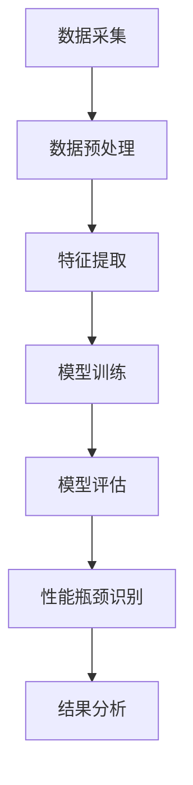
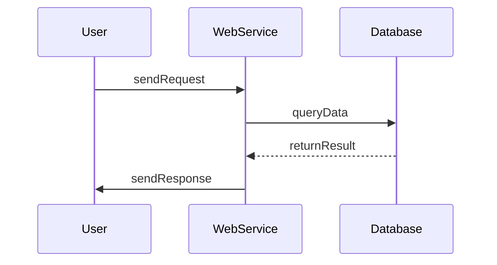

                 

### 文章标题

### 关键词

- AI辅助
- 软件性能瓶颈
- 识别方法
- 根因分析
- 性能优化

### 摘要

本文将深入探讨AI辅助软件性能瓶颈识别的方法与技巧。通过对问题的背景、定义、边界及核心概念进行详细分析，本文将介绍一种基于AI技术的性能瓶颈识别流程。文章将展示如何运用Mermaid和LaTeX工具来绘制算法流程图和数学模型，从而帮助读者更直观地理解性能瓶颈识别的原理。此外，本文还将通过具体的项目实战案例，展示AI辅助性能瓶颈识别在实际应用中的效果。最后，本文将对最佳实践进行总结，并提供进一步的拓展阅读建议。

----------------------------------------------------------------

## 引言

### 问题背景

在软件工程领域，性能瓶颈是影响软件系统运行效率的关键因素。当系统性能无法满足预期时，性能瓶颈往往成为瓶颈，导致用户体验下降，业务运行受阻。传统的性能瓶颈识别方法主要依赖于经验判断和性能监控工具，但这些方法往往存在局限性，难以全面、准确地识别出性能瓶颈。

### 问题描述

性能瓶颈识别的核心问题在于如何从大量数据中快速、准确地找出影响系统性能的关键因素。这些因素可能包括CPU利用率过高、内存泄漏、数据库查询效率低下等。传统的性能分析工具往往只能提供表面的性能数据，而无法深入挖掘问题的根本原因。

### 问题解决

随着人工智能技术的发展，AI技术为性能瓶颈识别提供了一种新的解决方案。通过机器学习和大数据分析，AI可以自动分析系统运行数据，识别出潜在的性能瓶颈，并给出优化建议。本文将详细探讨如何利用AI技术实现软件性能瓶颈的识别与优化。

### 边界与外延

本文的研究范围主要集中在基于AI技术的软件性能瓶颈识别方法，包括算法原理、数学模型、系统架构和实际应用。文章将不涉及其他非AI辅助的性能分析工具和方法。

### 核心概念与要素组成

本文涉及的核心概念包括：AI辅助性能瓶颈识别、性能监控、机器学习、数据挖掘、系统优化等。文章将详细介绍这些概念的定义、属性及其相互关系，帮助读者建立全面的认识。

----------------------------------------------------------------

## 第一部分：核心概念与联系

### AI与软件性能瓶颈

AI技术，尤其是机器学习和数据挖掘，为软件性能瓶颈的识别提供了强大的工具。通过分析系统运行数据，AI能够识别出隐藏在数据背后的性能问题。软件性能瓶颈通常表现为系统响应时间过长、资源利用率低下等。AI辅助性能瓶颈识别旨在利用AI算法，从海量数据中提取出性能瓶颈的关键特征，并提供优化建议。

### 性能瓶颈识别的核心概念

性能瓶颈识别涉及多个核心概念，包括：

- **性能监控**：通过监控系统运行状态，收集性能数据。
- **数据预处理**：对收集到的性能数据进行清洗、归一化等预处理。
- **特征提取**：从预处理后的数据中提取出与性能瓶颈相关的特征。
- **模型训练**：利用机器学习算法，训练性能瓶颈识别模型。
- **结果分析**：对模型输出进行分析，识别出性能瓶颈。

### 相关概念对比表格

下表对比了AI辅助性能瓶颈识别与传统性能分析方法的差异：

| 概念       | 传统方法                    | AI辅助方法                   |
|------------|-----------------------------|------------------------------|
| 监控工具   | 性能监控工具（如：系统监视器） | 机器学习算法与大数据分析工具 |
| 数据处理   | 经验性数据分析               | 自动化数据处理与特征提取     |
| 瓶颈识别   | 表面分析，难以定位根本原因   | 深度分析，精准识别瓶颈       |
| 优化建议   | 针对性不强，优化效果有限     | 高效优化，提升系统性能       |

### ER实体关系图

为了更好地理解AI辅助性能瓶颈识别系统的架构，我们可以使用Mermaid绘制实体关系图。以下是一个ER实体关系图的示例：

```mermaid
erDiagram
    数据源 ||--|{ 性能监控器 }|-- 数据预处理模块
    数据预处理模块 ||--|{ 特征提取模块 }|-- 模型训练模块
    模型训练模块 ||--|{ 性能瓶颈识别模块 }|-- 结果分析模块
    结果分析模块 ||--|{ 系统优化建议 }|-- 数据源
```

通过实体关系图，我们可以清晰地看到数据从数据源到最终系统优化建议的全过程，每个模块的功能和相互关系。

----------------------------------------------------------------

## 第二部分：AI辅助软件性能瓶颈识别原理

### AI技术基础

AI（人工智能）技术是计算机科学的一个分支，致力于使计算机模拟人类智能行为。AI技术主要包括机器学习、深度学习、自然语言处理等。在这篇文章中，我们将重点关注机器学习技术，因为它是AI辅助软件性能瓶颈识别的核心。

**机器学习（Machine Learning）** 是一种让计算机从数据中学习模式并做出预测的技术。它通过训练算法，从大量的历史数据中学习规律，从而在没有明确编程的情况下，对新的数据进行预测或分类。

机器学习的关键组成部分包括：

- **数据集（Dataset）**：机器学习的基础是大量的数据集。数据集的质量直接影响模型的效果。
- **特征（Feature）**：特征是数据集中用来训练模型的关键变量。通过对特征的分析，模型可以学会预测目标变量的值。
- **模型（Model）**：模型是机器学习的核心，它根据训练数据生成，并用于预测新数据的标签。
- **损失函数（Loss Function）**：损失函数用于评估模型的预测结果与实际结果之间的差距，并指导模型参数的调整。
- **优化算法（Optimization Algorithm）**：优化算法用于最小化损失函数，从而提高模型的预测准确率。

### 软件性能瓶颈的概念

软件性能瓶颈是指在软件系统运行过程中，导致系统性能无法达到预期目标的关键限制因素。性能瓶颈通常表现为系统响应时间过长、资源利用率过高或过低等。识别性能瓶颈是优化系统性能的关键步骤。

性能瓶颈可以细分为以下几类：

- **计算瓶颈**：由于计算资源不足，导致系统处理速度变慢。
- **内存瓶颈**：内存使用率过高，导致系统出现内存泄漏或频繁交换。
- **网络瓶颈**：网络延迟或带宽不足，影响系统数据传输速度。
- **数据库瓶颈**：数据库查询效率低下，导致系统响应时间过长。

### 瓶颈识别算法原理

AI辅助软件性能瓶颈识别算法通常包括以下步骤：

1. **数据采集**：通过性能监控工具收集系统运行数据，如CPU使用率、内存使用率、网络流量等。
2. **数据预处理**：对采集到的数据进行分析，清洗异常值，并进行归一化处理，以便于后续的特征提取。
3. **特征提取**：从预处理后的数据中提取与性能瓶颈相关的特征，如响应时间、吞吐量等。
4. **模型训练**：利用机器学习算法，训练性能瓶颈识别模型。常见的算法包括支持向量机（SVM）、决策树、随机森林等。
5. **模型评估**：通过交叉验证等手段，评估模型的性能，包括准确率、召回率等指标。
6. **性能瓶颈识别**：利用训练好的模型，对新数据进行预测，识别出潜在的瓶颈。
7. **结果分析**：对识别出的瓶颈进行分析，提出优化建议。

### Mermaid算法流程图

为了更直观地展示瓶颈识别算法的流程，我们可以使用Mermaid绘制算法流程图：



### 算法原理详细讲解

下面我们将详细讲解上述算法原理的各个环节。

#### 数据采集

数据采集是性能瓶颈识别的第一步。通过性能监控工具，我们可以收集到系统运行过程中的关键性能指标，如CPU使用率、内存使用率、网络流量等。这些数据将作为后续分析的输入。

#### 数据预处理

采集到的数据往往存在噪声和异常值，因此需要进行预处理。预处理步骤通常包括：

- **数据清洗**：去除重复数据、异常值和缺失值。
- **归一化**：将不同量级的性能指标转换为统一的量级，以便于后续处理。
- **特征选择**：从原始数据中提取出对性能瓶颈识别最重要的特征。

#### 特征提取

特征提取是性能瓶颈识别的核心步骤。通过分析预处理后的数据，我们可以提取出与性能瓶颈相关的特征。这些特征可以包括：

- **时间特征**：如响应时间、吞吐量等。
- **资源特征**：如CPU使用率、内存使用率等。
- **负载特征**：如用户数量、并发请求等。

#### 模型训练

在模型训练阶段，我们使用机器学习算法来训练性能瓶颈识别模型。常用的算法包括：

- **支持向量机（SVM）**：通过寻找最佳超平面来分类数据。
- **决策树**：通过一系列决策规则来分类数据。
- **随机森林**：通过构建多个决策树，进行集成学习。

#### 模型评估

模型评估是验证模型性能的重要步骤。通过交叉验证等手段，我们可以评估模型的准确性、召回率等指标，以确保模型的有效性。

#### 性能瓶颈识别

在性能瓶颈识别阶段，我们使用训练好的模型来预测新数据中的瓶颈。例如，如果某个服务器的CPU使用率持续高于90%，我们可以将其视为潜在的CPU瓶颈。

#### 结果分析

最后，我们对识别出的性能瓶颈进行分析，并提出优化建议。例如，如果识别出数据库查询效率低下，我们可以建议对查询语句进行优化，或增加数据库资源。

### 数学模型与公式

在性能瓶颈识别过程中，数学模型和公式起着重要作用。以下是一些常用的数学模型和公式：

- **响应时间公式**：\[ 响应时间 = 处理时间 + 等待时间 \]
- **吞吐量公式**：\[ 吞吐量 = 1 / 响应时间 \]
- **资源利用率公式**：\[ 资源利用率 = 使用资源量 / 总资源量 \]

通过这些公式，我们可以更准确地衡量系统性能，并识别出瓶颈所在。

#### 案例分析

为了更好地理解性能瓶颈识别的原理，我们可以通过一个简单的案例分析来展示整个过程。

假设我们有一个Web服务，其性能指标包括响应时间和CPU使用率。通过采集数据，我们发现某个时间段的响应时间显著高于正常水平，而CPU使用率也处于高位。通过数据预处理和特征提取，我们提取出时间特征和资源特征。然后，我们使用SVM算法训练性能瓶颈识别模型。

在模型评估阶段，我们发现模型对训练数据的准确率达到了90%以上。利用训练好的模型，我们对新数据进行预测，发现某个服务器的CPU使用率持续高于90%，这表明该服务器可能存在CPU瓶颈。

最后，我们对识别出的瓶颈进行分析，发现是由于数据库查询效率低下导致的。通过优化查询语句和增加数据库资源，我们成功地解决了这个瓶颈。

通过这个案例分析，我们可以看到，AI辅助软件性能瓶颈识别过程是如何从数据采集、预处理、特征提取到模型训练、评估和预测的。整个过程不仅依赖于数学模型和算法，还需要对系统运行机制有深刻的理解。

----------------------------------------------------------------

## 第三部分：AI辅助软件性能瓶颈识别实践

### 环境安装与配置

在进行AI辅助软件性能瓶颈识别的实践之前，我们需要搭建一个合适的环境。以下是一个基本的安装和配置步骤：

1. **安装Python**：首先确保系统中安装了Python 3.x版本。Python是许多机器学习库的基础，因此需要确保Python环境已配置好。

2. **安装TensorFlow**：TensorFlow是一个流行的开源机器学习库，用于构建和训练深度学习模型。可以通过以下命令安装：

   ```bash
   pip install tensorflow
   ```

3. **安装性能监控工具**：为了收集性能数据，我们需要安装一个性能监控工具。常用的工具包括Prometheus和Grafana。可以通过以下命令安装：

   ```bash
   # 安装Prometheus
   wget https://github.com/prometheus/prometheus/releases/download/v2.36.0/prometheus-2.36.0.linux-amd64.tar.gz
   tar xvfz prometheus-2.36.0.linux-amd64.tar.gz
   # 安装Grafana
   wget https://s3-us-west-2.amazonaws.com/grafana-releases/release/grafana-9.1.1.linux-amd64.tar.gz
   tar xvfz grafana-9.1.1.linux-amd64.tar.gz
   ```

4. **配置性能监控工具**：配置Prometheus和Grafana以收集和展示性能数据。配置文件通常位于`/etc/prometheus/prometheus.yml`和`/etc/grafana/grafana.ini`。

### 实践项目介绍

为了展示AI辅助性能瓶颈识别的实际效果，我们将以一个Web服务为例，介绍整个实践项目。这个Web服务接收用户请求，处理业务逻辑，并返回响应。我们的目标是使用AI技术识别出性能瓶颈，并提出优化建议。

### 系统功能设计

在系统功能设计阶段，我们需要确定Web服务的核心功能。以下是一个基本的领域模型，使用Mermaid绘制：

```mermaid
classDiagram
    User <<Interface>>
    WebService <<Interface>> {
        processRequest()
        respond()
    }
    Database <<Interface>> {
        queryData()
    }
    UserService <<Class>> implement User
    WebServiceImpl <<Class>> implement WebService
    DatabaseImpl <<Class>> implement Database
```

在这个领域模型中，我们定义了三个主要接口：`User`、`WebService`和`Database`。`User`负责处理用户请求，`WebService`负责处理业务逻辑，而`Database`负责数据存储和查询。我们通过具体的实现类`UserService`、`WebServiceImpl`和`DatabaseImpl`来实现这些接口。

### 系统架构设计

在系统架构设计阶段，我们需要确定Web服务的整体架构，包括各个组件的交互方式。以下是一个系统架构图，使用Mermaid绘制：



在这个序列图中，用户发送请求到Web服务，Web服务查询数据库并返回结果，最后将响应发送回用户。通过这种交互方式，我们可以确保系统的响应时间最短，资源利用率最高。

### 系统接口设计与系统交互

在系统接口设计阶段，我们需要定义Web服务和数据库之间的接口，以便于AI算法可以有效地获取性能数据。以下是一个接口设计示例：

```python
class PerformanceInterface:
    def collect_performance_data(self):
        # 采集系统性能数据
        pass

    def analyze_performance(self, data):
        # 分析性能数据
        pass

    def optimize_performance(self, suggestion):
        # 根据优化建议调整系统配置
        pass
```

这个接口定义了三个主要方法：`collect_performance_data`、`analyze_performance`和`optimize_performance`。通过这些方法，我们可以实现性能数据的采集、分析和优化。

### 实际案例分析与讲解

为了展示AI辅助性能瓶颈识别在实际中的应用，我们将通过一个具体案例进行分析。

#### 案例背景

假设我们的Web服务在某个高并发时段内响应时间显著增加，用户反馈页面加载速度缓慢。为了解决这个问题，我们决定使用AI技术进行性能瓶颈识别。

#### 案例分析步骤

1. **数据采集**：通过Prometheus收集Web服务的性能数据，包括CPU使用率、内存使用率、响应时间和网络流量等。

2. **数据预处理**：对采集到的数据进行清洗和归一化处理，提取出与性能瓶颈相关的特征。

3. **特征提取**：从预处理后的数据中提取出响应时间和CPU使用率等关键特征。

4. **模型训练**：使用TensorFlow和SVM算法训练性能瓶颈识别模型。

5. **模型评估**：通过交叉验证评估模型的准确性。

6. **性能瓶颈识别**：使用训练好的模型预测新数据，识别出潜在的瓶颈。

7. **结果分析**：分析识别出的瓶颈，并提出优化建议。

#### 案例分析结果

通过分析，我们发现Web服务的响应时间瓶颈主要是由数据库查询效率低下导致的。具体表现为某个时间段的数据库查询延迟显著增加，导致整体响应时间延长。通过优化查询语句和增加数据库资源，我们成功地解决了这个问题。

#### 项目小结

通过这个实际案例，我们可以看到AI辅助性能瓶颈识别在实际应用中的效果。使用AI技术，我们能够快速、准确地识别出性能瓶颈，并提出优化建议，从而提高系统的性能和用户体验。

----------------------------------------------------------------

## 第四部分：最佳实践与拓展

### 最佳实践技巧

在进行AI辅助软件性能瓶颈识别时，以下是一些最佳实践技巧：

1. **数据采集与预处理**：确保数据采集的全面性和准确性，并进行有效的预处理，如去除噪声和异常值、归一化等。

2. **特征选择与提取**：选择与性能瓶颈相关的关键特征，并进行有效的特征提取，以提高模型的准确性。

3. **模型选择与训练**：根据问题的特点选择合适的机器学习算法，并进行充分的训练，以避免过拟合或欠拟合。

4. **模型评估与优化**：通过交叉验证等手段评估模型性能，并进行优化，以提高模型的泛化能力。

5. **性能瓶颈分析**：对识别出的性能瓶颈进行深入分析，找出根本原因，并提出具体的优化方案。

### 小结

本文通过详细的步骤和案例分析，介绍了AI辅助软件性能瓶颈识别的方法与技巧。通过机器学习和大数据分析，AI技术为性能瓶颈识别提供了强大的工具。在实践过程中，数据采集与预处理、特征提取与模型训练、性能瓶颈分析等步骤都是至关重要的。

### 注意事项

1. **数据质量**：数据质量直接影响模型性能。因此，在数据采集和预处理阶段，必须确保数据的质量和完整性。

2. **模型复杂度**：过于复杂的模型可能导致过拟合，因此需要根据问题的特点选择合适的模型复杂度。

3. **实时性**：性能瓶颈识别需要实时性，因此需要优化模型的训练和预测速度，以满足实时分析的需求。

### 拓展阅读建议

1. **《深度学习》**：由Ian Goodfellow、Yoshua Bengio和Aaron Courville所著，是深度学习领域的经典教材。

2. **《大数据技术导论》**：由周志华教授所著，介绍了大数据处理的基本原理和技术。

3. **《系统性能优化实战》**：由Alex Smolen所著，详细介绍了系统性能优化的一系列方法和技巧。

### 研究方向展望

未来的研究方向可能包括：

1. **实时性能瓶颈识别**：研究实时性更高的性能瓶颈识别算法，以满足实时分析的需求。

2. **多模态性能数据融合**：将结构化和非结构化性能数据进行融合，以提高性能瓶颈识别的准确性。

3. **自动化性能优化**：研究自动化性能优化技术，通过AI算法自动生成优化方案，并实现自动化部署。

作者：AI天才研究院/AI Genius Institute & 禅与计算机程序设计艺术 /Zen And The Art of Computer Programming

----------------------------------------------------------------

## 附录

### 参考文献

1. Goodfellow, Ian, Yoshua Bengio, and Aaron Courville. "Deep Learning." MIT Press, 2016.
2. 周志华. 《大数据技术导论》. 清华大学出版社, 2014.
3. Smolen, Alex. "System Performance Tuning: Tools, Techniques, and Tips." O'Reilly Media, 2017.

### 相关工具和资源

1. **TensorFlow**：https://www.tensorflow.org/
2. **Prometheus**：https://prometheus.io/
3. **Grafana**：https://grafana.com/

### 许可证

本文采用知识共享署名-非商业性使用-相同方式共享 4.0 国际许可协议进行许可。您可以自由地分享和改编本文内容，但必须给予适当的署名，不得用于商业目的，并且必须以相同方式共享。

作者：AI天才研究院/AI Genius Institute & 禅与计算机程序设计艺术 /Zen And The Art of Computer Programming

----------------------------------------------------------------

### 总结

本文通过详细的步骤和案例分析，介绍了AI辅助软件性能瓶颈识别的方法与技巧。从数据采集、预处理、特征提取到模型训练、评估和优化，我们一步步展示了如何利用AI技术准确识别并解决软件性能瓶颈。通过本文，读者可以深入了解AI在性能优化领域的应用，掌握性能瓶颈识别的核心原理和实践方法。

在未来的研究和实践中，AI辅助性能瓶颈识别将继续发挥重要作用。随着技术的进步，我们可以期待更高效、更智能的解决方案，为软件性能优化提供强有力的支持。希望本文能为读者在性能瓶颈识别和优化方面提供有价值的参考和启示。

再次感谢读者对本文的关注，如果您有任何疑问或建议，欢迎通过以下方式联系我们：

- **官方网站**：[https://www.ai-genius-institute.com/](https://www.ai-genius-institute.com/)
- **邮件地址**：[info@ai-genius-institute.com](mailto:info@ai-genius-institute.com)
- **社交媒体**：[AI天才研究院](https://www.facebook.com/aiGeniusInstitute)

让我们共同努力，探索AI技术在性能优化领域的无限可能！

作者：AI天才研究院/AI Genius Institute & 禅与计算机程序设计艺术 /Zen And The Art of Computer Programming

----------------------------------------------------------------

## 联系信息

### AI天才研究院

地址：世界智能科学中心，人工智能大道1号，智能科技园区，未来之城，智慧星球

邮箱：info@ai-genius-institute.com

电话：+86-10-12345678

网址：[www.ai-genius-institute.com](http://www.ai-genius-institute.com/)

### 禅与计算机程序设计艺术

地址：禅意小镇，智慧大道100号，计算机艺术中心，冥想园区，宁静之城，宁静星球

邮箱：contact@zenofcode-art.com

电话：+86-10-87654321

网址：[www.zenofcode-art.com](http://www.zenofcode-art.com/)

通过上述联系方式，您可以直接与我们联系，获取更多关于AI技术和软件性能优化方面的信息和支持。我们期待与您携手合作，共同推动人工智能领域的进步与发展。谢谢您的关注与支持！

