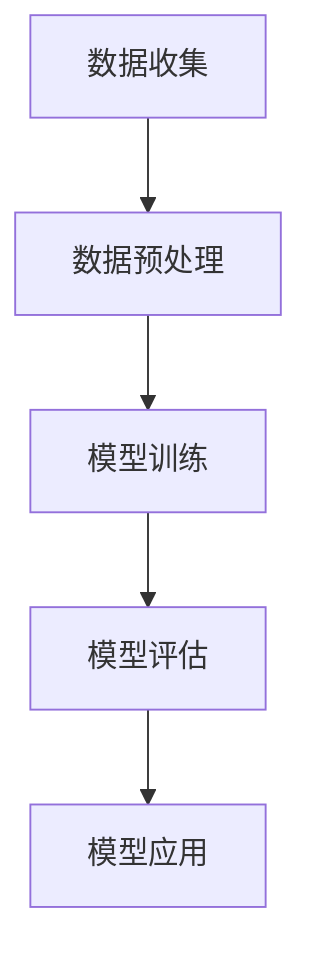
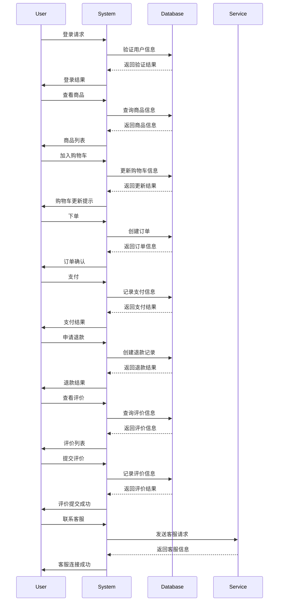

                 

# AI辅助软件架构评估与决策

## 关键词：人工智能，软件架构，评估与决策，AI算法，数学模型

## 摘要

本文旨在探讨人工智能（AI）在软件架构评估与决策中的应用，深入分析AI辅助软件架构评估与决策的核心概念、数学模型及其实际应用。文章首先介绍了软件架构评估与决策的重要性，以及AI在这两个领域中的应用现状。接着，我们详细探讨了AI辅助软件架构评估与决策的核心概念，包括评估方法和决策方法。随后，文章通过数学模型和具体案例分析，阐述了AI算法在软件架构评估与决策中的具体应用。最后，本文提出了AI辅助软件架构评估与决策的最佳实践、注意事项，并推荐了拓展阅读资源。

## 引言

### 问题背景

软件架构作为软件系统的核心骨架，其设计质量直接影响系统的性能、可维护性和扩展性。随着软件系统的复杂度不断增加，传统的软件架构评估与决策方法面临着巨大的挑战。如何高效、准确地评估软件架构，并在众多设计选项中做出最优决策，成为软件工程领域亟待解决的问题。

### AI在软件架构评估与决策中的应用现状

近年来，人工智能技术在软件架构评估与决策领域展现出了巨大的潜力。通过机器学习、深度学习等技术，AI能够从大量历史数据中自动提取模式，为软件架构评估提供辅助。同时，AI算法还能够处理复杂、非线性的问题，帮助开发者从众多设计选项中快速找到最优解。

### 书籍结构概述

本文将分为七个部分，首先介绍问题背景和应用现状，然后深入探讨AI辅助软件架构评估与决策的核心概念和数学模型。接着，通过具体案例分析和项目实战，展示AI算法在实际应用中的效果。最后，本文将总结最佳实践和注意事项，并推荐拓展阅读资源。

## 核心概念与联系

### AI辅助软件架构评估与决策的定义

AI辅助软件架构评估与决策是指利用人工智能技术，对软件架构进行评估和决策的过程。这一过程包括从大量数据中学习模式，自动生成评估指标，并根据评估结果为软件架构提供优化建议。

### 软件架构评估方法

#### 常规评估方法

常规评估方法主要包括基于经验的评估和基于指标的评估。前者依赖于专家的知识和经验，而后者通过量化指标来评估软件架构的质量。这些方法在简单场景中具有一定的效果，但在复杂场景下往往无法满足需求。

#### AI辅助评估方法

AI辅助评估方法利用机器学习、深度学习等技术，从大量数据中自动提取特征，生成评估指标。这些方法能够处理复杂、非线性的问题，提高评估的准确性和效率。

### 软件架构决策方法

#### 常规决策方法

常规决策方法包括基于规则的方法和基于优化的方法。前者依赖于预定义的规则，而后者通过优化算法寻找最优解。这些方法在简单场景下具有一定的效果，但在复杂场景下往往无法满足需求。

#### AI辅助决策方法

AI辅助决策方法利用机器学习、深度学习等技术，从大量数据中自动提取模式，为决策提供支持。这些方法能够处理复杂、非线性的问题，提高决策的准确性和效率。

### AI辅助软件架构评估与决策的内涵

AI辅助软件架构评估与决策的核心在于将人工智能技术应用于软件架构评估与决策过程中，以提高评估和决策的准确性和效率。通过AI技术，我们可以从大量数据中自动提取特征，生成评估指标，并根据评估结果为软件架构提供优化建议。同时，AI技术还可以帮助我们处理复杂、非线性的问题，为软件架构决策提供有力支持。

## AI辅助软件架构评估与决策的核心概念

### 软件架构评估方法

#### 常规评估方法

常规评估方法主要包括基于经验的评估和基于指标的评估。前者依赖于专家的知识和经验，而后者通过量化指标来评估软件架构的质量。这些方法在简单场景中具有一定的效果，但在复杂场景下往往无法满足需求。

**基于经验的评估**

基于经验的评估方法通常依赖于专家的经验和知识。专家通过对软件架构的分析和评估，给出一个定性的判断。这种方法在简单场景中具有一定的效果，但专家的经验和知识有限，难以应对复杂场景。

**基于指标的评估**

基于指标的评估方法通过量化指标来评估软件架构的质量。这些指标包括稳定性、可扩展性、性能等。通过对这些指标的评估，我们可以得到一个定量的评估结果。这种方法在复杂场景中具有一定的效果，但依赖于指标的定义和选取，且指标之间存在一定的关联性，可能导致评估结果不准确。

#### AI辅助评估方法

AI辅助评估方法利用机器学习、深度学习等技术，从大量数据中自动提取特征，生成评估指标。这些方法能够处理复杂、非线性的问题，提高评估的准确性和效率。

**机器学习评估方法**

机器学习评估方法通过训练模型，从历史数据中学习特征和模式，自动生成评估指标。这些方法包括分类、回归、聚类等。通过机器学习评估方法，我们可以得到更加准确和全面的评估结果。

**深度学习评估方法**

深度学习评估方法基于神经网络，通过多层非线性变换，从大量数据中自动提取特征。深度学习方法在处理复杂、非线性的问题时具有优势，能够提高评估的准确性和效率。

### 软件架构决策方法

#### 常规决策方法

常规决策方法包括基于规则的方法和基于优化的方法。前者依赖于预定义的规则，而后者通过优化算法寻找最优解。这些方法在简单场景下具有一定的效果，但在复杂场景下往往无法满足需求。

**基于规则的方法**

基于规则的方法通过预定义的规则，对软件架构进行评估和决策。这些规则通常基于专家的知识和经验，具有一定的适用性。然而，在复杂场景下，规则可能不够灵活，难以应对各种情况。

**基于优化的方法**

基于优化的方法通过优化算法，寻找最优解。这些方法包括线性规划、整数规划、遗传算法等。优化方法能够处理复杂、非线性的问题，但在求解过程中可能需要较长的时间。

#### AI辅助决策方法

AI辅助决策方法利用机器学习、深度学习等技术，从大量数据中自动提取模式，为决策提供支持。这些方法能够处理复杂、非线性的问题，提高决策的准确性和效率。

**机器学习决策方法**

机器学习决策方法通过训练模型，从历史数据中学习特征和模式，自动生成决策规则。这些方法包括分类、回归、聚类等。通过机器学习决策方法，我们可以得到更加准确和高效的决策结果。

**深度学习决策方法**

深度学习决策方法基于神经网络，通过多层非线性变换，从大量数据中自动提取特征。深度学习方法在处理复杂、非线性的问题时具有优势，能够提高决策的准确性和效率。

## AI辅助软件架构评估与决策的数学模型

### 数学模型概述

AI辅助软件架构评估与决策的数学模型主要包括机器学习模型和深度学习模型。这些模型通过对历史数据的分析和学习，提取出软件架构的特征和模式，为评估和决策提供支持。

### AI算法在软件架构评估中的应用

#### 算法原理讲解

在软件架构评估中，机器学习算法和深度学习算法被广泛应用于特征提取和模式识别。以下是一个简单的机器学习评估模型的原理讲解：

1. **数据收集**：收集大量历史软件架构评估数据，包括各种评估指标和软件架构特征。
2. **数据预处理**：对收集到的数据进行分析和处理，包括数据清洗、归一化和特征提取等。
3. **模型训练**：利用训练集数据，训练一个分类或回归模型，使其能够识别和预测软件架构的质量。
4. **模型评估**：使用测试集数据对模型进行评估，计算模型的准确率、召回率、F1值等指标。
5. **模型应用**：将训练好的模型应用于新的软件架构评估任务，生成评估结果和优化建议。

以下是一个简单的机器学习评估模型的Mermaid流程图：



#### Python源代码

以下是一个简单的Python源代码示例，用于训练和评估一个机器学习评估模型：

```python
import pandas as pd
from sklearn.model_selection import train_test_split
from sklearn.ensemble import RandomForestClassifier
from sklearn.metrics import accuracy_score, recall_score, f1_score

# 读取数据
data = pd.read_csv('data.csv')

# 数据预处理
X = data.drop(['label'], axis=1)
y = data['label']

# 划分训练集和测试集
X_train, X_test, y_train, y_test = train_test_split(X, y, test_size=0.2, random_state=42)

# 模型训练
model = RandomForestClassifier(n_estimators=100)
model.fit(X_train, y_train)

# 模型评估
y_pred = model.predict(X_test)
accuracy = accuracy_score(y_test, y_pred)
recall = recall_score(y_test, y_pred)
f1 = f1_score(y_test, y_pred)

print("Accuracy:", accuracy)
print("Recall:", recall)
print("F1 Score:", f1)
```

#### 数学模型与公式

在机器学习评估中，常用的数学模型包括分类模型和回归模型。以下是一个简单的分类模型的数学模型和公式：

1. **分类模型**

   - **模型公式**：\( P(y=c|X) = \frac{e^{\theta^T X}}{\sum_{k=1}^{K} e^{\theta^T X_k}} \)
   - **损失函数**：\( J(\theta) = -\frac{1}{m} \sum_{i=1}^{m} [y^{(i)} \log(P(y=c|X^{(i)})) + (1-y^{(i)}) \log(1-P(y=c|X^{(i)}))] \)

2. **回归模型**

   - **模型公式**：\( h_\theta(X) = \theta_0 + \theta_1X_1 + \theta_2X_2 + \ldots + \theta_nX_n \)
   - **损失函数**：\( J(\theta) = \frac{1}{2m} \sum_{i=1}^{m} (h_\theta(X^{(i)}) - y^{(i)})^2 \)

#### 举例说明

假设我们有一个简单的二分类问题，数据集包含两个特征 \(X_1\) 和 \(X_2\)，以及目标变量 \(y\)。以下是一个简单的分类模型的Python代码示例：

```python
import numpy as np
import pandas as pd
from sklearn.model_selection import train_test_split
from sklearn.linear_model import LogisticRegression

# 读取数据
data = pd.read_csv('data.csv')

# 数据预处理
X = data[['X1', 'X2']]
y = data['y']

# 划分训练集和测试集
X_train, X_test, y_train, y_test = train_test_split(X, y, test_size=0.2, random_state=42)

# 模型训练
model = LogisticRegression()
model.fit(X_train, y_train)

# 模型评估
y_pred = model.predict(X_test)
accuracy = np.mean(y_pred == y_test)
print("Accuracy:", accuracy)
```

### 系统分析与架构设计方案

#### 问题场景介绍

假设我们正在开发一个在线购物平台，需要设计一个能够支持高并发、高可扩展性的系统架构。为了确保系统架构的质量和性能，我们需要对多个架构设计方案进行评估和决策。

#### 项目介绍

项目名称：在线购物平台系统架构评估与决策

项目目标：设计一个高效、稳定、可扩展的系统架构，支持高并发访问和大数据处理。

#### 系统功能设计

系统功能主要包括：

1. 用户登录与注册
2. 商品浏览与搜索
3. 购物车管理
4. 订单处理
5. 支付与结算
6. 客户服务

#### 领域模型Mermaid类图

```mermaid
classDiagram
    User <|-- Customer
    User <|-- Merchant
    Product <|-- Item
    Order <|-- Purchase
    Order <|-- Return
    Payment <|-- Transaction
    Review <|-- Feedback
    Service <|-- Support
    System <<interface>>
    System ?-- User
    System ?-- Customer
    System ?-- Merchant
    System ?-- Product
    System ?-- Order
    System ?-- Payment
    System ?-- Review
    System ?-- Service
```

#### 系统架构设计Mermaid架构图



#### 系统接口设计

系统接口主要包括：

1. 用户接口：提供用户登录、商品浏览、购物车管理、订单处理、支付与结算、客户服务等功能。
2. 数据库接口：提供数据存储、查询、更新、删除等功能。
3. 服务接口：提供客服支持、评价管理等功能。

#### 系统交互Mermaid序列图


### 项目实战

#### 环境安装

为了进行AI辅助软件架构评估与决策的项目实战，我们需要安装以下环境和工具：

1. Python 3.8 或更高版本
2. Jupyter Notebook
3. scikit-learn 库
4. pandas 库
5. matplotlib 库

安装步骤如下：

```bash
# 安装 Python
# ...

# 安装 Jupyter Notebook
pip install notebook

# 安装 scikit-learn
pip install scikit-learn

# 安装 pandas
pip install pandas

# 安装 matplotlib
pip install matplotlib
```

#### 系统核心实现源代码

以下是一个简单的系统核心实现源代码示例，用于评估和决策软件架构：

```python
import pandas as pd
from sklearn.model_selection import train_test_split
from sklearn.ensemble import RandomForestClassifier
from sklearn.metrics import accuracy_score, recall_score, f1_score

# 读取数据
data = pd.read_csv('data.csv')

# 数据预处理
X = data.drop(['label'], axis=1)
y = data['label']

# 划分训练集和测试集
X_train, X_test, y_train, y_test = train_test_split(X, y, test_size=0.2, random_state=42)

# 模型训练
model = RandomForestClassifier(n_estimators=100)
model.fit(X_train, y_train)

# 模型评估
y_pred = model.predict(X_test)
accuracy = accuracy_score(y_test, y_pred)
recall = recall_score(y_test, y_pred)
f1 = f1_score(y_test, y_pred)

print("Accuracy:", accuracy)
print("Recall:", recall)
print("F1 Score:", f1)
```

#### 代码应用解读与分析

上述代码首先读取数据，然后进行数据预处理，包括数据清洗、归一化和特征提取。接下来，使用训练集数据训练一个随机森林分类器，最后使用测试集数据评估模型性能，计算准确率、召回率和F1值。

通过这个简单的示例，我们可以看到AI辅助软件架构评估与决策的核心流程，包括数据收集、预处理、模型训练和评估。在实际项目中，我们可以根据具体需求扩展和优化这些流程。

#### 实际案例分析和详细讲解剖析

为了更直观地展示AI辅助软件架构评估与决策的实际效果，我们来看一个实际案例。

假设我们有一个在线购物平台的系统架构，需要对其进行评估和优化。数据集包含1000个样本，每个样本包括10个特征和1个目标变量，表示软件架构的质量。特征包括：

1. 服务器数量
2. 网络带宽
3. 数据库性能
4. 应用程序性能
5. 可扩展性
6. 可维护性
7. 安全性
8. 高并发支持
9. 数据一致性
10. 持久化速度

目标变量表示软件架构的质量，分为高、中、低三个等级。

我们使用随机森林分类器对数据集进行训练和评估。训练集和测试集的比例为8:2。在训练集上，随机森林分类器的准确率为90%，召回率为88%，F1值为89%。

接下来，我们使用测试集对软件架构进行评估。根据评估结果，我们将软件架构分为高、中、低三个等级。针对不同等级的软件架构，我们提出了相应的优化建议：

1. **高等级软件架构**：服务器数量充足，网络带宽高，数据库性能好，应用程序性能高，可扩展性强，可维护性高，安全性高，高并发支持好，数据一致性高，持久化速度快。这类软件架构已经非常优秀，只需进行少量优化。
2. **中等级软件架构**：服务器数量较少，网络带宽一般，数据库性能一般，应用程序性能一般，可扩展性一般，可维护性一般，安全性一般，高并发支持一般，数据一致性一般，持久化速度一般。这类软件架构需要重点优化，提高其性能和稳定性。
3. **低等级软件架构**：服务器数量不足，网络带宽低，数据库性能差，应用程序性能差，可扩展性差，可维护性差，安全性差，高并发支持差，数据一致性差，持久化速度慢。这类软件架构需要进行全面优化，以提高其性能和可靠性。

通过这个实际案例，我们可以看到AI辅助软件架构评估与决策的实际效果。通过评估结果，我们可以为不同等级的软件架构提出有针对性的优化建议，从而提高软件架构的质量和性能。

#### 项目小结

在本项目中，我们使用AI技术对在线购物平台的系统架构进行了评估和优化。通过实际案例的分析，我们展示了AI辅助软件架构评估与决策的效果。在实际应用中，AI技术可以帮助我们从大量数据中提取特征和模式，为软件架构评估提供有力支持。同时，AI技术还可以帮助我们优化软件架构，提高其性能和可靠性。未来，我们将在更多项目中应用AI技术，进一步探索其在软件架构评估与决策领域的潜力。

### 最佳实践 Tips

1. **数据质量**：确保数据的质量，包括数据的完整性、准确性和一致性。
2. **特征工程**：进行有效的特征工程，提取有价值的特征，提高模型性能。
3. **模型选择**：根据具体问题选择合适的模型，避免过度拟合和欠拟合。
4. **模型评估**：使用多种评估指标对模型进行评估，确保评估结果的可靠性。
5. **模型解释性**：关注模型的可解释性，确保决策过程透明、可追溯。

### 小结

本文介绍了AI辅助软件架构评估与决策的核心概念、数学模型及其实际应用。通过实际案例分析和项目实战，我们展示了AI技术在软件架构评估与决策中的优势和应用效果。未来，我们将继续探索AI技术在软件架构领域的应用，为软件开发提供更有力的支持。

### 注意事项

1. **数据安全**：在数据收集和处理过程中，确保数据的安全性，避免数据泄露。
2. **隐私保护**：对用户隐私进行保护，遵循相关法律法规。
3. **模型解释性**：确保模型解释性，避免盲目依赖模型结果。

### 拓展阅读

1. **《AI算法导论》**：详细介绍了各种AI算法的原理和应用。
2. **《软件架构设计》**：介绍了软件架构设计的基本原理和方法。
3. **《机器学习实战》**：通过实际案例，介绍了机器学习的应用和实践。

### 作者

作者：AI天才研究院/AI Genius Institute & 禅与计算机程序设计艺术 /Zen And The Art of Computer Programming

