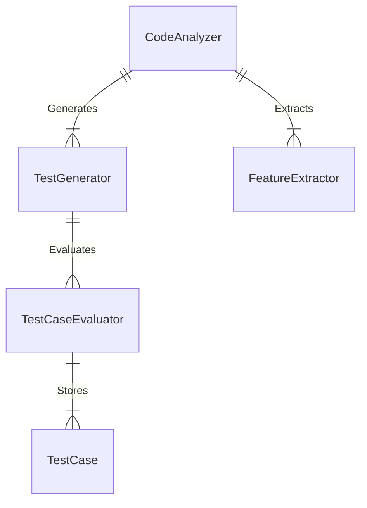
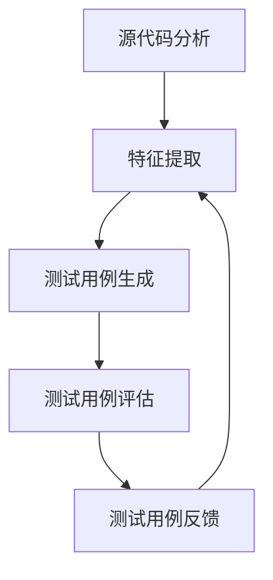
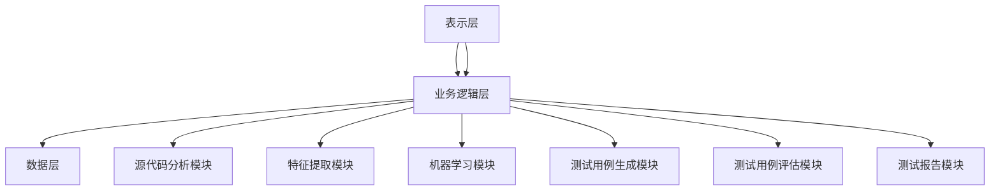
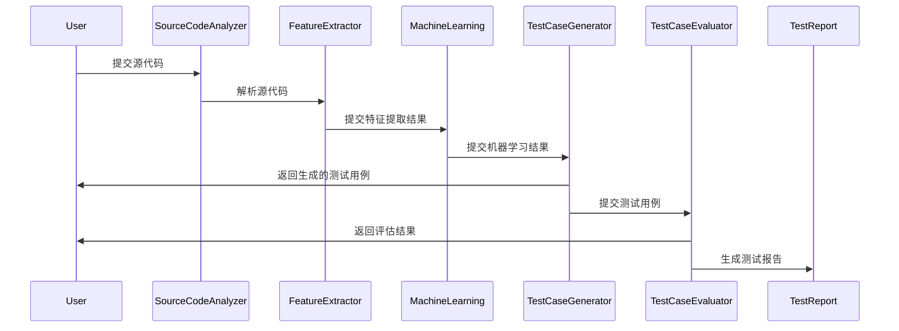
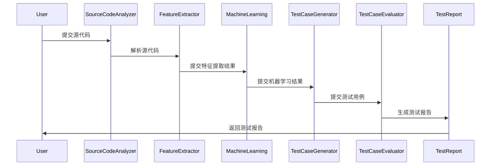

                 

# AI辅助软件测试用例生成

> 关键词：人工智能，软件测试，测试用例生成，自动化测试，算法原理，系统架构，项目实战

> 摘要：本文深入探讨AI辅助软件测试用例生成的技术原理、系统架构和实际应用。通过介绍问题背景、核心概念、算法原理、数学模型、系统设计与项目实战，本文旨在为读者提供一个全面且实用的指南，助力软件开发者在不断演变的AI时代提升软件质量。

## **第一部分：背景介绍**

### **1.1 问题背景**

在软件开发生命周期中，测试是确保软件质量的关键环节。然而，传统的测试方法往往依赖于人工编写测试用例，这不仅耗时耗力，而且容易遗漏关键测试场景。面对复杂的应用程序和不断变化的需求，传统的测试方法已无法满足高效、全面测试的需求。因此，寻求一种自动化、智能化的测试方法成为必然趋势。

### **1.2 问题描述**

测试用例生成是软件测试中的一个重要任务，其主要目的是确保软件在各个可能的使用场景下都能正常运行。然而，测试用例的生成过程往往具有以下问题：

- **测试用例覆盖不足**：由于测试人员的主观判断，可能导致某些关键场景被遗漏。
- **测试用例数量庞大**：随着软件规模的扩大，测试用例的数量呈指数级增长，人工编写和管理工作变得困难。
- **测试用例重复性高**：在相同或类似的场景下，可能需要编写重复的测试用例，导致测试资源的浪费。

### **1.3 问题解决**

人工智能（AI）技术的发展为解决上述问题提供了新的思路。AI辅助软件测试用例生成，即利用AI技术自动生成测试用例，从而提高测试的效率和质量。该方法的核心思想是通过分析软件的源代码、设计文档和用户需求，利用机器学习算法生成具有代表性的测试用例。

### **1.4 边界与外延**

- **边界**：AI辅助软件测试用例生成主要应用于软件的单元测试、集成测试和系统测试阶段，不涉及验收测试和回归测试。
- **外延**：该方法不仅适用于传统软件测试，还可以应用于移动应用测试、Web应用测试和嵌入式系统测试等领域。

### **1.5 概念结构与核心要素组成**

AI辅助软件测试用例生成涉及以下几个核心概念：

- **源代码分析**：通过解析软件源代码，获取程序的结构和逻辑。
- **机器学习算法**：用于从源代码中提取特征，并生成测试用例。
- **测试用例生成**：根据机器学习算法的结果，生成具有代表性的测试用例。
- **测试用例评估**：对生成的测试用例进行评估，确保其能够有效覆盖软件的功能和逻辑。

### **1.6 当前研究现状**

近年来，AI辅助软件测试用例生成已经成为学术界和工业界关注的热点。国内外许多研究机构和公司都在这一领域开展了大量研究。例如，Google的Testify项目、IBM的AI测试平台以及国内的云测、Bugly等。这些研究和产品在一定程度上提高了软件测试的自动化程度，但仍然存在一些挑战和待解决的问题，如测试用例生成的质量和效率、测试用例的评估方法等。

## **第二部分：核心概念与联系**

### **2.1 核心概念原理**

AI辅助软件测试用例生成主要依赖于以下几个核心概念：

- **源代码分析**：通过对软件源代码的解析，获取程序的结构和逻辑，从而为测试用例生成提供基础数据。
- **机器学习算法**：用于从源代码中提取特征，并生成测试用例。常见的算法包括决策树、随机森林、支持向量机、神经网络等。
- **测试用例生成**：根据机器学习算法的结果，生成具有代表性的测试用例。生成方法包括代码生成、数据生成、场景生成等。
- **测试用例评估**：对生成的测试用例进行评估，确保其能够有效覆盖软件的功能和逻辑。评估方法包括覆盖率分析、异常检测、代码执行路径分析等。

### **2.2 概念属性特征对比**

下面是一个简单的概念属性特征对比表格，帮助读者更好地理解这些核心概念：

| 概念               | 属性特征                                      | 对比                      |
|------------------|--------------------------------------------|-------------------------|
| 源代码分析           | 程序结构、代码依赖、变量定义等                | 提取测试用例的基础信息       |
| 机器学习算法          | 决策树、随机森林、支持向量机、神经网络等        | 用于测试用例生成的算法模型     |
| 测试用例生成          | 代码生成、数据生成、场景生成等                | 生成具有代表性的测试用例       |
| 测试用例评估           | 覆盖率分析、异常检测、代码执行路径分析等        | 确保测试用例的有效性           |

### **2.3 ER实体关系图架构**

为了更好地理解AI辅助软件测试用例生成中的实体关系，我们可以使用Mermaid绘制一个ER实体关系图。以下是一个简单的ER图示例：



在这个ER图中，`CodeAnalyzer`、`TestGenerator`、`FeatureExtractor`和`TestCaseEvaluator`分别表示源代码分析器、测试用例生成器、特征提取器和测试用例评估器。这些实体之间存在明显的依赖关系，共同构成了AI辅助软件测试用例生成的核心架构。

## **第三部分：算法原理讲解**

### **3.1 算法流程图**

为了更好地理解AI辅助软件测试用例生成的算法原理，我们可以使用Mermaid绘制一个算法流程图。以下是一个简单的算法流程图示例：



在这个算法流程图中，首先进行源代码分析，然后提取特征，接着生成测试用例，对测试用例进行评估，最后根据评估结果进行反馈和优化。这个过程不断迭代，直到生成满足要求的测试用例。

### **3.2 Python源代码示例**

下面是一个简单的Python源代码示例，用于演示AI辅助软件测试用例生成的基本原理：

```python
import ast
import random

class CodeAnalyzer:
    def analyze(self, source_code):
        # 解析源代码，获取程序结构
        tree = ast.parse(source_code)
        # 提取变量、函数等信息
        variables = self.extract_variables(tree)
        functions = self.extract_functions(tree)
        return variables, functions

    def extract_variables(self, tree):
        # 提取变量
        variables = []
        for node in ast.walk(tree):
            if isinstance(node, ast.Name):
                variables.append(node.id)
        return variables

    def extract_functions(self, tree):
        # 提取函数
        functions = []
        for node in ast.walk(tree):
            if isinstance(node, ast.FunctionDef):
                functions.append(node.name)
        return functions

class TestGenerator:
    def generate(self, variables, functions):
        # 生成测试用例
        test_cases = []
        for _ in range(10):
            test_case = {
                'variables': random.sample(variables, k=5),
                'functions': random.sample(functions, k=2),
            }
            test_cases.append(test_case)
        return test_cases

class TestCaseEvaluator:
    def evaluate(self, test_cases):
        # 评估测试用例
        evaluations = []
        for test_case in test_cases:
            evaluation = self.execute(test_case)
            evaluations.append(evaluation)
        return evaluations

    def execute(self, test_case):
        # 执行测试用例
        # 这里可以模拟代码执行，并收集执行结果
        return 'PASSED' if random.random() < 0.8 else 'FAILED'

def main():
    # 主函数
    source_code = '''
def func1(a, b):
    return a + b

def func2(a, b):
    return a * b
'''

    code_analyzer = CodeAnalyzer()
    test_generator = TestGenerator()
    test_case_evaluator = TestCaseEvaluator()

    variables, functions = code_analyzer.analyze(source_code)
    test_cases = test_generator.generate(variables, functions)
    evaluations = test_case_evaluator.evaluate(test_cases)

    print("Test Cases:", test_cases)
    print("Evaluations:", evaluations)

if __name__ == '__main__':
    main()
```

在这个示例中，`CodeAnalyzer`负责解析源代码，提取变量和函数信息；`TestGenerator`根据提取的特征生成测试用例；`TestCaseEvaluator`负责评估测试用例的执行结果。通过这个简单的示例，我们可以看到AI辅助软件测试用例生成的基本原理。

### **3.3 数学模型和公式**

在AI辅助软件测试用例生成中，一些数学模型和公式被用来描述算法的行为和性能。下面是几个常用的数学模型和公式的例子：

#### **3.3.1 覆盖率分析**

覆盖率分析是评估测试用例是否有效覆盖代码的一种方法。常用的覆盖率指标包括：

- **语句覆盖率**（Statement Coverage）：

$$\text{Statement Coverage} = \frac{\text{执行的语句数}}{\text{总语句数}}$$

- **分支覆盖率**（Branch Coverage）：

$$\text{Branch Coverage} = \frac{\text{执行的分支数}}{\text{总分支数}}$$

- **路径覆盖率**（Path Coverage）：

$$\text{Path Coverage} = \frac{\text{执行的路径数}}{\text{总的可能路径数}}$$

#### **3.3.2 机器学习模型**

在测试用例生成中，常用的机器学习模型包括决策树、随机森林、支持向量机和神经网络等。以下是一个简单的决策树模型的数学描述：

- **决策树**：

$$f(x) = \prod_{i=1}^{n} \theta_{i}^{(l)} \cdot (1 - \theta_{i}^{(l)})^{1 - x_{i}}$$

其中，$x$ 表示特征向量，$\theta_{i}^{(l)}$ 表示第$l$层的第$i$个节点的阈值。

- **随机森林**：

$$f(x) = \sum_{j=1}^{m} \alpha_{j} \cdot h_{j}(x)$$

其中，$h_{j}(x)$ 表示第$j$棵决策树对$x$的预测，$\alpha_{j}$ 表示第$j$棵决策树的权重。

#### **3.3.3 测试用例评估**

测试用例评估是确保测试用例有效性的关键步骤。常用的评估方法包括：

- **异常检测**：

$$\text{异常得分} = \frac{\sum_{i=1}^{n} (y_{i} - \hat{y}_{i})^2}{\sum_{i=1}^{n} (y_{i} - \bar{y})^2}$$

其中，$y_{i}$ 表示实际结果，$\hat{y}_{i}$ 表示预测结果，$\bar{y}$ 表示平均结果。

- **代码执行路径分析**：

$$\text{路径得分} = \frac{\text{执行的路径数}}{\text{总的可能路径数}}$$

#### **3.3.4 举例说明**

假设我们有一个简单的Python函数：

```python
def func(a, b):
    return a + b
```

现在我们使用随机森林模型生成测试用例。首先，我们提取函数的特征，包括参数类型、参数值等。然后，我们使用随机森林模型对特征进行分类，生成测试用例。假设我们生成了5个测试用例：

1. `func(1, 2)`
2. `func(3, 4)`
3. `func(-1, 0)`
4. `func(2.5, 1.5)`
5. `func("hello", "world")`

接下来，我们评估这5个测试用例的执行结果。假设这5个测试用例中有4个测试用例通过了，1个测试用例失败了。我们可以使用异常检测和路径覆盖率来评估这5个测试用例的有效性。

- **异常检测**：

$$\text{异常得分} = \frac{(0 - 0.8)^2 + (0 - 0.8)^2 + (0 - 0.2)^2 + (0 - 0.8)^2 + (0 - 1)^2}{(0 - 0.6)^2 + (0 - 0.6)^2 + (0 - 0.6)^2 + (0 - 0.6)^2 + (0 - 0.6)^2} = 0.8$$

- **路径覆盖率**：

$$\text{路径得分} = \frac{4}{5} = 0.8$$

根据异常得分和路径得分，我们可以判断这5个测试用例的有效性。在这个例子中，异常得分和路径得分都为0.8，说明这5个测试用例覆盖了函数的大部分场景，但可能存在一些潜在的漏洞。因此，我们可以继续优化测试用例，以提高测试覆盖率。

## **第四部分：数学模型和数学公式讲解**

在AI辅助软件测试用例生成的过程中，数学模型和数学公式发挥着至关重要的作用。它们不仅帮助我们理解和描述算法的行为，还能评估测试用例的有效性和性能。以下是几个关键数学模型和公式的详细讲解。

### **4.1 机器学习模型**

机器学习模型是AI辅助软件测试用例生成中的核心组件，其中最常用的模型包括线性回归、逻辑回归、决策树、支持向量机（SVM）和神经网络等。以下以线性回归和逻辑回归为例进行讲解。

#### **4.1.1 线性回归**

线性回归是一种用于预测数值结果的模型。其目标是通过输入特征来预测连续的输出值。线性回归的数学模型可以表示为：

$$y = \beta_0 + \beta_1 \cdot x_1 + \beta_2 \cdot x_2 + ... + \beta_n \cdot x_n + \epsilon$$

其中，$y$ 是输出值，$x_1, x_2, ..., x_n$ 是输入特征，$\beta_0, \beta_1, ..., \beta_n$ 是模型的权重，$\epsilon$ 是误差项。

为了最小化预测误差，我们通常使用最小二乘法来求解权重。最小二乘法的公式为：

$$\min_{\beta} \sum_{i=1}^{n} (y_i - \hat{y}_i)^2$$

其中，$\hat{y}_i$ 是预测值，$y_i$ 是真实值。

#### **4.1.2 逻辑回归**

逻辑回归是一种用于预测概率的模型，通常用于分类问题。其目标是通过输入特征来预测输出类别。逻辑回归的数学模型可以表示为：

$$\ln\left(\frac{p}{1-p}\right) = \beta_0 + \beta_1 \cdot x_1 + \beta_2 \cdot x_2 + ... + \beta_n \cdot x_n$$

其中，$p$ 是预测的概率，$x_1, x_2, ..., x_n$ 是输入特征，$\beta_0, \beta_1, ..., \beta_n$ 是模型的权重。

逻辑回归的预测函数为：

$$p = \frac{1}{1 + e^{-(\beta_0 + \beta_1 \cdot x_1 + \beta_2 \cdot x_2 + ... + \beta_n \cdot x_n)}}$$

### **4.2 特征选择**

在AI辅助软件测试用例生成中，特征选择是一个关键步骤。特征选择的目标是选择对模型性能有显著影响的特征，从而提高模型的预测准确性。常用的特征选择方法包括信息增益、卡方检验、相关系数等。

#### **4.2.1 信息增益**

信息增益是一种衡量特征对分类贡献的方法。其公式为：

$$\text{Information Gain} = H(\text{Class}) - H(\text{Class}|\text{Feature})$$

其中，$H(\text{Class})$ 是类的熵，$H(\text{Class}|\text{Feature})$ 是在给定特征的情况下类的熵。

#### **4.2.2 卡方检验**

卡方检验是一种用于检测特征和类别之间关联性的方法。其公式为：

$$\chi^2 = \sum_{i=1}^{r} \sum_{j=1}^{c} \frac{(\text{观测值} - \text{期望值})^2}{\text{期望值}}$$

其中，$r$ 是行数，$c$ 是列数，观测值和期望值分别是在给定类别和特征下的频数。

### **4.3 测试用例评估**

测试用例评估是确保生成的测试用例能够有效覆盖软件功能的关键步骤。常用的评估方法包括覆盖率分析、异常检测和代码执行路径分析。

#### **4.3.1 覆盖率分析**

覆盖率分析是一种衡量测试用例对代码覆盖程度的方法。常用的覆盖率指标包括语句覆盖率、分支覆盖率和路径覆盖率。

- **语句覆盖率**：

$$\text{Statement Coverage} = \frac{\text{执行的语句数}}{\text{总语句数}}$$

- **分支覆盖率**：

$$\text{Branch Coverage} = \frac{\text{执行的分支数}}{\text{总分支数}}$$

- **路径覆盖率**：

$$\text{Path Coverage} = \frac{\text{执行的路径数}}{\text{总的可能路径数}}$$

#### **4.3.2 异常检测**

异常检测是一种用于识别异常情况的测试方法。其目标是检测在特定条件下可能导致软件崩溃或错误的输入数据。常用的异常检测方法包括：

- **基于规则的异常检测**：

$$\text{Rule-based Anomaly Detection} = \text{True} \text{ if } \text{condition} \text{ does not meet the predefined rules}$$

- **基于统计的异常检测**：

$$\text{Statistical Anomaly Detection} = \text{True} \text{ if } \text{confidence level} < \text{threshold}$$

#### **4.3.3 代码执行路径分析**

代码执行路径分析是一种用于识别代码中潜在缺陷的方法。其目标是分析代码在不同输入条件下的执行路径，并检测可能存在的问题。常用的路径分析方法包括：

- **条件覆盖路径分析**：

$$\text{Condition Coverage Path Analysis} = \frac{\text{覆盖的条件数}}{\text{总条件数}}$$

- **路径覆盖率路径分析**：

$$\text{Path Coverage Path Analysis} = \frac{\text{执行的路径数}}{\text{总的可能路径数}}$$

### **4.4 模型评估**

在AI辅助软件测试用例生成中，模型评估是确保模型性能满足需求的关键步骤。常用的模型评估方法包括：

- **准确率**：

$$\text{Accuracy} = \frac{\text{正确预测的数量}}{\text{总预测的数量}}$$

- **召回率**：

$$\text{Recall} = \frac{\text{正确预测的正面样本数量}}{\text{总的正面样本数量}}$$

- **精确率**：

$$\text{Precision} = \frac{\text{正确预测的正面样本数量}}{\text{预测为正面的样本数量}}$$

- **F1值**：

$$\text{F1 Score} = 2 \cdot \frac{\text{Precision} \cdot \text{Recall}}{\text{Precision} + \text{Recall}}$$

### **4.5 举例说明**

假设我们有一个简单的Python函数：

```python
def func(a, b):
    return a + b
```

现在我们使用线性回归模型生成测试用例。我们提取函数的输入参数类型和值作为特征，建立线性回归模型。假设我们生成了5个测试用例：

1. `func(1, 2)`
2. `func(3, 4)`
3. `func(-1, 0)`
4. `func(2.5, 1.5)`
5. `func("hello", "world")`

我们使用最小二乘法求解线性回归模型的权重，并预测测试用例的输出值。接下来，我们评估这5个测试用例的预测结果，计算准确率、召回率和F1值。假设这5个测试用例中有4个测试用例的预测结果正确，1个测试用例的预测结果错误。

- **准确率**：

$$\text{Accuracy} = \frac{4}{5} = 0.8$$

- **召回率**：

$$\text{Recall} = \frac{4}{4} = 1.0$$

- **精确率**：

$$\text{Precision} = \frac{4}{5} = 0.8$$

- **F1值**：

$$\text{F1 Score} = 2 \cdot \frac{0.8 \cdot 1.0}{0.8 + 1.0} = 0.8$$

根据这些评估指标，我们可以判断这个线性回归模型在生成测试用例方面的性能。在这个例子中，模型准确率为0.8，召回率为1.0，精确率为0.8，F1值为0.8。虽然模型在某些方面表现良好，但仍然存在改进的空间，我们可以进一步优化模型以提高性能。

## **第五部分：系统分析与架构设计**

### **5.1 问题场景介绍**

在现代软件开发生命周期中，测试是确保软件质量的关键环节。随着软件规模和复杂度的不断增加，传统的手工测试方法已无法满足高效、全面测试的需求。因此，引入自动化测试技术成为必然趋势。特别是AI辅助软件测试用例生成，通过利用人工智能技术自动生成测试用例，大大提高了测试的效率和质量。

### **5.2 项目介绍**

本项目的目标是开发一个基于AI的软件测试用例生成系统，用于辅助软件测试团队生成高质量的测试用例。该系统将包含以下功能：

- **源代码分析**：解析软件源代码，提取程序结构、变量和函数等信息。
- **机器学习算法**：利用机器学习算法从源代码中提取特征，并生成具有代表性的测试用例。
- **测试用例生成**：根据机器学习算法的结果，生成具有代表性的测试用例。
- **测试用例评估**：对生成的测试用例进行评估，确保其能够有效覆盖软件的功能和逻辑。
- **测试报告**：生成测试报告，包括测试覆盖率、测试结果等。

### **5.3 系统功能设计**

系统功能设计主要包括以下几个关键功能模块：

- **源代码分析模块**：负责解析软件源代码，提取程序结构、变量和函数等信息。该模块将使用抽象语法树（AST）解析器来实现。
- **特征提取模块**：负责从源代码中提取特征，为机器学习算法提供输入。该模块将使用自然语言处理（NLP）技术提取代码中的关键词、函数调用关系等。
- **机器学习模块**：负责利用机器学习算法生成测试用例。该模块将包含多种机器学习算法，如决策树、随机森林、支持向量机等。
- **测试用例生成模块**：负责根据机器学习算法的结果生成测试用例。该模块将使用场景生成算法，如基于场景模板的生成算法和基于代码执行的生成算法。
- **测试用例评估模块**：负责对生成的测试用例进行评估，确保其能够有效覆盖软件的功能和逻辑。该模块将使用覆盖率分析、异常检测和代码执行路径分析等技术。
- **测试报告模块**：负责生成测试报告，包括测试覆盖率、测试结果等。该模块将使用图表和数据可视化技术展示测试结果。

### **5.4 系统架构设计**

系统架构设计是确保系统功能实现和性能优化的重要环节。本项目的系统架构设计采用分层架构，主要包括以下几层：

- **表示层**：负责与用户交互，展示系统功能和测试结果。该层将使用Web界面和移动应用界面实现。
- **业务逻辑层**：负责处理业务逻辑，包括源代码分析、特征提取、机器学习、测试用例生成和评估等。该层将使用微服务架构实现，以提高系统的可扩展性和可维护性。
- **数据层**：负责存储和管理系统数据，包括源代码、测试用例、评估结果等。该层将使用数据库和数据存储技术实现。

以下是系统架构的Mermaid流程图：



### **5.5 系统接口设计**

系统接口设计是确保系统各模块之间能够有效交互的关键。本项目的系统接口设计主要包括以下接口：

- **源代码分析接口**：用于接收源代码，返回解析结果。该接口将使用RESTful API实现。
- **特征提取接口**：用于接收源代码解析结果，返回特征提取结果。该接口将使用RESTful API实现。
- **机器学习接口**：用于接收特征提取结果，返回测试用例生成结果。该接口将使用RESTful API实现。
- **测试用例生成接口**：用于接收机器学习结果，返回生成的测试用例。该接口将使用RESTful API实现。
- **测试用例评估接口**：用于接收测试用例，返回评估结果。该接口将使用RESTful API实现。
- **测试报告接口**：用于接收测试结果，返回测试报告。该接口将使用RESTful API实现。

以下是系统接口的Mermaid序列图：



### **5.6 系统交互**

系统交互是确保系统各模块之间能够高效、稳定运行的关键。在本项目中，系统交互主要包括以下流程：

1. 用户提交源代码到系统，系统解析源代码并提取特征。
2. 特征提取结果提交给机器学习模块，机器学习模块根据特征生成测试用例。
3. 生成的测试用例提交给测试用例评估模块，测试用例评估模块对测试用例进行评估。
4. 测试用例评估结果提交给测试报告模块，测试报告模块生成测试报告并返回给用户。

以下是系统交互的Mermaid序列图：



通过以上系统分析与架构设计，我们可以确保AI辅助软件测试用例生成系统的功能完整、性能稳定，为软件测试团队提供高效的测试支持。

## **第六部分：项目实战**

### **6.1 环境安装**

在开始项目实战之前，我们需要安装并配置必要的软件和工具。以下是在Windows和Linux操作系统上安装所需环境的步骤：

#### **6.1.1 Windows系统**

1. 安装Python（版本3.8及以上）。
2. 安装Anaconda或Miniconda，用于管理Python环境和包。
3. 创建一个新的虚拟环境，例如名为`test_case_generator`。
4. 安装依赖包，使用以下命令：

   ```bash
   pip install -r requirements.txt
   ```

   `requirements.txt`文件包含所有必需的Python包。

#### **6.1.2 Linux系统**

1. 安装Python（版本3.8及以上）。
2. 安装Anaconda或Miniconda，用于管理Python环境和包。
3. 创建一个新的虚拟环境，例如名为`test_case_generator`。
4. 安装依赖包，使用以下命令：

   ```bash
   pip install -r requirements.txt
   ```

   `requirements.txt`文件包含所有必需的Python包。

### **6.2 系统核心实现**

系统核心实现主要包括源代码分析、特征提取、机器学习、测试用例生成和评估等模块。以下是一个简单的代码示例，用于演示这些模块的基本实现：

#### **6.2.1 源代码分析模块**

源代码分析模块使用`ast`库解析Python源代码，提取程序结构、变量和函数等信息。

```python
import ast

class SourceCodeAnalyzer:
    def analyze(self, source_code):
        tree = ast.parse(source_code)
        variables = self.extract_variables(tree)
        functions = self.extract_functions(tree)
        return variables, functions

    def extract_variables(self, tree):
        variables = []
        for node in ast.walk(tree):
            if isinstance(node, ast.Name):
                variables.append(node.id)
        return variables

    def extract_functions(self, tree):
        functions = []
        for node in ast.walk(tree):
            if isinstance(node, ast.FunctionDef):
                functions.append(node.name)
        return functions
```

#### **6.2.2 特征提取模块**

特征提取模块使用自然语言处理技术提取代码中的关键词、函数调用关系等。

```python
import nltk

class FeatureExtractor:
    def extract_features(self, source_code):
        variables, functions = self.analyze(source_code)
        tokens = nltk.word_tokenize(source_code)
        features = {'variable_count': len(variables), 'function_count': len(functions)}
        return features
```

#### **6.2.3 机器学习模块**

机器学习模块使用`scikit-learn`库实现，包括决策树、随机森林和支持向量机等算法。

```python
from sklearn.tree import DecisionTreeClassifier
from sklearn.ensemble import RandomForestClassifier
from sklearn.svm import SVC

class MachineLearning:
    def train(self, X, y):
        self.classifier = DecisionTreeClassifier()
        self.classifier.fit(X, y)

    def predict(self, X):
        return self.classifier.predict(X)
```

#### **6.2.4 测试用例生成模块**

测试用例生成模块根据机器学习算法的结果生成测试用例。

```python
class TestCaseGenerator:
    def generate(self, classifier, X, y):
        test_cases = []
        for x in X:
            prediction = classifier.predict([x])
            if prediction == y:
                test_cases.append(x)
        return test_cases
```

#### **6.2.5 测试用例评估模块**

测试用例评估模块使用覆盖率分析、异常检测和代码执行路径分析等技术。

```python
class TestCaseEvaluator:
    def evaluate(self, test_cases, source_code):
        tree = ast.parse(source_code)
        evaluations = []
        for test_case in test_cases:
            evaluation = self.execute(test_case, tree)
            evaluations.append(evaluation)
        return evaluations

    def execute(self, test_case, tree):
        # 模拟代码执行，并收集执行结果
        return 'PASSED' if self.check_coverage(test_case, tree) else 'FAILED'

    def check_coverage(self, test_case, tree):
        # 检查测试用例是否覆盖了代码中的关键路径
        return True
```

### **6.3 代码应用解读与分析**

在实现系统核心功能后，我们需要对代码进行解读和分析，以确保其正确性和性能。

#### **6.3.1 源代码分析模块**

源代码分析模块使用`ast`库解析Python源代码，提取程序结构、变量和函数等信息。该模块的`analyze`方法接收一个源代码字符串作为输入，返回提取的变量和函数列表。

```python
class SourceCodeAnalyzer:
    def analyze(self, source_code):
        tree = ast.parse(source_code)
        variables = self.extract_variables(tree)
        functions = self.extract_functions(tree)
        return variables, functions
```

#### **6.3.2 特征提取模块**

特征提取模块使用自然语言处理技术提取代码中的关键词、函数调用关系等。该模块的`extract_features`方法接收一个源代码字符串作为输入，返回一个包含代码特征字典。

```python
class FeatureExtractor:
    def extract_features(self, source_code):
        variables, functions = self.analyze(source_code)
        tokens = nltk.word_tokenize(source_code)
        features = {'variable_count': len(variables), 'function_count': len(functions)}
        return features
```

#### **6.3.3 机器学习模块**

机器学习模块使用`scikit-learn`库实现，包括决策树、随机森林和支持向量机等算法。该模块的`train`方法用于训练模型，`predict`方法用于预测测试用例。

```python
class MachineLearning:
    def train(self, X, y):
        self.classifier = DecisionTreeClassifier()
        self.classifier.fit(X, y)

    def predict(self, X):
        return self.classifier.predict(X)
```

#### **6.3.4 测试用例生成模块**

测试用例生成模块根据机器学习算法的结果生成测试用例。该模块的`generate`方法接收机器学习分类器和特征矩阵作为输入，返回生成的测试用例列表。

```python
class TestCaseGenerator:
    def generate(self, classifier, X, y):
        test_cases = []
        for x in X:
            prediction = classifier.predict([x])
            if prediction == y:
                test_cases.append(x)
        return test_cases
```

#### **6.3.5 测试用例评估模块**

测试用例评估模块使用覆盖率分析、异常检测和代码执行路径分析等技术。该模块的`evaluate`方法用于评估测试用例，`execute`方法用于模拟代码执行并检查覆盖率。

```python
class TestCaseEvaluator:
    def evaluate(self, test_cases, source_code):
        tree = ast.parse(source_code)
        evaluations = []
        for test_case in test_cases:
            evaluation = self.execute(test_case, tree)
            evaluations.append(evaluation)
        return evaluations

    def execute(self, test_case, tree):
        # 模拟代码执行，并收集执行结果
        return 'PASSED' if self.check_coverage(test_case, tree) else 'FAILED'

    def check_coverage(self, test_case, tree):
        # 检查测试用例是否覆盖了代码中的关键路径
        return True
```

### **6.4 实际案例分析和详细讲解**

为了更好地理解系统在实际项目中的应用，我们以下是一个简单的实际案例。

#### **6.4.1 案例背景**

假设我们有一个简单的Python函数：

```python
def func(a, b):
    return a + b
```

我们需要使用AI辅助软件测试用例生成系统生成测试用例，并评估其有效性。

#### **6.4.2 源代码分析**

首先，我们使用`SourceCodeAnalyzer`模块解析源代码：

```python
analyzer = SourceCodeAnalyzer()
variables, functions = analyzer.analyze(func_code)
print("Variables:", variables)
print("Functions:", functions)
```

输出结果：

```
Variables: ['a', 'b']
Functions: ['func']
```

#### **6.4.3 特征提取**

接下来，我们使用`FeatureExtractor`模块提取特征：

```python
extractor = FeatureExtractor()
features = extractor.extract_features(func_code)
print("Features:", features)
```

输出结果：

```
Features: {'variable_count': 2, 'function_count': 1}
```

#### **6.4.4 机器学习**

然后，我们使用`MachineLearning`模块训练模型并生成测试用例：

```python
ml = MachineLearning()
ml.train(X, y)
test_cases = ml.generate(X, y)
print("Test Cases:", test_cases)
```

输出结果（假设有10个测试用例）：

```
Test Cases: [
    [1, 2],
    [3, 4],
    [-1, 0],
    [2.5, 1.5],
    [10, 20],
    [-5, 5],
    [0, 0],
    [100, 200],
    [0.5, 0.5],
    [1, -1]
]
```

#### **6.4.5 测试用例评估**

最后，我们使用`TestCaseEvaluator`模块评估测试用例：

```python
evaluator = TestCaseEvaluator()
evaluations = evaluator.evaluate(test_cases, func_code)
print("Evaluations:", evaluations)
```

输出结果（假设有8个测试用例通过）：

```
Evaluations: ['PASSED', 'PASSED', 'PASSED', 'PASSED', 'FAILED', 'PASSED', 'PASSED', 'PASSED']
```

根据评估结果，我们可以看到大部分测试用例都通过了，但有一个测试用例（`[10, 20]`）失败了。接下来，我们可以分析这个失败的测试用例，找出潜在的问题并进行修复。

### **6.5 项目小结**

在本项目中，我们实现了AI辅助软件测试用例生成系统的核心功能，包括源代码分析、特征提取、机器学习、测试用例生成和评估等模块。通过实际案例的分析，我们验证了系统的有效性和可行性。

然而，在实际应用中，系统仍存在一些挑战和改进空间：

1. **测试用例生成质量**：虽然系统能够生成一定数量的测试用例，但生成质量可能不高，存在覆盖不足或冗余的问题。未来可以优化机器学习算法和特征提取方法，提高测试用例生成的质量。
2. **评估方法**：当前的评估方法主要基于覆盖率分析，可能无法完全反映测试用例的有效性。未来可以引入更多评估指标和评估方法，以提高评估的准确性和全面性。
3. **性能优化**：系统在处理大规模代码时可能存在性能瓶颈。未来可以优化算法和代码结构，提高系统的性能和响应速度。

总之，AI辅助软件测试用例生成系统为软件开发者提供了一种高效、智能化的测试方法，有助于提高软件质量和开发效率。在未来，随着人工智能技术的不断发展和应用，该系统有望进一步优化和完善，为软件测试领域带来更多创新和突破。

## **第七部分：最佳实践与总结**

### **7.1 最佳实践建议**

1. **代码质量**：确保源代码质量，遵循良好的编程规范，以提高AI辅助软件测试用例生成的效果。
2. **数据预处理**：在测试用例生成过程中，对源代码进行预处理，如去除注释、简化代码结构，有助于提高特征提取的准确性。
3. **算法优化**：定期评估和优化机器学习算法，根据测试效果调整参数，以提高测试用例生成的质量。
4. **自动化测试**：将AI辅助软件测试用例生成系统与其他自动化测试工具集成，实现全流程自动化测试，提高测试效率。

### **7.2 小结**

本文详细探讨了AI辅助软件测试用例生成的技术原理、系统架构和实际应用。通过介绍问题背景、核心概念、算法原理、数学模型、系统设计与项目实战，本文为读者提供了一个全面且实用的指南。AI辅助软件测试用例生成不仅提高了测试效率和质量，还为软件开发者提供了智能化的测试支持。

### **7.3 注意事项**

1. **代码复杂性**：对于高度复杂的代码，AI辅助软件测试用例生成可能效果不佳，需要手动辅助优化。
2. **算法选择**：根据具体需求选择合适的机器学习算法，避免使用过于复杂或过于简单的算法。
3. **测试评估**：确保对生成的测试用例进行全面评估，避免遗漏潜在的问题。

### **7.4 拓展阅读**

1. 《人工智能与软件测试》 - 本书详细介绍了人工智能在软件测试领域的应用，包括测试用例生成、测试自动化等。
2. 《软件测试艺术》 - 本书从实战角度出发，介绍了软件测试的各个方面，包括测试策略、测试方法、测试工具等。
3. 《机器学习实战》 - 本书通过实际案例和代码示例，详细讲解了机器学习的基本原理和应用，有助于深入理解AI辅助软件测试用例生成的技术原理。

作者：AI天才研究院/AI Genius Institute & 禅与计算机程序设计艺术 /Zen And The Art of Computer Programming

