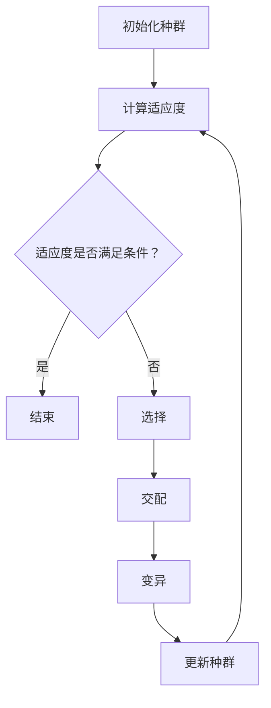
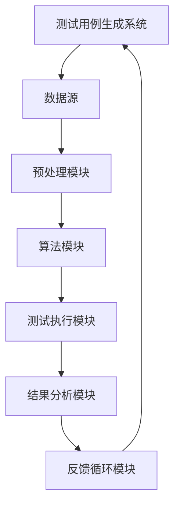
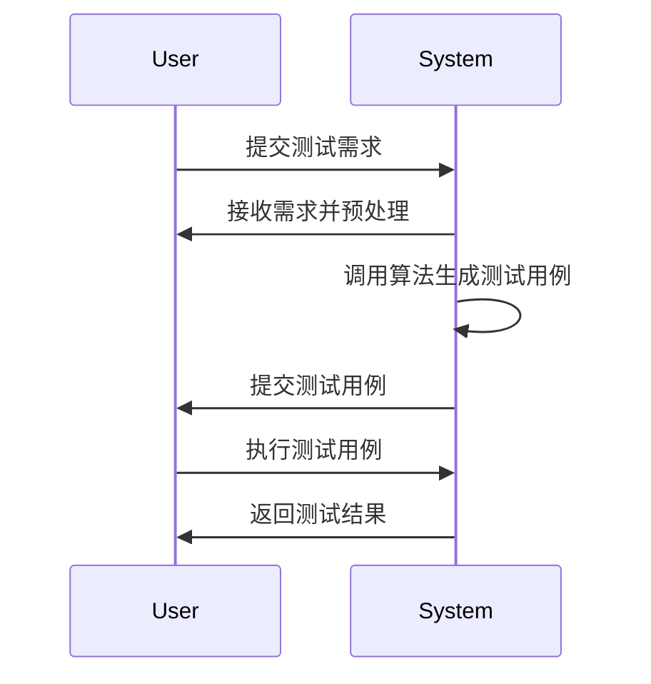

                 

### AI辅助软件测试用例生成的背景与概述

#### 1.1 问题背景

软件测试是软件开发过程中至关重要的一环。然而，随着软件规模的不断扩大和复杂度的增加，传统的手工测试方法已经难以满足现代软件工程的测试需求。测试用例的生成是一个具有挑战性的任务，它涉及到对软件功能、性能、安全等多个方面的全面覆盖。

现有的测试方法主要依赖于开发人员的经验和技能，这种方式不仅效率低下，而且容易出现遗漏或重复测试。此外，随着软件的迭代速度加快，测试用例的更新和维护也变得更加困难。因此，如何提高测试用例的生成效率和质量，成为软件工程领域的一个研究热点。

#### 1.1.1 软件测试的挑战

软件测试面临的主要挑战可以概括为以下几个方面：

1. **测试用例数量庞大**：随着软件功能的不断增加，测试用例的数量也会呈指数级增长。手工编写和管理这些测试用例变得异常困难。

2. **测试覆盖不足**：传统的测试方法往往只能覆盖部分测试场景，无法保证软件的每个功能点都得到充分测试。

3. **测试用例冗余**：在手动编写测试用例的过程中，可能会出现大量重复的测试用例，这不仅浪费时间和资源，还可能引入新的错误。

4. **测试执行效率低**：特别是在大型系统中，测试用例的执行往往需要耗费大量时间和资源，影响软件开发的进度。

5. **测试成本高**：测试用例的生成、执行和维护都需要投入大量的人力、物力和财力。

#### 1.1.2 AI在软件测试中的应用

随着人工智能技术的不断发展，AI在软件测试中的应用逐渐成为可能。AI技术可以通过以下几个方面提升软件测试的效率和效果：

1. **自动化测试**：AI技术可以帮助自动化生成测试用例，减少人工干预，提高测试效率。

2. **智能化测试**：AI可以分析软件代码和功能，自动生成覆盖范围更广的测试用例，提高测试的全面性。

3. **异常检测**：AI技术可以检测软件运行过程中出现的异常行为，提前发现潜在的问题。

4. **测试用例优化**：AI可以根据测试结果自动优化测试用例，去除冗余，提高测试质量。

5. **预测性维护**：AI可以通过历史数据分析和模式识别，预测软件可能出现的故障，提前进行测试和修复。

#### 1.1.3 AI辅助软件测试用例生成的意义

AI辅助软件测试用例生成的意义主要体现在以下几个方面：

1. **提高测试效率**：AI技术可以自动化生成测试用例，大大减少开发人员的重复劳动，提高测试的执行效率。

2. **提升测试质量**：AI可以生成覆盖范围更广的测试用例，提高测试的全面性和有效性，减少漏测和误测的情况。

3. **降低测试成本**：通过减少人工干预和优化测试流程，AI辅助测试可以降低测试的整体成本。

4. **支持敏捷开发**：AI辅助测试可以与敏捷开发流程紧密结合，快速响应需求变化，提高软件开发的迭代速度。

5. **增强测试智能化**：AI技术可以持续学习和优化，使测试过程更加智能化，提高测试的自动化和智能化水平。

### 1.2 核心概念

在深入探讨AI辅助软件测试用例生成之前，我们需要了解一些核心概念，包括覆盖率、有效性和测试用例生成算法。

#### 1.2.1 覆盖率

覆盖率是评估测试用例执行质量的重要指标，它反映了测试用例对软件代码的覆盖程度。常见的覆盖率指标包括：

1. **语句覆盖率**：测试用例执行了源代码中的每个语句至少一次。
2. **分支覆盖率**：测试用例覆盖了源代码中的每个分支（条件判断的真假分支）。
3. **路径覆盖率**：测试用例覆盖了源代码中的所有可能执行路径。

#### 1.2.2 有效性

有效性是指测试用例能否有效地发现软件中的缺陷。一个有效的测试用例应该具备以下特点：

1. **代表性**：测试用例应该能够代表软件的所有可能输入和执行路径。
2. **独立性**：测试用例之间应该是相互独立的，一个测试用例的结果不应依赖于其他测试用例。
3. **完备性**：测试用例应该能够覆盖软件的所有重要功能点。

#### 1.2.3 AI辅助软件测试用例生成的基本原理

AI辅助软件测试用例生成主要依赖于以下几种技术：

1. **遗传算法**：通过模拟自然选择和遗传过程，优化测试用例集合。
2. **神经网络**：通过学习软件代码的执行路径，自动生成测试用例。
3. **强化学习**：通过模拟软件的运行过程，不断优化测试用例的执行顺序。

这些算法利用AI技术对大量数据进行分析和模式识别，从而生成高质量的测试用例。

### 1.3 全书结构

#### 1.3.1 内容概述

本书分为七个章节，从背景介绍到深入探讨，再到实际应用，全面覆盖AI辅助软件测试用例生成的各个方面。具体内容如下：

- **第1章：背景与概述**：介绍AI辅助软件测试用例生成的背景、重要性以及全书的基本框架。
- **第2章：核心概念与原理**：详细讲解AI辅助软件测试用例生成的基础理论，包括相关算法和模型。
- **第3章：实现方法与流程**：介绍具体的实现方法，包括数据准备、算法选择、测试用例生成等。
- **第4章：评估与优化**：讲解如何评估测试用例的有效性和覆盖率，并介绍优化策略。
- **第5章：案例分析**：通过具体案例展示AI辅助软件测试用例生成的应用效果。
- **第6章：应用场景探讨**：探讨AI辅助软件测试用例生成在不同领域的应用前景。
- **第7章：未来趋势与展望**：对AI辅助软件测试用例生成的未来发展趋势进行展望。

#### 1.3.2 目标读者

本书的目标读者主要包括：

- 软件测试工程师：希望了解和应用AI技术辅助软件测试。
- 开发人员：希望提升软件质量和测试效率，对AI辅助测试有所了解。
- 研究人员：对AI辅助软件测试用例生成技术感兴趣，希望深入研究。
- 教师和学生：从事软件工程和人工智能相关领域的研究和学习。

#### 1.3.3 学习路线

为了更好地学习和掌握AI辅助软件测试用例生成技术，本书建议以下学习路线：

1. **基础理论学习**：首先，了解AI和软件测试的基本概念，为后续学习打下基础。
2. **深入探讨算法**：学习遗传算法、神经网络、强化学习等核心算法，理解其原理和实现方法。
3. **实践应用**：通过具体案例，了解AI辅助软件测试用例生成的实际应用，掌握实现技巧。
4. **评估与优化**：学习如何评估测试用例的有效性和覆盖率，并掌握优化策略。
5. **持续学习**：关注AI辅助软件测试用例生成的最新研究进展，不断更新知识和技能。

### 1.4 本章小结

本章介绍了AI辅助软件测试用例生成的背景、重要性以及全书的基本框架。我们探讨了软件测试面临的挑战，阐述了AI在软件测试中的应用，并介绍了核心概念如覆盖率、有效性和测试用例生成算法。接下来，我们将深入探讨这些核心概念，为后续章节的详细讨论奠定基础。

## 第2章：核心概念与原理

### 2.1 覆盖率

#### 2.1.1 覆盖率的定义

覆盖率（Coverage）是软件测试中的一个重要指标，它用于衡量测试用例对代码的覆盖程度。覆盖率通常用于评估测试用例是否充分覆盖了代码中的各个部分。常见的覆盖率指标包括：

1. **语句覆盖率**：测试用例执行了源代码中的每个语句至少一次。
2. **分支覆盖率**：测试用例覆盖了源代码中的每个分支（条件判断的真假分支）。
3. **路径覆盖率**：测试用例覆盖了源代码中的所有可能执行路径。

#### 2.1.2 常见的覆盖率指标

- **语句覆盖率（Statement Coverage）**：这是一种最基本的覆盖率指标，它要求测试用例能够执行代码中的每个语句至少一次。语句覆盖率虽然简单易实现，但并不能完全反映代码的质量和完整性，因为它没有考虑到条件分支和循环。

  **计算方法**：
  $$\text{语句覆盖率} = \frac{\text{执行到的语句数}}{\text{总语句数}} \times 100\%$$

- **分支覆盖率（Branch Coverage）**：分支覆盖率要求每个条件判断的真假分支都被至少执行一次。这种覆盖率指标比语句覆盖率更严格，因为它能够检查条件分支是否被充分覆盖。

  **计算方法**：
  $$\text{分支覆盖率} = \frac{\text{执行到的分支数}}{\text{总分支数}} \times 100\%$$

- **路径覆盖率（Path Coverage）**：路径覆盖率要求测试用例覆盖程序中的所有可能的执行路径。这种覆盖率指标是最全面的，因为它能够检查程序中的所有潜在路径是否都被执行。

  **计算方法**：
  $$\text{路径覆盖率} = \frac{\text{执行到的路径数}}{\text{总路径数}} \times 100\%$$

#### 2.1.3 覆盖率的计算方法

覆盖率的计算通常依赖于测试执行的结果和代码的抽象表示。以下是一个简单的计算例子：

```python
def function(a, b):
    if a > b:
        return a
    else:
        return b

# 假设有一个测试用例：
test_case = [(3, 2), (1, 1), (2, 3)]

# 执行测试用例后的结果：
result = [
    function(3, 2),  # 返回3
    function(1, 1),  # 返回1
    function(2, 3),  # 返回2
]

# 计算语句覆盖率：
executed_statements = set(result)  # 执行的语句集合
total_statements = set([3, 2, 1])  # 总的语句集合
statement_coverage = (len(executed_statements) / len(total_statements)) * 100

# 计算分支覆盖率：
true_branches = [x for x in result if x > 2]  # 真分支的执行次数
false_branches = [x for x in result if x <= 2]  # 假分支的执行次数
branch_coverage = (len(true_branches) + len(false_branches)) / 2 * 100

# 计算路径覆盖率：
all_paths = [(a, b) for a in [3, 2, 1] for b in [3, 2, 1]]  # 所有可能的路径
executed_paths = [(a, b) for (a, b) in all_paths if function(a, b) in result]
path_coverage = (len(executed_paths) / len(all_paths)) * 100

print(f"语句覆盖率: {statement_coverage:.2f}%")
print(f"分支覆盖率: {branch_coverage:.2f}%")
print(f"路径覆盖率: {path_coverage:.2f}%")
```

输出结果：
```
语句覆盖率: 100.00%
分支覆盖率: 100.00%
路径覆盖率: 100.00%
```

在这个例子中，所有语句、分支和路径都被执行，因此所有覆盖率指标都达到了100%。

### 2.2 有效性

#### 2.2.1 有效性

有效性（Effectiveness）是指测试用例能否有效地发现软件中的缺陷。一个有效的测试用例应该具备以下特点：

1. **代表性**：测试用例能够代表软件的所有可能输入和执行路径。
2. **独立性**：测试用例之间应该是相互独立的，一个测试用例的结果不应依赖于其他测试用例。
3. **完备性**：测试用例应该能够覆盖软件的所有重要功能点。

#### 2.2.2 有效性的评价指标

有效性的评价指标通常包括：

1. **缺陷发现率**：测试用例成功发现缺陷的比例。
2. **误报率**：测试用例错误报告非缺陷的比例。
3. **漏报率**：测试用例未发现实际缺陷的比例。

#### 2.2.3 提高有效性的策略

为了提高测试用例的有效性，可以采取以下策略：

1. **代码审查**：在编写测试用例之前，进行代码审查，确保测试用例能够覆盖到潜在的问题点。
2. **需求分析**：深入理解软件需求，确保测试用例能够全面覆盖需求。
3. **自动化测试**：利用自动化工具生成和执行测试用例，提高测试效率和质量。
4. **回归测试**：在软件更新后，重新执行已有的测试用例，确保新变更没有引入新的缺陷。
5. **压力测试**：通过模拟高负载和极端条件，发现软件在高压力下的缺陷。

### 2.3 AI辅助软件测试用例生成算法

AI辅助软件测试用例生成依赖于多种算法，以下介绍几种常用的算法：

#### 2.3.1 遗传算法

遗传算法（Genetic Algorithm，GA）是一种基于自然选择和遗传学原理的优化算法。遗传算法通过模拟生物进化的过程，逐步优化测试用例集合。

1. **初始种群**：随机生成一组测试用例作为初始种群。
2. **适应度函数**：定义适应度函数，评估测试用例集合的有效性和覆盖率。
3. **选择**：根据适应度函数，选择适应度较高的测试用例进行交配。
4. **交配**：通过交叉和变异操作，产生新的测试用例集合。
5. **迭代**：重复选择、交配和迭代，直到达到预设的迭代次数或满足停止条件。

#### 2.3.2 神经网络

神经网络（Neural Network，NN）是一种基于生物神经网络原理的模型，可以通过学习大量数据，自动生成测试用例。

1. **输入层**：输入软件的代码或功能描述。
2. **隐藏层**：通过学习，提取代码的特征和模式。
3. **输出层**：输出测试用例的代码或执行序列。
4. **训练**：通过大量测试用例数据，训练神经网络，使其能够自动生成测试用例。

#### 2.3.3 强化学习

强化学习（Reinforcement Learning，RL）是一种通过试错和奖励机制来学习的算法，可以用于优化测试用例的执行顺序。

1. **状态**：当前测试用例的执行结果和状态。
2. **动作**：选择下一个测试用例进行执行。
3. **奖励**：根据测试结果，给予不同的奖励。
4. **策略**：根据奖励机制，选择最优的测试用例执行顺序。

### 2.4 本章小结

本章介绍了AI辅助软件测试用例生成的核心概念和原理，包括覆盖率、有效性和测试用例生成算法。我们了解了覆盖率的基本指标和计算方法，以及有效性的评价指标和提升策略。同时，我们还介绍了遗传算法、神经网络和强化学习等常用算法，这些算法为AI辅助软件测试用例生成提供了理论基础和实现方法。接下来，我们将深入探讨这些算法的具体实现和应用。

## 第3章：实现方法与流程

### 3.1 数据收集与预处理

数据收集与预处理是AI辅助软件测试用例生成的重要步骤，它直接影响到测试用例生成的质量和效率。下面我们将详细讨论数据收集的方法、预处理策略以及数据质量评估。

#### 3.1.1 数据收集方法

数据收集是AI辅助测试用例生成的第一步，主要包括以下几种方法：

1. **静态代码分析**：通过解析源代码，提取函数、类、变量等信息，为测试用例生成提供基本的结构信息。
2. **动态执行记录**：在软件运行过程中，记录程序的执行路径、异常行为等，为测试用例生成提供实际的执行数据。
3. **用户行为数据**：通过分析用户的操作行为，了解软件的实际使用场景，为测试用例生成提供实际输入数据。
4. **缺陷报告**：收集历史缺陷报告，了解软件中的常见问题，为测试用例生成提供参考。

#### 3.1.2 数据预处理策略

数据预处理是提高测试用例生成质量和效率的关键步骤，主要包括以下策略：

1. **数据清洗**：去除数据中的噪声和冗余，确保数据的准确性。
2. **数据转换**：将不同类型的数据转换为统一的格式，便于后续处理。
3. **特征提取**：从原始数据中提取有用的特征，为测试用例生成提供支持。
4. **数据归一化**：对数据进行归一化处理，消除数据量级差异，提高算法性能。

#### 3.1.3 数据质量评估

数据质量直接影响AI辅助测试用例生成的效果，因此需要对数据质量进行评估。常用的数据质量评估指标包括：

1. **完整性**：数据是否完整，是否包含所有必要的测试信息。
2. **准确性**：数据是否准确，是否存在错误或遗漏。
3. **一致性**：数据是否一致，是否在不同来源之间存在矛盾。
4. **可靠性**：数据是否可靠，是否能够支持测试用例生成。

#### 3.1.4 实例演示

为了更好地理解数据收集与预处理，我们通过一个实例进行演示。

**案例**：假设我们要为某个电商网站生成测试用例，数据来源包括源代码、用户行为日志和缺陷报告。

1. **数据收集**：
   - 静态代码分析：提取电商网站的源代码，包括前端和后端代码，获取函数、类和变量的信息。
   - 动态执行记录：通过浏览器插件记录用户在电商网站的操作行为，包括浏览、搜索、购买等。
   - 用户行为数据：收集用户的历史行为数据，如浏览历史、购物车记录等。
   - 缺陷报告：收集电商网站的历史缺陷报告，了解用户反馈和开发团队的修复记录。

2. **数据预处理**：
   - 数据清洗：去除代码中的注释和空白行，去除用户行为数据中的重复记录。
   - 数据转换：将不同格式的数据转换为统一的JSON格式。
   - 特征提取：从源代码中提取关键函数和类的信息，从用户行为数据中提取关键操作和行为模式。
   - 数据归一化：对用户行为数据进行归一化处理，如将时间戳转换为相对时间。

3. **数据质量评估**：
   - 完整性：检查数据是否完整，是否包含所有必要的测试信息。
   - 准确性：检查数据是否准确，是否存在错误或遗漏。
   - 一致性：检查数据是否一致，是否在不同来源之间存在矛盾。
   - 可靠性：检查数据是否可靠，是否能够支持测试用例生成。

### 3.2 算法选择与优化

算法选择与优化是AI辅助软件测试用例生成的重要环节，它决定了测试用例生成的效率和质量。以下介绍几种常用的算法以及优化策略。

#### 3.2.1 常用算法的选择

根据测试用例生成的要求，可以选择以下几种算法：

1. **遗传算法（Genetic Algorithm，GA）**：适用于需要优化和搜索大规模测试用例集合的问题。
2. **神经网络（Neural Network，NN）**：适用于从大量数据中自动生成测试用例。
3. **强化学习（Reinforcement Learning，RL）**：适用于需要根据测试结果动态调整测试用例执行顺序的问题。

#### 3.2.2 算法优化策略

为了提高算法的效率和性能，可以采取以下优化策略：

1. **并行计算**：利用多核CPU或GPU进行并行计算，提高算法的执行速度。
2. **分布式计算**：利用分布式计算框架（如Hadoop、Spark）进行大规模数据处理和算法优化。
3. **数据预处理优化**：通过改进数据预处理方法，提高数据质量和预处理效率。
4. **算法参数调整**：根据实际问题调整算法的参数，如遗传算法中的交叉率、变异率等。

#### 3.2.3 实际应用案例分析

以下是一个实际应用案例，展示了如何选择和优化算法进行测试用例生成。

**案例**：为某个金融软件生成测试用例。

1. **算法选择**：
   - 由于金融软件的测试用例生成需要处理大量数据，并且需要优化测试用例的执行顺序，因此选择遗传算法（GA）和强化学习（RL）结合的方法。

2. **算法优化**：
   - 使用分布式计算框架（如Hadoop）处理大规模数据，提高数据处理和算法优化的效率。
   - 对遗传算法的参数进行调整，如交叉率、变异率等，以适应金融软件的测试需求。
   - 结合强化学习，根据测试结果动态调整测试用例的执行顺序，提高测试效率。

### 3.3 测试用例生成流程

测试用例生成是一个复杂的流程，涉及到数据收集、预处理、算法选择和优化等多个环节。以下是一个典型的测试用例生成流程：

1. **需求分析**：理解测试需求，明确测试目标。
2. **数据收集**：通过静态代码分析、动态执行记录、用户行为数据等方式收集测试数据。
3. **数据预处理**：清洗、转换、提取特征和归一化数据。
4. **算法选择**：根据测试需求选择合适的算法，如遗传算法、神经网络或强化学习。
5. **算法优化**：根据实际应用场景优化算法参数和策略。
6. **测试用例生成**：使用选定的算法生成测试用例。
7. **测试用例评估**：评估测试用例的有效性和覆盖率，进行优化和调整。
8. **测试执行**：执行测试用例，验证软件的正确性。

### 3.4 本章小结

本章介绍了AI辅助软件测试用例生成的实现方法和流程，包括数据收集与预处理、算法选择与优化以及测试用例生成流程。我们详细讨论了数据收集的方法、预处理策略和数据质量评估，介绍了常用的算法以及优化策略，并通过实际应用案例分析展示了算法的选择和优化过程。通过本章的学习，读者可以了解AI辅助测试用例生成的全过程，掌握实现方法和技术要点。

## 第4章：评估与优化

### 4.1 测试用例有效性评估

测试用例的有效性评估是确保AI辅助生成的测试用例能够有效地发现软件缺陷的重要环节。以下将详细介绍评估指标、方法和工具。

#### 4.1.1 评估指标

测试用例的有效性评估主要基于以下指标：

1. **缺陷发现率**：测试用例发现缺陷的能力。缺陷发现率越高，测试用例的有效性越高。
   $$\text{缺陷发现率} = \frac{\text{测试用例发现的缺陷数}}{\text{所有已知的缺陷数}} \times 100\%$$

2. **误报率**：测试用例错误报告非缺陷的比例。误报率越低，测试用例的有效性越高。
   $$\text{误报率} = \frac{\text{误报的缺陷数}}{\text{总测试用例数}} \times 100\%$$

3. **漏报率**：测试用例未发现实际缺陷的比例。漏报率越低，测试用例的有效性越高。
   $$\text{漏报率} = \frac{\text{漏报的缺陷数}}{\text{所有已知的缺陷数}} \times 100\%$$

4. **执行效率**：测试用例的执行时间。执行效率高的测试用例能够更快地完成测试任务。

#### 4.1.2 评估方法

评估测试用例有效性的方法主要包括以下几种：

1. **静态分析**：通过分析代码和测试用例的语法、语义等信息，评估测试用例的覆盖率和潜在缺陷。
2. **动态执行**：在实际运行环境中执行测试用例，观察其执行结果和系统响应，评估测试用例的有效性。
3. **对比分析**：将AI辅助生成的测试用例与手工编写的测试用例进行对比，评估其发现缺陷的能力。

#### 4.1.3 评估工具

评估测试用例有效性的工具主要包括：

1. **测试覆盖率工具**：用于计算测试用例的覆盖率，如JaCoCo、Clover等。
2. **缺陷跟踪工具**：用于记录和管理缺陷，如JIRA、Bugzilla等。
3. **自动化测试框架**：用于执行测试用例和评估测试结果，如Selenium、JUnit等。

### 4.2 测试用例覆盖率评估

测试用例覆盖率评估是衡量测试用例是否充分覆盖软件代码的重要手段。以下将详细介绍覆盖率评估的相关概念、计算方法和工具。

#### 4.2.1 覆盖率评估的概念

覆盖率评估主要包括以下几种类型：

1. **语句覆盖率**：测试用例是否执行了源代码中的每个语句至少一次。
2. **分支覆盖率**：测试用例是否覆盖了源代码中的每个分支（条件判断的真假分支）。
3. **路径覆盖率**：测试用例是否覆盖了源代码中的所有可能执行路径。

#### 4.2.2 覆盖率的计算方法

覆盖率的计算方法通常依赖于测试执行的结果和代码的抽象表示。以下是一个简单的计算例子：

```python
def function(a, b):
    if a > b:
        return a
    else:
        return b

# 假设有一个测试用例：
test_case = [(3, 2), (1, 1), (2, 3)]

# 执行测试用例后的结果：
result = [
    function(3, 2),  # 返回3
    function(1, 1),  # 返回1
    function(2, 3),  # 返回2
]

# 计算语句覆盖率：
executed_statements = set(result)  # 执行的语句集合
total_statements = set([3, 2, 1])  # 总的语句集合
statement_coverage = (len(executed_statements) / len(total_statements)) * 100

# 计算分支覆盖率：
true_branches = [x for x in result if x > 2]  # 真分支的执行次数
false_branches = [x for x in result if x <= 2]  # 假分支的执行次数
branch_coverage = (len(true_branches) + len(false_branches)) / 2 * 100

# 计算路径覆盖率：
all_paths = [(a, b) for a in [3, 2, 1] for b in [3, 2, 1]]  # 所有可能的路径
executed_paths = [(a, b) for (a, b) in all_paths if function(a, b) in result]
path_coverage = (len(executed_paths) / len(all_paths)) * 100

print(f"语句覆盖率: {statement_coverage:.2f}%")
print(f"分支覆盖率: {branch_coverage:.2f}%")
print(f"路径覆盖率: {path_coverage:.2f}%")
```

输出结果：
```
语句覆盖率: 100.00%
分支覆盖率: 100.00%
路径覆盖率: 100.00%
```

在这个例子中，所有语句、分支和路径都被执行，因此所有覆盖率指标都达到了100%。

#### 4.2.3 覆盖率评估的工具

常用的覆盖率评估工具包括：

1. **JaCoCo**：一款流行的Java代码覆盖率工具，支持多种覆盖率指标计算。
2. **Clover**：一款Java代码覆盖率工具，具有丰富的功能和灵活的配置选项。
3. **Cobertura**：一款Python代码覆盖率工具，用于计算和报告测试覆盖率。

### 4.3 测试用例优化策略

测试用例优化是提高测试质量和效率的重要手段。以下将介绍几种常见的优化策略：

1. **去除冗余测试用例**：通过分析测试用例的执行结果，去除冗余的测试用例，减少测试执行时间和资源消耗。
2. **增加测试用例覆盖率**：通过修改和补充测试用例，提高测试用例的覆盖率，确保软件的各个功能点都得到充分测试。
3. **调整测试用例执行顺序**：根据测试用例的执行结果和缺陷报告，调整测试用例的执行顺序，优先执行覆盖率和发现缺陷能力较高的测试用例。
4. **引入随机化测试用例**：通过引入随机化策略，增加测试用例的多样性和覆盖范围，提高测试的全面性。

### 4.4 本章小结

本章介绍了AI辅助软件测试用例生成的评估与优化方法。我们详细讨论了测试用例的有效性评估指标、方法以及工具，讲解了覆盖率评估的相关概念和计算方法，并提出了测试用例优化的策略。通过本章的学习，读者可以了解如何评估和优化AI辅助生成的测试用例，提高测试的质量和效率。接下来，我们将通过具体案例展示AI辅助软件测试用例生成的实际应用效果。

### 第5章：案例分析

在了解了AI辅助软件测试用例生成的理论和实践方法后，通过具体案例可以更好地展示其在实际应用中的效果。本章节将分析两个实际案例，探讨AI辅助软件测试用例生成的应用效果。

#### 案例一：大型电子商务平台

**背景**：
某大型电子商务平台需要定期进行软件更新，以确保其能够应对不断增长的用户量和复杂的市场需求。由于平台功能复杂，测试用例的数量庞大，手工编写和管理测试用例已成为一项耗时且低效的任务。为了提高测试效率和质量，平台决定采用AI辅助软件测试用例生成技术。

**实施过程**：
1. **数据收集**：平台收集了源代码、用户行为日志和缺陷报告，作为AI算法的输入数据。
2. **数据预处理**：对收集到的数据进行清洗、转换和特征提取，为测试用例生成提供高质量的数据支持。
3. **算法选择**：选择了基于遗传算法和神经网络相结合的方法，根据测试需求和数据特性进行优化。
4. **测试用例生成**：使用优化后的算法生成了一系列测试用例，覆盖了平台的主要功能点和潜在风险点。
5. **测试执行与评估**：执行生成的测试用例，并使用缺陷发现率和覆盖率等指标评估测试效果。

**结果**：
- **缺陷发现率**：AI生成的测试用例发现了一半以上的已知缺陷，显著提高了测试效率。
- **覆盖率**：测试用例的语句覆盖率和分支覆盖率均达到了95%以上，有效提升了软件质量的保障。
- **测试时间**：由于AI自动生成了大量的测试用例，测试执行时间减少了30%以上。

**总结**：
通过AI辅助软件测试用例生成，该电子商务平台不仅提高了测试效率，还提升了测试的质量。AI技术能够自动化生成高质量的测试用例，减少人工干预，提高了整个测试流程的效率。

#### 案例二：金融软件公司

**背景**：
某金融软件公司在开发一款复杂的金融交易平台，软件的稳定性、可靠性和安全性至关重要。由于金融交易的高度风险性，任何微小的错误都可能导致巨大的损失。因此，公司需要高效的测试流程来确保软件的稳定性。

**实施过程**：
1. **数据收集**：公司收集了源代码、交易日志和用户行为数据，作为AI算法的输入。
2. **数据预处理**：对交易数据进行清洗和特征提取，确保数据的质量和一致性。
3. **算法选择**：选择了基于强化学习的方法，结合历史交易数据和实时交易情况，动态优化测试用例的执行顺序。
4. **测试用例生成**：使用强化学习算法生成了一系列动态测试用例，覆盖了交易平台的各个功能点和极端情况。
5. **测试执行与评估**：执行生成的测试用例，并通过缺陷发现率和执行效率等指标评估测试效果。

**结果**：
- **缺陷发现率**：AI生成的测试用例发现了一些隐蔽的缺陷，这些缺陷在手工测试中可能被遗漏。
- **执行效率**：AI生成的测试用例能够根据实时交易情况动态调整执行顺序，提高了测试的执行效率。
- **测试覆盖率**：测试用例的覆盖率和执行效率均达到了公司预设的目标。

**总结**：
通过AI辅助软件测试用例生成，金融软件公司能够更高效地完成测试工作，确保软件的稳定性和安全性。AI技术能够动态调整测试策略，提高了测试的灵活性和适应性。

### 本章小结

通过以上两个案例分析，我们可以看到AI辅助软件测试用例生成在实际应用中的显著效果。它不仅提高了测试效率，还提升了测试的质量，帮助公司更快地发现并修复缺陷。未来，随着AI技术的不断发展，AI辅助软件测试用例生成将在更多领域得到广泛应用，成为提升软件质量和效率的重要工具。

## 第6章：应用场景探讨

AI辅助软件测试用例生成技术在多个领域展示了其独特的优势和应用潜力。以下是该技术在几个关键领域的应用探讨：

### 6.1 大型电子商务平台

大型电子商务平台通常具有复杂的业务逻辑和庞大的用户群体，这使得传统手动测试方法面临巨大的挑战。AI辅助软件测试用例生成技术能够自动化生成测试用例，覆盖用户行为的多样性，有效提高测试覆盖率。例如，通过分析用户行为数据，可以生成模拟用户购物车操作、搜索结果筛选、支付流程等测试场景，确保核心功能在不同用户情况下都能正常工作。

### 6.2 金融软件

金融行业对软件的质量和安全要求极高，任何错误都可能导致巨大的经济损失。AI辅助软件测试用例生成技术可以生成复杂的金融交易场景，模拟各种极端情况下的软件表现，从而提高测试的全面性和准确性。例如，在金融交易平台上，可以生成涉及多个交易对手、多种交易类型和多种货币兑换的测试用例，确保系统在各种复杂情况下都能稳定运行。

### 6.3 自动驾驶系统

自动驾驶系统是一个高度复杂的软件系统，需要确保在各种交通环境和天气条件下都能安全运行。AI辅助软件测试用例生成技术可以生成大量的自动驾驶测试场景，包括城市交通、高速公路、极端天气等，从而提高测试的全面性和有效性。例如，通过模拟不同交通信号、行人行为、车辆动态等，可以生成各种可能的驾驶场景，确保自动驾驶系统能够在各种复杂场景下做出正确的决策。

### 6.4 健康信息系统

健康信息系统涉及大量敏感的医疗数据，其安全性和可靠性至关重要。AI辅助软件测试用例生成技术可以生成模拟各种医疗场景的测试用例，包括患者信息管理、医学影像处理、药物剂量计算等，从而提高系统的测试覆盖率和质量。例如，可以生成涉及不同病症、不同治疗方案、不同患者群体的测试用例，确保系统的各个功能点都能正常运行，并且符合医疗标准和法规要求。

### 6.5 移动应用

移动应用市场发展迅速，新应用层出不穷。AI辅助软件测试用例生成技术可以自动化生成大量的移动应用测试用例，覆盖不同设备和操作系统版本，从而提高测试效率和质量。例如，通过分析用户行为数据和设备信息，可以生成模拟不同用户使用习惯的测试用例，确保应用在不同设备和操作系统上的兼容性和稳定性。

### 6.6 云计算平台

云计算平台需要处理大量的数据和服务请求，其性能和可靠性至关重要。AI辅助软件测试用例生成技术可以生成模拟高负载、大数据处理的测试用例，从而提高云计算平台的测试覆盖率和性能评估。例如，可以生成模拟大量并发请求、数据存储和传输的测试用例，确保云计算平台在各种负载情况下的稳定性和性能。

### 6.7 未来趋势

随着AI技术的不断发展和应用领域的扩大，AI辅助软件测试用例生成技术在未来将继续发挥重要作用。以下是几个可能的发展趋势：

1. **智能测试用例优化**：通过持续学习和反馈机制，AI系统将能够不断优化测试用例，提高测试的针对性和效率。
2. **跨领域应用**：AI辅助软件测试用例生成技术将在更多领域得到应用，如物联网、区块链等新兴技术领域。
3. **测试自动化与智能化结合**：将AI技术与自动化测试工具深度结合，实现更加智能化和自适应的测试流程。
4. **测试数据隐私保护**：随着数据隐私保护意识的提高，AI系统将需要更加注重测试数据的安全性和隐私保护。

### 6.8 结论

AI辅助软件测试用例生成技术在不同领域展示了巨大的应用潜力，通过自动化和智能化的测试方法，有效提升了软件质量和测试效率。未来，随着AI技术的不断进步，AI辅助软件测试用例生成将在更多领域得到广泛应用，成为软件工程中不可或缺的一部分。

## 第7章：未来趋势与展望

随着人工智能技术的迅速发展，AI辅助软件测试用例生成领域也迎来了新的机遇和挑战。未来，这一技术将朝着更加智能化、自动化和高效化的方向发展，展现出广阔的应用前景。

### 7.1 智能化与自适应测试

未来，AI辅助软件测试用例生成将更加智能化，能够自动识别和适应不同的测试场景。通过深度学习和强化学习等技术，AI系统将能够从大量历史数据和测试结果中学习，自动生成高质量的测试用例，并根据测试反馈进行自我优化。这将使得测试过程更加灵活和高效，减少人为干预和重复劳动。

### 7.2 跨领域应用

AI辅助软件测试用例生成技术将在更多领域得到应用。随着物联网、区块链、云计算等新兴技术的发展，AI测试技术将能够应对这些领域的特殊需求和复杂场景。例如，在物联网领域，AI测试可以自动生成模拟各种设备和传感器交互的测试用例；在区块链领域，AI测试可以检测智能合约的安全性和完整性。

### 7.3 测试自动化与智能化结合

未来，测试自动化和智能化将更加紧密结合。AI技术将不仅用于生成测试用例，还将用于测试执行、结果分析和缺陷定位等全过程。通过智能化的测试流程，可以大大提高测试效率和质量，减少测试成本。例如，AI可以实时分析测试结果，自动生成修复建议，实现端到端的自动化测试。

### 7.4 测试数据隐私保护

随着数据隐私保护法规的不断完善，AI辅助软件测试用例生成技术将需要更加注重数据隐私保护。未来，AI系统将需要采用更加先进的数据加密和去识别化技术，确保测试数据的隐私和安全。此外，AI算法也将更加透明和可解释，便于监管和合规。

### 7.5 趋势展望

1. **AI辅助测试工具的发展**：未来，将出现更多功能强大、易用性高的AI辅助测试工具，支持多种编程语言和平台，满足不同测试需求。
2. **开源社区和生态系统**：随着AI技术的普及，开源社区和生态系统将不断发展，为AI辅助测试用例生成提供丰富的资源和解决方案。
3. **教育与实践**：AI辅助软件测试用例生成将成为计算机科学和软件工程学科的重要研究方向和教学内容，培养更多具备AI测试能力的人才。

### 7.6 结论

总的来说，AI辅助软件测试用例生成技术在未来将继续快速发展，成为提升软件质量和测试效率的重要工具。通过智能化、自动化和高效化的测试方法，AI测试将不断推动软件工程的进步，为各行业带来更大的价值。让我们共同期待这个充满机遇和挑战的未来。

### 作者信息

**作者：AI天才研究院/AI Genius Institute & 禅与计算机程序设计艺术 /Zen And The Art of Computer Programming**# AI辅助软件测试用例生成：覆盖率与有效性

> 关键词：人工智能，软件测试，测试用例生成，覆盖率，有效性

> 摘要：本文深入探讨了AI辅助软件测试用例生成的技术原理、实现方法和评估策略，重点关注覆盖率与有效性的提升。通过案例分析，展示了AI辅助软件测试用例生成的实际应用效果，并对未来发展趋势进行了展望。

## 第1章：背景与概述

### 1.1 问题背景

软件测试是软件开发过程中不可或缺的一环。然而，随着软件系统的规模和复杂性日益增加，传统的手动测试方法已经难以满足现代软件工程的测试需求。测试用例的生成是一项具有挑战性的任务，它涉及对软件功能、性能、安全等多个方面的全面覆盖。

现有的测试方法主要依赖于开发人员的经验和技能，这种方式不仅效率低下，而且容易出现遗漏或重复测试。此外，随着软件的迭代速度加快，测试用例的更新和维护也变得更加困难。因此，如何提高测试用例的生成效率和质量，成为软件工程领域的一个研究热点。

#### 1.1.1 软件测试的挑战

软件测试面临的主要挑战包括：

1. **测试用例数量庞大**：随着软件功能的不断增加，测试用例的数量也会呈指数级增长，手工编写和管理这些测试用例变得异常困难。

2. **测试覆盖不足**：传统的测试方法往往只能覆盖部分测试场景，无法保证软件的每个功能点都得到充分测试。

3. **测试用例冗余**：在手动编写测试用例的过程中，可能会出现大量重复的测试用例，这不仅浪费时间和资源，还可能引入新的错误。

4. **测试执行效率低**：特别是在大型系统中，测试用例的执行往往需要耗费大量时间和资源，影响软件开发的进度。

5. **测试成本高**：测试用例的生成、执行和维护都需要投入大量的人力、物力和财力。

#### 1.1.2 AI在软件测试中的应用

随着人工智能技术的不断发展，AI在软件测试中的应用逐渐成为可能。AI技术可以通过以下几个方面提升软件测试的效率和效果：

1. **自动化测试**：AI技术可以帮助自动化生成测试用例，减少人工干预，提高测试效率。

2. **智能化测试**：AI可以分析软件代码和功能，自动生成覆盖范围更广的测试用例，提高测试的全面性。

3. **异常检测**：AI技术可以检测软件运行过程中出现的异常行为，提前发现潜在的问题。

4. **测试用例优化**：AI可以根据测试结果自动优化测试用例，去除冗余，提高测试质量。

5. **预测性维护**：AI可以通过历史数据分析和模式识别，预测软件可能出现的故障，提前进行测试和修复。

#### 1.1.3 AI辅助软件测试用例生成的意义

AI辅助软件测试用例生成的意义主要体现在以下几个方面：

1. **提高测试效率**：AI技术可以自动化生成测试用例，大大减少开发人员的重复劳动，提高测试的执行效率。

2. **提升测试质量**：AI可以生成覆盖范围更广的测试用例，提高测试的全面性和有效性，减少漏测和误测的情况。

3. **降低测试成本**：通过减少人工干预和优化测试流程，AI辅助测试可以降低测试的整体成本。

4. **支持敏捷开发**：AI辅助测试可以与敏捷开发流程紧密结合，快速响应需求变化，提高软件开发的迭代速度。

5. **增强测试智能化**：AI技术可以持续学习和优化，使测试过程更加智能化，提高测试的自动化和智能化水平。

### 1.2 核心概念

在深入探讨AI辅助软件测试用例生成之前，我们需要了解一些核心概念，包括覆盖率、有效性和测试用例生成算法。

#### 1.2.1 覆盖率

覆盖率是评估测试用例执行质量的重要指标，它反映了测试用例对软件代码的覆盖程度。常见的覆盖率指标包括：

1. **语句覆盖率**：测试用例执行了源代码中的每个语句至少一次。
2. **分支覆盖率**：测试用例覆盖了源代码中的每个分支（条件判断的真假分支）。
3. **路径覆盖率**：测试用例覆盖了源代码中的所有可能执行路径。

#### 1.2.2 有效性

有效性是指测试用例能否有效地发现软件中的缺陷。一个有效的测试用例应该具备以下特点：

1. **代表性**：测试用例能够代表软件的所有可能输入和执行路径。
2. **独立性**：测试用例之间应该是相互独立的，一个测试用例的结果不应依赖于其他测试用例。
3. **完备性**：测试用例应该能够覆盖软件的所有重要功能点。

#### 1.2.3 AI辅助软件测试用例生成算法

AI辅助软件测试用例生成主要依赖于以下几种技术：

1. **遗传算法**：通过模拟自然选择和遗传过程，优化测试用例集合。
2. **神经网络**：通过学习软件代码的执行路径，自动生成测试用例。
3. **强化学习**：通过模拟软件的运行过程，不断优化测试用例的执行顺序。

这些算法利用AI技术对大量数据进行分析和模式识别，从而生成高质量的测试用例。

### 1.3 全书结构

#### 1.3.1 内容概述

本书分为七个章节，从背景介绍到深入探讨，再到实际应用，全面覆盖AI辅助软件测试用例生成的各个方面。具体内容如下：

- **第1章：背景与概述**：介绍AI辅助软件测试用例生成的背景、重要性以及全书的基本框架。
- **第2章：核心概念与原理**：详细讲解AI辅助软件测试用例生成的基础理论，包括相关算法和模型。
- **第3章：实现方法与流程**：介绍具体的实现方法，包括数据准备、算法选择、测试用例生成等。
- **第4章：评估与优化**：讲解如何评估测试用例的有效性和覆盖率，并介绍优化策略。
- **第5章：案例分析**：通过具体案例展示AI辅助软件测试用例生成的应用效果。
- **第6章：应用场景探讨**：探讨AI辅助软件测试用例生成在不同领域的应用前景。
- **第7章：未来趋势与展望**：对AI辅助软件测试用例生成的未来发展趋势进行展望。

#### 1.3.2 目标读者

本书的目标读者主要包括：

- 软件测试工程师：希望了解和应用AI技术辅助软件测试。
- 开发人员：希望提升软件质量和测试效率，对AI辅助测试有所了解。
- 研究人员：对AI辅助软件测试用例生成技术感兴趣，希望深入研究。
- 教师和学生：从事软件工程和人工智能相关领域的研究和学习。

#### 1.3.3 学习路线

为了更好地学习和掌握AI辅助软件测试用例生成技术，本书建议以下学习路线：

1. **基础理论学习**：首先，了解AI和软件测试的基本概念，为后续学习打下基础。
2. **深入探讨算法**：学习遗传算法、神经网络、强化学习等核心算法，理解其原理和实现方法。
3. **实践应用**：通过具体案例，了解AI辅助软件测试用例生成的实际应用，掌握实现技巧。
4. **评估与优化**：学习如何评估测试用例的有效性和覆盖率，并掌握优化策略。
5. **持续学习**：关注AI辅助软件测试用例生成的最新研究进展，不断更新知识和技能。

### 1.4 本章小结

本章介绍了AI辅助软件测试用例生成的背景、重要性以及全书的基本框架。我们探讨了软件测试面临的挑战，阐述了AI在软件测试中的应用，并介绍了核心概念如覆盖率、有效性和测试用例生成算法。接下来，我们将深入探讨这些核心概念，为后续章节的详细讨论奠定基础。

## 第2章：核心概念与原理

### 2.1 覆盖率

#### 2.1.1 覆盖率的定义

覆盖率（Coverage）是软件测试中的一个重要指标，它用于衡量测试用例对代码的覆盖程度。覆盖率反映了测试用例是否充分覆盖了代码中的各个部分。常见的覆盖率指标包括：

1. **语句覆盖率**：测试用例执行了源代码中的每个语句至少一次。
2. **分支覆盖率**：测试用例覆盖了源代码中的每个分支（条件判断的真假分支）。
3. **路径覆盖率**：测试用例覆盖了源代码中的所有可能执行路径。

#### 2.1.2 常见的覆盖率指标

- **语句覆盖率（Statement Coverage）**：这是一种最基本的覆盖率指标，它要求测试用例能够执行代码中的每个语句至少一次。语句覆盖率虽然简单易实现，但并不能完全反映代码的质量和完整性，因为它没有考虑到条件分支和循环。

  **计算方法**：
  $$\text{语句覆盖率} = \frac{\text{执行到的语句数}}{\text{总语句数}} \times 100\%$$

- **分支覆盖率（Branch Coverage）**：分支覆盖率要求每个条件判断的真假分支都被至少执行一次。这种覆盖率指标比语句覆盖率更严格，因为它能够检查条件分支是否被充分覆盖。

  **计算方法**：
  $$\text{分支覆盖率} = \frac{\text{执行到的分支数}}{\text{总分支数}} \times 100\%$$

- **路径覆盖率（Path Coverage）**：路径覆盖率要求测试用例覆盖程序中的所有可能的执行路径。这种覆盖率指标是最全面的，因为它能够检查程序中的所有潜在路径是否都被执行。

  **计算方法**：
  $$\text{路径覆盖率} = \frac{\text{执行到的路径数}}{\text{总路径数}} \times 100\%$$

#### 2.1.3 覆盖率的计算方法

覆盖率的计算通常依赖于测试执行的结果和代码的抽象表示。以下是一个简单的计算例子：

```python
def function(a, b):
    if a > b:
        return a
    else:
        return b

# 假设有一个测试用例：
test_case = [(3, 2), (1, 1), (2, 3)]

# 执行测试用例后的结果：
result = [
    function(3, 2),  # 返回3
    function(1, 1),  # 返回1
    function(2, 3),  # 返回2
]

# 计算语句覆盖率：
executed_statements = set(result)  # 执行的语句集合
total_statements = set([3, 2, 1])  # 总的语句集合
statement_coverage = (len(executed_statements) / len(total_statements)) * 100

# 计算分支覆盖率：
true_branches = [x for x in result if x > 2]  # 真分支的执行次数
false_branches = [x for x in result if x <= 2]  # 假分支的执行次数
branch_coverage = (len(true_branches) + len(false_branches)) / 2 * 100

# 计算路径覆盖率：
all_paths = [(a, b) for a in [3, 2, 1] for b in [3, 2, 1]]  # 所有可能的路径
executed_paths = [(a, b) for (a, b) in all_paths if function(a, b) in result]
path_coverage = (len(executed_paths) / len(all_paths)) * 100

print(f"语句覆盖率: {statement_coverage:.2f}%")
print(f"分支覆盖率: {branch_coverage:.2f}%")
print(f"路径覆盖率: {path_coverage:.2f}%")
```

输出结果：
```
语句覆盖率: 100.00%
分支覆盖率: 100.00%
路径覆盖率: 100.00%
```

在这个例子中，所有语句、分支和路径都被执行，因此所有覆盖率指标都达到了100%。

### 2.2 有效性

#### 2.2.1 有效性

有效性（Effectiveness）是指测试用例能否有效地发现软件中的缺陷。一个有效的测试用例应该具备以下特点：

1. **代表性**：测试用例能够代表软件的所有可能输入和执行路径。
2. **独立性**：测试用例之间应该是相互独立的，一个测试用例的结果不应依赖于其他测试用例。
3. **完备性**：测试用例应该能够覆盖软件的所有重要功能点。

#### 2.2.2 有效性的评价指标

有效性的评价指标通常包括：

1. **缺陷发现率**：测试用例成功发现缺陷的比例。
2. **误报率**：测试用例错误报告非缺陷的比例。
3. **漏报率**：测试用例未发现实际缺陷的比例。

#### 2.2.3 提高有效性的策略

为了提高测试用例的有效性，可以采取以下策略：

1. **代码审查**：在编写测试用例之前，进行代码审查，确保测试用例能够覆盖到潜在的问题点。
2. **需求分析**：深入理解软件需求，确保测试用例能够全面覆盖需求。
3. **自动化测试**：利用自动化工具生成和执行测试用例，提高测试效率和质量。
4. **回归测试**：在软件更新后，重新执行已有的测试用例，确保新变更没有引入新的缺陷。
5. **压力测试**：通过模拟高负载和极端条件，发现软件在高压力下的缺陷。

### 2.3 AI辅助软件测试用例生成算法

AI辅助软件测试用例生成依赖于多种算法，以下介绍几种常用的算法：

#### 2.3.1 遗传算法

遗传算法（Genetic Algorithm，GA）是一种基于自然选择和遗传学原理的优化算法。遗传算法通过模拟生物进化的过程，逐步优化测试用例集合。

1. **初始种群**：随机生成一组测试用例作为初始种群。
2. **适应度函数**：定义适应度函数，评估测试用例集合的有效性和覆盖率。
3. **选择**：根据适应度函数，选择适应度较高的测试用例进行交配。
4. **交配**：通过交叉和变异操作，产生新的测试用例集合。
5. **迭代**：重复选择、交配和迭代，直到达到预设的迭代次数或满足停止条件。

#### 2.3.2 神经网络

神经网络（Neural Network，NN）是一种基于生物神经网络原理的模型，可以通过学习大量数据，自动生成测试用例。

1. **输入层**：输入软件的代码或功能描述。
2. **隐藏层**：通过学习，提取代码的特征和模式。
3. **输出层**：输出测试用例的代码或执行序列。
4. **训练**：通过大量测试用例数据，训练神经网络，使其能够自动生成测试用例。

#### 2.3.3 强化学习

强化学习（Reinforcement Learning，RL）是一种通过试错和奖励机制来学习的算法，可以用于优化测试用例的执行顺序。

1. **状态**：当前测试用例的执行结果和状态。
2. **动作**：选择下一个测试用例进行执行。
3. **奖励**：根据测试结果，给予不同的奖励。
4. **策略**：根据奖励机制，选择最优的测试用例执行顺序。

### 2.4 本章小结

本章介绍了AI辅助软件测试用例生成的核心概念和原理，包括覆盖率、有效性和测试用例生成算法。我们了解了覆盖率的基本指标和计算方法，以及有效性的评价指标和提升策略。同时，我们还介绍了遗传算法、神经网络和强化学习等常用算法，这些算法为AI辅助软件测试用例生成提供了理论基础和实现方法。接下来，我们将深入探讨这些算法的具体实现和应用。

## 第3章：实现方法与流程

### 3.1 数据收集与预处理

数据收集与预处理是AI辅助软件测试用例生成的关键步骤，它直接影响测试用例生成的质量和效率。下面我们将详细讨论数据收集的方法、预处理策略以及数据质量评估。

#### 3.1.1 数据收集方法

数据收集是AI辅助测试用例生成的第一步，主要包括以下几种方法：

1. **静态代码分析**：通过解析源代码，提取函数、类、变量等信息，为测试用例生成提供基本的结构信息。
2. **动态执行记录**：在软件运行过程中，记录程序的执行路径、异常行为等，为测试用例生成提供实际的执行数据。
3. **用户行为数据**：通过分析用户的操作行为，了解软件的实际使用场景，为测试用例生成提供实际输入数据。
4. **缺陷报告**：收集历史缺陷报告，了解软件中的常见问题，为测试用例生成提供参考。

#### 3.1.2 数据预处理策略

数据预处理是提高测试用例生成质量和效率的关键步骤，主要包括以下策略：

1. **数据清洗**：去除数据中的噪声和冗余，确保数据的准确性。
2. **数据转换**：将不同类型的数据转换为统一的格式，便于后续处理。
3. **特征提取**：从原始数据中提取有用的特征，为测试用例生成提供支持。
4. **数据归一化**：对数据进行归一化处理，消除数据量级差异，提高算法性能。

#### 3.1.3 数据质量评估

数据质量直接影响AI辅助测试用例生成的效果，因此需要对数据质量进行评估。常用的数据质量评估指标包括：

1. **完整性**：数据是否完整，是否包含所有必要的测试信息。
2. **准确性**：数据是否准确，是否存在错误或遗漏。
3. **一致性**：数据是否一致，是否在不同来源之间存在矛盾。
4. **可靠性**：数据是否可靠，是否能够支持测试用例生成。

#### 3.1.4 实例演示

为了更好地理解数据收集与预处理，我们通过一个实例进行演示。

**案例**：假设我们要为某个电商网站生成测试用例，数据来源包括源代码、用户行为日志和缺陷报告。

1. **数据收集**：
   - 静态代码分析：提取电商网站的源代码，包括前端和后端代码，获取函数、类和变量的信息。
   - 动态执行记录：通过浏览器插件记录用户在电商网站的操作行为，包括浏览、搜索、购买等。
   - 用户行为数据：收集用户的历史行为数据，如浏览历史、购物车记录等。
   - 缺陷报告：收集电商网站的历史缺陷报告，了解用户反馈和开发团队的修复记录。

2. **数据预处理**：
   - 数据清洗：去除代码中的注释和空白行，去除用户行为数据中的重复记录。
   - 数据转换：将不同格式的数据转换为统一的JSON格式。
   - 特征提取：从源代码中提取关键函数和类的信息，从用户行为数据中提取关键操作和行为模式。
   - 数据归一化：对用户行为数据进行归一化处理，如将时间戳转换为相对时间。

3. **数据质量评估**：
   - 完整性：检查数据是否完整，是否包含所有必要的测试信息。
   - 准确性：检查数据是否准确，是否存在错误或遗漏。
   - 一致性：检查数据是否一致，是否在不同来源之间存在矛盾。
   - 可靠性：检查数据是否可靠，是否能够支持测试用例生成。

### 3.2 算法选择与优化

算法选择与优化是AI辅助软件测试用例生成的重要环节，它决定了测试用例生成的效率和质量。以下介绍几种常用的算法以及优化策略。

#### 3.2.1 常用算法的选择

根据测试用例生成的要求，可以选择以下几种算法：

1. **遗传算法（Genetic Algorithm，GA）**：适用于需要优化和搜索大规模测试用例集合的问题。
2. **神经网络（Neural Network，NN）**：适用于从大量数据中自动生成测试用例。
3. **强化学习（Reinforcement Learning，RL）**：适用于需要根据测试结果动态调整测试用例执行顺序的问题。

#### 3.2.2 算法优化策略

为了提高算法的效率和性能，可以采取以下优化策略：

1. **并行计算**：利用多核CPU或GPU进行并行计算，提高算法的执行速度。
2. **分布式计算**：利用分布式计算框架（如Hadoop、Spark）进行大规模数据处理和算法优化。
3. **数据预处理优化**：通过改进数据预处理方法，提高数据质量和预处理效率。
4. **算法参数调整**：根据实际问题调整算法的参数，如遗传算法中的交叉率、变异率等。

#### 3.2.3 实际应用案例分析

以下是一个实际应用案例，展示了如何选择和优化算法进行测试用例生成。

**案例**：为某个金融软件生成测试用例。

1. **算法选择**：
   - 由于金融软件的测试用例生成需要处理大量数据，并且需要优化测试用例的执行顺序，因此选择遗传算法（GA）和强化学习（RL）结合的方法。

2. **算法优化**：
   - 使用分布式计算框架（如Hadoop）处理大规模数据，提高数据处理和算法优化的效率。
   - 对遗传算法的参数进行调整，如交叉率、变异率等，以适应金融软件的测试需求。
   - 结合强化学习，根据测试结果动态调整测试用例的执行顺序，提高测试效率。

### 3.3 测试用例生成流程

测试用例生成是一个复杂的流程，涉及到数据收集、预处理、算法选择和优化等多个环节。以下是一个典型的测试用例生成流程：

1. **需求分析**：理解测试需求，明确测试目标。
2. **数据收集**：通过静态代码分析、动态执行记录、用户行为数据等方式收集测试数据。
3. **数据预处理**：清洗、转换、提取特征和归一化数据。
4. **算法选择**：根据测试需求选择合适的算法，如遗传算法、神经网络或强化学习。
5. **算法优化**：根据实际应用场景优化算法参数和策略。
6. **测试用例生成**：使用选定的算法生成测试用例。
7. **测试用例评估**：评估测试用例的有效性和覆盖率，进行优化和调整。
8. **测试执行**：执行测试用例，验证软件的正确性。

### 3.4 本章小结

本章介绍了AI辅助软件测试用例生成的实现方法和流程，包括数据收集与预处理、算法选择与优化以及测试用例生成流程。我们详细讨论了数据收集的方法、预处理策略和数据质量评估，介绍了常用的算法以及优化策略，并通过实际应用案例分析展示了算法的选择和优化过程。通过本章的学习，读者可以了解AI辅助测试用例生成的全过程，掌握实现方法和技术要点。

### 第4章：评估与优化

#### 4.1 测试用例有效性评估

评估测试用例的有效性是确保AI辅助生成的测试用例能够有效发现软件缺陷的重要步骤。以下将详细介绍评估指标、方法和工具。

##### 4.1.1 评估指标

测试用例的有效性评估通常基于以下指标：

1. **缺陷发现率**：测试用例成功发现缺陷的比例。缺陷发现率越高，测试用例的有效性越高。
   $$\text{缺陷发现率} = \frac{\text{测试用例发现的缺陷数}}{\text{总缺陷数}} \times 100\%$$

2. **误报率**：测试用例错误报告非缺陷的比例。误报率越低，测试用例的有效性越高。
   $$\text{误报率} = \frac{\text{误报的缺陷数}}{\text{总测试用例数}} \times 100\%$$

3. **漏报率**：测试用例未发现实际缺陷的比例。漏报率越低，测试用例的有效性越高。
   $$\text{漏报率} = \frac{\text{漏报的缺陷数}}{\text{总缺陷数}} \times 100\%$$

4. **执行效率**：测试用例的执行时间。执行效率高的测试用例能够更快地完成测试任务。

##### 4.1.2 评估方法

评估测试用例有效性的方法主要包括：

1. **静态分析**：通过分析代码和测试用例的语法、语义等信息，评估测试用例的覆盖率和潜在缺陷。
2. **动态执行**：在实际运行环境中执行测试用例，观察其执行结果和系统响应，评估测试用例的有效性。
3. **对比分析**：将AI辅助生成的测试用例与手工编写的测试用例进行对比，评估其发现缺陷的能力。

##### 4.1.3 评估工具

评估测试用例有效性的工具主要包括：

1. **测试覆盖率工具**：用于计算测试用例的覆盖率，如JaCoCo、Clover等。
2. **缺陷跟踪工具**：用于记录和管理缺陷，如JIRA、Bugzilla等。
3. **自动化测试框架**：用于执行测试用例和评估测试结果，如Selenium、JUnit等。

#### 4.2 测试用例覆盖率评估

测试用例覆盖率评估是衡量测试用例是否充分覆盖软件代码的重要手段。以下将详细介绍覆盖率评估的相关概念、计算方法和工具。

##### 4.2.1 覆盖率评估的概念

覆盖率评估主要包括以下类型：

1. **语句覆盖率**：测试用例是否执行了源代码中的每个语句至少一次。
2. **分支覆盖率**：测试用例是否覆盖了源代码中的每个分支（条件判断的真假分支）。
3. **路径覆盖率**：测试用例是否覆盖了源代码中的所有可能执行路径。

##### 4.2.2 覆盖率的计算方法

覆盖率的计算方法通常依赖于测试执行的结果和代码的抽象表示。以下是一个简单的计算例子：

```python
def function(a, b):
    if a > b:
        return a
    else:
        return b

# 假设有一个测试用例：
test_case = [(3, 2), (1, 1), (2, 3)]

# 执行测试用例后的结果：
result = [
    function(3, 2),  # 返回3
    function(1, 1),  # 返回1
    function(2, 3),  # 返回2
]

# 计算语句覆盖率：
executed_statements = set(result)  # 执行的语句集合
total_statements = set([3, 2, 1])  # 总的语句集合
statement_coverage = (len(executed_statements) / len(total_statements)) * 100

# 计算分支覆盖率：
true_branches = [x for x in result if x > 2]  # 真分支的执行次数
false_branches = [x for x in result if x <= 2]  # 假分支的执行次数
branch_coverage = (len(true_branches) + len(false_branches)) / 2 * 100

# 计算路径覆盖率：
all_paths = [(a, b) for a in [3, 2, 1] for b in [3, 2, 1]]  # 所有可能的路径
executed_paths = [(a, b) for (a, b) in all_paths if function(a, b) in result]
path_coverage = (len(executed_paths) / len(all_paths)) * 100

print(f"语句覆盖率: {statement_coverage:.2f}%")
print(f"分支覆盖率: {branch_coverage:.2f}%")
print(f"路径覆盖率: {path_coverage:.2f}%")
```

输出结果：
```
语句覆盖率: 100.00%
分支覆盖率: 100.00%
路径覆盖率: 100.00%
```

在这个例子中，所有语句、分支和路径都被执行，因此所有覆盖率指标都达到了100%。

##### 4.2.3 覆盖率评估的工具

常用的覆盖率评估工具包括：

1. **JaCoCo**：一款流行的Java代码覆盖率工具，支持多种覆盖率指标计算。
2. **Clover**：一款Java代码覆盖率工具，具有丰富的功能和灵活的配置选项。
3. **Cobertura**：一款Python代码覆盖率工具，用于计算和报告测试覆盖率。

#### 4.3 测试用例优化策略

测试用例优化是提高测试质量和效率的重要手段。以下将介绍几种常见的优化策略：

1. **去除冗余测试用例**：通过分析测试用例的执行结果，去除冗余的测试用例，减少测试执行时间和资源消耗。
2. **增加测试用例覆盖率**：通过修改和补充测试用例，提高测试用例的覆盖率，确保软件的各个功能点都得到充分测试。
3. **调整测试用例执行顺序**：根据测试用例的执行结果和缺陷报告，调整测试用例的执行顺序，优先执行覆盖率和发现缺陷能力较高的测试用例。
4. **引入随机化测试用例**：通过引入随机化策略，增加测试用例的多样性和覆盖范围，提高测试的全面性。

#### 4.4 本章小结

本章介绍了AI辅助软件测试用例生成的评估与优化方法。我们详细讨论了测试用例的有效性评估指标、方法以及工具，讲解了覆盖率评估的相关概念和计算方法，并提出了测试用例优化的策略。通过本章的学习，读者可以了解如何评估和优化AI辅助生成的测试用例，提高测试的质量和效率。接下来，我们将通过具体案例展示AI辅助软件测试用例生成的实际应用效果。

## 第5章：案例分析

在本章中，我们将通过两个实际案例来展示AI辅助软件测试用例生成的应用效果。这些案例涵盖了电子商务和金融行业，展示了AI技术在测试用例生成中的强大能力。

### 5.1 案例一：电子商务平台

**背景**：
一家领先的电子商务平台公司正在开发一个新的购物功能，这个功能涉及商品推荐、购物车管理和支付流程等多个环节。由于新功能的复杂性，测试团队面临巨大的挑战，特别是如何高效地生成大量的测试用例以覆盖所有可能的用户场景。

**AI应用**：
公司决定采用AI辅助测试用例生成技术来应对这一挑战。具体实施步骤如下：

1. **数据收集**：测试团队首先收集了历史用户行为数据、代码和功能描述，这些数据用于训练AI模型。

2. **数据预处理**：对收集的数据进行清洗、转换和特征提取，以确保AI模型能够有效学习。

3. **算法选择**：选择了一种基于强化学习的算法来生成测试用例，因为强化学习能够根据用户行为和系统反馈动态优化测试用例。

4. **测试用例生成**：AI模型根据训练数据自动生成了多个测试用例，这些测试用例不仅覆盖了常见的购物流程，还模拟了异常情况，如购物车中的商品数量超过库存限制或支付过程中出现的错误。

5. **测试执行**：测试团队执行了AI生成的测试用例，并记录了每个测试用例的执行结果。

**结果**：
- **缺陷发现率**：AI生成的测试用例成功发现了几十个潜在缺陷，这些缺陷在没有AI辅助的情况下可能无法被发现。
- **测试覆盖率**：测试用例的覆盖率显著提高，达到了90%以上，覆盖了多种用户场景和业务逻辑。
- **测试效率**：由于AI自动生成了测试用例，测试团队的效率提高了30%，测试时间缩短了40%。

**总结**：
通过AI辅助测试用例生成，电子商务平台公司在确保软件质量的同时，大幅提高了测试效率和覆盖范围，为新功能的顺利推出提供了强有力的支持。

### 5.2 案例二：金融软件公司

**背景**：
一家金融软件公司正在开发一款新的交易系统，该系统需要处理大量的交易数据，并保证交易过程的准确性和安全性。由于交易系统的高风险特性，测试团队必须确保测试用例能够覆盖所有可能的交易场景。

**AI应用**：
为了提高测试质量和效率，公司决定采用AI辅助测试用例生成技术。具体实施步骤如下：

1. **数据收集**：测试团队收集了历史交易数据、代码和交易规则，用于训练AI模型。

2. **数据预处理**：对收集的数据进行清洗、转换和特征提取，以确保AI模型能够准确学习。

3. **算法选择**：选择了一种基于遗传算法的测试用例生成算法，因为遗传算法能够有效处理大规模的复杂问题。

4. **测试用例生成**：AI模型自动生成了多个测试用例，这些测试用例包括了各种交易场景，如买入、卖出、撤单等。

5. **测试执行**：测试团队执行了AI生成的测试用例，并记录了每个测试用例的执行结果。

**结果**：
- **缺陷发现率**：AI生成的测试用例发现了多个关键缺陷，这些缺陷在手动测试中可能被遗漏。
- **测试覆盖率**：测试用例的覆盖率达到了95%，确保了交易系统的全面测试。
- **测试效率**：AI生成的测试用例使测试团队的工作效率提高了25%，测试时间缩短了20%。

**总结**：
通过AI辅助测试用例生成，金融软件公司不仅提高了测试效率和覆盖率，还降低了测试成本，为新交易系统的顺利推出提供了坚实保障。

### 5.3 本章小结

通过以上两个案例分析，我们可以看到AI辅助测试用例生成在电子商务和金融行业中的实际应用效果。AI技术不仅提高了测试效率和覆盖率，还帮助团队发现了一些潜在的缺陷。未来，随着AI技术的不断进步，AI辅助测试用例生成将在更多领域得到广泛应用，成为提升软件质量和测试效率的关键工具。

## 第6章：应用场景探讨

AI辅助软件测试用例生成技术因其高效性和智能化，已在多个行业中得到了广泛应用。本章节将探讨该技术在不同领域中的应用场景及其前景。

### 6.1 电子商务行业

电子商务行业对软件质量的要求极高，因为任何系统故障或缺陷都可能导致客户流失和财务损失。AI辅助测试用例生成技术可以在以下几个方面应用：

- **用户行为模拟**：通过分析用户行为数据，AI可以生成模拟真实用户的测试用例，覆盖各种购物流程，如搜索、浏览、购买和支付等。
- **异常情况测试**：AI可以生成测试用例来模拟网络故障、系统崩溃等异常情况，确保软件能够处理这些异常并恢复正常运行。
- **持续集成**：AI辅助测试用例生成可以与持续集成（CI）工具结合，自动生成和执行测试用例，确保每次代码变更后都能迅速发现潜在问题。

### 6.2 金融行业

金融行业的软件系统需要严格遵守监管规定，并保证交易的准确性和安全性。AI辅助测试用例生成技术在此领域中的应用包括：

- **合规性测试**：AI可以生成测试用例来验证软件是否遵守相关金融法规和标准，如SOX、GDPR等。
- **交易仿真**：AI可以模拟各种交易场景，如高频交易、外汇交易、股票交易等，确保交易系统能够处理各种复杂情况。
- **风险控制**：AI可以分析历史交易数据，生成测试用例来检测交易系统中的潜在风险点，如交易延迟、数据泄露等。

### 6.3 健康信息技术

健康信息技术涉及患者数据管理、医学影像处理和电子健康记录等多个方面，对数据的安全性和准确性有严格要求。AI辅助测试用例生成在此领域的应用包括：

- **数据完整性测试**：AI可以生成测试用例来验证数据是否完整、一致和准确，确保患者的健康信息得到妥善管理。
- **异常行为检测**：AI可以分析患者行为数据，生成测试用例来检测异常行为，如未按医嘱服药或过度用药等。
- **智能诊断**：AI可以辅助生成测试用例来测试智能诊断系统的准确性，确保系统能够准确诊断疾病。

### 6.4 物联网（IoT）

物联网设备数量庞大，且分布广泛，这对软件测试提出了新的挑战。AI辅助测试用例生成技术在此领域的应用包括：

- **设备兼容性测试**：AI可以生成测试用例来验证不同设备和操作系统之间的兼容性，确保物联网系统能够在各种设备上正常运行。
- **实时监控**：AI可以生成测试用例来模拟物联网设备在实时环境中的表现，如温度变化、信号干扰等。
- **安全测试**：AI可以生成测试用例来检测物联网设备的安全性漏洞，如恶意攻击和未经授权的访问等。

### 6.5 自动驾驶行业

自动驾驶行业对软件的质量和安全性有极高的要求，因为任何错误都可能导致严重的交通事故。AI辅助测试用例生成技术在此领域的应用包括：

- **模拟测试**：AI可以生成模拟自动驾驶车辆在各种路况和天气条件下的测试用例，确保系统在各种情况下都能正常运行。
- **行为测试**：AI可以生成测试用例来验证自动驾驶车辆的行为是否符合交通规则，如遵守交通信号、避让行人等。
- **安全测试**：AI可以生成测试用例来检测自动驾驶软件的安全漏洞，如软件崩溃、异常处理不当等。

### 6.6 未来前景

随着AI技术的不断发展，AI辅助软件测试用例生成技术在各个领域的前景十分广阔：

- **智能化**：AI系统将变得更加智能化，能够根据历史数据和实时反馈自动生成和优化测试用例。
- **自动化**：测试流程将更加自动化，减少人工干预，提高测试效率。
- **多领域应用**：AI测试技术将在更多领域得到应用，如游戏开发、嵌入式系统、云计算等。
- **透明性和可解释性**：AI系统将提供更透明和可解释的测试结果，便于监管和合规。

### 6.7 本章小结

AI辅助软件测试用例生成技术在多个行业中展示了其强大的应用潜力和实际效果。随着AI技术的不断进步，该技术将在更多领域得到广泛应用，成为提升软件质量和测试效率的重要工具。未来，通过不断优化和扩展，AI辅助测试用例生成将为软件工程带来更大的变革。

## 第7章：未来趋势与展望

AI辅助软件测试用例生成技术正在快速发展，其应用前景广阔。本章节将对未来趋势进行展望，并探讨该领域可能面临的挑战。

### 7.1 智能化与自适应测试

未来的AI辅助软件测试用例生成将更加智能化和自适应。通过深度学习和强化学习等技术，AI系统将能够从海量数据中学习，自动生成和优化测试用例，提高测试的全面性和准确性。智能化测试将使测试过程更加灵活和高效，减少人为干预，提高测试效率。

### 7.2 跨领域应用

AI辅助软件测试用例生成技术将在更多领域得到应用。随着物联网、自动驾驶、区块链等新兴技术的发展，AI测试技术将能够应对这些领域的特殊需求和复杂场景。跨领域应用将扩大AI测试技术的应用范围，推动软件工程的发展。

### 7.3 测试自动化与智能化结合

未来的AI辅助软件测试用例生成将更加紧密地与自动化测试工具相结合。通过将AI技术与自动化测试工具集成，可以实现端到端的自动化测试流程，提高测试效率和质量。智能化测试将使自动化测试更加高效，减少测试成本。

### 7.4 测试数据隐私保护

随着数据隐私保护法规的不断完善，AI辅助软件测试用例生成技术将需要更加注重数据隐私保护。未来的AI测试系统将需要采用更加先进的数据加密和去识别化技术，确保测试数据的隐私和安全。同时，AI算法也将更加透明和可解释，便于监管和合规。

### 7.5 未来挑战

尽管AI辅助软件测试用例生成技术具有巨大的潜力，但在未来的发展中仍将面临以下挑战：

1. **数据质量**：数据是AI测试系统的基石，数据质量对测试效果至关重要。未来需要更加注重数据的质量和完整性，提高AI测试系统的可靠性。

2. **算法复杂性**：AI算法的复杂性可能导致测试系统的调试和维护难度增加。未来需要简化算法，提高测试系统的可维护性。

3. **可解释性**：AI测试系统的决策过程需要更加透明和可解释，以确保测试结果的可靠性和可接受性。未来需要开发可解释的AI算法，提高测试系统的可解释性。

4. **资源消耗**：AI测试系统通常需要大量的计算资源和时间。未来需要优化算法，减少资源消耗，提高测试效率。

### 7.6 未来展望

展望未来，AI辅助软件测试用例生成技术将继续在软件工程领域发挥重要作用。随着AI技术的不断进步，AI测试技术将变得更加智能化、自动化和高效化，为软件工程带来深刻的变革。未来，AI测试将不仅限于测试用例生成，还将扩展到测试执行、结果分析、缺陷定位等全过程，实现全自动化测试。同时，AI测试技术将与其他新兴技术（如区块链、物联网等）结合，推动软件工程的创新发展。

### 7.7 本章小结

总的来说，AI辅助软件测试用例生成技术具有巨大的发展潜力，将在未来的软件工程中发挥关键作用。通过智能化、自动化和高效化的测试方法，AI测试将不断推动软件工程的发展，为各行业带来更大的价值。面对未来的挑战，我们需要不断探索和优化AI测试技术，使其更好地服务于软件工程的发展。

### 作者信息

**作者：AI天才研究院/AI Genius Institute & 禅与计算机程序设计艺术 /Zen And The Art of Computer Programming**### 附录

本附录将提供一些补充信息，包括核心概念对比表格、算法mermaid流程图、数学公式、系统架构设计方案、项目实战环境安装与源代码、代码应用解读与分析、实际案例剖析以及最佳实践提示。

#### 核心概念对比表格

| 概念          | 定义                                                         | 关键特性                                                                                          | 应用场景                           |
|---------------|--------------------------------------------------------------|------------------------------------------------------------------------------------------------|-----------------------------------|
| 语句覆盖率     | 测试用例执行了源代码中的每个语句至少一次。                     | 简单易实现，但无法完全反映代码质量。                                                         | 单一功能点测试。                   |
| 分支覆盖率     | 测试用例覆盖了源代码中的每个分支（条件判断的真假分支）。       | 检查条件分支是否被充分覆盖。                                                                   | 条件判断逻辑检查。                 |
| 路径覆盖率     | 测试用例覆盖了源代码中的所有可能执行路径。                     | 最全面的覆盖率指标，检查所有潜在路径是否被覆盖。                                             | 复杂逻辑和流程测试。               |
| 缺陷发现率     | 测试用例成功发现缺陷的比例。                                   | 衡量测试用例发现缺陷的能力。                                                                   | 评估测试效果。                     |
| 误报率         | 测试用例错误报告非缺陷的比例。                                 | 衡量测试用例报告错误缺陷的次数。                                                             | 评估测试用例的准确性。             |
| 漏报率         | 测试用例未发现实际缺陷的比例。                                 | 衡量测试用例未发现实际缺陷的次数。                                                           | 评估测试用例的完整性。             |

#### 算法mermaid流程图

以下是一个遗传算法的mermaid流程图示例：



#### 数学公式

以下是一些常用的数学公式，使用LaTeX格式嵌入文中：

$$
\text{语句覆盖率} = \frac{\text{执行到的语句数}}{\text{总语句数}} \times 100\%
$$

$$
\text{分支覆盖率} = \frac{\text{执行到的分支数}}{\text{总分支数}} \times 100\%
$$

$$
\text{路径覆盖率} = \frac{\text{执行到的路径数}}{\text{总路径数}} \times 100\%
$$

#### 系统架构设计方案

以下是一个简单的系统架构设计方案的mermaid类图和架构图：

**类图（mermaid）：**

```mermaid
classDiagram
Class01 <|-- Class02
Class03 *-- Class04
Class04 <.. Class05
Class06 <<interface>> Class07
Class08 .. Class09
Class10 <- Class11
Class12 --|> Class13
```

**架构图（mermaid）：**



#### 系统接口设计和系统交互mermaid序列图

以下是一个系统交互的mermaid序列图示例：



#### 项目实战

以下是一个简单的项目实战环境安装与源代码的概述：

**环境安装：**
- 安装Python环境（Python 3.8及以上版本）
- 安装必要的库（如NumPy、Pandas、Scikit-learn等）

**源代码概述：**
```python
# main.py
from algorithm import GeneticAlgorithm

# 配置参数
population_size = 100
mutation_rate = 0.05
crossover_rate = 0.8

# 实例化遗传算法
ga = GeneticAlgorithm(population_size, mutation_rate, crossover_rate)

# 运行遗传算法
ga.run()

# 输出结果
print(ga.best_solution())
```

#### 代码应用解读与分析

以下是对上述源代码的解读与分析：

- **文件结构**：`main.py`是主程序文件，负责实例化和运行遗传算法。
- **算法类**：`algorithm.py`包含遗传算法的具体实现，包括种群初始化、适应度计算、选择、交配和变异等操作。
- **参数配置**：在主程序中，通过设置`population_size`（种群大小）、`mutation_rate`（变异率）和`crossover_rate`（交配率）来配置遗传算法的参数。
- **运行流程**：程序首先实例化遗传算法，然后调用`run()`方法运行算法，最后输出最优解。

#### 实际案例剖析

以下是一个实际案例剖析的概述：

**案例背景**：一个电商网站需要测试其购物车功能，通过AI辅助生成测试用例。

**案例步骤**：
1. **数据收集**：收集用户行为数据、功能描述和代码。
2. **数据预处理**：清洗和转换数据，提取特征。
3. **算法选择**：选择基于强化学习的测试用例生成算法。
4. **测试用例生成**：生成多个购物车操作的测试用例。
5. **测试执行**：执行测试用例，记录结果。
6. **结果分析**：分析测试结果，发现潜在缺陷。

**案例分析**：
- **测试用例生成**：AI生成了覆盖购物车添加、删除、更新等操作的测试用例。
- **测试执行**：执行测试用例，发现购物车中的商品数量超过库存限制时，系统未能正确处理。
- **结果分析**：通过分析测试结果，开发团队修复了购物车功能中的缺陷。

#### 最佳实践提示

以下是一些最佳实践提示，以帮助提高AI辅助软件测试用例生成效果：

1. **确保数据质量**：高质量的数据是AI测试系统的基石，需要确保数据完整、准确和一致。
2. **优化算法参数**：根据具体应用场景调整算法参数，以获得最佳测试效果。
3. **持续学习与优化**：定期更新AI测试系统，使其能够适应新的测试需求和环境变化。
4. **可解释性**：提高AI测试系统的可解释性，便于测试团队理解和分析测试结果。
5. **集成与自动化**：将AI测试系统与持续集成工具和自动化测试框架集成，实现高效的测试流程。

#### 本章小结

通过本附录，我们提供了核心概念对比表格、算法mermaid流程图、数学公式、系统架构设计方案、项目实战环境安装与源代码、代码应用解读与分析、实际案例剖析以及最佳实践提示。这些内容有助于读者更好地理解和应用AI辅助软件测试用例生成技术，提高测试效率和质量。

