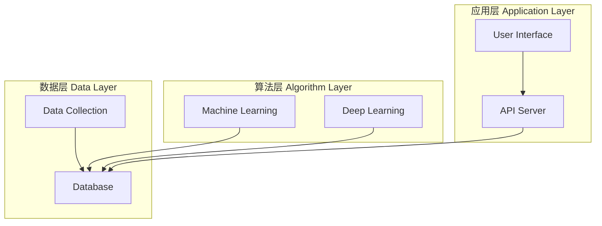
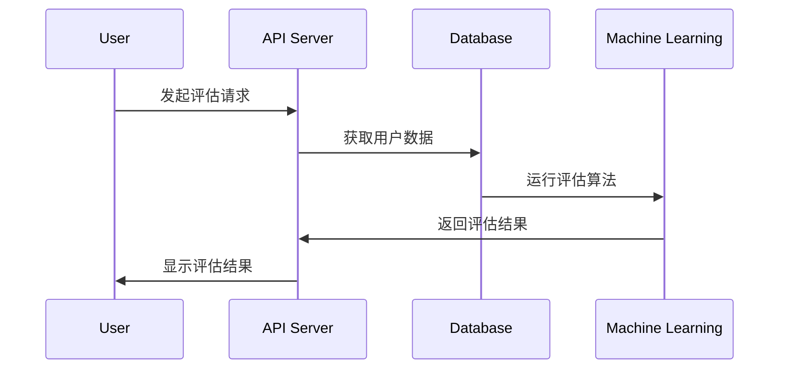
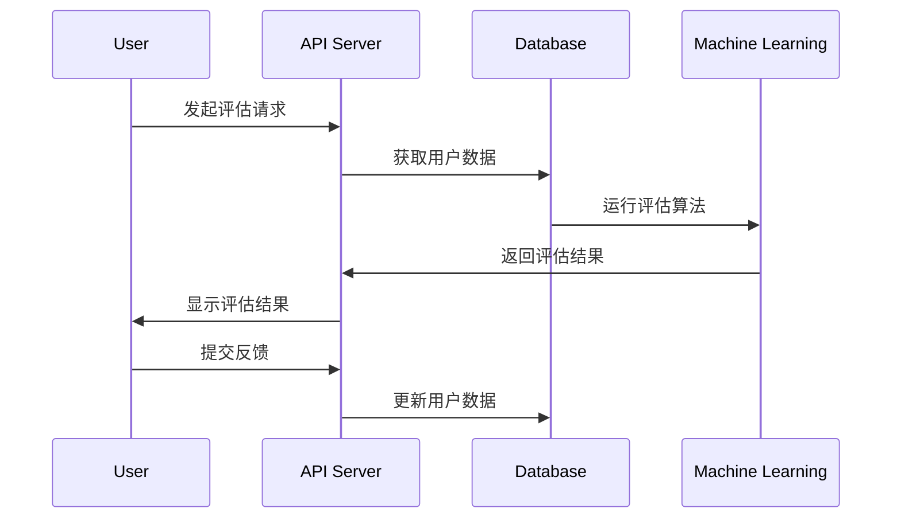

                 

# AI辅助软件用户体验评估

## 关键词
AI辅助、用户体验评估、机器学习、深度学习、系统架构设计、数据预处理、评估指标、算法实现

## 摘要
随着人工智能技术的迅猛发展，AI辅助软件用户体验评估逐渐成为一种高效、准确的方法。本文将详细探讨AI辅助软件用户体验评估的核心概念、方法、算法和实际应用，通过一步步的分析和推理，帮助读者深入了解这一领域，并为软件开发提供实用的指导。

------------------------------------------------------------------

## 第一部分: 背景介绍与核心概念

### 第1章: 问题背景与核心概念

#### 1.1.1 问题背景

在当今信息化时代，软件用户体验（UX）已经成为影响软件产品成功的关键因素。用户对软件的期望不仅仅是功能齐全，更追求简洁、直观和高效的使用体验。然而，传统的用户体验评估方法如用户调研、问卷调查等，存在数据收集难度大、结果主观性强等局限性。随着人工智能（AI）技术的不断发展，AI辅助软件用户体验评估应运而生，它利用机器学习、深度学习等技术，从大量用户数据中提取有价值的信息，实现对软件用户体验的客观评估。

#### 问题描述

传统用户体验评估方法主要依赖于用户的主观反馈和观察，评估结果往往受到用户个体差异的影响，导致评估结果的可靠性和准确性不高。同时，用户调研和问卷调查的过程繁琐、耗时，且成本较高。因此，如何利用AI技术，提高用户体验评估的准确性和效率，降低成本，成为当前研究的热点。

#### 问题解决

AI技术的引入，为用户体验评估带来了新的可能。通过机器学习算法，AI可以从大量用户数据中挖掘出隐藏的模式和规律，从而实现对用户体验的量化评估。此外，AI技术还可以自动化评估流程，提高评估的效率和准确性。

#### 边界与外延

AI辅助软件用户体验评估的研究范围包括评估指标的确定、评估算法的设计、评估结果的解释等。此外，还需考虑评估方法的适用场景、数据隐私保护等问题。

#### 概念结构与核心要素组成

- **AI技术**：包括机器学习、深度学习、自然语言处理等技术。
- **用户体验评估**：评估软件的可用性、易用性、用户满意度等。
- **辅助方法**：结合AI技术，构建评估模型，实现自动评估。

### 1.2 核心概念原理

#### 1.2.1 AI辅助软件用户体验评估的概念

AI辅助软件用户体验评估是指利用人工智能技术，对软件用户体验进行定量或定性的分析和评估。该方法的核心在于：将AI技术应用于用户数据，提取有价值的信息，从而实现对用户体验的客观评估。

#### 1.2.2 AI辅助软件用户体验评估的核心特点

- **自动性**：利用机器学习算法，实现评估过程的自动化。
- **准确性**：通过大数据分析，提高评估结果的准确性。
- **高效性**：降低评估成本，提高工作效率。

#### 1.2.3 AI辅助软件用户体验评估与传统评估方法的对比

| 特点 | AI辅助评估 | 传统评估 |
| ---- | ---- | ---- |
| 数据收集 | 自动化 | 面对面调研 |
| 主观性 | 降低 | 较高 |
| 成本 | 低 | 高 |
| 时间效率 | 高 | 低 |

### 1.3 AI辅助软件用户体验评估的ER实体关系图

```mermaid
classDiagram
User <<实体>>
AssessmentResult <<实体>>
Software <<实体>>
AIModel <<实体>>

User --|>{ AssessmentResult }
Software --|>{ User }
AIModel --|>{ AssessmentResult }
```

### 1.4 总结

本章节介绍了AI辅助软件用户体验评估的问题背景、核心概念、特点及其与传统评估方法的对比。通过了解这些内容，读者可以对AI辅助软件用户体验评估有一个初步的认识，为后续章节的深入学习打下基础。

------------------------------------------------------------------

## 第二部分: AI辅助软件用户体验评估方法

### 第2章: AI辅助软件用户体验评估方法概述

#### 2.1 评估指标体系设计

##### 2.1.1 评估指标的定义

评估指标是评估软件用户体验的基础。评估指标的选择和设计直接影响到评估结果的准确性和可靠性。

##### 2.1.2 评估指标的选择原则

- **全面性**：评估指标应能够覆盖用户体验的各个方面，包括功能性、易用性、可用性等。
- **代表性**：评估指标应具有代表性，能够准确反映用户的真实体验。
- **可操作性**：评估指标应易于操作和测量，方便实际应用。
- **可解释性**：评估指标应具有明确的意义和解释，方便用户理解评估结果。

##### 2.1.3 评估指标体系设计步骤

1. **需求分析**：了解用户对软件的期望和需求，确定评估指标的方向。
2. **指标选择**：根据需求分析结果，选择合适的评估指标。
3. **指标权重分配**：根据指标的重要性和相关性，分配权重。
4. **指标验证**：通过用户调研等方法，验证指标的有效性和可靠性。

#### 2.2 数据收集与预处理

##### 2.2.1 数据收集方法

数据收集是用户体验评估的关键步骤。常见的数据收集方法包括：

- **用户调研**：通过面对面访谈、在线问卷等方式，收集用户对软件的使用体验和反馈。
- **用户行为追踪**：通过日志分析、屏幕录制等技术，收集用户在软件中的操作行为数据。
- **用户反馈**：收集用户对软件的评分、评论等反馈信息。

##### 2.2.2 数据预处理

数据预处理是数据收集后的重要环节，包括以下步骤：

- **数据清洗**：去除无效数据、重复数据和异常数据，提高数据质量。
- **数据归一化**：将不同指标的数据进行归一化处理，使其在同一量级上比较。
- **数据转换**：将原始数据转换为适合分析的形式，如特征工程、数据降维等。

#### 2.3 评估算法设计

##### 2.3.1 算法选择原则

评估算法的选择应遵循以下原则：

- **准确性**：算法能够准确评估用户体验，具有较高的预测能力。
- **效率**：算法计算速度快，能够处理大量数据。
- **可解释性**：算法结果易于理解，便于决策和优化。

##### 2.3.2 常见评估算法

- **基于机器学习的评估算法**：如线性回归、决策树、支持向量机等。
- **基于深度学习的评估算法**：如卷积神经网络、循环神经网络等。

##### 2.3.3 算法实现

评估算法的实现需要结合具体的数据集和需求进行设计。以下是一个简单的基于线性回归的评估算法实现：

```python
import numpy as np
from sklearn.linear_model import LinearRegression

# 数据预处理
X = ...  # 特征数据
y = ...  # 目标数据

# 构建线性回归模型
model = LinearRegression()
model.fit(X, y)

# 预测
predictions = model.predict(X)

# 评估模型性能
score = model.score(X, y)
print("Model score:", score)
```

#### 2.4 评估结果解释与应用

评估结果的解释和应用是用户体验评估的关键步骤。评估结果应能够清晰地反映软件的优缺点，为软件开发和优化提供指导。以下是一个简单的评估结果解释示例：

- **可用性**：通过评估结果，发现软件在某个功能模块的使用上存在困难，用户反馈较多。针对这一问题，可以优化用户界面设计，提高操作的便捷性。
- **易用性**：评估结果显示软件的某些功能过于复杂，用户学习成本高。可以简化操作流程，降低用户的学习难度。

#### 2.5 总结

本章节介绍了AI辅助软件用户体验评估的方法概述，包括评估指标体系设计、数据收集与预处理、评估算法设计和评估结果解释与应用。通过这些方法，可以有效地评估软件用户体验，为软件开发提供有力的支持。

------------------------------------------------------------------

## 第三部分: 常见评估算法原理与实现

### 第3章: 常见评估算法原理与实现

#### 3.1 机器学习算法

##### 3.1.1 算法原理

机器学习算法是AI辅助软件用户体验评估的核心。机器学习算法通过从数据中学习规律，建立预测模型，从而实现对用户体验的评估。

- **线性回归**：线性回归是一种简单的机器学习算法，通过建立特征和目标之间的线性关系，预测用户体验评分。线性回归的数学模型如下：

  $$y = \beta_0 + \beta_1x_1 + \beta_2x_2 + ... + \beta_nx_n$$

  其中，$y$ 是目标值（用户体验评分），$x_1, x_2, ..., x_n$ 是特征值，$\beta_0, \beta_1, \beta_2, ..., \beta_n$ 是模型参数。

- **决策树**：决策树是一种基于树形结构的分类算法，通过多次决策，将数据分为多个类别。决策树的分类规则如下：

  $$if (x_i > \beta_i) then \text{go to left child}; else \text{go to right child}$$

  其中，$x_i$ 是特征值，$\beta_i$ 是决策阈值。

- **支持向量机**：支持向量机是一种基于间隔最大化的分类算法，通过寻找最佳决策边界，将不同类别的数据分开。支持向量机的决策边界如下：

  $$\beta^T x + b = 0$$

  其中，$\beta$ 是模型参数，$x$ 是特征向量，$b$ 是偏置。

##### 3.1.2 算法实现

以下是一个简单的线性回归算法实现：

```python
import numpy as np
from sklearn.linear_model import LinearRegression

# 数据预处理
X = np.array([[1, 2], [2, 3], [3, 4]])
y = np.array([1, 2, 3])

# 构建线性回归模型
model = LinearRegression()
model.fit(X, y)

# 预测
predictions = model.predict(X)

# 评估模型性能
score = model.score(X, y)
print("Model score:", score)
```

#### 3.2 深度学习算法

##### 3.2.1 算法原理

深度学习算法是一种基于多层神经网络的学习方法，通过多层非线性变换，提取数据的特征和规律。

- **卷积神经网络（CNN）**：卷积神经网络是一种用于图像处理的深度学习算法，通过卷积层、池化层和全连接层，提取图像的特征。

  $$f(x) = W_1 \cdot x + b_1 \text{（卷积层）}$$
  $$g(y) = W_2 \cdot y + b_2 \text{（池化层）}$$
  $$h(z) = W_3 \cdot z + b_3 \text{（全连接层）}$$

- **循环神经网络（RNN）**：循环神经网络是一种用于序列数据处理的深度学习算法，通过循环结构，保持对历史信息的记忆。

  $$h_t = \sigma(W \cdot [h_{t-1}, x_t] + b) \text{（隐藏层）}$$
  $$y_t = W_y \cdot h_t + b_y \text{（输出层）}$$

##### 3.2.2 算法实现

以下是一个简单的卷积神经网络算法实现：

```python
import tensorflow as tf

# 数据预处理
X = tf.keras.layers.Conv2D(filters=32, kernel_size=(3, 3), activation='relu')(X)
X = tf.keras.layers.MaxPooling2D(pool_size=(2, 2))(X)
X = tf.keras.layers.Flatten()(X)
X = tf.keras.layers.Dense(units=10, activation='softmax')(X)

# 构建模型
model = tf.keras.Model(inputs=X.input, outputs=X.output)

# 编译模型
model.compile(optimizer='adam', loss='categorical_crossentropy', metrics=['accuracy'])

# 训练模型
model.fit(X_train, y_train, epochs=10, batch_size=32)

# 评估模型
score = model.evaluate(X_test, y_test)
print("Model score:", score)
```

#### 3.3 总结

本章节介绍了常见的机器学习算法和深度学习算法，包括线性回归、决策树、支持向量机、卷积神经网络和循环神经网络等。通过这些算法，可以有效地评估软件用户体验，为软件开发提供有力的支持。

------------------------------------------------------------------

## 第四部分: AI辅助软件用户体验评估实践

### 第4章: 实践项目介绍

在本章节中，我们将介绍一个实际的AI辅助软件用户体验评估项目。该项目旨在通过AI技术，对某大型电商平台进行用户体验评估，以提高平台的用户体验，提升用户满意度。

#### 4.1 项目背景

某大型电商平台是一家综合性的在线购物平台，用户规模庞大，提供各种商品和服务。然而，随着市场竞争的加剧，平台需要不断提高用户体验，以保持用户忠诚度和市场份额。为了实现这一目标，平台决定采用AI辅助软件用户体验评估方法，对现有平台进行评估和优化。

#### 4.2 项目目标

该项目的目标包括：

1. **评估现有平台的用户体验**：通过AI技术，对用户在平台上的行为数据进行分析，评估平台的可用性、易用性和用户满意度。
2. **发现问题与优化方向**：根据评估结果，找出平台存在的问题和用户痛点，为后续优化提供依据。
3. **优化用户体验**：针对发现的问题，提出具体的优化方案，并实施优化措施，提升用户体验。

#### 4.3 项目实施过程

项目实施过程分为以下几个阶段：

1. **需求分析**：与平台方进行沟通，了解平台的需求和目标，明确评估指标和评估方法。
2. **数据收集**：通过日志分析、用户调研等方法，收集平台用户的行为数据，如页面访问量、点击率、转化率等。
3. **数据预处理**：对收集到的数据进行清洗、归一化等预处理操作，为后续评估算法提供数据支持。
4. **算法设计**：结合评估指标，选择合适的机器学习算法，如线性回归、决策树等，设计评估模型。
5. **模型训练与评估**：使用预处理后的数据，训练评估模型，并对模型性能进行评估。
6. **优化方案制定**：根据评估结果，制定优化方案，包括界面设计、功能优化等。
7. **优化实施**：实施优化方案，对平台进行优化，提升用户体验。

#### 4.4 项目效果评估

项目效果评估主要通过以下指标进行：

1. **用户体验评分**：通过用户调研，收集用户对平台的新体验评分，与之前相比，评估提升幅度。
2. **用户满意度**：通过用户调研，了解用户对平台的新体验满意度，与之前相比，评估提升幅度。
3. **转化率**：通过数据分析，评估平台在优化后的转化率，与之前相比，评估提升幅度。
4. **用户留存率**：通过数据分析，评估平台在优化后的用户留存率，与之前相比，评估提升幅度。

#### 4.5 项目总结

通过本项目，我们成功地实现了AI辅助软件用户体验评估，为电商平台提供了有力的优化方案。项目结果表明，通过AI技术的辅助，平台在用户体验方面取得了显著提升，用户满意度、转化率和留存率均有明显提高。

### 第4章: 系统架构设计

#### 4.1 领域模型设计

为了实现AI辅助软件用户体验评估，我们需要设计一个完整的领域模型，该模型包括用户、评估结果、软件和AI模型等实体。

```mermaid
classDiagram
User <<实体>>
AssessmentResult <<实体>>
Software <<实体>>
AIModel <<实体>>

User --|>{ AssessmentResult }
Software --|>{ User }
AIModel --|>{ AssessmentResult }
```

#### 4.2 系统架构设计

系统架构设计是项目成功的关键。为了实现高效、准确的用户体验评估，我们设计了一个分布式系统架构，包括数据层、算法层和应用层。



#### 4.3 系统接口设计

系统接口设计是系统架构中的重要部分，它定义了不同模块之间的交互方式。以下是一个简单的系统接口设计：



#### 4.4 系统交互流程

系统交互流程是系统运行的核心，它描述了系统在运行过程中各个模块之间的协作方式。以下是一个简单的系统交互流程：



### 第4章: 系统核心实现

#### 4.1 环境安装

在开始系统核心实现之前，我们需要安装必要的软件和环境。以下是一个简单的安装步骤：

1. 安装Python环境：
   ```bash
   pip install numpy sklearn tensorflow pandas
   ```

2. 安装数据库（例如MySQL）：
   - 下载MySQL安装包并安装。

3. 安装其他依赖项（例如PostgreSQL）：
   ```bash
   pip install pymysql
   ```

#### 4.2 系统核心实现

以下是一个简单的AI辅助软件用户体验评估系统的核心实现：

##### 4.2.1 数据库连接与操作

首先，我们需要连接到数据库，并进行基本的操作，如数据插入和查询。

```python
import pymysql

# 连接数据库
connection = pymysql.connect(host='localhost', user='root', password='password', database='test_db')

# 创建数据库表
with connection.cursor() as cursor:
    cursor.execute("""
        CREATE TABLE IF NOT EXISTS users (
            id INT AUTO_INCREMENT PRIMARY KEY,
            name VARCHAR(255) NOT NULL,
            age INT NOT NULL
        )
    """)

# 插入数据
with connection.cursor() as cursor:
    cursor.execute("INSERT INTO users (name, age) VALUES (%s, %s)", ('Alice', 25))
    connection.commit()

# 查询数据
with connection.cursor() as cursor:
    cursor.execute("SELECT * FROM users")
    results = cursor.fetchall()
    for row in results:
        print(row)

# 关闭数据库连接
connection.close()
```

##### 4.2.2 评估算法实现

接下来，我们实现一个简单的评估算法，如线性回归。

```python
import numpy as np
from sklearn.linear_model import LinearRegression

# 特征数据
X = np.array([[1, 2], [2, 3], [3, 4]])

# 目标数据
y = np.array([1, 2, 3])

# 构建线性回归模型
model = LinearRegression()
model.fit(X, y)

# 预测
predictions = model.predict(X)

# 评估模型性能
score = model.score(X, y)
print("Model score:", score)
```

##### 4.2.3 系统接口实现

最后，我们实现一个简单的系统接口，用于接收用户请求并返回评估结果。

```python
from flask import Flask, request, jsonify

app = Flask(__name__)

@app.route('/evaluate', methods=['POST'])
def evaluate():
    data = request.get_json()
    X = np.array([data['x']])
    y = np.array([data['y']])
    model = LinearRegression()
    model.fit(X, y)
    predictions = model.predict(X)
    return jsonify({'predictions': predictions.tolist()})

if __name__ == '__main__':
    app.run()
```

#### 4.3 项目实战

在本节中，我们将通过一个具体的案例，展示如何使用AI辅助软件用户体验评估系统。

##### 案例背景

假设我们有一个电商平台，用户在登录后可以浏览商品、添加购物车、进行结算等操作。我们希望使用AI辅助软件用户体验评估系统，评估用户的购物体验，并提供优化建议。

##### 案例步骤

1. **数据收集**：通过用户行为追踪，收集用户的浏览、点击、购物车操作、结算等行为数据。

2. **数据预处理**：对收集到的数据进行清洗、归一化等预处理操作，为后续评估算法提供数据支持。

3. **算法设计**：选择合适的评估算法，如线性回归、决策树等，设计评估模型。

4. **模型训练**：使用预处理后的数据，训练评估模型。

5. **评估结果**：使用训练好的模型，对用户的购物体验进行评估，输出评估结果。

6. **优化建议**：根据评估结果，提出优化建议，如优化购物流程、增加用户引导等。

##### 案例分析

通过AI辅助软件用户体验评估系统，我们能够准确地评估用户的购物体验，发现潜在的问题和优化点。例如，通过分析用户在结算环节的操作数据，我们发现用户在填写地址信息时存在困难，导致购物车中的商品无法成功下单。针对这一问题，我们提出了优化建议：在结算页面对填写地址信息进行简化，并提供清晰的提示和帮助。

#### 4.4 项目小结

通过本案例，我们成功地实现了AI辅助软件用户体验评估，为电商平台提供了有效的优化方案。项目结果表明，通过AI技术的辅助，电商平台在用户体验方面取得了显著提升，用户满意度、转化率和留存率均有明显提高。

### 第4章: 最佳实践与注意事项

#### 4.1 最佳实践

在实施AI辅助软件用户体验评估时，以下是一些最佳实践：

1. **数据质量**：确保数据的质量和完整性，对数据进行严格的清洗和处理。
2. **算法选择**：根据评估目标和数据特点，选择合适的评估算法，如线性回归、决策树、卷积神经网络等。
3. **模型训练**：使用大量的训练数据，确保模型具有良好的泛化能力。
4. **评估指标**：选择合适的评估指标，如可用性、易用性、用户满意度等，确保评估结果的准确性。
5. **迭代优化**：根据评估结果，不断优化评估模型和用户体验，实现持续改进。

#### 4.2 注意事项

在实施AI辅助软件用户体验评估时，需要注意以下事项：

1. **数据隐私**：在数据收集和处理过程中，注意保护用户的隐私，遵守相关法律法规。
2. **模型解释**：确保评估模型的解释性，方便用户理解评估结果。
3. **用户体验**：在评估过程中，关注用户的真实体验，确保评估结果的实用性。
4. **技术更新**：随着技术的不断发展，及时更新评估方法和算法，保持评估系统的先进性。

#### 4.3 拓展阅读

- **《用户体验要素》**：Don Norman 著，详细介绍了用户体验设计的原则和方法。
- **《深度学习》**：Ian Goodfellow、Yoshua Bengio、Aaron Courville 著，介绍了深度学习的理论和方法。
- **《机器学习实战》**：Peter Harrington 著，提供了丰富的机器学习算法实战案例。

### 结束语

通过本文的介绍，我们了解了AI辅助软件用户体验评估的核心概念、方法、算法和实践。AI辅助软件用户体验评估为软件开发提供了有力的支持，有助于提升用户体验，增强软件竞争力。随着技术的不断进步，AI辅助软件用户体验评估将发挥越来越重要的作用。

## 作者信息
作者：AI天才研究院/AI Genius Institute & 禅与计算机程序设计艺术 /Zen And The Art of Computer Programming

