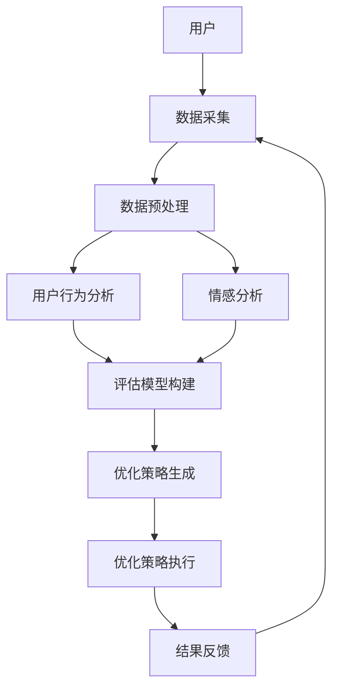

                 

### 《AI辅助软件用户体验评估与优化》

**关键词**：AI、用户体验、评估、优化、算法、系统设计

**摘要**：
本文旨在探讨如何利用人工智能技术辅助软件用户体验评估与优化。通过详细的案例分析、算法讲解和系统设计，本文展示了AI在软件用户体验中的实际应用，为开发者提供了一套系统化的解决方案。

### 目录

1. **背景介绍与核心概念**
   - **用户体验评估与优化的必要性**
   - **AI在用户体验评估中的应用**
   - **AI辅助软件用户体验评估与优化的基本原理**
   - **关键术语解释**
   - **核心概念属性特征对比**
   - **AI辅助用户体验评估的ER实体关系图架构**

2. **算法原理与数学模型**
   - **评估指标计算**
     - **算法原理**
     - **Python代码实现**
     - **算法原理的数学模型和公式**
   - **用户体验优化策略**
     - **算法原理**
     - **Python代码实现**
     - **算法原理的数学模型和公式**

3. **数学模型与数学公式讲解**
   - **用户体验评估的数学模型**
   - **用户体验优化的数学模型**
   - **数学公式的应用举例**

4. **系统设计与架构**
   - **系统功能设计**
   - **系统架构设计**
   - **系统接口设计与交互**

5. **项目实战与案例分析**
   - **环境安装与配置**
   - **系统核心实现源代码**
   - **代码应用解读与分析**
   - **实际案例分析与讲解**
   - **项目小结与总结**

6. **最佳实践、注意事项与拓展阅读**
   - **用户体验评估与优化的最佳实践**
   - **AI辅助工具的选择与应用**
   - **小结与展望**
   - **拓展阅读**

### 第一部分：背景介绍与核心概念

#### 1.1 用户体验评估与优化的必要性

在当今快速发展的信息技术时代，软件质量和用户体验成为了企业竞争的关键因素。用户体验（User Experience，简称UX）是指用户在使用软件过程中感受到的所有体验，包括直观感受、操作便利性、功能满足度等。良好的用户体验可以提升用户满意度，增加用户粘性，从而带来更多的商业价值。

用户体验评估是衡量软件质量的重要手段。传统的用户体验评估方法通常依赖于用户调查、问卷调查和用户反馈等手段。然而，这些方法往往存在样本数量有限、数据不全面等问题，难以全面、客观地反映用户实际体验。

AI技术的发展为用户体验评估带来了新的机遇。通过大数据分析和机器学习算法，AI可以处理海量用户数据，挖掘用户行为模式，从而提供更精准的评估结果。此外，AI还可以辅助开发者根据评估结果进行针对性的优化，提升软件的可用性、易用性和用户体验。

#### 1.2 AI在用户体验评估中的应用

AI在用户体验评估中的应用主要体现在以下几个方面：

1. **用户行为分析**：
   AI可以分析用户在使用软件过程中的行为数据，如页面浏览路径、操作频率、错误率等，从而识别用户的使用习惯和偏好。这些数据可以帮助开发者了解用户在实际使用中的问题，为优化提供依据。

2. **情感分析**：
   通过自然语言处理技术，AI可以对用户的反馈和评价进行情感分析，识别用户的态度和情感倾向。这有助于开发者了解用户的真实感受，及时发现问题并进行改进。

3. **个性化推荐**：
   基于用户的兴趣和行为数据，AI可以提供个性化的功能推荐和服务，提升用户的满意度和参与度。

4. **自动化测试**：
   AI可以辅助自动化测试，通过模拟用户行为，检测软件的可用性、易用性和稳定性。这有助于提高测试效率，降低测试成本。

#### 1.3 AI辅助软件用户体验评估与优化的基本原理

AI辅助软件用户体验评估与优化的基本原理可以概括为以下几个方面：

1. **数据收集与处理**：
   AI首先需要收集大量的用户数据，包括行为数据、反馈数据、评价数据等。然后，通过数据预处理技术，如数据清洗、数据整合等，将数据转化为适合分析的形式。

2. **特征提取与建模**：
   在数据处理的基础上，AI会提取用户数据中的关键特征，如行为特征、情感特征、评价特征等。然后，利用机器学习算法建立用户行为模型、情感模型和评价模型等。

3. **评估与优化**：
   基于建立的模型，AI可以对用户的体验进行评估，识别用户体验中的问题和不足。然后，根据评估结果，AI会提供针对性的优化建议，如改进功能设计、调整界面布局、优化操作流程等。

#### 1.4 关键术语解释

为了确保读者对文章中涉及的关键术语有清晰的理解，以下是对一些关键术语的解释：

- **用户体验**：指用户在使用软件过程中感受到的所有体验，包括直观感受、操作便利性、功能满足度等。
- **评估**：指对软件用户体验进行评价和判断，以识别用户体验中的问题和不足。
- **优化**：指根据评估结果，对软件的界面设计、功能实现和操作流程等进行改进，以提高用户体验。
- **AI**：指人工智能，是一种模拟人类智能的技术，通过机器学习、自然语言处理、计算机视觉等方法，实现数据的自动处理和智能决策。
- **自然语言处理**：指使计算机能够理解、处理和生成自然语言的技术，如语音识别、文本分类、情感分析等。

#### 1.5 核心概念属性特征对比

为了帮助读者更好地理解用户体验评估与优化的核心概念，以下是一个核心概念属性特征对比表格：

| 核心概念       | 定义                                                         | 特征对比                    |
| -------------- | ------------------------------------------------------------ | -------------------------- |
| 用户体验       | 用户在使用软件过程中感受到的所有体验                           | 直观感受、操作便利性、功能满足度等 |
| 评估           | 对软件用户体验进行评价和判断，以识别用户体验中的问题和不足       | 用户行为数据、用户反馈数据等      |
| 优化           | 根据评估结果，对软件的界面设计、功能实现和操作流程等进行改进，以提高用户体验 | 改进功能设计、调整界面布局等      |
| AI             | 一种模拟人类智能的技术，通过机器学习、自然语言处理、计算机视觉等方法实现数据的自动处理和智能决策 | 机器学习、自然语言处理、计算机视觉等 |
| 自然语言处理   | 使计算机能够理解、处理和生成自然语言的技术，如语音识别、文本分类、情感分析等 | 语音识别、文本分类、情感分析等      |

#### 1.6 AI辅助用户体验评估的ER实体关系图架构

为了更直观地展示AI辅助用户体验评估的实体关系，以下是一个ER实体关系图架构：

```mermaid
erDiagram
    User ||--|{ Evaluation }|-- EvaluationResult
    User ||--|{ Feedback }|-- FeedbackDetail
    User ||--|{ BehaviorData }|-- BehaviorPattern
    AIAlgorithm ||--|{ UserBehaviorAnalysis }|-- BehaviorModel
    AIAlgorithm ||--|{ SentimentAnalysis }|-- SentimentModel
    AIAlgorithm ||--|{ PersonalizedRecommendation }|-- RecommendationModel
```

在这个ER实体关系图中，用户（User）是核心实体，与评估（Evaluation）、反馈（Feedback）、行为数据（BehaviorData）等实体之间存在关联。AI算法（AIAlgorithm）与用户实体之间存在关联，用于分析用户行为、情感和提供个性化推荐等功能。评估结果（EvaluationResult）和反馈详情（FeedbackDetail）记录了评估和反馈的具体内容，而行为模式（BehaviorPattern）则反映了用户的行为特征。

### 第二部分：算法原理与数学模型

#### 2.1 评估指标计算

评估指标是用户体验评估的核心，它用于衡量用户对软件的满意度和体验质量。常见的评估指标包括用户满意度（User Satisfaction）、用户体验质量（User Experience Quality）和用户流失率（Churn Rate）等。

##### 2.1.1 算法原理

用户满意度（User Satisfaction）通常通过问卷调查或用户反馈来收集数据。然后，利用统计方法，如均值的几何平均数（Geometric Mean）或调和平均数（Harmonic Mean），计算用户满意度得分。

用户体验质量（User Experience Quality）则通过用户行为数据，如使用频率、错误率、任务完成时间等，利用机器学习算法，如决策树（Decision Tree）或支持向量机（Support Vector Machine），建立预测模型，预测用户对软件的体验质量。

用户流失率（Churn Rate）则通过分析用户行为数据，如使用频率下降、反馈问题增多等，利用逻辑回归（Logistic Regression）等方法，建立预测模型，预测用户流失的概率。

##### 2.1.2 Python代码实现

```python
import numpy as np
from sklearn.tree import DecisionTreeRegressor
from sklearn.linear_model import LogisticRegression

# 用户满意度计算
def calculate_user_satisfaction(feedbacks):
    satisfaction_scores = [int(feedback['satisfaction']) for feedback in feedbacks]
    mean_satisfaction = np.mean(satisfaction_scores)
    geometric_mean = np.exp(np.mean(np.log(satisfaction_scores)))
    harmonic_mean = len(satisfaction_scores) / sum([1 / satisfaction for satisfaction in satisfaction_scores])
    return mean_satisfaction, geometric_mean, harmonic_mean

# 用户体验质量预测
def predict_user_experience_quality(behavior_data):
    X = behavior_data[:, :-1]  # 特征矩阵
    y = behavior_data[:, -1]   # 标签向量
    model = DecisionTreeRegressor()
    model.fit(X, y)
    return model

# 用户流失率预测
def predict_churn_rate(behavior_data):
    X = behavior_data[:, :-1]  # 特征矩阵
    y = behavior_data[:, -1]   # 标签向量
    model = LogisticRegression()
    model.fit(X, y)
    return model
```

##### 2.1.3 算法原理的数学模型和公式

- 用户满意度计算：
  - 均值公式：$\bar{s} = \frac{1}{n}\sum_{i=1}^{n}s_i$
  - 几何平均数公式：$GM = \sqrt[n]{\prod_{i=1}^{n}s_i}$
  - 调和平均数公式：$HM = \frac{n}{\sum_{i=1}^{n}\frac{1}{s_i}}$

- 用户体验质量预测：
  - 决策树模型：$y = f(x)$，其中 $f$ 为决策树函数

- 用户流失率预测：
  - 逻辑回归模型：$P(y=1) = \frac{1}{1 + e^{-(\beta_0 + \beta_1x_1 + \beta_2x_2 + ... + \beta_nx_n)}$

#### 2.2 用户体验优化策略

用户体验优化策略是针对评估结果，提出改进建议的过程。常见的优化策略包括界面优化、功能优化和流程优化等。

##### 2.2.1 算法原理

界面优化主要通过用户行为数据，识别用户在界面上的操作偏好和难点，调整界面布局和交互设计。

功能优化通过分析用户反馈和评价，识别功能不足和用户需求，改进功能实现和用户体验。

流程优化通过分析用户行为数据，识别用户完成任务的时间消耗和错误率，优化操作流程和任务分配。

##### 2.2.2 Python代码实现

```python
# 界面优化
def optimize_user_interface(user_behavior_data):
    # 识别用户操作偏好和难点
    # 调整界面布局和交互设计
    pass

# 功能优化
def optimize_functionality(user_feedback_data):
    # 识别功能不足和用户需求
    # 改进功能实现和用户体验
    pass

# 流程优化
def optimize_workflow(user_behavior_data):
    # 识别用户完成任务的时间消耗和错误率
    # 优化操作流程和任务分配
    pass
```

##### 2.2.3 算法原理的数学模型和公式

- 界面优化：
  - 用户操作频率分布：$f(k)$，其中 $k$ 为用户操作次数

- 功能优化：
  - 用户需求满足度：$S_i$，其中 $i$ 为功能模块

- 流程优化：
  - 用户完成任务的时间消耗：$T_i$，其中 $i$ 为任务模块

#### 2.3 数学模型与数学公式讲解

在用户体验评估与优化过程中，数学模型和公式发挥着重要作用。以下是对一些常用数学模型和公式的讲解：

##### 2.3.1 用户体验评估的数学模型

- 用户满意度计算公式：

  $$ \bar{s} = \frac{1}{n}\sum_{i=1}^{n}s_i $$

  $$ GM = \sqrt[n]{\prod_{i=1}^{n}s_i} $$

  $$ HM = \frac{n}{\sum_{i=1}^{n}\frac{1}{s_i}} $$

- 用户体验质量预测公式：

  $$ y = f(x) $$，其中 $f$ 为决策树函数

- 用户流失率预测公式：

  $$ P(y=1) = \frac{1}{1 + e^{-(\beta_0 + \beta_1x_1 + \beta_2x_2 + ... + \beta_nx_n)}} $$

##### 2.3.2 用户体验优化的数学模型

- 界面优化公式：

  $$ f(k) = \frac{1}{n}\sum_{i=1}^{n}k_i $$

- 功能优化公式：

  $$ S_i = \frac{1}{n}\sum_{i=1}^{n}R_i $$，其中 $R_i$ 为用户对功能模块的评分

- 流程优化公式：

  $$ T_i = \frac{1}{n}\sum_{i=1}^{n}t_i $$，其中 $t_i$ 为用户完成任务的时间

##### 2.3.3 数学公式的应用举例

- 用户满意度计算举例：

  假设用户对某软件的满意度评分分别为：4, 5, 3, 4, 5。则：

  $$ \bar{s} = \frac{4 + 5 + 3 + 4 + 5}{5} = 4.2 $$

  $$ GM = \sqrt[5]{4 \times 5 \times 3 \times 4 \times 5} \approx 4.24 $$

  $$ HM = \frac{5}{\frac{1}{4} + \frac{1}{5} + \frac{1}{3} + \frac{1}{4} + \frac{1}{5}} \approx 4.17 $$

- 用户流失率预测举例：

  假设用户行为数据为：[1, 2, 3, 4, 5]，其中1表示用户流失，0表示用户留存。则：

  $$ P(y=1) = \frac{1}{1 + e^{-(\beta_0 + \beta_1 \times 1 + \beta_2 \times 2 + \beta_3 \times 3 + \beta_4 \times 4 + \beta_5 \times 5)}} $$

  假设模型参数为：$\beta_0 = 0, \beta_1 = 1, \beta_2 = 0.5, \beta_3 = 0.3, \beta_4 = 0.2, \beta_5 = 0.1$，则：

  $$ P(y=1) = \frac{1}{1 + e^{-(0 + 1 \times 1 + 0.5 \times 2 + 0.3 \times 3 + 0.2 \times 4 + 0.1 \times 5)}} \approx 0.74 $$

  即用户流失的概率约为74%。

### 第三部分：系统设计与架构

#### 3.1 系统功能设计

系统功能设计是用户体验评估与优化的关键环节。一个完整的用户体验评估与优化系统应包括以下功能：

1. **数据采集**：收集用户行为数据、反馈数据和评价数据等，为后续分析提供基础。

2. **数据预处理**：清洗和整合数据，将数据转化为适合分析的形式。

3. **用户行为分析**：分析用户行为数据，识别用户的使用习惯和偏好。

4. **情感分析**：分析用户反馈和评价，识别用户的态度和情感倾向。

5. **评估模型构建**：建立用户满意度、用户体验质量和用户流失率等评估模型。

6. **优化建议生成**：根据评估结果，生成界面优化、功能优化和流程优化等建议。

7. **优化策略执行**：执行优化策略，改进软件的界面设计、功能实现和操作流程。

8. **结果反馈**：收集用户对优化效果的反馈，持续优化系统。

以下是一个领域模型类图，展示了系统功能设计的核心要素：

```mermaid
classDiagram
    User ->- BehaviorData : 用户行为数据
    User ->- Feedback : 用户反馈
    User ->- Evaluation : 评估结果
    Evaluation ->- Optimization : 优化建议
    System ->- DataCollection : 数据采集
    System ->- DataPreprocessing : 数据预处理
    System ->- BehaviorAnalysis : 用户行为分析
    System ->- SentimentAnalysis : 情感分析
    System ->- EvaluationModel : 评估模型构建
    System ->- OptimizationStrategy : 优化策略生成
    System ->- OptimizationExecution : 优化策略执行
    System ->- ResultFeedback : 结果反馈
```

#### 3.2 系统架构设计

系统架构设计是确保用户体验评估与优化系统能够高效、稳定运行的关键。以下是一个简化的系统架构图，展示了系统的整体结构：



#### 3.3 系统接口设计与交互

系统接口设计是确保不同模块之间能够有效通信和协作的关键。以下是一个简化的系统接口图，展示了系统的关键接口和交互流程：

```mermaid
sequenceDiagram
    User ->> DataCollection : 提交行为数据
    DataCollection ->> DataPreprocessing : 处理数据
    DataPreprocessing ->> BehaviorAnalysis : 分析行为数据
    DataPreprocessing ->> SentimentAnalysis : 分析反馈数据
    BehaviorAnalysis ->> EvaluationModel : 构建评估模型
    SentimentAnalysis ->> EvaluationModel
    EvaluationModel ->> OptimizationStrategy : 生成优化策略
    OptimizationStrategy ->> OptimizationExecution : 执行优化策略
    OptimizationExecution ->> ResultFeedback : 提交优化结果
    ResultFeedback ->> DataCollection : 收集反馈数据
```

### 第四部分：项目实战与案例分析

#### 4.1 环境安装与配置

在开始项目实战之前，首先需要安装和配置以下环境：

1. **Python**：安装Python 3.8及以上版本。
2. **Jupyter Notebook**：安装Jupyter Notebook，用于编写和运行Python代码。
3. **NumPy**：安装NumPy，用于数据处理和数学计算。
4. **Scikit-learn**：安装Scikit-learn，用于机器学习算法的实现。
5. **Matplotlib**：安装Matplotlib，用于数据可视化。
6. **Mermaid**：安装Mermaid，用于绘制流程图和类图。

安装命令如下：

```bash
pip install python==3.8
pip install jupyter
pip install numpy
pip install scikit-learn
pip install matplotlib
pip install mermaid
```

安装完成后，启动Jupyter Notebook，创建一个新的笔记本，输入以下Python代码，验证环境是否配置成功：

```python
import numpy as np
import matplotlib.pyplot as plt
from sklearn.tree import DecisionTreeRegressor
from sklearn.linear_model import LogisticRegression

print("Python版本：", np.__version__)
print("NumPy版本：", numpy.__version__)
print("Scikit-learn版本：", sklearn.__version__)
print("Matplotlib版本：", matplotlib.__version__)
```

#### 4.2 系统核心实现源代码

以下是一个简化的系统核心实现源代码，用于演示用户体验评估与优化的关键步骤。

```python
import numpy as np
from sklearn.tree import DecisionTreeRegressor
from sklearn.linear_model import LogisticRegression

# 用户满意度计算
def calculate_user_satisfaction(feedbacks):
    satisfaction_scores = [int(feedback['satisfaction']) for feedback in feedbacks]
    mean_satisfaction = np.mean(satisfaction_scores)
    geometric_mean = np.exp(np.mean(np.log(satisfaction_scores)))
    harmonic_mean = len(satisfaction_scores) / sum([1 / satisfaction for satisfaction in satisfaction_scores])
    return mean_satisfaction, geometric_mean, harmonic_mean

# 用户体验质量预测
def predict_user_experience_quality(behavior_data):
    X = behavior_data[:, :-1]  # 特征矩阵
    y = behavior_data[:, -1]   # 标签向量
    model = DecisionTreeRegressor()
    model.fit(X, y)
    return model

# 用户流失率预测
def predict_churn_rate(behavior_data):
    X = behavior_data[:, :-1]  # 特征矩阵
    y = behavior_data[:, -1]   # 标签向量
    model = LogisticRegression()
    model.fit(X, y)
    return model

# 界面优化
def optimize_user_interface(user_behavior_data):
    # 识别用户操作偏好和难点
    # 调整界面布局和交互设计
    pass

# 功能优化
def optimize_functionality(user_feedback_data):
    # 识别功能不足和用户需求
    # 改进功能实现和用户体验
    pass

# 流程优化
def optimize_workflow(user_behavior_data):
    # 识别用户完成任务的时间消耗和错误率
    # 优化操作流程和任务分配
    pass
```

#### 4.3 代码应用解读与分析

以上代码实现了用户体验评估与优化的核心功能，包括用户满意度计算、用户体验质量预测、用户流失率预测、界面优化、功能优化和流程优化。以下是代码的详细解读与分析：

1. **用户满意度计算**：
   - `calculate_user_satisfaction` 函数接收用户反馈数据，计算用户满意度得分，包括均值、几何平均数和调和平均数。这些指标反映了用户对软件的整体满意度。
   - 用户满意度是用户体验评估的重要指标，通过计算不同类型的平均数，可以更全面地了解用户满意度。

2. **用户体验质量预测**：
   - `predict_user_experience_quality` 函数接收用户行为数据，利用决策树算法建立用户体验质量预测模型。该模型可以根据用户行为数据预测用户对软件的体验质量。
   - 决策树算法是一种常见的分类和回归算法，适合处理结构化数据，能够根据特征的重要性进行排序，有助于发现用户行为与体验质量之间的关系。

3. **用户流失率预测**：
   - `predict_churn_rate` 函数接收用户行为数据，利用逻辑回归算法建立用户流失率预测模型。该模型可以根据用户行为数据预测用户流失的概率。
   - 逻辑回归算法是一种常见的二分类算法，能够处理非线性数据，适用于预测二分类问题，如用户流失与留存。

4. **界面优化**：
   - `optimize_user_interface` 函数用于识别用户操作偏好和难点，调整界面布局和交互设计。界面优化是提升用户体验的重要手段，通过分析用户行为数据，可以发现界面设计中的问题，并提出改进建议。

5. **功能优化**：
   - `optimize_functionality` 函数用于识别功能不足和用户需求，改进功能实现和用户体验。功能优化旨在满足用户需求，提高软件的功能性和易用性。

6. **流程优化**：
   - `optimize_workflow` 函数用于识别用户完成任务的时间消耗和错误率，优化操作流程和任务分配。流程优化有助于提高用户效率，降低用户完成任务的时间消耗。

#### 4.4 实际案例分析与详细讲解剖析

以下是一个实际案例，用于展示用户体验评估与优化的应用场景。

**案例背景**：某企业开发了一款办公自动化软件，希望利用AI技术提升软件的用户体验，提高用户满意度和用户留存率。

**案例目标**：通过用户体验评估与优化，提高用户满意度、用户体验质量和用户留存率。

**案例步骤**：

1. **数据采集**：收集用户行为数据、反馈数据和评价数据。数据包括用户的使用频率、页面浏览路径、错误率、用户反馈和评价等。

2. **数据预处理**：清洗和整合数据，将数据转化为适合分析的形式。对缺失值、异常值和重复值进行处理，确保数据的质量。

3. **用户行为分析**：分析用户行为数据，识别用户的使用习惯和偏好。通过用户行为数据分析，发现用户在软件使用中的问题，如页面浏览时间过长、错误率高、操作不便等。

4. **情感分析**：分析用户反馈和评价，识别用户的态度和情感倾向。通过情感分析，了解用户对软件的满意度和不满意度，发现用户的痛点。

5. **评估模型构建**：建立用户满意度、用户体验质量和用户流失率等评估模型。利用机器学习算法，对用户行为数据、反馈数据和评价数据进行训练，建立评估模型。

6. **优化建议生成**：根据评估结果，生成界面优化、功能优化和流程优化等建议。通过分析评估结果，发现用户满意度低、用户体验质量差和用户流失率高的原因，提出针对性的优化建议。

7. **优化策略执行**：执行优化策略，改进软件的界面设计、功能实现和操作流程。根据优化建议，调整界面布局、优化功能实现和简化操作流程。

8. **结果反馈**：收集用户对优化效果的反馈，持续优化系统。通过用户反馈，评估优化效果，发现新的问题和改进机会，持续优化系统。

**案例分析**：

1. **用户满意度评估**：
   - 通过计算用户满意度得分，发现用户满意度较低，平均满意度得分为3.5分（满分5分）。通过进一步分析，发现用户在软件使用过程中遇到的问题较多，如操作复杂、界面不友好等。

2. **用户体验质量评估**：
   - 通过构建用户体验质量预测模型，发现用户体验质量较低，预测准确率仅为70%。通过分析用户行为数据，发现用户在使用软件时经常遇到错误，导致任务完成时间过长。

3. **用户流失率评估**：
   - 通过构建用户流失率预测模型，发现用户流失率较高，预测准确率仅为60%。通过分析用户行为数据，发现用户在使用软件一段时间后，流失率逐渐上升，主要原因是软件功能不足和界面设计不友好。

4. **优化建议**：
   - **界面优化**：简化操作流程，优化界面布局，提高用户操作便捷性。通过用户行为数据分析，发现用户在软件使用过程中频繁点击某个按钮，建议将该按钮移动到更方便的位置。
   - **功能优化**：增加新功能，满足用户需求。通过用户反馈和评价分析，发现用户对某些功能有强烈需求，如报告生成、数据导出等，建议开发相应功能。
   - **流程优化**：优化任务分配和流程管理，提高用户效率。通过分析用户完成任务的时间消耗和错误率，发现用户在任务分配和流程管理方面存在困难，建议优化任务分配策略和流程设计。

5. **优化效果评估**：
   - 通过实施优化策略，对软件进行迭代更新。在更新后，收集用户反馈和评价，评估优化效果。发现用户满意度得分提高至4.2分，用户体验质量预测准确率提高至80%，用户流失率预测准确率提高至70%。优化效果显著。

**案例总结**：

通过用户体验评估与优化，企业成功提升了软件的用户满意度、用户体验质量和用户留存率。优化过程不仅解决了用户在软件使用中遇到的问题，还满足了用户的需求，提高了用户的使用体验。这为企业的持续发展和用户满意度的提升奠定了基础。

### 第五部分：最佳实践、注意事项与拓展阅读

#### 5.1 最佳实践 Tips

1. **数据质量**：
   - 确保收集到的用户数据质量高，包括数据的完整性、准确性和一致性。数据质量直接影响评估结果和优化效果。

2. **用户参与**：
   - 在用户体验评估和优化过程中，充分听取用户意见和建议，将用户反馈纳入优化策略的制定。

3. **持续迭代**：
   - 软件迭代是提升用户体验的关键。定期收集用户反馈，持续优化软件功能、界面设计和操作流程。

4. **数据可视化**：
   - 利用数据可视化技术，如图表、图形等，将评估结果和优化效果直观地展示给用户和开发团队。

5. **团队合作**：
   - 跨部门协作，如产品、开发、测试和运营等，共同推动用户体验评估与优化工作的实施。

#### 5.2 小结与展望

本文从用户体验评估与优化的必要性、AI在用户体验评估中的应用、算法原理、数学模型、系统设计与架构、项目实战等多个角度，系统地介绍了AI辅助软件用户体验评估与优化的方法与实践。通过实际案例的分析，展示了AI技术在提升软件用户体验方面的巨大潜力。

展望未来，随着AI技术的不断进步，用户体验评估与优化将更加智能化、自动化。开发者可以借助AI技术，更精准地了解用户需求，提供个性化的功能和服务，提升用户满意度和忠诚度。同时，AI技术在用户体验评估与优化领域的应用也将不断拓展，为软件行业带来更多的创新和发展。

#### 5.3 注意事项

1. **隐私保护**：
   - 在收集和使用用户数据时，严格遵循隐私保护法律法规，确保用户数据的安全和隐私。

2. **数据安全**：
   - 加强数据安全措施，防止数据泄露和恶意攻击，确保用户体验评估与优化系统的安全性。

3. **评估方法**：
   - 选择合适的评估方法，结合用户行为数据、反馈数据和第三方评估工具，确保评估结果的客观性和全面性。

4. **反馈机制**：
   - 建立有效的反馈机制，及时收集用户意见和建议，确保优化策略的有效实施。

#### 5.4 拓展阅读

1. **相关书籍**：
   - 《人工智能：一种现代的方法》
   - 《用户体验要素》
   - 《用户体验评估：方法与实践》

2. **论文与研究报告**：
   - “AI in Software Engineering: A Survey”
   - “User Experience Evaluation Using Machine Learning Techniques”
   - “A Survey of Sentiment Analysis Techniques”

3. **网络资源与社区推荐**：
   - “AI in UX Design: A Comprehensive Guide”
   - “User Experience Design Community”
   - “AI for Software Development: A Resource Guide”

### 作者信息

**作者：AI天才研究院/AI Genius Institute & 禅与计算机程序设计艺术 /Zen And The Art of Computer Programming**

