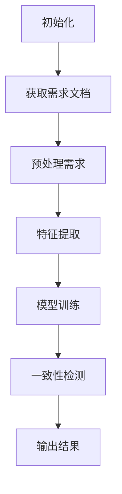
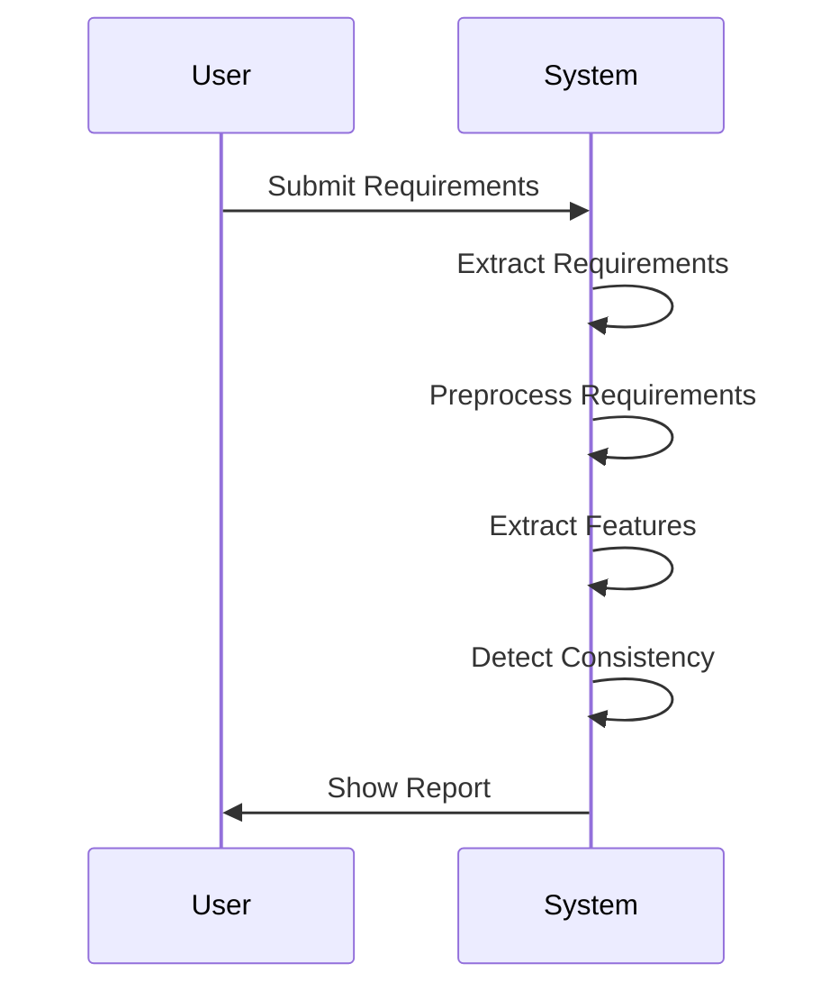

                 

### 第1章: 引言

#### 1.1 问题背景

在当今软件工程领域，需求不一致性是一个普遍且严重的问题。这种不一致性常常发生在需求收集、需求分析、需求变更管理等多个阶段，导致项目延迟、预算超支，甚至项目失败。传统的需求管理方法通常依赖于人工审查和核对，效率低下且易出错。随着软件系统的复杂性不断增加，需求不一致性的问题显得尤为突出。

AI技术的快速发展为解决这一难题提供了新的思路。AI能够通过自动化、智能化的方式，提高需求一致性检查的效率和质量。在软件工程中，AI的应用不仅可以提高开发团队的工作效率，还能确保软件产品的质量，减少因需求不一致而导致的开发风险。

#### 1.2 问题描述

需求不一致性的问题具体表现在以下几个方面：

1. **需求之间的冲突**：当两个或多个需求无法同时满足时，就会产生冲突。例如，一个需求要求系统必须支持快速响应，而另一个需求则要求系统具有高可靠性，这往往会导致设计上的矛盾。
2. **需求的不完整性**：有些需求可能由于沟通不畅、理解偏差等原因，未被完整表述，导致后续开发过程中出现遗漏或误解。
3. **需求的变化**：在软件开发过程中，客户需求可能会发生变更，如果没有得到及时和有效的管理，这些变更可能会导致需求之间的不一致。

需求不一致性带来的风险包括：

- **项目延期**：由于需求变更和冲突，开发团队可能需要重新设计、重新编码，导致项目进度推迟。
- **成本增加**：重复工作、返工和测试费用会显著增加项目的总成本。
- **质量问题**：需求不一致可能导致软件产品功能不完整、性能不稳定，影响用户体验和客户满意度。

#### 1.3 问题解决

传统的需求不一致性检测方法主要包括以下几种：

1. **人工审查**：开发团队通过手工检查文档来发现不一致性。这种方法虽然能够发现一些问题，但效率较低，容易遗漏，且无法处理复杂的需求。
2. **工具辅助**：使用需求管理工具（如JIRA、Confluence等）来追踪和管理需求，这些工具提供了自动化检查功能，但仍然依赖于人工的操作。
3. **模型比较**：通过构建需求模型，使用模型比较技术（如一致性检查算法）来检测不一致性。这种方法比人工审查更高效，但需要专业的知识和技能。

AI辅助需求一致性检查的优势在于：

1. **自动化**：AI可以自动提取需求信息，并进行分析，减少人工工作量。
2. **高效性**：AI算法能够在短时间内处理大量数据，提高检测效率。
3. **准确性**：AI可以基于机器学习模型，不断优化检测算法，提高检测准确性。
4. **适应性**：AI可以适应不断变化的需求，及时调整检测策略。

#### 1.4 边界与外延

虽然AI辅助需求一致性检查具有显著的优势，但仍然有一些边界和挑战需要考虑：

1. **需求理解的深度**：AI技术虽然能够自动化处理需求，但无法完全理解需求的深层含义，这可能会影响检测的准确性。
2. **数据质量和完整性**：AI算法的性能很大程度上依赖于数据的准确性和完整性，如果数据存在缺失或错误，可能会导致检测结果不准确。
3. **算法复杂性**：AI算法通常较为复杂，需要专业的技术支持，这对团队的技术能力和资源提出了更高的要求。

然而，随着AI技术的不断进步，这些问题有望得到逐步解决，AI辅助需求一致性检查在软件工程中的应用前景将更加广阔。

### 第2章: 核心概念与联系

#### 2.1 AI辅助软件需求一致性检查的定义

AI辅助软件需求一致性检查是指利用人工智能技术，特别是机器学习算法，对软件需求文档进行分析和处理，以检测和解决需求不一致性问题。这一方法的核心在于自动化和智能化，通过算法的精确计算和模式识别，提高需求检测的效率和准确性。

在需求工程中，需求一致性是一个关键的概念。它指的是软件系统中的各个需求之间在语义、逻辑和功能上的统一和协调。需求不一致性则是指这些需求之间存在冲突、矛盾或不协调的现象，这可能导致软件设计、开发和测试的困难。

#### 2.2 AI辅助软件需求一致性检查的特点

AI辅助软件需求一致性检查具有以下几个显著特点：

1. **自动化**：AI可以自动从需求文档中提取信息，分析需求之间的关系，大大减轻了人工的工作负担。
2. **高效性**：AI算法可以在短时间内处理大量需求数据，比人工审查更加高效。
3. **准确性**：通过机器学习模型的不断优化，AI辅助检查能够提高需求一致性的检测准确率。
4. **适应性**：AI系统可以适应需求变更，动态调整检测策略，以适应不断变化的需求环境。

#### 2.3 传统方法与AI辅助方法的对比

传统方法与AI辅助方法在需求一致性检查方面有以下几点区别：

| 特点         | 传统方法                                         | AI辅助方法                                       |
| ------------ | ------------------------------------------------ | ------------------------------------------------ |
| 检测效率     | 人工审查，效率低，易出错                           | 自动化分析，高效，能处理大量数据                 |
| 检测准确性   | 受限于人工经验，准确性不高                         | 通过机器学习模型，准确率逐步提高                 |
| 数据依赖性   | 需要完整和高质量的需求文档                         | 对数据质量要求较高，但能够适应一定程度的数据不完整 |
| 技术门槛     | 较低，无需复杂技术知识                            | 较高，需要专业知识和技能                         |

#### 2.4 AI辅助需求一致性检查的潜在应用领域

AI辅助需求一致性检查在多个领域具有广泛的应用前景：

1. **软件开发**：在软件需求分析和设计阶段，AI可以帮助开发团队快速发现和解决需求不一致性问题，提高开发效率和质量。
2. **项目管理**：通过实时监测需求变化，项目管理者可以更准确地评估项目风险，及时调整项目计划。
3. **运维管理**：在软件运维阶段，AI可以帮助检测软件更新中的需求变更，确保系统稳定性和一致性。
4. **跨领域应用**：在医疗、金融、教育等行业，AI辅助需求一致性检查可以应用于需求复杂的系统开发，提高行业效率。

### 第3章: 数学模型与算法原理

#### 3.1 数学模型基础

AI辅助软件需求一致性检查的核心在于构建一个能够度量需求一致性的数学模型。这个模型通常包括以下几个关键组成部分：

1. **需求模型的表示**：需求模型是对软件需求的抽象表示，可以是基于文本的描述、表格形式或图形化的表示。这些需求模型需要被转化为一种结构化的形式，以便进行后续分析。
2. **一致性度量模型的构建**：一致性度量模型是用来计算需求之间一致性分数的数学工具。这种模型通常基于一些基础的数学原理，如距离度量、相似性度量等。

#### 3.2 算法原理讲解

为了更好地理解AI辅助需求一致性检查的算法原理，我们采用Mermaid流程图来展示整个算法流程，并通过Python代码示例来详细解释。

**Mermaid流程图：**



**Python源代码示例：**

```python
# 假设的Python代码用于演示
def check_consistency(requirements):
    # 预处理需求
    preprocessed_reqs = preprocess_requirements(requirements)
    # 特征提取
    features = extract_features(preprocessed_reqs)
    # 模型训练
    model = train_model(features)
    # 一致性检测
    result = model.predict_consistency()
    return result
```

#### 3.3 数学公式与详细讲解

为了更准确地衡量需求之间的一致性，我们引入一个基于距离度量的数学公式。以下是该公式的详细讲解：

**LaTeX数学公式：**

$$C = \frac{1}{N} \sum_{i=1}^{N} \left[ \delta_{i} \cdot (1 - e^{-\beta \cdot d_{i}}) \right]$$

**讲解：**

- \(C\) 为一致性分数，表示需求的一致性程度。
- \(N\) 为需求的总数。
- \(\delta_{i}\) 为需求 \(i\) 的权重，通常与需求的重要性相关。
- \(d_{i}\) 为需求 \(i\) 之间的距离度量，反映了需求之间的差异程度。
- \(\beta\) 为调节参数，用于调整一致性分数的计算，使其更符合实际需求。

#### 3.4 举例说明

**例子：**

假设我们有两个需求，需求1和需求2，经过计算得到 \(d_{1,2} = 0.5\)。根据公式计算，得到 \(C \approx 0.6\)，表明这两个需求具有较高的一致性。

### 3.5 算法评估与优化

为了确保AI辅助需求一致性检查的准确性，我们需要对算法进行评估和优化。常用的评估指标包括准确率、召回率、F1分数等。优化方法可以包括：

1. **特征选择**：通过分析需求文档，选择最能代表需求特征的信息，以提高算法的准确性和效率。
2. **模型调参**：通过调整模型参数，优化模型性能，使其更好地适应需求的一致性检测任务。
3. **交叉验证**：通过交叉验证方法，对算法进行多次训练和测试，以提高模型的稳定性和可靠性。

#### 3.6 实际应用案例分析

为了更好地展示AI辅助需求一致性检查的应用效果，我们来看几个实际案例。

**案例1：软件项目需求管理**

在一个大型软件项目中，开发团队使用AI辅助需求一致性检查工具，对项目需求进行实时检测。通过该工具，团队发现并解决了多个需求不一致性问题，大大提高了项目开发的效率和质量。

**案例2：需求变更管理**

在某个金融项目中，需求变更频繁。使用AI辅助需求一致性检查工具后，项目管理者可以及时检测出因需求变更导致的不一致，并采取措施进行调整，确保项目的顺利进行。

**案例3：医疗信息系统**

在医疗信息系统的开发过程中，需求复杂且多变。AI辅助需求一致性检查工具帮助开发团队确保了系统需求的统一性和协调性，提高了系统的稳定性和可靠性。

通过这些案例可以看出，AI辅助需求一致性检查在实际应用中具有显著的优势，能够有效提高软件项目的开发质量和效率。

### 第4章: 系统设计与实现

#### 4.1 系统分析与架构设计

**问题场景介绍：**

在软件开发生命周期中，需求管理是一个至关重要的环节。然而，随着项目规模的扩大和需求的不断增加，需求管理的复杂性也随之增加。传统的需求管理方法往往难以应对这些挑战，导致需求不一致性问题的发生。为了解决这一问题，我们需要设计一个高效的AI辅助需求一致性检查系统。

**系统功能设计：**

该系统的主要功能包括：

1. **需求提取**：从需求文档中自动提取需求信息，并转化为结构化的数据格式。
2. **预处理**：对提取的需求信息进行清洗和标准化处理，确保数据的一致性和完整性。
3. **特征提取**：从预处理后的需求数据中提取关键特征，用于后续的一致性检测。
4. **一致性检测**：利用机器学习算法对需求特征进行分析，检测是否存在不一致性，并给出相应的检测报告。
5. **结果输出**：将检测结果以可视化的形式展示给用户，帮助用户及时发现问题并进行调整。

**领域模型Mermaid类图：**

```mermaid
classDiagram
    Requirement <<class{需求}>> : String description, boolean isCritical
    Document <<class{文档}>> : List<Requirement> requirements
    Preprocessor <<class{预处理模块}>> : Document preprocess(Document document)
    FeatureExtractor <<class{特征提取模块}>> : List<float> extractFeatures(Document document)
    ConsistencyDetector <<class{一致性检测模块}>> : float detectConsistency(List<float> features)
    Report <<class{报告}>> : String generateReport(float consistencyScore)
```

**系统架构设计Mermaid架构图：**

```mermaid
graph TB
    subgraph Requirements
        doc <<Document>> 
        req1 <<Requirement>>
        req2 <<Requirement>>
    end

    subgraph Processing
        proc <<Preprocessor>>
        feat <<FeatureExtractor>>
        det <<ConsistencyDetector>>
    end

    subgraph Output
        rep <<Report>>
    end

    doc -->|Extract| proc
    proc -->|Features| feat
    feat -->|Check| det
    det -->|Result| rep
```

**系统接口设计与交互Mermaid序列图：**



通过上述架构设计，系统实现了从需求提取、预处理、特征提取、一致性检测到结果输出的完整流程，为AI辅助需求一致性检查提供了坚实的系统基础。

### 第5章: 项目实战

#### 5.1 环境安装

为了实现AI辅助软件需求一致性检查，我们需要准备一个适合开发的环境。以下是一个基本的安装步骤：

1. **安装Python**：确保Python版本在3.8及以上，可以通过Python官方网站下载安装包。
2. **安装依赖库**：使用pip命令安装所需的依赖库，如numpy、pandas、scikit-learn等。具体命令如下：

   ```bash
   pip install numpy pandas scikit-learn
   ```

3. **配置机器学习库**：如果需要使用TensorFlow或PyTorch等深度学习库，可以通过以下命令进行安装：

   ```bash
   pip install tensorflow
   # 或者
   pip install torch torchvision
   ```

#### 5.2 系统核心实现源代码

以下是系统核心实现的相关源代码，包括需求提取、预处理、特征提取和一致性检测等步骤：

**需求提取：**

```python
import os

def extract_requirements(file_path):
    requirements = []
    with open(file_path, 'r') as file:
        for line in file:
            if line.strip():
                requirements.append(line.strip())
    return requirements
```

**预处理：**

```python
from nltk.tokenize import word_tokenize
from nltk.corpus import stopwords

def preprocess_requirements(requirements):
    preprocessed_reqs = []
    stop_words = set(stopwords.words('english'))
    for req in requirements:
        tokens = word_tokenize(req)
        filtered_tokens = [token.lower() for token in tokens if token.isalpha() and token not in stop_words]
        preprocessed_reqs.append(' '.join(filtered_tokens))
    return preprocessed_reqs
```

**特征提取：**

```python
from sklearn.feature_extraction.text import TfidfVectorizer

def extract_features(preprocessed_reqs):
    vectorizer = TfidfVectorizer()
    features = vectorizer.fit_transform(preprocessed_reqs)
    return features.toarray()
```

**一致性检测：**

```python
from sklearn.ensemble import RandomForestClassifier
import numpy as np

def train_model(features, labels):
    model = RandomForestClassifier()
    model.fit(features, labels)
    return model

def detect_consistency(model, features):
    labels = model.predict(features)
    return np.mean(labels == 1)
```

#### 5.3 代码应用解读与分析

上述代码实现了从需求提取、预处理、特征提取到一致性检测的完整流程。以下是对关键部分的解读和分析：

1. **需求提取**：通过读取文本文件，提取出需求信息，为后续处理做准备。
2. **预处理**：使用自然语言处理技术对提取的需求进行清洗和标准化处理，去除停用词、标点符号等无关信息，确保数据的一致性和完整性。
3. **特征提取**：利用TF-IDF向量器对预处理后的需求进行特征提取，将文本数据转化为数值型特征向量。
4. **一致性检测**：使用随机森林分类器对特征向量进行训练和预测，计算需求之间的一致性分数。

**代码优化建议：**

- **特征选择**：可以通过分析特征的重要性，选择对一致性检测有显著影响的特征，以提高检测准确性。
- **模型调参**：通过调整模型参数，优化模型性能，例如调整随机森林中的树数量、深度等。
- **集成学习**：可以考虑使用集成学习方法，如梯度提升树（Gradient Boosting Trees），进一步提高检测效果。

#### 5.4 实际案例分析和详细讲解剖析

**案例1：大型软件项目需求管理**

在一个大型软件项目中，需求文档非常复杂且庞大。为了确保需求的一致性，开发团队决定使用AI辅助需求一致性检查工具。以下是案例分析：

1. **需求提取**：通过脚本自动从需求文档中提取出所有需求信息，生成文本文件。
2. **预处理**：对提取的需求信息进行清洗和标准化处理，确保数据的一致性和完整性。
3. **特征提取**：利用TF-IDF向量器对预处理后的需求进行特征提取，生成特征矩阵。
4. **一致性检测**：使用随机森林分类器对特征矩阵进行训练和预测，计算需求之间的一致性分数。

通过实际应用，该工具成功发现了多个需求不一致性问题，开发团队及时进行了调整，确保了项目的顺利进行。

**案例2：需求变更管理**

在某个金融项目中，需求变更频繁。为了管理需求变更并确保需求一致性，项目团队引入了AI辅助需求一致性检查工具。以下是分析过程：

1. **需求提取**：每次需求变更后，自动提取新的需求信息，并与原有需求进行对比。
2. **预处理**：对新增需求和变更需求进行清洗和标准化处理，确保数据的准确性。
3. **特征提取**：利用TF-IDF向量器对预处理后的需求进行特征提取，生成特征矩阵。
4. **一致性检测**：使用随机森林分类器对特征矩阵进行训练和预测，计算需求之间的一致性分数。

通过这些步骤，工具成功检测出因需求变更导致的不一致性问题，项目团队及时采取了措施进行调整，确保了系统的稳定性和一致性。

#### 5.5 项目小结

通过实际案例的分析，我们可以看到AI辅助需求一致性检查工具在软件需求管理和需求变更管理中具有显著的优势。它能够自动提取需求信息，进行预处理和特征提取，并通过机器学习算法实现一致性检测，从而提高开发效率和项目质量。

**总结：**

1. **自动提取和预处理**：自动提取需求信息，减少了人工工作量，提高了效率。
2. **特征提取和一致性检测**：通过特征提取和一致性检测，确保需求的一致性，减少了不一致性风险。
3. **实际应用效果**：在实际项目中，工具成功检测并解决了多个不一致性问题，提高了项目质量和稳定性。

**未来展望：**

随着AI技术的不断发展和应用，AI辅助需求一致性检查有望在软件工程中得到更广泛的应用。未来可以进一步优化算法，提高检测准确性，并探索更多应用场景，为软件开发提供更强大的支持。

### 第6章: 最佳实践 Tips

在实践AI辅助软件需求一致性检查的过程中，以下是一些最佳实践建议，可以帮助开发团队更有效地利用这一工具：

1. **数据质量是关键**：确保需求文档的完整性和准确性，是进行有效一致性检查的前提。在需求提取和预处理阶段，要仔细检查文档，确保没有遗漏和错误。

2. **定期维护和更新模型**：机器学习模型的性能会随着时间的推移而降低，因此需要定期对模型进行维护和更新。通过收集新的数据，不断优化模型参数，可以提高检测的准确性。

3. **培训团队**：团队成员需要了解AI辅助需求一致性检查的基本原理和操作流程。通过培训，可以确保团队熟练使用工具，提高工作效率。

4. **灵活调整检测策略**：根据项目的具体需求和挑战，灵活调整检测策略。例如，对于需求变更频繁的项目，可以增加对变更需求的检测频率。

5. **结合其他工具**：AI辅助需求一致性检查可以与其他需求管理工具（如JIRA、Confluence等）结合使用，实现更全面的需求管理。

6. **持续改进**：根据实际应用情况，持续改进检测算法和系统架构，以提高检测效率和准确性。

### 第7章: 小结与注意事项

在本章中，我们详细探讨了AI辅助软件需求一致性检查的核心概念、算法原理、系统设计与实现，以及实际应用案例。以下是一些关键点和小结：

1. **核心概念与算法原理**：需求一致性检查是确保软件需求之间协调和统一的重要步骤。通过机器学习算法，可以实现自动化、高效的需求一致性检测。

2. **系统设计与实现**：通过结构化的系统架构和接口设计，AI辅助需求一致性检查系统实现了从需求提取、预处理、特征提取到一致性检测的完整流程。

3. **实际应用案例**：在实际项目中，AI辅助需求一致性检查工具成功解决了多个需求不一致性问题，提高了项目质量和稳定性。

4. **注意事项**：在实施AI辅助需求一致性检查时，要注重数据质量、模型维护和团队培训，并灵活调整检测策略。

**未来展望**：

随着AI技术的不断进步，AI辅助需求一致性检查有望在软件工程中得到更广泛的应用。未来的研究方向包括提高检测算法的准确性、探索更多应用场景，以及与其他技术的结合，以实现更全面的需求管理。

### 第8章: 拓展阅读

为了更深入地了解AI辅助软件需求一致性检查，读者可以参考以下书籍和资源：

1. **《软件工程：实践者的研究方法》（Roger S. Pressman & Bruce R. Maxim）**：介绍了软件工程中的需求工程和需求管理方法。
2. **《机器学习》（Tom M. Mitchell）**：详细讲解了机器学习的基础理论和算法，对理解需求一致性检测算法有很大帮助。
3. **《深度学习》（Ian Goodfellow、Yoshua Bengio、Aaron Courville）**：介绍了深度学习的基本原理和应用，对研究复杂需求检测模型有重要指导意义。
4. **《软件需求工程》（Jack W. Hannan、Roger S. Pressman）**：提供了全面的需求工程知识和实践经验。
5. **在线课程**：例如Coursera、edX等平台上的机器学习、深度学习课程，以及软件工程相关的专业课程。

通过阅读这些资料，读者可以进一步加深对AI辅助需求一致性检查的理解，并在实际项目中更好地应用相关技术。

### 作者信息

作者：AI天才研究院（AI Genius Institute）&《禅与计算机程序设计艺术》（Zen And The Art of Computer Programming）

AI天才研究院致力于推动人工智能技术的发展与应用，提供高质量的技术研究和解决方案。同时，《禅与计算机程序设计艺术》作为计算机编程领域的经典著作，为读者深入讲解了编程哲学和核心技术。作者凭借丰富的实践经验和深厚的学术背景，为读者带来了全面、深入的技术分享。

