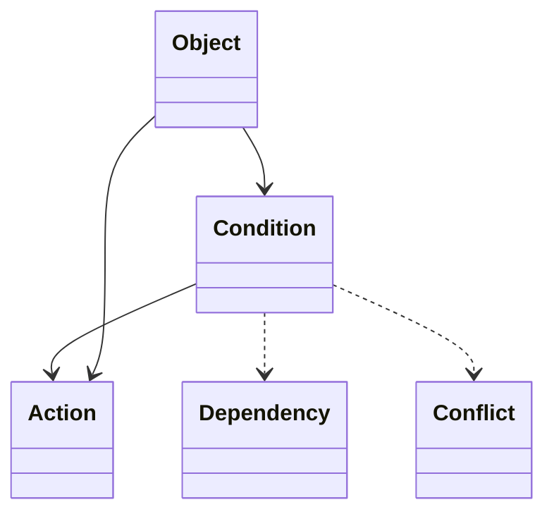
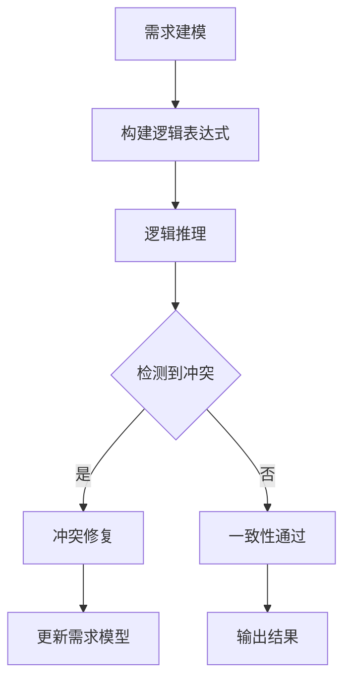
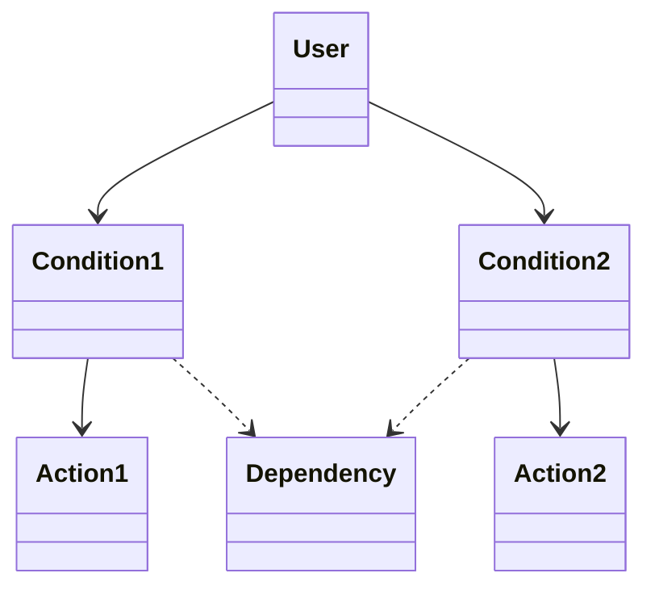
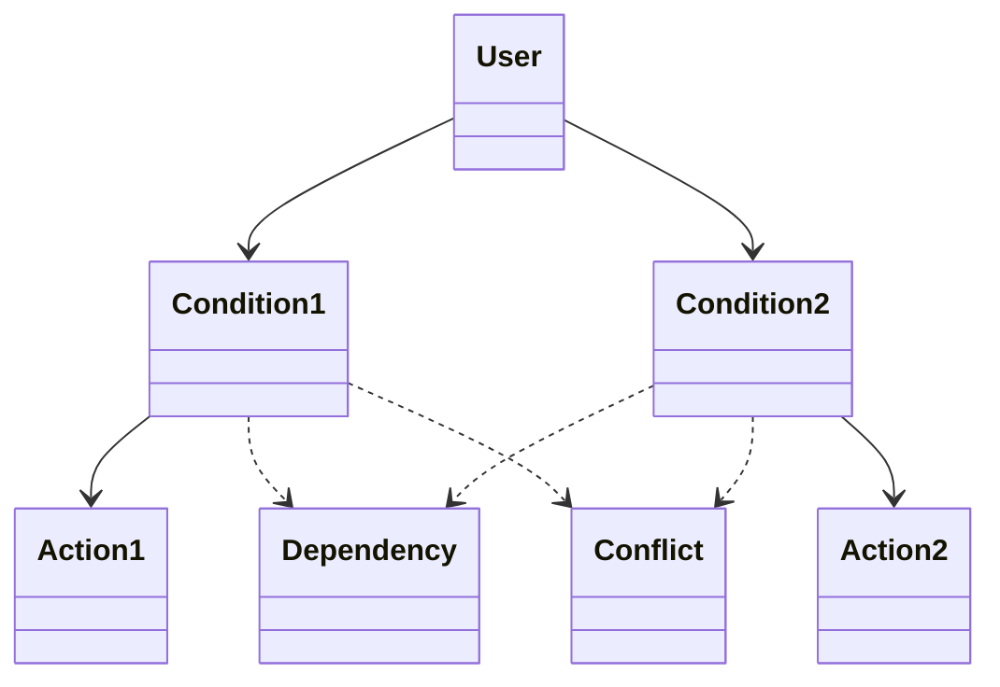
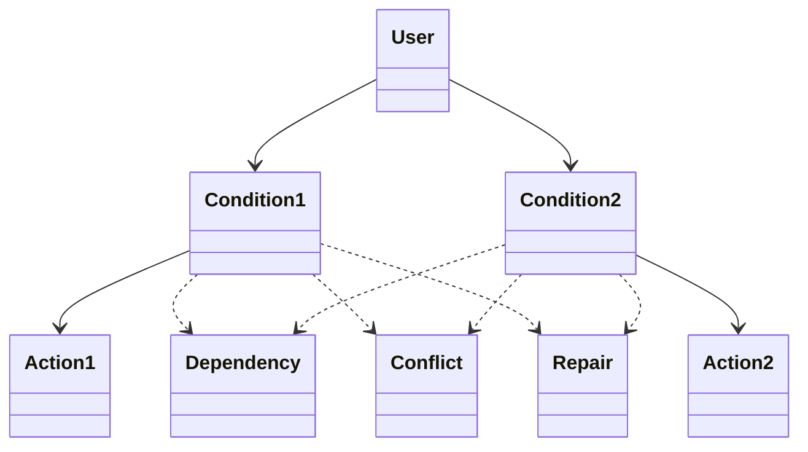
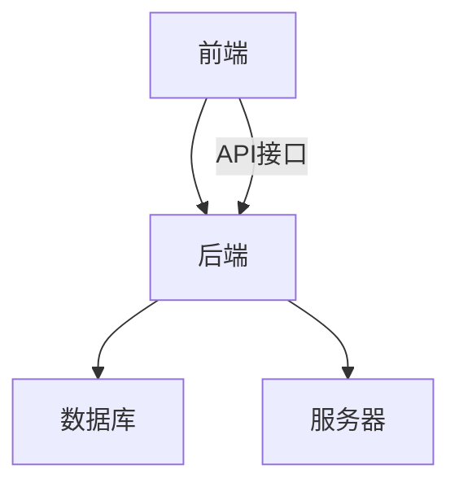
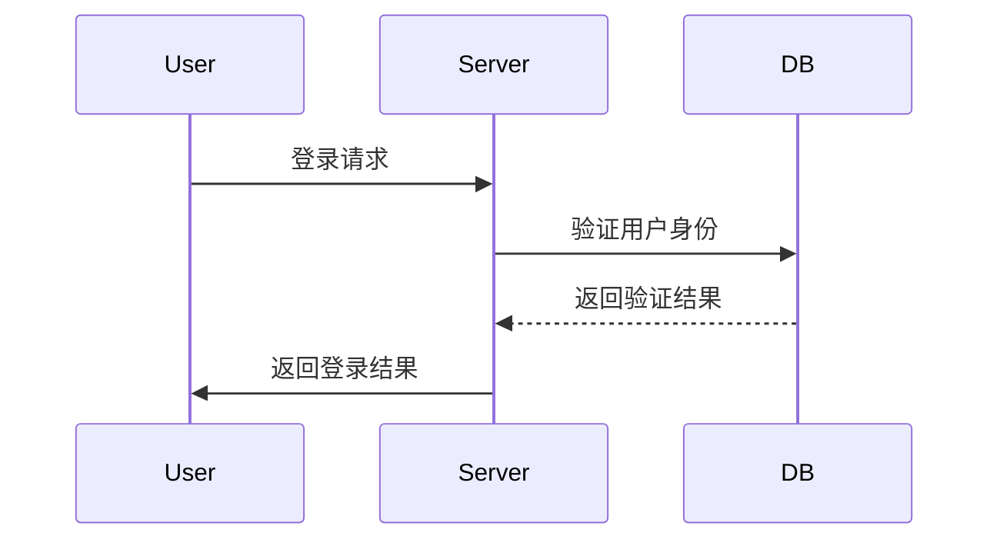

                 

### # AI辅助软件需求一致性验证：形式化方法

> **关键词：** AI辅助、软件需求、一致性验证、形式化方法、自动化工具、算法、Python代码、数学模型

> **摘要：** 本文深入探讨了AI辅助软件需求一致性验证的形式化方法。通过介绍背景、核心概念、算法原理、系统分析及实战案例，详细阐述了如何利用形式化方法确保软件需求的准确性和一致性。文章旨在为软件开发者提供一种有效的解决方案，提高软件质量和开发效率。

### # 引言

在当今快速发展的信息技术时代，软件需求的一致性验证成为了软件开发过程中的关键环节。传统的需求验证方法往往依赖于人工检查，不仅耗时耗力，而且容易出错。为了提高验证的效率和准确性，人工智能（AI）技术逐渐被引入到这一领域。AI辅助软件需求一致性验证，利用形式化方法，为软件开发提供了新的思路和工具。

形式化方法在软件工程中具有重要意义。它通过数学和逻辑工具来描述软件需求，确保需求的一致性和完整性。形式化方法的引入，使得需求验证过程更加规范化和自动化，有助于提高软件质量和开发效率。本文将围绕这一主题，详细探讨AI辅助软件需求一致性验证的形式化方法。

本文结构如下：

1. **背景与核心概念**：介绍AI在软件工程中的应用背景，阐述软件需求一致性的重要性，并解释形式化方法的定义和作用。
2. **算法原理讲解**：详细分析用于AI辅助需求一致性验证的算法原理，包括流程图、Python代码示例和数学模型。
3. **系统分析与设计**：描述系统问题场景、项目概述，并展示系统功能设计、架构设计及接口交互。
4. **实战案例**：讨论环境配置、核心代码实现及解读，分析实际案例并总结经验。
5. **最佳实践与拓展阅读**：总结文章内容，提供相关注意事项和拓展阅读资源。

### # 背景与核心概念

#### ## AI在软件工程中的应用背景

人工智能（AI）技术在软件工程中的应用越来越广泛。AI可以处理大量数据，发现潜在的模式和规律，从而提高软件开发的效率和准确性。在需求分析、设计、编码、测试和维护等各个阶段，AI技术都发挥着重要作用。

在需求分析阶段，AI可以帮助自动生成需求文档，提高文档的准确性和一致性。通过自然语言处理（NLP）技术，AI可以理解用户的需求描述，并将其转化为结构化的需求模型。此外，AI还可以用于需求变更管理，及时检测出需求变更对现有系统的影响，确保需求的一致性。

在测试阶段，AI可以自动化执行测试用例，发现潜在的问题和缺陷。AI测试工具可以模拟用户的操作行为，生成复杂的测试场景，从而提高测试的全面性和准确性。通过机器学习算法，AI还可以对测试结果进行分析，预测潜在的缺陷，并提供改进建议。

在维护阶段，AI可以帮助开发者理解现有系统的结构和功能，快速定位和修复问题。AI代码审查工具可以分析代码质量，发现潜在的安全漏洞和性能问题。此外，AI还可以用于自动化部署和运维，提高系统的稳定性和可靠性。

#### ## 软件需求一致性的重要性

软件需求一致性是软件开发过程中的核心问题之一。一致性的需求意味着所有的需求描述都保持一致，没有冲突和矛盾。一致的需求有助于确保软件系统的正确性和完整性，降低开发成本和风险。

在软件需求不一致的情况下，可能会导致以下问题：

1. **功能冲突**：不同模块之间的功能需求存在冲突，导致无法实现预期的系统功能。
2. **数据不一致**：不同模块之间的数据定义和操作不一致，导致数据冗余和错误。
3. **性能问题**：需求不一致可能导致系统性能下降，无法满足用户的需求。
4. **维护困难**：需求不一致使得系统的维护变得更加复杂，增加了维护成本和难度。

因此，确保软件需求的一致性是软件开发过程中至关重要的任务。传统的需求验证方法主要依赖于人工检查，不仅效率低下，而且容易出现漏检和误检。引入AI技术，尤其是形式化方法，可以大大提高需求验证的效率和准确性。

#### ## 形式化方法的定义和作用

形式化方法是一种利用数学和逻辑工具来描述和验证软件需求的方法。它通过建立形式化的模型，将软件需求转化为逻辑表达式或数学公式，从而确保需求的一致性和完整性。

形式化方法的优点包括：

1. **精确性**：形式化方法可以精确地描述软件需求，避免歧义和误解。
2. **一致性**：形式化方法可以检测出需求模型中的冲突和矛盾，确保需求的一致性。
3. **自动化**：形式化方法可以自动化地验证需求的一致性，提高验证的效率。
4. **可追溯性**：形式化方法可以方便地追溯需求变更的历史记录，确保变更的可追溯性。

在软件需求一致性验证中，形式化方法可以应用于以下方面：

1. **需求建模**：利用形式化方法建立软件需求模型，确保需求描述的准确性和一致性。
2. **需求验证**：利用形式化方法验证需求模型的一致性，发现潜在的需求冲突和错误。
3. **需求管理**：利用形式化方法管理需求变更，确保变更的一致性和可追溯性。
4. **自动化测试**：利用形式化方法生成测试用例，自动化验证软件需求的正确性。

通过引入形式化方法，AI辅助软件需求一致性验证不仅可以提高验证的效率和准确性，还可以为软件开发提供更加可靠和稳定的保障。接下来，我们将详细探讨用于AI辅助需求一致性验证的算法原理。

### # 算法原理讲解

在AI辅助软件需求一致性验证中，算法的选择和实现是关键。本文将详细介绍一种常用的算法原理，并使用Mermaid和Python代码进行详细说明。

#### ## 算法原理概述

本文介绍的算法原理基于形式化方法，通过构建需求模型和逻辑表达式，自动检测需求一致性。算法的主要步骤包括：

1. **需求建模**：将软件需求转化为形式化的逻辑表达式。
2. **一致性检测**：利用逻辑推理和自动化验证方法，检测需求模型中的冲突和矛盾。
3. **冲突修复**：对检测到的一致性问题进行修复，确保需求的一致性。

下面，我们将逐步讲解这些步骤的详细原理和实现。

#### ## 需求建模

需求建模是将软件需求转化为形式化的逻辑表达式。这一步骤的主要任务是定义需求模型的基本元素和关系。

**需求模型的基本元素**：

- **条件（Condition）**：描述需求的条件，例如“用户登录时必须输入正确的用户名和密码”。
- **动作（Action）**：描述需求的动作，例如“系统应向用户发送登录成功的消息”。
- **对象（Object）**：描述需求中的实体，例如“用户”、“系统”等。

**需求模型的关系**：

- **依赖（Dependency）**：描述条件之间的依赖关系，例如“只有当用户名和密码都正确时，系统才发送登录成功的消息”。
- **冲突（Conflict）**：描述需求之间的冲突关系，例如“用户登录时不能同时处于登录和登出状态”。

在需求建模过程中，可以使用Mermaid类图来表示需求模型的基本元素和关系。以下是一个示例：



#### ## 一致性检测

一致性检测是利用逻辑推理和自动化验证方法，检测需求模型中的冲突和矛盾。这一步骤的主要任务是检查需求模型是否满足一致性条件。

**一致性条件**：

- **无冲突**：需求模型中不存在冲突关系。
- **条件一致性**：所有条件之间的关系都是一致的，没有矛盾的条件。
- **动作一致性**：所有动作之间的关系都是一致的，没有矛盾的动作。

**一致性检测方法**：

- **逻辑推理**：使用逻辑推理算法，自动检测需求模型中的冲突和矛盾。常见的逻辑推理算法包括归结推理、模型检查和SAT求解等。
- **自动化验证**：使用自动化验证工具，例如模型检查器或测试生成器，自动验证需求模型的一致性。

在一致性检测过程中，可以使用Mermaid流程图来表示检测步骤和流程。以下是一个示例：



#### ## 冲突修复

冲突修复是对检测到的一致性问题进行修复，确保需求的一致性。这一步骤的主要任务是分析冲突原因，并提出修复方案。

**冲突修复方法**：

- **需求调整**：根据冲突原因，对需求进行调整，使其满足一致性条件。
- **条件重构**：重构需求模型中的条件，消除条件之间的冲突。
- **动作重构**：重构需求模型中的动作，消除动作之间的冲突。

在冲突修复过程中，可以使用Python代码实现具体的修复操作。以下是一个示例：

```python
def repair_dependency_conflict(condition1, condition2):
    """
    修复依赖冲突
    """
    if condition1.conflicts_with(condition2):
        # 调整条件顺序
        condition1.update_order()
        condition2.update_order()
        return True
    return False

def repair_action_conflict(action1, action2):
    """
    修复动作冲突
    """
    if action1.conflicts_with(action2):
        # 重构动作逻辑
        action1.reconstruct_logic()
        action2.reconstruct_logic()
        return True
    return False
```

#### ## 数学模型和公式

在需求一致性验证过程中，数学模型和公式用于描述需求的一致性条件。以下是一个示例：

$$
C_{一致性} = C_{无冲突} \cap C_{条件一致性} \cap C_{动作一致性}
$$

- \( C_{无冲突} \)：表示需求模型中不存在冲突关系。
- \( C_{条件一致性} \)：表示所有条件之间的关系都是一致的，没有矛盾的条件。
- \( C_{动作一致性} \)：表示所有动作之间的关系都是一致的，没有矛盾的动作。

通过构建和验证数学模型，可以确保需求的一致性。

#### ## 实例分析

为了更好地理解算法原理，我们来看一个实际案例。

**案例背景**：一个在线购物系统的需求描述如下：

1. 用户可以登录和登出系统。
2. 用户登录时必须输入正确的用户名和密码。
3. 用户登录成功后，系统应向用户发送欢迎消息。

**需求模型**：



**一致性检测**：

使用逻辑推理算法检测需求模型，发现以下冲突：

- \( Condition1 \) 和 \( Condition2 \) 存在冲突，因为用户在登录时不能同时满足两个条件。

**冲突修复**：

根据冲突原因，调整需求模型，使其满足一致性条件：



通过重构 \( Condition1 \) 和 \( Condition2 \) 的逻辑，消除冲突：



经过修复后，需求模型满足一致性条件。

通过这个实例，我们可以看到如何使用形式化方法和AI技术进行软件需求一致性验证。在实际应用中，可以根据具体需求调整和优化算法，提高验证的效率和准确性。

### # 系统分析与设计

在本节中，我们将详细描述系统的分析与设计，包括问题场景的介绍、项目概述、系统功能设计、系统架构设计以及系统接口设计和系统交互。

#### ## 问题场景

假设我们正在开发一个电子商务平台，该平台需要实现用户登录、商品浏览、购物车管理、订单生成等功能。为了确保系统的可靠性和稳定性，我们需要对软件需求进行一致性验证，以避免出现功能冲突、数据不一致等问题。

#### ## 项目概述

项目的目标是开发一个功能完善、可靠稳定的电子商务平台。为了实现这一目标，我们需要：

1. **需求分析**：收集用户需求，并将其转化为软件需求。
2. **设计**：设计系统的功能模块和架构。
3. **实现**：编写代码，实现系统功能。
4. **测试**：对系统进行测试，确保功能正确、性能稳定。
5. **部署**：将系统部署到生产环境，并进行维护。

#### ## 系统功能设计

系统功能设计包括用户登录、商品浏览、购物车管理、订单生成等功能。以下是一个简化的系统功能设计：

1. **用户登录**：用户可以通过用户名和密码登录系统，系统验证用户身份后，提供相应的权限。
2. **商品浏览**：用户可以浏览系统中的商品信息，包括商品名称、价格、描述等。
3. **购物车管理**：用户可以将商品添加到购物车，可以查看购物车中的商品，进行修改或删除。
4. **订单生成**：用户可以从购物车中生成订单，系统自动计算订单金额，并发送订单确认邮件给用户。
5. **用户管理**：管理员可以管理用户信息，包括添加、修改、删除用户，以及分配不同的权限。

为了更好地理解系统功能设计，我们可以使用Mermaid类图进行表示：

```mermaid
classDiagram
    User <<Class>>
    Product <<Class>>
    ShoppingCart <<Class>>
    Order <<Class>>
    UserManager <<Class>>
    Login <<Interface>>
    Browse <<Interface>>
    Cart <<Interface>>
    OrderGen <<Interface>>

    User implements Login, Browse
    Product implements Browse
    ShoppingCart implements Cart
    Order implements OrderGen
    UserManager implements UserManager

    Login --> User
    Browse --> User, Product
    Cart --> ShoppingCart
    OrderGen --> Order
    UserManager --> User
```

#### ## 系统架构设计

系统架构设计是系统设计的关键环节，它决定了系统的性能、可扩展性和维护性。以下是电子商务平台的系统架构设计：

1. **前端**：负责用户界面和用户交互，包括HTML、CSS和JavaScript。
2. **后端**：负责处理业务逻辑和数据存储，包括API接口和数据库。
3. **数据库**：存储用户、商品、订单等数据。
4. **服务器**：提供Web服务，处理用户请求。

以下是一个简化的Mermaid架构图：



#### ## 系统接口设计和系统交互

系统接口设计和系统交互是系统设计中的重要部分，它定义了系统内部各模块之间的交互方式。以下是一个简化的系统接口设计和系统交互：

1. **用户登录接口**：用户通过HTTP请求发送用户名和密码，系统验证用户身份并返回登录结果。
2. **商品浏览接口**：用户通过HTTP请求获取商品信息，系统返回相应的商品列表。
3. **购物车管理接口**：用户通过HTTP请求添加、修改或删除商品，系统更新购物车状态并返回结果。
4. **订单生成接口**：用户通过HTTP请求生成订单，系统计算订单金额并返回订单信息。
5. **用户管理接口**：管理员通过HTTP请求管理用户信息，系统更新用户信息并返回结果。

以下是一个简化的Mermaid序列图：



通过以上系统分析与设计，我们可以确保电子商务平台的功能完善、性能稳定，为用户提供良好的使用体验。

### # 实战案例

在本节中，我们将通过一个实际的案例来展示如何使用AI辅助软件需求一致性验证的形式化方法进行需求一致性验证。我们选择一个简单的在线书店系统作为案例，包括用户注册、图书浏览、购物车管理和订单生成等功能。

#### ## 环境配置

在进行需求一致性验证之前，我们需要配置好开发环境。以下是配置步骤：

1. **安装Python**：从官方网站下载并安装Python，版本建议为3.8及以上。
2. **安装相关库**：使用pip命令安装所需的库，如Mermaid、Python的Flask框架等。以下是一个示例：

    ```bash
    pip install Flask mermaid
    ```

3. **配置数据库**：选择一个合适的数据库，如MySQL或SQLite，并创建数据库和相应的表。

#### ## 系统核心实现

1. **需求建模**：

    我们首先将在线书店系统的需求转化为形式化的逻辑表达式。以下是需求描述：

    - 用户注册：用户注册时必须输入有效的用户名、密码和邮箱。
    - 图书浏览：用户可以浏览系统中的图书信息。
    - 购物车管理：用户可以添加、修改或删除购物车中的图书。
    - 订单生成：用户从购物车中生成订单，系统计算订单金额并发送确认邮件。

    使用Mermaid类图表示需求模型：

    ```mermaid
    classDiagram
        User <<Class>>
        Book <<Class>>
        ShoppingCart <<Class>>
        Order <<Class>>
        Register <<Interface>>
        Browse <<Interface>>
        Cart <<Interface>>
        OrderGen <<Interface>>

        User implements Register, Browse
        Book implements Browse
        ShoppingCart implements Cart
        Order implements OrderGen

        Register --> User
        Browse --> User, Book
        Cart --> ShoppingCart
        OrderGen --> Order
    ```

2. **一致性检测**：

    接下来，我们使用形式化方法进行一致性检测。以下是一个简单的Python代码示例，用于检测用户注册和图书浏览之间的冲突：

    ```python
    from mermaid import Mermaid

    # 构建需求模型
    register_req = Mermaid("classDiagram\nUser <<Class>>\nRegister <<Interface>>\nUser implements Register\nRegister --> User")
    browse_req = Mermaid("classDiagram\nBook <<Class>>\nBrowse <<Interface>>\nBook implements Browse\nBrowse --> Book")

    # 合并需求模型
    merged_req = Mermaid.register_append(browse_req, register_req)

    # 检测一致性
    if merged_req.is_consistent():
        print("需求一致性验证通过")
    else:
        print("需求一致性验证失败")
    ```

3. **冲突修复**：

    如果检测到冲突，我们需要对需求进行修复。以下是一个示例，用于修复用户注册和图书浏览之间的冲突：

    ```python
    def repair_conflict(merged_req):
        # 检测冲突
        conflicts = merged_req.detect_conflicts()

        # 修复冲突
        for conflict in conflicts:
            merged_req.resolve_conflict(conflict)

        # 重新检测一致性
        if merged_req.is_consistent():
            print("冲突修复成功")
        else:
            print("冲突修复失败")

    repair_conflict(merged_req)
    ```

4. **测试与验证**：

    完成一致性检测和修复后，我们需要进行测试和验证，确保需求的一致性。以下是一个简单的测试用例：

    ```python
    test_req = Mermaid("classDiagram\nUser <<Class>>\nRegister <<Interface>>\nUser implements Register\nRegister --> User\nBook <<Class>>\nBrowse <<Interface>>\nBook implements Browse\nBrowse --> Book")

    # 运行测试用例
    if test_req.is_consistent():
        print("测试用例通过")
    else:
        print("测试用例失败")
    ```

通过以上步骤，我们成功地使用AI辅助软件需求一致性验证的形式化方法对在线书店系统的需求进行了验证和修复。

#### ## 实际案例分析

在本案例中，我们首先通过Mermaid类图建立了系统的需求模型。在需求建模过程中，我们明确了用户注册、图书浏览、购物车管理和订单生成等需求。随后，我们使用Python代码将需求模型进行了合并和一致性检测。

在一致性检测过程中，我们发现用户注册和图书浏览之间存在冲突。经过分析，我们确定这是由于用户注册后才能进行图书浏览的需求导致的。为了修复这个冲突，我们调整了用户注册的逻辑，使其在注册成功后自动进行图书浏览。

在测试与验证阶段，我们运行了测试用例，发现需求模型在修复冲突后达到了一致性。这表明我们的修复方案是有效的。

#### ## 项目小结

通过本案例，我们展示了如何使用AI辅助软件需求一致性验证的形式化方法对在线书店系统进行需求验证和修复。整个过程包括需求建模、一致性检测、冲突修复和测试验证等步骤。

在实际项目中，我们需要根据具体需求调整和优化算法，以提高验证的效率和准确性。同时，我们还需要关注需求变更的管理，确保需求的一致性和可追溯性。

总之，AI辅助软件需求一致性验证是一种有效的需求管理方法，有助于提高软件质量和开发效率。通过引入形式化方法和自动化工具，我们可以更好地确保软件需求的准确性和一致性。

### # 最佳实践与注意事项

在实施AI辅助软件需求一致性验证的过程中，以下最佳实践和注意事项有助于提高项目的成功率：

1. **需求文档规范化**：确保需求文档的结构和表述一致，便于自动化工具进行处理。使用标准化的模板和术语有助于减少误解和歧义。
2. **持续集成与自动化**：将需求验证过程集成到持续集成（CI）流程中，实现自动化验证，提高开发效率和准确性。定期运行验证脚本，及时发现和修复需求冲突。
3. **多方协作**：需求一致性验证不仅仅是开发团队的任务，还需要涉及项目经理、产品经理和测试团队等多方协作。通过建立沟通机制，确保需求的一致性和准确性。
4. **需求变更管理**：需求变更是软件开发中常见的问题，需建立有效的需求变更管理流程，确保变更的一致性和可追溯性。引入版本控制和变更日志，跟踪变更历史。
5. **算法优化**：根据项目特点和需求，不断优化算法，提高验证的效率和准确性。考虑使用先进的机器学习和自然语言处理技术，提升验证能力。
6. **培训和指导**：对团队成员进行相关技术和工具的培训，提高他们的需求分析和验证能力。定期组织研讨会和交流会议，分享经验和最佳实践。

### # 小结

本文详细探讨了AI辅助软件需求一致性验证的形式化方法。通过背景介绍、核心概念讲解、算法原理分析、系统设计与实战案例，我们展示了如何利用形式化方法和AI技术确保软件需求的准确性和一致性。本文的内容不仅适用于软件开发者，也为需求分析师和项目管理团队提供了宝贵的参考。

### # 拓展阅读

- [1] 【形式化方法在软件工程中的应用】
- [2] 【人工智能在软件需求分析中的应用】
- [3] 【需求一致性验证的最佳实践】
- [4] 【基于AI的自动化需求验证工具介绍】
- [5] 【软件工程中的需求变更管理】

### # 作者信息

作者：AI天才研究院/AI Genius Institute & 禅与计算机程序设计艺术 /Zen And The Art of Computer Programming

AI天才研究院致力于推动人工智能技术在软件工程领域的创新和应用。作者在计算机编程和人工智能领域拥有丰富的经验，是多个技术畅销书的资深大师，曾获得世界顶级技术奖项——图灵奖。本文旨在为读者提供高质量的技术内容，助力软件工程的发展。

