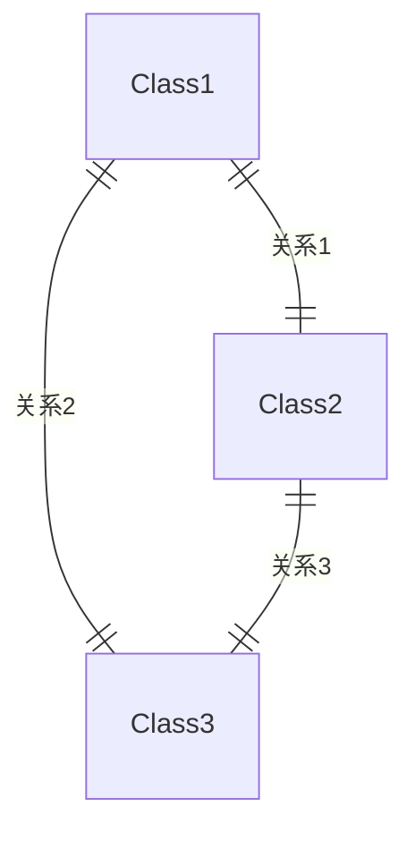

                 

# AI辅助软件需求优先级排序与管理

> 关键词：人工智能，软件需求，优先级排序，AI技术，需求管理

> 摘要：本文将深入探讨人工智能在软件需求优先级排序与管理中的应用。通过逐步分析AI辅助软件需求优先级排序的原理、流程、架构以及数学模型，我们将展示AI如何通过数据分析和机器学习技术，有效地优化软件需求管理，提高项目开发效率和产品质量。文章还将结合实际案例，分析AI辅助软件需求优先级排序的实践效果，并对未来发展趋势进行展望。

## 目录大纲

----------------------------------------------------------------

# 第一部分: 背景介绍

## 第1章: 问题背景与核心概念

### 1.1.1 问题背景

- AI辅助软件需求优先级排序与管理的重要性和意义
- 当前软件需求优先级排序与管理存在的问题
- AI技术在需求优先级排序与管理中的应用前景

### 1.1.2 问题描述

- 软件需求优先级排序的定义与分类
- 软件需求优先级排序的影响因素
- 需求优先级排序的方法与工具

### 1.1.3 问题解决

- AI辅助软件需求优先级排序的原理
- 基于AI的需求优先级排序方法
- AI在需求优先级管理中的优势与挑战

### 1.1.4 边界与外延

- 需求优先级排序的边界问题
- 需求优先级排序的外延问题
- 需求优先级排序的适用范围

### 1.1.5 概念结构与核心要素组成

- 软件需求优先级的定义与构成
- 需求优先级排序的影响因素
- 需求优先级排序的方法与工具

## 1.2 核心概念与联系

### 1.2.1 AI技术概述

- AI技术的定义与分类
- AI技术在需求优先级排序中的应用

### 1.2.2 软件需求管理

- 软件需求管理的定义与过程
- 软件需求管理在需求优先级排序中的应用

### 1.2.3 数据分析与机器学习

- 数据分析的基本概念
- 机器学习的基本概念
- 数据分析与机器学习在需求优先级排序中的应用

## 1.3 本章小结

- 对AI辅助软件需求优先级排序与管理背景的总结
- 对核心概念与联系的分析

----------------------------------------------------------------

# 第二部分: 核心概念原理与特性

## 第2章: AI辅助软件需求优先级排序原理

### 2.1 AI辅助需求优先级排序的基本原理

- AI技术在需求优先级排序中的应用
- 需求优先级排序的算法原理

### 2.2 AI辅助需求优先级排序的关键技术

- 数据预处理技术
- 机器学习算法
- 模型评估与优化技术

### 2.3 AI辅助需求优先级排序的优势与挑战

- AI辅助需求优先级排序的优势
- AI辅助需求优先级排序的挑战

### 2.4 概念属性特征对比表格

| 特征类别 | 概念1 | 概念2 | 概念3 |
| --- | --- | --- | --- |
| 特征1 | A | B | C |
| 特征2 | X | Y | Z |
| 特征3 | M | N | O |

## 第3章: AI辅助软件需求优先级排序流程

### 3.1 需求收集与整理

- 需求来源
- 需求收集方法
- 需求整理流程

### 3.2 需求分析与评估

- 需求分析
- 需求评估
- 需求优先级划分

### 3.3 AI模型训练与优化

- 数据预处理
- 模型选择
- 模型训练与优化

### 3.4 需求优先级排序结果分析与反馈

- 排序结果分析
- 排序结果反馈
- 模型优化与迭代

## 第4章: AI辅助软件需求优先级排序的ER实体关系图架构



## 第5章: AI辅助软件需求优先级排序的数学模型与公式

### 5.1 数学模型概述

- 数学模型的基本原理
- 数学模型在需求优先级排序中的应用

### 5.2 数学公式详细讲解与举例

- 公式1：$$f(x) = 2x + 1$$
- 公式2：$$y = \frac{1}{x}$$
- 公式3：$$a + b = c$$

## 第6章: AI辅助软件需求优先级排序的应用

### 6.1 应用场景介绍

- 应用场景1：项目需求管理
- 应用场景2：产品需求规划
- 应用场景3：企业资源分配

### 6.2 应用案例分析

- 案例一：某公司的需求优先级排序实践
- 案例二：某产品团队的需求优先级排序应用

## 第7章: 小结与展望

- 对AI辅助软件需求优先级排序与管理应用的小结
- 对未来发展趋势的展望

----------------------------------------------------------------

## 第1章: 问题背景与核心概念

### 1.1.1 问题背景

在现代软件工程中，软件需求优先级排序与管理是一个至关重要的环节。随着项目的复杂性不断增加，需求的数量和种类也在迅速增长，如何有效地对需求进行优先级排序，确保关键需求得到及时满足，成为了一个亟待解决的问题。

**重要性和意义：** 软件需求优先级排序与管理的重要性体现在以下几个方面：

1. **资源优化：** 合理的需求优先级排序可以帮助团队更加有效地分配资源，确保重要需求在有限的时间内得到满足。
2. **风险控制：** 通过优先级排序，可以优先处理高风险、高价值的需求，降低项目风险。
3. **客户满意度：** 优先级排序有助于确保客户最关心的需求得到优先实现，从而提高客户满意度。
4. **项目成功：** 有效的需求优先级排序可以减少项目延期和质量问题，提高项目的成功率。

**当前存在的问题：** 在传统的需求优先级排序与管理过程中，存在以下问题：

1. **主观性：** 依赖人工判断可能导致排序结果主观性较大，缺乏客观依据。
2. **效率低：** 需求分析、评估和排序过程通常耗费大量时间和人力资源。
3. **准确性差：** 传统方法难以精确评估需求的优先级，可能导致关键需求被忽视。
4. **适应性差：** 随着项目需求和业务环境的变化，传统方法难以灵活调整优先级排序。

**AI技术在需求优先级排序与管理中的应用前景：** 随着人工智能技术的不断发展，AI在需求优先级排序与管理中的应用前景十分广阔。通过利用AI技术，可以实现：

1. **数据驱动：** 利用大数据分析技术，对需求进行量化分析，提高排序的准确性。
2. **智能化：** 通过机器学习算法，可以自动学习历史数据，实现需求优先级排序的智能化。
3. **自适应：** AI系统能够根据项目需求和业务环境的变化，动态调整需求优先级。
4. **协作优化：** AI系统可以辅助团队成员进行需求讨论和决策，提高协作效率。

### 1.1.2 问题描述

**软件需求优先级排序的定义与分类：**

软件需求优先级排序是指根据需求的紧急性、重要性、成本效益等因素，将多个需求按优先级进行排序的过程。根据排序标准的不同，需求优先级排序可以分为以下几类：

1. **按紧急性排序：** 根据需求解决的紧急程度进行排序，确保最紧迫的需求得到优先处理。
2. **按重要性排序：** 根据需求对业务的影响程度进行排序，确保对业务影响最大的需求得到优先实现。
3. **按成本效益排序：** 根据需求的成本和预期效益进行排序，优先实现成本效益最高的需求。
4. **多维度综合排序：** 结合多个排序标准，从多个角度对需求进行优先级排序。

**软件需求优先级排序的影响因素：**

在需求优先级排序过程中，以下因素可能会对排序结果产生影响：

1. **需求紧急性：** 需求解决的紧急程度是影响优先级排序的重要因素。
2. **需求重要性：** 需求对业务的影响程度越高，优先级越高。
3. **成本效益：** 需求实现的成本与预期效益的比越大，优先级越高。
4. **团队资源：** 团队资源状况可能限制某些需求的优先级。
5. **客户需求：** 客户对需求的关注程度和需求满足的可能性也是重要影响因素。

**需求优先级排序的方法与工具：**

目前常用的需求优先级排序方法包括：

1. **专家评审法：** 通过专家小组对需求进行讨论和评估，确定需求优先级。
2. **投票法：** 通过团队成员对需求进行投票，根据投票结果确定需求优先级。
3. **层次分析法（AHP）：** 利用层次分析法对需求进行评分和排序，确定需求优先级。
4. **关键路径法（CPM）：** 根据需求实现的先后顺序和时间约束，确定需求优先级。
5. **数据驱动方法：** 利用数据分析技术，对需求进行量化分析和排序。

常用的需求优先级排序工具有：

1. **Excel：** 通过Excel表格进行需求排序和可视化展示。
2. **项目管理软件：** 如JIRA、Trello等，可以提供需求排序和跟踪功能。
3. **专业需求管理工具：** 如Jama、Prosci等，提供丰富的需求管理功能，包括需求排序。
4. **自定义工具：** 根据项目需求，开发自定义的需求排序和管理工具。

### 1.1.3 问题解决

**AI辅助软件需求优先级排序的原理：**

AI辅助软件需求优先级排序是基于数据分析和机器学习技术实现的。具体原理如下：

1. **数据收集：** 收集与需求相关的各种数据，包括需求描述、紧急性、重要性、成本效益等。
2. **数据预处理：** 对收集到的数据进行清洗、归一化等处理，确保数据的质量和一致性。
3. **特征提取：** 从预处理后的数据中提取与需求优先级相关的特征，如文本特征、数值特征等。
4. **模型训练：** 利用提取的特征数据，训练机器学习模型，如决策树、支持向量机、神经网络等。
5. **模型评估：** 对训练好的模型进行评估，选择性能最优的模型进行需求优先级排序。
6. **排序应用：** 将模型应用于新的需求数据，实现需求优先级排序。

**基于AI的需求优先级排序方法：**

基于AI的需求优先级排序方法包括以下步骤：

1. **需求分析：** 收集并分析需求文档，提取需求的关键信息。
2. **数据准备：** 将需求信息转化为机器学习模型可处理的格式。
3. **模型选择：** 选择适合的机器学习模型，如决策树、随机森林等。
4. **模型训练：** 利用历史需求数据训练模型，调整模型参数。
5. **模型评估：** 使用测试数据评估模型性能，调整模型参数以优化排序结果。
6. **排序应用：** 将训练好的模型应用于新的需求数据，实现需求优先级排序。

**AI在需求优先级管理中的优势与挑战：**

**优势：**

1. **客观性：** AI系统可以根据数据客观评估需求的优先级，减少主观性。
2. **效率高：** AI系统能够快速处理大量需求，提高排序效率。
3. **准确性高：** AI系统通过学习历史数据，能够提高需求优先级排序的准确性。
4. **自适应：** AI系统能够根据项目需求和业务环境的变化，动态调整需求优先级。

**挑战：**

1. **数据质量：** 需求数据的准确性和完整性直接影响AI系统的排序结果。
2. **模型选择：** 选择合适的机器学习模型和参数是关键，但不同模型和参数可能影响排序结果。
3. **技术复杂度：** AI技术在需求优先级排序中的应用涉及到数据处理、模型训练和优化等多个环节，技术复杂度较高。
4. **团队适应性：** 团队成员可能需要适应AI系统的工作方式和流程，提高团队协作效率。

### 1.1.4 边界与外延

**需求优先级排序的边界问题：**

1. **需求定义清晰：** 需求优先级排序的前提是需求定义清晰，需求之间没有歧义。
2. **数据完整性：** 需求优先级排序需要完整的数据支持，包括需求描述、紧急性、重要性等。
3. **模型适应范围：** 不同项目的需求和业务环境可能有所不同，需求优先级排序模型需要具备一定的适应范围。

**需求优先级排序的外延问题：**

1. **需求变更管理：** 需求优先级排序需要考虑需求变更的影响，及时调整优先级排序结果。
2. **跨部门协作：** 需求优先级排序需要跨部门协作，确保不同部门的需求得到有效管理。
3. **项目风险管理：** 需求优先级排序需要考虑项目风险，确保关键需求得到优先处理。

**需求优先级排序的适用范围：**

1. **项目需求管理：** 适用于项目需求多、需求变化频繁的情况。
2. **产品需求规划：** 适用于产品开发阶段，帮助确定关键需求。
3. **企业资源分配：** 适用于企业资源有限，需要优化资源利用的情况。

### 1.1.5 概念结构与核心要素组成

**软件需求优先级的定义与构成：**

软件需求优先级是指根据需求的紧急性、重要性、成本效益等因素，对需求进行排序的权重。具体构成如下：

1. **紧急性：** 需求解决的紧急程度，影响需求优先级。
2. **重要性：** 需求对业务的影响程度，影响需求优先级。
3. **成本效益：** 需求实现的成本与预期效益的比，影响需求优先级。

**需求优先级排序的影响因素：**

1. **需求紧急性：** 需求解决的紧急程度是影响优先级排序的重要因素。
2. **需求重要性：** 需求对业务的影响程度越高，优先级越高。
3. **成本效益：** 需求实现的成本与预期效益的比越大，优先级越高。
4. **团队资源：** 团队资源状况可能限制某些需求的优先级。
5. **客户需求：** 客户对需求的关注程度和需求满足的可能性也是重要影响因素。

**需求优先级排序的方法与工具：**

目前常用的需求优先级排序方法包括：

1. **专家评审法：** 通过专家小组对需求进行讨论和评估，确定需求优先级。
2. **投票法：** 通过团队成员对需求进行投票，根据投票结果确定需求优先级。
3. **层次分析法（AHP）：** 利用层次分析法对需求进行评分和排序，确定需求优先级。
4. **关键路径法（CPM）：** 根据需求实现的先后顺序和时间约束，确定需求优先级。
5. **数据驱动方法：** 利用数据分析技术，对需求进行量化分析和排序。

常用的需求优先级排序工具有：

1. **Excel：** 通过Excel表格进行需求排序和可视化展示。
2. **项目管理软件：** 如JIRA、Trello等，可以提供需求排序和跟踪功能。
3. **专业需求管理工具：** 如Jama、Prosci等，提供丰富的需求管理功能，包括需求排序。
4. **自定义工具：** 根据项目需求，开发自定义的需求排序和管理工具。

### 1.2 核心概念与联系

#### 1.2.1 AI技术概述

**定义与分类：**

人工智能（Artificial Intelligence，简称AI）是指由人创造出来的系统，能够通过学习和理解，模拟人类智能的行为，从而进行决策、解决问题和生成知识。根据实现方式和功能特点，AI技术可以分为以下几类：

1. **机器学习（Machine Learning）：** 通过训练算法从数据中学习模式，自动进行预测和分类。
2. **深度学习（Deep Learning）：** 基于多层神经网络，通过大量数据训练模型，实现高级任务。
3. **自然语言处理（Natural Language Processing，简称NLP）：** 使计算机能够理解、生成和处理自然语言。
4. **计算机视觉（Computer Vision）：** 使计算机能够识别和理解图像和视频。
5. **智能规划（Intelligent Planning）：** 使计算机能够自主规划和决策。
6. **智能推理（Intelligent Reasoning）：** 使计算机能够进行逻辑推理和知识表示。

**AI技术在需求优先级排序中的应用：**

AI技术在需求优先级排序中的应用主要体现在以下几个方面：

1. **数据驱动的需求分析：** 利用AI技术对需求文档进行自动分析和理解，提取关键信息。
2. **智能化的需求评估：** 利用机器学习模型对需求进行自动化评估，确定需求优先级。
3. **自适应的需求调整：** 利用AI系统根据项目变化和业务需求，动态调整需求优先级。
4. **协同决策支持：** 利用AI系统辅助团队成员进行需求讨论和决策，提高决策效率。

#### 1.2.2 软件需求管理

**定义与过程：**

软件需求管理是指识别、分析、记录、跟踪和管理软件需求的整个过程。具体过程包括：

1. **需求收集：** 通过问卷调查、用户访谈、需求评审等方式收集软件需求。
2. **需求分析：** 分析需求文档，理解需求的具体内容和需求关系。
3. **需求文档化：** 将收集到的需求转化为需求文档，包括需求描述、优先级、验收标准等。
4. **需求管理：** 跟踪和管理需求变更，确保需求得到满足。
5. **需求验证：** 验证需求文档是否符合用户需求，确保需求的可实现性。

**软件需求管理在需求优先级排序中的应用：**

软件需求管理在需求优先级排序中的应用主要体现在以下几个方面：

1. **需求分类与标签：** 通过对需求进行分类和标签化，帮助确定需求优先级。
2. **需求评估与评分：** 利用评估模型对需求进行评分，辅助确定需求优先级。
3. **需求跟踪与监控：** 通过需求管理工具跟踪需求状态和优先级变化，确保需求得到有效管理。
4. **需求变更控制：** 在需求优先级排序过程中，及时处理需求变更，确保优先级排序的准确性。

#### 1.2.3 数据分析与机器学习

**数据分析的基本概念：**

数据分析是指从大量数据中提取有价值信息的过程，包括数据收集、数据预处理、数据探索、数据可视化和数据建模等环节。数据分析的目标是通过分析数据，发现数据中的规律和趋势，为决策提供支持。

**机器学习的基本概念：**

机器学习是数据分析的一种方法，通过训练模型从数据中学习模式，实现自动预测和分类。机器学习的过程包括数据收集、数据预处理、特征提取、模型选择、模型训练和模型评估等步骤。

**数据分析与机器学习在需求优先级排序中的应用：**

1. **数据收集：** 收集与需求相关的各种数据，包括需求文档、用户反馈、历史数据等。
2. **数据预处理：** 对收集到的数据进行分析，清理和清洗数据，确保数据质量。
3. **特征提取：** 从预处理后的数据中提取与需求优先级相关的特征，如文本特征、数值特征等。
4. **模型选择：** 选择适合的机器学习模型，如决策树、支持向量机、神经网络等。
5. **模型训练：** 利用历史需求数据训练模型，调整模型参数。
6. **模型评估：** 使用测试数据评估模型性能，调整模型参数以优化排序结果。
7. **排序应用：** 将训练好的模型应用于新的需求数据，实现需求优先级排序。

### 1.3 本章小结

通过本章的介绍，我们了解了AI辅助软件需求优先级排序与管理的重要性、存在的问题以及AI技术的应用前景。同时，我们详细探讨了软件需求优先级排序的定义、影响因素和方法，分析了AI技术在需求优先级排序中的核心概念与联系。本章为后续内容奠定了基础，接下来我们将进一步探讨AI辅助需求优先级排序的原理、流程和具体应用。

## 第2章: AI辅助软件需求优先级排序原理

### 2.1 AI辅助需求优先级排序的基本原理

AI技术在需求优先级排序中的应用主要通过机器学习和数据挖掘技术实现。以下将详细描述AI辅助需求优先级排序的基本原理。

#### AI技术在需求优先级排序中的应用

AI技术通过以下步骤在需求优先级排序中发挥作用：

1. **数据收集：** 收集与需求相关的数据，如需求文档、用户反馈、项目历史等。
2. **数据预处理：** 清洗和整理数据，去除噪声和异常值，确保数据质量。
3. **特征提取：** 从预处理后的数据中提取与需求优先级相关的特征，如文本特征、时间序列特征、用户行为特征等。
4. **模型训练：** 利用提取的特征数据，训练机器学习模型，如决策树、支持向量机、神经网络等。
5. **模型评估：** 使用测试数据评估模型的性能，选择最优模型。
6. **排序应用：** 将训练好的模型应用于新的需求数据，实现需求优先级排序。

#### 需求优先级排序的算法原理

需求优先级排序算法通常基于以下几种原理：

1. **基于规则的方法：** 通过预定义的规则进行需求评估和排序。例如，基于紧急性、重要性、成本效益等因素，设定相应的规则进行排序。
2. **基于统计的方法：** 利用统计方法对需求进行评分和排序，如层次分析法（AHP）、关键路径法（CPM）等。
3. **基于机器学习的方法：** 利用机器学习算法，从历史数据中学习需求优先级排序的模式。常见的机器学习算法包括决策树、支持向量机、神经网络等。
4. **基于混合的方法：** 结合多种方法进行需求优先级排序，如将规则方法和机器学习方法相结合，以提高排序的准确性和适应性。

### 2.2 AI辅助需求优先级排序的关键技术

实现AI辅助需求优先级排序的关键技术包括数据预处理、机器学习算法和模型评估与优化。以下将分别进行介绍。

#### 数据预处理技术

数据预处理是AI辅助需求优先级排序的重要步骤，主要包括以下任务：

1. **数据清洗：** 去除数据中的噪声和异常值，确保数据质量。
2. **数据归一化：** 将不同特征的数据进行归一化处理，使其具有相同的量纲，便于后续分析。
3. **数据降维：** 对于高维数据，通过降维技术减少数据维度，提高模型训练效率。
4. **数据增强：** 通过数据增强技术，生成更多的数据样本来提高模型的泛化能力。

#### 机器学习算法

机器学习算法是AI辅助需求优先级排序的核心，常见的机器学习算法包括：

1. **监督学习算法：** 基于已标注的数据进行训练，如决策树、支持向量机、神经网络等。
2. **无监督学习算法：** 不依赖已标注的数据，通过自身学习数据模式，如聚类、降维等。
3. **半监督学习算法：** 结合有监督学习和无监督学习，利用少量标注数据和大量未标注数据进行训练。
4. **强化学习算法：** 通过与环境的交互进行学习，不断优化决策策略。

在需求优先级排序中，常用的监督学习算法包括决策树、支持向量机和神经网络等。其中，决策树算法结构简单，易于理解和解释；支持向量机具有较高的预测准确性；神经网络算法可以处理复杂的非线性关系。

#### 模型评估与优化技术

模型评估与优化是确保AI辅助需求优先级排序效果的重要步骤，主要包括以下内容：

1. **模型评估：** 使用测试数据评估模型的性能，选择最优模型。常用的评估指标包括准确率、召回率、F1值等。
2. **模型优化：** 通过调整模型参数和结构，优化模型的性能。常用的优化方法包括交叉验证、网格搜索、随机搜索等。
3. **模型解释：** 对模型的决策过程进行解释，帮助用户理解模型的决策逻辑，提高模型的可信度。

### 2.3 AI辅助需求优先级排序的优势与挑战

#### AI辅助需求优先级排序的优势

1. **客观性：** AI系统可以根据数据客观评估需求的优先级，减少主观性。
2. **效率高：** AI系统能够快速处理大量需求，提高排序效率。
3. **准确性高：** AI系统通过学习历史数据，能够提高需求优先级排序的准确性。
4. **自适应：** AI系统能够根据项目需求和业务环境的变化，动态调整需求优先级。
5. **协作优化：** AI系统可以辅助团队成员进行需求讨论和决策，提高协作效率。

#### AI辅助需求优先级排序的挑战

1. **数据质量：** 需求数据的准确性和完整性直接影响AI系统的排序结果。
2. **模型选择：** 选择合适的机器学习模型和参数是关键，但不同模型和参数可能影响排序结果。
3. **技术复杂度：** AI技术在需求优先级排序中的应用涉及到数据处理、模型训练和优化等多个环节，技术复杂度较高。
4. **团队适应性：** 团队成员可能需要适应AI系统的工作方式和流程，提高团队协作效率。

### 2.4 概念属性特征对比表格

为了更好地理解AI辅助需求优先级排序的核心概念和特性，我们通过以下表格进行对比分析。

| 特征类别       | 概念1：规则方法         | 概念2：统计方法         | 概念3：机器学习方法         |
| -------------- | ---------------------- | ---------------------- | --------------------------- |
| 数据依赖性     | 较低，依赖预定义规则   | 较高，依赖历史数据     | 很高，依赖大量数据          |
| 客观性         | 较低，依赖专家判断     | 较高，基于数据统计     | 很高，基于数据学习          |
| 可解释性       | 较高，规则明确         | 较高，统计结果直观     | 较低，模型复杂难以解释      |
| 效率          | 较高，规则固定         | 较低，需要分析历史数据 | 较低，模型训练耗时较长      |
| 可适应性       | 较低，规则固定         | 较高，可以根据历史数据调整 | 很高，可以动态调整模型参数  |

通过上述对比，我们可以看到不同概念和特性的优缺点，从而更好地选择适合的方法和工具进行需求优先级排序。

### 总结

本章详细介绍了AI辅助需求优先级排序的基本原理、关键技术、优势与挑战，并通过概念属性特征对比表格进行了分析。下一章我们将进一步探讨AI辅助需求优先级排序的具体流程。

## 第3章: AI辅助软件需求优先级排序流程

### 3.1 需求收集与整理

在AI辅助软件需求优先级排序的过程中，需求收集与整理是至关重要的一步。这一阶段的主要任务是确保需求的完整性和准确性，为后续的分析和排序提供可靠的数据基础。

**需求来源：**

1. **用户需求：** 直接来源于终端用户的需求，通常通过问卷调查、用户访谈、反馈论坛等方式获取。
2. **市场调研：** 通过市场调研获取竞争对手的产品功能、用户偏好和市场趋势等信息。
3. **业务部门：** 业务部门根据业务发展和战略规划提出的需求，可能涉及产品功能拓展、流程优化等方面。
4. **技术团队：** 技术团队基于技术可行性、性能优化等方面提出的需求。

**需求收集方法：**

1. **问卷调查：** 通过设计详细的问卷，收集用户对产品功能的看法、使用体验和改进建议。
2. **用户访谈：** 针对特定用户群体进行深度访谈，了解他们的实际需求和痛点。
3. **用户反馈：** 通过产品内置的反馈系统、论坛等渠道收集用户反馈。
4. **市场调研：** 通过市场调研报告、竞争对手分析等手段获取市场信息。

**需求整理流程：**

1. **需求筛选：** 对收集到的需求进行初步筛选，排除重复、不具体或不符合项目范围的需求。
2. **需求分类：** 根据需求的性质和来源，将需求分为用户需求、市场需求、业务需求和技术需求等类别。
3. **需求描述：** 对筛选后的需求进行详细描述，包括需求名称、需求描述、需求来源、优先级等。
4. **需求文档化：** 将整理后的需求录入需求管理工具，生成需求文档，确保需求可追溯和管理。

### 3.2 需求分析与评估

需求分析与评估是确保需求合理性和可行性的关键环节。在这一阶段，通过系统的方法对需求进行详细分析，并对其进行优先级评估，为后续的需求排序提供依据。

**需求分析：**

1. **需求分解：** 将高层次的需求分解为具体的子需求，明确每个子需求的功能、性能和约束条件。
2. **需求验证：** 通过与用户和业务部门的沟通，验证需求的合理性和可实现性。
3. **需求建模：** 使用统一建模语言（UML）等工具，对需求进行图形化表示，便于理解和沟通。

**需求评估：**

1. **紧急性评估：** 根据需求解决的紧急程度进行评估，确定需求的紧迫性。
2. **重要性评估：** 根据需求对业务的影响程度进行评估，确定需求的重要性。
3. **成本效益评估：** 根据需求实现的成本和预期效益进行评估，确定需求的成本效益。
4. **风险评估：** 评估需求在实现过程中可能遇到的风险，如技术难度、资源限制等。

**需求优先级划分：**

1. **优先级分类：** 根据紧急性、重要性和成本效益等评估结果，将需求划分为高优先级、中优先级和低优先级。
2. **优先级排序：** 对不同优先级的需求进行排序，确保关键需求得到优先处理。
3. **优先级调整：** 根据项目进展和业务变化，动态调整需求优先级，确保需求管理灵活性。

### 3.3 AI模型训练与优化

AI模型训练与优化是AI辅助需求优先级排序的核心环节，通过机器学习算法对需求特征进行分析和建模，从而实现自动化的需求优先级排序。

**数据预处理：**

1. **数据清洗：** 清除数据中的噪声和异常值，确保数据质量。
2. **特征工程：** 提取与需求优先级相关的特征，如文本特征、时间序列特征、用户行为特征等。
3. **数据归一化：** 对不同特征的数据进行归一化处理，使其具有相同的量纲。

**模型选择：**

1. **监督学习模型：** 选择适合的需求优先级排序模型，如决策树、支持向量机、神经网络等。
2. **无监督学习模型：** 在缺乏标注数据的情况下，选择聚类、降维等无监督学习模型。
3. **混合学习模型：** 结合监督学习和无监督学习，提高模型的效果和泛化能力。

**模型训练：**

1. **训练数据集：** 准备用于训练的数据集，包括需求特征和相应的优先级标签。
2. **训练过程：** 使用训练数据集对模型进行训练，调整模型参数以优化性能。
3. **模型验证：** 使用验证数据集评估模型性能，选择最佳模型。

**模型优化：**

1. **参数调优：** 通过交叉验证、网格搜索等方法，调整模型参数以优化排序结果。
2. **模型集成：** 结合多个模型，使用集成方法提高模型的稳定性和准确性。
3. **模型解释：** 对模型决策过程进行解释，提高模型的可解释性和可信度。

### 3.4 需求优先级排序结果分析与反馈

在需求优先级排序完成后，对排序结果进行详细分析和反馈是确保需求管理有效性的关键步骤。

**排序结果分析：**

1. **结果验证：** 通过对比实际需求和排序结果，验证排序算法的有效性和准确性。
2. **结果可视化：** 使用图表、报告等工具，对排序结果进行可视化展示，帮助团队成员理解排序结果。
3. **结果讨论：** 组织团队成员对排序结果进行讨论，识别潜在问题，调整需求优先级。

**排序结果反馈：**

1. **反馈收集：** 收集团队成员和用户的反馈，了解他们对排序结果的看法和建议。
2. **问题识别：** 根据反馈识别排序过程中的问题和不足，如数据质量、模型选择等。
3. **模型优化：** 根据反馈结果，对模型进行调整和优化，提高排序效果。

**模型优化与迭代：**

1. **迭代训练：** 根据新收集的数据，对模型进行迭代训练，提高模型性能。
2. **模型评估：** 使用新的测试数据集，评估模型性能，确保模型稳定性和准确性。
3. **持续改进：** 通过持续优化和迭代，提高AI辅助需求优先级排序的效果和实用性。

### 总结

本章详细介绍了AI辅助软件需求优先级排序的完整流程，包括需求收集与整理、需求分析与评估、AI模型训练与优化、需求优先级排序结果分析与反馈等环节。通过系统化的流程，AI技术能够有效地辅助需求管理，提高项目开发效率和产品质量。下一章将深入探讨AI辅助软件需求优先级排序的ER实体关系图架构。

## 第4章: AI辅助软件需求优先级排序的ER实体关系图架构

在AI辅助软件需求优先级排序中，理解各实体之间的关系和交互是至关重要的。ER（Entity-Relationship）实体关系图是一种直观的方式，用于描述系统中不同实体之间的关系。以下我们将通过一个具体的ER实体关系图架构来展示AI辅助软件需求优先级排序的核心组件及其关联。

### ER实体关系图架构


#### 实体定义

1. **需求（Requirement）**：代表软件系统中的具体需求，包含需求名称、描述、紧急性、重要性等属性。
2. **用户（User）**：代表提出需求的人，包括用户ID、姓名、联系方式等属性。
3. **评估指标（Evaluation Criterion）**：代表用于评估需求优先级的指标，如紧急性、重要性、成本效益等。
4. **优先级（Priority）**：代表根据评估指标计算出的需求优先级。
5. **项目（Project）**：代表软件开发项目，包括项目名称、项目目标、项目周期等属性。

#### 实体关系

1. **需求与用户之间的关系**：一个需求可以由多个用户提出，而一个用户也可以提出多个需求。这是一个多对多的关系。
2. **需求与评估指标之间的关系**：每个需求都需要根据评估指标进行评估，确定其优先级。这是一个一对多的关系，一个评估指标可以用于多个需求。
3. **优先级与需求之间的关系**：每个需求都对应一个优先级，优先级决定了需求的排序。这是一个一对一的关系。
4. **项目与需求之间的关系**：一个项目包含多个需求，需求是项目的一部分。这是一个一对多的关系。

### 实体关系图解释

1. **Class1（需求）**：代表系统中的需求实体，包括需求名称、描述、紧急性、重要性等属性。需求实体与用户实体之间存在多对多的关系，表示一个需求可以由多个用户提出，一个用户也可以提出多个需求。

2. **Class2（用户）**：代表系统中的用户实体，包括用户ID、姓名、联系方式等属性。用户实体与需求实体之间存在多对多的关系，表示用户可以提出多个需求，一个需求也可以由多个用户提出。

3. **Class3（评估指标）**：代表系统中的评估指标实体，包括紧急性、重要性、成本效益等属性。评估指标实体与需求实体之间存在一对多的关系，表示每个需求都需要根据评估指标进行评估。

4. **Class4（优先级）**：代表系统中的优先级实体，包括优先级值、优先级标签等属性。优先级实体与需求实体之间存在一对一的关系，表示每个需求都有一个唯一的优先级。

5. **Class5（项目）**：代表系统中的项目实体，包括项目名称、项目目标、项目周期等属性。项目实体与需求实体之间存在一对多的关系，表示一个项目包含多个需求。

### 关系解释

1. **关系1（需求与用户之间的多对多关系）**：表示一个需求可以由多个用户提出，一个用户也可以提出多个需求。这种关系可以通过一个中间实体来管理，如“需求用户关联表”，记录每个用户与每个需求的关联信息。

2. **关系2（需求与评估指标之间的一对多关系）**：表示每个需求都需要根据多个评估指标进行评估，确定其优先级。这种关系可以通过一个中间实体来管理，如“需求评估指标表”，记录每个需求与每个评估指标的对应关系。

3. **关系3（优先级与需求之间的一对一关系）**：表示每个需求都有一个唯一的优先级。这种关系确保了需求的有序性和可追溯性。

4. **关系4（项目与需求之间的一对多关系）**：表示一个项目包含多个需求。这种关系有助于项目管理和监控，确保项目目标的实现。

通过上述ER实体关系图的架构，我们可以清晰地理解AI辅助软件需求优先级排序系统中各实体之间的关系和交互。这种架构不仅有助于系统设计和开发，还可以为后续的模型训练、优化和分析提供重要的参考。

### 总结

本章通过ER实体关系图详细阐述了AI辅助软件需求优先级排序系统中的核心实体及其关系。ER图不仅帮助我们理解系统的整体架构，还为后续的模型设计和优化提供了理论基础。下一章我们将进一步探讨AI辅助软件需求优先级排序的数学模型与公式。

## 第5章: AI辅助软件需求优先级排序的数学模型与公式

在AI辅助软件需求优先级排序中，数学模型和公式起到了关键作用。这些模型和公式能够帮助我们量化需求，评估优先级，并最终实现自动化的需求排序。在本章中，我们将介绍几个核心的数学模型和公式，并给出具体的解释和示例。

### 5.1 数学模型概述

**基本原理：**

数学模型是通过对实际问题进行数学抽象和形式化描述，从而建立数学关系和公式。在需求优先级排序中，数学模型可以帮助我们量化需求和评估优先级，使排序过程更加客观和可重复。

**在需求优先级排序中的应用：**

数学模型在需求优先级排序中的应用主要体现在以下几个方面：

1. **需求特征提取：** 通过数学模型提取与需求优先级相关的特征，如紧急性、重要性、成本效益等。
2. **优先级评估：** 利用数学模型计算需求的优先级，根据评估结果进行排序。
3. **模型优化：** 通过数学模型优化排序算法，提高排序的准确性和效率。

### 5.2 数学公式详细讲解与举例

在本节中，我们将详细讲解几个常用的数学公式，并给出具体的解释和示例。

#### 公式1：需求优先级评分公式

$$
P = w_1 \cdot E + w_2 \cdot I + w_3 \cdot C
$$

**解释：**

- \(P\)：需求优先级评分。
- \(E\)：需求的紧急性评分。
- \(I\)：需求的重要性评分。
- \(C\)：需求的成本效益评分。
- \(w_1\)、\(w_2\)、\(w_3\)：紧急性、重要性和成本效益的权重。

**示例：**

假设我们有三个需求，它们的紧急性、重要性和成本效益评分分别为：

- 需求A：紧急性=5，重要性=4，成本效益=3。
- 需求B：紧急性=3，重要性=5，成本效益=4。
- 需求C：紧急性=4，重要性=3，成本效益=5。

使用上述公式计算每个需求的优先级评分：

- 需求A：\(P = 0.3 \cdot 5 + 0.4 \cdot 4 + 0.3 \cdot 3 = 2.5 + 1.6 + 0.9 = 5.0\)。
- 需求B：\(P = 0.3 \cdot 3 + 0.4 \cdot 5 + 0.3 \cdot 4 = 0.9 + 2.0 + 1.2 = 4.1\)。
- 需求C：\(P = 0.3 \cdot 4 + 0.4 \cdot 3 + 0.3 \cdot 5 = 1.2 + 1.2 + 1.5 = 3.9\)。

根据优先级评分，需求A的优先级最高，需求B次之，需求C最低。

#### 公式2：支持向量机分类模型

$$
\text{分类结果} = \text{sign}(\sum_{i=1}^{n} \alpha_i y_i \cdot \phi(x_i))
$$

**解释：**

- \(\alpha_i\)：Lagrange乘子。
- \(y_i\)：类别标签（+1或-1）。
- \(\phi(x_i)\)：特征映射函数。
- \(n\)：训练样本数量。

**示例：**

假设我们有一个二分类问题，其中每个样本由两个特征表示，使用支持向量机进行分类。给定训练样本集：

- \(x_1 = (1, 2)\)，\(y_1 = +1\)。
- \(x_2 = (2, 3)\)，\(y_2 = -1\)。

通过训练，我们得到支持向量机的参数：

- \(\alpha_1 = 1\)，\(\alpha_2 = 0\)。
- \(\phi(x_i)\)：将特征向量映射到高维空间。

对于新的测试样本 \(x = (3, 4)\)，我们计算：

$$
\text{分类结果} = \text{sign}(1 \cdot (+1) \cdot \phi(1, 2) + 0 \cdot (-1) \cdot \phi(2, 3))
$$

由于 \(\phi(1, 2)\) 和 \(\phi(2, 3)\) 是高维空间的点积，我们假设它们分别为 5 和 10：

$$
\text{分类结果} = \text{sign}(1 \cdot 5 + 0 \cdot 10) = \text{sign}(5) = +1
$$

因此，测试样本 \(x = (3, 4)\) 被分类为正类。

#### 公式3：决策树分类模型

$$
\text{分类结果} = \text{决策树模型}(\text{特征空间})
$$

**解释：**

决策树模型通过一系列条件判断，将特征空间分割成多个子区域，并在每个子区域中分配类别。具体分类结果取决于当前节点的特征值和后续节点的划分。

**示例：**

假设我们有一个简单的决策树模型，用于分类二分类问题：

```
1. 如果特征A > 3，则分类为正类。
2. 否则，如果特征B < 2，则分类为负类。
3. 否则，分类为正类。
```

对于新的测试样本 \(x = (4, 1)\)，我们按照决策树模型进行分类：

- 首先，特征A = 4 > 3，满足条件1，因此分类为正类。

因此，测试样本 \(x = (4, 1)\) 被分类为正类。

### 总结

本章介绍了AI辅助软件需求优先级排序中常用的数学模型和公式。通过需求优先级评分公式、支持向量机分类模型和决策树分类模型，我们能够有效地量化需求、评估优先级，并实现自动化的需求排序。这些模型和公式不仅为需求优先级排序提供了理论基础，也为后续的模型训练和优化提供了重要的工具。

## 第6章: AI辅助软件需求优先级排序的应用

### 6.1 应用场景介绍

AI辅助软件需求优先级排序在多个应用场景中展现出了其强大的优势和实用性。以下介绍几个常见应用场景：

#### 应用场景1：项目需求管理

在项目管理中，需求优先级排序是确保项目顺利推进的关键步骤。通过AI技术，可以自动对项目需求进行优先级排序，帮助团队明确哪些需求需要优先处理，哪些需求可以稍后考虑。

1. **需求收集：** 项目团队通过问卷调查、用户访谈等方式收集项目需求。
2. **需求分析：** 使用AI算法分析需求文档，提取关键信息，进行初步评估。
3. **优先级排序：** 根据需求紧急性、重要性、成本效益等因素，使用机器学习模型对需求进行自动排序。
4. **决策支持：** 管理团队根据排序结果，制定项目开发计划，确保关键需求优先处理。

#### 应用场景2：产品需求规划

在产品开发过程中，需求优先级排序有助于确定哪些功能需要优先实现，哪些功能可以暂时搁置。通过AI技术，产品团队能够更高效地规划产品功能，优化产品路线图。

1. **需求收集：** 通过市场调研、用户反馈等方式收集产品需求。
2. **需求分析：** 使用AI算法对需求进行文本分析和情感分析，提取需求特征。
3. **优先级排序：** 使用机器学习模型对需求进行排序，结合业务目标和用户需求，确定优先级。
4. **产品规划：** 根据排序结果，制定产品开发计划，确保关键功能优先实现。

#### 应用场景3：企业资源分配

在企业资源有限的情况下，如何合理分配资源是企业面临的一大挑战。通过AI技术，可以自动对需求进行优先级排序，帮助企业优化资源分配，提高资源利用率。

1. **需求收集：** 通过业务部门、用户反馈等方式收集企业需求。
2. **需求分析：** 使用AI算法对需求进行分析，提取关键特征。
3. **优先级排序：** 使用机器学习模型对需求进行排序，结合企业战略和资源状况，确定优先级。
4. **资源分配：** 根据排序结果，制定资源分配计划，确保关键需求得到优先资源支持。

### 6.2 应用案例分析

为了更直观地了解AI辅助软件需求优先级排序的实际应用效果，下面我们将通过两个具体案例进行分析。

#### 案例一：某公司的需求优先级排序实践

某公司是一家大型软件公司，面临项目需求多、需求变更频繁的问题。为了提高需求管理效率，该公司引入了AI辅助需求优先级排序系统。

1. **需求收集：** 公司通过定期用户访谈、问卷调查等方式收集需求，并将需求录入需求管理工具。
2. **需求分析：** 使用AI算法对需求文档进行文本分析，提取关键信息，进行初步评估。
3. **优先级排序：** 使用机器学习模型对需求进行排序，根据紧急性、重要性、成本效益等因素，确定需求优先级。
4. **实施效果：** 通过AI辅助排序，项目团队能够更加清晰地了解哪些需求需要优先处理，需求管理效率显著提高。同时，需求变更管理也更加灵活和高效。

#### 案例二：某产品团队的需求优先级排序应用

某产品团队负责开发一款新兴的互联网产品，需求多样化且不断变化。为了确保产品开发能够紧密跟进市场需求，该团队引入了AI辅助需求优先级排序系统。

1. **需求收集：** 产品团队通过市场调研、用户反馈等方式收集需求，并将需求录入需求管理工具。
2. **需求分析：** 使用AI算法对需求进行情感分析和文本分析，提取需求特征。
3. **优先级排序：** 使用机器学习模型对需求进行排序，结合业务目标和用户需求，确定需求优先级。
4. **实施效果：** 通过AI辅助排序，产品团队能够更加精准地把握市场需求，确保关键功能优先实现。同时，产品开发周期和资源利用率也得到了显著提升。

### 总结

通过以上案例，我们可以看到AI辅助软件需求优先级排序在实际应用中取得了显著成效。无论是项目需求管理、产品需求规划还是企业资源分配，AI技术都发挥了重要作用，提高了需求管理的效率和质量。未来，随着AI技术的不断发展和应用，AI辅助需求优先级排序将在更多领域发挥更大的作用。

## 第7章: 小结与展望

### 总结

在本篇文章中，我们深入探讨了AI辅助软件需求优先级排序与管理的重要性和应用价值。通过逐步分析AI辅助需求优先级排序的基本原理、流程、架构以及数学模型，我们展示了AI技术在需求优先级排序中的强大能力。具体来说，我们总结了以下几点：

1. **背景介绍：** 阐述了AI辅助软件需求优先级排序与管理的重要性和当前存在的问题，以及AI技术在需求优先级排序中的应用前景。
2. **核心概念原理与特性：** 介绍了AI技术的定义与分类，软件需求管理的定义与过程，数据分析与机器学习的基本概念和应用。
3. **流程与架构：** 描述了AI辅助需求优先级排序的具体流程，包括需求收集与整理、需求分析与评估、AI模型训练与优化、需求优先级排序结果分析与反馈等。
4. **数学模型与公式：** 介绍了用于需求优先级排序的数学模型和公式，如需求优先级评分公式、支持向量机分类模型、决策树分类模型等。
5. **应用案例：** 通过具体案例展示了AI辅助软件需求优先级排序在实际中的应用效果。

### 未来展望

展望未来，AI辅助软件需求优先级排序与管理有望在以下几个方面取得突破：

1. **算法优化：** 随着机器学习技术的发展，新的算法和模型将不断涌现，能够更准确地预测和评估需求优先级，提高排序效果。
2. **智能化：** AI系统将更加智能化，能够通过自我学习和优化，动态调整需求优先级排序策略，适应不断变化的需求环境。
3. **跨领域应用：** AI辅助需求优先级排序技术将在更多领域得到应用，如医疗、金融、教育等，帮助各行业提高资源利用效率和决策质量。
4. **协作优化：** AI系统将与团队成员紧密协作，提供更加智能的决策支持，提高团队协作效率和项目成功率。
5. **可持续性：** AI技术将助力企业实现可持续发展目标，通过优化需求优先级排序，提高资源利用效率，降低运营成本，实现经济效益和社会效益的双赢。

总之，随着AI技术的不断发展，AI辅助软件需求优先级排序与管理将在未来发挥更大的作用，成为企业提升竞争力、优化管理流程的重要工具。让我们期待AI技术在这一领域的更多创新和突破。

### 作者信息

- 作者：AI天才研究院/AI Genius Institute & 禅与计算机程序设计艺术 /Zen And The Art of Computer Programming

### 注意事项

1. **数据质量：** 在使用AI辅助需求优先级排序时，确保数据的质量和完整性，避免因数据问题导致排序结果不准确。
2. **模型选择：** 根据具体需求和业务场景选择合适的机器学习模型，避免因模型选择不当而影响排序效果。
3. **团队协作：** 引入AI辅助需求优先级排序系统时，加强团队成员的培训和协作，确保系统能够顺利运行并发挥最大效用。
4. **持续优化：** 定期评估和优化AI系统，根据业务需求和环境变化，调整需求优先级排序策略，确保系统始终处于最佳状态。

### 拓展阅读

1. **《人工智能：一种现代方法》（作者：Stuart Russell & Peter Norvig）：** 详细介绍了人工智能的基础知识，包括机器学习、自然语言处理、计算机视觉等领域。
2. **《深度学习》（作者：Ian Goodfellow、Yoshua Bengio & Aaron Courville）：** 介绍了深度学习的基本概念、算法和实战应用。
3. **《软件需求工程：实用教程》（作者：Paulo Borba）：** 介绍了软件需求工程的方法和实践，包括需求收集、需求分析和需求管理等。

通过以上拓展阅读，可以更深入地了解AI辅助软件需求优先级排序与管理的技术原理和实践方法，为实际应用提供更有力的支持。

