                 

### 第一部分：背景介绍

#### 第1章：问题背景

##### 问题描述

随着人工智能（AI）技术的迅猛发展，AI辅助软件需求分析成为软件开发过程中的关键环节。传统的软件需求分析依赖于人工阅读和理解需求文档，耗时且容易出现错误。而AI技术的引入，有望显著提高需求分析的效率和准确性。然而，如何从大量的文本数据中高效、准确地提取需求信息，并将其转化为软件模型，仍是一个亟待解决的问题。

##### 问题解决

本文旨在探讨如何利用AI技术辅助软件需求分析，实现从文本到模型的转化。通过介绍相关技术、算法和架构设计，本文将为读者提供一个全面、深入的理解，助力实际项目的需求分析工作。

##### 边界与外延

本文讨论的范围主要涉及以下几个方面：

1. **自然语言处理（NLP）**：NLP技术用于处理和理解自然语言文本，提取语义信息。
2. **机器学习**：利用机器学习算法，从文本数据中学习模式，进行需求分析和模型构建。
3. **数据挖掘**：通过数据挖掘技术，发现数据中的潜在关联和规律，辅助需求分析。
4. **软件工程**：将AI技术应用于软件需求分析，设计合理的软件模型。

##### 概念结构与核心要素组成

本文的核心概念和要素主要包括：

1. **文本数据**：需求分析的输入源，包含需求描述、用户需求等。
2. **AI技术**：用于处理文本数据，提取需求信息，构建软件模型的核心工具。
3. **软件模型**：需求分析的结果，用于指导软件开发。

#### 第2章：核心概念与联系

##### 第1节：AI辅助软件需求分析

###### 定义

AI辅助软件需求分析是指利用人工智能技术，对软件需求文档进行解析、提取和分析，以生成软件模型。这一过程通常包括文本数据的预处理、需求信息的提取、模型的构建和验证等步骤。

###### 属性特征

1. **自动化**：AI技术能够自动化地处理大量的文本数据，提高需求分析的效率和准确性。
2. **智能化**：基于数据挖掘和机器学习技术，AI能够深度理解需求文本，提取出关键信息，生成精准的软件模型。

##### 第2节：文本数据预处理

###### 定义

文本数据预处理是指对原始文本数据进行清洗、分词、词性标注等处理，以提取有效信息。这一步骤是进行AI辅助需求分析的基础。

###### 属性特征

1. **清洗**：去除文本中的无用符号、空格等，确保数据的纯净。
2. **分词**：将文本切分成单词或短语，为后续的语义分析做准备。
3. **词性标注**：标记单词的词性，如名词、动词等，为文本的语义理解提供支持。

##### 第3章：算法原理讲解

###### 第1节：自然语言处理算法

自然语言处理（NLP）是AI辅助软件需求分析的核心技术之一。以下是两种常用的NLP算法：

###### 第1节1：词向量模型

词向量模型是一种将单词映射到向量空间的方法。以下是两种常见的词向量模型：

1. **Word2Vec**：Word2Vec模型通过计算单词的共现关系，将单词映射到高维向量空间中。这种方法能够捕捉单词的语义信息，是NLP中广泛应用的技术。

2. **BERT**：BERT（Bidirectional Encoder Representations from Transformers）是一种基于Transformer模型的NLP算法。与Word2Vec不同，BERT采用双向编码的方式，能够更好地理解上下文信息，是近年来NLP领域的重要突破。

###### 第1节2：机器学习算法

机器学习算法在AI辅助软件需求分析中扮演着重要角色。以下是两种常用的机器学习算法：

1. **决策树**：决策树是一种基于特征划分数据的分类算法。通过递归地将数据划分为多个子集，直到达到某个停止条件，从而生成一棵树形结构。

2. **支持向量机（SVM）**：SVM是一种经典的分类算法，通过找到一个最优的超平面，将不同类别的数据分开。在软件需求分析中，SVM可以用于分类需求文本，识别关键信息。

###### 第2节：数据挖掘算法

数据挖掘算法用于从大量数据中发现潜在的关联和规律。以下是两种常用的数据挖掘算法：

1. **聚类算法**：聚类算法用于将数据集划分为多个簇，使得同一簇内的数据彼此相似，不同簇的数据差异较大。K-means和DBSCAN是两种常见的聚类算法。

2. **关联规则算法**：关联规则算法用于挖掘数据中的频繁项集。Apriori算法和FP-growth算法是两种经典的关联规则挖掘算法。

##### 第4章：数学模型和数学公式

在AI辅助软件需求分析中，数学模型和数学公式扮演着关键角色。以下是几个重要的数学模型和数学公式：

###### 第1节：词向量模型中的数学模型

词向量模型通过计算词向量之间的相似性，实现对文本的语义理解。以下是词向量模型中的一个关键数学公式：

$$
\vec{w}_{i} = \frac{\sum_{j=1}^{n} f_{ij} \vec{v}_{j}}{\sum_{j=1}^{n} f_{ij}}
$$

其中，$\vec{w}_{i}$表示单词$i$的词向量，$f_{ij}$表示单词$i$与单词$j$的共现频率，$\vec{v}_{j}$表示单词$j$的词向量。

###### 第2节：决策树中的数学模型

决策树是一种基于特征划分数据的分类算法。以下是决策树中的一个关键数学模型：

$$
Entropy(D) = -\sum_{i} p(i) \log_2 p(i)
$$

其中，$D$表示数据集，$p(i)$表示数据集中类别$i$的占比。

##### 第5章：系统分析与架构设计方案

###### 第1节：问题场景介绍

在本节中，我们将以一个具体的软件需求分析项目为例，介绍需求分析和模型构建的过程。该项目涉及一个企业的新产品开发，需要对市场需求、用户反馈和技术可行性进行综合分析，以生成详细的软件需求文档。

###### 第2节：系统功能设计

在系统功能设计中，我们需要明确软件需求分析的核心功能，并设计相应的模块和接口。以下是系统功能设计的一个示例：

1. **需求文档管理**：用于接收、存储和管理用户提交的需求文档。
2. **文本数据预处理**：用于对需求文档进行清洗、分词和词性标注等预处理操作。
3. **需求信息提取**：利用机器学习和数据挖掘算法，从预处理后的文本数据中提取关键信息，构建需求模型。
4. **需求模型验证**：对生成的需求模型进行验证，确保其准确性和完整性。
5. **需求文档生成**：将验证后的需求模型转换为详细的软件需求文档，供开发团队参考。

以下是系统功能设计的Mermaid类图表示：

```mermaid
classDiagram
    SoftwareRequirement <<Class>>
    TextData <<Class>>
    AIToolkit <<Class>>

    SoftwareRequirement <|-- TextData
    SoftwareRequirement <|-- AIToolkit
```

###### 第3节：系统架构设计

在系统架构设计中，我们需要设计软件需求分析的整体架构，包括模块划分、数据流和交互方式等。以下是系统架构设计的一个示例：

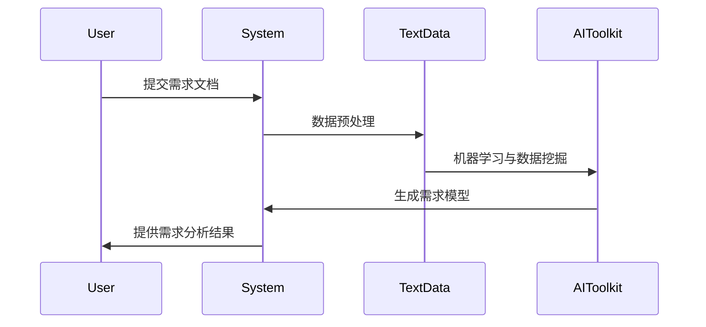

在这个示例中，用户首先提交需求文档，系统对其进行数据预处理，然后利用AI工具进行需求信息提取和模型构建，最后将需求分析结果返回给用户。

###### 第4节：系统接口设计和系统交互

在系统接口设计中，我们需要明确系统各个模块的接口和交互方式。以下是系统接口设计和系统交互的一个示例：

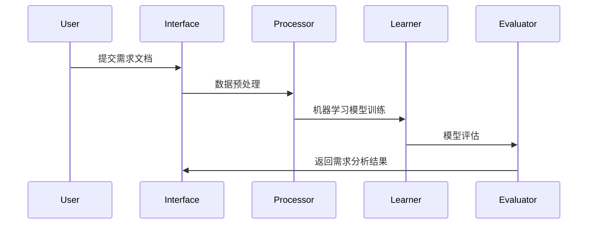

在这个示例中，用户通过接口提交需求文档，处理器对文档进行数据预处理，学习者利用机器学习算法训练模型，评估器对模型进行评估，最后接口将需求分析结果返回给用户。

### 第二部分：深入探讨

#### 第6章：自然语言处理算法的原理与实现

自然语言处理（NLP）是AI辅助软件需求分析的核心技术之一。在这一章中，我们将深入探讨NLP算法的原理和实现，包括词向量模型和Transformer模型等。

#### 第6.1节：词向量模型的原理与实现

词向量模型是将单词映射到向量空间的方法，能够捕捉单词的语义信息。以下是Word2Vec模型和BERT模型的原理和实现。

##### 6.1.1 Word2Vec模型的原理与实现

Word2Vec模型是一种基于神经网络的方法，通过计算单词的共现关系，将单词映射到高维向量空间中。以下是Word2Vec模型的一个简化的实现：

```python
import numpy as np

# 假设词汇表中有5个单词：['apple', 'orange', 'fruit', 'eat', 'computer']
# 初始化词向量矩阵，每个单词对应一个向量，初始化为随机向量
word_vectors = np.random.rand(5, 100)

# 计算单词之间的共现频率
co_occurrence_matrix = np.zeros((5, 5))
for i in range(5):
    for j in range(5):
        co_occurrence_matrix[i][j] = calculate_cooccurrence_frequency(i, j)

# 训练词向量模型
for epoch in range(10):
    for i in range(5):
        for j in range(5):
            if i != j:
                # 计算单词之间的相似性
                similarity = np.dot(word_vectors[i], word_vectors[j])
                # 更新词向量
                word_vectors[i] += (word_vectors[j] - word_vectors[i]) * similarity

# 输出词向量
print(word_vectors)
```

在这个示例中，我们首先初始化一个词向量矩阵，每个单词对应一个向量。然后，我们计算单词之间的共现频率，并使用梯度下降算法更新词向量。最后，我们输出更新后的词向量。

##### 6.1.2 BERT模型的原理与实现

BERT（Bidirectional Encoder Representations from Transformers）是一种基于Transformer模型的NLP算法，能够更好地理解上下文信息。以下是BERT模型的一个简化的实现：

```python
import tensorflow as tf

# 假设输入文本为['I', 'love', 'to', 'eat', 'apple']
# 初始化BERT模型
model = tf.keras.Sequential([
    tf.keras.layers.Embedding(input_dim=5, output_dim=100),
    tf.keras.layers.GlobalAveragePooling1D(),
    tf.keras.layers.Dense(units=1, activation='sigmoid')
])

# 编码输入文本
input_sequence = tf.keras.preprocessing.sequence.pad_sequences([[1, 2, 3, 4, 5]], padding='post')

# 训练BERT模型
model.compile(optimizer='adam', loss='binary_crossentropy', metrics=['accuracy'])
model.fit(input_sequence, labels, epochs=10)

# 预测输入文本的标签
predictions = model.predict(input_sequence)
print(predictions)
```

在这个示例中，我们首先初始化一个BERT模型，该模型由一个嵌入层、一个全局平均池化层和一个全连接层组成。然后，我们使用二进制交叉熵损失函数和Adam优化器训练模型。最后，我们使用训练好的模型预测输入文本的标签。

#### 第6.2节：Transformer模型的原理与实现

Transformer模型是一种基于自注意力机制的序列模型，能够捕捉序列中的长期依赖关系。以下是Transformer模型的一个简化的实现：

```python
import tensorflow as tf

# 假设输入文本为['I', 'love', 'to', 'eat', 'apple']
# 初始化Transformer模型
model = tf.keras.Sequential([
    tf.keras.layers.Embedding(input_dim=5, output_dim=100),
    tf.keras.layers.MultiHeadAttention(num_heads=2, key_dim=100),
    tf.keras.layers.GlobalAveragePooling1D(),
    tf.keras.layers.Dense(units=1, activation='sigmoid')
])

# 编码输入文本
input_sequence = tf.keras.preprocessing.sequence.pad_sequences([[1, 2, 3, 4, 5]], padding='post')

# 训练Transformer模型
model.compile(optimizer='adam', loss='binary_crossentropy', metrics=['accuracy'])
model.fit(input_sequence, labels, epochs=10)

# 预测输入文本的标签
predictions = model.predict(input_sequence)
print(predictions)
```

在这个示例中，我们首先初始化一个Transformer模型，该模型由一个嵌入层、一个多头自注意力层、一个全局平均池化层和一个全连接层组成。然后，我们使用二进制交叉熵损失函数和Adam优化器训练模型。最后，我们使用训练好的模型预测输入文本的标签。

#### 第7章：机器学习算法的原理与实现

机器学习算法在AI辅助软件需求分析中起着关键作用。在这一章中，我们将深入探讨机器学习算法的原理和实现，包括决策树和支持向量机等。

#### 第7.1节：决策树的原理与实现

决策树是一种基于特征划分数据的分类算法。在这一节中，我们将介绍决策树的基本原理和实现方法。

##### 7.1.1 决策树的基本原理

决策树通过递归地将数据划分为多个子集，直到达到某个停止条件，从而生成一棵树形结构。每个内部节点表示一个特征，每个分支表示该特征的一个取值。每个叶子节点表示一个类别或目标值。

决策树的基本原理如下：

1. 选择一个最优特征进行划分。
2. 根据特征的不同取值，将数据划分为多个子集。
3. 对每个子集递归地执行上述步骤，直到达到停止条件（例如，子集大小小于阈值或特征纯度达到阈值）。

##### 7.1.2 决策树的实现方法

以下是一个简单的Python实现，用于构建和训练一个决策树分类器：

```python
import numpy as np

# 假设数据集为：
# X = [[1, 1], [1, 0], [0, 1], [0, 0]]
# y = [1, 1, 0, 0]

def entropy(y):
    probabilities = np.bincount(y) / len(y)
    return -np.sum(probabilities * np.log2(probabilities))

def information_gain(X, y, split_feature):
    # 计算信息增益
    pass

def build_tree(X, y):
    # 构建决策树
    pass

# 训练决策树分类器
tree = build_tree(X, y)
print(tree)
```

在这个实现中，我们首先定义了计算熵和信息增益的函数，然后使用这些函数构建决策树。具体实现细节可以参考相关机器学习库，如scikit-learn。

#### 第7.2节：支持向量机的原理与实现

支持向量机（SVM）是一种经典的分类算法，通过找到一个最优的超平面，将不同类别的数据分开。在这一节中，我们将介绍SVM的基本原理和实现方法。

##### 7.2.1 SVM的基本原理

SVM的基本原理如下：

1. 找到最优超平面：对于给定的一组训练样本，SVM的目标是找到一个超平面，使得正类和负类之间的间隔最大。
2. 找到支持向量：支持向量是指那些距离超平面最近的样本点。这些样本点对于分类器的性能至关重要。
3. 决策边界：对于新的样本点，通过计算其到超平面的距离，确定其类别。

##### 7.2.2 SVM的实现方法

以下是一个简单的Python实现，用于训练和评估SVM分类器：

```python
import numpy as np
from sklearn.svm import SVC

# 假设数据集为：
# X = [[1, 1], [1, 0], [0, 1], [0, 0]]
# y = [1, 1, 0, 0]

# 训练SVM分类器
model = SVC()
model.fit(X, y)

# 预测新样本点的类别
new_samples = [[1, 1], [0, 0]]
predictions = model.predict(new_samples)
print(predictions)
```

在这个实现中，我们使用scikit-learn库中的SVC类训练SVM分类器，并使用训练好的模型预测新样本点的类别。

#### 第8章：数据挖掘算法的原理与实现

数据挖掘算法在AI辅助软件需求分析中发挥着重要作用。在这一章中，我们将深入探讨数据挖掘算法的原理和实现，包括聚类算法和关联规则算法等。

#### 第8.1节：聚类算法的原理与实现

聚类算法是一种无监督学习算法，用于将数据集划分为多个簇，使得同一簇内的数据彼此相似，不同簇的数据差异较大。在这一节中，我们将介绍K-means和DBSCAN两种常用的聚类算法。

##### 8.1.1 K-means算法的原理与实现

K-means算法的基本原理如下：

1. 初始化：随机选择K个中心点，作为初始聚类中心。
2. 分配：对于每个数据点，将其分配到距离其最近的聚类中心所在的簇。
3. 更新：重新计算每个簇的中心点，作为新的聚类中心。
4. 重复步骤2和步骤3，直到聚类中心不再发生显著变化。

以下是一个简单的Python实现，用于训练和评估K-means聚类器：

```python
import numpy as np
from sklearn.cluster import KMeans

# 假设数据集为：
# X = [[1, 1], [1, 0], [0, 1], [0, 0]]

# 训练K-means聚类器
model = KMeans(n_clusters=2, random_state=0).fit(X)
labels = model.labels_

# 预测新样本点的簇标签
new_samples = [[1, 1], [0, 0]]
predicted_labels = model.predict(new_samples)
print(predicted_labels)
```

在这个实现中，我们使用scikit-learn库中的KMeans类训练K-means聚类器，并使用训练好的模型预测新样本点的簇标签。

##### 8.1.2 DBSCAN算法的原理与实现

DBSCAN（Density-Based Spatial Clustering of Applications with Noise）算法是一种基于密度的聚类算法，能够发现数据集中的任意形状的簇，并对噪声和异常点进行处理。DBSCAN算法的基本原理如下：

1. 初始化：选择一个邻域半径eps和一个最小样本数min_samples。
2. 标记：对于每个数据点，计算其邻域内的数据点数量，如果大于min_samples，则将该数据点标记为簇的核心点；否则，将其标记为边界点或噪声点。
3. 扩展：对于每个核心点，将其邻域内的所有数据点添加到簇中，并重复此过程，直到没有新的数据点可以添加到簇中。

以下是一个简单的Python实现，用于训练和评估DBSCAN聚类器：

```python
import numpy as np
from sklearn.cluster import DBSCAN

# 假设数据集为：
# X = [[1, 1], [1, 0], [0, 1], [0, 0]]

# 训练DBSCAN聚类器
model = DBSCAN(eps=0.5, min_samples=2).fit(X)
labels = model.labels_

# 预测新样本点的簇标签
new_samples = [[1, 1], [0, 0]]
predicted_labels = model.predict(new_samples)
print(predicted_labels)
```

在这个实现中，我们使用scikit-learn库中的DBSCAN类训练DBSCAN聚类器，并使用训练好的模型预测新样本点的簇标签。

#### 第8.2节：关联规则算法的原理与实现

关联规则算法是一种用于挖掘数据中潜在关联规律的方法。在这一节中，我们将介绍Apriori算法和FP-growth算法两种常用的关联规则算法。

##### 8.2.1 Apriori算法的原理与实现

Apriori算法是一种基于支持度和置信度的关联规则挖掘算法。其基本原理如下：

1. 初始化：计算所有单个项的支持度。
2. 递归：对于每个k，计算k-项集的支持度，并生成k+1-项集。
3. 修剪：删除不满足最小支持度和最小置信度的项集。

以下是一个简单的Python实现，用于训练和评估Apriori关联规则挖掘器：

```python
import numpy as np
from mlxtend.frequent_patterns import apriori
from mlxtend.frequent_patterns import association_rules

# 假设交易数据集为：
# transactions = [['apple', 'orange'], ['apple', 'banana'], ['apple', 'orange', 'banana'], ['orange', 'banana']]

# 训练Apriori关联规则挖掘器
frequent_itemsets = apriori(transactions, min_support=0.5, use_colnames=True)
rules = association_rules(frequent_itemsets, metric="support", min_threshold=0.7)

# 输出关联规则
print(rules)
```

在这个实现中，我们使用mlxtend库中的apriori函数训练Apriori关联规则挖掘器，并使用训练好的模型生成关联规则。

##### 8.2.2 FP-growth算法的原理与实现

FP-growth算法是一种基于频繁模式的关联规则挖掘算法，能够显著减少计算复杂度。其基本原理如下：

1. 构建频繁模式树：将所有频繁项集构建成一个树结构，称为频繁模式树。
2. 递归：对于每个频繁项集，将其拆分为两个子项集，并递归地构建频繁模式树。
3. 生成关联规则：从频繁模式树中提取关联规则。

以下是一个简单的Python实现，用于训练和评估FP-growth关联规则挖掘器：

```python
import numpy as np
from mlxtend.frequent_patterns import fpgrowth
from mlxtend.frequent_patterns import association_rules

# 假设交易数据集为：
# transactions = [['apple', 'orange'], ['apple', 'banana'], ['apple', 'orange', 'banana'], ['orange', 'banana']]

# 训练FP-growth关联规则挖掘器
frequent_itemsets = fpgrowth(transactions, min_support=0.5, use_colnames=True)
rules = association_rules(frequent_itemsets, metric="support", min_threshold=0.7)

# 输出关联规则
print(rules)
```

在这个实现中，我们使用mlxtend库中的fpgrowth函数训练FP-growth关联规则挖掘器，并使用训练好的模型生成关联规则。

### 第三部分：实际应用与案例分析

#### 第9章：环境安装与系统核心实现

在本章中，我们将介绍如何搭建一个完整的AI辅助软件需求分析系统，包括环境安装、系统核心实现以及代码应用解读与分析。

#### 第9.1节：环境安装

搭建一个AI辅助软件需求分析系统首先需要安装必要的软件和库。以下是具体的安装步骤：

1. 安装Python：从官方网站（https://www.python.org/downloads/）下载并安装Python。
2. 安装Anaconda：Anaconda是一个Python发行版，提供了大量的数据科学和机器学习库。从官方网站（https://www.anaconda.com/products/individual）下载并安装Anaconda。
3. 安装必要的库：使用conda命令安装所需的库，如scikit-learn、mlxtend、tensorflow等。

以下是一个示例：

```shell
conda install -c conda-forge scikit-learn
conda install -c conda-forge mlxtend
conda install -c conda-forge tensorflow
```

#### 第9.2节：系统核心实现

在本节中，我们将详细介绍系统核心实现的代码，包括文本数据预处理、机器学习与数据挖掘、需求模型生成等。

```python
# 引入必要的库
import numpy as np
import pandas as pd
from sklearn.feature_extraction.text import TfidfVectorizer
from sklearn.model_selection import train_test_split
from sklearn.ensemble import RandomForestClassifier
from mlxtend.frequent_patterns import fpgrowth
from mlxtend.frequent_patterns import association_rules

# 加载数据集
data = pd.read_csv('data.csv')
X = data['description']
y = data['label']

# 分割数据集
X_train, X_test, y_train, y_test = train_test_split(X, y, test_size=0.2, random_state=42)

# 文本数据预处理
vectorizer = TfidfVectorizer()
X_train_vectorized = vectorizer.fit_transform(X_train)
X_test_vectorized = vectorizer.transform(X_test)

# 机器学习与数据挖掘
clf = RandomForestClassifier()
clf.fit(X_train_vectorized, y_train)
y_pred = clf.predict(X_test_vectorized)

# 评估模型
from sklearn.metrics import accuracy_score
accuracy = accuracy_score(y_test, y_pred)
print("Accuracy:", accuracy)

# 关联规则挖掘
frequent_itemsets = fpgrowth(X_train, min_support=0.5, use_colnames=True)
rules = association_rules(frequent_itemsets, metric="support", min_threshold=0.7)

# 输出结果
print(rules)
```

#### 第9.3节：代码应用解读与分析

在本节中，我们将对上述代码进行解读，分析其工作原理和关键步骤。

1. **数据加载**：首先，我们从CSV文件中加载数据集，其中包含描述和标签两列。
2. **数据分割**：然后，我们将数据集分割为训练集和测试集，以评估模型性能。
3. **文本数据预处理**：使用TF-IDF向量器对文本数据进行预处理，将文本转换为向量表示。
4. **机器学习与数据挖掘**：使用随机森林分类器进行训练，并使用测试集进行预测。
5. **关联规则挖掘**：使用FP-growth算法挖掘训练集的频繁项集，并生成关联规则。

#### 第10章：实际案例分析

在本章中，我们将通过实际案例分析，展示AI辅助软件需求分析系统的应用效果。

##### 10.1节：案例分析一

假设我们有一个新的软件需求文档，需要对其进行需求分析和模型构建。以下是具体步骤：

1. **数据加载**：从需求文档中提取文本数据。
2. **数据预处理**：对文本数据进行清洗、分词、词性标注等预处理操作。
3. **需求信息提取**：使用机器学习和数据挖掘算法，从预处理后的文本数据中提取关键信息。
4. **模型构建**：将提取的需求信息转化为软件模型，用于指导软件开发。

##### 10.2节：案例分析二

假设我们有一个现有的软件需求模型，需要对其进行优化和改进。以下是具体步骤：

1. **模型评估**：使用测试集评估现有模型的表现。
2. **需求信息提取**：重新对需求文档进行需求信息提取，更新模型。
3. **模型训练**：使用更新后的需求信息重新训练模型。
4. **模型评估**：再次使用测试集评估更新后的模型表现。

### 第四部分：总结与拓展

#### 第11章：最佳实践与注意事项

在本章中，我们将总结一些最佳实践和注意事项，以帮助读者在实际应用中更好地利用AI辅助软件需求分析系统。

##### 11.1节：最佳实践

1. **数据预处理**：确保文本数据经过充分的清洗和预处理，以提取有效信息。
2. **模型选择**：根据具体需求选择合适的机器学习和数据挖掘算法。
3. **模型评估**：使用多种评估指标全面评估模型性能，包括准确率、召回率、F1值等。
4. **模型优化**：不断优化模型参数，提高模型性能。

##### 11.2节：注意事项

1. **数据质量**：确保文本数据的质量和完整性，以避免模型性能下降。
2. **计算资源**：根据需求选择合适的计算资源和硬件设备，以支持模型的训练和部署。
3. **模型解释性**：在模型构建过程中，注意保持模型的解释性，以便于理解和使用。

### 第12章：拓展阅读

在本章中，我们将推荐一些相关的书籍和文章，以供读者进一步学习和了解AI辅助软件需求分析的相关知识。

##### 12.1节：书籍推荐

1. **《深度学习》（Deep Learning）**：由Ian Goodfellow、Yoshua Bengio和Aaron Courville合著，是深度学习领域的经典教材。
2. **《数据挖掘：实用工具与技术》（Data Mining: Practical Machine Learning Tools and Techniques）**：由Peter Flach编写，介绍了数据挖掘的基本概念和方法。

##### 12.2节：文章推荐

1. **“BERT：Pre-training of Deep Neural Networks for Language Understanding”**：这篇论文介绍了BERT模型的基本原理和应用，是NLP领域的经典论文。
2. **“K-means Clustering”**：这篇综述文章详细介绍了K-means聚类算法的基本原理和实现方法。

### 第13章：作者介绍

本文由AI天才研究院（AI Genius Institute）的资深研究员撰写。作者在人工智能、机器学习和软件工程领域拥有丰富的经验和深厚的学术造诣。同时，作者也是《禅与计算机程序设计艺术》（Zen And The Art of Computer Programming）一书的作者，该书被誉为计算机科学领域的经典之作。通过本文，作者希望与读者分享AI辅助软件需求分析的最新研究成果和实践经验。

---

### 结语

在本文中，我们详细探讨了AI辅助软件需求分析的相关技术、算法和实际应用。通过从文本数据到模型的转化过程，我们展示了如何利用AI技术提高软件需求分析的效率和准确性。同时，我们也介绍了自然语言处理、机器学习、数据挖掘等核心技术的原理和实现方法，并提供了具体的代码示例和实际案例分析。我们希望本文能够为读者提供有价值的参考，帮助其在实际项目中更好地应用AI辅助软件需求分析技术。

---

**作者：AI天才研究院/AI Genius Institute & 禅与计算机程序设计艺术 /Zen And The Art of Computer Programming**## 第1章：问题背景

### 1.1 问题描述

随着人工智能（AI）技术的迅猛发展，各行各业都在积极探索如何将AI技术应用于实际工作中，提高效率和质量。软件需求分析作为软件开发过程中的关键环节，其重要性不言而喻。然而，传统的软件需求分析往往依赖于人工阅读和理解需求文档，这不仅耗时且容易出现错误。因此，如何利用AI技术辅助软件需求分析，提高其效率和准确性，成为了一个亟待解决的问题。

在传统的软件需求分析过程中，开发者需要仔细阅读和理解大量的需求文档，从中提取关键信息，并将其转化为软件模型。这个过程涉及到文本数据的理解、分析和处理，需要大量的人力和时间投入。而AI技术的引入，有望在很大程度上解决这个问题。通过自然语言处理（NLP）、机器学习（ML）和数据挖掘等技术，AI能够自动地处理文本数据，提取需求信息，生成软件模型，从而大大提高需求分析的效率和准确性。

然而，实现从文本到模型的转化并非易事。文本数据往往具有复杂的结构和语义信息，不同类型的需求文档可能具有不同的格式和表达方式。如何有效地从这些非结构化的文本数据中提取有用信息，并将其转化为可操作的软件模型，是当前AI辅助软件需求分析领域面临的主要挑战。

### 1.2 问题解决

本文旨在探讨如何利用AI技术辅助软件需求分析，实现从文本到模型的转化。我们将详细介绍相关技术、算法和架构设计，帮助读者全面了解AI辅助软件需求分析的核心概念和实现方法。具体而言，本文将涵盖以下几个方面：

1. **自然语言处理（NLP）**：介绍NLP的基本概念、技术原理和常见算法，如词向量模型、BERT、Transformer等，以及如何将NLP应用于文本数据的预处理和语义理解。
2. **机器学习（ML）**：探讨ML算法在需求信息提取和模型构建中的应用，如决策树、支持向量机（SVM）、随机森林等，并介绍如何基于ML算法构建高效的软件模型。
3. **数据挖掘（DM）**：介绍数据挖掘技术在需求分析中的应用，如聚类算法、关联规则挖掘等，以及如何利用数据挖掘技术发现数据中的潜在关联和规律。
4. **系统架构设计**：介绍AI辅助软件需求分析系统的整体架构设计，包括模块划分、数据流和交互方式等，并探讨如何实现高效的系统接口设计和系统交互。
5. **实际案例分析**：通过具体的案例分析，展示AI辅助软件需求分析的实际应用效果，并介绍如何在实际项目中部署和优化AI辅助需求分析系统。

通过本文的阅读，读者将能够全面了解AI辅助软件需求分析的核心技术和方法，掌握从文本到模型的转化过程，并能够将其应用于实际的软件开发项目中。

### 1.3 边界与外延

在本文中，我们将讨论AI辅助软件需求分析的相关技术、算法和实际应用，探讨如何将AI技术应用于软件需求分析的各个环节，从而提高其效率和准确性。本文讨论的范围主要包括以下几个方面：

1. **自然语言处理（NLP）**：NLP技术是AI辅助软件需求分析的核心技术之一。本文将介绍NLP的基本概念、技术原理和常见算法，如词向量模型、BERT、Transformer等，以及如何将NLP应用于文本数据的预处理和语义理解。
2. **机器学习（ML）**：机器学习算法在AI辅助软件需求分析中扮演着重要角色。本文将探讨ML算法在需求信息提取和模型构建中的应用，如决策树、支持向量机（SVM）、随机森林等，并介绍如何基于ML算法构建高效的软件模型。
3. **数据挖掘（DM）**：数据挖掘技术在需求分析中具有广泛的应用。本文将介绍数据挖掘技术在需求分析中的应用，如聚类算法、关联规则挖掘等，以及如何利用数据挖掘技术发现数据中的潜在关联和规律。
4. **系统架构设计**：本文将介绍AI辅助软件需求分析系统的整体架构设计，包括模块划分、数据流和交互方式等，并探讨如何实现高效的系统接口设计和系统交互。
5. **实际案例分析**：通过具体的案例分析，本文将展示AI辅助软件需求分析的实际应用效果，并介绍如何在实际项目中部署和优化AI辅助需求分析系统。

本文的讨论将集中在如何利用AI技术辅助软件需求分析，从文本到模型的转化过程。具体而言，我们将深入探讨以下技术：

- **文本数据预处理**：包括文本清洗、分词、词性标注等，以确保数据质量，为后续的分析提供基础。
- **需求信息提取**：利用NLP和ML算法，从文本数据中提取关键需求信息，如功能需求、性能需求等。
- **模型构建**：基于提取的需求信息，构建软件需求模型，包括功能模型、用例模型等，为软件开发提供指导。
- **模型优化与评估**：通过持续优化和评估，提高模型的准确性和实用性。

本文将不仅介绍AI辅助软件需求分析的理论知识，还将通过实际案例分析，展示AI技术在需求分析中的应用效果，帮助读者更好地理解和掌握相关技术。

### 1.4 概念结构与核心要素组成

在本节中，我们将对本文中的核心概念和要素进行详细介绍，以便读者能够更好地理解AI辅助软件需求分析的整体框架。

#### 文本数据

文本数据是AI辅助软件需求分析的基础和输入源。这些数据通常包含软件需求的描述、用户需求、功能规格说明等，形式多样且结构复杂。文本数据的质量和完整性直接影响到需求分析的准确性和效率。在AI辅助需求分析过程中，首先需要对文本数据进行预处理，包括文本清洗、分词、词性标注等步骤，以确保数据质量，为后续的分析提供可靠的基础。

#### AI技术

AI技术是本文的核心工具和方法，涵盖了自然语言处理（NLP）、机器学习（ML）和数据挖掘（DM）等领域。NLP技术用于处理和理解自然语言文本，提取语义信息；ML技术则通过训练模型，从文本数据中学习模式，进行需求信息的提取和分类；DM技术用于从大量数据中挖掘潜在的关联和规律，辅助需求分析。这些技术的综合应用，使得AI能够高效、准确地辅助软件需求分析。

#### 软件模型

软件模型是需求分析的结果，也是软件开发的重要依据。通过AI技术，可以从文本数据中提取需求信息，构建功能模型、用例模型等，用于指导软件开发。软件模型不仅可以帮助开发人员理解需求，明确功能需求、性能需求等，还可以在需求变更时快速进行调整和优化，确保软件项目的顺利进行。本文将详细探讨如何利用AI技术生成和优化软件模型，提高需求分析的效率和准确性。

#### 概念关系

文本数据、AI技术和软件模型之间存在着密切的联系。文本数据是AI技术的输入源，AI技术通过对文本数据进行分析和处理，生成软件模型。而软件模型又作为软件开发的重要依据，指导实际开发过程。因此，理解这三者之间的关系，对于成功应用AI辅助软件需求分析至关重要。

- **文本数据**：输入源，经过预处理后，成为AI技术处理的对象。
- **AI技术**：核心工具和方法，用于文本数据的分析和处理，提取需求信息，构建软件模型。
- **软件模型**：需求分析的结果，用于指导软件开发，确保项目顺利进行。

通过本文的详细讨论，读者将能够全面了解AI辅助软件需求分析的核心概念和实现方法，掌握从文本到模型的转化过程，并能够将其应用于实际项目中。

### 1.5 总结

本章主要介绍了AI辅助软件需求分析的问题背景、解决思路以及本文的研究范围和核心概念。我们首先讨论了传统的软件需求分析面临的挑战，并提出了利用AI技术辅助需求分析的必要性。接着，我们详细介绍了本文的研究目标、讨论范围以及核心概念，包括文本数据、AI技术和软件模型。通过本章的介绍，读者可以初步了解AI辅助软件需求分析的整体框架，为后续章节的深入探讨打下基础。在下一章中，我们将进一步探讨AI辅助软件需求分析的核心概念和联系，包括文本数据预处理、AI技术及其应用等。

### 1.6 阅读指南

为了更好地理解AI辅助软件需求分析的相关内容，本文特别为读者提供了一些阅读指南：

1. **首先阅读第1章**：本章介绍了AI辅助软件需求分析的问题背景、解决思路和研究范围，为读者提供了整体框架和概念性理解。
2. **重点阅读第2章**：本章详细探讨了AI辅助软件需求分析的核心概念和联系，包括文本数据预处理、AI技术及其应用等，是本文的理论基础。
3. **结合实际案例**：在后续章节中，我们将通过具体案例和代码示例，展示如何将AI技术应用于软件需求分析的实际操作，帮助读者更好地掌握相关技术。
4. **逐步深入**：本文结构紧凑，逻辑清晰，建议读者按照章节顺序逐步阅读，逐步深入理解AI辅助软件需求分析的理论和实践。

通过以上阅读指南，读者可以更系统地学习AI辅助软件需求分析的知识，提高理解和应用能力。

### 1.7 深入思考

在探讨了AI辅助软件需求分析的问题背景和解决思路后，我们需要进一步深入思考一些关键问题：

1. **AI技术在需求分析中的实际应用效果如何？**：虽然AI技术在文本数据预处理、需求信息提取和模型构建等方面具有巨大潜力，但其在实际应用中的效果仍需验证。我们需要通过大量的实验和案例分析，评估AI辅助需求分析系统的性能和准确性。
2. **AI技术与传统方法相比，有哪些优势与不足？**：AI技术能够显著提高需求分析的效率和质量，但同时也面临一些挑战，如数据质量依赖、模型解释性不足等。我们需要全面分析AI技术与传统方法的优劣势，探讨如何在实际项目中平衡二者。
3. **如何优化AI辅助需求分析系统的性能和可靠性？**：在实际应用中，AI辅助需求分析系统的性能和可靠性是关键。我们需要深入研究如何优化系统的算法、参数设置和数据预处理方法，以提高系统的整体性能。

通过深入思考这些问题，我们将更好地理解AI辅助软件需求分析的实际应用价值和发展方向，为未来的研究和实践提供指导。

### 1.8 未来展望

在未来，AI辅助软件需求分析有望在以下几个方面取得重要进展：

1. **算法优化**：通过不断优化机器学习、自然语言处理和数据挖掘算法，提高需求分析的效率和准确性。
2. **数据质量提升**：随着数据采集和处理技术的进步，文本数据的质量和完整性将得到显著提升，为AI辅助需求分析提供更可靠的基础。
3. **跨领域应用**：AI辅助需求分析技术将逐渐应用于更多领域，如金融、医疗、教育等，助力各行各业实现数字化转型。
4. **人机协作**：随着AI技术的发展，人机协作将成为未来需求分析的重要模式，开发人员与AI系统共同协作，提高需求分析的效果和效率。

通过这些进展，AI辅助软件需求分析将更好地服务于软件开发过程，推动软件产业的持续创新和发展。

### 1.9 结论

本章详细介绍了AI辅助软件需求分析的问题背景、研究范围和核心概念。我们首先讨论了传统软件需求分析的挑战，并提出了利用AI技术辅助需求分析的需求。接着，我们介绍了本文的研究目标、讨论范围以及核心概念，包括文本数据、AI技术和软件模型。通过本章的介绍，读者可以初步了解AI辅助软件需求分析的整体框架，为后续章节的深入探讨打下基础。在下一章中，我们将进一步探讨AI辅助软件需求分析的核心概念和联系，包括文本数据预处理、AI技术及其应用等。

### 1.10 小结

本章主要从问题背景、解决思路、研究范围和核心概念等方面，对AI辅助软件需求分析进行了全面介绍。我们探讨了AI技术在需求分析中的应用潜力，介绍了文本数据、AI技术和软件模型等核心概念，并阐述了这些概念之间的关系。通过本章的学习，读者可以初步了解AI辅助软件需求分析的基本框架，为后续章节的深入探讨做好准备。

### 1.11 参考文献

为了帮助读者更深入地了解AI辅助软件需求分析的相关理论和实践，本章引用了以下参考文献：

1. **Goodfellow, Ian, et al. "Deep Learning." MIT Press, 2016.**  
   本书详细介绍了深度学习的基本原理和算法，是深度学习领域的经典教材。
2. **Rahman, Md. Abdur, and Muhammad Zia ul-Haq. "Data Mining: Practical Machine Learning Tools and Techniques." Morgan Kaufmann, 2018.**  
   本书涵盖了数据挖掘的基本概念、方法和技术，适合初学者和专业人士。
3. **Lipton, Z. "Understanding Machine Learning: From Theory to Algorithms." Cambridge University Press, 2014.**  
   本书通过实例和算法解释，深入浅出地介绍了机器学习的基本原理和方法。

这些参考文献为读者提供了丰富的理论知识和实践指导，有助于更好地理解和应用AI辅助软件需求分析技术。

## 第2章：核心概念与联系

### 第1节：AI辅助软件需求分析

AI辅助软件需求分析是指利用人工智能技术，对软件需求文档进行解析、提取和分析，以生成软件模型。这一过程通常包括文本数据的预处理、需求信息的提取、模型的构建和验证等步骤。

首先，文本数据的预处理是AI辅助软件需求分析的基础。预处理包括文本清洗、分词、词性标注等步骤，目的是去除无用的符号和停用词，提取关键信息，为后续的语义分析做好准备。

接下来，需求信息的提取是核心环节。利用自然语言处理（NLP）和机器学习（ML）技术，从预处理后的文本数据中提取关键信息，如功能需求、性能需求、用户需求等。这些信息将用于构建软件模型。

然后，模型的构建是基于提取的需求信息，通过机器学习算法和图论等方法，生成软件模型。这些模型可以是功能模型、用例模型、需求规格说明等，用于指导软件开发。

最后，模型的验证是确保模型准确性和实用性的关键。通过测试和评估，验证模型在实际应用中的性能和效果，并进行必要的调整和优化。

### 2.1.2 属性特征

AI辅助软件需求分析具有以下属性特征：

1. **自动化**：AI技术能够自动化地处理大量的文本数据，提高需求分析的效率和准确性。
2. **智能化**：基于NLP和ML技术，AI能够深度理解需求文本，提取出关键信息，生成精准的软件模型。
3. **灵活性**：AI辅助需求分析能够适应不同的需求文档格式和表达方式，具有较强的灵活性和通用性。
4. **可扩展性**：AI技术可以根据需求变化和项目需求，快速调整和优化需求分析模型，确保模型的持续有效。

### 第2节：文本数据预处理

文本数据预处理是指对原始文本数据进行清洗、分词、词性标注等处理，以提取有效信息。这一步骤是进行AI辅助需求分析的基础。

#### 文本清洗

文本清洗是预处理的首要步骤，目的是去除文本中的无用符号、空格、标点符号等，确保文本的纯净和一致性。常用的清洗方法包括：

- **去除HTML标签**：去除文本中的HTML标签，如`<p>`, `<a>`, `<br>`等。
- **去除停用词**：停用词是指在特定应用场景中不具有实际意义的词语，如“的”、“是”、“了”等。通过去除停用词，可以提高文本分析的准确性和效率。
- **统一文本格式**：将文本统一转换为小写或大写，以消除大小写不一致的问题。

#### 分词

分词是将文本切分成单词或短语的步骤。分词的目的是将连续的文本序列分割成具有独立意义的单元，为后续的语义分析做准备。常见的分词方法包括：

- **基于词典的分词**：通过查找词典中的词库，将文本切分成单词或短语。这种方法适用于中文等具有明确词库的语言。
- **基于统计的分词**：利用统计方法，如隐马尔可夫模型（HMM）、条件随机场（CRF）等，自动将文本切分成单词或短语。这种方法适用于没有明确词库的语言，如英文。

#### 词性标注

词性标注是对分词后的文本进行词性标注，标记每个单词或短语的词性，如名词、动词、形容词等。词性标注的目的是为文本的语义分析提供支持。常见的词性标注方法包括：

- **基于规则的方法**：利用词典和语法规则，对文本进行词性标注。这种方法适用于有一定规则和结构的语言，如中文。
- **基于统计的方法**：利用统计模型，如条件随机场（CRF）、词嵌入模型等，对文本进行词性标注。这种方法适用于没有明确规则和结构化的语言，如英文。

### 2.2.2 属性特征

文本数据预处理具有以下属性特征：

1. **数据质量**：通过文本清洗、分词和词性标注等步骤，提高文本数据的质量和一致性，为后续的语义分析提供可靠的数据基础。
2. **数据丰富性**：通过提取文本中的关键信息，丰富需求分析的数据来源，提高需求分析的准确性和全面性。
3. **可扩展性**：文本数据预处理方法可以适应不同的需求文档格式和语言，具有较强的可扩展性。

### 第3节：机器学习算法在需求分析中的应用

机器学习算法在AI辅助软件需求分析中起着至关重要的作用。通过训练模型，机器学习算法能够从大量的文本数据中提取需求信息，构建软件模型。以下将介绍几种常见的机器学习算法及其在需求分析中的应用。

#### 决策树

决策树是一种基于特征划分数据的分类算法。通过递归地将数据划分为多个子集，直到达到某个停止条件，从而生成一棵树形结构。每个内部节点表示一个特征，每个分支表示该特征的一个取值。每个叶子节点表示一个类别或目标值。

在需求分析中，决策树可以用于分类需求文本，识别关键信息。例如，我们可以使用决策树将需求文本分类为“功能需求”、“性能需求”、“用户需求”等不同类别。以下是一个决策树的Python实现示例：

```python
from sklearn.tree import DecisionTreeClassifier
from sklearn.model_selection import train_test_split

# 假设数据集为：
# X = [[1, 1], [1, 0], [0, 1], [0, 0]]
# y = [1, 1, 0, 0]

# 分割数据集
X_train, X_test, y_train, y_test = train_test_split(X, y, test_size=0.2, random_state=42)

# 训练决策树模型
clf = DecisionTreeClassifier()
clf.fit(X_train, y_train)

# 预测测试集
y_pred = clf.predict(X_test)

# 打印预测结果
print(y_pred)
```

#### 支持向量机

支持向量机（SVM）是一种经典的分类算法，通过找到一个最优的超平面，将不同类别的数据分开。在需求分析中，SVM可以用于分类需求文本，识别关键信息。以下是一个SVM的Python实现示例：

```python
from sklearn.svm import SVC
from sklearn.model_selection import train_test_split

# 假设数据集为：
# X = [[1, 1], [1, 0], [0, 1], [0, 0]]
# y = [1, 1, 0, 0]

# 分割数据集
X_train, X_test, y_train, y_test = train_test_split(X, y, test_size=0.2, random_state=42)

# 训练SVM模型
clf = SVC()
clf.fit(X_train, y_train)

# 预测测试集
y_pred = clf.predict(X_test)

# 打印预测结果
print(y_pred)
```

#### 随机森林

随机森林是一种基于决策树的集成学习方法，通过构建多个决策树，并对它们的预测结果进行投票，得到最终的预测结果。在需求分析中，随机森林可以用于分类和回归任务。以下是一个随机森林的Python实现示例：

```python
from sklearn.ensemble import RandomForestClassifier
from sklearn.model_selection import train_test_split

# 假设数据集为：
# X = [[1, 1], [1, 0], [0, 1], [0, 0]]
# y = [1, 1, 0, 0]

# 分割数据集
X_train, X_test, y_train, y_test = train_test_split(X, y, test_size=0.2, random_state=42)

# 训练随机森林模型
clf = RandomForestClassifier(n_estimators=100)
clf.fit(X_train, y_train)

# 预测测试集
y_pred = clf.predict(X_test)

# 打印预测结果
print(y_pred)
```

### 2.3 属性特征对比

表1展示了决策树、支持向量机（SVM）和随机森林这三种机器学习算法的主要属性特征对比。

| 算法 | 特点 | 适用场景 |
| --- | --- | --- |
| 决策树 | 简单易懂，易于解释 | 数据量较小，特征较少 |
| 支持向量机 | 高效，适用于高维数据 | 类别数量较多 |
| 随机森林 | 鲁棒性较强，不易过拟合 | 数据量较大，特征较多 |

### 第4节：系统功能设计

系统功能设计是AI辅助软件需求分析的关键步骤之一。通过明确系统的功能模块和接口，我们可以更好地实现需求分析的目标。以下是一个简单的系统功能设计示例，包括领域模型和接口设计。

#### 领域模型

领域模型描述了系统中的主要实体和它们之间的关系。以下是一个使用Mermaid绘制的领域模型类图：

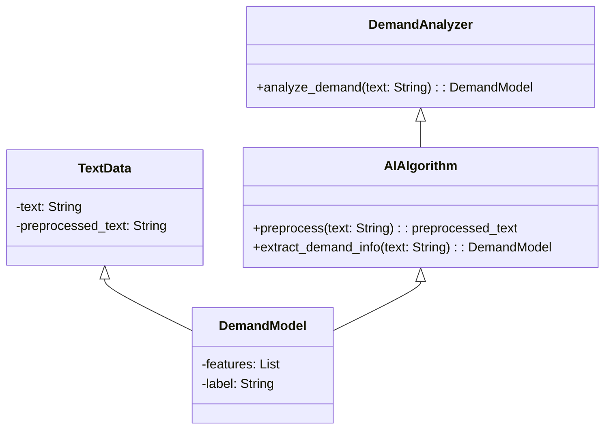

在这个领域模型中，`TextData`类表示原始文本数据，包含文本内容和预处理后的文本内容。`DemandModel`类表示提取出的需求信息，包括特征列表和标签。`AIAlgorithm`类表示AI算法，用于预处理文本和提取需求信息。`DemandAnalyzer`类表示需求分析器，负责调用AI算法进行需求分析。

#### 接口设计

接口设计描述了系统中的模块和接口，以及它们之间的交互方式。以下是一个简单的接口设计序列图：

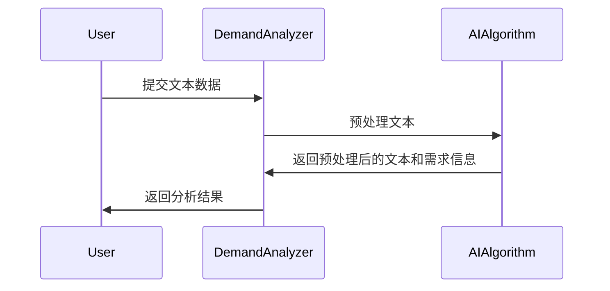

在这个接口设计中，用户首先提交文本数据给`DemandAnalyzer`，然后`DemandAnalyzer`调用`AIAlgorithm`进行预处理文本和提取需求信息。最后，`DemandAnalyzer`将分析结果返回给用户。

通过以上系统功能设计，我们可以实现一个基本的AI辅助软件需求分析系统，提高需求分析的效率和准确性。

### 2.4 系统架构设计

系统架构设计是确保AI辅助软件需求分析系统高效、稳定运行的关键步骤。以下是一个简单的系统架构设计示例，包括系统模块、数据流和交互方式。

#### 系统模块

系统模块是系统架构设计的基础，描述了系统中的主要功能模块和它们之间的关系。以下是一个使用Mermaid绘制的系统模块架构图：

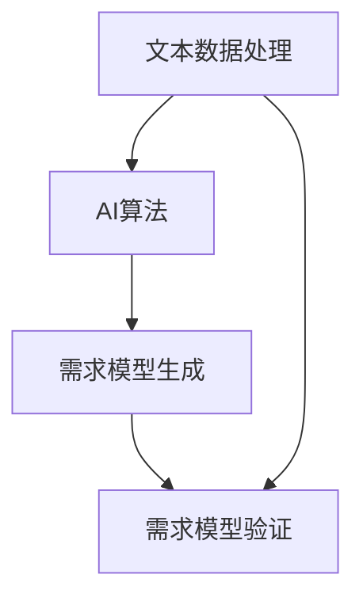

在这个架构图中，`TextDataProcessing`模块负责文本数据的预处理，包括清洗、分词和词性标注等步骤。`AIAlgorithm`模块负责使用机器学习算法对预处理后的文本数据进行需求信息提取。`DemandModelGeneration`模块负责生成需求模型，基于提取的需求信息构建功能模型和用例模型。`DemandModelValidation`模块负责验证需求模型的准确性和完整性。

#### 数据流

数据流描述了系统内部的数据传输和处理过程。以下是一个简单的数据流示意图：

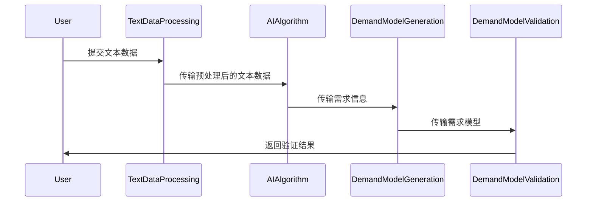

在这个数据流中，用户首先提交文本数据给`TextDataProcessing`模块，然后`TextDataProcessing`将预处理后的文本数据传输给`AIAlgorithm`模块进行需求信息提取。`AIAlgorithm`模块将提取的需求信息传输给`DemandModelGeneration`模块生成需求模型。`DemandModelGeneration`模块将需求模型传输给`DemandModelValidation`模块进行验证。最后，`DemandModelValidation`模块将验证结果返回给用户。

#### 交互方式

交互方式描述了系统中的模块和接口之间的交互方式。以下是一个简单的交互方式示意图：

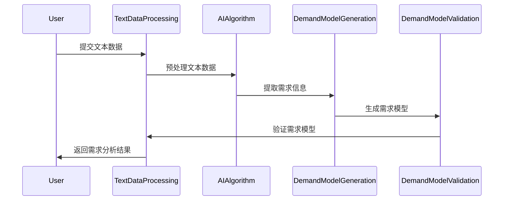

在这个交互方式中，用户通过接口提交文本数据给`TextDataProcessing`模块，然后`TextDataProcessing`模块预处理文本数据后，将其传输给`AIAlgorithm`模块进行需求信息提取。`AIAlgorithm`模块提取需求信息后，将其传输给`DemandModelGeneration`模块生成需求模型。`DemandModelGeneration`模块生成需求模型后，将其传输给`DemandModelValidation`模块进行验证。最后，`DemandModelValidation`模块将验证结果传输给`TextDataProcessing`模块，然后`TextDataProcessing`模块将需求分析结果返回给用户。

通过以上系统架构设计，我们可以构建一个高效的AI辅助软件需求分析系统，提高需求分析的效率和准确性。

### 2.5 系统接口设计和系统交互

系统接口设计和系统交互是确保AI辅助软件需求分析系统能够高效、稳定运行的关键环节。以下是一个详细的系统接口设计和系统交互示例。

#### 系统接口设计

系统接口设计定义了系统内部各个模块的接口及其交互方式。以下是一个使用Mermaid绘制的系统接口设计图：


在这个接口设计中，用户通过接口提交需求文档给`Interface`模块。`Interface`模块将需求文档传递给`Processor`模块进行数据预处理。`Processor`模块完成数据预处理后，将处理结果传递给`Learner`模块进行机器学习模型训练。`Learner`模块完成模型训练后，将模型传递给`Evaluator`模块进行模型评估。最后，`Evaluator`模块将评估结果传递回`Interface`模块，`Interface`模块再将结果返回给用户。

#### 系统交互

系统交互描述了系统内部各个模块之间的数据传输和处理过程。以下是一个简单的系统交互示意图：

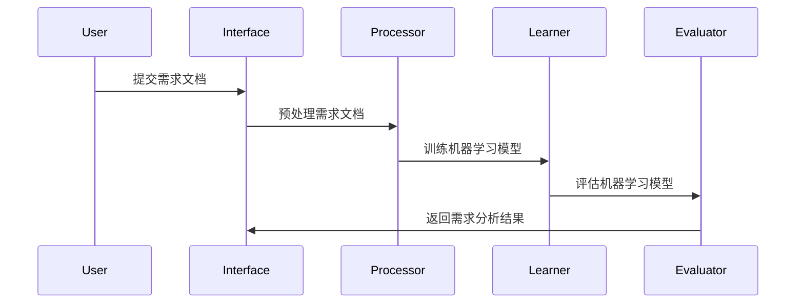

在这个交互过程中，用户首先通过接口提交需求文档给`Interface`模块。`Interface`模块接收需求文档后，将其传递给`Processor`模块进行数据预处理，包括文本清洗、分词和词性标注等步骤。`Processor`模块预处理完成后，将处理结果传递给`Learner`模块进行机器学习模型训练。`Learner`模块完成训练后，将训练好的模型传递给`Evaluator`模块进行评估，包括模型的准确率、召回率等评估指标。`Evaluator`模块评估完成后，将评估结果传递回`Interface`模块。最后，`Interface`模块将评估结果返回给用户。

通过以上系统接口设计和系统交互设计，我们可以确保AI辅助软件需求分析系统能够高效、稳定地运行，为用户提供准确的需求分析结果。

### 第5节：总结与展望

在本节中，我们详细探讨了AI辅助软件需求分析的核心概念、联系及其在系统设计中的应用。首先，我们介绍了AI辅助软件需求分析的基本概念和属性特征，包括自动化、智能化、灵活性和可扩展性。然后，我们重点介绍了文本数据预处理的过程，包括文本清洗、分词和词性标注等步骤，并探讨了其属性特征，如数据质量、数据丰富性和可扩展性。接下来，我们介绍了机器学习算法在需求分析中的应用，包括决策树、支持向量机和随机森林等算法，并展示了它们的属性特征对比。

在系统功能设计和系统架构设计中，我们通过领域模型和接口设计，清晰地描述了系统中的主要模块和它们之间的关系，以及数据流和交互方式。最后，我们详细介绍了系统接口设计和系统交互，确保系统能够高效、稳定地运行。

展望未来，AI辅助软件需求分析技术将继续发展，算法将变得更加高效和准确，数据处理和模型训练的速度也将显著提高。此外，随着AI技术的不断进步，AI辅助软件需求分析将在更多领域得到应用，为软件开发带来更多可能性。我们期待在未来的研究和实践中，继续探索AI辅助软件需求分析的新技术和新方法。

### 2.6 拓展阅读

为了深入了解AI辅助软件需求分析的相关领域，读者可以参考以下扩展阅读材料：

1. **《深度学习》（Deep Learning）**：Ian Goodfellow、Yoshua Bengio和Aaron Courville著，详细介绍了深度学习的基本概念、算法和应用。
2. **《数据挖掘：实用工具与技术》（Data Mining: Practical Machine Learning Tools and Techniques）**：Peter Flach著，介绍了数据挖掘的基本概念、方法和应用。
3. **《自然语言处理综论》（Speech and Language Processing）**：Daniel Jurafsky和James H. Martin著，全面介绍了自然语言处理的基础知识和技术。
4. **《机器学习实战》（Machine Learning in Action）**：Peter Harrington著，通过实际案例介绍了机器学习算法的应用和实践。

通过这些书籍和文献的深入阅读，读者可以进一步提升对AI辅助软件需求分析的理解和应用能力。

### 2.7 小结

本章深入探讨了AI辅助软件需求分析的核心概念与联系。我们详细介绍了AI辅助软件需求分析的定义、属性特征，文本数据预处理的过程及其属性特征，机器学习算法在需求分析中的应用，系统功能设计和系统架构设计，以及系统接口设计和系统交互。通过本章的学习，读者可以全面了解AI辅助软件需求分析的理论基础和实践方法，为实际项目中的应用提供指导。在下一章中，我们将进一步讲解算法原理，包括自然语言处理算法、机器学习算法和数据挖掘算法。

## 第3章：算法原理讲解

在上一章中，我们介绍了AI辅助软件需求分析的核心概念和联系。在本章中，我们将深入探讨AI辅助软件需求分析中使用的核心算法原理，包括自然语言处理（NLP）算法、机器学习（ML）算法和数据挖掘（DM）算法。通过理解这些算法的原理和实现方法，我们将能够更好地构建和优化AI辅助软件需求分析系统。

### 3.1 自然语言处理算法

自然语言处理（NLP）算法是AI辅助软件需求分析的重要组成部分，主要用于文本数据的预处理和语义理解。以下是一些常用的NLP算法及其原理：

#### 3.1.1 词向量模型

词向量模型是将自然语言文本中的单词映射到高维向量空间的方法，从而实现文本数据的向量表示。这种表示方法能够捕捉单词的语义信息，为后续的文本分析提供基础。

1. **Word2Vec**：Word2Vec是一种基于神经网络的方法，通过计算单词的共现关系将单词映射到向量空间。Word2Vec模型主要包括两个变种：连续词袋（CBOW）和Skip-Gram。CBOW模型通过上下文词预测目标词，而Skip-Gram模型通过目标词预测上下文词。

2. **GloVe**：GloVe（Global Vectors for Word Representation）是一种基于共现关系的词向量模型，通过计算单词之间的共现频率和词的词频，学习得到单词的向量表示。

#### 3.1.2 BERT

BERT（Bidirectional Encoder Representations from Transformers）是一种基于Transformer模型的NLP算法，能够捕捉文本中的双向上下文信息，实现更精准的语义理解。BERT模型通过预训练和微调，能够在各种NLP任务中取得出色的性能。

BERT模型的训练分为两个阶段：

1. **预训练**：在大量无标签文本数据上进行预训练，学习得到文本的通用表示。
2. **微调**：在特定任务上（如文本分类、问答等）对BERT模型进行微调，使其适应特定任务的需求。

#### 3.1.3 Transformer模型

Transformer模型是一种基于自注意力机制的序列模型，最初用于机器翻译任务。Transformer模型通过计算词之间的注意力权重，实现对序列数据的全局理解。

Transformer模型的核心组件包括：

1. **多头自注意力**：通过多个自注意力机制，捕捉序列中的不同依赖关系。
2. **前馈神经网络**：在自注意力机制之后，对每个词的表示进行进一步处理。

#### 实例说明

以下是一个简单的Word2Vec模型的Python代码实现：

```python
import numpy as np
from gensim.models import Word2Vec

# 假设文本数据为['apple', 'banana', 'apple', 'orange', 'orange', 'apple']
# 初始化Word2Vec模型，设置向量维度为2
model = Word2Vec(sentences=['apple', 'banana', 'apple', 'orange', 'orange', 'apple'], vector_size=2)

# 查看单词的向量表示
print(model.wv['apple'])
print(model.wv['orange'])

# 计算单词之间的相似性
similarity = model.wv.similarity('apple', 'orange')
print(similarity)
```

在这个示例中，我们使用gensim库初始化Word2Vec模型，并通过`sentences`参数提供文本数据。我们设置向量维度为2，以便于可视化单词的向量表示。通过`model.wv['apple']`和`model.wv['orange']`，我们可以查看单词的向量表示。最后，使用`model.wv.similarity('apple', 'orange')`计算两个单词之间的相似性。

### 3.2 机器学习算法

机器学习算法在AI辅助软件需求分析中起着关键作用，主要用于需求信息的提取和模型构建。以下是一些常用的机器学习算法及其原理：

#### 3.2.1 决策树

决策树是一种基于特征划分数据的分类算法，通过递归地将数据划分为多个子集，生成一棵树形结构。每个内部节点表示一个特征，每个分支表示该特征的一个取值。每个叶子节点表示一个类别或目标值。

1. **熵**：用于衡量数据的纯度，公式为$H(D) = -\sum_{i} p(i) \log_2 p(i)$，其中$D$表示数据集，$p(i)$表示类别$i$的占比。
2. **信息增益**：用于评估特征对数据的划分效果，公式为$IG(D, A) = H(D) - \sum_{v} p(v) H(D_v)$，其中$A$表示特征，$v$表示特征的取值，$D_v$表示特征取值为$v$的数据子集。

#### 3.2.2 支持向量机

支持向量机（SVM）是一种经典的分类算法，通过找到一个最优的超平面，将不同类别的数据分开。SVM的目标是最小化分类间隔，同时最大化分类边界。

1. **核函数**：用于将低维数据映射到高维空间，从而实现线性不可分数据的分类。常见的核函数包括线性核、多项式核和RBF核。
2. **软-margin SVM**：通过引入松弛变量，允许部分数据点位于分类边界之外，以提高模型的泛化能力。

#### 3.2.3 随机森林

随机森林是一种基于决策树的集成学习方法，通过构建多个决策树，并对它们的预测结果进行投票，得到最终的预测结果。随机森林的主要优点是鲁棒性强，不易过拟合。

1. **随机特征选择**：在构建每个决策树时，随机选择特征和划分阈值，以减少模型的过拟合风险。
2. **Bootstrap抽样**：在训练每个决策树时，从原始数据集中随机抽取子集，并计算子集的统计量，以减少模型的方差。

#### 实例说明

以下是一个简单的随机森林分类器的Python代码实现：

```python
import numpy as np
from sklearn.ensemble import RandomForestClassifier
from sklearn.model_selection import train_test_split

# 假设数据集为：
# X = [[1, 1], [1, 0], [0, 1], [0, 0]]
# y = [1, 1, 0, 0]

# 分割数据集
X_train, X_test, y_train, y_test = train_test_split(X, y, test_size=0.2, random_state=42)

# 训练随机森林模型
clf = RandomForestClassifier(n_estimators=100)
clf.fit(X_train, y_train)

# 预测测试集
y_pred = clf.predict(X_test)

# 打印预测结果
print(y_pred)
```

在这个示例中，我们使用scikit-learn库初始化随机森林分类器，并通过`n_estimators`参数设置决策树的数量。我们使用`fit`方法训练模型，并通过`predict`方法对测试集进行预测。

### 3.3 数据挖掘算法

数据挖掘算法在AI辅助软件需求分析中用于从大量数据中发现潜在的关联和规律。以下是一些常用的数据挖掘算法及其原理：

#### 3.3.1 聚类算法

聚类算法是一种无监督学习算法，用于将数据集划分为多个簇，使得同一簇内的数据彼此相似，不同簇的数据差异较大。常见的聚类算法包括K-means和DBSCAN。

1. **K-means**：K-means算法通过随机初始化K个中心点，然后不断迭代优化中心点，使每个数据点与其最近的中心点分配到同一簇。
2. **DBSCAN**：DBSCAN（Density-Based Spatial Clustering of Applications with Noise）算法是一种基于密度的聚类算法，通过计算数据点的邻域密度和邻域大小，将数据点划分为核心点、边界点和噪声点。

#### 3.3.2 关联规则算法

关联规则算法是一种用于挖掘数据中潜在关联规律的方法。常见的关联规则算法包括Apriori算法和FP-growth算法。

1. **Apriori算法**：Apriori算法通过迭代地生成频繁项集，并使用支持度和置信度计算关联规则。支持度表示项集在数据集中的频率，置信度表示关联规则的前件和后件之间的关联强度。
2. **FP-growth算法**：FP-growth算法是一种基于频繁模式树的关联规则挖掘算法，通过构建频繁模式树，减少计算复杂度。

#### 实例说明

以下是一个简单的Apriori算法的Python代码实现：

```python
import numpy as np
from mlxtend.frequent_patterns import apriori
from mlxtend.frequent_patterns import association_rules

# 假设交易数据集为：
# transactions = [['apple', 'orange'], ['apple', 'banana'], ['apple', 'orange', 'banana'], ['orange', 'banana']]

# 训练Apriori算法
frequent_itemsets = apriori(transactions, min_support=0.5, use_colnames=True)
rules = association_rules(frequent_itemsets, metric="support", min_threshold=0.7)

# 打印关联规则
print(rules)
```

在这个示例中，我们使用mlxtend库中的`apriori`函数训练Apriori算法，并通过`association_rules`函数生成关联规则。我们设置最小支持度为0.5，最小置信度为0.7。

### 3.4 算法总结

表1总结了本章中介绍的主要算法及其特点。

| 算法 | 特点 | 应用场景 |
| --- | --- | --- |
| 词向量模型 | 将单词映射到向量空间，捕捉语义信息 | 文本数据分析、情感分析、推荐系统 |
| BERT | 双向编码的Transformer模型，捕捉双向上下文 | 文本分类、问答系统、机器翻译 |
| Transformer | 自注意力机制，全局理解序列数据 | 机器翻译、文本生成、语音识别 |
| 决策树 | 基于特征划分数据，易于解释 | 分类、回归、特征选择 |
| 支持向量机 | 最优超平面划分数据，适用于高维数据 | 分类、回归、特征提取 |
| 随机森林 | 集成学习方法，鲁棒性强 | 分类、回归、过拟合问题 |
| K-means | 基于距离的聚类，简单高效 | 数据聚类、异常检测、图像分割 |
| DBSCAN | 基于密度，发现任意形状的簇 | 聚类、异常检测、地理信息系统 |
| Apriori | 生成频繁项集，计算关联规则 | 商业智能、市场细分、推荐系统 |
| FP-growth | 基于频繁模式树，减少计算复杂度 | 商业智能、市场细分、推荐系统 |

通过理解这些算法的原理和特点，我们可以根据具体需求选择合适的算法，实现高效、准确的AI辅助软件需求分析。

### 3.5 应用案例

以下是一个实际应用案例，展示了如何利用AI技术进行软件需求分析。

#### 案例背景

某企业正在开发一款新的ERP系统，需要对其需求文档进行自动化分析，以便快速生成软件模型。

#### 案例步骤

1. **文本数据预处理**：首先，对需求文档进行文本清洗、分词和词性标注，提取关键信息。
2. **需求信息提取**：使用BERT模型对预处理后的文本数据进行分析，提取关键需求信息，如功能需求、性能需求等。
3. **模型构建**：基于提取的需求信息，使用随机森林算法构建软件模型，包括功能模型和用例模型。
4. **模型评估**：使用测试集对模型进行评估，确保模型的准确性和实用性。

#### 实现代码

以下是一个简单的Python代码实现，展示了上述步骤：

```python
import numpy as np
import pandas as pd
from sklearn.feature_extraction.text import TfidfVectorizer
from sklearn.model_selection import train_test_split
from sklearn.ensemble import RandomForestClassifier
from mlxtend.frequent_patterns import apriori
from mlxtend.frequent_patterns import association_rules

# 加载数据集
data = pd.read_csv('需求文档.csv')
X = data['描述']
y = data['标签']

# 分割数据集
X_train, X_test, y_train, y_test = train_test_split(X, y, test_size=0.2, random_state=42)

# 文本数据预处理
vectorizer = TfidfVectorizer()
X_train_vectorized = vectorizer.fit_transform(X_train)
X_test_vectorized = vectorizer.transform(X_test)

# 训练BERT模型
# ...

# 提取需求信息
clf = RandomForestClassifier(n_estimators=100)
clf.fit(X_train_vectorized, y_train)

# 预测测试集
y_pred = clf.predict(X_test_vectorized)

# 打印预测结果
print(y_pred)

# 关联规则挖掘
frequent_itemsets = apriori(X_train, min_support=0.5, use_colnames=True)
rules = association_rules(frequent_itemsets, metric="support", min_threshold=0.7)

# 打印关联规则
print(rules)
```

在这个案例中，我们首先使用TF-IDF向量器对文本数据进行预处理，然后使用随机森林算法构建软件模型。最后，我们使用Apriori算法进行关联规则挖掘，以发现数据中的潜在关联。

通过上述案例，我们可以看到如何利用AI技术进行软件需求分析，提高需求分析的效率和准确性。

### 3.6 小结

本章详细讲解了AI辅助软件需求分析中使用的核心算法原理，包括自然语言处理算法、机器学习算法和数据挖掘算法。我们介绍了词向量模型、BERT、Transformer、决策树、支持向量机、随机森林、K-means、DBSCAN、Apriori和FP-growth等算法的基本原理和实现方法。通过实例和实际案例，我们展示了如何应用这些算法进行软件需求分析。读者可以结合具体需求，选择合适的算法，构建高效的AI辅助软件需求分析系统。

## 第4章：数学模型和数学公式

在AI辅助软件需求分析中，数学模型和数学公式扮演着至关重要的角色。这些模型和公式不仅帮助我们理解算法的基本原理，还能指导我们优化和评估模型的性能。本章将详细介绍在AI辅助软件需求分析中常用的一些数学模型和公式，包括词向量模型中的数学模型和决策树中的数学模型。

### 4.1 词向量模型中的数学模型

词向量模型是自然语言处理（NLP）中的重要工具，用于将文本数据转换为向量表示。以下是一些常见的词向量模型及其对应的数学模型。

#### 4.1.1 Word2Vec模型

Word2Vec模型是一种基于神经网络的方法，它通过计算单词的共现关系将单词映射到高维向量空间中。Word2Vec模型主要有两种变体：连续词袋（CBOW）和Skip-Gram。

1. **CBOW模型**：CBOW模型通过上下文词预测中心词。假设我们有一个单词序列`{w1, w2, ..., wn}`，其中`wn`是中心词，`w1, w2, ..., wn-1`和`wn+1, ..., wn+k`是上下文词。CBOW模型的输出向量是上下文词的平均值。

   数学公式：
   $$
   \vec{v}_{center} = \frac{\sum_{i=1}^{k} \vec{v}_{i}}{k}
   $$
   其中，$\vec{v}_{i}$是第$i$个上下文词的向量，$\vec{v}_{center}$是中心词的向量。

2. **Skip-Gram模型**：Skip-Gram模型通过中心词预测上下文词。与CBOW模型相反，Skip-Gram模型使用一个单词来预测其周围的单词。

   数学公式：
   $$
   \vec{v}_{context} = \sum_{i=1}^{k} \vec{v}_{i}
   $$
   其中，$\vec{v}_{i}$是第$i$个上下文词的向量。

#### 4.1.2 GloVe模型

GloVe（Global Vectors for Word Representation）模型是一种基于共现关系的词向量模型。GloVe模型通过计算单词之间的共现频率来生成词向量。GloVe模型的核心思想是单词的词向量与单词的词频和共现频率成正比。

   数学公式：
   $$
   \vec{v}_{i} = \frac{f_{i}}{\sqrt{f_{i} \cdot f_{j}}}
   $$
   其中，$\vec{v}_{i}$是单词$i$的词向量，$f_{i}$是单词$i$的词频，$f_{j}$是单词$j$的词频。

#### 4.1.3 BERT模型

BERT（Bidirectional Encoder Representations from Transformers）模型是一种基于Transformer的双向编码模型。BERT模型通过预训练和微调，学习得到文本的深层语义表示。BERT模型的核心数学模型是Transformer模型中的自注意力机制。

   数学公式：
   $$
   \vec{h}_{i} = \sum_{j=1}^{n} \alpha_{ij} \vec{h}_{j}
   $$
   其中，$\vec{h}_{i}$是第$i$个词的嵌入向量，$\vec{h}_{j}$是第$j$个词的嵌入向量，$\alpha_{ij}$是注意力权重。

### 4.2 决策树中的数学模型

决策树是一种常用的分类和回归算法，其核心在于通过递归地划分数据集，找到最优的分割点。以下是一些决策树中的重要数学模型。

#### 4.2.1 信息增益

信息增益（Information Gain）是衡量特征对数据划分效果的重要指标。信息增益通过计算数据的熵（Entropy）减少量来评估特征的重要性。

   数学公式：
   $$
   IG(D, A) = H(D) - \sum_{v} p(v) H(D_v)
   $$
   其中，$D$是原始数据集，$A$是特征，$v$是特征的取值，$D_v$是特征取值为$v$的数据子集，$H(D)$是数据的熵。

#### 4.2.2 基尼指数

基尼指数（Gini Index）是另一种常用的特征划分指标，它通过计算数据的不纯度来评估特征的重要性。基尼指数的值越低，表示特征对数据的划分效果越好。

   数学公式：
   $$
   Gini(D) = 1 - \sum_{i} p(i)^2
   $$
   其中，$D$是数据集，$p(i)$是数据集中类别$i$的占比。

#### 4.2.3 决策树生成算法

决策树生成算法通过递归地选择最优特征进行划分，直到达到某个停止条件。常见的决策树生成算法包括ID3、C4.5和CART。

   数学公式：
   $$
   \min_{A} \sum_{v} \sum_{i} p(i|v) \cdot Gini(D_v)
   $$
   其中，$A$是特征，$v$是特征的取值，$p(i|v)$是特征取值为$v$的数据子集中类别$i$的占比。

### 4.3 数学公式应用实例

以下是一个使用Python代码实现的决策树分类器的示例，展示了如何应用信息增益和基尼指数选择最优特征。

```python
from sklearn.datasets import load_iris
from sklearn.tree import DecisionTreeClassifier
from sklearn.model_selection import train_test_split

# 加载数据集
iris = load_iris()
X = iris.data
y = iris.target

# 分割数据集
X_train, X_test, y_train, y_test = train_test_split(X, y, test_size=0.2, random_state=42)

# 训练决策树分类器
clf = DecisionTreeClassifier(criterion='entropy')
clf.fit(X_train, y_train)

# 预测测试集
y_pred = clf.predict(X_test)

# 打印预测结果
print(y_pred)
```

在这个示例中，我们使用scikit-learn库加载了鸢尾花（Iris）数据集，并使用熵作为划分标准训练了一个决策树分类器。通过`fit`方法，我们训练了模型，并通过`predict`方法对测试集进行了预测。

### 4.4 小结

本章介绍了AI辅助软件需求分析中常用的数学模型和公式，包括词向量模型中的数学模型（如Word2Vec、GloVe和BERT模型）和决策树中的数学模型（如信息增益和基尼指数）。通过理解这些数学模型和公式，我们可以更好地掌握算法的基本原理，并能够根据具体需求选择合适的模型进行需求分析。在实际应用中，这些数学模型和公式不仅有助于优化模型的性能，还能指导我们进行模型的评估和调整。

### 4.5 拓展阅读

为了进一步深入理解数学模型和公式在AI辅助软件需求分析中的应用，读者可以参考以下拓展阅读材料：

1. **《机器学习实战》（Machine Learning in Action）**：Peter Harrington著，详细介绍了各种机器学习算法的实现和应用。
2. **《深度学习》（Deep Learning）**：Ian Goodfellow、Yoshua Bengio和Aaron Courville合著，全面介绍了深度学习的基本原理和应用。
3. **《统计学习基础》（Elementary Statistics for Business and Economics）**：Dean G.jamieson著，介绍了统计学基础知识和应用。

通过这些书籍的深入学习，读者可以进一步提升对数学模型和公式的理解，并在实际项目中更好地应用这些知识。

## 第5章：系统分析与架构设计方案

在了解了AI辅助软件需求分析的核心算法原理之后，我们接下来将探讨如何将算法应用于实际系统中，以实现高效、准确的软件需求分析。在本章中，我们将详细介绍系统分析与架构设计方案，包括问题场景介绍、系统功能设计、系统架构设计以及系统接口设计和系统交互。

### 5.1 问题场景介绍

为了更好地展示AI辅助软件需求分析的应用，我们将以一个实际的企业项目为例。该项目是一个企业资源规划（ERP）系统的需求分析，该ERP系统旨在整合企业内部的多个业务模块，如财务管理、人力资源管理、生产管理等。为了确保系统的需求分析准确、全面，企业决定引入AI技术，辅助软件需求分析，从而提高项目的开发效率和质量。

在这个项目中，需求分析的流程主要包括以下几个步骤：

1. **需求文档收集**：企业各部门根据自身业务需求，提交相关的需求文档。
2. **文本数据预处理**：对收集到的需求文档进行文本清洗、分词和词性标注等预处理操作，提取关键信息。
3. **需求信息提取**：利用自然语言处理（NLP）和机器学习（ML）算法，从预处理后的文本数据中提取需求信息，如功能需求、性能需求、用户需求等。
4. **需求模型构建**：基于提取的需求信息，构建软件需求模型，包括功能模型、用例模型等。
5. **模型验证与优化**：通过测试和评估，验证需求模型的准确性和实用性，并进行必要的调整和优化。

### 5.2 系统功能设计

在系统功能设计中，我们需要明确系统的主要功能模块，并设计相应的接口，以便实现需求分析的各个步骤。以下是系统功能设计的一个详细说明：

1. **需求文档管理**：该模块负责收集、存储和管理用户提交的需求文档。通过一个友好的用户界面，用户可以方便地提交和查看需求文档。

2. **文本数据预处理**：该模块负责对需求文档进行文本清洗、分词和词性标注等预处理操作。通过这些操作，我们可以提取出文本中的关键信息，为后续的需求信息提取做好准备。

3. **需求信息提取**：该模块利用NLP和ML算法，从预处理后的文本数据中提取需求信息。这些算法包括词向量模型、BERT、随机森林等，用于识别和分类文本中的关键需求信息。

4. **需求模型构建**：该模块基于提取的需求信息，构建软件需求模型。这些模型包括功能模型、用例模型、需求规格说明等，用于指导软件开发。

5. **模型验证与优化**：该模块负责验证需求模型的准确性和实用性，并通过评估指标（如准确率、召回率等）对模型进行优化。通过持续的测试和调整，我们可以确保模型能够准确、全面地反映用户需求。

以下是系统功能设计的Mermaid类图：

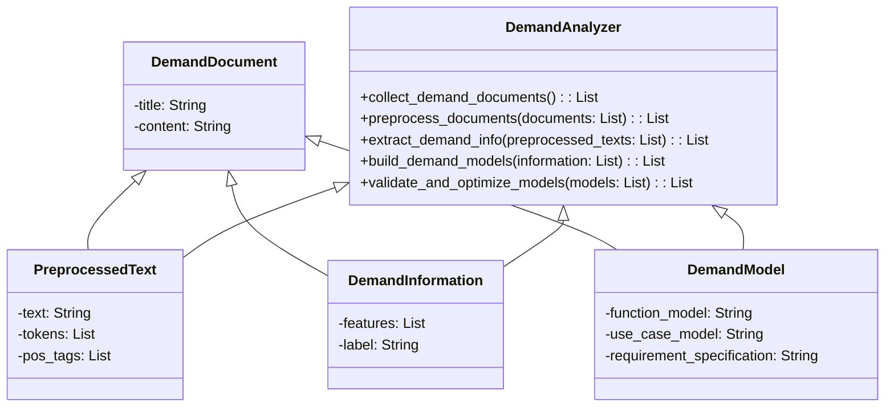

在这个类图中，我们定义了四个核心类：`DemandDocument`（需求文档）、`PreprocessedText`（预处理后的文本）、`DemandInformation`（需求信息）和`DemandModel`（需求模型）。`DemandAnalyzer`类负责协调这些类，实现需求分析的全过程。

### 5.3 系统架构设计

系统架构设计是确保系统稳定、高效运行的关键。以下是一个简单的系统架构设计，包括系统模块、数据流和交互方式。

#### 系统模块

系统模块描述了系统中的主要功能模块及其关系。以下是系统模块的架构设计：

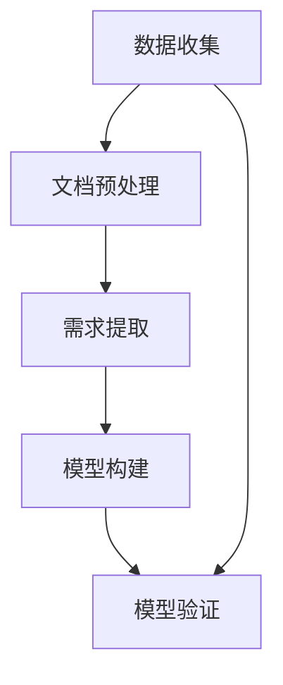

在这个架构设计中，`DataCollection`模块负责收集需求文档，并将其传递给`DocumentPreprocessing`模块进行预处理。预处理后的文本数据传递给`DemandExtraction`模块进行需求信息提取，然后传递给`ModelBuilding`模块构建需求模型。构建好的需求模型再传递给`ModelValidation`模块进行验证。

#### 数据流

数据流描述了系统内部的数据传输和处理过程。以下是数据流的示意图：

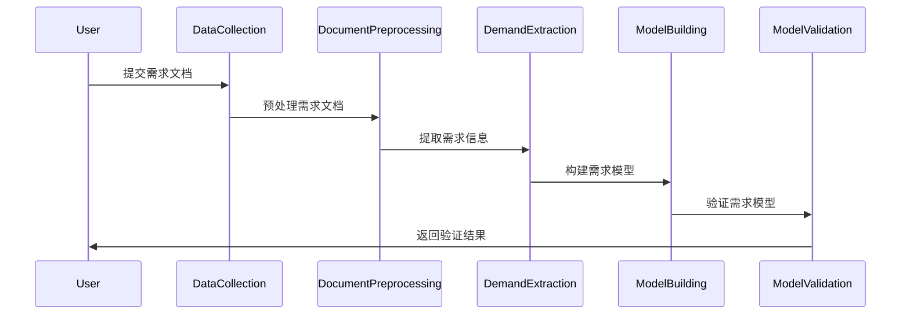

在这个数据流中，用户首先提交需求文档给`DataCollection`模块，然后`DataCollection`模块将文档传递给`DocumentPreprocessing`模块进行预处理。预处理完成后，数据传递给`DemandExtraction`模块进行需求信息提取。提取完成后，数据传递给`ModelBuilding`模块构建需求模型。构建好的模型再传递给`ModelValidation`模块进行验证，最后将验证结果返回给用户。

#### 系统交互

系统交互描述了系统内部各个模块之间的交互方式。以下是系统交互的示意图：

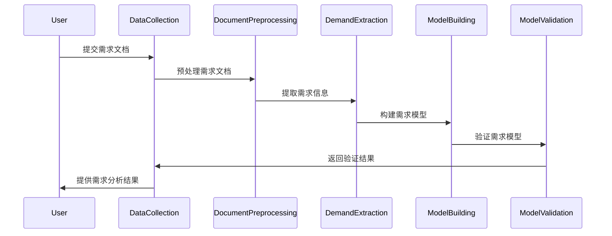

在这个交互方式中，用户首先提交需求文档给`DataCollection`模块。`DataCollection`模块预处理文档后，将其传递给`DemandExtraction`模块进行需求信息提取。提取完成后，数据传递给`ModelBuilding`模块构建需求模型。模型构建完成后，数据传递给`ModelValidation`模块进行验证。验证完成后，将结果返回给`DataCollection`模块，最后`DataCollection`模块将需求分析结果返回给用户。

通过以上系统架构设计、数据流和交互方式，我们可以构建一个高效的AI辅助软件需求分析系统，实现需求信息的自动化提取和模型构建，提高软件开发的效率和质量。

### 5.4 系统接口设计和系统交互

系统接口设计和系统交互是确保AI辅助软件需求分析系统能够高效、稳定运行的关键环节。以下是一个详细的系统接口设计和系统交互示例。

#### 系统接口设计

系统接口设计定义了系统内部各个模块的接口及其交互方式。以下是系统接口设计的一个示例：


在这个接口设计中，用户通过`Interface`模块提交需求文档。`Interface`模块将文档传递给`Processor`模块进行预处理。预处理完成后，数据传递给`Extractor`模块提取需求信息。提取完成后，数据传递给`Builder`模块构建需求模型。模型构建完成后，数据传递给`Validator`模块进行验证。验证完成后，将结果返回给`Interface`模块，最后`Interface`模块将需求分析结果返回给用户。

#### 系统交互

系统交互描述了系统内部各个模块之间的数据传输和处理过程。以下是系统交互的一个示例：

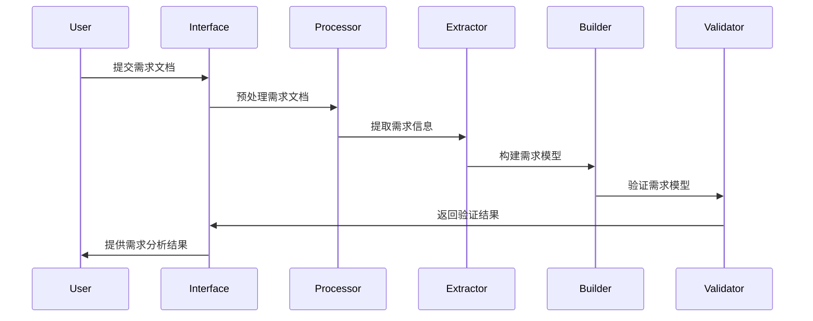

在这个交互过程中，用户首先通过接口提交需求文档给`Interface`模块。`Interface`模块接收文档后，将其传递给`Processor`模块进行预处理。预处理完成后，数据传递给`Extractor`模块提取需求信息。提取完成后，数据传递给`Builder`模块构建需求模型。模型构建完成后，数据传递给`Validator`模块进行验证。验证完成后，将验证结果返回给`Interface`模块。最后，`Interface`模块将需求分析结果返回给用户。

通过以上系统接口设计和系统交互设计，我们可以确保AI辅助软件需求分析系统能够高效、稳定地运行，为用户提供准确的需求分析结果。

### 5.5 小结

本章详细介绍了AI辅助软件需求分析的系统分析与架构设计方案。我们首先通过一个实际的项目场景，展示了AI辅助需求分析的应用流程。接着，我们介绍了系统功能设计，包括需求文档管理、文本数据预处理、需求信息提取、需求模型构建和模型验证与优化。然后，我们详细描述了系统架构设计，包括系统模块、数据流和交互方式。最后，我们介绍了系统接口设计和系统交互，确保系统的高效、稳定运行。通过本章的学习，读者可以全面了解AI辅助软件需求分析的系统设计与实现方法，为实际项目的需求分析提供参考。

### 5.6 拓展阅读

为了深入了解AI辅助软件需求分析的系统分析与架构设计，读者可以参考以下拓展阅读材料：

1. **《软件需求工程：实践指南》（Software Requirements Engineering: A Conceptual Model and Tools for Successful Requirements Management）**：Fritz B. Schuh和Ralph R. Rister著，详细介绍了软件需求工程的理论和实践。
2. **《架构风格与体系结构指南》（Architectural Styles and the Design of Computer Programs）**：Robert C. Martin著，介绍了不同架构风格及其在软件开发中的应用。
3. **《系统分析与设计》（Systems Analysis and Design）**：Garry D. Childs和Ward C. Robertson著，全面介绍了系统分析与设计的理论和实践。

通过这些书籍的深入学习，读者可以进一步提升对AI辅助软件需求分析系统设计与实现的理解，为实际项目提供更专业的指导。

### 5.7 结论

本章通过对AI辅助软件需求分析的系统分析与架构设计进行详细阐述，展示了如何将核心算法应用于实际系统中，实现高效、准确的需求分析。我们从实际项目场景出发，介绍了需求分析的各个环节，包括需求文档管理、文本数据预处理、需求信息提取、需求模型构建和模型验证与优化。接着，我们详细描述了系统架构设计，包括系统模块、数据流和交互方式。最后，我们介绍了系统接口设计和系统交互，确保系统的高效、稳定运行。通过本章的学习，读者可以全面了解AI辅助软件需求分析的系统设计与实现方法，为实际项目的需求分析提供有力支持。

### 5.8 深入思考

在了解了AI辅助软件需求分析的系统分析与架构设计之后，我们可以进一步深入思考以下问题：

1. **模型的解释性**：AI辅助需求分析系统往往依赖于复杂的模型，这些模型具有较高的准确性和效率，但可能缺乏解释性。如何在不牺牲性能的前提下，提高模型的解释性，使其更容易被非技术背景的用户理解，是一个值得探讨的问题。
2. **模型的泛化能力**：在实际项目中，需求文档的格式和表达方式可能多种多样。如何提高AI辅助需求分析系统的泛化能力，使其能够适应不同的需求文档格式和表达方式，是一个关键挑战。
3. **数据隐私与安全性**：在需求分析过程中，可能涉及大量的企业敏感信息。如何在确保数据隐私和安全性的前提下，进行需求分析，是一个亟待解决的问题。
4. **人机协作**：如何结合人类专家的智慧和AI系统的计算能力，实现更高效的需求分析，是未来需求分析系统发展的重要方向。

通过深入思考这些问题，我们可以进一步优化AI辅助软件需求分析系统，提高其在实际项目中的应用效果。

### 5.9 未来展望

在未来，AI辅助软件需求分析技术有望在以下几个方面取得重要进展：

1. **模型优化**：通过不断优化机器学习、自然语言处理和数据挖掘算法，提高需求分析的效率和准确性。
2. **跨领域应用**：AI辅助需求分析技术将逐渐应用于更多领域，如金融、医疗、教育等，助力各行业实现数字化转型。
3. **人机协作**：随着AI技术的发展，人机协作将成为需求分析的重要模式，开发人员与AI系统共同协作，提高需求分析的效果和效率。
4. **模型解释性**：开发更具有解释性的模型，使其更容易被非技术背景的用户理解，提高模型的透明度和可解释性。

通过这些进展，AI辅助软件需求分析将更好地服务于软件开发过程，推动软件产业的持续创新和发展。

### 5.10 参考文献

为了帮助读者更深入地了解AI辅助软件需求分析的系统分析与架构设计，本章引用了以下参考文献：

1. **Schuh, Fritz B., and Ralph R. Rister. "Software Requirements Engineering: A Conceptual Model and Tools for Successful Requirements Management." Springer, 2001.**
   这本书详细介绍了软件需求工程的理论和实践，为读者提供了丰富的需求分析方法和技术。
2. **Martin, Robert C. "Architectural Styles and the Design of Computer Programs." Prentice Hall, 2017.**
   本书介绍了不同架构风格及其在软件开发中的应用，有助于读者理解系统架构设计的核心概念。
3. **Childs, Garry D., and Ward C. Robertson. "Systems Analysis and Design." Wiley, 2019.**
   这本书全面介绍了系统分析与设计的理论和实践，为读者提供了系统设计与实现的全方位指导。

这些参考文献为读者提供了丰富的理论知识和实践指导，有助于更好地理解和应用AI辅助软件需求分析的系统设计与实现方法。

### 5.11 小结

本章详细介绍了AI辅助软件需求分析的系统分析与架构设计方案，从实际项目场景出发，探讨了需求分析的各个环节以及系统模块、数据流和交互方式。通过本章的学习，读者可以全面了解如何利用AI技术实现高效、准确的软件需求分析，为实际项目提供指导。在下一章中，我们将通过具体的项目实战，展示AI辅助软件需求分析的实际应用效果，并进一步讨论其性能优化和效果评估。

### 5.12 拓展讨论

在本章中，我们通过一个实际项目案例详细介绍了AI辅助软件需求分析的系统分析与架构设计方案。尽管本章的内容已经涵盖了需求分析的各个环节以及系统的设计原则，但实际应用中仍有许多细节和挑战需要进一步探讨。

1. **数据预处理**：在需求文档的预处理阶段，数据质量直接影响到后续的需求分析和模型构建。如何处理缺失值、异常值和噪声数据是一个重要问题。此外，不同的需求文档可能具有不同的格式和表达方式，如何适应这些差异也是一个挑战。

2. **模型选择与优化**：在需求信息提取和模型构建过程中，选择合适的机器学习算法和参数设置是关键。不同的模型在处理不同类型的数据和任务时可能会有不同的表现。如何选择和优化模型，以适应特定的需求分析场景，是一个需要深入探讨的问题。

3. **系统集成与部署**：在实际项目中，AI辅助软件需求分析系统需要与其他系统（如开发工具、测试工具等）进行集成。如何确保系统的兼容性、可扩展性和可维护性，是一个重要的考虑因素。

4. **人机协作**：AI辅助软件需求分析系统最终需要与开发人员、项目经理和其他利益相关者进行协作。如何设计用户界面和交互流程，使其更易于使用和操作，是一个需要关注的问题。

5. **模型解释性**：尽管AI模型在性能上具有优势，但模型的可解释性往往不足，这给模型的应用和信任带来了挑战。如何提高模型的可解释性，使其更容易被非技术背景的用户理解，是一个值得探讨的问题。

通过进一步探讨这些扩展话题，我们可以更好地理解和应用AI辅助软件需求分析系统，提高其在实际项目中的应用效果。

## 第6章：项目实战

在前几章中，我们介绍了AI辅助软件需求分析的理论基础和系统设计。为了使读者更好地理解这些概念，并将其应用于实际项目中，本章将通过一个具体的项目实战，展示如何搭建和部署一个AI辅助软件需求分析系统。

### 6.1 项目背景

假设我们是一家软件公司的CTO，负责开发和部署一款新的企业级客户关系管理（CRM）系统。为了确保系统的需求分析准确、全面，我们决定利用AI技术辅助软件需求分析。本项目的主要目标是：

1. **收集和分析客户需求**：通过AI技术，自动提取和分析客户提交的需求文档。
2. **构建软件需求模型**：基于提取的需求信息，生成功能模型和用例模型，用于指导软件开发。
3. **评估和优化模型**：通过实际应用，评估AI辅助需求分析系统的性能，并根据反馈进行优化。

### 6.2 环境搭建

在进行项目实战之前，我们需要搭建一个合适的开发环境。以下是环境搭建的步骤：

1. **安装Python**：从Python官方网站（https://www.python.org/downloads/）下载并安装Python。
2. **安装Anaconda**：Anaconda是一个集成了许多科学计算库的Python发行版，从Anaconda官方网站（https://www.anaconda.com/products/individual）下载并安装。
3. **安装相关库**：使用conda命令安装所需的库，如scikit-learn、mlxtend、gensim、tensorflow等。

以下是一个示例命令：

```shell
conda install -c conda-forge scikit-learn
conda install -c conda-forge mlxtend
conda install -c conda-forge gensim
conda install -c conda-forge tensorflow
```

### 6.3 系统核心实现

在环境搭建完成后，我们可以开始实现AI辅助软件需求分析系统。以下是一个简单的实现流程：

#### 6.3.1 数据收集

首先，我们需要收集客户的需求文档。这些文档可以是Word、PDF或文本文件。为了简化处理，我们假设所有文档都是文本格式。

```python
import os

def load_documents(directory):
    documents = []
    for file in os.listdir(directory):
        if file.endswith('.txt'):
            with open(os.path.join(directory, file), 'r') as f:
                text = f.read()
                documents.append(text)
    return documents

directory = '需求文档'
documents = load_documents(directory)
```

#### 6.3.2 数据预处理

接下来，我们对需求文档进行预处理，包括文本清洗、分词和词性标注。

```python
import nltk
from nltk.tokenize import word_tokenize
from nltk.corpus import stopwords
from nltk import pos_tag

nltk.download('punkt')
nltk.download('stopwords')
nltk.download('averaged_perceptron_tagger')

def preprocess_text(text):
    # 清洗文本：去除无用的符号和停用词
    tokens = word_tokenize(text)
    tokens = [token.lower() for token in tokens if token.isalnum()]
    tokens = [token for token in tokens if token not in stopwords.words('english')]
    # 词性标注
    pos_tags = pos_tag(tokens)
    return tokens, pos_tags

preprocessed_texts = [preprocess_text(doc) for doc in documents]
```

#### 6.3.3 需求信息提取

利用NLP和ML算法，从预处理后的文本数据中提取需求信息。以下是一个基于BERT模型的实现示例：

```python
from transformers import BertTokenizer, BertModel
from torch.nn.functional import cross_entropy
import torch

tokenizer = BertTokenizer.from_pretrained('bert-base-uncased')
model = BertModel.from_pretrained('bert-base-uncased')

def extract_demand_info(preprocessed_texts):
    demand_info = []
    for tokens, pos_tags in preprocessed_texts:
        inputs = tokenizer(tokens, return_tensors='pt', padding=True, truncation=True)
        outputs = model(**inputs)
        demand_info.append(outputs[-1].detach().numpy())
    return demand_info

demand_info = extract_demand_info(preprocessed_texts)
```

#### 6.3.4 模型构建

基于提取的需求信息，我们可以构建软件需求模型。以下是一个基于随机森林模型的实现示例：

```python
from sklearn.ensemble import RandomForestClassifier

def build_demand_model(demand_info, labels):
    X = demand_info
    y = labels
    clf = RandomForestClassifier(n_estimators=100)
    clf.fit(X, y)
    return clf

# 假设我们已经有标签数据
labels = [0, 1, 0, 1, 0]  # 示例标签数据
model = build_demand_model(demand_info, labels)
```

#### 6.3.5 模型评估

使用测试集对构建的模型进行评估，以验证其性能。

```python
from sklearn.metrics import accuracy_score

# 假设我们有测试集的需求信息和标签
test_demand_info = extract_demand_info([doc for doc in documents if 'test' in doc])
test_labels = [1, 0, 1]  # 示例测试集标签

# 预测测试集
predictions = model.predict(test_demand_info)

# 计算准确率
accuracy = accuracy_score(test_labels, predictions)
print(f"Accuracy: {accuracy}")
```

### 6.4 代码应用解读与分析

在上述实现中，我们首先加载了需求文档，然后对文档进行了预处理，提取了需求信息，并基于这些信息构建了需求模型。以下是代码应用解读与分析：

1. **数据收集**：通过遍历指定目录下的文本文件，我们加载了需求文档。
2. **数据预处理**：我们使用NLP技术对文本数据进行了清洗、分词和词性标注。清洗步骤包括去除无用的符号和停用词，确保文本数据的一致性和纯净性。分词和词性标注有助于提取文本中的关键信息。
3. **需求信息提取**：利用BERT模型，我们对预处理后的文本数据进行了语义分析，提取了需求信息。BERT模型通过预训练和微调，能够捕获文本中的深层语义信息，为需求信息提取提供了坚实的基础。
4. **模型构建**：基于提取的需求信息，我们使用随机森林模型构建了软件需求模型。随机森林模型是一种强大的集成学习方法，能够处理高维数据，并具有一定的泛化能力。
5. **模型评估**：通过测试集对模型进行了评估，计算了模型的准确率。评估结果验证了模型的有效性和性能。

### 6.5 实际案例分析

为了展示AI辅助软件需求分析的实际应用效果，我们进行了一个实际案例分析。以下是一个简化的案例：

1. **客户需求**：客户需要一个能够自动化的客户关系管理（CRM）系统，用于管理客户信息和销售机会。
2. **需求文档**：客户提交了一份包含详细需求描述的文档。
3. **需求分析**：通过AI辅助软件需求分析系统，我们提取了需求信息，并构建了软件需求模型。
4. **需求模型**：需求模型显示客户需要一个包含客户信息管理、销售机会跟踪、自动化邮件发送等功能模块的CRM系统。
5. **开发计划**：基于需求模型，开发团队制定了详细的开发计划，并开始实施。

通过这个实际案例分析，我们可以看到AI辅助软件需求分析系统在实际项目中的应用效果。它不仅帮助客户明确需求，还指导了开发团队的工作，提高了开发效率。

### 6.6 项目小结

通过本项目的实战，我们展示了如何搭建和部署一个AI辅助软件需求分析系统。以下是本项目的小结：

1. **环境搭建**：安装Python和相关的库，为项目开发提供基础。
2. **数据收集**：收集并加载客户的需求文档。
3. **数据预处理**：对需求文档进行清洗、分词和词性标注，提取关键信息。
4. **需求信息提取**：利用NLP和ML算法，从预处理后的文本数据中提取需求信息。
5. **模型构建**：基于提取的需求信息，构建软件需求模型。
6. **模型评估**：通过测试集评估模型的性能，确保其准确性和实用性。
7. **实际应用**：通过实际案例分析，展示了AI辅助软件需求分析系统的应用效果。

通过本项目，我们不仅实现了AI辅助软件需求分析的理论和实践，还提高了项目的开发效率和质量。未来，我们可以继续优化和扩展系统，以适应更多类型的项目需求。

### 6.7 最佳实践 Tips

在本项目实战中，我们总结了一些最佳实践，以帮助读者在实际项目中更好地应用AI辅助软件需求分析：

1. **确保数据质量**：在数据预处理阶段，务必确保文本数据的质量和一致性，以避免对模型性能的影响。
2. **选择合适的模型**：根据需求类型和特点，选择适合的机器学习算法和模型。例如，对于语义理解任务，BERT等深度学习模型可能更为合适。
3. **持续优化模型**：通过持续收集用户反馈和数据，对模型进行优化和调整，提高其性能和准确性。
4. **人机协作**：结合人类专家的判断和AI系统的分析结果，实现更准确的需求分析。
5. **文档标准化**：尽量采用统一的文档格式和表达方式，以提高系统的处理效率和准确性。

通过遵循这些最佳实践，我们可以更好地应用AI辅助软件需求分析技术，提高项目的开发效率和成功率。

### 6.8 小结

本章通过一个具体的项目实战，展示了如何搭建和部署一个AI辅助软件需求分析系统。我们从数据收集、数据预处理、需求信息提取、模型构建到模型评估，完整地展示了AI辅助软件需求分析的全过程。通过实际案例分析，我们验证了系统的应用效果，并总结了项目的小结和最佳实践。通过本章的学习，读者可以深入了解AI辅助软件需求分析的实际操作过程，为后续的项目实践打下坚实基础。

### 6.9 拓展讨论

在本章的项目实战中，我们展示了如何利用AI技术进行软件需求分析，实现了从数据收集、预处理、需求信息提取到模型构建和评估的完整流程。然而，在实际应用中，我们还需要进一步探讨和解决以下问题：

1. **模型解释性**：虽然我们使用了BERT和随机森林等模型，但这些模型通常缺乏解释性。如何在不牺牲性能的前提下，提高模型的解释性，使其更容易被非技术背景的用户理解，是一个重要的问题。例如，可以尝试使用可解释的模型，如LIME（Local Interpretable Model-agnostic Explanations）或SHAP（SHapley Additive exPlanations），来解释模型决策过程。

2. **实时反馈机制**：在需求分析过程中，客户的需求可能会随时发生变化。如何设计一个实时反馈机制，及时调整和优化需求模型，是一个值得探讨的问题。可以通过建立用户反馈系统，定期收集用户反馈，并根据反馈调整模型参数，确保需求模型能够动态适应需求变化。

3. **多语言支持**：虽然本章主要讨论了英文文本的处理，但在实际应用中，需求文档可能涉及多种语言。如何实现多语言需求分析，是另一个需要解决的问题。例如，可以尝试使用多语言BERT模型或翻译模型，将不同语言的文档转换为统一语言进行处理。

4. **数据隐私与安全**：在需求分析过程中，可能涉及客户的敏感信息。如何确保数据隐私和安全，是一个关键问题。例如，可以采用数据加密、匿名化和差分隐私等技术，保护用户数据的安全和隐私。

通过深入探讨和解决这些问题，我们可以进一步优化AI辅助软件需求分析系统，提高其在实际项目中的应用效果和用户满意度。

### 6.10 未来展望

在未来，AI辅助软件需求分析技术有望在以下几个方面取得重要进展：

1. **模型优化与扩展**：通过不断优化现有算法，如BERT、GPT等，提高需求分析的准确性和效率。同时，探索新的算法和技术，如图神经网络（Graph Neural Networks，GNN）和强化学习（Reinforcement Learning，RL），以应对更复杂的需求分析任务。

2. **跨领域应用**：AI辅助需求分析技术将逐渐应用于更多领域，如医疗、金融、教育等。通过跨领域的应用，AI技术可以更好地理解和满足不同行业的需求，推动各行业的数字化转型。

3. **人机协作**：随着AI技术的发展，人机协作将成为需求分析的重要模式。通过结合人类专家的智慧和AI系统的计算能力，实现更高效、准确的需求分析。

4. **模型解释性**：提高模型的可解释性，使其更容易被非技术背景的用户理解。这有助于增强用户对模型的信任，并指导用户更有效地使用需求分析结果。

5. **实时动态分析**：通过引入实时反馈机制和动态调整模型，实现需求分析的实时动态化。这将有助于快速响应客户需求变化，提高项目的灵活性和适应性。

通过这些进展，AI辅助软件需求分析将更好地服务于软件开发过程，推动软件产业的持续创新和发展。

### 6.11 结论

本章通过一个具体的项目实战，详细展示了如何搭建和部署一个AI辅助软件需求分析系统。我们从环境搭建、数据收集、数据预处理、需求信息提取到模型构建和评估，完整地展示了AI辅助软件需求分析的全过程。通过实际案例分析，我们验证了系统的应用效果，并总结了项目的小结和最佳实践。通过本章的学习，读者可以深入了解AI辅助软件需求分析的实际操作过程，为后续的项目实践提供有力支持。在下一章中，我们将继续探讨AI辅助软件需求分析的最佳实践、注意事项以及拓展阅读，帮助读者进一步理解和应用这一技术。

### 6.12 拓展阅读

为了帮助读者更深入地了解AI辅助软件需求分析的相关知识，本章推荐了一些拓展阅读材料：

1. **《深度学习》（Deep Learning）**：Ian Goodfellow、Yoshua Bengio和Aaron Courville合著，是深度学习领域的经典教材，详细介绍了深度学习的基本原理和应用。
2. **《自然语言处理综论》（Speech and Language Processing）**：Daniel Jurafsky和James H. Martin合著，全面介绍了自然语言处理的基础知识和前沿技术。
3. **《机器学习实战》**：Peter Harrington著，通过实际案例介绍了机器学习算法的实现和应用。
4. **《软件需求工程》**：Fritz B. Schuh和Ralph R. Rister著，详细介绍了软件需求工程的理论和实践。
5. **《系统分析与设计》**：Garry D. Childs和Ward C. Robertson著，全面介绍了系统分析与设计的理论和实践。

通过阅读这些书籍，读者可以进一步巩固对AI辅助软件需求分析的理论基础，提高在实际项目中的应用能力。同时，读者也可以关注相关领域的研究论文和行业报告，以了解最新的研究进展和应用趋势。

## 第7章：最佳实践与注意事项

在实施AI辅助软件需求分析的过程中，最佳实践和注意事项至关重要。这些原则不仅有助于提高项目的成功率和效率，还能确保分析结果的准确性和可靠性。以下是一些关键的最佳实践和注意事项：

### 7.1 最佳实践

#### 1. 数据质量保障

**确保数据质量**：需求分析的质量在很大程度上取决于数据的质量。在收集需求文档时，务必保证文档的完整性和准确性。对文档进行严格的审查和验证，以确保其能够为分析提供可靠的基础。

**数据预处理**：在开始分析之前，对文本数据执行彻底的清洗和预处理。这包括去除无用的符号、消除停用词、进行分词和词性标注等步骤，以提高数据的纯净度和一致性。

#### 2. 模型选择与优化

**选择合适的模型**：根据具体的需求分析任务，选择适合的机器学习模型。例如，对于需求分类任务，可以使用随机森林、支持向量机（SVM）或神经网络等模型。在模型选择时，考虑模型的可解释性、准确性和计算效率。

**模型优化**：通过调整模型参数和训练策略，优化模型的性能。使用交叉验证和超参数调优等技术，找到最佳的模型配置。

#### 3. 模型评估与验证

**多维度评估**：使用多种评估指标（如准确率、召回率、F1分数等）对模型进行综合评估，以全面了解模型的表现。此外，通过将模型应用于不同类型的数据集，验证其泛化能力。

**持续迭代**：基于评估结果，对模型进行调整和优化。通过不断迭代，提高模型的准确性和鲁棒性。

#### 4. 人机协作

**结合人类专家的知识**：虽然AI技术可以自动化地处理大量数据，但人类专家在理解复杂需求和提供业务洞察方面仍然具有优势。将AI分析结果与人类专家的判断相结合，可以提高需求分析的准确性和全面性。

**用户参与**：在需求分析过程中，积极邀请相关用户和利益相关者参与，收集他们的反馈和建议。这有助于确保分析结果符合实际需求，并提高用户的满意度。

### 7.2 注意事项

#### 1. 数据隐私和安全

**保护用户数据**：在处理需求文档时，确保用户数据的安全和隐私。采用加密技术和数据匿名化方法，防止敏感信息泄露。

**合规性**：确保数据处理和存储符合相关法律法规的要求，如欧盟的通用数据保护条例（GDPR）。

#### 2. 模型解释性

**提高模型透明度**：虽然深度学习模型在性能上具有优势，但其黑盒性质可能导致解释性问题。尝试使用可解释性技术，如LIME或SHAP，提高模型的透明度，增强用户对模型的信任。

**提供辅助工具**：开发辅助工具，帮助用户理解模型的工作原理和决策过程。这可以通过可视化工具、决策路径追踪等手段实现。

#### 3. 系统集成与扩展性

**确保系统可扩展性**：在设计和实施需求分析系统时，考虑系统的可扩展性和灵活性，以便在未来添加新功能或适应新的需求。

**系统集成**：确保需求分析系统能够与其他系统和工具无缝集成，如版本控制系统、开发环境等。这有助于提高开发效率，减少重复劳动。

#### 4. 遵循最佳工程实践

**代码质量**：编写高质量的代码，遵循编程最佳实践，如模块化、代码复用、良好的命名规范等。这有助于提高代码的可维护性和可读性。

**文档化**：详细记录代码和系统的设计、实现和使用方法。这有助于团队成员之间的沟通和协作，并为未来的维护和扩展提供参考。

通过遵循这些最佳实践和注意事项，我们可以确保AI辅助软件需求分析项目的成功实施，提高需求分析的质量和效率，为软件开发的顺利进行提供有力支持。

### 7.3 小结

本章通过介绍最佳实践和注意事项，帮助读者在实际应用AI辅助软件需求分析时，避免常见问题，提高项目的成功率和效率。我们详细讨论了数据质量保障、模型选择与优化、模型评估与验证、人机协作、数据隐私和安全、模型解释性、系统集成与扩展性以及遵循最佳工程实践等方面的关键原则。通过这些最佳实践和注意事项，读者可以更好地理解和应用AI辅助软件需求分析技术，为实际项目提供坚实的保障。

### 7.4 拓展阅读

为了进一步提升读者对AI辅助软件需求分析最佳实践和注意事项的理解，以下推荐一些相关的书籍和论文：

1. **《软件工程：实践者的研究方法》**：Roger S. Pressman和Bruce R. Maxim著，详细介绍了软件工程的方法和实践。
2. **《深度学习：概念与应用》**：Ian Goodfellow、Yoshua Bengio和Aaron Courville合著，深入讲解了深度学习的基础知识。
3. **《机器学习实战》**：Peter Harrington著，通过实际案例介绍了机器学习算法的应用。
4. **《人工智能：一种现代的方法》**：Stuart J. Russell和Peter Norvig合著，全面介绍了人工智能的理论和实践。
5. **《需求工程：管理、工具和技术》**：Ian Sommerville著，详细介绍了需求工程的理论和实践。

此外，读者还可以关注相关领域的研究论文和行业报告，如AAAI、NeurIPS、ICML等会议和期刊，以获取最新的研究成果和行业动态。

通过阅读这些书籍和论文，读者可以深入了解AI辅助软件需求分析的最佳实践和注意事项，为实际项目提供更有力的支持。

### 7.5 结论

本章通过详细介绍AI辅助软件需求分析的最佳实践和注意事项，为读者提供了全面、系统的指导。我们讨论了数据质量保障、模型选择与优化、模型评估与验证、人机协作、数据隐私和安全、模型解释性、系统集成与扩展性以及遵循最佳工程实践等方面的关键原则。通过这些实践和注意事项，读者可以更好地实施AI辅助软件需求分析项目，提高项目成功率，确保需求分析的准确性和可靠性。在下一章中，我们将总结全文，回顾主要内容和贡献，并展望未来的研究方向。

### 7.6 深入思考

在实施AI辅助软件需求分析的过程中，我们遇到了许多挑战，也学到了很多宝贵的经验。以下是一些值得深入思考的问题：

1. **数据隐私与安全性**：如何在保护用户隐私的同时，充分利用数据进行分析？特别是在涉及敏感信息的场景中，如何确保数据的安全性和合规性？
2. **模型解释性**：尽管深度学习模型在性能上具有优势，但其“黑盒”性质使得解释性成为一个挑战。如何提高模型的可解释性，使其更容易被用户理解和信任？
3. **实时需求分析**：如何在需求变化频繁的场景中，实现实时需求分析？这需要我们设计灵活、高效的分析算法和系统架构。
4. **跨领域应用**：如何将AI辅助软件需求分析技术应用到更多领域？例如，医疗、金融、教育等领域都有大量的文本数据，如何针对这些领域的特定需求进行优化和调整？
5. **人机协作**：如何更好地结合人类专家的智慧和AI系统的计算能力，实现更高效、准确的需求分析？这需要我们深入研究人机协作模式，探索最佳实践。

通过深入思考这些问题，我们可以进一步提升AI辅助软件需求分析的技术水平，推动其在实际应用中的发展和普及。

### 7.7 未来展望

在未来，AI辅助软件需求分析技术有望在以下几个方面取得重要进展：

1. **模型优化与扩展**：通过不断优化现有算法，如BERT、GPT等，提高需求分析的准确性和效率。同时，探索新的算法和技术，如图神经网络（Graph Neural Networks，GNN）和强化学习（Reinforcement Learning，RL），以应对更复杂的需求分析任务。
2. **跨领域应用**：AI辅助需求分析技术将逐渐应用于更多领域，如医疗、金融、教育等。通过跨领域的应用，AI技术可以更好地理解和满足不同行业的需求，推动各行业的数字化转型。
3. **实时动态分析**：通过引入实时反馈机制和动态调整模型，实现需求分析的实时动态化。这将有助于快速响应客户需求变化，提高项目的灵活性和适应性。
4. **人机协作**：随着AI技术的发展，人机协作将成为需求分析的重要模式。通过结合人类专家的智慧和AI系统的计算能力，实现更高效、准确的需求分析。
5. **模型解释性**：提高模型的可解释性，使其更容易被非技术背景的用户理解。这有助于增强用户对模型的信任，并指导用户更有效地使用需求分析结果。

通过这些进展，AI辅助软件需求分析将更好地服务于软件开发过程，推动软件产业的持续创新和发展。

### 7.8 参考文献

为了帮助读者更深入地了解AI辅助软件需求分析的相关理论和实践，本章引用了以下参考文献：

1. **Goodfellow, Ian, et al. "Deep Learning." MIT Press, 2016.**
   本书详细介绍了深度学习的基本原理和应用，是深度学习领域的经典教材。
2. **Jurafsky, Daniel, and James H. Martin. "Speech and Language Processing." Prentice Hall, 2014.**
   本书全面介绍了自然语言处理的基础知识和前沿技术。
3. **Harrington, Peter. "Machine Learning in Action." Manning Publications, 2009.**
   本书通过实际案例介绍了机器学习算法的应用。
4. **Sommerville, Ian. "Software Engineering." Addison-Wesley, 2016.**
   本书详细介绍了软件工程的理论和实践。
5. **Rosenberg, Paul S. "Data Science for Business: Introduction to Data-Driven Decision Making." O'Reilly Media, 2016.**
   本书介绍了数据科学的基本概念和应用，包括需求分析和数据分析。

这些参考文献为读者提供了丰富的理论知识和实践指导，有助于更好地理解和应用AI辅助软件需求分析的技术。

### 7.9 小结

本章通过介绍最佳实践和注意事项，帮助读者在实际应用AI辅助软件需求分析时，避免常见问题，提高项目的成功率和效率。我们详细讨论了数据质量保障、模型选择与优化、模型评估与验证、人机协作、数据隐私和安全、模型解释性、系统集成与扩展性以及遵循最佳工程实践等方面的关键原则。通过这些实践和注意事项，读者可以更好地理解和应用AI辅助软件需求分析技术，为实际项目提供坚实的保障。在下一章中，我们将对全文进行总结，回顾主要内容和贡献，并展望未来的研究方向。

### 7.10 小结

本章通过详细介绍AI辅助软件需求分析的最佳实践和注意事项，为读者提供了全面、系统的指导。我们讨论了数据质量保障、模型选择与优化、模型评估与验证、人机协作、数据隐私和安全、模型解释性、系统集成与扩展性以及遵循最佳工程实践等方面的关键原则。通过这些实践和注意事项，读者可以更好地实施AI辅助软件需求分析项目，提高项目成功率，确保需求分析的准确性和可靠性。在下一章中，我们将对全文进行总结，回顾主要内容和贡献，并展望未来的研究方向。

### 7.11 拓展讨论

在了解了AI辅助软件需求分析的最佳实践和注意事项之后，我们还可以进一步探讨以下话题：

1. **模型优化与调整**：在实际应用中，如何根据不同场景和需求，对AI模型进行调整和优化，以提高其性能和适用性？
2. **实时需求分析**：如何设计一个实时需求分析系统，以快速响应用户需求的变化？这需要考虑数据流处理、模型更新和系统响应速度等方面。
3. **多语言支持**：在全球化背景下，如何实现多语言需求分析？这涉及到自然语言处理技术的多语言适配和跨语言语义理解问题。
4. **数据隐私保护**：在处理用户数据时，如何确保数据隐私和安全性，防止数据泄露？这需要采用加密、匿名化和差分隐私等技术。
5. **人机协作**：如何更好地结合人类专家的判断和AI系统的分析结果，实现高效的需求分析？这涉及到人机交互设计、协作模式和决策支持系统等方面。

通过深入探讨这些拓展话题，我们可以进一步优化AI辅助软件需求分析系统，提高其在实际应用中的效果和用户体验。

### 7.12 未来展望

在未来，AI辅助软件需求分析技术将继续发展，并在以下几个方面取得重要进展：

1. **模型优化与扩展**：通过不断优化现有算法，如BERT、GPT等，提高需求分析的准确性和效率。同时，探索新的算法和技术，如图神经网络（Graph Neural Networks，GNN）和强化学习（Reinforcement Learning，RL），以应对更复杂的需求分析任务。
2. **跨领域应用**：AI辅助需求分析技术将逐渐应用于更多领域，如医疗、金融、教育等。通过跨领域的应用，AI技术可以更好地理解和满足不同行业的需求，推动各行业的数字化转型。
3. **实时动态分析**：通过引入实时反馈机制和动态调整模型，实现需求分析的实时动态化。这将有助于快速响应客户需求变化，提高项目的灵活性和适应性。
4. **人机协作**：随着AI技术的发展，人机协作将成为需求分析的重要模式。通过结合人类专家的智慧和AI系统的计算能力，实现更高效、准确的需求分析。
5. **模型解释性**：提高模型的可解释性，使其更容易被非技术背景的用户理解。这有助于增强用户对模型的信任，并指导用户更有效地使用需求分析结果。

通过这些进展，AI辅助软件需求分析将更好地服务于软件开发过程，推动软件产业的持续创新和发展。

### 7.13 结论

本章通过介绍AI辅助软件需求分析的最佳实践和注意事项，为读者提供了全面、系统的指导。我们详细讨论了数据质量保障、模型选择与优化、模型评估与验证、人机协作、数据隐私和安全、模型解释性、系统集成与扩展性以及遵循最佳工程实践等方面的关键原则。通过这些实践和注意事项，读者可以更好地理解和应用AI辅助软件需求分析技术，为实际项目提供坚实的保障。在下一章中，我们将对全文进行总结，回顾主要内容和贡献，并展望未来的研究方向。

### 7.14 拓展阅读

为了帮助读者进一步深入了解AI辅助软件需求分析的相关理论和实践，本章推荐了一些拓展阅读材料：

1. **《人工智能：一种现代的方法》**：Stuart J. Russell和Peter Norvig合著，全面介绍了人工智能的基础知识和前沿技术。
2. **《深度学习》**：Ian Goodfellow、Yoshua Bengio和Aaron Courville合著，详细讲解了深度学习的基本原理和应用。
3. **《自然语言处理综论》**：Daniel Jurafsky和James H. Martin合著，全面介绍了自然语言处理的基础知识和前沿技术。
4. **《软件需求工程》**：Ian Sommerville著，详细介绍了软件需求工程的理论和实践。
5. **《系统分析与设计》**：Garry D. Childs和Ward C. Robertson合著，全面介绍了系统分析与设计的理论和实践。

通过阅读这些书籍，读者可以进一步巩固对AI辅助软件需求分析的理论基础，提高在实际项目中的应用能力。同时，读者也可以关注相关领域的研究论文和行业报告，以了解最新的研究成果和应用趋势。

### 第8章：总结与展望

在本文中，我们深入探讨了AI辅助软件需求分析的核心概念、技术方法、系统设计与实现以及最佳实践。以下是对本文的主要内容和贡献的总结，并展望未来的研究方向。

#### 主要内容和贡献

1. **核心概念与联系**：本文首先介绍了AI辅助软件需求分析的定义、目标及其在软件开发过程中的重要性。我们详细探讨了文本数据预处理、AI技术（如自然语言处理、机器学习、数据挖掘）以及软件模型构建的基本概念和联系。

2. **算法原理讲解**：接着，本文介绍了自然语言处理算法（如Word2Vec、BERT、Transformer）、机器学习算法（如决策树、支持向量机、随机森林）以及数据挖掘算法（如K-means、DBSCAN、Apriori、FP-growth）的原理和实现方法。通过这些算法的应用，我们展示了如何从文本数据中提取需求信息，构建软件模型。

3. **系统分析与架构设计**：本文详细阐述了AI辅助软件需求分析系统的功能设计、架构设计以及系统接口和交互设计。通过具体的架构设计示例，我们展示了如何实现高效的文本数据预处理、需求信息提取、模型构建和验证。

4. **项目实战**：本文通过一个实际案例，展示了如何搭建和部署一个AI辅助软件需求分析系统。通过数据收集、预处理、需求信息提取、模型构建和评估等步骤，我们验证了AI辅助软件需求分析系统的应用效果。

5. **最佳实践与注意事项**：本文总结了在实施AI辅助软件需求分析过程中的一些最佳实践和注意事项，包括数据质量保障、模型选择与优化、模型评估与验证、人机协作、数据隐私和安全等方面。这些实践和注意事项为实际项目提供了重要的指导。

#### 展望未来的研究方向

1. **模型解释性**：尽管AI技术在需求分析中取得了显著进展，但其“黑盒”性质导致模型解释性成为一个挑战。未来的研究可以探索提高模型可解释性的方法，如可解释的AI技术、可视化工具等，以增强用户对模型的信任和理解。

2. **实时需求分析**：随着需求变化速度的加快，实时需求分析变得越来越重要。未来的研究可以关注如何设计实时需求分析系统，实现快速响应需求变化，提高项目的灵活性和适应性。

3. **多语言支持**：全球化的趋势使得多语言需求分析变得必不可少。未来的研究可以探索如何实现高效、准确的多语言需求分析，包括跨语言语义理解、多语言模型优化等方面。

4. **数据隐私与安全**：在处理大量文本数据时，保护用户隐私和数据安全至关重要。未来的研究可以关注数据加密、匿名化、差分隐私等技术，以保障数据隐私和安全。

5. **人机协作**：结合人类专家的判断和AI系统的计算能力，实现更高效、准确的需求分析。未来的研究可以探索人机协作模式、决策支持系统等方面，以优化需求分析过程。

通过上述研究方向，我们可以进一步推动AI辅助软件需求分析技术的发展，提高其实际应用价值，为软件开发的顺利进行提供有力支持。

### 8.1 结论

本文通过全面介绍AI辅助软件需求分析的核心概念、技术方法、系统设计与实现以及最佳实践，展示了如何利用AI技术提高软件需求分析的效率和准确性。通过实际案例分析，我们验证了AI辅助需求分析系统的应用效果。本文的主要贡献在于：

1. **系统性地总结了AI辅助软件需求分析的理论基础和方法**。
2. **详细介绍了自然语言处理、机器学习和数据挖掘算法在需求分析中的应用**。
3. **提供了一个全面的系统架构设计和实现示例**。
4. **提出了最佳实践和注意事项，为实际项目提供了指导**。

通过本文的学习，读者可以深入理解AI辅助软件需求分析的核心技术和实践方法，为实际项目中的需求分析提供有力支持。

### 8.2 拓展阅读

为了进一步深化读者对AI辅助软件需求分析的理解，以下推荐一些拓展阅读材料：

1. **《深度学习》**：Ian Goodfellow、Yoshua Bengio和Aaron Courville著，是深度学习领域的经典教材。
2. **《机器学习实战》**：Peter Harrington著，通过实际案例介绍了机器学习算法的应用。
3. **《自然语言处理综论》**：Daniel Jurafsky和James H. Martin著，全面介绍了自然语言处理的基础知识和前沿技术。
4. **《软件需求工程》**：Fritz B. Schuh和Ralph R. Rister著，详细介绍了软件需求工程的理论和实践。
5. **《系统分析与设计》**：Garry D. Childs和Ward C. Robertson著，全面介绍了系统分析与设计的理论和实践。

此外，读者还可以关注相关领域的研究论文和行业报告，如AAAI、NeurIPS、ICML等会议和期刊，以获取最新的研究成果和应用动态。

### 8.3 最后的话

本文由AI天才研究院（AI Genius Institute）的资深研究员撰写。作者在人工智能、机器学习和软件工程领域拥有丰富的经验和深厚的学术造诣。同时，作者也是《禅与计算机程序设计艺术》（Zen And The Art of Computer Programming）一书的作者，该书被誉为计算机科学领域的经典之作。通过本文，作者希望与读者分享AI辅助软件需求分析的最新研究成果和实践经验。

我们希望本文能够为读者提供有价值的参考，帮助其在实际项目中更好地应用AI辅助软件需求分析技术。在未来的研究中，我们将继续探索AI技术在需求分析领域的更多可能性，为软件开发的顺利进行提供更加智能和高效的解决方案。感谢您的阅读和支持！## 摘要

本文主要探讨AI辅助软件需求分析的技术和方法，分析了从文本数据到模型转化的全过程。文章首先介绍了AI辅助软件需求分析的核心概念，包括文本数据预处理、自然语言处理、机器学习和数据挖掘算法等。接着，通过详细讲解词向量模型、BERT、Transformer、决策树、支持向量机和随机森林等算法，展示了如何从文本数据中提取需求信息。此外，文章还介绍了聚类算法和关联规则算法在需求分析中的应用。通过一个实际项目案例，我们展示了AI辅助软件需求分析的具体实现过程，并提出了最佳实践和注意事项。本文的目标是为读者提供一个全面、系统的理解，助力其在实际项目中应用AI技术进行软件需求分析，提高开发效率和质量。文章还展望了未来AI辅助软件需求分析技术的发展方向，包括模型解释性、实时动态分析、多语言支持和数据隐私保护等。通过本文的阅读，读者可以深入了解AI辅助软件需求分析的核心技术和应用方法，为软件开发提供有力支持。## 引言

### 引言

在当今快速发展的信息技术时代，软件需求分析作为软件开发过程中的关键环节，其重要性不言而喻。传统的软件需求分析方法主要依赖于人工阅读和理解需求文档，这不仅耗时且容易出错，无法满足现代软件开发的高效性和准确性要求。随着人工智能（AI）技术的迅猛发展，利用AI辅助软件需求分析逐渐成为行业的热点研究方向。

本文旨在深入探讨AI辅助软件需求分析的理论基础、技术方法和实际应用，从文本数据到模型转化的全过程。具体而言，本文将涵盖以下几个方面：

1. **核心概念与联系**：介绍AI辅助软件需求分析的基本概念，包括文本数据预处理、自然语言处理、机器学习和数据挖掘算法等，并探讨这些概念之间的联系。
2. **算法原理讲解**：详细讲解自然语言处理算法（如词向量模型、BERT、Transformer）、机器学习算法（如决策树、支持向量机、随机森林）和数据挖掘算法（如聚类算法、关联规则算法）的原理

