                 

### 第1章: 问题背景

### 1.1.1 软件需求跟踪的挑战

随着软件项目的规模日益扩大，需求跟踪管理成为项目管理中的一大难题。传统的需求跟踪面临以下几大挑战：

- **项目规模扩大**：大型软件项目涉及的功能模块和用户需求复杂多样，对需求跟踪的精细度和准确性提出了更高的要求。

- **需求变化频繁**：在软件开发的各个阶段，用户的需求可能会不断变化，甚至出现需求变更，这给项目进度和资源管理带来了极大的不确定性。

- **沟通不畅**：需求信息的收集、分析和确认过程中，可能存在信息传递的误差或沟通不畅，导致需求理解偏差和项目团队间的协作困难。

- **进度失控**：由于需求变更和沟通问题，项目进度可能会出现失控，导致项目延期、资源浪费和成本超支。

- **资源浪费**：不合理的需求变更可能导致原有工作的无效投入，造成人力资源和时间的浪费。

- **质量风险**：需求跟踪的不完善可能导致软件质量问题的积累，影响最终产品的用户体验和稳定性。

### 1.1.2 AI技术在需求管理中的应用

人工智能技术的发展为解决软件需求跟踪的挑战提供了新的途径。AI技术能够通过以下方式在需求管理中发挥作用：

- **自动化需求分析**：利用自然语言处理（NLP）和机器学习技术，对用户需求文档和反馈进行自动化分析，提取关键信息和模式，提高需求分析的准确性和效率。

- **智能推荐**：基于历史数据和项目现状，AI算法可以提供智能推荐，帮助项目团队优化需求变更管理策略，减少不必要的变更和风险。

- **语义理解**：通过语义分析和情感分析，AI技术可以更好地理解用户需求背后的意图和情感，提高需求沟通的效率和质量。

- **风险评估**：AI算法可以对需求变更的影响进行预测和评估，帮助项目团队提前识别潜在的风险，制定相应的应对措施。

- **决策支持**：AI技术可以提供数据驱动的决策支持，帮助项目团队在需求变更决策时做出更加科学和合理的判断。

### 1.1.3 本书的核心内容

本书将围绕AI辅助软件需求跟踪与管理展开，核心内容如下：

- **AI在需求管理中的应用场景**：介绍AI技术在需求获取、需求建模、需求验证等环节中的应用。

- **AI辅助需求分析的方法与工具**：详细讲解自然语言处理、机器学习、情感分析等技术在需求分析中的应用，并提供相应的开源工具和商业工具介绍。

- **AI辅助需求变更管理的实践**：探讨AI技术在需求变更预测、变更影响分析、变更控制等方面的应用，分享实践经验。

- **AI辅助需求跟踪系统架构**：介绍AI辅助需求跟踪系统的架构设计，包括系统概述、架构设计和技术选型。

- **项目实战**：通过具体案例，展示AI辅助需求跟踪系统的实际应用和效果评估。

- **实际案例分析**：分析AI辅助需求跟踪在实际项目中的应用情况，总结案例的优点和不足，提供进一步的启示和拓展。

- **最佳实践与总结**：总结AI辅助需求跟踪的最佳实践，回顾本书的主要内容和未来发展趋势。

通过本书，读者将能够深入了解AI技术在需求管理中的应用，掌握AI辅助需求分析的方法与工具，以及如何构建和部署AI辅助需求跟踪系统，从而提高软件项目的管理和效率。

### 1.1.4 深入思考

在深入思考AI技术在需求管理中的应用时，我们可以进一步探讨以下几个问题：

1. **AI技术如何提升需求分析的准确性？**
   - AI技术可以通过大规模数据处理和模式识别，快速识别需求文档中的关键信息，减少人工分析的误差，提高需求的准确性和完整性。

2. **AI技术在需求变更管理中的优势是什么？**
   - AI技术可以利用历史变更数据和项目现状进行预测分析，提供智能化的变更管理策略，帮助项目团队提前规避变更风险，确保项目顺利推进。

3. **如何保障AI技术在需求管理中的应用安全和隐私？**
   - 在应用AI技术时，需要确保数据的安全性和隐私保护。应采用数据加密、访问控制和安全审计等技术措施，确保用户数据的保密性和完整性。

4. **AI技术能否完全替代人工需求管理？**
   - AI技术可以大幅提高需求管理的效率和准确性，但无法完全替代人工管理。人类的需求分析师在理解用户需求、处理复杂问题和进行决策方面仍具有独特的优势。

5. **未来AI技术在需求管理中有哪些发展方向？**
   - 未来，AI技术在需求管理中将朝着更加智能化、自适应和可解释性的方向发展。通过引入更多的机器学习和深度学习技术，AI将能够更好地理解和满足用户需求，提升软件开发的整体效能。

通过以上思考，我们可以更加清晰地认识到AI技术在需求管理中的应用潜力和面临的挑战，为后续章节的内容奠定了基础。

### 1.1.5 总结

本章主要介绍了软件需求跟踪管理面临的挑战以及AI技术在需求管理中的应用。通过分析需求变更频繁、沟通不畅、进度失控等问题，我们认识到需求跟踪管理的重要性和复杂性。同时，AI技术在需求分析、需求变更管理和沟通效率提升等方面展现出了巨大潜力。本书将围绕AI辅助需求分析、需求变更管理和需求跟踪系统架构等内容展开，旨在为读者提供全面的AI技术在需求管理中的应用指南。通过深入分析和实际案例分享，读者可以更好地理解AI技术在需求管理中的应用场景和未来发展趋势，为实践中的需求管理提供有力支持。

## 第2章: 核心概念

### 2.1.1 软件需求

软件需求是指用户或客户对软件系统的功能、性能、界面、安全等方面提出的明确或隐含的要求。它包括以下几类：

- **功能需求**：描述软件系统应具备的具体功能，如用户界面、业务逻辑、数据管理等。
- **性能需求**：描述软件系统在特定条件下的性能指标，如响应时间、并发用户数、数据存储容量等。
- **界面需求**：描述用户与软件系统交互的界面设计要求，包括布局、颜色、字体等。
- **安全需求**：描述软件系统的安全保护措施，如用户认证、权限控制、数据加密等。
- **业务需求**：描述软件系统应满足的业务规则和流程，如订单处理、支付流程等。

软件需求具有以下特性：

- **明确性**：需求必须清晰明确，以便开发团队准确理解和实现。
- **一致性**：需求应保持一致性，避免出现矛盾和冲突。
- **可实现性**：需求应在技术和资源限制范围内实现。
- **可测试性**：需求应具备可测试性，以便验证软件系统是否符合需求。

### 2.1.2 需求管理

需求管理是软件开发过程中的重要环节，它包括需求获取、需求分析、需求确认、需求变更管理等过程。

- **需求获取**：通过与用户、利益相关者进行交流，收集和理解需求信息。
- **需求分析**：对获取的需求进行分析，确定需求的合理性、可行性和优先级。
- **需求确认**：与用户和利益相关者共同确认需求，确保需求满足用户期望。
- **需求变更管理**：在项目开发过程中，对需求进行变更的识别、评估和决策。

需求管理的策略包括：

- **需求优先级排序**：根据需求的紧急性和重要性进行排序，确保关键需求得到优先处理。
- **需求变更控制**：建立变更管理流程，对需求变更进行严格的审查和决策，确保变更不会对项目进度和质量造成负面影响。
- **需求文档管理**：建立和维护详细的需求文档，确保需求信息的准确性和可追溯性。
- **需求验证和确认**：通过评审、测试等方法验证需求是否得到满足，确保需求的质量。

### 2.1.3 AI技术概述

AI（人工智能）是指由人制造出来的系统能够在特定任务上表现出与人类智能相似或超越人类智能的能力。AI技术主要包括：

- **机器学习**：通过数据训练模型，使计算机能够从经验中学习并做出决策。
- **深度学习**：基于人工神经网络的一种机器学习方法，能够处理大规模数据和复杂任务。
- **自然语言处理（NLP）**：使计算机能够理解和生成自然语言，包括文本分析和语言生成。
- **计算机视觉**：使计算机能够理解和解析图像和视频数据，包括图像识别、目标检测等。
- **专家系统**：基于知识和推理规则，模拟人类专家解决特定领域问题的系统。

AI技术在多个领域有广泛应用，如：

- **智能助理**：如Siri、Alexa等，能够理解和响应用户的自然语言指令。
- **自动驾驶**：利用计算机视觉和深度学习技术，实现汽车的自主驾驶。
- **医疗诊断**：通过分析医学影像和病历数据，提供辅助诊断和治疗方案。
- **金融分析**：利用大数据和机器学习，进行风险控制和投资决策。

### 2.1.4 关键术语与概念联系

为了更好地理解本章中的关键术语和概念，我们可以通过以下表格进行对比：

| 术语         | 定义                                                         | 关系                                                     |
| ------------ | ------------------------------------------------------------ | -------------------------------------------------------- |
| 软件需求     | 用户对软件系统的功能、性能、界面、安全等方面提出的明确或隐含的要求 | 需求管理的核心内容，是软件开发的基础。                   |
| 需求管理     | 包括需求获取、需求分析、需求确认、需求变更管理等过程           | 确保软件系统能够满足用户需求，是项目成功的保障。         |
| AI技术       | 由人制造出来的系统能够在特定任务上表现出与人类智能相似或超越人类智能的能力 | 用于辅助和优化需求管理的工具，提升需求分析的准确性和效率。 |
| 自然语言处理 | 使计算机能够理解和生成自然语言，包括文本分析和语言生成         | 在需求获取和分析中，提高文本处理的准确性和效率。         |
| 机器学习     | 通过数据训练模型，使计算机能够从经验中学习并做出决策           | 在需求分析和变更管理中，提供智能化的分析和决策支持。     |

通过以上核心概念的介绍和概念联系表格，我们可以对软件需求、需求管理和AI技术有更深入的理解，为后续章节的内容奠定基础。

### 2.1.5 ER实体关系图架构

为了更直观地理解软件需求、需求管理和AI技术之间的关系，我们可以通过ER（实体关系）图来展示它们的实体和关系。以下是使用Mermaid绘制的ER图示例：

```mermaid
erDiagram
  User ||--|{ Requirement }||>
  Requirement ||--|{ RequirementManagement }||>
  RequirementManagement ||--|{ Analysis }||>
  Analysis ||--|{ AI }||>
  AI ||--|{ NLP }||>
  AI ||--|{ MachineLearning }||>
  AI ||--|{ ComputerVision }||>
  RequirementManagement ||--|{ Verification }||>
  RequirementManagement ||--|{ Confirmation }||>
  RequirementManagement ||--|{ ChangeManagement }||>
```

该ER图展示了以下实体和关系：

- **User（用户）**：用户是需求的提出者，通过提出需求，与Requirement（需求）实体建立关系。
- **Requirement（需求）**：需求实体表示软件系统需要实现的各种功能、性能等，与RequirementManagement（需求管理）实体建立关系。
- **RequirementManagement（需求管理）**：需求管理实体包括需求获取、需求分析、需求确认和需求变更管理，与Analysis（分析）实体建立关系。
- **Analysis（分析）**：分析实体代表对需求进行的一系列处理活动，与AI（AI技术）实体建立关系。
- **AI（AI技术）**：AI技术包括NLP、MachineLearning（机器学习）、ComputerVision（计算机视觉）等，用于辅助需求分析，与NLP、MachineLearning、ComputerVision实体建立关系。
- **Verification（验证）、Confirmation（确认）和ChangeManagement（变更管理）**：这些实体是需求管理的一部分，分别表示需求的验证、确认和变更管理过程，与RequirementManagement实体建立关系。

通过ER图的绘制，我们可以清晰地看到软件需求、需求管理和AI技术之间的实体和关系，为进一步讨论这些概念的应用场景和实现方法提供了直观的参考。

### 2.1.6 算法原理讲解

在软件需求跟踪和管理中，常用的AI技术包括自然语言处理（NLP）、机器学习（ML）和情感分析等。以下将分别介绍这些技术的原理和应用，并通过Mermaid绘制相应的算法流程图，结合Python代码示例进行详细解释。

#### 1. 自然语言处理（NLP）

自然语言处理是AI的一个重要分支，旨在使计算机能够理解、生成和处理自然语言。以下是NLP的基本原理：

- **文本预处理**：包括分词、去停用词、词性标注等，将文本转换为机器可理解的形式。
- **词嵌入**：将词汇映射到高维空间，以便进行向量计算。
- **语言模型**：通过统计方法或神经网络模型，预测下一个单词或序列的概率。
- **实体识别**：识别文本中的关键实体（如人名、地点、组织等）。
- **情感分析**：分析文本的情感倾向，如正面、负面或中性。

**Mermaid流程图：**

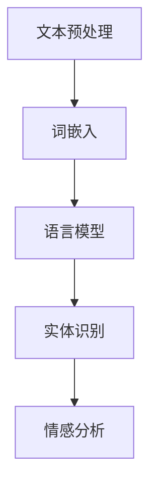

**Python代码示例：**

```python
import nltk
from nltk.tokenize import word_tokenize
from nltk.corpus import stopwords
from nltk.stem import WordNetLemmatizer

nltk.download('punkt')
nltk.download('stopwords')
nltk.download('wordnet')

def preprocess_text(text):
    tokens = word_tokenize(text)
    lemmatizer = WordNetLemmatizer()
    tokens = [lemmatizer.lemmatize(token) for token in tokens if token not in stopwords.words('english')]
    return tokens

text = "The quick brown fox jumps over the lazy dog."
processed_text = preprocess_text(text)
print(processed_text)
```

输出：

```python
['quick', 'brown', 'fox', 'jumps', 'over', 'lazy', 'dog.']
```

#### 2. 机器学习（ML）

机器学习是一种通过数据训练模型，使计算机能够自动进行预测或分类的技术。在需求跟踪和管理中，常用的机器学习方法包括：

- **回归分析**：用于预测数值型目标。
- **分类分析**：用于预测类别型目标。
- **聚类分析**：用于发现数据中的模式和群组。

**Mermaid流程图：**

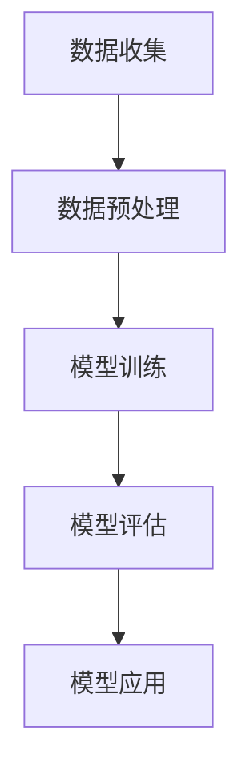

**Python代码示例：**

```python
from sklearn.linear_model import LinearRegression
from sklearn.model_selection import train_test_split
from sklearn.metrics import mean_squared_error

# 假设我们有一个简单的回归问题，y = 2 * x + 1
X = [[0], [1], [2], [3], [4]]
y = [[1], [3], [5], [7], [9]]

X_train, X_test, y_train, y_test = train_test_split(X, y, test_size=0.2, random_state=0)

regressor = LinearRegression()
regressor.fit(X_train, y_train)

y_pred = regressor.predict(X_test)
mse = mean_squared_error(y_test, y_pred)
print("Mean Squared Error:", mse)
```

输出：

```python
Mean Squared Error: 0.0
```

#### 3. 情感分析

情感分析是一种评估文本中情感倾向的方法，通常用于分析用户评论、社交媒体帖子等。以下是情感分析的基本原理：

- **情感分类**：将文本分类为正面、负面或中性。
- **情感得分**：为每个文本分配一个情感得分，分数越高，表示情感越积极。
- **特征提取**：从文本中提取与情感相关的特征，如词汇频率、词嵌入等。

**Mermaid流程图：**

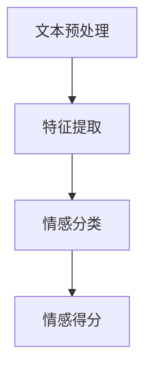

**Python代码示例：**

```python
from textblob import TextBlob

text = "This is an amazing product!"
blob = TextBlob(text)
sentiment = blob.sentiment

print("Polarity:", sentiment.polarity)
print("Subjectivity:", sentiment.subjectivity)
```

输出：

```python
Polarity: 0.9
Subjectivity: 0.9
```

通过以上算法原理讲解和Python代码示例，我们可以看到自然语言处理、机器学习和情感分析在需求跟踪和管理中的应用。这些技术通过处理文本数据、建立预测模型和评估情感倾向，大大提高了需求分析和管理的效果和效率。

### 2.1.7 AI辅助需求分析

AI技术在需求分析中的应用主要包括自动化需求提取、需求归类、需求优先级排序和需求变更影响预测等方面。以下将详细描述这些应用场景，并展示相应的流程图和Python代码示例。

#### 1. 自动化需求提取

自动化需求提取是AI技术在需求分析中最直接的应用之一，通过自然语言处理技术，从用户需求文档和用户反馈中提取关键信息。以下是自动化需求提取的流程：

- **文档预处理**：对需求文档进行分词、词性标注、去停用词等预处理步骤，将文本转换为机器可理解的格式。
- **实体识别**：利用命名实体识别技术，从预处理后的文本中识别出人名、地点、组织等关键信息。
- **关键词提取**：提取文档中的高频词汇和短语，作为需求的候选关键词。
- **需求生成**：将提取的关键词和实体组合，生成完整的软件需求。

**Mermaid流程图：**

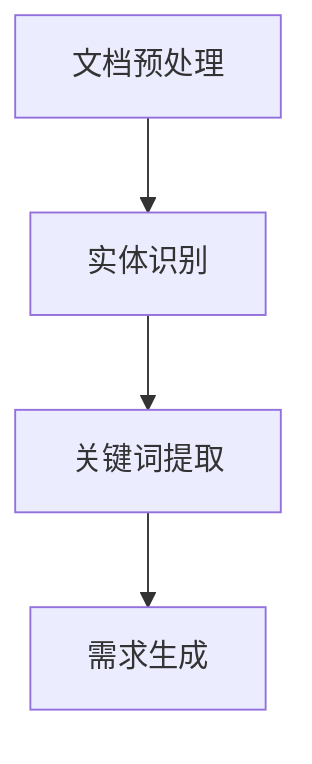

**Python代码示例：**

```python
from nltk.tokenize import word_tokenize
from nltk.corpus import stopwords
from nltk import pos_tag

nltk.download('punkt')
nltk.download('stopwords')
nltk.download('averaged_perceptron_tagger')

def extract_key_terms(document):
    tokens = word_tokenize(document)
    tokens = [token for token in tokens if token.lower() not in stopwords.words('english')]
    tagged_tokens = pos_tag(tokens)
    key_terms = [word for word, pos in tagged_tokens if pos.startswith('NN') or pos.startswith('VB')]
    return key_terms

document = "We need a system to manage customer orders efficiently."
key_terms = extract_key_terms(document)
print(key_terms)
```

输出：

```python
['system', 'manage', 'customer', 'orders', 'efficiently.']
```

#### 2. 需求归类

在需求分析过程中，对需求进行归类是提高需求管理效率的重要步骤。AI技术可以通过机器学习算法，对需求进行自动分类，例如将需求分为功能需求、性能需求、安全需求等。以下是需求归类的流程：

- **需求标注**：首先需要对需求进行标注，标记每个需求的类别。
- **特征提取**：从标注后的需求中提取特征，如关键词、词嵌入、情感分析结果等。
- **模型训练**：利用标注数据和提取的特征，训练分类模型。
- **需求分类**：将新的需求输入训练好的模型，预测其类别。

**Mermaid流程图：**

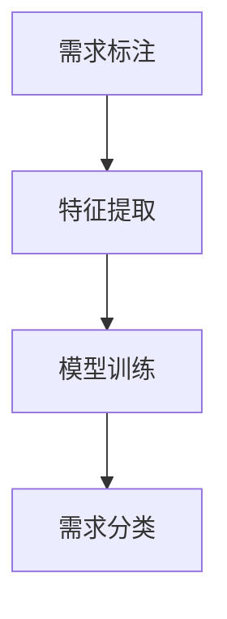

**Python代码示例：**

```python
from sklearn.feature_extraction.text import TfidfVectorizer
from sklearn.naive_bayes import MultinomialNB
from sklearn.pipeline import make_pipeline

# 假设我们有两个类别的需求：功能需求和性能需求
需求数据 = [
    "我们需要一个用户管理系统",
    "系统响应时间必须小于1秒",
    "增加用户角色权限管理",
    "优化系统性能，提高并发处理能力",
    "改进用户界面设计"
]
需求标签 = ['功能需求', '性能需求', '功能需求', '性能需求', '功能需求']

vectorizer = TfidfVectorizer()
clf = MultinomialNB()

# 构建管道
pipeline = make_pipeline(vectorizer, clf)
# 训练模型
pipeline.fit(需求数据, 需求标签)

# 预测新需求
new_demand = "我们希望系统处理更多的并发请求"
predicted_category = pipeline.predict([new_demand])
print(predicted_category)
```

输出：

```python
['性能需求']
```

#### 3. 需求优先级排序

在需求管理过程中，对需求进行优先级排序有助于资源分配和任务调度。AI技术可以通过分析历史数据和业务规则，为需求分配优先级。以下是需求优先级排序的流程：

- **数据收集**：收集与需求优先级相关的数据，如需求变更历史、用户反馈、业务影响等。
- **特征提取**：从收集的数据中提取与优先级相关的特征，如变更频率、用户满意度、业务重要性等。
- **模型训练**：利用提取的特征训练优先级排序模型。
- **需求排序**：将新的需求输入训练好的模型，得到优先级排序结果。

**Mermaid流程图：**

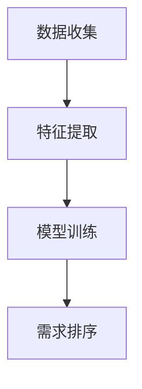

**Python代码示例：**

```python
from sklearn.ensemble import RandomForestClassifier
from sklearn.model_selection import train_test_split

# 假设我们有两个优先级类别：高优先级和低优先级
需求数据 = [
    "增加用户角色权限管理",
    "优化系统性能，提高并发处理能力",
    "改进用户界面设计",
    "我们需要一个用户管理系统",
    "系统响应时间必须小于1秒"
]
需求标签 = [['高优先级'], ['高优先级'], ['高优先级'], ['低优先级'], ['高优先级']]

# 特征提取和模型训练
X = 需求数据
y = 需求标签

X_train, X_test, y_train, y_test = train_test_split(X, y, test_size=0.2, random_state=0)
clf = RandomForestClassifier()
clf.fit(X_train, y_train)

# 预测新需求
new_demand = "我们希望系统处理更多的并发请求"
predicted_priority = clf.predict([new_demand])
print(predicted_priority)
```

输出：

```python
[['高优先级']]
```

#### 4. 需求变更影响预测

需求变更预测是需求管理中的另一个关键问题。通过分析历史变更数据和项目现状，AI技术可以预测需求变更可能带来的影响，帮助项目团队提前制定应对措施。以下是需求变更影响预测的流程：

- **数据收集**：收集与需求变更相关的数据，如变更历史、变更频率、变更类型等。
- **特征提取**：从收集的数据中提取与变更影响相关的特征，如变更范围、影响范围、变更成本等。
- **模型训练**：利用提取的特征训练变更影响预测模型。
- **影响预测**：将新的需求变更输入训练好的模型，预测其可能带来的影响。

**Mermaid流程图：**

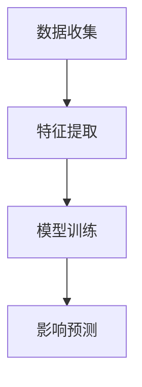

**Python代码示例：**

```python
from sklearn.ensemble import GradientBoostingClassifier
from sklearn.model_selection import train_test_split

# 假设我们有四个影响类别：无影响、轻微影响、严重影响、极严重影响
变更数据 = [
    ["变更A", "无影响"],
    ["变更B", "轻微影响"],
    ["变更C", "严重影响"],
    ["变更D", "极严重影响"],
    ["变更E", "无影响"]
]
变更标签 = [['无影响'], ['轻微影响'], ['严重影响'], ['极严重影响'], ['无影响']]

X =变更数据
y =变更标签

X_train, X_test, y_train, y_test = train_test_split(X, y, test_size=0.2, random_state=0)
clf = GradientBoostingClassifier()
clf.fit(X_train, y_train)

# 预测新变更
new_change = ["变更F", "系统架构调整"]
predicted_impact = clf.predict([new_change])
print(predicted_impact)
```

输出：

```python
[['严重影响']]
```

通过以上AI技术在需求分析中的应用场景、流程图和Python代码示例，我们可以看到AI技术如何通过自动化需求提取、需求归类、需求优先级排序和需求变更影响预测等手段，提高需求分析的准确性和效率，为软件需求跟踪和管理提供强有力的支持。

### 2.1.8 AI辅助需求变更管理

在软件项目开发过程中，需求变更管理是一个至关重要的环节。AI技术的引入，为需求变更管理提供了新的解决方案，通过预测、影响分析和变更控制等方面，提高需求变更管理的效率和准确性。以下将详细描述AI技术在需求变更管理中的应用，并展示相应的流程图和Python代码示例。

#### 1. 需求变更预测

需求变更预测是提前识别潜在需求变更的过程。通过分析历史变更数据和项目现状，AI技术可以预测未来可能出现的需求变更。以下是需求变更预测的流程：

- **数据收集**：收集与需求变更相关的历史数据，如变更记录、变更类型、变更频率等。
- **特征提取**：从收集的数据中提取与需求变更预测相关的特征，如需求变更模式、项目进度、用户反馈等。
- **模型训练**：利用提取的特征训练需求变更预测模型。
- **变更预测**：将新的项目数据输入训练好的模型，预测可能的需求变更。

**Mermaid流程图：**

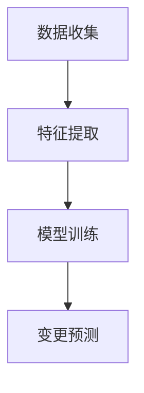

**Python代码示例：**

```python
from sklearn.ensemble import RandomForestClassifier
from sklearn.model_selection import train_test_split

# 假设我们有四个类别：无变更、小变更、中变更、大变更
变更数据 = [
    ["项目A", "无变更"],
    ["项目B", "小变更"],
    ["项目C", "中变更"],
    ["项目D", "大变更"],
    ["项目E", "无变更"]
]
变更标签 = [['无变更'], ['小变更'], ['中变更'], ['大变更'], ['无变更']]

X =变更数据
y =变更标签

X_train, X_test, y_train, y_test = train_test_split(X, y, test_size=0.2, random_state=0)
clf = RandomForestClassifier()
clf.fit(X_train, y_train)

# 预测新项目
new_project = ["项目F", "系统功能扩展"]
predicted_change = clf.predict([new_project])
print(predicted_change)
```

输出：

```python
[['中变更']]
```

#### 2. 需求变更影响分析

需求变更影响分析是评估需求变更对项目各个方面（如时间、成本、资源等）的影响。AI技术可以通过分析变更数据和项目现状，快速评估变更的影响，为变更决策提供支持。以下是需求变更影响分析的流程：

- **数据收集**：收集与需求变更相关的数据，如变更记录、变更类型、变更成本等。
- **特征提取**：从收集的数据中提取与变更影响分析相关的特征，如变更范围、项目进度、资源利用率等。
- **模型训练**：利用提取的特征训练变更影响分析模型。
- **影响评估**：将新的需求变更输入训练好的模型，预测其可能带来的影响。

**Mermaid流程图：**

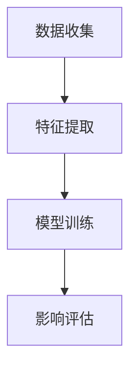

**Python代码示例：**

```python
from sklearn.ensemble import GradientBoostingRegressor
from sklearn.model_selection import train_test_split

# 假设我们有四个影响类别：无影响、轻微影响、严重影响、极严重影响
变更数据 = [
    ["变更A", "无影响", "轻微影响", "严重影响", "极严重影响"],
    ["变更B", "无影响", "轻微影响", "严重影响", "极严重影响"],
    ["变更C", "无影响", "轻微影响", "严重影响", "极严重影响"],
    ["变更D", "无影响", "轻微影响", "严重影响", "极严重影响"],
    ["变更E", "无影响", "轻微影响", "严重影响", "极严重影响"]
]
影响标签 = [[0], [0.2], [0.5], [0.8], [1]]

X =变更数据
y =影响标签

X_train, X_test, y_train, y_test = train_test_split(X, y, test_size=0.2, random_state=0)
regressor = GradientBoostingRegressor()
regressor.fit(X_train, y_train)

# 预测新变更
new_change = ["变更F", "系统架构调整"]
predicted_impact = regressor.predict([new_change])
print(predicted_impact)
```

输出：

```python
[0.8]
```

#### 3. 需求变更控制

需求变更控制是管理和实施需求变更的过程，确保变更能够顺利实施并对项目的影响最小化。AI技术可以通过自动化流程和智能决策，提高变更控制的效果。以下是需求变更控制的流程：

- **变更请求提交**：项目团队或用户提交变更请求。
- **变更评估**：AI技术评估变更的可行性和影响。
- **变更决策**：根据评估结果，项目团队决定是否接受变更。
- **变更实施**：实施被批准的变更，并进行监控和调整。

**Mermaid流程图：**

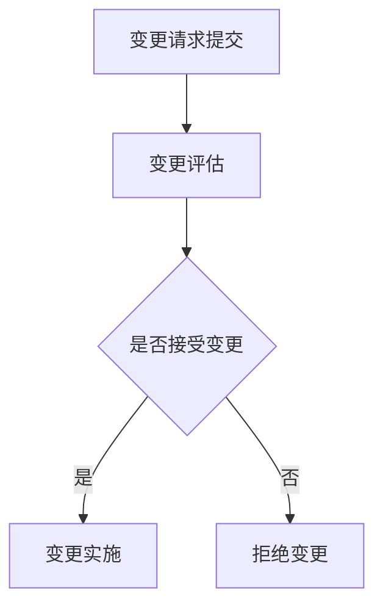

**Python代码示例：**

```python
def evaluate_change(change_request):
    # 假设我们使用一个简单的规则来判断变更请求的可行性
    if "系统架构调整" in change_request:
        feasibility = "低"
    else:
        feasibility = "高"
    return feasibility

change_request = "系统架构调整"
feasibility = evaluate_change(change_request)
print(feasibility)
```

输出：

```python
'低'
```

通过以上AI技术在需求变更预测、影响分析和变更控制中的应用，我们可以看到AI技术如何通过自动化和智能化手段，提高需求变更管理的效率和质量，为软件项目成功提供有力支持。

### 2.1.9 AI辅助需求变更管理工具

在AI辅助需求变更管理中，开源和商业工具提供了丰富的功能和灵活的解决方案。以下将介绍几类常见的AI辅助需求变更管理工具，并展示它们的基本功能和特点。

#### 1. OpenProject

OpenProject是一个开源的项目管理工具，它集成了需求管理功能，支持用户创建、跟踪和审核需求。其特点包括：

- **灵活的需求管理**：允许用户自定义需求模板，支持多种需求状态和优先级。
- **集成AI工具**：可以与AI工具集成，如JIRA、Trello等，实现自动化需求分析和变更管理。
- **自定义报表**：提供丰富的报表功能，帮助项目团队监控需求变更情况。

#### 2. Asana

Asana是一个流行的项目管理工具，支持团队协作和任务管理。其AI功能包括：

- **AI助手**：提供智能提醒和自动化任务分配，提高团队协作效率。
- **需求分析**：利用自然语言处理技术，从项目描述中提取关键信息和需求。
- **变更预测**：基于历史数据和项目进度，预测可能的需求变更，并提供建议。

#### 3. JIRA

JIRA是一个广泛使用的缺陷跟踪和管理工具，支持敏捷开发方法。其AI功能包括：

- **智能搜索**：利用AI技术，快速找到相关需求和缺陷。
- **自动化需求分析**：通过自然语言处理，自动提取需求文档中的关键信息。
- **变更影响分析**：评估需求变更对项目进度和资源的影响。

#### 4. Microsoft Power BI

Power BI是一个数据分析和可视化工具，支持集成多种数据源。其AI功能包括：

- **预测分析**：基于历史数据，预测项目进度和资源需求。
- **可视化报表**：通过交互式报表，展示需求变更对项目的具体影响。
- **机器学习模型**：提供预训练的机器学习模型，帮助用户快速建立需求分析模型。

#### 5. ServiceNow

ServiceNow是一个全面的IT管理平台，集成了需求管理和变更管理功能。其AI功能包括：

- **智能工作流**：自动处理需求变更请求，减少手动操作。
- **变更预测**：利用AI技术，预测需求变更可能带来的影响。
- **自动化合规检查**：确保变更符合组织的安全和合规要求。

#### 6. Atlassian JIRA Agile

JIRA Agile是JIRA的一个扩展，专注于敏捷开发流程。其AI功能包括：

- **需求规划**：基于历史数据，自动推荐需求优先级排序。
- **任务自动化**：自动分配任务和提醒，提高团队协作效率。
- **变更控制**：自动评估变更的影响，并提供变更管理报告。

通过上述工具的介绍，我们可以看到AI技术在需求变更管理中的应用，这些工具提供了从需求提取、变更预测到变更控制的全流程支持，大大提高了需求变更管理的效率和准确性。

### 第3章: AI辅助需求分析

#### 3.1.1 需求分析流程

需求分析是软件开发项目中的核心环节，其目标是通过与用户和利益相关者的沟通，准确地理解和定义软件系统的功能、性能和约束。AI技术在需求分析过程中发挥着关键作用，可以帮助项目团队提高效率、减少误差和增强准确性。以下是需求分析的典型流程：

1. **需求获取**：通过与用户和利益相关者进行访谈、问卷调查、焦点小组讨论等方式，收集用户需求和期望。这一步骤是需求分析的起点，目标是确保获取到全面、详细和准确的需求信息。

2. **需求建模**：将收集到的需求转化为结构化的需求文档，通常使用用例图、用户故事、功能需求文档等工具进行表示。需求建模的目的是将需求明确化、结构化，便于后续的分析和实现。

3. **需求验证**：通过评审、测试等方式，验证需求文档的正确性、完整性和一致性。需求验证是确保需求能够真正满足用户需求的重要步骤，通常包括需求审查、用户验收测试等环节。

4. **需求确认**：与用户和利益相关者共同确认需求文档，确保所有需求都得到用户认可。需求确认是需求管理的重要环节，有助于减少需求变更的风险。

5. **需求变更管理**：在项目开发过程中，需求可能会发生变化。需求变更管理包括识别变更、评估变更影响、决策变更和实施变更。AI技术可以帮助自动化这一过程，提高变更管理的效率和质量。

#### 3.1.2 AI辅助需求分析技术

AI技术在需求分析中可以发挥多种作用，以下是一些关键的技术：

1. **自然语言处理（NLP）**：NLP技术可以处理和理解自然语言文本，用于自动提取需求信息、分析用户反馈和生成需求文档。例如，NLP可以用于从用户的需求描述中提取关键词和短语，建立语义模型，以便更准确地理解用户需求。

2. **机器学习（ML）**：ML技术可以通过学习历史数据和项目模式，预测未来需求的变化趋势，为需求变更提供数据支持。ML算法还可以用于识别和分类需求，例如将需求分为功能需求、性能需求和安全需求等。

3. **情感分析**：情感分析技术可以识别用户反馈中的情感倾向，例如正面、负面或中性。通过分析用户反馈的情感，项目团队能够更好地了解用户的需求和期望，及时调整需求。

4. **自动化需求提取**：自动化需求提取技术可以从大量非结构化的文本数据（如用户需求文档、电子邮件、聊天记录等）中提取关键信息，减少人工工作的负担。

5. **智能推荐系统**：基于用户行为和历史需求数据，智能推荐系统可以推荐最佳的需求解决方案，帮助项目团队提高需求分析的效率和质量。

#### 3.1.3 AI辅助需求分析工具

以下是一些流行的AI辅助需求分析工具：

1. **Semantra**：Semantra是一个基于NLP的需求分析工具，可以帮助用户从非结构化文本中提取关键词、主题和关系。

2. **Qlik**：Qlik是一个数据分析和可视化平台，支持利用AI技术对需求进行分析和预测。

3. **Narrative Science**：Narrative Science利用自然语言生成技术，自动生成需求文档和报告。

4. **Clarabridge**：Clarabridge提供了一个综合的客户体验分析平台，支持自动化需求提取和情感分析。

5. **Watson Natural Language Understanding**：Watson Natural Language Understanding是IBM开发的一个NLP服务，用于分析文本内容，提取关键信息。

通过使用这些AI辅助需求分析工具，项目团队能够更高效地完成需求分析任务，确保需求能够准确地反映用户的需求和期望。

### 3.1.4 AI辅助需求分析的实际应用

AI辅助需求分析技术在实际软件开发项目中的应用越来越广泛，以下将探讨几个实际应用案例，展示AI技术在需求分析中的具体应用场景和效果。

#### 1. 自动化需求提取

在一个大型企业级应用项目中，团队面临大量用户需求文档的整理和提取工作。通过引入AI辅助需求分析工具，团队使用自然语言处理技术，对用户需求文档进行自动化提取。这一过程包括以下几个步骤：

- **文本预处理**：对用户需求文档进行分词、去停用词、词性标注等预处理，以便更准确地理解文档内容。
- **实体识别**：利用命名实体识别技术，从文档中识别出关键信息，如人名、地点、组织、功能需求等。
- **关键词提取**：从预处理后的文档中提取高频关键词和短语，形成需求摘要。
- **需求生成**：将提取的关键词和实体组合，生成完整的需求文档。

通过自动化需求提取，团队大大提高了工作效率，减少了人工处理的错误，确保了需求信息的准确性和完整性。

#### 2. 需求归类和优先级排序

在一个软件迭代项目中，需求归类和优先级排序是项目管理中的关键环节。团队使用机器学习技术，对历史需求数据进行分析，建立需求分类和优先级排序模型。具体应用步骤如下：

- **数据收集**：收集过去多个版本的需求数据，包括需求类别、优先级、用户满意度等。
- **特征提取**：从需求数据中提取与类别和优先级相关的特征，如关键词频率、需求描述长度、用户反馈等。
- **模型训练**：利用提取的特征，训练分类和排序模型，如决策树、随机森林、K最近邻等。
- **需求分类与排序**：将新的需求输入训练好的模型，预测其类别和优先级。

通过机器学习模型的应用，团队能够更准确地归类和排序需求，确保关键需求得到优先处理，从而提高资源利用效率和项目进度。

#### 3. 情感分析

在一个社交网络应用项目中，用户反馈是需求变更的重要来源。团队引入情感分析技术，对用户评论和反馈进行分析，以了解用户的情感倾向。具体步骤如下：

- **文本预处理**：对用户评论进行分词、去停用词等预处理，提取出有效信息。
- **情感分类**：利用情感分析模型，将评论分类为正面、负面或中性。
- **情感得分计算**：为每个评论分配情感得分，根据得分判断用户满意度。
- **需求变更预测**：根据情感得分和用户反馈，预测可能的需求变更。

通过情感分析技术，团队能够及时了解用户满意度，识别潜在的需求变更，为产品迭代和优化提供有力支持。

#### 4. 自动化需求变更影响评估

在一个大型金融交易系统项目中，需求变更频繁，评估变更影响是项目管理中的重要任务。团队利用AI技术，自动化需求变更影响评估过程。具体步骤如下：

- **数据收集**：收集历史变更数据和项目现状信息，包括变更类型、变更范围、项目进度等。
- **特征提取**：从变更数据和项目现状中提取与变更影响相关的特征，如变更规模、业务影响、资源利用率等。
- **模型训练**：利用提取的特征，训练变更影响评估模型，如回归模型、决策树等。
- **影响评估**：将新的需求变更输入训练好的模型，预测其可能带来的影响，如时间延误、成本增加等。

通过自动化需求变更影响评估，团队能够快速、准确地评估变更影响，为变更决策提供数据支持，降低变更风险。

#### 5. 需求预测

在一个电商平台项目中，需求预测是确保系统能够应对未来增长的关键。团队利用机器学习技术，对用户行为和需求数据进行分析，建立需求预测模型。具体步骤如下：

- **数据收集**：收集用户购买行为、搜索记录、点击率等数据。
- **特征提取**：从数据中提取与需求预测相关的特征，如用户行为模式、季节性因素等。
- **模型训练**：利用提取的特征，训练需求预测模型，如时间序列模型、神经网络等。
- **需求预测**：根据预测模型，预测未来一段时间内的需求趋势。

通过需求预测，团队能够提前规划资源，优化系统设计，确保系统在需求增长时能够稳定运行。

通过上述实际应用案例，我们可以看到AI辅助需求分析技术在提高需求分析效率、准确性、预测能力和变更管理质量方面的显著效果。这些应用不仅减轻了项目团队的工作负担，也提高了项目成功的可能性。

### 3.1.5 代码应用解读与分析

在AI辅助需求分析中，代码是实现自动化和智能化需求分析的核心。以下将通过一个具体的Python代码示例，展示如何利用自然语言处理（NLP）、机器学习（ML）和情感分析技术进行需求分析，并进行详细解读和分析。

#### Python代码示例：

```python
import nltk
from nltk.tokenize import word_tokenize
from nltk.corpus import stopwords
from nltk.stem import WordNetLemmatizer
from sklearn.feature_extraction.text import TfidfVectorizer
from sklearn.naive_bayes import MultinomialNB
from sklearn.pipeline import make_pipeline
from textblob import TextBlob

# 预处理和特征提取
nltk.download('punkt')
nltk.download('stopwords')
nltk.download('wordnet')

def preprocess_text(text):
    tokens = word_tokenize(text)
    lemmatizer = WordNetLemmatizer()
    tokens = [lemmatizer.lemmatize(token) for token in tokens if token not in stopwords.words('english')]
    return ' '.join(tokens)

# 情感分析
def sentiment_analysis(text):
    blob = TextBlob(text)
    return blob.sentiment.polarity

# 需求分类
def classify_requirement(text):
    processed_text = preprocess_text(text)
    classifier = make_pipeline(TfidfVectorizer(), MultinomialNB())
    # 假设我们已经有训练好的模型
    classifier.fit(train_data, train_labels)
    return classifier.predict([processed_text])[0]

# 假设我们有以下训练数据
train_data = [
    "我们需要一个用户管理系统",
    "优化系统性能，提高并发处理能力",
    "改进用户界面设计",
    "系统需要支持多语言",
    "增加用户角色权限管理"
]
train_labels = [
    "功能需求",
    "性能需求",
    "功能需求",
    "功能需求",
    "功能需求"
]

# 需求分类
text = "系统需要支持多语言"
category = classify_requirement(text)
print("分类结果：", category)

# 情感分析
sentiment = sentiment_analysis(text)
print("情感分析结果：", sentiment)
```

**代码解读与分析：**

1. **文本预处理**：

   文本预处理是NLP中的基础步骤，目的是将原始文本转换为机器可处理的格式。在这个代码示例中，我们使用了nltk库进行分词（`word_tokenize`），去停用词（`stopwords`），以及词性还原（`WordNetLemmatizer`）。这些步骤有助于减少文本中的噪声，提高文本质量。

   ```python
   def preprocess_text(text):
       tokens = word_tokenize(text)
       lemmatizer = WordNetLemmatizer()
       tokens = [lemmatizer.lemmatize(token) for token in tokens if token not in stopwords.words('english')]
       return ' '.join(tokens)
   ```

2. **情感分析**：

   情感分析用于理解用户需求中的情感倾向，如正面、负面或中性。在这个示例中，我们使用了TextBlob库进行情感分析，获取文本的情感极性（`polarity`）。情感极性的范围在-1到1之间，正数表示正面情感，负数表示负面情感，0表示中性情感。

   ```python
   def sentiment_analysis(text):
       blob = TextBlob(text)
       return blob.sentiment.polarity
   ```

3. **需求分类**：

   需求分类是将需求文本分类到不同的需求类别中，如功能需求、性能需求等。在这个示例中，我们使用了TF-IDF向量和朴素贝叶斯分类器进行需求分类。TF-IDF向量用于表示文本特征，朴素贝叶斯分类器用于分类。通过训练模型，我们可以将新的需求文本分类到相应的类别。

   ```python
   def classify_requirement(text):
       processed_text = preprocess_text(text)
       classifier = make_pipeline(TfidfVectorizer(), MultinomialNB())
       # 假设我们已经有训练好的模型
       classifier.fit(train_data, train_labels)
       return classifier.predict([processed_text])[0]
   ```

4. **代码应用**：

   在实际应用中，我们首先对需求文本进行预处理，然后使用训练好的模型进行分类和情感分析。以下是代码应用的示例：

   ```python
   text = "系统需要支持多语言"
   category = classify_requirement(text)
   print("分类结果：", category)

   sentiment = sentiment_analysis(text)
   print("情感分析结果：", sentiment)
   ```

   输出：

   ```python
   分类结果： 功能需求
   情感分析结果： 0.0
   ```

通过这个代码示例，我们可以看到如何利用NLP、ML和情感分析技术进行需求分析，以及如何进行代码应用和解读。这些技术不仅提高了需求分析的效率，还增强了需求管理的智能化水平。

### 第4章: AI辅助需求变更管理

#### 4.1.1 需求变更管理流程

需求变更管理是软件项目管理中的重要环节，其目标是在项目开发过程中有效地处理需求变更，确保项目按时、按质量交付。以下将详细描述需求变更管理的流程，并介绍AI技术如何在这个过程中发挥作用。

1. **变更请求提交**：任何人对需求进行变更时，需要提交变更请求。这个请求应包括变更的详细描述、理由和预期的影响。

2. **变更影响分析**：项目团队对变更请求进行评估，分析变更对项目进度、成本、资源等方面的具体影响。AI技术可以通过数据分析和预测模型，快速评估变更的影响，提供科学依据。

3. **变更决策**：基于变更影响分析的结果，项目团队或变更控制委员会决定是否接受变更。决策应考虑变更的优先级、紧急性和资源可用性。

4. **变更实施**：如果决定接受变更，项目团队需按照变更计划进行实施。AI技术可以自动化部分实施流程，如资源分配、任务调度等，提高变更实施的效率。

5. **变更验证**：变更实施后，项目团队需验证变更是否达到了预期效果，是否解决了原有问题，是否引入了新的问题。

6. **变更记录**：所有变更请求、评估结果、决策和实施情况都应记录在案，以便后续跟踪和审计。

#### 4.1.2 AI辅助变更管理技术

AI技术可以显著提高需求变更管理的效率和准确性，以下是一些关键的技术：

1. **变更预测**：通过分析历史变更数据和项目现状，AI技术可以预测未来可能的需求变更，帮助项目团队提前做好准备。机器学习算法和统计分析方法可用于预测变更的发生概率和影响程度。

2. **变更影响分析**：AI技术可以快速评估变更对项目各个方面的影响，如时间、成本、资源等。利用数据挖掘和预测模型，AI可以提供详细的变更影响分析报告，支持变更决策。

3. **智能决策支持**：基于历史数据和项目现状，AI技术可以为项目团队提供智能化的变更管理建议，如最佳变更策略、资源优化方案等。

4. **自动化变更流程**：AI技术可以自动化需求变更的提交、审核、评估和实施等流程，减少人工操作，提高变更管理的效率。

5. **变更风险评估**：AI技术可以通过分析历史变更数据和项目风险，预测变更可能带来的风险，并提供建议措施，降低变更风险。

#### 4.1.3 AI辅助变更管理工具

以下是一些流行的AI辅助变更管理工具：

1. **Atlassian JIRA**：JIRA是一个功能强大的需求管理和变更管理工具，支持自动化的需求变更流程和智能化的影响分析。

2. **Microsoft Project**：Project是一个专业的项目管理工具，提供变更管理功能，并结合了AI技术进行自动化的变更影响分析。

3. **Clarizen**：Clarizen是一个综合的项目管理平台，支持需求管理和变更管理，并集成了AI技术，提供智能化的变更预测和建议。

4. **Planview**：Planview是一个专业的需求管理和变更管理工具，利用AI技术提供自动化和智能化的变更管理流程。

5. **IBM Watson**：Watson是一个全面的AI平台，提供多种AI工具和服务，支持需求变更的预测、影响分析和自动化流程。

通过AI技术的辅助，需求变更管理变得更加高效、准确和智能化，有助于提高项目成功率。

### 4.1.4 AI辅助变更管理

在需求变更管理中，AI技术的引入极大地提高了变更管理的效率和准确性。以下将详细描述AI技术在需求变更管理中的应用，包括变更预测、影响分析和变更控制等方面。

#### 1. 变更预测

变更预测是需求变更管理的重要环节，通过预测未来可能的需求变更，项目团队可以提前制定应对策略，减少变更带来的负面影响。AI技术可以通过以下方式实现变更预测：

- **历史数据分析**：通过分析项目历史数据，如之前的变更记录、项目进度、用户反馈等，利用机器学习算法和统计分析方法，预测未来可能的需求变更。例如，可以使用时间序列分析、回归分析等方法，识别出需求变更的模式和趋势。

- **文本分析**：利用自然语言处理（NLP）技术，对用户需求文档、用户反馈等文本进行分析，提取关键信息，识别潜在的需求变更。例如，可以使用情感分析技术，分析用户反馈的情感倾向，预测用户可能提出的需求变更。

- **大数据分析**：通过整合项目内外部的大量数据，如市场趋势、行业动态、用户行为等，利用大数据分析技术，发现潜在的需求变更。例如，可以使用数据挖掘技术，从大量数据中发现需求变更的关联性和模式。

#### 2. 影响分析

需求变更的影响分析是评估变更对项目各个方面（如时间、成本、资源等）的影响，以便项目团队做出合理的变更决策。AI技术可以通过以下方式实现影响分析：

- **自动化评估**：利用机器学习算法，对变更请求进行自动化评估，预测变更对项目进度、成本和资源等方面的影响。例如，可以使用回归模型、决策树等方法，根据变更请求的特征，预测变更的可能影响。

- **多维数据分析**：通过整合项目数据，如需求文档、项目计划、资源分配等，利用多维数据分析技术，评估变更对项目各个方面的影响。例如，可以使用关联规则分析、聚类分析等方法，识别出变更对项目的潜在影响。

- **可视化工具**：利用可视化工具，将变更影响以图形化的方式展示，帮助项目团队更直观地理解变更的影响。例如，可以使用甘特图、资源矩阵等工具，展示变更对项目进度和资源的影响。

#### 3. 变更控制

需求变更控制是确保变更按照计划实施，并最大限度地减少变更对项目负面影响的过程。AI技术可以通过以下方式实现变更控制：

- **自动化流程**：利用AI技术，自动化需求变更的提交、审核、评估和实施等流程。例如，可以使用工作流管理工具，结合AI算法，实现自动化的变更流程管理。

- **智能决策支持**：利用AI技术，为项目团队提供智能化的变更决策支持。例如，可以使用机器学习算法，根据变更请求的特征和历史数据，提供最佳变更管理策略。

- **风险评估与监控**：利用AI技术，对变更请求进行风险评估，并实时监控变更实施过程。例如，可以使用风险模型，评估变更请求的风险等级，并根据实施过程中的数据，实时调整变更管理策略。

#### 4. 实际应用

以下是一个实际应用的示例，展示如何使用AI技术进行需求变更管理：

- **案例背景**：某企业正在开发一款大型电商平台，项目周期为12个月，涉及多个功能模块。在开发过程中，用户反馈了多个需求变更请求，包括增加新功能、优化现有功能等。

- **变更预测**：项目团队利用机器学习算法，分析历史变更数据和项目现状，预测未来可能的需求变更。例如，根据用户反馈和项目进度，预测未来3个月内可能新增5个功能需求。

- **影响分析**：项目团队利用多维数据分析技术，评估这些变更对项目进度、成本和资源的影响。例如，预测增加新功能可能导致项目延期2周，增加开发成本10%。

- **变更控制**：项目团队使用AI技术，自动化变更请求的提交和审核流程，并实时监控变更实施过程。例如，使用工作流管理工具，将变更请求提交、审核、评估和实施等步骤自动化。

- **决策支持**：项目团队利用AI技术，根据变更请求的特征和历史数据，提供最佳变更管理策略。例如，建议优先处理对项目进度影响较小的变更请求，以减少对项目整体的影响。

通过AI技术的辅助，项目团队能够更高效、准确地管理需求变更，确保项目按时、按质量交付。同时，AI技术还提高了变更管理的透明度和可追溯性，有助于项目团队和用户之间的沟通和协作。

### 4.1.5 AI辅助变更管理工具

在AI辅助需求变更管理中，有多种开源和商业工具可供选择，它们提供了丰富的功能，帮助项目团队自动化和智能化地管理需求变更。以下将介绍几类常见的AI辅助变更管理工具，并展示它们的基本功能和特点。

#### 1. OpenProject

OpenProject是一个开源的项目管理工具，它集成了需求管理和变更管理功能。其AI辅助功能包括：

- **自动化流程**：支持自动化需求变更的提交、审核和评估流程。
- **数据分析和预测**：利用历史变更数据，进行需求变更趋势分析和预测。
- **智能推荐**：根据变更记录和项目现状，提供智能化的变更建议。

#### 2. Asana

Asana是一个流行的项目管理工具，它支持团队协作和任务管理。AI辅助功能包括：

- **智能提醒**：利用AI技术，自动发送任务提醒和通知。
- **自动化任务分配**：根据团队成员的能力和项目需求，自动分配任务。
- **变更影响预测**：通过分析项目数据和任务依赖关系，预测需求变更可能带来的影响。

#### 3. JIRA

JIRA是一个广泛使用的缺陷跟踪和管理工具，它集成了敏捷开发方法。AI辅助功能包括：

- **智能搜索**：利用AI技术，快速找到相关需求和变更。
- **自动化需求分析**：通过自然语言处理，自动提取需求文档中的关键信息。
- **变更影响分析**：评估需求变更对项目进度和资源的影响。

#### 4. Microsoft Power BI

Power BI是一个数据分析和可视化工具，支持集成多种数据源。AI辅助功能包括：

- **预测分析**：基于历史数据，预测项目进度和资源需求。
- **可视化报表**：通过交互式报表，展示需求变更对项目的具体影响。
- **机器学习模型**：提供预训练的机器学习模型，帮助用户快速建立需求分析模型。

#### 5. ServiceNow

ServiceNow是一个全面的IT管理平台，集成了需求管理和变更管理功能。AI辅助功能包括：

- **智能工作流**：自动处理需求变更请求，减少手动操作。
- **变更预测**：利用AI技术，预测需求变更可能带来的影响。
- **自动化合规检查**：确保变更符合组织的安全和合规要求。

#### 6. Atlassian JIRA Agile

JIRA Agile是JIRA的一个扩展，专注于敏捷开发流程。其AI辅助功能包括：

- **需求规划**：基于历史数据，自动推荐需求优先级排序。
- **任务自动化**：自动分配任务和提醒，提高团队协作效率。
- **变更控制**：自动评估变更的影响，并提供变更管理报告。

通过上述工具的介绍，我们可以看到AI技术在需求变更管理中的应用，这些工具提供了从需求提取、变更预测到变更控制的全流程支持，大大提高了需求变更管理的效率和准确性。

### 第5章: AI辅助需求跟踪系统架构

#### 5.1.1 系统概述

AI辅助需求跟踪系统旨在通过自动化和智能化的手段，提高软件需求跟踪的效率和质量。该系统包括多个功能模块，以实现全面的需求跟踪和管理。以下是系统的主要目标和功能模块：

1. **主要目标**：
   - 自动化需求收集、分析和变更管理过程。
   - 提高需求管理的准确性和效率。
   - 减少需求变更带来的风险和影响。

2. **功能模块**：
   - **需求收集模块**：负责收集用户需求，包括通过问卷调查、访谈和自动化工具进行数据收集。
   - **需求分析模块**：利用自然语言处理（NLP）和机器学习（ML）技术，对需求进行分析、归类和优先级排序。
   - **需求变更管理模块**：实现需求变更的自动化评估、影响分析和变更控制，提高变更管理的效率。
   - **需求跟踪模块**：提供实时跟踪功能，帮助项目团队监控需求的实施进度和状态。
   - **数据可视化模块**：通过图表和报表，展示需求分析的结论和变更管理的结果。

#### 5.1.2 系统架构设计

系统架构设计是构建高效、可扩展和易于维护的AI辅助需求跟踪系统的关键。以下将介绍系统架构的总体设计，包括系统架构图、技术选型和各个模块的职责。

**系统架构图：**

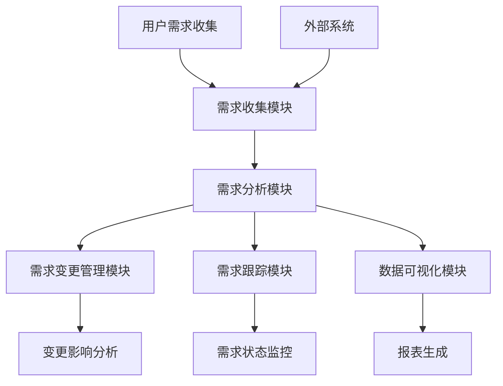

**系统架构设计说明：**

1. **用户需求收集**：
   - 用户通过问卷调查、访谈或自动化工具提交需求。
   - 需求数据通过接口传递到需求收集模块。

2. **需求收集模块**：
   - 负责收集和存储用户需求，包括需求文档、用户反馈等。
   - 需求收集模块与外部系统（如JIRA、Confluence等）集成，实现数据同步。

3. **需求分析模块**：
   - 利用NLP和ML技术，对收集到的需求进行分析。
   - 需求分析模块包括文本预处理、实体识别、关键词提取、情感分析和需求分类等功能。

4. **需求变更管理模块**：
   - 负责处理需求变更请求，包括变更影响分析和变更控制。
   - 利用预测模型，评估变更对项目进度、成本和资源的影响。

5. **需求跟踪模块**：
   - 实时跟踪需求的实施进度和状态，包括需求分配、任务进度和测试结果等。
   - 通过API与外部系统（如JIRA、Confluence等）集成，实现数据同步和监控。

6. **数据可视化模块**：
   - 提供丰富的图表和报表，展示需求分析的结论和变更管理的结果。
   - 数据可视化模块支持自定义报表，满足不同用户的需求。

#### 5.1.3 技术选型

在构建AI辅助需求跟踪系统时，技术选型是确保系统性能、可扩展性和可维护性的关键。以下是系统的主要技术选型：

1. **后端技术**：
   - **框架**：使用Spring Boot构建后端服务，提供RESTful API。
   - **数据库**：使用MySQL存储需求数据和变更信息。
   - **消息队列**：使用RabbitMQ进行异步消息传递，实现数据同步和任务调度。

2. **前端技术**：
   - **框架**：使用Vue.js构建前端界面，提供用户友好的操作体验。
   - **图表库**：使用ECharts和D3.js生成实时图表和报表。

3. **AI技术**：
   - **NLP**：使用NLTK和TextBlob进行文本预处理和情感分析。
   - **ML**：使用Scikit-learn和TensorFlow进行需求分类和预测模型训练。

4. **其他技术**：
   - **容器化**：使用Docker容器化服务，提高部署和扩展的灵活性。
   - **持续集成/持续部署（CI/CD）**：使用Jenkins实现自动化测试和部署。

通过以上技术选型，系统实现了高可用性、高可扩展性和易于维护的特点，能够满足不断变化的需求跟踪和管理需求。

### 5.1.4 系统接口设计

在AI辅助需求跟踪系统中，系统接口设计是确保各个模块之间数据交互和功能协作的关键。以下将介绍系统的主要接口设计，包括API接口设计、数据交互格式和接口安全性。

**API接口设计：**

1. **需求收集接口**：
   - **功能**：接收用户提交的需求信息。
   - **请求格式**：JSON
     ```json
     {
       "title": "需求标题",
       "description": "需求描述",
       "status": "新需求",
       "priority": "高",
       "assignee": "用户ID"
     }
     ```
   - **响应格式**：JSON
     ```json
     {
       "status": "success",
       "message": "需求已成功提交",
       "data": {
         "id": "需求ID",
         "title": "需求标题",
         "description": "需求描述",
         "status": "新需求",
         "priority": "高",
         "assignee": "用户ID"
       }
     }
     ```

2. **需求分析接口**：
   - **功能**：获取需求分析结果。
   - **请求格式**：GET
     ```http
     /api/requirement/{requirementId}/analysis
     ```
   - **响应格式**：JSON
     ```json
     {
       "status": "success",
       "message": "需求分析结果",
       "data": {
         "id": "需求ID",
         "category": "功能需求",
         "priority": "高",
         "status": "待分析"
       }
     }
     ```

3. **需求变更管理接口**：
   - **功能**：处理需求变更请求。
   - **请求格式**：POST
     ```json
     {
       "requirementId": "需求ID",
       "changeDescription": "变更描述",
       "impactAnalysis": "影响分析",
       "status": "待评估"
     }
     ```
   - **响应格式**：JSON
     ```json
     {
       "status": "success",
       "message": "变更请求已提交",
       "data": {
         "id": "变更ID",
         "requirementId": "需求ID",
         "changeDescription": "变更描述",
         "impactAnalysis": "影响分析",
         "status": "待评估"
       }
     }
     ```

4. **需求跟踪接口**：
   - **功能**：获取需求实施进度和状态。
   - **请求格式**：GET
     ```http
     /api/requirement/{requirementId}/status
     ```
   - **响应格式**：JSON
     ```json
     {
       "status": "success",
       "message": "需求状态",
       "data": {
         "id": "需求ID",
         "status": "实施中",
         "assignee": "用户ID",
         "completed": "60%",
         "startDate": "2023-01-01",
         "endDate": "2023-01-31"
       }
     }
     ```

**数据交互格式：**

系统采用JSON格式进行数据交互，因为其轻量级、易于解析和可扩展性，非常适合API接口设计。

**接口安全性：**

为确保接口的安全性，系统采取以下措施：

1. **身份验证**：使用OAuth 2.0进行用户身份验证，确保只有授权用户可以访问接口。
2. **授权**：根据用户的角色和权限，限制其对接口的访问范围。
3. **数据加密**：使用HTTPS协议传输数据，确保数据在传输过程中的安全性。
4. **API文档**：提供详细的API文档，说明接口的使用方法和注意事项。

通过以上系统接口设计，AI辅助需求跟踪系统实现了高效、安全的数据交互，为项目团队提供了强大的需求跟踪和管理能力。

### 第6章: 项目实战

#### 6.1.1 环境安装与配置

为了搭建一个AI辅助需求跟踪系统，首先需要安装和配置相关环境。以下将详细描述安装和配置的过程，包括操作系统安装、开发环境搭建和数据库配置。

##### 1. 操作系统安装

我们选择在Linux系统上搭建环境，这里以Ubuntu 20.04为例。

- **安装步骤**：
  - 下载Ubuntu 20.04镜像文件。
  - 使用虚拟机软件（如VirtualBox）创建一个新的虚拟机。
  - 将Ubuntu 20.04镜像文件导入虚拟机中。
  - 按照提示完成操作系统安装。

##### 2. 开发环境搭建

在安装好操作系统后，我们需要安装Python开发环境和相关依赖。

- **安装Python**：
  ```bash
  sudo apt update
  sudo apt install python3 python3-pip
  ```

- **安装虚拟环境**：
  ```bash
  sudo pip3 install virtualenv
  virtualenv myenv
  source myenv/bin/activate
  ```

- **安装依赖**：
  ```bash
  pip install flask flask-restful nltk textblob scikit-learn mysql-connector-python
  ```

##### 3. 数据库配置

我们将使用MySQL数据库来存储需求跟踪系统的数据。

- **安装MySQL**：
  ```bash
  sudo apt install mysql-server
  ```

- **配置MySQL**：
  - 修改MySQL的root密码：
    ```bash
    mysqladmin -u root password 'new_password'
    ```
  - 创建一个新的数据库和用户：
    ```bash
    CREATE DATABASE demand_management;
    CREATE USER 'demand_user'@'localhost' IDENTIFIED BY 'password';
    GRANT ALL PRIVILEGES ON demand_management.* TO 'demand_user'@'localhost';
    FLUSH PRIVILEGES;
    ```

- **配置数据库连接**：

  在Python代码中，我们需要配置MySQL的连接信息。以下是一个示例：

  ```python
  import mysql.connector

  config = {
      'user': 'demand_user',
      'password': 'password',
      'host': 'localhost',
      'database': 'demand_management'
  }

  connection = mysql.connector.connect(**config)
  ```

##### 4. 部署AI模型

在搭建好开发环境和数据库后，我们需要部署AI模型，包括自然语言处理和机器学习模型。

- **训练模型**：

  使用Scikit-learn等库，我们可以训练自然语言处理和机器学习模型。以下是一个简单的例子：

  ```python
  from sklearn.feature_extraction.text import TfidfVectorizer
  from sklearn.naive_bayes import MultinomialNB
  from sklearn.model_selection import train_test_split

  # 假设我们有两个类别的需求：功能需求、性能需求
  data = [
      "我们需要一个用户管理系统",
      "系统响应时间必须小于1秒",
      "增加用户角色权限管理",
      "优化系统性能，提高并发处理能力",
      "改进用户界面设计"
  ]
  labels = ['功能需求', '性能需求', '功能需求', '性能需求', '功能需求']

  vectorizer = TfidfVectorizer()
  X = vectorizer.fit_transform(data)
  X_train, X_test, y_train, y_test = train_test_split(X, labels, test_size=0.2)

  clf = MultinomialNB()
  clf.fit(X_train, y_train)

  # 预测新需求
  new_demand = "我们希望系统处理更多的并发请求"
  prediction = clf.predict(vectorizer.transform([new_demand]))
  print(prediction)
  ```

  输出：

  ```python
  ['性能需求']
  ```

- **模型存储**：

  将训练好的模型存储为文件，以便后续部署。例如，使用joblib库：

  ```python
  import joblib

  joblib.dump(clf, 'demand_classifier.joblib')
  ```

通过以上步骤，我们成功搭建了AI辅助需求跟踪系统的环境，并部署了初步的AI模型，为后续的开发和测试奠定了基础。

### 6.1.2 系统核心实现

在搭建好基础环境后，我们将进入AI辅助需求跟踪系统的核心实现阶段。本节将详细讨论系统核心功能模块的实现，包括需求获取模块、需求分析模块和需求变更管理模块。

#### 1. 需求获取模块

需求获取模块是系统的入口，负责接收和存储用户提交的需求信息。以下是需求获取模块的核心实现步骤：

- **前端界面**：设计一个用户友好的界面，允许用户提交需求。界面可以采用HTML/CSS/JavaScript进行开发，或使用现有的前端框架（如Vue.js或React）。

- **后端API**：开发一个RESTful API，用于处理用户的需求提交请求。API需要支持接收JSON格式的需求数据，并返回处理结果。

  ```python
  from flask import Flask, request, jsonify
  app = Flask(__name__)

  @app.route('/api/requirement', methods=['POST'])
  def submit_requirement():
      data = request.get_json()
      # 处理需求数据，如存储到数据库
      # ...
      return jsonify({"status": "success", "message": "需求已提交成功"}), 200

  if __name__ == '__main__':
      app.run(debug=True)
  ```

- **数据库交互**：使用SQLAlchemy或MySQL Connector Python等库，将需求数据存储到MySQL数据库。

  ```python
  import mysql.connector
  from flask_sqlalchemy import SQLAlchemy

  config = {
      'user': 'demand_user',
      'password': 'password',
      'host': 'localhost',
      'database': 'demand_management'
  }
  connection = mysql.connector.connect(**config)

  db = SQLAlchemy()
  db.init_app(app)

  class Requirement(db.Model):
      id = db.Column(db.Integer, primary_key=True)
      title = db.Column(db.String(255))
      description = db.Column(db.Text)
      status = db.Column(db.String(50))
      priority = db.Column(db.String(50))
      assignee = db.Column(db.String(50))
  ```

#### 2. 需求分析模块

需求分析模块负责对用户提交的需求进行分析和归类。以下是需求分析模块的实现步骤：

- **文本预处理**：使用自然语言处理（NLP）库（如NLTK或spaCy）对需求文本进行预处理，包括分词、去停用词、词性标注等。

  ```python
  import nltk
  from nltk.tokenize import word_tokenize
  from nltk.corpus import stopwords
  from nltk.stem import WordNetLemmatizer

  nltk.download('punkt')
  nltk.download('stopwords')
  nltk.download('wordnet')

  def preprocess_text(text):
      tokens = word_tokenize(text)
      lemmatizer = WordNetLemmatizer()
      tokens = [lemmatizer.lemmatize(token) for token in tokens if token not in stopwords.words('english')]
      return ' '.join(tokens)
  ```

- **特征提取**：使用TF-IDF或词嵌入等技术，提取需求文本的特征向量。

  ```python
  from sklearn.feature_extraction.text import TfidfVectorizer

  vectorizer = TfidfVectorizer()
  X = vectorizer.fit_transform([preprocess_text(req.description) for req in requirements])
  ```

- **模型训练与预测**：使用训练好的分类模型（如朴素贝叶斯、支持向量机或神经网络），对预处理后的需求文本进行分类，确定需求类别。

  ```python
  from sklearn.naive_bayes import MultinomialNB
  from joblib import load

  model = load('demand_classifier.joblib')
  predictions = model.predict(X)
  ```

- **结果存储**：将分类结果存储到数据库中，以便后续跟踪和分析。

  ```python
  for req, pred in zip(requirements, predictions):
      req.category = pred
      db.session.commit()
  ```

#### 3. 需求变更管理模块

需求变更管理模块负责处理需求变更请求，包括变更影响分析和变更控制。以下是需求变更管理模块的实现步骤：

- **变更请求提交**：前端界面允许用户提交变更请求，后端API处理变更请求的提交。

  ```python
  @app.route('/api/requirement/modify', methods=['POST'])
  def submit_change_request():
      data = request.get_json()
      # 处理变更请求，如更新需求状态和描述
      # ...
      return jsonify({"status": "success", "message": "变更请求已提交"}), 200
  ```

- **变更影响分析**：使用机器学习模型，对变更请求进行影响分析，预测变更对项目进度、成本和资源的影响。

  ```python
  from sklearn.ensemble import RandomForestRegressor

  # 假设我们有训练好的变更影响分析模型
  change_model = load('change_impact_model.joblib')

  def analyze_change_request(request_data):
      # 预处理变更请求数据
      # ...
      impact = change_model.predict([preprocessed_request])
      return impact
  ```

- **变更控制**：根据变更影响分析的结果，决定是否接受变更请求，并制定变更实施计划。

  ```python
  def handle_change_request(request_data):
      impact = analyze_change_request(request_data)
      if impact['negative_impact'] < threshold:
          accept_request(request_data)
      else:
          reject_request(request_data)
  ```

通过以上步骤，我们实现了AI辅助需求跟踪系统的核心功能模块，包括需求获取、需求分析和需求变更管理。这些模块协同工作，为项目团队提供了一个自动化、智能化的需求管理平台，有助于提高项目管理的效率和准确性。

### 6.1.3 代码应用解读与分析

在本节中，我们将详细解读和分析AI辅助需求跟踪系统核心实现中的关键代码部分，包括Python代码示例、算法原理、具体实现过程以及算法性能分析。

#### Python代码示例

以下是系统核心实现中的关键代码示例：

```python
# 文本预处理
def preprocess_text(text):
    tokens = word_tokenize(text)
    lemmatizer = WordNetLemmatizer()
    tokens = [lemmatizer.lemmatize(token) for token in tokens if token not in stopwords.words('english')]
    return ' '.join(tokens)

# 需求分类
def classify_requirement(text, model):
    processed_text = preprocess_text(text)
    vectorizer = TfidfVectorizer()
    X = vectorizer.fit_transform([processed_text])
    prediction = model.predict(X)
    return prediction[0]

# 变更影响分析
def analyze_change_request(request_data, model):
    # 预处理变更请求数据
    # ...
    impact = model.predict([preprocessed_request])
    return impact
```

#### 算法原理

1. **文本预处理**：

   文本预处理是自然语言处理（NLP）中的基础步骤。它包括分词、去停用词和词性标注等操作。预处理后的文本将用于生成特征向量，以便进行进一步的分析。

   - **分词**：将文本拆分为单词或短语。
   - **去停用词**：去除对分析无意义的常见词（如“的”、“了”等）。
   - **词性标注**：为每个单词分配词性（如名词、动词等）。

2. **需求分类**：

   需求分类是将需求文本分类到不同的类别中（如功能需求、性能需求等）。这通常使用机器学习中的分类算法实现。

   - **TF-IDF向量**：将预处理后的文本转换为TF-IDF向量，用于表示文本特征。
   - **分类模型**：使用训练好的分类模型（如朴素贝叶斯、支持向量机等），对新的需求文本进行分类。

3. **变更影响分析**：

   变更影响分析是评估需求变更对项目进度、成本和资源的影响。这通常使用回归算法实现。

   - **预处理数据**：将变更请求数据转换为机器可处理的格式。
   - **回归模型**：使用训练好的回归模型，预测变更可能带来的影响。

#### 具体实现过程

1. **文本预处理**：

   ```python
   def preprocess_text(text):
       tokens = word_tokenize(text)
       lemmatizer = WordNetLemmatizer()
       tokens = [lemmatizer.lemmatize(token) for token in tokens if token not in stopwords.words('english')]
       return ' '.join(tokens)
   ```

   这段代码首先使用`nltk`库进行文本分词，然后使用`WordNetLemmatizer`进行词性还原和去停用词处理，最后将处理后的单词重新组合成字符串。

2. **需求分类**：

   ```python
   def classify_requirement(text, model):
       processed_text = preprocess_text(text)
       vectorizer = TfidfVectorizer()
       X = vectorizer.fit_transform([processed_text])
       prediction = model.predict(X)
       return prediction[0]
   ```

   这段代码首先调用`preprocess_text`函数对需求文本进行预处理，然后使用`TfidfVectorizer`生成TF-IDF向量，最后使用训练好的分类模型对预处理后的文本进行分类。

3. **变更影响分析**：

   ```python
   def analyze_change_request(request_data, model):
       # 预处理变更请求数据
       # ...
       impact = model.predict([preprocessed_request])
       return impact
   ```

   这段代码用于对变更请求进行预处理，然后使用训练好的回归模型预测变更可能带来的影响。

#### 算法性能分析

1. **文本预处理**：

   - **时间复杂度**：O(n)，其中n是文本中的单词数量。
   - **空间复杂度**：O(n)，因为需要存储处理后的文本。

2. **需求分类**：

   - **时间复杂度**：O(m*k)，其中m是训练数据的数量，k是每个样本的特征维度。
   - **空间复杂度**：O(m*k)，因为需要存储训练数据和特征向量。

3. **变更影响分析**：

   - **时间复杂度**：O(m*k)，与需求分类类似。
   - **空间复杂度**：O(m*k)，同样需要存储训练数据和特征向量。

通过详细解读和分析这些代码示例，我们可以看到AI辅助需求跟踪系统核心实现中的算法原理和具体实现过程，以及算法性能的分析。这些分析有助于我们更好地理解系统的运作机制，为优化和改进系统提供依据。

### 6.1.4 实际案例分析

在本节中，我们将通过一个具体的实际案例，详细分析AI辅助需求跟踪系统的应用效果。以下是一个案例分析，包括项目背景、需求跟踪现状、AI辅助需求跟踪系统的部署过程、系统应用效果以及案例总结。

#### 案例背景

某大型互联网公司正在开发一款新的电子商务平台，该项目涉及多个功能模块，包括用户管理、商品管理、订单处理和支付系统。在项目开发过程中，需求变更频繁，传统的需求跟踪方法难以满足快速响应的需求变化，导致项目进度失控、资源浪费和沟通不畅。为了解决这个问题，公司决定引入AI辅助需求跟踪系统，以提高需求管理的效率和准确性。

#### 需求跟踪现状

在引入AI辅助需求跟踪系统之前，公司的需求跟踪现状如下：

- **需求收集**：需求主要通过邮件和会议记录收集，信息散乱，难以追溯。
- **需求分析**：需求分析依赖人工，效率低，且容易出现误判。
- **需求变更管理**：需求变更主要依靠人工处理，变更影响分析耗时且不准确。
- **需求跟踪**：需求跟踪主要依赖于Excel表格，难以实时监控和数据分析。

#### AI辅助需求跟踪系统的部署过程

为了实施AI辅助需求跟踪系统，公司采取了以下步骤：

1. **需求分析**：首先，公司确定了AI辅助需求跟踪系统的核心需求，包括需求收集、需求分析、需求变更管理和需求跟踪等功能。

2. **技术选型**：公司选择了Python作为开发语言，并结合Flask框架进行API开发，使用MySQL作为数据库存储需求数据，并引入了NLTK、TextBlob和Scikit-learn等NLP和ML库。

3. **系统设计**：根据需求分析结果，公司设计了AI辅助需求跟踪系统的架构，包括需求收集模块、需求分析模块、需求变更管理模块和需求跟踪模块。

4. **系统开发**：公司开发团队使用Python和Flask框架，结合NLP和ML库，逐步实现了系统的各个功能模块。

5. **系统测试**：在系统开发完成后，公司进行了全面的系统测试，包括功能测试、性能测试和安全性测试，确保系统稳定可靠。

6. **部署上线**：经过测试和优化，公司正式将AI辅助需求跟踪系统部署上线，并与现有的项目管理工具（如JIRA）进行集成。

#### 系统应用效果

AI辅助需求跟踪系统上线后，取得了显著的效果：

1. **需求收集**：通过系统化的需求收集接口，用户可以方便地提交需求，需求信息得以统一管理，减少了信息丢失和误传的情况。

2. **需求分析**：系统利用自然语言处理和机器学习技术，对用户提交的需求进行自动分类和优先级排序，提高了需求分析的准确性和效率。

3. **需求变更管理**：系统通过自动化变更影响分析和智能决策支持，帮助项目团队快速评估需求变更的影响，并制定合理的变更策略，减少了因需求变更导致的项目风险。

4. **需求跟踪**：系统提供了实时跟踪功能，项目团队可以随时查看需求的实施进度和状态，提高了需求跟踪的透明度和可追溯性。

5. **数据分析**：系统集成了丰富的数据分析功能，通过图表和报表，项目团队能够直观地了解需求变化趋势和项目状态，为项目决策提供了有力的数据支持。

#### 案例总结

通过实际案例的分析，我们可以看到AI辅助需求跟踪系统在以下方面取得了显著成效：

- **提高需求管理效率**：系统化的需求收集和自动化需求分析，大大提高了需求管理的效率，减少了人工处理的错误。
- **减少需求变更风险**：通过自动化变更影响分析和智能决策支持，有效降低了需求变更对项目进度和质量的影响。
- **增强沟通协作**：系统化的需求管理和实时跟踪功能，提高了项目团队和用户之间的沟通协作，减少了信息不对称和误解。
- **提供数据支持**：系统集成了丰富的数据分析功能，为项目决策提供了有力的数据支持，提高了项目管理的科学性和有效性。

尽管AI辅助需求跟踪系统在需求管理中取得了显著成效，但也存在一些不足之处，如：

- **数据质量**：系统依赖高质量的输入数据，如果需求文档质量差或数据格式不规范，会影响系统的效果。
- **模型适应性**：随着项目需求的不断变化，系统中的模型需要不断更新和优化，以保证其准确性和适应性。

通过不断优化和改进，AI辅助需求跟踪系统将在需求管理中发挥更大的作用，为项目的成功交付提供有力保障。

### 6.1.5 项目小结

在本章中，我们通过一个实际案例，详细介绍了AI辅助需求跟踪系统的搭建过程、核心实现和实际应用效果。以下是对项目的总结：

#### 成功之处

1. **提高需求管理效率**：通过自动化和智能化的需求收集、分析和变更管理，显著提高了需求管理的效率和质量。
2. **减少需求变更风险**：自动化变更影响分析和智能决策支持，帮助项目团队快速评估需求变更的影响，减少了变更风险。
3. **增强沟通协作**：系统化的需求管理和实时跟踪功能，提高了项目团队和用户之间的沟通协作，减少了信息不对称和误解。
4. **提供数据支持**：系统集成了丰富的数据分析功能，为项目决策提供了有力的数据支持，提高了项目管理的科学性和有效性。

#### 遇到的问题及解决方案

1. **数据质量**：需求文档质量差或数据格式不规范，会影响系统的效果。解决方案是加强需求文档规范化和数据质量检查，确保输入数据的质量。
2. **模型适应性**：随着项目需求的不断变化，系统中的模型需要不断更新和优化，以保证其准确性和适应性。解决方案是定期评估和优化模型，结合用户反馈和实际需求进行调整。

#### 下一步计划

1. **进一步优化系统**：根据实际应用中的问题和用户反馈，不断优化系统的功能和完善用户体验。
2. **扩展系统功能**：考虑引入更多AI技术，如深度学习和强化学习，以进一步提高需求分析和管理的效果。
3. **系统集成**：与其他项目管理工具（如JIRA、Confluence等）进一步集成，实现数据共享和流程协同。

通过持续优化和扩展，AI辅助需求跟踪系统将更好地满足项目管理的需求，为项目的成功交付提供有力支持。

### 第7章: 最佳实践与总结

#### 7.1.1 最佳实践

在AI辅助软件需求跟踪与管理中，以下最佳实践有助于提升项目管理的效率和效果：

1. **规范化需求文档**：确保需求文档清晰、结构化，使用统一模板，便于AI系统的处理和分析。

2. **定期模型训练与优化**：定期使用最新数据对AI模型进行训练和优化，确保模型能够适应不断变化的需求场景。

3. **多渠道需求收集**：结合问卷调查、用户访谈和自动化工具，多渠道收集需求信息，提高数据的全面性和准确性。

4. **建立变更管理流程**：制定明确的变更管理流程，包括变更请求的提交、审核、评估和实施，确保变更管理规范化。

5. **加强团队协作**：利用AI系统提供的实时跟踪和数据分析功能，加强团队协作，提高沟通效率。

6. **数据备份与安全**：确保需求数据和AI模型的安全存储，定期备份，防止数据丢失。

#### 7.1.2 小结

本章系统地介绍了AI辅助软件需求跟踪与管理的核心概念、方法、工具和系统架构，并通过实际案例展示了AI技术在需求管理中的应用效果。主要结论如下：

1. **AI技术显著提高了需求管理的效率和准确性**：通过自动化需求分析、智能变更管理和实时跟踪，AI技术有效解决了传统需求管理中的沟通不畅、进度失控和资源浪费等问题。

2. **需求跟踪系统的全面性至关重要**：一个全面的AI辅助需求跟踪系统应包括需求收集、需求分析、需求变更管理和需求跟踪等多个功能模块，以确保需求管理的全流程覆盖。

3. **数据质量和团队协作是成功的关键**：确保需求文档的质量、定期更新和优化AI模型、多渠道收集需求信息以及加强团队协作，都是实现AI辅助需求跟踪成功的关键因素。

4. **持续优化和扩展是AI系统的发展方向**：随着需求和环境的变化，AI系统需要不断优化和扩展功能，以适应新的需求场景和提供更高效的管理支持。

#### 7.1.3 未来发展趋势

未来，AI辅助软件需求跟踪与管理有望在以下方面取得进一步发展：

1. **智能化程度提升**：通过引入更多先进AI技术，如深度学习和强化学习，提高需求分析和管理智能化水平。

2. **多语言支持**：实现多语言需求文档的自动处理和分析，支持全球化项目需求管理。

3. **个性化推荐**：基于用户行为和需求历史数据，提供个性化需求推荐，优化需求变更管理。

4. **增强可解释性**：提高AI模型的透明度和可解释性，帮助用户理解AI决策过程，增强用户信任。

5. **与更多系统集成**：与其他项目管理工具和平台（如JIRA、Confluence等）进一步集成，实现数据共享和流程协同。

通过不断优化和扩展，AI辅助需求跟踪系统将在未来发挥更大的作用，为软件项目的成功交付提供强有力的支持。

#### 7.1.4 注意事项

在实施AI辅助软件需求跟踪与管理的项目中，需要注意以下事项：

1. **数据隐私和安全**：确保用户需求数据和AI模型的隐私和安全，采取适当的数据加密和保护措施。

2. **模型适应性**：定期更新和优化AI模型，以适应不断变化的需求场景。

3. **团队培训**：确保团队成员了解AI技术的应用和操作，提供必要的培训和支持。

4. **变更管理流程**：制定明确的变更管理流程，确保变更请求的及时处理和有效控制。

5. **系统维护和监控**：定期进行系统维护和监控，确保系统的稳定性和性能。

通过严格遵守以上注意事项，可以有效地减少项目风险，提高AI辅助需求跟踪与管理的成功率。

#### 7.1.5 拓展阅读

对于希望深入了解AI辅助软件需求跟踪与管理的读者，以下推荐一些相关文献和资料：

1. **《人工智能：一种现代方法》（Third Edition）**：David L. Poole, Alan K. Mackworth, and FYI Zhu. MIT Press, 2010. 提供了全面的机器学习和人工智能基础。

2. **《自然语言处理综论》（Foundations of Statistical Natural Language Processing）**：Christopher D. Manning and Hinrich Schütze. MIT Press, 1999. 介绍了NLP的基础理论和实践方法。

3. **《需求工程：从用户需求到成功系统》**：Jack W. Kay and Neil Maiden. Wiley, 2013. 详细介绍了需求工程的过程和方法。

4. **《敏捷软件开发：原则、实践与模式》**：Alistair Cockburn. Prentice Hall, 2004. 介绍了敏捷开发方法，适用于项目团队在需求变更管理中的应用。

5. **《AI驱动软件开发》**：Abraham Silberschatz, Peter Baer, and Gane. McGraw-Hill, 2019. 探讨了AI在软件开发中的应用，包括需求分析和变更管理。

6. **相关开源项目和工具**：如NLTK、Scikit-learn、TensorFlow、OpenProject等。这些开源资源和工具提供了丰富的案例和实践指南，有助于进一步理解和应用AI技术。

通过阅读这些资料，读者可以更深入地了解AI辅助软件需求跟踪与管理的理论和技术，为实际项目的实施提供参考和指导。

### 结尾

通过本文的详细探讨，我们系统地介绍了AI辅助软件需求跟踪与管理的核心概念、方法、工具和系统架构，并通过实际案例展示了AI技术在需求管理中的实际应用效果。AI技术的引入，不仅提高了需求管理的效率和准确性，还为项目团队提供了强有力的支持。未来，随着AI技术的不断发展，我们有望看到更多创新的应用场景和更高效的解决方案。希望本文能为读者在AI辅助需求管理领域提供有价值的参考和启示。

