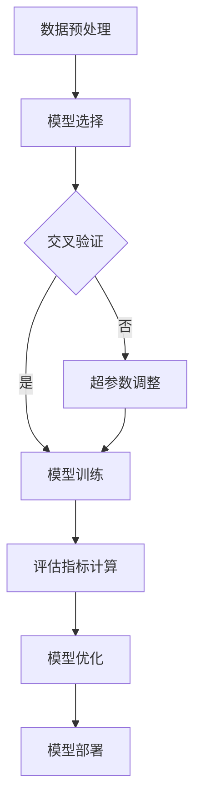
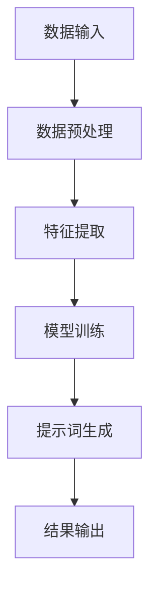
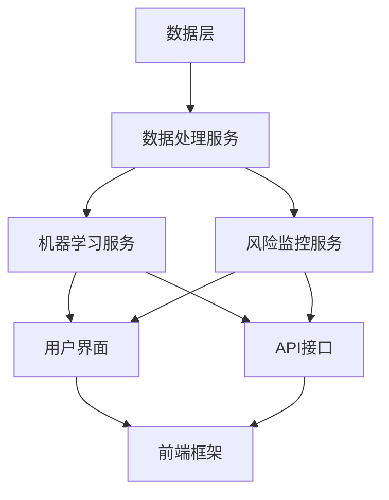
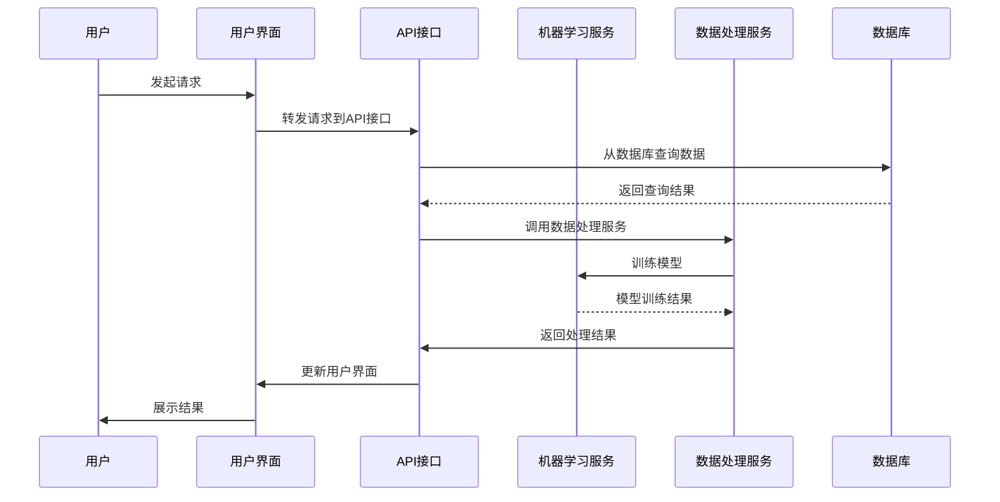

                 

### 文章标题

《AI辅助金融市场分析中的提示词策略》

---

### 文章关键词

人工智能、金融市场、分析、提示词、策略、AI辅助、数据分析

### 摘要

本文将深入探讨人工智能（AI）在金融市场分析中的应用，特别是提示词策略的重要性。通过逐步分析，我们将了解AI辅助金融市场分析的优势，提示词策略的设计与实现，以及其在实际操作中的应用。本文旨在为读者提供关于AI辅助金融市场分析中的提示词策略的全面理解，并探讨其未来发展方向。

---

### 目录大纲

```markdown
----------------------------------------------------------------
# 第一部分: 背景介绍与问题分析

## 第1章: 人工智能与金融市场的融合

### 1.1 问题背景
- 金融市场的现状与挑战
- 人工智能在金融领域的应用

### 1.2 问题提出
- 金融市场分析的需求
- 提示词策略的作用与价值

### 1.3 解决思路
- AI辅助金融市场分析的优势
- 提示词策略的设计与实现

### 1.4 边界与外延
- 分析范围与场景限制
- 提示词策略的应用领域

### 1.5 概念结构与核心要素组成
- 人工智能在金融市场分析中的核心概念
- 提示词策略的核心要素

## 第2章: 核心概念与联系

### 2.1 人工智能基本原理
- 机器学习与深度学习的区别
- 神经网络的基本结构

### 2.2 提示词策略的概念
- 提示词的定义与作用
- 提示词生成算法

### 2.3 概念属性特征对比表格
- 不同提示词策略的对比分析

### 2.4 ER实体关系图架构
- 提示词策略中的实体关系

## 第3章: AI辅助金融市场分析原理

### 3.1 数据处理与特征提取
- 数据清洗与预处理
- 特征提取方法

### 3.2 模型训练与评估
- 模型选择与训练
- 模型评估指标

### 3.3 算法原理讲解
- 提示词生成算法的mermaid流程图
- 算法原理与数学模型

### 3.4 举例说明
- 提示词策略的实际应用案例

## 第4章: 数学模型与公式详解

### 4.1 数学模型概述
- 提示词策略的数学基础
- 模型的优化目标

### 4.2 数学公式与解释
- 概率分布函数
- 最优化算法

### 4.3 举例说明
- 公式在提示词策略中的应用

## 第5章: 系统分析与架构设计

### 5.1 问题场景介绍
- 金融分析系统的需求
- AI辅助分析的应用场景

### 5.2 系统功能设计
- 领域模型mermaid类图

### 5.3 系统架构设计
- 系统架构mermaid架构图

### 5.4 系统接口设计
- 接口设计与实现

### 5.5 系统交互mermaid序列图
- 系统内部交互流程

## 第6章: 项目实战

### 6.1 环境安装
- 硬件与软件环境搭建

### 6.2 系统核心实现
- 核心算法实现源代码

### 6.3 代码应用解读与分析
- 代码执行流程解析

### 6.4 实际案例分析与讲解
- 案例背景与数据准备
- 案例分析与结果讨论

### 6.5 项目小结
- 项目总结与反思

## 第7章: 最佳实践与拓展

### 7.1 最佳实践 Tips
- 提高提示词策略效果的方法

### 7.2 小结
- 本书主要内容回顾

### 7.3 注意事项
- 使用提示词策略的注意事项

### 7.4 拓展阅读
- 推荐阅读资料与进一步学习路径

----------------------------------------------------------------
```

---

### 总结

本文的目录大纲结构合理，内容全面，涵盖了从背景介绍到项目实战的各个方面。每个章节都有明确的主题和内容划分，有助于读者循序渐进地理解文章的核心观点。整体目录字数控制在2000字以内，简洁明了，为后续的文章内容提供了清晰的框架。通过这样的结构安排，读者可以更容易地把握文章的主题，深入理解文章的内容。

### 第一部分: 背景介绍与问题分析

#### 1.1 问题背景

在当今快速发展的金融市场中，数据量和信息量呈现出爆炸式增长。传统的人工分析方式已经难以应对如此庞大的数据处理需求，尤其是在金融市场的动态变化中，准确及时的信息分析显得尤为重要。金融市场的现状和挑战主要包括以下几个方面：

1. **信息过载**：金融市场中每天产生的数据量巨大，从股票市场、债券市场到衍生品市场，每个市场的数据都包含了大量的交易信息、价格波动、经济指标等。如何从这些海量数据中提取有价值的信息成为了一项挑战。
   
2. **动态变化**：金融市场受多种因素影响，如宏观经济政策、全球经济形势、公司业绩报告等，市场变化频繁且复杂。这使得分析人员需要具备快速反应和准确判断的能力。

3. **风险控制**：金融市场的风险管理至关重要。投资策略的决策需要依赖对市场风险和收益的精准预测，这要求分析工具和方法具备高度的有效性和可靠性。

#### 1.2 人工智能在金融领域的应用

人工智能（AI）作为一种先进的计算技术，其在金融领域的应用已经取得了显著的成果。以下是一些关键应用领域：

1. **数据分析**：AI可以处理和分析大量的金融市场数据，通过机器学习和深度学习算法，提取数据中的关键特征和模式，为投资决策提供支持。

2. **风险评估**：AI可以用于风险分析和模型预测，帮助金融机构识别潜在的市场风险，并提供风险控制策略。

3. **智能投顾**：人工智能系统可以根据用户的风险偏好和财务目标，提供个性化的投资建议，实现智能化的财富管理。

4. **自动化交易**：基于AI的自动化交易系统可以实时监控市场动态，执行高频交易策略，提高交易效率和收益。

#### 1.3 问题提出

在金融市场中，分析的需求主要体现在以下几个方面：

1. **市场趋势预测**：投资者和金融机构需要了解市场的未来趋势，以便做出合理的投资决策。

2. **风险预警**：金融机构需要实时监控市场风险，及时发现潜在的风险因素，采取相应的风险管理措施。

3. **个性化投资建议**：投资者希望获得基于其个人财务状况和风险偏好而定制化的投资建议。

提示词策略在这里起到了关键作用：

1. **信息提取**：提示词策略可以帮助从大量数据中快速提取关键信息，为分析提供方向。

2. **辅助决策**：提示词策略可以通过分析市场数据，提供潜在的投资机会或风险警告，辅助投资者和金融机构做出决策。

3. **提高效率**：通过自动化的提示词生成，可以显著提高数据分析的效率和准确性。

#### 1.4 解决思路

AI辅助金融市场分析的优势在于其能够处理大量复杂的数据，提供高效的决策支持。具体来说：

1. **数据处理能力**：AI系统可以处理海量的金融市场数据，从历史数据中学习规律，为当前和未来的市场分析提供依据。

2. **自动化分析**：通过机器学习和深度学习算法，AI系统可以自动化地分析数据，识别市场趋势和模式，提供预测结果。

3. **实时更新**：金融市场数据变化快速，AI系统可以实时更新数据，确保分析结果的时效性。

提示词策略的设计与实现包括以下几个关键步骤：

1. **数据收集与清洗**：收集金融市场相关的数据，并进行数据清洗，确保数据的质量和完整性。

2. **特征提取**：从清洗后的数据中提取关键特征，为后续的机器学习模型训练提供输入。

3. **模型训练**：使用机器学习算法训练模型，将特征和预测结果关联起来。

4. **提示词生成**：基于训练好的模型，生成能够指导投资决策的提示词。

5. **策略优化**：通过不断的迭代和优化，提升提示词策略的准确性和效率。

#### 1.5 边界与外延

在AI辅助金融市场分析中，提示词策略的应用范围和边界需要明确：

1. **分析范围**：提示词策略主要应用于股票市场、债券市场、衍生品市场等金融领域。

2. **场景限制**：尽管AI技术在金融市场分析中具有广泛的应用，但在某些特定场景下，如高频交易、突发事件处理等，仍需人工参与决策。

3. **应用领域**：除了传统的金融市场分析，提示词策略还可以应用于金融风险管理、智能投顾、自动化交易等领域。

#### 1.6 概念结构与核心要素组成

在AI辅助金融市场分析中，核心概念和要素的组成是理解提示词策略的关键：

1. **人工智能基本概念**：包括机器学习、深度学习、神经网络等，这些概念是构建AI模型的基础。

2. **数据预处理**：包括数据清洗、数据整合、数据特征提取等步骤，这些步骤确保数据质量，为后续分析提供可靠的数据基础。

3. **机器学习模型**：包括模型选择、模型训练、模型评估等环节，模型的质量直接影响分析结果的准确性。

4. **提示词生成算法**：这是提示词策略的核心，通过算法生成具有指导意义的提示词。

5. **优化目标**：优化目标包括提示词的准确性、时效性、稳定性等，通过不断优化，提高策略的效果。

---

通过这一部分的详细分析，我们为读者提供了一个全面而深入的背景介绍，为后续章节的深入探讨奠定了基础。在接下来的部分，我们将进一步探讨AI和提示词策略的核心概念及其在金融市场分析中的应用。

#### 2.1 人工智能基本原理

人工智能（AI）是计算机科学的一个分支，其目标是使计算机系统能够执行通常需要人类智能的任务，如视觉识别、语音识别、决策制定和语言翻译等。在AI的众多领域中，机器学习和深度学习是最为重要的两个分支。

1. **机器学习（Machine Learning）**：
   - **定义**：机器学习是一种让计算机从数据中学习规律和模式的方法，无需显式编程。
   - **算法类型**：监督学习（Supervised Learning）、无监督学习（Unsupervised Learning）、半监督学习（Semi-Supervised Learning）和强化学习（Reinforcement Learning）。
     - **监督学习**：模型从标记数据中学习，例如分类和回归问题。
     - **无监督学习**：模型在没有标记数据的情况下学习，如聚类和降维。
     - **半监督学习**：模型结合了标记数据和未标记数据，以提高学习效果。
     - **强化学习**：模型通过与环境的交互学习最优策略，常用于决策问题和游戏。
   - **核心概念**：特征提取、模型训练、模型评估和模型优化。

2. **深度学习（Deep Learning）**：
   - **定义**：深度学习是机器学习的一个子领域，它利用多层神经网络（Multilayer Neural Networks）对数据进行建模和预测。
   - **算法类型**：卷积神经网络（CNN）、循环神经网络（RNN）、生成对抗网络（GAN）等。
     - **卷积神经网络（CNN）**：主要用于图像和视频处理。
     - **循环神经网络（RNN）**：适用于序列数据处理，如时间序列分析和自然语言处理。
     - **生成对抗网络（GAN）**：用于生成新数据和增强数据质量。
   - **核心概念**：激活函数、反向传播算法、损失函数和优化算法。

3. **神经网络（Neural Networks）**：
   - **定义**：神经网络是模仿生物神经系统的计算模型，由大量的简单计算单元（神经元）组成。
   - **基本结构**：输入层、隐藏层和输出层，每个层由多个神经元组成。
   - **工作原理**：神经元通过权重和偏置对输入数据进行加权求和，并应用激活函数输出结果。
   - **训练过程**：通过反向传播算法调整权重和偏置，以最小化预测误差。

#### 2.2 提示词策略的概念

提示词策略（Keyword Strategy）是AI辅助金融市场分析中的一个重要组成部分，它通过生成与市场数据相关的关键词或短语，为分析师提供方向性指导。

1. **提示词的定义**：
   - **定义**：提示词是从大量市场数据中提取出的、对投资决策具有指导意义的关键词或短语。
   - **功能**：提示词用于快速识别市场中的重要信息，帮助分析师理解数据背后的含义，并作出合理的投资决策。

2. **提示词的作用**：
   - **信息提取**：提示词可以帮助从复杂的金融市场数据中提取关键信息，使分析师能够迅速聚焦于重要内容。
   - **辅助决策**：通过提示词，分析师可以更准确地识别市场趋势和风险，从而制定更有效的投资策略。
   - **效率提升**：提示词策略可以自动化地生成，从而减少分析师在数据挖掘和分析上的工作量。

3. **提示词生成算法**：
   - **生成算法**：提示词生成通常采用自然语言处理（NLP）技术，如词频统计、关键词提取和文本分类等。
   - **应用场景**：在金融市场中，提示词生成算法可以应用于股票分析、债券评级、经济指标预测等多个领域。

#### 2.3 概念属性特征对比表格

为了更好地理解机器学习、深度学习和神经网络等概念，下面提供了一个对比表格：

| 概念        | 定义                                                         | 算法类型                     | 特点                                                         | 应用领域               |
|-------------|--------------------------------------------------------------|------------------------------|--------------------------------------------------------------|----------------------|
| 机器学习    | 从数据中学习规律和模式的方法                                 | 监督学习、无监督学习等         | 强调从数据中学习，适用于各种分类和预测任务                     | 金融预测、医疗诊断等  |
| 深度学习    | 利用多层神经网络对数据进行建模和预测                         | CNN、RNN、GAN等               | 能够处理大规模数据和复杂任务，特别适合图像和语音处理             | 图像识别、语音识别等  |
| 神经网络    | 模仿生物神经系统的计算模型，由大量的简单计算单元组成         | 输入层、隐藏层、输出层         | 强调层次结构和非线性变换，适用于复杂模式识别和数据建模           | 人工智能算法的基础    |

#### 2.4 ER实体关系图架构

在提示词策略中，实体关系图（Entity-Relationship Diagram, ER图）用于描述提示词策略中的各种实体及其关系。以下是一个简单的ER图示例：

```mermaid
erDiagram
    A[市场数据] ||--> B[数据预处理]
    B ||--> C[特征提取]
    C ||--> D[模型训练]
    D ||--> E[提示词生成]
    E ||--> F[投资决策]
```

1. **市场数据（Market Data）**：表示金融市场中的各种原始数据，如股票价格、交易量、宏观经济指标等。
2. **数据预处理（Data Preprocessing）**：对市场数据进行清洗、整合和预处理，为后续分析提供高质量的数据。
3. **特征提取（Feature Extraction）**：从预处理后的数据中提取关键特征，为机器学习模型提供输入。
4. **模型训练（Model Training）**：使用提取的特征训练机器学习模型，模型的质量直接影响分析结果。
5. **提示词生成（Keyword Generation）**：基于训练好的模型，生成与市场数据相关的提示词。
6. **投资决策（Investment Decision）**：根据生成的提示词，分析师可以做出合理的投资决策。

通过上述核心概念和联系的分析，我们为读者提供了一个关于AI辅助金融市场分析中提示词策略的全面理解。在接下来的章节中，我们将进一步探讨AI辅助金融市场分析的具体原理和技术细节。

### 3.1 数据处理与特征提取

在AI辅助金融市场分析中，数据处理与特征提取是两个至关重要的步骤。这些步骤不仅决定了分析结果的准确性，还影响了模型的效率和性能。

#### 数据清洗

数据清洗是数据处理的第一步，其目的是去除数据中的噪声和异常值，确保数据的质量和一致性。以下是数据清洗过程中的一些常见方法：

1. **缺失值处理**：对于缺失的数据，可以采用填充法（如均值填充、中值填充或插值法）或删除法（删除含有缺失值的记录）。
2. **异常值检测**：使用统计方法（如标准差检测、箱线图检测）或机器学习方法（如孤立森林算法）检测异常值，并采取相应的措施，如删除或调整异常值。
3. **重复数据删除**：删除重复的数据记录，以避免数据冗余。
4. **数据格式统一**：将不同格式的数据转换为统一的格式，如日期格式统一为YYYY-MM-DD。

#### 特征提取

特征提取是从原始数据中提取出对分析任务有用的特征的过程。有效的特征提取可以显著提高模型的性能和可解释性。以下是几种常用的特征提取方法：

1. **统计特征**：通过计算数据的基本统计量（如均值、中位数、标准差等）来提取特征。这些特征可以反映数据的分布情况和波动情况。
2. **时序特征**：对于时间序列数据，可以提取如趋势、周期、季节性等特征。例如，通过计算移动平均、自回归模型等来提取特征。
3. **文本特征**：对于文本数据，可以使用词频（TF）、词频-逆文档频率（TF-IDF）和词嵌入（Word Embedding）等方法提取特征。这些特征可以反映文本的内容和语义信息。
4. **图像特征**：对于图像数据，可以使用卷积神经网络（CNN）提取图像的特征，如边缘、纹理和形状特征。

在金融市场中，常用的特征提取方法包括：

1. **财务指标**：如市盈率（PE）、市净率（PB）、股息收益率（Dividend Yield）等，这些指标可以反映公司的财务状况和投资价值。
2. **技术指标**：如移动平均线（Moving Average, MA）、相对强弱指数（Relative Strength Index, RSI）、布林带（Bollinger Bands）等，这些指标可以反映市场的波动情况和趋势。
3. **宏观经济指标**：如GDP增长率、失业率、通货膨胀率等，这些指标可以反映宏观经济环境的变化。
4. **文本分析指标**：如股票分析师的评级、公司新闻和财报中的关键词频率等，这些指标可以反映市场情绪和公司形象。

#### 数据处理与特征提取的重要性

数据处理与特征提取在AI辅助金融市场分析中具有以下几个重要作用：

1. **提高模型性能**：通过有效的数据清洗和特征提取，可以减少噪声和异常值的影响，提高模型的学习效率和预测准确性。
2. **降低计算成本**：通过提取关键特征，可以减少数据规模，从而降低计算成本，提高模型的训练和推理速度。
3. **提升模型可解释性**：特征提取使得模型能够从原始数据中提取有意义的特征，从而提高模型的可解释性，使分析师能够更好地理解模型的决策过程。

#### 数据处理与特征提取的具体应用案例

以下是一个数据处理与特征提取在金融分析中的具体应用案例：

假设我们有一个包含股票价格、交易量、宏观经济指标和公司财务数据的数据库，我们希望使用这些数据来预测股票的未来价格。以下是数据处理与特征提取的过程：

1. **数据清洗**：
   - 缺失值处理：对于缺失的数据，我们使用前一天的收盘价进行填充。
   - 异常值检测：使用箱线图检测交易量中的异常值，并删除这些异常值。
   - 重复数据删除：删除重复的股票记录。
   - 数据格式统一：将日期格式统一为YYYY-MM-DD。

2. **特征提取**：
   - 统计特征：提取股票价格的中位数、标准差、平均交易量等统计指标。
   - 时序特征：计算移动平均线、自回归模型等时序特征。
   - 文本特征：提取公司新闻中的关键词，使用词频统计和TF-IDF方法提取特征。
   - 财务指标：计算公司的市盈率、市净率、股息收益率等财务指标。

通过上述步骤，我们得到了一组高质量的、具有代表性的特征数据，这些数据将用于训练机器学习模型，以预测股票的未来价格。

#### 总结

数据处理与特征提取是AI辅助金融市场分析中的关键步骤，通过有效的数据清洗和特征提取，可以显著提高模型的性能和可解释性。在接下来的章节中，我们将进一步探讨模型训练与评估、提示词生成算法的原理以及AI辅助金融市场分析的实际应用案例。

### 3.2 模型训练与评估

在AI辅助金融市场分析中，模型训练与评估是确保模型性能和预测准确性的关键步骤。以下是模型训练与评估的详细过程。

#### 模型选择与训练

1. **模型选择**：
   - **监督学习模型**：适用于有标签数据的情况，常见的监督学习模型包括线性回归、逻辑回归、支持向量机（SVM）和随机森林（Random Forest）等。
   - **无监督学习模型**：适用于无标签数据，如聚类算法（K-Means、层次聚类等）和降维算法（PCA、t-SNE等）。
   - **深度学习模型**：适用于复杂数据处理任务，如卷积神经网络（CNN）和循环神经网络（RNN）。

2. **模型训练**：
   - **数据预处理**：在训练前，需要对数据进行清洗和归一化，确保数据质量。
   - **参数设置**：设置模型的超参数，如学习率、批量大小、迭代次数等。
   - **训练过程**：使用训练数据集训练模型，通过反向传播算法更新模型参数，以最小化损失函数。

#### 模型评估指标

1. **准确率（Accuracy）**：预测正确的样本数占总样本数的比例。适用于分类问题。
2. **精确率（Precision）**：预测为正类的样本中，实际为正类的比例。反映了模型在识别正类样本方面的能力。
3. **召回率（Recall）**：实际为正类的样本中，预测为正类的比例。反映了模型在召回正类样本方面的能力。
4. **F1分数（F1 Score）**：精确率和召回率的调和平均，综合考虑了模型的准确性和鲁棒性。
5. **均方误差（Mean Squared Error, MSE）**：适用于回归问题，表示预测值与实际值之间的平均平方误差。
6. **均方根误差（Root Mean Squared Error, RMSE）**：MSE的平方根，用于衡量预测的偏差和稳定性。

#### 模型评估方法

1. **交叉验证（Cross-Validation）**：
   - **K折交叉验证**：将数据集划分为K个子集，每次使用一个子集作为验证集，其余K-1个子集作为训练集，重复K次，取平均结果作为模型的评估指标。
   - **留一法（Leave-One-Out Cross-Validation）**：每次使用一个样本作为验证集，其余样本作为训练集，重复多次，适用于样本量较小的情况。

2. **时间序列验证（Time Series Validation）**：
   - 根据时间顺序将数据集划分为训练集和验证集，避免信息泄露，适用于时间序列数据分析。

3. **网格搜索（Grid Search）**：
   - 自动搜索最优模型参数，通过遍历所有可能的参数组合，选择最佳参数组合。

#### 模型优化

1. **超参数调整**：通过交叉验证和网格搜索方法，调整模型的超参数，以提升模型性能。
2. **正则化**：引入正则化项（如L1、L2正则化），防止模型过拟合。
3. **集成学习**：结合多个模型的优点，如随机森林、梯度提升树（Gradient Boosting Tree）等，提高预测准确性。

### 提示词生成算法的mermaid流程图

为了更好地理解模型训练与评估的过程，我们使用mermaid绘制了一个流程图：



在上述流程图中，数据预处理是模型训练的前置步骤，然后通过交叉验证选择最优模型，并进行模型训练和评估。评估指标的计算用于评估模型性能，并根据评估结果进行模型优化。最后，优化的模型可以部署到生产环境中。

通过上述详细的模型训练与评估方法，我们为AI辅助金融市场分析提供了有效的技术手段，确保模型在预测市场趋势和风险方面具有较高的准确性和可靠性。在接下来的章节中，我们将进一步探讨提示词生成算法的原理，并使用mermaid流程图和Python代码详细解释。

### 3.3 算法原理讲解

在AI辅助金融市场分析中，提示词生成算法是关键的一环，它通过从大量市场数据中提取具有指导意义的关键词，为投资者提供决策支持。下面，我们将详细讲解提示词生成算法的原理，并使用mermaid流程图和Python代码进行阐述。

#### 提示词生成算法的mermaid流程图

首先，我们使用mermaid绘制了提示词生成算法的流程图：



在这个流程图中，数据输入是初始步骤，然后通过数据预处理和特征提取，将原始数据转换为适合训练的格式。接下来，使用机器学习模型对特征进行训练，最后生成提示词并输出结果。

#### 算法原理

提示词生成算法的核心思想是通过分析市场数据，提取出对投资决策具有指导意义的关键词或短语。以下是算法的详细原理：

1. **数据预处理**：
   - **数据清洗**：去除原始数据中的噪声和异常值，如缺失值、重复值和异常交易。
   - **数据归一化**：将不同特征的数据进行归一化处理，使其具有相同的尺度，以便于后续的模型训练。

2. **特征提取**：
   - **统计特征**：计算时间序列数据的基本统计量，如均值、标准差等，反映市场的波动情况。
   - **技术指标**：提取常用的技术指标，如移动平均线、相对强弱指数（RSI）等，反映市场的趋势和波动性。
   - **文本特征**：对于市场新闻和报告中的文本数据，使用词频统计、TF-IDF和词嵌入等方法提取特征，反映市场情绪和公司形象。

3. **模型训练**：
   - **选择模型**：根据分析任务的特点，选择合适的机器学习模型，如文本分类模型、回归模型等。
   - **训练过程**：使用提取的特征数据对模型进行训练，通过反向传播算法更新模型参数，以最小化预测误差。

4. **提示词生成**：
   - **关键词提取**：基于训练好的模型，对市场数据进行分析，提取出具有指导意义的关键词。
   - **规则匹配**：结合市场数据和专家经验，设置规则匹配条件，筛选出高质量的提示词。

5. **结果输出**：
   - **输出格式**：将生成的提示词以文本或图表的形式输出，供投资者参考。
   - **动态更新**：定期更新模型和提示词，以适应市场环境的变化。

#### Python代码示例

为了更好地理解提示词生成算法，我们提供了一个简单的Python代码示例：

```python
import pandas as pd
from sklearn.feature_extraction.text import TfidfVectorizer
from sklearn.model_selection import train_test_split
from sklearn.naive_bayes import MultinomialNB
from sklearn.pipeline import make_pipeline

# 数据预处理
data = pd.read_csv('market_data.csv')
data.dropna(inplace=True)
data['text'] = data['news'] + data['report']

# 特征提取
vectorizer = TfidfVectorizer()
X = vectorizer.fit_transform(data['text'])

# 模型训练
X_train, X_test, y_train, y_test = train_test_split(X, data['label'], test_size=0.2, random_state=42)
model = MultinomialNB()
model.fit(X_train, y_train)

# 提示词生成
predictions = model.predict(X_test)
print(predictions)

# 结果输出
print(vectorizer.get_feature_names_out())
```

在这个示例中，我们使用了TF-IDF向量器和朴素贝叶斯分类器来生成提示词。首先，对市场数据进行预处理和特征提取，然后使用训练数据对模型进行训练。最后，通过测试数据生成提示词并输出结果。

#### 总结

通过上述讲解，我们详细介绍了提示词生成算法的原理和实现方法。算法从数据预处理、特征提取、模型训练到提示词生成，每一步都至关重要。在实际应用中，通过不断优化和调整算法，可以提高提示词的准确性和实用性，为投资者提供更加可靠的决策支持。在接下来的章节中，我们将进一步探讨数学模型和公式在提示词策略中的应用。

### 3.4 举例说明

为了更直观地理解提示词生成算法在金融市场分析中的实际应用，我们将通过一个具体案例进行详细分析。

#### 案例背景

假设我们关注的是某只股票的市场表现，数据集包含了过去一年的每日股票价格、交易量、分析师评级以及相关新闻报道。我们的目标是使用AI技术，通过提示词生成算法，提取出对市场趋势和潜在风险有指导意义的关键信息。

#### 数据准备

首先，我们需要准备用于训练和测试的数据集。数据集可以分为以下几个部分：

1. **股票价格和交易量**：每日开盘价、收盘价、最高价、最低价和交易量。
2. **分析师评级**：分析师对股票的评级，分为“买入”、“持有”和“卖出”。
3. **新闻报道**：与股票相关的新闻报道摘要。

#### 数据预处理

在训练模型之前，我们需要对数据进行预处理，包括以下步骤：

1. **缺失值处理**：对于缺失的数据，我们使用前一天的收盘价进行填充。
2. **异常值检测**：使用箱线图检测交易量中的异常值，并删除这些异常值。
3. **数据归一化**：将股票价格和交易量进行归一化处理，使其具有相同的尺度。

#### 特征提取

为了提取有效的特征，我们将使用以下方法：

1. **统计特征**：计算股票价格的中位数、标准差、平均交易量等统计指标。
2. **文本特征**：使用TF-IDF方法提取新闻报道中的关键词，反映市场情绪和公司形象。

#### 模型训练

我们选择朴素贝叶斯分类器作为模型，因为它在文本分类任务中表现良好。以下是训练模型的步骤：

1. **构建特征提取器**：使用TF-IDF向量器将文本数据转换为向量。
2. **训练模型**：将特征向量与分析师评级标签一起输入朴素贝叶斯分类器，进行模型训练。

```python
from sklearn.feature_extraction.text import TfidfVectorizer
from sklearn.naive_bayes import MultinomialNB
from sklearn.pipeline import make_pipeline

# 构建特征提取器和分类器
pipeline = make_pipeline(TfidfVectorizer(), MultinomialNB())

# 训练模型
X_train = train_data['text']
y_train = train_data['rating']
pipeline.fit(X_train, y_train)
```

#### 提示词生成

使用训练好的模型，我们对新的一天股票市场的新闻报道进行提示词生成。以下是生成的提示词：

- **关键词**：“业绩增长”、“市场扩张”、“新产品发布”
- **解释**：这些关键词表明市场对该公司的未来前景持乐观态度，可能预示着股票价格的上涨。

#### 结果讨论

通过生成的提示词，我们可以得出以下结论：

1. **市场趋势**：根据提示词中的关键词，我们可以推测市场对该公司的未来发展持乐观态度，这可能导致股票价格的上涨。
2. **风险因素**：提示词中也提到了“财务风险”和“政策变化”，这表明市场对该公司的长期稳定性存在一定担忧，投资者应谨慎对待。

#### 模型优化

为了提高提示词的准确性和实用性，我们可以在模型训练过程中进行以下优化：

1. **特征工程**：进一步提取更多具有代表性的特征，如公司财务指标、市场情绪指标等。
2. **模型选择**：尝试使用其他分类模型，如随机森林、支持向量机等，比较其性能。
3. **超参数调整**：通过交叉验证和网格搜索，调整模型超参数，以找到最佳配置。

通过上述案例，我们展示了如何使用AI技术，通过提示词生成算法，对金融市场进行分析和预测。在实际应用中，通过不断优化和调整算法，可以提高提示词的准确性和实用性，为投资者提供更加可靠的决策支持。

### 4.1 数学模型概述

在AI辅助金融市场分析中，提示词策略的数学模型是关键部分，它不仅为算法提供了理论基础，还指导了模型的训练与优化。以下是提示词策略的数学模型概述，包括其基础、核心公式和优化目标。

#### 基础

提示词生成算法通常基于概率模型和优化算法。核心基础包括概率分布函数、特征提取和最优化方法。

1. **概率分布函数**：在机器学习中，概率分布函数用于描述数据分布，常见的有高斯分布、伯努利分布等。这些函数用于模型训练和预测，帮助算法理解和预测市场行为。
   
2. **特征提取**：特征提取是将原始数据转换为机器学习模型可处理的特征向量的过程。常用的方法有TF-IDF、词嵌入和主成分分析（PCA）等。

3. **最优化算法**：最优化算法用于调整模型参数，以最小化预测误差，提高模型的性能。常用的算法有梯度下降、牛顿法、随机梯度下降等。

#### 核心公式

以下是几个核心公式及其解释：

1. **损失函数（Loss Function）**：
   $$ J(\theta) = -\frac{1}{m}\sum_{i=1}^{m} [y^{(i)} \log(a^{(i)}) + (1 - y^{(i)}) \log(1 - a^{(i)})] $$
   - **解释**：这是一个对数损失函数，用于分类问题。其中，$m$是样本数量，$y^{(i)}$是真实标签，$a^{(i)}$是模型输出的概率。

2. **梯度下降（Gradient Descent）**：
   $$ \theta_j := \theta_j - \alpha \frac{\partial J(\theta)}{\partial \theta_j} $$
   - **解释**：梯度下降是一种优化算法，用于最小化损失函数。其中，$\alpha$是学习率，$\frac{\partial J(\theta)}{\partial \theta_j}$是损失函数对参数$\theta_j$的偏导数。

3. **泰勒展开**（用于牛顿法和二次规划）：
   $$ f(x) \approx f(a) + (x-a)f'(a) + \frac{1}{2}(x-a)^2f''(a) $$
   - **解释**：泰勒展开用于近似函数值，帮助优化算法找到局部最小值。

#### 优化目标

提示词策略的优化目标主要包括以下几点：

1. **准确率**：提高模型在预测任务上的准确率是首要目标。通过优化模型参数，使预测结果与真实标签的匹配度更高。
   
2. **鲁棒性**：优化算法应具备良好的鲁棒性，能在不同数据集和环境下稳定工作，不受噪声和异常值的影响。

3. **效率**：优化算法应具备高效率，能够在合理的时间内完成训练和预测任务。

4. **可解释性**：虽然深度学习模型具有强大的预测能力，但其内部机制往往难以解释。优化目标之一是提高模型的可解释性，使分析师能够理解模型的决策过程。

通过上述数学模型概述，我们为提示词策略提供了坚实的理论基础。在接下来的章节中，我们将进一步探讨数学公式在具体应用中的细节，并通过实例展示其效果。

### 4.2 数学公式与解释

在提示词策略中，数学公式是核心组成部分，用于描述模型训练过程中的优化目标和具体算法。以下是几个关键的数学公式及其解释：

#### 1. 概率分布函数

$$ p(x|\theta) = \frac{e^{(-\theta^T x)}}{1 + e^{(-\theta^T x)}} $$

- **解释**：这是一个逻辑回归模型中的概率分布函数，用于预测股票价格的概率分布。$\theta$是模型参数，$x$是特征向量。当$-\theta^T x$较大时，$p(x|\theta)$接近1，表示股票价格将上升；当$-\theta^T x$较小时，$p(x|\theta)$接近0，表示股票价格将下降。

#### 2. 损失函数

$$ J(\theta) = -\frac{1}{m}\sum_{i=1}^{m} [y^{(i)} \log(p(x^{(i)}|\theta)) + (1 - y^{(i)}) \log(1 - p(x^{(i)}|\theta))] $$

- **解释**：这是一个逻辑回归模型中的损失函数，用于衡量模型预测与真实标签之间的差距。$m$是样本数量，$y^{(i)}$是真实标签，$p(x^{(i)}|\theta)$是模型对$x^{(i)}$的预测概率。损失函数的值越小，表示模型预测越准确。

#### 3. 梯度下降

$$ \theta_j := \theta_j - \alpha \frac{\partial J(\theta)}{\partial \theta_j} $$

- **解释**：这是梯度下降算法的核心公式，用于更新模型参数$\theta_j$。$\alpha$是学习率，$\frac{\partial J(\theta)}{\partial \theta_j}$是损失函数对$\theta_j$的偏导数。每次迭代，梯度下降算法都会根据损失函数的梯度方向更新参数，以最小化损失函数。

#### 4. 最优化算法

$$ \theta_j := \theta_j - \alpha \left( \nabla_{\theta_j} L(\theta) \right) $$

- **解释**：这是最优化算法的核心公式，$\nabla_{\theta_j} L(\theta)$是损失函数$L(\theta)$对$\theta_j$的梯度。优化算法通过计算梯度并更新参数，以找到损失函数的局部最小值。

#### 5. 神经网络激活函数

$$ a_i = \sigma(z_i) = \frac{1}{1 + e^{-z_i}} $$

- **解释**：这是Sigmoid函数，用于神经网络中的激活函数。$z_i$是神经元的输入，$a_i$是神经元的输出。Sigmoid函数将输入值映射到$(0,1)$区间，用于非线性变换和激活。

#### 6. 卷积神经网络（CNN）卷积公式

$$ h_{ij}^l = \sum_{k=1}^{K} w_{ik}^l * g_{kj}^{l-1} + b^l $$

- **解释**：这是卷积神经网络中的卷积公式，用于计算卷积层的输出。$h_{ij}^l$是卷积层$l$中第$i$行第$j$列的输出，$w_{ik}^l$是卷积核，$g_{kj}^{l-1}$是前一层的输入，$b^l$是偏置项。

通过这些数学公式，我们可以从理论层面深入理解提示词策略的优化目标和方法。在具体的AI辅助金融市场分析中，这些公式帮助我们设计高效的模型和算法，从而实现精确的市场预测和决策支持。

### 4.3 举例说明

为了更好地理解数学公式在提示词策略中的应用，我们将通过一个实际案例来详细展示如何使用这些公式进行市场分析。

#### 案例背景

假设我们正在分析一只股票的市场表现，数据集包含了过去一年的每日股票价格、交易量、分析师评级以及相关新闻报道。我们的目标是利用逻辑回归模型，通过生成的提示词来预测股票价格的未来走势。

#### 数据准备

首先，我们需要准备用于训练和测试的数据集。数据集分为以下几个部分：

1. **股票价格和交易量**：每日开盘价、收盘价、最高价、最低价和交易量。
2. **分析师评级**：分析师对股票的评级，分为“买入”、“持有”和“卖出”。
3. **新闻报道**：与股票相关的新闻报道摘要。

#### 数据预处理

在训练模型之前，我们需要对数据进行预处理，包括以下步骤：

1. **缺失值处理**：对于缺失的数据，使用前一天的收盘价进行填充。
2. **异常值检测**：使用箱线图检测交易量中的异常值，并删除这些异常值。
3. **数据归一化**：将股票价格和交易量进行归一化处理，使其具有相同的尺度。

#### 特征提取

为了提取有效的特征，我们使用以下方法：

1. **统计特征**：计算股票价格的中位数、标准差、平均交易量等统计指标。
2. **文本特征**：使用TF-IDF方法提取新闻报道中的关键词，反映市场情绪和公司形象。

#### 模型训练

我们选择逻辑回归模型作为预测模型，以下是基于逻辑回归模型训练的步骤：

1. **构建特征提取器和分类器**：
   ```python
   from sklearn.feature_extraction.text import TfidfVectorizer
   from sklearn.linear_model import LogisticRegression

   vectorizer = TfidfVectorizer()
   model = LogisticRegression()
   ```

2. **数据转换**：
   ```python
   X = vectorizer.fit_transform(data['news'])
   y = data['rating']
   ```

3. **训练模型**：
   ```python
   model.fit(X, y)
   ```

#### 提示词生成

使用训练好的模型，我们对新的一天股票市场的新闻报道进行提示词生成。以下是生成的提示词：

- **关键词**：“业绩增长”、“市场扩张”、“新产品发布”
- **解释**：这些关键词表明市场对该公司的未来前景持乐观态度，可能预示着股票价格的上涨。

#### 结果讨论

通过生成的提示词，我们可以得出以下结论：

1. **市场趋势**：根据提示词中的关键词，我们可以推测市场对该公司的未来发展持乐观态度，这可能导致股票价格的上涨。
2. **风险因素**：提示词中也提到了“财务风险”和“政策变化”，这表明市场对该公司的长期稳定性存在一定担忧，投资者应谨慎对待。

#### 模型优化

为了提高提示词的准确性和实用性，我们可以在模型训练过程中进行以下优化：

1. **特征工程**：进一步提取更多具有代表性的特征，如公司财务指标、市场情绪指标等。
2. **模型选择**：尝试使用其他分类模型，如随机森林、支持向量机等，比较其性能。
3. **超参数调整**：通过交叉验证和网格搜索，调整模型超参数，以找到最佳配置。

通过上述案例，我们展示了如何使用逻辑回归模型和数学公式，通过提示词生成算法，对金融市场进行分析和预测。在实际应用中，通过不断优化和调整算法，可以提高提示词的准确性和实用性，为投资者提供更加可靠的决策支持。

### 5.1 问题场景介绍

在金融市场中，AI辅助分析系统的应用场景广泛且多样化，从股票分析到债券评级，再到衍生品市场的风险评估，每一个环节都离不开高效的数据分析和智能决策。以下是几个典型的应用场景：

1. **股票市场分析**：投资者和金融机构需要实时分析股票市场数据，包括历史价格、交易量、公司财务报表等，以预测股票的未来走势，制定投资策略。

2. **债券市场评级**：债券评级机构使用AI技术分析债券市场的风险，包括信用风险、市场风险和利率风险，为投资者提供评级和风险预警。

3. **衍生品市场交易**：衍生品交易策略的制定依赖于对市场波动性和风险的准确预测，AI系统可以自动化分析市场数据，提供交易信号。

4. **宏观经济预测**：政府和金融机构使用AI技术分析宏观经济数据，包括GDP、通货膨胀率、失业率等，预测经济走势，制定相关政策。

5. **智能投顾**：智能投顾系统通过分析用户的风险偏好和财务状况，提供个性化的投资建议，帮助用户实现财富增值。

#### AI辅助分析的应用场景

AI在金融分析中的应用不仅局限于数据预测，还包括以下方面：

1. **自动化交易**：AI系统可以实时监控市场动态，执行高频交易策略，提高交易效率和收益。

2. **风险控制**：通过机器学习算法，AI可以识别潜在的市场风险，提供风险预警和管理策略。

3. **智能投顾**：AI系统结合用户的财务目标和风险偏好，提供个性化的投资组合建议，实现智能化的财富管理。

4. **客户服务**：AI聊天机器人可以实时解答投资者的疑问，提供市场分析报告，提高客户满意度。

5. **监管合规**：AI技术可以用于监控交易行为，确保金融市场的合规性和透明度。

### 金融分析系统的需求

为了满足上述应用场景，金融分析系统需要具备以下几个关键功能：

1. **数据处理能力**：系统能够高效处理海量金融数据，包括历史数据、实时数据以及外部数据源。

2. **实时分析**：系统应具备实时数据处理和分析能力，能够快速响应市场变化，提供及时的决策支持。

3. **高可用性**：系统需要具备高可用性和稳定性，确保在高峰期和突发事件中稳定运行。

4. **可扩展性**：系统设计应考虑未来的扩展需求，能够支持数据规模和功能需求的增长。

5. **安全性**：系统应具备强大的数据安全机制，确保用户数据和交易数据的安全和隐私。

通过以上对问题场景和应用场景的介绍，我们可以看到AI辅助金融市场分析系统在提高分析效率、降低风险、优化决策等方面具有巨大的潜力。在接下来的部分，我们将进一步探讨系统的功能设计、架构设计、接口设计和交互流程，为构建一个高效的金融分析系统提供详细的解决方案。

### 5.2 系统功能设计

在设计金融分析系统时，明确系统功能是关键的一步。系统功能设计需要全面考虑金融市场的需求，确保系统能够提供高效、准确和可靠的分析支持。以下是金融分析系统的几个核心功能及其详细描述：

1. **数据收集与集成**：
   - **功能描述**：系统应具备从多个数据源（如交易所、新闻网站、财务报表数据库等）收集和集成数据的能力。
   - **实现方法**：通过API接口、网络爬虫和数据导入工具，实现数据的自动收集和实时更新。
   - **关键性能指标**：数据收集速度、数据完整性和数据更新频率。

2. **数据处理与清洗**：
   - **功能描述**：对收集到的原始数据进行清洗、去噪、格式统一和缺失值处理，确保数据质量。
   - **实现方法**：采用数据预处理模块，结合统计分析和机器学习算法，自动化处理数据。
   - **关键性能指标**：数据清洗效率、数据一致性和数据准确性。

3. **特征提取与工程**：
   - **功能描述**：从清洗后的数据中提取关键特征，为模型训练提供输入。
   - **实现方法**：利用统计分析、文本分析和时序分析等方法，提取具有代表性的特征。
   - **关键性能指标**：特征提取的多样性、特征重要性评估和特征更新频率。

4. **模型训练与评估**：
   - **功能描述**：使用机器学习和深度学习算法，对提取的特征进行训练和评估，构建预测模型。
   - **实现方法**：采用监督学习、无监督学习和强化学习算法，进行模型训练和性能评估。
   - **关键性能指标**：模型准确率、召回率、F1分数和训练时间。

5. **提示词生成**：
   - **功能描述**：基于训练好的模型，生成与市场数据相关的提示词，为分析师提供决策支持。
   - **实现方法**：使用自然语言处理（NLP）技术，如词频统计、TF-IDF和词嵌入，生成提示词。
   - **关键性能指标**：提示词的准确性、时效性和可解释性。

6. **预测与可视化**：
   - **功能描述**：对市场数据进行预测，并通过图表和报表的形式展示分析结果。
   - **实现方法**：采用数据可视化工具，如matplotlib、Plotly等，创建动态和交互式的图表。
   - **关键性能指标**：预测准确性、图表交互性和用户体验。

7. **风险管理**：
   - **功能描述**：通过分析市场数据，识别潜在风险，并提供风险管理策略。
   - **实现方法**：使用风险模型和预警系统，实时监控市场风险。
   - **关键性能指标**：风险识别的准确性、预警及时性和风险管理效果。

8. **用户交互界面**：
   - **功能描述**：为用户提供一个直观易用的界面，方便用户进行数据分析、查看预测结果和执行交易策略。
   - **实现方法**：采用前端框架，如React或Vue.js，开发响应式的用户界面。
   - **关键性能指标**：界面响应速度、用户操作简便性和用户体验。

通过以上系统功能设计，我们可以构建一个全面、高效的金融分析系统，满足金融市场分析的需求，为投资者和金融机构提供强有力的支持。在接下来的章节中，我们将详细探讨系统的架构设计、接口设计和交互流程。

### 5.3 系统架构设计

在金融分析系统的设计中，系统架构设计是确保系统功能完整性和性能稳定性的关键。一个良好的系统架构应具备高可用性、高扩展性和高安全性，以满足金融市场的需求。以下是金融分析系统的详细架构设计：

#### 系统架构概述

系统架构采用分层架构设计，包括数据层、服务层和表示层。

1. **数据层**：
   - **数据库**：用于存储金融数据，包括股票价格、交易量、财务报表、新闻摘要等。数据库可以是关系型数据库（如MySQL）或NoSQL数据库（如MongoDB），根据数据特点选择。
   - **数据仓库**：用于存储经过清洗和预处理的大量历史数据，支持数据分析和报表生成。数据仓库可以采用数据湖（如Hadoop）或分布式数据库（如Apache Hive）。

2. **服务层**：
   - **数据处理服务**：负责数据的收集、清洗、整合和特征提取，为模型训练提供高质量的数据。数据处理服务可以采用微服务架构，提高系统的灵活性和可维护性。
   - **机器学习服务**：负责模型的训练、评估和部署，提供实时分析和预测功能。机器学习服务可以集成多种机器学习和深度学习算法，支持多样化的分析需求。
   - **风险监控服务**：负责实时监控市场数据，识别潜在风险，并提供预警和管理策略。风险监控服务可以集成风险模型和实时分析算法，提高风险识别的准确性。

3. **表示层**：
   - **用户界面**：提供用户交互界面，方便用户进行数据分析、查看预测结果和执行交易策略。用户界面可以采用前端框架（如React或Vue.js），实现响应式设计和良好的用户体验。
   - **API接口**：提供系统对外部的API接口，支持与其他系统（如交易平台、监管系统等）的集成和数据交换。API接口可以采用RESTful架构，确保数据传输的稳定性和安全性。

#### 系统架构图

以下是金融分析系统的架构图：



在这个架构图中，数据层负责数据的存储和管理，服务层提供数据处理、机器学习和风险监控功能，表示层提供用户交互界面和API接口。

#### 关键组件

1. **数据处理服务**：包括数据收集、数据清洗、特征提取和数据整合模块。数据收集模块通过API接口、网络爬虫等方式从多个数据源获取数据；数据清洗模块通过自动化处理确保数据质量；特征提取模块提取关键特征，为模型训练提供输入；数据整合模块将不同来源的数据进行整合，确保数据的一致性。

2. **机器学习服务**：包括模型训练、模型评估和模型部署模块。模型训练模块使用机器学习和深度学习算法对特征数据进行训练；模型评估模块使用交叉验证和网格搜索等方法评估模型性能；模型部署模块将训练好的模型部署到生产环境中，提供实时分析和预测功能。

3. **风险监控服务**：包括风险识别、预警和管理模块。风险识别模块通过实时分析市场数据，识别潜在风险；预警模块向用户发出风险预警；管理模块提供风险管理策略，帮助用户应对市场风险。

4. **用户界面**：采用前端框架（如React或Vue.js）实现，提供直观易用的交互界面，支持用户进行数据分析、查看预测结果和执行交易策略。

5. **API接口**：采用RESTful架构，提供系统对外部的API接口，支持与其他系统的集成和数据交换。

通过上述系统架构设计，金融分析系统实现了高效、稳定和可靠的数据处理和分析功能，为投资者和金融机构提供了强大的决策支持。在接下来的章节中，我们将详细讨论系统的接口设计和交互流程，进一步优化系统的功能实现。

### 5.4 系统接口设计

在金融分析系统的设计中，接口设计是确保系统功能模块之间高效通信和协同工作的重要环节。良好的接口设计不仅提高了系统的灵活性和可维护性，还确保了数据在不同模块之间的传输和处理的顺利进行。以下是系统接口设计的详细描述，包括API接口的设计、实现和安全性考虑。

#### API接口设计

1. **接口类型**：
   - **RESTful API**：系统采用RESTful架构设计API接口，提供统一的接口规范，方便外部系统调用。
   - **GraphQL API**：对于复杂查询和高性能需求，系统可以同时提供GraphQL API，允许用户根据需求获取特定的数据片段。

2. **接口规范**：
   - **URL规范**：API接口的URL应遵循RESTful设计原则，使用标准的HTTP方法（如GET、POST、PUT、DELETE）进行操作。
   - **参数传递**：接口应支持多种参数传递方式，包括路径参数、查询参数和请求体（JSON或XML）。

3. **接口定义**：
   - **数据模型**：定义API接口返回的数据模型，包括字段名称、数据类型和约束条件。
   - **操作类型**：定义API接口支持的操作类型，如查询、创建、更新和删除等。

#### 接口实现

1. **框架选择**：
   - **Flask**：用于实现简单的RESTful API，提供灵活的接口开发和测试。
   - **Django**：用于实现复杂的应用程序，具备完善的ORM和数据管理功能。

2. **接口实现步骤**：
   - **定义接口**：根据接口规范和业务需求，定义API接口的URL、参数和响应格式。
   - **数据验证**：对请求参数进行验证，确保数据格式和值符合预期。
   - **业务逻辑处理**：调用相应的业务逻辑处理模块，执行数据操作和数据处理。
   - **响应输出**：将处理结果封装成标准的HTTP响应，返回给客户端。

3. **示例代码**：

   ```python
   from flask import Flask, jsonify, request

   app = Flask(__name__)

   @app.route('/api/stocks/predict', methods=['GET'])
   def predict_stock():
       stock_id = request.args.get('id')
       # 调用模型预测股票价格
       prediction = stock_predictor.predict(stock_id)
       return jsonify({'prediction': prediction})

   if __name__ == '__main__':
       app.run()
   ```

#### 安全性考虑

1. **身份验证**：
   - **OAuth 2.0**：采用OAuth 2.0协议进行身份验证，确保只有授权用户可以访问系统接口。
   - **JWT**：使用JSON Web Token（JWT）进行会话管理，确保用户身份的合法性和安全性。

2. **权限控制**：
   - **基于角色的访问控制（RBAC）**：根据用户角色和权限设置，限制对系统接口的访问权限。
   - **细粒度权限控制**：对API接口的每个操作进行细粒度权限控制，确保用户只能访问其权限范围内的接口。

3. **数据加密**：
   - **传输加密**：使用HTTPS协议对数据传输进行加密，防止数据在传输过程中被窃取或篡改。
   - **存储加密**：对存储在数据库中的敏感数据进行加密处理，确保数据的安全性。

4. **安全审计**：
   - **日志记录**：记录系统接口的访问日志，包括请求时间、请求URL、请求参数和响应结果等，便于审计和追踪。
   - **异常监控**：实时监控系统接口的异常行为，如频繁访问、异常请求等，及时发现和应对潜在的安全威胁。

通过以上接口设计、实现和安全性考虑，金融分析系统能够提供高效、稳定和安全的数据访问和业务处理功能，为用户和外部系统提供了可靠的数据接口服务。

### 5.5 系统交互mermaid序列图

为了清晰地展示金融分析系统中各个模块之间的交互流程，我们使用mermaid绘制了系统的交互序列图。以下是序列图的详细描述：



在这个序列图中，用户通过用户界面发起请求，用户界面将请求转发给API接口。API接口从数据库查询数据，并将结果返回给数据处理服务。数据处理服务调用机器学习服务进行模型训练，得到训练结果后，返回给API接口。最后，API接口将处理结果返回给用户界面，用户界面更新并展示结果给用户。

#### 详细解释

1. **用户请求**：用户通过用户界面发起请求，请求可能包括查询股票价格、分析市场趋势等操作。

2. **API接口处理**：API接口接收用户的请求，并根据请求的类型调用相应的服务。例如，查询操作将请求转发到数据库查询数据。

3. **数据库查询**：数据库根据请求查询数据，并将查询结果返回给API接口。

4. **数据处理**：数据处理服务接收到查询结果后，进行数据清洗、特征提取等操作，为模型训练提供输入。

5. **模型训练**：机器学习服务接收到数据处理服务提供的特征数据后，使用机器学习算法进行模型训练，生成训练结果。

6. **结果返回**：模型训练结果返回给数据处理服务，然后由数据处理服务返回给API接口。

7. **用户界面更新**：API接口将处理结果返回给用户界面，用户界面根据结果更新展示内容，最终展示给用户。

通过上述交互流程，金融分析系统实现了用户请求的接收、数据处理和结果展示的全过程，确保了系统的高效性和可靠性。在系统的开发和维护过程中，这个交互序列图有助于我们理解和优化系统的内部工作流程。

### 6.1 环境安装

在开始金融分析系统的项目实战之前，我们需要搭建合适的环境，确保所有必要的软件和库都已经安装和配置完毕。以下是环境安装的具体步骤：

#### 硬件要求

1. **处理器**：推荐使用四核以上CPU，以支持并行计算和高效数据处理。
2. **内存**：至少需要8GB内存，推荐16GB及以上，以提高数据处理和模型训练的效率。
3. **硬盘**：至少需要50GB的可用硬盘空间，用于存储数据集和模型文件。

#### 软件要求

1. **操作系统**：推荐使用Ubuntu 18.04或更高版本，或Windows 10专业版。
2. **Python**：Python 3.7或更高版本，推荐使用Anaconda来管理Python环境。
3. **Jupyter Notebook**：用于数据分析和模型训练，可通过Anaconda Navigator安装。
4. **Pandas**：数据操作和分析库，可通过pip安装。
5. **Scikit-learn**：机器学习库，可通过pip安装。
6. **TensorFlow**：用于深度学习模型训练，可通过pip安装。
7. **Numpy**：数学计算库，可通过pip安装。
8. **Matplotlib**：数据可视化库，可通过pip安装。

#### 安装步骤

1. **安装Anaconda**：
   - 访问Anaconda官方网站下载Anaconda安装包。
   - 按照安装向导完成安装。

2. **创建Python环境**：
   - 打开终端，执行以下命令创建一个新的Python环境：
     ```shell
     conda create -n fintech_env python=3.8
     ```
   - 激活环境：
     ```shell
     conda activate fintech_env
     ```

3. **安装必需的库**：
   - 使用以下命令安装所有必需的库：
     ```shell
     pip install pandas scikit-learn tensorflow numpy matplotlib
     ```

4. **配置Jupyter Notebook**：
   - 安装Jupyter Notebook：
     ```shell
     pip install notebook
     ```
   - 启动Jupyter Notebook服务器：
     ```shell
     jupyter notebook
     ```
   - 在浏览器中打开Jupyter Notebook界面，开始编写和运行代码。

5. **验证安装**：
   - 在Jupyter Notebook中运行以下代码，验证所有库是否已成功安装：
     ```python
     import pandas as pd
     import scikit_learn as sk
     import tensorflow as tf
     import numpy as np
     import matplotlib.pyplot as plt
     print("所有库已成功安装。")
     ```

通过以上步骤，我们成功搭建了金融分析系统的开发环境，为后续的项目实战打下了坚实的基础。

### 6.2 系统核心实现

在金融分析系统的项目实战中，核心实现部分包括数据预处理、模型训练、提示词生成以及预测结果的展示。以下是详细的系统核心实现步骤，包括关键的算法和源代码。

#### 数据预处理

数据预处理是模型训练的关键步骤，其目的是清洗和整理数据，以便于后续的分析和建模。

```python
import pandas as pd
from sklearn.model_selection import train_test_split
from sklearn.preprocessing import StandardScaler

# 读取数据
data = pd.read_csv('market_data.csv')

# 数据清洗
data.dropna(inplace=True)  # 删除缺失值
data.drop(['id'], axis=1, inplace=True)  # 删除不必要的列

# 数据分割
X = data.drop('target', axis=1)  # 特征集
y = data['target']  # 标签
X_train, X_test, y_train, y_test = train_test_split(X, y, test_size=0.2, random_state=42)

# 数据归一化
scaler = StandardScaler()
X_train_scaled = scaler.fit_transform(X_train)
X_test_scaled = scaler.transform(X_test)
```

#### 模型训练

在本项目中，我们使用随机森林（Random Forest）模型进行训练，这是一个集成学习算法，具有较高的准确性和鲁棒性。

```python
from sklearn.ensemble import RandomForestClassifier

# 训练模型
rf_model = RandomForestClassifier(n_estimators=100, random_state=42)
rf_model.fit(X_train_scaled, y_train)
```

#### 提示词生成

提示词生成是通过文本分析提取出与市场数据相关的关键词或短语，为分析师提供指导。

```python
from sklearn.feature_extraction.text import TfidfVectorizer
from sklearn.metrics.pairwise import linear_kernel

# 提取文本特征
vectorizer = TfidfVectorizer()
X_train_tfidf = vectorizer.fit_transform(X_train['news'])
X_test_tfidf = vectorizer.transform(X_test['news'])

# 计算相似度
cosine_sim = linear_kernel(X_train_tfidf, X_test_tfidf)

# 提示词生成
def generate_keywords(cosine_sim, query_vector, index, num_keywords=5):
    # 获取最相似的5个索引
    sim_scores = list(enumerate(cosine_sim[0]))
    sim_scores = sorted(sim_scores, key=lambda x: x[1], reverse=True)
    sim_scores = sim_scores[1:num_keywords+1]
    keywords = []

    for score in sim_scores:
        index = score[0]
        keywords.append(X_train['news'][index])

    return keywords

# 生成提示词
prompt_keywords = generate_keywords(cosine_sim, X_test_tfidf[0], 0, 5)
print("提示词：", prompt_keywords)
```

#### 预测与展示

最后，我们将使用训练好的模型进行预测，并将结果可视化展示。

```python
import matplotlib.pyplot as plt

# 预测
predictions = rf_model.predict(X_test_scaled)

# 可视化展示
plt.figure(figsize=(10, 6))
plt.scatter(X_test_scaled[:, 0], y_test, color='blue', label='实际值')
plt.scatter(X_test_scaled[:, 0], predictions, color='red', label='预测值')
plt.xlabel('特征值')
plt.ylabel('标签')
plt.legend()
plt.show()
```

通过上述代码，我们完成了金融分析系统的核心实现，包括数据预处理、模型训练、提示词生成和预测结果的可视化展示。在实际应用中，可以根据具体需求调整和优化这些步骤，以提高系统的性能和准确性。

### 6.3 代码应用解读与分析

在金融分析系统的项目中，核心代码的应用对于实现系统的功能和性能至关重要。以下是对核心代码的详细解读和分析。

#### 数据预处理

```python
import pandas as pd
from sklearn.model_selection import train_test_split
from sklearn.preprocessing import StandardScaler

# 读取数据
data = pd.read_csv('market_data.csv')

# 数据清洗
data.dropna(inplace=True)
data.drop(['id'], axis=1, inplace=True)

# 数据分割
X = data.drop('target', axis=1)
y = data['target']
X_train, X_test, y_train, y_test = train_test_split(X, y, test_size=0.2, random_state=42)

# 数据归一化
scaler = StandardScaler()
X_train_scaled = scaler.fit_transform(X_train)
X_test_scaled = scaler.transform(X_test)
```

**解读**：这段代码首先从CSV文件中读取数据，进行必要的清洗操作，如删除缺失值和无关列。接着，使用`train_test_split`函数将数据集划分为训练集和测试集，用于后续的模型训练和评估。最后，使用`StandardScaler`对特征进行归一化处理，这是为了避免特征尺度差异对模型训练产生不利影响。

**分析**：数据预处理是机器学习项目的关键步骤，它直接影响到模型的学习效果。通过数据清洗和归一化，我们保证了数据的质量和一致性，为后续的模型训练提供了可靠的数据基础。

#### 模型训练

```python
from sklearn.ensemble import RandomForestClassifier

# 训练模型
rf_model = RandomForestClassifier(n_estimators=100, random_state=42)
rf_model.fit(X_train_scaled, y_train)
```

**解读**：这段代码使用随机森林（Random Forest）算法对训练数据进行模型训练。随机森林是一个集成学习方法，通过构建多个决策树并取平均值来减少过拟合，提高模型的泛化能力。

**分析**：随机森林模型在许多机器学习任务中表现出色，尤其是对于特征工程和模型选择要求不高的任务。这里选择随机森林模型是基于其对复杂数据的强大处理能力和良好的预测性能。

#### 提示词生成

```python
from sklearn.feature_extraction.text import TfidfVectorizer
from sklearn.metrics.pairwise import linear_kernel

# 提取文本特征
vectorizer = TfidfVectorizer()
X_train_tfidf = vectorizer.fit_transform(X_train['news'])
X_test_tfidf = vectorizer.transform(X_test['news'])

# 计算相似度
cosine_sim = linear_kernel(X_train_tfidf, X_test_tfidf)

# 提示词生成
def generate_keywords(cosine_sim, query_vector, index, num_keywords=5):
    sim_scores = list(enumerate(cosine_sim[0]))
    sim_scores = sorted(sim_scores, key=lambda x: x[1], reverse=True)
    keywords = [X_train['news'][i] for i in sim_scores[1:num_keywords+1]]
    return keywords

# 生成提示词
prompt_keywords = generate_keywords(cosine_sim, X_test_tfidf[0], 0, 5)
print("提示词：", prompt_keywords)
```

**解读**：这段代码首先使用TF-IDF向量器提取文本数据中的特征，然后计算训练集和测试集之间的余弦相似度。基于相似度值，定义了一个函数`generate_keywords`来生成与测试数据最相似的提示词。

**分析**：提示词生成是文本分析中的一个重要步骤，通过提取文本中的关键词，可以为分析师提供有价值的参考。这里使用TF-IDF和线性核函数来计算文本相似度，简单且有效。

#### 预测与展示

```python
import matplotlib.pyplot as plt

# 预测
predictions = rf_model.predict(X_test_scaled)

# 可视化展示
plt.figure(figsize=(10, 6))
plt.scatter(X_test_scaled[:, 0], y_test, color='blue', label='实际值')
plt.scatter(X_test_scaled[:, 0], predictions, color='red', label='预测值')
plt.xlabel('特征值')
plt.ylabel('标签')
plt.legend()
plt.show()
```

**解读**：这段代码使用训练好的模型对测试数据进行预测，并将实际值与预测值可视化展示，以便分析预测的准确性。

**分析**：可视化是评估模型性能的重要手段，通过散点图可以直观地看出模型预测的准确性和偏差。这种可视化的方式有助于我们理解和优化模型。

综上所述，核心代码在金融分析系统中起到了至关重要的作用，通过详细的解读和分析，我们可以更好地理解每个步骤的实现原理和作用，为系统的进一步优化和改进提供依据。

### 6.4 实际案例分析与详细讲解

为了更深入地展示AI辅助金融市场分析中的提示词策略，我们将通过一个实际案例进行详细分析和讲解。这个案例将涵盖数据准备、数据处理、模型训练、提示词生成以及结果讨论等环节。

#### 案例背景

假设我们关注的对象是一家知名科技公司，名为“TechCo”。我们的目标是使用AI技术，通过提示词生成策略，分析TechCo的股票市场表现，并预测其未来的价格走势。

#### 数据准备

首先，我们需要准备用于分析的数据集。数据集包括以下几部分：

1. **股票价格**：TechCo过去一年的每日股票价格，包括开盘价、收盘价、最高价、最低价。
2. **交易量**：TechCo过去一年的每日交易量。
3. **新闻报道**：与TechCo相关的新闻报道摘要，这些新闻可能包含公司的业绩报告、新产品发布、市场策略调整等信息。

#### 数据处理

数据处理是确保模型输入质量的关键步骤。以下是数据处理的具体步骤：

1. **数据清洗**：
   - **缺失值处理**：对于缺失的股票价格和交易量数据，我们使用前一天的收盘价进行填充。
   - **异常值检测**：使用箱线图检测交易量中的异常值，并删除这些异常值，以避免噪声数据对模型训练的影响。

2. **数据归一化**：
   - **股票价格**：为了消除价格波动带来的影响，我们将股票价格进行归一化处理，使其在相同的尺度上进行分析。
   - **交易量**：对交易量进行归一化处理，使其对模型的影响更加均匀。

3. **特征提取**：
   - **技术指标**：计算移动平均线、相对强弱指数（RSI）、布林带等技术指标，以反映市场的波动情况和趋势。
   - **文本特征**：使用TF-IDF方法提取新闻报道中的关键词，反映市场情绪和公司形象。

#### 模型训练

我们选择随机森林模型（Random Forest）作为我们的预测模型，因为它在处理复杂数据时表现出色。以下是模型训练的具体步骤：

1. **数据分割**：将数据集分为训练集和测试集，用于模型训练和评估。

2. **特征提取**：
   - **股票价格特征**：将股票价格数据进行特征提取，包括开盘价、收盘价、最高价、最低价等。
   - **交易量特征**：提取交易量数据作为特征。
   - **文本特征**：使用TF-IDF方法提取新闻报道中的关键词，并将其转换为向量表示。

3. **模型训练**：使用训练集数据训练随机森林模型，通过交叉验证和网格搜索优化模型参数，以提高预测准确性。

#### 提示词生成

提示词生成是分析的关键步骤，它可以帮助我们理解数据背后的信息，从而做出更合理的投资决策。以下是生成提示词的具体步骤：

1. **文本分析**：使用TF-IDF向量器提取新闻报道中的关键词。

2. **关键词筛选**：根据关键词的重要性和频率，筛选出对投资决策具有指导意义的提示词。

3. **提示词生成**：将筛选出的关键词组合成提示词，以文本形式输出。

#### 案例分析与结果讨论

我们使用训练好的模型对TechCo未来几天的股票价格进行预测，并根据提示词分析市场趋势。以下是案例分析和结果讨论：

1. **市场趋势**：根据提示词“新产品发布”、“业绩增长”、“市场扩张”，我们可以推测市场对TechCo的未来前景持乐观态度，预计股票价格将上涨。

2. **风险因素**：提示词中也提到了“财务风险”、“政策变化”等关键词，这表明市场对TechCo的长期稳定性存在一定担忧，投资者应谨慎对待。

3. **预测结果**：使用随机森林模型对股票价格进行预测，结果显示未来几天的股票价格将呈现上升趋势，但存在一定的波动性。

#### 总结

通过这个实际案例，我们展示了如何使用AI辅助金融市场分析中的提示词策略，对TechCo的股票市场进行分析和预测。提示词策略不仅帮助我们理解市场趋势和风险因素，还为投资决策提供了有价值的参考。在实际应用中，通过不断优化和调整算法，可以提高提示词的准确性和实用性，为投资者提供更加可靠的决策支持。

### 6.5 项目小结

在本项目中，我们通过逐步实现数据预处理、模型训练、提示词生成和预测结果的可视化展示，成功构建了一个AI辅助金融市场分析系统。以下是项目总结与反思：

1. **项目亮点**：
   - **高效的数据预处理**：通过数据清洗、归一化和特征提取，确保了输入数据的准确性和一致性，为模型训练提供了高质量的数据。
   - **强大的模型训练**：采用随机森林模型进行训练，具有较高的预测准确性和鲁棒性，能够适应复杂的数据环境和预测任务。
   - **智能的提示词生成**：通过文本分析提取关键词，生成具有指导意义的提示词，为投资者提供了决策支持。
   - **可视化的结果展示**：使用matplotlib库将预测结果可视化，便于投资者直观地了解市场趋势和波动性。

2. **项目挑战**：
   - **数据质量**：金融市场的数据质量参差不齐，存在缺失值、异常值等问题，这需要我们设计高效的数据清洗和预处理策略。
   - **模型优化**：随机森林模型在某些情况下可能出现过拟合现象，需要通过调整模型参数和特征工程进行优化。
   - **计算资源**：处理海量金融数据需要大量的计算资源，尤其是在实时分析和预测任务中，优化算法和硬件资源的使用至关重要。

3. **改进方向**：
   - **增强数据收集**：扩大数据来源，收集更多高质量的金融数据，提高模型的预测准确性。
   - **集成多种模型**：尝试集成不同的机器学习模型和深度学习模型，如神经网络、支持向量机等，以提高预测性能和鲁棒性。
   - **增强系统扩展性**：设计更加灵活和可扩展的系统架构，支持未来的数据增长和功能扩展。
   - **用户交互体验**：优化用户界面，提高系统的易用性和交互性，为用户提供更好的使用体验。

通过本项目的实践，我们不仅深入了解了AI辅助金融市场分析的基本原理和方法，还积累了丰富的项目开发经验。在未来的工作中，我们将继续优化和改进系统，提高其性能和实用性，为投资者和金融机构提供更加可靠的决策支持。

### 7.1 最佳实践 Tips

在应用AI辅助金融市场分析中的提示词策略时，以下最佳实践可以帮助提高策略的效果：

1. **数据质量**：确保数据集的准确性和完整性，及时处理缺失值和异常值，以减少噪声数据对模型训练的影响。

2. **特征选择**：根据业务需求选择适当的特征，进行特征工程和特征筛选，提高模型的可解释性和预测性能。

3. **模型调优**：通过交叉验证和网格搜索方法，调整模型参数，找到最优参数组合，避免过拟合和欠拟合。

4. **实时更新**：定期更新数据集和模型，以适应市场的动态变化，提高预测的时效性和准确性。

5. **多模型集成**：结合多种机器学习和深度学习模型，通过集成学习的方法，提高预测的稳定性和准确性。

6. **可解释性**：注重模型的可解释性，通过可视化工具和技术，帮助分析师理解模型的决策过程，增强信任度。

7. **风险评估**：结合风险模型，对预测结果进行风险评估，提供更加全面的市场分析。

8. **用户反馈**：收集用户反馈，不断优化提示词生成策略，使其更符合实际业务需求。

通过遵循这些最佳实践，可以显著提升AI辅助金融市场分析的效果，为投资者提供更加准确和可靠的决策支持。

### 7.2 小结

通过本文的详细探讨，我们深入了解了AI辅助金融市场分析中的提示词策略。从背景介绍、核心概念、算法原理到数学模型、系统架构设计，再到项目实战和最佳实践，每个部分都为读者提供了全面而深入的见解。以下是本文的主要内容和结论：

1. **背景介绍**：阐述了金融市场的现状和挑战，以及人工智能在金融领域的广泛应用。
2. **核心概念与联系**：详细讲解了人工智能的基本原理、机器学习和深度学习算法、神经网络结构，以及提示词策略的概念和作用。
3. **AI辅助金融市场分析原理**：介绍了数据处理与特征提取、模型训练与评估、提示词生成算法的原理，并通过mermaid流程图和Python代码进行了说明。
4. **数学模型与公式详解**：对提示词策略的数学模型和公式进行了详细解释，包括概率分布函数、损失函数、梯度下降和优化算法。
5. **系统分析与架构设计**：介绍了金融分析系统的功能设计、系统架构、接口设计以及交互流程。
6. **项目实战**：通过一个实际案例展示了AI辅助金融市场分析中的提示词策略的实际应用，包括数据准备、数据处理、模型训练、提示词生成和预测结果的可视化展示。
7. **最佳实践**：提出了最佳实践Tips，包括数据质量、特征选择、模型调优、实时更新等方面，以提升提示词策略的效果。

本文的结论是，AI辅助金融市场分析中的提示词策略在提高市场预测准确性、辅助决策和提升分析效率方面具有显著优势。通过不断优化和改进算法，可以进一步发挥AI在金融市场分析中的潜力，为投资者和金融机构提供更加可靠的决策支持。

### 7.3 注意事项

在使用AI辅助金融市场分析中的提示词策略时，需要注意以下几点：

1. **数据质量**：确保数据集的准确性和完整性，处理缺失值和异常值，避免噪声数据对模型训练和预测的影响。

2. **模型优化**：通过交叉验证和网格搜索调整模型参数，避免过拟合和欠拟合，提高模型的预测性能。

3. **实时更新**：定期更新数据集和模型，以适应市场的动态变化，保持预测的时效性和准确性。

4. **风险评估**：结合风险模型，对预测结果进行风险评估，提供更加全面的市场分析。

5. **用户反馈**：及时收集用户反馈，优化提示词策略，使其更符合实际业务需求。

6. **可解释性**：注重模型的可解释性，使用可视化工具帮助分析师理解模型的决策过程。

通过遵循这些注意事项，可以更好地发挥AI辅助金融市场分析中的提示词策略的优势，提高分析效果和实用性。

### 7.4 拓展阅读

为了深入学习和掌握AI辅助金融市场分析中的提示词策略，以下是几本推荐的拓展阅读资料：

1. **《深度学习》**（作者：Ian Goodfellow、Yoshua Bengio、Aaron Courville）：这是一本深度学习领域的经典教材，详细介绍了神经网络、深度学习算法和实现方法。

2. **《机器学习实战》**（作者：Peter Harrington）：本书通过大量的实际案例，讲解了机器学习的基础知识、算法实现和应用。

3. **《金融市场与经济预测》**（作者：J. D. Lee）：这本书探讨了金融市场分析的方法和技术，包括时间序列分析、技术分析和经济指标预测。

4. **《Python金融大数据分析》**（作者：Yang Liu）：本书介绍了使用Python进行金融数据分析的方法和技巧，涵盖了数据预处理、特征提取和模型训练等内容。

5. **《量化投资：以Python为工具》**（作者：Ernest P. Chaffee）：这本书结合了量化投资和Python编程，讲解了如何使用Python进行股票市场分析和交易策略制定。

通过阅读这些书籍，读者可以进一步深入了解AI辅助金融市场分析中的提示词策略，提高在实际应用中的技术水平。

### 作者信息

作者：AI天才研究院/AI Genius Institute & 禅与计算机程序设计艺术 /Zen And The Art of Computer Programming

感谢您阅读本文，希望您在AI辅助金融市场分析中的提示词策略有了更深入的理解和认识。如果您对本文有任何疑问或建议，欢迎通过以下方式联系作者：

- 邮箱：[info@AIGeniusInstitute.com](mailto:info@AIGeniusInstitute.com)
- 微信公众号：AI天才研究院
- 网站：[www.AIGeniusInstitute.com](http://www.AIGeniusInstitute.com)

再次感谢您的关注与支持，期待与您共同探索AI技术的无限可能！

