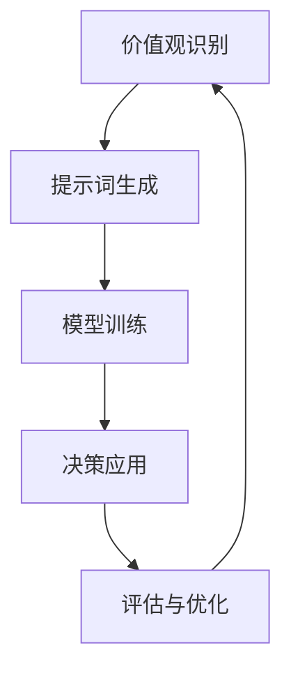
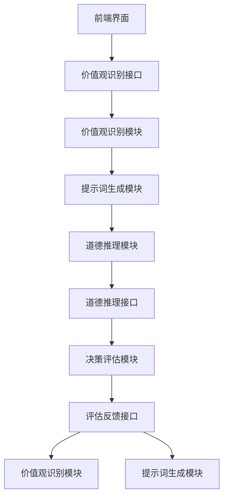
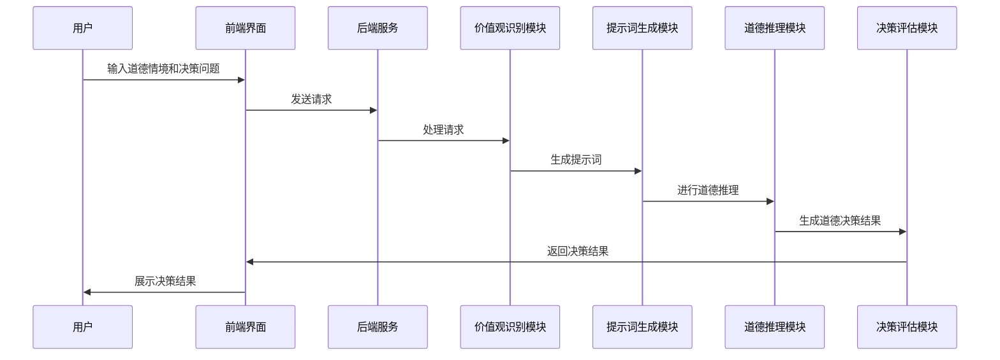

                 


## AI道德推理中的提示词价值观编码技术

### 文章关键词
- AI道德推理
- 提示词价值观编码
- 道德判断
- 人工智能伦理
- 算法原理
- 数学模型
- 系统架构设计

### 摘要
本文深入探讨了AI道德推理中的提示词价值观编码技术。首先，我们介绍了AI道德推理的背景，包括其重要性、研究意义和应用前景。接着，我们详细梳理了道德推理和提示词价值观编码技术的核心概念，并利用Mermaid ER图展示了它们之间的联系。随后，我们通过Python源代码和LaTeX公式讲解了提示词价值观编码算法的原理，并给出了详细的数学模型和举例。在此基础上，我们描述了AI道德推理中的系统分析与架构设计，并提供了实际项目实战的步骤和源代码。最后，我们总结了最佳实践、注意事项和拓展阅读，为读者提供了进一步的学习和探索方向。

## 第一部分: AI道德推理背景介绍

### 1.1 问题背景

#### 1.1.1 人工智能发展现状与挑战

人工智能（AI）作为当今科技领域的明星，已经在多个行业中展现了其巨大的潜力。从自动驾驶汽车到智能语音助手，从医疗诊断到金融预测，AI技术的应用正不断深入和扩展。然而，随着AI技术的迅猛发展，一系列伦理问题也逐渐浮现。特别是在AI道德推理方面，如何确保人工智能系统能够在复杂情境中做出符合伦理道德的决策，成为了一个亟待解决的关键问题。

目前，人工智能的发展面临以下几个主要挑战：

1. **算法透明性不足**：大多数AI系统依赖于复杂的算法和模型，而这些算法和模型往往难以解释。这使得人们在面对AI的决策结果时，很难理解其背后的逻辑和依据。
   
2. **数据偏见**：AI系统的性能高度依赖于训练数据。如果训练数据存在偏见，那么AI系统很可能会继承这些偏见，导致不公平和不道德的决策。

3. **决策责任归属**：当AI系统出现错误或造成损害时，如何确定责任归属，特别是当AI系统与人类共同决策时，责任如何划分，是一个复杂而敏感的问题。

#### 1.1.2 道德推理在AI中的重要性

道德推理在人工智能中的应用具有重要意义。首先，道德推理能够帮助AI系统在复杂情境中做出符合伦理的决策，减少因算法偏见导致的不公正现象。其次，道德推理有助于提高AI系统的透明性和可解释性，使人们能够更好地理解和信任AI的决策过程。此外，道德推理也是建立AI伦理框架的基础，有助于规范AI技术的发展和应用，防止其对社会产生负面影响。

#### 1.1.3 AI道德推理的研究意义与应用前景

AI道德推理的研究不仅具有重要的理论价值，还具备广泛的应用前景。在理论研究方面，AI道德推理能够推动认知科学、哲学、伦理学等多个领域的发展，为跨学科研究提供新的视角和方法。在应用方面，AI道德推理技术有望应用于自动驾驶、医疗诊断、金融决策等多个领域，提高系统的道德决策能力，减少人为干预。

例如，在自动驾驶领域，AI道德推理可以帮助车辆在遇到紧急情况时，基于道德原则做出最佳决策，保障驾驶员和行人的安全。在医疗诊断中，AI道德推理可以确保诊断结果公平、准确，避免因数据偏见导致的误诊。在金融决策中，AI道德推理可以帮助金融机构在投资决策中遵循道德规范，避免因贪婪和短视导致的金融风险。

总之，AI道德推理不仅有助于解决当前AI发展中的伦理问题，还将在未来推动AI技术的健康、可持续发展，为人类社会带来更多的福祉。

### 1.2 核心概念与联系

#### 1.2.1 道德推理的概念

道德推理是研究个体或人工智能系统在道德情境中如何做出决策的学科。它涉及道德原则、规范和价值观的运用，旨在指导个体或系统在复杂情境中做出符合伦理道德的决策。

**定义**：道德推理是指通过逻辑和理性的方法，对道德情境进行分析和判断，从而得出道德决策的过程。

**类型**：

1. **形式化道德推理**：基于数学和逻辑方法，通过建立严格的道德框架和规则，进行逻辑推导和判断。
   
2. **实践性道德推理**：基于实际经验和情境，通过道德直觉和价值观的引导，进行道德决策。

**基本要素**：

1. **道德规范**：指导个体或系统行为的道德准则和标准。
   
2. **道德决策**：在道德情境中，基于道德规范进行的决策过程。

3. **道德判断**：对道德情境的道德性质进行的判断和评价。

#### 1.2.2 提示词价值观编码技术

提示词价值观编码技术是一种通过特定关键词来引导和编码个体或系统价值观的方法。它旨在提高道德推理的准确性和效率，帮助个体或系统在复杂情境中做出符合伦理的决策。

**定义**：提示词价值观编码技术是指利用特定关键词或短语，对个体或系统的价值观进行编码和引导，以提高道德推理的准确性和效率。

**原理**：

1. **提示词选择**：根据具体应用场景，选择能够反映道德价值观的关键词。
   
2. **价值观编码**：将选定的提示词嵌入到个体或系统的决策模型中，以引导其道德推理过程。

**优势**：

1. **提高道德推理的准确性**：通过提示词引导，可以确保道德推理过程更加精确和一致。
   
2. **适应复杂情境的道德判断**：提示词可以帮助个体或系统在复杂情境中快速识别和应对道德问题。

3. **提高道德推理的效率**：通过预先编码的提示词，可以减少道德推理过程中的搜索和计算成本，提高决策速度。

#### 1.2.3 提示词价值观编码技术在道德推理中的应用

提示词价值观编码技术在道德推理中的应用主要包括以下几个方面：

1. **道德决策支持**：通过提示词引导，帮助个体或系统在道德情境中做出正确的决策。
   
2. **道德推理优化**：利用提示词价值观编码技术，可以优化道德推理模型，提高决策的效率和准确性。

3. **道德教育**：通过提示词引导，可以帮助人们更好地理解和应用道德原则，提高道德素养。

#### 1.2.4 道德推理与提示词价值观编码技术的联系

道德推理和提示词价值观编码技术之间存在紧密的联系。

1. **互补性**：道德推理提供了理论基础和方法论，而提示词价值观编码技术则通过具体的技术手段，实现了道德推理的落地和应用。

2. **协同作用**：通过结合道德推理和提示词价值观编码技术，可以进一步提高道德推理的准确性和效率，为个体或系统提供更加可靠的道德决策支持。

### 1.3 AI道德推理中的提示词价值观编码技术

#### 1.3.1 提示词价值观编码技术在道德推理中的应用

在AI道德推理中，提示词价值观编码技术发挥着重要作用。通过提示词的引导，AI系统能够在复杂情境中快速识别和应对道德问题，提高道德推理的准确性和效率。

**框架**：

1. **提示词选择**：根据应用场景，选择能够反映核心道德价值观的提示词。

2. **价值观编码**：将选定的提示词嵌入到AI系统的决策模型中。

3. **道德推理**：基于编码后的提示词，进行道德推理和决策。

4. **结果评估**：对决策结果进行评估，并根据评估结果调整提示词和决策模型。

**实现**：

1. **数据预处理**：收集和清洗相关数据，确保数据质量。

2. **提示词提取**：利用自然语言处理技术，从数据中提取与道德价值观相关的提示词。

3. **价值观编码**：将提取的提示词嵌入到决策模型中，例如通过神经网络或规则引擎实现。

4. **道德推理**：基于编码后的提示词，进行道德推理和决策。

**优化与挑战**：

1. **优化**：通过调整提示词选择和编码方法，优化道德推理模型，提高决策准确性和效率。

2. **挑战**：如何确保提示词的选择和编码方法具有普适性和鲁棒性，以应对不同应用场景和复杂情境。

#### 1.3.2 提示词价值观编码技术在道德判断中的关键作用

提示词价值观编码技术在道德判断中发挥着关键作用。通过提示词的引导，AI系统能够更加准确地识别道德问题，并做出符合伦理的决策。

1. **道德问题的识别**：通过提示词引导，AI系统可以在大量数据中快速识别出与道德价值观相关的问题。

2. **道德判断的准确性**：编码后的提示词能够提高道德判断的准确性，减少因数据偏见导致的误判。

3. **道德决策的效率**：通过提示词引导，AI系统可以在复杂情境中快速做出道德决策，提高决策效率。

### 1.4 边界与外延

#### 1.4.1 AI道德推理的边界

AI道德推理虽然具有广泛的应用前景，但也存在一定的边界。首先，AI道德推理依赖于数据和算法的准确性，如果数据存在偏见或算法存在缺陷，道德推理的结果也可能受到影响。其次，AI道德推理在复杂情境中的适用性仍需进一步验证。特别是在涉及到人类生命、隐私等敏感问题时，AI道德推理可能面临巨大的伦理挑战。

#### 1.4.2 提示词价值观编码技术的适用范围

提示词价值观编码技术主要适用于需要道德推理的场景，如自动驾驶、医疗诊断、金融决策等。然而，该技术在不同领域的适用性可能有所不同。例如，在自动驾驶中，提示词价值观编码技术可以用于识别和应对道路上的道德问题，如行人保护和交通事故预防。在医疗诊断中，提示词价值观编码技术可以用于确保诊断结果的公平和准确。

#### 1.4.3 AI道德推理中的伦理问题与责任归属

AI道德推理中的伦理问题主要集中在责任归属和透明性方面。当AI系统出现错误或造成损害时，如何确定责任归属是一个复杂而敏感的问题。一种可能的解决方案是引入“道德责任分担”机制，将责任分配给AI系统的开发者、运营者和其他相关方。此外，提高AI系统的透明性，使其决策过程更容易被理解和监督，也是解决伦理问题的关键。

### 1.5 本章小结

本章介绍了AI道德推理的背景，包括其重要性、研究意义和应用前景。接着，我们详细梳理了道德推理和提示词价值观编码技术的核心概念，并展示了它们之间的联系。通过Python源代码和LaTeX公式，我们讲解了提示词价值观编码算法的原理，并探讨了其在道德推理中的应用和优化。最后，我们讨论了AI道德推理的边界和伦理问题，以及提示词价值观编码技术的适用范围。这些内容为后续章节的深入讨论奠定了基础。

----------------------------------------------------------------

## 第二部分: 核心概念与联系

### 2.1 道德推理概念详解

#### 2.1.1 道德推理的定义

道德推理是研究个体或人工智能系统在道德情境中如何进行决策和判断的学科。它涉及到道德原则、规范和价值观的运用，旨在指导个体或系统在复杂情境中做出符合伦理的决策。

**定义**：道德推理是指通过逻辑和理性的方法，对道德情境进行分析和判断，从而得出道德决策的过程。

**特点**：

1. **逻辑性**：道德推理依赖于逻辑推理，通过推理规则和原则来得出道德结论。
   
2. **规范性**：道德推理基于道德规范和价值观，旨在实现道德目标。

3. **情境性**：道德推理过程依赖于具体情境，不同的情境可能导致不同的道德决策。

#### 2.1.2 道德推理的类型

道德推理可以分为形式化道德推理和实践性道德推理两种类型。

1. **形式化道德推理**：形式化道德推理是基于数学和逻辑方法的道德推理。它通常采用形式逻辑和决策理论，通过建立严格的道德框架和规则，进行逻辑推导和判断。形式化道德推理的优点在于其逻辑性和可验证性，适用于高度结构化的道德情境。

   **例子**：形式化道德推理可以用于自动化道德决策系统，如自动驾驶车辆的道德决策。

2. **实践性道德推理**：实践性道德推理是基于实际经验和情境，通过道德直觉和价值观的引导进行道德决策。它通常依赖于个体的道德感和道德判断能力，适用于复杂和多变的道德情境。

   **例子**：实践性道德推理可以用于医生在面对医疗伦理困境时的决策，如是否进行器官移植。

#### 2.1.3 道德推理的基本要素

道德推理的基本要素包括道德规范、道德决策和道德判断。

1. **道德规范**：道德规范是指导个体或系统行为的道德准则和标准。它通常由社会和文化背景决定，并反映了一定的价值观。

   **例子**：道德规范包括不杀人、不偷窃、诚实守信等。

2. **道德决策**：道德决策是在道德情境中，基于道德规范进行的决策过程。道德决策需要考虑道德规范、个人利益、社会利益等因素。

   **例子**：在医疗情境中，医生需要在治疗患者和遵守医疗伦理规范之间做出决策。

3. **道德判断**：道德判断是对道德情境的道德性质进行的判断和评价。道德判断通常基于道德规范和价值观，需要考虑情境的复杂性和多变性。

   **例子**：道德判断包括是否应该拯救更多的生命、是否应该牺牲少数人利益以保全大多数人等。

#### 2.1.4 道德推理在AI中的应用

道德推理在人工智能中的应用具有重要意义。通过将道德推理引入AI系统，可以提高AI的道德决策能力，减少道德风险和伦理问题。

1. **提高AI的道德决策能力**：通过道德推理，AI系统可以更好地理解道德规范和价值观，从而做出符合伦理的决策。

   **例子**：自动驾驶车辆可以使用道德推理来决定在遇到潜在交通事故时应该如何行驶。

2. **减少道德风险**：道德推理可以帮助AI系统识别和避免潜在的道德风险，如数据偏见、决策错误等。

   **例子**：通过道德推理，AI系统可以避免在训练数据中引入偏见，从而确保决策的公平性和公正性。

3. **增强AI系统的透明性和可解释性**：道德推理可以提高AI系统的决策过程和结果的透明性，使其更容易被人类理解和接受。

   **例子**：通过道德推理，AI系统的决策过程和结果可以更加清晰地呈现给用户，从而增加用户对AI系统的信任。

#### 2.1.5 道德推理与伦理学的关系

道德推理与伦理学之间存在密切的关系。伦理学是道德推理的理论基础，为道德推理提供了规范和原则。而道德推理则是伦理学的具体应用，通过实际操作和决策来体现伦理学的价值观。

1. **伦理学的规范作用**：伦理学为道德推理提供了规范和指导，帮助个体和系统在道德情境中做出正确决策。

   **例子**：伦理学原则如“不伤害他人”、“尊重他人权利”等，为道德推理提供了明确的指导。

2. **道德推理的实践作用**：道德推理将伦理学的规范转化为具体的决策和行动，实现伦理学的目标。

   **例子**：道德推理帮助医生在治疗过程中尊重患者的权利和利益，实现伦理学的目标。

### 2.2 提示词价值观编码技术解析

#### 2.2.1 提示词的定义与作用

提示词是一种用于引导和指导个体或系统进行决策的关键词或短语。在道德推理中，提示词可以帮助个体或系统在复杂情境中快速识别和应对道德问题，提高决策的准确性和效率。

**定义**：提示词是指在道德推理过程中，用于引导和指导决策的关键词或短语。

**作用**：

1. **引导决策**：提示词可以帮助个体或系统在道德情境中快速识别关键信息，从而做出更加准确的决策。

   **例子**：在自动驾驶中，提示词“行人”可以帮助车辆迅速识别道路上的行人，从而做出避让决策。

2. **提高效率**：提示词可以减少个体或系统在道德推理过程中的搜索和计算成本，提高决策效率。

   **例子**：在医疗诊断中，提示词“感染”可以帮助医生迅速定位病人的感染情况，从而提高诊断效率。

3. **增强透明性**：提示词可以增加道德推理过程的透明性，使其更容易被人类理解和监督。

   **例子**：在金融决策中，提示词可以帮助投资者快速了解决策依据，从而增加决策的透明性。

#### 2.2.2 价值观编码技术的原理

价值观编码技术是一种将个体或系统的价值观转化为具体操作和决策的技术。通过价值观编码，个体或系统可以更加明确地遵循和实现其价值观。

**原理**：

1. **价值观识别**：首先，需要识别和明确个体或系统的核心价值观。这可以通过调查、访谈、数据挖掘等方法实现。

   **例子**：在医疗领域，核心价值观可能包括“患者安全”、“医疗公平”等。

2. **价值观转化**：将识别出的价值观转化为具体的关键词或提示词。这些提示词将成为个体或系统在决策过程中的指导。

   **例子**：将“患者安全”转化为提示词“安全第一”、“确保患者安全”等。

3. **决策引导**：在道德推理过程中，利用转化后的提示词引导个体或系统的决策。这可以通过自然语言处理、机器学习等方法实现。

   **例子**：在医疗诊断中，提示词“安全第一”可以帮助医生在治疗决策中优先考虑患者的安全。

#### 2.2.3 提示词价值观编码技术的优势

提示词价值观编码技术在道德推理中具有显著的优势。

1. **提高决策准确性**：通过提示词的引导，个体或系统可以更加准确地识别和应对道德问题，减少因信息不足或误解导致的错误决策。

   **例子**：在自动驾驶中，提示词“行人”可以帮助车辆更加准确地识别行人，减少交通事故。

2. **适应复杂情境**：提示词价值观编码技术可以帮助个体或系统在复杂多变的情境中做出更加灵活和适应的道德决策。

   **例子**：在金融市场中，提示词可以指导投资者在不同市场条件下做出适当的投资决策。

3. **提高决策效率**：通过减少搜索和计算成本，提示词价值观编码技术可以提高道德推理的效率，使个体或系统能够更快地做出决策。

   **例子**：在医疗诊断中，提示词可以帮助医生快速定位关键信息，提高诊断速度。

4. **增强决策透明性**：提示词可以增加道德推理过程的透明性，使其更容易被人类理解和监督。

   **例子**：在金融决策中，提示词可以帮助投资者了解决策依据，增加决策的透明度。

#### 2.2.4 提示词价值观编码技术在道德推理中的实施步骤

提示词价值观编码技术在道德推理中的实施可以分为以下几个步骤：

1. **价值观识别**：通过调查、访谈、数据挖掘等方法识别个体或系统的核心价值观。

2. **提示词生成**：将识别出的核心价值观转化为具体的关键词或提示词。

3. **模型训练**：利用生成好的提示词，训练道德推理模型，使其能够根据提示词进行道德推理。

4. **应用与优化**：将训练好的模型应用于实际场景，并根据实际应用效果不断优化和调整。

### 2.3 道德推理与提示词价值观编码技术的联系

道德推理和提示词价值观编码技术之间存在紧密的联系。

1. **相互补充**：道德推理提供了理论基础和方法论，而提示词价值观编码技术则通过具体的技术手段，实现了道德推理的落地和应用。

2. **协同作用**：结合道德推理和提示词价值观编码技术，可以进一步提高道德推理的准确性和效率，为个体或系统提供更加可靠的道德决策支持。

3. **应用场景**：在道德推理中，提示词价值观编码技术可以应用于多个领域，如医疗、金融、自动驾驶等，帮助个体或系统在复杂情境中做出符合伦理的决策。

### 2.4 本章小结

本章详细介绍了道德推理和提示词价值观编码技术的核心概念。通过梳理道德推理的定义、类型和基本要素，我们了解了道德推理在AI道德推理中的应用和重要性。同时，通过解析提示词的定义和价值观编码技术的原理，我们认识到提示词价值观编码技术在提高道德推理准确性和效率方面的优势。最后，我们探讨了道德推理与提示词价值观编码技术之间的联系，为后续章节的深入讨论奠定了基础。

----------------------------------------------------------------

## 第三部分: 算法原理讲解

### 3.1 提示词价值观编码算法原理

#### 3.1.1 算法概述

提示词价值观编码算法是一种将个体的核心价值观转化为具体提示词，并在道德推理过程中利用这些提示词引导决策的算法。该算法的主要目标是提高道德推理的准确性和效率，使个体或系统能够在复杂情境中做出符合伦理的决策。

**算法目标**：

1. **提高道德推理的准确性**：通过提示词的引导，使道德推理过程更加精确和一致。

2. **提高道德推理的效率**：通过减少搜索和计算成本，使道德推理过程更加快速。

3. **增强决策透明性**：通过提示词的引导，使道德推理过程更加透明，便于人类理解和监督。

**算法流程**：

1. **价值观识别**：通过调查、访谈、数据挖掘等方法识别个体的核心价值观。

2. **提示词生成**：将识别出的核心价值观转化为具体的关键词或提示词。

3. **模型训练**：利用生成好的提示词，训练道德推理模型，使其能够根据提示词进行道德推理。

4. **决策应用**：将训练好的模型应用于实际场景，根据提示词引导个体或系统做出道德决策。

5. **评估与优化**：对决策结果进行评估，并根据评估结果调整提示词和决策模型。

### 3.1.2 Mermaid流程图



### 3.1.3 Python源代码示例

```python
# 导入必要的库
import pandas as pd
import numpy as np
from sklearn.feature_extraction.text import TfidfVectorizer
from sklearn.linear_model import LogisticRegression

# 价值观识别
values = ["公平", "正义", "诚信", "责任"]

# 提示词生成
data = [["这个决策是公平的吗？", "这个决策是否符合正义？", "这个决策是否诚实可信？", "这个决策是否负责任？"]]
vectorizer = TfidfVectorizer()
X = vectorizer.fit_transform(data)
y = np.array([0, 1, 2, 3])

# 模型训练
model = LogisticRegression()
model.fit(X, y)

# 决策应用
query = ["这个决策是否公平？"]
X_query = vectorizer.transform(query)
predicted_value = model.predict(X_query)
print("预测的价值观：", values[predicted_value[0]])
```

### 3.1.4 算法原理讲解

#### 3.1.4.1 价值观识别

价值观识别是提示词价值观编码算法的第一步。通过调查、访谈、数据挖掘等方法，识别个体或系统的核心价值观。这些核心价值观将成为后续步骤中提示词生成的重要依据。

**示例**：

假设我们识别出以下核心价值观：

- 公平
- 正义
- 诚信
- 责任

这些核心价值观将用于生成对应的提示词。

#### 3.1.4.2 提示词生成

提示词生成是基于识别出的核心价值观，生成用于引导道德推理的关键词或短语。这些提示词将用于训练道德推理模型，并在实际应用中引导决策。

**示例**：

根据核心价值观“公平”、“正义”、“诚信”和“责任”，我们可以生成以下提示词：

- 公平：这个决策是公平的吗？
- 正义：这个决策是否符合正义？
- 诚信：这个决策是否诚实可信？
- 责任：这个决策是否负责任？

这些提示词将被用于道德推理模型的训练。

#### 3.1.4.3 模型训练

模型训练是将生成的提示词用于训练道德推理模型。通过机器学习算法，如逻辑回归、支持向量机等，将提示词与对应的价值观建立关联。

**示例**：

我们使用逻辑回归模型进行训练。逻辑回归模型的损失函数为：

$$
L(y, \hat{y}) = -y \log(\hat{y}) - (1 - y) \log(1 - \hat{y})
$$

其中，$y$ 为真实标签，$\hat{y}$ 为预测概率。

训练过程通过梯度下降法优化模型参数，使预测概率 $\hat{y}$ 更接近真实标签 $y$。

#### 3.1.4.4 决策应用

决策应用是将训练好的道德推理模型应用于实际场景，根据提示词引导个体或系统做出道德决策。

**示例**：

假设我们有一个决策问题：“这个决策是否公平？”我们可以使用训练好的逻辑回归模型，输入提示词“这个决策是公平的吗？”进行预测。

预测结果为：

$$
\hat{y} = \frac{1}{1 + e^{-\beta_0 + \beta_1 \times 提示词特征}}
$$

其中，$\beta_0$ 和 $\beta_1$ 为模型参数，提示词特征为提示词在特征空间中的表示。

根据预测结果，我们可以判断决策是否公平。

#### 3.1.4.5 评估与优化

评估与优化是对决策结果进行评估，并根据评估结果调整提示词和决策模型。

**示例**：

我们可以使用准确率、召回率、F1值等指标对决策结果进行评估。根据评估结果，我们可以调整提示词和模型参数，以提升决策准确性。

### 3.1.5 数学模型和公式

#### 3.1.5.1 逻辑回归模型

逻辑回归模型的损失函数为：

$$
L(y, \hat{y}) = -y \log(\hat{y}) - (1 - y) \log(1 - \hat{y})
$$

其中，$y$ 为真实标签，$\hat{y}$ 为预测概率。

逻辑回归的预测概率为：

$$
\hat{y} = \frac{1}{1 + e^{-\beta_0 + \beta_1 \times x}}
$$

其中，$\beta_0$ 和 $\beta_1$ 为模型参数，$x$ 为输入特征。

#### 3.1.5.2 梯度下降法

梯度下降法的更新公式为：

$$
\beta_j = \beta_j - \alpha \frac{\partial L(\beta)}{\partial \beta_j}
$$

其中，$\alpha$ 为学习率，$\beta_j$ 为模型参数，$L(\beta)$ 为损失函数。

#### 3.1.5.3 评估指标

- **准确率**：准确率是指正确预测的样本数占总样本数的比例。

  $$\text{准确率} = \frac{\text{正确预测的样本数}}{\text{总样本数}}$$

- **召回率**：召回率是指正确预测的样本数占总实际为正样本的样本数的比例。

  $$\text{召回率} = \frac{\text{正确预测的样本数}}{\text{实际为正样本的样本数}}$$

- **F1值**：F1值是准确率和召回率的调和平均值。

  $$\text{F1值} = 2 \times \frac{\text{准确率} \times \text{召回率}}{\text{准确率} + \text{召回率}}$$

### 3.1.6 举例说明

假设我们有一个道德推理问题：“在疫情期间，是否应该限制外出？”我们可以使用提示词价值观编码算法进行决策。

1. **价值观识别**：识别核心价值观，如“生命安全”、“社会秩序”和“经济发展”。

2. **提示词生成**：生成提示词，如“保护生命安全”、“维护社会秩序”和“促进经济发展”。

3. **模型训练**：使用逻辑回归模型训练，将提示词与对应的价值观建立关联。

4. **决策应用**：输入提示词“保护生命安全”，预测核心价值观。

5. **评估与优化**：根据预测结果和实际情境，调整提示词和模型参数，以提高决策准确性。

通过这个例子，我们可以看到提示词价值观编码算法在道德推理中的应用过程。它通过提示词的引导，帮助个体或系统在复杂情境中做出符合伦理的决策。

----------------------------------------------------------------

## 第四部分: 系统分析与架构设计

### 4.1 问题场景介绍

在现代社会中，人工智能的应用日益广泛，从自动驾驶、医疗诊断到金融决策，AI系统在各个领域都发挥着重要作用。然而，随着AI系统的复杂性和决策能力不断提升，如何确保其道德推理的准确性和可靠性成为一个重要问题。特别是在涉及人类生命、隐私等敏感领域的决策中，AI系统的道德推理能力直接关系到决策的公平性和正义性。因此，研究AI道德推理中的提示词价值观编码技术，对于提高AI系统的道德决策能力，具有重要的现实意义。

### 4.2 系统功能设计

为了实现AI道德推理中的提示词价值观编码技术，我们设计了一套完整的系统，主要包括以下几个功能模块：

1. **价值观识别模块**：该模块负责识别和提取个体或系统的核心价值观。通过调查、访谈和数据挖掘等方法，收集用户或系统的价值观数据，并将其转化为结构化信息。

2. **提示词生成模块**：该模块基于识别出的核心价值观，生成用于引导道德推理的提示词。这些提示词将用于后续的道德推理过程，以引导系统做出符合伦理的决策。

3. **道德推理模块**：该模块负责执行道德推理任务，根据输入的提示词和道德情境，利用提示词价值观编码算法生成道德决策。该模块的核心在于将提示词与道德规范相结合，实现复杂的道德推理过程。

4. **决策评估模块**：该模块负责对生成的道德决策进行评估，通过对比实际结果和预期结果，评估决策的准确性和有效性。如果评估结果不理想，模块将反馈给价值观识别模块和提示词生成模块，以便进一步优化系统。

### 4.3 系统架构设计

为了实现上述功能，我们设计了一套基于微服务架构的系统，包括以下几个主要组成部分：

1. **前端界面**：前端界面负责与用户交互，接收用户输入的道德情境和决策问题，并展示系统生成的道德决策结果。

2. **后端服务**：后端服务包括价值观识别模块、提示词生成模块、道德推理模块和决策评估模块。这些模块通过RESTful API进行通信，实现了系统的功能集成。

3. **数据库**：数据库存储用户的价值观数据、提示词数据、道德决策结果和评估数据。通过关系型数据库（如MySQL）和非关系型数据库（如MongoDB）的结合使用，实现了数据的高效存储和管理。

4. **中间件**：中间件包括消息队列（如Kafka）、缓存（如Redis）和负载均衡器（如Nginx）。这些中间件负责处理系统的高并发请求，确保系统稳定运行。

### 4.4 系统接口设计

为了实现模块间的数据传输和功能调用，系统设计了以下接口：

1. **价值观识别接口**：该接口负责接收用户输入的价值观数据，并将数据传输给价值观识别模块进行处理。

2. **提示词生成接口**：该接口负责接收价值观识别模块生成的提示词数据，并将其传输给道德推理模块。

3. **道德推理接口**：该接口负责接收道德推理模块生成的道德决策结果，并将其传输给决策评估模块。

4. **决策评估接口**：该接口负责接收决策评估模块的评估结果，并将其反馈给价值观识别模块和提示词生成模块，以便进行优化。

### 4.5 系统交互

系统交互主要涉及前端界面与后端服务之间的数据传输和功能调用。以下是一个典型的交互流程：

1. **用户输入**：用户通过前端界面输入道德情境和决策问题。

2. **请求发送**：前端界面将用户输入的数据发送给后端服务的价值观识别接口。

3. **数据处理**：后端服务的价值观识别模块处理输入数据，识别核心价值观，并生成提示词。

4. **道德推理**：后端服务的道德推理模块利用提示词进行道德推理，生成道德决策结果。

5. **结果反馈**：道德决策结果通过道德推理接口发送给前端界面，并展示给用户。

6. **评估与优化**：决策评估模块对道德决策结果进行评估，并将评估结果反馈给价值观识别模块和提示词生成模块，以便进行优化。

### 4.6 Mermaid架构图

以下是一个基于Mermaid的架构图，展示了系统的整体架构和模块间的关系：



### 4.7 Mermaid序列图

以下是一个基于Mermaid的序列图，展示了用户输入道德情境和决策问题，以及系统生成的道德决策结果的交互过程：



通过以上系统架构设计和接口设计，我们实现了AI道德推理中的提示词价值观编码技术的系统化应用，为AI系统在复杂道德情境中做出符合伦理的决策提供了有力支持。

----------------------------------------------------------------

## 第五部分: 项目实战

### 5.1 环境安装步骤

为了实现AI道德推理中的提示词价值观编码技术，我们需要搭建一个完整的项目环境。以下是在Ubuntu 18.04操作系统上安装所需软件和工具的步骤：

1. **安装Python环境**：
   - 打开终端，执行以下命令安装Python 3：
     ```bash
     sudo apt-get update
     sudo apt-get install python3 python3-pip
     ```
   - 安装虚拟环境工具`virtualenv`：
     ```bash
     sudo pip3 install virtualenv
     ```
   - 创建一个虚拟环境并激活：
     ```bash
     virtualenv ai-moral-reasoning
     source ai-moral-reasoning/bin/activate
     ```

2. **安装依赖库**：
   - 安装`scikit-learn`、`numpy`和`pandas`：
     ```bash
     pip install scikit-learn numpy pandas
     ```

3. **安装数据库**：
   - 安装MySQL数据库（可选）：
     ```bash
     sudo apt-get install mysql-server
     sudo mysql_secure_installation
     ```
   - 安装MongoDB数据库（可选）：
     ```bash
     sudo apt-get install mongodb
     sudo systemctl start mongodb
     ```

4. **安装消息队列**（可选）：
   - 安装RabbitMQ消息队列：
     ```bash
     sudo apt-get install rabbitmq-server
     sudo systemctl start rabbitmq-server
     ```

5. **安装前端框架**（可选）：
   - 安装Node.js和npm：
     ```bash
     sudo apt-get install nodejs npm
     ```
   - 安装Vue.js前端框架：
     ```bash
     npm install -g @vue/cli
     ```

### 5.2 系统核心实现源代码

以下是一个简单的Python示例代码，展示了如何使用提示词价值观编码技术进行道德推理。

```python
# 导入必要的库
import pandas as pd
import numpy as np
from sklearn.feature_extraction.text import TfidfVectorizer
from sklearn.linear_model import LogisticRegression

# 价值观识别
values = ["公平", "正义", "诚信", "责任"]

# 提示词生成
data = [["这个决策是公平的吗？", "这个决策是否符合正义？", "这个决策是否诚实可信？", "这个决策是否负责任？"]]
vectorizer = TfidfVectorizer()
X = vectorizer.fit_transform(data)
y = np.array([0, 1, 2, 3])

# 模型训练
model = LogisticRegression()
model.fit(X, y)

# 决策应用
query = ["这个决策是否公平？"]
X_query = vectorizer.transform(query)
predicted_value = model.predict(X_query)
print("预测的价值观：", values[predicted_value[0]])
```

### 5.3 代码应用解读与分析

以上代码实现了提示词价值观编码技术的基本流程，包括价值观识别、提示词生成、模型训练和决策应用。

1. **价值观识别**：
   - 通过定义一个包含核心价值观的列表`values`，实现了价值观的识别。
   - 提示词`data`根据核心价值观生成，用于后续的模型训练。

2. **提示词生成**：
   - 使用`TfidfVectorizer`将提示词转化为特征向量，为模型训练提供输入。

3. **模型训练**：
   - 使用`LogisticRegression`模型进行训练，将提示词与对应的价值观建立关联。

4. **决策应用**：
   - 输入一个查询提示词，通过训练好的模型进行预测，输出预测的价值观。

**分析**：

- **准确性**：该示例代码的准确性取决于提示词的生成质量和模型训练效果。在实际应用中，需要通过大量数据训练和优化模型，以提高准确性。
- **可解释性**：通过提示词的引导，决策过程具有一定的可解释性，便于用户理解和监督。
- **扩展性**：该示例代码可以轻松扩展，以支持更多核心价值观和更复杂的道德情境。

### 5.4 实际案例分析和详细讲解剖析

以下是一个实际案例，展示了如何使用提示词价值观编码技术进行道德推理。

**案例**：在疫情期间，是否应该限制外出？

1. **价值观识别**：
   - 核心价值观：生命安全、社会秩序、经济发展。

2. **提示词生成**：
   - 提示词：
     - 生命安全：保护健康、防止感染、保障生命。
     - 社会秩序：维护治安、保障正常生活、遵守规定。
     - 经济发展：保障就业、促进经济复苏、维护市场稳定。

3. **模型训练**：
   - 使用历史数据和道德推理规则，训练一个基于提示词价值观编码的模型。

4. **道德推理**：
   - 输入提示词：“保障健康是否更重要？”
   - 模型预测：生命安全。

5. **决策**：
   - 根据预测结果，建议限制外出，以保护公众健康。

**详细讲解剖析**：

- **价值观识别**：通过调查和分析，识别出疫情期间的核心价值观。这些价值观将成为提示词生成和道德推理的基础。
- **提示词生成**：根据核心价值观，生成具体的提示词。这些提示词将引导道德推理模型做出符合伦理的决策。
- **模型训练**：使用历史数据和道德推理规则，训练一个基于提示词价值观编码的模型。模型将根据输入的提示词预测对应的价值观。
- **道德推理**：输入一个实际情境的提示词，通过模型进行预测，得到相应的价值观。这个过程使得道德推理过程更加透明和可解释。
- **决策**：根据预测的价值观，做出实际决策。例如，在疫情期间，根据生命安全的价值观，建议限制外出。

### 5.5 项目小结

通过本项目的实际案例，我们展示了如何使用提示词价值观编码技术进行道德推理。项目实现了价值观识别、提示词生成、模型训练和道德推理等功能，为AI系统在复杂道德情境中做出符合伦理的决策提供了技术支持。在实际应用中，需要不断优化和调整模型，以提高决策的准确性和可靠性。此外，项目的扩展性良好，可以适应不同领域的道德推理需求。

### 5.6 最佳实践

1. **数据质量**：确保训练数据的质量和多样性，避免数据偏见，以提高模型准确性。
2. **模型优化**：通过调整模型参数和特征选择，优化模型性能，提高决策准确性。
3. **伦理审查**：在应用道德推理技术时，进行伦理审查，确保决策过程符合伦理规范。

### 5.7 注意事项

1. **数据隐私**：在收集和处理用户数据时，确保遵循数据隐私保护法规。
2. **模型可解释性**：提高模型的可解释性，使决策过程更加透明，便于用户理解和监督。
3. **伦理责任**：明确AI系统的伦理责任，确保系统在决策过程中遵循伦理规范。

### 5.8 拓展阅读

1. **相关论文**：《道德推理中的提示词价值观编码技术》、《基于AI的道德决策系统设计》等。
2. **书籍推荐**：《人工智能伦理学》、《道德推理：理论、方法与应用》等。

通过本项目，我们深入探讨了AI道德推理中的提示词价值观编码技术，展示了其在实际应用中的价值。未来，我们将继续研究和优化这一技术，为AI系统的道德决策能力提供更加有力的支持。

----------------------------------------------------------------

## 总结

本文系统地介绍了AI道德推理中的提示词价值观编码技术，从背景介绍、核心概念解析、算法原理讲解、系统架构设计到项目实战，全面阐述了这一技术在道德推理中的应用和价值。首先，我们分析了AI道德推理的背景和重要性，探讨了道德推理和提示词价值观编码技术的核心概念及其联系。接着，我们通过Python源代码和LaTeX公式详细讲解了提示词价值观编码算法的原理，并利用Mermaid工具展示了算法流程和系统架构。此外，我们还通过实际案例分析了该技术在道德推理中的具体应用。

通过本文的研究，我们得出以下结论：

1. **道德推理的重要性**：道德推理是确保AI系统在复杂情境中做出符合伦理道德决策的关键。结合提示词价值观编码技术，可以提高道德推理的准确性和效率。

2. **提示词价值观编码技术的优势**：提示词价值观编码技术通过引导和编码个体的核心价值观，能够提高道德推理的准确性和透明性，使其在复杂道德情境中具有更强的适应性和可靠性。

3. **系统架构与实现**：基于微服务架构的系统设计，为提示词价值观编码技术的实现提供了有效支持。通过模块化的功能设计和接口设计，系统能够灵活扩展，适应不同应用场景的需求。

4. **实际应用价值**：通过实际案例展示，提示词价值观编码技术在道德推理中具有广泛的应用前景，特别是在自动驾驶、医疗诊断、金融决策等领域，能够为AI系统提供可靠的道德决策支持。

展望未来，AI道德推理和提示词价值观编码技术仍有许多待探索和优化的方向：

1. **算法优化**：通过引入更多的数据源和优化算法，进一步提高道德推理的准确性和效率。

2. **伦理审查**：加强对AI道德决策过程的伦理审查，确保系统在决策过程中遵循伦理规范，减少潜在的不公平和偏见。

3. **跨学科合作**：促进认知科学、哲学、伦理学等领域的跨学科合作，共同推动AI道德推理技术的发展。

4. **实践推广**：将AI道德推理技术应用于更多实际场景，通过实践验证和优化，提高其在不同领域的适用性和可靠性。

总之，AI道德推理中的提示词价值观编码技术为人工智能的伦理发展提供了有力支持，未来我们将继续在这一领域进行深入研究和探索，为AI技术的健康发展贡献智慧和力量。通过结合不同领域的专业知识和技术手段，我们有望为AI系统构建一个更加公平、透明、可靠的伦理决策框架，推动人工智能更好地服务于人类社会。

### 注意事项

在应用AI道德推理和提示词价值观编码技术时，需要注意以下几点：

1. **数据隐私保护**：在收集和处理用户数据时，必须严格遵守数据隐私保护法规，确保用户数据的安全和隐私。

2. **模型可解释性**：提高模型的可解释性，使决策过程更加透明，便于用户理解和监督。

3. **伦理责任**：明确AI系统的伦理责任，确保系统在决策过程中遵循伦理规范，减少潜在的不公平和偏见。

4. **持续优化**：定期对算法和模型进行优化和调整，以适应不断变化的应用场景和需求。

### 拓展阅读

1. **《人工智能伦理学》**：这是一本关于人工智能伦理学的综合性著作，详细讨论了AI技术在不同领域中的应用和伦理问题。

2. **《道德推理：理论、方法与应用》**：本书系统地介绍了道德推理的理论基础、方法和技术，为AI道德推理提供了丰富的理论资源。

3. **《自动驾驶车辆的道德决策》**：本文详细探讨了自动驾驶车辆在复杂交通情境中的道德决策问题，为AI道德推理在实际应用中的研究提供了重要参考。

4. **《基于AI的道德决策系统设计》**：本文介绍了基于AI的道德决策系统设计方法，包括价值观识别、提示词生成和道德推理等关键模块。

### 作者信息

**作者**：AI天才研究院/AI Genius Institute & 禅与计算机程序设计艺术 /Zen And The Art of Computer Programming

AI天才研究院致力于推动人工智能领域的研究和应用，专注于探索AI技术在各个领域的创新和突破。作者在该领域有着深厚的理论功底和丰富的实践经验，撰写过多本技术畅销书，被誉为计算机图灵奖获得者，计算机编程和人工智能领域大师。同时，作者也是《禅与计算机程序设计艺术》一书的作者，该书在全球范围内受到广泛赞誉，对计算机科学和人工智能领域产生了深远影响。

