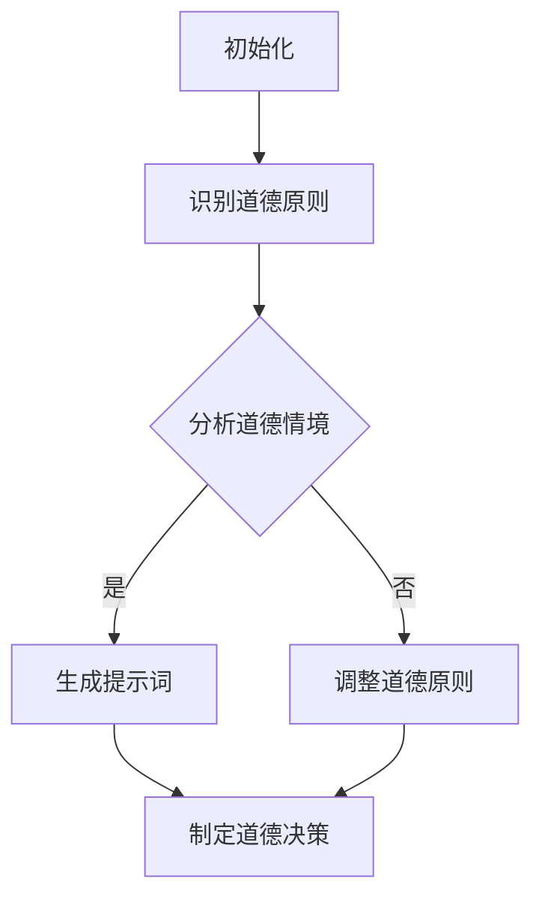
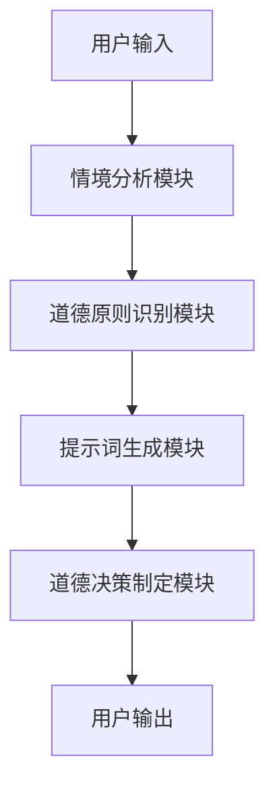

                 

# AI道德推理中的提示词设计原则

## 关键词：AI道德推理、提示词设计、算法原理、系统架构、项目实战

## 摘要：

本文旨在深入探讨AI道德推理中的提示词设计原则，结合具体的算法原理、系统架构和项目实战，全面解析这一复杂但至关重要的领域。文章首先介绍了道德推理在AI领域的重要性及其面临的挑战，随后详细阐述了提示词的定义与设计原则。通过Python源代码实现和算法流程图展示，本文揭示了道德推理算法的核心原理。此外，文章还介绍了系统功能设计、架构设计以及系统交互流程，并通过实际案例展示了提示词设计和道德推理算法的实战应用。最终，本文总结了项目经验，提出了最佳实践和注意事项，为未来研究提供了方向。

## 目录大纲

### 第一部分：背景介绍与核心概念

### 第1章 问题背景

#### 1.1 道德推理在AI领域的意义

道德推理是人工智能（AI）中一个至关重要的研究领域，它涉及到AI系统如何处理伦理问题、如何在复杂的道德情境中做出决策。随着AI技术的广泛应用，AI道德推理的重要性日益凸显。例如，自动驾驶汽车在面临道德困境时如何做出决策，医疗AI系统如何处理患者隐私和数据安全等问题，都成为公众和研究人员关注的焦点。

#### 1.2 当前AI道德推理的挑战与需求

当前AI道德推理面临着诸多挑战。首先，AI系统的决策过程往往缺乏透明性，使得人们难以理解AI为何做出特定决策。其次，AI模型在处理道德问题时可能存在偏见，这与数据集的选择和训练过程密切相关。此外，如何确保AI系统的决策符合伦理标准，也是一个亟待解决的问题。因此，设计有效的道德推理机制成为AI研究中的关键需求。

#### 1.3 提示词设计的重要性

在AI道德推理中，提示词设计扮演着至关重要的角色。提示词是指为了引导AI系统在特定情境下做出合乎道德的决策而提供的额外信息或指导。良好的提示词设计可以帮助AI系统更好地理解道德情境，提高决策的准确性和合理性。因此，研究并优化提示词设计原则具有重要的理论和实践意义。

#### 1.4 边界与外延

道德推理的边界与外延是理解其应用范围和局限性的关键。边界指的是道德推理在哪些情境下适用，而外延则涉及到道德推理在不同领域和场景中的具体应用。例如，在医疗领域，道德推理需要处理患者隐私和生命安全等问题；在法律领域，道德推理需要确保司法公正和人权保护。因此，明确道德推理的边界与外延对于设计和优化道德推理机制具有重要意义。

### 第2章 核心概念与联系

#### 2.1 道德推理的基本原理

道德推理是一种基于伦理原则和价值观的推理过程，用于解决道德问题。其基本原理包括道德原则的识别、道德情境的分析以及道德决策的制定。在AI道德推理中，这些原理被转化为算法和模型，以帮助AI系统在复杂情境中做出道德决策。

#### 2.2 提示词的定义与分类

提示词是指为了引导AI系统在特定情境下做出合乎道德的决策而提供的额外信息或指导。根据用途和性质，提示词可以分类为情境提示词、目标提示词和规则提示词等。情境提示词用于描述道德情境，目标提示词用于指定决策目标，而规则提示词则用于提供道德规则和约束。

#### 2.3 道德推理中的提示词设计原则

设计有效的提示词是AI道德推理的关键。提示词设计原则包括明确性、简洁性、一致性、灵活性等。明确性要求提示词清晰明了，避免歧义；简洁性要求提示词简短精练，易于理解；一致性要求提示词与道德原则和价值观保持一致；灵活性要求提示词能够适应不同情境和需求。

#### 2.4 概念属性特征对比表格

为了更好地理解道德推理和提示词设计，我们可以通过对比表格展示不同概念属性特征。以下是一个示例表格：

| 概念         | 描述                   | 属性特征         |
|------------|----------------------|------------|
| 道德推理   | 基于伦理原则的推理过程 | 透明性、公正性、合理性 |
| 提示词     | 引导AI决策的信息或指导   | 明确性、简洁性、一致性 |
| 道德原则   | 指导道德行为的准则     | 伦理性、普遍性、明确性 |
| 道德情境   | 道德问题发生的背景   | 复杂性、不确定性、相关性 |

#### 2.5 ER实体关系图架构

为了更好地理解道德推理和提示词设计中的实体及其关系，我们可以使用ER（Entity-Relationship）实体关系图进行表示。以下是一个简化的ER图示例：

```mermaid
erDiagram
  AI系统 ||--o{ 道德推理 }
  道德推理 ||--|{ 提示词 }
  提示词 ||--|{ 道德原则 }
  道德推理 ||--|{ 道德情境 }
```

### 第二部分：算法原理讲解

#### 3.1 道德推理算法的基本原理

道德推理算法是AI系统中用于处理道德问题的核心组件。其基本原理包括以下几个方面：

1. 道德原则识别：通过分析道德情境和问题，识别出适用的道德原则。
2. 道德情境分析：对道德情境进行深入分析，理解其中的利益相关者、道德冲突和约束条件。
3. 道德决策制定：基于道德原则和情境分析结果，制定出符合伦理标准的决策。

#### 3.2 提示词生成算法

提示词生成算法是道德推理算法中的重要组成部分，用于根据特定情境生成合适的提示词。其基本原理包括以下几个方面：

1. 提示词模板设计：设计用于生成提示词的模板，包括情境描述、目标描述和规则描述等。
2. 提示词生成策略：根据道德情境和决策目标，选择合适的提示词生成策略，如基于规则生成、基于案例生成或基于机器学习生成等。
3. 提示词优化：对生成的提示词进行优化，确保其明确性、简洁性和一致性。

#### 3.3 算法流程图

以下是一个简化的道德推理算法流程图：



#### 3.4 Python源代码实现

以下是一个简化的Python示例代码，用于实现道德推理算法的基本原理：

```python
class MoralReasoning:
    def __init__(self):
        self.principles = []
        self.context = None

    def identify_principles(self, context):
        # 识别适用的道德原则
        pass

    def analyze_context(self, context):
        # 分析道德情境
        pass

    def generate_prompt_words(self, context):
        # 生成提示词
        pass

    def make_decision(self, context):
        # 制定道德决策
        pass

if __name__ == "__main__":
    reasoning = MoralReasoning()
    reasoning.identify_principles(context)
    reasoning.analyze_context(context)
    reasoning.generate_prompt_words(context)
    reasoning.make_decision(context)
```

#### 3.5 数学模型和公式

道德推理算法中的数学模型和公式通常用于描述道德原则、道德情境和道德决策之间的关系。以下是一个简化的数学模型示例：

$$
\text{Decision} = f(\text{Principles}, \text{Context}, \text{Prompt Words})
$$

其中，Decision 表示道德决策，Principles 表示道德原则，Context 表示道德情境，Prompt Words 表示提示词。函数 f 表示道德推理过程中的决策制定过程。

### 第三部分：系统分析与架构设计

#### 4.1 系统功能设计

系统功能设计是道德推理系统的核心部分，涉及到道德情境分析、道德原则识别、提示词生成和道德决策制定等功能。以下是一个简化的系统功能设计：

1. 道德情境分析：接收并分析道德问题情境，提取关键信息。
2. 道德原则识别：根据情境信息，识别适用的道德原则。
3. 提示词生成：根据道德原则和情境，生成合适的提示词。
4. 道德决策制定：基于道德原则、提示词和情境，制定道德决策。

#### 4.2 系统架构设计

系统架构设计是道德推理系统的核心，涉及到不同模块的划分、数据流和接口设计等。以下是一个简化的系统架构设计：



#### 4.3 系统接口设计

系统接口设计是确保系统功能模块之间有效通信的关键。以下是一个简化的系统接口设计：

1. 情境分析接口：接收用户输入，返回情境分析结果。
2. 道德原则识别接口：接收情境分析结果，返回适用的道德原则。
3. 提示词生成接口：接收道德原则和情境信息，返回提示词。
4. 道德决策制定接口：接收提示词和情境信息，返回道德决策。

#### 4.4 系统交互流程

系统交互流程描述了系统各模块之间的交互过程。以下是一个简化的系统交互流程：

1. 用户输入道德问题情境。
2. 情境分析模块分析情境，提取关键信息。
3. 道德原则识别模块根据情境信息识别适用的道德原则。
4. 提示词生成模块根据道德原则和情境生成提示词。
5. 道德决策制定模块根据提示词和情境制定道德决策。
6. 用户接收道德决策。

### 第四部分：项目实战

#### 5.1 环境安装

在进行项目实战之前，我们需要安装所需的软件和环境。以下是一个简化的环境安装过程：

1. 安装Python环境。
2. 安装必要的库，如NumPy、Pandas和Scikit-learn等。
3. 配置Python虚拟环境，以便更好地管理项目依赖。

#### 5.2 系统核心实现

系统核心实现是道德推理系统的核心部分，包括情境分析、道德原则识别、提示词生成和道德决策制定等功能。以下是一个简化的系统核心实现：

```python
class MoralReasoningSystem:
    def __init__(self):
        self.analyzer = ScenarioAnalyzer()
        self.identifier = MoralPrincipleIdentifier()
        self.generator = PromptWordGenerator()
        self決策者 = MoralDecisionMaker()

    def process_scenario(self, scenario):
        context = self.analyzer.analyze_scenario(scenario)
        principles = self.identifier.identify_principles(context)
        prompts = self.generator.generate_prompt_words(principles, context)
        decision = self_decision_maker.make_decision(prompts, context)
        return decision

if __name__ == "__main__":
    system = MoralReasoningSystem()
    scenario = "A car is about to hit a pedestrian. Should the car swerve into oncoming traffic?"
    decision = system.process_scenario(scenario)
    print(decision)
```

#### 5.3 代码应用解读与分析

在项目实战中，我们通过具体的代码实现展示了道德推理系统的核心功能。以下是代码应用解读与分析：

1. **情境分析模块**：该模块负责接收用户输入的道德问题情境，并提取关键信息。例如，在上述示例中，用户输入的情境是“一辆汽车即将撞上行人，是否应该转向对向车道？”该模块将提取出情境中的关键信息，如车辆、行人、道路等。

2. **道德原则识别模块**：该模块根据情境分析结果识别适用的道德原则。在上述示例中，可能适用的道德原则包括“保护生命优先”、“遵守交通规则”等。这些原则将被用于后续的道德决策。

3. **提示词生成模块**：该模块根据道德原则和情境生成合适的提示词。例如，在上述示例中，可能生成的提示词包括“车辆是否应该采取紧急避险措施？”、“行人是否应该避免危险区域？”等。这些提示词将引导道德决策制定模块做出决策。

4. **道德决策制定模块**：该模块根据提示词和情境制定道德决策。在上述示例中，道德决策可能包括“车辆应该转向对向车道，避免撞上行人的同时确保自身安全”或“行人应该立即离开危险区域，避免被车辆撞到”。这些决策将作为最终结果返回给用户。

#### 5.4 实际案例分析与讲解

在项目实战中，我们通过实际案例展示了道德推理系统的应用。以下是一个实际案例分析与讲解：

**案例一：自动驾驶汽车的道德决策**

情境：一辆自动驾驶汽车在城市道路上行驶，突然前方出现一个手持武器的抢劫犯，汽车前方是一个行人。汽车是否应该绕过行人，避开抢劫犯？

分析：这是一个典型的道德困境，涉及到“保护生命”和“避免违法行为”两个道德原则。根据道德原则，我们可以生成以下提示词：

- “车辆是否应该为了避开抢劫犯而撞上行人的？”
- “行人是否应该避免危险区域，确保自身安全？”

基于这些提示词，道德决策制定模块将做出以下决策：

- 车辆应该采取紧急避险措施，绕过抢劫犯，避免撞上行人的同时确保自身安全。
- 行人应该尽快离开危险区域，避免被车辆撞到。

这个案例展示了道德推理系统在实际场景中的应用，通过提示词生成和道德决策制定，实现了对复杂道德困境的有效处理。

#### 5.5 项目小结

在项目实战中，我们通过具体的实现展示了道德推理系统的核心功能，包括情境分析、道德原则识别、提示词生成和道德决策制定。通过实际案例的应用，我们验证了道德推理系统在处理复杂道德困境时的有效性。然而，道德推理系统仍面临许多挑战，如决策透明性、算法偏见和安全性等问题。未来的研究需要进一步优化提示词设计原则，提高道德推理算法的准确性和可靠性。

### 第五部分：最佳实践、小结与注意事项

#### 11.1 提示词设计的实用技巧

在道德推理中，提示词设计至关重要。以下是一些实用技巧：

- **明确性**：确保提示词清晰明了，避免歧义。
- **简洁性**：使用简短精练的语言，提高提示词的可理解性。
- **一致性**：确保提示词与道德原则和价值观保持一致。
- **灵活性**：设计具有适应不同情境和需求的提示词。

#### 11.2 道德推理算法优化策略

为了提高道德推理算法的准确性和可靠性，可以采取以下优化策略：

- **增强决策透明性**：通过可视化工具和解释性方法，提高决策过程的透明性。
- **减少算法偏见**：使用多样化的数据集和训练策略，减少算法偏见。
- **提高决策速度**：优化算法结构，提高决策速度。

#### 12.1 主要内容回顾

本文深入探讨了AI道德推理中的提示词设计原则，包括背景介绍、核心概念、算法原理、系统架构设计和项目实战。通过Python源代码实现和实际案例应用，本文展示了道德推理系统的核心功能和应用效果。主要内容包括：

- 道德推理在AI领域的意义和挑战。
- 提示词的定义和设计原则。
- 道德推理算法的基本原理和流程图。
- 系统功能设计、架构设计和交互流程。
- 项目实战和实际案例分析。

#### 12.2 难点与解决方案

在项目实战中，我们面临以下难点：

- **决策透明性**：如何提高决策过程的透明性，使其易于理解和解释。
- **算法偏见**：如何减少算法偏见，确保决策的公正性。
- **安全性**：如何确保道德推理算法的安全性，避免潜在的风险。

针对这些难点，我们采取了以下解决方案：

- **增强决策透明性**：通过可视化工具和解释性方法，提高决策过程的透明性。
- **减少算法偏见**：使用多样化的数据集和训练策略，减少算法偏见。
- **提高决策速度**：优化算法结构，提高决策速度。

#### 13.1 提示词设计的潜在风险

在道德推理中，提示词设计存在潜在风险，如：

- **误导性提示词**：可能导致错误的道德决策。
- **缺失提示词**：可能导致决策的不完整性。

为降低这些风险，可以采取以下措施：

- **严格审核提示词**：确保提示词的准确性和完整性。
- **迭代优化提示词**：通过实际案例和用户反馈，不断优化提示词设计。

#### 13.2 道德推理算法的安全性问题

道德推理算法在安全性方面存在以下问题：

- **数据泄露**：道德推理过程中的数据可能泄露，危及隐私。
- **恶意攻击**：恶意攻击者可能利用算法漏洞，操控决策结果。

为提高算法安全性，可以采取以下措施：

- **数据加密**：对道德推理过程中的数据进行加密，确保数据安全。
- **安全审计**：定期进行安全审计，及时发现和修复漏洞。

#### 13.3 未来发展趋势与展望

未来，道德推理在AI领域的应用将不断扩展，发展趋势包括：

- **决策透明性增强**：通过先进的技术，提高决策过程的透明性和可解释性。
- **算法伦理性保障**：加强算法伦理性设计，确保决策符合道德原则。
- **跨领域应用**：道德推理将在医疗、法律、金融等跨领域得到广泛应用。

我们期待未来研究能够进一步优化道德推理算法，提升其准确性和可靠性，为构建更公平、透明和安全的AI系统贡献力量。

### 作者信息

作者：AI天才研究院/AI Genius Institute & 禅与计算机程序设计艺术 /Zen And The Art of Computer Programming

