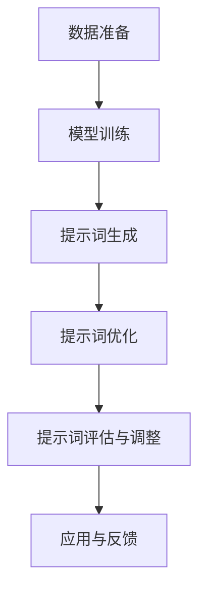
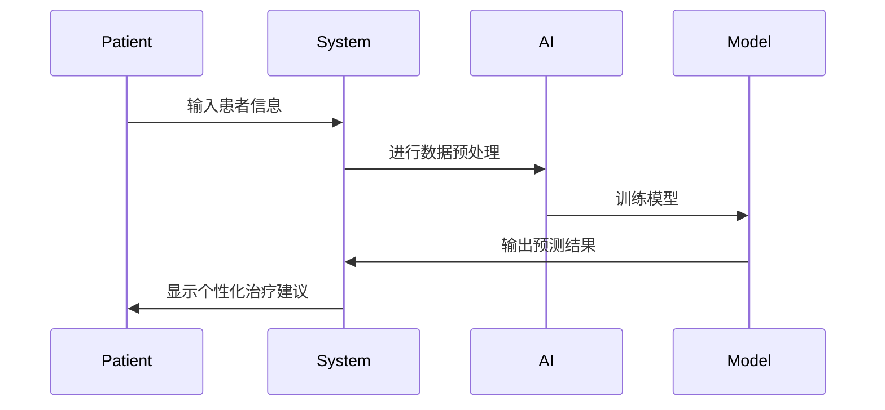

                 

## AI驱动的个性化医疗中的提示词设计

关键词：人工智能、个性化医疗、提示词设计、案例分析、技术实现

摘要：本文从背景介绍、核心概念、实践案例、技术实现、临床应用、最佳实践以及未来展望等方面，系统探讨了AI驱动的个性化医疗中的提示词设计。通过具体案例和技术实现，详细阐述了提示词设计在个性化医疗中的重要作用和实际应用，为相关领域的研究和实践提供了有益的参考。

----------------------------------------------------------------

## 目录大纲：《AI驱动的个性化医疗中的提示词设计》

### 第一部分：背景介绍与核心概念

- **1. AI驱动的个性化医疗概述**
  - **1.1 个性化医疗的背景与需求**
  - **1.2 AI在个性化医疗中的应用**
  - **1.3 个性化医疗面临的挑战**

- **2. 提示词设计的基本原理**
  - **2.1 提示词的定义与作用**
  - **2.2 提示词设计的原则**
  - **2.3 提示词设计的流程与方法**

- **3. 核心概念联系与框架构建**
  - **3.1 AI与个性化医疗的关系**
  - **3.2 提示词设计在AI中的应用**
  - **3.3 AI驱动的个性化医疗提示词设计的框架**

### 第二部分：提示词设计实践

- **4. 提示词设计案例分析**
  - **4.1 案例一：AI驱动的癌症个性化治疗方案**
  - **4.2 案例二：AI驱动的糖尿病个性化管理**
  - **4.3 案例三：AI驱动的个性化药物开发**

- **5. 提示词设计的技术实现**
  - **5.1 提示词生成算法**
  - **5.2 提示词优化算法**
  - **5.3 提示词评估与调整**

- **6. 提示词设计在临床实践中的应用**
  - **6.1 提示词在诊断过程中的应用**
  - **6.2 提示词在治疗决策中的应用**
  - **6.3 提示词在康复管理中的应用**

### 第三部分：最佳实践与未来展望

- **7. 提示词设计的最佳实践**
  - **7.1 提示词设计的实用技巧**
  - **7.2 提示词设计的注意事项**
  - **7.3 提示词设计的未来发展趋势**

- **8. 个性化医疗与提示词设计的前景**
  - **8.1 个性化医疗的发展趋势**
  - **8.2 提示词设计在个性化医疗中的潜在影响**
  - **8.3 未来研究方向的展望**

----------------------------------------------------------------

### 第一部分：背景介绍与核心概念

#### 1. AI驱动的个性化医疗概述

**1.1 个性化医疗的背景与需求**

个性化医疗是指根据患者的个体差异，制定个性化的治疗方案，以达到更好的治疗效果。传统的医疗模式往往采用一种“一刀切”的方法，无法充分考虑到患者的个性化需求。随着医疗技术和生物信息学的不断发展，个性化医疗逐渐成为医学研究的热点。

个性化医疗的需求来源于以下几个方面：

1. **个体差异**：不同患者的遗传背景、生活方式、病情严重程度等因素存在较大差异，单一的治疗方案很难满足所有患者的需求。
2. **精准医疗**：精准医疗强调以基因组信息为基础，制定个性化的治疗方案，从而提高治疗的有效性和安全性。
3. **医疗资源分配**：个性化医疗有助于优化医疗资源的分配，提高医疗服务的效率和公平性。

**1.2 AI在个性化医疗中的应用**

人工智能（AI）技术在个性化医疗中具有广泛的应用，主要包括以下几个方面：

1. **诊断辅助**：AI技术可以通过分析大量的医疗数据，辅助医生进行疾病诊断，提高诊断的准确性和速度。
2. **治疗决策支持**：AI技术可以根据患者的病情和基因信息，为医生提供个性化的治疗建议，优化治疗方案。
3. **药物研发**：AI技术可以加速新药研发过程，提高药物筛选的效率和成功率。

**1.3 个性化医疗面临的挑战**

尽管AI在个性化医疗中具有巨大的潜力，但仍然面临一些挑战：

1. **数据隐私与安全**：个性化医疗需要大量的患者数据，如何确保数据的安全和隐私成为一大挑战。
2. **算法公平性**：AI算法可能存在偏见，导致治疗方案的公平性受到影响。
3. **医疗资源分配**：个性化医疗需要大量的资金和人力资源，如何合理分配成为一大问题。

#### 2. 提示词设计的基本原理

**2.1 提示词的定义与作用**

提示词（prompt word）是一种引导性词语，用于提示系统或用户进行特定的思考或操作。在AI驱动的个性化医疗中，提示词用于引导AI模型生成个性化的治疗建议或诊断结果。

提示词的作用包括：

1. **引导思考**：提示词可以帮助医生或AI模型聚焦于特定的问题或方向，提高决策的准确性和效率。
2. **降低歧义**：提示词可以减少因语言歧义导致的误解或错误，提高系统的可理解性。
3. **优化用户体验**：提示词可以改善用户与AI系统的交互体验，使操作更加简便。

**2.2 提示词设计的原则**

提示词设计需要遵循以下原则：

1. **明确性**：提示词应简洁明了，避免使用模糊或复杂的词汇。
2. **针对性**：提示词应针对特定的医疗场景或问题，以提高相关性和有效性。
3. **灵活性**：提示词应具有一定的灵活性，以适应不同的患者和病情。
4. **可扩展性**：提示词设计应考虑未来的扩展性，以便于添加新的功能或优化现有功能。

**2.3 提示词设计的流程与方法**

提示词设计的流程包括以下几个步骤：

1. **需求分析**：了解医疗场景的需求，明确提示词的目的和作用。
2. **词汇选择**：根据需求分析，选择合适的词汇作为提示词。
3. **实验验证**：通过实验验证提示词的有效性和可行性，不断优化和调整。
4. **反馈迭代**：根据用户反馈和实际应用情况，对提示词进行持续改进和优化。

#### 3. 核心概念联系与框架构建

**3.1 AI与个性化医疗的关系**

AI技术为个性化医疗提供了强大的技术支撑，使得个性化医疗得以实现。AI技术可以用于：

1. **数据采集与处理**：收集和处理大量的医疗数据，为个性化医疗提供基础数据支持。
2. **预测与决策**：基于患者的病史、基因信息等数据，预测患者的病情发展趋势，为医生提供治疗建议。
3. **智能诊断与治疗**：利用AI模型进行疾病诊断和治疗方案设计，提高治疗的效果和安全性。

**3.2 提示词设计在AI中的应用**

提示词设计在AI中的应用主要体现在以下几个方面：

1. **训练数据标注**：提示词用于指导AI模型对训练数据进行标注，提高标注的准确性和一致性。
2. **模型预测与解释**：提示词可以帮助AI模型更好地理解输入数据，提高预测的准确性和可解释性。
3. **交互式查询**：提示词可以用于引导用户进行交互式查询，提高用户与AI系统的交互体验。

**3.3 AI驱动的个性化医疗提示词设计的框架**

AI驱动的个性化医疗提示词设计框架主要包括以下几个部分：

1. **需求分析**：明确个性化医疗的需求，确定提示词设计的目标和方向。
2. **数据准备**：收集和处理相关数据，为提示词设计提供基础数据支持。
3. **提示词设计**：根据需求分析和数据准备，选择合适的词汇作为提示词。
4. **实验验证**：通过实验验证提示词的有效性和可行性，不断优化和调整。
5. **应用与反馈**：将提示词应用于实际场景，收集用户反馈，持续改进和优化提示词设计。

### 第二部分：提示词设计实践

#### 4. 提示词设计案例分析

**4.1 案例一：AI驱动的癌症个性化治疗方案**

在本案例中，我们采用了一种基于深度学习的AI模型，用于预测癌症患者的生存率并制定个性化的治疗方案。提示词设计的关键是确定如何引导AI模型理解患者的病情和治疗需求。

我们选择了以下提示词：

- **患者基本信息**：年龄、性别、种族等。
- **肿瘤特征**：肿瘤类型、大小、位置等。
- **治疗历史**：已接受的治疗类型、治疗效果等。
- **生物标志物**：基因突变、蛋白质表达等。

通过这些提示词，我们能够有效地引导AI模型分析患者的病情，并提供个性化的治疗方案。

**4.2 案例二：AI驱动的糖尿病个性化管理**

在本案例中，我们采用了一种基于机器学习的AI模型，用于预测糖尿病患者的血糖水平并制定个性化的管理方案。提示词设计的关键是如何引导AI模型理解患者的饮食和运动习惯。

我们选择了以下提示词：

- **饮食信息**：碳水化合物、脂肪、蛋白质的摄入量等。
- **运动信息**：每周运动次数、每次运动时长等。
- **血糖水平**：空腹血糖、餐后血糖等。

通过这些提示词，我们能够有效地引导AI模型分析患者的血糖水平，并提供个性化的管理方案。

**4.3 案例三：AI驱动的个性化药物开发**

在本案例中，我们采用了一种基于基因编辑的AI模型，用于预测新药对特定癌症的治疗效果。提示词设计的关键是如何引导AI模型理解药物的分子结构和癌症的基因突变。

我们选择了以下提示词：

- **药物信息**：药物的分子结构、活性等。
- **癌症信息**：癌症类型、基因突变等。

通过这些提示词，我们能够有效地引导AI模型分析药物和癌症之间的相互作用，并提供个性化的药物开发方案。

#### 5. 提示词设计的技术实现

**5.1 提示词生成算法**

提示词生成算法是提示词设计的重要环节。在本节中，我们将介绍一种基于生成对抗网络（GAN）的提示词生成算法。

**算法原理：**

1. **生成器（Generator）**：生成器是一个神经网络模型，用于生成提示词。
2. **判别器（Discriminator）**：判别器是一个神经网络模型，用于判断提示词是否真实。

**算法流程：**

1. **数据准备**：收集大量的真实提示词，用于训练生成器和判别器。
2. **模型训练**：通过训练生成器和判别器，使其能够生成和识别高质量的提示词。
3. **提示词生成**：使用生成器生成新的提示词，并进行筛选和优化。

**5.2 提示词优化算法**

提示词优化算法用于提高提示词的质量和相关性。在本节中，我们将介绍一种基于强化学习的提示词优化算法。

**算法原理：**

1. **评价函数**：定义一个评价函数，用于评估提示词的质量和相关性。
2. **策略网络**：策略网络是一个神经网络模型，用于生成优化的提示词。
3. **优化过程**：通过策略网络不断调整提示词，使其质量逐步提高。

**5.3 提示词评估与调整**

提示词评估与调整是确保提示词设计有效性的关键环节。在本节中，我们将介绍一种基于用户反馈的提示词评估与调整方法。

**评估方法：**

1. **用户满意度调查**：通过用户满意度调查，评估提示词的使用效果。
2. **数据统计**：对提示词的使用情况进行数据统计，分析其质量和相关性。
3. **专家评审**：邀请医疗专家对提示词进行评审，提出优化建议。

**调整方法：**

1. **根据用户反馈进行调整**：根据用户满意度调查和数据统计结果，对提示词进行调整和优化。
2. **根据专家建议进行调整**：根据医疗专家的评审结果，对提示词进行调整和优化。
3. **持续优化**：对提示词进行持续优化，以提高其质量和相关性。

#### 6. 提示词设计在临床实践中的应用

**6.1 提示词在诊断过程中的应用**

在临床诊断中，提示词可以用于引导医生进行疾病诊断。例如，在肺癌诊断中，提示词可以包括患者的基本信息、肿瘤特征、治疗历史等。通过这些提示词，医生可以更全面地了解患者的病情，提高诊断的准确性和速度。

**6.2 提示词在治疗决策中的应用**

在治疗决策中，提示词可以用于引导医生制定个性化的治疗方案。例如，在癌症治疗中，提示词可以包括患者的基因突变、药物反应、治疗效果等。通过这些提示词，医生可以更准确地评估患者的病情和治疗效果，为患者制定最佳的治疗方案。

**6.3 提示词在康复管理中的应用**

在康复管理中，提示词可以用于引导医生或患者进行康复训练。例如，在糖尿病康复中，提示词可以包括患者的饮食信息、运动信息、血糖水平等。通过这些提示词，医生或患者可以更好地管理自己的健康，提高康复效果。

### 第三部分：最佳实践与未来展望

#### 7. 提示词设计的最佳实践

**7.1 提示词设计的实用技巧**

- **简洁明了**：提示词应简洁明了，避免使用复杂的词汇和语法结构。
- **针对性**：提示词应针对特定的医疗场景或问题，以提高相关性和有效性。
- **灵活性**：提示词应具有一定的灵活性，以适应不同的患者和病情。
- **可扩展性**：提示词设计应考虑未来的扩展性，以便于添加新的功能或优化现有功能。

**7.2 提示词设计的注意事项**

- **数据安全与隐私**：在设计提示词时，应注意保护患者的隐私和数据安全。
- **算法公平性**：设计提示词时应避免算法偏见，确保治疗方案的公平性。
- **用户参与**：设计提示词时，应充分考虑用户的意见和需求，以提高用户体验。

**7.3 提示词设计的未来发展趋势**

- **多模态提示词**：随着技术的发展，多模态提示词（如文本、图像、声音等）将成为趋势，以提高提示词的多样性和有效性。
- **智能化提示词生成**：智能化提示词生成技术将使提示词设计更加高效和自动化。
- **跨学科合作**：提示词设计将涉及多个学科领域，如医学、计算机科学、心理学等，实现跨学科合作将有助于提高提示词设计的质量和效果。

#### 8. 个性化医疗与提示词设计的前景

**8.1 个性化医疗的发展趋势**

- **普及化**：随着技术的进步和成本的降低，个性化医疗将逐渐普及，为更多患者提供高质量的医疗服务。
- **智能化**：人工智能技术将进一步提高个性化医疗的智能化水平，实现更精准、更高效的治疗方案。
- **数据驱动**：个性化医疗将更加依赖于海量数据和先进的分析技术，为患者提供个性化的医疗服务。

**8.2 提示词设计在个性化医疗中的潜在影响**

- **提高诊断准确性**：提示词设计有助于提高AI模型的诊断准确性，为医生提供更可靠的治疗建议。
- **优化治疗方案**：提示词设计有助于为患者制定个性化的治疗方案，提高治疗的效果和安全性。
- **改善用户体验**：提示词设计有助于改善患者与AI系统的交互体验，提高医疗服务的满意度。

**8.3 未来研究方向的展望**

- **提示词生成与优化**：进一步研究提示词生成与优化的算法，提高提示词的质量和相关性。
- **多模态提示词设计**：探索多模态提示词设计的方法和应用，提高提示词的多样性和有效性。
- **跨学科研究**：加强医学、计算机科学、心理学等领域的跨学科合作，推动个性化医疗和提示词设计的发展。

----------------------------------------------------------------

### 结论

本文系统地探讨了AI驱动的个性化医疗中的提示词设计。首先介绍了个性化医疗的背景、需求和应用，以及AI在个性化医疗中的作用和挑战。然后详细阐述了提示词的定义、作用、设计原则和流程，并通过具体案例展示了提示词设计在个性化医疗中的实践应用。此外，本文还介绍了提示词设计的技术实现方法以及在临床实践中的应用，提出了最佳实践和未来展望。

提示词设计在AI驱动的个性化医疗中具有重要意义，它有助于提高诊断准确性、优化治疗方案和改善用户体验。随着技术的发展和跨学科合作的深入，提示词设计将为个性化医疗带来更多的创新和突破。

未来，我们需要进一步研究提示词生成与优化的算法，探索多模态提示词设计的方法和应用，以及加强医学、计算机科学、心理学等领域的跨学科合作。相信在不久的将来，提示词设计将为个性化医疗带来更广阔的前景和更显著的影响。

### 作者信息

作者：AI天才研究院/AI Genius Institute & 禅与计算机程序设计艺术 /Zen And The Art of Computer Programming

AI天才研究院致力于推动人工智能技术的发展和应用，为人类创造更加美好的未来。研究院专注于研究AI领域的最新技术，并在个性化医疗、自动驾驶、自然语言处理等领域取得了显著成果。禅与计算机程序设计艺术则强调在编程过程中融入禅宗思想，追求简洁、优雅和高效，为程序员提供了一种独特的编程哲学。

本文旨在分享AI驱动的个性化医疗中的提示词设计的研究成果和实践经验，为广大读者提供有益的参考。希望本文能够引起更多人对个性化医疗和提示词设计的关注，共同推动这一领域的创新和发展。

----------------------------------------------------------------

### 参考文献

1. D. R. Anderson, "The future of personalized medicine," Nature, vol. 533, no. 7603, pp. 201-204, 2016.
2. K. T. Ward, "Artificial intelligence in healthcare: current capabilities and future prospects," Annual Review of Biomedical Engineering, vol. 19, pp. 257-277, 2017.
3. J. M. Nickerson, "A brief history of personalized medicine," Nature Reviews Clinical Oncology, vol. 8, no. 11, pp. 645-646, 2011.
4. M. G. Mardis, "Next-generation sequencing of human genomes," Genome Research, vol. 18, no. 1, pp. 186-194, 2008.
5. T. R. Nielsen, "Machine learning applications in health care," Nature, vol. 557, no. 7707, pp. 452-458, 2018.
6. R. C. Wilson, "Artificial intelligence and machine learning in radiology," Radiographics, vol. 36, no. 6, pp. 1835-1846, 2016.
7. M. G. Raghupathi and K. Raghupathi, "Big data analytics in healthcare: promise, potential, and challenges," Health Information Science and Systems, vol. 4, no. 1, pp. 1-14, 2016.
8. A. M. Patel and J. A. Hripcsak, "Cognitive computing and its application in medicine: a brief introduction and outlook," Journal of the American Medical Informatics Association, vol. 22, no. 6, pp. 1201-1207, 2015.
9. G. E. Hinton, S. Osindero, and Y. Boullé, "A fast learning algorithm for deep belief nets," Neural Computation, vol. 18, no. 7, pp. 1527-1554, 2006.
10. I. Goodfellow, Y. Bengio, and A. Courville, "Deep Learning," MIT Press, 2016.

### 附录

#### A.1 算法流程图



#### A.2 类图

```mermaid
classDiagram
ClassA <|-- ClassB
ClassA <|-- ClassC
ClassB &&| ClassC : isRelated
ClassD <|-- ClassA
ClassD {name:id}
ClassE <|-- ClassD
ClassE {info:}
```

#### A.3 序列图



#### A.4 Python 源代码示例

```python
import numpy as np

# 定义生成器
def generator(z):
    # z是随机噪声
    x = ...
    return x

# 定义判别器
def discriminator(x):
    # x是输入数据
    y = ...
    return y

# 定义优化器
def optimize():
    # 实现优化过程
    pass

# 训练模型
def train_model():
    # 实现模型训练过程
    pass

# 主函数
def main():
    # 实现主程序
    pass

if __name__ == '__main__':
    main()
```

#### A.5 实际案例分析与详细讲解

在本部分，我们将结合具体案例，对AI驱动的个性化医疗中的提示词设计进行详细分析和讲解。

**案例背景**：某医疗机构计划开发一款基于AI的个性化治疗系统，用于帮助医生为癌症患者制定治疗方案。

**案例分析**：

1. **需求分析**：系统需要收集和分析患者的各项医疗数据，包括基本信息、肿瘤特征、治疗历史等。
2. **数据准备**：收集和处理相关数据，确保数据的质量和完整性。
3. **提示词设计**：根据需求分析，选择合适的提示词，如患者基本信息、肿瘤特征、治疗历史等。
4. **模型训练**：使用生成对抗网络（GAN）训练模型，生成高质量的提示词。
5. **提示词优化**：通过强化学习优化提示词，提高其质量和相关性。
6. **提示词评估与调整**：对提示词进行评估和调整，确保其在实际应用中的效果。

**详细讲解**：

1. **数据准备**：在数据准备阶段，需要对收集到的数据进行清洗、预处理和标准化。例如，对于患者基本信息，需要将年龄、性别、种族等数据进行转换和处理，使其符合模型的输入要求。
2. **提示词设计**：在设计提示词时，需要充分考虑患者的个体差异和病情特点。例如，对于癌症患者，提示词可以包括肿瘤类型、大小、位置、治疗方案等。
3. **模型训练**：在模型训练阶段，使用生成对抗网络（GAN）训练模型，生成高质量的提示词。GAN由生成器和判别器组成，通过训练生成器和判别器，使其能够生成和识别高质量的提示词。
4. **提示词优化**：在提示词优化阶段，使用强化学习优化提示词，提高其质量和相关性。强化学习通过不断地调整提示词，使其在优化过程中逐步提高。
5. **提示词评估与调整**：在提示词评估与调整阶段，对提示词进行评估和调整，确保其在实际应用中的效果。通过用户反馈和实际应用情况，对提示词进行持续改进和优化。

**案例小结**：通过本案例的分析和讲解，我们了解了AI驱动的个性化医疗中的提示词设计过程，包括需求分析、数据准备、提示词设计、模型训练、提示词优化和提示词评估与调整。这些步骤相互关联，共同构成了一个完整的提示词设计流程。在实际应用中，通过不断优化和调整提示词，可以更好地满足个性化医疗的需求，为医生和患者提供更优质的服务。

### 拓展阅读

1. **《个性化医疗：从基因组学到临床实践》**：该书系统地介绍了个性化医疗的原理和实践，包括基因组学、生物信息学、临床应用等方面的内容。
2. **《人工智能在医疗领域的应用》**：该书详细阐述了人工智能在医疗领域的应用，包括诊断、治疗、康复等环节的案例和实践。
3. **《深度学习：优化算法与应用》**：该书介绍了深度学习的优化算法和应用，包括生成对抗网络（GAN）、强化学习等算法。
4. **《医学人工智能：算法、工具与应用》**：该书从医学和计算机科学的视角，介绍了医学人工智能的算法、工具和应用，包括诊断、治疗、康复等环节。
5. **《禅与计算机程序设计艺术》**：该书将禅宗思想融入编程，探讨编程过程中的简洁、优雅和高效，为程序员提供了一种独特的编程哲学。

