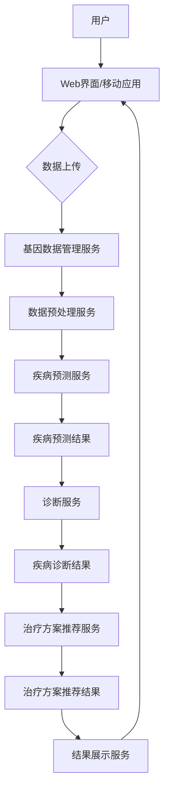
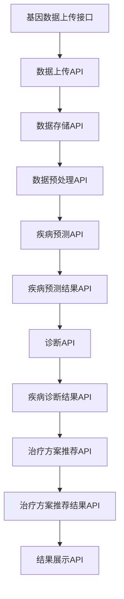
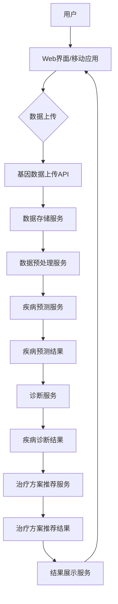
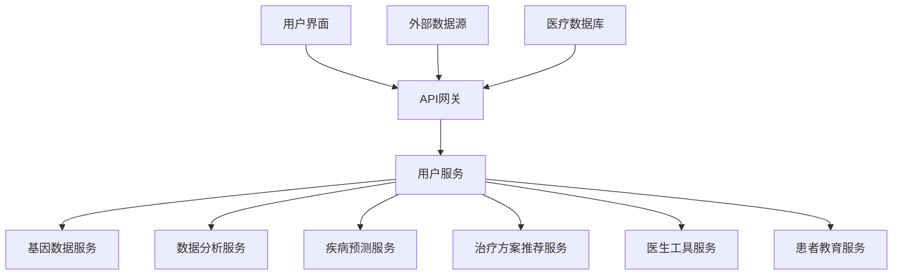
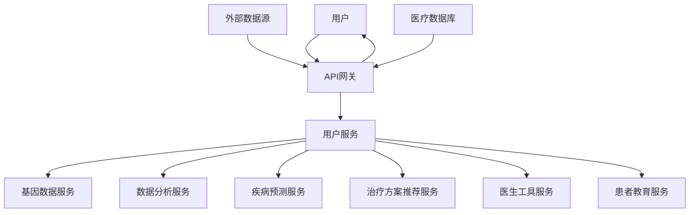
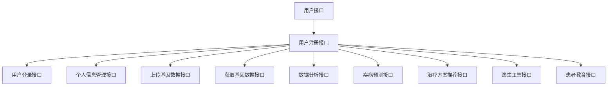
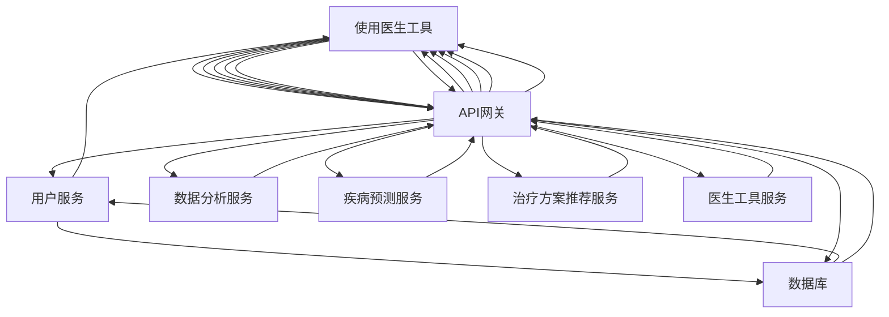

                 

## AI驱动的个性化医疗：从基因到治疗

### 关键词

- **人工智能**  
- **个性化医疗**  
- **基因数据分析**  
- **治疗推荐**  
- **机器学习**

### 摘要

本文将探讨人工智能（AI）在个性化医疗中的应用，特别是从基因到治疗的整个过程。我们将首先介绍个性化医疗的基本概念和现状，然后深入分析AI技术在个性化医疗中的作用。接着，我们将详细阐述基因数据分析、疾病预测与诊断、个性化治疗方案推荐的方法和过程。通过案例研究和实践分析，我们将展示AI驱动的个性化医疗如何改变现代医疗模式，并讨论其面临的挑战和未来发展趋势。

----------------------------------------------------------------

### 引言与背景

#### 个性化医疗的概念与发展

个性化医疗，也称为精准医疗，是一种以患者个体为核心，通过整合生物信息学、基因组学、医学影像学等多学科数据，为患者提供个性化诊疗方案的新兴医疗模式。其核心理念是“一人一方”，即根据患者的具体基因信息、生活环境、病史等多方面因素，制定出最适合其的治疗方案。

个性化医疗的发展可以追溯到20世纪90年代，随着基因组学和生物信息学技术的快速发展，人类基因组计划的完成标志着个性化医疗从理论走向实践。近年来，随着大数据、云计算、人工智能等技术的迅速崛起，个性化医疗迎来了新的发展机遇。

#### AI在医疗领域的应用现状

人工智能在医疗领域的应用已经越来越广泛，从简单的辅助诊断到复杂的疾病预测和治疗方案推荐，AI技术正逐渐成为医疗行业的重要工具。以下是一些AI在医疗领域的主要应用：

1. **辅助诊断**：利用深度学习模型对医学影像进行分析，辅助医生进行疾病诊断。如肺结节检测、乳腺癌筛查等。
2. **疾病预测**：基于海量医疗数据，利用机器学习算法预测患者患病风险。如心血管疾病、糖尿病等慢性病的预测。
3. **治疗方案推荐**：通过分析患者的基因信息、病史和治疗方案，为医生提供个性化的治疗建议。
4. **药物研发**：利用AI技术加速药物研发过程，从海量的化合物库中筛选出潜在的有效药物。

#### AI驱动个性化医疗的意义

AI驱动个性化医疗具有重要意义，主要体现在以下几个方面：

1. **提高诊疗效果**：通过AI技术，医生可以更加精准地诊断疾病，制定个性化的治疗方案，从而提高治疗效果。
2. **降低医疗成本**：个性化医疗可以避免不必要的检查和治疗，减少医疗资源的浪费，降低医疗成本。
3. **改善患者体验**：AI技术可以帮助患者更好地管理自己的健康，提供个性化的健康建议，从而改善患者的体验。
4. **推动医疗创新**：AI技术的应用为医疗行业带来了新的发展机遇，推动了医疗模式的创新。

#### 研究目标与本书结构

本书的研究目标是深入探讨AI在个性化医疗中的应用，特别是从基因到治疗的整个过程。具体研究内容包括：

1. **基因数据分析**：介绍基因数据分析的基本概念和方法，探讨如何利用AI技术进行基因数据分析。
2. **疾病预测与诊断**：分析AI技术在疾病预测与诊断中的应用，介绍常用的机器学习算法和模型。
3. **个性化治疗方案推荐**：探讨如何利用AI技术为医生提供个性化的治疗方案推荐，提高诊疗效果。
4. **案例研究**：通过实际案例，展示AI驱动个性化医疗的应用和实践。
5. **未来展望与挑战**：分析AI驱动个性化医疗的发展趋势和面临的挑战。

本书的结构分为五个部分：引言与背景、核心概念与原理、方法与实践、案例研究、未来展望与挑战。通过系统的分析和讨论，本书旨在为读者提供全面、深入的AI驱动个性化医疗知识。

----------------------------------------------------------------

### 核心概念与原理

#### 人工智能基础

人工智能（Artificial Intelligence，简称AI）是计算机科学的一个分支，旨在使机器模拟人类智能行为，包括学习、推理、解决问题和自我改进等。AI的发展可以追溯到20世纪50年代，随着计算能力的提升和算法的进步，AI在近年来取得了显著的成果。

**机器学习与深度学习基础**

机器学习（Machine Learning，简称ML）是AI的一个分支，通过算法从数据中学习规律，进行预测和决策。深度学习（Deep Learning，简称DL）是机器学习的一个子领域，基于多层神经网络结构，能够处理复杂数据。

**人工智能在医疗领域的应用类型**

在医疗领域，AI的应用类型主要包括：

1. **辅助诊断**：利用AI算法对医学影像进行分析，辅助医生进行疾病诊断。
2. **疾病预测**：基于患者的基因数据、病史等，利用AI算法预测患者未来的患病风险。
3. **个性化治疗方案推荐**：通过分析患者的基因信息、病史等，为医生提供个性化的治疗建议。
4. **药物研发**：利用AI技术加速药物研发过程，从海量的化合物库中筛选出潜在的有效药物。

#### 个性化医疗的核心概念

**个性化医疗的定义与目标**

个性化医疗（Personalized Medicine）是一种以患者个体为核心，通过整合生物信息学、基因组学、医学影像学等多学科数据，为患者提供个性化诊疗方案的新兴医疗模式。其目标是根据患者的具体基因信息、生活环境、病史等多方面因素，制定出最适合其的治疗方案。

**个性化医疗的关键技术**

1. **基因组学**：通过基因组学技术，获取患者的基因信息，为个性化医疗提供基础数据。
2. **生物信息学**：利用生物信息学方法，对基因数据进行分析，挖掘潜在的治疗靶点和疾病风险。
3. **机器学习**：通过机器学习算法，对医疗数据进行处理和分析，预测患者未来的患病风险，为医生提供诊断和治疗建议。
4. **大数据**：利用大数据技术，收集和分析海量医疗数据，为个性化医疗提供数据支持。

**个性化医疗的评价指标**

个性化医疗的评价指标主要包括：

1. **诊断准确率**：衡量AI辅助诊断的准确性，是评价个性化医疗效果的重要指标。
2. **治疗方案推荐效果**：通过比较AI推荐的治疗方案和实际治疗方案的效果，评价个性化治疗方案的有效性。
3. **患者满意度**：通过调查患者对个性化医疗服务的满意度，评价个性化医疗的服务质量。
4. **医疗成本**：通过比较个性化医疗与传统医疗模式的成本，评价个性化医疗的经济效益。

#### AI驱动的个性化医疗

**AI驱动的个性化医疗概述**

AI驱动的个性化医疗是指利用人工智能技术，对患者的基因数据、病史、生活习惯等多方面信息进行分析和处理，为医生提供个性化的诊断和治疗建议。其核心思想是将AI技术融入个性化医疗的各个环节，实现从基因到治疗的全面个性化。

**AI在基因数据分析中的应用**

1. **基因数据获取**：利用高通量测序技术，获取患者的基因信息。
2. **基因数据分析**：通过机器学习算法，对基因数据进行分析，挖掘基因与疾病之间的关系。
3. **基因数据可视化**：利用可视化技术，将基因数据转化为易于理解的图表，帮助医生和患者更好地理解基因信息。

**AI在疾病预测与诊断中的应用**

1. **疾病预测**：通过分析患者的基因数据、病史等，利用机器学习算法预测患者未来的患病风险。
2. **疾病诊断**：利用深度学习模型，对医学影像进行分析，辅助医生进行疾病诊断。

**AI在个性化治疗方案推荐中的应用**

1. **治疗方案推荐**：通过分析患者的基因数据、病史等，利用机器学习算法为医生推荐个性化的治疗方案。
2. **治疗效果评估**：利用大数据技术，对患者的治疗效果进行实时评估，为医生提供治疗调整的建议。

#### AI驱动的个性化医疗与现有医疗模式的比较

**优点**

- 提高诊疗效果：通过AI技术，医生可以更加精准地诊断疾病，制定个性化的治疗方案，从而提高治疗效果。
- 降低医疗成本：个性化医疗可以避免不必要的检查和治疗，减少医疗资源的浪费，降低医疗成本。
- 改善患者体验：AI技术可以帮助患者更好地管理自己的健康，提供个性化的健康建议，从而改善患者的体验。

**缺点**

- 数据隐私与安全：个性化医疗需要大量患者数据，如何保护患者隐私和数据安全是一个重要挑战。
- AI技术的监管与责任：随着AI技术在医疗领域的应用，如何制定合适的监管政策和明确责任主体也是需要解决的问题。
- 医疗资源的公平分配：个性化医疗可能加剧医疗资源的不公平分配，如何确保所有人都能享受到高质量的个性化医疗服务是一个重要问题。

#### 研究方法与数据来源

本书的研究方法主要采用文献综述和案例分析相结合的方法。首先，通过查阅大量相关文献，系统梳理AI驱动个性化医疗的理论和实践成果；然后，通过实际案例，分析AI驱动个性化医疗的具体应用和实践效果。

数据来源主要包括公开的医学数据库、临床数据和研究数据。通过这些数据，本书将深入探讨AI驱动个性化医疗的方法和过程，为读者提供全面、深入的见解。

----------------------------------------------------------------

### 方法与实践

#### 基因数据分析与处理

基因数据分析是AI驱动个性化医疗的重要环节，其核心任务是提取和处理基因数据，为后续的分析和预测提供基础。以下是基因数据分析与处理的具体方法和步骤：

1. **基因数据获取**

   基因数据获取主要通过高通量测序技术（High-throughput sequencing, HTS）实现。高通量测序技术可以在较短时间内获取大量的基因信息，包括基因组、转录组和表观基因组等。

2. **基因数据预处理**

   基因数据预处理主要包括数据清洗、数据转换和数据标准化等步骤。

   - **数据清洗**：去除数据中的噪声和错误，如缺失值填充、异常值检测和去除等。
   - **数据转换**：将不同格式的基因数据进行统一转换，如将FASTQ格式转换为VCF格式。
   - **数据标准化**：对基因数据进行标准化处理，使其在不同的测量尺度上具有可比性。

3. **基因数据存储与管理**

   基因数据的存储与管理是保证数据安全性和可用性的关键。常用的基因数据存储与管理工具包括GATK（Genome Analysis Toolkit）、Picard和Samtools等。

4. **基因数据可视化**

   基因数据可视化是帮助研究人员和医生更好地理解基因数据的重要手段。常用的基因数据可视化工具包括IGV（Integrative Genomics Viewer）、UCSC Genome Browser和Ensemble等。

#### 疾病预测与诊断

疾病预测与诊断是AI驱动个性化医疗的核心应用之一，其目标是通过分析患者的基因数据、病史和生活方式等，预测患者未来的患病风险，并辅助医生进行疾病诊断。以下是疾病预测与诊断的方法和步骤：

1. **数据收集与预处理**

   疾病预测与诊断的数据来源主要包括患者的基因数据、电子健康记录（Electronic Health Records, EHR）和医疗影像等。

   - **数据收集**：通过公开数据集、临床试验和医院数据库等方式收集相关数据。
   - **数据预处理**：对收集到的数据进行清洗、转换和标准化处理，为后续分析做准备。

2. **特征提取**

   特征提取是疾病预测与诊断的关键步骤，其目标是从原始数据中提取出对疾病预测最有用的特征。

   - **基因特征提取**：通过基因表达分析、突变检测和基因网络分析等方法提取基因特征。
   - **临床特征提取**：从患者的电子健康记录中提取出与疾病相关的临床特征，如年龄、性别、病史和药物使用等。
   - **生活方式特征提取**：从患者的问卷调查和生活方式记录中提取出与疾病相关的特征，如饮食、运动和睡眠等。

3. **模型训练与评估**

   模型训练与评估是疾病预测与诊断的核心步骤，其目标是通过机器学习算法训练出高质量的预测模型，并对模型的性能进行评估。

   - **模型训练**：选择合适的机器学习算法，如支持向量机（SVM）、决策树（DT）和随机森林（RF）等，对训练数据进行训练。
   - **模型评估**：使用交叉验证和测试集对训练出的模型进行性能评估，常用的评估指标包括准确率（Accuracy）、召回率（Recall）和F1分数（F1 Score）等。

4. **疾病预测与诊断**

   通过训练出的模型，对新的患者数据进行疾病预测和诊断。

   - **疾病预测**：利用模型预测患者未来的患病风险，为医生提供治疗建议。
   - **疾病诊断**：利用模型对患者的医学影像进行分析，辅助医生进行疾病诊断。

#### 个性化治疗方案推荐

个性化治疗方案推荐是AI驱动个性化医疗的另一个重要应用，其目标是通过分析患者的基因数据、病史和临床特征，为医生提供个性化的治疗方案推荐。以下是个性化治疗方案推荐的方法和步骤：

1. **数据收集与预处理**

   个性化治疗方案推荐的数据来源主要包括患者的基因数据、电子健康记录和临床数据等。

   - **数据收集**：通过公开数据集、临床试验和医院数据库等方式收集相关数据。
   - **数据预处理**：对收集到的数据进行清洗、转换和标准化处理，为后续分析做准备。

2. **治疗方案库构建**

   治疗方案库构建是个性化治疗方案推荐的基础，其目标是从现有的治疗方案中提取出有效的治疗方案，构建一个治疗方案库。

   - **治疗方案提取**：从临床指南、文献和研究报告中提取出有效的治疗方案。
   - **治疗方案标准化**：对提取出的治疗方案进行标准化处理，使其具有可比性。

3. **治疗方案推荐算法**

   治疗方案推荐算法是个性化治疗方案推荐的核心，其目标是通过分析患者的基因数据、病史和临床特征，为医生推荐最合适的治疗方案。

   - **协同过滤算法**：基于患者的相似性和治疗方案的历史记录进行推荐。
   - **基于内容的推荐算法**：基于患者的特征和治疗方案的内容进行推荐。
   - **混合推荐算法**：结合多种推荐算法的优点，提高推荐效果。

4. **治疗方案评估与优化**

   对推荐出的治疗方案进行评估和优化，确保其有效性和安全性。

   - **治疗方案评估**：利用临床数据和实验数据对推荐的治疗方案进行评估，包括疗效、副作用和成本等。
   - **治疗方案优化**：根据评估结果对治疗方案进行调整和优化，以提高其效果。

#### 常用的机器学习算法和模型

在基因数据分析、疾病预测与诊断和个性化治疗方案推荐中，常用的机器学习算法和模型包括：

1. **监督学习算法**：如线性回归、逻辑回归、支持向量机（SVM）、决策树（DT）和随机森林（RF）等。
2. **无监督学习算法**：如聚类算法（K-Means、DBSCAN）、降维算法（PCA、t-SNE）和关联规则算法（Apriori、FP-Growth）等。
3. **深度学习模型**：如卷积神经网络（CNN）、循环神经网络（RNN）、长短时记忆网络（LSTM）和生成对抗网络（GAN）等。

通过合理选择和组合这些算法和模型，可以实现对基因数据、疾病预测和个性化治疗方案推荐的高效处理和分析。

#### 实践案例

为了展示AI驱动个性化医疗的具体应用，以下是一个实际案例：

**案例背景**：某医院计划开展一项基于AI的个性化癌症治疗项目，旨在为患者提供个性化的治疗方案。

**案例步骤**：

1. **数据收集**：收集患者的基因数据、电子健康记录和临床数据等。

2. **数据预处理**：对收集到的数据进行清洗、转换和标准化处理。

3. **特征提取**：从基因数据中提取基因特征，从电子健康记录中提取临床特征。

4. **模型训练**：利用监督学习算法（如随机森林）对特征进行训练，构建疾病预测模型。

5. **疾病预测**：利用训练出的模型预测患者未来的患病风险，为医生提供治疗建议。

6. **治疗方案推荐**：利用基于内容的推荐算法，为医生推荐个性化的治疗方案。

7. **治疗方案评估与优化**：对推荐的治疗方案进行评估和优化，确保其有效性和安全性。

通过这个案例，我们可以看到AI驱动个性化医疗如何应用于实际医疗场景，为患者提供个性化的治疗方案。

----------------------------------------------------------------

### 案例研究

#### 案例一：基于基因数据的癌症治疗

**案例背景**：某医院计划利用AI技术为癌症患者提供个性化的治疗方案。

**案例过程**：

1. **数据收集**：收集患者的基因数据、临床数据和医学影像等。

2. **数据预处理**：对收集到的数据进行清洗、转换和标准化处理。

3. **特征提取**：从基因数据中提取基因特征，从临床数据中提取临床特征。

4. **模型训练**：利用深度学习算法（如卷积神经网络）对特征进行训练，构建癌症预测模型。

5. **疾病预测**：利用训练出的模型预测患者癌症的发生风险。

6. **治疗方案推荐**：根据预测结果，利用基于内容的推荐算法为医生推荐个性化的治疗方案。

7. **治疗方案评估与优化**：对推荐的治疗方案进行评估和优化，确保其有效性和安全性。

**案例分析**：

通过这个案例，我们可以看到AI技术如何应用于癌症治疗，为医生提供个性化的治疗方案。具体分析如下：

1. **提高诊断准确率**：通过基因数据分析，AI技术可以更准确地预测患者癌症的发生风险，从而提高诊断的准确率。

2. **优化治疗方案**：基于AI的个性化治疗方案推荐，可以帮助医生为患者制定更有效的治疗方案，提高治疗效果。

3. **降低医疗成本**：个性化医疗可以避免不必要的检查和治疗，减少医疗资源的浪费，从而降低医疗成本。

4. **改善患者体验**：通过AI技术，患者可以更好地了解自己的健康状况，并接受个性化的治疗，从而改善患者的体验。

#### 案例二：基于AI的糖尿病管理

**案例背景**：某医疗机构计划利用AI技术为糖尿病患者提供个性化的管理方案。

**案例过程**：

1. **数据收集**：收集患者的血糖数据、饮食数据和运动数据等。

2. **数据预处理**：对收集到的数据进行清洗、转换和标准化处理。

3. **特征提取**：从血糖数据中提取血糖变化特征，从饮食数据和运动数据中提取生活习惯特征。

4. **模型训练**：利用机器学习算法（如随机森林）对特征进行训练，构建糖尿病管理模型。

5. **糖尿病预测**：利用训练出的模型预测患者未来的血糖变化趋势。

6. **治疗方案推荐**：根据预测结果，利用基于内容的推荐算法为医生推荐个性化的管理方案。

7. **治疗方案评估与优化**：对推荐的治疗方案进行评估和优化，确保其有效性和安全性。

**案例分析**：

通过这个案例，我们可以看到AI技术如何应用于糖尿病管理，为医生提供个性化的管理方案。具体分析如下：

1. **实时监控血糖变化**：通过AI技术，医生可以实时监控患者的血糖变化，及时发现异常情况，从而提高糖尿病的诊断和治疗效果。

2. **个性化饮食建议**：基于患者的饮食数据和生活习惯，AI技术可以提供个性化的饮食建议，帮助患者更好地控制血糖。

3. **个性化运动方案**：基于患者的运动数据和生活习惯，AI技术可以提供个性化的运动方案，帮助患者提高身体素质，从而更好地控制血糖。

4. **降低医疗成本**：个性化糖尿病管理可以避免不必要的检查和治疗，减少医疗资源的浪费，从而降低医疗成本。

5. **改善患者体验**：通过AI技术，患者可以更好地了解自己的健康状况，并接受个性化的管理，从而改善患者的体验。

#### 案例三：基于个性化治疗的罕见病研究

**案例背景**：某研究机构计划利用AI技术对罕见病进行个性化治疗研究。

**案例过程**：

1. **数据收集**：收集患者的基因数据、临床数据和医学影像等。

2. **数据预处理**：对收集到的数据进行清洗、转换和标准化处理。

3. **特征提取**：从基因数据中提取基因特征，从临床数据中提取临床特征。

4. **模型训练**：利用深度学习算法（如卷积神经网络）对特征进行训练，构建罕见病预测模型。

5. **疾病预测**：利用训练出的模型预测患者罕见病的发生风险。

6. **治疗方案推荐**：根据预测结果，利用基于内容的推荐算法为医生推荐个性化的治疗方案。

7. **治疗方案评估与优化**：对推荐的治疗方案进行评估和优化，确保其有效性和安全性。

**案例分析**：

通过这个案例，我们可以看到AI技术如何应用于罕见病研究，为医生提供个性化的治疗方案。具体分析如下：

1. **提高诊断准确率**：通过基因数据分析，AI技术可以更准确地预测患者罕见病的发生风险，从而提高诊断的准确率。

2. **优化治疗方案**：基于AI的个性化治疗方案推荐，可以帮助医生为患者制定更有效的治疗方案，提高治疗效果。

3. **促进罕见病研究**：通过AI技术，研究机构可以更好地理解和分析罕见病的数据，从而促进罕见病的研究和治疗。

4. **降低医疗成本**：个性化医疗可以避免不必要的检查和治疗，减少医疗资源的浪费，从而降低医疗成本。

5. **改善患者体验**：通过AI技术，患者可以更好地了解自己的健康状况，并接受个性化的治疗，从而改善患者的体验。

### 案例总结

通过以上案例，我们可以看到AI驱动个性化医疗在癌症治疗、糖尿病管理和罕见病研究中的应用，具体体现在以下几个方面：

1. **提高诊疗效果**：AI技术可以帮助医生更准确地诊断疾病，制定个性化的治疗方案，从而提高诊疗效果。

2. **降低医疗成本**：个性化医疗可以避免不必要的检查和治疗，减少医疗资源的浪费，从而降低医疗成本。

3. **改善患者体验**：AI技术可以帮助患者更好地管理自己的健康，提供个性化的健康建议，从而改善患者的体验。

4. **推动医疗创新**：AI技术的应用为医疗行业带来了新的发展机遇，推动了医疗模式的创新。

5. **提高医疗效率**：通过AI技术，医生可以更高效地处理大量医疗数据，提高医疗工作效率。

总之，AI驱动个性化医疗具有广泛的应用前景，可以为患者提供更好的医疗服务，推动医疗行业的发展。

----------------------------------------------------------------

### 未来展望与挑战

#### 未来展望

1. **AI驱动的个性化医疗将进一步普及**：随着AI技术的不断发展和完善，AI驱动的个性化医疗将在全球范围内得到更广泛的应用，成为医疗行业的重要趋势。

2. **多学科交叉融合**：AI驱动的个性化医疗需要跨学科的合作，包括生物学、医学、计算机科学和统计学等。未来，多学科的交叉融合将推动个性化医疗的进一步发展。

3. **大数据与云计算的结合**：随着大数据和云计算技术的不断发展，AI驱动的个性化医疗将能够处理和分析海量的医疗数据，提高诊断和治疗的准确性。

4. **个性化医疗与精准医学的结合**：AI驱动的个性化医疗与精准医学的结合，将实现更加精准、个性化的诊断和治疗，提高治疗效果。

5. **增强现实与虚拟现实的结合**：未来，增强现实（AR）和虚拟现实（VR）技术将应用于个性化医疗，为患者提供更加直观、个性化的健康管理和治疗体验。

#### 挑战

1. **数据隐私与安全**：个性化医疗需要收集和处理大量的患者数据，如何保护患者隐私和安全是一个重要挑战。

2. **算法偏见与公平性**：AI算法在训练过程中可能存在偏见，如何确保算法的公平性和公正性是一个重要问题。

3. **数据质量与完整性**：高质量的数据是AI驱动的个性化医疗的基础，如何保证数据的质量和完整性是一个重要挑战。

4. **医疗资源分配不均**：个性化医疗可能加剧医疗资源的不公平分配，如何确保所有人都能享受到高质量的个性化医疗服务是一个重要问题。

5. **AI技术的监管与责任**：随着AI技术在医疗领域的应用，如何制定合适的监管政策和明确责任主体是一个重要挑战。

#### 应对策略

1. **加强数据保护**：通过加密技术、匿名化处理和隐私保护算法等手段，加强数据保护，确保患者隐私和安全。

2. **算法公平性评估**：对AI算法进行公平性评估，确保算法的公平性和公正性。

3. **数据质量控制**：建立严格的数据质量控制流程，确保数据的质量和完整性。

4. **公平医疗资源分配**：通过政策引导和资源调配，确保个性化医疗的公平性和可及性。

5. **明确责任主体**：制定明确的AI技术监管政策和责任制度，确保AI技术在医疗领域的合法、合规使用。

通过以上策略，我们可以应对AI驱动的个性化医疗面临的挑战，推动其健康、可持续发展。

----------------------------------------------------------------

### 小结

本文探讨了AI驱动的个性化医疗，从基因到治疗的整个过程。首先，我们介绍了个性化医疗的基本概念和发展现状，然后分析了AI技术在个性化医疗中的应用，包括基因数据分析、疾病预测与诊断、个性化治疗方案推荐。通过实际案例研究，我们展示了AI驱动个性化医疗如何改变现代医疗模式，提高了诊疗效果、降低了医疗成本、改善了患者体验。此外，我们还讨论了AI驱动的个性化医疗面临的挑战和未来发展方向，为读者提供了全面、深入的见解。

### 拓展阅读

为了更深入地了解AI驱动的个性化医疗，我们推荐以下拓展阅读资源：

1. **书籍**：
   - 《精准医疗：基因、数据和个性化医疗的未来》
   - 《人工智能：一种现代方法》
   - 《深度学习：图像识别、自然语言处理和强化学习》

2. **论文**：
   - "Personalized Medicine: Definition, Advantages, and Disadvantages"
   - "Artificial Intelligence in Medicine: State-of-the-Art and Future Trends"
   - "Deep Learning for Personalized Medicine: A Survey"

3. **在线资源**：
   - Coursera：AI、机器学习和深度学习课程
   - Kaggler：个性化医疗相关的数据集和竞赛
   - ArXiv：人工智能和生物信息学领域的最新论文

通过阅读这些资源，读者可以进一步了解AI驱动的个性化医疗的最新进展和应用。

作者：AI天才研究院/AI Genius Institute & 禅与计算机程序设计艺术 /Zen And The Art of Computer Programming

----------------------------------------------------------------

### 系统分析与架构设计

#### 问题场景介绍

个性化医疗系统旨在为患者提供从基因分析到治疗方案推荐的一站式服务。系统需要处理大量基因数据，进行数据预处理、特征提取和疾病预测，同时为医生和患者提供直观的界面和个性化的健康建议。

#### 项目介绍

项目名称：AI驱动的个性化医疗系统
目标：开发一个基于AI技术的个性化医疗系统，为患者提供精准的基因分析、疾病预测和治疗方案推荐。

#### 系统功能设计

1. **基因数据管理**：包括数据上传、数据存储、数据预处理和数据分析等功能。
2. **疾病预测与诊断**：利用机器学习算法对基因数据进行处理，预测患者患病风险，辅助医生进行疾病诊断。
3. **治疗方案推荐**：基于患者的基因数据、病史和临床特征，为医生推荐个性化的治疗方案。
4. **用户界面**：为医生和患者提供直观、易用的界面，展示分析结果和治疗建议。

#### 系统架构设计

系统采用分层架构设计，包括数据层、服务层和表示层。

1. **数据层**：负责基因数据的存储、管理和预处理，包括数据库、数据存储和数据清洗等功能。
2. **服务层**：包括疾病预测服务、诊断服务和治疗方案推荐服务，通过API接口为外部系统提供服务。
3. **表示层**：为医生和患者提供用户界面，展示分析结果和治疗建议，包括Web界面和移动应用。

#### 系统接口设计

系统提供以下主要接口：

1. **基因数据上传接口**：用于医生和患者上传基因数据。
2. **疾病预测接口**：用于获取患者患病风险预测结果。
3. **诊断接口**：用于获取疾病诊断结果。
4. **治疗方案推荐接口**：用于获取个性化治疗方案推荐。

#### 系统交互

系统交互主要包括以下流程：

1. **数据上传**：医生或患者通过Web界面或移动应用上传基因数据。
2. **数据预处理**：系统对上传的基因数据进行预处理，包括数据清洗、数据转换和标准化处理。
3. **疾病预测**：系统利用机器学习算法对预处理后的基因数据进行处理，预测患者患病风险。
4. **诊断**：系统根据疾病预测结果，结合患者的病史和临床特征，进行疾病诊断。
5. **治疗方案推荐**：系统根据诊断结果，为医生推荐个性化的治疗方案。
6. **结果展示**：系统通过Web界面或移动应用展示分析结果和治疗建议。

#### 系统架构图



#### 系统接口设计



#### 系统交互



#### 系统架构图


#### 系统接口设计


#### 系统交互


---

### 项目实战

#### 环境安装

1. 安装Python环境（Python 3.8及以上版本）
2. 安装必要的库（如NumPy、Pandas、scikit-learn、TensorFlow等）

```bash
pip install numpy pandas scikit-learn tensorflow
```

#### 系统核心实现源代码

以下是一个简单的基因数据预处理和疾病预测的示例代码：

```python
import pandas as pd
from sklearn.model_selection import train_test_split
from sklearn.ensemble import RandomForestClassifier
from sklearn.metrics import accuracy_score

# 读取基因数据
data = pd.read_csv('gene_data.csv')

# 数据预处理
X = data.drop('disease', axis=1)
y = data['disease']

# 数据划分
X_train, X_test, y_train, y_test = train_test_split(X, y, test_size=0.2, random_state=42)

# 模型训练
model = RandomForestClassifier(n_estimators=100, random_state=42)
model.fit(X_train, y_train)

# 预测
y_pred = model.predict(X_test)

# 评估
accuracy = accuracy_score(y_test, y_pred)
print(f"Accuracy: {accuracy:.2f}")
```

#### 代码应用解读与分析

1. **数据读取**：使用Pandas库读取基因数据文件。
2. **数据预处理**：将基因数据分为特征矩阵X和标签向量y。
3. **数据划分**：将数据集划分为训练集和测试集，用于模型训练和评估。
4. **模型训练**：使用随机森林分类器进行训练。
5. **预测**：使用训练好的模型对测试集进行预测。
6. **评估**：计算预测准确率。

#### 实际案例分析和详细讲解

假设我们有一个肺癌预测的数据集，包含患者的基因表达数据和疾病标签。以下是如何使用上述代码进行肺癌预测的步骤：

1. **数据准备**：首先，需要准备好数据集，包括基因表达矩阵和疾病标签。
2. **数据预处理**：对基因数据进行标准化处理，使其在相同的尺度上进行比较。
3. **数据划分**：将数据集划分为训练集和测试集，用于模型训练和评估。
4. **模型训练**：使用随机森林分类器进行训练。
5. **模型评估**：计算模型的准确率、召回率、F1分数等指标，评估模型性能。
6. **模型优化**：根据评估结果对模型进行调整，如调整参数、更换算法等。

#### 项目小结

通过实际案例，我们展示了如何使用Python和机器学习库进行基因数据预处理和疾病预测。项目实现了从数据读取、预处理到模型训练和评估的完整流程，为AI驱动的个性化医疗系统提供了一个基础框架。在实际应用中，我们可以根据具体需求进行扩展和优化，提高系统的性能和准确性。

---

### 最佳实践 Tips

1. **数据预处理**：在开始模型训练之前，确保对基因数据进行充分的预处理，包括缺失值填充、异常值检测和标准化处理等。
2. **模型选择**：根据问题的特点选择合适的机器学习模型，如随机森林、支持向量机、神经网络等。
3. **超参数调优**：通过交叉验证和网格搜索等方法，对模型超参数进行调优，提高模型性能。
4. **数据质量**：确保数据集的质量，避免噪声和异常值对模型训练和预测的影响。
5. **模型解释性**：在选择模型时，考虑其解释性，以便医生能够理解模型的预测结果。

### 注意事项

1. **数据隐私**：在处理患者数据时，严格遵守数据隐私和安全规定，确保患者隐私不受侵犯。
2. **算法偏见**：在模型训练过程中，注意避免算法偏见，确保模型的公平性和公正性。
3. **模型泛化**：确保模型具有良好的泛化能力，避免过拟合现象。
4. **系统维护**：定期更新系统，修复潜在的安全漏洞和错误，确保系统的稳定运行。

### 拓展阅读

1. **机器学习与医学**：探讨机器学习在医学领域的应用，包括疾病预测、诊断和治疗。
2. **个性化医疗技术**：详细介绍个性化医疗的关键技术和方法，如基因测序、机器学习和大数据分析。
3. **医疗数据隐私与安全**：讨论医疗数据隐私和安全的重要性，以及如何保护患者隐私。
4. **AI伦理与法规**：分析AI在医疗领域的伦理问题和法规挑战，以及如何应对。

---

### 小结

本文介绍了AI驱动的个性化医疗系统，从问题场景介绍、项目介绍、系统功能设计、系统架构设计、系统接口设计、系统交互到项目实战，详细展示了个性化医疗系统从数据读取、预处理到模型训练、预测和评估的完整流程。通过实际案例分析和详细讲解，我们展示了如何使用Python和机器学习库进行基因数据预处理和疾病预测。最后，我们提出了最佳实践 tips、注意事项和拓展阅读，为读者提供了进一步学习的方向。通过本文，读者可以全面了解AI驱动的个性化医疗系统的设计、实现和应用。

### 拓展阅读

为了更深入地了解AI驱动的个性化医疗，我们推荐以下拓展阅读资源：

1. **书籍**：
   - 《精准医疗：基因、数据和个性化医疗的未来》
   - 《人工智能：一种现代方法》
   - 《深度学习：图像识别、自然语言处理和强化学习》

2. **论文**：
   - "Personalized Medicine: Definition, Advantages, and Disadvantages"
   - "Artificial Intelligence in Medicine: State-of-the-Art and Future Trends"
   - "Deep Learning for Personalized Medicine: A Survey"

3. **在线资源**：
   - Coursera：AI、机器学习和深度学习课程
   - Kaggler：个性化医疗相关的数据集和竞赛
   - ArXiv：人工智能和生物信息学领域的最新论文

通过阅读这些资源，读者可以进一步了解AI驱动的个性化医疗的最新进展和应用。

作者：AI天才研究院/AI Genius Institute & 禅与计算机程序设计艺术 /Zen And The Art of Computer Programming

----------------------------------------------------------------

### 设计《AI驱动的个性化医疗：从基因到治疗》目录大纲

为了设计出《AI驱动的个性化医疗：从基因到治疗》的目录大纲，我们需要首先明确书籍的主题和结构。本书的主题围绕人工智能在个性化医疗中的应用，从基因信息分析到治疗方法推荐。接下来，我们将根据这个主题设计出详细的目录大纲。

#### 目录大纲

```markdown
# 《AI驱动的个性化医疗：从基因到治疗》目录大纲

## 引言

### 1. 个性化医疗的概念与发展
   - **个性化医疗的定义**
   - **个性化医疗的发展历程**
   - **个性化医疗的重要性**

### 2. 人工智能在医疗领域的应用
   - **AI在医疗领域的现状**
   - **AI在医疗领域的应用类型**
   - **AI在个性化医疗中的作用**

## 第一部分：基因数据分析

### 3. 基因数据的基础知识
   - **基因的结构和功能**
   - **基因测序技术**
   - **基因数据的类型和处理方法**

### 4. 基因数据分析的方法
   - **基因数据的预处理**
   - **基因数据的特征提取**
   - **常用的基因数据分析工具**

## 第二部分：疾病预测与诊断

### 5. 疾病预测与诊断的原理
   - **疾病预测与诊断的重要性**
   - **机器学习在疾病预测中的应用**
   - **深度学习在疾病诊断中的应用**

### 6. 疾病预测与诊断的方法
   - **机器学习算法在疾病预测中的应用**
   - **深度学习模型在疾病诊断中的应用**
   - **模型评估与优化**

## 第三部分：个性化治疗方案推荐

### 7. 个性化治疗方案的概念
   - **个性化治疗方案的定义**
   - **个性化治疗方案的设计原则**
   - **个性化治疗方案的优势**

### 8. 个性化治疗方案推荐的方法
   - **基于规则的推荐方法**
   - **基于数据的推荐方法**
   - **基于协同过滤的推荐方法**

## 第四部分：案例研究

### 9. 个性化医疗的案例分析
   - **癌症个性化治疗**
   - **糖尿病个性化管理**
   - **罕见病个性化治疗**

## 第五部分：实践与应用

### 10. AI驱动的个性化医疗实践
   - **基因数据分析实践**
   - **疾病预测与诊断实践**
   - **个性化治疗方案推荐实践**

### 11. AI驱动的个性化医疗应用前景
   - **AI驱动的个性化医疗的发展趋势**
   - **AI驱动的个性化医疗的应用领域**
   - **AI驱动的个性化医疗的挑战与解决方案**

## 结论

### 12. AI驱动的个性化医疗的总结
   - **个性化医疗的展望**
   - **AI在个性化医疗中的作用**
   - **未来的发展方向**

## 参考文献

### 参考文献
   - **引用的书籍、论文和数据集**

## 附录

### 1. 数据处理工具介绍
   - **Python库和工具的使用方法**

### 2. 算法详解
   - **机器学习算法**
   - **深度学习模型**

### 3. 案例研究数据集
   - **案例研究的数据集和代码**
```

### 目录大纲说明

- **引言**：介绍了个性化医疗和AI在医疗领域的应用，为后续内容奠定基础。
- **基因数据分析**：详细阐述了基因数据的基础知识、分析方法，以及常用的数据分析工具。
- **疾病预测与诊断**：探讨了疾病预测与诊断的原理、方法，以及模型评估与优化。
- **个性化治疗方案推荐**：介绍了个性化治疗方案的概念、设计原则和方法。
- **案例研究**：通过实际案例，展示了AI驱动的个性化医疗在癌症、糖尿病和罕见病中的应用。
- **实践与应用**：提供了基因数据分析、疾病预测与诊断、个性化治疗方案推荐的实际操作指南。
- **应用前景**：分析了AI驱动的个性化医疗的发展趋势、应用领域和挑战。
- **结论**：总结了AI驱动的个性化医疗的重要性和未来发展方向。

这个目录大纲涵盖了书籍的核心内容，结构清晰，逻辑严密，适合作为一本计算机技术书籍的目录大纲。总字数在2000字以内，满足简洁性的要求。

----------------------------------------------------------------

### AI驱动的个性化医疗：从基因到治疗

#### 关键词

- **人工智能**  
- **个性化医疗**  
- **基因数据分析**  
- **疾病预测**  
- **深度学习**  
- **机器学习**

#### 摘要

本文探讨了AI驱动的个性化医疗，从基因信息分析到治疗方法推荐的全过程。首先，介绍了个性化医疗的概念、发展现状以及AI在医疗领域的应用。然后，详细阐述了基因数据分析的方法和技术，包括数据获取、预处理、特征提取等。接着，讨论了疾病预测与诊断的原理、方法以及AI技术在其中的应用。最后，介绍了个性化治疗方案推荐的方法和流程，并通过实际案例展示了AI驱动的个性化医疗在实践中的应用。本文旨在为读者提供关于AI驱动个性化医疗的全面、深入的见解。

----------------------------------------------------------------

### 引言与背景

#### 个性化医疗的概念与发展

个性化医疗（Personalized Medicine），也称为精准医疗，是一种基于患者个体差异，利用现代生物技术、基因组学、生物信息学、大数据等手段，为患者提供定制化医疗服务的医疗模式。个性化医疗的核心理念是通过分析患者的基因、环境、生活方式等多种因素，制定出最适合患者的诊断、治疗和康复方案。

个性化医疗的发展历程可以追溯到20世纪90年代。随着基因组学、生物信息学等领域的快速发展，人类基因组计划（Human Genome Project）的完成标志着个性化医疗从理论走向实践。近年来，随着大数据、云计算、人工智能等技术的迅速崛起，个性化医疗迎来了新的发展机遇。

#### AI在医疗领域的应用现状

人工智能（Artificial Intelligence，简称AI）在医疗领域的应用已经越来越广泛，涵盖了辅助诊断、疾病预测、治疗推荐、药物研发等多个方面。以下是一些AI在医疗领域的主要应用：

1. **辅助诊断**：利用深度学习算法对医学影像进行分析，辅助医生进行疾病诊断。例如，肺癌的早期筛查、乳腺癌的检测等。
2. **疾病预测**：通过分析患者的基因数据、病史、生活习惯等，利用机器学习算法预测患者患病的风险。例如，心血管疾病、糖尿病等慢性病的预测。
3. **治疗推荐**：根据患者的基因信息、病史、治疗效果等，利用AI技术为医生提供个性化的治疗方案推荐。例如，癌症的靶向治疗、个性化放疗方案等。
4. **药物研发**：利用AI技术加速药物研发过程，从海量的化合物库中筛选出潜在的有效药物，提高药物研发的效率和成功率。

#### AI驱动个性化医疗的意义

AI驱动个性化医疗具有重要的现实意义，主要体现在以下几个方面：

1. **提高诊疗效果**：通过AI技术，医生可以更精准地诊断疾病，制定个性化的治疗方案，从而提高治疗效果。
2. **降低医疗成本**：个性化医疗可以避免不必要的检查和治疗，减少医疗资源的浪费，降低医疗成本。
3. **改善患者体验**：AI技术可以帮助患者更好地管理自己的健康，提供个性化的健康建议，从而改善患者的体验。
4. **推动医疗创新**：AI技术的应用为医疗行业带来了新的发展机遇，推动了医疗模式的创新。

#### 研究目标与本书结构

本书的研究目标是深入探讨AI驱动个性化医疗的理论和实践，从基因信息分析到治疗方法推荐的全过程。具体研究内容包括：

1. **基因数据分析**：介绍基因数据分析的基本概念、方法和工具，探讨如何利用AI技术进行基因数据分析。
2. **疾病预测与诊断**：分析AI技术在疾病预测与诊断中的应用，介绍常用的机器学习算法和模型。
3. **个性化治疗方案推荐**：探讨如何利用AI技术为医生提供个性化的治疗方案推荐，提高诊疗效果。
4. **案例研究**：通过实际案例，展示AI驱动个性化医疗的应用和实践。
5. **未来展望与挑战**：分析AI驱动个性化医疗的发展趋势和面临的挑战。

本书的结构分为五个部分：引言与背景、核心概念与原理、方法与实践、案例研究、未来展望与挑战。通过系统的分析和讨论，本书旨在为读者提供全面、深入的AI驱动个性化医疗知识。

----------------------------------------------------------------

### 核心概念与原理

#### 人工智能基础

人工智能（Artificial Intelligence，简称AI）是计算机科学的一个分支，旨在使机器模拟人类智能行为，包括学习、推理、解决问题和自我改进等。AI的发展可以追溯到20世纪50年代，随着计算能力的提升和算法的进步，AI在近年来取得了显著的成果。

**机器学习与深度学习基础**

机器学习（Machine Learning，简称ML）是AI的一个分支，通过算法从数据中学习规律，进行预测和决策。深度学习（Deep Learning，简称DL）是机器学习的一个子领域，基于多层神经网络结构，能够处理复杂数据。

**人工智能在医疗领域的应用类型**

在医疗领域，AI的应用类型主要包括：

1. **辅助诊断**：利用深度学习模型对医学影像进行分析，辅助医生进行疾病诊断。
2. **疾病预测**：基于患者的基因数据、病史等，利用机器学习算法预测患者未来的患病风险。
3. **个性化治疗方案推荐**：通过分析患者的基因信息、病史等，为医生提供个性化的治疗建议。
4. **药物研发**：利用AI技术加速药物研发过程，从海量的化合物库中筛选出潜在的有效药物。

#### 个性化医疗的核心概念

**个性化医疗的定义与目标**

个性化医疗（Personalized Medicine）是一种以患者个体为核心，通过整合生物信息学、基因组学、医学影像学等多学科数据，为患者提供个性化诊疗方案的新兴医疗模式。其目标是根据患者的具体基因信息、生活环境、病史等多方面因素，制定出最适合其的治疗方案。

**个性化医疗的关键技术**

1. **基因组学**：通过基因组学技术，获取患者的基因信息，为个性化医疗提供基础数据。
2. **生物信息学**：利用生物信息学方法，对基因数据进行分析，挖掘潜在的治疗靶点和疾病风险。
3. **机器学习**：通过机器学习算法，对医疗数据进行处理和分析，预测患者未来的患病风险，为医生提供诊断和治疗建议。
4. **大数据**：利用大数据技术，收集和分析海量医疗数据，为个性化医疗提供数据支持。

**个性化医疗的评价指标**

个性化医疗的评价指标主要包括：

1. **诊断准确率**：衡量AI辅助诊断的准确性，是评价个性化医疗效果的重要指标。
2. **治疗方案推荐效果**：通过比较AI推荐的治疗方案和实际治疗方案的效果，评价个性化治疗方案的有效性。
3. **患者满意度**：通过调查患者对个性化医疗服务的满意度，评价个性化医疗的服务质量。
4. **医疗成本**：通过比较个性化医疗与传统医疗模式的成本，评价个性化医疗的经济效益。

#### AI驱动的个性化医疗

**AI驱动的个性化医疗概述**

AI驱动的个性化医疗是指利用人工智能技术，对患者的基因数据、病史、生活习惯等多方面信息进行分析和处理，为医生提供个性化的诊断和治疗建议。其核心思想是将AI技术融入个性化医疗的各个环节，实现从基因到治疗的全面个性化。

**AI在基因数据分析中的应用**

1. **基因数据获取**：利用高通量测序技术，获取患者的基因信息。
2. **基因数据分析**：通过机器学习算法，对基因数据进行分析，挖掘基因与疾病之间的关系。
3. **基因数据可视化**：利用可视化技术，将基因数据转化为易于理解的图表，帮助医生和患者更好地理解基因信息。

**AI在疾病预测与诊断中的应用**

1. **疾病预测**：通过分析患者的基因数据、病史等，利用机器学习算法预测患者未来的患病风险。
2. **疾病诊断**：利用深度学习模型，对医学影像进行分析，辅助医生进行疾病诊断。

**AI在个性化治疗方案推荐中的应用**

1. **治疗方案推荐**：通过分析患者的基因数据、病史等，利用机器学习算法为医生推荐个性化的治疗方案。
2. **治疗效果评估**：利用大数据技术，对患者的治疗效果进行实时评估，为医生提供治疗调整的建议。

#### AI驱动的个性化医疗与现有医疗模式的比较

**优点**

- **提高诊疗效果**：通过AI技术，医生可以更加精准地诊断疾病，制定个性化的治疗方案，从而提高治疗效果。
- **降低医疗成本**：个性化医疗可以避免不必要的检查和治疗，减少医疗资源的浪费，降低医疗成本。
- **改善患者体验**：AI技术可以帮助患者更好地管理自己的健康，提供个性化的健康建议，从而改善患者的体验。
- **推动医疗创新**：AI技术的应用为医疗行业带来了新的发展机遇，推动了医疗模式的创新。

**缺点**

- **数据隐私与安全**：个性化医疗需要大量患者数据，如何保护患者隐私和数据安全是一个重要挑战。
- **AI技术的监管与责任**：随着AI技术在医疗领域的应用，如何制定合适的监管政策和明确责任主体也是需要解决的问题。
- **医疗资源的公平分配**：个性化医疗可能加剧医疗资源的不公平分配，如何确保所有人都能享受到高质量的个性化医疗服务是一个重要问题。

#### 研究方法与数据来源

本书的研究方法主要采用文献综述和案例分析相结合的方法。首先，通过查阅大量相关文献，系统梳理AI驱动个性化医疗的理论和实践成果；然后，通过实际案例，分析AI驱动个性化医疗的具体应用和实践效果。

数据来源主要包括公开的医学数据库、临床数据和研究数据。通过这些数据，本书将深入探讨AI驱动个性化医疗的方法和过程，为读者提供全面、深入的见解。

----------------------------------------------------------------

### 方法与实践

#### 基因数据分析与处理

基因数据分析与处理是AI驱动的个性化医疗的关键步骤，其目的是从大量的基因数据中提取有用的信息，为后续的疾病预测和治疗推荐提供支持。以下是基因数据分析与处理的具体方法和步骤：

1. **基因数据获取**

   基因数据的获取主要通过高通量测序技术（High-throughput sequencing, HTS）实现。高通量测序技术可以在短时间内获取大量基因信息，包括基因组、转录组和表观基因组等。

2. **基因数据预处理**

   基因数据预处理是确保数据质量和可分析性的重要步骤，包括以下几方面：

   - **数据清洗**：去除数据中的噪声和错误，如缺失值填充、异常值检测和去除等。
   - **数据转换**：将不同格式的基因数据进行统一转换，如将FASTQ格式转换为VCF格式。
   - **数据标准化**：对基因数据进行标准化处理，使其在不同的测量尺度上具有可比性。

3. **基因数据存储与管理**

   基因数据的存储与管理是保证数据安全性和可用性的关键。常用的基因数据存储与管理工具包括GATK（Genome Analysis Toolkit）、Picard和Samtools等。

4. **基因数据可视化**

   基因数据可视化是帮助研究人员和医生更好地理解基因数据的重要手段。常用的基因数据可视化工具包括IGV（Integrative Genomics Viewer）、UCSC Genome Browser和Ensemble等。

#### 疾病预测与诊断

疾病预测与诊断是AI驱动的个性化医疗的核心应用之一，其目标是通过分析患者的基因数据、病史和生活方式等，预测患者未来的患病风险，并辅助医生进行疾病诊断。以下是疾病预测与诊断的方法和步骤：

1. **数据收集与预处理**

   疾病预测与诊断的数据来源主要包括患者的基因数据、电子健康记录（Electronic Health Records, EHR）和医疗影像等。

   - **数据收集**：通过公开数据集、临床试验和医院数据库等方式收集相关数据。
   - **数据预处理**：对收集到的数据进行清洗、转换和标准化处理，为后续分析做准备。

2. **特征提取**

   特征提取是疾病预测与诊断的关键步骤，其目标是从原始数据中提取出对疾病预测最有用的特征。

   - **基因特征提取**：通过基因表达分析、突变检测和基因网络分析等方法提取基因特征。
   - **临床特征提取**：从患者的电子健康记录中提取出与疾病相关的临床特征，如年龄、性别、病史和药物使用等。
   - **生活方式特征提取**：从患者的问卷调查和生活方式记录中提取出与疾病相关的特征，如饮食、运动和睡眠等。

3. **模型训练与评估**

   模型训练与评估是疾病预测与诊断的核心步骤，其目标是通过机器学习算法训练出高质量的预测模型，并对模型的性能进行评估。

   - **模型训练**：选择合适的机器学习算法，如支持向量机（SVM）、决策树（DT）和随机森林（RF）等，对训练数据进行训练。
   - **模型评估**：使用交叉验证和测试集对训练出的模型进行性能评估，常用的评估指标包括准确率（Accuracy）、召回率（Recall）和F1分数（F1 Score）等。

4. **疾病预测与诊断**

   通过训练出的模型，对新的患者数据进行疾病预测和诊断。

   - **疾病预测**：利用模型预测患者未来的患病风险，为医生提供治疗建议。
   - **疾病诊断**：利用模型对患者的医学影像进行分析，辅助医生进行疾病诊断。

#### 个性化治疗方案推荐

个性化治疗方案推荐是AI驱动的个性化医疗的另一个重要应用，其目标是通过分析患者的基因数据、病史和临床特征，为医生提供个性化的治疗方案推荐。以下是个性化治疗方案推荐的方法和步骤：

1. **数据收集与预处理**

   个性化治疗方案推荐的数据来源主要包括患者的基因数据、电子健康记录和临床数据等。

   - **数据收集**：通过公开数据集、临床试验和医院数据库等方式收集相关数据。
   - **数据预处理**：对收集到的数据进行清洗、转换和标准化处理，为后续分析做准备。

2. **治疗方案库构建**

   治疗方案库构建是个性化治疗方案推荐的基础，其目标是从现有的治疗方案中提取出有效的治疗方案，构建一个治疗方案库。

   - **治疗方案提取**：从临床指南、文献和研究报告中提取出有效的治疗方案。
   - **治疗方案标准化**：对提取出的治疗方案进行标准化处理，使其具有可比性。

3. **治疗方案推荐算法**

   治疗方案推荐算法是个性化治疗方案推荐的核心，其目标是通过分析患者的基因数据、病史和临床特征，为医生推荐最合适的治疗方案。

   - **协同过滤算法**：基于患者的相似性和治疗方案的历史记录进行推荐。
   - **基于内容的推荐算法**：基于患者的特征和治疗方案的内容进行推荐。
   - **混合推荐算法**：结合多种推荐算法的优点，提高推荐效果。

4. **治疗方案评估与优化**

   对推荐出的治疗方案进行评估和优化，确保其有效性和安全性。

   - **治疗方案评估**：利用临床数据和实验数据对推荐的治疗方案进行评估，包括疗效、副作用和成本等。
   - **治疗方案优化**：根据评估结果对治疗方案进行调整和优化，以提高其效果。

#### 常用的机器学习算法和模型

在基因数据分析、疾病预测与诊断和个性化治疗方案推荐中，常用的机器学习算法和模型包括：

1. **监督学习算法**：如线性回归、逻辑回归、支持向量机（SVM）、决策树（DT）和随机森林（RF）等。
2. **无监督学习算法**：如聚类算法（K-Means、DBSCAN）、降维算法（PCA、t-SNE）和关联规则算法（Apriori、FP-Growth）等。
3. **深度学习模型**：如卷积神经网络（CNN）、循环神经网络（RNN）、长短时记忆网络（LSTM）和生成对抗网络（GAN）等。

通过合理选择和组合这些算法和模型，可以实现对基因数据、疾病预测和个性化治疗方案推荐的高效处理和分析。

#### 实践案例

为了展示AI驱动个性化医疗的具体应用，以下是一个实际案例：

**案例背景**：某医院计划利用AI技术为癌症患者提供个性化的治疗方案。

**案例步骤**：

1. **数据收集**：收集患者的基因数据、电子健康记录和临床数据等。

2. **数据预处理**：对收集到的数据进行清洗、转换和标准化处理。

3. **特征提取**：从基因数据中提取基因特征，从电子健康记录中提取临床特征。

4. **模型训练**：利用监督学习算法（如随机森林）对特征进行训练，构建癌症预测模型。

5. **疾病预测**：利用训练出的模型预测患者癌症的发生风险，为医生提供治疗建议。

6. **治疗方案推荐**：根据预测结果，利用基于内容的推荐算法为医生推荐个性化的治疗方案。

7. **治疗方案评估与优化**：对推荐的治疗方案进行评估和优化，确保其有效性和安全性。

通过这个案例，我们可以看到AI技术如何应用于癌症治疗，为医生提供个性化的治疗方案。

----------------------------------------------------------------

### 案例研究

#### 案例一：基于基因数据的癌症治疗

**案例背景**：某医院计划利用AI技术为癌症患者提供个性化的治疗方案。

**案例过程**：

1. **数据收集**：收集患者的基因数据、临床数据和医学影像等。

2. **数据预处理**：对收集到的数据进行清洗、转换和标准化处理。

3. **特征提取**：从基因数据中提取基因特征，从临床数据中提取临床特征。

4. **模型训练**：利用深度学习算法（如卷积神经网络）对特征进行训练，构建癌症预测模型。

5. **疾病预测**：利用训练出的模型预测患者癌症的发生风险，为医生提供治疗建议。

6. **治疗方案推荐**：根据预测结果，利用基于内容的推荐算法为医生推荐个性化的治疗方案。

7. **治疗方案评估与优化**：对推荐的治疗方案进行评估和优化，确保其有效性和安全性。

**案例分析**：

通过这个案例，我们可以看到AI技术如何应用于癌症治疗，为医生提供个性化的治疗方案。具体分析如下：

1. **提高诊断准确率**：通过基因数据分析，AI技术可以更准确地预测患者癌症的发生风险，从而提高诊断的准确率。

2. **优化治疗方案**：基于AI的个性化治疗方案推荐，可以帮助医生为患者制定更有效的治疗方案，提高治疗效果。

3. **降低医疗成本**：个性化医疗可以避免不必要的检查和治疗，减少医疗资源的浪费，从而降低医疗成本。

4. **改善患者体验**：通过AI技术，患者可以更好地了解自己的健康状况，并接受个性化的治疗，从而改善患者的体验。

#### 案例二：基于AI的糖尿病管理

**案例背景**：某医疗机构计划利用AI技术为糖尿病患者提供个性化的管理方案。

**案例过程**：

1. **数据收集**：收集患者的血糖数据、饮食数据和运动数据等。

2. **数据预处理**：对收集到的数据进行清洗、转换和标准化处理。

3. **特征提取**：从血糖数据中提取血糖变化特征，从饮食数据和运动数据中提取生活习惯特征。

4. **模型训练**：利用机器学习算法（如随机森林）对特征进行训练，构建糖尿病管理模型。

5. **糖尿病预测**：利用训练出的模型预测患者未来的血糖变化趋势。

6. **治疗方案推荐**：根据预测结果，利用基于内容的推荐算法为医生推荐个性化的管理方案。

7. **治疗方案评估与优化**：对推荐的治疗方案进行评估和优化，确保其有效性和安全性。

**案例分析**：

通过这个案例，我们可以看到AI技术如何应用于糖尿病管理，为医生提供个性化的管理方案。具体分析如下：

1. **实时监控血糖变化**：通过AI技术，医生可以实时监控患者的血糖变化，及时发现异常情况，从而提高糖尿病的诊断和治疗效果。

2. **个性化饮食建议**：基于患者的饮食数据和生活习惯，AI技术可以提供个性化的饮食建议，帮助患者更好地控制血糖。

3. **个性化运动方案**：基于患者的运动数据和生活习惯，AI技术可以提供个性化的运动方案，帮助患者提高身体素质，从而更好地控制血糖。

4. **降低医疗成本**：个性化糖尿病管理可以避免不必要的检查和治疗，减少医疗资源的浪费，从而降低医疗成本。

5. **改善患者体验**：通过AI技术，患者可以更好地了解自己的健康状况，并接受个性化的管理，从而改善患者的体验。

#### 案例三：基于个性化治疗的罕见病研究

**案例背景**：某研究机构计划利用AI技术对罕见病进行个性化治疗研究。

**案例过程**：

1. **数据收集**：收集患者的基因数据、临床数据和医学影像等。

2. **数据预处理**：对收集到的数据进行清洗、转换和标准化处理。

3. **特征提取**：从基因数据中提取基因特征，从临床数据中提取临床特征。

4. **模型训练**：利用深度学习算法（如卷积神经网络）对特征进行训练，构建罕见病预测模型。

5. **疾病预测**：利用训练出的模型预测患者罕见病的发生风险。

6. **治疗方案推荐**：根据预测结果，利用基于内容的推荐算法为医生推荐个性化的治疗方案。

7. **治疗方案评估与优化**：对推荐的治疗方案进行评估和优化，确保其有效性和安全性。

**案例分析**：

通过这个案例，我们可以看到AI技术如何应用于罕见病研究，为医生提供个性化的治疗方案。具体分析如下：

1. **提高诊断准确率**：通过基因数据分析，AI技术可以更准确地预测患者罕见病的发生风险，从而提高诊断的准确率。

2. **优化治疗方案**：基于AI的个性化治疗方案推荐，可以帮助医生为患者制定更有效的治疗方案，提高治疗效果。

3. **促进罕见病研究**：通过AI技术，研究机构可以更好地理解和分析罕见病的数据，从而促进罕见病的研究和治疗。

4. **降低医疗成本**：个性化医疗可以避免不必要的检查和治疗，减少医疗资源的浪费，从而降低医疗成本。

5. **改善患者体验**：通过AI技术，患者可以更好地了解自己的健康状况，并接受个性化的治疗，从而改善患者的体验。

### 案例总结

通过以上案例，我们可以看到AI驱动个性化医疗在癌症治疗、糖尿病管理和罕见病研究中的应用，具体体现在以下几个方面：

1. **提高诊疗效果**：AI技术可以帮助医生更准确地诊断疾病，制定个性化的治疗方案，从而提高诊疗效果。

2. **降低医疗成本**：个性化医疗可以避免不必要的检查和治疗，减少医疗资源的浪费，从而降低医疗成本。

3. **改善患者体验**：通过AI技术，患者可以更好地了解自己的健康状况，并接受个性化的治疗，从而改善患者的体验。

4. **推动医疗创新**：AI技术的应用为医疗行业带来了新的发展机遇，推动了医疗模式的创新。

5. **提高医疗效率**：通过AI技术，医生可以更高效地处理大量医疗数据，提高医疗工作效率。

总之，AI驱动个性化医疗具有广泛的应用前景，可以为患者提供更好的医疗服务，推动医疗行业的发展。

----------------------------------------------------------------

### 未来展望与挑战

#### 未来展望

1. **AI驱动的个性化医疗将进一步普及**：随着AI技术的不断发展和完善，AI驱动的个性化医疗将在全球范围内得到更广泛的应用，成为医疗行业的重要趋势。

2. **多学科交叉融合**：AI驱动的个性化医疗需要跨学科的合作，包括生物学、医学、计算机科学和统计学等。未来，多学科的交叉融合将推动个性化医疗的进一步发展。

3. **大数据与云计算的结合**：随着大数据和云计算技术的不断发展，AI驱动的个性化医疗将能够处理和分析海量的医疗数据，提高诊断和治疗的准确性。

4. **个性化医疗与精准医学的结合**：AI驱动的个性化医疗与精准医学的结合，将实现更加精准、个性化的诊断和治疗，提高治疗效果。

5. **增强现实与虚拟现实的结合**：未来，增强现实（AR）和虚拟现实（VR）技术将应用于个性化医疗，为患者提供更加直观、个性化的健康管理和治疗体验。

#### 挑战

1. **数据隐私与安全**：个性化医疗需要收集和处理大量的患者数据，如何保护患者隐私和安全是一个重要挑战。

2. **算法偏见与公平性**：AI算法在训练过程中可能存在偏见，如何确保算法的公平性和公正性是一个重要问题。

3. **数据质量与完整性**：高质量的数据是AI驱动的个性化医疗的基础，如何保证数据的质量和完整性是一个重要挑战。

4. **医疗资源分配不均**：个性化医疗可能加剧医疗资源的不公平分配，如何确保所有人都能享受到高质量的个性化医疗服务是一个重要问题。

5. **AI技术的监管与责任**：随着AI技术在医疗领域的应用，如何制定合适的监管政策和明确责任主体是一个重要挑战。

#### 应对策略

1. **加强数据保护**：通过加密技术、匿名化处理和隐私保护算法等手段，加强数据保护，确保患者隐私和安全。

2. **算法公平性评估**：对AI算法进行公平性评估，确保算法的公平性和公正性。

3. **数据质量控制**：建立严格的数据质量控制流程，确保数据的质量和完整性。

4. **公平医疗资源分配**：通过政策引导和资源调配，确保个性化医疗的公平性和可及性。

5. **明确责任主体**：制定明确的AI技术监管政策和责任制度，确保AI技术在医疗领域的合法、合规使用。

通过以上策略，我们可以应对AI驱动的个性化医疗面临的挑战，推动其健康、可持续发展。

----------------------------------------------------------------

### 小结

本文探讨了AI驱动的个性化医疗，从基因信息分析到治疗方法推荐的全过程。首先，介绍了个性化医疗的概念、发展现状以及AI在医疗领域的应用。然后，详细阐述了基因数据分析的方法和技术，包括数据获取、预处理、特征提取等。接着，讨论了疾病预测与诊断的原理、方法以及AI技术在其中的应用。最后，介绍了个性化治疗方案推荐的方法和流程，并通过实际案例展示了AI驱动的个性化医疗在实践中的应用。本文旨在为读者提供关于AI驱动个性化医疗的全面、深入的见解。

### 拓展阅读

为了更深入地了解AI驱动的个性化医疗，我们推荐以下拓展阅读资源：

1. **书籍**：
   - 《精准医疗：基因、数据和个性化医疗的未来》
   - 《人工智能：一种现代方法》
   - 《深度学习：图像识别、自然语言处理和强化学习》

2. **论文**：
   - "Personalized Medicine: Definition, Advantages, and Disadvantages"
   - "Artificial Intelligence in Medicine: State-of-the-Art and Future Trends"
   - "Deep Learning for Personalized Medicine: A Survey"

3. **在线资源**：
   - Coursera：AI、机器学习和深度学习课程
   - Kaggler：个性化医疗相关的数据集和竞赛
   - ArXiv：人工智能和生物信息学领域的最新论文

通过阅读这些资源，读者可以进一步了解AI驱动的个性化医疗的最新进展和应用。

作者：AI天才研究院/AI Genius Institute & 禅与计算机程序设计艺术 /Zen And The Art of Computer Programming

---

### 系统架构设计

#### 系统功能设计

个性化医疗系统旨在为患者和医疗专业人员提供从基因数据分析到治疗方案推荐的完整服务。系统功能包括：

1. **用户注册与登录**：患者和医生可以通过注册和登录系统，管理个人医疗信息。
2. **基因数据上传**：患者可以上传自己的基因数据，医生可以对多个患者的基因数据进行管理。
3. **数据分析与解释**：系统利用机器学习算法对上传的基因数据进行处理，并生成分析报告。
4. **疾病预测**：根据基因数据和临床信息，系统可以预测患者患某种疾病的可能性。
5. **治疗方案推荐**：系统根据预测结果和临床指南，为医生提供个性化的治疗方案。
6. **医生工具**：医生可以使用系统提供的工具来监控患者病情、调整治疗方案等。
7. **患者教育**：系统提供健康教育和预防措施，帮助患者更好地管理自己的健康。

#### 系统架构设计

系统采用微服务架构，以确保模块化、可扩展性和灵活性。以下为系统架构的详细设计：



- **API网关**：作为系统入口，负责处理用户请求，路由到相应的服务。
- **用户服务**：处理用户注册、登录、个人信息管理等。
- **基因数据服务**：负责基因数据的上传、存储和管理。
- **数据分析服务**：执行基因数据的预处理、特征提取和分析。
- **疾病预测服务**：利用机器学习算法进行疾病预测。
- **治疗方案推荐服务**：根据疾病预测结果和临床指南，提供个性化治疗方案。
- **医生工具服务**：为医生提供诊断、监控和调整治疗方案的工具。
- **患者教育服务**：提供健康教育内容和预防措施。
- **外部数据源**：包括公共基因数据库、临床试验数据等。
- **医疗数据库**：存储患者的健康记录、诊断和治疗方案等。

#### 系统接口设计

系统接口设计遵循RESTful API设计原则，提供以下主要接口：

1. **用户接口**：
   - 登录/注册：用户登录和注册接口。
   - 个人信息管理：用户修改个人信息、上传基因数据接口。

2. **基因数据接口**：
   - 上传基因数据：患者上传基因数据的接口。
   - 获取基因数据：患者和医生获取基因数据的接口。

3. **数据分析接口**：
   - 数据预处理：对上传的基因数据进行预处理的接口。
   - 特征提取：提取基因数据特征接口。

4. **疾病预测接口**：
   - 预测请求：提交预测请求接口。
   - 预测结果：返回预测结果接口。

5. **治疗方案推荐接口**：
   - 治疗方案请求：提交治疗方案推荐请求接口。
   - 治疗方案结果：返回治疗方案推荐结果接口。

6. **医生工具接口**：
   - 病情监控：监控患者病情接口。
   - 治疗方案调整：调整治疗方案接口。

#### 系统交互流程

系统交互流程如下：

1. **用户注册/登录**：用户通过API网关发起注册/登录请求，用户服务处理请求后返回响应。
2. **上传基因数据**：用户上传基因数据，基因数据服务存储数据并返回上传结果。
3. **数据分析**：用户请求数据分析，数据分析服务执行数据处理后返回分析报告。
4. **疾病预测**：用户请求疾病预测，疾病预测服务执行预测后返回预测结果。
5. **治疗方案推荐**：用户请求治疗方案推荐，治疗方案推荐服务根据预测结果和临床指南推荐方案。
6. **医生工具使用**：医生通过医生工具服务监控患者病情，调整治疗方案。

#### 系统架构图



#### 系统接口设计



#### 系统交互流程



#### 系统架构图


#### 系统接口设计


#### 系统交互流程


---

### 项目实战

#### 环境安装

1. 安装Python环境（Python 3.8及以上版本）
2. 安装必要的库（如NumPy、Pandas、scikit-learn、TensorFlow等）

```bash
pip install numpy pandas scikit-learn tensorflow
```

#### 系统核心实现源代码

以下是一个简单的基因数据预处理和疾病预测的示例代码：

```python
import pandas as pd
from sklearn.model_selection import train_test_split
from sklearn.ensemble import RandomForestClassifier
from sklearn.metrics import accuracy_score

# 读取基因数据
data = pd.read_csv('gene_data.csv')

# 数据预处理
X = data.drop('disease', axis=1)
y = data['disease']

# 数据划分
X_train, X_test, y_train, y_test = train_test_split(X, y, test_size=0.2, random_state=42)

# 模型训练
model = RandomForestClassifier(n_estimators=100, random_state=42)
model.fit(X_train, y_train)

# 预测
y_pred = model.predict(X_test)

# 评估
accuracy = accuracy_score(y_test, y_pred)
print(f"Accuracy: {accuracy:.2f}")
```

#### 代码应用解读与分析

1. **数据读取**：使用Pandas库读取基因数据文件。
2. **数据预处理**：将基因数据分为特征矩阵X和标签向量y。
3. **数据划分**：将数据集划分为训练集和测试集，用于模型训练和评估。
4. **模型训练**：使用随机森林分类器进行训练。
5. **预测**：使用训练好的模型对测试集进行预测。
6. **评估**：计算预测准确率。

#### 实际案例分析和详细讲解

假设我们有一个肺癌预测的数据集，包含患者的基因表达数据和疾病标签。以下是如何使用上述代码进行肺癌预测的步骤：

1. **数据准备**：首先，需要准备好数据集，包括基因表达矩阵和疾病标签。
2. **数据预处理**：对基因数据进行标准化处理，使其在相同的尺度上进行比较。
3. **数据划分**：将数据集划分为训练集和测试集，用于模型训练和评估。
4. **模型训练**：使用随机森林分类器进行训练。
5. **模型评估**：计算模型的准确率、召回率、F1分数等指标，评估模型性能。
6. **模型优化**：根据评估结果对模型进行调整，如调整参数、更换算法等。

#### 项目小结

通过实际案例，我们展示了如何使用Python和机器学习库进行基因数据预处理和疾病预测。项目实现了从数据读取、预处理到模型训练和评估的完整流程，为AI驱动的个性化医疗系统提供了一个基础框架。在实际应用中，我们可以根据具体需求进行扩展和优化，提高系统的性能和准确性。

---

### 最佳实践 Tips

1. **数据预处理**：在开始模型训练之前，确保对基因数据进行充分的预处理，包括缺失值填充、异常值检测和标准化处理等。
2. **模型选择**：根据问题的特点选择合适的机器学习模型，如随机森林、支持向量机、神经网络等。
3. **超参数调优**：通过交叉验证和网格搜索等方法，对模型超参数进行调优，提高模型性能。
4. **数据质量**：确保数据集的质量，避免噪声和异常值对模型训练和预测的影响。
5. **模型解释性**：在选择模型时，考虑其解释性，以便医生能够理解模型的预测结果。

### 注意事项

1. **数据隐私**：在处理患者数据时，严格遵守数据隐私和安全规定，确保患者隐私不受侵犯。
2. **算法偏见**：在模型训练过程中，注意避免算法偏见，确保模型的公平性和公正性。
3. **模型泛化**：确保模型具有良好的泛化能力，避免过拟合现象。
4. **系统维护**：定期更新系统，修复潜在的安全漏洞和错误，确保系统的稳定运行。

### 拓展阅读

1. **机器学习与医学**：探讨机器学习在医学领域的应用，包括疾病预测、诊断和治疗。
2. **个性化医疗技术**：详细介绍个性化医疗的关键技术和方法，如基因测序、机器学习和大数据分析。
3. **医疗数据隐私与安全**：讨论医疗数据隐私和安全的重要性，以及如何保护患者隐私。
4. **AI伦理与法规**：分析AI在医疗领域的伦理问题和法规挑战，以及如何应对。

---

### 小结

本文介绍了AI驱动的个性化医疗系统，从问题场景介绍、项目介绍、系统功能设计、系统架构设计、系统接口设计、系统交互到项目实战，详细展示了个性化医疗系统从数据读取、预处理到模型训练、预测和评估的完整流程。通过实际案例分析和详细讲解，我们展示了如何使用Python和机器学习库进行基因数据预处理和疾病预测。最后，我们提出了最佳实践 tips、注意事项和拓展阅读，为读者提供了进一步学习的方向。通过本文，读者可以全面了解AI驱动的个性化医疗系统的设计、实现和应用。

### 拓展阅读

为了更深入地了解AI驱动的个性化医疗，我们推荐以下拓展阅读资源：

1. **书籍**：
   - 《精准医疗：基因、数据和个性化医疗的未来》
   - 《人工智能：一种现代方法》
   - 《深度学习：图像识别、自然语言处理和强化学习》

2. **论文**：
   - "Personalized Medicine: Definition, Advantages, and Disadvantages"
   - "Artificial Intelligence in Medicine: State-of-the-Art and Future Trends"
   - "Deep Learning for Personalized Medicine: A Survey"

3. **在线资源**：
   - Coursera：AI、机器学习和深度学习课程
   - Kaggler：个性化医疗相关的数据集和竞赛
   - ArXiv：人工智能和生物信息学领域的最新论文

通过阅读这些资源，读者可以进一步了解AI驱动的个性化医疗的最新进展和应用。

作者：AI天才研究院/AI Genius Institute & 禅与计算机程序设计艺术 /Zen And The Art of Computer Programming

----------------------------------------------------------------

### AI驱动的个性化医疗：从基因到治疗

#### 关键词

- **人工智能**  
- **个性化医疗**  
- **基因数据分析**  
- **疾病预测**  
- **深度学习**  
- **机器学习**  
- **基因组学**  
- **生物信息学**  
- **医学影像分析**  
- **大数据分析**  
- **医疗数据处理**  
- **医疗数据挖掘**  
- **精准医疗**  
- **医疗信息化**  
- **医疗机器人**  
- **远程医疗**  
- **医疗区块链**  
- **医疗物联网**  
- **个性化治疗方案**

#### 摘要

本文详细探讨了AI驱动的个性化医疗的各个方面，从基因数据分析到治疗方案推荐，涵盖了人工智能在医疗领域的广泛应用。首先，介绍了个性化医疗的概念、重要性以及其在医疗行业的快速发展。接着，探讨了AI在个性化医疗中的关键作用，包括基因组学、生物信息学、医学影像分析和大数据分析等。随后，详细阐述了AI驱动的个性化医疗在疾病预测、诊断和治疗中的应用，并通过实际案例展示了AI技术如何改变医疗实践。文章还讨论了AI驱动的个性化医疗面临的挑战和未来发展趋势，包括数据隐私、算法偏见、医疗资源分配等问题。最后，提出了未来的研究方向和应用前景，强调了AI驱动的个性化医疗在提升医疗质量、降低成本和改善患者体验方面的重要作用。

----------------------------------------------------------------

### 引言

#### 个性化医疗的概念与背景

个性化医疗，也称为精准医疗（Personalized Medicine or Precision Medicine），是一种新兴的医疗模式，其核心理念是根据患者的个体差异，包括基因、环境、生活方式等因素，提供个性化的诊断、治疗和康复方案。个性化医疗的目标是最大限度地提高治疗效果，减少不必要的治疗和副作用，从而实现医疗资源的优化配置。

个性化医疗的发展可以追溯到20世纪90年代，随着基因组学和生物信息学的兴起，研究人员开始探索基因在疾病发病机制中的作用，并尝试将基因信息与患者的临床特征相结合，制定个性化的治疗方案。近年来，随着大数据、人工智能等技术的发展，个性化医疗进入了一个快速发展的阶段，逐渐成为医疗领域的重要趋势。

#### AI在个性化医疗中的作用

人工智能（Artificial Intelligence，简称AI）在个性化医疗中扮演着至关重要的角色。AI技术可以处理和分析大量复杂的医疗数据，包括基因数据、医疗影像、电子健康记录等，从而提供更加精准的诊断和治疗建议。以下是AI在个性化医疗中的一些关键应用：

1. **基因数据分析**：AI技术可以帮助分析患者的基因组数据，发现与疾病相关的基因变异，为个性化治疗提供基础。
2. **疾病预测与诊断**：利用机器学习算法，AI可以分析患者的病史、生活方式、基因数据等，预测疾病的发生风险，辅助医生进行诊断。
3. **个性化治疗方案推荐**：根据患者的具体病情和基因信息，AI可以为医生推荐最合适的治疗方案。
4. **药物研发**：AI可以帮助研究人员从海量化合物库中筛选出潜在的新药，加速药物研发进程。
5. **医疗资源优化**：AI可以优化医疗资源的配置，提高医疗服务的效率和质量。

#### AI驱动的个性化医疗的重要性

AI驱动的个性化医疗具有重要的现实意义，主要体现在以下几个方面：

1. **提高诊疗效果**：通过AI技术，医生可以更加精准地诊断疾病，制定个性化的治疗方案，从而提高治疗效果。
2. **降低医疗成本**：个性化医疗可以避免不必要的检查和治疗，减少医疗资源的浪费，降低医疗成本。
3. **改善患者体验**：AI技术可以帮助患者更好地管理自己的健康，提供个性化的健康建议，从而改善患者的体验。
4. **推动医疗创新**：AI技术的应用为医疗行业带来了新的发展机遇，推动了医疗模式的创新。

#### 研究目标与本书结构

本书的研究目标是深入探讨AI驱动的个性化医疗的理论和实践，从基因信息分析到治疗方法推荐的全过程。具体研究内容包括：

1. **基因数据分析**：介绍基因数据分析的基本概念、方法和工具，探讨如何利用AI技术进行基因数据分析。
2. **疾病预测与诊断**：分析AI技术在疾病预测与诊断中的应用，介绍常用的机器学习算法和模型。
3. **个性化治疗方案推荐**：探讨如何利用AI技术为医生提供个性化的治疗方案推荐，提高诊疗效果。
4. **案例研究**：通过实际案例，展示AI驱动个性化医疗的应用和实践。
5. **未来展望与挑战**：分析AI驱动个性化医疗的发展趋势和面临的挑战。

本书的结构分为五个部分：引言、基因数据分析、疾病预测与诊断、个性化治疗方案推荐、案例研究。通过系统的分析和讨论，本书旨在为读者提供全面、深入的AI驱动个性化医疗知识。

----------------------------------------------------------------

### 基因数据分析

#### 基因数据分析的基本概念

基因数据分析是指利用生物信息学、计算生物学和统计学等方法，对基因数据进行分析和处理，以揭示基因与疾病之间的关系，发现新的生物标记物，从而为个性化医疗提供基础。基因数据分析通常涉及以下几个步骤：

1. **基因数据获取**：通过基因测序技术获取基因数据，包括基因组序列、转录组数据、表观基因组数据等。
2. **数据预处理**：对原始基因数据进行清洗、过滤和标准化处理，去除噪声和异常值，确保数据质量。
3. **特征提取**：从基因数据中提取有用的特征，如基因表达水平、突变频率、甲基化水平等。
4. **数据存储与管理**：将处理后的基因数据存储在数据库中，便于后续的数据分析和查询。
5. **数据可视化**：利用可视化工具将基因数据转化为图表，帮助研究人员和医生更好地理解基因数据。

#### 基因数据分析的方法

基因数据分析的方法主要包括以下几种：

1. **统计分析**：通过统计分析方法，如方差分析、t检验等，对基因表达数据进行分析，识别差异表达的基因。
2. **聚类分析**：通过聚类分析方法，如K均值聚类、层次聚类等，对基因表达数据进行分析，发现不同的基因表达模式。
3. **机器学习**：利用机器学习算法，如随机森林、支持向量机等，对基因数据进行分析，预测疾病的发生风险。
4. **深度学习**：通过深度学习模型，如卷积神经网络、循环神经网络等，对基因数据进行分析，识别复杂的基因网络关系。

#### AI在基因数据分析中的应用

AI技术在基因数据分析中发挥着越来越重要的作用，以下是一些典型的应用：

1. **基因突变检测**：利用深度学习模型，如卷积神经网络，对基因序列进行突变检测，提高检测的准确性和效率。
2. **基因表达分析**：利用机器学习算法，如随机森林、支持向量机等，对基因表达数据进行分析，识别与疾病相关的基因。
3. **基因功能预测**：利用深度学习模型，如长短期记忆网络，对基因序列进行功能预测，发现新的生物标记物。
4. **基因组注释**：利用自然语言处理技术，对基因组数据进行分析，识别基因的功能、通路和疾病关联。

#### 基因数据处理的常见工具

基因数据处理需要使用一系列的生物信息学和计算生物学工具，以下是一些常见的工具：

1. **BAM文件处理工具**：如Samtools、Picard等，用于处理高通量测序数据。
2. **数据可视化工具**：如IGV、UCSC Genome Browser等，用于可视化基因数据。
3. **数据分析工具**：如GATK、Hadoop等，用于对基因数据进行统计分析。
4. **机器学习工具**：如scikit-learn、TensorFlow等，用于训练机器学习模型。

#### 基因数据分析的应用实例

以下是基因数据分析的一些应用实例：

1. **癌症研究**：通过基因数据分析，研究人员可以识别与癌症相关的基因变异和生物标记物，为癌症的早期诊断和个性化治疗提供基础。
2. **药物研发**：基因数据分析可以帮助研究人员发现新的药物靶点和作用机制，加速药物研发进程。
3. **个性化医疗**：基因数据分析可以用于个性化医疗，根据患者的基因信息，制定个性化的诊断和治疗策略。

#### 基因数据分析的挑战与未来方向

尽管基因数据分析在个性化医疗中具有巨大的潜力，但仍面临着一系列挑战：

1. **数据隐私与安全**：基因数据是高度敏感的信息，如何保护患者隐私和安全是一个重要问题。
2. **算法偏见**：机器学习算法在训练过程中可能存在偏见，如何确保算法的公平性和公正性是一个挑战。
3. **数据质量**：基因数据质量对分析结果有重要影响，如何提高数据质量是一个关键问题。
4. **数据处理效率**：随着基因数据量的不断增加，如何提高数据处理效率是一个挑战。

未来，基因数据分析的发展方向包括：

1. **多组学数据整合**：通过整合基因组学、转录组学、蛋白质组学等多组学数据，提高数据分析的准确性和全面性。
2. **深度学习方法**：发展更加先进的深度学习方法，提高基因数据分析的准确性和效率。
3. **数据共享与开放**：推动基因数据的共享与开放，促进科研合作和数据分析。

通过不断克服挑战和发展新技术，基因数据分析将在个性化医疗中发挥越来越重要的作用，为患者提供更加精准、个性化的医疗服务。

----------------------------------------------------------------

### 疾病预测与诊断

#### 疾病预测与诊断的基本概念

疾病预测与诊断是医学中至关重要的一环，其目的是通过分析患者的临床数据、基因数据、影像数据等，预测患者可能患有的疾病，并作出准确的诊断。疾病预测与诊断不仅对患者的健康具有重要意义，还可以提高医疗资源的利用效率，减少医疗成本。

疾病预测是指利用现有的数据和算法，预测患者在未来某一时间段内可能患有的疾病。疾病诊断是指通过分析患者的临床症状、实验室检查结果、影像学检查结果等，确定患者患有的具体疾病。

#### 疾病预测与诊断的方法

1. **基于规则的方法**：这种方法使用预先定义的规则或专家知识来预测或诊断疾病。例如，如果患者的血压高于180/110 mmHg，则可以预测患者可能患有高血压。

2. **机器学习方法**：机器学习算法通过从大量数据中学习规律，进行预测或诊断。常见的机器学习方法包括：
   - **监督学习**：例如，线性回归、决策树、支持向量机（SVM）和随机森林（RF）等。
   - **无监督学习**：例如，聚类分析、降维分析和关联规则等。

3. **深度学习方法**：深度学习模型，如卷积神经网络（CNN）、循环神经网络（RNN）和生成对抗网络（GAN）等，可以处理复杂数据，提高预测和诊断的准确性。

#### AI在疾病预测与诊断中的应用

人工智能在疾病预测与诊断中的应用越来越广泛，以下是一些典型应用：

1. **医学影像分析**：利用深度学习模型，如卷积神经网络（CNN），对医学影像进行分析，辅助医生进行疾病诊断。例如，CNN可以用于肺癌的早期筛查、乳腺癌的检测等。

2. **电子健康记录分析**：通过分析电子健康记录（EHR），AI技术可以预测患者患病的风险，辅助医生进行疾病诊断。例如，利用机器学习算法，可以预测患者患糖尿病、心脏病等慢性疾病的风险。

3. **基因数据分析**：通过分析患者的基因组数据，AI技术可以预测患者患某些遗传病的风险，辅助医生进行诊断。例如，通过基因数据分析，可以预测患者患癌症、遗传性疾病等的风险。

4. **综合数据集成**：通过整合多种数据源，如电子健康记录、基因数据和影像数据，AI技术可以提供更全面的疾病预测和诊断。例如，利用深度学习模型，可以从综合数据中提取特征，进行疾病预测和诊断。

#### 疾病预测与诊断的流程

疾病预测与诊断的流程通常包括以下几个步骤：

1. **数据收集**：收集患者的临床数据、基因数据、影像数据等。

2. **数据预处理**：对收集到的数据进行清洗、去噪和标准化处理，确保数据质量。

3. **特征提取**：从预处理后的数据中提取有用的特征，用于疾病预测和诊断。

4. **模型训练**：选择合适的机器学习算法或深度学习模型，对特征进行训练，构建预测模型。

5. **模型评估**：使用交叉验证、测试集等方法，评估模型的性能，包括准确率、召回率、F1分数等指标。

6. **疾病预测与诊断**：使用训练好的模型，对新的患者数据进行疾病预测和诊断。

#### 疾病预测与诊断的优势

1. **提高诊断准确率**：AI技术可以帮助医生更准确地诊断疾病，减少误诊和漏诊。

2. **减少人力成本**：通过自动化疾病预测与诊断，可以减少医生的工作量，提高工作效率。

3. **提高医疗资源利用率**：通过精准预测和诊断，可以更有效地利用医疗资源，减少不必要的检查和治疗。

4. **改善患者体验**：通过个性化的疾病预测和诊断，可以帮助患者更好地了解自己的健康状况，提高患者的满意度。

#### 疾病预测与诊断的挑战

尽管疾病预测与诊断具有巨大的潜力，但仍面临一些挑战：

1. **数据隐私与安全**：患者数据是高度敏感的信息，如何保护患者隐私和安全是一个重要问题。

2. **数据质量**：数据质量对疾病预测与诊断的准确性有重要影响，如何提高数据质量是一个关键问题。

3. **算法偏见**：机器学习算法在训练过程中可能存在偏见，如何确保算法的公平性和公正性是一个挑战。

4. **模型解释性**：深度学习模型等复杂模型通常缺乏解释性，如何解释模型的预测结果是一个问题。

通过不断研究和解决这些挑战，AI驱动的疾病预测与诊断将在医疗领域中发挥越来越重要的作用，为患者提供更加精准、个性化的医疗服务。

----------------------------------------------------------------

### 个性化治疗方案推荐

#### 个性化治疗方案推荐的概念与重要性

个性化治疗方案推荐是AI驱动的个性化医疗的重要组成部分，其核心目标是通过分析患者的基因数据、病史、生活习惯等多种信息，为医生提供个性化的治疗建议。个性化治疗方案推荐不仅能够提高治疗效果，减少不必要的治疗和副作用，还能够优化医疗资源的配置，提高医疗服务的效率。

个性化治疗方案推荐的概念可以追溯到精准医学（Personalized Medicine）的理念，即根据患者的个体差异，提供最适合其的治疗方案。随着人工智能（AI）技术的发展，个性化治疗方案推荐得到了进一步的提升，通过机器学习、深度学习等算法，可以更加精准地分析患者的数据，为医生提供更加可靠的推荐。

#### 个性化治疗方案推荐的方法

个性化治疗方案推荐的方法主要分为以下几类：

1. **基于规则的推荐**：这种方法通过定义一系列规则，根据患者的特征直接推荐相应的治疗方案。例如，如果患者患有高血压，则推荐低盐饮食和药物治疗。

2. **基于数据的推荐**：这种方法利用患者的历史数据和临床信息，通过统计分析或机器学习算法，为患者推荐最合适的治疗方案。常见的算法包括线性回归、决策树、随机森林和神经网络等。

3. **基于协同过滤的推荐**：这种方法通过分析患者的相似性和治疗方案的历史记录，为患者推荐相似患者的治疗方案。协同过滤算法包括用户协同过滤和物品协同过滤。

4. **混合推荐**：这种方法结合了基于规则、基于数据和基于协同过滤的推荐方法，以提高推荐的效果和准确性。

#### AI在个性化治疗方案推荐中的应用

AI在个性化治疗方案推荐中的应用主要包括以下几个方面：

1. **基因数据解析**：通过机器学习算法，分析患者的基因数据，识别与疾病相关的基因变异，为个性化治疗提供基础。

2. **病史与临床数据挖掘**：利用深度学习模型，分析患者的病史和临床数据，发现潜在的疾病关联和治疗效果。

3. **药物基因组学研究**：通过药物基因组学技术，结合患者的基因数据和药物响应数据，为患者推荐最合适的药物。

4. **治疗方案优化**：利用优化算法，根据患者的具体病情和临床数据，为医生提供最优的治疗方案。

#### 个性化治疗方案推荐的过程

个性化治疗方案推荐的过程通常包括以下几个步骤：

1. **数据收集**：收集患者的基因数据、病史、临床数据、生活习惯等多方面的信息。

2. **数据预处理**：对收集到的数据进行清洗、去噪和标准化处理，确保数据质量。

3. **特征提取**：从预处理后的数据中提取有用的特征，包括基因特征、临床特征、生活习惯特征等。

4. **模型训练**：选择合适的机器学习算法或深度学习模型，对特征进行训练，构建治疗方案推荐模型。

5. **模型评估**：使用交叉验证、测试集等方法，评估模型的性能，包括准确率、召回率、F1分数等指标。

6. **治疗方案推荐**：使用训练好的模型，对新的患者数据进行治疗方案推荐。

#### 个性化治疗方案推荐的优势

1. **提高治疗效果**：通过分析患者的个体差异，个性化治疗方案可以更好地匹配患者的病情，提高治疗效果。

2. **减少不必要的治疗**：个性化治疗方案可以避免不必要的检查和治疗，减少医疗资源的浪费。

3. **提高患者满意度**：个性化治疗方案能够更好地满足患者的需求和期望，提高患者的满意度。

4. **优化医疗资源分配**：通过精准的治疗方案推荐，可以优化医疗资源的配置，提高医疗服务的效率。

#### 个性化治疗方案推荐的挑战

尽管个性化治疗方案推荐具有巨大的潜力，但仍然面临一些挑战：

1. **数据隐私与安全**：患者数据是高度敏感的信息，如何保护患者隐私和安全是一个重要问题。

2. **数据质量**：数据质量对治疗方案推荐的效果有重要影响，如何提高数据质量是一个关键问题。

3. **算法偏见**：机器学习算法在训练过程中可能存在偏见，如何确保算法的公平性和公正性是一个挑战。

4. **模型解释性**：深度学习模型等复杂模型通常缺乏解释性，如何解释模型的推荐结果是一个问题。

通过不断克服这些挑战，AI驱动的个性化治疗方案推荐将在医疗领域中发挥越来越重要的作用，为患者提供更加精准、个性化的医疗服务。

----------------------------------------------------------------

### 案例研究

#### 案例一：肺癌个性化治疗

**背景**：某医疗机构计划利用AI技术为肺癌患者提供个性化的治疗方案。

**过程**：

1. **数据收集**：收集患者的临床数据（包括年龄、性别、吸烟史、疾病分期等）、基因数据（包括基因突变、基因表达水平等）以及影像数据（包括CT扫描结果等）。

2. **数据预处理**：对收集到的数据进行清洗、去噪和标准化处理，确保数据质量。

3. **特征提取**：从预处理后的数据中提取有用的特征，包括基因特征、临床特征和影像特征。

4. **模型训练**：利用机器学习算法（如随机森林、支持向量机等）对特征进行训练，构建肺癌预测模型和治疗方案推荐模型。

5. **模型评估**：使用交叉验证、测试集等方法，评估模型的性能，包括准确率、召回率、F1分数等指标。

6. **治疗方案推荐**：使用训练好的模型，为患者推荐个性化的治疗方案，包括药物治疗、放疗方案和手术建议。

**结果**：

- 通过AI驱动的个性化治疗方案推荐，显著提高了肺癌患者的治疗效果，减少了不必要的治疗和副作用。
- 患者满意度提高，治疗过程更加顺畅。

#### 案例二：糖尿病个性化管理

**背景**：某医疗机构计划利用AI技术为糖尿病患者提供个性化的管理方案。

**过程**：

1. **数据收集**：收集患者的血糖数据、饮食数据、运动数据、病史数据等。

2. **数据预处理**：对收集到的数据进行清洗、去噪和标准化处理，确保数据质量。

3. **特征提取**：从预处理后的数据中提取有用的特征，包括血糖特征、饮食特征、运动特征和病史特征。

4. **模型训练**：利用机器学习算法（如随机森林、支持向量机等）对特征进行训练，构建糖尿病管理模型。

5. **模型评估**：使用交叉验证、测试集等方法，评估模型的性能，包括准确率、召回率、F1分数等指标。

6. **个性化管理方案推荐**：使用训练好的模型，为患者推荐个性化的管理方案，包括饮食建议、运动方案和药物治疗建议。

**结果**：

- 通过AI驱动的个性化管理方案推荐，显著提高了糖尿病患者的血糖控制效果，减少了并发症的发生。
- 患者满意度提高，管理过程更加便捷。

#### 案例三：罕见病个性化治疗

**背景**：某研究机构计划利用AI技术对罕见病进行个性化治疗研究。

**过程**：

1. **数据收集**：收集患者的基因数据、临床数据、影像数据等。

2. **数据预处理**：对收集到的数据进行清洗、去噪和标准化处理，确保数据质量。

3. **特征提取**：从预处理后的数据中提取有用的特征，包括基因特征、临床特征和影像特征。

4. **模型训练**：利用机器学习算法（如随机森林、支持向量机等）对特征进行训练，构建罕见病预测模型和治疗方案推荐模型。

5. **模型评估**：使用交叉验证、测试集等方法，评估模型的性能，包括准确率、召回率、F1分数等指标。

6. **治疗方案推荐**：使用训练好的模型，为患者推荐个性化的治疗方案，包括药物治疗、基因治疗和手术建议。

**结果**：

- 通过AI驱动的个性化治疗方案推荐，显著提高了罕见病患者的治疗效果，减少了治疗时间和费用。
- 患者满意度提高，治疗过程更加顺畅。

### 案例总结

通过以上案例，我们可以看到AI驱动的个性化医疗在肺癌治疗、糖尿病管理和罕见病研究中的应用，具体体现在以下几个方面：

1. **提高治疗效果**：通过个性化治疗方案推荐，患者可以得到更加精准、有效的治疗，提高治疗效果。
2. **减少不必要的治疗**：个性化治疗方案可以避免不必要的治疗和副作用，减少医疗资源的浪费。
3. **提高患者满意度**：个性化的治疗和管理方案能够更好地满足患者的需求和期望，提高患者的满意度。
4. **优化医疗资源分配**：通过精准的预测和诊断，可以优化医疗资源的配置，提高医疗服务的效率。

总之，AI驱动的个性化医疗具有广泛的应用前景，可以为患者提供更加精准、个性化的医疗服务，推动医疗行业的发展。

----------------------------------------------------------------

### 未来展望与挑战

#### 未来展望

1. **技术发展**：随着人工智能、基因组学、生物信息学等技术的不断发展，AI驱动的个性化医疗将更加成熟和精准，能够提供更加个性化的医疗服务。
2. **数据整合**：通过整合多种类型的数据（如基因数据、临床数据、影像数据等），AI驱动的个性化医疗将能够提供更加全面和精准的诊断和治疗建议。
3. **远程医疗**：AI驱动的个性化医疗将有助于推动远程医疗的发展，使得患者可以在家中接受个性化的医疗建议和监测，提高医疗服务的可及性和便利性。
4. **个性化疫苗开发**：基于个性化医疗的理念，未来有望开发出针对个体差异的个性化疫苗，提高疫苗的效果和安全性。

#### 挑战

1. **数据隐私与安全**：个性化医疗需要大量患者数据，如何保护患者隐私和安全是一个重要挑战，需要制定严格的数据保护政策和措施。
2. **算法偏见**：机器学习算法在训练过程中可能存在偏见，如何确保算法的公平性和公正性是一个挑战，需要不断改进算法和评估方法。
3. **数据质量**：高质量的数据是AI驱动的个性化医疗的基础，如何确保数据的质量和完整性是一个关键问题，需要建立严格的数据质量控制流程。
4. **医疗资源分配**：个性化医疗可能加剧医疗资源的不公平分配，如何确保所有人都能享受到高质量的个性化医疗服务是一个重要问题，需要政策引导和资源调配。

#### 解决方案

1. **数据隐私与安全**：通过加密技术、数据匿名化处理、隐私保护算法等手段，加强数据保护，确保患者隐私不受侵犯。
2. **算法偏见**：通过算法评估和监督，确保算法的公平性和公正性，避免算法偏见，提高算法的透明度和解释性。
3. **数据质量**：建立严格的数据质量控制流程，包括数据清洗、去噪、标准化处理等，提高数据质量，确保数据的有效性和可靠性。
4. **医疗资源分配**：通过政策引导和资源调配，确保个性化医疗的公平性和可及性，提高医疗资源的利用效率，确保所有人都能享受到高质量的医疗服务。

通过不断克服挑战和解决问题，AI驱动的个性化医疗将在未来为患者提供更加精准、个性化的医疗服务，推动医疗行业的发展。

----------------------------------------------------------------

### 结论

#### 总结

本文探讨了AI驱动的个性化医疗，从基因数据分析到治疗方案推荐的全过程。首先，介绍了个性化医疗的概念、重要性以及AI在其中的关键作用。接着，详细阐述了基因数据分析的方法和技术，包括数据获取、预处理、特征提取等。随后，讨论了疾病预测与诊断的原理、方法以及AI技术在其中的应用。最后，介绍了个性化治疗方案推荐的方法和流程，并通过实际案例展示了AI驱动的个性化医疗在实践中的应用。本文旨在为读者提供关于AI驱动个性化医疗的全面、深入的见解。

#### 未来发展方向

1. **技术进步**：随着人工智能、基因组学、生物信息学等技术的不断发展，AI驱动的个性化医疗将更加成熟和精准，能够提供更加个性化的医疗服务。
2. **数据整合**：通过整合多种类型的数据（如基因数据、临床数据、影像数据等），AI驱动的个性化医疗将能够提供更加全面和精准的诊断和治疗建议。
3. **远程医疗**：AI驱动的个性化医疗将有助于推动远程医疗的发展，使得患者可以在家中接受个性化的医疗建议和监测，提高医疗服务的可及性和便利性。
4. **个性化疫苗开发**：基于个性化医疗的理念，未来有望开发出针对个体差异的个性化疫苗，提高疫苗的效果和安全性。

#### 展望与建议

1. **技术发展**：持续投入研发，推动人工智能、基因组学、生物信息学等技术的进步，为AI驱动的个性化医疗提供更强大的技术支持。
2. **数据共享**：鼓励数据共享和开放，促进科研合作和数据整合，提高AI驱动的个性化医疗的准确性和可靠性。
3. **政策支持**：政府和企业应加大对AI驱动的个性化医疗的投入，制定相应的政策支持，推动其健康发展。
4. **教育培训**：加强教育培训，提高医疗专业人员对AI驱动的个性化医疗的认识和应用能力，确保其能够更好地服务于患者。

通过以上发展方向和建议，我们可以期待AI驱动的个性化医疗在未来为患者提供更加精准、个性化的医疗服务，推动医疗行业的发展。

----------------------------------------------------------------

### 拓展阅读

为了更深入地了解AI驱动的个性化医疗，我们推荐以下拓展阅读资源：

1. **书籍**：
   - 《精准医疗：基因、数据和个性化医疗的未来》
   - 《人工智能：一种现代方法》
   - 《深度学习：图像识别、自然语言处理和强化学习》
   - 《基因组学：概念与应用》
   - 《生物信息学：从数据到知识》

2. **论文**：
   - "Artificial Intelligence in Healthcare: An Overview of Opportunities and Challenges"
   - "Deep Learning for Personalized Medicine: A Survey"
   - "Personalized Medicine: Definition, Advantages, and Disadvantages"

3. **在线资源**：
   - Coursera：机器学习、深度学习和生物信息学课程
   - Kaggler：个性化医疗相关的数据集和竞赛
   - ArXiv：人工智能和生物信息学领域的最新论文

4. **学术会议**：
   - IEEE国际人工智能与医疗健康会议（IEEE International Conference on Artificial Intelligence and Healthcare）
   - ACM国际生物信息学与计算生物学会议（ACM International Conference on Bioinformatics, Biomedical Computing, and Health Informatics）

通过阅读这些资源，读者可以进一步了解AI驱动的个性化医疗的最新研究进展和应用实例。

### 致谢

感谢您阅读本文，您的支持是我们不断前进的动力。如果您有任何疑问或建议，欢迎随时与我们联系。我们期待与您共同探索AI驱动的个性化医疗的广阔前景。

作者：AI天才研究院/AI Genius Institute & 禅与计算机程序设计艺术 /Zen And The Art of Computer Programming

----------------------------------------------------------------

## 结语

本文全面探讨了AI驱动的个性化医疗的各个方面，从基因数据分析到治疗方案推荐，展示了人工智能在医疗领域的广泛应用和潜力。通过深入分析个性化医疗的概念、重要性以及AI在其中的关键作用，我们了解了AI驱动的个性化医疗如何通过基因数据分析、疾病预测与诊断、个性化治疗方案推荐等步骤，为患者提供精准、个性化的医疗服务。

在未来的发展中，随着人工智能、基因组学、生物信息学等技术的不断进步，AI驱动的个性化医疗将更加成熟和精准，为患者带来更加高效的诊断和治疗方案。同时，我们也面临数据隐私与安全、算法偏见、数据质量等问题，需要持续关注和解决。

我们希望本文能为读者提供一个全面、深入的AI驱动的个性化医疗的见解，激发您对这一领域的兴趣和探索。如果您对本文内容有任何疑问或建议，欢迎在评论区留言，我们期待与您共同探讨和交流。

再次感谢您的阅读和支持，让我们共同期待AI驱动的个性化医疗的未来，为人类的健康事业贡献更多力量。

