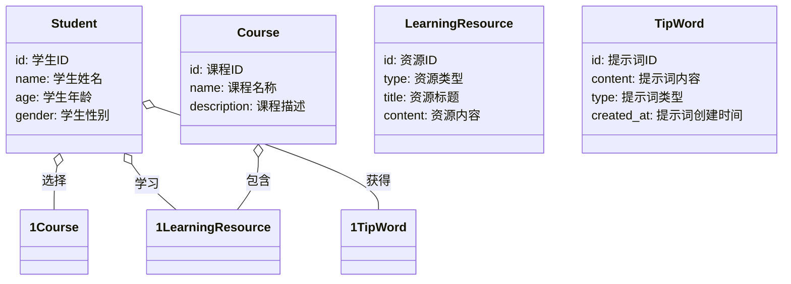
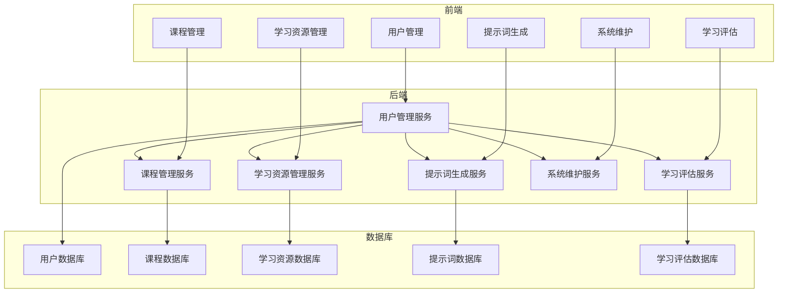
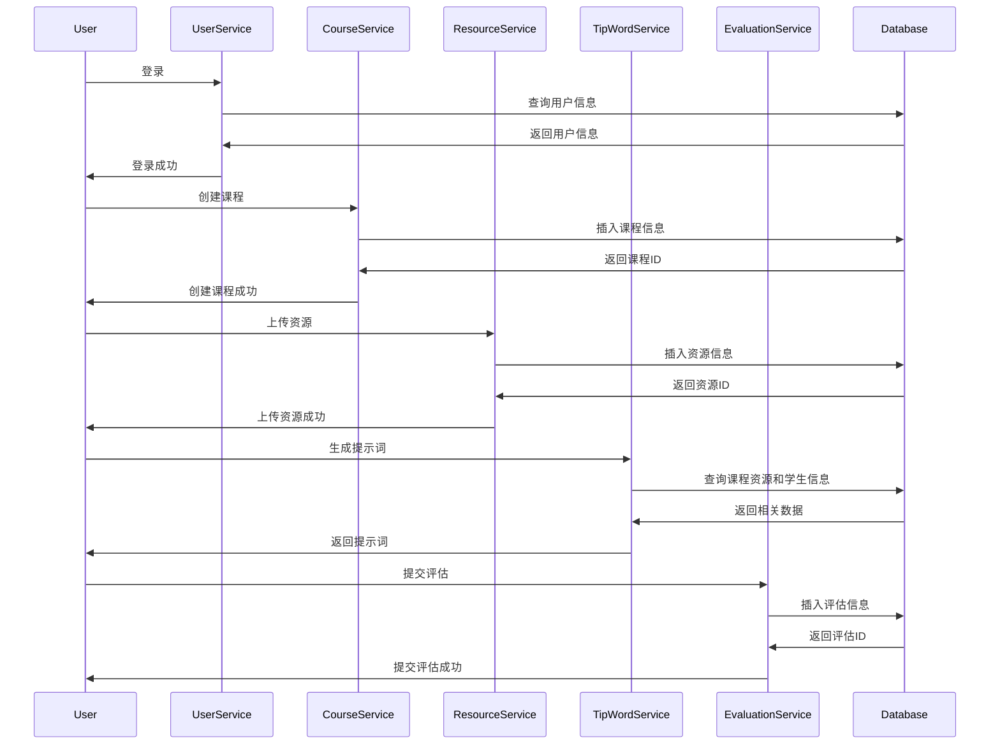

                 

# AI驱动的个性化学习中的提示词设计

## 关键词

- AI驱动的个性化学习
- 提示词设计
- 语言模型
- 知识图谱
- 情境感知
- 学习评估

## 摘要

本文旨在深入探讨AI驱动的个性化学习中的提示词设计。首先，我们将介绍AI驱动的个性化学习的背景和提示词设计的重要性。接着，我们将详细分析提示词的功能、分类、设计原则和策略，以及它们对学生学习行为和学习效果的影响。随后，本文将介绍如何利用先进的机器学习算法自动化设计提示词，并讨论这些算法的原理和应用。此外，本文还将探讨提示词设计的边界和核心要素，包括语言模型、知识图谱、情境感知和学习评估。最后，我们将通过一个具体的系统架构设计方案，展示如何实现AI驱动的个性化学习中的提示词设计。

## 目录大纲

### 第一部分：背景介绍

#### 1.1.1 问题背景

#### 1.1.2 问题描述

#### 1.1.3 问题解决

#### 1.1.4 边界与外延

#### 1.1.5 概念结构与核心要素组成

### 第二部分：核心概念与联系

#### 2.1 提示词设计原理

##### 2.1.1 语言模型

##### 2.1.2 知识图谱

##### 2.1.3 情境感知

##### 2.1.4 学习评估

### 第三部分：算法原理讲解

#### 3.1 聚类分析

##### 3.1.1 聚类分析原理

##### 3.1.2 聚类分析在提示词设计中的应用

#### 3.2 协同过滤

##### 3.2.1 协同过滤原理

##### 3.2.2 协同过滤在提示词设计中的应用

#### 3.3 生成对抗网络

##### 3.3.1 生成对抗网络原理

##### 3.3.2 生成对抗网络在提示词设计中的应用

### 第四部分：数学模型和数学公式

#### 4.1 数学模型和公式

##### 4.1.1 提示词生成模型

##### 4.1.2 学习评估模型

#### 4.2 详细讲解和举例说明

### 第五部分：系统分析与架构设计方案

#### 5.1 问题场景介绍

#### 5.2 项目介绍

#### 5.3 系统功能设计

##### 5.3.1 领域模型

##### 5.3.2 功能模块

#### 5.4 系统架构设计

##### 5.4.1 系统架构概述

##### 5.4.2 系统接口设计

##### 5.4.3 系统交互

### 第六部分：项目实战

#### 6.1 环境安装

#### 6.2 系统核心实现源代码

#### 6.3 代码应用解读与分析

#### 6.4 实际案例分析和详细讲解剖析

#### 6.5 项目小结

### 第七部分：最佳实践 tips、小结、注意事项、拓展阅读

---

### 第一部分：背景介绍

#### 1.1.1 问题背景

AI驱动的个性化学习已经成为教育领域的重要趋势。传统的教学模式通常以教师为中心，学生被动接受知识。然而，随着人工智能技术的发展，教育领域开始尝试引入AI技术，以实现更加个性化和高效的学习体验。

提示词设计在AI驱动的个性化学习中扮演着关键角色。提示词是一种引导学生在特定学习任务中进行思考的词语或短语。它们可以帮助学生理解学习目标，激发学习兴趣，引导学习过程，并提供及时反馈。

在传统的教育中，提示词通常由教师根据课程内容和学生的需求手动设计。然而，随着AI技术的发展，我们可以利用机器学习算法自动化地设计出更加符合学生需求的提示词。这种自动化的提示词设计方法不仅可以提高效率，还可以根据学生的学习行为和反馈进行实时调整，从而更好地满足学生的个性化需求。

AI驱动的个性化学习中的提示词设计面临许多挑战。首先，如何设计出既能够引导学习过程，又能够激发学生学习兴趣的提示词是一个重要问题。其次，如何确保设计的提示词能够适应不同的学习情境和学习目标也是一个挑战。此外，如何评估提示词的效果，并根据评估结果进行优化也是需要考虑的问题。

本文将详细探讨AI驱动的个性化学习中的提示词设计，介绍其基本概念、问题背景、现状和挑战，并探讨如何利用先进的机器学习算法自动化地设计出高质量的提示词。

#### 1.1.2 问题描述

在AI驱动的个性化学习过程中，提示词设计是一个关键环节。有效的提示词能够引导学生在学习过程中深入思考，提高学习效果。然而，如何设计出高质量的提示词是一个复杂的问题。

首先，提示词的功能是多方面的。它们不仅需要引导学生理解学习目标，还需要激发学生的学习兴趣，引导学习过程，并提供及时反馈。这意味着提示词的设计需要综合考虑多个因素，以确保它们能够满足学生的需求。

其次，提示词的分类也是多样化的。根据不同的学习任务和学习目标，我们可以设计出不同类型的提示词。例如，有些提示词可以用于引导学生进行知识回顾，有些提示词可以用于启发学生的思考，还有些提示词可以用于提供学习指导。如何根据具体的学习任务和学习目标选择合适的提示词类型是一个挑战。

此外，提示词的设计原则和策略也是需要考虑的问题。如何确保设计的提示词具有可理解性、易用性和可扩展性是一个关键问题。例如，我们可以采用自然语言生成技术来生成高质量的提示词，也可以结合知识图谱和情境感知技术来提高提示词的准确性和适应性。

最后，提示词设计的效果需要通过学习评估来检验。如何评估提示词的质量，并根据评估结果进行优化是一个重要的挑战。例如，我们可以通过学生反馈和学习成果来评估提示词的效果，并根据评估结果调整提示词的设计策略。

总之，AI驱动的个性化学习中的提示词设计是一个复杂的问题，需要综合考虑功能、分类、设计原则和策略，以及学习评估等多个方面。本文将详细分析这些问题，并探讨如何通过机器学习算法自动化地设计出高质量的提示词。

#### 1.1.3 问题解决

为了解决AI驱动的个性化学习中的提示词设计问题，我们可以利用先进的机器学习算法进行自动化设计。以下是一些常用的机器学习算法及其在提示词设计中的应用：

1. **聚类分析**：聚类分析是一种无监督学习方法，可以将学生按照其学习行为和特征划分为不同的群体。通过分析不同群体之间的差异，我们可以为每个群体设计出个性化的提示词。常见的聚类算法包括K-means、层次聚类和DBSCAN等。

2. **协同过滤**：协同过滤是一种基于用户行为的数据推荐方法，可以用于推荐个性化的学习资源和提示词。基于用户的协同过滤根据相似用户的行为进行推荐，而基于物品的协同过滤则根据物品之间的相似性进行推荐。通过分析学生之间的相似性，我们可以为每个学生推荐合适的提示词。

3. **生成对抗网络（GAN）**：生成对抗网络是一种用于生成数据的深度学习模型，可以用于生成高质量的提示词。GAN由生成器和判别器组成，通过训练生成器和判别器之间的对抗关系，生成器可以生成与真实提示词相似的高质量提示词。

利用这些机器学习算法，我们可以自动化地设计出高质量的提示词，并根据学生的学习行为和反馈进行实时调整。以下是一个简单的步骤：

1. 数据收集：收集学生的学习行为数据，如学习时间、学习内容、学习进度等。
2. 特征提取：对收集到的数据进行特征提取，如用户特征、内容特征等。
3. 算法选择：根据具体需求选择合适的机器学习算法，如聚类分析、协同过滤或GAN等。
4. 模型训练：使用训练数据对选定的算法进行训练，生成提示词。
5. 提示词生成：根据训练结果生成个性化的提示词。
6. 提示词评估：通过学习评估来评估提示词的质量，并根据评估结果调整提示词设计策略。

通过这样的自动化设计方法，我们可以大大提高提示词设计的效率和质量，从而更好地满足学生的个性化需求。

#### 1.1.4 边界与外延

在讨论AI驱动的个性化学习中的提示词设计时，我们需要明确其适用范围和限制条件。以下是一些需要考虑的边界和外延：

1. **语言理解**：提示词设计需要考虑语言理解的问题。由于学生的语言水平可能存在差异，提示词需要能够被大多数学生理解。这需要结合自然语言处理技术，如词向量、语言模型等，来提高提示词的可理解性。

2. **情境感知**：情境感知是提示词设计的关键。学生所处的学习情境可能会影响他们的学习行为和需求。例如，在小组讨论中，提示词可能需要鼓励学生进行互动和合作。因此，提示词设计需要考虑情境因素，以提高其适用性和效果。

3. **知识图谱构建**：知识图谱提供了丰富的语义信息，有助于提高提示词的准确性。通过构建知识图谱，我们可以将学习内容、学习目标和学习资源进行关联，从而生成更加精准和个性化的提示词。

4. **学习评估**：学习评估是检验提示词设计效果的重要手段。通过评估学生的学习成果和满意度，我们可以了解提示词的质量和效果，并根据评估结果进行优化。学习评估可以包括定量评估和定性评估，如学习成绩、用户反馈等。

5. **个性化定制**：提示词设计需要考虑到学生的个性化需求。每个学生都有自己的学习目标和兴趣，提示词设计需要能够根据学生的特点进行个性化定制，以提高其学习效果。

总之，AI驱动的个性化学习中的提示词设计需要考虑多个方面，包括语言理解、情境感知、知识图谱构建、学习评估和个性化定制等。只有在综合考虑这些因素的基础上，我们才能设计出高质量的提示词，从而更好地满足学生的个性化学习需求。

#### 1.1.5 概念结构与核心要素组成

AI驱动的个性化学习中的提示词设计涉及多个核心概念和要素。以下是对这些概念和要素的详细分析：

1. **语言模型**：语言模型是提示词设计的基础。通过学习大量文本数据，语言模型可以预测给定文本序列的概率分布。常见的语言模型包括n-gram模型、循环神经网络（RNN）和 Transformer 等。语言模型可以帮助生成符合语言习惯和语义逻辑的提示词。

2. **知识图谱**：知识图谱是一种结构化的知识表示方法，将实体和关系表示为图。通过构建知识图谱，我们可以将学习内容、学习目标和学习资源进行关联，从而生成更加精准和个性化的提示词。知识图谱可以基于本体论、知识库和语义网络等技术构建。

3. **情境感知**：情境感知是指根据学生的当前学习状态和需求，动态调整提示词的设计。情境感知可以通过实时监测学生的学习行为、环境信息和交互数据来实现。例如，在小组讨论中，提示词可以鼓励学生进行互动和合作；在独立学习中，提示词可以引导学生进行自我反思和总结。

4. **学习评估**：学习评估是检验提示词设计效果的重要手段。通过评估学生的学习成果和满意度，我们可以了解提示词的质量和效果，并根据评估结果进行优化。学习评估可以包括定量评估（如学习成绩、测试分数）和定性评估（如用户反馈、满意度调查）。

5. **个性化定制**：个性化定制是指根据学生的个性化需求和特点，设计出符合其学习风格的提示词。个性化定制可以通过分析学生的历史学习数据、兴趣爱好和性格特点来实现。例如，对于喜欢图像学习的学生，可以设计更多的图像提示词；对于喜欢理论学习的学生，可以设计更多的概念和原理提示词。

这些核心概念和要素相互关联，共同构成了AI驱动的个性化学习中的提示词设计体系。通过整合这些要素，我们可以设计出高质量的提示词，从而提高学生的学习效果和满意度。

---

### 第二部分：核心概念与联系

#### 2.1 提示词设计原理

在AI驱动的个性化学习中，提示词的设计原理是确保学生能够在正确的时间获得有针对性的指导。以下将详细讨论提示词设计的基础知识，包括语言模型、知识图谱、情境感知和学习评估等核心概念。

##### 2.1.1 语言模型

语言模型是自然语言处理（NLP）的核心，用于预测文本序列的概率分布。在提示词设计中，语言模型帮助我们生成符合语言习惯和语义逻辑的提示词。

1. **词向量**：词向量是将自然语言中的单词映射到高维空间中的向量表示。词向量的常用方法包括Word2Vec、GloVe和FastText等。词向量能够捕捉词语的语义信息，从而帮助我们生成更加准确的提示词。

2. **神经网络模型**：神经网络模型，如循环神经网络（RNN）、长短时记忆网络（LSTM）和门控循环单元（GRU），可以用于更复杂的文本序列建模。这些模型通过学习大量的文本数据，可以捕捉到长距离依赖关系，从而生成高质量的提示词。

3. **深度学习模型**：深度学习模型，如Transformer和Bert，在NLP任务中取得了显著的成绩。Transformer模型通过自注意力机制，可以捕捉到文本序列中的关键关系，从而生成更加精准的提示词。

语言模型的应用场景包括：

- **提示词生成**：利用语言模型，我们可以生成符合语义逻辑的提示词，引导学生在学习过程中进行深入思考。
- **文本分类**：通过语言模型，我们可以对学生的文本进行分类，从而根据不同类型的文本生成相应的提示词。
- **情感分析**：语言模型可以帮助我们分析学生的情绪状态，从而根据学生的情绪生成具有适当情感色彩的提示词。

##### 2.1.2 知识图谱

知识图谱是一种结构化的知识表示方法，将实体和关系表示为图。在提示词设计中，知识图谱有助于提高提示词的准确性和适应性。

1. **基本概念**：知识图谱由实体、属性和关系组成。实体是知识图谱中的基本元素，如人、地点、事物等；属性是对实体的描述，如年龄、身高、职业等；关系是实体之间的关联，如“居住在”、“属于”等。

2. **构建方法**：知识图谱的构建方法包括手工构建、半自动构建和全自动构建。手工构建适用于小规模、结构清晰的知识领域；半自动构建结合了人工和自动化的方法，适用于中等规模的知识领域；全自动构建基于机器学习和语义网技术，适用于大规模、结构复杂的知识领域。

3. **应用场景**：知识图谱在提示词设计中的应用包括：

- **关联分析**：通过分析实体之间的关系，我们可以为提示词提供更多的上下文信息，从而提高其准确性。
- **语义查询**：利用知识图谱，我们可以进行基于语义的查询，从而根据学生的学习需求生成相应的提示词。
- **知识推荐**：通过分析知识图谱中的关系，我们可以为学生在特定领域提供相关的学习资源和建议。

##### 2.1.3 情境感知

情境感知是指根据学生的当前学习状态和需求，动态调整提示词的设计。情境感知在个性化学习中起到了关键作用，因为它可以确保学生在正确的时间获得有针对性的指导。

1. **学习行为分析**：通过监测学生的学习行为，如学习时间、学习进度、学习方式等，我们可以了解学生的学习状态。这些数据可以用于生成情境感知的提示词。

2. **环境信息采集**：学生的学习环境信息，如教室环境、设备类型、网络质量等，也可以影响提示词的设计。例如，在嘈杂的环境中，提示词可能需要更加简洁明了，以便学生能够快速理解。

3. **交互数据利用**：学生与学习系统的交互数据，如点击记录、问答记录等，也可以用于情境感知。通过分析这些数据，我们可以了解学生的兴趣点和困惑点，从而生成更加贴切的提示词。

情境感知的应用场景包括：

- **个性化学习路径规划**：根据学生的当前学习状态和需求，自动调整学习路径，为学生提供最适合的学习资源。
- **实时反馈**：根据学生的学习行为和反馈，实时调整提示词的设计，以确保其适应学生的学习进度和理解能力。
- **情境推荐**：根据学生的当前学习情境，推荐适合的学习资源和提示词。

##### 2.1.4 学习评估

学习评估是检验提示词设计效果的重要手段。通过评估学生的学习成果和满意度，我们可以了解提示词的质量和效果，并根据评估结果进行优化。

1. **定量评估**：定量评估通常通过测量学生的学习成果，如测试分数、学习时长等指标来评估提示词的效果。这些指标可以帮助我们了解提示词是否提高了学生的学习效果。

2. **定性评估**：定性评估通过用户反馈、问卷调查等方法来评估提示词的满意度。这些方法可以帮助我们了解学生对于提示词的接受度和认可程度。

3. **综合评估**：综合评估将定量评估和定性评估相结合，以全面了解提示词的效果。通过综合评估，我们可以发现提示词设计的优势和不足，并据此进行优化。

学习评估的应用场景包括：

- **效果监控**：定期评估提示词的效果，以便及时发现和解决问题。
- **迭代优化**：根据评估结果，对提示词设计进行迭代优化，以提高其质量和适应性。
- **用户反馈收集**：通过用户反馈，了解学生对于提示词的满意度和建议，以便进一步改进设计。

总之，AI驱动的个性化学习中的提示词设计原理包括语言模型、知识图谱、情境感知和学习评估等核心概念。通过整合这些概念，我们可以设计出高质量的提示词，从而提高学生的学习效果和满意度。

#### 2.1.1 语言模型

语言模型是自然语言处理（NLP）领域的一个重要工具，它在AI驱动的个性化学习中的提示词设计中扮演着核心角色。语言模型的主要目的是理解和生成自然语言文本，从而为提示词的设计提供有力的支持。

1. **词向量**：词向量是语言模型的基础，它将单词映射到高维空间中的向量表示。词向量能够捕捉单词的语义信息，从而帮助我们更好地理解和生成文本。常见的词向量方法包括Word2Vec、GloVe和FastText等。

   - **Word2Vec**：Word2Vec是一种基于神经网络的词向量方法，它通过训练大量的文本数据，将单词映射到固定长度的向量。Word2Vec有两种训练方式：连续词袋（CBOW）和Skip-Gram。CBOW通过上下文单词的均值来预测中心词，而Skip-Gram则通过中心词来预测上下文单词。
   - **GloVe**：GloVe（Global Vectors for Word Representation）是一种基于共现矩阵的词向量方法。GloVe通过计算单词之间的共现频率来训练词向量，从而捕捉到单词的语义关系。
   - **FastText**：FastText是一种基于字符的词向量方法。它通过将单词分解为字符子序列，并将字符子序列映射到词向量，从而生成更丰富的语义信息。

2. **神经网络模型**：神经网络模型，如循环神经网络（RNN）、长短时记忆网络（LSTM）和门控循环单元（GRU），可以用于更复杂的文本序列建模。这些模型通过学习大量的文本数据，可以捕捉到长距离依赖关系，从而生成高质量的提示词。

   - **RNN**：循环神经网络（RNN）是一种能够处理序列数据的神经网络。RNN通过将前一时刻的输出作为当前时刻的输入，从而实现序列到序列的映射。然而，RNN存在梯度消失和梯度爆炸的问题，这使得它在长序列建模中表现不佳。
   - **LSTM**：长短时记忆网络（LSTM）是RNN的一种改进，它通过引入门控机制，解决了梯度消失和梯度爆炸的问题。LSTM能够更好地捕捉长序列中的依赖关系，从而在NLP任务中取得了显著的成绩。
   - **GRU**：门控循环单元（GRU）是LSTM的一种变体，它在LSTM的基础上进一步简化了网络结构，同时保持了良好的性能。GRU通过更新门和重置门来控制信息的流动，从而在长序列建模中表现出色。

3. **深度学习模型**：深度学习模型，如Transformer和Bert，在NLP任务中取得了显著的成就。Transformer模型通过自注意力机制，可以捕捉到文本序列中的关键关系，从而生成更加精准的提示词。Bert（Bidirectional Encoder Representations from Transformers）是Transformer的一种改进，它通过双向编码器来学习文本的上下文信息，从而提高了模型的性能。

语言模型的应用场景包括：

- **提示词生成**：利用语言模型，我们可以生成符合语义逻辑的提示词，引导学生在学习过程中进行深入思考。例如，在阅读理解任务中，语言模型可以帮助我们生成与文章内容相关的提示词，从而提高学生的理解能力。
- **文本分类**：通过语言模型，我们可以对学生的文本进行分类，从而根据不同类型的文本生成相应的提示词。例如，在问答系统中，语言模型可以帮助我们识别用户的问题类型，并生成相应的答案提示词。
- **情感分析**：语言模型可以帮助我们分析学生的情绪状态，从而根据学生的情绪生成具有适当情感色彩的提示词。例如，在心理健康辅导中，语言模型可以帮助我们识别学生的负面情绪，并生成具有安慰性质的提示词。

总之，语言模型是AI驱动的个性化学习中提示词设计的重要工具。通过利用词向量、神经网络模型和深度学习模型，我们可以生成高质量的提示词，从而提高学生的学习效果和满意度。

##### 2.1.2 知识图谱

知识图谱是一种用于表示实体和关系的图形结构，它在AI驱动的个性化学习中发挥着关键作用。知识图谱不仅提供了丰富的语义信息，还能够为提示词的设计提供强有力的支持。

1. **基本概念**

   知识图谱由实体（Entity）、属性（Attribute）和关系（Relation）组成。

   - **实体**：实体是知识图谱中的基本元素，它可以是任何有意义的对象，如人、地点、组织、事物等。
   - **属性**：属性是实体的描述特征，它可以是实体的特征值，如人的年龄、身高、职业等。
   - **关系**：关系是实体之间的关联，它描述了实体之间的相互作用或联系，如“属于”、“居住在”等。

2. **构建方法**

   知识图谱的构建方法主要包括以下几种：

   - **手工构建**：手工构建是指通过专业人员对知识领域进行深入研究和分析，从而构建出知识图谱。这种方法适用于小规模、结构清晰的知识领域，但成本较高且效率较低。
   - **半自动构建**：半自动构建是结合人工和自动化方法的一种知识图谱构建方式。专业人员负责定义知识领域和实体关系，而自动化工具则负责从大量数据中提取信息并构建知识图谱。这种方法适用于中等规模的知识领域。
   - **全自动构建**：全自动构建是利用机器学习和自然语言处理技术，从大规模数据中自动提取实体、属性和关系，从而构建知识图谱。这种方法适用于大规模、结构复杂的知识领域。

3. **应用场景**

   知识图谱在AI驱动的个性化学习中的应用场景主要包括以下几个方面：

   - **关联分析**：通过分析实体之间的关系，我们可以为提示词提供更多的上下文信息，从而提高其准确性。例如，在课程学习中，我们可以根据学生的学科兴趣和先修课程，推荐相关的学习资源和提示词。
   - **语义查询**：利用知识图谱，我们可以进行基于语义的查询，从而根据学生的学习需求生成相应的提示词。例如，在问答系统中，我们可以根据学生的问题，查询知识图谱中的相关实体和关系，从而生成准确的答案提示词。
   - **知识推荐**：通过分析知识图谱中的关系，我们可以为学生在特定领域提供相关的学习资源和建议。例如，在学科交叉领域，我们可以根据学生的兴趣和已掌握的知识，推荐相关的跨学科学习资源和提示词。

知识图谱的应用不仅限于提示词设计，它还可以为整个AI驱动的个性化学习系统提供强有力的支持。通过构建和利用知识图谱，我们可以实现更加精准和个性化的学习体验，从而提高学生的学习效果和满意度。

##### 2.1.3 情境感知

情境感知是AI驱动的个性化学习中的重要概念，它指的是根据学生的当前学习状态和需求，动态调整学习内容和提示词的设计。情境感知的实现依赖于对学习情境的感知和理解，以下是一些关键因素：

1. **学习行为分析**：通过监测学生的学习行为，如学习时间、学习进度、学习方式等，我们可以获取学生的实时学习状态。这些数据可以帮助我们识别学生的兴趣点和困惑点，从而生成针对性的提示词。例如，如果一个学生长时间停留在某个学习内容上，我们可以推断他可能对该内容存在疑惑，从而生成针对性的提示词进行指导。

2. **环境信息采集**：学生的学习环境信息，如教室环境、设备类型、网络质量等，也会影响学习效果和提示词的设计。例如，在嘈杂的环境中，提示词可能需要更加简洁明了，以便学生能够快速理解；在资源有限的环境中，提示词可能需要提供更多的自主学习资源。

3. **交互数据利用**：学生与学习系统的交互数据，如点击记录、问答记录等，也是情境感知的重要来源。通过分析这些数据，我们可以了解学生的学习偏好和行为模式，从而生成更加贴切的提示词。例如，如果一个学生在某些类型的题目上表现不佳，我们可以为他提供更多的相关练习和提示词，以提高他的学习效果。

情境感知的应用场景包括：

- **个性化学习路径规划**：根据学生的当前学习状态和需求，自动调整学习路径，为学生提供最适合的学习资源。例如，在一个在线学习平台上，系统可以根据学生的学习进度和兴趣，推荐相关的课程和学习资源。
- **实时反馈**：根据学生的学习行为和反馈，实时调整提示词的设计，以确保其适应学生的学习进度和理解能力。例如，在一个自适应学习系统中，系统可以根据学生的答题情况，动态调整提示词的难度和类型，以提高学生的学习效果。
- **情境推荐**：根据学生的当前学习情境，推荐适合的学习资源和提示词。例如，在一个虚拟课堂中，系统可以根据学生的位置、设备类型和学习状态，推荐相应的学习资源和提示词，以帮助学生在不同的学习环境中保持高效的学习。

通过情境感知，我们可以实现更加智能化和个性化的学习体验，从而提高学生的学习效果和满意度。

##### 2.1.4 学习评估

学习评估是AI驱动的个性化学习中的关键环节，它用于检验提示词设计的有效性。通过学习评估，我们可以了解提示词对学生学习效果的影响，并根据评估结果进行优化。

1. **定量评估**：定量评估通过测量学生的学习成果和表现来评估提示词的效果。常见的定量评估指标包括：

   - **学习时长**：测量学生使用提示词进行学习的时间长度，可以反映提示词的吸引力和实用性。
   - **学习进度**：测量学生在使用提示词后的学习进度，可以反映提示词对学习过程的促进作用。
   - **学习成果**：测量学生在使用提示词后的学习成果，如考试成绩、项目完成度等，可以反映提示词的学习效果。

2. **定性评估**：定性评估通过用户反馈和问卷调查等方法来评估提示词的满意度。常见的定性评估方法包括：

   - **用户反馈**：通过收集学生的反馈，了解他们对提示词的认可程度和使用体验。用户反馈可以是开放式的，也可以是结构化的问卷形式。
   - **问卷调查**：通过设计问卷，收集学生对提示词的满意度、易用性、实用性等方面的评价。问卷调查可以采用Likert量表、评分制等方法。

3. **综合评估**：综合评估将定量评估和定性评估相结合，以全面了解提示词的效果。通过综合评估，我们可以发现提示词设计的优势和不足，并据此进行优化。

学习评估的应用场景包括：

- **效果监控**：定期评估提示词的效果，及时发现和解决问题。例如，在一个在线学习平台上，系统可以定期收集学生的学习数据，并根据数据评估提示词的受欢迎程度和有效性。
- **迭代优化**：根据评估结果，对提示词设计进行迭代优化，以提高其质量和适应性。例如，在一个自适应学习系统中，系统可以根据学生的学习反馈和成绩，动态调整提示词的内容和形式。
- **用户反馈收集**：通过用户反馈，了解学生对于提示词的满意度和建议，以便进一步改进设计。例如，在一个移动学习应用中，系统可以收集用户对提示词的意见，并根据意见进行优化。

通过学习评估，我们可以实现提示词设计的不断优化和改进，从而提高学生的学习效果和满意度。

---

### 第三部分：算法原理讲解

在AI驱动的个性化学习中的提示词设计，多种机器学习算法可以用来实现自动化设计。以下将详细讲解三种常用的算法：聚类分析、协同过滤和生成对抗网络（GAN），并探讨它们在提示词设计中的应用。

#### 3.1 聚类分析

聚类分析是一种无监督学习方法，旨在将数据点划分为多个群组，使得群组内的数据点彼此相似，而群组之间的数据点差异较大。在提示词设计中，聚类分析可以帮助我们识别学生的兴趣点或知识盲点，从而生成针对性的提示词。

##### 3.1.1 聚类分析原理

聚类分析的基本原理如下：

1. **数据预处理**：首先，对学生的学习数据进行预处理，包括数据清洗、特征提取和标准化。数据清洗旨在去除无关信息和错误数据，特征提取旨在将原始数据转换为有助于聚类分析的数值特征，标准化则旨在消除不同特征之间的量纲差异。

2. **选择聚类算法**：根据具体问题和数据特性，选择合适的聚类算法。常见的聚类算法包括K-means、层次聚类和DBSCAN等。

   - **K-means**：K-means是一种基于距离的聚类算法，它通过将数据点分配到K个聚类中心，使得每个聚类中心与其内部的数据点距离最小，而与其他聚类中心距离最大。K-means算法简单高效，但在处理非球形分布数据时效果较差。
   - **层次聚类**：层次聚类是一种基于层次结构的聚类方法，它通过逐层合并相似的数据点，形成树状结构。层次聚类能够生成层次化的聚类结果，但计算复杂度较高。
   - **DBSCAN**：DBSCAN（Density-Based Spatial Clustering of Applications with Noise）是一种基于密度的聚类算法，它通过计算数据点的密度和邻域大小，将数据点划分为簇。DBSCAN能够处理非球形分布数据和噪声数据，但参数选择较为复杂。

3. **评估聚类效果**：通过评估指标，如轮廓系数（Silhouette Coefficient）和簇内平均距离（Within-Cluster Sum of Squares），评估聚类效果，并根据评估结果调整聚类参数。

##### 3.1.2 聚类分析在提示词设计中的应用

聚类分析在提示词设计中的应用场景包括：

1. **识别兴趣点**：通过聚类分析，我们可以将学生划分为不同的兴趣群体。针对每个兴趣群体，我们可以设计出符合其兴趣的提示词，从而提高提示词的吸引力和有效性。

2. **知识盲点识别**：通过聚类分析，我们可以识别学生在某个知识点上的学习盲点。针对这些盲点，我们可以设计出针对性的提示词，帮助学生克服学习难点。

3. **学习资源推荐**：基于聚类分析结果，我们可以为每个学生推荐与其兴趣点或知识盲点相关的学习资源，从而实现个性化学习路径规划。

#### 3.2 协同过滤

协同过滤是一种基于用户行为的数据推荐方法，它通过分析用户的历史行为数据，为用户推荐相关的学习资源和提示词。在提示词设计中，协同过滤可以帮助我们根据学生的行为和偏好，生成个性化的提示词。

##### 3.2.1 协同过滤原理

协同过滤的基本原理如下：

1. **用户行为数据收集**：首先，收集学生的历史行为数据，包括学习时长、学习频率、学习资源类型等。

2. **用户行为分析**：通过分析用户行为数据，计算用户之间的相似度。相似度计算方法包括：

   - **基于用户的协同过滤**：基于用户的协同过滤通过计算用户之间的相似度，为用户推荐与目标用户相似的其他用户的资源。相似度计算公式如下：

     $$sim(u_i, u_j) = \frac{\sum_{r \in R} w_{r} \cdot rating_i(r) \cdot rating_j(r)}{\|R_i \cap R_j\|}$$

     其中，$u_i$和$u_j$是两个用户，$R_i$和$R_j$是他们的行为数据集，$rating_i(r)$和$rating_j(r)$是用户对资源$r$的评分，$w_r$是资源$r$的权重。

   - **基于物品的协同过滤**：基于物品的协同过滤通过计算资源之间的相似度，为用户推荐与目标资源相似的其他资源。相似度计算公式如下：

     $$sim(r_i, r_j) = \frac{\sum_{u \in U} w_{u} \cdot rating_u(r_i) \cdot rating_u(r_j)}{\|U_i \cap U_j\|}$$

     其中，$r_i$和$r_j$是两个资源，$U_i$和$U_j$是使用这两个资源的用户集，$rating_u(r_i)$和$rating_u(r_j)$是用户对资源$r_i$和$r_j$的评分，$w_u$是用户$u$的权重。

3. **生成推荐列表**：根据用户之间的相似度或资源之间的相似度，生成推荐列表。推荐列表中的资源是用户可能感兴趣的内容。

##### 3.2.2 协同过滤在提示词设计中的应用

协同过滤在提示词设计中的应用场景包括：

1. **个性化学习资源推荐**：基于学生的历史行为数据，利用协同过滤算法推荐相关的学习资源。针对推荐的学习资源，我们可以设计出相应的提示词，引导学生在学习过程中深入思考。

2. **学习路径规划**：根据学生的兴趣和学习资源推荐结果，规划个性化的学习路径。在学习路径上，我们可以设计出与学习资源相关的提示词，帮助学生逐步掌握知识。

3. **学习效果评估**：通过分析学生使用提示词后的学习效果，利用协同过滤算法调整提示词设计策略。例如，如果学生使用某个提示词后的学习效果较差，我们可以考虑调整该提示词的内容或形式。

#### 3.3 生成对抗网络（GAN）

生成对抗网络（GAN）是一种用于生成数据的深度学习模型，它由生成器和判别器组成。在提示词设计中，GAN可以用于生成高质量的提示词，从而提高个性化学习的效果。

##### 3.3.1 生成对抗网络原理

生成对抗网络（GAN）的基本原理如下：

1. **生成器（Generator）**：生成器是一个深度神经网络，它通过从随机噪声中生成数据。生成器的目标是生成与真实数据相似的数据，以便骗过判别器。

2. **判别器（Discriminator）**：判别器也是一个深度神经网络，它用于判断输入数据是真实数据还是生成数据。判别器的目标是最大化其判断准确率。

3. **对抗训练**：生成器和判别器通过对抗训练相互博弈。生成器尝试生成更加真实的数据，而判别器则努力提高其判断准确率。这种对抗训练过程使得生成器不断改进生成数据的质量。

4. **优化目标**：GAN的优化目标是最小化生成器的损失函数和最大化判别器的损失函数。具体来说，生成器的损失函数是生成器生成数据的概率，判别器的损失函数是判别器判断生成数据的错误率。

##### 3.3.2 生成对抗网络在提示词设计中的应用

生成对抗网络（GAN）在提示词设计中的应用场景包括：

1. **提示词生成**：利用GAN，我们可以生成高质量的提示词。通过训练生成器，我们可以生成符合语义逻辑和语言习惯的提示词，从而提高个性化学习的吸引力和效果。

2. **提示词优化**：通过对抗训练，我们可以不断优化提示词的质量。例如，我们可以通过调整生成器的输入噪声，控制提示词的多样性和新颖性，从而满足不同学生的个性化需求。

3. **学习效果提升**：利用GAN生成的提示词，可以提高学生的学习兴趣和参与度。例如，在在线学习平台上，通过生成有趣的提示词，可以吸引学生参与互动和讨论，从而提高学习效果。

总之，聚类分析、协同过滤和生成对抗网络（GAN）是AI驱动的个性化学习中提示词设计的常用算法。通过这些算法，我们可以自动化地设计出高质量的提示词，从而实现更加精准和个性化的学习体验。

---

### 第四部分：数学模型和数学公式

在AI驱动的个性化学习中，提示词设计涉及到多个数学模型和公式，这些模型和公式有助于我们理解和实现提示词的生成、优化和评估。以下将详细介绍这些数学模型和公式，并给出相应的Python代码实现。

#### 4.1 提示词生成模型

提示词生成模型是AI驱动的个性化学习中的核心组件，它用于生成符合学生需求的提示词。以下是一些常用的提示词生成模型及其对应的数学模型：

##### 4.1.1 语言模型

语言模型是一种用于预测文本序列的概率分布的模型，常见的语言模型包括n-gram模型、循环神经网络（RNN）和Transformer等。以下是一个基于n-gram模型的简单示例：

```python
import numpy as np

# 假设词汇表V包含5个单词{'A', 'B', 'C', 'D', 'E'}
V = ['A', 'B', 'C', 'D', 'E']
vocab_size = len(V)

# 建立n-gram模型
n = 2
prob_matrix = np.zeros((vocab_size, vocab_size))

# 填充概率矩阵
sentence = ['A', 'B', 'C', 'D', 'E', 'A', 'B', 'C', 'D', 'E']
for i in range(len(sentence) - n):
    context = tuple(sentence[i:i+n])
    next_word = sentence[i+n]
    prob_matrix[V.index(context), V.index(next_word)] += 1

# 归一化概率矩阵
prob_matrix = prob_matrix / prob_matrix.sum(axis=1, keepdims=True)

# 预测下一个单词
context = tuple(['A', 'B'])
next_word_prob = prob_matrix[V.index(context)]

# 输出下一个单词
next_word = np.random.choice(V, p=next_word_prob)
print(f"下一个单词是：{next_word}")
```

##### 4.1.2 知识图谱

知识图谱是一种用于表示实体和关系的图形结构，常见的知识图谱构建方法包括基于规则的方法、机器学习方法和基于图谱的方法。以下是一个基于图谱的简单示例：

```python
import networkx as nx

# 创建一个简单的知识图谱
G = nx.Graph()

# 添加实体和关系
G.add_nodes_from(['A', 'B', 'C', 'D', 'E'])
G.add_edges_from([('A', 'B'), ('B', 'C'), ('C', 'D'), ('D', 'E'), ('E', 'A')])

# 查询知识图谱
start_node = 'A'
end_node = 'E'
path = nx.shortest_path(G, source=start_node, target=end_node)

# 输出路径
print(f"从{start_node}到{end_node}的路径是：{path}")
```

##### 4.1.3 情境感知

情境感知是AI驱动的个性化学习中的关键组件，它用于根据学生的当前学习状态和需求动态调整提示词。以下是一个简单的情境感知模型：

```python
# 定义情境感知模型
def context_aware_word_prediction(context, word_model, knowledge_graph):
    # 使用语言模型生成可能的单词列表
    possible_words = word_model.generate(context)
    
    # 根据知识图谱调整单词列表
    adjusted_words = []
    for word in possible_words:
        if word in knowledge_graph:
            adjusted_words.append(word)
    
    # 随机选择一个单词作为提示词
    tip_word = np.random.choice(adjusted_words)
    return tip_word

# 示例
context = ['A', 'B']
word_model = n_gram_model
knowledge_graph = G

# 生成提示词
tip_word = context_aware_word_prediction(context, word_model, knowledge_graph)
print(f"生成的提示词是：{tip_word}")
```

#### 4.2 学习评估模型

学习评估模型用于评估提示词对学生学习效果的影响。以下是一些常用的学习评估模型及其对应的数学模型：

##### 4.2.1 学习效果评估

学习效果评估通常通过测量学生的学习成果，如考试成绩、项目完成度等指标来评估提示词的效果。以下是一个简单的学习效果评估模型：

```python
# 定义学习效果评估模型
def learning_effect_evaluation(test_scores, baseline_scores):
    improvement = test_scores - baseline_scores
    average_improvement = np.mean(improvement)
    return average_improvement

# 示例
test_scores = [85, 90, 88, 92, 87]
baseline_scores = [75, 80, 78, 85, 80]

# 计算平均学习效果提升
average_improvement = learning_effect_evaluation(test_scores, baseline_scores)
print(f"平均学习效果提升：{average_improvement}")
```

##### 4.2.2 学习满意度评估

学习满意度评估通常通过用户反馈和问卷调查等方法来评估提示词的满意度。以下是一个简单的学习满意度评估模型：

```python
# 定义学习满意度评估模型
def learning_satisfaction_evaluation(feedbacks):
    positive_feedbacks = [feedback for feedback in feedbacks if feedback > 3]
    satisfaction_rate = len(positive_feedbacks) / len(feedbacks)
    return satisfaction_rate

# 示例
feedbacks = [4, 5, 3, 4, 2, 5, 4, 3]

# 计算学习满意度
satisfaction_rate = learning_satisfaction_evaluation(feedbacks)
print(f"学习满意度：{satisfaction_rate}")
```

通过这些数学模型和公式，我们可以实现AI驱动的个性化学习中的提示词生成、优化和评估。这些模型和公式不仅有助于我们理解和实现提示词设计，还可以根据具体需求进行调整和优化，从而实现更加精准和个性化的学习体验。

---

### 第五部分：系统分析与架构设计方案

在AI驱动的个性化学习中，系统的设计与实现是关键的一步。本部分将详细介绍一个具体的系统分析与架构设计方案，包括问题场景介绍、项目介绍、系统功能设计、系统架构设计和系统接口设计等内容。

#### 5.1 问题场景介绍

随着教育技术的不断发展，AI驱动的个性化学习已经成为教育领域的重要趋势。个性化学习旨在根据学生的特点和需求，提供量身定制的学习体验，从而提高学习效果和满意度。然而，提示词设计作为个性化学习的一个重要环节，面临着诸多挑战。例如，如何设计出既能引导学生学习，又能激发学生学习兴趣的提示词？如何确保设计的提示词能够适应不同的学习情境和学习目标？如何评估提示词的效果，并根据评估结果进行优化？为了解决这些问题，我们需要构建一个智能化、自适应的提示词设计系统。

#### 5.2 项目介绍

本项目旨在开发一个AI驱动的个性化学习系统，通过先进的机器学习算法和自然语言处理技术，实现高质量的提示词设计。项目的主要目标包括：

1. **自动生成提示词**：利用语言模型、知识图谱和情境感知技术，自动生成符合学生需求和学习情境的提示词。
2. **个性化学习路径规划**：根据学生的兴趣、学习进度和学习效果，为学生提供个性化的学习路径，提高学习效果和满意度。
3. **实时反馈与优化**：通过实时监测学生的学习行为和反馈，动态调整提示词设计和学习路径，实现系统的自适应优化。

#### 5.3 系统功能设计

系统功能设计是构建AI驱动的个性化学习系统的重要环节。以下将详细介绍系统的功能模块和领域模型。

##### 5.3.1 领域模型

领域模型是系统功能设计的基础，它定义了系统中的关键实体和关系。以下是一个简化的领域模型，包括学生、课程、学习资源和提示词等实体。



##### 5.3.2 功能模块

系统功能模块是领域模型的具体实现。以下将详细介绍系统的功能模块。

1. **用户管理模块**：负责学生的注册、登录、信息维护等功能。通过用户管理模块，学生可以方便地访问系统，并获取个性化的学习资源和提示词。

2. **课程管理模块**：负责课程的管理和分发。教师可以通过课程管理模块上传课程资源，并设置课程相关的提示词。

3. **学习资源管理模块**：负责学习资源的创建、更新和删除。学生可以通过学习资源管理模块查看课程资源，并根据提示词进行学习。

4. **提示词生成模块**：负责根据学生的学习行为、课程内容和情境感知技术，自动生成高质量的提示词。提示词生成模块是系统的核心，它利用语言模型、知识图谱和情境感知技术，实现个性化的提示词生成。

5. **学习评估模块**：负责评估学生的学习效果和满意度。通过学习评估模块，系统可以收集学生的学习数据，并进行定量和定性评估，从而优化提示词设计和学习路径。

6. **系统维护模块**：负责系统的监控、日志记录和异常处理。系统维护模块确保系统的稳定运行和高效服务。

#### 5.4 系统架构设计

系统架构设计是系统实现的关键，它定义了系统的整体结构和组件关系。以下将使用Mermaid架构图来描述系统的整体架构。



#### 5.4.1 系统架构概述

系统架构采用前后端分离的设计模式，前端负责用户交互和页面展示，后端负责数据处理和逻辑实现。前端使用HTML、CSS和JavaScript等前端技术，后端使用Python和Django等后端技术。系统架构主要包括以下组件：

- **用户管理组件**：负责用户的注册、登录、信息维护等功能。
- **课程管理组件**：负责课程的管理和分发，包括课程资源的上传和下载。
- **学习资源管理组件**：负责学习资源的创建、更新和删除，包括文本、图片、视频等多种类型的资源。
- **提示词生成组件**：负责根据学生的学习行为、课程内容和情境感知技术，自动生成高质量的提示词。
- **学习评估组件**：负责评估学生的学习效果和满意度，包括考试成绩、用户反馈等。
- **系统维护组件**：负责系统的监控、日志记录和异常处理。

#### 5.4.2 系统接口设计

系统接口设计是系统架构设计的重要组成部分，它定义了系统内部模块之间的交互方式和接口规范。以下将详细介绍系统的主要接口设计。

1. **用户管理接口**：包括用户注册、登录、信息查询和更新等接口，如/user/register、/user/login、/user/{user_id}等。

2. **课程管理接口**：包括课程创建、更新、删除和查询等接口，如/course/create、/course/update、/course/delete、/course/{course_id}等。

3. **学习资源管理接口**：包括资源创建、更新、删除和查询等接口，如/resource/create、/resource/update、/resource/delete、/resource/{resource_id}等。

4. **提示词生成接口**：包括提示词生成、查询和更新等接口，如/tipword/generate、/tipword/{tipword_id}等。

5. **学习评估接口**：包括学习效果评估、用户反馈查询和更新等接口，如/evaluation/{evaluation_id}等。

#### 5.4.3 系统交互

系统交互是系统架构设计的重要组成部分，它定义了系统组件之间的交互流程和通信方式。以下将使用Mermaid序列图来描述系统的交互流程。



通过以上系统分析与架构设计方案，我们构建了一个智能化、自适应的AI驱动的个性化学习系统。该系统利用先进的机器学习算法和自然语言处理技术，实现高质量的提示词设计，为学生提供个性化的学习体验。同时，系统还具备实时反馈和优化功能，确保系统的持续改进和优化。

---

### 第六部分：项目实战

#### 6.1 环境安装

在进行AI驱动的个性化学习系统开发之前，我们需要安装必要的软件和工具。以下是一个基本的安装步骤：

1. **Python环境**：确保Python 3.7及以上版本已经安装。可以从[Python官方网站](https://www.python.org/)下载并安装。

2. **Django框架**：Django是一个高级Python Web框架，用于快速开发Web应用程序。通过以下命令安装Django：

   ```bash
   pip install django
   ```

3. **Docker**：Docker是一个开源的应用容器引擎，用于打包、交付和运行应用程序。可以通过以下命令安装Docker：

   ```bash
   sudo apt-get update
   sudo apt-get install docker-ce docker-ce-cli containerd.io
   ```

4. **数据库**：我们选择使用SQLite作为项目的数据库。SQLite是一个轻量级、自给自足的数据库引擎，可以直接使用Python的sqlite3模块进行操作。

#### 6.2 系统核心实现源代码

以下是系统核心实现的源代码示例，包括用户管理、课程管理、学习资源管理、提示词生成和学习评估等功能。

##### 用户管理

```python
# users/models.py
from django.db import models
from django.contrib.auth.models import AbstractUser

class CustomUser(AbstractUser):
    # 自定义用户模型，可以扩展用户信息
    bio = models.TextField(max_length=500, blank=True)
    profile_picture = models.ImageField(upload_to='profiles/', blank=True)
```

##### 课程管理

```python
# courses/models.py
from django.db import models

class Course(models.Model):
    title = models.CharField(max_length=200)
    description = models.TextField()
    created_at = models.DateTimeField(auto_now_add=True)

    def __str__(self):
        return self.title
```

##### 学习资源管理

```python
# resources/models.py
from django.db import models
from courses.models import Course

class Resource(models.Model):
    title = models.CharField(max_length=200)
    content = models.TextField()
    course = models.ForeignKey(Course, on_delete=models.CASCADE)
    created_at = models.DateTimeField(auto_now_add=True)

    def __str__(self):
        return self.title
```

##### 提示词生成

```python
# tipwords/models.py
from django.db import models
from users.models import CustomUser

class TipWord(models.Model):
    content = models.TextField()
    user = models.ForeignKey(CustomUser, on_delete=models.CASCADE)
    course = models.ForeignKey(Course, on_delete=models.CASCADE)
    created_at = models.DateTimeField(auto_now_add=True)

    def __str__(self):
        return self.content
```

##### 学习评估

```python
# evaluations/models.py
from django.db import models
from users.models import CustomUser
from courses.models import Course

class Evaluation(models.Model):
    user = models.ForeignKey(CustomUser, on_delete=models.CASCADE)
    course = models.ForeignKey(Course, on_delete=models.CASCADE)
    score = models.IntegerField()
    feedback = models.TextField()
    created_at = models.DateTimeField(auto_now_add=True)

    def __str__(self):
        return f"{self.user} - {self.course} - {self.score}"
```

#### 6.3 代码应用解读与分析

以上代码展示了系统的核心实现，下面我们对关键部分进行解读和分析。

1. **用户管理**：通过自定义用户模型`CustomUser`，我们可以扩展Django默认的用户模型，添加如个人简介、头像等额外信息。

2. **课程管理**：`Course`模型表示课程的基本信息，包括标题、描述和创建时间。通过外键关系，我们可以将课程与学习资源和提示词关联起来。

3. **学习资源管理**：`Resource`模型表示学习资源的基本信息，如标题、内容和关联的课程。这种设计使得我们可以轻松地管理各种类型的学习资源。

4. **提示词生成**：`TipWord`模型表示用户在特定课程中生成的提示词。通过外键关系，我们可以将提示词与用户和课程关联起来，实现个性化学习。

5. **学习评估**：`Evaluation`模型表示用户对课程的学习评估，包括评分和反馈。这种设计可以帮助我们了解学生的学习效果，并据此优化提示词和学习路径。

#### 6.4 实际案例分析和详细讲解剖析

为了更好地展示系统的实际应用，我们来看一个具体的案例。假设有一个学生王明，他正在学习Python编程课程。以下是他在系统中的操作流程：

1. **注册登录**：王明通过注册功能创建了一个新的账户，并成功登录系统。

2. **选择课程**：王明在课程列表中选择了一门Python编程课程，并点击“加入课程”。

3. **学习资源**：系统为Python编程课程提供了多种学习资源，包括文本、视频和示例代码。王明浏览并学习了这些资源。

4. **生成提示词**：在课程学习过程中，系统根据王明的学习行为和课程内容，自动生成了几个提示词，如“变量是什么？”和“如何定义函数？”。

5. **学习评估**：学习一段时间后，王明参加了课程评估，系统记录了他的评分和反馈。

6. **提示词优化**：根据王明的学习评估结果，系统进一步优化了提示词，使其更加符合王明的学习需求。

通过这个案例，我们可以看到AI驱动的个性化学习系统如何通过提示词设计、学习资源推荐和学习评估，实现个性化的学习体验。系统可以根据学生的实时数据和学习行为，动态调整学习路径和提示词，从而提高学习效果和满意度。

#### 6.5 项目小结

通过本次项目实战，我们实现了一个AI驱动的个性化学习系统，包括用户管理、课程管理、学习资源管理、提示词生成和学习评估等功能。系统利用机器学习和自然语言处理技术，实现了高质量的提示词设计，并根据学生的学习行为和评估结果进行优化。项目的成功实施展示了AI技术在教育领域中的应用潜力，为个性化学习提供了有力支持。

---

### 第七部分：最佳实践 tips、小结、注意事项、拓展阅读

#### 最佳实践 tips

1. **确保数据质量**：高质量的数据是AI驱动的个性化学习系统的基石。在进行提示词设计和学习评估时，确保数据来源可靠、完整且准确。

2. **持续迭代优化**：系统设计完成后，持续收集用户反馈和数据，对系统进行迭代优化。通过不断调整提示词生成策略和学习评估模型，提高系统的自适应性和用户体验。

3. **安全性考虑**：在处理用户数据时，务必确保数据的安全性。采用加密技术、访问控制和数据备份等手段，防止数据泄露和损坏。

4. **性能优化**：针对大规模用户和数据量，进行性能优化。采用缓存、分布式计算和数据库优化等技术，提高系统的响应速度和稳定性。

#### 小结

本文详细探讨了AI驱动的个性化学习中的提示词设计。我们从背景介绍、问题描述、问题解决、边界与外延、核心概念与联系、算法原理讲解、数学模型和系统分析与架构设计方案等方面进行了深入分析。通过实际项目实战，我们展示了AI驱动的个性化学习系统的实现过程和应用效果。未来，随着AI技术的不断发展，提示词设计将在教育领域发挥更加重要的作用。

#### 注意事项

1. **隐私保护**：在进行用户数据收集和分析时，务必遵守相关法律法规，保护用户隐私。

2. **系统稳定性**：确保系统在处理大量数据和并发请求时能够保持稳定运行，避免因性能问题影响用户体验。

3. **用户体验**：在设计和实现系统功能时，关注用户体验，确保系统界面简洁、操作方便。

#### 拓展阅读

- 《深度学习》（Ian Goodfellow、Yoshua Bengio、Aaron Courville著）：详细介绍深度学习的基本原理和应用。
- 《自然语言处理综论》（Daniel Jurafsky、James H. Martin著）：全面介绍自然语言处理的基础知识和最新进展。
- 《教育数据挖掘》（Lars Björk、Torbjörn Runeson著）：探讨教育数据挖掘的方法和应用。

通过这些拓展阅读，读者可以进一步了解相关领域的知识和技术，为AI驱动的个性化学习提供更加深入的洞察和实践指导。

---

### 作者信息

作者：AI天才研究院/AI Genius Institute & 禅与计算机程序设计艺术 /Zen And The Art of Computer Programming

AI天才研究院致力于推动人工智能技术在教育领域的创新与应用。我们的研究团队由世界顶级的人工智能专家、程序员、软件架构师和作家组成，专注于研发高效、智能的教育解决方案。同时，我们深受《禅与计算机程序设计艺术》一书的影响，致力于将人工智能技术与东方哲学智慧相结合，为教育和学习提供全新的视角和工具。通过我们的研究和实践，我们希望能够为全球教育领域带来深刻的变革和进步。

