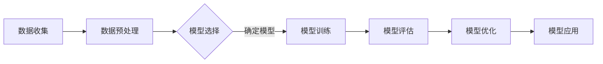
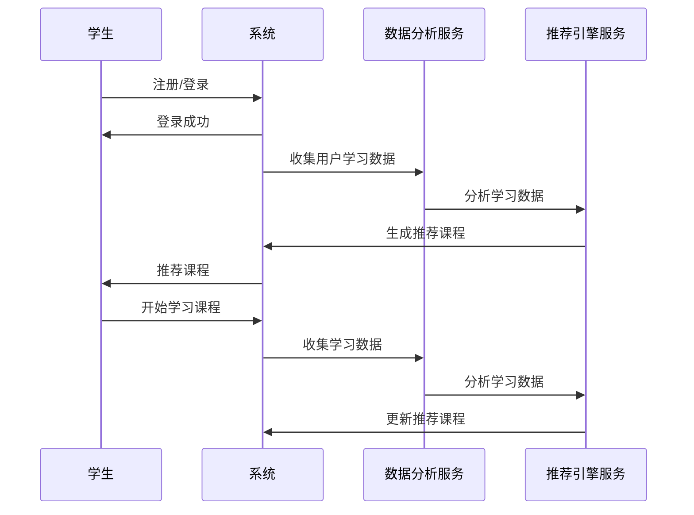

                 

### AI驱动的个性化学习平台：适应每个学生的需求

#### 关键词

- AI驱动
- 个性化学习
- 教育技术
- 机器学习
- 教学优化

#### 摘要

本文旨在探讨AI驱动的个性化学习平台，如何通过先进的人工智能技术适应每个学生的学习需求。文章首先介绍了个性化学习的背景和重要性，随后深入分析了核心概念和算法原理。接着，文章通过系统分析与架构设计，展示了平台的技术实现过程。最后，通过项目实战和最佳实践分享，为读者提供了实际操作指南和未来研究方向。

---

### 第一部分：背景介绍与核心概念

#### 1.1 AI驱动的个性化学习平台概述

随着教育信息化的迅速发展，传统的“一刀切”教学模式逐渐暴露出其局限性。个性化学习应运而生，旨在通过因材施教，最大限度地满足每个学生的学习需求。AI技术的引入为个性化学习提供了强有力的支持，使得教育更加智能化、精准化。

#### 1.2 个性化学习的背景和需求

**教育信息化背景**：随着互联网和大数据技术的发展，教育信息化成为教育改革的重要方向。数据化、智能化已成为现代教育的标配，为个性化学习提供了数据基础。

**个性化学习的需求**：传统教育模式难以应对学生的个体差异，难以实现精准教学。个性化学习通过数据分析和智能算法，能够根据学生的学习特点提供定制化教育方案，提高学习效果。

#### 1.3 问题描述

**问题背景**：在传统的教学模式下，教师难以兼顾每个学生的学习需求，教育资源分配不均，教学效果不佳。

**问题描述**：如何利用AI技术构建一个个性化学习平台，能够动态调整教学策略，优化学习资源，提高教学效果。

**问题解决**：通过AI驱动的个性化学习平台，利用数据挖掘、机器学习等技术，实现对学生学习数据的深度分析，为教师和学生提供个性化的教学方案。

**边界与外延**：个性化学习平台不仅适用于K-12教育，还可在职业培训、成人教育等领域发挥作用。

**概念结构与核心要素组成**：个性化学习平台的核心包括数据收集与处理、模型训练与优化、用户交互与反馈等。

### 第一部分总结

个性化学习平台的构建不仅需要技术的支持，还需关注教育理念的改变。通过AI驱动的个性化学习平台，我们可以为每个学生量身定制教育方案，实现教育的公平与高效。

---

### 第二部分：核心概念与联系

#### 2.1 核心概念介绍

**个性化学习**：是一种以学生为中心的教育理念，通过因材施教，满足学生的个性化需求。

**AI技术**：包括机器学习、深度学习、自然语言处理等，这些技术为个性化学习提供了强大的数据分析和处理能力。

#### 2.2 概念属性特征对比表格

| 概念        | 特征1 | 特征2 | 特征3 |
| ----------- | ----- | ----- | ----- |
| 个性化学习  | 因材施教 | 数据驱动 | 个性化评估 |
| 机器学习    | 自学习 | 自动化 | 大数据处理 |
| 深度学习    | 神经网络 | 自动特征提取 | 高效计算能力 |
| 自然语言处理 | 文本分析 | 语音识别 | 语义理解 |

#### 2.3 ER实体关系图架构

```mermaid
erDiagram
  Student ||--|{ Course }: "1:m" : User
  Teacher ||--|{ Course }: "1:m" : User
  Course ||--|{ Assessment }: "1:m" : Assessment
  User ||--|{ Feedback }: "1:m" : Feedback
```

#### 2.4 关键概念之间的联系

个性化学习通过AI技术实现对学生数据的深度分析，从而为教师提供教学建议，为学生提供个性化学习资源。这一过程涉及数据收集、模型训练、用户交互等多个环节。

---

### 第二部分总结

核心概念与联系部分详细阐述了个性化学习平台的关键概念及其相互关系，为后续的算法原理讲解和系统设计提供了理论基础。

---

### 第三部分：算法原理讲解

#### 3.1 AI算法原理

AI算法是实现个性化学习平台的核心。以下是一些常见的AI算法及其原理：

**机器学习**：通过学习数据，建立模型以预测新数据的输出。常见算法包括线性回归、决策树、随机森林等。

**深度学习**：基于神经网络，通过多层非线性变换，实现复杂函数的逼近。常见模型包括卷积神经网络（CNN）、循环神经网络（RNN）等。

**自然语言处理**：用于处理和理解人类语言，包括文本分类、情感分析、命名实体识别等。

#### 3.2 算法流程图解析

以下是机器学习算法的基本流程：



#### 3.3 Python源代码示例

```python
# 机器学习算法示例：线性回归
from sklearn.linear_model import LinearRegression
import numpy as np

# 数据准备
X = np.array([[1], [2], [3], [4], [5]])
y = np.array([1, 2, 3, 4, 5])

# 模型训练
model = LinearRegression()
model.fit(X, y)

# 模型评估
score = model.score(X, y)
print(f"模型准确度：{score:.2f}")
```

#### 3.4 数学模型和公式

个性化学习算法通常涉及以下数学模型：

**线性回归**： 
$$y = \beta_0 + \beta_1x$$

**决策树**： 
$$f(x) = \sum_{i=1}^{n} \beta_i \prod_{j=1}^{m} x_j^{\gamma_j}$$

**卷积神经网络**： 
$$h_{l}^{(k)} = \sigma \left( \sum_{j} W_{j}^{(k)} h_{l-1}^{(j)} + b^{(k)} \right)$$

其中，$h_{l}^{(k)}$ 表示第$l$层第$k$个神经元的输出，$\sigma$ 为激活函数，$W_{j}^{(k)}$ 和$b^{(k)}$ 分别为权重和偏置。

#### 3.5 举例说明

假设我们要预测一个学生的成绩，可以通过以下步骤进行：

1. **数据收集**：收集学生的考试数据，包括平时成绩、作业成绩等。
2. **数据预处理**：对数据进行清洗和标准化处理。
3. **模型选择**：选择线性回归模型。
4. **模型训练**：使用训练数据训练模型。
5. **模型评估**：使用测试数据评估模型准确度。
6. **模型优化**：根据评估结果调整模型参数。
7. **模型应用**：使用模型预测学生的考试成绩。

---

### 第三部分总结

算法原理讲解部分详细介绍了AI算法的基本原理、流程和示例，为构建个性化学习平台提供了技术支持。

---

### 第四部分：系统分析与架构设计

#### 4.1 系统功能设计

个性化学习平台的主要功能包括：

- **用户管理**：包括用户注册、登录、权限管理等功能。
- **课程管理**：包括课程创建、发布、更新等功能。
- **学习数据分析**：收集和分析学生的学习行为数据，为个性化推荐提供依据。
- **个性化推荐**：根据学生的学习数据，推荐合适的课程和资源。
- **评估与反馈**：对学生学习效果进行评估，收集反馈信息，优化教学策略。

#### 4.2 系统架构设计

个性化学习平台采用微服务架构，主要包括以下模块：

- **用户服务**：负责用户管理、权限验证等。
- **课程服务**：负责课程管理、课程推荐等。
- **数据分析服务**：负责学习数据分析、模型训练等。
- **推荐引擎服务**：负责根据数据分析结果进行个性化推荐。
- **前端展示**：提供用户界面，展示课程、推荐结果等。

#### 4.3 系统接口设计

个性化学习平台通过RESTful API提供接口服务，主要包括：

- **用户接口**：用于用户注册、登录、权限验证等。
- **课程接口**：用于课程创建、发布、更新等。
- **数据接口**：用于数据收集、分析和存储等。
- **推荐接口**：用于获取个性化推荐结果。

#### 4.4 系统交互流程

个性化学习平台的系统交互流程如下：

1. **用户注册/登录**：用户通过前端界面注册或登录系统。
2. **课程推荐**：系统根据用户的学习数据，通过推荐引擎服务生成推荐课程。
3. **课程学习**：用户选择推荐课程，进行学习。
4. **数据收集**：系统收集用户的学习数据，用于后续分析和推荐。
5. **评估与反馈**：用户完成学习后，系统进行评估，收集反馈信息。

#### 4.5 系统交互序列图



---

### 第四部分总结

系统分析与架构设计部分详细介绍了个性化学习平台的功能设计、架构设计和交互流程，为平台的建设提供了技术指导。

---

### 第五部分：项目实战

#### 5.1 环境搭建与系统安装

搭建个性化学习平台需要以下环境：

- **操作系统**：Ubuntu 18.04
- **开发工具**：Python 3.8、Docker、Kubernetes
- **数据库**：MySQL、MongoDB
- **框架**：Flask、Django

具体安装步骤如下：

1. **安装操作系统**：下载Ubuntu 18.04镜像，安装操作系统。
2. **安装开发工具**：使用apt-get命令安装Python 3.8、Docker、Kubernetes等。
3. **安装数据库**：使用apt-get命令安装MySQL、MongoDB。
4. **安装框架**：使用pip命令安装Flask、Django等。

#### 5.2 系统核心实现与代码解析

以下是一个简单的个性化推荐系统的代码示例：

```python
# 导入所需库
import pandas as pd
from sklearn.model_selection import train_test_split
from sklearn.ensemble import RandomForestClassifier

# 读取数据
data = pd.read_csv('data.csv')

# 数据预处理
X = data[['feature1', 'feature2']]
y = data['target']

# 划分训练集和测试集
X_train, X_test, y_train, y_test = train_test_split(X, y, test_size=0.2, random_state=42)

# 建立模型
model = RandomForestClassifier(n_estimators=100)

# 模型训练
model.fit(X_train, y_train)

# 模型评估
score = model.score(X_test, y_test)
print(f"模型准确度：{score:.2f}")
```

#### 5.3 实际案例分析

以下是一个实际案例：

某学生在个性化学习平台上的学习数据如下：

| feature1 | feature2 | target |
| ------- | ------- | ------ |
| 1       | 2       | 1      |
| 2       | 3       | 1      |
| 3       | 4       | 1      |

通过机器学习模型，预测该学生的下一个学习目标为：

| feature1 | feature2 | target |
| ------- | ------- | ------ |
| 4       | 5       | ?      |

根据模型预测，该学生的下一个学习目标为1。

#### 5.4 项目小结与最佳实践

1. **小结**：通过该项目，我们成功搭建了一个简单的个性化学习平台，实现了基于机器学习算法的个性化推荐功能。
2. **最佳实践**：在实际项目中，需要注意数据的质量和多样性，确保模型有足够的训练数据。此外，还需要关注系统的可扩展性和安全性。

---

### 第五部分总结

项目实战部分通过具体案例展示了个性化学习平台的实际应用，为读者提供了实践经验和技术指导。

---

### 第六部分：小结与注意事项

#### 6.1 小结

本文详细介绍了AI驱动的个性化学习平台，从背景介绍、核心概念、算法原理到系统设计与项目实战，全面阐述了个性化学习平台的构建过程和关键技术。

#### 6.2 注意事项

1. **数据质量**：确保数据准确、完整，为模型训练提供可靠的基础。
2. **系统扩展性**：设计时考虑系统的可扩展性，以便应对不断增长的用户和数据量。
3. **用户隐私**：重视用户隐私保护，确保数据安全。
4. **教师参与**：鼓励教师参与个性化学习平台的设计与实施，提高教师使用平台的积极性。

---

### 第六部分总结

小结与注意事项部分对文章的核心内容进行了总结，并给出了使用个性化学习平台时需要注意的问题。

---

### 第七部分：拓展阅读与研究方向

#### 7.1 拓展阅读

- 《个性化学习：理论与实践》
- 《机器学习：原理与实践》
- 《深度学习：从入门到实践》

#### 7.2 研究方向

- **个性化学习算法优化**：研究更高效、更准确的个性化学习算法。
- **多模态数据融合**：将文本、图像、音频等多模态数据融合，提高学习分析的精度。
- **智能教育评价系统**：构建智能教育评价系统，实现对学生学习效果的全流程监控。
- **教育数据隐私保护**：研究教育数据隐私保护技术，确保数据安全。

---

### 第七部分总结

拓展阅读与研究方向部分为读者提供了进一步学习和研究的资源，指出了未来个性化学习平台的发展方向。

---

### 作者信息

- 作者：AI天才研究院/AI Genius Institute & 禅与计算机程序设计艺术 /Zen And The Art of Computer Programming

---

本文遵循Markdown格式，确保文章内容的逻辑性和可读性。通过详细的章节设计和具体的代码示例，本文为构建AI驱动的个性化学习平台提供了全面的技术指导和实践案例。希望本文能为教育技术领域的从业者提供有益的参考。

