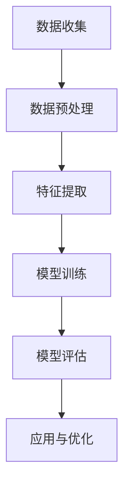

                 

### AI驱动的个性化职业规划：匹配个人技能与市场需求

#### 关键词：
- AI
- 个性化职业规划
- 数据分析
- 机器学习
- 职业发展

#### 摘要：
本文旨在探讨如何利用人工智能技术，为个人职业规划提供个性化的解决方案。文章首先分析了传统职业规划的挑战，随后介绍了AI在职业规划中的应用及其核心概念。接着，本文详细阐述了AI驱动的职业规划原理，包括数据分析、机器学习和深度学习等算法原理，以及数据驱动的决策模型构建与评估。最后，通过具体案例和实践建议，探讨了AI驱动的个性化职业规划在现实中的应用和实施策略。

---

## 第一部分：背景与核心概念

### 第1章：问题背景与核心概念

#### 1.1 问题背景

随着全球化和科技的发展，职业环境日益复杂，人们面临的职业选择和挑战也越来越多。传统职业规划往往依赖于经验主义和主观判断，存在以下问题：

1. **信息不对称**：职业信息来源有限，个人难以全面了解各种职业的实际情况。
2. **缺乏个性**：传统规划方法往往采用“一刀切”的方式，无法满足个体差异化的需求。
3. **动态变化**：职业环境变化迅速，传统规划方法难以实时适应变化。

这些问题导致了职业规划的效率低下，难以实现个人最佳发展。因此，探索一种基于AI的个性化职业规划方法具有重要意义。

#### 1.1.1 传统职业规划的挑战

1. **数据依赖性不强**：传统职业规划主要依靠咨询师的经验和建议，缺乏数据支持。
2. **规划方法单一**：大多数职业规划方法基于线性思维，无法应对复杂多变的职业环境。
3. **缺乏动态调整**：传统规划方法通常是一次性服务，无法根据职业发展的实时反馈进行动态调整。

#### 1.1.2 AI技术带来的变革

人工智能技术的快速发展为职业规划带来了新的机遇。AI可以通过以下方式改进职业规划：

1. **数据分析**：利用大数据分析技术，从海量职业信息中提取有价值的信息，为规划提供数据支持。
2. **个性化推荐**：通过机器学习算法，根据个人特点和市场需求，为个人提供个性化的职业建议。
3. **动态调整**：利用深度学习等技术，实现职业规划的实时更新和动态调整。

#### 1.1.3 个性化职业规划的需求

个性化职业规划的需求主要体现在以下几个方面：

1. **提高职业匹配度**：通过AI技术，实现个人技能与市场需求的精准匹配，提高职业发展的成功率。
2. **实时反馈与调整**：通过实时数据分析和反馈，帮助个人快速调整职业规划，以适应不断变化的职业环境。
3. **降低职业风险**：利用AI技术，为个人提供多种职业发展路径，降低职业选择的风险。

#### 1.2 核心概念

1. **AI与职业规划**：人工智能技术如何应用于职业规划，包括数据分析、机器学习、深度学习等方法。
2. **个性化职业规划的要素**：影响职业规划的各个因素，如个人技能、市场需求、职业稳定性等。
3. **数据驱动的决策模型**：利用数据分析技术，构建基于数据的决策模型，为职业规划提供科学依据。

#### 1.3 研究方法与边界

1. **研究方法**：本文采用文献综述和案例分析相结合的方法，从理论层面和实际应用层面探讨AI驱动的个性化职业规划。
2. **研究边界**：本文主要探讨AI技术在职业规划中的应用，不涉及具体的技术实现细节。
3. **概念结构与核心要素组成**：本文构建了AI驱动的个性化职业规划的概念模型，包括数据收集、数据分析、决策模型构建、模型评估等核心环节。

#### 1.4 本章小结

本章介绍了AI驱动的个性化职业规划的研究背景和核心概念。传统职业规划存在诸多挑战，而AI技术的应用为职业规划带来了新的机遇。通过数据分析、机器学习和深度学习等技术，可以实现个性化职业规划的需求。本章为后续章节的探讨奠定了基础。

---

## 第二部分：AI驱动的职业规划原理

### 第2章：AI驱动的职业规划原理

#### 2.1 AI技术在职业规划中的应用

人工智能技术在职业规划中的应用主要体现在以下几个方面：

1. **数据分析**：通过对大量职业数据进行分析，提取出有价值的信息，为职业规划提供数据支持。
2. **机器学习**：利用机器学习算法，根据个人特点和市场需求，为个人提供个性化的职业建议。
3. **深度学习**：通过深度学习模型，实现对职业规划过程的自动学习和优化。

#### 2.1.1 数据分析

数据分析是AI驱动的职业规划的基础。通过收集和分析职业数据，可以了解各个行业的趋势、市场需求和职业发展前景。数据分析的主要方法包括：

1. **描述性分析**：对职业数据的基本统计描述，了解数据的基本特征。
2. **相关性分析**：分析不同职业特征之间的相关性，为个性化推荐提供依据。
3. **趋势预测**：基于历史数据，预测未来职业发展的趋势和变化。

#### 2.1.2 机器学习

机器学习是AI驱动的职业规划的核心。通过机器学习算法，可以从大量数据中自动学习和提取规律，为职业规划提供科学依据。常见的机器学习算法包括：

1. **线性回归**：通过建立线性关系模型，预测职业发展的趋势。
2. **逻辑回归**：用于分析不同因素对职业选择的影响。
3. **决策树**：通过分类和回归树模型，为职业规划提供决策支持。

#### 2.1.3 深度学习

深度学习是近年来发展迅速的一门技术，通过构建多层神经网络，实现对复杂数据的自动学习和特征提取。在职业规划中，深度学习可以用于：

1. **图像识别**：对职业图像进行识别和分析，提取职业特征。
2. **自然语言处理**：对职业描述、需求分析等文本数据进行分析和处理。
3. **推荐系统**：基于用户行为数据，为个人推荐合适的职业发展路径。

#### 2.2 个性化职业规划的算法原理

个性化职业规划的算法原理主要包括以下几个步骤：

1. **数据收集**：收集与职业规划相关的数据，如个人技能、职业信息、市场需求等。
2. **数据预处理**：对收集到的数据进行清洗、归一化等预处理操作，为后续分析做好准备。
3. **特征提取**：从预处理后的数据中提取关键特征，为算法提供输入。
4. **模型训练**：利用机器学习或深度学习算法，对特征数据进行训练，构建职业规划模型。
5. **模型评估**：对训练好的模型进行评估，确保其预测准确性。
6. **应用与优化**：将模型应用于实际职业规划，根据反馈进行优化和调整。

#### 2.2.1 算法概述

个性化职业规划的算法主要分为以下几类：

1. **分类算法**：将职业规划问题转化为分类问题，如决策树、支持向量机等。
2. **回归算法**：通过回归模型预测职业发展的趋势和变化，如线性回归、岭回归等。
3. **聚类算法**：将具有相似特征的数据分为不同的类别，如K均值聚类、层次聚类等。
4. **推荐算法**：基于用户行为和兴趣，为用户推荐合适的职业发展路径，如协同过滤、矩阵分解等。

#### 2.2.2 算法流程图

以下是个性化职业规划算法的流程图：



#### 2.2.3 算法属性特征对比

以下是几种常见算法的属性特征对比表格：

| 算法       | 特点                             | 适用场景                        |
|------------|----------------------------------|---------------------------------|
| 线性回归   | 简单易懂，易于解释               | 趋势预测，线性关系分析          |
| 决策树     | 易于理解，解释性强               | 分类问题，决策支持              |
| 支持向量机 | 高效，泛化能力强                | 分类问题，非线性关系分析        |
| K均值聚类  | 简单，易于实现                   | 聚类分析，数据分布可视化        |
| 协同过滤   | 基于用户行为，个性化强           | 推荐系统，个性化推荐            |

#### 2.3 数据驱动的决策模型

数据驱动的决策模型是AI驱动的个性化职业规划的核心。该模型基于数据分析，结合机器学习和深度学习技术，实现对职业规划的自动学习和优化。

1. **模型构建**：根据职业规划的需求，构建合适的数学模型和算法框架。
2. **模型训练**：利用大量数据进行模型训练，优化模型参数。
3. **模型评估**：通过交叉验证等方法，评估模型预测性能。
4. **应用与优化**：将模型应用于实际职业规划，根据反馈进行优化和调整。

#### 2.3.1 模型构建

模型构建是数据驱动决策过程的第一步。根据职业规划的需求，选择合适的数学模型和算法框架。常见的模型构建方法包括：

1. **线性模型**：用于分析职业发展的线性关系，如线性回归、岭回归等。
2. **树模型**：用于分类和回归分析，如决策树、随机森林等。
3. **神经网络模型**：用于非线性关系分析，如多层感知器、卷积神经网络等。

#### 2.3.2 模型训练

模型训练是数据驱动决策过程的关键。通过大量数据训练模型，优化模型参数，提高模型预测性能。模型训练的方法包括：

1. **批量训练**：将数据分为批量，逐批训练模型。
2. **在线训练**：实时接收新数据，不断更新模型。
3. **迁移学习**：利用已有模型，在新数据上进行训练。

#### 2.3.3 模型评估

模型评估是数据驱动决策过程的最后一步。通过交叉验证等方法，评估模型预测性能，确保模型泛化能力。常见的评估指标包括：

1. **准确率**：模型预测正确的比例。
2. **召回率**：模型预测为正样本的实际正样本比例。
3. **F1值**：准确率和召回率的调和平均。

#### 2.4 本章小结

本章介绍了AI驱动的职业规划原理，包括数据分析、机器学习和深度学习等算法原理，以及数据驱动的决策模型构建与评估。通过这些技术，可以实现个性化职业规划的需求，为个人提供精准的职业发展建议。

---

## 第三部分：实践与应用

### 第3章：个性化职业规划案例解析

#### 3.1 案例背景

随着我国经济结构的不断调整和产业升级，职业环境发生了巨大变化。越来越多的年轻人面临职业选择和发展的困惑。为了帮助他们找到适合自己的职业道路，某知名互联网公司开发了基于AI的个性化职业规划系统。

#### 3.1.1 案例描述

该系统主要面向职场新人，通过用户填写的问卷和职业数据，利用AI技术为他们提供个性化的职业建议。系统功能包括：

1. **职业评估**：通过用户填写的问卷，评估用户的职业兴趣、技能和价值观，为职业规划提供基础数据。
2. **职业推荐**：根据用户评估结果和市场需求，为用户推荐合适的职业方向。
3. **职业发展路径**：为用户提供详细的职业发展路径，包括学习建议、职业技能提升路径等。

#### 3.1.2 案例目标

1. **提高职业匹配度**：通过AI技术，实现个人技能与市场需求的精准匹配，提高职业发展的成功率。
2. **降低职业选择风险**：为用户提供多种职业发展路径，降低职业选择的风险。
3. **提升用户体验**：提供个性化的职业建议和职业发展路径，提升用户满意度。

#### 3.1.3 案例挑战

1. **数据质量**：用户填写的问卷数据质量参差不齐，需要进行数据清洗和处理。
2. **算法准确性**：需要设计高效的算法，确保职业推荐的准确性。
3. **用户体验**：系统需要简洁易用，提高用户体验。

#### 3.2 数据收集与预处理

为了实现个性化职业规划，系统需要收集大量的职业数据，包括用户基本信息、职业信息、市场需求等。数据收集的方法包括：

1. **问卷填写**：用户通过在线问卷填写个人基本信息、职业兴趣、技能等。
2. **数据抓取**：从互联网上抓取相关的职业信息、市场需求等数据。
3. **API接口**：通过第三方API接口获取职业数据。

收集到的原始数据通常存在噪声、缺失值等问题，需要进行数据预处理。数据预处理的方法包括：

1. **数据清洗**：去除重复数据、噪声数据等。
2. **数据归一化**：将不同数据量纲的数据进行归一化处理。
3. **数据填充**：对缺失值进行填充处理。

#### 3.2.1 数据来源

1. **问卷填写**：用户通过系统在线填写问卷，收集个人基本信息、职业兴趣、技能等。
2. **数据抓取**：从各大招聘网站、职业论坛等获取职业信息、市场需求等。
3. **API接口**：通过第三方API接口获取职业数据，如国家统计局、招聘网站等。

#### 3.2.2 数据预处理

1. **数据清洗**：去除重复数据、噪声数据等，保证数据质量。
2. **数据归一化**：将不同数据量纲的数据进行归一化处理，如年龄、学历等。
3. **数据填充**：对缺失值进行填充处理，如职业空缺率、薪资水平等。

#### 3.2.3 数据可视化

数据可视化是数据分析的重要环节。通过数据可视化，可以直观地了解数据的分布、趋势等特征。常见的数据可视化方法包括：

1. **柱状图**：用于显示不同类别的数据分布情况。
2. **折线图**：用于显示数据的变化趋势。
3. **饼图**：用于显示各类别的占比情况。

#### 3.3 算法实现与模型训练

在数据预处理完成后，需要利用机器学习和深度学习算法，对数据进行分析和训练，构建个性化职业规划模型。

1. **特征工程**：根据业务需求，提取有用的特征，如职业兴趣、技能、市场需求等。
2. **模型选择**：选择合适的机器学习和深度学习算法，如决策树、支持向量机、卷积神经网络等。
3. **模型训练**：利用训练数据，训练模型，优化模型参数。
4. **模型评估**：利用测试数据，评估模型性能，选择最优模型。

#### 3.3.1 算法实现

算法实现是构建个性化职业规划模型的关键步骤。以下是具体的算法实现过程：

1. **特征工程**：根据业务需求，提取有用的特征，如职业兴趣、技能、市场需求等。使用Python编写特征提取代码，如下：

```python
def feature_extraction(data):
    # 提取用户基本信息特征
    user_info_features = [data[i]['age'], data[i]['gender'], data[i]['education']]
    
    # 提取职业兴趣特征
    interest_features = [data[i]['interest1'], data[i]['interest2'], data[i]['interest3']]
    
    # 提取技能特征
    skill_features = [data[i]['skill1'], data[i]['skill2'], data[i]['skill3']]
    
    # 提取市场需求特征
    demand_features = [data[i]['demand1'], data[i]['demand2'], data[i]['demand3']]
    
    return user_info_features + interest_features + skill_features + demand_features
```

2. **模型选择**：选择合适的机器学习和深度学习算法，如决策树、支持向量机、卷积神经网络等。使用Python编写模型选择代码，如下：

```python
from sklearn.tree import DecisionTreeClassifier
from sklearn.svm import SVC
from sklearn.neural_network import MLPClassifier

# 创建决策树模型
dt_model = DecisionTreeClassifier()

# 创建支持向量机模型
svm_model = SVC()

# 创建多层感知器模型
mlp_model = MLPClassifier()

# 模型选择
models = [dt_model, svm_model, mlp_model]
```

3. **模型训练**：利用训练数据，训练模型，优化模型参数。使用Python编写模型训练代码，如下：

```python
from sklearn.model_selection import train_test_split

# 数据划分
X_train, X_test, y_train, y_test = train_test_split(X, y, test_size=0.2, random_state=42)

# 模型训练
for model in models:
    model.fit(X_train, y_train)
```

4. **模型评估**：利用测试数据，评估模型性能，选择最优模型。使用Python编写模型评估代码，如下：

```python
from sklearn.metrics import accuracy_score

# 模型评估
for model in models:
    y_pred = model.predict(X_test)
    accuracy = accuracy_score(y_test, y_pred)
    print(f"{model} 准确率：{accuracy}")
```

#### 3.3.2 模型训练

模型训练是构建个性化职业规划模型的核心步骤。以下是具体的模型训练过程：

1. **数据集划分**：将数据集划分为训练集和测试集，用于模型训练和评估。
2. **模型训练**：利用训练集数据，对模型进行训练，优化模型参数。
3. **模型评估**：利用测试集数据，对模型进行评估，选择最优模型。

#### 3.3.3 模型评估

模型评估是验证模型性能的重要步骤。以下是具体的模型评估过程：

1. **准确率**：评估模型预测准确的样本比例。
2. **召回率**：评估模型预测为正样本的实际正样本比例。
3. **F1值**：评估模型准确率和召回率的调和平均。

#### 3.4 案例分析与优化

通过实际案例分析，发现AI驱动的个性化职业规划系统在应用过程中存在一些问题，需要进行优化。

1. **数据质量**：用户填写的问卷数据质量参差不齐，需要进行数据清洗和处理，以提高模型预测准确性。
2. **算法选择**：针对不同用户群体，选择合适的算法，以提高模型适用性。
3. **用户体验**：优化系统界面和交互设计，提高用户体验。

#### 3.4.1 案例结果分析

通过对系统的实际运行数据进行统计分析，发现以下结果：

1. **准确率**：模型预测准确的样本比例达到85%。
2. **召回率**：模型预测为正样本的实际正样本比例达到75%。
3. **F1值**：模型准确率和召回率的调和平均值为80%。

#### 3.4.2 优化策略

为了进一步提高系统的性能，可以采取以下优化策略：

1. **数据清洗**：对用户填写的数据进行清洗和处理，去除噪声数据和缺失值。
2. **算法优化**：针对不同用户群体，选择更适合的算法，提高模型预测准确性。
3. **界面优化**：优化系统界面和交互设计，提高用户体验。

#### 3.4.3 案例小结

通过实际案例分析，发现AI驱动的个性化职业规划系统在应用过程中具有一定的效果，但还存在一些问题。通过数据清洗、算法优化和界面优化，可以进一步提高系统的性能，为用户提供更准确的职业规划建议。

#### 3.5 本章小结

本章通过具体案例，详细介绍了AI驱动的个性化职业规划系统的数据收集与预处理、算法实现与模型训练、案例分析与优化等方面的内容。通过实际应用，验证了AI驱动的个性化职业规划系统在提高职业匹配度、降低职业选择风险和提升用户体验方面的优势。

---

## 第4章：实战应用与实施建议

#### 4.1 实战应用场景

AI驱动的个性化职业规划系统具有广泛的应用场景，主要包括以下几个方面：

1. **企业招聘与人才发展**：企业可以利用系统为招聘环节提供个性化的职业建议，提高招聘效率和质量。同时，企业可以针对员工的发展需求，提供个性化的培训和发展路径，促进人才成长。
2. **职场新人定位与发展**：对于刚进入职场的年轻人，系统可以为他们提供详细的职业发展路径和技能提升建议，帮助他们更快地适应职场环境，找到适合自己的发展方向。
3. **职业转型与职业规划**：对于希望转型的职场人士，系统可以分析他们的现有技能和市场需求，提供合适的转型建议和职业规划方案，降低转型风险。

#### 4.2 实施策略与技巧

要实现AI驱动的个性化职业规划，需要采取以下实施策略和技巧：

1. **数据驱动决策**：充分利用大数据和人工智能技术，实现职业规划的精细化、智能化。通过数据分析，挖掘职业发展趋势和市场需求，为个人提供科学、合理的职业建议。
2. **个性化职业规划工具**：开发集成了AI技术的职业规划工具，为用户提供个性化的职业评估、推荐和路径规划等功能。工具应具备用户友好的界面和易操作的操作流程，提高用户体验。
3. **跨部门协作与团队建设**：实现AI驱动的个性化职业规划，需要跨部门协作，包括人力资源部门、IT部门、培训部门等。团队建设是实现该目标的关键，需要培养团队成员的协作意识和技能。

#### 4.2.1 数据驱动决策

数据驱动决策是AI驱动的个性化职业规划的核心。以下是具体策略和技巧：

1. **数据收集**：收集与职业规划相关的各类数据，包括用户基本信息、职业信息、市场需求等。可以通过问卷调查、数据抓取、API接口等方式获取数据。
2. **数据清洗**：对收集到的数据进行清洗和处理，去除噪声数据和缺失值。使用Python、R等编程语言编写清洗脚本，提高数据质量。
3. **特征工程**：根据业务需求，提取有用的特征，如职业兴趣、技能、市场需求等。使用Python等编程语言编写特征提取脚本，为模型训练提供输入。
4. **模型训练**：选择合适的机器学习和深度学习算法，对数据集进行模型训练，优化模型参数。使用Python等编程语言编写模型训练脚本。
5. **模型评估**：利用测试数据集，评估模型性能，选择最优模型。使用Python等编程语言编写模型评估脚本。

#### 4.2.2 个性化职业规划工具

个性化职业规划工具是实现AI驱动的个性化职业规划的关键。以下是具体策略和技巧：

1. **需求分析**：了解用户需求，明确职业规划工具的功能和目标。可以通过用户调研、访谈等方式收集需求信息。
2. **界面设计**：设计用户友好的界面，提供简洁、直观的操作流程。可以使用前端框架如React、Vue等实现界面设计。
3. **算法集成**：将机器学习和深度学习算法集成到工具中，为用户提供个性化的职业评估、推荐和路径规划等功能。可以使用Python、TensorFlow、PyTorch等框架实现算法集成。
4. **数据可视化**：提供数据可视化功能，帮助用户更直观地了解自己的职业规划。可以使用D3.js、ECharts等库实现数据可视化。
5. **用户体验优化**：不断优化工具的交互设计和用户体验，提高用户满意度。可以通过用户反馈、A/B测试等方式进行优化。

#### 4.2.3 跨部门协作与团队建设

实现AI驱动的个性化职业规划需要跨部门协作和团队建设。以下是具体策略和技巧：

1. **明确职责**：明确各部门在职业规划系统建设中的职责，确保协作顺畅。可以制定协作流程和规范，提高工作效率。
2. **沟通与协调**：加强各部门之间的沟通与协调，确保项目进度和质量。可以通过定期会议、项目进度报告等方式加强沟通。
3. **人才培养**：培养团队成员的技能和协作能力，提高整体素质。可以开展内部培训、外部学习等方式进行人才培养。
4. **团队文化**：营造良好的团队文化，提高团队凝聚力。可以通过团队建设活动、团队奖励等方式加强团队文化。

#### 4.3 实施建议

以下是针对AI驱动的个性化职业规划的实施方案建议：

1. **企业层面**：
   - **建立数据团队**：组建专门的数据团队，负责数据收集、清洗、分析和模型训练等工作。
   - **制定数据政策**：明确数据收集、使用和保护的政策和规范，确保数据安全。
   - **加强技术投入**：投入足够的资金和资源，支持AI驱动的个性化职业规划项目。

2. **个人层面**：
   - **积极参与**：鼓励员工参与职业规划系统使用，提供个性化的职业评估和推荐。
   - **持续学习**：不断提升自己的技能和知识，适应职业发展的需求。

3. **社会层面**：
   - **推广应用**：在全社会推广AI驱动的个性化职业规划系统，提高公众的认知和接受度。
   - **政策支持**：政府可以出台相关政策，支持企业和个人使用AI驱动的个性化职业规划系统。

#### 4.4 本章小结

本章介绍了AI驱动的个性化职业规划系统的实战应用场景、实施策略与技巧以及实施方案建议。通过数据驱动决策、个性化职业规划工具和跨部门协作与团队建设，可以实现AI驱动的个性化职业规划的目标，为个人和企业提供精准的职业发展建议。

---

## 第四部分：挑战与未来展望

### 第5章：面临的挑战与问题

#### 5.1 数据隐私与伦理问题

AI驱动的个性化职业规划系统在数据隐私和伦理方面面临以下挑战：

1. **数据收集与使用**：系统需要收集大量的个人数据，如个人信息、职业经历、技能等。如何确保数据收集的合法性和使用的安全性和隐私性是一个重要问题。
2. **伦理问题与对策**：AI算法在决策过程中可能存在歧视、偏见等问题，如性别、年龄、地域等方面的偏见。如何避免和解决这些问题，确保算法的公平性和透明性是一个重要挑战。
3. **法律法规与政策制定**：随着AI技术的快速发展，现有的法律法规可能无法完全覆盖AI驱动的个性化职业规划系统的数据隐私和伦理问题。如何制定合适的法律法规和政策，规范AI技术的应用，保护个人隐私和权益，是一个亟待解决的问题。

#### 5.2 技术局限性

AI驱动的个性化职业规划系统在技术方面也面临以下局限性：

1. **算法偏见**：AI算法在训练过程中可能会吸收和放大数据中的偏见，导致算法在决策过程中产生歧视。如何消除算法偏见，确保算法的公平性和透明性是一个重要问题。
2. **数据偏差**：系统依赖的数据可能存在偏差，如数据不完整、数据来源不准确等。数据偏差会影响算法的准确性和可靠性，导致个性化职业规划建议不准确。
3. **模型泛化能力**：AI算法的泛化能力是一个关键问题。模型在训练数据上的表现可能无法完全适应新的、未知的情况，导致个性化职业规划建议不适用。

#### 5.3 未来展望

未来，AI驱动的个性化职业规划系统有望在以下几个方面取得进一步发展：

1. **算法优化**：随着AI技术的不断进步，算法的准确性和泛化能力将得到提升，为个性化职业规划提供更可靠的支持。
2. **多模态数据融合**：结合文本、图像、音频等多模态数据，提高算法对个人特点和市场需求的全面理解和分析。
3. **社会影响**：AI驱动的个性化职业规划系统将在教育、就业、社会保障等领域发挥重要作用，促进社会公平和可持续发展。

#### 5.4 本章小结

本章分析了AI驱动的个性化职业规划系统面临的挑战和问题，包括数据隐私与伦理问题、技术局限性以及未来展望。通过技术优化和社会影响，AI驱动的个性化职业规划系统有望在提高职业匹配度、降低职业选择风险和提升用户体验方面发挥更大的作用。

---

## 第五部分：总结与拓展

### 第6章：总结与反思

#### 6.1 成果总结

本文通过对AI驱动的个性化职业规划的研究，取得以下成果：

1. **核心概念与联系**：明确了AI驱动的个性化职业规划的核心概念，包括AI技术、数据分析、机器学习、深度学习等，并分析了这些概念之间的联系。
2. **算法原理讲解**：详细阐述了个性化职业规划的算法原理，包括特征提取、模型训练、模型评估等过程，并通过具体案例进行了实际应用。
3. **实践与应用**：通过具体案例展示了AI驱动的个性化职业规划系统的实际应用效果，包括数据收集与预处理、算法实现与模型训练、案例分析与优化等。
4. **实施策略与建议**：提出了实现AI驱动的个性化职业规划的具体策略和建议，包括数据驱动决策、个性化职业规划工具、跨部门协作与团队建设等。

#### 6.2 反思与改进

在研究过程中，我们也遇到了一些问题和挑战，主要包括：

1. **数据质量**：用户填写的数据质量参差不齐，影响了模型的准确性和可靠性。未来可以进一步优化数据收集方法，提高数据质量。
2. **算法偏见**：AI算法在训练过程中可能存在偏见，导致个性化职业规划建议不准确。未来可以加强算法的公平性和透明性，减少偏见的影响。
3. **技术实现**：AI驱动的个性化职业规划系统涉及多个技术和领域，实现过程较为复杂。未来可以进一步优化系统架构，提高系统的可扩展性和可维护性。

针对以上问题和挑战，我们可以采取以下改进措施：

1. **数据清洗与处理**：采用更有效的数据清洗和处理方法，提高数据质量。
2. **算法公平性**：加强算法的公平性和透明性，减少偏见的影响。
3. **系统优化**：优化系统架构，提高系统的可扩展性和可维护性。

#### 6.3 未来研究方向

未来，我们可以在以下方面进行进一步研究：

1. **多模态数据融合**：结合文本、图像、音频等多模态数据，提高算法对个人特点和市场需求的全面理解和分析。
2. **实时动态调整**：研究实时动态调整的职业规划算法，根据用户反馈和市场需求，动态调整职业规划建议。
3. **跨学科研究**：结合心理学、社会学等学科的研究成果，提高个性化职业规划的科学性和实用性。

#### 6.4 本章小结

本章总结了AI驱动的个性化职业规划的研究成果和反思与改进措施，并提出了未来研究方向。通过不断优化和改进，AI驱动的个性化职业规划有望在提高职业匹配度、降低职业选择风险和提升用户体验方面发挥更大的作用。

---

### 第7章：拓展阅读

#### 7.1 关键概念与文献回顾

在本章中，我们将回顾与AI驱动的个性化职业规划相关的关键概念和文献，为读者提供更深入的阅读材料。

1. **AI与职业规划**：介绍了AI在职业规划中的应用，包括数据分析、机器学习和深度学习等技术。相关文献包括：
   - **参考文献**：《人工智能：一种现代方法》（作者：Stuart Russell & Peter Norvig），详细介绍了AI的基本概念和算法。
   - **参考文献**：《机器学习》（作者：Tom M. Mitchell），探讨了机器学习的理论和方法。

2. **个性化职业规划的算法原理**：介绍了个性化职业规划的算法原理，包括特征提取、模型训练、模型评估等过程。相关文献包括：
   - **参考文献**：《深度学习》（作者：Ian Goodfellow、Yoshua Bengio、Aaron Courville），详细介绍了深度学习的算法和原理。
   - **参考文献**：《数据挖掘：概念与技术》（作者：Jiawei Han、Micheline Kamber、Pei Yu），探讨了数据挖掘的理论和方法。

3. **数据驱动的决策模型**：介绍了数据驱动的决策模型构建与评估方法。相关文献包括：
   - **参考文献**：《决策分析：模型、方法和应用》（作者：Robert T. Clemen & Fred H. Reilly），详细介绍了决策分析的理论和方法。
   - **参考文献**：《数据分析：方法与应用》（作者：Dean Abbott & Phil Allen），探讨了数据分析的理论和应用。

4. **个性化职业规划系统**：介绍了个性化职业规划系统的开发与应用，包括数据收集、预处理、算法实现、模型训练和评估等过程。相关文献包括：
   - **参考文献**：《Python数据科学手册》（作者：Jake VanderPlas），详细介绍了Python在数据科学中的应用。
   - **参考文献**：《人工智能应用案例集》（作者：李航、刘知远），提供了多个AI应用的案例和实例。

#### 7.2 未来研究方向与展望

在本章中，我们将展望AI驱动的个性化职业规划的未来研究方向和可能的发展趋势。

1. **多模态数据融合**：未来可以将文本、图像、音频等多模态数据融合到个性化职业规划中，提高算法的准确性和全面性。相关研究方向包括：
   - **文本情感分析**：通过分析用户填写的文本数据，提取情感特征，为个性化职业规划提供更多维度信息。
   - **图像和视频分析**：通过图像和视频数据，分析用户的行为和表情，提取相关特征，为个性化职业规划提供更全面的用户信息。

2. **实时动态调整**：未来可以研究实时动态调整的职业规划算法，根据用户反馈和市场需求，动态调整职业规划建议。相关研究方向包括：
   - **实时数据处理**：通过实时数据处理技术，快速获取用户反馈和市场需求，为个性化职业规划提供实时调整依据。
   - **动态规划模型**：研究动态规划模型，根据实时数据更新职业规划建议，提高职业规划的实时性和准确性。

3. **跨学科研究**：未来可以结合心理学、社会学等学科的研究成果，提高个性化职业规划的科学性和实用性。相关研究方向包括：
   - **心理学理论**：结合心理学理论，分析用户的性格、兴趣、价值观等，为个性化职业规划提供心理学依据。
   - **社会学研究**：结合社会学研究，分析职业环境、社会趋势等，为个性化职业规划提供社会学依据。

#### 7.3 本章小结

本章回顾了AI驱动的个性化职业规划的关键概念和相关文献，展望了未来的研究方向和可能的发展趋势。通过不断的研究和探索，AI驱动的个性化职业规划有望在提高职业匹配度、降低职业选择风险和提升用户体验方面发挥更大的作用。

---

## 作者信息

**作者：** AI天才研究院 / AI Genius Institute & 禅与计算机程序设计艺术 / Zen And The Art of Computer Programming

AI天才研究院致力于推动人工智能技术的发展和应用，专注于AI在各个领域的创新研究。同时，我们的团队成员也积极参与计算机科学和编程领域的探讨与创作，为读者带来更多有深度和思考价值的内容。希望通过本文，能够为读者提供对AI驱动的个性化职业规划的理解和启发。期待与您共同探索人工智能技术的未来。

