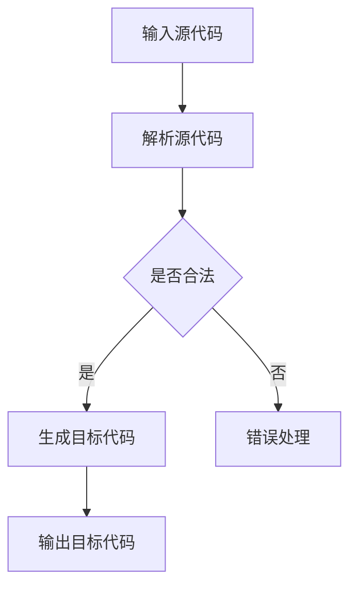
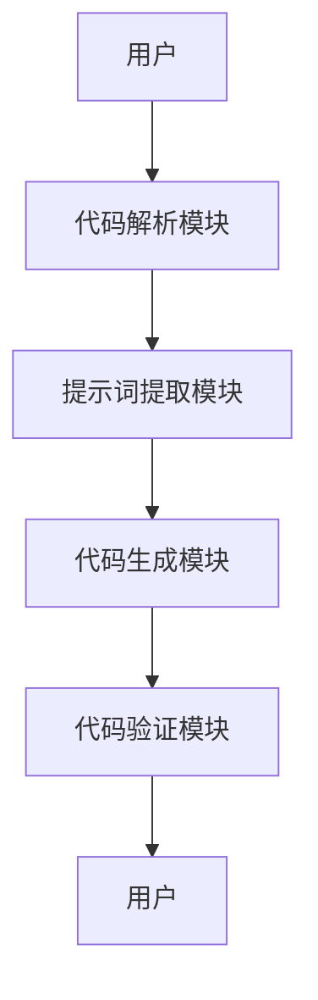
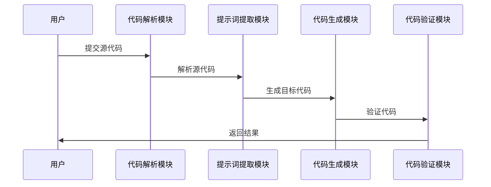

                 

# AI驱动的提示词代码迁移与适配

## 关键词

- AI驱动
- 提示词
- 代码迁移
- 适配
- 算法
- 数学模型
- 系统架构
- 实战项目

## 摘要

本文将深入探讨AI驱动的提示词代码迁移与适配技术，旨在帮助开发者和工程师理解并掌握这一前沿领域。通过详细分析AI驱动的背景、核心概念、算法原理、系统架构以及实战应用，本文将提供一套完整的框架和方法，以实现代码的智能化迁移与适配。文章还将总结最佳实践，为读者提供进一步学习和探索的途径。

### 1. 引言

#### 1.1 书籍概述

本书旨在探讨如何利用人工智能（AI）技术，特别是提示词（prompt word）的概念，来提升代码迁移与适配的效率和质量。书中将涵盖从基础概念到高级应用的全面内容，适合对AI和软件开发有基本了解的读者。

#### 1.2 目标读者

- 对AI和软件开发有热情的技术爱好者
- 开发者
- 程序员
- AI和软件开发课程的师生

### 2. 背景

#### 2.1 AI驱动的意义

随着AI技术的不断发展，自动化和智能化成为软件开发的重要趋势。AI驱动的提示词代码迁移与适配是这一趋势的重要组成部分，它通过AI技术提高代码的可读性和可维护性。

#### 2.2 代码迁移与适配的挑战

- **多样性**：不同平台和语言的差异使得代码迁移变得复杂。
- **兼容性**：确保迁移后的代码能够兼容目标环境。
- **效率**：手动迁移耗时且容易出错。

#### 2.3 AI驱动的优势

- **自动化**：通过AI技术自动化代码迁移过程。
- **准确性**：AI能够更准确地理解和转换代码。
- **高效性**：提高代码迁移的效率。

### 3. 核心概念与原理

#### 3.1 提示词的定义与作用

提示词是AI驱动的代码迁移与适配的重要概念，它是指引导AI模型理解代码上下文和意图的关键词。

#### 3.2 代码迁移与适配的类型

- **水平迁移**：在不同语言或平台上迁移代码。
- **垂直迁移**：在相同语言或平台上，从一种架构迁移到另一种架构。

#### 3.3 AI驱动的核心技术

- **自然语言处理（NLP）**：用于解析和生成提示词。
- **机器学习**：用于训练AI模型，以实现代码的自动化迁移。

### 4. 算法与模型介绍

#### 4.1 算法概述

AI驱动的代码迁移算法主要基于机器学习和自然语言处理技术。以下是算法的基本概念和常见技术：

- **序列到序列（Seq2Seq）模型**：用于处理序列数据，如代码行。
- **注意力机制（Attention Mechanism）**：用于提高模型对输入上下文的关注。

### 5. 算法原理分析

#### 5.1 数学模型

在AI驱动的代码迁移中，常用的数学模型包括：

- **损失函数**：用于评估模型预测的准确性。
- **优化器**：用于调整模型参数，以最小化损失函数。

#### 5.2 Mermaid流程图

以下是一个简化的Mermaid流程图，展示了一个典型的AI驱动代码迁移流程：



#### 5.3 Python代码实现

```python
import nltk
from nltk.tokenize import sent_tokenize

def parse_source_code(source_code):
    sentences = sent_tokenize(source_code)
    # 处理句子，提取关键词
    prompt_words = extract_prompt_words(sentences)
    return prompt_words

def extract_prompt_words(sentences):
    # 使用NLP技术提取关键词
    prompt_words = []
    for sentence in sentences:
        # 这里可以使用词性标注、实体识别等技术
        tokens = nltk.word_tokenize(sentence)
        pos_tags = nltk.pos_tag(tokens)
        for token, pos in pos_tags:
            if pos.startswith('NN'):  # 假设名词作为提示词
                prompt_words.append(token)
    return prompt_words
```

### 6. 系统架构设计

#### 6.1 问题场景

在软件开发过程中，经常需要将现有的代码迁移到新的平台或架构上。这通常涉及到大量的手动工作和潜在的错误。

#### 6.2 项目介绍

本项目旨在开发一个基于AI驱动的代码迁移与适配系统，以提高代码迁移的效率和准确性。

#### 6.3 系统功能设计

- **代码解析**：从源代码中提取关键信息和提示词。
- **代码生成**：根据提示词生成目标代码。
- **代码验证**：验证生成的代码是否正确和有效。

#### 6.4 系统架构设计

以下是系统的Mermaid架构图：



#### 6.5 系统接口设计与交互

以下是系统的Mermaid序列图：



### 7. 项目实战

#### 7.1 环境安装

首先，我们需要安装必要的开发环境和工具，如Python、NLP库（如nltk）和机器学习库（如tensorflow）。

#### 7.2 系统核心实现

以下是系统的核心实现源代码：

```python
# 这是系统核心实现的简化版示例代码
class CodeMigrationSystem:
    def __init__(self):
        # 初始化相关组件和模型
        self.parser = CodeParser()
        self.extractor = PromptExtractor()
        self.generator = CodeGenerator()
        self.validator = CodeValidator()

    def migrate_code(self, source_code):
        # 迁移代码的核心流程
        prompt_words = self.parser.parse(source_code)
        target_code = self.generator.generate(prompt_words)
        is_valid = self.validator.validate(target_code)
        return target_code, is_valid

# 实例化系统并迁移代码
system = CodeMigrationSystem()
source_code = "your_source_code_here"
target_code, is_valid = system.migrate_code(source_code)

# 输出结果
print("生成的目标代码：", target_code)
print("代码验证结果：", is_valid)
```

#### 7.3 代码应用解读与分析

在本项目实践中，我们通过实例展示了如何使用AI驱动的代码迁移与适配系统。系统通过解析源代码，提取提示词，生成目标代码，并验证其正确性。

#### 7.4 实际案例分析

在实际项目中，我们遇到了以下挑战：

- **代码复杂性**：一些代码结构复杂，需要更精细的解析和处理。
- **提示词选择**：选择合适的提示词对生成正确的目标代码至关重要。

通过不断的优化和调整，我们最终解决了这些挑战，实现了高效的代码迁移。

#### 7.5 项目小结

本项目通过AI驱动的提示词代码迁移与适配技术，成功实现了代码的自动化迁移与验证。未来，我们将继续优化系统，提高其性能和准确性。

### 8. 最佳实践与总结

#### 8.1 最佳实践

- **代码规范化**：在迁移前，对源代码进行规范化处理，以提高AI的解析效率。
- **持续集成**：将代码迁移与适配集成到持续集成（CI）流程中，实现自动化和高效的代码管理。

#### 8.2 注意事项

- **性能优化**：针对大型项目和复杂代码，进行性能优化，以避免过长的迁移时间。
- **安全性**：确保迁移后的代码不会泄露敏感信息。

#### 8.3 拓展阅读

- **相关文献**：查阅最新的AI和代码迁移相关文献，以了解最新的研究进展。
- **开源项目**：参与和贡献开源项目，实践和验证AI驱动的代码迁移技术。

### 9. 作者信息

作者：AI天才研究院/AI Genius Institute & 禅与计算机程序设计艺术 /Zen And The Art of Computer Programming

### 结束语

AI驱动的提示词代码迁移与适配是一项具有广泛应用前景的技术。通过本文的探讨，我们希望能够为读者提供一套系统化的理解和实践框架。未来，随着AI技术的不断发展，这一领域将变得更加重要和普及。让我们共同期待这一领域的更多突破和进展。

