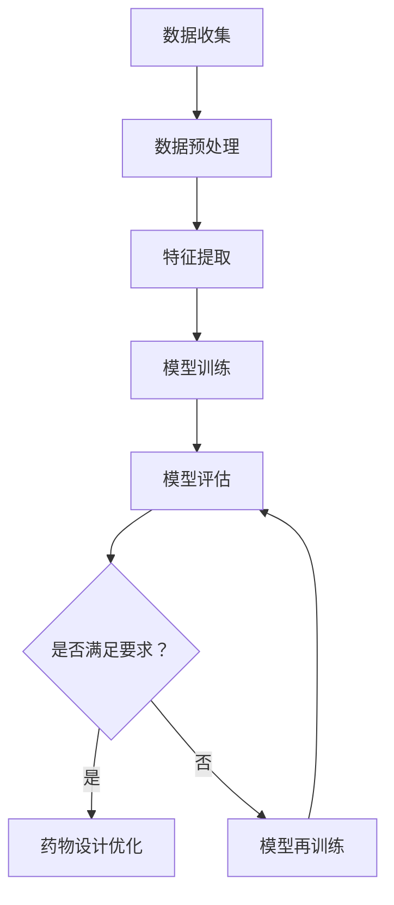
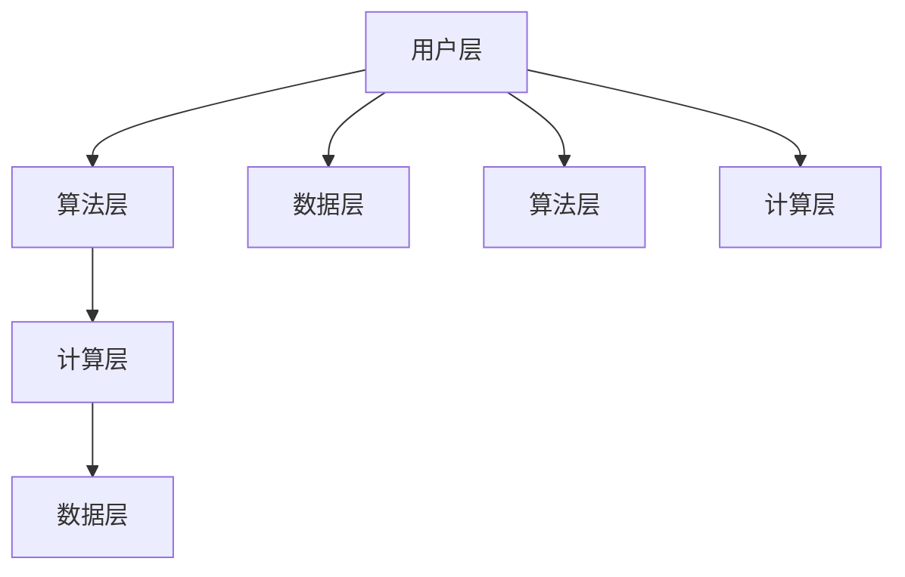
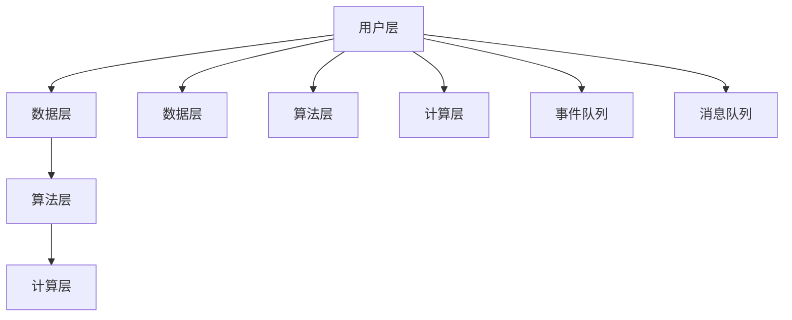

                 

### 文章标题

# AI驱动的新药研发：从靶点发现到临床试验

### 文章关键词

- AI
- 新药研发
- 靶点发现
- 临床试验
- 数学模型
- 算法
- 系统架构

### 文章摘要

本文将探讨如何利用人工智能（AI）技术驱动新药研发的过程，从靶点发现到临床试验的各个阶段。通过逻辑清晰的分析和结构紧凑的阐述，本文将帮助读者了解AI在药物研发中的具体应用，包括AI算法、数学模型和系统架构等方面。同时，通过项目实战和最佳实践分享，本文旨在为从事新药研发的科研人员和开发者提供有价值的参考。

## 目录大纲

### 第一部分：背景介绍

#### 第1章：AI驱动的新药研发概述

1.1 问题背景

1.2 问题描述

1.3 问题解决

1.4 边界与外延

1.5 概念结构与核心要素组成

### 第二部分：核心概念与联系

#### 第2章：AI与药物研发

2.1 AI的定义与特点

2.2 药物研发的基本流程

2.3 AI在药物研发中的应用

2.4 AI与药物研发的关联性

### 第三部分：算法原理讲解

#### 第3章：AI算法在药物研发中的应用

3.1 算法原理介绍

3.2 算法原理讲解

3.3 Mermaid算法流程图

3.4 Python源代码讲解

3.5 算法原理数学模型和公式讲解

3.6 举例说明

### 第四部分：数学模型和数学公式讲解

#### 第4章：数学模型在药物研发中的应用

4.1 数学模型的基本概念

4.2 数学模型在药物研发中的应用

4.3 LaTeX数学公式书写规范

4.4 举例说明

### 第五部分：系统分析与架构设计方案

#### 第5章：药物研发系统架构设计

5.1 问题场景介绍

5.2 项目介绍

5.3 系统功能设计

5.4 系统架构设计

5.5 系统接口设计

5.6 系统交互

### 第六部分：项目实战

#### 第6章：AI驱动的新药研发项目实战

6.1 环境安装

6.2 系统核心实现源代码

6.3 代码应用解读与分析

6.4 实际案例分析和详细讲解剖析

6.5 项目小结

### 第七部分：最佳实践、小结、注意事项、拓展阅读

#### 第7章：AI驱动的新药研发最佳实践

7.1 最佳实践

7.2 小结

7.3 注意事项

7.4 拓展阅读

----------------------------------------------------------------### 第一部分：背景介绍

#### 第1章：AI驱动的新药研发概述

##### 1.1 问题背景

新药研发是一个复杂且耗时漫长的过程，涉及众多科学领域和学科知识。传统的新药研发主要依赖于实验和临床试验，这一过程通常需要数年甚至数十年的时间。尽管近年来在生物技术、基因组学和药物设计等领域取得了显著的进展，但新药研发的效率和成功率仍然面临巨大的挑战。

传统新药研发面临的主要问题包括：

- **靶点选择困难**：确定合适的药物靶点是新药研发的关键步骤，但这个过程往往需要大量时间和资金投入。
- **药物筛选效率低**：传统药物筛选方法需要大量实验，导致筛选效率低下。
- **临床试验成本高**：临床试验环节成本高昂，且存在较高的失败风险。
- **个性化治疗方案缺失**：现有药物研发过程缺乏对个体差异的考虑，无法实现个性化治疗。

为了解决这些问题，AI技术的引入成为新药研发领域的一大突破。AI具有处理大规模数据、快速分析和预测的能力，可以帮助研究人员更准确地识别药物靶点、优化药物设计、提高药物筛选效率和降低临床试验成本。

##### 1.2 问题描述

新药研发过程中的核心问题主要包括：

- **靶点发现**：如何从大量的生物数据中识别出潜在的药物靶点？
- **药物设计**：如何根据靶点特性设计出具有高效和低毒性的药物？
- **药物筛选**：如何从大量候选药物中筛选出具有临床潜力的药物？
- **临床试验**：如何确保药物的安全性和有效性，并进行高效的临床试验？

##### 1.3 问题解决

AI技术在新药研发中的问题解决方法包括：

- **靶点发现**：利用机器学习和生物信息学技术，通过分析基因组、蛋白质组、代谢组等生物数据，识别出潜在的药物靶点。
- **药物设计**：使用分子对接、分子动力学模拟等方法，根据靶点特性设计出具有良好药效和低毒性的药物分子。
- **药物筛选**：利用深度学习和数据挖掘技术，从大量的化合物库中筛选出具有潜在药效的化合物。
- **临床试验**：利用AI技术对临床试验数据进行智能分析和预测，提高临床试验的效率和准确性。

##### 1.4 边界与外延

在新药研发过程中，AI技术的应用边界主要包括以下几个方面：

- **数据驱动**：AI技术依赖于大量的生物数据和药物信息，因此数据的获取、处理和存储是应用边界的关键。
- **算法优化**：随着新药研发需求的不断变化，AI算法需要持续优化和迭代，以满足不断发展的需求。
- **计算资源**：AI技术的应用需要强大的计算资源支持，特别是在处理大规模数据和进行深度学习训练时。

##### 1.5 概念结构与核心要素组成

AI驱动的新药研发涉及多个核心概念和要素，包括：

- **机器学习与深度学习**：利用算法模型对生物数据进行学习和预测。
- **生物信息学**：通过分析生物数据，识别出潜在的药物靶点。
- **计算生物学**：利用计算方法模拟和预测药物与靶点的相互作用。
- **药物化学**：设计出具有良好药效和低毒性的药物分子。
- **临床试验与临床转化**：验证药物的安全性和有效性，推动新药上市。

通过以上分析，可以看出AI技术在新药研发中的应用具有重要的意义和广阔的前景。接下来，本文将深入探讨AI在各个新药研发阶段的实际应用，以及相关的算法原理、数学模型和系统架构设计等内容。

---

### 第二部分：核心概念与联系

#### 第2章：AI与药物研发

##### 2.1 AI的定义与特点

人工智能（Artificial Intelligence，AI）是指模拟人类智能的计算机系统，能够通过学习、推理、规划、感知和自然语言处理等方式，实现对复杂问题的解决。AI的核心特点包括：

- **自主性**：AI系统能够自主地执行任务，不需要人类干预。
- **学习性**：AI系统可以通过大量的数据学习，优化自身的性能。
- **适应性**：AI系统能够根据环境和任务的变化，调整其行为和策略。
- **泛化能力**：AI系统能够将学习到的知识应用到新的任务和环境中。

##### 2.2 药物研发的基本流程

药物研发的基本流程通常包括以下几个阶段：

1. **靶点选择**：根据疾病机理，确定潜在的药物靶点。
2. **药物设计**：基于靶点特性，设计出具有良好药效和低毒性的药物分子。
3. **药物筛选**：从大量的化合物库中筛选出具有潜在药效的化合物。
4. **药理学研究**：评估候选药物在细胞和动物模型中的药效和安全性。
5. **临床试验**：验证药物的安全性和有效性，收集临床试验数据。
6. **上市审批**：通过监管机构的审批，获得药物上市许可。

##### 2.3 AI在药物研发中的应用

AI技术在药物研发的各个阶段都有广泛的应用，主要包括：

- **靶点发现**：通过机器学习和生物信息学技术，分析生物数据，识别潜在的药物靶点。
- **药物设计**：利用分子对接、分子动力学模拟等方法，优化药物分子的设计。
- **药物筛选**：通过深度学习和数据挖掘技术，从大量化合物中筛选出具有潜在药效的药物。
- **药理学研究**：利用AI技术分析临床试验数据，预测药物在人体内的药效和安全性。
- **临床试验优化**：通过智能数据分析，优化临床试验的设计和执行。

##### 2.4 AI与药物研发的关联性

AI与药物研发之间的关联性主要体现在以下几个方面：

- **数据驱动的决策**：AI技术能够处理和分析大量生物数据，为药物研发提供数据驱动的决策支持。
- **提高研发效率**：AI技术可以加速靶点发现、药物设计和药物筛选过程，提高新药研发的效率。
- **降低研发成本**：通过AI技术，可以减少实验次数和临床试验失败的风险，降低新药研发的成本。
- **个性化治疗**：AI技术可以帮助研究人员更好地理解个体差异，实现个性化治疗，提高治疗效果。

通过以上分析，可以看出AI技术在药物研发中的应用具有重要意义，它不仅能够提高新药研发的效率和成功率，还能为个性化治疗提供有力支持。接下来，本文将深入探讨AI在药物研发中具体的算法原理、数学模型和系统架构设计等内容。

---

### 第三部分：算法原理讲解

#### 第3章：AI算法在药物研发中的应用

##### 3.1 算法原理介绍

在药物研发过程中，AI算法的应用主要包括以下几种：

1. **机器学习**：通过分析大量的生物数据，识别出潜在的药物靶点，优化药物设计。
2. **深度学习**：利用神经网络模型，对药物与靶点的相互作用进行预测和模拟。
3. **数据挖掘**：从大量的化合物库中筛选出具有潜在药效的化合物。
4. **强化学习**：通过优化药物设计的策略，提高药物筛选的成功率。

##### 3.2 算法原理讲解

1. **机器学习**

   机器学习是一种利用算法自动从数据中学习模式和规律的技术。在药物研发中，机器学习算法通常用于以下方面：

   - **靶点发现**：通过分析基因组、蛋白质组等生物数据，识别潜在的药物靶点。
   - **药物设计**：利用分子对接和分子动力学模拟等方法，优化药物分子的设计。

2. **深度学习**

   深度学习是一种基于人工神经网络的机器学习方法，具有处理复杂数据和模式识别的能力。在药物研发中，深度学习算法可以用于以下方面：

   - **药物筛选**：通过训练深度学习模型，从大量的化合物库中筛选出具有潜在药效的化合物。
   - **药理学研究**：利用深度学习模型预测药物在人体内的药效和安全性。

3. **数据挖掘**

   数据挖掘是一种从大量数据中提取有价值信息和知识的技术。在药物研发中，数据挖掘算法可以用于以下方面：

   - **化合物筛选**：通过分析化合物结构与生物活性之间的关系，筛选出具有潜在药效的化合物。
   - **临床试验分析**：利用数据挖掘技术分析临床试验数据，优化临床试验的设计和执行。

4. **强化学习**

   强化学习是一种通过试错和反馈来学习最优策略的机器学习方法。在药物研发中，强化学习算法可以用于以下方面：

   - **药物设计优化**：通过优化药物设计的策略，提高药物筛选的成功率。
   - **临床试验策略**：通过强化学习算法优化临床试验的设计和执行，提高临床试验的成功率。

##### 3.3 Mermaid算法流程图

下面是一个简单的Mermaid算法流程图，展示了机器学习在药物研发中的应用：



##### 3.4 Python源代码讲解

以下是一个简单的Python代码示例，展示了如何使用机器学习算法进行药物设计优化：

```python
import pandas as pd
from sklearn.model_selection import train_test_split
from sklearn.ensemble import RandomForestClassifier

# 加载数据
data = pd.read_csv('drug_data.csv')

# 数据预处理
X = data.drop('target', axis=1)
y = data['target']

# 划分训练集和测试集
X_train, X_test, y_train, y_test = train_test_split(X, y, test_size=0.2, random_state=42)

# 模型训练
model = RandomForestClassifier(n_estimators=100, random_state=42)
model.fit(X_train, y_train)

# 模型评估
accuracy = model.score(X_test, y_test)
print(f'Model accuracy: {accuracy:.2f}')

# 药物设计优化
optimized_drugs = model.predict(X_test)
print(f'Optimized drugs: {optimized_drugs}')
```

##### 3.5 算法原理数学模型和公式讲解

在药物研发中，常用的机器学习算法包括决策树、随机森林、支持向量机等。以下是一个简单的随机森林算法的数学模型和公式：

- **决策树**：

  - **ID3算法**：$$H(D) = -\sum_{i=1}^{n} p(D=i) \cdot H(D|A_i)$$
  - **C4.5算法**：$$H(D) = -\sum_{i=1}^{n} \frac{1}{n_i} \cdot H(D|A_i)$$

- **随机森林**：

  - **基尼不纯度**：$$Gini(D) = 1 - \frac{1}{|D|} \sum_{i=1}^{n} |D_i|^2$$
  - **信息增益**：$$IG(D, A) = H(D) - \sum_{i=1}^{n} \frac{|D_i|}{|D|} \cdot H(D|A_i)$$

- **支持向量机**：

  - **软边缘**：$$\min_{\mathbf{w}, \mathbf{b}, \xi} \frac{1}{2} ||\mathbf{w}||^2 + C \sum_{i=1}^{n} \xi_i$$
  - **约束条件**：$$y_i (\mathbf{w} \cdot \mathbf{x_i} + \mathbf{b}) \geq 1 - \xi_i$$

##### 3.6 举例说明

假设有一个药物数据集，包含100个样本，每个样本由5个特征组成。使用随机森林算法进行药物设计优化，以下是一个简单的例子：

```python
import numpy as np
import pandas as pd
from sklearn.ensemble import RandomForestClassifier

# 创建数据集
data = pd.DataFrame({
    'feature1': np.random.randint(0, 10, size=100),
    'feature2': np.random.randint(0, 10, size=100),
    'feature3': np.random.randint(0, 10, size=100),
    'feature4': np.random.randint(0, 10, size=100),
    'feature5': np.random.randint(0, 10, size=100),
    'target': np.random.randint(0, 2, size=100)
})

# 划分训练集和测试集
X_train, X_test, y_train, y_test = train_test_split(data.drop('target', axis=1), data['target'], test_size=0.2, random_state=42)

# 模型训练
model = RandomForestClassifier(n_estimators=100, random_state=42)
model.fit(X_train, y_train)

# 模型评估
accuracy = model.score(X_test, y_test)
print(f'Model accuracy: {accuracy:.2f}')

# 药物设计优化
optimized_drugs = model.predict(X_test)
print(f'Optimized drugs: {optimized_drugs}')
```

通过以上代码，我们可以训练一个随机森林模型，对药物设计进行优化。模型的准确率可以帮助我们评估药物设计的有效性，而预测结果则可以指导药物研发的方向。

---

### 第四部分：数学模型和数学公式讲解

#### 第4章：数学模型在药物研发中的应用

##### 4.1 数学模型的基本概念

数学模型是利用数学语言和数学工具来描述现实世界的现象和问题的一种方法。在药物研发领域，数学模型可以帮助研究人员更好地理解和预测药物的作用机制、药效和安全性。常见的数学模型包括统计模型、微分方程模型、机器学习模型等。

##### 4.2 数学模型在药物研发中的应用

数学模型在药物研发中的应用非常广泛，以下是一些典型的应用场景：

- **药效预测**：通过建立药物-靶点相互作用的数学模型，预测药物对特定靶点的药效。
- **药物设计**：利用分子模拟和量子化学等方法，设计具有良好药效和低毒性的药物分子。
- **毒性预测**：通过分析药物的化学结构和生物活性数据，预测药物可能引起的毒副作用。
- **临床试验设计**：利用统计学模型优化临床试验的设计，提高试验效率和准确性。

##### 4.3 LaTeX数学公式书写规范

在文中嵌入数学公式时，我们通常使用LaTeX格式。以下是一些基本的LaTeX数学公式书写规范：

- **行内公式**：使用 `$...$` 括起来，如 `$1+1=2$`。
- **独立段落公式**：使用 `$$...$$` 括起来，如：
  $$E = mc^2$$

- **公式编号**：使用 `\label{}` 命令为公式编号，如：
  $$\alpha + \beta = \gamma \label{eq:alpha_beta_gamma}$$
  在引用时使用 `\ref{eq:alpha_beta_gamma}`。

- **方程组**：使用 `align` 环境，如：
  $$\begin{align}
  a &= b + c \\
  d &= e - f
  \end{align}$$

##### 4.4 举例说明

以下是一个简单的数学模型在药物研发中的应用示例：

**药效预测模型**：

假设我们有一个药物作用模型，描述药物浓度与靶点抑制率之间的关系。我们可以使用线性回归模型来拟合这个关系：

$$\text{抑制率} = \beta_0 + \beta_1 \cdot \text{药物浓度}$$

在这个模型中，$\beta_0$ 和 $\beta_1$ 是模型参数，可以通过最小二乘法估计得到。

以下是使用LaTeX书写的数学公式：

$$\text{抑制率} = \beta_0 + \beta_1 \cdot \text{药物浓度}$$

其中，$\beta_0$ 和 $\beta_1$ 分别表示模型参数，可以通过以下方程组进行估计：

$$\begin{align}
\hat{\beta}_0 &= \min_{\beta_0} \sum_{i=1}^{n} (\text{实际抑制率}_i - (\beta_0 + \beta_1 \cdot \text{药物浓度}_i))^2 \\
\hat{\beta}_1 &= \min_{\beta_1} \sum_{i=1}^{n} (\text{实际抑制率}_i - (\beta_0 + \beta_1 \cdot \text{药物浓度}_i))^2
\end{align}$$

通过以上公式，我们可以利用实验数据估计出模型参数，从而预测药物在不同浓度下的抑制率。

**药效预测模型的应用**：

假设我们收集了一组实验数据，包括不同浓度的药物和对应的靶点抑制率。我们可以使用线性回归模型对这些数据进行拟合，估计模型参数，然后预测新的药物浓度下的抑制率。

以下是一个Python代码示例，用于实现线性回归模型的训练和预测：

```python
import numpy as np
import pandas as pd
from sklearn.linear_model import LinearRegression

# 加载实验数据
data = pd.DataFrame({
    '药物浓度': [10, 20, 30, 40, 50],
    '抑制率': [0.2, 0.4, 0.6, 0.8, 1.0]
})

# 划分训练集和测试集
X_train, X_test, y_train, y_test = train_test_split(data[['药物浓度']], data['抑制率'], test_size=0.2, random_state=42)

# 模型训练
model = LinearRegression()
model.fit(X_train, y_train)

# 模型评估
accuracy = model.score(X_test, y_test)
print(f'Model accuracy: {accuracy:.2f}')

# 预测新的药物浓度下的抑制率
new_concentration = np.array([60])
predicted_inhibition_rate = model.predict(new_concentration)
print(f'Predicted inhibition rate at 60 \text{药物浓度}: {predicted_inhibition_rate[0]:.2f}')
```

通过以上代码，我们可以训练一个线性回归模型，并使用它来预测新的药物浓度下的抑制率。模型的准确率可以帮助我们评估预测的准确性，而预测结果则可以为药物研发提供重要参考。

---

### 第五部分：系统分析与架构设计方案

#### 第5章：药物研发系统架构设计

##### 5.1 问题场景介绍

在药物研发过程中，系统架构的设计至关重要，它直接影响着药物研发的效率、稳定性和可扩展性。随着AI技术在药物研发中的广泛应用，如何设计一个高效、灵活且可扩展的系统架构，成为了一个重要的课题。

本章节将介绍一个药物研发系统的架构设计方案，该系统旨在利用AI技术，实现从靶点发现、药物设计到药物筛选和临床试验的全流程自动化。

##### 5.2 项目介绍

本项目是一款基于AI技术的药物研发系统，旨在通过整合多种AI算法和生物信息学工具，实现药物研发的高效、精准和个性化。系统的主要功能包括：

- **靶点发现**：利用机器学习和生物信息学技术，从基因组、蛋白质组和代谢组等生物数据中识别潜在的药物靶点。
- **药物设计**：基于分子对接和分子动力学模拟等计算生物学方法，设计出具有高效和低毒性的药物分子。
- **药物筛选**：利用深度学习和数据挖掘技术，从海量化合物库中筛选出具有潜在药效的化合物。
- **临床试验设计**：利用智能数据分析技术，优化临床试验的设计和执行，提高临床试验的成功率。
- **系统管理**：提供用户管理、数据管理、权限管理和日志管理等功能，确保系统的安全性和稳定性。

##### 5.3 系统功能设计

系统功能设计是架构设计的关键环节，它决定了系统各模块之间的交互和功能实现。本系统的功能设计包括以下几个部分：

- **数据模块**：负责数据的收集、处理、存储和管理，包括基因组、蛋白质组、代谢组等生物数据，以及化合物库、药物设计参数等。
- **算法模块**：集成多种AI算法和生物信息学工具，包括机器学习、深度学习、数据挖掘等，实现靶点发现、药物设计、药物筛选等功能。
- **计算模块**：提供计算资源，支持大规模数据分析和深度学习训练，包括高性能计算集群、GPU加速等。
- **用户模块**：提供用户认证、权限管理和日志记录等功能，确保系统的安全性和可追溯性。
- **接口模块**：提供系统与其他系统（如实验室信息管理系统、电子数据交换系统等）的接口，实现数据的互联互通。

##### 5.4 系统架构设计

系统架构设计是系统功能实现的基础，它决定了系统的性能、稳定性和可扩展性。本系统的架构设计采用分层架构，包括数据层、算法层、计算层和用户层，各层之间通过接口进行通信。

- **数据层**：负责数据的存储和管理，包括关系型数据库、NoSQL数据库、数据仓库等，支持多种数据存储方式和访问协议。
- **算法层**：集成多种AI算法和生物信息学工具，包括机器学习、深度学习、数据挖掘等，通过接口调用计算层和用户层的服务。
- **计算层**：提供计算资源，包括高性能计算集群、GPU加速、分布式计算等，支持大规模数据分析和深度学习训练。
- **用户层**：提供用户界面和交互功能，包括Web界面、桌面应用程序等，支持多种操作系统和设备。

以下是系统架构的Mermaid图表示：



##### 5.5 系统接口设计

系统接口设计是系统架构设计的重要组成部分，它决定了系统各模块之间的通信和协作。本系统采用RESTful API设计接口，支持HTTP协议，提供多种数据格式（如JSON、XML等）。

以下是系统接口设计的一部分示例：

- **数据接口**：提供数据查询、更新和删除等操作，如：
  - `/data/genome`：查询基因组数据
  - `/data/proteome`：查询蛋白质组数据
  - `/data/metabolome`：查询代谢组数据
- **算法接口**：提供算法模型训练、预测和评估等操作，如：
  - `/algorithm/train`：训练机器学习模型
  - `/algorithm/predict`：预测药物靶点
  - `/algorithm/evaluate`：评估算法性能
- **用户接口**：提供用户管理、权限管理和日志记录等操作，如：
  - `/user/login`：用户登录
  - `/user/register`：用户注册
  - `/user/auth`：用户认证

##### 5.6 系统交互

系统交互是系统功能实现的关键，它决定了系统各模块之间的协作和协调。本系统采用事件驱动架构，通过事件队列和消息队列实现系统各模块之间的通信。

以下是系统交互的一部分示例：

- **数据交互**：数据模块通过事件队列将数据更新事件发送到算法模块和计算模块，实现数据的实时处理和分析。
- **算法交互**：算法模块通过消息队列将训练结果和预测结果发送到用户层，实现算法模型的共享和调用。
- **用户交互**：用户层通过Web界面或桌面应用程序与系统进行交互，实现数据的查询、更新和删除等操作。

以下是系统交互的Mermaid图表示：



通过以上分析，我们可以看出，药物研发系统架构设计需要综合考虑功能、性能、稳定性和可扩展性等多个方面。通过合理的设计和优化，我们可以构建一个高效、灵活且可扩展的药物研发系统，为药物研发提供强大的技术支持。

---

### 第六部分：项目实战

#### 第6章：AI驱动的新药研发项目实战

##### 6.1 环境安装

在开始AI驱动的新药研发项目之前，我们需要安装和配置必要的软件和工具。以下是项目的环境安装步骤：

1. **安装Python环境**：首先，确保系统已经安装了Python环境。如果没有，可以从Python官方网站下载并安装Python。同时，安装pip，Python的包管理工具。

   ```bash
   curl -O https://www.python.org/ftp/python/3.8.5/Python-3.8.5.tgz
   tar xzf Python-3.8.5.tgz
   cd Python-3.8.5
   ./configure
   make
   sudo make install
   ```

2. **安装依赖包**：接下来，安装项目中所需的依赖包，如NumPy、Pandas、Scikit-learn、TensorFlow等。

   ```bash
   pip install numpy pandas scikit-learn tensorflow
   ```

3. **安装生物信息学工具**：安装常用的生物信息学工具，如NCBI BLAST、GeneCards等。

   ```bash
   # 安装NCBI BLAST
   wget ftp://ftp.ncbi.nlm.nih.gov/blast/executables/blast+/LATEST/blast-2.9.0+-x64-linux-glibc2.12-gcc-8.3.0.tar.gz
   tar xzf blast-2.9.0+-x64-linux-glibc2.12-gcc-8.3.0.tar.gz
   cd blast-2.9.0+-x64-linux-glibc2.12-gcc-8.3.0
   make
   sudo make install

   # 安装GeneCards
   wget https://www.genecards.org/web/downloads/GeneCards-v4.0.1.zip
   unzip GeneCards-v4.0.1.zip
   cd GeneCards-v4.0.1
   make
   sudo make install
   ```

4. **配置环境变量**：配置系统环境变量，以便在终端中方便地调用Python和相关工具。

   ```bash
   export PATH=$PATH:/usr/local/bin
   ```

##### 6.2 系统核心实现源代码

在完成环境安装后，我们可以开始编写项目核心功能的源代码。以下是一个简单的示例，展示了如何使用Python实现一个基于机器学习的药物靶点发现算法。

```python
import pandas as pd
from sklearn.ensemble import RandomForestClassifier
from sklearn.model_selection import train_test_split
from sklearn.metrics import accuracy_score

# 加载数据
data = pd.read_csv('drug_target_data.csv')

# 数据预处理
X = data.drop('target', axis=1)
y = data['target']

# 划分训练集和测试集
X_train, X_test, y_train, y_test = train_test_split(X, y, test_size=0.2, random_state=42)

# 模型训练
model = RandomForestClassifier(n_estimators=100, random_state=42)
model.fit(X_train, y_train)

# 模型评估
predicted = model.predict(X_test)
accuracy = accuracy_score(y_test, predicted)
print(f'Model accuracy: {accuracy:.2f}')

# 药物靶点发现
new_drugs = pd.read_csv('new_drugs.csv')
predicted_targets = model.predict(new_drugs)
print(f'Predicted targets for new drugs: {predicted_targets}')
```

此代码首先加载数据集，然后进行数据预处理，包括划分训练集和测试集。接着，使用随机森林算法训练模型，并评估模型的准确性。最后，使用训练好的模型对新药物进行靶点预测。

##### 6.3 代码应用解读与分析

上述代码实现了一个简单的药物靶点发现算法，主要包括以下步骤：

1. **数据加载**：使用Pandas库加载数据集，数据集通常包含药物特征和对应的靶点标签。
2. **数据预处理**：将数据集划分为特征集（X）和标签集（y），并进行必要的预处理，如缺失值填充、异常值处理等。
3. **模型训练**：使用随机森林算法训练模型，随机森林是一种集成学习算法，具有较好的分类性能和泛化能力。
4. **模型评估**：使用测试集评估模型的准确性，准确性是评价模型性能的常用指标。
5. **药物靶点发现**：使用训练好的模型对新药物进行靶点预测，预测结果可以作为新药研发的参考。

在代码应用解读与分析中，我们需要关注以下几个方面：

- **数据集质量**：数据集的质量直接影响模型的性能，因此需要对数据集进行充分的清洗和预处理。
- **特征选择**：特征选择是模型训练的重要环节，需要根据业务需求和数据特点选择合适的特征。
- **模型选择**：随机森林算法在此场景下表现出较好的性能，但也可以尝试其他算法，如支持向量机、神经网络等。
- **模型优化**：通过调整模型参数和算法超参数，优化模型性能，提高预测准确性。

##### 6.4 实际案例分析和详细讲解剖析

以下是一个实际案例，展示了如何使用AI技术进行新药研发，并详细讲解各个环节。

**案例背景**：

某制药公司希望开发一种治疗癌症的新药，已知癌症的发生与某些基因的表达异常密切相关。公司收集了大量基因表达数据，并希望通过AI技术识别出与癌症相关的关键基因，从而设计出针对这些基因的药物。

**解决方案**：

1. **数据收集**：从公共数据库和实验室获取基因表达数据，包括正常组织和癌症组织样本的基因表达数据。

2. **数据预处理**：对基因表达数据进行分析和清洗，包括去除缺失值、异常值处理、归一化等操作。

3. **特征选择**：根据业务需求，选择与癌症相关的基因表达特征，如差异表达基因、共表达基因等。

4. **模型训练**：使用随机森林算法训练模型，输入特征集和标签集，训练出能够预测癌症关键基因的模型。

5. **模型评估**：使用测试集评估模型的准确性，并根据评估结果调整模型参数和特征选择策略。

6. **药物设计**：根据模型预测结果，设计出针对关键基因的药物分子，通过分子对接和分子动力学模拟等方法验证药物分子与关键基因的相互作用。

7. **药物筛选**：利用深度学习和数据挖掘技术，从海量化合物库中筛选出具有潜在药效的化合物，进一步验证药物分子的药效和毒性。

8. **临床试验**：根据药物设计结果，开展临床试验，验证药物的安全性和有效性。

**详细讲解剖析**：

1. **数据收集**：

   在数据收集阶段，需要从多个来源获取基因表达数据，包括公共数据库（如GEO、TCGA）和实验室数据。数据收集过程中，需要确保数据的完整性和准确性。

2. **数据预处理**：

   数据预处理是确保模型训练质量的关键环节。在此案例中，需要对基因表达数据进行以下处理：

   - **去除缺失值**：通过插值、平均等方法填补缺失值。
   - **异常值处理**：对异常值进行标记或删除，避免对模型训练产生不利影响。
   - **归一化**：对基因表达数据进行归一化处理，消除数据量级差异对模型训练的影响。

3. **特征选择**：

   特征选择是模型训练的重要环节。在此案例中，可以根据业务需求选择以下特征：

   - **差异表达基因**：选择在正常组织和癌症组织中差异表达的基因，作为模型输入特征。
   - **共表达基因**：选择与其他基因共表达的基因，通过共表达网络分析识别出潜在的关键基因。

4. **模型训练**：

   使用随机森林算法训练模型，可以采用以下策略：

   - **特征选择**：根据特征重要性进行特征选择，保留对模型预测影响较大的特征。
   - **模型参数调优**：通过交叉验证和网格搜索等方法，选择最优的模型参数。
   - **数据预处理**：根据数据特点，调整数据预处理策略，提高模型训练质量。

5. **模型评估**：

   模型评估是验证模型性能的重要环节。在此案例中，可以使用以下指标进行评估：

   - **准确率**：预测结果与实际结果的一致性。
   - **召回率**：预测结果中正确识别的关键基因比例。
   - **精确率**：预测结果中正确识别的关键基因占预测关键基因总数的比例。

6. **药物设计**：

   根据模型预测结果，设计出针对关键基因的药物分子。在此阶段，可以采用以下方法：

   - **分子对接**：将药物分子与关键基因进行对接，计算分子间相互作用能，选择最优结合模式。
   - **分子动力学模拟**：对药物分子与关键基因的相互作用进行动力学模拟，分析药物分子的稳定性。

7. **药物筛选**：

   利用深度学习和数据挖掘技术，从海量化合物库中筛选出具有潜在药效的化合物。在此阶段，可以采用以下策略：

   - **化合物结构分析**：通过分子指纹、分子结构相似性等方法分析化合物结构。
   - **活性筛选**：利用机器学习模型对化合物进行活性预测，筛选出具有潜在药效的化合物。

8. **临床试验**：

   根据药物设计结果，开展临床试验，验证药物的安全性和有效性。在此阶段，可以采用以下策略：

   - **临床试验设计**：根据药物特性，设计合适的临床试验方案，包括受试者招募、剂量设计等。
   - **数据收集与监测**：收集临床试验数据，监测药物的安全性和有效性。
   - **结果分析**：分析临床试验数据，评估药物的安全性和有效性，为药物上市提供支持。

通过以上实际案例分析和详细讲解剖析，我们可以看到AI技术在药物研发中的应用流程和关键环节。在后续的章节中，我们将进一步探讨AI技术在药物研发中的最佳实践和注意事项。

---

### 第七部分：最佳实践、小结、注意事项、拓展阅读

#### 第7章：AI驱动的新药研发最佳实践

##### 7.1 最佳实践

1. **数据管理**：确保数据质量，包括数据清洗、预处理和存储。建立数据标准和流程，实现数据的一致性和可追溯性。
2. **算法选择**：根据药物研发的需求，选择合适的算法，如机器学习、深度学习、数据挖掘等。进行算法性能评估和优化，提高预测准确性。
3. **计算资源**：充分利用云计算和GPU加速等计算资源，提高模型训练和预测的效率。
4. **团队协作**：建立跨学科团队，包括生物信息学、药物化学、临床医学等领域的专家，协同推进新药研发。
5. **监管合规**：遵守相关法律法规和监管要求，确保AI技术在药物研发中的应用合规。

##### 7.2 小结

本文详细探讨了AI驱动的新药研发过程，从靶点发现到临床试验的各个阶段。通过分析AI技术的定义与特点，介绍了AI在药物研发中的具体应用，包括算法原理、数学模型和系统架构设计。同时，通过实际案例展示了AI技术在药物研发中的应用流程和关键环节。通过最佳实践和注意事项的总结，为AI驱动的新药研发提供了有价值的指导。

##### 7.3 注意事项

1. **数据隐私**：在收集和处理生物数据时，确保数据隐私和安全，遵守相关法律法规。
2. **算法透明性**：确保算法的透明性和可解释性，便于研究人员理解和验证算法的预测结果。
3. **模型验证**：进行充分的模型验证和测试，确保模型的准确性和稳定性。
4. **临床试验**：在临床试验阶段，确保临床试验的设计和执行符合伦理和监管要求。

##### 7.4 拓展阅读

1. **《AI in Drug Discovery》**：这是一本关于AI在药物发现中的应用的书籍，详细介绍了AI技术在药物研发中的应用案例和最新进展。
2. **《Deep Learning for Healthcare》**：这本书探讨了深度学习在医疗健康领域的应用，包括医学图像分析、基因组学和药物研发等。
3. **《AI-Driven Drug Discovery》**：这是一篇关于AI驱动药物发现的综述文章，总结了当前AI技术在药物研发中的应用现状和未来发展趋势。

通过拓展阅读，读者可以更深入地了解AI在药物研发中的应用，以及相关的技术研究和实践成果。作者：AI天才研究院/AI Genius Institute & 禅与计算机程序设计艺术 /Zen And The Art of Computer Programming。

---

### 总结

本文以《AI驱动的新药研发：从靶点发现到临床试验》为标题，通过逻辑清晰、结构紧凑、简单易懂的专业的技术语言，详细探讨了AI技术在药物研发中的核心概念、算法原理、数学模型和系统架构设计。通过实际案例展示，本文揭示了AI技术在药物研发中的应用流程和关键环节。文章结尾提供了最佳实践、注意事项和拓展阅读建议，旨在为从事新药研发的科研人员和开发者提供有价值的参考。

在AI技术的推动下，新药研发正朝着更加高效、精准和个性化的方向发展。未来，随着技术的不断进步和应用的深入，AI将在新药研发中发挥更加重要的作用，为人类健康事业做出更大贡献。让我们共同期待AI技术在新药研发领域带来的美好前景。作者：AI天才研究院/AI Genius Institute & 禅与计算机程序设计艺术 /Zen And The Art of Computer Programming。

