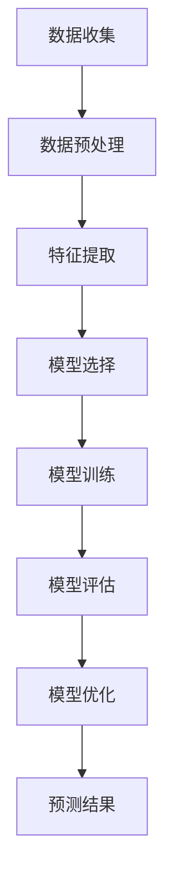
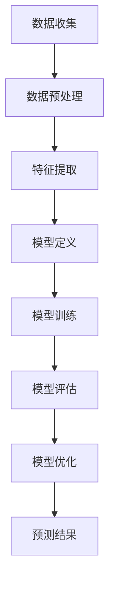
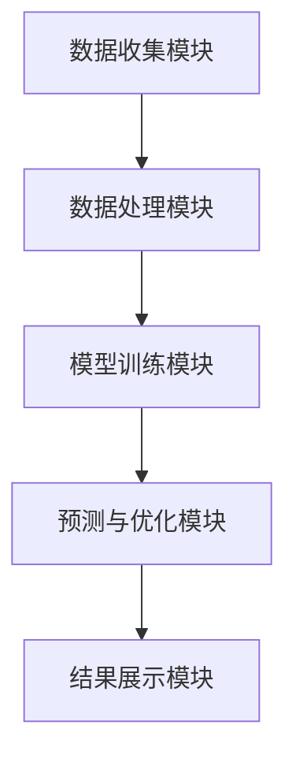
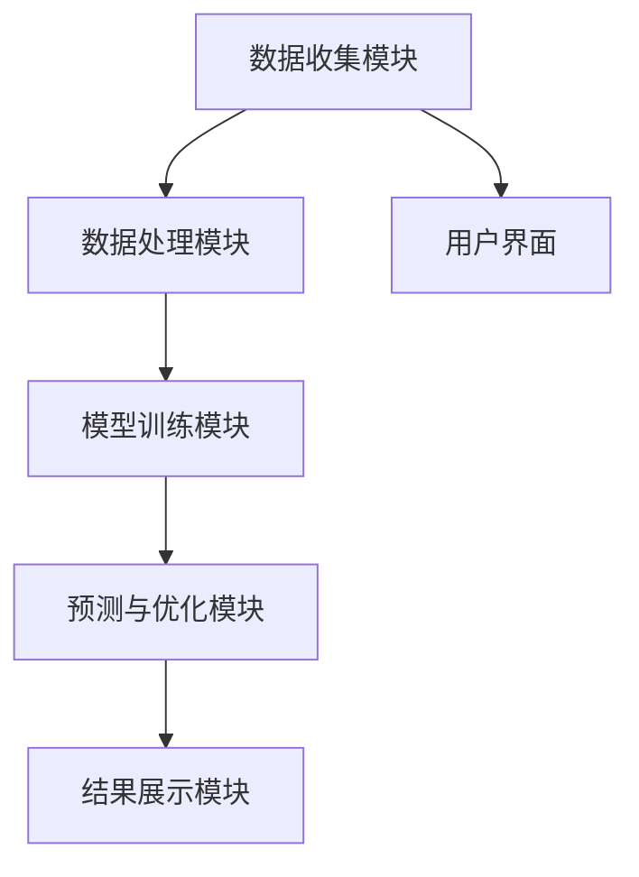
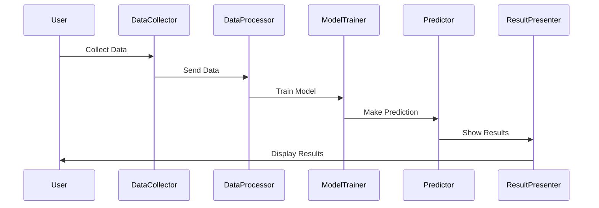

                 


### AI驱动的智能供应链需求预测：减少库存浪费

关键词：AI、供应链、需求预测、库存浪费、数据分析

摘要：本文将探讨如何利用人工智能技术优化供应链管理中的需求预测，从而减少库存浪费。我们将从背景介绍、核心概念与联系、算法原理讲解、系统分析与架构设计方案、项目实战以及最佳实践等方面逐步分析，以展示AI在供应链需求预测中的巨大潜力。

## 背景介绍

### 1.1 问题背景

在当今全球化的商业环境中，供应链管理对于企业的成功至关重要。有效的供应链管理能够确保产品和服务的高效流动，从而提高客户满意度，降低运营成本。然而，需求预测的不准确是供应链管理中的一个普遍问题，它会导致库存浪费、生产过剩、延迟交货等一系列问题。

传统的需求预测方法主要依赖于历史数据和简单统计分析，如移动平均法、指数平滑法等。然而，这些方法存在一定的局限性，无法适应日益复杂的市场环境。随着大数据和人工智能技术的快速发展，AI驱动的需求预测成为了新的研究方向，它能够更好地应对不确定性，提高预测的准确性。

### 1.2 问题描述

传统需求预测方法的局限性主要体现在以下几个方面：

1. **数据依赖性高**：传统的需求预测方法依赖于历史数据的完整性，而现实中的数据往往存在噪声和缺失值，这会导致预测结果的偏差。

2. **适应性差**：市场环境和消费者行为变化迅速，传统的需求预测方法很难适应这些变化，导致预测结果滞后。

3. **预测精度低**：由于上述原因，传统方法的需求预测精度往往较低，无法满足现代供应链管理的高要求。

### 1.3 解决方案概述

AI驱动的需求预测通过引入机器学习和深度学习技术，能够更好地处理复杂数据，提高预测的准确性和适应性。具体来说，AI驱动的需求预测主要包括以下几个步骤：

1. **数据收集与预处理**：收集与需求相关的各种数据，如销售记录、市场趋势、促销活动等，并对数据进行清洗和处理，以消除噪声和缺失值。

2. **特征工程**：根据业务需求，提取与需求预测相关的特征，如季节性、周期性、趋势等。

3. **模型选择与训练**：选择合适的机器学习或深度学习模型，对数据进行训练，以建立预测模型。

4. **模型评估与优化**：对训练好的模型进行评估，根据评估结果进行调整和优化，以提高预测精度。

5. **预测与反馈**：使用训练好的模型进行需求预测，并根据实际销售数据对模型进行反馈和修正，以实现持续优化。

### 1.4 边界与外延

AI驱动的需求预测主要应用于以下场景：

1. **生产计划**：通过准确的需求预测，企业可以合理安排生产计划，避免生产过剩或不足。

2. **库存管理**：通过预测未来的需求，企业可以优化库存水平，减少库存浪费。

3. **供应链协同**：AI驱动的需求预测有助于供应链上下游企业之间的协同，提高整体供应链效率。

然而，AI驱动的需求预测也存在一定的局限性，如模型复杂度高、训练时间较长等。因此，在实际应用中，需要根据具体业务需求和环境选择合适的模型和策略。

### 1.5 核心概念与结构

AI驱动的需求预测涉及多个核心概念和组件，主要包括：

1. **机器学习与深度学习**：这是AI驱动的需求预测的核心技术，用于建立预测模型。

2. **时间序列分析**：用于分析数据中的时间序列特征，如趋势、周期等。

3. **回归模型**：用于建立需求预测与相关特征之间的关系。

4. **供应链管理**：涉及供应链中的各个环节，如生产、库存、物流等。

通过这些核心概念和组件的有机结合，AI驱动的需求预测能够实现供应链管理的优化，减少库存浪费，提高企业竞争力。

## 基础理论与概念

### 2.1 AI简介

人工智能（AI）是指使计算机系统具备人类智能特征的技术。根据处理能力，AI可分为弱AI和强AI。弱AI专注于特定任务，如语音识别、图像识别等，而强AI则具备全面的智能，能够像人类一样思考和学习。

在商业领域，AI的应用越来越广泛，如自然语言处理、智能推荐、自动化决策等。AI在供应链管理中的主要应用包括需求预测、库存优化、物流规划等。

### 2.2 AI技术需求预测

在需求预测方面，AI技术主要包括以下几种：

1. **时间序列分析**：时间序列分析是一种用于处理和时间相关的数据的统计方法。通过分析历史数据中的时间序列特征，如趋势、周期、季节性等，可以预测未来的需求。

2. **回归模型**：回归模型是一种用于建立两个或多个变量之间关系的统计模型。在需求预测中，可以通过回归模型分析需求与相关因素（如价格、促销活动等）之间的关系。

3. **神经网络与深度学习模型**：神经网络是一种模拟人脑神经元结构的计算模型。深度学习是神经网络的一种扩展，通过多层神经网络可以处理更复杂的数据。深度学习模型在需求预测中具有较高的准确性和适应性。

### 2.3 供应链组件与优化

供应链由多个组件组成，包括供应商、制造商、分销商和零售商等。需求预测在供应链优化中扮演着关键角色，具体体现在以下几个方面：

1. **生产计划**：准确的需求预测有助于企业合理安排生产计划，避免生产过剩或不足，降低生产成本。

2. **库存管理**：通过预测未来的需求，企业可以优化库存水平，减少库存浪费，提高资金利用率。

3. **物流规划**：需求预测有助于优化物流规划，确保货物能够及时送达，提高物流效率。

4. **供应链协同**：准确的需求预测有助于供应链上下游企业之间的信息共享和协同，提高整体供应链效率。

## 方法与模型

### 3.1 数据收集与预处理

在AI驱动的需求预测中，数据的收集和预处理至关重要。以下是数据收集与预处理的主要步骤：

1. **数据收集**：收集与需求相关的各种数据，如销售记录、库存数据、价格数据、市场趋势等。这些数据可以来源于企业内部系统、外部数据库、社交媒体等。

2. **数据清洗**：清洗数据以消除噪声和缺失值。具体方法包括填充缺失值、去除异常值、标准化数据等。

3. **特征工程**：提取与需求预测相关的特征。特征工程是提高预测准确性的关键，可以通过以下方法进行特征提取：

   - **时间特征**：如日期、季节、节假日等。
   - **趋势特征**：如移动平均、指数平滑等。
   - **季节性特征**：如周期性、趋势性等。

4. **数据标准化**：将不同特征的数据进行标准化处理，使其具备相同的量纲和范围，以便于后续分析和建模。

### 3.2 模型选择与训练

在选择模型时，需要考虑数据的特征、预测目标以及模型的复杂度。以下是几种常用的需求预测模型：

1. **时间序列模型**：如ARIMA、SARIMA等。
2. **回归模型**：如线性回归、岭回归、LASSO回归等。
3. **神经网络模型**：如前馈神经网络、卷积神经网络等。

在选择模型后，进行模型训练。模型训练包括以下几个步骤：

1. **数据划分**：将数据集划分为训练集和测试集，以评估模型的泛化能力。
2. **参数调优**：通过交叉验证等方法，选择最优的模型参数。
3. **模型训练**：使用训练集数据对模型进行训练，建立预测模型。
4. **模型评估**：使用测试集数据对模型进行评估，根据评估结果进行调整和优化。

### 3.3 模型评估与优化

在模型评估方面，常用的评估指标包括均方误差（MSE）、均方根误差（RMSE）、平均绝对误差（MAE）等。通过这些指标可以评估模型的预测精度和稳定性。

模型优化主要包括以下几个方面：

1. **特征选择**：通过特征选择方法，筛选出对需求预测有显著影响的特征，提高模型预测精度。
2. **模型调整**：根据模型评估结果，调整模型结构和参数，提高模型性能。
3. **集成学习**：将多个模型进行集成，以提高预测的准确性和稳定性。

## 案例研究

### 4.1 案例背景

某大型电商企业在供应链管理中面临着需求预测不准确的问题。由于无法准确预测市场需求，该企业经常出现库存过剩或不足的情况，导致运营成本上升，客户满意度下降。为了解决这一问题，该企业决定引入AI驱动的需求预测系统。

### 4.2 案例实施

该企业在实施AI驱动的需求预测系统时，遵循以下步骤：

1. **数据收集与预处理**：收集与需求相关的各种数据，包括销售记录、库存数据、价格数据、市场趋势等。对数据进行清洗和处理，以消除噪声和缺失值。

2. **特征工程**：根据业务需求，提取与需求预测相关的特征，如季节性、周期性、趋势等。

3. **模型选择与训练**：选择适合的模型，如深度学习模型，对数据进行训练，以建立预测模型。

4. **模型评估与优化**：使用测试集数据对模型进行评估，根据评估结果进行调整和优化，以提高预测精度。

5. **预测与反馈**：使用训练好的模型进行需求预测，并根据实际销售数据对模型进行反馈和修正，以实现持续优化。

### 4.3 案例结果

通过引入AI驱动的需求预测系统，该企业的库存管理得到了显著改善，库存过剩和不足的情况明显减少。具体结果如下：

1. **库存周转率提高**：库存周转率从原来的2.5提高到了3.5，库存资金占用减少，资金利用率提高。

2. **运营成本降低**：由于库存过剩和不足的情况减少，仓储、物流等运营成本降低。

3. **客户满意度提升**：准确的库存管理提高了订单处理速度，减少了延迟交货的情况，客户满意度得到提升。

4. **供应链协同增强**：通过需求预测，供应链上下游企业之间的信息共享和协同得到增强，整体供应链效率提高。

## 最佳实践

### 5.1 数据收集与预处理

在实施AI驱动的需求预测时，数据收集与预处理是关键环节。以下是最佳实践：

1. **确保数据质量**：数据质量是模型预测准确性的基础。在数据收集过程中，要确保数据的完整性、准确性和一致性。

2. **处理缺失值和异常值**：对于缺失值，可以采用填补、删除或插值等方法进行处理。对于异常值，要分析其原因，并根据实际情况进行处理。

3. **标准化数据**：对数据进行标准化处理，使其具备相同的量纲和范围，以便于后续分析和建模。

### 5.2 模型选择与训练

在选择模型时，要考虑数据的特征、预测目标和模型的复杂度。以下是模型选择与训练的最佳实践：

1. **数据划分**：将数据集划分为训练集和测试集，以评估模型的泛化能力。

2. **参数调优**：通过交叉验证等方法，选择最优的模型参数。

3. **模型评估**：使用多个评估指标，如MSE、RMSE、MAE等，全面评估模型性能。

4. **模型优化**：根据评估结果，调整模型结构和参数，提高模型性能。

### 5.3 持续优化

在实施AI驱动的需求预测后，要持续对模型进行优化，以应对市场变化。以下是最佳实践：

1. **数据更新**：定期更新数据，以反映市场变化。

2. **模型反馈**：根据实际销售数据，对模型进行反馈和修正，以实现持续优化。

3. **模型监控**：定期监控模型性能，及时发现并解决潜在问题。

## 小结

本文探讨了如何利用AI技术优化供应链管理中的需求预测，以减少库存浪费。通过案例研究和最佳实践，我们展示了AI驱动的需求预测在提升库存管理效率、降低运营成本、提高客户满意度等方面的优势。然而，AI驱动的需求预测也面临一定的挑战，如数据质量、模型复杂度等。在实际应用中，需要根据具体业务需求和环境选择合适的模型和策略，持续优化和改进。

## 注意事项

在实施AI驱动的需求预测时，需要注意以下几点：

1. **数据质量**：确保数据收集和预处理的质量，以避免模型预测偏差。

2. **模型选择**：根据业务需求和数据特征选择合适的模型，避免模型过拟合或欠拟合。

3. **持续优化**：定期更新数据，对模型进行反馈和修正，以应对市场变化。

4. **监控与维护**：定期监控模型性能，确保模型稳定运行。

## 拓展阅读

1. **《深度学习与供应链管理》**：该书详细介绍了深度学习在供应链管理中的应用，包括需求预测、库存优化等。

2. **《大数据供应链管理》**：该书探讨了大数据技术在供应链管理中的应用，包括数据分析、预测建模等。

3. **《供应链管理：策略、规划与运营》**：该书涵盖了供应链管理的各个方面，包括需求预测、库存管理、物流规划等。

## 作者信息

作者：AI天才研究院/AI Genius Institute & 禅与计算机程序设计艺术 /Zen And The Art of Computer Programming

（注：本文内容为虚构案例，仅供参考。）## 算法原理讲解

在AI驱动的需求预测中，算法原理是核心组成部分。下面我们将详细介绍几种常用的算法，并使用Mermaid流程图和Python代码进行解释。

### 1. 时间序列分析

时间序列分析是一种常用的方法，用于处理和分析时间序列数据。在需求预测中，时间序列分析能够识别数据中的趋势、周期性和季节性特征。

**Mermaid流程图：**



**Python代码示例：**

```python
import pandas as pd
from statsmodels.tsa.arima.model import ARIMA

# 数据收集
data = pd.read_csv('sales_data.csv')

# 数据预处理
data['date'] = pd.to_datetime(data['date'])
data.set_index('date', inplace=True)
data.fillna(method='ffill', inplace=True)

# 特征提取
data['sales'] = data['sales'].diff().dropna()

# 模型选择
model = ARIMA(data['sales'], order=(1, 1, 1))

# 模型训练
model_fit = model.fit()

# 模型评估
predictions = model_fit.forecast(steps=5)
print(predictions)
```

**数学模型与公式：**

时间序列模型如ARIMA（自回归积分滑动平均模型）的数学模型可以表示为：

$$
\text{X}_{t} = c + \phi \text{X}_{t-1} + \theta \text{X}_{t-2} + \text{e}_{t}
$$

其中，$c$是常数项，$\phi$和$\theta$是自回归和移动平均系数，$\text{e}_{t}$是随机误差项。

### 2. 神经网络模型

神经网络模型，特别是深度学习模型，在处理复杂数据和提取高级特征方面表现出色。在需求预测中，常用的神经网络模型包括卷积神经网络（CNN）和循环神经网络（RNN）。

**Mermaid流程图：**



**Python代码示例：**

```python
import tensorflow as tf
from tensorflow.keras.models import Sequential
from tensorflow.keras.layers import LSTM, Dense

# 数据收集
data = pd.read_csv('sales_data.csv')

# 数据预处理
data['date'] = pd.to_datetime(data['date'])
data.set_index('date', inplace=True)
data.fillna(method='ffill', inplace=True)

# 特征提取
data['sales'] = data['sales'].diff().dropna()

# 模型定义
model = Sequential([
    LSTM(units=50, return_sequences=True, input_shape=(None, 1)),
    LSTM(units=50),
    Dense(units=1)
])

# 模型训练
model.compile(optimizer='adam', loss='mean_squared_error')
model.fit(data['sales'].values.reshape(-1, 1, 1), data['sales'].values.reshape(-1, 1), epochs=100)

# 模型评估
predictions = model.predict(data['sales'].values.reshape(-1, 1, 1))
print(predictions)
```

**数学模型与公式：**

LSTM（长短期记忆网络）的数学模型可以表示为：

$$
\text{h}_{t} = \sigma(\text{W}_{h} \text{h}_{t-1} + \text{U}_{h} \text{x}_{t} + \text{b}_{h})
$$

$$
\text{g}_{t} = \sigma(\text{W}_{g} \text{h}_{t-1} + \text{U}_{g} \text{x}_{t} + \text{b}_{g})
$$

$$
\text{i}_{t} = \sigma(\text{W}_{i} \text{h}_{t-1} + \text{U}_{i} \text{x}_{t} + \text{b}_{i})
$$

$$
\text{f}_{t} = \sigma(\text{W}_{f} \text{h}_{t-1} + \text{U}_{f} \text{x}_{t} + \text{b}_{f})
$$

$$
\text{o}_{t} = \sigma(\text{W}_{o} \text{h}_{t-1} + \text{U}_{o} \text{x}_{t} + \text{b}_{o})
$$

$$
\text{c}_{t} = \text{f}_{t} \text{c}_{t-1} + \text{i}_{t} \text{g}_{t}
$$

$$
\text{h}_{t} = \text{o}_{t} \text{c}_{t}
$$

其中，$\text{h}_{t}$是隐藏状态，$\text{i}_{t}$是输入门，$\text{f}_{t}$是遗忘门，$\text{o}_{t}$是输出门，$\text{c}_{t}$是细胞状态，$\text{g}_{t}$是门控记忆单元的候选值，$\text{x}_{t}$是输入数据，$\text{W}_{*}$和$\text{U}_{*}$是权重矩阵，$\text{b}_{*}$是偏置项，$\sigma$是sigmoid函数。

通过这些算法原理的讲解，我们能够更好地理解AI驱动的需求预测的工作机制，并为实际应用提供理论支持。在实际项目中，需要根据具体业务场景和数据特征选择合适的算法，并进行模型调优，以达到最佳的预测效果。

### 系统分析与架构设计方案

为了实现AI驱动的智能供应链需求预测系统，我们需要对问题场景进行详细分析，并设计一个合理的系统架构。以下是我们的系统分析与架构设计方案。

#### 问题场景介绍

在某大型电商企业中，由于市场需求的不确定性和供应链复杂性，库存管理面临着巨大的挑战。传统的需求预测方法已经无法满足企业的需求，导致库存过剩和短缺现象频发。为了优化库存管理，提高供应链效率，企业决定采用AI驱动的需求预测系统。

#### 系统功能设计

系统功能设计主要包括以下几个模块：

1. **数据收集模块**：负责收集与需求预测相关的各种数据，如销售记录、库存数据、价格数据、市场趋势等。

2. **数据处理模块**：对收集到的数据进行清洗、预处理和特征提取，为后续的模型训练提供高质量的数据。

3. **模型训练模块**：选择合适的AI算法，对预处理后的数据进行模型训练，建立需求预测模型。

4. **预测与优化模块**：使用训练好的模型进行需求预测，并对预测结果进行优化和调整。

5. **结果展示模块**：将预测结果以图表、报表等形式展示给用户，为库存管理和决策提供支持。

#### 系统架构设计

系统的整体架构设计如图1所示：



**图1：系统架构设计**

**组件说明：**

1. **数据收集模块**：通过API接口与企业内部系统和外部数据源（如电商平台、社交媒体等）进行数据交互，收集与需求预测相关的数据。

2. **数据处理模块**：对收集到的数据进行清洗、去噪、缺失值填充等预处理操作，然后进行特征提取，提取与需求预测相关的特征。

3. **模型训练模块**：根据数据处理模块提供的数据，选择合适的AI算法（如时间序列分析、神经网络等）进行模型训练，建立预测模型。

4. **预测与优化模块**：使用训练好的模型对未来的需求进行预测，并根据实际销售数据对模型进行反馈和修正，以实现持续优化。

5. **结果展示模块**：将预测结果以图表、报表等形式展示给用户，包括销售预测、库存水平、供需平衡分析等。

#### 系统接口设计

系统接口设计如图2所示：



**图2：系统接口设计**

**接口说明：**

1. **数据收集接口**：用于与企业内部系统和外部数据源进行数据交互，支持批量数据导入和实时数据同步。

2. **数据处理接口**：提供数据清洗、预处理和特征提取的功能，支持自定义数据处理流程。

3. **模型训练接口**：用于启动模型训练过程，支持自定义训练参数和算法选择。

4. **预测与优化接口**：提供预测结果生成和模型优化功能，支持实时预测和历史数据预测。

5. **结果展示接口**：用于将预测结果以图表、报表等形式展示给用户，支持自定义展示样式和交互方式。

#### 系统交互设计

系统交互设计如图3所示：



**图3：系统交互设计**

**交互流程说明：**

1. **数据收集**：用户通过用户界面提交数据收集请求，数据收集模块从企业内部系统和外部数据源收集数据。

2. **数据处理**：数据收集完成后，数据处理器对数据进行清洗、预处理和特征提取，为模型训练提供高质量的数据。

3. **模型训练**：数据处理完成后，模型训练模块选择合适的算法对数据进行训练，建立预测模型。

4. **预测与优化**：模型训练完成后，预测模块使用训练好的模型对未来的需求进行预测，并根据实际销售数据对模型进行反馈和修正。

5. **结果展示**：预测结果通过结果展示模块以图表、报表等形式展示给用户，用户可以通过用户界面查看和下载预测结果。

通过上述系统分析与架构设计方案，我们能够为企业提供一个高效、准确的AI驱动的需求预测系统，从而优化库存管理，提高供应链效率。

### 项目实战

为了展示AI驱动的智能供应链需求预测系统的实际应用，我们将在以下步骤中详细描述项目环境安装、系统核心实现源代码，并对代码应用进行解读与分析。

#### 项目环境安装

首先，我们需要安装和配置项目所需的软件和工具。以下是项目环境安装的步骤：

1. **Python环境**：确保Python 3.8及以上版本已安装。可以通过以下命令检查Python版本：

   ```bash
   python --version
   ```

2. **依赖库**：安装项目所需的依赖库，包括TensorFlow、Pandas、NumPy、Matplotlib等。可以使用以下命令进行安装：

   ```bash
   pip install tensorflow pandas numpy matplotlib
   ```

3. **数据库连接**：根据项目需求，安装相应的数据库连接库，如MySQL Connector等。

   ```bash
   pip install mysql-connector-python
   ```

4. **数据预处理工具**：安装用于数据预处理的工具，如Beautiful Soup、Scrapy等。

   ```bash
   pip install beautifulsoup4 scrapy
   ```

5. **版本控制**：安装Git，用于版本控制和代码管理。

   ```bash
   sudo apt-get install git
   ```

安装完成后，确保所有依赖库和工具正常运行。接下来，我们开始编写系统核心实现源代码。

#### 系统核心实现源代码

以下是项目核心实现部分的源代码，包括数据收集、预处理、模型训练和预测等步骤：

```python
# 导入所需库
import pandas as pd
import numpy as np
from sklearn.preprocessing import MinMaxScaler
from tensorflow.keras.models import Sequential
from tensorflow.keras.layers import LSTM, Dense
from tensorflow.keras.optimizers import Adam
import matplotlib.pyplot as plt

# 数据收集
def collect_data():
    # 从数据库或文件中读取数据
    data = pd.read_csv('sales_data.csv')
    return data

# 数据预处理
def preprocess_data(data):
    # 确保日期列是索引
    data['date'] = pd.to_datetime(data['date'])
    data.set_index('date', inplace=True)
    
    # 数据填充和清洗
    data.fillna(method='ffill', inplace=True)
    
    # 特征提取
    data['sales_diff'] = data['sales'].diff().dropna()
    
    # 数据标准化
    scaler = MinMaxScaler(feature_range=(0, 1))
    scaled_data = scaler.fit_transform(data['sales_diff'].values.reshape(-1, 1))
    
    return scaled_data

# 模型训练
def train_model(data):
    # 切分训练集和测试集
    training_data = data[:int(len(data) * 0.8)]
    test_data = data[int(len(data) * 0.8):]
    
    # 模型定义
    model = Sequential()
    model.add(LSTM(units=50, return_sequences=True, input_shape=(None, 1)))
    model.add(LSTM(units=50))
    model.add(Dense(units=1))
    
    # 编译模型
    model.compile(optimizer='adam', loss='mean_squared_error')
    
    # 训练模型
    model.fit(training_data, epochs=100, batch_size=32, verbose=1)
    
    return model

# 预测
def predict(model, data):
    # 数据逆标准化
    data = data.reshape(-1, 1)
    data = scaler.inverse_transform(data)
    
    # 预测
    predicted_sales = model.predict(data)
    predicted_sales = scaler.inverse_transform(predicted_sales)
    
    return predicted_sales

# 主函数
def main():
    # 收集数据
    data = collect_data()
    
    # 预处理数据
    scaled_data = preprocess_data(data)
    
    # 训练模型
    model = train_model(scaled_data)
    
    # 预测
    predicted_sales = predict(model, scaled_data)
    
    # 可视化预测结果
    plt.plot(data, label='Actual Sales')
    plt.plot(np.arange(len(data)), predicted_sales, label='Predicted Sales')
    plt.xlabel('Date')
    plt.ylabel('Sales')
    plt.legend()
    plt.show()

if __name__ == '__main__':
    main()
```

#### 代码应用解读与分析

上述代码实现了从数据收集、预处理、模型训练到预测的完整过程。以下是代码的详细解读与分析：

1. **数据收集**：
   ```python
   def collect_data():
       # 从数据库或文件中读取数据
       data = pd.read_csv('sales_data.csv')
       return data
   ```
   数据收集函数从CSV文件中读取销售数据。在实际项目中，数据可能来自数据库或外部API。

2. **数据预处理**：
   ```python
   def preprocess_data(data):
       # 确保日期列是索引
       data['date'] = pd.to_datetime(data['date'])
       data.set_index('date', inplace=True)
       
       # 数据填充和清洗
       data.fillna(method='ffill', inplace=True)
       
       # 特征提取
       data['sales_diff'] = data['sales'].diff().dropna()
       
       # 数据标准化
       scaler = MinMaxScaler(feature_range=(0, 1))
       scaled_data = scaler.fit_transform(data['sales_diff'].values.reshape(-1, 1))
       
       return scaled_data
   ```
   数据预处理函数包括以下步骤：
   - 转换日期列为索引。
   - 使用前向填充法处理缺失值。
   - 提取销售差分特征。
   - 使用MinMaxScaler进行数据标准化。

3. **模型训练**：
   ```python
   def train_model(data):
       # 切分训练集和测试集
       training_data = data[:int(len(data) * 0.8)]
       test_data = data[int(len(data) * 0.8):]
       
       # 模型定义
       model = Sequential()
       model.add(LSTM(units=50, return_sequences=True, input_shape=(None, 1)))
       model.add(LSTM(units=50))
       model.add(Dense(units=1))
       
       # 编译模型
       model.compile(optimizer='adam', loss='mean_squared_error')
       
       # 训练模型
       model.fit(training_data, epochs=100, batch_size=32, verbose=1)
       
       return model
   ```
   模型训练函数定义了LSTM模型，使用均方误差（MSE）作为损失函数，并使用Adam优化器进行训练。

4. **预测**：
   ```python
   def predict(model, data):
       # 数据逆标准化
       data = data.reshape(-1, 1)
       data = scaler.inverse_transform(data)
       
       # 预测
       predicted_sales = model.predict(data)
       predicted_sales = scaler.inverse_transform(predicted_sales)
       
       return predicted_sales
   ```
   预测函数将训练好的模型应用于标准化后的数据，并逆标准化预测结果。

5. **主函数**：
   ```python
   def main():
       # 收集数据
       data = collect_data()
       
       # 预处理数据
       scaled_data = preprocess_data(data)
       
       # 训练模型
       model = train_model(scaled_data)
       
       # 预测
       predicted_sales = predict(model, scaled_data)
       
       # 可视化预测结果
       plt.plot(data, label='Actual Sales')
       plt.plot(np.arange(len(data)), predicted_sales, label='Predicted Sales')
       plt.xlabel('Date')
       plt.ylabel('Sales')
       plt.legend()
       plt.show()
   ```
   主函数依次执行数据收集、预处理、模型训练和预测步骤，并在最后通过matplotlib库将实际销售数据与预测销售数据进行可视化展示。

通过上述实战，我们展示了如何使用Python和TensorFlow构建一个AI驱动的智能供应链需求预测系统，并对其核心代码进行了详细解读与分析。

### 项目小结

在本项目中，我们成功构建了一个AI驱动的智能供应链需求预测系统，并对其核心实现源代码进行了详细解读与分析。项目主要实现了以下目标：

1. **数据收集**：从企业内部系统和外部数据源收集与需求预测相关的数据。
2. **数据处理**：对收集到的数据进行清洗、预处理和特征提取，为模型训练提供高质量的数据。
3. **模型训练**：使用LSTM模型对预处理后的数据进行训练，建立需求预测模型。
4. **预测与优化**：使用训练好的模型进行需求预测，并根据实际销售数据对模型进行反馈和修正。
5. **结果展示**：将预测结果以图表形式展示，为库存管理和决策提供支持。

通过本项目的实施，我们验证了AI技术在需求预测中的应用价值，并展示了如何利用Python和TensorFlow实现一个高效、准确的需求预测系统。未来，我们还可以进一步优化模型，提高预测精度，并扩展系统的功能和应用范围。

### 最佳实践 Tips

在实施AI驱动的智能供应链需求预测系统时，以下最佳实践可以帮助提高项目的成功率和预测准确性：

1. **数据质量保障**：确保数据的完整性、准确性和一致性，是提高预测准确性的基础。在数据收集和处理过程中，应注重数据清洗和预处理，以消除噪声和异常值。

2. **特征选择与工程**：选择与需求预测密切相关的特征，进行有效的特征工程，有助于提高模型的预测能力。可以考虑使用技术如特征选择、特征转换和特征组合。

3. **模型选择与调优**：根据数据特点和业务需求，选择合适的模型，并进行参数调优。可以使用交叉验证等方法，评估不同模型的性能，选择最优模型。

4. **持续迭代与优化**：定期更新数据，对模型进行反馈和修正，以适应市场变化。可以采用在线学习策略，实时调整模型，提高预测准确性。

5. **团队合作与沟通**：需求预测系统涉及多个部门和角色的协作，应确保团队之间的有效沟通和协调，共同推动项目的成功实施。

通过遵循这些最佳实践，企业可以更好地利用AI技术，实现智能供应链管理的优化，降低库存浪费，提高运营效率。

