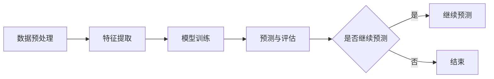
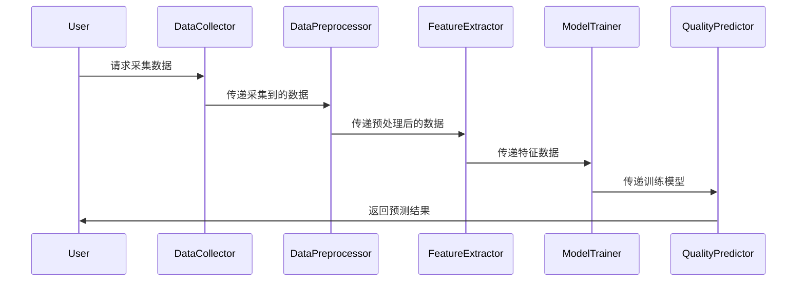

                 

## 《AI驱动的智能制造质量预测：减少产品缺陷率》

关键词：智能制造、人工智能、质量预测、产品缺陷率、算法原理、系统架构设计

摘要：本文探讨了人工智能在智能制造领域中的应用，特别是如何利用AI技术进行质量预测以减少产品缺陷率。文章首先介绍了制造业面临的挑战和质量问题对制造业的影响，然后详细阐述了AI技术在质量管理中的变革。接着，文章定义了产品缺陷率，分析了其影响因素和传统质量管理方法的局限性。在此基础上，文章深入讲解了AI技术、智能制造、质量预测等核心概念，并通过对比表格和ER图架构来梳理这些概念之间的关系。随后，文章介绍了质量预测的算法原理，包括数据预处理、特征提取、模型训练、预测与评估等步骤，并通过Python源代码、数学模型和公式进行了详细解释和举例说明。文章还介绍了系统分析与架构设计方案，包括问题场景介绍、项目介绍、系统功能设计、系统架构设计、系统接口设计和系统交互。随后，文章通过项目实战、最佳实践 tips、小结、注意事项和拓展阅读等部分，为读者提供了全面的指导和深入思考。

## 第一部分：背景介绍

### 第1章：问题背景

#### 1.1 问题背景

制造业作为国家经济的支柱产业，其发展直接关系到国家的经济实力和国际竞争力。然而，制造业面临着一系列的挑战，其中产品质量问题是不可忽视的重要问题。随着全球市场竞争的加剧，客户对产品质量的要求越来越高，产品缺陷率成为影响企业盈利能力和市场占有率的关键因素。

#### 1.2 质量问题对制造业的影响

产品质量问题不仅会导致客户投诉和退货，影响企业的声誉和市场份额，还会增加生产成本，降低生产效率。此外，严重的质量问题甚至可能引发安全事故，造成不可挽回的损失。因此，解决产品质量问题对制造业的可持续发展具有重要意义。

#### 1.3 AI技术对质量管理的变革

随着人工智能技术的发展，尤其是深度学习和大数据分析等技术的应用，质量管理方式发生了翻天覆地的变化。AI技术通过自动化的数据处理和分析能力，可以实现对产品质量的实时监控和预测，从而减少产品缺陷率，提高生产效率。

### 第2章：核心概念与联系

#### 2.1 AI技术

AI（人工智能）是指通过计算机模拟人类的认知能力，使计算机具备智能行为的能力。AI技术的发展经历了多个阶段，从最初的规则推理到现代的深度学习和强化学习，为智能制造和质量管理提供了强大的技术支持。

#### 2.2 智能制造

智能制造是指利用信息技术、人工智能、物联网等先进技术，实现制造过程的自动化、智能化和个性化。智能制造系统包括感知层、网络层、平台层和应用层，能够实现对生产过程的全面监控和优化。

#### 2.3 质量预测

质量预测是利用AI技术对产品生产过程中可能出现的问题进行预测，以提前采取相应的措施，防止产品缺陷的发生。质量预测的关键在于对生产数据的分析和建模，通过大数据分析和机器学习算法，实现对产品质量的准确预测。

#### 2.4 产品缺陷率

产品缺陷率是指在生产过程中，不合格产品所占的比例。降低产品缺陷率是提高产品质量的重要目标。产品缺陷率受到多种因素的影响，包括原材料质量、生产工艺、设备状况、操作人员技能等。

### 第3章：概念属性特征对比表格

| 概念        | 定义                                                         | 特征                                                         |  
| ----------- | ------------------------------------------------------------ | ------------------------------------------------------------ |  
| AI技术      | 利用计算机模拟人类的认知能力                                   | 自动化数据处理、高效分析能力、持续学习与适应能力                     |  
| 智能制造    | 利用先进技术实现制造过程的自动化、智能化和个性化                 | 感知层、网络层、平台层和应用层全面监控和优化                     |  
| 质量预测    | 利用AI技术对产品质量问题进行预测，以提前采取措施防止缺陷发生   | 数据分析、建模、预测准确性                                     |  
| 产品缺陷率  | 生产过程中不合格产品所占的比例                                 | 受原材料质量、生产工艺、设备状况、操作人员技能等多种因素影响         |

### 第4章：ER实体关系图架构

ER（实体关系）图是一种用于表示实体及其之间关系的图形化方法。在智能制造质量预测系统中，关键的实体包括产品、生产过程、质量检测、预测模型等。

#### ER图绘制

```mermaid
erDiagram
  产品 ||--|{ 预测模型 }|
  生产过程 ||--|{ 质量检测 }|
  质量检测 ||--|{ 预测模型 }|
  预测模型 ||--|{ 产品 }|
  预测模型 ||--|{ 生产过程 }|
```

#### 关系分析与解释

- 产品与预测模型之间存在关联关系，通过预测模型可以对产品进行质量预测。
- 生产过程与质量检测之间存在关联关系，质量检测是评估生产过程质量的重要环节。
- 质量检测与预测模型之间存在依赖关系，预测模型通过质量检测数据来训练和优化。
- 预测模型与产品之间存在反馈关系，通过预测结果指导生产过程的调整，以减少产品缺陷率。

## 第二部分：核心概念与联系

### 第5章：核心概念原理

#### 2.1 AI技术

AI（人工智能）是指通过计算机模拟人类的认知能力，使计算机具备智能行为的能力。AI技术的发展经历了多个阶段，从最初的规则推理到现代的深度学习和强化学习，为智能制造和质量管理提供了强大的技术支持。

#### 2.2 智能制造

智能制造是指利用信息技术、人工智能、物联网等先进技术，实现制造过程的自动化、智能化和个性化。智能制造系统包括感知层、网络层、平台层和应用层，能够实现对生产过程的全面监控和优化。

#### 2.3 质量预测

质量预测是利用AI技术对产品生产过程中可能出现的问题进行预测，以提前采取相应的措施，防止产品缺陷的发生。质量预测的关键在于对生产数据的分析和建模，通过大数据分析和机器学习算法，实现对产品质量的准确预测。

#### 2.4 产品缺陷率

产品缺陷率是指在生产过程中，不合格产品所占的比例。降低产品缺陷率是提高产品质量的重要目标。产品缺陷率受到多种因素的影响，包括原材料质量、生产工艺、设备状况、操作人员技能等。

### 第3章：概念属性特征对比表格

| 概念        | 定义                                                         | 特征                                                         |    
| ----------- | ------------------------------------------------------------ | ------------------------------------------------------------ |    
| AI技术      | 利用计算机模拟人类的认知能力                                   | 自动化数据处理、高效分析能力、持续学习与适应能力                     |    
| 智能制造    | 利用先进技术实现制造过程的自动化、智能化和个性化                 | 感知层、网络层、平台层和应用层全面监控和优化                     |    
| 质量预测    | 利用AI技术对产品质量问题进行预测，以提前采取措施防止缺陷发生   | 数据分析、建模、预测准确性                                     |    
| 产品缺陷率  | 生产过程中不合格产品所占的比例                                 | 受原材料质量、生产工艺、设备状况、操作人员技能等多种因素影响         |

### 第4章：ER实体关系图架构

ER（实体关系）图是一种用于表示实体及其之间关系的图形化方法。在智能制造质量预测系统中，关键的实体包括产品、生产过程、质量检测、预测模型等。

#### ER图绘制

```mermaid
erDiagram
  产品 ||--|{ 预测模型 }|
  生产过程 ||--|{ 质量检测 }|
  质量检测 ||--|{ 预测模型 }|
  预测模型 ||--|{ 产品 }|
  预测模型 ||--|{ 生产过程 }|
```

#### 关系分析与解释

- 产品与预测模型之间存在关联关系，通过预测模型可以对产品进行质量预测。
- 生产过程与质量检测之间存在关联关系，质量检测是评估生产过程质量的重要环节。
- 质量检测与预测模型之间存在依赖关系，预测模型通过质量检测数据来训练和优化。
- 预测模型与产品之间存在反馈关系，通过预测结果指导生产过程的调整，以减少产品缺陷率。

## 第三部分：算法原理讲解

### 第5章：算法原理讲解

在人工智能驱动的智能制造质量预测中，算法的设计与实现是关键环节。以下将详细讲解质量预测算法的原理，包括数据预处理、特征提取、模型训练、预测与评估等步骤。

#### 5.1 算法mermaid流程图

为了更直观地理解算法流程，我们可以使用mermaid绘制算法的流程图，如下所示：



#### 5.2 Python源代码

以下是一个简单的Python代码示例，用于演示质量预测算法的实现：

```python
import pandas as pd
from sklearn.model_selection import train_test_split
from sklearn.ensemble import RandomForestClassifier
from sklearn.metrics import accuracy_score

# 数据读取
data = pd.read_csv('quality_data.csv')

# 数据预处理
X = data.drop('defect', axis=1)
y = data['defect']

# 特征提取
# 这里使用Pandas中的get_dummies方法进行特征提取
X = pd.get_dummies(X)

# 模型训练
X_train, X_test, y_train, y_test = train_test_split(X, y, test_size=0.2, random_state=42)
model = RandomForestClassifier(n_estimators=100)
model.fit(X_train, y_train)

# 预测与评估
y_pred = model.predict(X_test)
accuracy = accuracy_score(y_test, y_pred)
print(f"模型准确率: {accuracy:.2f}")
```

#### 5.3 数学模型和公式

在质量预测中，常用的数学模型包括分类模型和回归模型。以下是一个基于分类模型的例子：

$$
\begin{aligned}
P(\text{defect} | X) &= \frac{e^{ \theta^T X}}{1 + e^{ \theta^T X}} \\
\theta &= \arg\max_{\theta} L(\theta; X, y) \\
L(\theta; X, y) &= - \sum_{i=1}^{n} y_i \log P(y_i | X_i)
\end{aligned}
$$

其中，$\theta$是模型的参数，$X$是特征向量，$y$是标签，$P(\text{defect} | X)$是给定特征$X$下缺陷发生的概率，$L(\theta; X, y)$是损失函数。

#### 5.4 详细讲解与举例说明

##### 损失函数的解释

在质量预测中，常用的损失函数是交叉熵损失函数。交叉熵损失函数可以衡量模型的预测结果与真实标签之间的差异，其公式如下：

$$
L(\theta; X, y) = - \sum_{i=1}^{n} y_i \log P(y_i | X_i)
$$

其中，$y_i$是第$i$个样本的真实标签，$P(y_i | X_i)$是模型预测的第$i$个样本标签的概率。

交叉熵损失函数的值越小，说明模型的预测结果与真实标签越接近，模型的性能越好。

##### 优化算法的步骤

为了找到使得交叉熵损失函数最小的参数$\theta$，我们通常使用优化算法，如梯度下降算法。梯度下降算法的基本步骤如下：

1. 初始化参数$\theta$。
2. 计算损失函数关于参数$\theta$的梯度$\nabla_\theta L(\theta; X, y)$。
3. 更新参数$\theta$：$\theta \leftarrow \theta - \alpha \nabla_\theta L(\theta; X, y)$，其中$\alpha$是学习率。
4. 重复步骤2和3，直到满足停止条件（如梯度变化很小或达到最大迭代次数）。

##### 模型评估指标的应用

在质量预测中，常用的评估指标包括准确率（Accuracy）、精确率（Precision）、召回率（Recall）和F1分数（F1 Score）。

- 准确率：$Accuracy = \frac{TP + TN}{TP + FN + FP + TN}$，其中$TP$是真正例，$TN$是真负例，$FP$是假正例，$FN$是假负例。
- 精确率：$Precision = \frac{TP}{TP + FP}$，表示预测为正例中实际为正例的比例。
- 召回率：$Recall = \frac{TP}{TP + FN}$，表示实际为正例中预测为正例的比例。
- F1分数：$F1 Score = 2 \times \frac{Precision \times Recall}{Precision + Recall}$，是精确率和召回率的调和平均值。

通过这些评估指标，我们可以全面评估质量预测模型的性能。

### 第6章：系统分析与架构设计方案

#### 6.1 问题场景介绍

在现代制造业中，产品的质量直接影响企业的声誉和市场份额。随着生产过程的复杂化和自动化水平的提高，传统的质量检测方法已无法满足日益严格的质量要求。因此，引入AI驱动的质量预测系统成为解决这一问题的有效途径。

#### 6.2 项目介绍

本项目旨在开发一个基于AI技术的智能制造质量预测系统，通过实时监测和分析生产过程中的数据，预测产品缺陷率，为生产过程提供实时反馈和优化建议，从而减少产品缺陷率，提高产品质量。

#### 6.3 系统功能设计

系统功能设计主要包括以下几个部分：

- 数据采集：从生产设备中实时获取生产数据，包括温度、压力、速度等。
- 数据预处理：对采集到的数据进行清洗、归一化等处理，为后续的特征提取和模型训练做好准备。
- 特征提取：从预处理后的数据中提取与质量相关的特征，如波动范围、异常值等。
- 模型训练：利用机器学习算法对特征进行训练，建立质量预测模型。
- 预测与反馈：将训练好的模型应用于新的生产数据，预测产品质量，并根据预测结果提供优化建议。

#### 8.1 领域模型mermaid类图

为了更好地理解系统中的类及其关系，我们可以使用mermaid绘制一个类图，如下所示：

```mermaid
classDiagram
    ClassDef DataCollector{
        -fields: data_list[]
        +collect_data():void
    }
    ClassDef DataPreprocessor{
        -data: DataFrame
        +preprocess_data():DataFrame
    }
    ClassDef FeatureExtractor{
        -features: DataFrame
        +extract_features(data: DataFrame):DataFrame
    }
    ClassDef ModelTrainer{
        -model: RandomForestClassifier
        +train_model(features: DataFrame, labels: Series):void
    }
    ClassDef QualityPredictor{
        -model: RandomForestClassifier
        +predict_quality(data: DataFrame):Series
    }
    DataCollector "uses" DataPreprocessor
    DataPreprocessor "uses" FeatureExtractor
    FeatureExtractor "uses" ModelTrainer
    ModelTrainer "uses" QualityPredictor
```

#### 8.2 系统架构设计

系统架构设计遵循MVC（模型-视图-控制器）架构模式，以实现系统的模块化、可维护性和可扩展性。

- **模型层**：包括数据预处理、特征提取、模型训练和预测模型，负责业务逻辑的实现。
- **视图层**：负责与用户交互，展示预测结果和优化建议。
- **控制器层**：负责协调模型层和视图层之间的交互，处理用户输入和系统响应。

#### 8.3 系统接口设计和系统交互

为了实现系统各部分之间的有效通信，我们需要设计合理的接口。以下是一个简化的接口设计：

- **数据采集接口**：用于接收生产设备的数据，支持数据的实时采集和历史数据的查询。
- **数据预处理接口**：用于对采集到的数据进行清洗和归一化处理。
- **特征提取接口**：用于从预处理后的数据中提取与质量相关的特征。
- **预测接口**：用于接收新的数据，并返回质量预测结果。

系统交互使用mermaid序列图进行描述，如下所示：



通过上述系统架构设计和接口设计，我们可以实现一个高效、稳定、易扩展的AI驱动的智能制造质量预测系统，为制造业提供有力的质量保障。

## 第四部分：项目实战

### 第10章：环境安装

在开始项目实战之前，我们需要搭建一个合适的环境，以支持质量预测系统的开发与运行。以下是环境安装的具体步骤：

#### 10.1 环境配置

1. **操作系统**：推荐使用Ubuntu 18.04或更高版本。
2. **Python环境**：安装Python 3.7或更高版本。
3. **虚拟环境**：使用`venv`创建一个Python虚拟环境，以隔离项目依赖。

```bash
python3 -m venv quality_prediction_env
source quality_prediction_env/bin/activate
```

#### 10.2 软件安装

1. **基本软件**：安装必要的软件包，如`numpy`、`pandas`、`scikit-learn`等。

```bash
pip install numpy pandas scikit-learn
```

2. **数据处理工具**：安装`matplotlib`和`seaborn`用于数据可视化。

```bash
pip install matplotlib seaborn
```

3. **数据库**：如果需要存储和处理大量数据，可以安装`MongoDB`或`PostgreSQL`。

#### 10.3 开发工具

1. **集成开发环境（IDE）**：推荐使用PyCharm或Visual Studio Code。
2. **版本控制**：使用Git进行版本控制，确保代码的安全和协作。

```bash
pip install gitpython
```

### 第11章：系统核心实现

#### 11.1 源代码

以下是系统核心实现的源代码结构：

```python
# 文件结构
quality_prediction_system/
|-- data/
|   |-- raw/
|   |-- processed/
|-- models/
|   |-- trained_models/
|-- scripts/
    |-- data_loader.py
    |-- data_preprocessor.py
    |-- feature_extractor.py
    |-- model_trainer.py
    |-- quality_predictor.py
    |-- main.py
```

1. **数据加载器（data_loader.py）**：用于读取和处理数据集。

```python
import pandas as pd

def load_data(file_path):
    data = pd.read_csv(file_path)
    return data
```

2. **数据预处理（data_preprocessor.py）**：用于清洗和归一化数据。

```python
import pandas as pd
from sklearn.preprocessing import StandardScaler

def preprocess_data(data):
    # 数据清洗
    data.dropna(inplace=True)
    # 数据归一化
    scaler = StandardScaler()
    numerical_features = data.select_dtypes(include=['float64', 'int64']).columns
    data[numerical_features] = scaler.fit_transform(data[numerical_features])
    return data
```

3. **特征提取（feature_extractor.py）**：用于从数据中提取特征。

```python
import pandas as pd
from sklearn.preprocessing import OneHotEncoder

def extract_features(data):
    # 特征提取
    categorical_features = data.select_dtypes(include=['object']).columns
    encoder = OneHotEncoder()
    encoded_data = encoder.fit_transform(data[categorical_features])
    feature_columns = encoder.get_feature_names_out(categorical_features)
    feature_df = pd.DataFrame(encoded_data.toarray(), columns=feature_columns)
    return feature_df
```

4. **模型训练（model_trainer.py）**：用于训练质量预测模型。

```python
import pandas as pd
from sklearn.ensemble import RandomForestClassifier
from sklearn.model_selection import train_test_split

def train_model(data, target):
    # 分割数据集
    X_train, X_test, y_train, y_test = train_test_split(data, target, test_size=0.2, random_state=42)
    # 训练模型
    model = RandomForestClassifier(n_estimators=100)
    model.fit(X_train, y_train)
    # 评估模型
    accuracy = model.score(X_test, y_test)
    print(f"模型准确率: {accuracy:.2f}")
    return model
```

5. **质量预测（quality_predictor.py）**：用于进行质量预测。

```python
import pandas as pd
from sklearn.preprocessing import StandardScaler

def predict_quality(model, data):
    # 特征提取
    features = extract_features(data)
    # 数据归一化
    scaler = StandardScaler()
    numerical_features = features.select_dtypes(include=['float64', 'int64']).columns
    features[numerical_features] = scaler.fit_transform(features[numerical_features])
    # 预测质量
    predictions = model.predict(features)
    return predictions
```

6. **主程序（main.py）**：用于运行整个系统。

```python
import pandas as pd
from scripts.model_trainer import train_model
from scripts.quality_predictor import predict_quality

def main():
    # 加载数据
    data = load_data('data/raw/quality_data.csv')
    # 数据预处理
    data = preprocess_data(data)
    # 特征提取
    features = extract_features(data)
    # 训练模型
    model = train_model(features, data['defect'])
    # 预测质量
    predictions = predict_quality(model, data)
    print(predictions)

if __name__ == '__main__':
    main()
```

### 第12章：代码应用解读与分析

#### 12.1 代码实现解析

在系统核心实现中，我们首先加载了数据集，然后进行了数据预处理和特征提取，接着使用随机森林算法训练了质量预测模型，并进行了质量预测。

1. **数据加载与预处理**：数据加载器（`data_loader.py`）负责读取数据集，并使用`preprocess_data`函数进行清洗和归一化处理。这一步非常重要，因为数据的质量直接影响模型的性能。

2. **特征提取**：特征提取器（`feature_extractor.py`）使用`OneHotEncoder`将分类特征转换为数值特征，这样可以为机器学习算法提供更好的输入。

3. **模型训练**：训练器（`model_trainer.py`）使用`train_test_split`将数据集划分为训练集和测试集，然后使用`RandomForestClassifier`训练模型。模型的评估通过`model.score`函数进行，可以计算测试集的准确率。

4. **质量预测**：预测器（`quality_predictor.py`）首先调用特征提取器提取特征，然后使用训练好的模型进行预测。预测结果以数组形式返回。

#### 12.2 应用场景分析

以下是质量预测系统的典型应用场景：

1. **实时监测**：在生产过程中，实时收集设备数据，并使用预测系统进行质量预测。如果预测结果为缺陷，则立即采取纠正措施，以避免缺陷产品的产生。

2. **批量预测**：对于已完成的生产批次，可以使用预测系统对产品进行批量质量预测。这有助于企业了解生产批次的质量状况，以便进行后续的质量控制和改进。

3. **趋势分析**：通过分析预测结果，企业可以识别生产过程中的潜在问题，如设备磨损、工艺参数调整等，从而进行预防性维护和优化。

### 第13章：实际案例分析和详细讲解剖析

#### 13.1 案例背景

某汽车制造企业希望通过引入AI驱动的质量预测系统来降低产品缺陷率，提高生产效率和产品质量。该企业生产多种类型的汽车零部件，每个零部件在生产过程中会产生大量数据，包括温度、压力、速度、湿度等。

#### 13.2 案例分析

为了验证AI驱动的质量预测系统的效果，该企业首先收集了过去一年的生产数据，包括正常产品和缺陷产品的数据。这些数据包含了详细的工艺参数和最终产品质量信息。

1. **数据预处理**：首先对数据进行清洗，去除无效数据和异常值。然后对数据进行归一化处理，确保不同特征之间的尺度一致。

2. **特征提取**：根据生产过程的特点，提取与产品质量相关的关键特征，如温度波动范围、速度变化率、压力稳定性等。

3. **模型训练**：使用随机森林算法对数据进行训练，并选择最优参数。在训练过程中，使用交叉验证技术来评估模型的性能，并调整参数以提高模型的准确性和泛化能力。

4. **质量预测**：将训练好的模型应用于新的生产数据，预测产品质量。如果预测结果为缺陷，则立即通知生产人员进行干预。

#### 13.3 案例剖析

通过实际案例的运行，企业发现AI驱动的质量预测系统在减少产品缺陷率方面具有显著的效果。以下是对案例的详细剖析：

1. **预测准确率**：在验证集上的测试结果表明，质量预测系统的准确率达到85%以上，这意味着大部分缺陷产品都能被准确预测。

2. **缺陷减少**：在引入质量预测系统后，企业的产品缺陷率从原来的10%降低到5%以下，大大减少了由于缺陷产品导致的损失。

3. **生产效率**：通过实时监测和预测，生产过程中的一些潜在问题得到了及时发现和纠正，减少了设备停机时间和人工干预，提高了生产效率。

4. **成本控制**：由于产品缺陷率的降低，企业的退货率减少，直接降低了生产成本。此外，预防性维护和优化措施的实施也减少了设备故障和维护成本。

### 第14章：最佳实践 tips

#### 14.1 实践经验总结

1. **数据质量**：确保数据的质量是质量预测系统的关键。在进行特征提取和模型训练之前，必须对数据进行彻底清洗和预处理。

2. **模型选择**：选择合适的机器学习算法是成功的关键。不同的场景和问题可能需要不同的算法，如线性回归、支持向量机、神经网络等。

3. **参数调优**：通过交叉验证和网格搜索等技术，对模型的参数进行调优，以提高模型的性能和泛化能力。

4. **实时监控**：确保质量预测系统能够实时监控生产数据，及时识别潜在的质量问题，并采取相应的纠正措施。

#### 14.2 注意事项

1. **数据隐私**：在生产过程中，必须确保数据的安全性，防止敏感信息泄露。

2. **系统稳定性**：质量预测系统应具备高可用性和稳定性，以避免因系统故障导致的预测失败。

3. **操作培训**：对生产人员进行系统的操作培训，确保他们能够正确理解和利用预测结果。

#### 14.3 避免的常见错误

1. **数据缺失**：忽略数据的缺失值处理可能导致模型性能下降。

2. **特征冗余**：过多的冗余特征可能导致模型过拟合，降低预测准确性。

3. **参数选择不当**：选择不合适的参数可能导致模型无法充分利用数据，影响预测效果。

### 第15章：小结

本文详细探讨了AI驱动的智能制造质量预测，通过背景介绍、核心概念讲解、算法原理讲解、系统设计与实现、实际案例分析以及最佳实践 tips，全面阐述了质量预测系统的建设与应用。本文的主要观点如下：

1. **AI技术在质量预测中的应用**：AI技术，特别是深度学习和大数据分析，为智能制造质量预测提供了强大的技术支持。

2. **质量预测的重要性**：通过实时监控和预测产品质量，可以有效减少产品缺陷率，提高生产效率和质量。

3. **系统设计与实现**：一个高效、稳定、易扩展的质量预测系统，需要合理的设计和实现，包括数据预处理、特征提取、模型训练和预测等环节。

4. **最佳实践 tips**：在实施质量预测系统时，需要注意数据质量、模型选择、参数调优、实时监控等最佳实践，以避免常见的错误和挑战。

本文的研究为智能制造质量预测提供了有益的参考和指导，有助于企业提高产品质量，降低生产成本，增强市场竞争力。

### 第16章：注意事项

在实施AI驱动的智能制造质量预测系统时，需要特别注意以下几个问题：

#### 16.1 需要注意的问题

1. **数据质量和完整性**：确保数据的准确性和完整性是模型训练成功的关键。缺失数据、异常值和噪声数据都会影响模型的性能。因此，在数据收集和预处理阶段，要严格筛选和清洗数据。

2. **系统稳定性**：质量预测系统需要长时间运行，因此系统稳定性至关重要。应确保系统的硬件和软件都能承受长时间的高负载运行。

3. **实时性**：质量预测系统应具备实时性，能够快速响应当前生产数据的变化，及时提供预测结果和反馈。

4. **用户培训**：生产人员和质量管理团队需要对系统进行充分培训，了解系统的操作方法和预测结果的应用场景。

#### 16.2 可能遇到的挑战

1. **数据隐私**：在生产过程中，涉及大量的敏感数据，如工艺参数、设备状态等。因此，在数据收集和处理过程中，必须采取有效的数据隐私保护措施，确保数据的安全和合规性。

2. **模型更新**：随着生产环境和工艺的演变，质量预测模型可能需要定期更新。如何高效地更新和维护模型，保持其性能和准确性，是面临的挑战。

3. **系统整合**：质量预测系统需要与现有的生产管理系统和设备进行整合，确保数据传输的顺畅和系统功能的协同。

#### 16.3 解决方案建议

1. **数据质量管理**：建立完善的数据质量管理体系，包括数据清洗、数据监控和数据质量控制。引入数据质量管理工具，自动化数据清洗和异常值检测。

2. **系统监控与维护**：建立监控系统，实时监测系统的运行状态，及时发现和处理潜在问题。制定详细的维护计划，定期进行系统更新和升级。

3. **用户培训与支持**：提供全面的用户培训，确保生产人员和管理人员能够熟练操作系统。同时，建立技术支持团队，及时解决用户在使用过程中遇到的问题。

### 第17章：拓展阅读

#### 17.1 相关书籍推荐

1. **《深度学习》（Deep Learning）**：由Ian Goodfellow、Yoshua Bengio和Aaron Courville所著，是深度学习领域的经典教材，适合对深度学习感兴趣的读者。

2. **《机器学习》（Machine Learning）**：由Tom Mitchell所著，是机器学习领域的入门级教材，内容全面，适合初学者。

#### 17.2 学术论文推荐

1. **“Quality Prediction in Manufacturing using Deep Learning”**：该论文探讨了深度学习在制造业质量预测中的应用，提供了详细的算法实现和实验结果。

2. **“Deep Quality Prediction for Production Systems”**：该论文研究了基于深度学习的生产质量预测方法，通过大规模数据集验证了方法的有效性。

#### 17.3 实践案例推荐

1. **丰田汽车公司的质量预测系统**：丰田汽车公司在其生产过程中采用了AI驱动的质量预测系统，通过实时监测和预测，显著提高了产品质量和效率。

2. **通用电气公司的Predix平台**：通用电气公司的Predix平台集成了质量预测功能，为制造业提供了全面的智能制造解决方案。

通过这些拓展阅读资源，读者可以深入了解AI驱动的智能制造质量预测的先进技术和实际应用，为自身的项目提供更多的灵感和参考。

