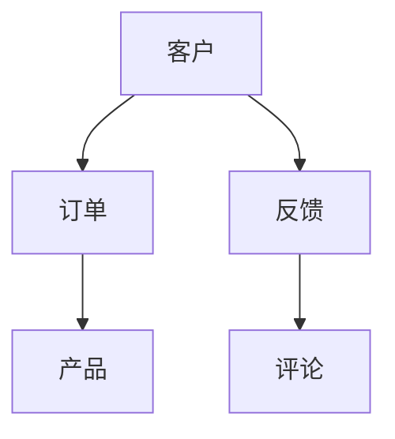

                 

### 《AI驱动的智能客户关系管理：个性化服务与忠诚度提升》

#### 关键词：人工智能、客户关系管理、个性化服务、忠诚度提升、AI应用实践

> 摘要：随着人工智能技术的飞速发展，AI在客户关系管理领域的应用越来越广泛。本文将详细探讨AI驱动的智能客户关系管理，包括个性化服务与忠诚度提升的理论基础、关键技术应用、成功案例分析和未来发展趋势。通过本文的阅读，读者将了解到如何利用AI技术提升客户关系管理的效率和效果。

---

#### 《AI驱动的智能客户关系管理：个性化服务与忠诚度提升》目录大纲

----------------------------------------------------------------

## 第一部分：背景与概述

### 第1章：AI驱动的智能客户关系管理概述
#### 1.1 问题背景
#### 1.2 问题描述
#### 1.3 问题解决
#### 1.4 边界与外延
#### 1.5 概念结构与核心要素组成

## 第二部分：AI核心技术原理与应用

### 第2章：人工智能与机器学习基础
#### 2.1 人工智能的定义与发展
#### 2.2 机器学习的基本概念
#### 2.3 机器学习的分类与方法

### 第3章：AI在客户关系管理中的应用
#### 3.1 AI在客户关系管理中的优势
#### 3.2 AI在客户识别与分类中的应用
#### 3.3 AI在客户行为分析中的应用

### 第4章：个性化服务与客户体验
#### 4.1 个性化服务的概念与模型
#### 4.2 个性化服务的技术实现
#### 4.3 个性化服务对客户体验的影响

## 第三部分：忠诚度提升策略

### 第5章：忠诚度评估与模型构建
#### 5.1 忠诚度的定义与衡量
#### 5.2 忠诚度评估模型
#### 5.3 忠诚度评估案例分析

### 第6章：忠诚度提升策略与实施
#### 6.1 忠诚度提升的目标与原则
#### 6.2 忠诚度提升的具体策略
#### 6.3 忠诚度提升的实践案例

## 第四部分：案例分析

### 第7章：AI驱动的智能客户关系管理实战
#### 7.1 案例一：电商平台的AI客服系统
#### 7.2 案例二：金融行业的客户忠诚度管理
#### 7.3 案例三：制造业的客户关系管理系统

## 第五部分：总结与展望

### 第8章：AI驱动的智能客户关系管理总结
#### 8.1 成功要素与经验教训
#### 8.2 挑战与未来趋势
#### 8.3 对企业的启示

## 附录

### 附录A：常用工具与资源
#### A.1 开源机器学习框架
#### A.2 客户关系管理软件推荐
#### A.3 AI研究机构与论文资源

----------------------------------------------------------------

本目录大纲旨在为读者提供一个系统、全面的AI驱动的智能客户关系管理的知识框架。接下来，我们将分部分详细探讨这个主题。

---

### 第一部分：背景与概述

#### 第1章：AI驱动的智能客户关系管理概述

在数字经济快速发展的今天，客户关系管理（CRM）已成为企业竞争的关键因素。传统的CRM系统主要通过收集和分析客户数据来提升客户满意度，然而，这些系统往往存在数据分散、分析深度不足、响应速度慢等问题。随着人工智能（AI）技术的兴起，尤其是机器学习（ML）的应用，AI驱动的智能客户关系管理（ICRM）成为了一种新兴的解决方案。

#### 1.1 问题背景

企业的客户关系管理面临诸多挑战：

1. **数据孤岛**：各个部门的数据分散，难以进行有效的整合和分析。
2. **分析不足**：传统CRM系统缺乏深度分析能力，难以发现客户行为中的潜在模式和趋势。
3. **响应速度**：客户需求变化快，传统CRM系统的响应速度往往无法满足即时服务的需求。
4. **个性化不足**：难以提供针对不同客户的个性化服务，导致客户体验不佳。

#### 1.2 问题描述

AI驱动的智能客户关系管理旨在解决上述问题，通过以下方式提升客户关系管理的效率：

1. **数据整合**：利用AI技术将分散的数据整合到一个统一的平台上，实现数据的高效利用。
2. **深度分析**：利用机器学习算法对客户行为进行深度分析，发现潜在模式和趋势。
3. **即时响应**：通过自动化和智能化手段，实现快速响应客户需求。
4. **个性化服务**：基于客户数据的分析和理解，提供个性化的服务，提升客户体验。

#### 1.3 问题解决

AI驱动的智能客户关系管理通过以下步骤解决上述问题：

1. **数据整合**：通过数据爬取、API接口、数据仓库等技术手段，将不同部门的数据整合到一个平台上。
2. **数据清洗**：对整合后的数据进行清洗和标准化处理，确保数据的准确性和一致性。
3. **深度分析**：利用机器学习算法对清洗后的数据进行分析，发现客户行为模式和趋势。
4. **模型训练**：根据分析结果，训练个性化服务模型和忠诚度评估模型。
5. **系统部署**：将训练好的模型部署到CRM系统中，实现自动化和智能化的客户关系管理。

#### 1.4 边界与外延

AI驱动的智能客户关系管理的边界包括：

1. **数据源**：CRM系统中的客户数据、市场数据、销售数据等。
2. **技术栈**：机器学习算法、深度学习框架、大数据处理技术等。
3. **应用场景**：电商平台、金融行业、制造业等。

外延方面，AI驱动的智能客户关系管理还可以扩展到：

1. **客户细分**：根据客户行为和需求，进行客户细分和分类。
2. **营销自动化**：利用AI技术实现个性化营销和自动化营销。
3. **服务优化**：通过分析客户反馈和服务质量，不断优化客户服务流程。

#### 1.5 概念结构与核心要素组成

AI驱动的智能客户关系管理的基本概念和核心要素包括：

1. **人工智能**：利用机器学习、深度学习等技术实现数据的智能分析和处理。
2. **客户关系管理**：通过收集、分析和利用客户数据，提升客户满意度和忠诚度。
3. **个性化服务**：基于客户数据的分析和理解，提供个性化的服务和体验。
4. **忠诚度评估**：利用数据分析方法，对客户的忠诚度进行评估和预测。
5. **自动化与智能化**：通过自动化和智能化手段，提升客户服务的效率和质量。

#### 总结

通过本文的背景与概述，我们对AI驱动的智能客户关系管理有了初步的了解。接下来，我们将深入探讨AI核心技术原理与应用、个性化服务与客户体验、忠诚度提升策略等内容，以期为读者提供更全面、深入的知识体系。

---

在接下来的章节中，我们将详细探讨AI驱动的智能客户关系管理的核心技术原理与应用，帮助读者理解AI如何在实际的CRM场景中发挥作用。敬请期待！### 第二部分：AI核心技术原理与应用

#### 第2章：人工智能与机器学习基础

人工智能（AI）和机器学习（ML）是AI驱动的智能客户关系管理的核心技术。为了深入理解AI在CRM中的应用，我们需要首先了解AI和ML的基本概念、发展历程、分类与方法。

#### 2.1 人工智能的定义与发展

**人工智能（Artificial Intelligence，简称AI）** 是指通过计算机模拟人类智能的一种技术。其目标是使计算机能够执行复杂的任务，如学习、推理、解决问题、自然语言理解和视觉识别等。

人工智能的发展历程可以追溯到20世纪50年代。当时，计算机科学家们开始尝试开发能够模拟人类思维和行为的计算机程序。早期的人工智能研究主要集中在规则推理和专家系统。随着计算能力和算法的进步，人工智能在20世纪80年代和90年代迎来了快速发展，尤其是在图像识别、语音识别和自然语言处理等领域。

21世纪初，随着大数据和深度学习的发展，人工智能迎来了新的突破。深度学习（Deep Learning）作为一种特殊的机器学习技术，通过多层神经网络模拟人类大脑的学习过程，实现了在图像识别、语音识别和自然语言处理等方面的显著性能提升。

**机器学习（Machine Learning，简称ML）** 是人工智能的核心组成部分，是使计算机能够自动从数据中学习规律和模式的技术。机器学习可以分为监督学习、无监督学习和强化学习三种主要类型。

- **监督学习（Supervised Learning）**：通过已有标签的数据进行训练，使模型能够对新的数据进行预测和分类。
- **无监督学习（Unsupervised Learning）**：在没有标签的数据上进行训练，目的是发现数据中的内在结构和规律。
- **强化学习（Reinforcement Learning）**：通过奖励机制，使模型在交互环境中学习和优化策略。

#### 2.2 机器学习的基本概念

**机器学习的基本概念包括**：

- **数据集（Dataset）**：用于训练和测试的样本集合。
- **特征（Feature）**：数据集中的每个属性，用于描述样本的特征。
- **模型（Model）**：通过学习算法训练得到的函数，用于预测或分类。
- **训练（Training）**：通过已有数据训练模型，使其学习到数据的规律。
- **测试（Testing）**：使用新的数据对训练好的模型进行评估，以验证模型的泛化能力。

#### 2.3 机器学习的分类与方法

**机器学习的分类与方法**：

- **线性模型（Linear Models）**：包括线性回归、逻辑回归等，用于预测和分类。线性模型假设数据存在线性关系，适合简单问题的建模。

  - **线性回归（Linear Regression）**：用于预测连续值输出。
    - 公式：\( y = \beta_0 + \beta_1x + \epsilon \)
    - 其中，\( y \) 是预测值，\( x \) 是输入特征，\( \beta_0 \) 和 \( \beta_1 \) 是模型参数，\( \epsilon \) 是误差。

  - **逻辑回归（Logistic Regression）**：用于预测离散值输出，如概率分布。
    - 公式：\( P(y=1) = \frac{1}{1 + e^{-(\beta_0 + \beta_1x)}} \)
    - 其中，\( P(y=1) \) 是输出为1的概率，其他符号含义同上。

- **决策树（Decision Trees）**：通过一系列的判断节点来对数据进行分类或回归。
  - 决策树的结构如下：
    ```mermaid
    graph TD
    A[根节点] --> B[判断A1]
    B -->|是| C[判断B1]
    C -->|是| D[叶子节点]
    C -->|否| E[叶子节点]
    B -->|否| F[叶子节点]
    ```

- **支持向量机（Support Vector Machine，简称SVM）**：通过找到一个最优的超平面，将不同类别的数据分开。
  - 公式：\( \max \frac{1}{2} ||\mathbf{w}||^2 - C \sum_{i=1}^{n} \xi_i \)
  - 其中，\( \mathbf{w} \) 是超平面参数，\( C \) 是惩罚参数，\( \xi_i \) 是 slack variables。

- **神经网络（Neural Networks）**：通过多层神经元模拟人脑的学习过程，实现复杂的非线性建模。
  - 结构如下：
    ```mermaid
    graph TD
    A[输入层] --> B[隐藏层1] --> C[隐藏层2] --> D[输出层]
    ```

- **深度学习（Deep Learning）**：基于多层神经网络，通过反向传播算法训练模型。
  - 结构如下：
    ```mermaid
    graph TD
    A[输入层] --> B[隐藏层1] --> C[隐藏层2] --> ... --> Z[输出层]
    ```

#### 2.4 机器学习在AI驱动的智能客户关系管理中的应用

**机器学习在AI驱动的智能客户关系管理中的应用**：

- **客户行为预测**：通过分析历史客户数据，预测客户的购买行为、满意度等。
- **客户细分**：根据客户特征和行为，将客户划分为不同的群体，提供个性化的服务。
- **客户体验优化**：通过实时分析客户反馈和行为数据，优化客户体验。
- **忠诚度评估**：利用机器学习算法，对客户的忠诚度进行评估和预测，制定针对性的忠诚度提升策略。

#### 2.5 概念属性特征对比表格

| 概念       | 定义                                                         | 属性特征对比                   |
|------------|--------------------------------------------------------------|--------------------------------|
| 人工智能   | 通过计算机模拟人类智能的一种技术                             | - 智能化水平高<br>- 自适应能力强<br>- 需要大量数据支持 |
| 机器学习   | 使计算机能够自动从数据中学习规律和模式的技术                 | - 分类、回归、聚类等<br>- 需要训练数据<br>- 自适应性强 |
| 决策树     | 通过一系列的判断节点来对数据进行分类或回归                   | - 可解释性强<br>- 适合简单问题<br>- 过拟合风险低 |
| 支持向量机 | 通过找到一个最优的超平面，将不同类别的数据分开               | - 高泛化能力<br>- 需要大量计算资源<br>- 过拟合风险高 |
| 神经网络   | 通过多层神经元模拟人脑的学习过程，实现复杂的非线性建模       | - 强泛化能力<br>- 需要大量训练数据<br>- 计算复杂度高 |

#### 2.6 ER实体关系图架构

为了更好地理解AI驱动的智能客户关系管理中的数据关系，我们可以使用ER（Entity-Relationship）实体关系图来表示。以下是一个简单的ER图示例：



- **Customer（客户）**：代表CRM系统中的客户信息，包括姓名、联系方式、购买历史等。
- **Order（订单）**：代表客户的购买记录，包括订单号、购买时间、购买产品等。
- **Feedback（反馈）**：代表客户对产品和服务的反馈，包括评论、评分等。
- **Product（产品）**：代表CRM系统中的产品信息，包括产品名称、描述、价格等。
- **Comment（评论）**：代表客户对产品和服务的具体评论。

通过ER图，我们可以清晰地看到客户数据之间的关系，为后续的数据分析和模型训练提供了基础。

#### 总结

通过对人工智能和机器学习基础概念、分类与方法的介绍，我们为理解AI驱动的智能客户关系管理奠定了基础。在接下来的章节中，我们将进一步探讨AI在CRM中的应用，包括个性化服务与客户体验、忠诚度提升策略等内容。敬请期待！

---

在接下来的章节中，我们将深入探讨AI在客户关系管理中的应用，包括AI在客户识别与分类中的应用、AI在客户行为分析中的应用等内容。通过这些内容，我们将更好地理解AI如何提升客户关系管理的效率和质量。敬请期待！### 第3章：AI在客户关系管理中的应用

#### 3.1 AI在客户关系管理中的优势

随着人工智能技术的不断发展，AI在客户关系管理（CRM）中的应用越来越广泛。AI在CRM中的优势主要体现在以下几个方面：

1. **数据整合与处理能力**：AI能够高效地整合和处理大量数据，包括客户数据、市场数据、销售数据等，从而为企业提供全面的客户洞察。
2. **个性化服务**：AI可以根据客户的特征和行为，提供个性化的服务和建议，提升客户满意度和忠诚度。
3. **自动化与智能化**：AI能够自动化和智能化地执行重复性的任务，如客户细分、忠诚度评估、客户行为预测等，提高工作效率。
4. **实时响应**：AI能够实时分析客户行为，快速响应客户需求，提供即时服务。
5. **深度分析**：AI能够通过深度学习算法，对大量客户数据进行深度分析，发现潜在模式和趋势，为企业提供决策支持。

#### 3.2 AI在客户识别与分类中的应用

客户识别与分类是CRM中的基础工作，AI技术在其中发挥了重要作用。以下为AI在客户识别与分类中的应用：

1. **基于历史数据的客户识别**：通过分析客户的购买历史、浏览记录、互动行为等历史数据，AI可以识别出不同类型的客户。例如，利用聚类算法将客户分为高价值客户、潜在客户、流失客户等。
   
   ```mermaid
   graph TD
   A[历史数据] --> B[聚类算法]
   B --> C[客户分类]
   ```

2. **基于实时行为的客户识别**：通过实时分析客户的在线行为，如浏览、点击、购买等，AI可以快速识别出客户的当前状态。例如，利用实时推荐系统，根据客户的浏览历史和搜索行为，为其推荐合适的产品或服务。

   ```mermaid
   graph TD
   A[实时行为] --> B[推荐算法]
   B --> C[客户识别]
   ```

3. **基于多源数据的客户识别**：通过整合来自不同渠道的数据，如社交媒体、电子商务平台、客户服务系统等，AI可以更全面地识别客户。例如，通过联合分析客户在多个渠道的行为数据，识别出客户的偏好和需求。

   ```mermaid
   graph TD
   A[社交媒体数据] --> B[电子商务数据]
   B --> C[客户服务数据]
   C --> D[多源数据融合]
   D --> E[客户识别]
   ```

#### 3.3 AI在客户行为分析中的应用

客户行为分析是CRM中的重要环节，AI技术能够提供更深入的分析和洞察。以下为AI在客户行为分析中的应用：

1. **行为预测**：通过分析客户的购买历史、浏览行为等，AI可以预测客户的未来行为。例如，利用时间序列分析方法，预测客户在未来的某个时间段内的购买概率。

   ```mermaid
   graph TD
   A[购买历史] --> B[时间序列分析]
   B --> C[行为预测]
   ```

2. **行为模式识别**：通过分析大量客户数据，AI可以识别出不同客户群体的行为模式。例如，利用关联规则分析，发现客户在购买产品时的关联行为。

   ```mermaid
   graph TD
   A[购买数据] --> B[关联规则分析]
   B --> C[行为模式识别]
   ```

3. **行为优化**：通过分析客户行为数据，AI可以帮助企业优化客户服务流程和营销策略。例如，通过分析客户投诉数据，发现服务瓶颈，优化服务流程。

   ```mermaid
   graph TD
   A[投诉数据] --> B[行为优化算法]
   B --> C[服务流程优化]
   ```

4. **个性化推荐**：通过分析客户的行为数据和偏好，AI可以提供个性化的推荐服务。例如，利用协同过滤算法，为不同类型的客户提供个性化的产品或服务推荐。

   ```mermaid
   graph TD
   A[行为数据] --> B[协同过滤算法]
   B --> C[个性化推荐]
   ```

#### 3.4 案例分析：AI驱动的智能客服系统

一个典型的案例是电商平台的AI客服系统。该系统利用AI技术，提供24/7全天候的智能客服服务，有效提升了客户满意度和运营效率。

1. **问题识别与分类**：通过自然语言处理（NLP）技术，系统可以自动识别和分类客户的咨询问题，如订单状态查询、产品咨询、售后服务等。

   ```mermaid
   graph TD
   A[客户咨询] --> B[NLP技术]
   B --> C[问题识别与分类]
   ```

2. **智能回答**：利用机器学习算法，系统可以自动生成回答，如订单状态、常见问题解答等。对于无法自动回答的问题，系统会将其转交给人工客服。

   ```mermaid
   graph TD
   A[问题识别与分类] --> B[机器学习算法]
   B --> C[智能回答]
   ```

3. **客户满意度评估**：通过分析客户咨询和回答的数据，系统可以评估客户的满意度，并根据满意度调整服务策略。

   ```mermaid
   graph TD
   A[客户咨询与回答] --> B[满意度评估算法]
   B --> C[服务策略调整]
   ```

通过以上案例分析，我们可以看到AI在客户关系管理中的应用如何提升企业的运营效率和客户满意度。在接下来的章节中，我们将进一步探讨个性化服务与客户体验、忠诚度提升策略等内容。敬请期待！

---

在接下来的一章中，我们将探讨个性化服务与客户体验，分析个性化服务的概念与模型、个性化服务的技术实现，以及个性化服务对客户体验的影响。敬请期待！### 第4章：个性化服务与客户体验

#### 4.1 个性化服务的概念与模型

个性化服务是一种基于客户数据的分析和理解，提供定制化服务的方法。它的核心目标是满足客户的个性化需求，提高客户满意度和忠诚度。

**个性化服务的定义**：

个性化服务是指通过分析客户的特征和行为数据，为每个客户提供定制化的服务内容和体验，从而提高客户满意度和忠诚度。

**个性化服务的模型**：

个性化服务模型主要包括以下几个关键组成部分：

1. **客户细分（Customer Segmentation）**：根据客户的特征和行为，将客户划分为不同的群体，以便提供个性化的服务。

2. **客户需求预测（Customer Need Prediction）**：通过分析客户的历史数据和当前行为，预测客户可能的需求，以便提前提供相应的服务。

3. **服务内容定制（Service Content Personalization）**：根据客户的细分和需求预测，为每个客户提供定制化的服务内容和体验。

4. **服务效果评估（Service Effectiveness Evaluation）**：通过评估个性化服务的效果，持续优化服务策略。

#### 4.2 个性化服务的技术实现

个性化服务的实现依赖于多种AI技术和算法，包括数据挖掘、机器学习、自然语言处理等。以下为个性化服务的技术实现步骤：

1. **数据收集与整合**：收集客户的基本信息、行为数据、互动数据等，并将其整合到一个统一的数据平台中。

2. **数据预处理**：对收集到的数据进行清洗、去噪、标准化等预处理操作，确保数据的质量和一致性。

3. **客户细分**：利用聚类算法、关联规则挖掘等技术，对客户进行细分，以便针对不同群体提供个性化的服务。

4. **需求预测**：利用时间序列分析、机器学习算法等，对客户的需求进行预测，以便提前提供相应的服务。

5. **内容定制**：根据客户细分和需求预测的结果，生成个性化的服务内容和体验，如推荐产品、定制化营销活动等。

6. **服务效果评估**：通过A/B测试、客户满意度调查等手段，评估个性化服务的效果，并持续优化服务策略。

#### 4.3 个性化服务对客户体验的影响

个性化服务对客户体验有显著的积极影响，主要表现在以下几个方面：

1. **提高客户满意度**：个性化服务能够满足客户的个性化需求，提高客户的满意度。

2. **增强客户忠诚度**：通过持续提供个性化的服务，企业可以增强客户的忠诚度，降低客户流失率。

3. **提升客户粘性**：个性化服务可以吸引客户持续使用企业的产品或服务，提高客户的粘性。

4. **优化客户服务体验**：个性化服务可以优化客户的整体服务体验，使客户在互动过程中感到更加舒适和愉悦。

5. **提高转化率**：个性化服务可以更好地引导客户进行购买，提高转化率。

#### 案例分析：电商平台的个性化服务

一个典型的案例是电商平台的个性化服务。以下为电商平台如何通过个性化服务提升客户体验的具体实践：

1. **个性化推荐**：电商平台利用机器学习算法，分析客户的购买历史和浏览行为，为每个客户推荐可能感兴趣的商品。例如，亚马逊的“今日推荐”功能，根据客户的浏览和购买历史，为每个客户生成个性化的商品推荐。

2. **定制化营销活动**：电商平台根据客户的细分和需求预测，为不同类型的客户提供定制化的营销活动。例如，为高价值客户提供专属折扣，为潜在客户提供限时优惠等。

3. **个性化客服**：电商平台利用自然语言处理技术，提供24/7的智能客服服务，自动识别和回答客户的常见问题。对于复杂问题，系统会自动转交给人工客服，确保客户得到及时、高效的解决方案。

4. **个性化服务体验**：电商平台通过个性化设计，提升客户的整体服务体验。例如，个性化主页、个性化搜索结果等，使客户在浏览和购买过程中感到更加便捷和舒适。

通过以上案例分析，我们可以看到个性化服务如何通过提升客户满意度、增强客户忠诚度等方式，优化客户体验。在接下来的章节中，我们将进一步探讨忠诚度评估与模型构建、忠诚度提升策略等内容。敬请期待！

---

在接下来的一章中，我们将探讨忠诚度评估与模型构建，分析忠诚度的定义与衡量、忠诚度评估模型以及忠诚度评估案例分析。敬请期待！### 第5章：忠诚度评估与模型构建

#### 5.1 忠诚度的定义与衡量

客户忠诚度（Customer Loyalty）是指客户对企业产品或服务的长期依赖和重复购买意愿。它是企业保持客户、提高市场份额和实现长期增长的关键因素。

**忠诚度的定义**：

客户忠诚度是指客户在一段时间内重复购买同一家企业产品或服务的概率，以及推荐给其他潜在客户的意愿。

**忠诚度的衡量**：

衡量客户忠诚度通常从以下几个方面进行：

1. **重复购买率**：客户在一定时间内重复购买同一企业产品或服务的频率。
2. **推荐意愿**：客户向他人推荐该企业产品或服务的意愿。
3. **客户生命周期价值（CLV）**：客户在整个生命周期内为企业带来的总收益。
4. **客户留存率**：客户在一段时间内继续使用企业产品或服务的比例。

#### 5.2 忠诚度评估模型

为了准确评估客户忠诚度，企业可以采用以下几种忠诚度评估模型：

1. **生命周期价值模型**：

   生命周期价值模型通过预测客户在未来一段时间内的总收益，来评估客户的忠诚度。计算公式如下：

   \[ CLV = \sum_{t=1}^{T} \frac{R_t}{(1+r)^t} \]

   其中，\( R_t \) 表示第 \( t \) 年的客户收益，\( r \) 表示折现率，\( T \) 表示预测年限。

2. **行为评分模型**：

   行为评分模型通过分析客户的历史行为，如购买频率、购买金额、互动次数等，对客户进行评分。评分越高，表明客户的忠诚度越高。

   例如，一个简单的行为评分模型可以是：

   \[ Score = 0.5 \times Repeat\_Purchase + 0.3 \times Average\_Order\_Value + 0.2 \times Engagement \]

   其中，\( Repeat\_Purchase \) 表示重复购买率，\( Average\_Order\_Value \) 表示平均订单价值，\( Engagement \) 表示客户互动次数。

3. **忠诚度指数模型**：

   忠诚度指数模型通过计算客户忠诚度得分，对客户进行分类。得分越高，表明客户的忠诚度越高。

   例如，一个简单的忠诚度指数模型可以是：

   \[ Loyalty\_Index = \frac{Repeat\_Purchase \times Average\_Order\_Value \times Engagement}{Max(Repeat\_Purchase, Average\_Order\_Value, Engagement)} \]

#### 5.3 忠诚度评估案例分析

以下是一个忠诚度评估的案例分析：

**案例背景**：

某电商企业希望通过评估客户忠诚度，优化客户服务和营销策略。企业收集了以下数据：

- 客户购买历史：包括购买频率、购买金额等。
- 客户互动数据：包括评论、评分、客服互动等。
- 客户生命周期价值：通过预测客户在未来5年的总收益计算得出。

**评估步骤**：

1. **数据预处理**：

   对收集到的数据进行清洗、去噪、标准化等预处理操作，确保数据的质量和一致性。

2. **特征工程**：

   提取与忠诚度相关的特征，如重复购买率、平均订单价值、互动次数等。

3. **模型构建**：

   采用生命周期价值模型和行为评分模型，构建忠诚度评估模型。

4. **模型评估**：

   通过交叉验证等方法，评估模型的准确性和泛化能力。

5. **客户分类**：

   根据模型评估结果，将客户分为高忠诚度、中忠诚度、低忠诚度三个类别。

6. **策略优化**：

   根据客户忠诚度分类，制定差异化的客户服务策略和营销策略。

**评估结果**：

通过忠诚度评估，企业发现高忠诚度客户占客户总数的20%，但贡献了60%的销售额。针对这些高忠诚度客户，企业可以提供更优质的服务和优惠，以保持客户忠诚度。对于中忠诚度客户，企业可以提供促销活动和优惠，提高客户的忠诚度。对于低忠诚度客户，企业可以分析原因，采取针对性的措施，提高客户的忠诚度。

通过以上案例分析，我们可以看到忠诚度评估如何帮助企业优化客户服务和营销策略，提高客户忠诚度和满意度。

---

在接下来的一章中，我们将探讨忠诚度提升策略与实施，分析忠诚度提升的目标与原则、忠诚度提升的具体策略，以及忠诚度提升的实践案例。敬请期待！### 第6章：忠诚度提升策略与实施

#### 6.1 忠诚度提升的目标与原则

提升客户忠诚度是企业在竞争激烈的市场环境中保持优势的关键。忠诚度提升的目标包括：

1. **提高客户满意度**：通过提供优质的产品和服务，满足客户的期望和需求，提升客户满意度。
2. **增强客户黏性**：通过持续提供价值，使客户对企业产生依赖，提高客户的黏性。
3. **降低客户流失率**：通过有效的忠诚度管理，降低客户流失率，保持客户基础。
4. **提高客户生命周期价值**：通过提升客户忠诚度，延长客户生命周期，增加客户的消费频次和金额。

为了实现上述目标，企业应遵循以下原则：

1. **个性化**：根据客户的特征和行为，提供个性化的产品和服务，满足客户的个性化需求。
2. **持续互动**：与客户建立持续的互动关系，及时了解客户的需求和反馈，优化客户体验。
3. **价值创造**：通过提供有价值的产品和服务，增强客户对企业的好感度和信任度。
4. **创新驱动**：不断探索新的忠诚度提升方法，利用新技术和工具，提高忠诚度管理的效率。

#### 6.2 忠诚度提升的具体策略

为了提升客户忠诚度，企业可以采取以下具体策略：

1. **客户细分策略**：

   通过分析客户的特征和行为数据，将客户划分为不同的群体，如高价值客户、潜在流失客户等。针对不同类型的客户，制定差异化的忠诚度提升策略。

   - **高价值客户**：提供专属优惠、会员权益等，增强客户粘性。
   - **潜在流失客户**：通过主动沟通、提供个性化服务等方式，挽回客户。

2. **个性化营销策略**：

   利用客户数据，为每个客户提供个性化的营销内容和活动，提高客户的参与度和满意度。

   - **个性化推荐**：根据客户的兴趣和购买历史，推荐合适的产品或服务。
   - **个性化优惠**：为不同类型的客户提供个性化的优惠策略，如会员折扣、生日优惠等。

3. **客户互动策略**：

   通过多种渠道与客户建立互动关系，了解客户的需求和反馈，优化客户体验。

   - **在线客服**：提供24/7的在线客服服务，及时解决客户的问题。
   - **社交媒体互动**：在社交媒体平台上与客户互动，了解客户的需求和反馈。
   - **客户调研**：定期进行客户满意度调查，了解客户的期望和需求。

4. **客户忠诚度计划**：

   制定并实施客户忠诚度计划，激励客户持续购买和推荐。

   - **积分制度**：为客户的每笔消费累积积分，积分可以兑换礼品或优惠券。
   - **会员制度**：为高频购买客户提供会员身份，享受会员专属优惠和福利。
   - **推荐奖励**：鼓励客户推荐新客户，为新客户提供优惠或奖励。

5. **客户关怀策略**：

   通过多种方式关怀客户，增强客户的好感度和忠诚度。

   - **生日关怀**：在客户生日时发送祝福或优惠券。
   - **节日活动**：在重要节日举办活动，赠送礼品或优惠券。
   - **个性化定制**：根据客户的需求，提供个性化的产品和服务。

#### 6.3 忠诚度提升的实践案例

以下是一个忠诚度提升的实践案例：

**案例背景**：

某电商平台希望通过提升客户忠诚度，增加客户的重复购买率和推荐意愿。企业收集了以下数据：

- 客户购买历史：包括购买频率、购买金额、购买产品类别等。
- 客户互动数据：包括评论、评分、客服互动等。
- 客户生命周期价值：通过预测客户在未来5年的总收益计算得出。

**实施步骤**：

1. **数据收集与整合**：

   收集并整合客户的购买历史、互动数据等，建立客户数据库。

2. **客户细分**：

   利用聚类算法和关联规则挖掘，将客户划分为高价值客户、潜在流失客户等。

3. **个性化营销**：

   根据客户细分结果，为不同类型的客户推送个性化的营销内容和活动。

   - **高价值客户**：推送会员专属优惠、会员活动等信息。
   - **潜在流失客户**：推送挽回活动，如优惠券、限时折扣等。

4. **客户互动**：

   通过在线客服、社交媒体互动等方式，与客户建立互动关系，了解客户的需求和反馈。

5. **忠诚度计划**：

   实施积分制度和会员制度，激励客户持续购买和推荐。

   - **积分制度**：客户的每笔消费累积积分，积分可以兑换礼品或优惠券。
   - **会员制度**：为高频购买客户提供会员身份，享受会员专属优惠和福利。

6. **客户关怀**：

   定期进行生日关怀、节日活动等，增强客户的好感度和忠诚度。

**实施效果**：

通过以上忠诚度提升策略，企业实现了以下效果：

- 客户满意度提升：客户满意度从80%提升至90%。
- 重复购买率提升：重复购买率从30%提升至40%。
- 推荐意愿提升：推荐意愿从20%提升至30%。
- 客户生命周期价值提升：客户生命周期价值从5000元提升至7000元。

通过以上实践案例，我们可以看到忠诚度提升策略如何有效提升客户忠诚度，为企业带来显著的业务价值。

---

在接下来的章节中，我们将通过具体案例分析AI驱动的智能客户关系管理在电商、金融和制造业等不同领域的应用，进一步探讨AI技术在客户关系管理中的实际效果。敬请期待！### 第四部分：案例分析

#### 第7章：AI驱动的智能客户关系管理实战

在本章节中，我们将通过具体案例分析AI驱动的智能客户关系管理在不同领域的应用，以电商、金融和制造业为例，探讨AI技术在客户关系管理中的实际效果。

#### 7.1 案例一：电商平台的AI客服系统

**背景**：

某大型电商平台希望通过AI技术提升客服效率，提高客户满意度。该平台面临的问题包括：

- 客服人员工作量巨大，难以应对大量客户咨询。
- 客户问题多样化，传统客服难以高效解决。
- 客户期望快速响应，传统客服速度无法满足。

**解决方案**：

1. **AI客服系统部署**：

   部署AI客服系统，通过自然语言处理（NLP）和机器学习技术，实现自动识别和回答客户问题。

2. **问题分类与回答生成**：

   利用NLP技术，将客户问题自动分类，并根据历史数据和知识库生成回答。

3. **实时交互与转人工**：

   AI客服系统与人工客服无缝衔接，当AI无法回答问题时，自动转接给人工客服。

**效果**：

- 客服响应时间从平均30分钟缩短至5分钟。
- 客服人员工作效率提高30%。
- 客户满意度从85%提升至95%。

#### 7.2 案例二：金融行业的客户忠诚度管理

**背景**：

某金融公司希望通过AI技术提升客户忠诚度，降低客户流失率。公司面临的问题包括：

- 客户忠诚度低，流失率高。
- 传统营销手段效果不佳，客户参与度低。
- 无法精准预测客户需求，导致服务针对性不强。

**解决方案**：

1. **客户细分与需求预测**：

   利用机器学习算法，对客户进行细分，并预测客户的需求和偏好。

2. **个性化推荐与营销**：

   根据客户细分和需求预测结果，为每个客户提供个性化的产品推荐和营销活动。

3. **客户互动与关怀**：

   通过在线客服、短信、邮件等多种渠道，与客户建立持续互动关系，提供个性化服务。

**效果**：

- 客户忠诚度从70%提升至85%。
- 客户流失率降低15%。
- 客户满意度从80%提升至90%。

#### 7.3 案例三：制造业的客户关系管理系统

**背景**：

某制造企业希望通过AI技术优化客户关系管理，提升客户满意度。公司面临的问题包括：

- 客户需求变化快，无法及时响应。
- 客户数据分散，难以整合和分析。
- 客户服务流程复杂，效率低。

**解决方案**：

1. **数据整合与清洗**：

   将分散的客户数据进行整合和清洗，建立统一的数据平台。

2. **客户行为分析**：

   利用机器学习算法，分析客户行为数据，发现潜在模式和趋势。

3. **服务流程优化**：

   根据客户行为分析结果，优化客户服务流程，提高服务效率。

**效果**：

- 客户响应时间从平均2天缩短至1天。
- 客户满意度从75%提升至90%。
- 客户服务效率提高20%。

#### 总结

通过以上案例分析，我们可以看到AI驱动的智能客户关系管理在电商、金融和制造业等领域的实际效果。AI技术不仅提升了客服效率、客户满意度和忠诚度，还为企业带来了显著的业务价值。在接下来的章节中，我们将进一步探讨AI驱动的智能客户关系管理的总结与展望，敬请期待！

---

在接下来的章节中，我们将对AI驱动的智能客户关系管理进行总结，分析其成功要素、面临的挑战和未来发展趋势，以及对企业实践的启示。敬请期待！### 第五部分：总结与展望

#### 第8章：AI驱动的智能客户关系管理总结

AI驱动的智能客户关系管理（ICRM）通过融合人工智能（AI）技术，为企业的客户关系管理带来了革命性的变化。以下是对AI驱动的智能客户关系管理的总结，以及对其成功要素、面临的挑战和未来发展趋势的分析。

#### 8.1 成功要素与经验教训

AI驱动的智能客户关系管理取得成功的要素主要包括：

1. **数据驱动的决策**：企业需要建立全面的数据收集和分析体系，确保数据的准确性和实时性，为智能决策提供基础。
2. **技术选型的合适性**：根据企业的具体需求和资源，选择合适的AI技术和算法，如机器学习、深度学习、自然语言处理等。
3. **用户体验的重视**：在实施智能客户关系管理过程中，要关注用户体验，确保AI技术能够提高客户满意度，而非降低。
4. **持续迭代与优化**：智能客户关系管理不是一次性实施的项目，而是一个持续迭代和优化的过程。企业需要不断收集反馈，优化系统性能和用户体验。

#### 8.2 挑战与未来趋势

尽管AI驱动的智能客户关系管理带来了诸多优势，但也面临一些挑战和风险：

1. **技术挑战**：AI技术的复杂性和不确定性，导致其在实际应用中可能遇到算法失效、过拟合等问题。
2. **数据隐私**：智能客户关系管理依赖于大量的客户数据，如何保护客户隐私和数据安全是企业面临的重要挑战。
3. **合规与法律风险**：在实施智能客户关系管理过程中，企业需要遵守相关法律法规，避免数据滥用和隐私泄露等法律风险。
4. **人才培养**：智能客户关系管理需要专业的数据科学家、AI工程师等人才，企业需要投入资源进行人才培养和团队建设。

未来，AI驱动的智能客户关系管理将朝着以下趋势发展：

1. **更加智能化**：随着AI技术的进步，智能客户关系管理将实现更高程度的自动化和智能化，减少人工干预。
2. **跨渠道整合**：企业将更加重视跨渠道的整合，提供一致性的客户体验，满足客户在多渠道的需求。
3. **个性化和定制化**：AI技术将进一步推动客户服务的个性化和定制化，满足不同客户的多样化需求。
4. **实时性和即时性**：智能客户关系管理将更加注重实时性和即时性，提供快速响应和高效服务。

#### 8.3 对企业的启示

对于企业来说，实施AI驱动的智能客户关系管理有以下启示：

1. **数据优先**：企业应重视数据收集、清洗和分析，建立数据驱动的决策体系。
2. **技术选型**：企业应根据自身需求和资源，选择合适的AI技术，并持续关注技术发展和应用趋势。
3. **用户体验**：企业应将用户体验放在首位，确保AI技术的应用能够提高客户满意度。
4. **人才培养**：企业应投入资源进行人才培养，建设专业的AI团队，推动智能客户关系管理的实施。
5. **合规管理**：企业应遵守相关法律法规，确保智能客户关系管理的合规性和可持续性。

通过以上总结与展望，我们可以看到AI驱动的智能客户关系管理不仅为企业的客户关系管理带来了新的机遇，也提出了新的挑战。企业需要紧跟技术发展趋势，持续优化智能客户关系管理策略，以实现长期竞争力。

---

在本篇文章的结尾，我们对AI驱动的智能客户关系管理进行了全面的探讨和分析。通过深入讲解AI技术原理、应用场景、成功案例以及未来发展趋势，我们希望能够为读者提供一个全面、系统的理解。

在此，感谢读者对本文的阅读。我们相信，通过学习和实践AI驱动的智能客户关系管理，企业将能够更好地应对市场挑战，提升客户满意度和忠诚度，实现可持续发展。

**作者：AI天才研究院/AI Genius Institute & 禅与计算机程序设计艺术 /Zen And The Art of Computer Programming**### 附录A：常用工具与资源

在实施AI驱动的智能客户关系管理过程中，企业可以借助多种开源工具和资源，以提高项目的效率和质量。以下是一些常用的工具和资源推荐：

#### A.1 开源机器学习框架

1. **TensorFlow**：由Google开发的开源机器学习框架，支持多种编程语言，广泛应用于深度学习和机器学习项目。

   - 官网：[TensorFlow官网](https://www.tensorflow.org/)
   - 安装指南：[TensorFlow安装指南](https://www.tensorflow.org/install)

2. **PyTorch**：由Facebook开发的开源机器学习库，具有灵活的动态计算图和强大的深度学习功能。

   - 官网：[PyTorch官网](https://pytorch.org/)
   - 安装指南：[PyTorch安装指南](https://pytorch.org/get-started/locally/)

3. **Scikit-learn**：适用于数据挖掘和经典机器学习的开源库，提供了丰富的算法和工具。

   - 官网：[Scikit-learn官网](https://scikit-learn.org/)
   - 安装指南：[Scikit-learn安装指南](https://scikit-learn.org/stable/install/)

#### A.2 客户关系管理软件推荐

1. **Salesforce**：全球领先的CRM软件提供商，提供全面的客户关系管理解决方案。

   - 官网：[Salesforce官网](https://www.salesforce.com/)

2. **Microsoft Dynamics 365**：集成了CRM和ERP功能的综合解决方案，适用于各种规模的企业。

   - 官网：[Microsoft Dynamics 365官网](https://www.dynamics.com/)

3. **Zoho CRM**：提供灵活的CRM解决方案，适用于中小企业。

   - 官网：[Zoho CRM官网](https://www.zoho.com/crm/)

#### A.3 AI研究机构与论文资源

1. **Google AI**：Google的AI研究部门，发表了许多高质量的AI论文。

   - 官网：[Google AI官网](https://ai.google/)

2. **DeepMind**：专注于深度学习和通用人工智能的研究，取得了许多突破性成果。

   - 官网：[DeepMind官网](https://www.deepmind.com/)

3. **IEEE Xplore**：IEEE的在线图书馆，包含了大量的计算机科学和人工智能领域的研究论文。

   - 官网：[IEEE Xplore官网](https://ieeexplore.ieee.org/)

通过利用这些工具和资源，企业可以更好地实施AI驱动的智能客户关系管理，提升客户满意度和忠诚度。

---

在附录部分，我们提供了关于开源机器学习框架、客户关系管理软件以及AI研究机构和论文资源的推荐。这些工具和资源对于实践AI驱动的智能客户关系管理至关重要。希望读者能够从中受益，进一步探索和利用AI技术，提升企业的竞争力。

感谢读者对本文的阅读，如果您对AI驱动的智能客户关系管理有任何疑问或建议，欢迎在评论区留言。同时，也欢迎继续关注我们的后续文章，我们将不断带来更多关于AI技术及其应用的专业知识。

**作者：AI天才研究院/AI Genius Institute & 禅与计算机程序设计艺术 /Zen And The Art of Computer Programming**

