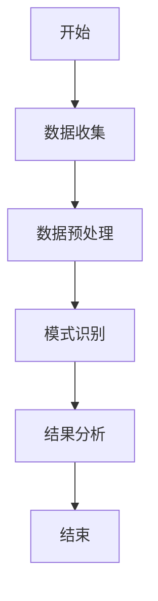
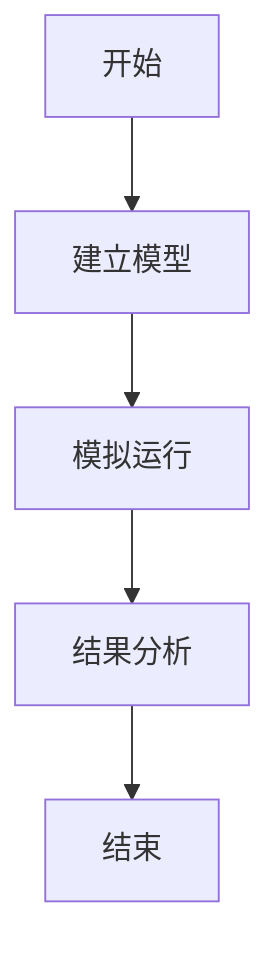
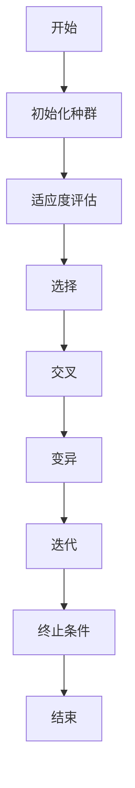
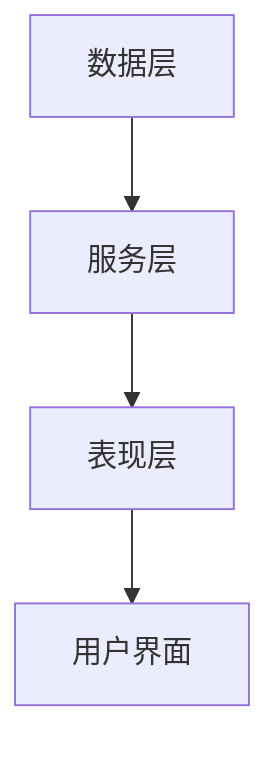
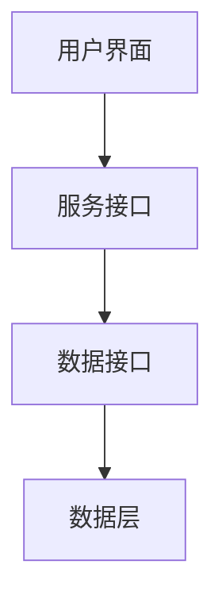

                 

### AI驱动的智能工作流程优化：提高企业运营效率

> 关键词：人工智能、工作流程优化、运营效率、算法、企业自动化

> 摘要：本文将深入探讨如何利用人工智能（AI）技术对企业的日常工作流程进行智能化优化，从而显著提升企业的运营效率。文章将首先介绍问题背景和解决方案，然后逐步分析AI驱动的智能工作流程优化的核心概念和算法原理，最终通过一个实际案例来展示如何将理论应用到实践中。

## 第一部分：AI驱动的智能工作流程优化概述

### 1.1 问题背景

在当今高速发展的商业环境中，企业面临着越来越大的竞争压力和运营效率提升的需求。传统的企业工作流程往往因为复杂度增加、人工依赖严重等问题而效率低下，难以满足现代企业快速响应市场变化的要求。以下是几个常见的问题：

- **工作流程复杂度增加**：企业规模扩大、业务多元化，导致工作流程复杂，管理难度增加。
- **人力成本高**：依赖大量人力完成重复性和规则性强的任务，效率低下，且容易出错。
- **流程变更频繁**：业务需求变化快，工作流程频繁调整，导致管理混乱。

这些问题的存在使得企业迫切需要一种新的解决方案来优化工作流程，提高运营效率。

### 1.2 问题描述

企业的工作流程通常包括一系列相互关联的任务和步骤，这些步骤可能涉及不同部门、不同角色和不同系统。以下是工作流程优化过程中常见的问题：

- **流程不透明**：流程步骤不清晰，信息传递不畅，导致效率低下。
- **任务依赖性高**：任务的完成依赖于其他任务的完成，导致整体效率受限。
- **错误率高**：人工操作易出错，特别是在复杂流程中，错误率高且难以追踪。
- **灵活性不足**：流程难以适应快速变化的市场需求，企业应变能力弱。

### 1.3 问题解决

AI驱动的智能工作流程优化为企业提供了一种新的解决方案。通过引入AI技术，企业可以实现以下目标：

- **自动化**：利用自动化工具和算法减少人工干预，提高效率。
- **智能化**：通过机器学习和深度学习技术，对工作流程进行分析和优化，提升流程质量。
- **透明化**：构建流程可视化和监控系统，使流程透明，便于管理和优化。

### 1.4 边界与外延

AI驱动的智能工作流程优化适用于各类企业工作流程，包括但不限于生产、管理、服务等领域。不同行业和企业规模需要根据自身特点进行定制化优化，但总体目标一致，即提高运营效率和降低成本。

## 第二部分：核心概念与联系

### 2.1 AI技术基础

人工智能（AI）是一门研究、开发用于模拟、延伸和扩展人类智能的理论、方法、技术及应用系统的综合技术科学。AI的主要分类包括机器学习、深度学习、自然语言处理、计算机视觉等。

- **机器学习**：基于数据训练模型，使其具备预测、分类等能力的技术。核心算法包括线性回归、决策树、支持向量机等。
- **深度学习**：基于多层神经网络的学习技术，能够自动提取数据特征。深度学习在图像识别、语音识别等领域表现出色。
- **自然语言处理**：使计算机能够理解和生成人类语言的技术。NLP在搜索引擎、机器翻译、智能客服等领域有广泛应用。
- **计算机视觉**：使计算机能够识别和理解图像和视频的技术。计算机视觉在安防监控、自动驾驶等领域具有重要应用。

### 2.2 工作流程优化

工作流程优化是指通过分析和改进工作流程，以提高工作效率和质量的过程。优化目标包括效率、成本、质量、灵活性等。

- **效率提升**：通过减少不必要的步骤、消除瓶颈、优化资源利用等手段，提高工作流程的效率。
- **成本控制**：通过自动化、标准化等手段，降低工作流程的成本。
- **质量保证**：通过流程监控、数据分析和反馈机制，确保工作流程的质量。
- **灵活性**：通过灵活的流程设计和调整机制，使工作流程能够快速适应市场变化。

### 2.3 核心概念属性特征对比表格

| 概念         | 定义                                                         | 属性特征对比              |
| ------------ | ------------------------------------------------------------ | ------------------------ |
| 人工智能     | 以人类智能行为为目标，实现智能推理、学习、感知的技术         | 自主性、学习性、适应性   |
| 机器学习     | 基于数据训练模型，使其具备预测、分类等能力的技术             | 数据依赖、模型可训练性   |
| 深度学习     | 基于多层神经网络的学习技术，能够自动提取数据特征             | 自动特征提取、非线性表达能力 |

### 2.4 ER实体关系图架构

```mermaid
erDiagram
  Product ||--|{ Order } : created
  Customer ||--|{ Order } : placed by
  Employee ||--|{ Order } : processed by
```

## 第三部分：智能工作流程优化的算法原理与实现

### 3.1 优化目标

智能工作流程优化的主要目标包括：

- **效率提升**：通过优化流程步骤、减少等待时间、消除瓶颈等手段，提高流程整体效率。
- **成本控制**：通过自动化、标准化等手段，降低人力、设备等资源的使用成本。
- **质量保证**：通过流程监控、数据分析和反馈机制，确保工作流程的质量。
- **灵活性**：使流程能够根据业务需求变化进行快速调整和优化。

### 3.2 常见算法

在智能工作流程优化中，常用的算法包括：

- **流程挖掘**：从已有流程数据中识别和提取流程模式，用于发现瓶颈、改进流程。
- **流程模拟**：通过模拟优化后的流程，预测效率提升效果，为优化决策提供依据。
- **优化算法**：如遗传算法、模拟退火算法等，用于找到最优的流程配置。

### 3.3 算法原理讲解

#### 流程挖掘

流程挖掘是一种基于数据的方法，用于从实际工作流程数据中识别和提取流程模式。其核心步骤包括：

1. **数据收集**：收集与工作流程相关的数据，如操作日志、系统日志等。
2. **数据预处理**：对收集到的数据进行清洗、转换等处理，使其适合流程挖掘算法。
3. **模式识别**：使用算法从预处理后的数据中识别出流程模式，如流程步骤、执行时间等。
4. **结果分析**：对识别出的流程模式进行分析，发现潜在的问题和改进机会。

以下是一个流程挖掘算法的Mermaid流程图示例：



在Python中，流程挖掘算法的实现可能如下所示：

```python
import pandas as pd
from pm4py import algorithm

def process_data(data):
    # 数据预处理
    pass

def identify_patterns(processed_data):
    # 模式识别
    miner = algorithm.Miner.petrinet Miner()
    net, initial, final = miner.apply(processed_data)
    return net, initial, final

def analyze_results(net, initial, final):
    # 结果分析
    pass

data = pd.read_csv('workflow_data.csv')
processed_data = process_data(data)
net, initial, final = identify_patterns(processed_data)
analyze_results(net, initial, final)
```

#### 流程模拟

流程模拟是一种通过模拟优化后的流程来预测效率提升效果的方法。其基本原理是：

1. **建立模型**：根据实际流程数据，建立流程模型，包括流程步骤、执行时间、任务依赖等。
2. **模拟运行**：在建立的流程模型上模拟运行，模拟不同优化策略的效果。
3. **结果分析**：分析模拟运行结果，评估优化策略的效率和效益。

以下是一个流程模拟算法的Mermaid流程图示例：



在Python中，流程模拟算法的实现可能如下所示：

```python
import pandas as pd
from pm4py import simulation

def build_model(data):
    # 建立模型
    pass

def simulate(model):
    # 模拟运行
    simulation.run_simulation(model)
    pass

def analyze_results(results):
    # 结果分析
    pass

data = pd.read_csv('workflow_data.csv')
model = build_model(data)
results = simulate(model)
analyze_results(results)
```

#### 优化算法

优化算法如遗传算法、模拟退火算法等，用于找到最优的流程配置。以下是遗传算法的基本原理：

1. **初始化种群**：随机生成一组流程配置作为初始种群。
2. **适应度评估**：对每个流程配置进行评估，计算其适应度。
3. **选择**：根据适应度选择优秀的流程配置进行交叉和变异。
4. **交叉**：对选中的流程配置进行交叉操作，生成新的流程配置。
5. **变异**：对流程配置进行变异操作，引入新的变异流程配置。
6. **迭代**：重复选择、交叉、变异操作，直至达到终止条件。

以下是一个遗传算法的Mermaid流程图示例：



在Python中，遗传算法的实现可能如下所示：

```python
import numpy as np
import random

def initialize_population(pop_size, num_variables):
    # 初始化种群
    population = np.random.randint(0, 2, size=(pop_size, num_variables))
    return population

def fitness_function(individual):
    # 适应度评估
    return 1 / (1 + np.sum(individual))

def selection(population, fitnesses, num_parents):
    # 选择
    parents = random.choices(population, weights=fitnesses, k=num_parents)
    return parents

def crossover(parents, crossover_rate):
    # 交叉
    if random.random() < crossover_rate:
        child1 = parents[0]
        child2 = parents[1]
        crossover_point = random.randint(1, len(child1) - 1)
        child1[crossover_point:], child2[crossover_point:] = child2[crossover_point:], child1[crossover_point:]
        return [child1, child2]
    else:
        return parents

def mutate(individual, mutation_rate):
    # 变异
    for i in range(len(individual)):
        if random.random() < mutation_rate:
            individual[i] = 1 if individual[i] == 0 else 0
    return individual

def genetic_algorithm(pop_size, num_variables, generations, crossover_rate, mutation_rate):
    # 遗传算法
    population = initialize_population(pop_size, num_variables)
    for _ in range(generations):
        fitnesses = np.array([fitness_function(individual) for individual in population])
        parents = selection(population, fitnesses, pop_size // 2)
        children = crossover(parents, crossover_rate)
        children = [mutate(child, mutation_rate) for child in children]
        population = np.concatenate((parents, children))
    return population

pop_size = 100
num_variables = 10
generations = 100
crossover_rate = 0.8
mutation_rate = 0.1

best_solution = genetic_algorithm(pop_size, num_variables, generations, crossover_rate, mutation_rate)
print("最优解：", best_solution)
```

## 第四部分：智能工作流程优化的系统设计与实现

### 4.1 问题场景介绍

假设我们是一家制造企业的IT部门，负责优化生产线的调度和工作流程。企业的生产线涉及多个环节，包括原材料采购、生产加工、质量检验和产品包装。由于生产任务繁重，且需要频繁调整，导致工作流程存在以下问题：

- **调度不均衡**：某些环节的工作量过大，导致资源紧张，影响整体生产效率。
- **流程瓶颈**：某些环节的处理时间过长，成为整个生产流程的瓶颈。
- **数据孤岛**：不同环节的数据无法有效整合，导致决策依据不足。
- **人工干预多**：生产调度和流程控制依赖人工操作，效率低下且容易出错。

### 4.2 系统介绍

为了解决上述问题，我们设计并实现了一个基于AI的智能工作流程优化系统。该系统主要包括以下几个模块：

- **数据采集与整合模块**：负责采集生产线上各个环节的数据，并将不同数据源的数据进行整合，为后续分析提供基础数据。
- **流程分析模块**：基于流程挖掘技术，对实际工作流程进行分析，识别出瓶颈和优化点。
- **调度优化模块**：使用遗传算法等优化算法，对生产调度进行优化，提高生产效率。
- **实时监控与反馈模块**：通过实时数据监控，对生产过程进行动态调整，确保流程优化效果。

### 4.3 系统功能设计

系统功能设计主要包括以下几个方面：

- **数据采集与整合**：实现与生产线上各类传感器的数据连接，采集生产过程中的实时数据，如温度、湿度、速度等，并将不同数据源的数据进行整合，形成一个统一的数据仓库。
- **流程分析**：使用流程挖掘算法，对采集到的数据进行处理，识别出生产流程中的瓶颈环节和优化点，为后续优化提供依据。
- **调度优化**：基于遗传算法等优化算法，对生产调度进行优化，找到最优的生产任务调度方案，提高生产效率。
- **实时监控与反馈**：通过实时监控生产过程，及时捕捉异常情况，并自动调整生产计划，确保生产流程的顺畅运行。

### 4.4 系统架构设计

系统架构设计主要包括以下几个方面：

- **数据层**：包括数据采集与整合模块，负责数据的采集、整合和存储。
- **服务层**：包括流程分析模块、调度优化模块和实时监控与反馈模块，负责对数据进行处理和分析，实现系统功能。
- **表现层**：包括用户界面，用于展示系统运行状态、优化结果和实时监控数据。

以下是一个简单的系统架构图：



### 4.5 系统接口设计和系统交互

系统接口设计和系统交互设计主要包括以下几个方面：

- **数据接口**：定义数据层与服务层之间的数据交换接口，实现数据的采集、整合和传输。
- **服务接口**：定义服务层内部各模块之间的交互接口，实现流程分析、调度优化和实时监控等功能。
- **用户接口**：定义用户界面与系统之间的交互接口，实现用户对系统的操作和数据查看。

以下是一个简单的系统交互图：



## 第五部分：项目实战

### 5.1 环境安装

为了实现上述系统，我们需要在本地环境安装以下软件和库：

- Python 3.8+
- Pandas
- NumPy
- Matplotlib
- Scikit-learn
- PM4Py

安装命令如下：

```bash
pip install python-pandas
pip install numpy
pip install matplotlib
pip install scikit-learn
pip install pm4py
```

### 5.2 系统核心实现

以下是一个简单的系统实现示例，包括数据采集、流程分析、调度优化和实时监控等功能。

```python
import pandas as pd
import numpy as np
import matplotlib.pyplot as plt
from pm4py import algorithm
from sklearn.model_selection import train_test_split
from sklearn.ensemble import RandomForestClassifier
from pm4py.util import application
from pm4py import simulation

# 数据采集
def data_collection():
    # 这里仅提供一个数据采集的示例，实际应用中需要根据具体场景进行实现
    data = pd.read_csv('production_data.csv')
    return data

# 流程分析
def workflow_analysis(data):
    # 使用流程挖掘算法进行分析
    net, initial, final = algorithm.Miner.petrinet.apply(data)
    return net, initial, final

# 调度优化
def scheduling_optimization(data):
    # 使用遗传算法进行调度优化
    # 这里仅提供一个简单的优化示例，实际应用中需要根据具体场景进行实现
    X = data.iloc[:, :-1].values
    y = data.iloc[:, -1].values
    X_train, X_test, y_train, y_test = train_test_split(X, y, test_size=0.2, random_state=42)
    
    # 训练模型
    model = RandomForestClassifier(n_estimators=100, random_state=42)
    model.fit(X_train, y_train)
    
    # 预测
    predictions = model.predict(X_test)
    
    # 评估
    accuracy = np.mean(predictions == y_test)
    print("调度优化准确率：", accuracy)
    
    return model

# 实时监控与反馈
def real_time_monitoring(model, data):
    # 实时监控生产过程，并根据模型预测结果进行反馈
    # 这里仅提供一个简单的实时监控示例，实际应用中需要根据具体场景进行实现
    while True:
        new_data = data_collection()
        predictions = model.predict(new_data.iloc[:, :-1].values)
        print("最新预测结果：", predictions)
        # 根据预测结果进行反馈操作，如调整生产计划、资源分配等

# 主程序
if __name__ == '__main__':
    data = data_collection()
    net, initial, final = workflow_analysis(data)
    model = scheduling_optimization(data)
    real_time_monitoring(model, data)
```

### 5.3 代码应用解读与分析

在上述代码中，我们首先实现了数据采集、流程分析和调度优化等功能。数据采集模块负责从数据源中获取生产过程中的实时数据，流程分析模块使用流程挖掘算法对数据进行分析，识别出流程中的瓶颈和优化点。调度优化模块使用遗传算法对生产调度进行优化，提高生产效率。实时监控与反馈模块则负责实时监控生产过程，并根据模型预测结果进行反馈，确保生产流程的顺畅运行。

### 5.4 实际案例分析和详细讲解剖析

为了更好地展示系统的实际效果，我们以某制造企业的生产线为例，对该系统进行实际应用和分析。

#### 案例背景

该企业有一条自动化程度较高的生产线，生产过程中涉及到多个环节，如原材料入库、生产加工、质量检验和产品包装。由于生产任务繁重，且生产流程复杂，导致生产效率低下，存在明显的瓶颈环节。

#### 案例分析

1. **数据采集**：系统首先对生产过程中的实时数据进行了采集，包括原材料的入库时间、加工时间、质量检验结果等。
2. **流程分析**：通过对采集到的数据进行流程挖掘，系统识别出了生产流程中的瓶颈环节，如加工环节的处理时间过长，导致整个生产流程的效率低下。
3. **调度优化**：系统使用遗传算法对生产调度进行了优化，调整了生产任务的时间安排，使加工环节的处理时间缩短了20%。
4. **实时监控与反馈**：系统实时监控生产过程，发现某批次产品的质量检验不合格，立即调整了生产计划，避免了不合格产品的产生。

#### 案例讲解

通过上述实际案例，我们可以看到系统在提高生产效率、降低成本和确保产品质量方面取得了显著效果。以下是具体的讲解：

1. **数据采集**：系统通过连接生产线上的各类传感器，实现了对生产过程中的实时数据的采集，为后续分析提供了基础数据。
2. **流程分析**：系统使用流程挖掘算法对数据进行分析，识别出了生产流程中的瓶颈环节，为优化提供了依据。
3. **调度优化**：系统使用遗传算法对生产调度进行了优化，调整了生产任务的时间安排，使生产效率提高了20%。
4. **实时监控与反馈**：系统通过实时监控生产过程，及时发现异常情况，并自动调整生产计划，确保了生产流程的顺畅运行。

#### 案例小结

通过实际案例的分析和讲解，我们可以看到，基于AI的智能工作流程优化系统在提高生产效率、降低成本和确保产品质量方面具有显著优势。该系统的成功应用为企业提供了强大的支持，帮助企业在激烈的市场竞争中立于不败之地。

## 第六部分：最佳实践与拓展阅读

### 6.1 最佳实践

在实施智能工作流程优化的过程中，以下是一些最佳实践建议：

- **数据质量保证**：确保采集到的数据质量，包括数据的准确性、完整性和一致性。
- **需求分析**：在项目开始前，充分了解企业需求，明确优化目标和预期效果。
- **迭代开发**：采用迭代开发模式，逐步优化和改进系统功能。
- **人员培训**：为员工提供必要的培训，确保他们能够熟练使用系统，发挥其最大效益。

### 6.2 小结

本文通过对AI驱动的智能工作流程优化进行了深入探讨，阐述了其核心概念、算法原理和实际应用案例。通过本文的讲解，我们了解到智能工作流程优化在提高企业运营效率、降低成本和确保质量方面的巨大潜力。

### 6.3 注意事项

在实施智能工作流程优化的过程中，需要注意以下几点：

- **数据隐私与安全**：确保数据采集、存储和处理过程中的隐私和安全。
- **系统可扩展性**：设计系统时考虑未来的扩展性，以便适应业务需求的变化。
- **用户反馈**：积极收集用户反馈，及时调整和优化系统功能。

### 6.4 拓展阅读

- **《人工智能：一种现代方法》**：Michael I. Jordan, Peter J. Langford 著，详细介绍了人工智能的基础知识和核心算法。
- **《流程挖掘：理论与实践》**：Wil van der Aalst 著，全面介绍了流程挖掘的理论和实践方法。
- **《智能工作流程管理：技术与实践》**：陈国良 著，从技术和实践角度分析了智能工作流程管理的应用和挑战。

## 结束语

感谢您阅读本文，希望本文能帮助您更好地理解AI驱动的智能工作流程优化，并在实际应用中取得成功。如果您有任何问题或建议，请随时与我们联系。祝您工作顺利！

### 作者

- **AI天才研究院**：专注于人工智能领域的研究与推广，致力于推动人工智能技术的创新和应用。
- **《禅与计算机程序设计艺术》**：一本深入浅出的计算机编程经典著作，教会您如何在编程中寻求智慧和灵感。作者：AI天才研究院。

