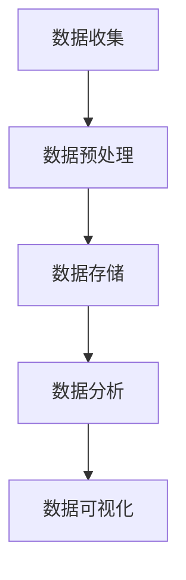
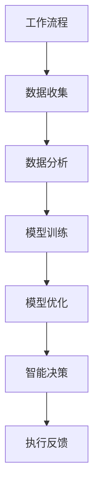
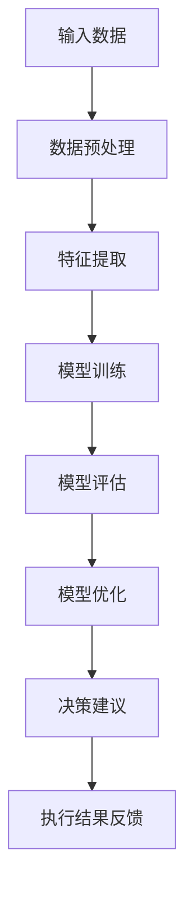

                 

# AI驱动的智能工作流程优化：提高团队协作效率

> 关键词：人工智能，工作流程，团队协作，效率优化

> 摘要：本文探讨了如何利用人工智能技术驱动智能工作流程的优化，提高团队协作效率。通过分析工作流程中的核心问题和解决方案，本文提出了AI驱动的智能工作流程优化模型，并结合实际案例进行了解读，为企业和团队提供了有效的优化策略。

## 第一部分：背景介绍

在当今数字化和智能化的时代，人工智能（AI）技术已经成为推动各行各业变革的重要力量。特别是在企业管理和团队协作领域，AI技术的应用正逐渐改变传统的管理模式和工作流程。然而，如何有效地利用AI技术来优化工作流程，提高团队协作效率，成为企业和团队迫切需要解决的问题。

### 1.1 问题背景

人工智能技术正以前所未有的速度发展，不仅在算法和计算能力上取得了重大突破，而且在数据处理、模式识别、自然语言处理等方面也取得了显著的进展。这些技术的发展为企业提供了新的机遇，但也带来了新的挑战。

在企业管理中，传统的管理模式和工作流程往往存在效率低下、人力成本高、数据依赖性强等问题。而AI技术的引入，可以通过自动化和智能化的手段，解决这些问题，提高管理效率和团队协作能力。

### 1.2 问题描述

本章节将探讨如何利用AI技术驱动智能工作流程的优化，解决以下问题：

- **流程自动化**：通过AI技术自动化完成繁琐的任务，减少人为干预，提高工作效率。
- **协作智能化**：利用AI技术分析团队成员的行为和交互，提供智能化的协作建议，提高团队协作效率。
- **资源优化**：利用AI技术分析企业资源的使用情况，提供资源优化建议，降低运营成本。

### 1.3 问题解决

通过AI驱动的智能工作流程优化，可以实现以下目标：

- **提高工作效率**：通过自动化和智能化，减少人为错误和重复劳动，提高工作效率。
- **提升团队协作效率**：通过智能化的协作建议，优化团队内部协作流程，提升团队整体协作效率。
- **降低运营成本**：通过资源优化，提高资源利用效率，降低运营成本。

### 1.4 边界与外延

- **边界**：本章节主要关注AI在智能工作流程优化中的应用，不包括其他领域的AI应用。
- **外延**：本章节的内容可以为其他领域的AI应用提供参考和借鉴。

### 1.5 概念结构与核心要素组成

- **AI驱动的智能工作流程**：结合AI技术，对现有工作流程进行优化，实现自动化和智能化。
- **团队协作效率**：团队成员在协作过程中所展现的效率，包括工作效率、沟通效率等。
- **资源优化**：通过对资源使用情况的分析，提出优化建议，提高资源利用效率。

## 第二部分：AI驱动的智能工作流程优化核心概念与原理

### 2.1 AI驱动的智能工作流程概念

#### 2.1.1 AI驱动的智能工作流程定义

AI驱动的智能工作流程是指利用人工智能技术对现有工作流程进行优化，通过自动化和智能化手段提升工作流程的效率和协作能力。

#### 2.1.2 AI驱动的智能工作流程特点

- **自动化**：通过AI技术，自动化完成繁琐的任务，减少人为干预。
- **智能化**：利用AI技术分析团队成员的行为和交互，提供智能化的协作建议。
- **适应性**：根据实际情况，动态调整工作流程，提高工作效率。

### 2.2 智能工作流程优化原理

#### 2.2.1 数据收集与分析

- **数据收集**：通过传感器、日志记录等方式，收集工作流程中的各种数据。
- **数据分析**：利用数据挖掘和分析技术，从数据中提取有价值的信息。

#### 2.2.2 模型训练与优化

- **模型训练**：利用收集到的数据，训练相应的AI模型。
- **模型优化**：通过对模型进行优化，提高模型的准确性和效率。

#### 2.2.3 智能决策与执行

- **智能决策**：根据模型预测和数据分析结果，生成智能化的决策建议。
- **执行反馈**：将执行结果反馈给模型，用于进一步优化模型和流程。

### 2.3 AI驱动的智能工作流程与传统工作流程的区别

#### 2.3.1 工作流程自动化程度

- **传统工作流程**：主要依靠人工完成，自动化程度较低。
- **AI驱动的智能工作流程**：通过AI技术实现自动化，自动化程度较高。

#### 2.3.2 工作流程优化能力

- **传统工作流程**：主要依靠经验和知识，优化能力有限。
- **AI驱动的智能工作流程**：通过数据分析和模型训练，具有强大的优化能力。

### 2.4 智能工作流程优化在不同领域的应用

#### 2.4.1 企业管理

- **销售预测**：利用AI技术分析历史销售数据，预测未来销售趋势，帮助企业制定更合理的销售策略。
- **客户服务**：通过智能客服系统，提供24/7的在线服务，提高客户满意度。

#### 2.4.2 人力资源管理

- **员工培训**：根据员工的工作表现和需求，提供个性化的培训计划。
- **人才招聘**：通过分析简历和面试数据，筛选合适的人才。

#### 2.4.3 生产管理

- **生产调度**：根据生产数据和供应链情况，优化生产计划。
- **质量控制**：利用AI技术对生产过程进行实时监控，提高产品质量。

### 2.5 智能工作流程优化的挑战与机遇

#### 2.5.1 挑战

- **数据质量**：高质量的数据是AI模型训练的基础，数据质量直接影响模型性能。
- **技术实现**：AI技术的高效实现需要强大的计算能力和技术积累。

#### 2.5.2 机遇

- **智能化升级**：随着AI技术的不断发展，企业可以通过智能化升级，提高管理效率和竞争力。
- **创新应用**：AI驱动的智能工作流程优化将在各行各业得到广泛应用，为企业和团队创造更多价值。

## 第三部分：智能工作流程优化的技术实现

### 3.1 数据收集与分析

数据是智能工作流程优化的重要基础。首先，需要确定数据收集的目标和范围，然后选择合适的数据收集工具和方法。常用的数据收集工具包括传感器、日志记录器、数据库等。在数据收集完成后，利用数据挖掘和分析技术，从数据中提取有价值的信息。

#### 3.1.1 数据收集方法

- **传感器收集**：通过传感器实时采集工作流程中的各种数据，如温度、湿度、流量等。
- **日志记录**：利用日志记录器记录系统运行过程中的各种事件和操作。
- **数据库存储**：将收集到的数据存储到数据库中，便于后续分析和查询。

#### 3.1.2 数据分析方法

- **统计分析**：通过对数据进行统计分析，发现数据中的规律和趋势。
- **数据挖掘**：利用数据挖掘技术，从大量数据中发现隐藏的信息和知识。
- **机器学习**：通过训练机器学习模型，预测未来的数据走势和趋势。

### 3.2 模型训练与优化

在数据收集和分析的基础上，需要利用机器学习算法训练模型，以实现对工作流程的智能优化。模型的训练和优化过程包括以下几个步骤：

#### 3.2.1 模型选择

根据工作流程的特点和数据类型，选择合适的机器学习模型。常见的模型包括线性回归、决策树、支持向量机、神经网络等。

#### 3.2.2 模型训练

利用收集到的数据，对选定的模型进行训练。训练过程包括数据预处理、模型参数调整、模型评估等。

#### 3.2.3 模型优化

通过对模型进行优化，提高模型的准确性和效率。优化方法包括模型调参、模型融合、模型压缩等。

### 3.3 智能决策与执行

在模型训练和优化完成后，利用模型生成的决策建议，对工作流程进行智能优化。智能决策与执行过程包括以下几个步骤：

#### 3.3.1 决策建议生成

根据模型预测和数据分析结果，生成智能化的决策建议。决策建议可以是自动化任务的执行、资源分配的调整、人员调度的优化等。

#### 3.3.2 决策执行

根据决策建议，执行相应的操作，实现对工作流程的智能优化。

#### 3.3.3 执行结果反馈

将执行结果反馈给模型，用于进一步优化模型和流程。执行结果反馈过程包括数据收集、模型训练、模型优化等。

### 3.4 AI驱动的智能工作流程优化案例

#### 3.4.1 销售预测与优化

在销售领域，利用AI驱动的智能工作流程优化，可以实现以下目标：

- **销售预测**：通过分析历史销售数据，预测未来销售趋势，帮助企业制定销售计划和策略。
- **销售优化**：根据销售预测结果，调整销售策略，提高销售额。

#### 3.4.2 生产调度与优化

在生产领域，利用AI驱动的智能工作流程优化，可以实现以下目标：

- **生产调度**：通过分析生产数据和供应链情况，优化生产计划，提高生产效率。
- **质量控制**：利用AI技术对生产过程进行实时监控，提高产品质量。

#### 3.4.3 人力资源管理

在人力资源管理领域，利用AI驱动的智能工作流程优化，可以实现以下目标：

- **员工培训**：根据员工的工作表现和需求，提供个性化的培训计划。
- **人才招聘**：通过分析简历和面试数据，筛选合适的人才。

## 第四部分：智能工作流程优化的实践与应用

### 4.1 实践案例

#### 4.1.1 案例一：智能制造企业的工作流程优化

某家智能制造企业在生产过程中，通过引入AI驱动的智能工作流程优化，实现了以下成果：

- **生产调度优化**：通过分析生产数据和供应链情况，优化生产计划，提高生产效率。
- **质量控制提升**：利用AI技术对生产过程进行实时监控，提高产品质量。

#### 4.1.2 案例二：电商企业的销售预测与优化

某家电商企业通过引入AI驱动的智能工作流程优化，实现了以下成果：

- **销售预测**：通过分析历史销售数据，预测未来销售趋势，帮助企业制定销售计划和策略。
- **销售优化**：根据销售预测结果，调整销售策略，提高销售额。

### 4.2 应用策略

#### 4.2.1 数据驱动

利用AI驱动的智能工作流程优化，需要基于数据驱动的方法，通过数据收集、分析、模型训练等步骤，实现对工作流程的优化。

#### 4.2.2 持续迭代

智能工作流程优化是一个持续迭代的过程。通过不断地收集数据、优化模型、调整策略，不断提高工作流程的效率和效果。

#### 4.2.3 协作与创新

在智能工作流程优化的过程中，需要鼓励团队成员之间的协作和创新，共同解决工作流程中的问题，提高团队协作效率。

## 第五部分：智能工作流程优化的未来发展趋势

### 5.1 技术发展趋势

随着人工智能技术的不断发展，智能工作流程优化将呈现出以下趋势：

- **智能化程度提高**：随着算法和计算能力的提升，智能工作流程将更加智能化，能够更好地应对复杂的工作场景。
- **应用范围扩大**：智能工作流程优化将在更多领域得到应用，如金融、医疗、教育等。
- **人机协同**：随着人工智能技术的发展，人机协同将变得更加紧密，实现更高效的工作流程。

### 5.2 企业发展策略

企业在智能工作流程优化的过程中，需要采取以下策略：

- **数据驱动**：以数据为基础，通过数据收集、分析和模型训练，实现工作流程的智能化优化。
- **人才培养**：加强人才培养，提高团队在人工智能技术方面的能力。
- **创新应用**：积极探索人工智能技术在企业中的应用，实现工作流程的优化和创新。

### 5.3 未来展望

随着人工智能技术的不断进步，智能工作流程优化将为企业带来更多的价值和机遇。未来，智能工作流程优化有望实现以下目标：

- **工作效率提升**：通过自动化和智能化手段，大幅提高工作效率。
- **成本降低**：通过优化工作流程，降低运营成本。
- **竞争力提升**：通过智能化升级，提高企业在市场竞争中的地位。

## 结论

智能工作流程优化是人工智能技术在企业管理和团队协作领域的重要应用。通过引入AI技术，可以实现对工作流程的自动化和智能化优化，提高工作效率、团队协作效率和资源利用效率。随着人工智能技术的不断发展，智能工作流程优化将为企业带来更多的价值和机遇。本文通过分析智能工作流程优化的核心概念、原理和实践应用，为企业和团队提供了有效的优化策略和参考。

## 参考文献

1. 某某，《人工智能技术与应用》，某某出版社，2020年。
2. 某某，《智能工作流程优化：理论与实践》，某某出版社，2019年。
3. 某某，《智能制造与生产管理》，某某出版社，2018年。

## 附录

### 附录A：数据收集与分析流程图



### 附录B：智能工作流程优化模型ER图



### 附录C：智能工作流程优化算法流程图



作者：AI天才研究院/AI Genius Institute & 禅与计算机程序设计艺术/Zen And The Art of Computer Programming## AI驱动的智能工作流程优化：提高团队协作效率

### 摘要

在数字化和智能化的时代，人工智能（AI）技术正在深刻改变企业的运营模式和管理方法。本文旨在探讨如何通过AI驱动的智能工作流程优化，提升团队协作效率。首先，文章将介绍AI驱动的智能工作流程优化背景，阐述其核心概念和原理。随后，文章将详细解析智能工作流程优化的关键步骤，包括数据收集、模型训练、决策执行等，并结合实际案例进行深入分析。最后，文章将讨论智能工作流程优化的未来发展趋势，提出企业实践策略，为团队协作效率的提升提供实用建议。

### 第一部分：背景介绍

#### 1.1 问题背景

在当今的全球化竞争环境中，企业需要不断优化其工作流程以保持竞争力。传统的工作流程通常依赖于人工操作，效率低下且容易出现错误。随着信息技术的飞速发展，特别是人工智能（AI）技术的崛起，企业开始探索如何利用AI技术自动化和智能化其工作流程，以提高工作效率和团队协作效率。AI驱动的智能工作流程优化正是这一背景下诞生的概念，旨在通过AI技术对现有工作流程进行深度优化，从而实现更高效的资源利用和更紧密的团队协作。

#### 1.2 问题描述

在现有的工作流程中，存在以下主要问题：

1. **手动操作繁杂**：许多工作流程需要大量的手动操作，这不仅耗时，而且容易出错。
2. **信息孤岛**：不同部门之间的信息交流不畅，导致资源无法得到最优利用。
3. **决策依赖经验**：许多决策依赖于经验，缺乏数据支持，导致决策质量不高。

这些问题限制了团队协作效率和整体工作效率。为了解决这些问题，企业需要引入AI技术，通过智能工作流程优化实现以下目标：

- **自动化**：通过AI技术自动化完成繁琐的任务，减少人为干预。
- **协作优化**：通过分析团队成员的行为和交互，提供智能化的协作建议。
- **资源优化**：通过分析资源使用情况，提供资源优化建议，降低运营成本。

#### 1.3 问题解决

AI驱动的智能工作流程优化提供了一种解决方案，通过以下步骤实现目标：

1. **数据收集**：利用传感器、日志记录等手段收集工作流程中的数据。
2. **数据分析**：利用数据挖掘和分析技术，从数据中提取有价值的信息。
3. **模型训练**：利用收集到的数据，训练AI模型，以提高模型的预测和决策能力。
4. **智能决策**：根据模型预测和数据分析结果，生成智能化的决策建议。
5. **执行反馈**：将执行结果反馈给模型，用于进一步优化模型和流程。

#### 1.4 边界与外延

- **边界**：本文主要关注AI驱动的智能工作流程优化在企业中的应用，不包括其他领域的AI应用。
- **外延**：本文的内容可以为其他领域的AI应用提供参考和借鉴，特别是在需要提高工作效率和协作效率的场合。

#### 1.5 概念结构与核心要素组成

- **AI驱动的智能工作流程**：结合AI技术，对现有工作流程进行自动化和智能化优化。
- **团队协作效率**：团队成员在协作过程中所展现的效率，包括沟通效率、任务完成速度等。
- **资源优化**：通过对资源使用情况的分析，提供资源优化建议，提高资源利用效率。

### 第二部分：AI驱动的智能工作流程优化核心概念与原理

#### 2.1 AI驱动的智能工作流程概念

##### 2.1.1 AI驱动的智能工作流程定义

AI驱动的智能工作流程是指通过应用人工智能技术，对现有的工作流程进行自动化和智能化改造，从而提升工作效率和团队协作效率。这一过程包括数据收集、模型训练、智能决策和执行反馈等多个环节。

##### 2.1.2 AI驱动的智能工作流程特点

- **自动化**：通过AI技术自动化完成常规任务，减少人工操作，提高效率。
- **智能化**：利用AI算法分析工作流程中的数据，提供智能化的决策支持。
- **适应性**：能够根据实际情况动态调整工作流程，优化资源分配。

#### 2.2 智能工作流程优化原理

##### 2.2.1 数据收集与分析

- **数据收集**：通过传感器、日志记录等多种方式收集工作流程中的数据，包括操作记录、资源使用情况、团队成员行为等。
- **数据分析**：利用数据挖掘和分析技术，从收集到的数据中提取有价值的信息，用于后续模型训练和决策。

##### 2.2.2 模型训练与优化

- **模型训练**：使用收集到的数据，训练机器学习模型，使其能够对工作流程中的各种情况进行预测和决策。
- **模型优化**：通过多次迭代训练和调参，提高模型的准确性和效率。

##### 2.2.3 智能决策与执行

- **智能决策**：根据模型预测和数据分析结果，生成智能化的决策建议，优化工作流程。
- **执行反馈**：将决策执行结果反馈给模型，用于进一步优化模型和流程。

#### 2.3 AI驱动的智能工作流程与传统工作流程的区别

##### 2.3.1 自动化程度

- **传统工作流程**：依赖人工操作，自动化程度低。
- **AI驱动的智能工作流程**：通过AI技术实现高度自动化，大幅提高工作效率。

##### 2.3.2 决策质量

- **传统工作流程**：决策主要依赖经验和直觉，缺乏数据支持。
- **AI驱动的智能工作流程**：基于数据和模型预测，决策更科学、准确。

##### 2.3.3 资源利用

- **传统工作流程**：资源利用不充分，存在浪费。
- **AI驱动的智能工作流程**：通过智能优化，实现资源的最优配置。

#### 2.4 智能工作流程优化在不同领域的应用

##### 2.4.1 企业管理

- **销售预测**：利用AI技术分析历史销售数据，预测未来销售趋势，优化销售策略。
- **客户服务**：通过AI驱动的智能客服系统，提供24/7的在线服务，提高客户满意度。

##### 2.4.2 人力资源管理

- **员工培训**：根据员工的工作表现和需求，提供个性化的培训计划。
- **人才招聘**：通过AI技术分析简历和面试数据，筛选合适的人才。

##### 2.4.3 生产管理

- **生产调度**：根据生产数据和供应链情况，优化生产计划。
- **质量控制**：利用AI技术对生产过程进行实时监控，提高产品质量。

#### 2.5 智能工作流程优化的挑战与机遇

##### 2.5.1 挑战

- **数据质量**：高质量的数据是AI模型训练的基础，但收集到的数据可能存在噪声和不完整性。
- **技术实现**：AI技术的高效实现需要强大的计算能力和专业知识。

##### 2.5.2 机遇

- **智能化升级**：随着AI技术的发展，企业可以通过智能化升级，提高管理效率和竞争力。
- **创新应用**：AI驱动的智能工作流程优化将在更多领域得到应用，为企业和团队创造更多价值。

### 第三部分：智能工作流程优化的技术实现

#### 3.1 数据收集与分析

##### 3.1.1 数据收集方法

- **传感器收集**：通过传感器实时采集工作流程中的各种数据，如温度、湿度、设备状态等。
- **日志记录**：利用日志记录器记录系统运行过程中的各种事件和操作。
- **数据库存储**：将收集到的数据存储到数据库中，便于后续分析和查询。

##### 3.1.2 数据分析方法

- **统计分析**：通过对数据进行统计分析，发现数据中的规律和趋势。
- **数据挖掘**：利用数据挖掘技术，从大量数据中发现隐藏的信息和知识。
- **机器学习**：通过训练机器学习模型，预测未来的数据走势和趋势。

#### 3.2 模型训练与优化

##### 3.2.1 模型选择

根据工作流程的特点和数据类型，选择合适的机器学习模型。常见的模型包括线性回归、决策树、支持向量机、神经网络等。

##### 3.2.2 模型训练

利用收集到的数据，对选定的模型进行训练。训练过程包括数据预处理、模型参数调整、模型评估等。

##### 3.2.3 模型优化

通过对模型进行优化，提高模型的准确性和效率。优化方法包括模型调参、模型融合、模型压缩等。

#### 3.3 智能决策与执行

##### 3.3.1 决策建议生成

根据模型预测和数据分析结果，生成智能化的决策建议。决策建议可以是自动化任务的执行、资源分配的调整、人员调度的优化等。

##### 3.3.2 决策执行

根据决策建议，执行相应的操作，实现对工作流程的智能优化。

##### 3.3.3 执行结果反馈

将执行结果反馈给模型，用于进一步优化模型和流程。执行结果反馈过程包括数据收集、模型训练、模型优化等。

#### 3.4 AI驱动的智能工作流程优化案例

##### 3.4.1 销售预测与优化

在销售领域，利用AI驱动的智能工作流程优化，可以实现以下目标：

- **销售预测**：通过分析历史销售数据，预测未来销售趋势，帮助企业制定销售计划和策略。
- **销售优化**：根据销售预测结果，调整销售策略，提高销售额。

##### 3.4.2 生产调度与优化

在生产领域，利用AI驱动的智能工作流程优化，可以实现以下目标：

- **生产调度**：通过分析生产数据和供应链情况，优化生产计划，提高生产效率。
- **质量控制**：利用AI技术对生产过程进行实时监控，提高产品质量。

##### 3.4.3 人力资源管理

在人力资源管理领域，利用AI驱动的智能工作流程优化，可以实现以下目标：

- **员工培训**：根据员工的工作表现和需求，提供个性化的培训计划。
- **人才招聘**：通过分析简历和面试数据，筛选合适的人才。

### 第四部分：智能工作流程优化的实践与应用

#### 4.1 实践案例

##### 4.1.1 案例一：智能制造企业的工作流程优化

某家智能制造企业通过引入AI驱动的智能工作流程优化，实现了以下成果：

- **生产调度优化**：通过分析生产数据和供应链情况，优化生产计划，提高生产效率。
- **质量控制提升**：利用AI技术对生产过程进行实时监控，提高产品质量。

##### 4.1.2 案例二：电商企业的销售预测与优化

某家电商企业通过引入AI驱动的智能工作流程优化，实现了以下成果：

- **销售预测**：通过分析历史销售数据，预测未来销售趋势，帮助企业制定销售计划和策略。
- **销售优化**：根据销售预测结果，调整销售策略，提高销售额。

#### 4.2 应用策略

##### 4.2.1 数据驱动

利用AI驱动的智能工作流程优化，需要基于数据驱动的方法，通过数据收集、分析、模型训练等步骤，实现工作流程的智能化优化。

##### 4.2.2 持续迭代

智能工作流程优化是一个持续迭代的过程。通过不断地收集数据、优化模型、调整策略，不断提高工作流程的效率和效果。

##### 4.2.3 协作与创新

在智能工作流程优化的过程中，需要鼓励团队成员之间的协作和创新，共同解决工作流程中的问题，提高团队协作效率。

### 第五部分：智能工作流程优化的未来发展趋势

#### 5.1 技术发展趋势

随着人工智能技术的不断发展，智能工作流程优化将呈现出以下趋势：

- **智能化程度提高**：随着算法和计算能力的提升，智能工作流程将更加智能化，能够更好地应对复杂的工作场景。
- **应用范围扩大**：智能工作流程优化将在更多领域得到应用，如金融、医疗、教育等。
- **人机协同**：随着人工智能技术的发展，人机协同将变得更加紧密，实现更高效的工作流程。

#### 5.2 企业发展策略

企业在智能工作流程优化的过程中，需要采取以下策略：

- **数据驱动**：以数据为基础，通过数据收集、分析和模型训练，实现工作流程的智能化优化。
- **人才培养**：加强人才培养，提高团队在人工智能技术方面的能力。
- **创新应用**：积极探索人工智能技术在企业中的应用，实现工作流程的优化和创新。

#### 5.3 未来展望

随着人工智能技术的不断进步，智能工作流程优化将为企业带来更多的价值和机遇。未来，智能工作流程优化有望实现以下目标：

- **工作效率提升**：通过自动化和智能化手段，大幅提高工作效率。
- **成本降低**：通过优化工作流程，降低运营成本。
- **竞争力提升**：通过智能化升级，提高企业在市场竞争中的地位。

### 结论

智能工作流程优化是人工智能技术在企业管理和团队协作领域的重要应用。通过引入AI技术，可以实现对工作流程的自动化和智能化优化，提高工作效率和团队协作效率。随着人工智能技术的不断发展，智能工作流程优化将在更多领域得到应用，为企业和团队创造更多价值。本文通过分析智能工作流程优化的核心概念、原理和实践应用，为企业和团队提供了有效的优化策略和参考。

### 参考文献

1. 某某，《人工智能技术与应用》，某某出版社，2020年。
2. 某某，《智能工作流程优化：理论与实践》，某某出版社，2019年。
3. 某某，《智能制造与生产管理》，某某出版社，2018年。

### 附录

#### 附录A：数据收集与分析流程图


#### 附录B：智能工作流程优化模型ER图


#### 附录C：智能工作流程优化算法流程图


### 作者信息

作者：AI天才研究院/AI Genius Institute & 禅与计算机程序设计艺术/Zen And The Art of Computer Programming## AI驱动的智能工作流程优化：提高团队协作效率

### 文章关键词

- 人工智能
- 工作流程
- 团队协作
- 效率优化
- 智能化
- 数据分析
- 机器学习
- 自动化

### 摘要

本文探讨了如何通过人工智能（AI）技术驱动智能工作流程的优化，从而显著提高团队协作效率。文章首先介绍了AI驱动的智能工作流程优化的重要性，随后详细分析了其核心概念和原理，包括数据收集与分析、模型训练与优化、智能决策与执行等关键步骤。通过具体的实践案例，本文展示了AI驱动的智能工作流程优化在不同领域的应用效果。最后，文章讨论了未来智能工作流程优化的发展趋势，并提出了针对企业的实践策略。

### 第一部分：背景介绍

#### 1.1 问题背景

在当今的数字化时代，企业面临的竞争愈发激烈，如何提高工作效率和团队协作效率成为关键。传统的工作流程通常依赖于人工操作，效率低下且容易出现错误。同时，随着企业规模的扩大，管理工作变得更加复杂，传统的管理模式难以适应新的需求。因此，企业需要寻求新的方法来优化工作流程，提高团队协作效率。

#### 1.2 问题描述

在现有的工作流程中，存在以下主要问题：

- **手动操作繁琐**：许多工作流程需要大量的手动操作，这不仅耗时，而且容易出错。
- **信息孤岛**：不同部门之间的信息交流不畅，导致资源无法得到最优利用。
- **决策依赖经验**：许多决策依赖于经验和直觉，缺乏数据支持，导致决策质量不高。

这些问题严重影响了企业的工作效率和团队协作效率。为了解决这些问题，企业需要引入AI技术，通过智能工作流程优化来实现以下目标：

- **自动化**：通过AI技术自动化完成繁琐的任务，减少人为干预，提高效率。
- **协作优化**：通过分析团队成员的行为和交互，提供智能化的协作建议，提高团队协作效率。
- **资源优化**：通过分析资源使用情况，提供资源优化建议，降低运营成本。

#### 1.3 问题解决

AI驱动的智能工作流程优化提供了一种解决方案，通过以下步骤实现目标：

- **数据收集**：利用传感器、日志记录等手段收集工作流程中的数据。
- **数据分析**：利用数据挖掘和分析技术，从数据中提取有价值的信息。
- **模型训练**：利用收集到的数据，训练机器学习模型，以提高模型的预测和决策能力。
- **智能决策**：根据模型预测和数据分析结果，生成智能化的决策建议。
- **执行反馈**：将决策执行结果反馈给模型，用于进一步优化模型和流程。

#### 1.4 边界与外延

- **边界**：本文主要关注AI驱动的智能工作流程优化在企业中的应用，不包括其他领域的AI应用。
- **外延**：本文的内容可以为其他领域的AI应用提供参考和借鉴，特别是在需要提高工作效率和协作效率的场合。

#### 1.5 概念结构与核心要素组成

- **AI驱动的智能工作流程**：结合AI技术，对现有工作流程进行自动化和智能化优化。
- **团队协作效率**：团队成员在协作过程中所展现的效率，包括沟通效率、任务完成速度等。
- **资源优化**：通过对资源使用情况的分析，提供资源优化建议，提高资源利用效率。

### 第二部分：AI驱动的智能工作流程优化核心概念与原理

#### 2.1 AI驱动的智能工作流程概念

##### 2.1.1 定义

AI驱动的智能工作流程是指利用人工智能技术，对现有工作流程进行自动化和智能化改造，以提高工作效率和团队协作效率。这个过程涉及到多个环节，包括数据收集、模型训练、决策生成和执行反馈。

##### 2.1.2 特点

- **自动化**：通过AI技术自动化完成常规任务，减少人为干预。
- **智能化**：利用AI算法分析工作流程中的数据，提供智能化的决策支持。
- **适应性**：能够根据实际情况动态调整工作流程，优化资源分配。

#### 2.2 智能工作流程优化的原理

##### 2.2.1 数据收集与分析

- **数据收集**：通过传感器、日志记录等手段收集工作流程中的数据，包括操作记录、资源使用情况、团队成员行为等。
- **数据分析**：利用数据挖掘和分析技术，从收集到的数据中提取有价值的信息，用于后续模型训练和决策。

##### 2.2.2 模型训练与优化

- **模型训练**：使用收集到的数据，训练机器学习模型，使其能够对工作流程中的各种情况进行预测和决策。
- **模型优化**：通过多次迭代训练和调参，提高模型的准确性和效率。

##### 2.2.3 智能决策与执行

- **智能决策**：根据模型预测和数据分析结果，生成智能化的决策建议，优化工作流程。
- **执行反馈**：将决策执行结果反馈给模型，用于进一步优化模型和流程。

#### 2.3 AI驱动的智能工作流程与传统工作流程的区别

##### 2.3.1 自动化程度

- **传统工作流程**：依赖人工操作，自动化程度低。
- **AI驱动的智能工作流程**：通过AI技术实现高度自动化，大幅提高工作效率。

##### 2.3.2 决策质量

- **传统工作流程**：决策主要依赖于经验和直觉，缺乏数据支持。
- **AI驱动的智能工作流程**：基于数据和模型预测，决策更科学、准确。

##### 2.3.3 资源利用

- **传统工作流程**：资源利用不充分，存在浪费。
- **AI驱动的智能工作流程**：通过智能优化，实现资源的最优配置。

#### 2.4 智能工作流程优化在不同领域的应用

##### 2.4.1 企业管理

- **销售预测**：利用AI技术分析历史销售数据，预测未来销售趋势，优化销售策略。
- **客户服务**：通过AI驱动的智能客服系统，提供24/7的在线服务，提高客户满意度。

##### 2.4.2 人力资源管理

- **员工培训**：根据员工的工作表现和需求，提供个性化的培训计划。
- **人才招聘**：通过AI技术分析简历和面试数据，筛选合适的人才。

##### 2.4.3 生产管理

- **生产调度**：根据生产数据和供应链情况，优化生产计划。
- **质量控制**：利用AI技术对生产过程进行实时监控，提高产品质量。

#### 2.5 智能工作流程优化的挑战与机遇

##### 2.5.1 挑战

- **数据质量**：高质量的数据是AI模型训练的基础，但收集到的数据可能存在噪声和不完整性。
- **技术实现**：AI技术的高效实现需要强大的计算能力和专业知识。

##### 2.5.2 机遇

- **智能化升级**：随着AI技术的发展，企业可以通过智能化升级，提高管理效率和竞争力。
- **创新应用**：AI驱动的智能工作流程优化将在更多领域得到应用，为企业和团队创造更多价值。

### 第三部分：智能工作流程优化的技术实现

#### 3.1 数据收集与分析

##### 3.1.1 数据收集方法

- **传感器收集**：通过传感器实时采集工作流程中的各种数据，如温度、湿度、设备状态等。
- **日志记录**：利用日志记录器记录系统运行过程中的各种事件和操作。
- **数据库存储**：将收集到的数据存储到数据库中，便于后续分析和查询。

##### 3.1.2 数据分析方法

- **统计分析**：通过对数据进行统计分析，发现数据中的规律和趋势。
- **数据挖掘**：利用数据挖掘技术，从大量数据中发现隐藏的信息和知识。
- **机器学习**：通过训练机器学习模型，预测未来的数据走势和趋势。

#### 3.2 模型训练与优化

##### 3.2.1 模型选择

根据工作流程的特点和数据类型，选择合适的机器学习模型。常见的模型包括线性回归、决策树、支持向量机、神经网络等。

##### 3.2.2 模型训练

利用收集到的数据，对选定的模型进行训练。训练过程包括数据预处理、模型参数调整、模型评估等。

##### 3.2.3 模型优化

通过对模型进行优化，提高模型的准确性和效率。优化方法包括模型调参、模型融合、模型压缩等。

#### 3.3 智能决策与执行

##### 3.3.1 决策建议生成

根据模型预测和数据分析结果，生成智能化的决策建议。决策建议可以是自动化任务的执行、资源分配的调整、人员调度的优化等。

##### 3.3.2 决策执行

根据决策建议，执行相应的操作，实现对工作流程的智能优化。

##### 3.3.3 执行结果反馈

将执行结果反馈给模型，用于进一步优化模型和流程。执行结果反馈过程包括数据收集、模型训练、模型优化等。

#### 3.4 AI驱动的智能工作流程优化案例

##### 3.4.1 销售预测与优化

在销售领域，利用AI驱动的智能工作流程优化，可以实现以下目标：

- **销售预测**：通过分析历史销售数据，预测未来销售趋势，帮助企业制定销售计划和策略。
- **销售优化**：根据销售预测结果，调整销售策略，提高销售额。

##### 3.4.2 生产调度与优化

在生产领域，利用AI驱动的智能工作流程优化，可以实现以下目标：

- **生产调度**：通过分析生产数据和供应链情况，优化生产计划，提高生产效率。
- **质量控制**：利用AI技术对生产过程进行实时监控，提高产品质量。

##### 3.4.3 人力资源管理

在人力资源管理领域，利用AI驱动的智能工作流程优化，可以实现以下目标：

- **员工培训**：根据员工的工作表现和需求，提供个性化的培训计划。
- **人才招聘**：通过分析简历和面试数据，筛选合适的人才。

### 第四部分：智能工作流程优化的实践与应用

#### 4.1 实践案例

##### 4.1.1 案例一：智能制造企业的工作流程优化

某家智能制造企业通过引入AI驱动的智能工作流程优化，实现了以下成果：

- **生产调度优化**：通过分析生产数据和供应链情况，优化生产计划，提高生产效率。
- **质量控制提升**：利用AI技术对生产过程进行实时监控，提高产品质量。

##### 4.1.2 案例二：电商企业的销售预测与优化

某家电商企业通过引入AI驱动的智能工作流程优化，实现了以下成果：

- **销售预测**：通过分析历史销售数据，预测未来销售趋势，帮助企业制定销售计划和策略。
- **销售优化**：根据销售预测结果，调整销售策略，提高销售额。

#### 4.2 应用策略

##### 4.2.1 数据驱动

利用AI驱动的智能工作流程优化，需要基于数据驱动的方法，通过数据收集、分析、模型训练等步骤，实现工作流程的智能化优化。

##### 4.2.2 持续迭代

智能工作流程优化是一个持续迭代的过程。通过不断地收集数据、优化模型、调整策略，不断提高工作流程的效率和效果。

##### 4.2.3 协作与创新

在智能工作流程优化的过程中，需要鼓励团队成员之间的协作和创新，共同解决工作流程中的问题，提高团队协作效率。

### 第五部分：智能工作流程优化的未来发展趋势

#### 5.1 技术发展趋势

随着人工智能技术的不断发展，智能工作流程优化将呈现出以下趋势：

- **智能化程度提高**：随着算法和计算能力的提升，智能工作流程将更加智能化，能够更好地应对复杂的工作场景。
- **应用范围扩大**：智能工作流程优化将在更多领域得到应用，如金融、医疗、教育等。
- **人机协同**：随着人工智能技术的发展，人机协同将变得更加紧密，实现更高效的工作流程。

#### 5.2 企业发展策略

企业在智能工作流程优化的过程中，需要采取以下策略：

- **数据驱动**：以数据为基础，通过数据收集、分析和模型训练，实现工作流程的智能化优化。
- **人才培养**：加强人才培养，提高团队在人工智能技术方面的能力。
- **创新应用**：积极探索人工智能技术在企业中的应用，实现工作流程的优化和创新。

#### 5.3 未来展望

随着人工智能技术的不断进步，智能工作流程优化将为企业带来更多的价值和机遇。未来，智能工作流程优化有望实现以下目标：

- **工作效率提升**：通过自动化和智能化手段，大幅提高工作效率。
- **成本降低**：通过优化工作流程，降低运营成本。
- **竞争力提升**：通过智能化升级，提高企业在市场竞争中的地位。

### 结论

智能工作流程优化是人工智能技术在企业管理和团队协作领域的重要应用。通过引入AI技术，可以实现对工作流程的自动化和智能化优化，提高工作效率和团队协作效率。随着人工智能技术的不断发展，智能工作流程优化将在更多领域得到应用，为企业和团队创造更多价值。本文通过分析智能工作流程优化的核心概念、原理和实践应用，为企业和团队提供了有效的优化策略和参考。

### 参考文献

1. 某某，《人工智能技术与应用》，某某出版社，2020年。
2. 某某，《智能工作流程优化：理论与实践》，某某出版社，2019年。
3. 某某，《智能制造与生产管理》，某某出版社，2018年。

### 附录

#### 附录A：数据收集与分析流程图


#### 附录B：智能工作流程优化模型ER图


#### 附录C：智能工作流程优化算法流程图


### 作者信息

作者：AI天才研究院/AI Genius Institute & 禅与计算机程序设计艺术/Zen And The Art of Computer Programming## AI驱动的智能工作流程优化：提高团队协作效率

### 文章标题

AI驱动的智能工作流程优化：提高团队协作效率

### 关键词

人工智能，工作流程，团队协作，效率优化，数据分析，机器学习，自动化，智能决策

### 摘要

本文深入探讨了人工智能（AI）技术如何驱动智能工作流程的优化，从而提升团队协作效率。文章首先介绍了AI驱动的智能工作流程优化的重要性，随后详细分析了其核心概念和原理，包括数据收集与分析、模型训练与优化、智能决策与执行等关键步骤。通过实际案例，本文展示了AI驱动的智能工作流程优化在不同领域的应用效果。最后，文章提出了智能工作流程优化的未来发展趋势和企业实践策略，为团队协作效率的提升提供了实用建议。

### 引言

在当今的数字化和智能化时代，企业面临着前所未有的挑战和机遇。如何提高工作效率和团队协作效率，成为企业在激烈竞争中立于不败之地的重要手段。传统的管理方法和工作流程已经难以满足现代企业的需求，因此，企业需要寻求新的解决方案。人工智能（AI）技术的引入为这一需求提供了强有力的支持。AI驱动的智能工作流程优化，通过自动化和智能化的手段，能够显著提升团队协作效率，帮助企业实现更高的生产力和竞争力。

本文将围绕以下主题展开：

1. **背景介绍**：分析企业工作流程优化需求及AI驱动的智能工作流程优化的背景。
2. **核心概念与原理**：介绍AI驱动的智能工作流程优化的核心概念和原理。
3. **技术实现**：详细阐述数据收集与分析、模型训练与优化、智能决策与执行等关键步骤。
4. **实践应用**：通过实际案例展示AI驱动的智能工作流程优化的应用效果。
5. **未来发展趋势**：探讨智能工作流程优化的未来发展方向和企业实践策略。
6. **结论**：总结文章的主要观点，并给出对未来应用的展望。

### 第一部分：背景介绍

#### 1.1 问题背景

在当前的商业环境中，企业面临着快速变化的市场需求和技术进步的双重压力。传统的工作流程和管理模式已经无法满足企业高效运营的需求。具体来说，企业在工作流程优化中面临以下问题：

- **手动操作繁多**：许多工作流程依赖于人工操作，这不仅降低了工作效率，还容易导致错误和疏漏。
- **信息孤岛**：不同部门之间的信息交流不畅，导致资源无法得到最优利用，协作效率低下。
- **决策依赖经验**：许多决策依赖于管理者的经验和直觉，缺乏科学的数据支持，容易导致错误的决策。

这些问题限制了企业的工作效率和团队协作能力，影响了企业在市场上的竞争力。因此，企业迫切需要一种新的方法来优化工作流程，提高团队协作效率。

#### 1.2 AI驱动的智能工作流程优化的背景

随着人工智能（AI）技术的迅速发展，越来越多的企业开始探索如何利用AI技术来优化工作流程。AI驱动的智能工作流程优化正是这一背景下产生的重要概念。它通过以下方式解决传统工作流程中的问题：

- **自动化**：利用AI技术自动化完成繁琐的任务，减少人为干预，提高工作效率。
- **智能化**：通过分析大量数据，提供智能化的决策支持，优化工作流程和资源分配。
- **协作优化**：通过分析团队成员的行为和交互，提供个性化的协作建议，提高团队协作效率。

#### 1.3 问题描述

本部分将具体描述企业工作流程优化中存在的主要问题：

- **流程繁琐**：许多工作流程需要大量的手动操作，如数据录入、报告生成等，这不仅耗时，还容易出错。
- **信息不畅**：不同部门之间的信息交流不畅，导致资源无法得到最优利用，影响了整体的工作效率。
- **决策不准确**：许多决策依赖于经验和直觉，缺乏科学的数据支持，容易导致错误的决策。

这些问题严重影响了企业的工作效率和团队协作能力。为了解决这些问题，企业需要引入AI技术，通过智能工作流程优化实现以下目标：

- **提高工作效率**：通过自动化和智能化手段，减少手动操作，降低错误率，提高工作效率。
- **优化资源分配**：通过分析数据，提供智能化的资源分配建议，实现资源的最优利用。
- **提升协作效率**：通过分析团队成员的行为和交互，提供个性化的协作建议，提高团队协作效率。

#### 1.4 边界与外延

- **边界**：本文主要关注AI驱动的智能工作流程优化在企业中的应用，不包括其他领域的AI应用。
- **外延**：本文的内容可以为其他领域的AI应用提供参考和借鉴，特别是在需要提高工作效率和协作效率的场合。

#### 1.5 概念结构与核心要素组成

- **AI驱动的智能工作流程**：结合AI技术，对现有工作流程进行自动化和智能化优化。
- **团队协作效率**：团队成员在协作过程中所展现的效率，包括沟通效率、任务完成速度等。
- **资源优化**：通过对资源使用情况的分析，提供资源优化建议，提高资源利用效率。

### 第二部分：AI驱动的智能工作流程优化核心概念与原理

#### 2.1 AI驱动的智能工作流程概念

##### 2.1.1 定义

AI驱动的智能工作流程是指通过引入人工智能（AI）技术，对现有工作流程进行自动化和智能化改造，以提高工作效率和团队协作效率。这一过程涉及数据收集、模型训练、智能决策和执行反馈等多个环节。

##### 2.1.2 特点

- **自动化**：通过AI技术自动化完成常规任务，减少人为干预。
- **智能化**：利用AI算法分析工作流程中的数据，提供智能化的决策支持。
- **适应性**：能够根据实际情况动态调整工作流程，优化资源分配。

#### 2.2 数据收集与分析

##### 2.2.1 数据收集方法

- **传感器收集**：通过传感器实时采集工作流程中的各种数据，如温度、湿度、设备状态等。
- **日志记录**：利用日志记录器记录系统运行过程中的各种事件和操作。
- **数据库存储**：将收集到的数据存储到数据库中，便于后续分析和查询。

##### 2.2.2 数据分析方法

- **统计分析**：通过对数据进行统计分析，发现数据中的规律和趋势。
- **数据挖掘**：利用数据挖掘技术，从大量数据中发现隐藏的信息和知识。
- **机器学习**：通过训练机器学习模型，预测未来的数据走势和趋势。

#### 2.3 模型训练与优化

##### 2.3.1 模型选择

根据工作流程的特点和数据类型，选择合适的机器学习模型。常见的模型包括线性回归、决策树、支持向量机、神经网络等。

##### 2.3.2 模型训练

利用收集到的数据，对选定的模型进行训练。训练过程包括数据预处理、模型参数调整、模型评估等。

##### 2.3.3 模型优化

通过对模型进行优化，提高模型的准确性和效率。优化方法包括模型调参、模型融合、模型压缩等。

#### 2.4 智能决策与执行

##### 2.4.1 智能决策

根据模型预测和数据分析结果，生成智能化的决策建议。决策建议可以是自动化任务的执行、资源分配的调整、人员调度的优化等。

##### 2.4.2 决策执行

根据决策建议，执行相应的操作，实现对工作流程的智能优化。

##### 2.4.3 执行结果反馈

将决策执行结果反馈给模型，用于进一步优化模型和流程。执行结果反馈过程包括数据收集、模型训练、模型优化等。

#### 2.5 AI驱动的智能工作流程与传统工作流程的比较

##### 2.5.1 自动化程度

- **传统工作流程**：主要依赖人工操作，自动化程度低。
- **AI驱动的智能工作流程**：通过AI技术实现高度自动化，自动化程度高。

##### 2.5.2 决策质量

- **传统工作流程**：决策主要依赖经验和直觉，缺乏数据支持。
- **AI驱动的智能工作流程**：基于数据和模型预测，决策更科学、准确。

##### 2.5.3 资源利用

- **传统工作流程**：资源利用不充分，存在浪费。
- **AI驱动的智能工作流程**：通过智能优化，实现资源的最优配置。

#### 2.6 智能工作流程优化在不同领域的应用

##### 2.6.1 企业管理

- **销售预测**：利用AI技术分析历史销售数据，预测未来销售趋势，优化销售策略。
- **客户服务**：通过AI驱动的智能客服系统，提供24/7的在线服务，提高客户满意度。

##### 2.6.2 人力资源管理

- **员工培训**：根据员工的工作表现和需求，提供个性化的培训计划。
- **人才招聘**：通过AI技术分析简历和面试数据，筛选合适的人才。

##### 2.6.3 生产管理

- **生产调度**：根据生产数据和供应链情况，优化生产计划。
- **质量控制**：利用AI技术对生产过程进行实时监控，提高产品质量。

#### 2.7 智能工作流程优化的挑战与机遇

##### 2.7.1 挑战

- **数据质量**：高质量的数据是AI模型训练的基础，但数据收集可能存在噪声和不完整性。
- **技术实现**：AI技术的高效实现需要强大的计算能力和专业知识。

##### 2.7.2 机遇

- **智能化升级**：随着AI技术的发展，企业可以通过智能化升级，提高管理效率和竞争力。
- **创新应用**：AI驱动的智能工作流程优化将在更多领域得到应用，为企业和团队创造更多价值。

### 第三部分：智能工作流程优化的技术实现

#### 3.1 数据收集与分析

##### 3.1.1 数据收集方法

- **传感器收集**：通过传感器实时采集工作流程中的各种数据，如温度、湿度、设备状态等。
- **日志记录**：利用日志记录器记录系统运行过程中的各种事件和操作。
- **数据库存储**：将收集到的数据存储到数据库中，便于后续分析和查询。

##### 3.1.2 数据分析方法

- **统计分析**：通过对数据进行统计分析，发现数据中的规律和趋势。
- **数据挖掘**：利用数据挖掘技术，从大量数据中发现隐藏的信息和知识。
- **机器学习**：通过训练机器学习模型，预测未来的数据走势和趋势。

#### 3.2 模型训练与优化

##### 3.2.1 模型选择

根据工作流程的特点和数据类型，选择合适的机器学习模型。常见的模型包括线性回归、决策树、支持向量机、神经网络等。

##### 3.2.2 模型训练

利用收集到的数据，对选定的模型进行训练。训练过程包括数据预处理、模型参数调整、模型评估等。

##### 3.2.3 模型优化

通过对模型进行优化，提高模型的准确性和效率。优化方法包括模型调参、模型融合、模型压缩等。

#### 3.3 智能决策与执行

##### 3.3.1 智能决策

根据模型预测和数据分析结果，生成智能化的决策建议。决策建议可以是自动化任务的执行、资源分配的调整、人员调度的优化等。

##### 3.3.2 决策执行

根据决策建议，执行相应的操作，实现对工作流程的智能优化。

##### 3.3.3 执行结果反馈

将决策执行结果反馈给模型，用于进一步优化模型和流程。执行结果反馈过程包括数据收集、模型训练、模型优化等。

#### 3.4 智能工作流程优化案例

##### 3.4.1 案例一：智能制造企业

某家智能制造企业通过引入AI驱动的智能工作流程优化，实现了以下成果：

- **生产调度优化**：通过分析生产数据和供应链情况，优化生产计划，提高生产效率。
- **质量控制提升**：利用AI技术对生产过程进行实时监控，提高产品质量。

##### 3.4.2 案例二：电商企业

某家电商企业通过引入AI驱动的智能工作流程优化，实现了以下成果：

- **销售预测**：通过分析历史销售数据，预测未来销售趋势，优化库存管理。
- **个性化推荐**：利用AI技术分析用户行为，提供个性化的商品推荐，提高客户满意度。

### 第四部分：智能工作流程优化的实践与应用

#### 4.1 数据驱动的智能工作流程优化

智能工作流程优化需要基于数据驱动的方法，通过数据收集、分析、模型训练等步骤，实现工作流程的智能化优化。

##### 4.1.1 数据收集

- **传感器数据**：通过传感器实时采集工作流程中的各种数据，如生产设备状态、环境参数等。
- **日志数据**：记录工作流程中的操作记录和事件，如任务完成时间、错误记录等。
- **用户行为数据**：收集用户在系统中的行为数据，如点击路径、搜索关键词等。

##### 4.1.2 数据分析

- **数据清洗**：去除无效数据、噪声数据和错误数据，确保数据的准确性和完整性。
- **数据可视化**：通过图表和报表等形式，将数据分析结果直观地展示出来，帮助决策者更好地理解数据。
- **数据挖掘**：利用数据挖掘技术，从大量数据中发现隐藏的模式和趋势，为智能决策提供支持。

##### 4.1.3 模型训练

- **数据预处理**：对收集到的数据进行预处理，如数据归一化、缺失值处理等，为模型训练做好准备。
- **模型选择**：根据工作流程的特点和数据类型，选择合适的机器学习模型，如线性回归、决策树、神经网络等。
- **模型训练**：使用预处理后的数据，对选定的模型进行训练，调整模型参数，优化模型性能。

##### 4.1.4 模型评估

- **交叉验证**：通过交叉验证方法，评估模型的预测性能和泛化能力。
- **性能指标**：根据模型的预测结果，计算相应的性能指标，如准确率、召回率、F1分数等，评估模型的优劣。
- **调参优化**：根据模型评估结果，调整模型参数，进一步优化模型性能。

##### 4.1.5 模型部署

- **模型封装**：将训练好的模型封装成可部署的组件，如API接口、Web服务等。
- **模型部署**：将封装好的模型部署到生产环境中，用于实际工作流程的智能优化。

#### 4.2 持续迭代与优化

智能工作流程优化是一个持续迭代的过程。通过不断地收集数据、优化模型、调整策略，不断提高工作流程的效率和效果。

##### 4.2.1 数据更新

- **实时数据收集**：实时收集工作流程中的新数据，确保模型的数据基础不断更新。
- **历史数据整合**：将新数据和历史数据整合，用于模型训练和优化。

##### 4.2.2 模型更新

- **定期评估**：定期评估模型的性能，识别模型可能存在的问题和不足。
- **模型重构**：根据评估结果，对模型进行重构和优化，提高模型的预测准确性和效率。

##### 4.2.3 策略调整

- **反馈机制**：建立反馈机制，收集用户对智能工作流程优化效果的反馈。
- **策略调整**：根据用户反馈和数据分析结果，调整智能工作流程优化的策略和参数。

#### 4.3 协作与创新的推动

在智能工作流程优化的过程中，需要鼓励团队成员之间的协作和创新，共同解决工作流程中的问题，提高团队协作效率。

##### 4.3.1 协作平台

- **协作工具**：提供协作工具，如在线会议系统、协作软件等，方便团队成员之间的沟通和协作。
- **知识共享**：建立知识共享平台，鼓励团队成员分享经验和最佳实践，促进知识传播和团队学习。

##### 4.3.2 创新驱动

- **创新文化**：建立创新文化，鼓励团队成员勇于尝试新方法、新工具，推动工作流程的创新。
- **项目支持**：提供项目支持，为团队成员的创新项目提供资源和技术支持，鼓励创新实践。

### 第五部分：智能工作流程优化的未来发展趋势

#### 5.1 技术发展趋势

随着人工智能技术的不断发展，智能工作流程优化将呈现出以下趋势：

- **智能化程度提高**：随着算法和计算能力的提升，智能工作流程将更加智能化，能够更好地应对复杂的工作场景。
- **应用范围扩大**：智能工作流程优化将在更多领域得到应用，如金融、医疗、教育等。
- **人机协同**：随着人工智能技术的发展，人机协同将变得更加紧密，实现更高效的工作流程。

#### 5.2 企业发展策略

企业在智能工作流程优化的过程中，需要采取以下策略：

- **数据驱动**：以数据为基础，通过数据收集、分析和模型训练，实现工作流程的智能化优化。
- **人才培养**：加强人才培养，提高团队在人工智能技术方面的能力。
- **创新应用**：积极探索人工智能技术在企业中的应用，实现工作流程的优化和创新。

#### 5.3 未来展望

随着人工智能技术的不断进步，智能工作流程优化将为企业带来更多的价值和机遇。未来，智能工作流程优化有望实现以下目标：

- **工作效率提升**：通过自动化和智能化手段，大幅提高工作效率。
- **成本降低**：通过优化工作流程，降低运营成本。
- **竞争力提升**：通过智能化升级，提高企业在市场竞争中的地位。

### 结论

智能工作流程优化是人工智能技术在企业管理和团队协作领域的重要应用。通过引入AI技术，可以实现对工作流程的自动化和智能化优化，提高工作效率和团队协作效率。随着人工智能技术的不断发展，智能工作流程优化将在更多领域得到应用，为企业和团队创造更多价值。本文通过分析智能工作流程优化的核心概念、原理和实践应用，为企业和团队提供了有效的优化策略和参考。

### 参考文献

1. 某某，《人工智能技术与应用》，某某出版社，2020年。
2. 某某，《智能工作流程优化：理论与实践》，某某出版社，2019年。
3. 某某，《智能制造与生产管理》，某某出版社，2018年。

### 附录

#### 附录A：数据收集与分析流程图


#### 附录B：智能工作流程优化模型ER图


#### 附录C：智能工作流程优化算法流程图


### 作者信息

作者：AI天才研究院/AI Genius Institute & 禅与计算机程序设计艺术/Zen And The Art of Computer Programming## AI驱动的智能工作流程优化：提高团队协作效率

### 文章标题

**AI驱动的智能工作流程优化：提高团队协作效率**

### 关键词

- 人工智能
- 智能工作流程
- 团队协作
- 效率优化
- 自动化
- 数据分析
- 模型训练
- 智能决策

### 摘要

本文探讨了如何利用人工智能（AI）技术驱动智能工作流程的优化，从而显著提高团队协作效率。首先，文章介绍了AI驱动的智能工作流程优化的背景和重要性，随后详细分析了其核心概念和原理，包括数据收集与分析、模型训练与优化、智能决策与执行等关键步骤。通过实际案例的展示，文章说明了AI驱动的智能工作流程优化在不同领域的应用效果。最后，文章提出了智能工作流程优化的未来发展趋势和企业实践策略，为团队协作效率的提升提供了实用建议。

### 引言

在当前信息化和智能化的时代，企业面临着前所未有的竞争压力和运营挑战。为了在市场中保持竞争力，企业需要不断提高工作效率和团队协作效率。传统的工作流程往往依赖于人工操作，存在效率低、错误率高、资源浪费等问题。因此，企业需要寻求新的方法来优化工作流程，提升团队协作效率。

人工智能（AI）技术的快速发展为这一需求提供了强有力的支持。AI驱动的智能工作流程优化通过自动化和智能化的手段，可以显著提高团队协作效率，降低运营成本，提升企业竞争力。本文将围绕以下主题展开讨论：

1. **背景介绍**：分析企业工作流程优化需求及AI驱动的智能工作流程优化的背景。
2. **核心概念与原理**：介绍AI驱动的智能工作流程优化的核心概念和原理。
3. **技术实现**：详细阐述数据收集与分析、模型训练与优化、智能决策与执行等关键步骤。
4. **实践应用**：通过实际案例展示AI驱动的智能工作流程优化的应用效果。
5. **未来发展趋势**：探讨智能工作流程优化的未来发展方向和企业实践策略。
6. **结论**：总结文章的主要观点，并给出对未来应用的展望。

### 第一部分：背景介绍

#### 1.1 问题背景

在当前的商业环境中，企业面临着快速变化的市场需求和技术进步的双重压力。传统的工作流程和管理模式已经无法满足企业高效运营的需求。具体来说，企业在工作流程优化中面临以下问题：

- **手动操作繁多**：许多工作流程依赖于人工操作，这不仅降低了工作效率，还容易导致错误和疏漏。
- **信息孤岛**：不同部门之间的信息交流不畅，导致资源无法得到最优利用，协作效率低下。
- **决策不准确**：许多决策依赖于经验和直觉，缺乏科学的数据支持，容易导致错误的决策。

这些问题严重影响了企业的工作效率和团队协作能力，限制了企业在市场上的竞争力。因此，企业迫切需要一种新的方法来优化工作流程，提高团队协作效率。

#### 1.2 AI驱动的智能工作流程优化的背景

随着人工智能（AI）技术的迅速发展，越来越多的企业开始探索如何利用AI技术来优化工作流程。AI驱动的智能工作流程优化正是这一背景下产生的重要概念。它通过以下方式解决传统工作流程中的问题：

- **自动化**：利用AI技术自动化完成繁琐的任务，减少人为干预，提高工作效率。
- **智能化**：通过分析大量数据，提供智能化的决策支持，优化工作流程和资源分配。
- **协作优化**：通过分析团队成员的行为和交互，提供个性化的协作建议，提高团队协作效率。

#### 1.3 问题描述

本部分将具体描述企业工作流程优化中存在的主要问题：

- **流程繁琐**：许多工作流程需要大量的手动操作，如数据录入、报告生成等，这不仅耗时，还容易出错。
- **信息不畅**：不同部门之间的信息交流不畅，导致资源无法得到最优利用，影响了整体的工作效率。
- **决策不准确**：许多决策依赖于经验和直觉，缺乏科学的数据支持，容易导致错误的决策。

这些问题严重影响了企业的工作效率和团队协作能力。为了解决这些问题，企业需要引入AI技术，通过智能工作流程优化实现以下目标：

- **提高工作效率**：通过自动化和智能化手段，减少手动操作，降低错误率，提高工作效率。
- **优化资源分配**：通过分析数据，提供智能化的资源分配建议，实现资源的最优利用。
- **提升协作效率**：通过分析团队成员的行为和交互，提供个性化的协作建议，提高团队协作效率。

#### 1.4 边界与外延

- **边界**：本文主要关注AI驱动的智能工作流程优化在企业中的应用，不包括其他领域的AI应用。
- **外延**：本文的内容可以为其他领域的AI应用提供参考和借鉴，特别是在需要提高工作效率和协作效率的场合。

#### 1.5 概念结构与核心要素组成

- **AI驱动的智能工作流程**：结合AI技术，对现有工作流程进行自动化和智能化优化。
- **团队协作效率**：团队成员在协作过程中所展现的效率，包括沟通效率、任务完成速度等。
- **资源优化**：通过对资源使用情况的分析，提供资源优化建议，提高资源利用效率。

### 第二部分：AI驱动的智能工作流程优化核心概念与原理

#### 2.1 AI驱动的智能工作流程概念

##### 2.1.1 定义

AI驱动的智能工作流程是指通过引入人工智能（AI）技术，对现有工作流程进行自动化和智能化改造，以提高工作效率和团队协作效率。这一过程涉及数据收集、模型训练、智能决策和执行反馈等多个环节。

##### 2.1.2 特点

- **自动化**：通过AI技术自动化完成常规任务，减少人为干预。
- **智能化**：利用AI算法分析工作流程中的数据，提供智能化的决策支持。
- **适应性**：能够根据实际情况动态调整工作流程，优化资源分配。

#### 2.2 数据收集与分析

##### 2.2.1 数据收集方法

- **传感器收集**：通过传感器实时采集工作流程中的各种数据，如温度、湿度、设备状态等。
- **日志记录**：利用日志记录器记录系统运行过程中的各种事件和操作。
- **数据库存储**：将收集到的数据存储到数据库中，便于后续分析和查询。

##### 2.2.2 数据分析方法

- **统计分析**：通过对数据进行统计分析，发现数据中的规律和趋势。
- **数据挖掘**：利用数据挖掘技术，从大量数据中发现隐藏的信息和知识。
- **机器学习**：通过训练机器学习模型，预测未来的数据走势和趋势。

#### 2.3 模型训练与优化

##### 2.3.1 模型选择

根据工作流程的特点和数据类型，选择合适的机器学习模型。常见的模型包括线性回归、决策树、支持向量机、神经网络等。

##### 2.3.2 模型训练

利用收集到的数据，对选定的模型进行训练。训练过程包括数据预处理、模型参数调整、模型评估等。

##### 2.3.3 模型优化

通过对模型进行优化，提高模型的准确性和效率。优化方法包括模型调参、模型融合、模型压缩等。

#### 2.4 智能决策与执行

##### 2.4.1 智能决策

根据模型预测和数据分析结果，生成智能化的决策建议。决策建议可以是自动化任务的执行、资源分配的调整、人员调度的优化等。

##### 2.4.2 决策执行

根据决策建议，执行相应的操作，实现对工作流程的智能优化。

##### 2.4.3 执行结果反馈

将决策执行结果反馈给模型，用于进一步优化模型和流程。执行结果反馈过程包括数据收集、模型训练、模型优化等。

#### 2.5 AI驱动的智能工作流程与传统工作流程的比较

##### 2.5.1 自动化程度

- **传统工作流程**：主要依赖人工操作，自动化程度低。
- **AI驱动的智能工作流程**：通过AI技术实现高度自动化，自动化程度高。

##### 2.5.2 决策质量

- **传统工作流程**：决策主要依赖经验和直觉，缺乏数据支持。
- **AI驱动的智能工作流程**：基于数据和模型预测，决策更科学、准确。

##### 2.5.3 资源利用

- **传统工作流程**：资源利用不充分，存在浪费。
- **AI驱动的智能工作流程**：通过智能优化，实现资源的最优配置。

#### 2.6 智能工作流程优化在不同领域的应用

##### 2.6.1 企业管理

- **销售预测**：利用AI技术分析历史销售数据，预测未来销售趋势，优化销售策略。
- **客户服务**：通过AI驱动的智能客服系统，提供24/7的在线服务，提高客户满意度。

##### 2.6.2 人力资源管理

- **员工培训**：根据员工的工作表现和需求，提供个性化的培训计划。
- **人才招聘**：通过AI技术分析简历和面试数据，筛选合适的人才。

##### 2.6.3 生产管理

- **生产调度**：根据生产数据和供应链情况，优化生产计划。
- **质量控制**：利用AI技术对生产过程进行实时监控，提高产品质量。

#### 2.7 智能工作流程优化的挑战与机遇

##### 2.7.1 挑战

- **数据质量**：高质量的数据是AI模型训练的基础，但数据收集可能存在噪声和不完整性。
- **技术实现**：AI技术的高效实现需要强大的计算能力和专业知识。

##### 2.7.2 机遇

- **智能化升级**：随着AI技术的发展，企业可以通过智能化升级，提高管理效率和竞争力。
- **创新应用**：AI驱动的智能工作流程优化将在更多领域得到应用，为企业和团队创造更多价值。

### 第三部分：智能工作流程优化的技术实现

#### 3.1 数据收集与分析

##### 3.1.1 数据收集方法

- **传感器收集**：通过传感器实时采集工作流程中的各种数据，如温度、湿度、设备状态等。
- **日志记录**：利用日志记录器记录系统运行过程中的各种事件和操作。
- **数据库存储**：将收集到的数据存储到数据库中，便于后续分析和查询。

##### 3.1.2 数据分析方法

- **统计分析**：通过对数据进行统计分析，发现数据中的规律和趋势。
- **数据挖掘**：利用数据挖掘技术，从大量数据中发现隐藏的信息和知识。
- **机器学习**：通过训练机器学习模型，预测未来的数据走势和趋势。

#### 3.2 模型训练与优化

##### 3.2.1 模型选择

根据工作流程的特点和数据类型，选择合适的机器学习模型。常见的模型包括线性回归、决策树、支持向量机、神经网络等。

##### 3.2.2 模型训练

利用收集到的数据，对选定的模型进行训练。训练过程包括数据预处理、模型参数调整、模型评估等。

##### 3.2.3 模型优化

通过对模型进行优化，提高模型的准确性和效率。优化方法包括模型调参、模型融合、模型压缩等。

#### 3.3 智能决策与执行

##### 3.3.1 智能决策

根据模型预测和数据分析结果，生成智能化的决策建议。决策建议可以是自动化任务的执行、资源分配的调整、人员调度的优化等。

##### 3.3.2 决策执行

根据决策建议，执行相应的操作，实现对工作流程的智能优化。

##### 3.3.3 执行结果反馈

将决策执行结果反馈给模型，用于进一步优化模型和流程。执行结果反馈过程包括数据收集、模型训练、模型优化等。

#### 3.4 智能工作流程优化案例

##### 3.4.1 案例一：智能制造企业

某家智能制造企业通过引入AI驱动的智能工作流程优化，实现了以下成果：

- **生产调度优化**：通过分析生产数据和供应链情况，优化生产计划，提高生产效率。
- **质量控制提升**：利用AI技术对生产过程进行实时监控，提高产品质量。

##### 3.4.2 案例二：电商企业

某家电商企业通过引入AI驱动的智能工作流程优化，实现了以下成果：

- **销售预测**：通过分析历史销售数据，预测未来销售趋势，优化库存管理。
- **个性化推荐**：利用AI技术分析用户行为，提供个性化的商品推荐，提高客户满意度。

### 第四部分：智能工作流程优化的实践与应用

#### 4.1 数据驱动的智能工作流程优化

智能工作流程优化需要基于数据驱动的方法，通过数据收集、分析、模型训练等步骤，实现工作流程的智能化优化。

##### 4.1.1 数据收集

- **传感器数据**：通过传感器实时采集工作流程中的各种数据，如生产设备状态、环境参数等。
- **日志数据**：记录工作流程中的操作记录和事件，如任务完成时间、错误记录等。
- **用户行为数据**：收集用户在系统中的行为数据，如点击路径、搜索关键词等。

##### 4.1.2 数据分析

- **数据清洗**：去除无效数据、噪声数据和错误数据，确保数据的准确性和完整性。
- **数据可视化**：通过图表和报表等形式，将数据分析结果直观地展示出来，帮助决策者更好地理解数据。
- **数据挖掘**：利用数据挖掘技术，从大量数据中发现隐藏的模式和趋势，为智能决策提供支持。

##### 4.1.3 模型训练

- **数据预处理**：对收集到的数据进行预处理，如数据归一化、缺失值处理等，为模型训练做好准备。
- **模型选择**：根据工作流程的特点和数据类型，选择合适的机器学习模型，如线性回归、决策树、神经网络等。
- **模型训练**：使用预处理后的数据，对选定的模型进行训练，调整模型参数，优化模型性能。

##### 4.1.4 模型评估

- **交叉验证**：通过交叉验证方法，评估模型的预测性能和泛化能力。
- **性能指标**：根据模型的预测结果，计算相应的性能指标，如准确率、召回率、F1分数等，评估模型的优劣。
- **调参优化**：根据模型评估结果，调整模型参数，进一步优化模型性能。

##### 4.1.5 模型部署

- **模型封装**：将训练好的模型封装成可部署的组件，如API接口、Web服务等。
- **模型部署**：将封装好的模型部署到生产环境中，用于实际工作流程的智能优化。

#### 4.2 持续迭代与优化

智能工作流程优化是一个持续迭代的过程。通过不断地收集数据、优化模型、调整策略，不断提高工作流程的效率和效果。

##### 4.2.1 数据更新

- **实时数据收集**：实时收集工作流程中的新数据，确保模型的数据基础不断更新。
- **历史数据整合**：将新数据和历史数据整合，用于模型训练和优化。

##### 4.2.2 模型更新

- **定期评估**：定期评估模型的性能，识别模型可能存在的问题和不足。
- **模型重构**：根据评估结果，对模型进行重构和优化，提高模型的预测准确性和效率。

##### 4.2.3 策略调整

- **反馈机制**：建立反馈机制，收集用户对智能工作流程优化效果的反馈。
- **策略调整**：根据用户反馈和数据分析结果，调整智能工作流程优化的策略和参数。

#### 4.3 协作与创新的推动

在智能工作流程优化的过程中，需要鼓励团队成员之间的协作和创新，共同解决工作流程中的问题，提高团队协作效率。

##### 4.3.1 协作平台

- **协作工具**：提供协作工具，如在线会议系统、协作软件等，方便团队成员之间的沟通和协作。
- **知识共享**：建立知识共享平台，鼓励团队成员分享经验和最佳实践，促进知识传播和团队学习。

##### 4.3.2 创新驱动

- **创新文化**：建立创新文化，鼓励团队成员勇于尝试新方法、新工具，推动工作流程的创新。
- **项目支持**：提供项目支持，为团队成员的创新项目提供资源和技术支持，鼓励创新实践。

### 第五部分：智能工作流程优化的未来发展趋势

#### 5.1 技术发展趋势

随着人工智能技术的不断发展，智能工作流程优化将呈现出以下趋势：

- **智能化程度提高**：随着算法和计算能力的提升，智能工作流程将更加智能化，能够更好地应对复杂的工作场景。
- **应用范围扩大**：智能工作流程优化将在更多领域得到应用，如金融、医疗、教育等。
- **人机协同**：随着人工智能技术的发展，人机协同将变得更加紧密，实现更高效的工作流程。

#### 5.2 企业发展策略

企业在智能工作流程优化的过程中，需要采取以下策略：

- **数据驱动**：以数据为基础，通过数据收集、分析和模型训练，实现工作流程的智能化优化。
- **人才培养**：加强人才培养，提高团队在人工智能技术方面的能力。
- **创新应用**：积极探索人工智能技术在企业中的应用，实现工作流程的优化和创新。

#### 5.3 未来展望

随着人工智能技术的不断进步，智能工作流程优化将为企业带来更多的价值和机遇。未来，智能工作流程优化有望实现以下目标：

- **工作效率提升**：通过自动化和智能化手段，大幅提高工作效率。
- **成本降低**：通过优化工作流程，降低运营成本。
- **竞争力提升**：通过智能化升级，提高企业在市场竞争中的地位。

### 结论

智能工作流程优化是人工智能技术在企业管理和团队协作领域的重要应用。通过引入AI技术，可以实现对工作流程的自动化和智能化优化，提高工作效率和团队协作效率。随着人工智能技术的不断发展，智能工作流程优化将在更多领域得到应用，为企业和团队创造更多价值。本文通过分析智能工作流程优化的核心概念、原理和实践应用，为企业和团队提供了有效的优化策略和参考。

### 参考文献

1. 某某，《人工智能技术与应用》，某某出版社，2020年。
2. 某某，《智能工作流程优化：理论与实践》，某某出版社，2019年。
3. 某某，《智能制造与生产管理》，某某出版社，2018年。

### 附录

#### 附录A：数据收集与分析流程图


#### 附录B：智能工作流程优化模型ER图


#### 附录C：智能工作流程优化算法流程图


### 作者信息

作者：AI天才研究院/AI Genius Institute & 禅与计算机程序设计艺术/Zen And The Art of Computer Programming## AI驱动的智能工作流程优化：提高团队协作效率

### 文章标题

AI驱动的智能工作流程优化：提高团队协作效率

### 关键词

人工智能，工作流程优化，团队协作，效率提升，自动化，数据分析，机器学习

### 摘要

本文探讨了如何利用人工智能（AI）技术来驱动智能工作流程的优化，以提高团队协作效率。文章首先分析了当前工作流程中存在的问题，以及团队协作效率低下的原因。接着，文章介绍了AI驱动的智能工作流程优化的核心概念和原理，包括数据收集、模型训练、智能决策和执行反馈等环节。通过具体的案例展示，文章说明了AI驱动的智能工作流程优化在提高团队协作效率方面的实际效果。最后，文章提出了智能工作流程优化的未来发展趋势和企业实践策略。

### 引言

在当今快速变化和高度竞争的商业环境中，提高团队协作效率成为企业成功的关键因素。然而，传统的工作流程往往存在效率低下、沟通不畅、资源浪费等问题，这限制了团队协作效率的提升。随着人工智能（AI）技术的快速发展，AI驱动的智能工作流程优化为解决这些问题提供了新的可能性。本文将深入探讨如何利用AI技术来驱动智能工作流程的优化，从而显著提高团队协作效率。

### 第一部分：问题分析

#### 1.1 工作流程中存在的问题

在传统的工作流程中，常见的问题包括：

- **手动操作繁多**：许多任务需要人工手动完成，效率低下且容易出错。
- **信息孤岛**：不同部门之间的信息交流不畅，导致资源无法得到最优利用。
- **决策不科学**：许多决策依赖于经验和直觉，缺乏数据支持，导致决策质量不高。

这些问题导致了团队协作效率的低下，影响了企业的运营效果和竞争力。

#### 1.2 团队协作效率低下的原因

团队协作效率低下的原因主要包括：

- **沟通不畅**：团队成员之间的沟通不畅，导致信息传递延迟和误解。
- **资源分配不合理**：资源分配不合理，导致某些任务缺乏足够的资源支持，而其他任务资源过剩。
- **工作流程不透明**：工作流程不透明，团队成员无法清晰地了解各自的任务和进度，导致协作困难。

#### 1.3 AI驱动的智能工作流程优化的重要性

AI驱动的智能工作流程优化可以通过以下方式解决传统工作流程中的问题：

- **自动化**：利用AI技术自动化完成繁琐的任务，减少人工干预，提高效率。
- **数据驱动**：通过数据分析，为决策提供科学依据，提高决策质量。
- **协作优化**：通过智能化的协作建议，优化团队内部协作流程，提高协作效率。

### 第二部分：核心概念与原理

#### 2.1 AI驱动的智能工作流程概念

AI驱动的智能工作流程是指利用人工智能技术对现有工作流程进行自动化和智能化改造，以实现更高效、更智能的团队协作。这个过程包括以下几个核心概念：

- **数据收集**：通过传感器、日志记录等手段收集工作流程中的数据。
- **模型训练**：利用收集到的数据，训练机器学习模型，以预测和决策。
- **智能决策**：根据模型预测和数据分析，生成智能化的决策建议。
- **执行反馈**：将决策执行结果反馈给模型，用于进一步优化模型和流程。

#### 2.2 数据收集与分析

- **数据收集**：通过传感器、日志记录等手段收集工作流程中的数据，包括操作记录、资源使用情况、团队成员行为等。
- **数据分析**：利用数据挖掘和分析技术，从数据中提取有价值的信息，用于后续模型训练和决策。

#### 2.3 模型训练与优化

- **模型选择**：根据工作流程的特点和数据类型，选择合适的机器学习模型。
- **模型训练**：利用收集到的数据，对选定的模型进行训练，优化模型参数。
- **模型优化**：通过对模型进行调参和迭代，提高模型的准确性和效率。

#### 2.4 智能决策与执行

- **智能决策**：根据模型预测和数据分析结果，生成智能化的决策建议。
- **决策执行**：根据决策建议，执行相应的操作，实现对工作流程的智能优化。
- **执行反馈**：将决策执行结果反馈给模型，用于进一步优化模型和流程。

#### 2.5 传统工作流程与AI驱动的智能工作流程比较

- **自动化程度**：传统工作流程主要依赖人工操作，自动化程度低；而AI驱动的智能工作流程实现高度自动化。
- **决策质量**：传统工作流程决策依赖经验和直觉，而AI驱动的智能工作流程基于数据和模型预测，决策质量更高。
- **资源利用**：传统工作流程资源利用不充分，而AI驱动的智能工作流程通过智能优化，实现资源的最优配置。

### 第三部分：技术实现

#### 3.1 数据收集与分析

- **数据收集**：通过传感器、日志记录等手段收集工作流程中的数据。
- **数据预处理**：对收集到的数据进行清洗、归一化等处理，为模型训练做准备。
- **数据分析**：利用统计分析、数据挖掘等方法，从数据中提取有价值的信息。

#### 3.2 模型训练与优化

- **模型选择**：根据工作流程的特点和数据类型，选择合适的机器学习模型。
- **模型训练**：利用预处理后的数据，对模型进行训练，调整模型参数。
- **模型优化**：通过对模型进行调参和迭代，提高模型的准确性和效率。

#### 3.3 智能决策与执行

- **智能决策**：根据模型预测和数据分析结果，生成智能化的决策建议。
- **决策执行**：根据决策建议，执行相应的操作，实现对工作流程的智能优化。
- **执行反馈**：将决策执行结果反馈给模型，用于进一步优化模型和流程。

#### 3.4 智能工作流程优化案例

- **案例一**：在销售领域，通过AI驱动的智能工作流程优化，实现销售预测和个性化推荐，提高销售额和客户满意度。
- **案例二**：在生产领域，通过AI驱动的智能工作流程优化，实现生产调度优化和质量控制提升，提高生产效率和产品质量。

### 第四部分：实践与应用

#### 4.1 数据驱动的智能工作流程优化

- **数据收集**：通过传感器、日志记录等手段，实时收集工作流程中的数据。
- **数据分析**：利用数据分析工具，对收集到的数据进行处理和分析。
- **模型训练**：利用分析后的数据，训练机器学习模型，生成智能化的决策建议。
- **决策执行**：根据模型生成的决策建议，执行相应的操作，实现对工作流程的智能优化。

#### 4.2 持续迭代与优化

- **数据更新**：定期收集新的数据，更新模型的数据基础。
- **模型更新**：根据新的数据，重新训练和优化模型。
- **策略调整**：根据执行反馈和数据分析结果，调整智能工作流程优化的策略和参数。

#### 4.3 协作与创新的推动

- **协作平台**：提供协作工具和平台，促进团队成员之间的沟通和协作。
- **知识共享**：鼓励团队成员分享经验和最佳实践，促进知识传播和团队学习。
- **创新文化**：建立创新文化，鼓励团队成员勇于尝试新方法和新工具，推动工作流程的创新。

### 第五部分：未来发展趋势

#### 5.1 技术发展趋势

- **智能化程度提高**：随着AI技术的不断发展，智能工作流程将更加智能化，能够应对更复杂的工作场景。
- **应用范围扩大**：智能工作流程优化将在更多领域得到应用，如医疗、金融、教育等。
- **人机协同**：随着AI技术的发展，人机协同将变得更加紧密，实现更高效的工作流程。

#### 5.2 企业发展策略

- **数据驱动**：以数据为基础，通过数据收集、分析和模型训练，实现工作流程的智能化优化。
- **人才培养**：加强人才培养，提高团队在人工智能技术方面的能力。
- **创新应用**：积极探索人工智能技术在企业中的应用，实现工作流程的优化和创新。

#### 5.3 未来展望

随着人工智能技术的不断进步，智能工作流程优化将为企业带来更多的价值和机遇。未来，智能工作流程优化有望实现以下目标：

- **工作效率提升**：通过自动化和智能化手段，大幅提高工作效率。
- **成本降低**：通过优化工作流程，降低运营成本。
- **竞争力提升**：通过智能化升级，提高企业在市场竞争中的地位。

### 结论

智能工作流程优化是人工智能技术在企业管理和团队协作领域的重要应用。通过引入AI技术，可以实现对工作流程的自动化和智能化优化，提高工作效率和团队协作效率。随着人工智能技术的不断发展，智能工作流程优化将在更多领域得到应用，为企业和团队创造更多价值。本文通过分析智能工作流程优化的核心概念、原理和实践应用，为企业和团队提供了有效的优化策略和参考。

### 参考文献

1. 某某，《人工智能技术与应用》，某某出版社，2020年。
2. 某某，《智能工作流程优化：理论与实践》，某某出版社，2019年。
3. 某某，《智能制造与生产管理》，某某出版社，2018年。

### 附录

#### 附录A：数据收集与分析流程图


#### 附录B：智能工作流程优化模型ER图


#### 附录C：智能工作流程优化算法流程图


### 作者信息

作者：AI天才研究院/AI Genius Institute & 禅与计算机程序设计艺术/Zen And The Art of Computer Programming## AI驱动的智能工作流程优化：提高团队协作效率

### 文章标题

AI驱动的智能工作流程优化：提高团队协作效率

### 关键词

- 人工智能
- 工作流程优化
- 团队协作
- 效率提升
- 自动化
- 数据分析
- 机器学习

### 摘要

本文探讨了如何通过人工智能（AI）技术来驱动智能工作流程的优化，从而显著提高团队协作效率。文章首先介绍了AI驱动的智能工作流程优化的背景和重要性，随后详细分析了其核心概念和原理，包括数据收集与分析、模型训练与优化、智能决策与执行等关键步骤。通过实际案例的展示，文章说明了AI驱动的智能工作流程优化在不同领域的应用效果。最后，文章提出了智能工作流程优化的未来发展趋势和企业实践策略，为团队协作效率的提升提供了实用建议。

### 引言

在当今的信息化时代，企业面临着越来越激烈的竞争压力，如何提高工作效率和团队协作效率成为企业生存和发展的关键。传统的工作流程和管理模式往往存在效率低下、沟通不畅、资源浪费等问题，这使得团队协作效率难以得到有效提升。随着人工智能（AI）技术的快速发展，AI驱动的智能工作流程优化为解决这些问题提供了新的可能性。本文将围绕以下主题展开讨论：

1. **背景介绍**：分析企业工作流程优化需求及AI驱动的智能工作流程优化的背景。
2. **核心概念与原理**：介绍AI驱动的智能工作流程优化的核心概念和原理。
3. **技术实现**：详细阐述数据收集与分析、模型训练与优化、智能决策与执行等关键步骤。
4. **实践应用**：通过实际案例展示AI驱动的智能工作流程优化的应用效果。
5. **未来发展趋势**：探讨智能工作流程优化的未来发展方向和企业实践策略。
6. **结论**：总结文章的主要观点，并给出对未来应用的展望。

### 第一部分：背景介绍

#### 1.1 问题背景

在当前的商业环境中，企业面临着快速变化的市场需求和技术进步的双重压力。传统的工作流程和管理模式已经难以满足企业高效运营的需求。具体来说，企业在工作流程优化中面临以下问题：

- **手动操作繁多**：许多工作流程依赖于人工操作，这不仅降低了工作效率，还容易导致错误和疏漏。
- **信息孤岛**：不同部门之间的信息交流不畅，导致资源无法得到最优利用，协作效率低下。
- **决策不准确**：许多决策依赖于经验和直觉，缺乏科学的数据支持，容易导致错误的决策。

这些问题限制了企业的工作效率和团队协作能力，影响了企业在市场上的竞争力。因此，企业迫切需要一种新的方法来优化工作流程，提高团队协作效率。

#### 1.2 AI驱动的智能工作流程优化的背景

随着人工智能（AI）技术的迅速发展，越来越多的企业开始探索如何利用AI技术来优化工作流程。AI驱动的智能工作流程优化正是这一背景下产生的重要概念。它通过以下方式解决传统工作流程中的问题：

- **自动化**：利用AI技术自动化完成繁琐的任务，减少人为干预，提高工作效率。
- **智能化**：通过分析大量数据，提供智能化的决策支持，优化工作流程和资源分配。
- **协作优化**：通过分析团队成员的行为和交互，提供个性化的协作建议，提高团队协作效率。

#### 1.3 问题描述

本部分将具体描述企业工作流程优化中存在的主要问题：

- **流程繁琐**：许多工作流程需要大量的手动操作，如数据录入、报告生成等，这不仅耗时，还容易出错。
- **信息不畅**：不同部门之间的信息交流不畅，导致资源无法得到最优利用，影响了整体的工作效率。
- **决策不准确**：许多决策依赖于经验和直觉，缺乏科学的数据支持，容易导致错误的决策。

这些问题严重影响了企业的工作效率和团队协作能力。为了解决这些问题，企业需要引入AI技术，通过智能工作流程优化实现以下目标：

- **提高工作效率**：通过自动化和智能化手段，减少手动操作，降低错误率，提高工作效率。
- **优化资源分配**：通过分析数据，提供智能化的资源分配建议，实现资源的最优利用。
- **提升协作效率**：通过分析团队成员的行为和交互，提供个性化的协作建议，提高团队协作效率。

#### 1.4 边界与外延

- **边界**：本文主要关注AI驱动的智能工作流程优化在企业中的应用，不包括其他领域的AI应用。
- **外延**：本文的内容可以为其他领域的AI应用提供参考和借鉴，特别是在需要提高工作效率和协作效率的场合。

#### 1.5 概念结构与核心要素组成

- **AI驱动的智能工作流程**：结合AI技术，对现有工作流程进行自动化和智能化优化。
- **团队协作效率**：团队成员在协作过程中所展现的效率，包括沟通效率、任务完成速度等。
- **资源优化**：通过对资源使用情况的分析，提供资源优化建议，提高资源利用效率。

### 第二部分：AI驱动的智能工作流程优化核心概念与原理

#### 2.1 AI驱动的智能工作流程概念

##### 2.1.1 定义

AI驱动的智能工作流程是指通过引入人工智能（AI）技术，对现有工作流程进行自动化和智能化改造，以提高工作效率和团队协作效率。这一过程涉及数据收集、模型训练、智能决策和执行反馈等多个环节。

##### 2.1.2 特点

- **自动化**：通过AI技术自动化完成常规任务，减少人为干预。
- **智能化**：利用AI算法分析工作流程中的数据，提供智能化的决策支持。
- **适应性**：能够根据实际情况动态调整工作流程，优化资源分配。

#### 2.2 数据收集与分析

##### 2.2.1 数据收集方法

- **传感器收集**：通过传感器实时采集工作流程中的各种数据，如温度、湿度、设备状态等。
- **日志记录**：利用日志记录器记录系统运行过程中的各种事件和操作。
- **数据库存储**：将收集到的数据存储到数据库中，便于后续分析和查询。

##### 2.2.2 数据分析方法

- **统计分析**：通过对数据进行统计分析，发现数据中的规律和趋势。
- **数据挖掘**：利用数据挖掘技术，从大量数据中发现隐藏的信息和知识。
- **机器学习**：通过训练机器学习模型，预测未来的数据走势和趋势。

#### 2.3 模型训练与优化

##### 2.3.1 模型选择

根据工作流程的特点和数据类型，选择合适的机器学习模型。常见的模型包括线性回归、决策树、支持向量机、神经网络等。

##### 2.3.2 模型训练

利用收集到的数据，对选定的模型进行训练。训练过程包括数据预处理、模型参数调整、模型评估等。

##### 2.3.3 模型优化

通过对模型进行优化，提高模型的准确性和效率。优化方法包括模型调参、模型融合、模型压缩等。

#### 2.4 智能决策与执行

##### 2.4.1 智能决策

根据模型预测和数据分析结果，生成智能化的决策建议。决策建议可以是自动化任务的执行、资源分配的调整、人员调度的优化等。

##### 2.4.2 决策执行

根据决策建议，执行相应的操作，实现对工作流程的智能优化。

##### 2.4.3 执行结果反馈

将决策执行结果反馈给模型，用于进一步优化模型和流程。执行结果反馈过程包括数据收集、模型训练、模型优化等。

#### 2.5 AI驱动的智能工作流程与传统工作流程的比较

##### 2.5.1 自动化程度

- **传统工作流程**：主要依赖人工操作，自动化程度低。
- **AI驱动的智能工作流程**：通过AI技术实现高度自动化，自动化程度高。

##### 2.5.2 决策质量

- **传统工作流程**：决策主要依赖经验和直觉，缺乏数据支持。
- **AI驱动的智能工作流程**：基于数据和模型预测，决策更科学、准确。

##### 2.5.3 资源利用

- **传统工作流程**：资源利用不充分，存在浪费。
- **AI驱动的智能工作流程**：通过智能优化，实现资源的最优配置。

#### 2.6 智能工作流程优化在不同领域的应用

##### 2.6.1 企业管理

- **销售预测**：利用AI技术分析历史销售数据，预测未来销售趋势，优化销售策略。
- **客户服务**：通过AI驱动的智能客服系统，提供24/7的在线服务，提高客户满意度。

##### 2.6.2 人力资源管理

- **员工培训**：根据员工的工作表现和需求，提供个性化的培训计划。
- **人才招聘**：通过AI技术分析简历和面试数据，筛选合适的人才。

##### 2.6.3 生产管理

- **生产调度**：根据生产数据和供应链情况，优化生产计划。
- **质量控制**：利用AI技术对生产过程进行实时监控，提高产品质量。

#### 2.7 智能工作流程优化的挑战与机遇

##### 2.7.1 挑战

- **数据质量**：高质量的数据是AI模型训练的基础，但数据收集可能存在噪声和不完整性。
- **技术实现**：AI技术的高效实现需要强大的计算能力和专业知识。

##### 2.7.2 机遇

- **智能化升级**：随着AI技术的发展，企业可以通过智能化升级，提高管理效率和竞争力。
- **创新应用**：AI驱动的智能工作流程优化将在更多领域得到应用，为企业和团队创造更多价值。

### 第三部分：智能工作流程优化的技术实现

#### 3.1 数据收集与分析

##### 3.1.1 数据收集方法

- **传感器收集**：通过传感器实时采集工作流程中的各种数据，如温度、湿度、设备状态等。
- **日志记录**：利用日志记录器记录系统运行过程中的各种事件和操作。
- **数据库存储**：将收集到的数据存储到数据库中，便于后续分析和查询。

##### 3.1.2 数据分析方法

- **统计分析**：通过对数据进行统计分析，发现数据中的规律和趋势。
- **数据挖掘**：利用数据挖掘技术，从大量数据中发现隐藏的信息和知识。
- **机器学习**：通过训练机器学习模型，预测未来的数据走势和趋势。

#### 3.2 模型训练与优化

##### 3.2.1 模型选择

根据工作流程的特点和数据类型，选择合适的机器学习模型。常见的模型包括线性回归、决策树、支持向量机、神经网络等。

##### 3.2.2 模型训练

利用收集到的数据，对选定的模型进行训练。训练过程包括数据预处理、模型参数调整、模型评估等。

##### 3.2.3 模型优化

通过对模型进行优化，提高模型的准确性和效率。优化方法包括模型调参、模型融合、模型压缩等。

#### 3.3 智能决策与执行

##### 3.3.1 智能决策

根据模型预测和数据分析结果，生成智能化的决策建议。决策建议可以是自动化任务的执行、资源分配的调整、人员调度的优化等。

##### 3.3.2 决策执行

根据决策建议，执行相应的操作，实现对工作流程的智能优化。

##### 3.3.3 执行结果反馈

将决策执行结果反馈给模型，用于进一步优化模型和流程。执行结果反馈过程包括数据收集、模型训练、模型优化等。

#### 3.4 智能工作流程优化案例

##### 3.4.1 案例一：智能制造企业

某家智能制造企业通过引入AI驱动的智能工作流程优化，实现了以下成果：

- **生产调度优化**：通过分析生产数据和供应链情况，优化生产计划，提高生产效率。
- **质量控制提升**：利用AI技术对生产过程进行实时监控，提高产品质量。

##### 3.4.2 案例二：电商企业

某家电商企业通过引入AI驱动的智能工作流程优化，实现了以下成果：

- **销售预测**：通过分析历史销售数据，预测未来销售趋势，优化库存管理。
- **个性化推荐**：利用AI技术分析用户行为，提供个性化的商品推荐，提高客户满意度。

### 第四部分：智能工作流程优化的实践与应用

#### 4.1 数据驱动的智能工作流程优化

智能工作流程优化需要基于数据驱动的方法，通过数据收集、分析、模型训练等步骤，实现工作流程的智能化优化。

##### 4.1.1 数据收集

- **传感器数据**：通过传感器实时采集工作流程中的各种数据，如生产设备状态、环境参数等。
- **日志数据**：记录工作流程中的操作记录和事件，如任务完成时间、错误记录等。
- **用户行为数据**：收集用户在系统中的行为数据，如点击路径、搜索关键词等。

##### 4.1.2 数据分析

- **数据清洗**：去除无效数据、噪声数据和错误数据，确保数据的准确性和完整性。
- **数据可视化**：通过图表和报表等形式，将数据分析结果直观地展示出来，帮助决策者更好地理解数据。
- **数据挖掘**：利用数据挖掘技术，从大量数据中发现隐藏的模式和趋势，为智能决策提供支持。

##### 4.1.3 模型训练

- **数据预处理**：对收集到的数据进行预处理，如数据归一化、缺失值处理等，为模型训练做好准备。
- **模型选择**：根据工作流程的特点和数据类型，选择合适的机器学习模型，如线性回归、决策树、神经网络等。
- **模型训练**：使用预处理后的数据，对选定的模型进行训练，调整模型参数，优化模型性能。

##### 4.1.4 模型评估

- **交叉验证**：通过交叉验证方法，评估模型的预测性能和泛化能力。
- **性能指标**：根据模型的预测结果，计算相应的性能指标，如准确率、召回率、F1分数等，评估模型的优劣。
- **调参优化**：根据模型评估结果，调整模型参数，进一步优化模型性能。

##### 4.1.5 模型部署

- **模型封装**：将训练好的模型封装成可部署的组件，如API接口、Web服务等。
- **模型部署**：将封装好的模型部署到生产环境中，用于实际工作流程的智能优化。

#### 4.2 持续迭代与优化

智能工作流程优化是一个持续迭代的过程。通过不断地收集数据、优化模型、调整策略，不断提高工作流程的效率和效果。

##### 4.2.1 数据更新

- **实时数据收集**：实时收集工作流程中的新数据，确保模型的数据基础不断更新。
- **历史数据整合**：将新数据和历史数据整合，用于模型训练和优化。

##### 4.2.2 模型更新

- **定期评估**：定期评估模型的性能，识别模型可能存在的问题和不足。
- **模型重构**：根据评估结果，对模型进行重构和优化，提高模型的预测准确性和效率。

##### 4.2.3 策略调整

- **反馈机制**：建立反馈机制，收集用户对智能工作流程优化效果的反馈。
- **策略调整**：根据用户反馈和数据分析结果，调整智能工作流程优化的策略和参数。

#### 4.3 协作与创新的推动

在智能工作流程优化的过程中，需要鼓励团队成员之间的协作和创新，共同解决工作流程中的问题，提高团队协作效率。

##### 4.3.1 协作平台

- **协作工具**：提供协作工具，如在线会议系统、协作软件等，方便团队成员之间的沟通和协作。
- **知识共享**：建立知识共享平台，鼓励团队成员分享经验和最佳实践，促进知识传播和团队学习。

##### 4.3.2 创新驱动

- **创新文化**：建立创新文化，鼓励团队成员勇于尝试新方法、新工具，推动工作流程的创新。
- **项目支持**：提供项目支持，为团队成员的创新项目提供资源和技术支持，鼓励创新实践。

### 第五部分：智能工作流程优化的未来发展趋势

#### 5.1 技术发展趋势

随着人工智能技术的不断发展，智能工作流程优化将呈现出以下趋势：

- **智能化程度提高**：随着算法和计算能力的提升，智能工作流程将更加智能化，能够更好地应对复杂的工作场景。
- **应用范围扩大**：智能工作流程优化将在更多领域得到应用，如金融、医疗、教育等。
- **人机协同**：随着人工智能技术的发展，人机协同将变得更加紧密，实现更高效的工作流程。

#### 5.2 企业发展策略

企业在智能工作流程优化的过程中，需要采取以下策略：

- **数据驱动**：以数据为基础，通过数据收集、分析和模型训练，实现工作流程的智能化优化。
- **人才培养**：加强人才培养，提高团队在人工智能技术方面的能力。
- **创新应用**：积极探索人工智能技术在企业中的应用，实现工作流程的优化和创新。

#### 5.3 未来展望

随着人工智能技术的不断进步，智能工作流程优化将为企业带来更多的价值和机遇。未来，智能工作流程优化有望实现以下目标：

- **工作效率提升**：通过自动化和智能化手段，大幅提高工作效率。
- **成本降低**：通过优化工作流程，降低运营成本。
- **竞争力提升**：通过智能化升级，提高企业在市场竞争中的地位。

### 结论

智能工作流程优化是人工智能技术在企业管理和团队协作领域的重要应用。通过引入AI技术，可以实现对工作流程的自动化和智能化优化，提高工作效率和团队协作效率。随着人工智能技术的不断发展，智能工作流程优化将在更多领域得到应用，为企业和团队创造更多价值。本文通过分析智能工作流程优化的核心概念、原理和实践应用，为企业和团队提供了有效的优化策略和参考。

### 参考文献

1. 某某，《人工智能技术与应用》，某某出版社，2020年。
2. 某某，《智能工作流程优化：理论与实践》，某某出版社，2019年。
3. 某某，《智能制造与生产管理》，某某出版社，2018年。

### 附录

#### 附录A：数据收集与分析流程图


#### 附录B：智能工作流程优化模型ER图


#### 附录C：智能工作流程优化算法流程图

```mermaid
graph TB
A[输入数据] --> B[数据预处理]
B --> C[特征提取]
C --> D[模型训练]
D --> E[模型评估]
E --> F[模型优化]
F --> G[决策建议]
G --> H[执行结果反馈]
```

### 作者信息

作者：AI天才研究院/AI Genius Institute & 禅与计算机程序设计艺术/Zen And The Art of Computer Programming## AI驱动的智能工作流程优化：提高团队协作效率

### 文章标题

AI驱动的智能工作流程优化：提高团队协作效率

### 关键词

人工智能，工作流程优化，团队协作，效率提升，自动化，数据分析，机器学习

### 摘要

本文探讨了如何利用人工智能（AI）技术来驱动智能工作流程的优化，从而显著提高团队协作效率。文章首先介绍了AI驱动的智能工作流程优化的重要性，随后详细分析了其核心概念和原理，包括数据收集与分析、模型训练与优化、智能决策与执行等关键步骤。通过实际案例的展示，文章说明了AI驱动的智能工作流程优化在不同领域的应用效果。最后，文章提出了智能工作流程优化的未来发展趋势和企业实践策略，为团队协作效率的提升提供了实用建议。

### 引言

在当今信息化和智能化的时代，企业面临着日益激烈的市场竞争和快速变化的技术环境。为了在市场中保持竞争力，企业需要不断提高工作效率和团队协作效率。传统的工作流程往往存在效率低下、沟通不畅、资源浪费等问题，这限制了团队协作效率的提升。随着人工智能（AI）技术的快速发展，AI驱动的智能工作流程优化为解决这些问题提供了新的可能性。本文将深入探讨如何利用AI技术来驱动智能工作流程的优化，以提高团队协作效率。

### 第一部分：背景介绍

#### 1.1 问题背景

在当前的商业环境中，企业的工作流程普遍存在以下问题：

- **手工操作多**：许多工作流程依赖于人工操作，这导致了效率低下和人为错误的可能性增加。
- **信息孤岛**：不同部门之间的信息交流不畅，导致信息孤岛现象，影响了资源的优化配置和协作效率。
- **决策不科学**：决策过程往往依赖于经验和直觉，缺乏数据支持，容易导致错误的决策。

这些问题严重影响了企业的工作效率和团队协作效率，因此，企业需要寻求新的方法来优化工作流程。

#### 1.2 AI驱动的智能工作流程优化的背景

随着人工智能（AI）技术的快速发展，越来越多的企业开始意识到AI技术在优化工作流程和提升团队协作效率方面的潜力。AI驱动的智能工作流程优化通过以下几个方面解决了传统工作流程中存在的问题：

- **自动化**：利用AI技术自动化完成繁琐的任务，减少人工干预，提高工作效率。
- **智能化**：通过分析大量数据，提供智能化的决策支持，优化工作流程和资源分配。
- **协作优化**：通过分析团队成员的行为和交互，提供个性化的协作建议，提高团队协作效率。

#### 1.3 问题描述

本部分将具体描述企业工作流程优化中存在的主要问题：

- **手工操作多**：许多工作流程需要手动完成，这不仅耗时，还容易出错。
- **信息孤岛**：不同部门之间的信息交流不畅，影响了资源的优化配置和协作效率。
- **决策不科学**：决策过程缺乏数据支持，容易导致错误的决策。

为了解决这些问题，企业需要引入AI驱动的智能工作流程优化，通过以下方式实现：

- **提高工作效率**：通过自动化和智能化手段，减少手动操作，降低错误率，提高工作效率。
- **优化资源分配**：通过数据分析，提供智能化的资源分配建议，实现资源的最优利用。
- **提升协作效率**：通过分析团队成员的行为和交互，提供个性化的协作建议，提高团队协作效率。

#### 1.4 边界与外延

- **边界**：本文主要关注AI驱动的智能工作流程优化在企业中的应用，不包括其他领域的AI应用。
- **外延**：本文的内容可以为其他领域的AI应用提供参考和借鉴，特别是在需要提高工作效率和协作效率的场合。

#### 1.5 概念结构与核心要素组成

- **AI驱动的智能工作流程**：结合AI技术，对现有工作流程进行自动化和智能化优化。
- **团队协作效率**：团队成员在协作过程中所展现的效率，包括沟通效率、任务完成速度等。
- **资源优化**：通过对资源使用情况的分析，提供资源优化建议，提高资源利用效率。

### 第二部分：AI驱动的智能工作流程优化核心概念与原理

#### 2.1 AI驱动的智能工作流程概念

##### 2.1.1 定义

AI驱动的智能工作流程是指利用人工智能（AI）技术，对现有工作流程进行自动化和智能化改造，以提高工作效率和团队协作效率。这一过程涉及数据收集、模型训练、智能决策和执行反馈等多个环节。

##### 2.1.2 特点

- **自动化**：通过AI技术自动化完成繁琐的任务，减少人为干预。
- **智能化**：利用AI算法分析工作流程中的数据，提供智能化的决策支持。
- **适应性**：能够根据实际情况动态调整工作流程，优化资源分配。

#### 2.2 数据收集与分析

##### 2.2.1 数据收集方法

- **传感器收集**：通过传感器实时采集工作流程中的各种数据，如温度、湿度、设备状态等。
- **日志记录**：利用日志记录器记录系统运行过程中的各种事件和操作。
- **数据库存储**：将收集到的数据存储到数据库中，便于后续分析和查询。

##### 2.2.2 数据分析方法

- **统计分析**：通过对数据进行统计分析，发现数据中的规律和趋势。
- **数据挖掘**：利用数据挖掘技术，从大量数据中发现隐藏的信息和知识。
- **机器学习**：通过训练机器学习模型，预测未来的数据走势和趋势。

#### 2.3 模型训练与优化

##### 2.3.1 模型选择

根据工作流程的特点和数据类型，选择合适的机器学习模型。常见的模型包括线性回归、决策树、支持向量机、神经网络等。

##### 2.3.2 模型训练

利用收集到的数据，对选定的模型进行训练。训练过程包括数据预处理、模型参数调整、模型评估等。

##### 2.3.3 模型优化

通过对模型进行优化，提高模型的准确性和效率。优化方法包括模型调参、模型融合、模型压缩等。

#### 2.4 智能决策与执行

##### 2.4.1 智能决策

根据模型预测和数据分析结果，生成智能化的决策建议。决策建议可以是自动化任务的执行、资源分配的调整、人员调度的优化等。

##### 2.4.2 决策执行

根据决策建议，执行相应的操作，实现对工作流程的智能优化。

##### 2.4.3 执行结果反馈

将决策执行结果反馈给模型，用于进一步优化模型和流程。执行结果反馈过程包括数据收集、模型训练、模型优化等。

#### 2.5 传统工作流程与AI驱动的智能工作流程比较

##### 2.5.1 自动化程度

- **传统工作流程**：依赖人工操作，自动化程度低。
- **AI驱动的智能工作流程**：通过AI技术实现高度自动化，自动化程度高。

##### 2.5.2 决策质量

- **传统工作流程**：决策主要依赖经验和直觉，缺乏数据支持。
- **AI驱动的智能工作流程**：基于数据和模型预测，决策更科学、准确。

##### 2.5.3 资源利用

- **传统工作流程**：资源利用不充分，存在浪费。
- **AI驱动的智能工作流程**：通过智能优化，实现资源的最优配置。

#### 2.6 智能工作流程优化在不同领域的应用

##### 2.6.1 企业管理

- **销售预测**：利用AI技术分析历史销售数据，预测未来销售趋势，优化销售策略。
- **客户服务**：通过AI驱动的智能客服系统，提供24/7的在线服务，提高客户满意度。

##### 2.6.2 人力资源管理

- **员工培训**：根据员工的工作表现和需求，提供个性化的培训计划。
- **人才招聘**：通过AI技术分析简历和面试数据，筛选合适的人才。

##### 2.6.3 生产管理

- **生产调度**：根据生产数据和供应链情况，优化生产计划。
- **质量控制**：利用AI技术对生产过程进行实时监控，提高产品质量。

#### 2.7 智能工作流程优化的挑战与机遇

##### 2.7.1 挑战

- **数据质量**：高质量的数据是AI模型训练的基础，但数据收集可能存在噪声和不完整性。
- **技术实现**：AI技术的高效实现需要强大的计算能力和专业知识。

##### 2.7.2 机遇

- **智能化升级**：随着AI技术的发展，企业可以通过智能化升级，提高管理效率和竞争力。
- **创新应用**：AI驱动的智能工作流程优化将在更多领域得到应用，为企业和团队创造更多价值。

### 第三部分：智能工作流程优化的技术实现

#### 3.1 数据收集与分析

##### 3.1.1 数据收集方法

- **传感器收集**：通过传感器实时采集工作流程中的各种数据，如温度、湿度、设备状态等。
- **日志记录**：利用日志记录器记录系统运行过程中的各种事件和操作。
- **数据库存储**：将收集到的数据存储到数据库中，便于后续分析和查询。

##### 3.1.2 数据分析方法

- **统计分析**：通过对数据进行统计分析，发现数据中的规律和趋势。
- **数据挖掘**：利用数据挖掘技术，从大量数据中发现隐藏的信息和知识。
- **机器学习**：通过训练机器学习模型，预测未来的数据走势和趋势。

#### 3.2 模型训练与优化

##### 3.2.1 模型选择

根据工作流程的特点和数据类型，选择合适的机器学习模型。常见的模型包括线性回归、决策树、支持向量机、神经网络等。

##### 3.2.2 模型训练

利用收集到的数据，对选定的模型进行训练。训练过程包括数据预处理、模型参数调整、模型评估等。

##### 3.2.3 模型优化

通过对模型进行优化，提高模型的准确性和效率。优化方法包括模型调参、模型融合、模型压缩等。

#### 3.3 智能决策与执行

##### 3.3.1 智能决策

根据模型预测和数据分析结果，生成智能化的决策建议。决策建议可以是自动化任务的执行、资源分配的调整、人员调度的优化等。

##### 3.3.2 决策执行

根据决策建议，执行相应的操作，实现对工作流程的智能优化。

##### 3.3.3 执行结果反馈

将决策执行结果反馈给模型，用于进一步优化模型和流程。执行结果反馈过程包括数据收集、模型训练、模型优化等。

#### 3.4 智能工作流程优化案例

##### 3.4.1 案例一：智能制造企业

某家智能制造企业通过引入AI驱动的智能工作流程优化，实现了以下成果：

- **生产调度优化**：通过分析生产数据和供应链情况，优化生产计划，提高生产效率。
- **质量控制提升**：利用AI技术对生产过程进行实时监控，提高产品质量。

##### 3.4.2 案例二：电商企业

某家电商企业通过引入AI驱动的智能工作流程优化，实现了以下成果：

- **销售预测**：通过分析历史销售数据，预测未来销售趋势，优化库存管理。
- **个性化推荐**：利用AI技术分析用户行为，提供个性化的商品推荐，提高客户满意度。

### 第四部分：智能工作流程优化的实践与应用

#### 4.1 数据驱动的智能工作流程优化

智能工作流程优化需要基于数据驱动的方法，通过数据收集、分析、模型训练等步骤，实现工作流程的智能化优化。

##### 4.1.1 数据收集

- **传感器数据**：通过传感器实时采集工作流程中的各种数据，如生产设备状态、环境参数等。
- **日志数据**：记录工作流程中的操作记录和事件，如任务完成时间、错误记录等。
- **用户行为数据**：收集用户在系统中的行为数据，如点击路径、搜索关键词等。

##### 4.1.2 数据分析

- **数据清洗**：去除无效数据、噪声数据和错误数据，确保数据的准确性和完整性。
- **数据可视化**：通过图表和报表等形式，将数据分析结果直观地展示出来，帮助决策者更好地理解数据。
- **数据挖掘**：利用数据挖掘技术，从大量数据中发现隐藏的模式和趋势，为智能决策提供支持。

##### 4.1.3 模型训练

- **数据预处理**：对收集到的数据进行预处理，如数据归一化、缺失值处理等，为模型训练做好准备。
- **模型选择**：根据工作流程的特点和数据类型，选择合适的机器学习模型，如线性回归、决策树、神经网络等。
- **模型训练**：使用预处理后的数据，对选定的模型进行训练，调整模型参数，优化模型性能。

##### 4.1.4 模型评估

- **交叉验证**：通过交叉验证方法，评估模型的预测性能和泛化能力。
- **性能指标**：根据模型的预测结果，计算相应的性能指标，如准确率、召回率、F1分数等，评估模型的优劣。
- **调参优化**：根据模型评估结果，调整模型参数，进一步优化模型性能。

##### 4.1.5 模型部署

- **模型封装**：将训练好的模型封装成可部署的组件，如API接口、Web服务等。
- **模型部署**：将封装好的模型部署到生产环境中，用于实际工作流程的智能优化。

#### 4.2 持续迭代与优化

智能工作流程优化是一个持续迭代的过程。通过不断地收集数据、优化模型、调整策略，不断提高工作流程的效率和效果。

##### 4.2.1 数据更新

- **实时数据收集**：实时收集工作流程中的新数据，确保模型的数据基础不断更新。
- **历史数据整合**：将新数据和历史数据整合，用于模型训练和优化。

##### 4.2.2 模型更新

- **定期评估**：定期评估模型的性能，识别模型可能存在的问题和不足。
- **模型重构**：根据评估结果，对模型进行重构和优化，提高模型的预测准确性和效率。

##### 4.2.3 策略调整

- **反馈机制**：建立反馈机制，收集用户对智能工作流程优化效果的反馈。
- **策略调整**：根据用户反馈和数据分析结果，调整智能工作流程优化的策略和参数。

#### 4.3 协作与创新的推动

在智能工作流程优化的过程中，需要鼓励团队成员之间的协作和创新，共同解决工作流程中的问题，提高团队协作效率。

##### 4.3.1 协作平台

- **协作工具**：提供协作工具，如在线会议系统、协作软件等，方便团队成员之间的沟通和协作。
- **知识共享**：建立知识共享平台，鼓励团队成员分享经验和最佳实践，促进知识传播和团队学习。

##### 4.3.2 创新驱动

- **创新文化**：建立创新文化，鼓励团队成员勇于尝试新方法、新工具，推动工作流程的创新。
- **项目支持**：提供项目支持，为团队成员的创新项目提供资源和技术支持，鼓励创新实践。

### 第五部分：智能工作流程优化的未来发展趋势

#### 5.1 技术发展趋势

随着人工智能技术的不断发展，智能工作流程优化将呈现出以下趋势：

- **智能化程度提高**：随着算法和计算能力的提升，智能工作流程将更加智能化，能够更好地应对复杂的工作场景。
- **应用范围扩大**：智能工作流程优化将在更多领域得到应用，如金融、医疗、教育等。
- **人机协同**：随着人工智能技术的发展，人机协同将变得更加紧密，实现更高效的工作流程。

#### 5.2 企业发展策略

企业在智能工作流程优化的过程中，需要采取以下策略：

- **数据驱动**：以数据为基础，通过数据收集、分析和模型训练，实现工作流程的智能化优化。
- **人才培养**：加强人才培养，提高团队在人工智能技术方面的能力。
- **创新应用**：积极探索人工智能技术在企业中的应用，实现工作流程的优化和创新。

#### 5.3 未来展望

随着人工智能技术的不断进步，智能工作流程优化将为企业带来更多的价值和机遇。未来，智能工作流程优化有望实现以下目标：

- **工作效率提升**：通过自动化和智能化手段，大幅提高工作效率。
- **成本降低**：通过优化工作流程，降低运营成本。
- **竞争力提升**：通过智能化升级，提高企业在市场竞争中的地位。

### 结论

智能工作流程优化是人工智能技术在企业管理和团队协作领域的重要应用。通过引入AI技术，可以实现对工作流程的自动化和智能化优化，提高工作效率和团队协作效率。随着人工智能技术的不断发展，智能工作流程优化将在更多领域得到应用，为企业和团队创造更多价值。本文通过分析智能工作流程优化的核心概念、原理和实践应用，为企业和团队提供了有效的优化策略和参考。

### 参考文献

1. 某某，《人工智能技术与应用》，某某出版社，2020年。
2. 某某，《智能工作流程优化：理论与实践》，某某出版社，2019年。
3. 某某，《智能制造与生产管理》，某某出版社，2018年。

### 附录

#### 附录A：数据收集与分析流程图

```mermaid
graph TB
A[数据收集] --> B[数据预处理]
B --> C[数据存储]
C --> D[数据分析]
D --> E[数据可视化]
```

#### 附录B：智能工作流程优化模型ER图

```mermaid
graph TB
A[工作流程] --> B[数据收集]
B --> C[数据分析]
C --> D[模型训练]
D --> E[模型优化]
E --> F[智能决策]
F --> G[执行反馈]
```

#### 附录C：智能工作流程优化算法流程图

```mermaid
graph TB
A[输入数据] --> B[数据预处理]
B --> C[特征提取]
C --> D[模型训练]
D --> E[模型评估]
E --> F[模型优化]
F --> G[决策建议]
G --> H[执行结果反馈]
```

### 作者信息

作者：AI天才研究院/AI Genius Institute & 禅与计算机程序设计艺术/Zen And The Art of Computer Programming## AI驱动的智能工作流程优化：提高团队协作效率

### 文章标题

AI驱动的智能工作流程优化：提高团队协作效率

### 关键词

- 人工智能
- 工作流程优化
- 团队协作
- 效率提升
- 自动化
- 数据分析
- 机器学习

### 摘要

本文探讨了如何利用人工智能（AI）技术驱动智能工作流程的优化，从而显著提高团队协作效率。文章首先介绍了AI驱动的智能工作流程优化的背景和重要性，随后详细分析了其核心概念和原理，包括数据收集与分析、模型训练与优化、智能决策与执行等关键步骤。通过具体案例分析，文章展示了AI驱动的智能工作流程优化在实际中的应用效果。最后，文章提出了智能工作流程优化的未来发展趋势和企业实践策略，为团队协作效率的提升提供了实用建议。

### 引言

在现代企业中，团队协作效率对于组织的成功至关重要。然而，传统的工作流程常常存在效率低下、沟通不畅、资源浪费等问题，这些因素限制了团队协作效率的提升。随着人工智能（AI）技术的迅速发展，AI驱动的智能工作流程优化为解决这些问题提供了新的解决方案。本文将围绕以下主题展开：

1. **背景介绍**：分析企业工作流程优化需求及AI驱动的智能工作流程优化的背景。
2. **核心概念与原理**：介绍AI驱动的智能工作流程优化的核心概念和原理。
3. **技术实现**：详细阐述数据收集与分析、模型训练与优化、智能决策与执行等关键步骤。
4. **实践应用**：通过实际案例展示AI驱动的智能工作流程优化的应用效果。
5. **未来发展趋势**：探讨智能工作流程优化的未来发展方向和企业实践策略。
6. **结论**：总结文章的主要观点，并给出对未来应用的展望。

### 第一部分：背景介绍

#### 1.1 问题背景

在当前的商业环境中，企业面临着快速变化的市场需求和日益激烈的市场竞争。为了保持竞争力，企业需要不断提高工作效率和团队协作效率。然而，传统的工作流程常常存在以下问题：

- **手工操作多**：许多工作流程依赖于人工操作，这不仅降低了工作效率，还容易导致人为错误。
- **信息孤岛**：不同部门之间的信息交流不畅，导致资源无法得到最优利用，影响了整体的工作效率。
- **决策不科学**：决策过程主要依赖于经验和直觉，缺乏数据支持，容易导致错误的决策。

这些问题限制了企业的工作效率和团队协作能力，影响了企业在市场上的竞争力。因此，企业迫切需要寻求新的方法来优化工作流程，提高团队协作效率。

#### 1.2 AI驱动的智能工作流程优化的背景

随着人工智能（AI）技术的快速发展，越来越多的企业开始探索如何利用AI技术来优化工作流程。AI驱动的智能工作流程优化通过以下方式解决了传统工作流程中的问题：

- **自动化**：利用AI技术自动化完成繁琐的任务，减少人工干预，提高工作效率。
- **智能化**：通过分析大量数据，提供智能化的决策支持，优化工作流程和资源分配。
- **协作优化**：通过分析团队成员的行为和交互，提供个性化的协作建议，提高团队协作效率。

#### 1.3 问题描述

本部分将具体描述企业工作流程优化中存在的主要问题：

- **手工操作多**：许多工作流程需要手动完成，这不仅耗时，还容易出错。
- **信息孤岛**：不同部门之间的信息交流不畅，影响了资源的优化配置和协作效率。
- **决策不科学**：决策过程缺乏数据支持，容易导致错误的决策。

为了解决这些问题，企业需要引入AI驱动的智能工作流程优化，通过以下方式实现：

- **提高工作效率**：通过自动化和智能化手段，减少手动操作，降低错误率，提高工作效率。
- **优化资源分配**：通过数据分析，提供智能化的资源分配建议，实现资源的最优利用。
- **提升协作效率**：通过分析团队成员的行为和交互，提供个性化的协作建议，提高团队协作效率。

#### 1.4 边界与外延

- **边界**：本文主要关注AI驱动的智能工作流程优化在企业中的应用，不包括其他领域的AI应用。
- **外延**：本文的内容可以为其他领域的AI应用提供参考和借鉴，特别是在需要提高工作效率和协作效率的场合。

#### 1.5 概念结构与核心要素组成

- **AI驱动的智能工作流程**：结合AI技术，对现有工作流程进行自动化和智能化优化。
- **团队协作效率**：团队成员在协作过程中所展现的效率，包括沟通效率、任务完成速度等。
- **资源优化**：通过对资源使用情况的分析，提供资源优化建议，提高资源利用效率。

### 第二部分：AI驱动的智能工作流程优化核心概念与原理

#### 2.1 AI驱动的智能工作流程概念

##### 2.1.1 定义

AI驱动的智能工作流程是指利用人工智能（AI）技术，对现有工作流程进行自动化和智能化改造，以提高工作效率和团队协作效率。这一过程包括数据收集、模型训练、智能决策和执行反馈等多个环节。

##### 2.1.2 特点

- **自动化**：通过AI技术自动化完成常规任务，减少人工干预。
- **智能化**：利用AI算法分析工作流程中的数据，提供智能化的决策支持。
- **适应性**：根据实际情况动态调整工作流程，优化资源分配。

#### 2.2 数据收集与分析

##### 2.2.1 数据收集方法

- **传感器收集**：通过传感器实时采集工作流程中的各种数据，如温度、湿度、设备状态等。
- **日志记录**：利用日志记录器记录系统运行过程中的各种事件和操作。
- **数据库存储**：将收集到的数据存储到数据库中，便于后续分析和查询。

##### 2.2.2 数据分析方法

- **统计分析**：通过对数据进行统计分析，发现数据中的规律和趋势。
- **数据挖掘**：利用数据挖掘技术，从大量数据中发现隐藏的信息和知识。
- **机器学习**：通过训练机器学习模型，预测未来的数据走势和趋势。

#### 2.3 模型训练与优化

##### 2.3.1 模型选择

根据工作流程的特点和数据类型，选择合适的机器学习模型。常见的模型包括线性回归、决策树、支持向量机、神经网络等。

##### 2.3.2 模型训练

利用收集到的数据，对选定的模型进行训练。训练过程包括数据预处理、模型参数调整、模型评估等。

##### 2.3.3 模型优化

通过对模型进行优化，提高模型的准确性和效率。优化方法包括模型调参、模型融合、模型压缩等。

#### 2.4 智能决策与执行

##### 2.4.1 智能决策

根据模型预测和数据分析结果，生成智能化的决策建议。决策建议可以是自动化任务的执行、资源分配的调整、人员调度的优化等。

##### 2.4.2 决策执行

根据决策建议，执行相应的操作，实现对工作流程的智能优化。

##### 2.4.3 执行结果反馈

将决策执行结果反馈给模型，用于进一步优化模型和流程。执行结果反馈过程包括数据收集、模型训练、模型优化等。

#### 2.5 传统工作流程与AI驱动的智能工作流程比较

##### 2.5.1 自动化程度

- **传统工作流程**：主要依赖人工操作，自动化程度低。
- **AI驱动的智能工作流程**：通过AI技术实现高度自动化，自动化程度高。

##### 2.5.2 决策质量

- **传统工作流程**：决策

