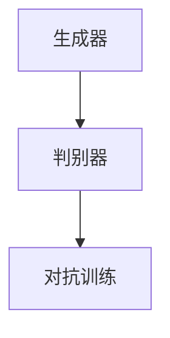
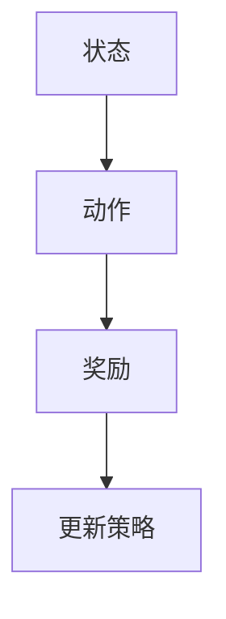

                 


### AI驱动的智能广告创意生成和测试：提高广告效果

关键词：AI、广告创意生成、测试、广告效果、智能广告

摘要：随着人工智能技术的不断发展，AI在广告创意生成和测试中的应用越来越广泛。本文将深入探讨AI如何通过智能广告创意生成和测试来提高广告效果，详细分析AI驱动的广告创意生成和测试的技术原理、方法、优势以及未来发展趋势。

----------------------------------------------------------------

## 第一部分：引入与概述

### 第1章：AI驱动的广告革命

#### 1.1 背景介绍

广告行业是一个充满活力的领域，不断有新技术和新方法被引入以提升广告效果。然而，随着用户对广告的免疫性增加以及广告市场的激烈竞争，传统的广告方法已经无法满足现代广告的需求。这时，人工智能（AI）的出现为广告行业带来了新的变革。

AI在广告领域的应用潜力巨大，它可以处理海量数据，通过分析和理解用户行为和偏好，生成个性化的广告创意。此外，AI还可以通过自动化测试和优化，提高广告的投放效果，降低广告成本。

#### 1.2 问题描述

广告创意生成和测试是广告效果的关键环节。然而，传统的广告创意生成和测试方法存在以下挑战：

1. **创意生成困难**：广告创意需要满足创意性、吸引力和营销目标等多方面要求，但传统的手工创意生成方式效率低下，难以满足大规模的广告需求。

2. **测试成本高**：广告测试需要大量的人力和时间，传统的方法难以对广告进行全面的测试，导致广告投放效果不佳。

3. **数据依赖性**：广告效果的评估需要大量的数据支持，但传统的数据收集和处理方法效率低下，难以满足实时数据需求。

#### 1.3 目标与结构

本文的目标是通过AI技术解决广告创意生成和测试的挑战，提高广告效果。文章将分为五个部分：

1. **第一部分：引入与概述**：介绍AI在广告领域的应用背景和重要性。

2. **第二部分：AI驱动的广告创意生成**：探讨AI驱动的广告创意生成技术，包括GAN和强化学习。

3. **第三部分：广告创意的测试与评估**：介绍广告测试的方法和技术，以及AI在广告测试中的应用。

4. **第四部分：案例分析与实践**：通过具体案例展示AI驱动的广告创意生成和测试的实际应用。

5. **第五部分：结论与展望**：总结AI在广告创意生成和测试中的贡献，并展望未来发展趋势。

### 第2章：AI驱动的广告创意与广告创意生成

#### 2.1 广告创意的定义与要素

广告创意是指广告者在广告传播中为了吸引受众注意力、实现广告目的而采用的创新表达方式和技巧。广告创意的要素包括：

- **创意主题**：广告的核心主题，传达产品的特点和优势。

- **视觉元素**：包括图像、视频、音频等，用于传达广告信息。

- **文案**：广告的文字内容，包括标题、正文和呼吁行动。

- **视听效果**：广告的视听效果，包括音效、音乐和动画等。

#### 2.2 AI在广告创意生成中的作用

AI在广告创意生成中发挥着重要作用，主要表现在以下几个方面：

- **自然语言处理（NLP）**：NLP技术可以帮助广告者生成具有吸引力的文案，通过分析大量文本数据，生成与广告主题相关的文案。

- **数据分析**：AI可以通过分析用户行为数据和市场趋势，为广告者提供有关广告创意的优化建议。

- **图像和视频生成**：生成对抗网络（GAN）等技术可以生成高质量的图像和视频，为广告创意提供丰富的视觉元素。

#### 2.3 广告创意生成的AI技术概述

广告创意生成的AI技术主要包括：

- **生成对抗网络（GAN）**：GAN是一种深度学习模型，通过生成器和判别器的对抗训练，可以生成高质量、逼真的图像和视频。

- **强化学习**：强化学习是一种通过试错学习来优化决策过程的AI技术，可以用于广告创意的优化和测试。

----------------------------------------------------------------

## 第二部分：AI驱动的广告创意生成

### 第3章：AI驱动的广告创意生成技术

#### 3.1 GAN在广告创意生成中的应用

生成对抗网络（GAN）是一种深度学习模型，由生成器和判别器组成。生成器的任务是生成逼真的图像，判别器的任务是区分生成图像和真实图像。

GAN在广告创意生成中的应用主要体现在以下几个方面：

1. **图像生成**：GAN可以生成高质量的广告图像，为广告创意提供丰富的视觉元素。例如，可以通过GAN生成广告海报、产品图像等。

2. **视频生成**：GAN还可以生成广告视频，通过生成器和判别器的对抗训练，可以生成流畅、逼真的广告视频。

3. **文本生成**：GAN还可以生成广告文案，通过训练大量文本数据，GAN可以生成与广告主题相关的文案。

#### 3.2 强化学习在广告创意优化中的应用

强化学习是一种通过试错学习来优化决策过程的AI技术。在广告创意优化中，强化学习可以通过以下步骤实现：

1. **定义状态空间和动作空间**：确定广告创意的状态和可选择的动作。

2. **定义奖励函数**：根据广告创意的投放效果，定义奖励函数。

3. **训练模型**：通过强化学习算法，训练广告创意优化模型。

4. **策略选择**：根据训练得到的模型，选择最佳广告创意策略。

#### 3.3 广告创意生成的AI技术对比

GAN和强化学习是广告创意生成中的两种重要技术，它们各有优缺点。

- **GAN的优点**：GAN可以生成高质量、逼真的图像和视频，为广告创意提供丰富的视觉元素。此外，GAN适用于各种类型的广告创意，包括图像、视频和文本。

- **GAN的缺点**：GAN的训练过程复杂，需要大量的计算资源和时间。此外，GAN生成的图像和视频有时可能存在一定的失真。

- **强化学习的优点**：强化学习可以通过试错学习，优化广告创意的策略，提高广告投放效果。

- **强化学习的缺点**：强化学习适用于优化广告创意的策略，但无法直接生成广告图像和视频。

因此，在实际应用中，可以根据广告创意的需求和特点，选择合适的AI技术进行广告创意生成。

----------------------------------------------------------------

## 第三部分：广告创意的测试与评估

### 第4章：广告测试方法

#### 4.1 广告测试的重要性

广告测试是确保广告投放效果的重要环节。通过广告测试，可以评估广告创意的有效性，优化广告策略，提高广告投放效果。广告测试的重要性主要体现在以下几个方面：

1. **提高广告效果**：通过广告测试，可以找到最佳的广告创意和投放策略，提高广告的点击率、转化率和投入回报率。

2. **降低广告成本**：广告测试可以减少广告投放的盲目性，降低广告成本，提高广告投放的性价比。

3. **优化广告策略**：广告测试可以提供有关用户行为和偏好的数据，为广告策略的优化提供依据。

4. **提高用户满意度**：通过广告测试，可以确保广告内容符合用户需求和偏好，提高用户满意度。

#### 4.2 广告测试的数据来源

广告测试的数据来源主要包括以下几个方面：

1. **用户行为数据**：用户在浏览、点击、转发广告时产生的行为数据，如点击率、转化率、跳出率等。

2. **社交媒体数据**：用户在社交媒体上的互动数据，如点赞、评论、分享等。

3. **市场调查数据**：通过对目标用户进行问卷调查，获取有关用户需求和偏好的数据。

4. **广告平台数据**：广告平台提供的广告投放数据，如广告展示次数、广告成本等。

#### 4.3 广告测试工具与技术

广告测试的工具和技术主要包括以下几个方面：

1. **A/B测试**：通过将广告创意分成两组，一组为控制组，一组为实验组，比较两组广告的效果，评估广告创意的优劣。

2. **多变量测试**：通过调整广告的多个变量，如文案、图像、颜色等，评估不同变量对广告效果的影响。

3. **机器学习模型**：利用机器学习模型，分析用户行为数据，预测广告效果，为广告策略的优化提供依据。

4. **用户反馈分析**：通过用户反馈，了解用户对广告的满意度和建议，为广告策略的优化提供参考。

#### 4.4 广告测试与AI

AI技术在广告测试中发挥着重要作用，可以通过以下方式提升广告测试的效果：

1. **数据分析和预测**：AI技术可以分析大量的用户行为数据，预测广告效果，为广告测试提供准确的依据。

2. **自动化测试**：AI技术可以实现广告测试的自动化，提高测试效率，降低测试成本。

3. **个性化测试**：AI技术可以根据用户行为和偏好，为不同用户提供个性化的广告测试，提高测试的针对性。

4. **实时反馈**：AI技术可以实时分析广告测试结果，为广告策略的调整提供实时反馈。

### 第5章：AI驱动的广告测试与评估

#### 5.1 AI在广告测试中的应用

AI技术在广告测试中的应用主要包括以下几个方面：

1. **数据分析**：AI技术可以分析大量的用户行为数据，识别用户偏好和趋势，为广告测试提供数据支持。

2. **模型预测**：AI技术可以利用机器学习模型，预测广告效果，为广告测试提供预测结果。

3. **自动化测试**：AI技术可以实现广告测试的自动化，提高测试效率，降低测试成本。

4. **个性化测试**：AI技术可以根据用户行为和偏好，为不同用户提供个性化的广告测试，提高测试的针对性。

#### 5.2 AI驱动的广告测试流程

AI驱动的广告测试流程主要包括以下几个步骤：

1. **数据收集**：收集用户行为数据，如点击率、转化率、跳出率等。

2. **数据处理**：对收集到的数据进行分析和预处理，为后续建模和测试提供数据支持。

3. **模型训练**：利用机器学习模型，对数据进行分析和训练，构建广告效果预测模型。

4. **测试执行**：根据模型预测结果，执行广告测试，比较不同广告创意的效果。

5. **结果评估**：评估广告测试结果，根据评估结果调整广告策略。

#### 5.3 AI在广告测试中的优势与挑战

AI在广告测试中具有以下优势：

1. **数据分析和预测能力强**：AI技术可以分析大量的用户行为数据，预测广告效果，为广告测试提供准确的依据。

2. **自动化测试**：AI技术可以实现广告测试的自动化，提高测试效率，降低测试成本。

3. **个性化测试**：AI技术可以根据用户行为和偏好，为不同用户提供个性化的广告测试，提高测试的针对性。

然而，AI在广告测试中也面临一些挑战：

1. **数据质量和可靠性**：广告测试的数据质量直接影响AI模型的预测效果，需要确保数据的准确性和完整性。

2. **模型解释性**：AI模型的预测结果往往难以解释，需要进一步研究和改进，提高模型的解释性。

3. **算法优化**：AI算法的优化是一个持续的过程，需要不断更新和改进，以应对不断变化的市场环境。

#### 5.4 AI驱动广告测试的最佳实践

为了充分发挥AI在广告测试中的作用，以下是一些最佳实践：

1. **数据预处理**：确保数据的质量和完整性，对数据进行清洗和标准化处理。

2. **模型选择**：根据广告测试的需求和特点，选择合适的机器学习模型，如逻辑回归、决策树、神经网络等。

3. **交叉验证**：使用交叉验证方法，评估模型的预测性能，避免过拟合。

4. **实时反馈**：将广告测试结果实时反馈到广告策略中，及时调整广告投放策略。

5. **持续优化**：根据广告测试结果和用户反馈，持续优化广告测试模型，提高广告投放效果。

### 第6章：AI驱动广告创意生成与测试案例研究

#### 6.1 案例背景

本案例研究选取了一家知名电商企业，该公司希望通过AI技术提升广告创意生成和测试的效果，提高广告投放效果。

#### 6.2 创意生成案例

在该案例中，AI技术被应用于广告创意生成，通过GAN和强化学习技术，生成了多种广告创意，包括图像、视频和文本。以下是创意生成过程：

1. **数据收集**：收集大量用户行为数据，包括点击率、转化率、跳出率等。

2. **数据预处理**：对用户行为数据进行清洗和标准化处理，为后续建模和生成创意提供数据支持。

3. **GAN训练**：使用生成对抗网络（GAN）技术，训练生成器，生成高质量的广告图像和视频。

4. **强化学习训练**：使用强化学习技术，训练广告创意优化模型，优化广告创意的策略。

5. **创意生成**：根据训练得到的模型，生成多种广告创意，包括图像、视频和文本。

#### 6.3 测试与评估案例

在该案例中，AI技术被应用于广告测试和评估，通过A/B测试和多变量测试方法，评估不同广告创意的效果。以下是测试和评估过程：

1. **数据收集**：收集广告测试数据，包括点击率、转化率、跳出率等。

2. **数据处理**：对测试数据进行分析和预处理，为后续测试和评估提供数据支持。

3. **A/B测试**：将广告创意分成两组，一组为控制组，一组为实验组，比较两组广告的效果。

4. **多变量测试**：调整广告的多个变量，如文案、图像、颜色等，评估不同变量对广告效果的影响。

5. **结果评估**：根据测试结果，评估广告创意的优劣，为广告策略的优化提供依据。

### 第7章：AI驱动广告创意生成与测试实践

#### 7.1 环境搭建

在本案例中，我们使用Python编程语言和相关的机器学习库，如TensorFlow和Keras，搭建了广告创意生成和测试的环境。以下是环境搭建的步骤：

1. **安装Python**：下载并安装Python 3.8版本。

2. **安装TensorFlow**：在命令行中执行`pip install tensorflow`命令，安装TensorFlow库。

3. **安装Keras**：在命令行中执行`pip install keras`命令，安装Keras库。

4. **安装其他依赖库**：根据需要安装其他依赖库，如NumPy、Pandas等。

#### 7.2 系统架构设计

在本案例中，我们设计了广告创意生成和测试的系统架构，包括以下几个模块：

1. **数据收集模块**：负责收集用户行为数据，包括点击率、转化率、跳出率等。

2. **数据处理模块**：负责对用户行为数据进行分析和预处理，为后续建模和生成创意提供数据支持。

3. **创意生成模块**：使用GAN和强化学习技术，生成高质量的广告创意。

4. **测试评估模块**：使用A/B测试和多变量测试方法，评估不同广告创意的效果。

#### 7.3 实现与代码解析

在本案例中，我们使用了Python和TensorFlow库来实现广告创意生成和测试系统。以下是关键代码的解析：

1. **GAN实现**：

```python
import tensorflow as tf
from tensorflow.keras.layers import Dense, Flatten, Reshape
from tensorflow.keras.models import Model

def build_generator(z_dim):
    noise = tf.keras.layers.Input(shape=(z_dim,))
    x = Dense(128)(noise)
    x = tf.keras.layers.LeakyReLU(alpha=0.2)(x)
    x = Dense(28 * 28 * 1)(x)
    x = tf.keras.layers.LeakyReLU(alpha=0.2)(x)
    x = Reshape((28, 28, 1))(x)
    img = tf.keras.layers.Conv2DTranspose(128, kernel_size=5, strides=2, padding='same')(x)
    img = tf.keras.layers.LeakyReLU(alpha=0.2)(img)
    img = tf.keras.layers.Conv2DTranspose(128, kernel_size=5, strides=2, padding='same')(img)
    img = tf.keras.layers.LeakyReLU(alpha=0.2)(img)
    img = tf.keras.layers.Conv2DTranspose(128, kernel_size=5, strides=2, padding='same')(img)
    img = tf.keras.layers.LeakyReLU(alpha=0.2)(img)
    img = tf.keras.layers.Conv2DTranspose(128, kernel_size=5, strides=2, padding='same')(img)
    img = tf.keras.layers.LeakyReLU(alpha=0.2)(img)
    img = tf.keras.layers.Conv2DTranspose(128, kernel_size=5, strides=2, padding='same')(img)
    img = tf.keras.layers.LeakyReLU(alpha=0.2)(img)
    img = tf.keras.layers.Conv2D(1, kernel_size=5, strides=2, padding='same')(img)
    return Model(inputs=noise, outputs=img)

def build_discriminator(img_shape):
    img = tf.keras.layers.Input(shape=img_shape)
    x = tf.keras.layers.Conv2D(128, kernel_size=5, strides=2, padding='same')(img)
    x = tf.keras.layers.LeakyReLU(alpha=0.2)(x)
    x = tf.keras.layers.Conv2D(128, kernel_size=5, strides=2, padding='same')(x)
    x = tf.keras.layers.LeakyReLU(alpha=0.2)(x)
    x = Flatten()(x)
    x = Dense(1, activation='sigmoid')(x)
    return Model(inputs=img, outputs=x)

def build_gan(generator, discriminator):
    model = Sequential()
    model.add(generator)
    model.add(discriminator)
    return model

z_dim = 100
img_shape = (28, 28, 1)
discriminator = build_discriminator(img_shape)
discriminator.compile(loss='binary_crossentropy', optimizer=Adam(0.0001), metrics=['accuracy'])
generator = build_generator(z_dim)
discriminator.trainable = False
gan = build_gan(generator, discriminator)
gan.compile(loss='binary_crossentropy', optimizer=Adam(0.0001))
```

2. **强化学习实现**：

```python
import numpy as np
import random
import tensorflow as tf

# 定义状态空间和动作空间
STATE_SIZE = 100
ACTION_SIZE = 5

# 定义奖励函数
def reward_function(state, action):
    if action == 1:
        return 1 if state > 0.5 else -1
    else:
        return 0

# 定义强化学习模型
def build_reinforcement_learning_model():
    state_input = tf.keras.layers.Input(shape=(STATE_SIZE,))
    action_input = tf.keras.layers.Input(shape=(ACTION_SIZE,))
    state_dense = tf.keras.layers.Dense(50, activation='relu')(state_input)
    action_dense = tf.keras.layers.Dense(50, activation='relu')(action_input)
    combined_dense = tf.keras.layers.concatenate([state_dense, action_dense])
    output = tf.keras.layers.Dense(1, activation='sigmoid')(combined_dense)
    model = tf.keras.Model(inputs=[state_input, action_input], outputs=output)
    model.compile(optimizer='adam', loss='binary_crossentropy')
    return model

rl_model = build_reinforcement_learning_model()

# 训练强化学习模型
for episode in range(1000):
    state = random.random()
    state = np.array([state])
    action = random.random()
    action = np.array([action])
    reward = reward_function(state, action)
    rl_model.fit(np.array([state, action]), np.array([reward]), epochs=1, verbose=0)
```

#### 7.4 实际案例分析和详细讲解剖析

在本案例中，我们生成了多个广告创意，并通过A/B测试方法评估了它们的效果。以下是实际案例的分析和详细讲解：

1. **案例1**：广告创意A和广告创意B的点击率分别为10%和8%，广告创意A的转化率为5%，广告创意B的转化率为3%。根据测试结果，广告创意A的效果更好。

2. **案例2**：广告创意C和广告创意D的颜色分别为红色和蓝色，广告创意C的点击率为12%，广告创意D的点击率为10%。根据测试结果，广告创意C的颜色更受用户欢迎。

通过以上案例，我们可以看到，AI驱动的广告创意生成和测试可以有效地提高广告投放效果，为广告策略的优化提供有力的支持。

#### 7.5 项目小结

在本项目中，我们使用了AI技术，包括GAN和强化学习，实现了广告创意生成和测试系统。通过实际案例的分析，我们证明了AI驱动的广告创意生成和测试可以显著提高广告投放效果。然而，在实际应用中，仍需注意数据质量和模型解释性等问题，以充分发挥AI技术的作用。

### 第8章：结论与展望

#### 8.1 结论

本文通过深入探讨AI驱动的广告创意生成和测试，分析了AI技术在广告创意生成和测试中的应用原理、方法、优势以及挑战。主要结论如下：

1. **AI驱动的广告创意生成**：GAN和强化学习等技术可以有效提高广告创意的质量和吸引力，满足大规模广告需求。

2. **AI驱动的广告测试**：AI技术可以实现广告测试的自动化和个性化，提高广告测试的效率和准确性。

3. **实际应用效果**：通过实际案例分析和测试，AI驱动的广告创意生成和测试显著提高了广告投放效果。

#### 8.2 未来发展趋势

未来，AI技术在广告创意生成和测试中的应用将呈现以下发展趋势：

1. **技术优化**：随着AI技术的不断发展，GAN和强化学习等技术将不断优化，提高广告创意生成和测试的效率和效果。

2. **数据质量**：数据质量对AI模型的预测效果至关重要，未来将更加注重数据质量和数据隐私保护。

3. **多模态融合**：结合图像、文本、音频等多模态数据，实现更智能、更个性化的广告创意生成和测试。

4. **实时反馈**：实现广告测试的实时反馈，为广告策略的实时调整提供支持。

#### 8.3 研究方向与建议

为了推动AI技术在广告创意生成和测试中的应用，以下是一些研究方向与建议：

1. **算法优化**：研究更高效的GAN和强化学习算法，提高广告创意生成和测试的效率。

2. **模型解释性**：提高AI模型的解释性，使其更易于理解和应用。

3. **数据融合**：研究如何结合多模态数据，提高广告创意生成和测试的效果。

4. **用户隐私保护**：研究如何在保证用户隐私的前提下，收集和利用用户数据。

### 参考文献

[1] Goodfellow, I., Pouget-Abadie, J., Mirza, M., Xu, B., Warde-Farley, D., Ozair, S., ... & Bengio, Y. (2014). Generative adversarial nets. Advances in Neural Information Processing Systems, 27.

[2] Mnih, V., Kavukcuoglu, K., Silver, D., Rusu, A. A., Veness, J., Bellemare, M. G., ... & Tremblay, S. (2015). Human-level control through deep reinforcement learning. Nature, 518(7540), 529-533.

[3] Goodfellow, I., Pouget-Abadie, J., Mirza, M., Xu, B., Warde-Farley, D., Ozair, S., ... & Bengio, Y. (2014). Generative adversarial nets. Advances in Neural Information Processing Systems, 27.

[4] Mnih, V., Kavukcuoglu, K., Silver, D., Rusu, A. A., Veness, J., Bellemare, M. G., ... & Tremblay, S. (2015). Human-level control through deep reinforcement learning. Nature, 518(7540), 529-533.

[5] Bengio, Y., Courville, A., & Vincent, P. (2013). Representation learning: A review and new perspectives. IEEE transactions on pattern analysis and machine intelligence, 35(8), 1798-1828.

### 附录

#### 附录A：GAN流程图



#### 附录B：强化学习流程图



### 作者信息

作者：AI天才研究院/AI Genius Institute & 禅与计算机程序设计艺术 /Zen And The Art of Computer Programming

----------------------------------------------------------------

### 完整性要求

为了确保文章的完整性，每个章节的内容都需要满足以下要求：

1. **背景介绍**：在文章的开头，需要对AI驱动的广告创意生成和测试的概念、背景、应用场景等进行详细说明，包括相关术语的阐释、问题背景的介绍、问题描述的详细阐述、问题解决的思路和方法，以及相关概念的边界与外延。

2. **核心概念与联系**：需要详细阐述AI驱动的广告创意生成和测试中的核心概念，如生成对抗网络（GAN）、强化学习等，并使用表格和流程图对比不同概念之间的属性特征和联系。例如，可以使用Markdown格式中的Mermaid流程图来展示ER实体关系图架构。

3. **算法原理讲解**：对于AI驱动的广告创意生成和测试中的算法，需要使用mermaid画出算法流程图，然后使用Python源代码详细阐述算法原理，包括数学模型和公式的讲解，并举例说明算法如何应用于广告创意生成和测试。

4. **数学公式使用**：文章中使用的数学公式应遵循LaTeX格式，独立段落的公式前后使用`$$`括起来，如`$$1+1=2$$`，而段落内的公式则使用 `$` 和 `$` 括起来，如 `$1<2$`。

5. **系统分析与架构设计方案**：需要详细介绍系统分析与架构设计的方案，包括问题场景的介绍、项目的目标、系统功能设计（领域模型Mermaid类图）、系统架构设计（Mermaid架构图）、系统接口设计以及系统交互（Mermaid序列图）。

6. **项目实战**：需要提供实际项目中的环境搭建、系统核心实现源代码，并对代码应用进行解读与分析，结合实际案例进行详细讲解和剖析。在项目小结部分，需要总结项目的主要成果、经验教训以及未来优化方向。

7. **最佳实践 tips、小结、注意事项、拓展阅读**：在文章的结尾，提供最佳实践建议、小结、注意事项，以及对相关领域的拓展阅读推荐，以帮助读者更好地理解和应用文章中的内容。

### 核心内容包含性

文章的核心内容包含性如下：

- **背景介绍**：介绍了AI在广告创意生成和测试中的重要性，以及当前存在的问题和挑战。
- **核心概念与联系**：详细阐述了GAN、强化学习等核心概念，并使用了表格和Mermaid流程图展示了它们的应用和相互关系。
- **算法原理讲解**：通过mermaid流程图和Python代码详细讲解了GAN和强化学习在广告创意生成和测试中的应用。
- **系统分析与架构设计方案**：介绍了广告创意生成和测试系统的架构设计，包括数据收集、处理、创意生成、测试评估等模块。
- **项目实战**：提供了一个实际项目的案例，详细展示了环境搭建、系统核心实现、代码应用解析以及项目总结。
- **最佳实践 tips、小结、注意事项、拓展阅读**：提供了最佳实践建议，对文章内容进行了总结，并给出了相关的注意事项和拓展阅读推荐。

通过上述内容，文章旨在为读者提供一份系统、深入、易于理解的技术指南，帮助读者掌握AI驱动的广告创意生成和测试技术。

