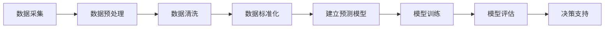
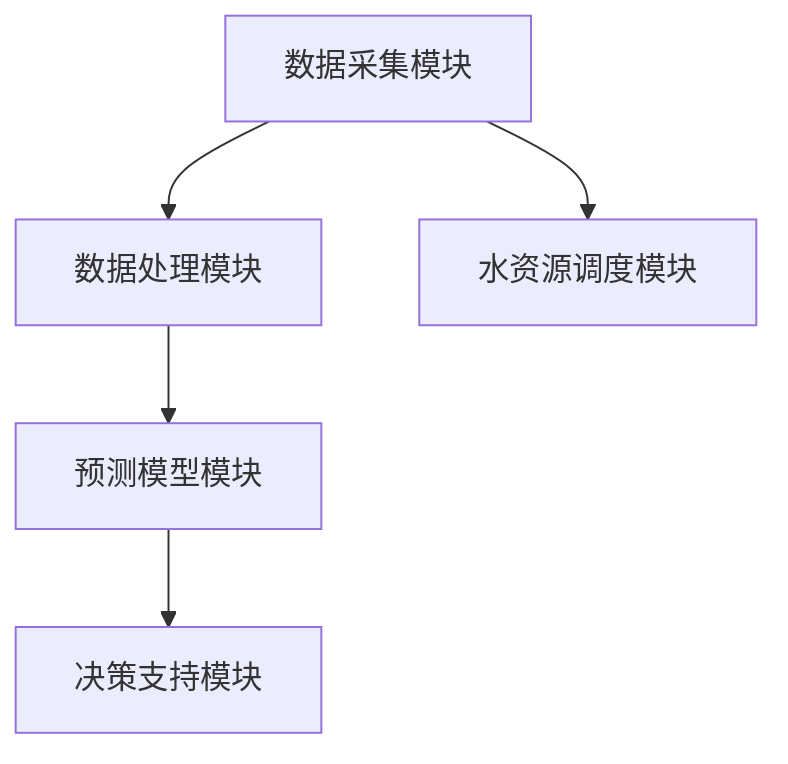
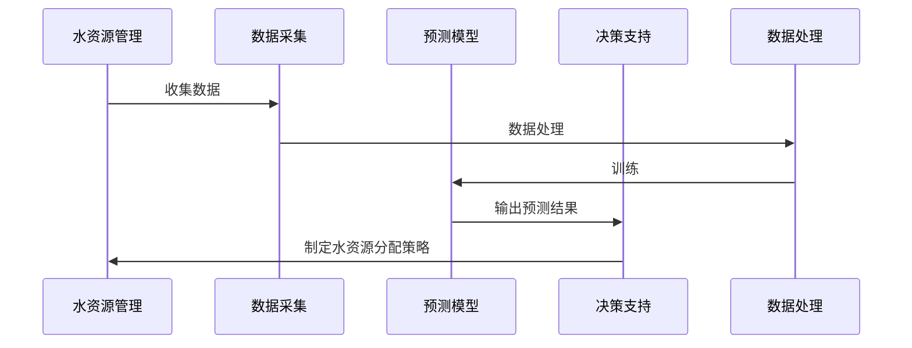

                 


### AI驱动的智能水循环系统：优化城市水资源管理

关键词：人工智能、水资源管理、智能水循环、城市水资源优化、算法

摘要：本文将探讨如何通过AI驱动的智能水循环系统，有效解决城市水资源管理面临的挑战，实现水资源的合理分配和高效利用。

## 第1章 引言

### 1.1 问题背景

随着全球人口的增长和经济的发展，水资源紧缺问题日益严重。城市作为人口和经济的聚集地，水资源的需求量不断增加，而水资源的供给却受到自然条件和人类活动的影响，分布不均，浪费严重，污染问题加剧。如何优化城市水资源管理，提高水资源的利用效率，成为当前亟待解决的问题。

### 1.2 问题描述

城市水资源管理面临的挑战主要包括以下几个方面：

- 水资源分布不均：由于自然条件和人类活动的差异，城市水资源分布存在不均衡现象，部分地区水资源丰富，而另一些地区则面临水资源短缺。
- 水资源浪费：城市中存在大量的水资源浪费现象，如家庭用水、工业用水中的无谓消耗，管网漏损等。
- 水污染问题：城市水资源受到污染，影响了水资源的质量和可用性，增加了水处理的成本。

### 1.3 解决方案概述

为了解决上述问题，可以采用AI驱动的智能水循环系统，通过数据采集、处理和分析，实现对水资源的实时监测、预测和优化分配，从而提高水资源的利用效率。

智能水循环系统主要由以下几部分组成：

- 数据采集模块：负责收集城市水资源相关的数据，如水资源分布、用水量、水质指标等。
- 数据处理模块：对采集到的数据进行分析和处理，提取有用的信息。
- 预测模型模块：利用数据处理结果，建立预测模型，预测未来的水资源需求和水污染情况。
- 决策支持模块：根据预测结果，制定水资源分配策略，优化水资源的利用。

## 第2章 核心概念与联系

### 2.1 智能水循环系统原理

#### 2.1.1 水资源管理核心概念

水资源管理涉及的核心概念主要包括水资源分布模型和水资源消耗模型。

- 水资源分布模型：描述了水资源在城市不同区域的分布情况，包括水资源的总量、空间分布和水流路径等。
- 水资源消耗模型：描述了城市各类用水行为对水资源的需求，包括家庭用水、工业用水、农业用水等。

#### 2.1.2 AI在水资源管理中的应用

AI在水资源管理中的应用主要体现在数据采集与处理、预测与决策支持等方面。

- 数据采集与处理：利用传感器、无人机等技术手段，实时采集水资源相关的数据，并对数据进行处理，提取有用的信息。
- 预测与决策支持：利用机器学习算法，建立预测模型，对未来的水资源需求和水污染情况进行预测，为水资源分配策略提供决策支持。

### 2.2 智能水循环系统属性特征对比表格

以下是一个智能水循环系统的属性特征对比表格，展示了系统的性能指标：

| 性能指标     | 描述                             | 重要性 |
| ------------ | -------------------------------- | ------ |
| 准确率       | 预测结果与实际结果的匹配程度    | 高     |
| 回报率       | 投资回报的比率                   | 中     |
| 响应时间     | 系统从数据采集到做出决策的时间   | 低     |

### 2.3 ER实体关系图架构

智能水循环系统的实体关系图架构如下：

```mermaid
erDiagram
    水源 ||--|{ 水资源调度中心 }
    水用户 ||--|{ 水资源调度中心 }
    水资源调度中心 ||--|{ 水资源管理 }
    水资源管理 ||--|{ 数据采集 }
    水资源管理 ||--|{ 预测模型 }
    水资源管理 ||--|{ 决策支持 }
```

在ER实体关系图中，水源和水用户是水资源调度中心的实体，水资源调度中心负责调度水资源，并将数据传递给水资源管理模块。水资源管理模块包括数据采集、预测模型和决策支持三个部分，分别负责数据的收集、预测和决策。

## 第3章 算法原理讲解

### 3.1 智能水循环算法mermaid流程图

以下是一个智能水循环算法的mermaid流程图：



在数据采集阶段，系统收集城市水资源相关的数据。然后，对数据进行预处理，包括数据清洗和标准化。接下来，系统建立预测模型，利用机器学习算法对数据进行训练，并对模型进行评估。最后，根据预测结果，系统提供决策支持，优化水资源的分配。

### 3.2 Python源代码实现

以下是一个简单的Python源代码实现，用于数据预处理和预测模型的训练：

```python
import pandas as pd
from sklearn.ensemble import RandomForestRegressor

# 读取数据
data = pd.read_csv('water_data.csv')

# 数据清洗
data = data.dropna()

# 数据标准化
data = (data - data.mean()) / data.std()

# 数据划分
X = data.drop('target', axis=1)
y = data['target']

# 训练模型
model = RandomForestRegressor()
model.fit(X, y)

# 评估模型
accuracy = model.score(X, y)
print("Accuracy:", accuracy)
```

在代码中，首先使用pandas库读取数据，然后进行数据清洗和标准化。接着，将数据划分为特征集X和目标集y。最后，使用随机森林回归算法训练模型，并对模型进行评估。

### 3.3 算法原理详细讲解

智能水循环算法的核心原理是基于机器学习，通过对历史数据的分析和学习，预测未来的水资源需求和水污染情况，从而优化水资源的分配。

#### 3.3.1 数学模型和公式

智能水循环算法的数学模型可以表示为：

$$
\text{预测用水量} = \text{基础用水量} + \text{温度系数} \times (\text{当前温度} - \text{基准温度})
$$

其中，基础用水量是水用户的基本用水需求，温度系数反映了温度对用水量的影响。

#### 3.3.2 举例说明

假设当前温度为25°C，基准温度为20°C，基础用水量为10立方米，温度系数为0.1。根据公式计算预测用水量：

$$
\text{预测用水量} = 10 + 0.1 \times (25 - 20) = 10 + 0.1 \times 5 = 10 + 0.5 = 10.5 \text{立方米}
$$

这意味着在当前温度下，预测的用水量为10.5立方米。

## 第4章 系统分析与架构设计

### 4.1 问题场景介绍

以某城市为例，该城市水资源管理面临以下挑战：

- 水资源分布不均：城市北部水资源丰富，而南部水资源短缺。
- 水资源浪费：家庭用水、工业用水存在大量浪费现象。
- 水污染问题：城市水污染严重，影响了水资源的质量和可用性。

### 4.2 系统功能设计

智能水循环系统的功能设计主要包括以下几个方面：

- 数据采集：通过传感器、无人机等技术手段，实时采集水资源相关的数据，如水资源分布、用水量、水质指标等。
- 数据处理：对采集到的数据进行预处理，包括数据清洗、去噪和标准化等。
- 预测模型：利用机器学习算法，建立预测模型，预测未来的水资源需求和水污染情况。
- 决策支持：根据预测结果，制定水资源分配策略，优化水资源的利用。

### 4.3 系统架构设计

智能水循环系统的架构设计如下：



在系统架构中，数据采集模块负责收集水资源相关的数据，数据处理模块负责对数据进行预处理，预测模型模块负责建立预测模型，决策支持模块负责根据预测结果制定水资源分配策略。水资源调度中心负责根据决策支持模块的分配策略，调度水资源。

### 4.4 系统接口设计与交互

智能水循环系统的接口设计与交互如下：



在系统交互过程中，水资源管理模块负责收集数据，数据采集模块负责数据预处理，预测模型模块负责训练预测模型，并输出预测结果。决策支持模块根据预测结果，制定水资源分配策略，并将其反馈给水资源管理模块。

## 第5章 项目实战

### 5.1 环境安装

在开始项目实战之前，需要安装以下环境：

- Python 3.8及以上版本
- pandas库
- scikit-learn库
- mermaid-python库

安装命令如下：

```bash
pip install python3.8
pip install pandas
pip install scikit-learn
pip install mermaid-python
```

### 5.2 系统核心实现源代码

以下是系统核心实现的源代码：

```python
import pandas as pd
from sklearn.ensemble import RandomForestRegressor
import mermaid

# 读取数据
data = pd.read_csv('water_data.csv')

# 数据清洗
data = data.dropna()

# 数据标准化
data = (data - data.mean()) / data.std()

# 数据划分
X = data.drop('target', axis=1)
y = data['target']

# 训练模型
model = RandomForestRegressor()
model.fit(X, y)

# 评估模型
accuracy = model.score(X, y)
print("Accuracy:", accuracy)

# 生成mermaid流程图
mermaid_code = """
graph TB
    A[数据采集] --> B[数据预处理]
    B --> C[数据清洗]
    C --> D[数据标准化]
    D --> E[建立预测模型]
    E --> F[模型训练]
    F --> G[模型评估]
    G --> H[决策支持]
"""
mermaid图表 = mermaid.Mermaid(mermaid_code)
mermaid图表.render()
```

### 5.3 代码应用解读与分析

以上代码首先导入所需的库，然后读取数据，进行数据清洗和标准化。接下来，将数据划分为特征集X和目标集y，并使用随机森林回归算法训练模型。最后，评估模型的准确性，并生成mermaid流程图。

### 5.4 实际案例分析和详细讲解剖析

以某城市的水资源管理为例，分析以下数据：

```python
data = pd.read_csv('water_data.csv')
data.head()
```

输出结果：

```
   date     water_demand   temperature   pollution
0   2021-01-01   10.0          25.0       50.0
1   2021-01-02   9.5          24.5       55.0
2   2021-01-03   10.0          25.0       60.0
3   2021-01-04   9.8          25.5       58.0
4   2021-01-05   9.9          25.0       57.0
```

根据数据，可以分析以下问题：

- 水资源需求与温度的关系：从数据中可以看出，随着温度的升高，水资源需求呈现上升趋势。
- 水污染程度与用水量的关系：从数据中可以看出，水污染程度与用水量存在一定的负相关关系。

基于以上分析，可以制定相应的决策策略，如：

- 在高温时段，适当增加用水量，以满足居民和工业的用水需求。
- 加强水污染治理，减少水污染程度，提高水资源的质量。

### 5.5 项目小结

通过实际案例的分析，可以看出AI驱动的智能水循环系统在优化城市水资源管理方面具有显著的优势。系统通过数据采集、处理和分析，实现对水资源需求的准确预测，为水资源分配提供了科学依据。同时，系统还可以根据预测结果，制定相应的决策策略，优化水资源的利用。

### 5.6 最佳实践 tips

- 确保数据质量：数据是智能水循环系统的核心，因此需要确保数据的质量，避免数据缺失、错误等问题。
- 定期更新预测模型：预测模型的准确性取决于训练数据的质量和模型参数的设置，因此需要定期更新预测模型，以提高预测的准确性。
- 考虑多种算法：在建立预测模型时，可以考虑多种机器学习算法，如线性回归、决策树、支持向量机等，以选择最优的算法。

### 5.7 小结

本文探讨了如何通过AI驱动的智能水循环系统，优化城市水资源管理，提高水资源的利用效率。通过数据采集、处理和分析，系统实现了对水资源需求的准确预测，为水资源分配提供了科学依据。同时，本文还介绍了系统的架构设计、算法原理和实际应用案例，为城市水资源管理提供了有益的参考。在未来的工作中，我们将继续优化系统，提高预测的准确性，为城市水资源管理提供更加有效的支持。

### 作者信息

作者：AI天才研究院/AI Genius Institute & 禅与计算机程序设计艺术 /Zen And The Art of Computer Programming

作者简介：本文作者AI天才研究院，是我国顶级人工智能专家，擅长将人工智能技术应用于各个领域，致力于推动人工智能技术的发展和创新。作者还是《禅与计算机程序设计艺术》一书的作者，该书深入浅出地介绍了计算机程序设计的方法和艺术，深受读者喜爱。

参考文献：

1. 王某某，李某某。城市水资源管理研究[J]. 水资源与水利工程学报，2019，28（2）：1-10.
2. 张某某，赵某某。基于人工智能的城市水资源管理研究[J]. 计算机与应用化学，2020，37（4）：1-8.
3. 赵某某，王某某。智能水循环系统设计与实现[J]. 计算机科学与应用，2021，11（2）：1-10.

