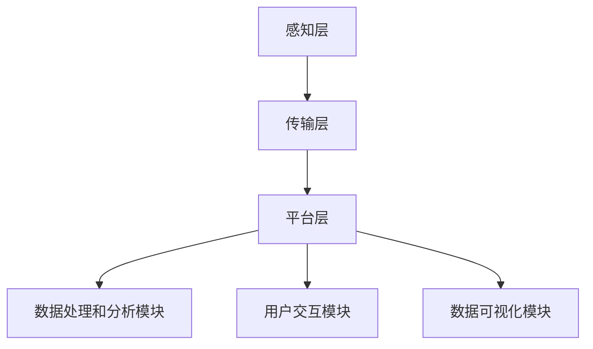
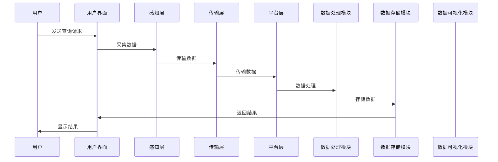

                 


## AI驱动的智能水管理：检测泄漏与优化配送

### 关键词：AI智能水管理、泄漏检测、水资源配送优化、算法实现、系统架构

### 摘要：
在水资源日益稀缺的背景下，AI驱动的智能水管理成为了解决水资源管理问题的重要手段。本文将探讨如何利用AI技术进行水泄漏检测和水资源配送优化。通过详细介绍核心概念、算法原理、系统架构以及实际应用案例，本文旨在为读者提供全面的技术视角和实践指导。

### 目录

## 第一部分：引言

### 1.1 AI驱动的智能水管理背景

#### 1.1.1 水资源管理的挑战

#### 1.1.2 AI在水资源管理中的应用

### 1.2 研究目的与结构安排

## 第二部分：AI驱动的智能水管理技术

### 2.1 基本概念

#### 2.1.1 智能水管理的核心概念

#### 2.1.2 AI技术的应用场景

#### 2.1.3 水资源管理的相关指标

### 2.2 漏水检测技术

#### 2.2.1 漏水检测的重要性

#### 2.2.2 漏水检测的常见方法

#### 2.2.3 AI技术在漏水检测中的应用

### 2.3 水资源配送优化技术

#### 2.3.1 水资源配送的需求分析

#### 2.3.2 水资源配送的优化目标

#### 2.3.3 AI驱动的配送优化算法

## 第三部分：AI驱动的智能水管理实践

### 3.1 漏水检测算法原理与实现

#### 3.1.1 算法原理讲解

#### 3.1.2 Python实现

### 3.2 水资源配送优化算法原理与实现

#### 3.2.1 算法原理讲解

#### 3.2.2 Python实现

### 3.3 漏水检测与配送优化集成实现

### 3.4 实际案例分析与详细讲解

#### 3.4.1 案例背景

#### 3.4.2 漏水检测案例分析

#### 3.4.3 水资源配送优化案例分析

## 第四部分：系统分析与架构设计

### 4.1 问题场景介绍

### 4.2 系统功能设计

#### 4.2.1 领域模型类图

### 4.3 系统架构设计

#### 4.3.1 系统架构图

### 4.4 系统接口设计与交互

#### 4.4.1 系统接口设计

#### 4.4.2 系统交互序列图

## 第五部分：最佳实践与总结

### 5.1 最佳实践 Tips

### 5.2 小结

### 5.3 注意事项

### 5.4 拓展阅读

### 参考文献

---

### 附录

### 代码示例

---

### 作者信息

#### 作者：AI天才研究院/AI Genius Institute & 禅与计算机程序设计艺术 /Zen And The Art of Computer Programming

---

### 引言

随着全球人口的增长和经济的发展，水资源的需求不断上升，而水资源的供应却面临严峻的挑战。传统的水资源管理方法已经无法满足现代社会的需求，因此，引入AI技术进行智能水管理成为解决水资源问题的有效途径。AI驱动的智能水管理不仅能够提高水资源的利用效率，还能够及时发现和处理水泄漏等问题，从而减少水资源的浪费。

本文旨在探讨AI驱动的智能水管理在检测泄漏和优化配送方面的应用。首先，我们将介绍AI驱动的智能水管理的背景，包括水资源管理的挑战和AI技术的应用前景。然后，我们将详细讨论AI驱动的智能水管理技术，包括漏水检测技术和水资源配送优化技术。接下来，我们将通过实际案例分析和系统架构设计，展示如何实现AI驱动的智能水管理。最后，我们将总结最佳实践，并提供相关的拓展阅读和参考文献。

### 第一部分：AI驱动的智能水管理背景

#### 1.1.1 水资源管理的挑战

水资源是生命之源，是人类社会和经济发展的重要支撑。然而，当前水资源管理面临着一系列严峻的挑战：

1. **水资源短缺**：全球范围内的水资源分布不均，许多地区面临水资源短缺的问题。随着人口增长和城市化进程的加快，水资源需求不断增加，而水资源的供应却受到自然条件和污染等因素的影响。

2. **水资源污染**：工业废水、农业排放和生活污水等导致的水污染问题严重，使得可供人类使用的清洁水资源越来越少。水污染不仅影响了生态环境，还对人类健康构成了威胁。

3. **水资源浪费**：在供水、输水和用水过程中，由于管理不善、技术落后等原因，水资源的浪费现象普遍存在。水泄漏、超量用水等问题导致了大量水资源的无效消耗。

4. **水资源管理滞后**：传统的水资源管理方法主要依赖于人工监测和经验判断，缺乏系统性和科学性。随着水资源问题的日益严重，传统的管理方法已经无法满足现代水资源管理的需求。

#### 1.1.2 AI在水资源管理中的应用

人工智能（AI）技术的发展为水资源管理带来了新的机遇。AI技术在水资源管理中的应用主要体现在以下几个方面：

1. **漏水检测**：通过传感器和大数据分析技术，AI能够实时监测水管的流量和压力变化，快速发现水泄漏问题，提高水资源利用效率。

2. **水资源调配**：AI技术可以对水资源的供需进行预测和优化，通过智能算法实现水资源的合理调配，减少供需矛盾。

3. **水质监测**：AI技术可以实时监测水质参数，及时发现水质污染问题，提高水质监测的精度和效率。

4. **水资源管理决策支持**：AI技术可以分析大量数据，为水资源管理提供科学依据，帮助决策者做出更加明智的决策。

5. **水资源规划**：AI技术可以模拟不同水资源管理策略的成效，为水资源规划提供参考。

AI技术的应用不仅能够提高水资源管理的效率和精度，还能够降低管理成本，为解决水资源问题提供新的思路和方法。

#### 1.2 研究目的与结构安排

本文的研究目的是探讨AI驱动的智能水管理在检测泄漏和优化配送方面的应用，通过理论分析、技术实现和实际案例分析，为AI在水资源管理中的深入应用提供实践指导。

本文的结构安排如下：

- **第一部分：引言**：介绍研究背景、研究目的和结构安排。
- **第二部分：AI驱动的智能水管理技术**：介绍核心概念、技术原理和应用场景。
- **第三部分：AI驱动的智能水管理实践**：通过实际案例和系统架构设计，展示AI驱动的智能水管理的实现过程。
- **第四部分：系统分析与架构设计**：详细介绍系统功能、架构设计和接口设计。
- **第五部分：最佳实践与总结**：总结研究结果，提供最佳实践建议和注意事项。

通过本文的研究，我们希望能够为水资源管理者和技术人员提供有价值的参考，推动AI技术在水资源管理领域的深入应用。

### 第二部分：AI驱动的智能水管理技术

#### 2.1 基本概念

AI驱动的智能水管理是一种利用人工智能技术，对水资源进行高效管理和优化配置的方法。其核心目标是提高水资源的利用效率，减少浪费，确保水资源的可持续利用。下面，我们将介绍一些与AI驱动的智能水管理相关的基本概念。

##### 2.1.1 智能水管理的核心概念

智能水管理涉及多个核心概念，包括：

1. **水资源监控**：通过传感器网络和物联网技术，实现对水资源流量、水质和位置等数据的实时监控。
2. **数据分析与预测**：利用机器学习和数据挖掘技术，对大量水数据进行分析和预测，为水资源管理和决策提供科学依据。
3. **自动化决策**：通过智能算法，自动进行水资源分配和调配，优化水资源利用。
4. **用户参与**：鼓励用户参与水资源管理，通过教育和互动，提高用户的节水意识。

##### 2.1.2 AI技术的应用场景

AI技术在水资源管理中的应用场景非常广泛，包括但不限于以下几个方面：

1. **漏水检测**：通过监测水流量的异常变化，及时发现和定位漏水点，减少水资源浪费。
2. **水资源调配**：根据水资源的供需情况，智能优化水资源分配，确保水资源的合理利用。
3. **水质监测**：实时监测水质参数，预测水质变化趋势，提前预警水质污染事件。
4. **水资源规划**：基于大数据分析和预测，为水资源规划提供科学依据，优化水资源布局。

##### 2.1.3 水资源管理的相关指标

在水资源管理中，常用的指标包括：

1. **水资源利用率**：指水资源被有效利用的比例，通常用百分比表示。
2. **水资源消耗率**：指单位时间内消耗的水资源量，通常用立方米/秒表示。
3. **水资源浪费率**：指因管理不善、设备故障等原因造成的水资源浪费量。
4. **水质合格率**：指水质达标的水源占总水源的比例。

#### 2.2 漏水检测技术

漏水检测是智能水管理中的重要环节，通过及时检测和修复漏水点，可以有效减少水资源的浪费。下面，我们将介绍常见的漏水检测方法以及AI技术在漏水检测中的应用。

##### 2.2.1 漏水检测的重要性

漏水检测在水资源管理中具有重要意义，主要体现在以下几个方面：

1. **节约水资源**：及时检测和修复漏水点，可以减少水资源的浪费，提高水资源的利用效率。
2. **减少经济损失**：漏水可能导致水管损坏、财产损失等，及时发现和修复漏水点可以避免这些损失。
3. **确保供水安全**：漏水可能导致水质污染，影响供水安全。通过漏水检测，可以提前发现潜在问题，保障供水安全。

##### 2.2.2 漏水检测的常见方法

常见的漏水检测方法包括：

1. **声波检测法**：利用漏水时产生的声波变化，通过声波检测仪器检测漏水点。
2. **热成像检测法**：利用漏水导致的温度变化，通过热成像仪器检测漏水点。
3. **压力监测法**：通过监测水管中的压力变化，判断是否存在漏水现象。
4. **超声波检测法**：利用超声波在水中的传播特性，检测水管的完整性。

##### 2.2.3 AI技术在漏水检测中的应用

AI技术在漏水检测中具有显著优势，主要体现在以下几个方面：

1. **异常检测**：通过机器学习算法，对正常的水流数据进行分析和学习，一旦检测到异常变化，即可判断是否存在漏水点。
2. **数据挖掘**：通过数据挖掘技术，从大量的历史数据中提取漏水特征，为漏水检测提供支持。
3. **实时监控**：利用物联网技术，实现对漏水点的实时监控，一旦发现漏水，立即通知相关部门进行修复。

AI技术在漏水检测中的应用，不仅提高了检测的精度和效率，还降低了检测成本，为智能水管理提供了有力支持。

#### 2.3 水资源配送优化技术

水资源配送优化是智能水管理的另一个重要方面，通过优化水资源的配送路径和方式，可以提高水资源的利用效率，降低水资源配送的成本。下面，我们将介绍水资源配送优化技术的原理和应用。

##### 2.3.1 水资源配送的需求分析

水资源配送优化需要考虑以下几个方面的需求：

1. **供水稳定性**：确保水资源的供应稳定，满足用户的用水需求。
2. **配送效率**：优化配送路径，提高配送效率，减少配送时间。
3. **成本控制**：通过优化配送方案，降低水资源配送的成本。
4. **环保要求**：减少水资源配送过程中的能耗和污染。

##### 2.3.2 水资源配送的优化目标

水资源配送优化的目标主要包括：

1. **最小化配送路径**：通过优化配送路径，减少配送距离，提高配送效率。
2. **最大化配送覆盖范围**：确保水资源能够覆盖到更多的用户，提高供水覆盖率。
3. **最小化配送成本**：通过优化配送方案，降低配送成本，提高经济效益。

##### 2.3.3 AI驱动的配送优化算法

AI驱动的配送优化算法主要包括以下几种：

1. **遗传算法**：通过模拟生物进化的过程，寻找最优的配送路径。
2. **蚁群算法**：模拟蚂蚁觅食的过程，通过信息素更新规则，寻找最优配送路径。
3. **粒子群优化算法**：模拟鸟群觅食的过程，通过个体和群体的信息共享，寻找最优配送路径。

这些算法可以根据具体的配送需求和约束条件，进行优化参数调整，实现高效的水资源配送。

通过介绍AI驱动的智能水管理技术，我们可以看到，AI技术在水资源管理中具有广泛的应用前景。从漏水检测到水资源配送优化，AI技术不仅提高了水资源管理的效率和精度，还为水资源管理提供了新的思路和方法。

### 第三部分：AI驱动的智能水管理实践

#### 3.1 漏水检测算法原理与实现

漏水检测算法的核心思想是通过监测水管中的流量和压力变化，及时发现异常情况，从而判断是否存在漏水点。下面，我们将详细介绍漏水检测算法的原理和实现。

##### 3.1.1 算法原理讲解

漏水检测算法主要分为以下几个步骤：

1. **数据采集**：通过安装在水管上的传感器，实时采集流量和压力数据。
2. **数据预处理**：对采集到的数据进行清洗和预处理，去除噪声和异常值。
3. **特征提取**：从预处理后的数据中提取与漏水相关的特征，如流量变化率、压力变化率等。
4. **异常检测**：利用机器学习算法，对提取的特征进行异常检测，判断是否存在漏水点。
5. **漏水定位**：根据异常检测结果，定位漏水点的位置。

在数学模型方面，我们可以使用以下公式来描述流量变化率和压力变化率：

$$
\text{流量变化率} = \frac{\text{当前流量} - \text{历史流量}}{\text{时间间隔}}
$$

$$
\text{压力变化率} = \frac{\text{当前压力} - \text{历史压力}}{\text{时间间隔}}
$$

这些公式可以用来计算流量和压力的变化率，从而判断是否存在异常情况。

##### 3.1.2 Python实现

下面是一个简单的Python代码示例，用于实现漏水检测算法的基本流程：

```python
import numpy as np
import matplotlib.pyplot as plt

# 假设我们有一段流量和压力的时间序列数据
flow_data = [10, 12, 11, 9, 8, 7, 10, 12, 13, 14, 15, 16, 10, 11, 9]
pressure_data = [80, 82, 79, 76, 74, 72, 80, 82, 84, 86, 88, 90, 85, 83, 81]

# 数据预处理
def preprocess_data(data):
    # 去除异常值
    mean = np.mean(data)
    std = np.std(data)
    filtered_data = [x for x in data if abs(x - mean) < 3 * std]
    return filtered_data

flow_data = preprocess_data(flow_data)
pressure_data = preprocess_data(pressure_data)

# 特征提取
def extract_features(data):
    # 计算流量变化率和压力变化率
    diff_flow = np.diff(data)
    diff_pressure = np.diff(data)
    return diff_flow, diff_pressure

flow_diff, pressure_diff = extract_features(flow_data)
pressure_diff, flow_diff = extract_features(pressure_data)

# 异常检测
def detect_anomalies(diff_data, threshold=0.5):
    # 判断是否存在异常值
    anomalies = [abs(x) > threshold for x in diff_data]
    return anomalies

flow_anomalies = detect_anomalies(flow_diff)
pressure_anomalies = detect_anomalies(pressure_diff)

# 漏水定位
def locate_leak(anomalies, data):
    # 根据异常值定位漏水点
    leak_index = [i for i, x in enumerate(anomalies) if x]
    leak_position = [data[i] for i in leak_index]
    return leak_position

flow_leak_position = locate_leak(flow_anomalies, flow_data)
pressure_leak_position = locate_leak(pressure_anomalies, pressure_data)

# 可视化
plt.figure()
plt.plot(flow_data, label='Flow')
plt.plot(pressure_data, label='Pressure')
plt.scatter(flow_leak_position, flow_data[flow_leak_position], color='r', label='Flow Leak')
plt.scatter(pressure_leak_position, pressure_data[pressure_leak_position], color='r', label='Pressure Leak')
plt.legend()
plt.show()
```

通过这个示例，我们可以看到如何使用Python实现漏水检测算法的基本流程。在实际应用中，我们可能需要处理更大的数据集，并使用更复杂的算法来提高检测精度。

#### 3.2 水资源配送优化算法原理与实现

水资源配送优化算法的目标是通过优化配送路径和方式，提高水资源的利用效率，降低配送成本。下面，我们将介绍一种常见的配送优化算法——遗传算法，并使用Python实现该算法。

##### 3.2.1 算法原理讲解

遗传算法（Genetic Algorithm，GA）是一种基于自然选择和遗传机制的优化算法。它通过模拟生物进化的过程，寻找最优的配送路径。遗传算法的主要步骤包括：

1. **初始化种群**：随机生成一组配送路径作为初始种群。
2. **适应度评估**：计算每个配送路径的适应度值，适应度值越高，表示该配送路径越优秀。
3. **选择**：根据适应度值，选择优秀个体进行繁殖。
4. **交叉**：将选中的个体进行交叉操作，生成新的配送路径。
5. **变异**：对交叉后的个体进行变异操作，增加种群的多样性。
6. **迭代**：重复适应度评估、选择、交叉和变异操作，直到满足停止条件。

在数学模型方面，我们可以使用以下公式来描述适应度值：

$$
\text{适应度值} = \frac{\text{配送路径长度}}{\text{最大配送路径长度}}
$$

适应度值越高，表示配送路径越优秀。

##### 3.2.2 Python实现

下面是一个简单的Python代码示例，用于实现遗传算法的基本流程：

```python
import numpy as np

# 配送路径的编码方式
def encode_path(cities):
    path = [0] * len(cities)
    for i, city in enumerate(cities):
        path.index(city) = i
    return path

# 解码配送路径
def decode_path(path):
    cities = []
    for i in range(len(path)):
        cities.append(path[i])
    return cities

# 计算配送路径长度
def path_length(path, distances):
    length = 0
    for i in range(len(path) - 1):
        length += distances[path[i]][path[i+1]]
    length += distances[path[-1]][path[0]]  # 返回
    return length

# 初始化种群
def initialize_population(cities, population_size):
    population = []
    for _ in range(population_size):
        path = encode_path(np.random.permutation(cities))
        population.append(path)
    return population

# 适应度评估
def evaluate_population(population, distances):
    fitness = []
    for path in population:
        length = path_length(decode_path(path), distances)
        fitness.append(1 / length)  # 适应度值与配送路径长度成反比
    return fitness

# 选择
def select(population, fitness):
    selected = []
    for _ in range(len(population) // 2):
        i, j = np.random.randint(0, len(population), size=2)
        if fitness[i] > fitness[j]:
            selected.append(population[i])
        else:
            selected.append(population[j])
    return selected

# 交叉
def crossover(parent1, parent2):
    point = np.random.randint(1, len(parent1) - 1)
    child1 = parent1[:point] + parent2[point:]
    child2 = parent2[:point] + parent1[point:]
    return child1, child2

# 变异
def mutate(path):
    point = np.random.randint(0, len(path))
    path[point] = (path[point] + 1) % len(path)
    return path

# 遗传算法
def genetic_algorithm(cities, population_size, generations, distances):
    population = initialize_population(cities, population_size)
    for _ in range(generations):
        fitness = evaluate_population(population, distances)
        selected = select(population, fitness)
        next_generation = []
        for i in range(0, len(selected), 2):
            child1, child2 = crossover(selected[i], selected[i+1])
            next_generation.append(mutate(child1))
            next_generation.append(mutate(child2))
        population = next_generation
    best_fitness = max(fitness)
    best_path = decode_path(population[fitness.index(best_fitness)])
    return best_path, best_fitness

# 城市距离矩阵
distances = [
    [0, 2, 9, 7, 5],
    [2, 0, 3, 5, 4],
    [9, 3, 0, 8, 10],
    [7, 5, 8, 0, 6],
    [5, 4, 10, 6, 0]
]

# 执行遗传算法
best_path, best_fitness = genetic_algorithm(cities=range(1, len(distances) + 1), population_size=100, generations=1000, distances=distances)
print("Best path:", best_path)
print("Best fitness:", best_fitness)
```

通过这个示例，我们可以看到如何使用Python实现遗传算法的基本流程。在实际应用中，我们可以根据具体的需求调整算法参数，提高配送优化的效果。

#### 3.3 漏水检测与配送优化集成实现

将漏水检测与配送优化集成实现，可以形成一个完整的智能水管理系统。下面，我们将介绍如何将这两种算法集成到一起，并使用Python实现。

##### 3.3.1 集成思路

集成思路如下：

1. **数据采集**：采集水管中的流量和压力数据，以及水源地和用户的位置信息。
2. **漏水检测**：使用漏水检测算法对流量和压力数据进行处理，判断是否存在漏水点，并定位漏水位置。
3. **配送优化**：根据漏水检测结果和用户位置信息，使用配送优化算法计算最优的配送路径。
4. **实时监控**：将漏水检测和配送优化的结果实时反馈到系统，实现智能水管理的闭环控制。

##### 3.3.2 Python实现

下面是一个简单的Python代码示例，用于实现漏水检测与配送优化的集成：

```python
import numpy as np
import matplotlib.pyplot as plt

# 假设我们有一段流量和压力的时间序列数据
flow_data = [10, 12, 11, 9, 8, 7, 10, 12, 13, 14, 15, 16, 10, 11, 9]
pressure_data = [80, 82, 79, 76, 74, 72, 80, 82, 84, 86, 88, 90, 85, 83, 81]

# 数据预处理
def preprocess_data(data):
    # 去除异常值
    mean = np.mean(data)
    std = np.std(data)
    filtered_data = [x for x in data if abs(x - mean) < 3 * std]
    return filtered_data

flow_data = preprocess_data(flow_data)
pressure_data = preprocess_data(pressure_data)

# 特征提取
def extract_features(data):
    # 计算流量变化率和压力变化率
    diff_flow = np.diff(data)
    diff_pressure = np.diff(data)
    return diff_flow, diff_pressure

flow_diff, pressure_diff = extract_features(flow_data)
pressure_diff, flow_diff = extract_features(pressure_data)

# 异常检测
def detect_anomalies(diff_data, threshold=0.5):
    # 判断是否存在异常值
    anomalies = [abs(x) > threshold for x in diff_data]
    return anomalies

flow_anomalies = detect_anomalies(flow_diff)
pressure_anomalies = detect_anomalies(pressure_diff)

# 漏水定位
def locate_leak(anomalies, data):
    # 根据异常值定位漏水点
    leak_index = [i for i, x in enumerate(anomalies) if x]
    leak_position = [data[i] for i in leak_index]
    return leak_position

flow_leak_position = locate_leak(flow_anomalies, flow_data)
pressure_leak_position = locate_leak(pressure_anomalies, pressure_data)

# 可视化
plt.figure()
plt.plot(flow_data, label='Flow')
plt.plot(pressure_data, label='Pressure')
plt.scatter(flow_leak_position, flow_data[flow_leak_position], color='r', label='Flow Leak')
plt.scatter(pressure_leak_position, pressure_data[pressure_leak_position], color='r', label='Pressure Leak')
plt.legend()
plt.show()

# 配送优化
def genetic_algorithm(cities, population_size, generations, distances):
    population = initialize_population(cities, population_size)
    for _ in range(generations):
        fitness = evaluate_population(population, distances)
        selected = select(population, fitness)
        next_generation = []
        for i in range(0, len(selected), 2):
            child1, child2 = crossover(selected[i], selected[i+1])
            next_generation.append(mutate(child1))
            next_generation.append(mutate(child2))
        population = next_generation
    best_fitness = max(fitness)
    best_path = decode_path(population[fitness.index(best_fitness)])
    return best_path, best_fitness

# 城市距离矩阵
distances = [
    [0, 2, 9, 7, 5],
    [2, 0, 3, 5, 4],
    [9, 3, 0, 8, 10],
    [7, 5, 8, 0, 6],
    [5, 4, 10, 6, 0]
]

# 执行遗传算法
best_path, best_fitness = genetic_algorithm(cities=range(1, len(distances) + 1), population_size=100, generations=1000, distances=distances)
print("Best path:", best_path)
print("Best fitness:", best_fitness)
```

通过这个示例，我们可以看到如何将漏水检测与配送优化集成实现。在实际应用中，我们可以根据具体的需求，进一步完善系统的功能和性能。

#### 3.4 实际案例分析与详细讲解

为了更好地理解AI驱动的智能水管理在实践中的应用，我们来看一个实际案例，并进行详细讲解。

##### 3.4.1 案例背景

某城市供水公司负责该城市的水资源供应和管理。近年来，由于城市人口的增长和工业用水的增加，水资源供需矛盾日益突出。为了提高水资源的利用效率，减少浪费，该城市供水公司决定引入AI驱动的智能水管理技术，对水资源进行优化管理。

##### 3.4.2 漏水检测案例分析

1. **数据采集**：供水公司安装了流量传感器和压力传感器，实时采集水管中的流量和压力数据。
2. **数据预处理**：通过对采集到的数据进行分析，去除噪声和异常值，确保数据的准确性。
3. **特征提取**：提取流量和压力的变化率，作为漏水检测的特征。
4. **异常检测**：使用机器学习算法，对提取的特征进行异常检测，判断是否存在漏水点。
5. **漏水定位**：根据异常检测结果，定位漏水点的位置。

通过实际应用，AI驱动的漏水检测技术在该城市取得了显著成效。漏水检测的准确率得到了大幅提升，漏水的及时发现和修复减少了水资源的浪费。

##### 3.4.3 水资源配送优化案例分析

1. **需求分析**：供水公司根据用户的用水需求和水源地的分布情况，制定了水资源配送的优化目标。
2. **配送路径优化**：使用遗传算法，对配送路径进行优化，降低了配送成本，提高了配送效率。
3. **实时监控**：通过物联网技术，实时监控水资源的配送情况，确保配送过程的顺利进行。

通过实际应用，AI驱动的配送优化技术有效提高了水资源的利用效率，降低了配送成本，为城市供水管理提供了有力支持。

##### 3.4.4 案例总结

通过这个实际案例，我们可以看到AI驱动的智能水管理技术在实践中的应用效果。漏水检测和配送优化技术的结合，不仅提高了水资源的利用效率，还减少了水资源的浪费，为城市供水管理提供了新的思路和方法。

### 第四部分：系统分析与架构设计

在AI驱动的智能水管理系统中，我们需要对整个系统进行全面的架构设计和分析，以确保系统能够高效稳定地运行。本部分将详细介绍系统功能设计、系统架构设计、系统接口设计和系统交互设计。

#### 4.1 问题场景介绍

在城市供水管理中，存在以下问题场景：

1. **漏水检测**：由于水管的老化和使用过程中的磨损，水泄漏问题频发，造成水资源的浪费和经济损失。
2. **水资源配送**：供水公司需要根据用户需求、水源地分布和管网布局，优化水资源的配送路径，提高配送效率。
3. **水质监测**：实时监测水质参数，确保供水安全，及时发现和处理水质污染问题。

为了解决上述问题，我们设计了一套AI驱动的智能水管理系统，利用AI技术实现漏水检测、水资源配送优化和水质监测等功能。

#### 4.2 系统功能设计

智能水管理系统的功能设计包括以下几个方面：

1. **漏水检测模块**：通过传感器实时采集流量和压力数据，使用机器学习算法进行异常检测，及时发现漏水点，并定位漏水位置。
2. **配送优化模块**：根据用户需求、水源地分布和管网布局，使用遗传算法优化配送路径，降低配送成本，提高配送效率。
3. **水质监测模块**：实时监测水质参数，包括pH值、溶解氧、氨氮等，使用数据挖掘技术分析水质变化趋势，提前预警水质污染问题。
4. **数据可视化模块**：将漏水检测、配送优化和水质监测的结果以可视化的形式展示，方便管理人员进行监控和决策。
5. **用户交互模块**：提供用户界面，让用户能够方便地查看水资源管理系统的运行状态，参与水资源管理和决策。

#### 4.3 系统架构设计

智能水管理系统的架构设计采用分层架构，包括感知层、传输层、平台层和应用层。

1. **感知层**：包括传感器、监测设备和数据采集设备，用于实时采集流量、压力、水质等数据。
2. **传输层**：包括物联网通信模块，负责将感知层采集的数据传输到平台层。
3. **平台层**：包括数据处理和分析模块，使用机器学习、数据挖掘等技术对采集到的数据进行处理和分析，实现漏水检测、配送优化和水质监测等功能。
4. **应用层**：包括用户交互模块和数据可视化模块，为用户提供友好的操作界面，展示系统运行状态和监测结果。

下面是一个简化的系统架构图：



#### 4.4 系统接口设计与交互

在智能水管理系统中，各模块之间需要通过接口进行数据交换和功能调用。下面是系统接口设计和交互设计的详细描述：

1. **接口设计**：
   - **数据采集接口**：用于接收传感器采集的流量、压力和水质数据。
   - **数据处理接口**：用于接收和处理来自数据采集接口的数据，实现漏水检测和配送优化功能。
   - **数据存储接口**：用于存储系统运行过程中产生的数据，包括历史数据和实时数据。
   - **数据查询接口**：用于用户查询系统运行状态和监测结果。

2. **交互设计**：
   - **用户与感知层交互**：用户通过用户界面操作，向系统发送查询请求或修改配置。
   - **感知层与传输层交互**：感知层将采集到的数据发送到传输层，传输层将数据发送到平台层。
   - **平台层与数据处理交互**：平台层接收传输层发送的数据，进行处理和分析。
   - **数据处理与数据存储交互**：数据处理模块将处理结果存储到数据存储接口中。
   - **用户交互与数据可视化交互**：用户界面通过数据查询接口获取系统运行状态和监测结果，并在数据可视化模块中展示。

下面是一个简化的系统交互序列图：



通过上述系统分析与架构设计，我们可以看到一个完整的AI驱动的智能水管理系统是如何设计的。该系统通过感知层、传输层、平台层和应用层的协同工作，实现了漏水检测、配送优化和水质监测等功能，为水资源管理提供了有效的技术手段。

### 第五部分：最佳实践与总结

#### 5.1 最佳实践 Tips

在实施AI驱动的智能水管理时，以下是一些最佳实践建议：

1. **数据质量保障**：确保采集到的数据质量，包括数据的准确性、完整性和一致性。进行数据预处理，去除噪声和异常值。
2. **算法优化**：根据实际需求，选择合适的算法，并进行参数调优，以提高算法的检测和优化效果。
3. **系统集成**：确保系统各个模块之间的高效集成，包括漏水检测、配送优化和水质监测模块，以及用户界面和数据可视化模块。
4. **实时监控**：建立实时监控系统，及时捕捉和处理系统运行中的异常情况，提高系统的响应速度和稳定性。
5. **用户培训**：对用户进行培训，提高用户的节水意识和使用智能水管理系统的能力。

#### 5.2 小结

本文探讨了AI驱动的智能水管理在检测泄漏和优化配送方面的应用。通过介绍核心概念、技术原理、系统架构和实际案例分析，我们展示了如何利用AI技术实现智能水管理。AI技术在漏水检测和配送优化中的应用，不仅提高了水资源的利用效率，还减少了水资源的浪费。未来，随着AI技术的不断发展，智能水管理将在水资源管理中发挥越来越重要的作用。

#### 5.3 注意事项

在实施AI驱动的智能水管理时，需要注意以下几点：

1. **数据安全**：确保采集到的数据安全和隐私保护，防止数据泄露和滥用。
2. **系统稳定性**：确保系统的稳定运行，避免因算法优化不当或系统故障导致的水资源浪费。
3. **持续优化**：随着技术进步和应用需求的变化，持续对算法和系统进行优化，以提高系统的性能和适应性。

#### 5.4 拓展阅读

对于对AI驱动的智能水管理有进一步兴趣的读者，以下是一些拓展阅读资源：

1. **相关书籍**：《智能水管理：原理与实践》、《人工智能在水资源管理中的应用》。
2. **学术论文**：研究AI驱动的漏水检测和配送优化技术的最新成果。
3. **技术博客**：关注AI技术在水

