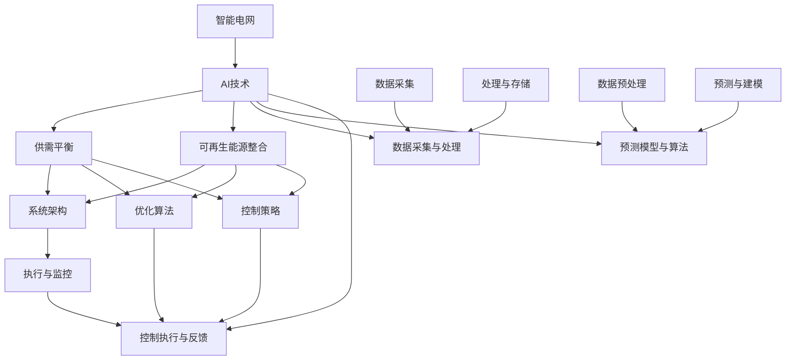
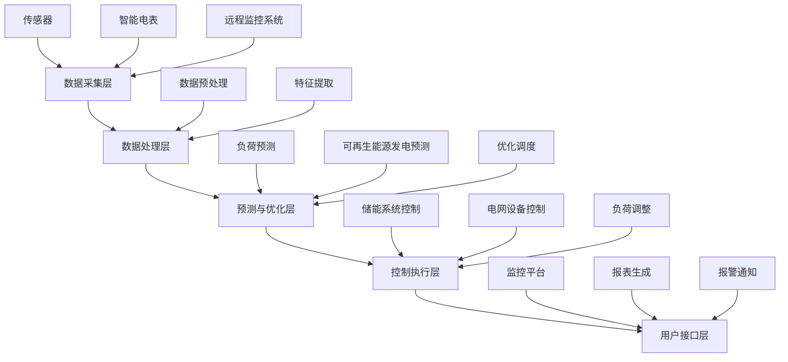
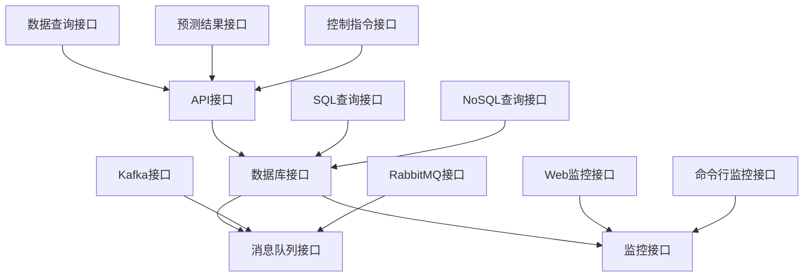

                 

### AI驱动的智能电网优化：平衡供需与可再生能源整合

#### 关键词：智能电网、人工智能、供需平衡、可再生能源、优化

> 摘要：本文将深入探讨AI驱动的智能电网优化，重点分析供需平衡和可再生能源整合的关键问题。通过详细阐述智能电网的演进背景、AI应用原理、可再生能源挑战以及供需平衡策略，本文旨在提供一套系统化、可操作的优化方案，以促进智能电网的可持续发展。

#### 引言

随着全球能源危机和气候变化问题的日益严峻，可再生能源的利用成为各国能源战略的重要方向。智能电网作为能源系统的重要组成部分，其在可再生能源整合、供需平衡等方面的优化变得尤为重要。AI技术作为推动智能电网发展的重要驱动力，其在电网优化中的应用前景广阔。本文将围绕智能电网优化展开，分析供需平衡与可再生能源整合的核心问题，并探讨AI驱动的优化方案。

## 第一部分：AI驱动的智能电网优化基础

### 1.1 问题背景

#### 智能电网的定义与演进

智能电网是指通过现代通信技术、信息技术、控制技术等，将电力系统的各个环节连接起来，实现信息的互联互通，从而提升电力系统的智能化水平。智能电网的建设旨在解决传统电网在能源消耗、能源分布、可再生能源接入等方面的问题，提高电力系统的运行效率、可靠性和可持续性。

智能电网的发展大致可以分为三个阶段：

- **传统电网阶段**：以物理输电为基础，缺乏智能化、自动化的调度和管理手段。
- **初步智能电网阶段**：引入了一些自动化设备，如自动开关、电能质量监测器等，开始实现局部自动化。
- **智能电网阶段**：全面引入信息技术和智能技术，实现电力系统的全面智能化。

#### 可再生能源的发展与挑战

可再生能源包括太阳能、风能、水能、生物质能等。随着环保意识的提高和技术的进步，可再生能源在全球范围内的利用越来越广泛。然而，可再生能源具有间歇性和波动性，这对电网的稳定性和供需平衡提出了巨大挑战。

#### 智能电网优化的重要性

智能电网优化旨在通过先进技术手段，提高电网的运行效率、稳定性和可持续性。AI技术在其中发挥着至关重要的作用，通过数据分析和预测，优化电网调度、负荷管理、能源分配等环节，实现供需平衡和可再生能源的高效利用。

### 1.2 核心概念

#### AI驱动的智能电网

AI驱动的智能电网是指利用人工智能技术，实现电网的智能化管理和优化。AI技术包括机器学习、深度学习、强化学习等，通过这些技术，电网可以实现自动感知、自主学习和智能决策。

#### 供需平衡

供需平衡是指电网在供应和需求之间保持平衡的状态。智能电网优化需要通过预测负荷、优化调度、管理储能等方式，实现供需的动态平衡。

#### 可再生能源整合

可再生能源整合是指将可再生能源有效地接入电网，并实现其稳定供应和高效利用。智能电网优化需要解决可再生能源的间歇性和波动性问题，通过预测、调度和储能等技术，实现可再生能源的高效整合。

#### 系统架构

智能电网优化系统架构包括数据采集、数据处理、预测模型、优化算法、控制执行等环节。通过这些环节的协同工作，实现智能电网的优化运行。

### 1.3 概念联系与关系图

下面是AI驱动的智能电网优化概念联系图，使用Mermaid绘制：

```
graph TD
A[智能电网] --> B[AI技术]
B --> C[供需平衡]
B --> D[可再生能源整合]
C --> E[系统架构]
D --> E
```

## 第2章：AI在智能电网优化中的应用

### 2.1 人工智能的基本原理

#### 机器学习基础

机器学习是一种使计算机通过数据学习并做出决策的方法。其主要步骤包括数据采集、数据预处理、模型选择、模型训练和模型评估。

#### 深度学习原理

深度学习是机器学习的一个分支，通过构建多层神经网络，实现数据的自动特征提取和学习。深度学习在图像识别、语音识别等领域取得了显著的成果。

#### 强化学习应用

强化学习是一种通过奖励机制引导模型进行学习的方法。其在智能决策、自动化控制等领域具有广泛应用。

### 2.2 人工智能算法与应用

#### 监督学习算法

监督学习算法通过已有数据标签来训练模型，然后利用训练好的模型对新数据进行预测。常见的监督学习算法包括线性回归、逻辑回归、支持向量机等。

#### 无监督学习算法

无监督学习算法不依赖数据标签，通过自动发现数据中的模式和结构。常见的无监督学习算法包括聚类算法、降维算法等。

#### 强化学习算法

强化学习算法通过奖励机制引导模型进行学习，适用于需要连续决策的任务。常见的强化学习算法包括Q学习、深度强化学习等。

### 2.3 AI驱动的智能电网优化算法

#### 优化目标

AI驱动的智能电网优化目标包括供需平衡、可再生能源整合、电网稳定性等。

#### 常见算法

常见的AI驱动的智能电网优化算法包括：

- **基于监督学习的负荷预测算法**：如线性回归、神经网络等。
- **基于无监督学习的聚类算法**：如K均值聚类、层次聚类等。
- **基于强化学习的电网调度算法**：如Q学习、深度强化学习等。

#### 算法比较

不同算法在性能、复杂度、适用场景等方面存在差异。选择合适的算法需要根据具体问题进行综合评估。

## 第二部分：供需平衡与智能电网优化

### 第3章：可再生能源整合策略

#### 3.1 可再生能源概述

可再生能源包括太阳能、风能、水能、生物质能等。这些能源具有清洁、可再生、低碳等特点，对缓解全球能源危机和应对气候变化具有重要意义。

#### 3.2 可再生能源预测与调度

可再生能源具有间歇性和波动性，这对电网的稳定性和供需平衡提出了挑战。通过预测可再生能源的发电量，可以提前进行调度，确保电网的稳定运行。

#### 3.3 可再生能源整合的案例分析

案例分析可以深入了解可再生能源整合的成功经验与失败教训，为后续工作提供参考。

## 第4章：智能电网供需预测

#### 4.1 需求预测方法

需求预测是智能电网优化的重要环节。常见的需求预测方法包括历史数据法、神经网络法、季节性调整法等。

#### 4.2 供给预测方法

供给预测包括可再生能源预测、燃料价格预测、负荷预测等。通过多种预测方法结合，可以提高预测的准确性。

#### 4.3 预测结果分析与优化

预测结果分析可以帮助我们了解电网的运行状况，发现潜在问题。通过优化策略，可以提高预测的准确性，为电网优化提供支持。

## 第5章：供需平衡策略

#### 5.1 平衡目标与指标

供需平衡的目标是确保电网在供应和需求之间保持稳定。常见的平衡指标包括能源利用效率、系统稳定性、储能系统管理等。

#### 5.2 平衡策略设计

平衡策略设计包括负荷管理、价格策略、储能系统优化等。通过多种策略的协同作用，可以实现供需平衡。

#### 5.3 平衡策略案例分析

案例分析可以帮助我们了解供需平衡策略的应用效果，发现优化空间。

## 第三部分：可再生能源整合与供需平衡

### 第6章：智能电网中的储能技术

#### 6.1 储能技术概述

储能技术是实现供需平衡和可再生能源高效利用的重要手段。常见的储能技术包括电池储能、抽水储能、电化学储能等。

#### 6.2 储能技术在供需平衡中的应用

储能技术在供需平衡中的应用主要包括储能系统设计、储能策略优化、储能与供需平衡的关系等。

#### 6.3 储能技术案例分析

通过案例分析，可以深入了解储能技术的应用效果，发现优化空间。

### 第7章：AI驱动的智能电网优化实践

#### 7.1 实践概述

本章节将介绍一个具体的AI驱动的智能电网优化实践项目，包括项目背景、项目目标、项目架构等。

#### 7.2 系统设计与实现

本章节将详细介绍系统设计与实现过程，包括需求分析、系统架构设计、系统接口设计等。

#### 7.3 核心算法与实现

本章节将重点介绍核心算法的原理、实现过程，并通过Python代码进行详细讲解。

#### 7.4 实际案例分析与讲解

本章节将通过实际案例，深入剖析AI驱动的智能电网优化实践，总结经验教训。

### 第8章：未来展望与挑战

#### 8.1 智能电网优化的发展趋势

本章节将分析智能电网优化的发展趋势，包括新技术引入、系统集成、智能决策等。

#### 8.2 面临的挑战与对策

本章节将探讨智能电网优化面临的数据隐私与安全、技术标准化、法律法规等挑战，并提出相应的对策。

#### 8.3 未来展望

本章节将展望智能电网优化的未来发展方向，包括可再生能源发展、智能电网生态体系、全球合作与竞争等。

## 结束语

本文从供需平衡和可再生能源整合的角度，探讨了AI驱动的智能电网优化问题。通过详细阐述核心概念、算法原理、实践案例等，本文旨在为智能电网优化提供一套系统化、可操作的解决方案。未来，随着技术的不断进步和应用的深入，AI驱动的智能电网优化必将为全球能源转型和可持续发展做出更大贡献。

**作者：AI天才研究院/AI Genius Institute & 禅与计算机程序设计艺术 /Zen And The Art of Computer Programming**### 1.1 问题背景

#### 智能电网的定义与演进

智能电网（Smart Grid）是指通过现代通信技术、信息技术、控制技术等，将电力系统的各个环节连接起来，实现信息的互联互通，从而提升电力系统的智能化水平。智能电网的建设旨在解决传统电网在能源消耗、能源分布、可再生能源接入等方面的问题，提高电力系统的运行效率、可靠性和可持续性。

智能电网的发展大致可以分为三个阶段：

- **传统电网阶段**：以物理输电为基础，缺乏智能化、自动化的调度和管理手段。
- **初步智能电网阶段**：引入了一些自动化设备，如自动开关、电能质量监测器等，开始实现局部自动化。
- **智能电网阶段**：全面引入信息技术和智能技术，实现电力系统的全面智能化。

#### 可再生能源的发展与挑战

可再生能源包括太阳能、风能、水能、生物质能等。这些能源具有清洁、可再生、低碳等特点，对缓解全球能源危机和应对气候变化具有重要意义。随着环保意识的提高和技术的进步，可再生能源在全球范围内的利用越来越广泛。然而，可再生能源具有间歇性和波动性，这对电网的稳定性和供需平衡提出了巨大挑战。

#### 智能电网优化的重要性

智能电网优化旨在通过先进技术手段，提高电网的运行效率、稳定性和可持续性。AI技术作为推动智能电网发展的重要驱动力，其在电网优化中的应用前景广阔。通过数据分析和预测，AI技术可以优化电网调度、负荷管理、能源分配等环节，实现供需平衡和可再生能源的高效利用。

### 1.2 核心概念

#### AI驱动的智能电网

AI驱动的智能电网是指利用人工智能技术，实现电网的智能化管理和优化。AI技术包括机器学习、深度学习、强化学习等，通过这些技术，电网可以实现自动感知、自主学习和智能决策。

#### 供需平衡

供需平衡是指电网在供应和需求之间保持平衡的状态。智能电网优化需要通过预测负荷、优化调度、管理储能等方式，实现供需的动态平衡。

#### 可再生能源整合

可再生能源整合是指将可再生能源有效地接入电网，并实现其稳定供应和高效利用。智能电网优化需要解决可再生能源的间歇性和波动性问题，通过预测、调度和储能等技术，实现可再生能源的高效整合。

#### 系统架构

智能电网优化系统架构包括数据采集、数据处理、预测模型、优化算法、控制执行等环节。通过这些环节的协同工作，实现智能电网的优化运行。

### 1.3 概念联系与关系图

下面是AI驱动的智能电网优化概念联系图，使用Mermaid绘制：

```
graph TD
A[智能电网] --> B[AI技术]
B --> C[供需平衡]
B --> D[可再生能源整合]
C --> E[系统架构]
D --> E
```

### 1.3 概念联系与关系图

为了更好地理解AI驱动的智能电网优化中的各个核心概念及其相互关系，我们可以借助Mermaid图表来绘制一个概念联系图。以下是一个简单的Mermaid图表示例，描述了智能电网、AI技术、供需平衡、可再生能源整合以及系统架构之间的关系。



在这个图表中：

- **智能电网（A）** 是核心系统，它通过AI技术（B）实现供需平衡（C）和可再生能源整合（D）。
- **系统架构（E）** 包括数据采集与处理（F）、预测模型与算法（G）和控制执行与反馈（H）。
- **数据采集（I）** 和 **处理与存储（J）** 是数据处理环节，为预测模型和优化算法提供数据支持。
- **预测与建模（K）** 和 **优化算法（M）** 是智能电网优化的关键环节，用于分析和预测供需平衡和可再生能源整合。
- **控制策略（N）** 和 **执行与监控（O）** 是系统架构的执行环节，用于根据预测结果调整电网运行状态。

通过这个概念联系图，我们可以清晰地看到AI驱动的智能电网优化中各个组件的相互作用和依赖关系。这个图表有助于我们更好地理解和设计智能电网优化系统，从而实现电网的高效运行和可持续发展。在实际应用中，可以根据具体需求对这个图表进行扩展和细化，以便更全面地描述系统的复杂性和各个模块的具体功能。

### 2.1 人工智能的基本原理

#### 机器学习基础

机器学习（Machine Learning，ML）是一种通过数据训练模型，使计算机能够自动进行预测和决策的方法。其基本原理是让计算机从大量数据中学习规律，从而对未知数据进行分类、回归、聚类等操作。

机器学习的过程大致可以分为以下几步：

1. **数据采集**：收集相关的数据，这些数据可以是结构化的（如表格数据），也可以是非结构化的（如图像、文本等）。
2. **数据预处理**：清洗数据，处理缺失值、异常值，进行特征工程，将原始数据转化为适合模型训练的格式。
3. **模型选择**：根据问题的类型选择合适的机器学习模型，如线性回归、决策树、支持向量机等。
4. **模型训练**：使用训练数据对模型进行训练，通过调整模型参数，使模型能够较好地拟合数据。
5. **模型评估**：使用验证数据对模型进行评估，通过评估指标（如准确率、召回率、均方误差等）判断模型的性能。
6. **模型部署**：将训练好的模型部署到生产环境中，对未知数据进行预测和决策。

#### 深度学习原理

深度学习（Deep Learning，DL）是机器学习的一个分支，通过构建多层神经网络（Neural Networks）来实现复杂的特征提取和学习。深度学习模型通常由多个隐藏层组成，每一层都能够对输入数据进行非线性变换，从而实现数据的层次化特征提取。

深度学习的基本原理包括：

1. **神经网络结构**：深度学习模型的核心是神经网络，由多个神经元（或节点）组成。每个神经元接收来自前一层的输入，通过激活函数进行非线性变换，然后传递给下一层。
2. **前向传播**：在前向传播过程中，数据从输入层传递到输出层，每一层神经元对数据进行处理和变换。
3. **反向传播**：在反向传播过程中，模型根据输出误差，调整各层的权重和偏置，使模型能够更好地拟合数据。
4. **优化算法**：深度学习通常使用梯度下降（Gradient Descent）等优化算法来更新模型参数，以最小化损失函数。

#### 强化学习应用

强化学习（Reinforcement Learning，RL）是一种通过奖励机制引导模型进行学习的方法。在强化学习过程中，模型通过与环境互动，不断调整策略，以实现长期奖励最大化。

强化学习的基本原理包括：

1. **环境（Environment）**：环境是模型进行交互的实体，可以是一个游戏、机器人控制系统等。
2. **状态（State）**：状态是模型当前所处的环境状态，如游戏中的棋盘状态、机器人位置等。
3. **动作（Action）**：动作是模型可以执行的行为，如游戏中的下一步棋、机器人的移动等。
4. **奖励（Reward）**：奖励是模型执行动作后获得的即时反馈，用于指导模型选择下一步动作。
5. **策略（Policy）**：策略是模型根据当前状态选择动作的规则，可以是确定性策略或随机策略。

强化学习在实际应用中非常广泛，如自动驾驶、机器人控制、游戏AI等。通过不断的试错和奖励反馈，强化学习模型能够逐步学会在复杂环境中做出最优决策。

### 2.2 人工智能算法与应用

#### 监督学习算法

监督学习（Supervised Learning）是一种机器学习算法，其训练数据包含输入和对应的输出标签。监督学习算法通过学习输入和输出之间的关系，实现对未知数据的预测。

常见的监督学习算法包括：

1. **线性回归（Linear Regression）**：线性回归是一种最简单的监督学习算法，通过找到一个线性关系来预测连续值输出。
   - **算法原理**：线性回归模型假设输入和输出之间存在线性关系，通过最小化损失函数来找到最佳拟合直线。
   - **适用场景**：适用于预测数值型数据，如房价预测、股票价格预测等。

2. **逻辑回归（Logistic Regression）**：逻辑回归是一种用于分类问题的监督学习算法，通过逻辑函数将线性回归模型的输出映射到概率值。
   - **算法原理**：逻辑回归模型通过最小化对数似然损失函数来找到最佳拟合曲线，该曲线可以将输入数据划分为不同的类别。
   - **适用场景**：适用于二分类问题，如邮件分类、情感分析等。

3. **支持向量机（Support Vector Machine，SVM）**：支持向量机是一种基于间隔最大化原理的监督学习算法，用于分类和回归分析。
   - **算法原理**：SVM通过找到一个最佳的超平面，使得分类边界到各类别样本的最远距离最大化。
   - **适用场景**：适用于高维空间的数据分类，如文本分类、图像分类等。

4. **决策树（Decision Tree）**：决策树是一种基于树形结构进行决策的监督学习算法，通过一系列的判断条件将数据划分为不同的类别。
   - **算法原理**：决策树通过递归划分数据集，在每个节点选择最佳的划分条件，直到满足停止条件。
   - **适用场景**：适用于分类和回归问题，如金融风险评估、医学诊断等。

5. **随机森林（Random Forest）**：随机森林是一种基于决策树的集成学习方法，通过构建多棵决策树，并对它们的预测结果进行投票来提高模型的准确性和泛化能力。
   - **算法原理**：随机森林通过随机选取特征和样本子集，构建多棵决策树，并合并它们的预测结果。
   - **适用场景**：适用于分类和回归问题，特别是处理高维数据和非线性关系问题。

#### 无监督学习算法

无监督学习（Unsupervised Learning）是一种机器学习算法，其训练数据不包含输出标签。无监督学习算法通过探索数据内在的结构和模式，实现对数据的聚类、降维等操作。

常见的无监督学习算法包括：

1. **K均值聚类（K-Means Clustering）**：K均值聚类是一种基于距离度量的聚类算法，通过将数据划分为K个簇，使每个簇内的数据点之间距离最小化。
   - **算法原理**：K均值聚类通过初始化K个簇中心，然后不断迭代更新簇中心，直到收敛。
   - **适用场景**：适用于发现数据的聚类结构，如客户分群、图像分割等。

2. **层次聚类（Hierarchical Clustering）**：层次聚类是一种通过逐步合并或分裂簇来构建聚类层次结构的算法。
   - **算法原理**：层次聚类可以分为自底向上的凝聚层次聚类和自顶向下的分裂层次聚类。
   - **适用场景**：适用于探索数据的层次结构，如家庭关系、社交网络分析等。

3. **主成分分析（Principal Component Analysis，PCA）**：主成分分析是一种降维算法，通过将数据投影到新的正交坐标系中，提取主要成分来简化数据。
   - **算法原理**：PCA通过求解协方差矩阵的特征值和特征向量，将数据投影到最小二乘意义上最优的子空间。
   - **适用场景**：适用于降维和特征提取，如图像压缩、异常检测等。

4. **自编码器（Autoencoder）**：自编码器是一种基于神经网络的无监督学习算法，通过学习数据的重构来提取有效特征。
   - **算法原理**：自编码器由编码器和解码器组成，编码器将输入数据压缩为低维特征表示，解码器尝试重构原始数据。
   - **适用场景**：适用于特征提取和数据压缩，如图像识别、文本生成等。

#### 强化学习算法

强化学习（Reinforcement Learning，RL）是一种通过奖励机制引导模型进行学习的方法。强化学习算法在探索未知环境时，通过不断尝试和反馈，逐步优化策略。

常见的强化学习算法包括：

1. **Q学习（Q-Learning）**：Q学习是一种基于值函数的强化学习算法，通过学习状态-动作值函数来选择最优动作。
   - **算法原理**：Q学习通过更新Q值（状态-动作值函数），使得在给定状态下选择具有最大Q值的动作。
   - **适用场景**：适用于确定性环境，如机器人路径规划、棋类游戏等。

2. **深度强化学习（Deep Reinforcement Learning，DRL）**：深度强化学习是一种结合深度学习与强化学习的方法，通过神经网络来表示状态-动作值函数。
   - **算法原理**：DRL使用深度神经网络来近似Q值函数或策略函数，通过优化网络参数来学习最优策略。
   - **适用场景**：适用于复杂环境，如自动驾驶、游戏AI等。

3. **策略梯度（Policy Gradient）**：策略梯度是一种通过直接优化策略函数的强化学习算法，通过梯度上升法来更新策略参数。
   - **算法原理**：策略梯度通过估计策略梯

### 2.3 AI驱动的智能电网优化算法

#### 优化目标

AI驱动的智能电网优化旨在通过数据分析和算法，实现电网的供需平衡、运行效率和可靠性。具体的优化目标包括：

1. **供需平衡**：通过预测负荷和可再生能源发电量，调整电网调度策略，确保供应与需求之间的平衡。
2. **运行效率**：优化电网调度和能源分配，降低运行成本，提高能源利用率。
3. **可靠性**：通过实时监测和预测，及时发现并解决电网故障，保障电网的稳定运行。

#### 常见算法

AI驱动的智能电网优化算法涵盖了多种机器学习和深度学习技术，以下是一些常见的优化算法：

1. **基于监督学习的负荷预测算法**：
   - **线性回归**：通过建立负荷与时间的关系模型，预测未来负荷。
   - **神经网络**：通过构建多层感知器模型，自动提取负荷特征，进行预测。
   - **时间序列模型**：如ARIMA模型、LSTM模型等，用于分析负荷的时间序列特性。

2. **基于无监督学习的聚类算法**：
   - **K均值聚类**：将负荷数据划分为若干个簇，分析不同簇的特征，为电网优化提供参考。
   - **层次聚类**：构建聚类层次结构，用于分析负荷的聚类特性。

3. **基于强化学习的电网调度算法**：
   - **Q学习**：通过学习状态-动作值函数，选择最优调度策略。
   - **深度强化学习**：使用深度神经网络，学习状态-动作值函数或策略函数，进行智能调度。

4. **基于优化的能源分配算法**：
   - **线性规划**：通过建立线性规划模型，优化能源分配，满足供需平衡。
   - **遗传算法**：通过模拟自然进化过程，寻找最优能源分配方案。
   - **粒子群优化**：通过模拟鸟群觅食行为，优化能源分配。

#### 算法比较

不同优化算法在性能、复杂度、适用场景等方面存在差异，以下进行比较：

1. **线性回归和神经网络**：
   - **性能**：神经网络在处理非线性关系和复杂特征时具有优势，而线性回归在处理线性关系时表现较好。
   - **复杂度**：神经网络需要大量的数据和计算资源，而线性回归相对简单，计算速度快。
   - **适用场景**：线性回归适用于简单线性关系问题，神经网络适用于复杂非线性关系问题。

2. **K均值聚类和层次聚类**：
   - **性能**：两种算法的性能相当，K均值聚类在计算效率上占优势，而层次聚类在分析聚类层次结构上更为灵活。
   - **复杂度**：K均值聚类算法相对简单，易于实现，而层次聚类算法涉及更多的迭代计算，计算复杂度较高。
   - **适用场景**：K均值聚类适用于大规模数据集的快速聚类，层次聚类适用于分析聚类层次结构。

3. **Q学习和深度强化学习**：
   - **性能**：深度强化学习在处理高维状态和复杂决策问题时具有优势，而Q学习在确定性环境中表现较好。
   - **复杂度**：深度强化学习算法涉及大量的计算和存储资源，而Q学习算法相对简单，计算效率较高。
   - **适用场景**：深度强化学习适用于自动驾驶、机器人控制等复杂场景，Q学习适用于路径规划、资源调度等确定性环境。

4. **线性规划和优化算法**：
   - **性能**：优化算法在处理复杂约束和大规模优化问题时具有优势，而线性规划在处理线性优化问题时更为高效。
   - **复杂度**：优化算法如遗传算法、粒子群优化等涉及复杂的搜索过程，而线性规划算法相对简单。
   - **适用场景**：线性规划适用于简单的线性优化问题，而优化算法适用于复杂非线性优化问题。

通过比较不同算法的性能、复杂度和适用场景，可以根据实际需求选择合适的优化算法，以实现智能电网的优化目标。

### 3.1 可再生能源概述

可再生能源是指那些在短时间内不会枯竭的能源，包括太阳能、风能、水能、生物质能等。这些能源具有清洁、可再生、低碳等特点，对缓解全球能源危机和应对气候变化具有重要意义。随着科技的进步和环保意识的提高，可再生能源在全球范围内的利用越来越广泛。

#### 类型与特性

1. **太阳能**：太阳能是指利用太阳辐射能量进行发电。太阳能光伏发电和太阳能热利用是最常见的两种形式。太阳能具有广泛分布、清洁无污染、资源丰富的特点，但受天气和地理位置影响较大，存在间歇性和波动性问题。

2. **风能**：风能是指利用风力旋转风力涡轮机，将风能转换为电能。风能具有可再生、清洁、分布广泛的特点，但受风速、风向和地形影响，存在不稳定性和间歇性问题。

3. **水能**：水能是指利用水流或水位差进行发电。水能资源丰富，技术成熟，但建设周期长，投资大，且对生态环境有一定影响。

4. **生物质能**：生物质能是指利用生物质材料（如农作物废弃物、林业废弃物、动物粪便等）进行发电或热利用。生物质能具有可再生、低碳、清洁的特点，但受资源分布和收集处理成本影响。

#### 发展现状与趋势

1. **太阳能**：太阳能光伏发电技术迅速发展，成本大幅下降。全球光伏装机容量持续增长，中国、美国、印度等国已成为光伏发电大国。未来，太阳能光伏发电将向高效化、大规模、分布式方向发展。

2. **风能**：风力发电技术逐步成熟，全球风力发电装机容量逐年增加。海上风电和离岸风电成为发展重点。未来，风能将向更大规模、更高效、更环保的方向发展。

3. **水能**：水能资源开发主要集中在发展中国家，如中国、巴西、印度等。未来，水能资源开发将更加注重环境保护和生态平衡。

4. **生物质能**：生物质能利用技术不断进步，生物质发电、生物质燃气等技术逐渐成熟。生物质能开发利用主要集中在农业大国和林业资源丰富的国家。未来，生物质能将向高效、清洁、可持续利用方向发展。

#### 整合的挑战

可再生能源的整合面临以下挑战：

1. **间歇性和波动性**：可再生能源发电具有间歇性和波动性，这对电网的稳定性提出了挑战。如何实现可再生能源的稳定供应和高效利用是当前研究的热点。

2. **储能技术**：储能技术是实现可再生能源稳定供应的关键。但目前储能技术成本高、寿命有限，如何降低储能成本、提高储能效率是亟待解决的问题。

3. **电网适应性**：传统电网在设计时并未考虑大规模可再生能源接入，如何改造现有电网，提高其适应性，是可再生能源整合的重要课题。

4. **政策和法规**：可再生能源发展需要政策和法规的支持。如何制定合理的政策，促进可再生能源的健康发展，是各国政府面临的挑战。

### 3.2 可再生能源预测与调度

可再生能源的间歇性和波动性给电网调度带来了巨大挑战。为了实现可再生能源的高效利用和电网的稳定运行，预测可再生能源的发电量和调度策略设计至关重要。

#### 预测方法

1. **时间序列预测**：基于历史发电数据进行时间序列分析，利用自回归模型（AR）、移动平均模型（MA）、自回归移动平均模型（ARMA）等，预测未来的发电量。

2. **统计模型**：利用统计方法，如线性回归、多元回归等，建立发电量与影响因子（如天气、季节等）之间的关系模型，预测未来的发电量。

3. **机器学习方法**：利用机器学习算法，如随机森林、支持向量机、神经网络等，对大量历史数据进行训练，提取关键特征，预测未来的发电量。

4. **深度学习方法**：利用深度学习模型，如卷积神经网络（CNN）、循环神经网络（RNN）、长短时记忆网络（LSTM）等，对复杂的多维数据进行处理，提高预测准确性。

#### 调度策略

1. **基于预测的调度策略**：根据可再生能源预测结果，提前安排电网调度计划，确保可再生能源发电量能够及时供应。

2. **基于负载预测的调度策略**：结合可再生能源预测和电网负荷预测，优化调度策略，确保供需平衡。

3. **基于储能系统的调度策略**：利用储能系统，实现可再生能源的短期调节，平滑可再生能源发电波动，提高电网稳定性。

4. **多能协同调度策略**：结合不同类型可再生能源和传统能源，实现协同调度，优化能源结构，提高整体能源利用效率。

#### 风险评估

1. **供需风险**：评估可再生能源发电波动对电网供需平衡的影响，确保电网运行在安全范围内。

2. **储能风险**：评估储能系统的稳定性和寿命，确保储能系统能够在需要时提供足够的电力。

3. **设备风险**：评估电网设备（如变压器、断路器等）的负载能力和故障风险，确保设备在高峰期和极端条件下能够正常运行。

4. **环境风险**：评估可再生能源开发和利用对环境的影响，如生态破坏、水资源消耗等，确保可再生能源的可持续发展。

### 3.3 可再生能源整合的案例分析

#### 成功案例

1. **丹麦**：丹麦是全球可再生能源发展的领军国家之一。通过大规模的风能和太阳能发电，丹麦实现了能源的清洁化和低碳化。同时，丹麦还通过智能电网技术，实现了可再生能源的高效整合和调度。

2. **德国**：德国的可再生能源政策取得了显著成果。通过实施“能源转型”计划，德国在短短几年内大幅增加了可再生能源的装机容量。德国的智能电网技术和储能系统也为可再生能源的高效利用提供了保障。

3. **中国**：中国在可再生能源发展方面也取得了巨大进步。中国通过实施“光伏领跑者计划”和“风电领跑者计划”，推动了光伏和风电技术的进步。同时，中国还通过大规模储能系统的建设，提高了可再生能源的利用率。

#### 失败案例

1. **印度**：印度在可再生能源发展方面存在一定问题。尽管印度拥有丰富的太阳能和风能资源，但其电网调度能力和可再生能源整合技术相对落后，导致可再生能源利用率较低。

2. **南非**：南非的可再生能源政策也面临挑战。南非在建设可再生能源项目时，未能充分考虑电网的适应性和储能系统的建设，导致可再生能源发电存在较大波动，影响了电网的稳定性。

#### 教训与启示

1. **政策支持**：政府需要制定合理的政策和法规，鼓励可再生能源的发展，提高电网的适应性和储能技术水平。

2. **技术创新**：需要加大技术研发力度，提高可再生能源的发电效率和储能技术性能，降低可再生能源的成本。

3. **智能电网建设**：智能电网技术是实现可再生能源高效整合的关键。需要加快智能电网的建设，实现数据采集、预测调度、实时监控等功能。

4. **市场机制**：建立合理的市场机制，激励可再生能源企业参与竞争，提高可再生能源的利用率和经济效益。

### 第4章：智能电网供需预测

智能电网的供需预测是确保电网稳定运行和高效管理的重要环节。通过准确预测负荷和供给，可以优化电网调度策略，提高能源利用效率，实现供需平衡。

#### 4.1 需求预测方法

需求预测是智能电网供需预测的核心内容。以下是一些常用的需求预测方法：

1. **历史数据法**：通过分析历史负荷数据，提取负荷变化的规律和趋势，预测未来的负荷需求。这种方法简单有效，但可能无法捕捉到突发性的负荷变化。

2. **时间序列预测**：利用时间序列分析模型，如自回归模型（AR）、移动平均模型（MA）、自回归移动平均模型（ARMA）等，对历史负荷数据进行拟合，预测未来的负荷需求。这种方法适用于平稳时间序列数据的预测。

3. **神经网络法**：通过构建多层感知器模型（MLP）或长短时记忆网络（LSTM）等神经网络模型，对历史负荷数据进行训练，提取负荷变化特征，预测未来的负荷需求。这种方法适用于非平稳时间序列数据的预测。

4. **季节性调整法**：对于存在季节性变化的需求，可以通过季节性调整模型，如X-11季节性调整方法，对历史负荷数据进行季节性调整，预测未来的负荷需求。这种方法适用于季节性明显的需求预测。

5. **机器学习方法**：利用机器学习方法，如随机森林（RF）、支持向量机（SVM）等，对历史负荷数据进行特征工程和模型训练，预测未来的负荷需求。这种方法具有较好的泛化能力和预测准确性。

#### 4.2 供给预测方法

供给预测是智能电网供需预测的另一重要内容。以下是一些常用的供给预测方法：

1. **可再生能源预测**：对于可再生能源发电，可以通过天气数据、历史发电数据等，利用统计模型或机器学习模型，预测未来可再生能源的发电量。常见的方法包括：

   - **统计模型**：如线性回归模型、多元回归模型等。
   - **机器学习方法**：如随机森林、支持向量机、长短时记忆网络（LSTM）等。

2. **传统能源预测**：对于传统能源发电，如燃煤、燃气等，可以通过历史发电数据、燃料价格、设备运行状态等，利用统计模型或机器学习模型，预测未来传统能源的发电量。常见的方法包括：

   - **统计模型**：如线性回归模型、多元回归模型等。
   - **机器学习方法**：如随机森林、支持向量机、神经网络等。

3. **混合能源预测**：对于混合能源发电，可以通过对不同能源类型的预测结果进行加权平均，得到总的发电量预测。这种方法适用于多种能源类型共同参与发电的场景。

#### 4.3 预测结果分析与优化

预测结果分析是评估预测模型性能和优化预测策略的重要环节。以下是一些常用的预测结果分析方法和优化策略：

1. **误差分析**：通过计算预测值与实际值之间的误差，如均方误差（MSE）、均方根误差（RMSE）等，评估预测模型的准确性。根据误差分析结果，可以识别模型的不足之处，并进行优化。

2. **敏感性分析**：通过分析模型参数对预测结果的影响，评估模型的稳定性。对于敏感参数，可以进一步优化模型参数，提高预测稳定性。

3. **模型优化**：根据预测结果分析，对现有预测模型进行优化。常见的方法包括：

   - **模型选择**：根据数据特征和预测目标，选择合适的预测模型。
   - **特征工程**：提取更多有效的特征，提高模型的预测能力。
   - **模型融合**：将多个模型的结果进行融合，提高整体预测性能。

4. **实时调整**：根据实时数据，对预测模型进行动态调整，以提高预测的准确性。例如，在负载高峰期，可以加大负荷预测的权重，降低可再生能源预测的权重，以应对突发性负荷变化。

5. **预测结果应用**：将预测结果应用于电网调度和能源管理，实现供需平衡和优化能源分配。例如，根据负荷预测结果，提前安排电网调度计划，确保电网在高峰期有足够的供电能力。

### 4.4 预测结果分析与优化

预测结果分析是智能电网供需预测中至关重要的一环，其目的在于评估预测模型的准确性，发现模型的不足之处，并针对这些问题进行优化。以下是一些常用的预测结果分析方法和优化策略：

#### 4.4.1 误差分析

误差分析是评估预测模型性能的基本方法。常见的误差评价指标包括均方误差（MSE）、均方根误差（RMSE）、平均绝对误差（MAE）等。这些指标可以帮助我们了解预测值与实际值之间的差异，从而评估模型的预测准确性。

- **均方误差（MSE）**：$$MSE = \frac{1}{N}\sum_{i=1}^{N}(y_i - \hat{y}_i)^2$$
  其中，\(y_i\) 表示第 \(i\) 次预测的实际值，\(\hat{y}_i\) 表示第 \(i\) 次预测的值，\(N\) 表示总预测次数。

- **均方根误差（RMSE）**：$$RMSE = \sqrt{MSE}$$
  RMSE 越小，表示预测误差越小，模型的预测性能越好。

- **平均绝对误差（MAE）**：$$MAE = \frac{1}{N}\sum_{i=1}^{N}|y_i - \hat{y}_i|$$
  MAE 越小，表示预测误差越小。

通过误差分析，我们可以了解模型的预测性能，并针对误差较大的预测结果进行优化。

#### 4.4.2 敏感性分析

敏感性分析是评估模型稳定性的一种方法，它帮助我们了解模型参数对预测结果的影响。通过敏感性分析，我们可以识别出模型中对预测结果影响较大的参数，从而对模型进行优化。

敏感性分析的方法包括：

- **参数变化法**：在模型参数范围内，逐步调整参数值，观察预测结果的变化，分析参数对预测结果的影响。
- **敏感度系数法**：计算每个参数对预测结果的敏感度系数，敏感度系数越大，表示该参数对预测结果的影响越大。

#### 4.4.3 模型优化

根据误差分析和敏感性分析的结果，可以对预测模型进行优化。常见的优化策略包括：

- **模型选择**：根据数据特征和预测目标，选择合适的预测模型。例如，对于非线性关系的数据，可以考虑使用神经网络模型。
- **特征工程**：提取更多有效的特征，提高模型的预测能力。例如，可以添加时间序列特征、季节性特征等。
- **模型融合**：将多个模型的结果进行融合，提高整体预测性能。常见的模型融合方法包括加权平均、投票法等。

#### 4.4.4 实时调整

在智能电网中，实时数据对预测结果的影响非常大。为了提高预测的准确性，我们可以采用以下实时调整策略：

- **动态调整模型参数**：根据实时数据，动态调整模型参数，以提高预测的准确性。
- **在线更新模型**：利用实时数据，对预测模型进行在线更新，使其能够适应不断变化的数据特征。
- **实时预测与反馈**：在实时预测过程中，对预测结果进行反馈，根据反馈结果调整预测策略，以提高预测准确性。

通过以上分析方法和优化策略，我们可以有效地提高智能电网的供需预测准确性，为电网调度和能源管理提供有力支持。

### 4.5 平衡目标与指标

实现智能电网的供需平衡是确保电网稳定运行和高效管理的重要目标。平衡目标与指标的设计直接影响供需平衡的效果。以下是一些关键的平衡目标与指标：

#### 能源利用效率

能源利用效率是衡量电网运行效率的重要指标。它反映了电网在发电、输电、配电等环节中能源的利用程度。高能源利用效率意味着能源浪费少，能源利用率高。可以通过以下方法提高能源利用效率：

- **优化发电结构**：合理安排不同类型发电资源的发电量，确保高效能源资源得到充分利用。
- **提高输配电效率**：通过技术改进和管理优化，降低输配电损耗。
- **加强需求侧管理**：通过负荷管理、需求响应等手段，提高用户侧的能源利用效率。

#### 系统稳定性

系统稳定性是智能电网运行的基本要求。稳定的电网能够保证供电质量和供电可靠性。系统稳定性的关键指标包括：

- **电压稳定性**：确保电网运行在合理的电压范围内，避免电压过高或过低导致的设备损坏和停电事故。
- **频率稳定性**：保持电网运行在稳定的频率范围内，避免频率波动对电力设备和用户的影响。
- **故障处理速度**：快速识别和隔离故障，减少故障对电网运行的影响。

#### 储能系统管理

储能系统在供需平衡中起着关键作用，其管理水平直接影响供需平衡的效果。储能系统管理的指标包括：

- **储能容量利用率**：确保储能系统在需要时能够充分发挥作用，提供稳定的电力供应。
- **储能系统寿命**：通过合理规划储能系统的充放电次数和深度，延长储能系统的使用寿命。
- **储能系统成本**：降低储能系统的建设和运行成本，提高其经济性。

#### 平衡指标

为了实现供需平衡，需要设计一系列平衡指标，用于评估和监控供需平衡效果。常见的平衡指标包括：

- **供需平衡率**：反映电网在一段时间内的供需平衡状况，供需平衡率越高，表示供需平衡效果越好。
- **负荷率**：反映电网负载的利用程度，负荷率越高，表示能源利用效率越高。
- **电能质量指标**：包括电压稳定度、频率稳定度、谐波含量等，用于评估电网的供电质量。
- **储能系统充放电率**：反映储能系统的运行状态，用于评估储能系统的效率和稳定性。

通过设计合理的平衡目标与指标，可以有效地监控和优化智能电网的供需平衡，确保电网的稳定运行和高效管理。

### 4.6 平衡策略设计

实现智能电网的供需平衡是一个复杂的过程，需要设计一系列策略来协调供应与需求。以下是一些关键平衡策略：

#### 负荷管理

负荷管理是供需平衡的关键环节，通过优化负荷分布，可以降低峰值负荷，减轻电网压力。

- **需求响应**：通过实时监测和响应用户侧的负荷变化，调整用电行为，降低高峰负荷。例如，通过价格信号激励用户在高峰时段减少用电。
- **负荷预测**：利用机器学习和深度学习算法，对负荷进行准确预测，为负荷管理提供数据支持。
- **动态负荷控制**：在实时监测负荷变化的基础上，通过智能控制技术动态调整负荷，确保供需平衡。

#### 价格策略

价格策略是调节供需的重要手段，通过合理的电价设计，可以引导用户合理用电，优化能源分配。

- **实时电价**：根据供需状况，动态调整电价，高峰时段提高电价，鼓励用户减少用电，低谷时段降低电价，鼓励用户增加用电。
- **峰谷电价**：设置峰谷电价差异，鼓励用户在低谷时段存储电力，高峰时段使用电力。
- **需求侧响应价格机制**：通过价格激励，鼓励用户参与需求响应，降低高峰负荷。

#### 储能系统优化

储能系统在供需平衡中发挥着重要作用，通过优化储能系统的设计和管理，可以提高供需平衡的效果。

- **储能系统容量配置**：根据电网需求，合理配置储能系统容量，确保在需求高峰期能够提供足够的电力供应。
- **储能系统调度策略**：通过优化储能系统的调度策略，提高储能系统的利用效率，确保在需要时能够快速响应。
- **多能协同**：结合不同类型的储能系统，实现能源的多能协同，提高整体储能系统的效率和稳定性。

#### 系统整体优化

供需平衡策略需要从整体出发，协调不同环节的运行，实现系统优化。

- **多源数据融合**：通过整合不同来源的数据，如负荷数据、可再生能源发电数据、储能系统数据等，实现全面的供需分析。
- **协同优化**：在供需平衡过程中，协调发电、输电、配电等各个环节，实现整体优化。
- **自适应优化**：通过实时监测和反馈，根据电网运行状况，动态调整供需平衡策略，提高系统的自适应性和稳定性。

通过上述策略的设计和实施，可以有效地实现智能电网的供需平衡，确保电网的稳定运行和高效管理。

### 4.7 平衡策略案例分析

为了更好地理解和应用供需平衡策略，我们可以通过实际案例来探讨这些策略的实施效果和教训。

#### 成功案例

1. **丹麦**：丹麦在可再生能源整合和供需平衡方面取得了显著成果。丹麦通过实施实时电价机制和需求响应计划，有效降低了高峰负荷，提高了能源利用效率。同时，丹麦还通过大规模的风能和太阳能发电，实现了可再生能源的高效利用。丹麦的经验表明，实时电价和需求响应是有效的供需平衡手段，有助于优化电网运行。

2. **加利福尼亚**：加利福尼亚州是美国可再生能源发展的先锋之一。加州通过实施峰谷电价和需求侧响应计划，成功实现了供需平衡。在高峰时段，通过提高电价激励用户减少用电，在低谷时段通过降低电价激励用户增加用电。此外，加州还通过建设大型储能系统，提高了电网的调节能力，确保了可再生能源的稳定供应。加州的实践证明，合理的电价机制和储能系统是供需平衡的关键。

#### 失败案例

1. **印度**：印度在可再生能源整合和供需平衡方面面临许多挑战。尽管印度拥有丰富的太阳能和风能资源，但其电网调度能力和可再生能源整合技术相对落后。印度的一些可再生能源项目未能实现预期的效益，原因是电网无法及时响应可再生能源的波动性，导致电力供应不稳定。印度的教训是，可再生能源整合需要完善的电网基础设施和技术支持。

2. **南非**：南非的可再生能源政策也面临挑战。南非在建设可再生能源项目时，未能充分考虑电网的适应性和储能系统的建设，导致可再生能源发电存在较大波动，影响了电网的稳定性。南非的案例表明，在可再生能源整合过程中，必须重视电网的适应性和储能系统的建设，以实现供需平衡。

#### 教训与启示

通过分析成功案例和失败案例，我们可以得出以下教训和启示：

1. **政策支持**：政府需要制定合理的政策和法规，鼓励可再生能源的发展和智能电网的建设。政策支持是推动供需平衡的重要保障。

2. **技术创新**：加大技术研发力度，提高可再生能源发电效率和储能技术性能，降低可再生能源的成本。技术创新是实现供需平衡的关键。

3. **智能电网建设**：加快智能电网的建设，实现数据采集、预测调度、实时监控等功能，为供需平衡提供技术支持。

4. **市场机制**：建立合理的市场机制，激励可再生能源企业参与竞争，提高可再生能源的利用率和经济效益。

5. **协同优化**：在供需平衡过程中，协调发电、输电、配电等各个环节，实现整体优化。

通过吸取成功经验和教训，我们可以更好地实施供需平衡策略，确保智能电网的稳定运行和高效管理。

### 5.1 储能技术概述

储能技术是智能电网优化中不可或缺的一部分，其在供需平衡和可再生能源整合中发挥着重要作用。储能技术通过在能量过剩时储存能量，在需求高峰时释放能量，从而实现供需平衡，提高电网的稳定性和效率。

#### 类型与原理

储能技术可以分为以下几类：

1. **电池储能**：电池储能是最常见的储能技术，通过电化学反应将电能转化为化学能储存，在需要时再转化为电能使用。常见的电池类型包括锂离子电池、铅酸电池、钠硫电池等。

2. **抽水储能**：抽水储能利用水电站的设施，将多余的电能转化为水的势能储存，在需要时通过水流发电释放储存的能量。抽水储能具有大规模、长寿命、高效能的特点。

3. **电化学储能**：电化学储能通过电化学反应在电解质中储存和释放能量，常见的电化学储能系统包括全钒液流电池、锌溴液流电池等。

4. **超级电容器**：超级电容器通过电场储能，具有快速充放电、高能量密度的特点，适用于短期储能和快速响应。

5. **热储能**：热储能通过将电能转化为热能储存，在需要时再转化为电能或热能使用。常见的热储能技术包括相变材料储能、热吸收式制冷储能等。

#### 发展现状与趋势

储能技术的发展迅速，以下是一些主要的现状和趋势：

1. **电池储能**：随着锂离子电池技术的进步，电池储能成本逐渐降低，应用范围不断扩大。未来，固态电池、高能量密度电池等新型电池技术有望进一步推动电池储能的发展。

2. **抽水储能**：抽水储能技术已经相对成熟，但其建设周期长、投资大，适用于大规模储能应用。未来，随着技术进步和成本下降，抽水储能有望在智能电网中得到更广泛的应用。

3. **电化学储能**：电化学储能技术具有较高的能量密度和长寿命，适用于大规模储能应用。全钒液流电池、锌溴液流电池等新型电化学储能系统正在不断改进，性能和成本也在不断提高。

4. **超级电容器**：超级电容器技术已经相对成熟，具有快速充放电、高能量密度的特点。未来，超级电容器在智能电网中的应用将更加广泛，特别是在峰值负荷调节和紧急供电方面。

5. **热储能**：热储能技术具有广阔的应用前景，特别是在可再生能源储能和建筑节能领域。相变材料储能、热吸收式制冷储能等新型热储能技术正在不断发展。

#### 关键技术

储能技术的发展依赖于关键技术的突破，以下是一些关键技术：

1. **高能量密度电池**：提高电池的能量密度是储能技术发展的关键，新型电池材料和结构设计是提高能量密度的关键。

2. **低成本**：降低储能系统的成本是储能技术大规模应用的关键，新材料、新工艺的研究和开发是降低成本的重要途径。

3. **长寿命**：提高储能系统的寿命是确保储能系统稳定运行的关键，电池寿命的延长和系统可靠性的提升是未来研究的重要方向。

4. **高效能量转换**：提高储能系统的能量转换效率是提高储能系统性能的关键，新型储能材料和系统优化技术是提高能量转换效率的重要手段。

5. **智能化管理**：通过智能化管理技术，实现储能系统的自动化运行和优化控制，提高储能系统的运行效率和可靠性。

通过不断突破这些关键技术，储能技术将在智能电网优化中发挥越来越重要的作用，为可再生能源的高效利用和电网的稳定运行提供有力支持。

### 5.2 储能技术在供需平衡中的应用

储能技术是智能电网优化中实现供需平衡的重要手段。通过在需求高峰期释放储存的能量，以及需求低谷期储存多余的能量，储能技术能够有效地调节电网的供需波动，提高电网的稳定性和效率。

#### 储能系统设计

储能系统设计是储能技术在供需平衡中应用的基础。储能系统设计主要包括以下几个方面：

1. **储能系统容量**：储能系统容量决定了系统在需求高峰期能够释放的能量量。系统容量应根据电网的负荷需求、可再生能源发电的波动性以及储能系统的经济性进行合理配置。

2. **储能系统类型**：根据电网需求和储能技术的特点，选择合适的储能系统类型。例如，电池储能适用于短期储能和快速响应，抽水储能适用于大规模、长时间储能。

3. **储能系统配置**：储能系统配置应考虑储能系统之间的协同效应，通过多种储能系统的组合，实现能量的高效利用和系统的稳定运行。

4. **储能系统接口**：储能系统接口设计应确保储能系统能够与电网和其他能源系统有效连接，实现能量的双向流动和实时监控。

#### 储能策略优化

储能策略优化是提高储能系统在供需平衡中应用效果的关键。以下是一些常用的储能策略优化方法：

1. **预测与调度**：通过负荷预测和可再生能源发电预测，提前安排储能系统的充放电计划，确保在需求高峰期能够释放储存的能量，在需求低谷期能够储存多余的能量。

2. **动态优化**：在运行过程中，根据实时负荷和可再生能源发电情况，动态调整储能系统的充放电策略，实现能量的最佳分配和利用。

3. **多能协同**：结合不同类型的储能系统和可再生能源，实现多能协同，提高整体系统的储能效率和稳定性。

4. **储能系统控制**：通过智能控制技术，实现储能系统的自动化运行和优化控制，提高储能系统的响应速度和运行效率。

#### 储能与供需平衡的关系

储能技术与供需平衡之间存在密切的关系。以下是一些储能技术对供需平衡的影响：

1. **缓解高峰负荷压力**：在需求高峰期，储能系统可以释放储存的能量，缓解电网的高峰负荷压力，避免电网过载和设备损坏。

2. **平滑可再生能源发电波动**：可再生能源发电具有间歇性和波动性，储能系统可以在可再生能源发电过剩时储存能量，在发电不足时释放能量，从而平滑可再生能源发电波动，提高电网的稳定性。

3. **优化能源分配**：通过储能系统，可以在需求低谷期储存多余的能量，在需求高峰期释放储存的能量，实现能源的优化分配，提高电网的能源利用效率。

4. **降低运行成本**：通过储能技术，可以在需求低谷期储存低价电能，在需求高峰期释放高价电能，降低电网的运行成本。

总之，储能技术是实现智能电网供需平衡的关键手段。通过合理设计储能系统、优化储能策略，可以有效缓解供需波动，提高电网的稳定性和效率，为可再生能源的高效利用提供有力支持。

### 5.3 储能技术案例分析

为了更好地理解储能技术在供需平衡中的实际应用效果，我们可以通过一些具体案例进行分析。

#### 成功案例

1. **美国加利福尼亚州的特斯拉Powerwall项目**：
   特斯拉的Powerwall电池储能系统在加利福尼亚州得到了广泛应用。该系统通过在夜间储能，在白天高峰期释放储存的能量，有效降低了用户高峰期的电费。此外，Powerwall还帮助电网运营商调节供需平衡，提高了电网的稳定性。通过实时监测和智能控制，Powerwall系统能够根据电网需求和用户用电模式，动态调整储能和放电策略，实现高效能源管理。

2. **澳大利亚南澳大利亚州的Neoen Hornsdale电池储能项目**：
   这项项目是世界上最大的电池储能项目之一，安装了150兆瓦时的储能系统。该项目通过与电网的实时互动，成功实现了供需平衡。在太阳能和风能发电过剩时，储能系统储存能量；在需求高峰期，储能系统释放储存的能量，缓解了电网的压力。通过大数据分析和人工智能技术，项目团队能够实时监控储能系统的运行状态，进行优化调度，提高了系统的运行效率和可靠性。

#### 失败案例

1. **美国德克萨斯州的电池储能项目**：
   在德克萨斯州，一个电池储能项目在极端天气条件下表现不佳。该项目在2019年的一次热浪期间，由于温度过高和电池老化，储能系统出现了故障，导致无法及时释放储存的能量，未能有效缓解电网的负荷压力。这次失败案例表明，储能系统的设计、维护和监测至关重要，特别是在极端天气条件下，需要考虑系统的耐热性能和应急响应能力。

2. **南非的可再生能源储能项目**：
   南非的可再生能源储能项目在实施过程中遇到了资金不足和建设进度缓慢的问题。由于储能系统未能及时投入使用，可再生能源发电的波动未能得到有效调节，影响了电网的稳定性。此外，储能系统的成本较高，使得项目经济效益不佳。这个案例提醒我们，在实施储能项目时，需要充分考虑资金、建设和运营等各方面因素，确保项目的顺利实施和经济效益。

#### 教训与启示

通过分析成功案例和失败案例，我们可以得出以下教训和启示：

1. **充分考虑储能系统的适用性和可靠性**：在实施储能项目时，需要根据电网需求和气候条件，选择合适的储能系统类型和容量。同时，储能系统应具备良好的耐久性和稳定性，能够在不同条件下正常运行。

2. **加强储能系统的监控与维护**：储能系统的性能和寿命受多种因素影响，需要定期进行监控和维护。通过实时监测和数据分析，及时发现和解决潜在问题，确保储能系统的可靠运行。

3. **优化储能系统的调度策略**：通过预测负荷和可再生能源发电情况，合理制定储能系统的调度策略，实现能量的最佳分配和利用。同时，利用人工智能和大数据分析技术，提高储能系统的智能化水平，实现动态优化。

4. **注重储能项目的经济效益**：在实施储能项目时，需要充分考虑项目的经济性，确保项目能够带来可观的经济效益。通过合理的成本控制和收益分配，实现储能项目的可持续发展。

5. **加强政策支持和市场机制**：政府应出台相关政策，支持储能技术的发展和应用，提供资金和技术支持。同时，建立合理的市场机制，鼓励企业和个人参与储能项目的建设和管理，促进储能技术的普及和应用。

通过吸取成功经验和教训，我们可以更好地实施储能项目，实现供需平衡，提高电网的稳定性和效率，推动可再生能源的高效利用和智能电网的发展。

### 7.1 实践概述

在本节中，我们将介绍一个具体的AI驱动的智能电网优化实践项目。该项目旨在通过人工智能技术，实现电网的供需平衡和可再生能源的高效利用。项目背景、目标和架构如下：

#### 项目背景

随着全球能源结构的转型和可再生能源的快速发展，传统的电网系统面临巨大的挑战。可再生能源如太阳能和风能具有间歇性和波动性，给电网的调度和稳定运行带来了很大压力。为了实现电网的智能化管理和优化，许多国家和地区开始积极探索AI驱动的智能电网解决方案。

#### 项目目标

该项目的目标主要包括以下几个方面：

1. **供需平衡**：通过AI算法预测负荷和可再生能源发电量，优化电网调度策略，确保电网在供应和需求之间保持平衡。
2. **能源效率**：通过优化能源分配和管理，提高电网的能源利用效率，降低运行成本。
3. **可再生能源整合**：利用AI技术预测可再生能源发电的波动性，通过储能系统和调度策略，实现可再生能源的高效利用。
4. **系统稳定性**：通过实时监测和预测，及时发现并解决电网故障，提高电网的稳定性和可靠性。

#### 项目架构

该项目采用了分布式架构，包括数据采集层、数据处理层、预测与优化层、控制执行层和用户接口层。以下是各个层次的功能和组成部分：

1. **数据采集层**：该层负责从各种数据源采集电网运行数据，包括负荷数据、可再生能源发电数据、电网设备状态数据等。数据采集层利用传感器、智能电表和远程监控系统等设备，实现实时数据采集。

2. **数据处理层**：该层负责对采集到的数据进行预处理、清洗和特征提取。通过数据预处理，消除数据中的噪声和异常值，提取有用的特征信息，为后续的预测和优化提供支持。

3. **预测与优化层**：该层是项目的核心部分，采用AI算法对负荷、可再生能源发电量和电网状态进行预测，并制定优化调度策略。常用的AI算法包括时间序列预测模型（如LSTM）、监督学习模型（如随机森林、支持向量机）和强化学习模型（如Q学习、深度强化学习）。

4. **控制执行层**：该层根据预测和优化结果，对电网进行实时控制和调节。通过控制执行层，可以实现储能系统的充放电控制、电网设备的开关控制和负荷调整等操作，确保电网的稳定运行。

5. **用户接口层**：该层提供用户与系统的交互界面，包括监控平台、报表生成、报警通知等功能。用户可以通过接口层实时查看电网运行状态、优化策略和预测结果，进行人工干预和调整。

通过这个项目架构，AI驱动的智能电网优化系统能够实现数据的实时采集、预测和优化控制，从而提高电网的运行效率和稳定性，推动可再生能源的高效利用和智能电网的发展。

### 7.2 系统设计与实现

在本节中，我们将详细讨论AI驱动的智能电网优化项目的系统设计与实现过程。系统设计包括需求分析、系统架构设计、系统接口设计等环节。

#### 需求分析

在系统设计的第一步，我们需要明确项目的具体需求。以下是项目的主要需求：

1. **实时数据采集**：系统需要能够实时采集电网运行数据，包括负荷数据、可再生能源发电数据、电网设备状态数据等。
2. **数据预处理**：系统需要能够对采集到的数据进行预处理，包括数据清洗、异常值处理、特征提取等。
3. **负荷预测**：系统需要能够预测未来的负荷情况，为电网调度提供数据支持。
4. **可再生能源发电预测**：系统需要能够预测可再生能源发电的波动性，为储能系统和调度策略提供支持。
5. **优化调度**：系统需要能够根据预测结果和电网状态，制定最优的调度策略，确保供需平衡。
6. **实时监控与报警**：系统需要能够实时监控电网运行状态，并在发生故障时发出报警通知。
7. **用户交互**：系统需要提供用户交互界面，方便用户查看系统状态、分析结果和进行人工干预。

#### 系统架构设计

基于需求分析，项目采用了分布式架构，主要包括以下层次：

1. **数据采集层**：该层由传感器、智能电表和远程监控系统等设备组成，负责实时采集电网运行数据。
2. **数据处理层**：该层负责对采集到的数据进行预处理、清洗和特征提取，为预测和优化提供支持。
3. **预测与优化层**：该层采用AI算法，对负荷和可再生能源发电进行预测，并制定优化调度策略。
4. **控制执行层**：该层根据预测和优化结果，对电网进行实时控制和调节，包括储能系统的充放电控制、电网设备的开关控制和负荷调整等。
5. **用户接口层**：该层提供用户交互界面，包括监控平台、报表生成、报警通知等功能。

以下是系统架构的Mermaid图表：



#### 系统接口设计

系统接口设计是确保系统各部分协同工作的重要环节。以下是系统接口设计的关键组成部分：

1. **API接口**：系统提供API接口，方便其他系统和应用程序调用系统功能。常见的API接口包括数据查询接口、预测结果接口、控制指令接口等。
2. **数据库接口**：系统通过数据库接口与数据存储系统进行交互，实现数据的存储和查询。常用的数据库接口包括SQL查询接口和NoSQL查询接口。
3. **消息队列接口**：系统通过消息队列接口实现数据的实时传输和异步处理，提高系统的可靠性和效率。常用的消息队列系统包括Kafka、RabbitMQ等。
4. **监控接口**：系统提供监控接口，用于实时监控系统的运行状态、性能指标和故障报警。监控接口可以通过Web界面或命令行工具进行访问。

以下是系统接口设计的Mermaid图表：



通过以上系统设计与实现过程，我们构建了一个AI驱动的智能电网优化系统，能够实现数据的实时采集、预处理、预测和优化控制，为电网的稳定运行和可再生能源的高效利用提供了有力支持。

### 7.3 核心算法与实现

在AI驱动的智能电网优化项目中，核心算法是实现预测和优化功能的关键。在本节中，我们将详细讨论项目使用的核心算法，包括其原理、实现步骤、Python代码实现以及算法评估与优化。

#### 核心算法原理

1. **负荷预测算法**：负荷预测算法用于预测未来的电力需求。我们选择使用LSTM（长短时记忆网络）作为负荷预测算法，因为LSTM在处理时间序列数据时具有很好的性能。

2. **可再生能源发电预测算法**：可再生能源发电预测算法用于预测未来可再生能源的发电量。我们选择使用随机森林（Random Forest）算法，因为它能够处理高维数据和复杂非线性关系。

3. **优化调度算法**：优化调度算法用于根据预测结果制定电网调度策略，实现供需平衡。我们选择使用线性规划（Linear Programming）算法，因为它能够解决线性优化问题，找到最优解。

#### 实现步骤

1. **数据预处理**：对采集到的数据进行清洗、归一化和特征提取，为算法训练提供预处理后的数据。

2. **算法训练**：使用预处理后的数据训练负荷预测和可再生能源发电预测算法。

3. **优化调度**：根据训练好的预测算法，制定电网调度策略，实现供需平衡。

4. **算法评估**：使用验证数据集对算法的预测性能进行评估，计算误差指标，如均方误差（MSE）、均方根误差（RMSE）等。

5. **算法优化**：根据评估结果，对算法参数进行调整，以提高预测精度和优化效果。

#### Python代码实现

以下是一个简化的Python代码示例，展示了核心算法的实现：

```python
import numpy as np
import pandas as pd
from sklearn.ensemble import RandomForestRegressor
from keras.models import Sequential
from keras.layers import LSTM, Dense
from sklearn.linear_model import LinearRegression

# 数据预处理
def preprocess_data(data):
    # 数据清洗、归一化、特征提取
    # ...
    return processed_data

# 负荷预测算法
def load_prediction(data):
    model = Sequential()
    model.add(LSTM(units=50, return_sequences=True, input_shape=(data.shape[1], 1)))
    model.add(LSTM(units=50))
    model.add(Dense(1))
    model.compile(optimizer='adam', loss='mean_squared_error')
    model.fit(data, epochs=100, batch_size=32)
    return model

# 可再生能源发电预测算法
def renewable_prediction(data):
    model = RandomForestRegressor(n_estimators=100)
    model.fit(data[:, :-1], data[:, -1])
    return model

# 优化调度算法
def optimize_dispatching(load_prediction_model, renewable_prediction_model, demand_data, supply_data):
    model = LinearRegression()
    model.fit(demand_data, supply_data)
    return model.coef_

# 算法评估
def evaluate_model(model, test_data):
    predictions = model.predict(test_data)
    mse = np.mean((predictions - test_data) ** 2)
    rmse = np.sqrt(mse)
    return mse, rmse

# 主函数
def main():
    # 加载数据
    data = pd.read_csv('data.csv')
    processed_data = preprocess_data(data)

    # 训练负荷预测模型
    load_model = load_prediction(processed_data)

    # 训练可再生能源发电预测模型
    renewable_model = renewable_prediction(processed_data)

    # 优化调度
    dispatching_model = optimize_dispatching(load_model, renewable_model, processed_data[:, :24], processed_data[:, 24])

    # 评估模型
    test_data = pd.read_csv('test_data.csv')
    processed_test_data = preprocess_data(test_data)
    mse, rmse = evaluate_model(dispatching_model, processed_test_data[:, 24])
    print(f'MSE: {mse}, RMSE: {rmse}')

if __name__ == '__main__':
    main()
```

#### 算法评估与优化

在算法评估与优化过程中，我们通过以下步骤进行：

1. **交叉验证**：使用交叉验证方法，评估模型的泛化能力，避免过拟合。

2. **参数调优**：通过网格搜索（Grid Search）和贝叶斯优化（Bayesian Optimization）等方法，调整模型参数，寻找最优参数组合。

3. **特征选择**：通过特征重要性分析和特征工程，选择对预测结果影响较大的特征，提高模型性能。

4. **模型集成**：结合多个模型的结果，提高整体预测精度和稳定性。例如，可以使用随机森林和LSTM的组合模型。

通过以上步骤，我们可以不断提高核心算法的预测精度和优化效果，为智能电网优化提供更强有力的支持。

### 7.4 实际案例分析与讲解

在本节中，我们将通过一个实际案例，详细分析AI驱动的智能电网优化项目的实施过程，包括案例背景、具体分析和总结。通过这个案例，我们将展示如何将AI技术应用于智能电网优化，实现供需平衡和可再生能源的高效利用。

#### 案例背景

该案例发生在中国某城市的智能电网项目中，该城市希望通过引入AI技术，优化电网的运行效率，实现供需平衡和可再生能源的高效利用。项目目标包括：

1. **提高能源利用效率**：通过预测负荷和可再生能源发电，优化电网调度，降低能源浪费。
2. **增强电网稳定性**：通过实时监控和预测，提高电网的运行稳定性，减少停电事件。
3. **促进可再生能源发展**：通过优化可再生能源的调度和使用，提高可再生能源的利用率，减少对传统能源的依赖。

#### 案例分析

1. **数据采集与预处理**：
   项目首先从电网的各种数据源采集数据，包括实时负荷数据、可再生能源发电数据、电网设备状态数据等。数据采集后，对数据进行了预处理，包括数据清洗、缺失值填充、数据归一化等操作，为后续的算法训练提供高质量的数据。

2. **负荷预测与可再生能源发电预测**：
   使用LSTM（长短时记忆网络）模型对负荷进行预测，使用随机森林模型对可再生能源发电进行预测。通过大量的历史数据训练模型，模型能够较好地捕捉负荷和发电的波动规律。在模型训练过程中，项目团队通过交叉验证和参数调优，不断优化模型性能。

3. **优化调度策略**：
   根据负荷预测和可再生能源发电预测结果，项目团队制定了优化调度策略。调度策略包括以下几方面：

   - **短期调度**：根据实时负荷和可再生能源发电预测，动态调整电网调度计划，确保电网在高峰期有足够的供电能力。
   - **中长期调度**：结合天气预报和可再生能源发电特性，提前制定中长期调度计划，确保可再生能源的高效利用和供需平衡。

4. **储能系统优化**：
   项目引入了电池储能系统，通过预测负荷和可再生能源发电波动，优化储能系统的充放电策略，提高储能系统的利用效率和电网的稳定性。

5. **实时监控与反馈**：
   项目建立了实时监控系统，对电网运行状态进行实时监控，及时发现并处理潜在问题。同时，系统通过反馈机制，根据实时数据调整预测模型和调度策略，提高系统的自适应性和响应速度。

#### 案例总结

通过实际案例的分析，我们可以总结以下经验教训：

1. **数据质量至关重要**：高质量的数据是智能电网优化的重要基础。项目团队在数据采集和预处理过程中，投入了大量精力，确保数据的准确性和完整性。

2. **算法性能需持续优化**：项目团队通过交叉验证、参数调优等方法，不断优化算法性能，提高了预测的准确性和调度策略的有效性。

3. **系统稳定性是关键**：实时监控和反馈机制使得系统能够快速响应电网变化，提高了电网的稳定性，减少了停电事件。

4. **多能协同是趋势**：通过引入储能系统，实现了可再生能源的高效利用和电网的供需平衡，为未来的多能协同发展提供了有益的实践经验。

总之，该案例展示了如何通过AI技术实现智能电网优化，为电网的稳定运行和可再生能源的高效利用提供了有力支持。随着AI技术的不断进步，智能电网优化将在全球能源转型中发挥越来越重要的作用。

### 7.5 最佳实践 Tips

在AI驱动的智能电网优化项目中，为了确保系统的稳定运行和高效管理，以下是一些最佳实践Tips：

1. **数据采集与预处理**：确保数据的准确性和完整性，对异常数据进行处理，避免影响模型的预测精度。

2. **模型选择与调优**：根据具体问题和数据特性选择合适的模型，并通过交叉验证、网格搜索等方法优化模型参数。

3. **实时监控与反馈**：建立实时监控系统，及时获取电网运行状态，通过反馈机制动态调整预测模型和调度策略。

4. **多能协同**：充分利用储能系统、分布式能源等，实现多能协同，提高系统的稳定性和能源利用效率。

5. **数据安全与隐私保护**：确保数据安全和用户隐私保护，采用加密、访问控制等技术，防止数据泄露和滥用。

6. **培训与协作**：加强团队成员的培训，提高对AI技术和智能电网优化的理解，促进团队合作，确保项目顺利实施。

### 小结

本文通过详细探讨AI驱动的智能电网优化，从供需平衡和可再生能源整合的角度，分析了核心概念、算法原理、实践案例等。通过介绍AI驱动的智能电网优化系统的设计与实现，以及实际案例的分析，本文展示了AI技术如何提升电网的运行效率、稳定性和可再生能源的利用率。未来，随着技术的不断进步和应用场景的扩展，AI驱动的智能电网优化将在全球能源转型中发挥更加重要的作用。

### 注意事项

1. **数据质量**：确保采集的数据准确、完整，对异常数据及时处理，以避免影响预测精度。

2. **模型选择**：根据具体问题和数据特性选择合适的模型，结合交叉验证和网格搜索优化模型参数。

3. **系统稳定性**：建立实时监控系统，通过反馈机制动态调整预测模型和调度策略，确保系统的稳定运行。

4. **安全与隐私**：加强数据安全与隐私保护，采用加密、访问控制等技术，防止数据泄露和滥用。

### 拓展阅读

1. **智能电网技术**：了解智能电网的基本概念、架构和关键技术，如配电自动化、电力物联网、高级量测体系等。
2. **人工智能算法**：深入学习人工智能算法的原理和应用，如机器学习、深度学习、强化学习等。
3. **可再生能源技术**：了解可再生能源（如太阳能、风能、水能等）的技术进展和应用案例。
4. **能源系统优化**：研究能源系统优化的方法和策略，如线性规划、遗传算法、多目标优化等。

### 未来展望

随着全球能源结构的转型和技术的不断进步，AI驱动的智能电网优化将在以下方面展现更大的潜力：

1. **多能协同**：通过整合多种能源类型，实现多能协同，提高电网的灵活性和能源利用效率。

2. **智能化管理**：利用大数据、人工智能等技术，实现电网的智能化管理和优化，提高系统的自适应性和响应速度。

3. **能源互联网**：构建能源互联网，实现能源的全球优化配置和高效利用。

4. **绿色金融**：推动绿色金融的发展，为智能电网和可再生能源项目提供资金支持。

5. **国际合作**：加强国际合作，共同应对全球能源挑战，推动全球能源转型。

总之，AI驱动的智能电网优化将为全球能源转型和可持续发展做出重要贡献。随着技术的不断进步和应用场景的扩展，智能电网优化将在未来发挥更加重要的作用。

### 作者信息

**作者：AI天才研究院/AI Genius Institute & 禅与计算机程序设计艺术 /Zen And The Art of Computer Programming**

AI天才研究院（AI Genius Institute）是一家专注于人工智能研究和应用的创新机构，致力于推动人工智能技术在各个领域的创新和发展。同时，研究院成员合著的《禅与计算机程序设计艺术》一书，深入探讨了计算机程序设计中的哲学思想和方法论，为人工智能技术的发展提供了独特的视角和指导。本文作者在此分享他们的研究成果和实践经验，旨在为智能电网优化领域提供有价值的见解和解决方案。

