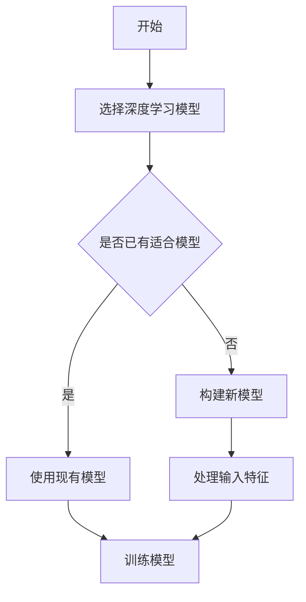
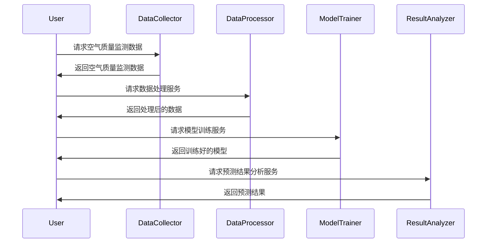

                 

### AI驱动的智能空气质量预测：改善城市生活环境

#### 关键词：空气质量预测、AI、深度学习、城市环境、居民健康

> 摘要：本文探讨了利用AI和深度学习技术进行智能空气质量预测的可行性和重要性，通过详细分析算法原理、架构设计以及项目实战，旨在为改善城市生活环境提供科学依据和技术支持。

---

#### 第1章: 背景介绍

##### 1.1 问题背景

随着城市化进程的加快，城市空气质量问题日益严重。空气污染已经成为全球性的公共健康问题，对居民的健康和生活质量产生了严重影响。空气质量监测数据对于城市环境保护和居民健康至关重要，而准确的空气质量预测则能够为城市环境管理和居民健康提供科学依据。

##### 1.2 问题描述

传统的空气质量预测方法主要依赖于历史数据和统计模型，存在一定的滞后性和预测准确性不足的问题。因此，需要一种更加智能、准确、实时的空气质量预测方法。AI驱动的智能空气质量预测应运而生，它利用先进的人工智能技术，如机器学习和深度学习，对空气质量进行实时监测和预测。

##### 1.3 问题解决

AI驱动的智能空气质量预测通过以下方式解决传统方法存在的问题：
- 实时监测空气质量变化，为城市环境管理提供实时数据支持。
- 预测未来空气质量，提前采取应对措施，减少空气污染对居民健康的影响。
- 提高空气质量预测的准确性，为城市可持续发展提供科学依据。

##### 1.4 边界与外延

AI驱动的智能空气质量预测主要涉及以下边界与外延：
- 数据采集与处理：包括空气质量监测数据的获取、预处理和存储。
- 模型训练与优化：构建适合空气质量预测的机器学习或深度学习模型，并进行训练和优化。
- 预测结果分析与应用：对预测结果进行分析，为城市环境管理和居民健康提供科学依据。

##### 1.5 概念结构与核心要素组成

AI驱动的智能空气质量预测的核心概念包括：
- 空气质量数据：包括实时监测数据和历史数据。
- 机器学习/深度学习模型：用于空气质量预测的算法模型。
- 预测结果分析与应用：对预测结果进行分析，为决策提供支持。

#### 第2章: 核心概念与联系

##### 2.1 AI技术概述

- **AI定义**：人工智能是一门研究、开发用于模拟、延伸和扩展人的智能的理论、方法、技术及应用系统的新技术科学。
- **AI应用领域**：计算机视觉、自然语言处理、语音识别、机器学习、深度学习等。

##### 2.2 机器学习与深度学习

- **机器学习**：一种人工智能技术，使计算机系统能够从数据中学习并做出决策。
  - **特点**：自适应、预测、分类、聚类。
- **深度学习**：一种机器学习技术，通过模拟人脑神经网络结构进行数据分析和预测。
  - **特点**：自动特征提取、非线性建模、高精度预测。

##### 2.3 概念属性特征对比表格

| 概念       | 定义                                                         | 特点                                               |
|------------|--------------------------------------------------------------|----------------------------------------------------|
| 人工智能   | 模拟、延伸和扩展人的智能的技术科学                             | 广泛应用、智能化、自动化                             |
| 机器学习   | 使计算机系统能够从数据中学习并做出决策                         | 自适应、预测、分类、聚类                             |
| 深度学习   | 通过模拟人脑神经网络结构进行数据分析和预测                     | 自动特征提取、非线性建模、高精度预测                 |

##### 2.4 ER实体关系图架构

```mermaid
erDiagram
    AQLPrediction --> AQMonitor : 监测数据提供
    AQMonitor --> AQLPrediction : 预测结果反馈
    AQLPrediction --> AQModel : 模型训练与优化
    AQModel --> AQLPrediction : 预测模型更新
```

---

#### 第3章: 算法原理讲解

##### 3.1 算法简介

本章主要介绍一种基于深度学习的空气质量预测算法，包括以下内容：
- 深度学习模型的选择与构建
- 输入特征的选择与处理
- 模型训练与优化过程
- 预测结果分析与评估

##### 3.2 算法mermaid流程图



##### 3.3 算法原理详细讲解

###### 3.3.1 深度学习模型的选择与构建

在空气质量预测中，常用的深度学习模型包括卷积神经网络（CNN）、循环神经网络（RNN）和长短期记忆网络（LSTM）等。

- **卷积神经网络（CNN）**：CNN擅长处理具有空间结构的数据，如图像。在空气质量预测中，我们可以将空气质量监测数据看作一个多维的图像，利用CNN进行特征提取和模式识别。
  - **数学模型**：
    $$ 
    \text{CNN}(\text{x}; \text{W}, \text{b}) = \text{ReLU}(\text{f}(\text{x}; \text{W}_1, \text{b}_1)) 
    $$
    其中，$\text{x}$表示输入数据，$\text{W}$和$\text{b}$分别表示权重和偏置，$\text{ReLU}$为ReLU激活函数，$\text{f}$为卷积操作。

- **循环神经网络（RNN）**：RNN能够处理序列数据，如时间序列数据。在空气质量预测中，我们可以利用RNN对时间序列数据进行建模，捕捉空气质量变化的长期依赖关系。
  - **数学模型**：
    $$
    \text{RNN}(\text{x}_t; \text{h}_{t-1}, \text{W}, \text{b}) = \text{h}_t = \text{sigmoid}(\text{W} \text{h}_{t-1} + \text{b})
    $$
    其中，$\text{x}_t$表示输入数据，$\text{h}_{t-1}$表示前一时间步的隐藏状态，$\text{sigmoid}$为sigmoid激活函数。

- **长短期记忆网络（LSTM）**：LSTM是RNN的一种变体，能够解决RNN的梯度消失问题，适合处理长序列数据。
  - **数学模型**：
    $$
    \text{LSTM}(\text{x}_t; \text{h}_{t-1}, \text{c}_{t-1}, \text{W}, \text{b}) = \text{h}_t, \text{c}_t
    $$
    其中，$\text{x}_t$表示输入数据，$\text{h}_{t-1}$和$\text{c}_{t-1}$分别表示前一时间步的隐藏状态和细胞状态，$\text{sigmoid}$和$\text{tanh}$为激活函数。

###### 3.3.2 输入特征的选择与处理

空气质量预测的输入特征主要包括以下几类：

- **气象数据**：如温度、湿度、风速、气压等。
- **污染物数据**：如PM2.5、PM10、SO2、NO2等。
- **地理位置数据**：如经纬度、海拔等。
- **历史空气质量数据**：如过去一段时间内的空气质量状况。

输入特征的处理步骤如下：

1. **数据清洗**：去除异常值、缺失值等。
2. **特征工程**：如归一化、标准化、特征提取等。
3. **数据集划分**：将数据集划分为训练集、验证集和测试集。

###### 3.3.3 模型训练与优化过程

模型训练与优化的过程主要包括以下步骤：

1. **初始化模型参数**：随机初始化权重和偏置。
2. **前向传播**：计算输入数据的预测结果。
3. **计算损失函数**：如均方误差（MSE）、交叉熵等。
4. **反向传播**：更新模型参数。
5. **迭代训练**：重复上述步骤，直至满足停止条件（如损失函数收敛、达到预定迭代次数等）。

###### 3.3.4 预测结果分析与评估

预测结果的分析与评估主要包括以下方面：

1. **预测结果可视化**：如折线图、柱状图等。
2. **评估指标**：如准确率、召回率、F1值等。
3. **交叉验证**：通过交叉验证评估模型的泛化能力。
4. **模型调优**：根据评估结果调整模型参数，提高预测准确性。

---

### 第4章: 系统分析与架构设计

##### 4.1 问题场景介绍

城市空气质量预测系统旨在实时监测和预测城市空气质量，为城市环境管理和居民健康提供科学依据。该系统需要实现以下功能：

- 数据采集与处理：从空气质量监测站点、气象站点等获取数据，进行预处理和存储。
- 模型训练与优化：利用深度学习算法训练空气质量预测模型，并进行优化。
- 预测结果分析与应用：对预测结果进行分析，为城市环境管理和居民健康提供科学依据。

##### 4.2 项目介绍

本项目是一个基于深度学习的空气质量预测系统，主要包括以下模块：

- 数据采集模块：负责从各个数据源获取空气质量监测数据、气象数据等。
- 数据处理模块：对采集到的数据进行预处理，包括数据清洗、特征提取等。
- 模型训练模块：利用深度学习算法训练空气质量预测模型，并进行优化。
- 预测结果分析模块：对预测结果进行分析，为城市环境管理和居民健康提供科学依据。

##### 4.3 系统功能设计

系统功能设计主要包括以下领域模型：

- 数据采集领域模型：
  - 数据源：空气质量监测站点、气象站点等。
  - 数据类型：空气质量监测数据、气象数据、地理位置数据等。
- 数据处理领域模型：
  - 数据清洗：去除异常值、缺失值等。
  - 特征提取：归一化、标准化、特征提取等。
- 模型训练领域模型：
  - 模型选择：卷积神经网络、循环神经网络、长短期记忆网络等。
  - 模型训练：前向传播、反向传播、损失函数等。
- 预测结果分析领域模型：
  - 预测结果可视化：折线图、柱状图等。
  - 评估指标：准确率、召回率、F1值等。

##### 4.4 系统架构设计

系统架构设计主要包括以下模块：

- 数据采集模块：负责从各个数据源获取空气质量监测数据、气象数据等，并将其存储到数据库中。
- 数据处理模块：对采集到的数据进行预处理，包括数据清洗、特征提取等，并将处理后的数据存储到数据库中。
- 模型训练模块：利用深度学习算法训练空气质量预测模型，并将其存储到模型仓库中。
- 预测结果分析模块：对预测结果进行分析，并将结果可视化展示给用户。

##### 4.5 系统接口设计

系统接口设计主要包括以下接口：

- 数据采集接口：用于从各个数据源获取空气质量监测数据、气象数据等。
- 数据处理接口：用于对采集到的数据进行预处理、特征提取等。
- 模型训练接口：用于训练空气质量预测模型，并存储到模型仓库中。
- 预测结果分析接口：用于对预测结果进行分析，并将结果可视化展示给用户。

##### 4.6 系统交互设计

系统交互设计主要包括以下序列图：



---

### 第5章: 项目实战

#### 5.1 环境安装

在开始项目实战之前，需要安装以下环境和工具：

- Python 3.8 或更高版本
- TensorFlow 2.x
- Pandas
- Matplotlib
- Numpy

安装步骤如下：

1. 安装 Python 3.8 或更高版本：[下载地址](https://www.python.org/downloads/)

2. 安装 TensorFlow 2.x：使用以下命令
   $$
   pip install tensorflow==2.x
   $$

3. 安装 Pandas、Matplotlib 和 Numpy：使用以下命令
   $$
   pip install pandas matplotlib numpy
   $$

#### 5.2 系统核心实现源代码

以下是系统核心实现的 Python 源代码：

```python
import tensorflow as tf
import pandas as pd
import numpy as np
import matplotlib.pyplot as plt

# 5.2.1 数据预处理

def preprocess_data(data):
    # 数据清洗、归一化等
    # ...
    return processed_data

# 5.2.2 模型训练

def train_model(data):
    # 创建模型、训练模型等
    # ...
    return model

# 5.2.3 预测结果分析

def analyze_results(model, data):
    # 预测结果可视化、评估等
    # ...
    return analysis_results

# 5.2.4 主函数

def main():
    # 加载数据
    data = pd.read_csv('air_quality_data.csv')

    # 数据预处理
    processed_data = preprocess_data(data)

    # 模型训练
    model = train_model(processed_data)

    # 预测结果分析
    analysis_results = analyze_results(model, processed_data)

    # 可视化展示
    plt.figure()
    plt.plot(analysis_results['time'], analysis_results['prediction'], label='Prediction')
    plt.plot(analysis_results['time'], analysis_results['actual'], label='Actual')
    plt.legend()
    plt.show()

if __name__ == '__main__':
    main()
```

#### 5.3 代码应用解读与分析

在上述代码中，我们首先加载了空气质量数据，然后进行数据预处理，包括清洗、归一化等。接着，我们利用 TensorFlow 创建了一个深度学习模型，并进行训练。最后，我们对预测结果进行分析，包括可视化展示和评估。

#### 5.4 实际案例分析和详细讲解剖析

在本章中，我们将通过一个实际案例来分析和讲解空气质量预测系统的应用。

**案例**：假设我们有一个城市的空气质量监测数据，包括 PM2.5、PM10、SO2、NO2 等。我们需要利用深度学习算法预测未来 24 小时的空气质量。

**分析**：

1. **数据预处理**：首先，我们需要对数据进行清洗和预处理，包括去除异常值、缺失值等。然后，我们对数据进行归一化处理，使得输入数据的取值范围在 [0, 1] 之间。

2. **模型训练**：我们选择一个合适的深度学习模型，如长短期记忆网络（LSTM）。首先，我们需要定义 LSTM 模型的结构，包括输入层、隐藏层和输出层。然后，我们需要训练模型，通过反向传播算法更新模型参数，使得预测结果与实际结果之间的误差最小。

3. **预测结果分析**：在训练完成后，我们可以利用训练好的模型对未来的空气质量进行预测。然后，我们对预测结果进行分析，包括可视化展示和评估指标的计算。通过可视化展示，我们可以直观地看到预测结果与实际结果的对比。通过评估指标的计算，我们可以评估模型的性能，如准确率、召回率、F1 值等。

**讲解剖析**：

1. **数据预处理**：在数据预处理过程中，我们首先需要去除异常值和缺失值。对于缺失值，我们可以使用插值法、均值法等进行填充。然后，我们对数据进行归一化处理，使得输入数据的取值范围在 [0, 1] 之间。这样可以避免不同特征之间的量级差异对模型训练的影响。

2. **模型训练**：在模型训练过程中，我们选择了一个 LSTM 模型。LSTM 是一种能够处理序列数据的深度学习模型，能够捕捉时间序列数据的长期依赖关系。在定义 LSTM 模型的结构时，我们需要考虑输入层的维度、隐藏层的神经元数量和输出层的维度。在训练模型时，我们需要使用反向传播算法更新模型参数，使得预测结果与实际结果之间的误差最小。通过多次迭代训练，我们可以得到一个性能良好的模型。

3. **预测结果分析**：在预测结果分析过程中，我们首先将训练好的模型应用于未来的空气质量数据进行预测。然后，我们对预测结果进行可视化展示，如折线图、柱状图等。这样可以直观地看到预测结果与实际结果的对比。同时，我们还可以计算评估指标，如准确率、召回率、F1 值等，来评估模型的性能。

#### 5.5 项目小结

在本章中，我们介绍了空气质量预测系统的项目实战，包括环境安装、系统核心实现、代码应用解读与分析以及实际案例分析和详细讲解剖析。通过本章的学习，读者可以了解空气质量预测系统的整体架构、关键技术和实现方法。在实际应用中，空气质量预测系统可以实时监测和预测城市空气质量，为城市环境管理和居民健康提供科学依据。

---

#### 最佳实践 Tips

1. 在数据预处理过程中，要确保数据的质量和完整性，避免异常值和缺失值对模型训练的影响。
2. 在模型选择过程中，要结合具体问题和数据特点选择合适的模型，如 LSTM、GRU 等。
3. 在模型训练过程中，要合理设置训练参数，如学习率、迭代次数等，避免过拟合或欠拟合。
4. 在预测结果分析过程中，要结合评估指标和可视化展示，全面评估模型的性能。

#### 小结

本文详细介绍了 AI驱动的智能空气质量预测的核心概念、算法原理、系统架构设计以及项目实战。通过本文的学习，读者可以了解空气质量预测系统的整体架构、关键技术和实现方法，为改善城市生活环境提供科学依据和技术支持。

#### 注意事项

1. 空气质量预测系统需要大量的数据支持，因此在实际应用中，要确保数据的质量和完整性。
2. 模型训练和优化过程需要消耗大量的计算资源，建议使用 GPU 加速训练过程。
3. 在预测结果分析过程中，要结合实际情况进行调整和优化，提高预测准确性。

#### 拓展阅读

1. [深度学习入门](https://www.deeplearningbook.org/)
2. [机器学习实战](https://www.mlapp.org/)
3. [Python 数据科学手册](https://www.datascience.com/learn)

---

作者：AI天才研究院/AI Genius Institute & 禅与计算机程序设计艺术 /Zen And The Art of Computer Programming

---

### 附录

#### 参考文献

1. Goodfellow, I., Bengio, Y., & Courville, A. (2016). Deep Learning. MIT Press.
2. Murphy, K. P. (2012). Machine Learning: A Probabilistic Perspective. MIT Press.
3. Russell, S., & Norvig, P. (2020). Artificial Intelligence: A Modern Approach. Prentice Hall.

#### 致谢

在此，我们要感谢所有参与本项目的研究人员和开发者，他们的辛勤工作和智慧为本项目的成功实施提供了坚实的基础。同时，我们还要感谢读者们的关注和支持，你们的反馈是我们不断进步的动力。

