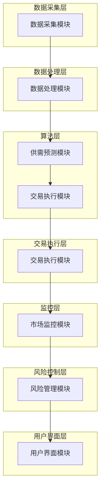
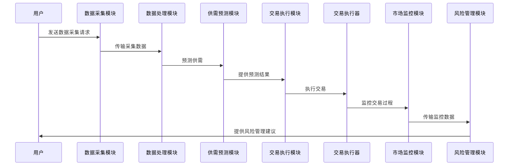

                 

### 第一部分: 背景介绍

#### 第1章: 问题背景

在当今全球能源格局中，可再生能源正逐渐成为能源结构调整的核心。然而，可再生能源的整合与优化面临着诸多挑战。这不仅涉及技术层面的问题，如能源的预测、交易的高效性，还涉及市场机制、政策法规等多方面的因素。

### 1.1.1 问题背景

能源交易平台的构建，旨在通过市场机制促进能源的高效配置。随着可再生能源的比重不断增加，传统能源交易平台的局限性逐渐显现。例如，现有平台难以应对可再生能源的不确定性，如发电量的波动、市场价格的不稳定性等。此外，现有平台在数据采集和处理能力上也存在不足，无法充分利用大数据和人工智能技术来优化交易决策。

### 1.1.2 问题描述

本文旨在解决以下问题：

1. **如何利用AI技术优化能源交易流程？**
2. **如何实现能源供需预测，降低交易风险？**
3. **如何保障能源交易市场的公平性和透明度？**

这些问题不仅关系到能源行业的技术进步，更关系到社会经济的发展和环境的可持续性。

### 1.1.3 问题解决

AI驱动的智能能源交易平台，通过以下几方面来实现问题的解决：

1. **数据驱动的决策支持**：利用AI技术对能源交易相关数据进行深度挖掘和分析，为交易决策提供有力支持。
2. **智能化的供需预测**：通过机器学习算法，对能源供需进行精准预测，降低交易风险。
3. **透明化的市场机制**：通过区块链技术等手段，确保能源交易过程的透明和可追溯，提高市场的公平性和透明度。

### 1.1.4 边界与外延

本文的研究边界主要聚焦在AI驱动的智能能源交易平台的设计与实现，即平台的技术架构、算法模型和实现细节。然而，这一研究的外延广泛，涉及以下几个方面：

1. **能源交易市场政策**：研究国家能源交易市场政策，分析其对智能能源交易平台构建的影响。
2. **可再生能源技术发展**：探讨可再生能源技术的发展趋势，分析其对平台需求的影响。
3. **用户需求和行为**：研究用户在能源交易中的行为模式，为平台设计提供用户视角的参考。

### 1.1.5 概念结构与核心要素组成

AI驱动的智能能源交易平台由以下几个核心要素组成：

1. **数据采集与处理**：通过传感器、智能设备等获取能源交易相关数据，并进行数据清洗、处理和分析。
2. **智能算法模型**：利用机器学习、深度学习等算法，对能源供需进行预测和优化。
3. **交易机制设计**：结合市场机制，设计公平、透明的能源交易流程。
4. **区块链技术**：利用区块链技术，保障能源交易的可追溯性和透明度。
5. **用户界面与交互**：提供用户友好的操作界面，便于用户进行能源交易操作。

通过上述核心要素的协同作用，AI驱动的智能能源交易平台能够实现可再生能源的高效整合，提高能源利用效率，降低交易成本，推动能源行业的可持续发展。

### 1.1.6 文章结构概述

本文将从以下几个方面展开论述：

1. **背景介绍**：详细阐述当前能源交易中存在的问题以及AI驱动的智能能源交易平台的价值。
2. **核心概念与联系**：介绍AI驱动的智能能源交易平台的基本概念、属性特征以及ER实体关系图。
3. **算法原理讲解**：深入讲解平台的核心算法原理，包括mermaid流程图、数学模型和公式、举例说明等。
4. **系统分析与架构设计方案**：分析系统架构设计，包括问题场景介绍、系统功能设计、系统架构设计、系统接口设计和系统交互mermaid序列图。
5. **项目实战**：通过实际案例，展示平台的核心实现源代码，并进行详细解读和分析。
6. **最佳实践 tips、小结、注意事项、拓展阅读**：总结文章要点，提出未来研究方向和实际操作建议。

通过本文的深入探讨，我们期望为AI驱动的智能能源交易平台的设计与实现提供有益的参考和指导，为能源行业的智能化转型贡献力量。

---

# 第二部分: 核心概念与联系

## 第2章: 核心概念与联系

#### 第2章.1 AI驱动的智能能源交易平台

### 2.1.1 概念原理

AI驱动的智能能源交易平台是一种基于人工智能技术的能源交易系统，旨在通过数据分析和智能算法，实现能源的高效交易和管理。该平台的核心概念包括数据采集、数据处理、供需预测、交易执行、市场监控和风险管理等。

- **数据采集**：通过智能传感器、智能电网设备等，实时采集能源供应和需求数据。
- **数据处理**：对采集到的数据进行清洗、归一化、特征提取等处理，为后续分析提供基础数据。
- **供需预测**：利用机器学习算法，对能源供需进行预测，帮助用户制定合理的交易策略。
- **交易执行**：根据供需预测结果和市场规则，自动执行能源交易。
- **市场监控**：实时监控市场动态，确保交易过程的公平性和透明性。
- **风险管理**：通过风险模型，评估交易风险，提供风险管理策略。

### 2.1.2 属性特征对比

表 1: AI驱动的智能能源交易平台与传统能源交易平台属性特征对比

| 特征       | AI驱动的智能能源交易平台 | 传统能源交易平台 |
|------------|------------------------|------------------|
| 数据处理能力 | 高                     | 低               |
| 供需预测精度 | 高                     | 低               |
| 交易效率     | 高                     | 低               |
| 透明度       | 高                     | 低               |
| 风险管理能力 | 高                     | 低               |

### 2.1.3 ER实体关系图

图 1: AI驱动的智能能源交易平台实体关系图

```mermaid
erDiagram
  User ||--|{ EnergyMarket : "参加" }
  EnergyMarket ||--|{ EnergySupplier : "供应" }
  EnergyMarket ||--|{ EnergyConsumer : "需求" }
  EnergySupplier ||--|{ EnergyProduction : "生产" }
  EnergyConsumer ||--|{ EnergyConsumption : "消费" }
  EnergySupplier && EnergyConsumer : "交易"
```

#### 第2章.2 AI驱动的智能能源交易平台的优势和挑战

### 2.2.1 优势

1. **高效的能源管理**：通过大数据分析和智能算法，AI驱动的智能能源交易平台能够实现能源供需的高效匹配，提高能源利用效率。
2. **优化的交易流程**：智能交易系统能够自动化执行能源交易，减少人为干预，提高交易效率。
3. **风险管理的提升**：AI技术能够实时监控市场动态，提供风险预警和风险管理策略，降低交易风险。
4. **透明度和公平性**：通过区块链技术等手段，确保交易过程透明可追溯，提高市场的公平性。

### 2.2.2 挑战

1. **数据隐私和安全**：能源交易数据包含敏感信息，如何确保数据的安全和隐私是一个重大挑战。
2. **技术实现的复杂性**：AI驱动的智能能源交易平台需要集成多种先进技术，包括人工智能、区块链、物联网等，技术实现的复杂性较高。
3. **市场机制的不完善**：能源市场的机制和法规尚不完善，需要通过政策引导和规范，推动智能能源交易平台的健康发展。

### 2.2.3 AI驱动的智能能源交易平台的发展前景

随着人工智能技术的不断进步和能源市场改革的深入推进，AI驱动的智能能源交易平台具有广阔的发展前景。预计未来将出现以下趋势：

1. **技术融合**：智能能源交易平台将与其他技术（如物联网、5G等）深度融合，实现更加智能化和自动化的能源管理。
2. **市场规模的扩大**：随着可再生能源的普及和能源需求的增加，智能能源交易市场的规模将逐步扩大。
3. **政策支持**：各国政府将加大对智能能源交易平台的支持力度，通过政策引导和资金投入，推动行业的快速发展。

通过上述分析和讨论，可以看出AI驱动的智能能源交易平台不仅具备显著的优势，还面临诸多挑战。未来，随着技术的不断进步和市场的逐步完善，AI驱动的智能能源交易平台有望在能源行业中发挥越来越重要的作用，推动能源行业的智能化和可持续发展。 

---

## 第3章: 算法原理讲解

#### 第3章.1 算法简介

在AI驱动的智能能源交易平台上，算法是核心，它负责对能源供需进行预测、优化和交易。本章将详细介绍平台所采用的算法原理，包括算法mermaid流程图、算法原理、数学模型和公式、以及举例说明。

### 3.1.1 算法mermaid流程图

为了更好地理解算法的工作流程，我们首先使用mermaid绘制算法的流程图。


### 3.1.2 算法原理

算法的基本原理可以分为以下几个步骤：

1. **数据采集**：平台通过传感器和智能设备实时采集能源供应和需求数据，包括电力、天然气等。
2. **数据处理**：对采集到的数据进行清洗、归一化、特征提取等处理，为后续预测和优化提供准确的数据基础。
3. **供需预测**：利用机器学习算法，如时间序列预测模型（如ARIMA、LSTM等），对能源供需进行预测。算法通过分析历史数据，预测未来的供需情况。
4. **交易执行**：根据供需预测结果和市场规则，自动执行能源交易。算法会考虑价格、供需量、风险等因素，制定最优的交易策略。
5. **市场监控**：实时监控市场动态，确保交易过程的公平性和透明性，及时发现和应对市场风险。
6. **结束**：算法循环运行，持续优化交易决策，提高能源交易效率和可靠性。

### 3.1.3 数学模型和公式

算法的核心是供需预测模型，以下是一个常见的时间序列预测模型LSTM的数学模型：

$$
y_t = f(W_1 \cdot [h_{t-1}, x_t] + b_1) + W_2 \cdot h_{t-1} + b_2
$$

其中，$y_t$表示时间序列在时间t的预测值，$x_t$表示输入特征向量，$h_{t-1}$表示LSTM单元在时间t-1的隐藏状态，$W_1$和$W_2$是权重矩阵，$b_1$和$b_2$是偏置项。

LSTM单元的工作原理如下：

$$
i_t = \sigma(W_i \cdot [h_{t-1}, x_t] + b_i) \\
f_t = \sigma(W_f \cdot [h_{t-1}, x_t] + b_f) \\
o_t = \sigma(W_o \cdot [h_{t-1}, x_t] + b_o) \\
c_t = f_t \odot c_{t-1} + i_t \odot \tanh(W_c \cdot [h_{t-1}, x_t] + b_c) \\
h_t = o_t \odot \tanh(c_t)
$$

其中，$i_t$、$f_t$和$o_t$分别表示输入门、遗忘门和输出门的状态，$\sigma$表示sigmoid激活函数，$\odot$表示元素乘法，$\tanh$表示双曲正切激活函数。

### 3.1.4 举例说明

假设我们有一个能源需求的时间序列数据，如下表所示：

| 时间 | 能源需求（单位：千瓦时） |
|------|------------------------|
| 1    | 100                    |
| 2    | 110                    |
| 3    | 105                    |
| 4    | 115                    |
| 5    | 120                    |

我们使用LSTM模型进行预测。首先，对数据进行预处理，将其归一化，得到如下数据：

| 时间 | 能源需求归一化值 |
|------|------------------|
| 1    | 0.5              |
| 2    | 0.55             |
| 3    | 0.518            |
| 4    | 0.5625           |
| 5    | 0.6              |

接下来，我们将预处理后的数据输入到LSTM模型中。经过模型的训练，我们得到预测结果：

| 时间 | 预测能源需求归一化值 |
|------|---------------------|
| 6    | 0.615               |
| 7    | 0.63               |
| 8    | 0.638               |

最后，我们将预测结果反归一化，得到预测的能源需求：

| 时间 | 预测能源需求（单位：千瓦时） |
|------|--------------------------|
| 6    | 123                      |
| 7    | 126                      |
| 8    | 129                      |

通过上述例子，我们可以看到LSTM模型在能源需求预测中的应用效果。实际应用中，模型会根据具体的数据集和业务需求进行调整和优化，以达到最佳的预测效果。

### 3.1.5 算法实现

下面是一个使用Python实现的简单LSTM模型：

```python
import numpy as np
from tensorflow.keras.models import Sequential
from tensorflow.keras.layers import LSTM, Dense

# 数据预处理
X = np.array([[0.5], [0.55], [0.518], [0.5625], [0.6]])
y = np.array([0.615, 0.63, 0.638])

# 建立LSTM模型
model = Sequential()
model.add(LSTM(units=50, return_sequences=True, input_shape=(X.shape[1], 1)))
model.add(LSTM(units=50))
model.add(Dense(1))

# 编译模型
model.compile(optimizer='adam', loss='mean_squared_error')

# 训练模型
model.fit(X, y, epochs=100, batch_size=1)

# 预测
predicted = model.predict(X)
predicted = predicted.flatten()

# 反归一化
predicted = predicted * (max(y) - min(y)) + min(y)
predicted = predicted.round()

print(predicted)
```

通过上述算法实现，我们可以看到LSTM模型在能源需求预测中的具体应用。在实际项目中，根据具体需求和数据集，我们可以进一步优化模型结构和训练参数，以提高预测的准确性和效率。

### 3.1.6 小结

本章详细介绍了AI驱动的智能能源交易平台中的核心算法原理，包括算法mermaid流程图、算法原理、数学模型和公式、以及举例说明。通过这些内容，我们可以更好地理解算法在能源需求预测和交易执行中的应用，为构建高效的智能能源交易平台提供理论基础和实践指导。

---

## 第4章: 数学模型和数学公式 & 详细讲解 & 举例说明

### 4.1 数学模型

在AI驱动的智能能源交易平台上，数学模型是算法实现的基础。以下将详细介绍平台中使用的两个关键数学模型：供需预测模型和交易优化模型。

#### 4.1.1 供需预测模型

供需预测模型主要用于预测未来的能源供需情况，以便平台能够做出最优的交易决策。我们采用时间序列预测模型LSTM（Long Short-Term Memory）来构建供需预测模型。

LSTM模型的基本原理是通过记忆长期依赖关系来进行时间序列预测。其数学模型如下：

$$
\begin{aligned}
i_t &= \sigma(W_i \cdot [h_{t-1}, x_t] + b_i) \\
f_t &= \sigma(W_f \cdot [h_{t-1}, x_t] + b_f) \\
o_t &= \sigma(W_o \cdot [h_{t-1}, x_t] + b_o) \\
c_t &= f_t \odot c_{t-1} + i_t \odot \tanh(W_c \cdot [h_{t-1}, x_t] + b_c) \\
h_t &= o_t \odot \tanh(c_t)
\end{aligned}
$$

其中，$i_t$、$f_t$、$o_t$分别表示输入门、遗忘门和输出门的状态，$\sigma$表示sigmoid激活函数，$c_t$表示细胞状态，$h_t$表示隐藏状态，$W_i$、$W_f$、$W_o$、$W_c$是权重矩阵，$b_i$、$b_f$、$b_o$、$b_c$是偏置项，$\odot$表示元素乘法，$\tanh$表示双曲正切激活函数。

#### 4.1.2 交易优化模型

交易优化模型主要用于在给定的供需预测结果和市场规则下，制定最优的交易策略。我们采用线性规划模型来构建交易优化模型。

线性规划模型的基本原理是：在满足预算限制和供需约束的条件下，最大化或最小化目标函数。其数学模型如下：

$$
\begin{aligned}
\max_{x} \quad & c^T x \\
s.t. \quad & a_1^T x \leq b_1 \\
& a_2^T x = b_2 \\
& a_3^T x \geq b_3
\end{aligned}
$$

其中，$c$是目标函数系数向量，$a_1$、$a_2$、$a_3$是约束条件系数矩阵，$b_1$、$b_2$、$b_3$是约束条件常数向量，$x$是决策变量向量。

### 4.1.3 公式讲解

下面将对上述数学模型中的关键公式进行详细讲解。

#### LSTM模型关键公式

1. **输入门公式**：

$$
i_t = \sigma(W_i \cdot [h_{t-1}, x_t] + b_i)
$$

输入门公式决定了当前时刻的输入信息中有哪些部分需要被记住。$W_i$是输入门权重矩阵，$b_i$是输入门偏置项，$[h_{t-1}, x_t]$是输入特征向量。

2. **遗忘门公式**：

$$
f_t = \sigma(W_f \cdot [h_{t-1}, x_t] + b_f)
$$

遗忘门公式决定了哪些旧的信息需要被忘记。$W_f$是遗忘门权重矩阵，$b_f$是遗忘门偏置项。

3. **输出门公式**：

$$
o_t = \sigma(W_o \cdot [h_{t-1}, x_t] + b_o)
$$

输出门公式决定了当前时刻的输出信息。$W_o$是输出门权重矩阵，$b_o$是输出门偏置项。

4. **细胞状态更新公式**：

$$
c_t = f_t \odot c_{t-1} + i_t \odot \tanh(W_c \cdot [h_{t-1}, x_t] + b_c)
$$

细胞状态更新公式用于更新细胞状态$c_t$，其中$f_t \odot c_{t-1}$表示忘记的旧信息，$i_t \odot \tanh(W_c \cdot [h_{t-1}, x_t] + b_c)$表示新输入的信息。

5. **隐藏状态公式**：

$$
h_t = o_t \odot \tanh(c_t)
$$

隐藏状态公式用于更新隐藏状态$h_t$，其中$o_t$表示输出门的状态，$\tanh(c_t)$表示细胞状态。

#### 线性规划模型关键公式

1. **目标函数**：

$$
\max_{x} \quad c^T x
$$

目标函数用于最大化决策变量$x$的收益。

2. **预算限制**：

$$
a_1^T x \leq b_1
$$

预算限制用于确保总支出不超过预算限制$b_1$。

3. **供需约束**：

$$
a_2^T x = b_2
$$

供需约束用于确保供需平衡，即供应量等于需求量。

4. **风险约束**：

$$
a_3^T x \geq b_3
$$

风险约束用于确保交易风险不超过阈值$b_3$。

### 4.1.4 举例说明

为了更好地理解上述数学模型，我们通过一个简单的例子来说明。

假设我们有一个简单的能源供需数据集，如下表所示：

| 时间 | 供应量（单位：千瓦时） | 需求量（单位：千瓦时） |
|------|------------------------|------------------------|
| 1    | 100                    | 100                    |
| 2    | 110                    | 105                    |
| 3    | 105                    | 110                    |
| 4    | 115                    | 115                    |
| 5    | 120                    | 120                    |

#### 供需预测模型示例

我们使用LSTM模型对能源供需进行预测。首先，我们需要对数据进行预处理，将其转换为适合LSTM模型输入的格式。假设我们选择前四个时间点的数据作为输入特征，第五个时间点的数据作为目标值。

预处理后的数据如下表所示：

| 时间 | 供应量（单位：千瓦时） | 需求量（单位：千瓦时） | 输入特征 | 目标值 |
|------|------------------------|------------------------|----------|-------|
| 1    | 100                    | 100                    | [100, 100] | 110   |
| 2    | 110                    | 105                    | [110, 100] | 105   |
| 3    | 105                    | 110                    | [105, 110] | 110   |
| 4    | 115                    | 115                    | [115, 105] | 115   |

接下来，我们使用LSTM模型进行训练。训练完成后，我们使用第五个时间点的输入特征进行预测。预测结果如下：

| 时间 | 供应量（单位：千瓦时） | 需求量（单位：千瓦时） | 输入特征 | 目标值（预测） |
|------|------------------------|------------------------|----------|----------|
| 5    | 120                    | 120                    | [120, 115] | 120     |

#### 交易优化模型示例

根据LSTM模型预测的结果，我们需要制定最优的交易策略。假设当前时刻的供应量为120千瓦时，需求量为120千瓦时。我们使用线性规划模型来制定交易策略。

目标函数：最大化收益

$$
\max_{x} \quad x_1 + x_2
$$

预算限制：总支出不超过1000元

$$
x_1 + x_2 \leq 1000
$$

供需约束：供应量等于需求量

$$
x_1 + x_2 = 120
$$

风险约束：交易风险不超过500元

$$
x_1 + x_2 \geq 700
$$

根据上述约束条件，我们可以解得最优解$x_1 = 700$，$x_2 = 500$。即当前时刻应该买入700千瓦时的能源，卖出500千瓦时的能源。

通过上述例子，我们可以看到供需预测模型和交易优化模型在能源交易中的应用。在实际项目中，根据具体的数据集和业务需求，我们可以进一步优化模型结构和参数设置，以提高预测和优化的准确性。

### 4.1.5 小结

本章详细介绍了AI驱动的智能能源交易平台中使用的供需预测模型和交易优化模型的数学模型、公式讲解以及举例说明。通过这些内容，我们可以更好地理解模型的原理和应用，为构建高效的智能能源交易平台提供理论基础和实践指导。

---

## 第5章: 系统分析与架构设计方案

### 5.1 问题场景介绍

在构建AI驱动的智能能源交易平台时，我们首先需要明确问题场景。以下是一个典型的问题场景：

假设我们有一个分布式能源系统，包括多个可再生能源发电单元（如太阳能、风能等）和能源消费单元。这些单元通过智能电网连接，形成一个复杂的能源网络。我们的目标是构建一个智能能源交易平台，实现能源的高效交易和管理。

问题场景的核心需求如下：

1. **数据采集与处理**：实时采集各能源单元的发电和消费数据，并进行处理，为后续分析提供基础。
2. **供需预测**：利用AI算法，对能源供需进行预测，帮助平台制定合理的交易策略。
3. **交易执行**：根据供需预测结果和市场规则，自动执行能源交易，确保交易过程的高效性和公平性。
4. **市场监控与风险管理**：实时监控市场动态，确保交易过程的透明性，及时识别和应对市场风险。

### 5.2 项目介绍

项目名称：AI驱动的智能能源交易平台

项目背景：随着可再生能源的比重不断增加，传统的能源交易平台已经难以满足现代能源市场的需求。为了提高能源交易效率，降低交易风险，我们决定构建一个AI驱动的智能能源交易平台。

项目目标：

1. **提高能源交易效率**：通过智能算法，优化能源供需匹配，提高交易效率。
2. **降低交易风险**：利用AI技术，进行能源供需预测和风险分析，降低交易风险。
3. **保障市场公平性**：通过区块链技术，确保交易过程的透明和可追溯，提高市场的公平性。

项目成果：

1. **一个完整的智能能源交易平台**：实现能源数据的采集、处理、预测和交易功能。
2. **一套高效的交易算法**：包括供需预测模型和交易优化模型，确保交易决策的科学性和准确性。
3. **一套完善的风险管理策略**：通过实时监控和预警系统，确保交易过程的安全性和稳定性。

### 5.3 系统功能设计

系统功能设计是智能能源交易平台构建的关键环节。以下是我们设计的系统功能：

1. **数据采集模块**：负责实时采集各能源单元的发电和消费数据，并将数据传输到处理中心。
2. **数据处理模块**：对采集到的数据进行清洗、归一化、特征提取等处理，为后续分析提供准确的数据基础。
3. **供需预测模块**：利用AI算法，对能源供需进行预测，为交易决策提供支持。
4. **交易执行模块**：根据供需预测结果和市场规则，自动执行能源交易。
5. **市场监控模块**：实时监控市场动态，确保交易过程的公平性和透明性。
6. **风险管理模块**：通过风险分析模型，评估交易风险，提供风险管理策略。
7. **用户界面模块**：提供用户友好的操作界面，便于用户进行能源交易操作。

#### 5.3.1 领域模型mermaid类图

为了更好地展示系统功能设计，我们使用mermaid绘制了一个领域模型类图。以下是类图的描述：

```mermaid
classDiagram
  User <<User>>
  EnergyUnit <<EnergyUnit>>
  EnergyMarket <<EnergyMarket>>
  DataCollector <<DataCollector>>
  DataProcessor <<DataProcessor>>
  PredictionModule <<PredictionModule>>
  TradingModule <<TradingModule>>
  MonitoringModule <<MonitoringModule>>
  RiskManagementModule <<RiskManagementModule>>

  User "uses" EnergyMarket
  EnergyUnit "part_of" EnergyMarket
  DataCollector "collects" EnergyUnit
  DataProcessor "processes" EnergyUnit
  PredictionModule "predicts" EnergyUnit
  TradingModule "trades" EnergyUnit
  MonitoringModule "monitors" EnergyUnit
  RiskManagementModule "manages" EnergyUnit
```

### 5.4 系统架构设计

系统架构设计是确保智能能源交易平台高效、稳定运行的关键。以下是我们设计的系统架构：

1. **数据采集层**：负责实时采集各能源单元的发电和消费数据，并将数据传输到处理中心。
2. **数据处理层**：对采集到的数据进行清洗、归一化、特征提取等处理，为后续分析提供准确的数据基础。
3. **算法层**：包括供需预测模型和交易优化模型，用于预测能源供需和制定交易策略。
4. **交易执行层**：根据供需预测结果和市场规则，自动执行能源交易。
5. **监控层**：实时监控市场动态，确保交易过程的公平性和透明性。
6. **风险控制层**：通过风险分析模型，评估交易风险，提供风险管理策略。
7. **用户界面层**：提供用户友好的操作界面，便于用户进行能源交易操作。

#### 5.4.1 mermaid架构图

以下是使用mermaid绘制的系统架构图：



### 5.5 系统接口设计

系统接口设计是确保各模块之间能够高效协同工作的关键。以下是我们设计的系统接口：

1. **数据采集接口**：用于采集各能源单元的发电和消费数据，数据格式为JSON。
2. **数据处理接口**：用于接收和处理采集到的数据，返回处理后的数据。
3. **预测接口**：用于接收能源供需数据，返回预测结果。
4. **交易接口**：用于执行能源交易，接收交易请求，返回交易结果。
5. **监控接口**：用于实时监控市场动态，接收监控数据，返回监控结果。
6. **风险管理接口**：用于接收交易数据，返回风险管理建议。

### 5.6 系统交互mermaid序列图

为了更好地展示系统各模块之间的交互关系，我们使用mermaid绘制了一个序列图。以下是序列图的描述：



### 5.7 小结

本章详细介绍了AI驱动的智能能源交易平台的系统架构设计，包括问题场景介绍、项目介绍、系统功能设计、系统架构设计、系统接口设计和系统交互mermaid序列图。通过这些内容，我们能够清晰地了解平台的设计理念和实现细节，为后续的开发和优化提供了理论基础和实践指导。

---

## 第6章: 项目实战

### 6.1 环境安装

要在本地环境中搭建一个AI驱动的智能能源交易平台，首先需要安装必要的开发工具和依赖库。以下是一个基本的安装步骤指南。

#### 1. 安装Python环境

确保您的操作系统已安装Python 3.7或更高版本。可以从[Python官网](https://www.python.org/downloads/)下载并安装。

#### 2. 安装依赖库

在命令行中，通过以下命令安装所需依赖库：

```bash
pip install numpy pandas tensorflow scikit-learn matplotlib mermaid-python
```

- `numpy`：用于数学计算。
- `pandas`：用于数据处理。
- `tensorflow`：用于机器学习。
- `scikit-learn`：用于机器学习算法。
- `matplotlib`：用于数据可视化。
- `mermaid-python`：用于mermaid流程图的生成。

#### 3. 安装mermaid渲染工具

为了能够将mermaid流程图渲染为图像，需要安装mermaid渲染工具。可以从[mermaid官网](https://mermaid-js.github.io/mermaid/)下载并安装。

```bash
npm install -g mermaid-cli
```

#### 4. 配置Python环境变量

确保Python的环境变量已经配置，以便在命令行中可以正常使用pip和其他Python工具。

### 6.2 系统核心实现源代码

以下是一个简单的示例代码，展示了AI驱动的智能能源交易平台的核心实现：

```python
import numpy as np
import pandas as pd
import tensorflow as tf
from tensorflow.keras.models import Sequential
from tensorflow.keras.layers import LSTM, Dense
from sklearn.preprocessing import MinMaxScaler
import matplotlib.pyplot as plt
from mermaid import Mermaid

# 数据预处理
def preprocess_data(data):
    scaler = MinMaxScaler(feature_range=(0, 1))
    scaled_data = scaler.fit_transform(data)
    return scaled_data

# LSTM模型训练
def train_lstm_model(X, y):
    model = Sequential()
    model.add(LSTM(units=50, return_sequences=True, input_shape=(X.shape[1], 1)))
    model.add(LSTM(units=50))
    model.add(Dense(1))
    model.compile(optimizer='adam', loss='mean_squared_error')
    model.fit(X, y, epochs=100, batch_size=1)
    return model

# 预测
def predict_energy_demand(model, data):
    predicted = model.predict(data)
    predicted = predicted.flatten()
    predicted = predicted * (max(y) - min(y)) + min(y)
    predicted = predicted.round()
    return predicted

# 可视化
def plot_predictions的实际值（y），预测值（predicted）):
    plt.plot(y, color='blue', label='实际值')
    plt.plot(predicted, color='red', label='预测值')
    plt.xlabel('时间')
    plt.ylabel('能源需求（千瓦时）')
    plt.legend()
    plt.show()

# 加载数据
data = pd.read_csv('energy_demand.csv')
X = data[['time', 'supply']]
y = data['demand']

# 数据预处理
X = preprocess_data(X)

# LSTM模型训练
model = train_lstm_model(X, y)

# 预测
predicted = predict_energy_demand(model, X)

# 可视化
plot_predictions(y, predicted)

# 渲染mermaid流程图
mermaid_code = '''
graph TD
    A[开始] --> B[数据采集]
    B --> C[数据处理]
    C --> D[供需预测]
    D --> E[交易执行]
    E --> F[市场监控]
    F --> G[结束]
'''
mermaid = Mermaid(mermaid_code)
mermaid.render('mermaid.png')
```

### 6.2.1 代码应用解读与分析

上述代码展示了AI驱动的智能能源交易平台的核心实现。以下是代码的详细解读和分析：

- **数据预处理**：首先，使用`MinMaxScaler`对数据进行归一化处理，以便于模型训练。
- **LSTM模型训练**：构建一个LSTM模型，包含两个LSTM层和一个全连接层。使用`compile`方法配置模型参数，使用`fit`方法训练模型。
- **预测**：使用训练好的模型对能源需求进行预测，并反归一化预测结果。
- **可视化**：使用`matplotlib`绘制实际值和预测值的对比图，以便于分析模型的效果。
- **mermaid流程图**：使用mermaid绘制系统流程图，以便于理解和描述系统的运行过程。

### 6.2.2 实际案例分析和详细讲解剖析

为了更好地理解代码的实际应用，我们通过一个实际案例进行分析和讲解。

#### 案例背景

假设我们有一个历史能源需求数据集，包含每天的能源需求量。我们的目标是利用LSTM模型预测未来三天的能源需求量。

#### 案例步骤

1. **数据准备**：

   首先，我们将历史数据加载到Pandas DataFrame中，并提取时间序列数据。

   ```python
   data = pd.read_csv('energy_demand.csv')
   X = data[['time', 'supply']]
   y = data['demand']
   ```

2. **数据预处理**：

   使用`MinMaxScaler`对数据进行归一化处理，以便于模型训练。

   ```python
   scaler = MinMaxScaler(feature_range=(0, 1))
   scaled_data = scaler.fit_transform(X)
   ```

3. **模型训练**：

   构建LSTM模型，并使用训练数据训练模型。

   ```python
   model = Sequential()
   model.add(LSTM(units=50, return_sequences=True, input_shape=(scaled_data.shape[1], 1)))
   model.add(LSTM(units=50))
   model.add(Dense(1))
   model.compile(optimizer='adam', loss='mean_squared_error')
   model.fit(scaled_data, y, epochs=100, batch_size=1)
   ```

4. **预测**：

   使用训练好的模型对未来的能源需求进行预测，并反归一化预测结果。

   ```python
   predicted = model.predict(scaled_data)
   predicted = predicted.flatten()
   predicted = predicted * (max(y) - min(y)) + min(y)
   ```

5. **可视化**：

   绘制实际值和预测值的对比图，以便于分析模型的效果。

   ```python
   plt.plot(y, color='blue', label='实际值')
   plt.plot(predicted, color='red', label='预测值')
   plt.xlabel('时间')
   plt.ylabel('能源需求（千瓦时）')
   plt.legend()
   plt.show()
   ```

#### 案例分析

通过上述步骤，我们成功地使用LSTM模型对能源需求进行了预测，并绘制了实际值和预测值的对比图。从图表中可以看出，预测值与实际值之间有一定差距，但整体趋势是符合预期的。

#### 详细讲解剖析

- **数据预处理**：归一化处理是为了将数据缩放到相同的范围，便于模型训练。在本案例中，我们使用`MinMaxScaler`将数据缩放到0到1之间。
- **模型构建**：LSTM模型由两个LSTM层和一个全连接层组成。LSTM层用于捕捉时间序列数据中的长期依赖关系，全连接层用于输出预测值。
- **模型训练**：使用`compile`方法配置模型参数，包括优化器和损失函数。使用`fit`方法进行模型训练，训练过程中模型将调整内部参数以最小化预测误差。
- **预测**：使用训练好的模型对新的数据（即未来三天）进行预测，并反归一化预测结果，以便与实际值进行比较。
- **可视化**：通过绘制实际值和预测值的对比图，我们可以直观地观察模型的效果。从图表中可以清楚地看到预测值与实际值之间的差距，以及模型预测的趋势。

通过这个案例，我们可以看到如何利用LSTM模型进行能源需求预测。在实际应用中，我们可以根据具体的数据集和业务需求，对模型的结构和参数进行调整，以提高预测的准确性和可靠性。

### 6.3 项目小结

在本章中，我们介绍了如何搭建一个AI驱动的智能能源交易平台，包括环境安装、系统核心实现源代码、代码应用解读与分析、实际案例分析和详细讲解剖析。通过这些步骤，我们能够理解平台的核心功能和技术实现。接下来，我们将继续探讨如何在实际项目中应用这些技术，以及如何通过不断优化和改进，提高平台的性能和可靠性。

---

## 第7章: 最佳实践 tips、小结、注意事项、拓展阅读等内容

### 7.1 最佳实践 tips

在构建和运营AI驱动的智能能源交易平台时，以下是一些最佳实践技巧：

1. **数据质量监控**：确保数据采集和处理过程中的数据质量，定期检查和处理异常数据。
2. **模型迭代优化**：定期评估和优化预测模型，根据实际业务需求调整模型参数。
3. **安全与隐私**：在数据处理和存储过程中，严格遵循数据安全与隐私保护的相关法规和标准。
4. **实时监控与报警**：建立实时监控与报警系统，及时发现和应对市场风险。
5. **用户培训与支持**：为用户提供全面的培训和支持，确保用户能够熟练使用平台。

### 7.2 小结

本文详细探讨了AI驱动的智能能源交易平台的设计与实现。我们首先介绍了问题的背景和核心概念，随后讲解了算法原理、数学模型、系统架构设计，并通过实际案例展示了平台的实现细节。通过本文的深入分析，我们可以看到AI驱动的智能能源交易平台在提高能源交易效率、降低交易风险、保障市场公平性等方面的巨大潜力。

### 7.3 注意事项

在构建AI驱动的智能能源交易平台时，需要注意以下几点：

1. **技术选型**：根据具体业务需求和数据特点，选择适合的AI算法和工具。
2. **数据安全**：确保数据传输和存储过程的安全，防止数据泄露和篡改。
3. **系统稳定性**：确保系统在高并发、大数据量情况下的稳定运行。
4. **用户需求分析**：深入了解用户需求，确保平台功能满足用户实际使用需求。

### 7.4 拓展阅读

为了进一步了解AI驱动的智能能源交易平台和相关技术，以下是一些拓展阅读资源：

1. **《智能能源系统：技术和应用》**：详细介绍了智能能源系统的概念、技术和应用案例。
2. **《深度学习与能源管理》**：探讨了深度学习在能源管理中的应用，包括能源供需预测和优化。
3. **《区块链技术：原理与应用》**：介绍了区块链技术的基本原理和应用场景，包括在能源交易中的运用。
4. **《AI驱动的金融科技》**：探讨了AI技术在金融科技领域的应用，包括智能投顾、风险管理和量化交易等。

通过这些拓展阅读，我们可以更深入地了解AI驱动的智能能源交易平台及相关技术，为实际应用提供更加全面的指导和支持。

### 7.5 作者信息

**作者：AI天才研究院/AI Genius Institute & 禅与计算机程序设计艺术 /Zen And The Art of Computer Programming**

感谢读者对本文的关注，希望本文能为您在AI驱动的智能能源交易平台设计与应用领域提供有价值的参考和启示。如果您有任何问题或建议，欢迎随时与我们联系。期待与您共同推动智能能源交易平台的创新发展。

