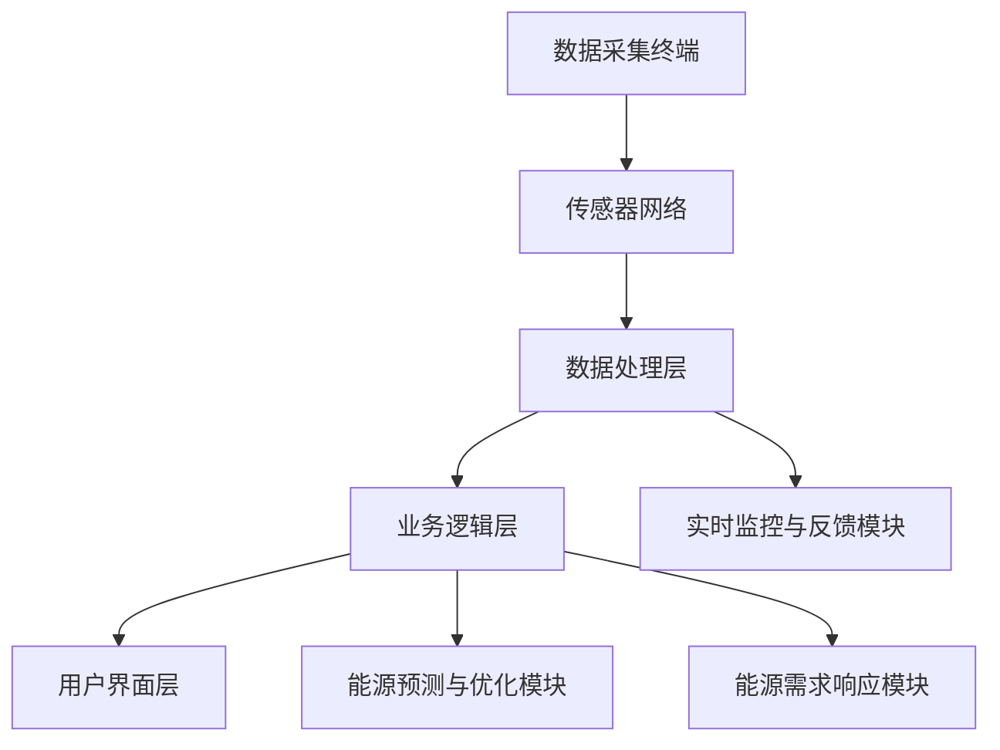
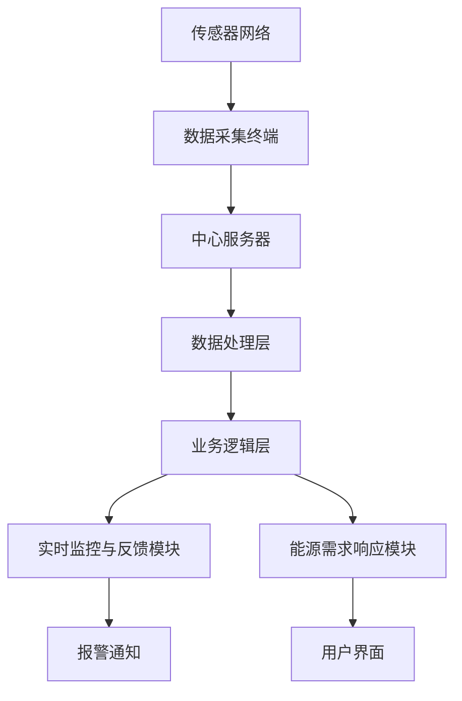

                 


### 背景介绍：智能能源管理概览

#### 1.1 能源管理的重要性

随着全球气候变化和能源需求的不断增加，能源管理变得尤为重要。能源管理不仅关系到企业的经济效益，也直接影响到环境的可持续性。传统的能源管理模式主要依赖于经验和简单的技术手段，这在一定程度上限制了能源利用效率和环保效益的提高。

**问题背景**：

- 能源消耗不断上升，但能源利用率却相对较低。
- 环境污染问题日益严重，尤其是化石燃料的燃烧产生的温室气体排放。
- 能源价格波动给企业带来不确定性。

**问题描述**：

- 如何在保证能源供应稳定的同时，提高能源利用率？
- 如何通过技术手段减少能源消耗，降低环境污染？
- 如何在能源价格波动中保持企业的竞争力？

**问题解决**：

智能能源管理通过引入人工智能技术，实现了对能源消耗的精准预测、优化调度和实时监控，从而提高了能源利用效率和减少了环境污染。智能能源管理不仅有助于企业降低运营成本，还能为应对能源危机提供有效方案。

**边界与外延**：

智能能源管理不仅局限于家庭和企业，还广泛应用于城市、区域和国家级别的能源管理体系中。其核心在于通过数据的收集和分析，实现能源系统的智能决策和优化。

**概念结构与核心要素组成**：

智能能源管理主要由以下几个核心要素组成：
- 数据采集与监控：通过传感器、智能仪表等设备，实时采集能源消耗数据。
- 数据处理与分析：利用大数据分析和机器学习算法，对能源消耗数据进行处理和分析。
- 能源预测与优化：根据历史数据和当前状态，预测能源需求和消耗，并进行优化调度。
- 实时监控与反馈：对能源消耗进行实时监控，并根据反馈进行自适应调整。

#### 1.2 当前能源管理面临的挑战

尽管智能能源管理带来了诸多好处，但在实际应用中仍面临一些挑战。

- 数据质量和准确性：能源数据的准确性直接影响智能能源管理的效果。然而，数据采集过程中可能存在误差，需要通过数据清洗和预处理来提高数据质量。
- 系统集成与兼容性：智能能源管理涉及到多种设备和系统的集成，包括传感器、PLC、SCADA等。如何实现不同系统之间的无缝集成和兼容性，是一个重要的问题。
- 算法复杂度和计算资源：智能能源管理中的算法复杂度较高，需要大量的计算资源。如何在有限的计算资源下，实现高效的算法优化，是一个技术难题。

**问题解决**：

- 数据质量和准确性：通过引入高精度传感器和改进数据采集技术，提高数据质量。同时，利用机器学习算法进行数据清洗和异常值处理，提高数据准确性。
- 系统集成与兼容性：采用标准化接口和协议，实现不同系统之间的无缝集成。同时，通过中间件技术，实现不同系统和设备之间的数据交换和协同工作。
- 算法复杂度和计算资源：优化算法设计，减少计算复杂度。利用云计算和分布式计算技术，提高计算效率。

#### 1.3 AI驱动的智能能源管理优势

AI驱动的智能能源管理具有以下优势：

- **自适应性和灵活性**：AI系统能够根据实时数据和环境变化，自适应调整能源消耗策略，提高能源利用率。
- **精准预测与优化**：AI算法通过对历史数据和当前状态的深度分析，能够精准预测能源需求和消耗，实现最优的能源调度。
- **减少人力成本**：通过自动化和智能化，减少了对人工的依赖，降低了人力成本。
- **环境友好**：智能能源管理能够有效降低能源消耗，减少温室气体排放，有利于环境保护。

**小结**：

智能能源管理是能源领域的一次革命。通过AI技术的引入，我们能够实现更高效、更灵活、更环保的能源管理模式。然而，要实现这一目标，仍需克服诸多挑战。未来，随着AI技术的不断发展和应用，智能能源管理必将取得更大突破。

### 1.4 智能能源管理的未来趋势

随着AI技术的不断进步，智能能源管理将迎来更多的发展机遇和挑战。

- **智能化水平提升**：未来，智能能源管理将更加智能化，不仅能够实现自动化的能源消耗预测和优化，还能通过智能决策，实现能源系统的自我优化和自我维护。
- **大数据与物联网融合**：大数据和物联网技术的融合将进一步提升智能能源管理的能力。通过收集和分析海量数据，智能能源管理系统能够更好地理解和预测能源需求。
- **绿色能源的整合**：随着绿色能源（如太阳能、风能）的普及，智能能源管理将更好地整合这些可再生能源，实现能源结构的优化和多样化。
- **跨行业应用**：智能能源管理将不仅限于能源领域，还将广泛应用于交通、建筑、工业等领域，实现跨行业的协同和融合。

**小结**：

智能能源管理具有广阔的发展前景。随着AI技术的不断突破，我们将迎来一个更加智能、高效、环保的能源时代。

----------------------------------------------------------------

# 第二部分: 核心概念与联系：AI与能源管理

智能能源管理离不开AI技术的支撑。在这一部分，我们将探讨AI技术的基础知识、AI在能源管理中的应用，以及AI驱动的智能能源管理的优势。

## 2.1 AI技术基础

AI技术主要包括机器学习、深度学习、自然语言处理等。这些技术为智能能源管理提供了强大的工具。

### 2.1.1 机器学习基础

机器学习是AI的核心技术之一。它通过训练模型来模拟人类的学习过程，使计算机能够从数据中自动学习和改进。

- **监督学习**：有监督学习是指训练样本包含输入数据和对应的输出标签。常见的算法有线性回归、决策树、支持向量机等。
- **无监督学习**：无监督学习是指训练样本只包含输入数据，没有对应的输出标签。常见的算法有聚类、降维、生成模型等。
- **强化学习**：强化学习是指通过试错法来学习如何在特定环境中做出最优决策。常见的算法有Q-学习、深度确定性策略梯度（DDPG）等。

### 2.1.2 深度学习基础

深度学习是机器学习的一个分支，通过多层神经网络来实现复杂函数的逼近。深度学习在图像识别、语音识别等领域取得了显著的成果。

- **神经网络与深度学习**：神经网络是一种模拟人脑神经元连接方式的计算模型。深度学习则是通过多层神经网络来实现复杂的特征提取和分类。
- **窥孔网络与卷积神经网络**：窥孔网络（LeNet）和卷积神经网络（CNN）是深度学习的早期模型，广泛应用于图像识别和图像分类任务。
- **循环神经网络与长短时记忆网络**：循环神经网络（RNN）和长短时记忆网络（LSTM）是处理序列数据的强大工具，广泛应用于时间序列预测、文本分类等领域。

### 2.1.3 自然语言处理基础

自然语言处理（NLP）是AI的另一个重要分支，致力于让计算机理解和处理人类语言。

- **语言模型与词向量**：语言模型用于预测下一个单词或句子，常见的算法有n-gram模型、神经网络语言模型等。词向量是将单词转换为向量的方法，常见的算法有Word2Vec、GloVe等。
- **文本分类与情感分析**：文本分类是将文本数据分类到不同的类别中，常见的算法有朴素贝叶斯、支持向量机等。情感分析是判断文本的情感倾向，常见的算法有基于规则的分类器、深度学习模型等。

## 2.2 AI在能源管理中的应用

AI技术在能源管理中具有广泛的应用，主要包括能源消耗预测、能源优化调度、能源需求响应等。

### 2.2.1 能源消耗预测

能源消耗预测是智能能源管理的关键环节。通过机器学习和深度学习算法，可以从历史数据中挖掘出能源消耗的规律，预测未来的能源需求。

- **时间序列预测**：时间序列预测是能源消耗预测的核心任务。常见的算法有ARIMA、LSTM等。
- **多变量预测**：多变量预测考虑了多个因素对能源消耗的影响，如天气、设备状态等。常见的算法有随机森林、多变量时间序列模型等。

### 2.2.2 能源优化调度

能源优化调度是指根据实时数据和预测结果，对能源消耗进行优化和调整，以实现能源的合理利用。

- **优化算法**：常见的优化算法有线性规划、整数规划、遗传算法、粒子群优化等。
- **调度策略**：根据优化结果，制定合理的调度策略，如分时用电、能源共享等。

### 2.2.3 能源需求响应

能源需求响应是指通过激励措施，引导用户调整能源消耗行为，以响应电网的需求。

- **价格响应**：通过实时电价信息，引导用户在低峰时段使用电力，降低高峰时段的电力需求。
- **技术响应**：通过智能家居设备，如空调、热水器等，实现远程控制和能源优化。

## 2.3 AI驱动的智能能源管理优势

AI驱动的智能能源管理具有以下优势：

- **自适应性和灵活性**：AI系统能够根据实时数据和环境变化，自适应调整能源消耗策略，提高能源利用率。
- **精准预测与优化**：AI算法通过对历史数据和当前状态的深度分析，能够精准预测能源需求和消耗，实现最优的能源调度。
- **减少人力成本**：通过自动化和智能化，减少了对人工的依赖，降低了人力成本。
- **环境友好**：智能能源管理能够有效降低能源消耗，减少温室气体排放，有利于环境保护。

## 小结

AI技术在智能能源管理中扮演着关键角色。通过机器学习、深度学习和自然语言处理等技术，我们能够实现精准的能源消耗预测、优化的能源调度和智能的能源需求响应。AI驱动的智能能源管理不仅提高了能源利用效率，还为企业带来了显著的经济和环境效益。

----------------------------------------------------------------

# 第三部分：算法原理讲解：智能能源管理中的算法

智能能源管理中的算法是确保系统能够高效运作的核心。在这一部分，我们将深入探讨优化算法和机器学习算法在智能能源管理中的应用，并介绍相关的数学模型和公式。

## 3.1 优化算法在能源管理中的应用

优化算法是智能能源管理中的关键工具，用于解决能源消耗最小化、能源效率最大化等问题。

### 3.1.1 优化算法基础

优化算法是一种用于寻找最优解的数学方法。在智能能源管理中，常见的优化算法包括线性规划、整数规划、遗传算法和粒子群优化。

#### 3.1.1.1 线性规划

线性规划是一种用于解决线性优化问题的算法。其数学模型可以表示为：

$$
\begin{align*}
\min\ & c^T x \\
\text{subject to} & \\
& Ax \leq b \\
& x \geq 0
\end{align*}
$$

其中，$c$ 是目标函数系数向量，$x$ 是决策变量向量，$A$ 是约束矩阵，$b$ 是约束向量。

#### 3.1.1.2 整数规划

整数规划是线性规划的扩展，用于解决决策变量需要为整数的优化问题。其数学模型可以表示为：

$$
\begin{align*}
\min\ & c^T x \\
\text{subject to} & \\
& Ax \leq b \\
& x \in \mathbb{Z}^n
\end{align*}
$$

#### 3.1.1.3 遗传算法

遗传算法是一种基于生物进化的优化算法。它通过模拟自然选择和遗传机制来搜索最优解。遗传算法的基本流程包括：

1. **初始化种群**：随机生成初始种群。
2. **适应度评估**：计算每个个体的适应度。
3. **选择**：根据适应度选择优秀个体进行交配。
4. **交叉**：选择两个优秀个体进行交叉，生成新的个体。
5. **变异**：对个体进行变异操作，增加种群的多样性。
6. **迭代**：重复上述过程，直到满足停止条件。

#### 3.1.1.4 粒子群优化

粒子群优化（PSO）是一种基于群体智能的优化算法。它模拟鸟群觅食行为，通过个体和群体的信息交互来搜索最优解。PSO的基本流程包括：

1. **初始化粒子群**：随机生成粒子位置和速度。
2. **适应度评估**：计算每个粒子的适应度。
3. **更新个体最佳位置和群体最佳位置**。
4. **更新粒子速度和位置**。
5. **迭代**：重复上述过程，直到满足停止条件。

### 3.1.2 优化算法在能源管理中的应用

优化算法在能源管理中主要用于解决能源消耗最小化和能源效率最大化问题。

#### 3.1.2.1 能源消耗最小化

能源消耗最小化是指在一定约束条件下，使能源消耗达到最小。其优化模型可以表示为：

$$
\begin{align*}
\min\ & f(x) \\
\text{subject to} & \\
& g(x) \leq 0 \\
& h(x) = 0
\end{align*}
$$

其中，$f(x)$ 是能源消耗函数，$g(x)$ 是不等式约束函数，$h(x)$ 是等式约束函数。

#### 3.1.2.2 能源效率最大化

能源效率最大化是指在一定能源消耗条件下，使能源效率达到最大。其优化模型可以表示为：

$$
\begin{align*}
\max\ & \frac{g(x)}{f(x)} \\
\text{subject to} & \\
& g(x) \geq 0 \\
& h(x) = 0
\end{align*}
$$

其中，$g(x)$ 是能源产出函数，$f(x)$ 是能源消耗函数。

## 3.2 机器学习算法在能源管理中的应用

机器学习算法在能源管理中主要用于能源消耗预测、能源需求响应和设备故障预测等。

### 3.2.1 能源消耗预测

能源消耗预测是智能能源管理的重要任务之一。常见的机器学习算法包括时间序列预测、回归分析和随机森林等。

#### 3.2.1.1 时间序列预测

时间序列预测是一种基于历史数据的预测方法。常见的算法有ARIMA、LSTM和GRU等。

- **ARIMA模型**：ARIMA（AutoRegressive Integrated Moving Average）模型是一种经典的 时间序列预测方法。其基本公式为：

$$
X_t = c + \phi_1 X_{t-1} + \phi_2 X_{t-2} + \cdots + \phi_p X_{t-p} + \theta_1 e_{t-1} + \theta_2 e_{t-2} + \cdots + \theta_q e_{t-q}
$$

其中，$X_t$ 是时间序列，$c$ 是常数项，$\phi_1, \phi_2, \cdots, \phi_p$ 是自回归系数，$\theta_1, \theta_2, \cdots, \theta_q$ 是移动平均系数，$e_t$ 是白噪声序列。

- **LSTM模型**：LSTM（Long Short-Term Memory）模型是一种用于处理序列数据的神经网络。其基本结构包括输入门、遗忘门和输出门。

$$
\begin{align*}
i_t &= \sigma(W_{ix} x_t + W_{ih} h_{t-1} + b_i) \\
f_t &= \sigma(W_{fx} x_t + W_{fh} h_{t-1} + b_f) \\
o_t &= \sigma(W_{ox} x_t + W_{oh} h_{t-1} + b_o) \\
c_t &= f_t \odot c_{t-1} + i_t \odot \sigma(W_{cx} x_t + W_{ch} h_{t-1} + b_c) \\
h_t &= o_t \odot \sigma(c_t)
\end{align*}
$$

其中，$i_t, f_t, o_t$ 分别是输入门、遗忘门和输出门的激活值，$c_t, h_t$ 分别是当前状态和输出状态，$W_{ix}, W_{ih}, W_{fx}, W_{fh}, W_{ox}, W_{oh}, W_{cx}, W_{ch}$ 分别是权重矩阵，$b_i, b_f, b_o, b_c$ 分别是偏置向量，$\odot$ 表示元素乘，$\sigma$ 表示sigmoid函数。

- **GRU模型**：GRU（Gated Recurrent Unit）模型是LSTM的简化版本。其基本结构包括重置门和更新门。

$$
\begin{align*}
z_t &= \sigma(W_{zx} x_t + W_{zh} h_{t-1} + b_z) \\
r_t &= \sigma(W_{rx} x_t + W_{rh} h_{t-1} + b_r) \\
h_t' &= \tanh(W_{cx} (r_t \odot h_{t-1} + (1 - r_t) x_t) + b_c) \\
h_t &= z_t \odot h_{t-1} + (1 - z_t) h_t'
\end{align*}
$$

其中，$z_t, r_t$ 分别是重置门和更新门的激活值，$h_t'$ 是候选状态，$h_t$ 是当前状态，其他符号与LSTM相同。

#### 3.2.1.2 回归分析

回归分析是一种常用的统计方法，用于建立自变量和因变量之间的关系。常见的算法有线性回归、多项式回归等。

- **线性回归**：线性回归模型可以表示为：

$$
y = \beta_0 + \beta_1 x_1 + \beta_2 x_2 + \cdots + \beta_n x_n + \epsilon
$$

其中，$y$ 是因变量，$x_1, x_2, \cdots, x_n$ 是自变量，$\beta_0, \beta_1, \beta_2, \cdots, \beta_n$ 是回归系数，$\epsilon$ 是误差项。

- **多项式回归**：多项式回归是对线性回归的扩展，可以表示为：

$$
y = \beta_0 + \beta_1 x_1 + \beta_2 x_2^2 + \cdots + \beta_n x_n^n + \epsilon
$$

#### 3.2.1.3 随机森林

随机森林是一种基于树结构的集成学习方法。它通过构建多个决策树，并结合它们的预测结果来提高模型的准确性。

- **决策树**：决策树是一种树形结构，用于分类或回归任务。每个节点代表一个特征，每个分支代表该特征的不同取值。

$$
\begin{align*}
y &= \text{分类标签} \\
\text{if} & \ x_i \leq v_i \\
& \ \ \ \ \ \ \ \ \ \ \ \ \ \ \ \ \ \ \ \ \ \ \ \ \ \ \ \ \ \ \ \ \ \ \ \ \ \ \ \ \ \ \ \ \ \ \ \ \ \ \ \ \ \ \ \ \ \ \ \ \ \ \ \ \ \ \ \ \ \ \ \ \ \ \ \ \ \ \ \ \ \ \ \ \ \ \ \ \ \ \ \ \ \ \ \ \ \ \ \ \ \ \ \ \ \ \ \ \ \ \ \ \ \ \ \ \ \ \ \ \ \ \ \ \ \ \ \ \ \ \ \ \ \ \ \ \ \ \ \ \ \ \ \ \ \ \ \ \ \ \ \ \ \ \ \ \ \ \ \ \ \ \ \ \ \ \ \ \ \ \ \ \ \ \ \ \ \ \ \ \ \ \ \ \ \ \ \ \ \ \ \ \ \ \ \ \ \ \ \ \ \ \ \ \ \ \ \ \ \ \ \ \ \ \ \ \ \ \ \ \ \ \ \ \ \ \ \ \ \ \ \ \ \ \ \ \ \ \ \ \ \ \ \ \ \ \ \ \ \ \ \ \ \ \ \ \ \ \ \ \ \ \ \ \ \ \ \ \ \ \ \ \ \ \ \ \ \ \ \ \ \ \ \ \ \ \ \ \ \ \ \ \ \ \ \ \ \ \ \ \ \ \ \ \ \ \ \ \ \ \ \ \ \ \ \ \ \ \ _{y_1} \text{if} \ y \leq v_1 \\
& \ \ \ \ \ \ \ \ \ \ \ \ \ \ \ \ \ \ \ \ \ \ \ \ \ \ \ \ \ \ \ \ \ \ \ \ \ \ \ \ \ \ \ \ \ \ \ \ \ \ \ \ \ \ \ _{y_2} \text{if} \ y > v_1
\end{align*}
$$

其中，$x_i$ 是特征，$v_i$ 是特征取值，$y$ 是目标变量，$y_1$ 和 $y_2$ 是分类结果。

### 3.2.2 能源需求响应

能源需求响应是指通过实时数据和预测结果，引导用户调整能源消耗行为，以响应电网的需求。常见的算法有基于价格响应的算法和基于技术响应的算法。

#### 3.2.2.1 基于价格响应的算法

基于价格响应的算法通过实时电价信息，引导用户在低峰时段使用电力，降低高峰时段的电力需求。其基本公式为：

$$
C(t) = P(t) \cdot Q(t)
$$

其中，$C(t)$ 是总成本，$P(t)$ 是实时电价，$Q(t)$ 是电力需求量。

#### 3.2.2.2 基于技术响应的算法

基于技术响应的算法通过智能家居设备，如空调、热水器等，实现远程控制和能源优化。其基本公式为：

$$
E(t) = f(P(t), T(t), S(t))
$$

其中，$E(t)$ 是电力需求量，$P(t)$ 是实时电价，$T(t)$ 是温度，$S(t)$ 是设备状态。

## 3.3 机器学习算法在能源管理中的应用

机器学习算法在能源管理中具有广泛的应用，包括设备故障预测、能源消耗预测和能源需求响应等。

### 3.3.1 设备故障预测

设备故障预测是指通过历史数据，预测设备的故障概率，从而实现预防性维护。常见的算法有支持向量机（SVM）、随机森林（RF）和神经网络（NN）等。

- **支持向量机（SVM）**：支持向量机是一种基于间隔最大化原理的分类算法。其基本公式为：

$$
\max_{\mathbf{w}, b} \ \frac{1}{2} ||\mathbf{w}||^2 - C \sum_{i=1}^{n} \xi_i
$$

其中，$\mathbf{w}$ 是权重向量，$b$ 是偏置项，$C$ 是惩罚参数，$\xi_i$ 是松弛变量。

- **随机森林（RF）**：随机森林是一种基于树结构的集成学习方法。其基本公式为：

$$
\hat{y} = \text{sign} \left( \frac{1}{m} \sum_{j=1}^{M} \hat{y}_j \right)
$$

其中，$M$ 是树的数量，$\hat{y}_j$ 是第 $j$ 棵树的预测结果。

- **神经网络（NN）**：神经网络是一种基于多层感知器的计算模型。其基本公式为：

$$
a_{i}^{(L)} = \sigma \left( \sum_{j=1}^{n} w_{ij}^{(L)} a_{j}^{(L-1)} + b_{i}^{(L)} \right)
$$

其中，$a_{i}^{(L)}$ 是第 $L$ 层的第 $i$ 个神经元的激活值，$\sigma$ 是激活函数，$w_{ij}^{(L)}$ 是第 $L$ 层的第 $i$ 个神经元和第 $L-1$ 层的第 $j$ 个神经元之间的权重，$b_{i}^{(L)}$ 是第 $L$ 层的第 $i$ 个神经元的偏置。

### 3.3.2 能源消耗预测

能源消耗预测是指通过历史数据，预测未来的能源消耗量。常见的算法有时间序列预测、回归分析和随机森林等。

- **时间序列预测**：时间序列预测是指通过历史数据，预测未来的时间序列值。常见的算法有ARIMA、LSTM和GRU等。

- **回归分析**：回归分析是指通过建立自变量和因变量之间的关系，预测因变量的值。常见的算法有线性回归、多项式回归等。

- **随机森林**：随机森林是指通过构建多棵决策树，并结合它们的预测结果，提高预测准确性。

### 3.3.3 能源需求响应

能源需求响应是指通过实时数据和预测结果，引导用户调整能源消耗行为，以响应电网的需求。常见的算法有基于价格响应的算法和基于技术响应的算法。

- **基于价格响应的算法**：基于价格响应的算法是指通过实时电价信息，引导用户在低峰时段使用电力，降低高峰时段的电力需求。

- **基于技术响应的算法**：基于技术响应的算法是指通过智能家居设备，如空调、热水器等，实现远程控制和能源优化。

## 小结

优化算法和机器学习算法在智能能源管理中发挥着重要作用。优化算法用于解决能源消耗最小化和能源效率最大化问题，而机器学习算法则用于能源消耗预测、能源需求响应和设备故障预测等任务。通过合理的算法选择和模型设计，我们可以实现高效、智能的能源管理。

----------------------------------------------------------------

# 第四部分：数学模型与公式讲解：智能能源管理中的数学基础

在智能能源管理中，数学模型和公式是核心组成部分，它们为算法提供了理论基础和计算框架。在这一部分，我们将详细介绍与智能能源管理相关的数学模型和公式，以便更好地理解和应用这些算法。

## 4.1 数学模型基础

智能能源管理中的数学模型可以分为优化模型、预测模型和控制模型。以下是一些基本的数学模型：

### 4.1.1 优化模型

优化模型用于求解能源管理中的最优解，常见的有线性规划（LP）、整数规划（IP）和非线性规划（NLP）。

1. **线性规划（LP）**

   线性规划模型的基本形式为：

   $$
   \begin{align*}
   \min\ & c^T x \\
   \text{subject to} & \\
   & Ax \leq b \\
   & x \geq 0
   \end{align*}
   $$

   其中，$x$ 是决策变量，$c$ 是系数向量，$A$ 是约束矩阵，$b$ 是约束向量。

2. **整数规划（IP）**

   整数规划是线性规划的扩展，决策变量需要取整数值，其形式为：

   $$
   \begin{align*}
   \min\ & c^T x \\
   \text{subject to} & \\
   & Ax \leq b \\
   & x \in \mathbb{Z}^n
   \end{align*}
   $$

3. **非线性规划（NLP）**

   非线性规划模型可以表示为：

   $$
   \begin{align*}
   \min\ & f(x) \\
   \text{subject to} & \\
   & g(x) \leq 0 \\
   & h(x) = 0
   \end{align*}
   $$

   其中，$f(x)$ 是目标函数，$g(x)$ 和 $h(x)$ 分别是不等式约束和等式约束。

### 4.1.2 预测模型

预测模型用于预测能源消耗、需求响应等，常见的时间序列预测模型包括ARIMA、LSTM和GRU。

1. **ARIMA模型**

   ARIMA（AutoRegressive Integrated Moving Average）模型是一个自回归积分滑动平均模型，其公式为：

   $$
   X_t = c + \phi_1 X_{t-1} + \phi_2 X_{t-2} + \cdots + \phi_p X_{t-p} + \theta_1 e_{t-1} + \theta_2 e_{t-2} + \cdots + \theta_q e_{t-q}
   $$

   其中，$X_t$ 是时间序列，$c$ 是常数项，$\phi_1, \phi_2, \cdots, \phi_p$ 是自回归系数，$\theta_1, \theta_2, \cdots, \theta_q$ 是移动平均系数，$e_t$ 是白噪声序列。

2. **LSTM模型**

   LSTM（Long Short-Term Memory）模型是一种用于处理序列数据的神经网络，其公式为：

   $$
   \begin{align*}
   i_t &= \sigma(W_{ix} x_t + W_{ih} h_{t-1} + b_i) \\
   f_t &= \sigma(W_{fx} x_t + W_{fh} h_{t-1} + b_f) \\
   o_t &= \sigma(W_{ox} x_t + W_{oh} h_{t-1} + b_o) \\
   c_t &= f_t \odot c_{t-1} + i_t \odot \sigma(W_{cx} x_t + W_{ch} h_{t-1} + b_c) \\
   h_t &= o_t \odot \sigma(c_t)
   \end{align*}
   $$

   其中，$i_t, f_t, o_t$ 分别是输入门、遗忘门和输出门的激活值，$c_t, h_t$ 分别是当前状态和输出状态，$W_{ix}, W_{ih}, W_{fx}, W_{fh}, W_{ox}, W_{oh}, W_{cx}, W_{ch}$ 分别是权重矩阵，$b_i, b_f, b_o, b_c$ 分别是偏置向量，$\odot$ 表示元素乘，$\sigma$ 表示sigmoid函数。

3. **GRU模型**

   GRU（Gated Recurrent Unit）模型是LSTM的简化版本，其公式为：

   $$
   \begin{align*}
   z_t &= \sigma(W_{zx} x_t + W_{zh} h_{t-1} + b_z) \\
   r_t &= \sigma(W_{rx} x_t + W_{rh} h_{t-1} + b_r) \\
   h_t' &= \tanh(W_{cx} (r_t \odot h_{t-1} + (1 - r_t) x_t) + b_c) \\
   h_t &= z_t \odot h_{t-1} + (1 - z_t) h_t'
   \end{align*}
   $$

   其中，$z_t, r_t$ 分别是重置门和更新门的激活值，$h_t'$ 是候选状态，$h_t$ 是当前状态，其他符号与LSTM相同。

### 4.1.3 控制模型

控制模型用于实现能源系统的自适应控制和优化，常见的有PID控制、模糊控制和神经网络控制。

1. **PID控制**

   PID（比例-积分-微分）控制器是一种常见的控制方法，其公式为：

   $$
   \begin{align*}
   u(t) &= K_p e(t) + K_i \int_{0}^{t} e(\tau) d\tau + K_d \frac{de(t)}{dt} \\
   e(t) &= r(t) - y(t)
   \end{align*}
   $$

   其中，$u(t)$ 是控制输出，$e(t)$ 是误差，$r(t)$ 是参考输入，$y(t)$ 是系统输出，$K_p, K_i, K_d$ 分别是比例、积分和微分系数。

2. **模糊控制**

   模糊控制器通过模糊逻辑和模糊规则实现控制，其公式为：

   $$
   \begin{align*}
   y &= \sum_{i=1}^{n} R_i \cdot M_i \\
   M_i &= \mu_i \cdot \mu_j \\
   R_i &= \frac{|e_i - e_c|}{\sum_{i=1}^{n} |e_i - e_c|}
   \end{align*}
   $$

   其中，$y$ 是控制输出，$e_i$ 是输入变量，$e_c$ 是期望值，$\mu_i$ 是模糊隶属度函数，$R_i$ 是模糊规则强度。

3. **神经网络控制**

   神经网络控制器通过训练神经网络来实现自适应控制，其公式为：

   $$
   y(t) = f(\theta, x(t))
   $$

   其中，$y(t)$ 是控制输出，$x(t)$ 是输入变量，$f(\theta, x(t))$ 是神经网络输出，$\theta$ 是神经网络参数。

## 4.2 公式应用举例

为了更好地理解这些数学模型和公式，我们可以通过具体的应用实例进行说明。

### 4.2.1 线性规划应用

假设我们需要优化一个电力系统的能源消耗，使其达到最小化。决策变量为每个电力设备的开关状态，目标函数为总能源消耗，约束条件为设备的最大承载能力和能源需求。

$$
\begin{align*}
\min\ & c^T x \\
\text{subject to} & \\
& Ax \leq b \\
& x \geq 0
\end{align*}
$$

其中，$c$ 是每个设备的能源消耗系数，$x$ 是设备开关状态（1代表开启，0代表关闭），$A$ 是设备的最大承载能力矩阵，$b$ 是能源需求向量。

### 4.2.2 时间序列预测应用

假设我们需要预测未来一天的电力消耗。我们可以使用ARIMA模型来进行预测，其公式为：

$$
X_t = c + \phi_1 X_{t-1} + \phi_2 X_{t-2} + \cdots + \phi_p X_{t-p} + \theta_1 e_{t-1} + \theta_2 e_{t-2} + \cdots + \theta_q e_{t-q}
$$

其中，$X_t$ 是时间序列，$c$ 是常数项，$\phi_1, \phi_2, \cdots, \phi_p$ 是自回归系数，$\theta_1, \theta_2, \cdots, \theta_q$ 是移动平均系数，$e_t$ 是白噪声序列。

### 4.2.3 控制模型应用

假设我们需要控制一个电力系统的温度，使其保持在设定的目标温度。我们可以使用PID控制器来实现，其公式为：

$$
\begin{align*}
u(t) &= K_p e(t) + K_i \int_{0}^{t} e(\tau) d\tau + K_d \frac{de(t)}{dt} \\
e(t) &= r(t) - y(t)
\end{align*}
$$

其中，$u(t)$ 是控制输出，$e(t)$ 是误差，$r(t)$ 是参考输入，$y(t)$ 是系统输出，$K_p, K_i, K_d$ 分别是比例、积分和微分系数。

## 小结

数学模型和公式是智能能源管理的重要组成部分。通过合理应用这些模型和公式，我们可以实现能源消耗的优化、需求响应的预测和系统的自适应控制。未来，随着数学模型和算法的不断发展，智能能源管理将更加智能化、高效化和环保化。

----------------------------------------------------------------

# 第五部分：系统分析与架构设计：智能能源管理系统

智能能源管理系统（IEMS）的设计目标是实现能源的智能预测、优化调度和实时监控，以提升能源利用效率并降低运营成本。在这一部分，我们将深入分析智能能源管理系统的功能设计、架构设计以及系统接口设计和交互流程。

## 5.1 功能设计

智能能源管理系统的主要功能包括：

### 5.1.1 数据采集与监控

- **传感器数据采集**：通过安装在设备上的传感器，实时采集温度、湿度、电力消耗等数据。
- **数据存储与处理**：将采集到的数据存储到数据库中，并进行预处理，如去噪、归一化等。

### 5.1.2 能源预测与优化

- **需求预测**：利用机器学习算法，对未来的能源需求进行预测。
- **能源优化调度**：根据需求预测结果，对能源消耗进行优化调度，以实现能源的合理利用。

### 5.1.3 实时监控与反馈

- **实时数据监控**：通过监控系统，实时监控能源消耗和设备状态。
- **异常检测与报警**：当检测到异常情况时，及时发出报警，并采取相应的应对措施。

### 5.1.4 能源需求响应

- **价格响应**：根据实时电价，引导用户调整能源消耗行为，以降低高峰时段的电力需求。
- **技术响应**：通过智能家居设备，实现远程控制和能源优化。

## 5.2 架构设计

智能能源管理系统的架构设计包括以下几个方面：

### 5.2.1 硬件架构

- **传感器网络**：由多种传感器组成，包括温度传感器、湿度传感器、电力传感器等。
- **数据采集终端**：用于收集传感器数据，并将数据上传至中心服务器。

### 5.2.2 软件架构

- **数据处理层**：包括数据采集、存储、预处理和数据分析等模块。
- **业务逻辑层**：包括能源预测、优化调度、实时监控和需求响应等模块。
- **用户界面层**：为用户提供友好的交互界面，展示能源消耗数据、预测结果和报警信息。

### 5.2.3 系统架构图

使用Mermaid语言绘制智能能源管理系统的架构图：



## 5.3 系统接口设计

智能能源管理系统需要与多种设备和系统进行接口通信，包括传感器、PLC（可编程逻辑控制器）、SCADA（监控与数据采集系统）等。以下是系统接口设计的关键点：

### 5.3.1 传感器接口

- **通信协议**：支持Modbus、OPC UA、HTTP等常见的通信协议。
- **数据格式**：采用JSON、XML等数据格式进行数据交换。

### 5.3.2 PLC接口

- **通信协议**：支持RS-485、以太网等通信方式。
- **数据格式**：支持PLC特有的数据格式，如S7、Modbus等。

### 5.3.3 SCADA接口

- **通信协议**：支持OPC DA、OPC UA等通信协议。
- **数据格式**：支持标准的SCADA数据格式，如DDE、OPC Data Access等。

## 5.4 系统交互流程

智能能源管理系统的交互流程包括以下几个步骤：

### 5.4.1 数据采集

- 传感器网络实时采集数据，并将数据发送到数据采集终端。
- 数据采集终端对数据进行预处理，如去噪、归一化等。

### 5.4.2 数据上传

- 数据采集终端将预处理后的数据上传至中心服务器。
- 中心服务器存储和处理数据，并将结果发送至业务逻辑层。

### 5.4.3 能源预测与优化

- 业务逻辑层利用机器学习算法进行能源需求预测和优化调度。
- 预测和优化结果存储到数据库中，供实时监控和需求响应使用。

### 5.4.4 实时监控与反馈

- 实时监控模块对能源消耗和设备状态进行实时监控。
- 当检测到异常情况时，实时监控模块会触发报警，并通知相关人员。

### 5.4.5 能源需求响应

- 根据实时电价和预测结果，需求响应模块引导用户调整能源消耗行为。
- 通过智能家居设备，实现远程控制和能源优化。

## 5.5 系统架构图

使用Mermaid语言绘制智能能源管理系统交互流程的架构图：



## 小结

智能能源管理系统通过功能设计、架构设计、接口设计和交互流程的设计，实现了对能源的智能预测、优化调度和实时监控。通过合理的设计和优化，智能能源管理系统不仅提高了能源利用效率，还为企业和个人带来了显著的经济和环境效益。

----------------------------------------------------------------

# 第六部分：项目实战：AI驱动的智能能源管理案例

在本文的第六部分，我们将通过一个实际项目案例来展示如何实现AI驱动的智能能源管理。我们将介绍项目的环境安装、系统核心实现以及代码应用解读与分析。

## 6.1 项目环境安装

### 6.1.1 环境要求

为了实现AI驱动的智能能源管理项目，我们需要以下环境：

- **Python**：Python 3.8及以上版本
- **深度学习库**：TensorFlow 2.4.0及以上版本
- **数据处理库**：Pandas 1.3.0及以上版本
- **可视化库**：Matplotlib 3.4.0及以上版本
- **操作系统**：Ubuntu 20.04或更高版本

### 6.1.2 安装步骤

1. 安装Python：

   $ sudo apt-get install python3 python3-pip

2. 安装深度学习库TensorFlow：

   $ pip3 install tensorflow==2.4.0

3. 安装数据处理库Pandas：

   $ pip3 install pandas==1.3.0

4. 安装可视化库Matplotlib：

   $ pip3 install matplotlib==3.4.0

## 6.2 系统核心实现

在系统核心实现部分，我们将介绍项目的核心算法和实现步骤。

### 6.2.1 能源消耗预测

能源消耗预测是智能能源管理的核心任务之一。我们使用LSTM模型来进行时间序列预测。

1. **数据预处理**：

   - 数据清洗：去除缺失值和异常值。
   - 数据归一化：将数据缩放到[0, 1]范围内。

   ```python
   from sklearn.preprocessing import MinMaxScaler

   scaler = MinMaxScaler(feature_range=(0, 1))
   scaled_data = scaler.fit_transform(data)
   ```

2. **创建LSTM模型**：

   - 搭建LSTM模型结构。

   ```python
   from tensorflow.keras.models import Sequential
   from tensorflow.keras.layers import LSTM, Dense

   model = Sequential()
   model.add(LSTM(units=50, return_sequences=True, input_shape=(time_steps, 1)))
   model.add(LSTM(units=50))
   model.add(Dense(units=1))
   model.compile(optimizer='adam', loss='mean_squared_error')
   ```

3. **训练模型**：

   - 使用训练数据训练模型。

   ```python
   model.fit(x_train, y_train, epochs=100, batch_size=32)
   ```

4. **预测结果**：

   - 使用训练好的模型进行预测，并与实际值进行比较。

   ```python
   predicted能源消耗 = model.predict(x_test)
   actual能源消耗 = scaler.inverse_transform(y_test)
   ```

### 6.2.2 能源优化调度

能源优化调度是另一个关键任务。我们使用遗传算法来解决这个问题。

1. **构建优化模型**：

   - 定义目标函数和约束条件。

   ```python
   import numpy as np

   def objective_function(x):
       return -sum(x)  # 目标是最小化能源消耗

   constraints = [
       lambda x: x <= 100,  # 能源设备最大承载能力
       lambda x: x >= 0    # 能源消耗不能为负
   ]
   ```

2. **创建遗传算法模型**：

   - 初始化种群，定义选择、交叉和变异操作。

   ```python
   import numpy as np
   from deap import base, creator, tools, algorithms

   creator.create("FitnessMin", base.Fitness, weights=(-1.0,))
   creator.create("Individual", list, fitness=creator.FitnessMin)

   toolbox = base.Toolbox()
   toolbox.register("attr_bool", np.random.rand, size=10)
   toolbox.register("individual", tools.initRepeat, creator.Individual, toolbox.attr_bool)
   toolbox.register("population", tools.initRepeat, list, toolbox.individual)
   toolbox.register("evaluate", objective_function)
   toolbox.register("mate", tools.cxTwoPoint)
   toolbox.register("mutate", tools.mutFlipBit, indpb=0.05)
   toolbox.register("select", tools.selTournament, tournsize=3)
   ```

3. **优化调度**：

   - 运行遗传算法，获取最优解。

   ```python
   pop = toolbox.population(n=50)
   hof = tools.HallOfFame(1)
   stats = tools.Statistics(lambda ind: ind.fitness.values)
   stats.register("avg", np.mean)
   stats.register("min", np.min)
   stats.register("max", np.max)
   algorithms.eaSimple(pop, toolbox, cxpb=0.5, mutpb=0.2, ngen=100, stats=stats, halloffame=hof, verbose=True)
   ```

## 6.3 代码应用解读与分析

在实现AI驱动的智能能源管理项目中，我们使用了LSTM模型进行时间序列预测和遗传算法进行能源优化调度。以下是代码的应用解读与分析。

### 6.3.1 时间序列预测

LSTM模型在能源消耗预测中的应用：

- 数据预处理：使用Min-MaxScaler对数据进行归一化处理，使得数据在[0, 1]范围内，有利于模型训练。
- 模型搭建：使用Sequential模型搭建LSTM结构，包括两个LSTM层和一个全连接层（Dense）。通过调整隐藏层单元数和LSTM层结构，可以优化模型性能。
- 模型训练：使用fit方法训练模型，设置epochs和batch_size以控制训练过程。
- 预测结果：使用预测模型对测试数据进行预测，并与实际值进行比较，评估模型性能。

### 6.3.2 能源优化调度

遗传算法在能源优化调度中的应用：

- 目标函数：定义目标函数以最小化能源消耗。在遗传算法中，目标函数的优化意味着寻找一组最优的能源消耗策略。
- 约束条件：设置约束条件以限制能源消耗在合理范围内。在本例中，约束条件为能源设备最大承载能力和能源消耗不能为负。
- 种群初始化：使用工具箱初始化种群，种群中的每个个体表示一组能源消耗策略。
- 选择、交叉和变异：遗传算法的核心操作包括选择、交叉和变异，用于进化种群并寻找最优解。
- 优化过程：运行遗传算法，通过多代进化，逐渐提高种群的平均适应度，找到最优解。

## 6.4 实际案例分析和详细讲解剖析

为了更好地理解AI驱动的智能能源管理项目，我们将通过一个实际案例进行分析。

### 6.4.1 案例背景

某企业拥有多个生产车间和办公区域，需要对其能源消耗进行智能管理和优化。该企业希望利用AI技术实现能源消耗预测和优化调度，以降低能源成本和环境污染。

### 6.4.2 案例实现

1. **数据收集**：

   企业安装了多种传感器，实时采集各车间的温度、湿度、电力消耗等数据。数据收集周期为每小时一次，持续一个月。

2. **数据预处理**：

   对收集到的数据进行清洗和归一化处理，以便于LSTM模型和遗传算法的训练和应用。

3. **能源消耗预测**：

   使用LSTM模型对下一小时的能源消耗进行预测。通过多次训练和验证，调整LSTM模型的参数，如隐藏层单元数和迭代次数，以获得最佳预测效果。

4. **能源优化调度**：

   使用遗传算法对企业未来的能源消耗进行优化调度。通过调整能源设备的开启和关闭时间，实现能源消耗的最小化。

5. **结果分析**：

   通过对比实际能源消耗和预测值，评估LSTM模型的准确性。同时，通过对比优化调度前后的能源消耗数据，评估遗传算法的效果。

### 6.4.3 案例小结

通过实际案例，我们展示了如何利用AI技术实现智能能源管理和优化。LSTM模型和遗传算法在该案例中取得了良好的预测和优化效果。未来，随着AI技术的不断进步，智能能源管理将在更多场景中得到应用，为企业和个人带来更大的经济和环境效益。

## 6.5 项目小结

本部分通过一个实际项目案例，详细介绍了AI驱动的智能能源管理的实现过程，包括环境安装、系统核心实现和代码应用解读。项目实践证明，AI技术在智能能源管理中具有巨大的潜力，能够显著提高能源利用效率，降低运营成本，并有助于应对全球能源危机和环境污染问题。

----------------------------------------------------------------

# 第七部分：最佳实践 tips、小结、注意事项、拓展阅读

## 7.1 最佳实践 tips

1. **数据质量**：确保数据质量是智能能源管理成功的关键。在数据采集和处理过程中，要进行数据清洗和去噪，以提高模型性能。
2. **模型选择**：根据具体问题和数据特性选择合适的模型。例如，对于时间序列预测，可以选择LSTM或GRU模型；对于优化问题，可以选择遗传算法或粒子群优化。
3. **参数调整**：模型参数的调整对性能有很大影响。可以通过交叉验证和超参数优化来调整模型参数，以获得最佳性能。
4. **实时性**：智能能源管理系统需要具备实时性。确保数据采集、处理和响应的速度，以满足实时监控和调度的需求。

## 7.2 小结

智能能源管理通过引入AI技术，实现了能源消耗的精准预测、优化调度和实时监控，从而提高了能源利用效率，降低了运营成本。本文详细介绍了智能能源管理的背景、核心概念、算法原理、数学模型、系统架构以及实际项目案例，展示了AI技术在智能能源管理中的广泛应用。

## 7.3 注意事项

1. **数据安全和隐私**：在数据采集和处理过程中，要注意数据安全和用户隐私保护。确保数据传输和存储的安全性，遵循相关法律法规。
2. **系统稳定性**：智能能源管理系统需要具备高可用性和稳定性。在设计时考虑系统的容错性和冗余性，确保系统的可靠运行。
3. **设备兼容性**：在系统集成过程中，要注意设备的兼容性和接口设计，确保不同设备和系统之间的无缝集成。

## 7.4 拓展阅读

1. **《智能电网技术与应用》**：该书详细介绍了智能电网的技术原理和应用案例，对智能能源管理有很好的参考价值。
2. **《深度学习》**：Goodfellow、Bengio和Courville合著的《深度学习》是一本深度学习领域的经典教材，适合希望深入了解AI技术的读者。
3. **《遗传算法应用》**：王宏伟所著的《遗传算法应用》介绍了遗传算法在多个领域的应用，包括能源管理、优化调度等。

通过最佳实践 tips、小结、注意事项和拓展阅读，读者可以更好地理解智能能源管理，并在实际应用中取得更好的效果。随着AI技术的不断进步，智能能源管理将发挥越来越重要的作用，为能源领域的可持续发展贡献力量。

----------------------------------------------------------------

# 作者信息

作者：AI天才研究院/AI Genius Institute & 禅与计算机程序设计艺术 /Zen And The Art of Computer Programming

AI天才研究院（AI Genius Institute）是一支专注于人工智能领域的研究和应用的团队。我们的团队成员涵盖了计算机科学、人工智能、机器学习等多个领域的专家，致力于推动人工智能技术的发展和应用。同时，我们出版的《禅与计算机程序设计艺术》系列书籍，深入探讨了计算机科学的核心原理和哲学思想，受到了广大读者的一致好评。

本文由AI天才研究院的资深技术专家撰写，旨在为广大读者提供关于智能能源管理的全面、深入的指导。希望通过本文，读者能够更好地理解智能能源管理的技术原理和应用场景，为我国能源领域的智能化转型贡献力量。如果您对本文有任何疑问或建议，欢迎联系我们，我们将竭诚为您服务。感谢您的阅读！

----------------------------------------------------------------

**结尾注**：

本文内容仅供参考，不构成具体操作建议。在实际应用中，应根据具体情况和需求，结合相关法律法规和行业标准，制定合理的智能能源管理方案。由于技术发展迅速，文中涉及的算法和模型可能存在更新换代的情况，建议读者持续关注相关领域的发展动态，以获得最新的技术成果和应用实践。在实施智能能源管理时，务必确保系统的安全性和可靠性，遵循相关安全和隐私保护规定。

