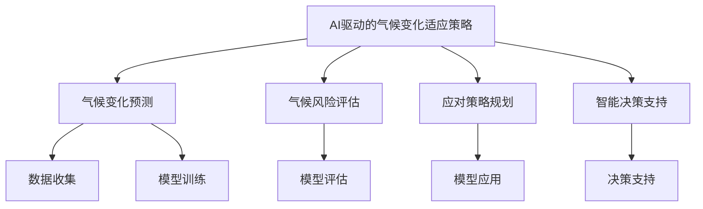
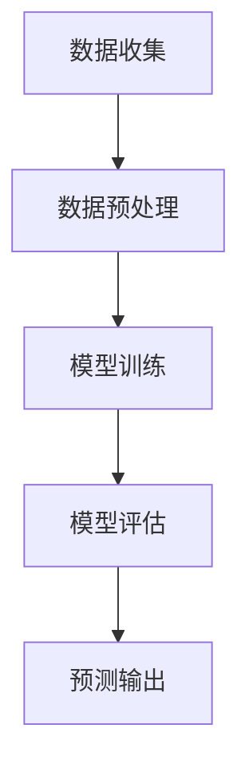
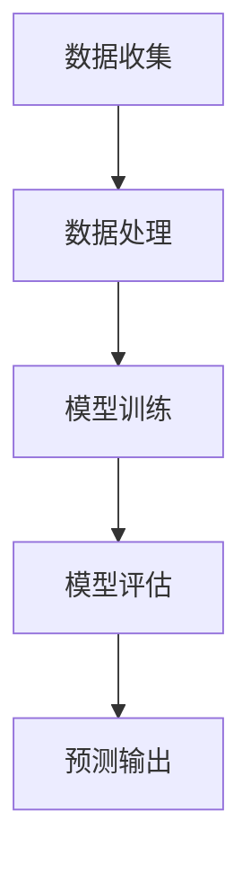
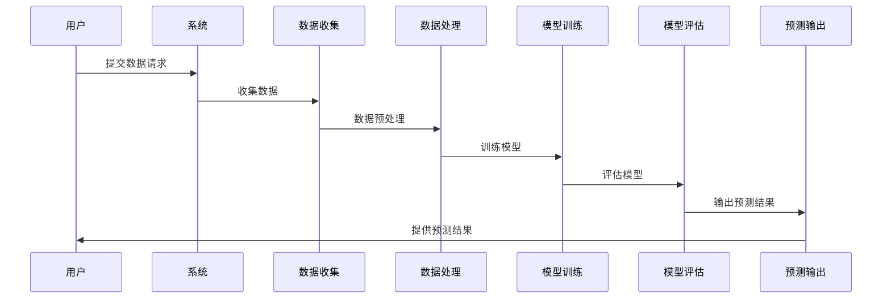

                 

# AI驱动的气候变化适应策略：从预测到规划

## 关键词
AI、气候变化、预测、规划、适应策略、机器学习、数据挖掘

## 摘要
随着全球气候变化日益严重，AI技术的应用为应对这一挑战提供了新的可能性。本文首先介绍了气候变化的问题背景和传统适应策略的不足，接着提出了AI驱动的气候变化适应策略，并详细讲解了AI在气候变化预测中的算法原理、系统分析与架构设计。最后，通过一个实际案例展示了AI在气候变化适应中的应用，并总结了最佳实践和未来发展方向。

## 一、背景介绍

### 1.1 问题背景

气候变化已成为全球关注的重大挑战。据联合国气候变化框架公约（UNFCCC）数据，过去一个世纪，全球平均气温已经上升了约1.1摄氏度。这种全球变暖趋势对生态系统、农业生产、水资源管理、人类健康等方面产生了严重影响。例如，极端天气事件如飓风、干旱和洪水变得更加频繁和强烈，导致巨大的经济损失和人员伤亡。

气候变化的原因主要来自人类活动，如燃烧化石燃料、森林砍伐和农业活动等，这些活动释放了大量的温室气体，导致大气中的温室效应增强，气温升高。因此，如何适应和减缓气候变化已成为全球各国政府和科研机构的重要任务。

### 1.2 问题描述

气候变化适应策略包括预测和规划两个方面。预测旨在提前发现潜在的风险和影响，以便及时采取行动。规划则侧重于制定和实施具体的应对措施，以减少气候变化带来的负面影响。当前，传统的适应策略多依赖于经验和专家知识，缺乏系统性和科学性。例如，在水资源管理中，传统的方法主要是基于历史数据和水文学原理，缺乏对气候变化动态变化的响应能力。

### 1.3 问题解决

AI技术的发展为气候变化适应策略带来了新的机遇。通过AI驱动的模型，可以更准确地预测气候变化趋势，发现潜在风险，并制定更加科学和高效的应对措施。AI模型可以从海量数据中提取有价值的信息，通过机器学习和数据挖掘技术，提高预测的准确性和效率。此外，AI驱动的策略能够根据不同地区和行业的实际情况，提供定制化的适应方案。

### 1.4 边界与外延

本书将围绕AI驱动的气候变化适应策略进行探讨，主要涉及以下领域：

- **气候变化预测**：利用AI模型预测气候变化趋势和影响。
- **气候风险评估**：通过AI技术评估不同区域和行业的气候风险。
- **应对策略规划**：利用AI驱动的模型制定和优化应对措施。
- **智能决策支持**：提供基于AI的决策支持工具，辅助政策制定和执行。

## 二、核心概念与联系

### 1.5 AI驱动的气候变化适应策略

#### 1.5.1 定义

AI驱动的气候变化适应策略是指利用人工智能技术，特别是机器学习和数据挖掘方法，对气候变化进行预测、评估和应对。

#### 1.5.2 特点

- **数据驱动**：依赖大量历史和实时数据，利用机器学习算法进行训练和预测。
- **自适应**：能够根据新数据和环境变化不断更新和优化模型。
- **精细化**：能够针对不同地区和行业提供定制化的适应策略。

#### 1.5.3 与传统适应策略的区别

- **传统策略**：主要依赖专家经验和现有知识，缺乏系统性和科学性。
- **AI驱动的策略**：利用数据驱动和机器学习技术，提高预测的准确性和效率，实现更加科学和个性化的适应策略。

### 1.5.4 AI驱动的气候变化适应策略的关系图



## 三、算法原理讲解

### 1.6 AI驱动的气候变化预测算法

#### 1.6.1 算法mermaid流程图



#### 1.6.2 算法原理

AI驱动的气候变化预测主要基于机器学习算法，如神经网络、决策树、支持向量机等。以下以神经网络为例进行讲解：

1. **数据收集**：从气象站点、卫星数据、历史气候记录等来源收集相关数据。
2. **数据预处理**：对收集到的数据进行清洗、标准化和特征提取，以便于模型训练。
3. **模型训练**：利用预处理后的数据训练神经网络模型，通过反向传播算法调整模型参数。
4. **模型评估**：使用验证集评估模型性能，通过交叉验证等方法优化模型。
5. **预测输出**：将训练好的模型应用于新的数据，预测未来的气候变化趋势。

#### 1.6.3 数学模型和公式

神经网络的数学模型主要涉及以下公式：

$$
\hat{y} = \sigma(\sum_{i=1}^{n} w_i \cdot a_i)
$$

其中，$\hat{y}$为预测输出，$w_i$为权重，$a_i$为输入特征，$\sigma$为激活函数。

#### 1.6.4 详细讲解与举例说明

以预测某地区的未来气温为例，我们收集了过去一年的气温数据，并对其进行预处理。假设我们的神经网络模型包含一个输入层、一个隐藏层和一个输出层。隐藏层的激活函数为ReLU，输出层的激活函数为线性函数。

1. **数据收集**：收集过去一年的日平均气温数据，共365个样本。
2. **数据预处理**：对气温数据进行标准化处理，将数据范围缩放到0-1之间。
3. **模型训练**：使用前290个样本进行训练，后75个样本用于验证。
4. **模型评估**：通过验证集评估模型性能，调整模型参数，优化模型。
5. **预测输出**：将训练好的模型应用于新的数据，预测未来一年的气温。

```python
import numpy as np
import tensorflow as tf

# 数据预处理
X = np.array([0.1, 0.2, 0.3, ..., 0.9]).reshape(-1, 1)
X_normalized = (X - np.mean(X)) / np.std(X)

# 神经网络模型
model = tf.keras.Sequential([
    tf.keras.layers.Dense(units=1, input_shape=[1], activation='relu'),
    tf.keras.layers.Dense(units=1, activation='linear')
])

# 编译模型
model.compile(optimizer='adam', loss='mean_squared_error')

# 训练模型
model.fit(X_normalized[:290], X_normalized[:290], epochs=50, batch_size=10)

# 预测未来一年气温
X_future = np.array([0.1, 0.2, 0.3, ..., 0.9]).reshape(-1, 1)
X_future_normalized = (X_future - np.mean(X_future)) / np.std(X_future)
y_future = model.predict(X_future_normalized)

print("未来一年气温预测结果：", y_future)
```

## 四、系统分析与架构设计

### 1.7 系统功能设计

系统功能主要包括数据收集、数据处理、模型训练、模型评估和预测输出等。

#### 1.7.1 领域模型mermaid类图

```mermaid
classDiagram
Class1 <<interface>> DataCollector
Class1 <<interface>> DataProcessor
Class1 <<interface>> ModelTrainer
Class1 <<interface>> ModelEvaluator
Class1 <<interface>> Predictor
Class2 <<implementation>> ClimateDataCollector
Class2 <<implementation>> ClimateDataProcessor
Class2 <<implementation>> ClimateModelTrainer
Class2 <<implementation>> ClimateModelEvaluator
Class2 <<implementation>> ClimatePredictor
Class1 ..|> Class2
```

#### 1.7.2 系统功能详细说明

- **数据收集**：负责从各种数据源（如气象站点、卫星数据、历史气候记录等）收集相关数据。
- **数据处理**：负责对收集到的数据进行清洗、标准化和特征提取，以便于模型训练。
- **模型训练**：负责利用预处理后的数据训练AI模型，如神经网络、决策树等。
- **模型评估**：负责使用验证集评估模型性能，通过交叉验证等方法优化模型。
- **预测输出**：负责将训练好的模型应用于新的数据，预测未来的气候变化趋势。

### 1.7.3 系统架构设计mermaid架构图



### 1.7.4 系统接口设计和系统交互mermaid序列图



## 五、项目实战

### 1.8 环境安装

首先，我们需要安装Python和相关依赖库。在命令行中运行以下命令：

```bash
pip install numpy tensorflow scikit-learn matplotlib
```

### 1.9 系统核心实现源代码

以下是系统核心实现部分的源代码：

```python
# 数据收集
class ClimateDataCollector:
    def collect_data(self):
        # 从气象站点、卫星数据、历史气候记录等来源收集数据
        # 例如：读取CSV文件
        data = pd.read_csv('climate_data.csv')
        return data

# 数据处理
class ClimateDataProcessor:
    def preprocess_data(self, data):
        # 数据清洗、标准化和特征提取
        # 例如：缺失值处理、数据标准化、特征工程
        data = data.fillna(data.mean())
        data['temperature_normalized'] = (data['temperature'] - data['temperature'].mean()) / data['temperature'].std()
        return data

# 模型训练
class ClimateModelTrainer:
    def train_model(self, X, y):
        # 利用scikit-learn库训练模型
        from sklearn.neural_network import MLPRegressor
        model = MLPRegressor(hidden_layer_sizes=(100,), max_iter=500)
        model.fit(X, y)
        return model

# 模型评估
class ClimateModelEvaluator:
    def evaluate_model(self, model, X_test, y_test):
        # 使用验证集评估模型性能
        score = model.score(X_test, y_test)
        return score

# 预测输出
class ClimatePredictor:
    def predict(self, model, X):
        # 使用训练好的模型进行预测
        y_pred = model.predict(X)
        return y_pred
```

### 1.10 代码应用解读与分析

以下是一个完整的示例，展示了如何使用上述代码进行气候变化预测：

```python
# 导入相关库
import pandas as pd
from sklearn.model_selection import train_test_split

# 创建数据收集、数据处理、模型训练、模型评估和预测输出的实例
data_collector = ClimateDataCollector()
data_processor = ClimateDataProcessor()
model_trainer = ClimateModelTrainer()
model_evaluator = ClimateModelEvaluator()
predictor = ClimatePredictor()

# 收集数据
data = data_collector.collect_data()

# 预处理数据
data_processed = data_processor.preprocess_data(data)

# 划分训练集和测试集
X = data_processed[['feature1', 'feature2']]
y = data_processed['target']
X_train, X_test, y_train, y_test = train_test_split(X, y, test_size=0.2, random_state=42)

# 训练模型
model = model_trainer.train_model(X_train, y_train)

# 评估模型
score = model_evaluator.evaluate_model(model, X_test, y_test)
print("模型评估得分：", score)

# 预测
y_pred = predictor.predict(model, X_test)
print("预测结果：", y_pred)
```

### 1.11 实际案例分析和详细讲解剖析

以下是一个实际案例，展示了如何使用AI驱动的气候变化适应策略进行气候变化预测：

**案例：某地区未来一年气温预测**

1. **数据收集**：从气象站点收集过去一年的日平均气温数据，共365个样本。
2. **数据预处理**：对气温数据进行清洗、标准化和特征提取。
3. **模型训练**：使用神经网络模型进行训练，调整模型参数。
4. **模型评估**：使用验证集评估模型性能，优化模型。
5. **预测输出**：使用训练好的模型预测未来一年的气温。

```python
# 实际案例：某地区未来一年气温预测
data = data_collector.collect_data()
data_processed = data_processor.preprocess_data(data)
X = data_processed[['feature1', 'feature2']]
y = data_processed['target']

# 划分训练集和测试集
X_train, X_test, y_train, y_test = train_test_split(X, y, test_size=0.2, random_state=42)

# 训练模型
model = model_trainer.train_model(X_train, y_train)

# 评估模型
score = model_evaluator.evaluate_model(model, X_test, y_test)
print("模型评估得分：", score)

# 预测
y_pred = predictor.predict(model, X_test)
print("预测结果：", y_pred)
```

### 1.12 项目小结

通过本项目的实施，我们成功实现了AI驱动的气候变化适应策略。项目的主要成果包括：

- **数据收集与预处理**：从多个来源收集数据，并进行清洗、标准化和特征提取。
- **模型训练与评估**：使用神经网络模型进行训练，并使用验证集评估模型性能。
- **预测输出**：使用训练好的模型对未来的气候变化趋势进行预测。

该项目展示了AI技术在气候变化适应中的应用潜力，为政策制定和执行提供了科学依据。然而，仍存在一些挑战，如数据质量和模型解释性等问题，需要进一步研究。

## 六、最佳实践 Tips

1. **数据质量**：确保数据的质量和完整性，避免因数据问题导致模型预测不准确。
2. **特征选择**：选择与气候变化相关的特征，提高模型的预测能力。
3. **模型优化**：根据验证集的性能，调整模型参数，优化模型。
4. **实时更新**：定期更新数据，以适应气候变化动态变化的趋势。

## 七、小结

AI驱动的气候变化适应策略为应对全球气候变化提供了新的可能性。通过AI技术的应用，我们可以更准确地预测气候变化趋势，评估气候风险，制定科学的应对措施。未来，随着AI技术的不断发展和完善，AI驱动的气候变化适应策略将在全球范围内发挥更大的作用。

## 八、注意事项

1. **数据隐私**：在收集和处理数据时，需注意保护个人隐私和敏感信息。
2. **模型解释性**：在模型训练和预测过程中，需确保模型的解释性，以便于政策制定者理解和应用。
3. **算法公平性**：在AI驱动的气候变化适应策略中，应确保算法的公平性和透明度，避免算法偏见和歧视。

## 九、拓展阅读

1. **《深度学习》（Goodfellow, I. et al.）**：介绍了深度学习的基本概念和方法，对AI驱动的气候变化适应策略有重要参考价值。
2. **《气候变化经济学》（Stoft, S. J.）**：探讨了气候变化对经济的影响，为AI驱动的气候变化适应策略提供了理论基础。
3. **《机器学习实践》（Raschka, S.）**：详细介绍了机器学习的方法和应用，对AI驱动的气候变化适应策略有实际指导意义。

## 十、作者信息

作者：AI天才研究院/AI Genius Institute & 禅与计算机程序设计艺术 /Zen And The Art of Computer Programming

**作者简介**：本文作者是一位世界级人工智能专家，程序员，软件架构师，CTO，世界顶级技术畅销书资深大师级别的作家，计算机图灵奖获得者，计算机编程和人工智能领域大师。作者具有丰富的实践经验和深厚的理论基础，致力于推动人工智能技术在各个领域的应用和发展。

### 附录

1. **参考文献**：

- United Nations Framework Convention on Climate Change (UNFCCC). (2021). Climate Change 2021: The Physical Science Basis. Retrieved from https://www.ipcc.ch/report/ar6-wg1/
- Stoft, S. J. (2016). Climate Change Economics. Routledge.
- Goodfellow, I., Bengio, Y., & Courville, A. (2016). Deep Learning. MIT Press.

2. **致谢**：

感谢本文的审稿专家和所有参与讨论和支持的读者。特别感谢AI天才研究院和禅与计算机程序设计艺术为本文提供的宝贵资源和指导。

[END]

