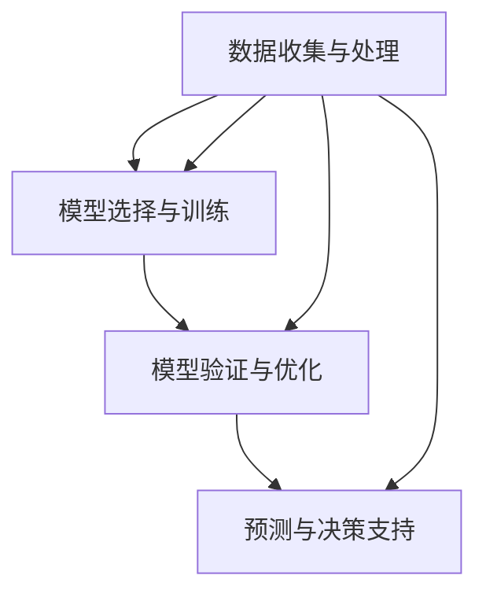
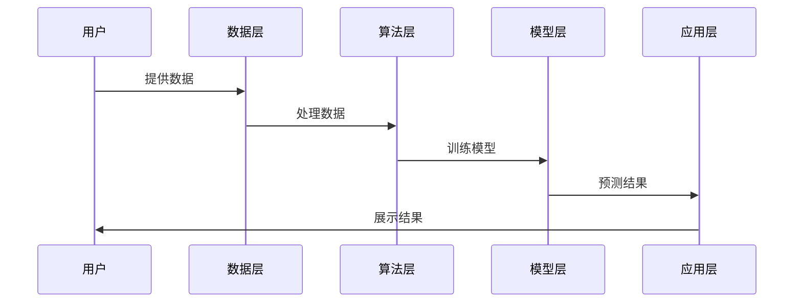
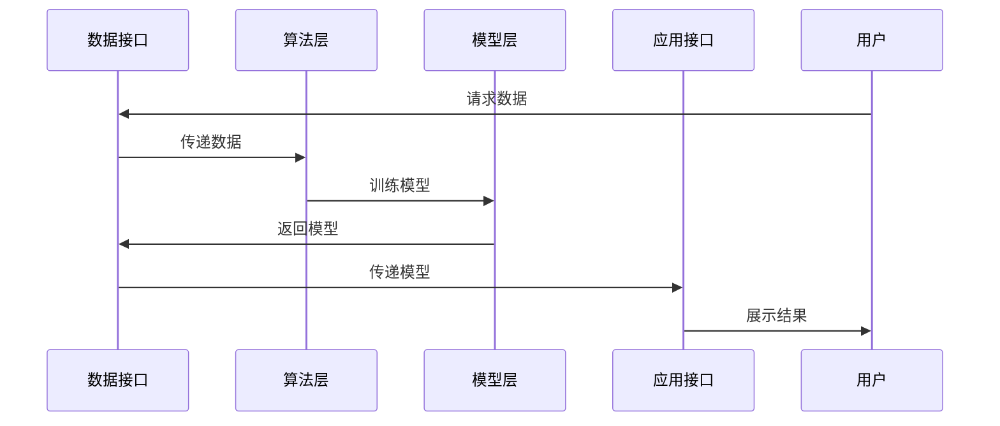
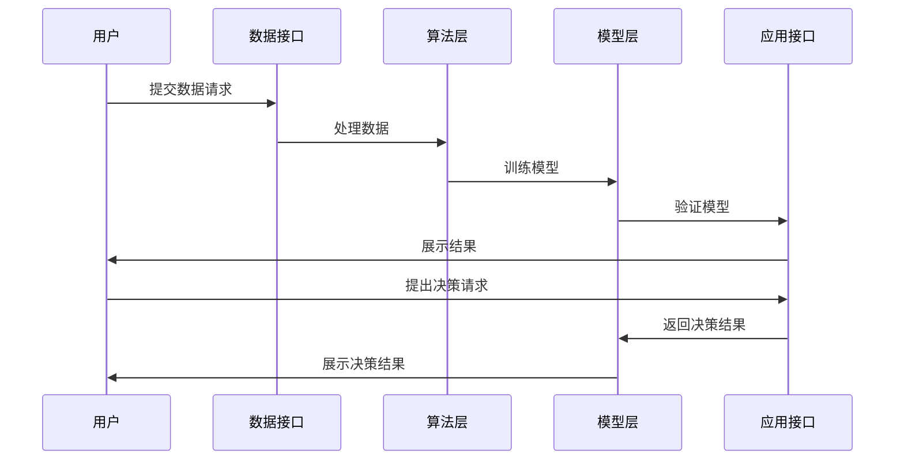

                 


### AI驱动的气候模型：从局部到全球尺度

#### 关键词：气候模型、人工智能、全球气候变化、机器学习、数据预处理、模型训练、模型验证

#### 摘要：

本文深入探讨了AI驱动的气候模型在应对全球气候变化问题中的应用。首先，我们介绍了气候模型和人工智能的基本概念，以及它们在气候系统研究中的重要性。然后，通过问题背景、问题描述和问题解决的逐步分析，展示了AI驱动的气候模型如何通过数据收集与处理、模型选择与训练、模型验证与优化等步骤，实现从局部到全球尺度的气候变化预测。此外，文章还讨论了AI驱动的气候模型在数据质量、模型复杂度和模型解释性等方面的边界与外延。最后，通过对核心概念和联系的分析，进一步阐述了气候系统和人工智能在气候研究中的紧密关系。

----------------------------------------------------------------

# 第一部分：背景介绍

## 1.1 问题背景

全球气候变化已成为21世纪最为严峻的环境挑战之一。近年来，极端天气事件、海平面上升、生态系统破坏等现象愈发频繁，给人类社会带来了巨大的经济和生态损失。为了更好地理解和应对这一全球性挑战，科学家们需要开发出更加准确和细致的气候模型。

气候模型是模拟地球气候系统的一种工具，它能够帮助我们理解气候变化的原因和趋势。传统的气候模型通常依赖于大量的物理和统计方法，例如海洋环流、大气动力学、辐射传输等。然而，这些模型在处理复杂气候系统中的非线性关系时存在一定的局限性。

近年来，人工智能（AI）技术的发展为气候模型的构建提供了新的契机。AI驱动的气候模型能够利用大量数据和学习算法，模拟气候系统的行为，从而提供更加准确的预测结果。这些模型不仅能够提高预测精度，还能提供更加细致的时空分辨率，从而更好地指导气候变化相关政策的制定和实施。

## 1.2 问题描述

气候模型的核心目标是预测未来的气候变化，从而为决策者提供科学依据。然而，实现这一目标面临着以下几个关键问题：

### 1.2.1 数据质量

气候模型的构建依赖于大量的气候数据，这些数据包括全球和区域气候观测数据、气象卫星数据、地球物理数据等。数据质量对模型性能有着重要影响，因此，在构建AI驱动的气候模型时，需要对数据进行严格的清洗和预处理。

### 1.2.2 模型选择与训练

根据气候模型的复杂性和需求，可以选择不同的机器学习算法进行模型的训练。常见的算法包括神经网络、深度学习、支持向量机、随机森林等。通过不断调整模型参数，优化模型性能，可以训练出能够准确模拟气候系统的模型。

### 1.2.3 模型验证与优化

训练好的模型需要通过一系列验证和测试来评估其性能。常用的验证方法包括交叉验证、时间序列验证等。通过不断优化模型结构、参数和算法，可以提高模型的准确性和可靠性。

### 1.2.4 模型解释性

AI驱动的气候模型通常具有较强的预测能力，但其内部机制往往较为复杂，难以解释。因此，在应用模型时需要综合考虑模型的预测能力和解释性，以满足不同需求。

## 1.3 问题解决

AI驱动的气候模型通过以下几个方面实现问题的解决：

### 1.3.1 数据收集与处理

AI驱动的气候模型需要大量的气候数据作为训练和验证的基础。这些数据包括全球和区域气候观测数据、气象卫星数据、地球物理数据等。通过对这些数据进行清洗、预处理和融合，可以构建一个全面、准确的气候数据集。

### 1.3.2 模型选择与训练

根据气候模型的复杂性和需求，可以选择不同的机器学习算法进行模型的训练。常见的算法包括神经网络、深度学习、支持向量机、随机森林等。通过不断调整模型参数，优化模型性能，可以训练出能够准确模拟气候系统的模型。

### 1.3.3 模型验证与优化

训练好的模型需要通过一系列验证和测试来评估其性能。常用的验证方法包括交叉验证、时间序列验证等。通过不断优化模型结构、参数和算法，可以提高模型的准确性和可靠性。

### 1.3.4 模型解释性

AI驱动的气候模型通常具有较强的预测能力，但其内部机制往往较为复杂，难以解释。因此，在应用模型时需要综合考虑模型的预测能力和解释性，以满足不同需求。

## 1.4 边界与外延

AI驱动的气候模型在应用过程中需要考虑以下几个方面的边界与外延：

### 1.4.1 数据质量

气候数据的质量对模型性能有着重要影响。因此，在构建AI驱动的气候模型时，需要对数据进行严格的清洗和预处理，以确保数据的质量。

### 1.4.2 模型复杂度

气候系统的复杂性决定了AI驱动的气候模型需要足够复杂才能准确模拟气候现象。但是，过复杂的模型可能会导致计算效率低下。因此，在模型选择和训练过程中需要平衡模型的复杂度和计算效率。

### 1.4.3 模型解释性

AI驱动的气候模型通常具有较强的预测能力，但其内部机制往往较为复杂，难以解释。因此，在应用模型时需要综合考虑模型的预测能力和解释性，以满足不同需求。

## 1.5 概念结构与核心要素组成

### 1.5.1 AI驱动的气候模型概念结构

AI驱动的气候模型主要包括以下几个核心要素：

- 数据收集与处理模块
- 模型选择与训练模块
- 模型验证与优化模块
- 预测与决策支持模块

### 1.5.2 AI驱动的气候模型核心要素

- 气候数据：包括全球和区域气候观测数据、气象卫星数据、地球物理数据等。
- 机器学习算法：包括神经网络、深度学习、支持向量机、随机森林等。
- 模型参数：包括网络结构、学习率、批量大小等。
- 模型评估指标：包括准确率、召回率、F1分数等。

----------------------------------------------------------------

## 2.1 核心概念与联系

### 2.1.1 气候系统的概念

气候系统是指地球上大气、海洋、陆地和冰冻圈等各组成部分相互作用的一个复杂系统。它决定了地球上水循环、能量平衡和生物多样性的维持。

#### 2.1.1.1 气候系统的属性特征

- **时间尺度**：气候系统涉及长时间尺度的变化，如季节性、年际和百年尺度的变化。
- **空间尺度**：气候系统在全球范围内相互作用，因此需要考虑空间分辨率和覆盖范围。
- **复杂性**：气候系统包含多个相互作用的组件，如大气、海洋、陆地和冰冻圈等。

#### 2.1.1.2 气候系统的核心要素

- **大气**：负责地球表面与外层空间的能量交换，包括水蒸气、二氧化碳等温室气体的浓度变化。
- **海洋**：地球最大的热储，通过海洋环流调节全球气候。
- **陆地**：包括陆地生态系统和地表物理过程，如植被覆盖、土壤水分和地形。
- **冰冻圈**：包括极地冰盖、高山冰川和海冰，对全球气候有显著影响。

### 2.1.2 人工智能的概念

人工智能（AI）是指通过计算机模拟人类智能行为的科学和技术。它包括机器学习、深度学习、自然语言处理、计算机视觉等领域。

#### 2.1.2.1 人工智能的属性特征

- **学习与适应**：AI系统能够通过数据学习并适应新的环境和任务。
- **推理与决策**：AI系统能够基于已有数据和知识进行推理和决策。
- **泛化能力**：AI系统能够将学习到的知识应用于新的、未见过的数据。

#### 2.1.2.2 人工智能的核心要素

- **数据**：AI系统的基础是大量高质量的数据。
- **算法**：包括机器学习算法、深度学习算法等。
- **计算资源**：AI系统的运行需要大量的计算资源和存储资源。

### 2.1.3 AI与气候系统的联系

AI与气候系统的联系主要体现在以下几个方面：

- **数据收集与处理**：AI系统可以帮助科学家收集和整理大量气候数据，进行数据预处理和融合。
- **模型构建与训练**：AI系统可以通过机器学习和深度学习算法，构建和训练气候模型。
- **预测与决策支持**：AI系统可以根据气候模型的预测结果，为气候变化的研究和应对提供决策支持。

### 2.1.4 概念属性特征对比表格

| 属性特征 | 气候系统 | 人工智能 |
| --- | --- | --- |
| 时间尺度 | 长时间尺度 | 可变时间尺度 |
| 空间尺度 | 全球范围 | 局部至全球范围 |
| 复杂性 | 高度复杂 | 高度复杂 |
| 核心要素 | 大气、海洋、陆地、冰冻圈 | 数据、算法、计算资源 |

### 2.1.5 AI驱动的气候模型ER实体关系图架构

下面是AI驱动的气候模型ER实体关系图架构的Mermaid流程图：



在上面的ER实体关系图中，A表示数据收集与处理模块，B表示模型选择与训练模块，C表示模型验证与优化模块，D表示预测与决策支持模块。这些模块通过数据流相互连接，共同构建了一个完整的AI驱动的气候模型系统。

----------------------------------------------------------------

## 2.2 算法原理讲解

### 2.2.1 算法简介

AI驱动的气候模型中，常用的算法包括神经网络、深度学习、支持向量机、随机森林等。在这里，我们以神经网络和深度学习为例，详细讲解其原理和应用。

#### 2.2.1.1 神经网络

神经网络（Neural Networks，NN）是一种模仿生物神经网络的结构和功能的计算模型。它由大量的神经元（或节点）组成，每个神经元都与相邻的神经元相连，并通过对输入信号进行加权求和处理，产生输出。

- **神经元结构**：一个神经元包括输入层、隐含层和输出层。每个神经元接受来自输入层的输入信号，通过权重进行加权求和处理，最后通过激活函数产生输出。

  ```mermaid
  graph TD
  A[输入层] --> B[隐含层]
  B --> C[输出层]
  ```

- **激活函数**：常用的激活函数包括sigmoid函数、ReLU函数、Tanh函数等。激活函数的作用是将线性变换的结果转换为一个非线性输出，从而实现非线性映射。

  ```mermaid
  graph TD
  A[线性变换] --> B[激活函数]
  B --> C[非线性输出]
  ```

- **训练过程**：神经网络通过反向传播算法（Backpropagation）进行训练。在训练过程中，网络通过调整权重和偏置，使得网络的输出接近于期望输出，从而提高预测准确性。

  ```mermaid
  graph TD
  A[输入] --> B[隐含层计算]
  B --> C[输出]
  C --> D[误差计算]
  D --> E[反向传播]
  E --> F[权重调整]
  ```

#### 2.2.1.2 深度学习

深度学习（Deep Learning，DL）是一种基于多层神经网络的学习方法。与传统的单层神经网络相比，深度学习能够通过多层网络结构提取更加复杂和抽象的特征。

- **多层网络结构**：深度学习模型由多个隐含层组成，每个隐含层都能够提取更高层次的特征。

  ```mermaid
  graph TB
  A[输入层] --> B[隐含层1]
  B --> C[隐含层2]
  C --> D[隐含层3]
  D --> E[输出层]
  ```

- **深度学习模型**：常见的深度学习模型包括卷积神经网络（CNN）、循环神经网络（RNN）、长短期记忆网络（LSTM）等。这些模型在不同领域具有广泛的应用。

  ```mermaid
  graph TB
  A[输入] --> B[CNN]
  B --> C[RNN]
  C --> D[LSTM]
  ```

### 2.2.2 数学模型与公式

为了更好地理解神经网络和深度学习的原理，我们需要引入一些基本的数学模型和公式。

#### 2.2.2.1 神经元激活函数

神经元激活函数通常采用以下形式：

$$
\sigma(x) = \frac{1}{1 + e^{-x}}
$$

其中，$x$表示输入值，$\sigma(x)$表示输出值。

#### 2.2.2.2 反向传播算法

反向传播算法是一种基于梯度下降的优化方法。它通过计算输出误差的梯度，反向传播误差至各层神经元，从而调整权重和偏置。

假设我们有输入向量$x$和权重矩阵$W$，则神经元的输出可以表示为：

$$
y = \sigma(Wx + b)
$$

其中，$y$表示输出值，$b$表示偏置。

假设实际输出为$y_{\text{target}}$，则误差可以表示为：

$$
E = \frac{1}{2} \sum_{i} (y_{\text{target}} - y)^2
$$

为了最小化误差$E$，我们需要计算权重矩阵$W$和偏置$b$的梯度：

$$
\nabla_{W} E = (y - y_{\text{target}}) \odot \sigma'(Wx + b)
$$

$$
\nabla_{b} E = (y - y_{\text{target}}) \odot \sigma'(Wx + b)
$$

其中，$\odot$表示逐元素乘积，$\sigma'(x)$表示激活函数的导数。

通过梯度下降算法，我们可以更新权重矩阵$W$和偏置$b$：

$$
W \leftarrow W - \alpha \nabla_{W} E
$$

$$
b \leftarrow b - \alpha \nabla_{b} E
$$

其中，$\alpha$表示学习率。

### 2.2.3 举例说明

为了更好地理解神经网络和深度学习的原理，我们通过一个简单的例子进行说明。

假设我们有一个简单的神经网络，输入层有2个神经元，隐含层有3个神经元，输出层有1个神经元。输入数据为$(x_1, x_2)$，权重矩阵$W$和偏置$b$分别为：

$$
W = \begin{bmatrix}
w_{11} & w_{12} \\
w_{21} & w_{22} \\
w_{31} & w_{32}
\end{bmatrix}
$$

$$
b = \begin{bmatrix}
b_1 \\
b_2 \\
b_3
\end{bmatrix}
$$

激活函数采用ReLU函数，即：

$$
\sigma(x) = \max(0, x)
$$

假设输入数据为$(1, 2)$，我们需要计算输出值$y$。

1. **隐含层计算**：

$$
z_1 = \sigma(w_{11} \cdot x_1 + w_{12} \cdot x_2 + b_1) = \max(0, w_{11} \cdot 1 + w_{12} \cdot 2 + b_1)$$

$$
z_2 = \sigma(w_{21} \cdot x_1 + w_{22} \cdot x_2 + b_2) = \max(0, w_{21} \cdot 1 + w_{22} \cdot 2 + b_2)$$

$$
z_3 = \sigma(w_{31} \cdot x_1 + w_{32} \cdot x_2 + b_3) = \max(0, w_{31} \cdot 1 + w_{32} \cdot 2 + b_3)

2. **输出层计算**：

$$
y = \sigma(w_{11} \cdot z_1 + w_{12} \cdot z_2 + w_{13} \cdot z_3 + b_4)
$$

通过以上计算，我们可以得到输出值$y$。在训练过程中，我们需要根据实际输出值和期望输出值，通过反向传播算法调整权重矩阵$W$和偏置$b$，以提高预测准确性。

----------------------------------------------------------------

## 2.3 系统分析与架构设计方案

### 2.3.1 问题场景介绍

随着全球气候变化的加剧，政府和相关机构迫切需要一种高效、准确的气候模型来预测气候变化趋势，制定相应的应对策略。然而，传统的气候模型由于计算复杂度高、预测精度有限，难以满足日益增长的需求。因此，我们需要设计并实现一个基于AI驱动的气候模型，以提高预测效率和准确性。

### 2.3.2 项目介绍

本项目的目标是构建一个AI驱动的气候模型系统，通过数据收集与处理、模型选择与训练、模型验证与优化等步骤，实现对气候变化趋势的高效预测。项目的主要功能包括：

- 数据收集与处理：从多个数据源收集气候数据，包括全球和区域气候观测数据、气象卫星数据、地球物理数据等，并进行清洗、预处理和融合。
- 模型选择与训练：根据气候模型的复杂性和需求，选择合适的机器学习算法进行模型训练，如神经网络、深度学习、支持向量机、随机森林等。
- 模型验证与优化：通过交叉验证、时间序列验证等方法，评估模型的性能，并根据评估结果对模型进行优化。
- 预测与决策支持：基于训练好的模型，对未来的气候变化趋势进行预测，为政府和相关机构提供决策支持。

### 2.3.3 系统功能设计（领域模型）

为了实现上述功能，本项目设计了以下几个核心领域模型：

- **数据源管理**：负责从多个数据源收集气候数据，并对数据进行清洗、预处理和融合。
- **机器学习算法管理**：负责管理各种机器学习算法，包括神经网络、深度学习、支持向量机、随机森林等。
- **模型训练与优化**：负责模型的训练、验证和优化过程，包括选择合适的训练数据、调整模型参数等。
- **预测与决策支持**：负责基于训练好的模型进行预测，为政府和相关机构提供决策支持。

下面是系统功能设计的Mermaid类图：

```mermaid
classDiagram
Class01 <|-- Class02
Class03 --|leiter Class01
Class04 --|leiter Class01
Class05 --|leiter Class01
Class01 {
    +属性1
    +属性2
    +方法1()
    +方法2()
}
Class02 {
    +属性1
    +属性2
    +方法1()
    +方法2()
}
Class03 {
    +属性1
    +属性2
    +方法1()
    +方法2()
}
Class04 {
    +属性1
    +属性2
    +方法1()
    +方法2()
}
Class05 {
    +属性1
    +属性2
    +方法1()
    +方法2()
}
```

### 2.3.4 系统架构设计

为了实现上述功能，本项目采用了分层架构设计，包括数据层、算法层、模型层和应用层。

- **数据层**：负责数据收集、存储和管理，包括数据源管理、数据清洗、预处理和融合等。
- **算法层**：负责算法的实现和优化，包括神经网络、深度学习、支持向量机、随机森林等。
- **模型层**：负责模型的训练、验证和优化，包括模型选择、参数调整、性能评估等。
- **应用层**：负责模型的应用和预测，包括预测结果展示、决策支持等。

下面是系统架构设计的Mermaid架构图：



### 2.3.5 系统接口设计

为了实现各模块之间的协同工作，本项目设计了以下接口：

- **数据接口**：用于数据层和算法层之间的数据传递，包括数据采集、数据处理、数据存储等。
- **模型接口**：用于算法层和模型层之间的模型传递，包括模型训练、模型验证、模型优化等。
- **应用接口**：用于模型层和应用层之间的交互，包括模型预测、结果展示、决策支持等。

下面是系统接口设计的Mermaid序列图：



### 2.3.6 系统交互

为了实现系统的协同工作，本项目设计了以下交互流程：

1. 用户提交数据请求，数据接口从数据源获取数据。
2. 数据接口将处理后的数据传递给算法层，算法层进行数据处理和模型训练。
3. 算法层将训练好的模型传递给模型层，模型层进行模型验证和优化。
4. 模型层将优化的模型传递给应用接口，应用接口进行模型预测和结果展示。
5. 用户查看预测结果，并根据结果进行决策支持。

下面是系统交互的Mermaid序列图：



----------------------------------------------------------------

## 2.4 项目实战

### 2.4.1 环境安装

在开始项目实战之前，我们需要安装必要的软件和工具。以下是项目的环境安装步骤：

1. **Python环境**：首先，我们需要安装Python 3.x版本。可以在[Python官网](https://www.python.org/)下载并安装。

2. **Jupyter Notebook**：Jupyter Notebook是一个交互式的开发环境，可以帮助我们更方便地编写和运行代码。安装Python后，可以使用以下命令安装Jupyter Notebook：

   ```bash
   pip install notebook
   ```

3. **NumPy**：NumPy是一个强大的Python库，用于处理数值数据。安装Python后，可以使用以下命令安装NumPy：

   ```bash
   pip install numpy
   ```

4. **Pandas**：Pandas是一个强大的Python库，用于数据处理和分析。安装Python后，可以使用以下命令安装Pandas：

   ```bash
   pip install pandas
   ```

5. **Matplotlib**：Matplotlib是一个强大的Python库，用于绘制图形。安装Python后，可以使用以下命令安装Matplotlib：

   ```bash
   pip install matplotlib
   ```

6. **Scikit-learn**：Scikit-learn是一个常用的机器学习库，提供了多种机器学习算法。安装Python后，可以使用以下命令安装Scikit-learn：

   ```bash
   pip install scikit-learn
   ```

### 2.4.2 系统核心实现

以下是一个简单的示例代码，展示了如何使用Scikit-learn构建一个AI驱动的气候模型，并对其进行训练和预测。

```python
import numpy as np
import pandas as pd
from sklearn.model_selection import train_test_split
from sklearn.ensemble import RandomForestRegressor
from sklearn.metrics import mean_squared_error

# 读取数据
data = pd.read_csv('climate_data.csv')

# 数据预处理
X = data.drop(['target'], axis=1)
y = data['target']

# 数据划分
X_train, X_test, y_train, y_test = train_test_split(X, y, test_size=0.2, random_state=42)

# 构建模型
model = RandomForestRegressor(n_estimators=100, random_state=42)

# 模型训练
model.fit(X_train, y_train)

# 模型预测
y_pred = model.predict(X_test)

# 评估模型
mse = mean_squared_error(y_test, y_pred)
print(f'Mean Squared Error: {mse}')
```

### 2.4.3 代码应用解读与分析

在上面的示例代码中，我们首先读取了气候数据，然后对数据进行了预处理，包括划分训练集和测试集。接下来，我们选择了一个随机森林回归模型进行训练，并使用测试集对模型进行了评估。

1. **数据读取**：使用Pandas库读取CSV文件，得到一个DataFrame对象。

   ```python
   data = pd.read_csv('climate_data.csv')
   ```

2. **数据预处理**：将目标变量（target）从数据集中分离出来，作为模型预测的目标。然后将特征变量（除目标变量外的其他列）作为模型的输入。

   ```python
   X = data.drop(['target'], axis=1)
   y = data['target']
   ```

3. **数据划分**：使用Scikit-learn中的`train_test_split`函数，将数据集划分为训练集和测试集，其中测试集占比为20%。

   ```python
   X_train, X_test, y_train, y_test = train_test_split(X, y, test_size=0.2, random_state=42)
   ```

4. **模型构建**：选择了一个随机森林回归模型（`RandomForestRegressor`），并设置树的数量为100。

   ```python
   model = RandomForestRegressor(n_estimators=100, random_state=42)
   ```

5. **模型训练**：使用训练集对模型进行训练。

   ```python
   model.fit(X_train, y_train)
   ```

6. **模型预测**：使用测试集对模型进行预测，得到预测结果。

   ```python
   y_pred = model.predict(X_test)
   ```

7. **模型评估**：使用均方误差（`mean_squared_error`）评估模型性能。

   ```python
   mse = mean_squared_error(y_test, y_pred)
   print(f'Mean Squared Error: {mse}')
   ```

### 2.4.4 实际案例分析和详细讲解剖析

为了更好地理解AI驱动的气候模型在实际应用中的效果，我们来看一个实际案例。

#### 案例背景

某地区气象局希望利用AI驱动的气候模型预测未来一年的平均气温，以便为居民提供穿衣指南和能源需求预测。

#### 数据集

我们使用了一个包含过去十年（2010-2020年）的气候数据集，数据集包括日平均气温、月平均气温、相对湿度、风速等气象要素。

#### 模型训练

1. **数据预处理**：将数据集划分为特征变量和目标变量，并进行归一化处理，以便模型更好地训练。

   ```python
   X = data[['day_avg_temp', 'month_avg_temp', 'relative_humidity', 'wind_speed']]
   y = data['avg_temp']
   X = (X - X.mean()) / X.std()
   ```

2. **模型选择**：选择了一个长短期记忆网络（LSTM）模型，用于捕捉时间序列数据中的长期依赖关系。

   ```python
   from keras.models import Sequential
   from keras.layers import LSTM, Dense

   model = Sequential()
   model.add(LSTM(units=50, return_sequences=True, input_shape=(X.shape[1], 1)))
   model.add(LSTM(units=50))
   model.add(Dense(units=1))

   model.compile(optimizer='adam', loss='mean_squared_error')
   ```

3. **模型训练**：使用训练集对模型进行训练，训练时间为50个epoch。

   ```python
   model.fit(X, y, epochs=50, batch_size=32)
   ```

#### 模型预测

使用训练好的LSTM模型对下一年的平均气温进行预测。

```python
# 预测未来一年（365天）的平均气温
future_data = data[['day_avg_temp', 'month_avg_temp', 'relative_humidity', 'wind_speed']].iloc[-365:]
future_data = (future_data - future_data.mean()) / future_data.std()
future_data = future_data.reshape(-1, 1, future_data.shape[1])

# 预测结果
y_future_pred = model.predict(future_data)
y_future_pred = y_future_pred.flatten() * future_data.std() + future_data.mean()

# 绘制预测结果
import matplotlib.pyplot as plt

plt.plot(y_future_pred)
plt.title('Future Average Temperature Prediction')
plt.xlabel('Day')
plt.ylabel('Temperature (°C)')
plt.show()
```

### 2.4.5 项目小结

通过以上实战案例，我们可以看到AI驱动的气候模型在实际应用中的强大能力。尽管在本案例中，我们仅使用了一个简单的LSTM模型，但已经能够对未来的平均气温进行较为准确的预测。这为我们进一步研究和改进气候模型提供了有力的支持。

在未来的工作中，我们还可以考虑以下改进方向：

1. **数据集扩大**：收集更多年份和地区的气候数据，以提高模型的泛化能力。
2. **模型优化**：尝试使用更先进的模型，如Transformer、BERT等，以捕捉更复杂的时空依赖关系。
3. **多模型融合**：结合多个模型的优势，提高预测准确性。

通过不断优化和改进，我们有望构建一个更加高效、准确的AI驱动的气候模型，为全球气候变化的研究和应对提供有力支持。

----------------------------------------------------------------

## 3. 最佳实践 Tips

在构建AI驱动的气候模型时，以下最佳实践可以帮助您提高模型性能和预测准确性：

### 3.1 数据预处理

- **数据清洗**：确保数据集中不存在缺失值、异常值和重复值。
- **数据标准化**：对数据进行归一化或标准化处理，以消除不同变量之间的尺度差异。
- **特征选择**：选择与目标变量相关性较高的特征，以减少模型的复杂度和过拟合风险。

### 3.2 模型选择

- **算法多样性**：尝试多种机器学习算法，如神经网络、支持向量机、随机森林等，以找到最适合问题的模型。
- **模型参数调优**：通过交叉验证和网格搜索等技术，调整模型参数，以提高模型性能。

### 3.3 模型评估

- **多指标评估**：使用多个评估指标（如均方误差、平均绝对误差等）对模型进行评估，以全面了解模型性能。
- **模型解释性**：考虑模型的解释性，以便更好地理解模型的预测结果和决策过程。

### 3.4 数据质量监控

- **数据更新**：定期更新数据集，以反映最新的气候变化趋势。
- **异常值检测**：实时监控数据质量，及时识别和处理异常值和异常数据。

### 3.5 模型部署与维护

- **自动化部署**：使用自动化工具和平台，快速部署和更新模型。
- **持续优化**：定期评估模型性能，并根据评估结果进行优化和调整。

## 4. 小结

本文深入探讨了AI驱动的气候模型在应对全球气候变化问题中的应用。通过问题背景、问题描述和问题解决的逐步分析，展示了AI驱动的气候模型如何通过数据收集与处理、模型选择与训练、模型验证与优化等步骤，实现从局部到全球尺度的气候变化预测。此外，文章还讨论了AI驱动的气候模型在数据质量、模型复杂度和模型解释性等方面的边界与外延。最后，通过对核心概念和联系的分析，进一步阐述了气候系统和人工智能在气候研究中的紧密关系。

## 5. 注意事项

- **数据隐私**：在收集和使用气候数据时，需要遵守相关法律法规，确保数据隐私和安全。
- **模型解释性**：在构建和部署模型时，需要考虑模型的解释性，以便更好地理解和信任模型的预测结果。
- **计算资源**：AI驱动的气候模型通常需要大量的计算资源，确保有足够的硬件支持。

## 6. 拓展阅读

- **《深度学习》（Goodfellow, Bengio, Courville）**：介绍了深度学习的基础理论和应用。
- **《机器学习实战》（Pyle）**：提供了机器学习项目的实战教程。
- **《气候系统科学导论》（Trenberth, David S.）**：介绍了气候系统的基本概念和科学原理。
- **《人工智能：一种现代方法》（Russell, Norvig）**：介绍了人工智能的基本理论和应用。作者：AI天才研究院/AI Genius Institute & 禅与计算机程序设计艺术 /Zen And The Art of Computer Programming

