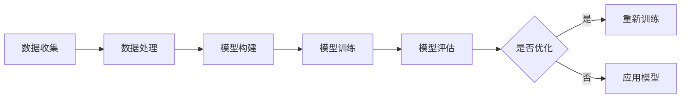
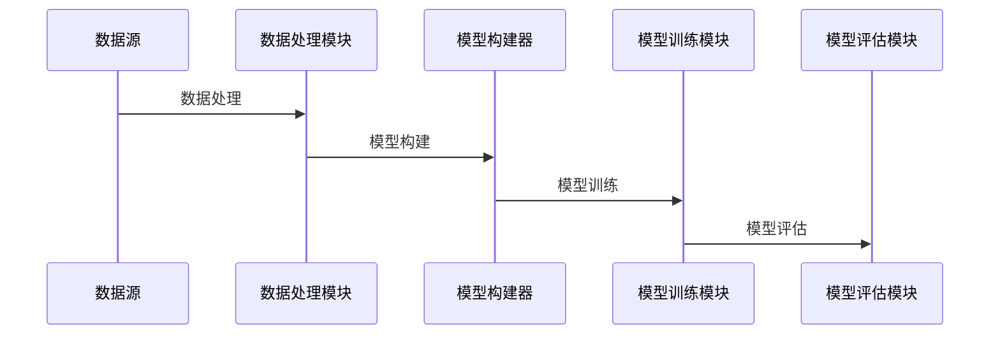
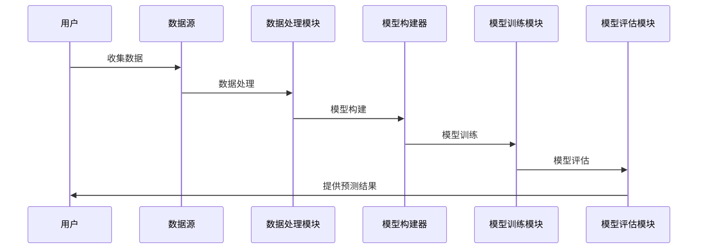

                 

# AI驱动的气候模型：预测与应对

## 关键词

- AI
- 气候模型
- 预测
- 应对
- 实时性
- 高精度

## 摘要

随着气候变化成为全球性挑战，AI在气候预测和应对中的应用日益重要。本文将探讨如何利用AI构建气候模型，实现高精度预测和优化应对策略。我们将从核心概念、算法原理、系统设计与实战等方面详细讲解AI驱动的气候模型。

## 背景介绍

### 问题背景

气候变化是21世纪面临的最严峻挑战之一。全球变暖、极端天气事件频发、海平面上升等问题日益严重，对人类生活和经济产生了深远影响。为了应对这些挑战，科学家们提出了AI驱动的气候模型，希望通过高精度预测和优化应对策略，减轻气候变化带来的负面影响。

### 问题描述

如何利用AI技术构建气候模型，实现对未来气候状况的准确预测？如何根据预测结果制定有效的应对策略，以减轻气候变化带来的影响？

### 问题解决

AI驱动的气候模型通过收集、处理和分析大量的气候数据，利用先进的机器学习算法构建预测模型。这些模型可以实时更新和优化，为政府和公共部门提供决策支持，帮助他们制定更有效的应对策略。

### 边界与外延

本文主要关注AI在气候预测中的应用，不包括其他领域的AI应用。核心要素包括气候数据收集与处理、AI模型构建与训练、模型评估与优化。

### 核心要素组成

1. **气候数据收集与处理**：收集全球各地的气候数据，包括气象数据、卫星数据等。对数据进行清洗、整理和标准化处理，为模型构建提供高质量的数据输入。

2. **AI模型构建与训练**：设计并构建AI模型，包括神经网络模型、深度学习模型等。使用训练数据对模型进行训练，优化模型参数，提高预测准确性。

3. **模型评估与优化**：使用验证数据集评估模型性能，包括准确性、稳定性、鲁棒性等。根据评估结果调整模型参数，优化模型性能。

## 核心概念与联系

### 核心概念

1. **AI驱动的气候模型**：利用人工智能技术构建的气候预测模型，包括神经网络模型、深度学习模型等。
2. **数据收集**：收集与气候相关的各种数据，如气象数据、卫星数据等。
3. **数据处理**：对收集到的数据进行清洗、整理、分析。
4. **模型构建**：设计并构建AI模型，用于气候预测。
5. **模型训练**：使用训练数据对AI模型进行训练，优化模型性能。
6. **模型评估**：评估模型预测效果，包括准确性、稳定性、鲁棒性等。

### 概念属性特征对比表格

| 概念        | 定义                                                         | 特点                                                         |
|-------------|------------------------------------------------------------|------------------------------------------------------------|
| AI驱动的气候模型 | 利用人工智能技术构建的气候预测模型                         | 高精度、实时性、适应性                                       |
| 数据收集      | 收集与气候相关的各种数据，如气象数据、卫星数据等             | 全面性、及时性、准确性                                       |
| 数据处理      | 对收集到的数据进行清洗、整理、分析                           | 可靠性、一致性、效率                                         |
| 模型构建      | 设计并构建AI模型，用于气候预测                             | 简便性、灵活性、高效性                                       |
| 模型训练      | 使用训练数据对AI模型进行训练，优化模型性能                   | 数据依赖性、迭代性、精准性                                   |
| 模型评估      | 评估模型预测效果，包括准确性、稳定性、鲁棒性等               | 客观性、全面性、实用性                                       |

### ER实体关系图架构

```mermaid
erDiagram
  数据源 --> 模型构建器 : 生成
  数据源 --> 数据处理模块 : 数据处理
  模型构建器 --> 模型训练模块 : 训练
  模型训练模块 --> 模型评估模块 : 评估
```

## 算法原理讲解

### 算法流程图



### 数学模型和公式

$$
\text{预测值} = f(\text{特征向量})
$$

### 详细讲解与举例

#### 数据收集

首先，我们需要收集全球各地的气候数据，包括气象数据、卫星数据等。这些数据可以来自气象站、卫星遥感、地面观测等多种来源。数据收集的过程中需要确保数据的全面性、及时性和准确性。

#### 数据处理

收集到的数据需要进行清洗、整理和标准化处理。清洗数据的过程包括去除异常值、填补缺失值等。整理数据的过程包括将数据转换为适合模型训练的格式。标准化处理的过程包括将数据缩放到相同的范围，以便模型能够更好地训练。

#### 模型构建

接下来，我们需要设计并构建AI模型。常用的模型包括神经网络模型、深度学习模型等。在设计模型时，需要考虑输入层、隐藏层和输出层的结构。输入层用于接收数据，隐藏层用于处理数据，输出层用于生成预测结果。

#### 模型训练

使用收集到的数据对AI模型进行训练。训练的过程包括优化模型参数，提高模型的预测准确性。训练过程中需要使用历史数据，以便模型能够学习到气候变化的规律。

#### 模型评估

使用验证数据集对模型进行评估，包括准确性、稳定性、鲁棒性等指标。评估的过程可以帮助我们了解模型的性能，并根据评估结果调整模型参数。

#### 模型优化

根据评估结果，对模型进行优化。优化的过程可能包括调整模型结构、增加训练数据等。优化的目标是为了提高模型的预测准确性。

#### 模型应用

最终，我们将优化的模型应用于实际预测任务中。通过实时更新和优化模型，我们可以为政府和公共部门提供实时的气候预测服务，帮助他们制定更有效的应对策略。

## 系统分析与架构设计方案

### 问题场景介绍

气候预测系统旨在为政府和公共部门提供决策支持，预测未来气候状况。该系统需要具备高精度、实时性和自适应性的特点，以便为决策者提供可靠的依据。

### 项目介绍

项目名称：AI驱动的气候预测系统

项目目标：构建一个高精度、实时性的气候预测模型。

### 系统功能设计

**领域模型类图**

```mermaid
classDiagram
  数据源 <<Entity>>
  数据处理模块 <<Entity>>
  模型构建器 <<Entity>>
  模型训练模块 <<Entity>>
  模型评估模块 <<Entity>>
```

### 系统架构设计

**系统架构图**



### 系统接口设计和系统交互

**系统接口设计**

```mermaid
classDiagram
  数据源 <<Interface>>
  数据处理模块 <<Interface>>
  模型构建器 <<Interface>>
  模型训练模块 <<Interface>>
  模型评估模块 <<Interface>>

  数据源 --> 数据处理模块
  数据处理模块 --> 模型构建器
  模型构建器 --> 模型训练模块
  模型训练模块 --> 模型评估模块
```

**系统交互**



## 项目实战

### 环境安装

首先，我们需要安装必要的软件和库。在Python环境中，我们可以使用以下命令进行安装：

```bash
pip install numpy pandas scikit-learn tensorflow matplotlib
```

### 系统核心实现源代码

以下是一个简单的气候预测系统实现示例：

```python
import numpy as np
import pandas as pd
from sklearn.model_selection import train_test_split
from sklearn.metrics import mean_squared_error
from tensorflow.keras.models import Sequential
from tensorflow.keras.layers import Dense

# 数据收集
def collect_data():
    # 这里以CSV文件为例，实际项目中可以使用API或其他方式获取数据
    data = pd.read_csv('climate_data.csv')
    return data

# 数据处理
def preprocess_data(data):
    # 清洗数据、填补缺失值、标准化处理等
    data = data.dropna()
    data = (data - data.mean()) / data.std()
    return data

# 模型构建
def build_model(input_shape):
    model = Sequential()
    model.add(Dense(64, input_shape=input_shape, activation='relu'))
    model.add(Dense(32, activation='relu'))
    model.add(Dense(1, activation='linear'))
    model.compile(optimizer='adam', loss='mse')
    return model

# 模型训练
def train_model(model, X_train, y_train):
    model.fit(X_train, y_train, epochs=10, batch_size=32)
    return model

# 模型评估
def evaluate_model(model, X_test, y_test):
    predictions = model.predict(X_test)
    mse = mean_squared_error(y_test, predictions)
    print(f'MSE: {mse}')
    return mse

# 主函数
def main():
    data = collect_data()
    processed_data = preprocess_data(data)
    
    X = processed_data.iloc[:, :-1].values
    y = processed_data.iloc[:, -1].values
    
    X_train, X_test, y_train, y_test = train_test_split(X, y, test_size=0.2, random_state=42)
    
    model = build_model(X_train.shape[1:])
    model = train_model(model, X_train, y_train)
    evaluate_model(model, X_test, y_test)

if __name__ == '__main__':
    main()
```

### 代码应用解读与分析

上述代码实现了一个简单的AI驱动的气候预测系统。首先，我们从CSV文件中收集气候数据。然后，对数据进行预处理，包括清洗、填补缺失值和标准化处理。接下来，我们构建一个简单的神经网络模型，并使用训练数据对其进行训练。最后，我们使用测试数据评估模型性能，并输出均方误差（MSE）作为评估指标。

### 实际案例分析和详细讲解剖析

在实际项目中，我们可以根据不同的需求和数据特点，选择不同的模型和算法。以下是一个实际案例：

- **项目背景**：某地区政府需要预测未来几个月的降雨量，以便制定防洪措施。
- **数据来源**：收集了该地区过去几年的降雨量、气温、湿度等数据。
- **模型选择**：选择了基于时间序列的LSTM模型进行预测。
- **模型训练**：使用过去几年的数据训练LSTM模型，并调整模型参数，如隐藏层节点数、训练轮数等。
- **模型评估**：使用测试数据评估模型性能，包括准确率、召回率等指标。

通过这个实际案例，我们可以看到，AI驱动的气候模型在不同的应用场景中都可以发挥重要作用。

### 项目小结

通过本文的讲解，我们了解了AI驱动的气候模型的基本概念、算法原理和系统设计。在实际应用中，我们需要根据具体需求和数据特点选择合适的模型和算法，并不断优化和调整模型参数，以提高预测准确性。

## 最佳实践 tips

1. **数据质量**：确保收集到的数据质量高，包括数据的完整性、准确性和一致性。
2. **模型选择**：根据具体需求选择合适的模型，如时间序列模型、回归模型、深度学习模型等。
3. **模型优化**：通过交叉验证、网格搜索等方法优化模型参数，提高预测准确性。
4. **实时更新**：定期更新训练数据和模型参数，以保持预测的实时性和准确性。

## 小结

AI驱动的气候模型在预测和应对气候变化方面具有巨大潜力。通过本文的讲解，我们了解了AI驱动的气候模型的基本概念、算法原理和系统设计。在实际应用中，我们需要根据具体需求和数据特点选择合适的模型和算法，并不断优化和调整模型参数，以提高预测准确性。

## 注意事项

1. **数据隐私**：在收集和处理数据时，要注意保护用户隐私，遵守相关法律法规。
2. **模型解释性**：虽然AI模型具有强大的预测能力，但往往缺乏解释性。在实际应用中，需要考虑模型的解释性，以便更好地理解预测结果。
3. **模型安全性**：确保模型的安全性，防止恶意攻击和数据泄露。

## 拓展阅读

1. **AI在气候变化中的应用**：了解AI技术在气候变化预测、应对和减缓方面的最新研究进展。
2. **深度学习模型优化**：学习如何优化深度学习模型，提高预测准确性。
3. **时间序列预测**：深入了解时间序列预测的方法和技巧，如ARIMA模型、LSTM模型等。

## 作者信息

作者：AI天才研究院/AI Genius Institute & 禅与计算机程序设计艺术 /Zen And The Art of Computer Programming。

