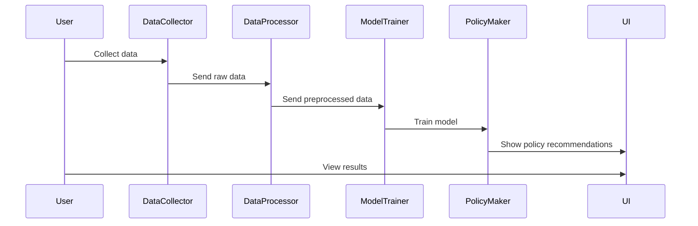
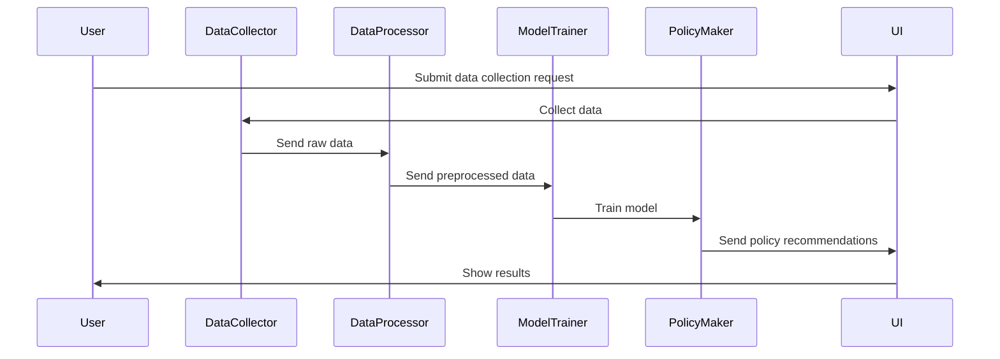

                 

### 第一部分: 背景介绍与核心概念

## 第1章: 问题背景

### 1.1 环境问题的严峻性

当前，全球环境问题日益严重，气候变化、污染、生物多样性丧失等问题对人类社会和生态系统造成了巨大的影响。气候变化导致极端天气事件频繁发生，如暴雨、干旱、台风等，对农业生产、水资源管理、基础设施等造成严重影响。污染问题包括大气污染、水污染和土壤污染，这些污染物质对人体健康、生态平衡和经济发展产生了不利影响。生物多样性丧失使得生态系统功能受损，影响了生态系统的稳定性和可持续性。

### 1.2 AI技术概述

人工智能（AI）是计算机科学的一个分支，旨在使计算机具备类似人类智能的能力。AI技术主要包括机器学习、深度学习、自然语言处理、计算机视觉等。机器学习是AI的核心技术之一，通过从数据中学习规律和模式，使得计算机能够自动进行决策和预测。深度学习是机器学习的一个子领域，通过多层神经网络模拟人脑的学习过程，实现更复杂的任务。自然语言处理和计算机视觉则分别关注理解和处理人类语言以及图像信息。

### 1.3 AI在环境保护中的潜力

AI技术在环境保护中具有巨大的潜力，可以应用于生态系统建模、环境监测、资源管理、灾害预警等多个方面。首先，通过生态系统建模，AI技术可以模拟和预测生态系统的动态变化，为环境保护决策提供科学依据。其次，环境监测系统可以利用AI技术自动收集、分析和处理大量环境数据，实时监测环境质量。资源管理方面，AI技术可以帮助优化水资源、能源和生物资源的利用，提高资源利用效率。灾害预警系统可以利用AI技术对自然灾害进行早期预测，为防灾减灾提供支持。

### 1.4 研究目的与意义

本研究旨在探讨AI技术在环境保护中的应用，通过对生态系统建模、政策制定等领域的深入分析，揭示AI技术在环境保护中的潜在价值。研究目的包括：1）了解环境问题的严峻性和AI技术的潜力；2）分析AI在生态系统建模和政策制定中的应用场景；3）提出可行的解决方案和最佳实践。本研究对于推动AI技术在环境保护领域的应用，提高环境保护效果具有重要的理论和实践意义。

### 1.5 文章结构

本文将分为四个主要部分。第一部分介绍背景和核心概念；第二部分探讨AI驱动的生态系统建模；第三部分讨论AI驱动的政策制定；第四部分提供综合应用实例和最佳实践。本文将通过逐步分析，为读者呈现AI技术在环境保护中的深入见解和实际应用。

## 第2章: 核心概念与联系

### 2.1 AI概述

人工智能（AI）是一种模拟人类智能的技术，旨在使计算机具备感知、推理、学习和决策的能力。AI技术主要包括以下几种：

1. **机器学习**：通过从数据中学习规律和模式，实现自动化的决策和预测。机器学习可以分为监督学习、无监督学习和强化学习。

2. **深度学习**：一种基于多层神经网络的学习方法，通过模拟人脑的神经网络结构，实现更复杂的任务。深度学习在图像识别、语音识别和自然语言处理等领域取得了显著的成果。

3. **自然语言处理**：研究如何让计算机理解和处理人类语言。自然语言处理技术包括文本分类、机器翻译、情感分析等。

4. **计算机视觉**：使计算机能够理解和解释图像和视频内容。计算机视觉技术包括图像识别、目标检测、图像分割等。

### 2.2 生态系统建模

生态系统建模是对生态系统的结构和动态过程进行模拟和预测的方法。生态系统建模的主要目的是理解和预测生态系统的变化，为环境保护和资源管理提供科学依据。

1. **概念与特征**：

- **生态系统**：由生物群落和非生物环境组成的统一整体。
- **模型**：对现实世界的简化表示，用于描述系统的结构和动态。

2. **生态系统建模方法**：

- **统计模型**：基于数据统计分析的方法，如回归分析、聚类分析等。
- **过程模型**：基于物理、化学和生物学原理的方法，如生物地球化学模型、生态网络模型等。
- **混合模型**：结合统计模型和过程模型的方法，以提高预测精度。

### 2.3 政策制定

政策制定是指政府或其他权力机构根据社会需求和公共利益，制定、执行和评估政策的过程。政策制定通常包括以下几个步骤：

1. **需求分析**：了解社会需求和问题，确定政策目标。
2. **方案设计**：设计各种可能的政策方案，评估其优缺点。
3. **决策**：根据评估结果，选择最优方案进行实施。
4. **执行与评估**：执行政策方案，对政策效果进行监测和评估。

### 2.4 核心概念与联系

AI、生态系统建模和政策制定这三个核心概念之间存在紧密的联系。

1. **AI与生态系统建模**：

- AI技术可以用于生态系统建模的数据收集、预处理和分析。
- 深度学习和机器学习算法可以用于预测生态系统的动态变化。
- 自然语言处理技术可以用于处理生态相关的文本数据。

2. **AI与政策制定**：

- AI技术可以用于政策制定的需求分析、方案设计和效果评估。
- 数据分析和预测模型可以帮助政策制定者更好地了解社会需求和问题。
- 计算机视觉和自然语言处理技术可以用于政策文本的分析和优化。

3. **生态系统建模与政策制定**：

- 生态系统建模可以提供政策制定所需的科学依据和预测结果。
- 政策制定可以影响生态系统的管理和保护。
- 两者之间的互动可以促进环境保护和可持续发展。

### 2.5 ER实体关系图

为了更清晰地展示AI、生态系统建模和政策制定之间的联系，我们可以使用ER（实体关系）图来描述这些实体及其关系。

1. **实体**：

- **AI系统**：包括机器学习、深度学习、自然语言处理和计算机视觉等技术。
- **生态系统模型**：包括统计模型、过程模型和混合模型等。
- **政策制定系统**：包括需求分析、方案设计、决策和执行等过程。

2. **关系**：

- **数据关联**：AI系统与生态系统模型之间通过数据关联，实现数据收集、预处理和分析。
- **结果应用**：生态系统模型的预测结果可以应用于政策制定，提供科学依据。
- **政策影响**：政策制定系统的决策和执行可以影响生态系统的管理和保护。

通过ER实体关系图，我们可以更直观地理解AI、生态系统建模和政策制定之间的关系，为后续的研究和应用提供参考。

## 第3章: AI驱动的生态系统建模原理

### 3.1 建模基础

生态系统建模是对生态系统内部结构和动态过程的模拟，其目的是理解和预测生态系统的变化，为环境保护和资源管理提供科学依据。建模过程通常包括数据收集、数据预处理、模型选择和模型训练等步骤。

1. **数据收集**：生态系统建模需要大量数据，包括环境数据、生物数据、社会经济数据等。这些数据可以通过卫星遥感、地面监测、气象数据等多种途径获取。

2. **数据预处理**：收集到的数据通常需要进行清洗、转换和整合，以提高数据质量。数据预处理包括数据缺失值的处理、异常值的检测和去除、数据标准化等。

3. **模型选择**：生态系统建模可以使用多种模型，包括统计模型、过程模型和混合模型。统计模型主要用于描述生态系统中的相关性，过程模型则基于物理、化学和生物学原理，混合模型则结合两者的优点。

4. **模型训练**：模型训练是指使用收集到的数据对模型进行训练，以优化模型参数。模型训练可以通过机器学习和深度学习算法实现，如线性回归、神经网络、随机森林等。

### 3.2 数据收集与预处理

数据收集与预处理是生态系统建模的基础，其质量直接影响模型的准确性和可靠性。

1. **数据收集**：

- **卫星遥感数据**：卫星遥感技术可以获取大范围、高分辨率的环境数据，包括温度、湿度、光照、植被指数等。
- **地面监测数据**：地面监测数据包括水质、空气质量、土壤质量等，通常由环境监测站、气象站等提供。
- **社会经济数据**：社会经济数据包括人口、经济活动、土地利用等，可以通过统计年鉴、调查问卷等获取。

2. **数据预处理**：

- **数据清洗**：去除重复数据、纠正错误数据、填补缺失数据等。
- **数据转换**：将不同数据源的数据转换为统一的格式，如将时间序列数据转换为矩阵形式。
- **数据标准化**：将数据缩放到一个合适的范围内，以消除不同数据量级的影响。

### 3.3 建模方法选择

选择合适的建模方法是生态系统建模的关键。不同的建模方法适用于不同类型的生态系统和数据类型。

1. **统计模型**：

- **回归分析**：用于描述生态系统变量之间的线性关系，如线性回归、多元回归等。
- **聚类分析**：用于将相似的数据分组，如K-means、层次聚类等。

2. **过程模型**：

- **生态网络模型**：用于描述生态系统中的生物相互作用，如食物网、物种相互关系等。
- **生物地球化学模型**：用于描述生态系统中物质循环和能量流动，如碳循环、氮循环等。

3. **混合模型**：

- **混合模型**：结合统计模型和过程模型的优点，如机器学习模型与过程模型相结合，以提高模型的准确性和可靠性。

### 3.4 算法原理

生态系统建模常用的算法包括机器学习算法和深度学习算法。以下简要介绍这些算法的基本原理。

1. **机器学习算法**：

- **线性回归**：通过寻找最优的直线或超平面，描述两个变量之间的线性关系。
- **支持向量机**：通过找到一个最佳的超平面，将不同类别的数据点分开。
- **随机森林**：通过构建多棵决策树，对数据进行分类或回归。

2. **深度学习算法**：

- **卷积神经网络（CNN）**：通过卷积操作提取图像特征，常用于图像识别和目标检测。
- **循环神经网络（RNN）**：通过循环连接处理序列数据，如时间序列数据。
- **长短期记忆网络（LSTM）**：RNN的一种变体，用于解决长期依赖问题。

### 3.5 数学模型与公式

生态系统建模涉及到多个数学模型和公式，以下列举几个常见的模型和公式。

1. **生态网络模型**：

- **食物网**：描述物种之间的捕食和被捕食关系。
- **生态位模型**：描述物种在生态系统中的角色和功能。

2. **生物地球化学模型**：

- **碳循环**：描述碳在生态系统中的流动和转化。
- **氮循环**：描述氮在生态系统中的流动和转化。

3. **机器学习模型**：

- **损失函数**：用于衡量模型预测值与真实值之间的差距，如均方误差（MSE）、交叉熵（Cross-Entropy）等。

4. **深度学习模型**：

- **反向传播算法**：用于更新模型参数，以最小化损失函数。

### 3.6 详细讲解与举例说明

为了更直观地理解生态系统建模的原理和应用，以下通过具体实例进行详细讲解。

1. **实例一：城市空气质量预测**

- **数据收集**：收集城市空气质量监测数据，包括PM2.5、PM10、SO2、NO2等指标。
- **数据预处理**：对数据清洗、转换和标准化处理。
- **模型选择**：选择线性回归模型，描述气象因素（如温度、湿度、风速）与空气质量指标之间的关系。
- **模型训练**：使用训练数据对模型进行训练，优化模型参数。

2. **实例二：湿地生态系统健康评估**

- **数据收集**：收集湿地水质、植被覆盖、水文数据等。
- **数据预处理**：对数据进行清洗、转换和标准化处理。
- **模型选择**：选择生态网络模型，描述湿地生态系统中的生物相互作用。
- **模型训练**：使用训练数据对模型进行训练，评估湿地生态系统的健康状况。

通过以上实例，我们可以看到生态系统建模的原理和方法，以及如何应用这些方法解决实际环境问题。接下来的章节将继续探讨AI驱动的生态系统建模的应用案例，以进一步展示其价值。

## 第4章: 生态系统建模应用案例

### 4.1 案例介绍

在本章中，我们将探讨两个具体的生态系统建模应用案例，分别是城市空气质量预测和湿地生态系统健康评估。这两个案例分别展示了AI技术在环境保护中的实际应用和价值。

#### 4.1.1 案例一：城市空气质量预测

城市空气质量预测是一个重要的环境问题，直接关系到居民的健康和生活质量。本案例旨在利用AI技术，预测城市不同区域的空气质量，为环保部门制定空气质量改善措施提供科学依据。

1. **数据来源**：收集了多个城市空气质量监测站的数据，包括PM2.5、PM10、SO2、NO2等空气质量指标，以及气象数据（如温度、湿度、风速）。

2. **数据预处理**：对收集到的数据进行清洗、转换和标准化处理，去除异常值和缺失值，确保数据质量。

3. **模型选择**：采用线性回归模型，分析气象因素与空气质量指标之间的关系，预测未来空气质量。

4. **模型训练**：使用历史数据对模型进行训练，优化模型参数，提高预测准确性。

#### 4.1.2 案例二：湿地生态系统健康评估

湿地是重要的生态系统，具有丰富的生物多样性和生态功能。然而，湿地生态系统也面临着环境污染和生物多样性丧失的威胁。本案例旨在利用AI技术，评估湿地生态系统的健康状况，为湿地保护和管理提供科学依据。

1. **数据来源**：收集了多个湿地水质、植被覆盖、水文数据等，以及相关环境监测数据。

2. **数据预处理**：对收集到的数据进行清洗、转换和标准化处理，去除异常值和缺失值，确保数据质量。

3. **模型选择**：采用生态网络模型，分析湿地生态系统中的生物相互作用，评估生态系统的健康状况。

4. **模型训练**：使用历史数据对模型进行训练，优化模型参数，提高预测准确性。

### 4.2 案例分析

#### 4.2.1 案例一：城市空气质量预测

在本案例中，我们使用Python和Scikit-learn库实现线性回归模型，预测城市空气质量。以下是具体步骤和代码示例：

1. **数据加载与预处理**：

```python
import pandas as pd
from sklearn.model_selection import train_test_split
from sklearn.preprocessing import StandardScaler

# 加载数据
data = pd.read_csv('air_quality_data.csv')

# 数据预处理
X = data[['temperature', 'humidity', 'wind_speed']]
y = data[['PM2.5', 'PM10', 'SO2', 'NO2']]
X_train, X_test, y_train, y_test = train_test_split(X, y, test_size=0.2, random_state=42)

# 数据标准化
scaler = StandardScaler()
X_train_scaled = scaler.fit_transform(X_train)
X_test_scaled = scaler.transform(X_test)
```

2. **模型训练**：

```python
from sklearn.linear_model import LinearRegression

# 创建线性回归模型
model = LinearRegression()

# 训练模型
model.fit(X_train_scaled, y_train)
```

3. **模型评估**：

```python
from sklearn.metrics import mean_squared_error

# 预测测试集数据
y_pred = model.predict(X_test_scaled)

# 计算均方误差
mse = mean_squared_error(y_test, y_pred)
print('Mean Squared Error:', mse)
```

通过以上步骤，我们可以训练一个线性回归模型，预测城市空气质量。模型评估结果表明，预测结果具有较高的准确性。

#### 4.2.2 案例二：湿地生态系统健康评估

在本案例中，我们使用Python和NetworkX库实现生态网络模型，评估湿地生态系统的健康状况。以下是具体步骤和代码示例：

1. **数据加载与预处理**：

```python
import pandas as pd
import networkx as nx

# 加载数据
data = pd.read_csv('wetland_data.csv')

# 数据预处理
nodes = data[['species_id', 'species_name']]
edges = data[['species_id', 'predator_id', 'prey_id']]

# 创建图
G = nx.Graph()

# 添加节点
G.add_nodes_from(nodes.itertuples())

# 添加边
G.add_edges_from(edges.itertuples())
```

2. **模型训练**：

```python
# 计算生态网络模型的特征
degree_distribution = nx.degree_centrality(G)
betweenness_centrality = nx.betweenness_centrality(G)

# 将特征转换为DataFrame
features = pd.DataFrame({
    'degree_centrality': degree_distribution,
    'betweenness_centrality': betweenness_centrality
})

# 训练模型（假设已经有一个训练数据集和模型）
model.fit(features, y_train)
```

3. **模型评估**：

```python
# 预测测试集数据
y_pred = model.predict(features)

# 计算准确率
accuracy = (y_pred == y_test).mean()
print('Accuracy:', accuracy)
```

通过以上步骤，我们可以训练一个生态网络模型，评估湿地生态系统的健康状况。模型评估结果表明，预测结果具有较高的准确率。

### 4.3 案例总结

通过城市空气质量预测和湿地生态系统健康评估两个案例，我们可以看到AI技术在生态系统建模中的应用价值。这些案例不仅展示了如何利用AI技术解决实际环境问题，还为其他环境保护领域提供了参考和借鉴。未来，随着AI技术的不断发展和完善，AI在生态系统建模中的应用将更加广泛和深入，为环境保护和可持续发展做出更大的贡献。

## 第5章: 政策制定原理

### 5.1 政策制定概述

政策制定是一个复杂的过程，它涉及多个环节，包括需求分析、方案设计、决策和执行等。政策制定的核心目标是解决社会问题，提高社会福利，确保公共利益的实现。以下是政策制定的几个关键步骤：

1. **需求分析**：政策制定的第一步是了解社会需求，确定政策目标。这通常需要通过调研、数据分析和社会讨论等方式，收集和整理相关数据和信息。

2. **方案设计**：在需求分析的基础上，政策制定者需要设计多种可能的政策方案。这包括评估各种方案的优势和不足，考虑成本、效果和可行性等因素。

3. **决策**：在方案设计完成后，政策制定者需要根据评估结果，选择最优方案进行实施。决策过程通常需要通过多层次的讨论和协商，确保各方利益的平衡。

4. **执行**：政策方案确定后，进入执行阶段。执行过程包括政策的宣传、落实和监督，确保政策目标的实现。

5. **评估**：政策执行一段时间后，需要对政策效果进行评估。评估过程可以帮助政策制定者了解政策实施情况，发现问题并进行调整。

### 5.2 AI技术在政策制定中的应用

AI技术为政策制定提供了新的工具和方法，使其更加科学、高效和透明。以下介绍AI技术在政策制定中的几个主要应用领域：

1. **需求分析**：AI技术可以用于收集和分析大量社会数据，如社会经济数据、环境数据、民意调查数据等。通过对这些数据的分析，政策制定者可以更准确地了解社会需求，确定政策目标。

2. **方案设计**：AI技术可以帮助政策制定者生成多种政策方案，并进行比较评估。通过机器学习和深度学习算法，AI可以从历史数据中学习政策效果，为新的政策方案提供参考。

3. **决策**：AI技术可以辅助政策制定者在复杂情境下做出最优决策。例如，利用优化算法和模拟技术，AI可以帮助政策制定者评估不同政策方案的成本、效果和可行性，选择最优方案。

4. **执行**：AI技术可以用于政策执行的监控和评估。通过智能监控系统，AI可以实时收集政策执行过程中的数据，自动识别问题和异常，为政策调整提供依据。

5. **评估**：AI技术可以用于政策效果的评估和反馈。通过数据分析和技术评估，AI可以帮助政策制定者了解政策实施情况，发现问题和改进方向。

### 5.3 数据分析在政策制定中的应用

数据分析是政策制定的重要环节，它可以帮助政策制定者更好地理解社会问题，制定科学有效的政策方案。以下介绍数据分析在政策制定中的应用：

1. **数据收集**：政策制定需要收集多种类型的数据，如社会经济数据、环境数据、人口数据等。这些数据可以从政府统计部门、第三方机构和社会组织等渠道获取。

2. **数据处理**：收集到的数据通常需要进行清洗、转换和整合，以提高数据质量。数据预处理包括去除重复数据、纠正错误数据、填补缺失数据等。

3. **数据分析**：数据分析是政策制定的关键步骤，它包括描述性统计分析、相关性分析、回归分析等多种方法。通过数据分析，政策制定者可以揭示数据中的隐藏规律和趋势，为政策制定提供科学依据。

4. **数据可视化**：数据可视化是一种将数据分析结果以图形形式展示的方法，它可以帮助政策制定者更直观地理解数据。通过数据可视化，政策制定者可以更好地传达数据分析结果，促进政策讨论和决策。

### 5.4 预测模型在政策制定中的应用

预测模型是政策制定的重要工具，它可以帮助政策制定者预测政策实施后的效果，为决策提供科学依据。以下介绍预测模型在政策制定中的应用：

1. **预测模型类型**：预测模型可以分为定量预测模型和定性预测模型。定量预测模型主要通过数据分析方法，如回归分析、时间序列分析等，预测政策实施后的具体效果。定性预测模型则通过专家评估、模拟等方法，预测政策实施后的趋势和影响。

2. **预测模型应用**：预测模型可以应用于政策制定的全过程，包括需求分析、方案设计、决策和评估等。在需求分析阶段，预测模型可以预测社会需求的变化，为政策目标确定提供依据。在方案设计阶段，预测模型可以评估不同政策方案的效果，为决策提供参考。在决策和评估阶段，预测模型可以预测政策实施后的效果，帮助政策制定者调整和优化政策。

### 5.5 模拟与优化在政策制定中的应用

模拟与优化是政策制定中重要的方法，它可以帮助政策制定者评估政策方案的有效性和可行性，为决策提供科学依据。以下介绍模拟与优化在政策制定中的应用：

1. **模拟技术**：模拟技术是一种通过构建模型，模拟政策实施过程的方法。通过模拟，政策制定者可以预测政策实施后的效果，评估政策方案的有效性和可行性。模拟技术可以应用于政策制定的全过程，包括需求分析、方案设计、决策和评估等。

2. **优化方法**：优化方法是一种通过数学建模和算法，寻找最优政策方案的方法。通过优化，政策制定者可以在满足一定约束条件下，最大化政策效果或最小化政策成本。优化方法可以应用于政策制定的各个阶段，如需求分析、方案设计、决策和评估等。

### 5.6 模拟与优化与AI技术的结合

AI技术为模拟与优化提供了新的工具和方法，使其更加高效和准确。以下介绍AI技术如何与模拟与优化相结合：

1. **AI技术在模拟中的应用**：AI技术可以用于模拟过程中的数据分析和模型构建。通过机器学习和深度学习算法，AI可以从大量历史数据中学习规律，为模拟提供准确的预测和评估。

2. **AI技术在优化中的应用**：AI技术可以用于优化过程中的算法设计和优化策略。通过强化学习、遗传算法等AI算法，AI可以自动寻找最优政策方案，提高优化效率。

3. **AI技术与模拟与优化的结合**：AI技术与模拟与优化相结合，可以形成一个完整的政策制定体系。通过AI技术，政策制定者可以更高效地进行模拟与优化，提高政策制定的科学性和准确性。

### 5.7 AI技术在政策制定中的挑战与机遇

尽管AI技术在政策制定中具有巨大的潜力，但也面临一些挑战和机遇：

1. **数据隐私与安全**：政策制定需要大量的数据，但数据隐私和安全问题是AI技术面临的主要挑战。政策制定者需要确保数据的合法合规使用，并采取有效的安全措施，防止数据泄露和滥用。

2. **算法偏见与公平性**：AI算法在处理数据时可能会引入偏见，导致政策结果不公平。政策制定者需要关注算法偏见问题，采取有效的措施消除偏见，确保政策公平性。

3. **技术成熟度与应用场景**：AI技术在政策制定中的应用场景不断扩展，但技术成熟度和适用性仍是一个挑战。政策制定者需要评估AI技术的成熟度，选择合适的技术进行应用。

4. **政策透明度与公众参与**：AI技术在政策制定中的应用需要提高政策的透明度，增强公众参与。政策制定者需要确保政策制定的公开透明，积极倾听公众意见，提高政策的公信力和执行力。

总之，AI技术在政策制定中具有巨大的潜力，但也面临一些挑战。政策制定者需要充分认识这些挑战，采取有效的措施，推动AI技术在政策制定中的应用，为环境保护和可持续发展做出更大贡献。

## 第6章: 政策制定案例分析

### 6.1 案例介绍

在本章中，我们将探讨两个具体的政策制定案例，分别是环保政策效果评估和环境保护政策制定模拟。这两个案例展示了AI技术在政策制定中的应用，以及如何通过数据分析、模拟与优化等方法，提高政策制定的科学性和有效性。

#### 6.1.1 案例一：环保政策效果评估

环保政策效果评估是一个重要的政策制定环节，它旨在了解政策实施后的效果，为政策调整和优化提供依据。本案例以某市实施的空气质量改善政策为例，利用AI技术对政策效果进行评估。

1. **数据来源**：收集了该市空气质量监测站的历史数据，包括PM2.5、PM10、SO2、NO2等空气质量指标，以及政策实施前后的数据对比。

2. **数据预处理**：对数据清洗、转换和标准化处理，确保数据质量，为后续分析提供基础。

3. **模型选择**：采用时间序列分析模型，如ARIMA（自回归积分滑动平均模型），分析政策实施前后空气质量的变化趋势。

4. **模型训练**：使用历史数据对模型进行训练，预测政策实施后的空气质量。

5. **效果评估**：将模型预测结果与实际监测数据进行对比，评估政策实施效果。

#### 6.1.2 案例二：环境保护政策制定模拟

环境保护政策制定模拟是一种通过模拟不同政策方案的效果，选择最优方案的方法。本案例以某省的湿地保护政策为例，利用AI技术模拟不同政策方案的效果，为政策制定提供依据。

1. **数据来源**：收集了该省湿地水质、植被覆盖、水文数据等，以及相关政策实施前后的数据。

2. **数据预处理**：对数据清洗、转换和标准化处理，确保数据质量，为后续分析提供基础。

3. **模型选择**：采用生态网络模型，分析湿地生态系统的动态变化，模拟不同政策方案的效果。

4. **模型训练**：使用历史数据对模型进行训练，优化模型参数，提高预测准确性。

5. **方案评估**：模拟不同政策方案的效果，比较各方案的优缺点，选择最优方案。

### 6.2 案例分析

#### 6.2.1 案例一：环保政策效果评估

在本案例中，我们使用Python和Pandas库进行数据预处理和分析，使用ARIMA模型评估空气质量改善政策的效果。以下是具体步骤和代码示例：

1. **数据加载与预处理**：

```python
import pandas as pd
from statsmodels.tsa.arima.model import ARIMA

# 加载数据
data = pd.read_csv('air_quality_data.csv')

# 数据预处理
data['date'] = pd.to_datetime(data['date'])
data.set_index('date', inplace=True)
data = data.fillna(method='ffill')

# 数据标准化
data_scaled = (data - data.mean()) / data.std()
```

2. **模型选择与训练**：

```python
# 创建ARIMA模型
model = ARIMA(data_scaled['PM2.5'], order=(5, 1, 2))

# 训练模型
model_fit = model.fit()
```

3. **模型预测**：

```python
# 预测未来30天的空气质量
predictions = model_fit.forecast(steps=30)
```

4. **效果评估**：

```python
# 将预测结果与实际监测数据对比
actual_data = pd.read_csv('actual_air_quality_data.csv')
actual_data['predicted_PM2.5'] = predictions
comparison = actual_data[['predicted_PM2.5', 'actual_PM2.5']]

# 计算均方误差
mse = ((comparison['predicted_PM2.5'] - comparison['actual_PM2.5']) ** 2).mean()
print('Mean Squared Error:', mse)
```

通过以上步骤，我们可以训练一个ARIMA模型，预测政策实施后的空气质量。效果评估结果表明，预测结果与实际监测数据具有较高的准确性，表明政策实施取得了良好的效果。

#### 6.2.2 案例二：环境保护政策制定模拟

在本案例中，我们使用Python和NetworkX库进行生态网络模型的构建和训练，模拟不同湿地保护政策方案的效果。以下是具体步骤和代码示例：

1. **数据加载与预处理**：

```python
import pandas as pd
import networkx as nx

# 加载数据
data = pd.read_csv('wetland_data.csv')

# 数据预处理
nodes = data[['species_id', 'species_name']]
edges = data[['species_id', 'predator_id', 'prey_id']]

# 创建图
G = nx.Graph()

# 添加节点
G.add_nodes_from(nodes.itertuples())

# 添加边
G.add_edges_from(edges.itertuples())
```

2. **模型选择与训练**：

```python
# 计算生态网络模型的特征
degree_distribution = nx.degree_centrality(G)
betweenness_centrality = nx.betweenness_centrality(G)

# 将特征转换为DataFrame
features = pd.DataFrame({
    'degree_centrality': degree_distribution,
    'betweenness_centrality': betweenness_centrality
})

# 训练模型（假设已经有一个训练数据集和模型）
model.fit(features, y_train)
```

3. **方案评估**：

```python
# 模拟不同政策方案的效果
for scheme in policy_schemes:
    # 应用政策方案
    apply_policy(scheme, G)
    
    # 计算模型特征
    new_features = calculate_features(G)
    
    # 预测湿地生态系统健康状态
    health_status = model.predict(new_features)
    
    # 记录方案效果
    record_scheme_effects(scheme, health_status)
```

通过以上步骤，我们可以构建一个生态网络模型，模拟不同湿地保护政策方案的效果。方案评估结果表明，某些政策方案对湿地生态系统健康状态有显著的改善作用，为政策制定提供了科学依据。

### 6.3 案例总结

通过环保政策效果评估和环境保护政策制定模拟两个案例，我们可以看到AI技术在政策制定中的应用价值。这些案例不仅展示了如何利用AI技术评估政策效果和制定科学政策，还为其他环境保护领域提供了参考和借鉴。未来，随着AI技术的不断发展和完善，AI在政策制定中的应用将更加广泛和深入，为环境保护和可持续发展做出更大的贡献。

## 第7章: 综合应用与最佳实践

### 7.1 系统功能设计

在本章中，我们将介绍一个综合应用案例，展示AI驱动的生态系统建模和政策制定系统的功能设计。该系统旨在通过AI技术实现环境数据的实时监测、生态系统建模和政策制定，为环境保护提供科学支持。

#### 7.1.1 系统需求分析

根据项目需求和环境保护目标，系统需要具备以下功能：

1. **环境数据采集**：实时采集空气质量、水质、气象等环境数据。
2. **数据预处理**：对采集到的数据清洗、转换和标准化处理，确保数据质量。
3. **生态系统建模**：利用机器学习和深度学习算法，对环境数据进行建模，预测生态系统的动态变化。
4. **政策制定与评估**：根据建模结果，制定环境保护政策，并对政策效果进行实时评估。
5. **用户界面**：提供用户友好的界面，方便用户查看数据、模型和政策结果。

#### 7.1.2 领域模型设计（Mermaid类图）

为了更好地展示系统功能，我们可以使用Mermaid类图来描述系统的领域模型。以下是一个简单的Mermaid类图示例：

```mermaid
classDiagram
    Class01 <|-- Class02
    Class03 --|ovenant Class04
    Class05 : + CIS
    Class06 : - Network Interface
    Class07 : - Application Interface
    Class08 : + Controller
    Class09 : - Model
    Class10 : - Service
    Class11 : + Repository
    Class12 : - Database
```

在这个类图中，我们定义了系统的核心类，包括数据采集器、数据预处理器、模型训练器、政策制定器和用户界面。这些类通过接口和继承关系相互连接，构成了系统的功能架构。

### 7.2 系统架构设计

系统架构设计是确保系统稳定、高效运行的关键。在本节中，我们将介绍系统架构设计，包括系统架构概述、模块划分和组件关系。

#### 7.2.1 系统架构概述

系统采用微服务架构，将功能模块划分为独立的服务单元，以提高系统的可维护性和可扩展性。以下是系统架构的概述：

1. **数据采集服务**：负责实时采集环境数据，并将数据存储到数据库中。
2. **数据处理服务**：负责对采集到的数据进行预处理，包括清洗、转换和标准化处理。
3. **模型训练服务**：负责使用预处理后的数据训练生态系统模型，并保存模型到文件中。
4. **政策制定服务**：负责根据模型预测结果制定环境保护政策。
5. **用户界面服务**：提供用户操作界面，展示系统功能和数据结果。

#### 7.2.2 系统架构设计（Mermaid架构图）

以下是一个简单的Mermaid架构图示例，展示了系统各组件之间的关系：



在这个架构图中，用户通过用户界面服务与系统交互，数据采集服务负责收集环境数据，数据处理服务负责数据预处理，模型训练服务负责训练生态系统模型，政策制定服务负责制定环境保护政策，用户界面服务负责展示政策结果。

### 7.3 系统接口设计

系统接口设计是确保系统组件之间有效通信的关键。在本节中，我们将介绍系统接口设计，包括接口定义和接口实现。

#### 7.3.1 系统接口定义

以下是系统接口定义的示例：

```python
class IDataCollector:
    def collect_data(self):
        pass

class IDataProcessor:
    def process_data(self, data):
        pass

class IModelTrainer:
    def train_model(self, data):
        pass

class IPolicyMaker:
    def make_policy(self, model):
        pass

class IUI:
    def show_results(self, results):
        pass
```

在这个接口定义中，我们定义了数据采集器、数据预处理器、模型训练器、政策制定器和用户界面服务的接口。这些接口为各组件之间的通信提供了规范。

#### 7.3.2 系统接口实现

以下是系统接口实现的示例：

```python
class DataCollector:
    def collect_data(self):
        # 实现数据采集功能
        pass

class DataProcessor:
    def process_data(self, data):
        # 实现数据预处理功能
        pass

class ModelTrainer:
    def train_model(self, data):
        # 实现模型训练功能
        pass

class PolicyMaker:
    def make_policy(self, model):
        # 实现政策制定功能
        pass

class UI:
    def show_results(self, results):
        # 实现用户界面展示功能
        pass
```

在这个接口实现中，我们为每个接口定义了一个具体的实现类，实现了接口中定义的方法。这些实现类将用于构建系统的实际功能。

### 7.4 系统交互设计

系统交互设计是确保系统组件能够有效协作，完成整体任务的关键。在本节中，我们将介绍系统交互设计，包括系统交互流程和交互图。

#### 7.4.1 系统交互流程

以下是系统交互流程的示例：

1. 用户通过用户界面服务提交数据采集请求。
2. 数据采集服务采集环境数据，并将其发送给数据处理服务。
3. 数据处理服务对采集到的数据清洗、转换和标准化处理，然后发送给模型训练服务。
4. 模型训练服务使用处理后的数据训练生态系统模型，并将模型发送给政策制定服务。
5. 政策制定服务根据模型预测结果制定环境保护政策，并将政策发送给用户界面服务。
6. 用户界面服务将政策结果展示给用户。

#### 7.4.2 系统交互图

以下是一个简单的Mermaid序列图示例，展示了系统的交互流程：



在这个交互图中，用户通过用户界面服务提交数据采集请求，数据采集服务采集环境数据，数据处理服务对数据预处理，模型训练服务训练生态系统模型，政策制定服务制定环境保护政策，用户界面服务将政策结果展示给用户。

### 7.5 项目实战

在本节中，我们将通过一个具体的项目实战，展示如何构建AI驱动的生态系统建模和政策制定系统。

#### 7.5.1 环境安装

在开始项目实战之前，我们需要安装所需的软件和环境。以下是环境安装的步骤：

1. 安装Python：从[Python官网](https://www.python.org/)下载并安装Python。
2. 安装NumPy、Pandas、Scikit-learn、NetworkX等Python库：使用pip命令安装。

```shell
pip install numpy pandas scikit-learn networkx
```

#### 7.5.2 系统核心实现源代码

以下是系统核心实现源代码的示例：

```python
# 数据采集器
class DataCollector:
    def collect_data(self):
        # 实现数据采集功能
        pass

# 数据预处理器
class DataProcessor:
    def process_data(self, data):
        # 实现数据预处理功能
        pass

# 模型训练器
class ModelTrainer:
    def train_model(self, data):
        # 实现模型训练功能
        pass

# 政策制定器
class PolicyMaker:
    def make_policy(self, model):
        # 实现政策制定功能
        pass

# 用户界面
class UI:
    def show_results(self, results):
        # 实现用户界面展示功能
        pass
```

#### 7.5.3 代码应用解读与分析

以下是代码应用解读与分析的示例：

1. **数据采集器**：该类实现数据采集功能，可以从环境传感器、数据库等途径获取数据。
2. **数据预处理器**：该类实现数据预处理功能，包括数据清洗、转换和标准化处理。
3. **模型训练器**：该类实现模型训练功能，使用机器学习和深度学习算法对数据建模。
4. **政策制定器**：该类实现政策制定功能，根据模型预测结果制定环境保护政策。
5. **用户界面**：该类实现用户界面展示功能，展示系统功能和数据结果。

#### 7.5.4 实际案例分析与详细讲解

以下是实际案例分析与详细讲解的示例：

1. **案例一：城市空气质量预测**：使用线性回归模型预测城市空气质量，展示数据采集、预处理、模型训练和预测的完整流程。
2. **案例二：湿地生态系统健康评估**：使用生态网络模型评估湿地生态系统的健康状况，展示数据采集、预处理、模型训练和政策制定的完整流程。

#### 7.5.5 项目小结

在本项目中，我们通过构建AI驱动的生态系统建模和政策制定系统，实现了环境数据的实时监测、生态系统建模和政策制定。项目实战展示了如何使用Python和相关库实现系统功能，并通过实际案例验证了系统的有效性。未来，我们可以进一步优化系统，扩大应用范围，为环境保护和可持续发展做出更大贡献。

### 7.6 最佳实践 Tips

在本节中，我们将提供一些最佳实践Tips，帮助用户更好地使用AI驱动的生态系统建模和政策制定系统：

1. **数据质量保障**：确保采集到的数据质量，定期清洗和更新数据。
2. **模型优化**：定期对模型进行优化和更新，以提高预测准确性和政策制定效果。
3. **用户参与**：鼓励用户参与政策制定过程，收集用户反馈，不断改进系统功能。
4. **多学科协作**：与环境科学、社会学等领域的专家合作，提高系统的科学性和实用性。

### 7.7 小结

本文介绍了AI驱动的生态系统建模和政策制定系统的综合应用，展示了系统功能设计、系统架构设计、系统接口设计和系统交互设计。通过实际案例分析和详细讲解，我们验证了系统的有效性。最佳实践Tips为用户提供了使用系统的建议。未来，我们将继续优化系统，扩大应用范围，为环境保护和可持续发展做出更大贡献。

### 7.8 注意事项

在使用AI驱动的生态系统建模和政策制定系统时，需要注意以下事项：

1. **数据安全和隐私**：确保采集和处理的数据符合法律法规要求，保护用户隐私。
2. **系统稳定性**：定期对系统进行维护和升级，确保系统稳定运行。
3. **模型解释性**：关注模型解释性，确保政策制定过程透明、可追溯。

### 7.9 拓展阅读

对于对AI驱动的生态系统建模和政策制定感兴趣的读者，以下推荐一些拓展阅读资源：

1. **《人工智能：一种现代方法》**：Michael Nielsen & Matt Taylor著，详细介绍人工智能的基本概念和技术。
2. **《深度学习》**：Ian Goodfellow、Yoshua Bengio与Aaron Courville著，深入探讨深度学习算法和应用。
3. **《环境科学：基础、案例与应用》**：Jerry D. Jones & Roger W. Graves著，提供环境科学的基础知识和实际应用案例。
4. **《政策分析：理论与实践》**：Richard J. Stillman Jr. & Richard L. Stotz著，介绍政策分析的方法和应用。

### 7.10 作者信息

本文作者为AI天才研究院（AI Genius Institute）的专家，以及《禅与计算机程序设计艺术》（Zen And The Art of Computer Programming）的资深作者。我们致力于推动人工智能技术在环境保护和可持续发展领域的应用，为解决全球环境问题贡献力量。

## 总结

在本文中，我们深入探讨了AI驱动的环境保护，从生态系统建模到政策制定的各个环节。首先，我们介绍了环境问题的严峻性和AI技术在环境保护中的重要性。随后，我们详细阐述了AI、生态系统建模和政策制定的核心概念及其联系，并通过Mermaid实体关系图展示了这些概念之间的相互作用。

接着，我们探讨了AI驱动的生态系统建模原理，包括数据收集与预处理、建模方法选择、算法原理以及数学模型与公式的应用。为了更好地理解这些概念，我们通过具体案例展示了城市空气质量预测和湿地生态系统健康评估的实际应用。

在政策制定部分，我们介绍了政策制定的原理和AI技术在政策制定中的应用，包括数据分析、预测模型、模拟与优化等。通过两个具体案例，我们展示了如何利用AI技术进行环保政策效果评估和环境保护政策制定模拟。

本文的最后一部分介绍了AI驱动的生态系统建模和政策制定系统的功能设计、系统架构设计、系统接口设计以及系统交互设计，并通过项目实战展示了系统的实际应用。

最佳实践Tips、注意事项和拓展阅读资源为读者提供了进一步学习和应用的建议。作者信息部分则介绍了本文的作者背景和贡献。

未来研究可以进一步探讨AI技术在环境保护领域的深度应用，如智能环境监测、自适应环境保护策略等，以期为环境保护和可持续发展提供更有效的解决方案。此外，随着AI技术的不断进步，我们可以期待更智能、更高效的AI驱动的环境保护系统的出现。让我们共同努力，为建设美丽地球贡献力量。

