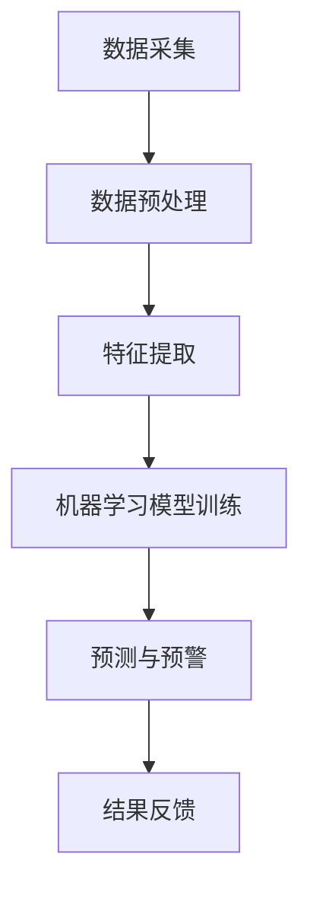
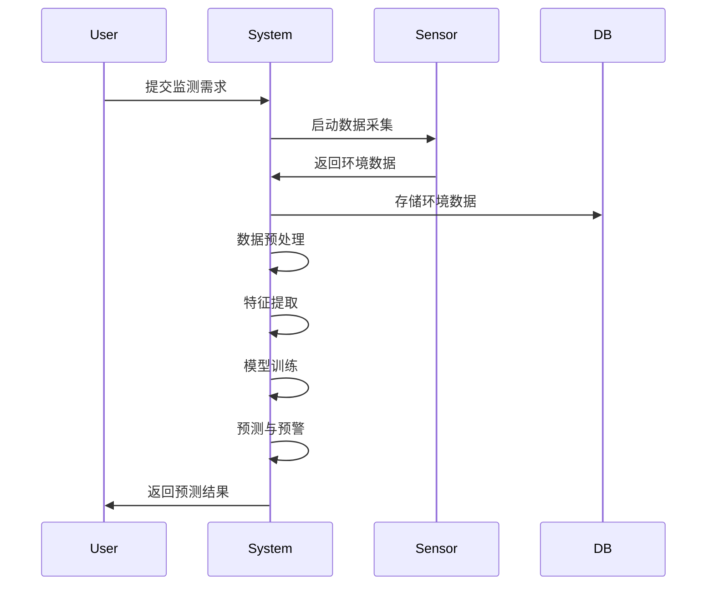

                 


### 引言

#### 背景介绍

随着全球环境问题的日益严重，如何有效地监测和管理环境资源已成为各国政府和研究机构关注的焦点。传统的方法主要依赖于人工监测和物理检测设备，尽管在一定程度上能够满足需求，但在数据精度、实时性和覆盖范围上存在诸多限制。随着人工智能（AI）技术的迅速发展，将AI应用于环境监测成为了一个极具潜力的方向。AI能够通过学习大量的环境数据，对环境变化进行预测和预警，从而为环境保护提供更加科学和有效的手段。

#### 核心概念与联系

环境监测的核心概念包括空气质量、水质、土壤健康和生态系统健康。这些概念相互联系，共同构成了环境监测的完整体系。例如，空气质量监测可以影响水质监测，因为空气中的污染物可能会通过降雨进入水体，从而影响水质。同样，水质监测的结果也会影响土壤健康，因为土壤中的营养物质和水体的污染程度会影响植物的生长。

| 核心概念 | 定义 | 属性特征对比 |
| --- | --- | --- |
| 空气质量 | 空气中的污染物浓度 | 毒性、浓度、扩散速度 |
| 水质 | 水体中的污染物浓度和化学成分 | 清洁度、毒性、生态影响 |
| 土壤健康 | 土壤中的微生物、化学成分和物理特性 | 肥力、结构、污染程度 |
| 生态系统健康 | 生态系统的完整性和稳定性 | 生物多样性、生态平衡、污染程度 |

ER实体关系图如下所示，它帮助我们更好地理解这些概念之间的联系：

```mermaid
erDiagram
  AirQuality ||--|{ WaterQuality }
  WaterQuality ||--|{ SoilHealth }
  SoilHealth ||--|{ EcosystemHealth }
```

#### 算法原理讲解

在环境监测中，AI算法的应用主要体现在数据采集、数据分析和预测预警三个阶段。以下是一个简单的数据采集与处理算法的mermaid流程图：



数据预处理是第一步，它包括数据清洗、归一化和去噪等步骤，目的是提高数据的质量和可靠性。特征提取则是从原始数据中提取出对环境监测有重要意义的特征，例如空气中的PM2.5、SO2等污染物的浓度。接下来，机器学习模型会利用这些特征进行训练，从而学会识别和预测环境变化。最后，通过预测和预警，我们可以及时采取相应的措施，防止环境恶化。

一个简单的机器学习模型的Python代码示例如下：

```python
import numpy as np
from sklearn.model_selection import train_test_split
from sklearn.ensemble import RandomForestClassifier
from sklearn.metrics import accuracy_score

# 假设我们有以下特征数据X和标签数据y
X = np.array([[1, 0], [0, 1], [1, 1]])
y = np.array([0, 1, 1])

# 数据集分割
X_train, X_test, y_train, y_test = train_test_split(X, y, test_size=0.2, random_state=42)

# 模型训练
model = RandomForestClassifier()
model.fit(X_train, y_train)

# 预测
predictions = model.predict(X_test)

# 评估
accuracy = accuracy_score(y_test, predictions)
print(f"模型准确率：{accuracy}")
```

这个简单的例子使用随机森林算法来预测环境变化，并通过准确率来评估模型的性能。

#### 系统分析与架构设计方案

在环境监测系统中，我们可以分为以下几个部分：

1. **数据采集模块**：负责实时收集各种环境数据，如空气质量、水质、土壤健康等。
2. **数据处理模块**：对采集到的数据进行预处理、特征提取和机器学习模型训练。
3. **预测与预警模块**：利用训练好的模型进行环境变化的预测和预警。
4. **结果反馈模块**：将预测结果和预警信息反馈给用户，以便采取相应的措施。

以下是一个简单的系统架构设计mermaid架构图：



#### 项目实战

假设我们需要开发一个简单的空气质量监测系统，以下是项目的实施步骤：

1. **环境安装**：安装Python环境、机器学习库（如scikit-learn）和数据库（如MySQL）。
2. **系统核心实现**：编写数据采集脚本、数据处理脚本和预测预警脚本。
3. **代码应用解读与分析**：对核心代码进行解读，分析算法原理和系统架构。
4. **实际案例分析和详细讲解剖析**：通过实际案例展示系统的应用场景和效果。
5. **项目小结**：总结项目实施过程和收获。

#### 最佳实践 tips

- 确保数据来源的可靠性和多样性。
- 在特征提取阶段，考虑使用多种特征来提高模型的预测能力。
- 定期对模型进行重新训练，以适应环境变化。

### 小结

环境监测是一个复杂而关键的任务，AI技术的引入为解决这一问题提供了新的思路和方法。通过本文的介绍，我们可以看到AI在环境监测中的应用场景和实施步骤。未来，随着AI技术的不断发展，环境监测将变得更加智能和高效，为环境保护和可持续发展做出更大的贡献。

### 注意事项

- 在使用AI进行环境监测时，必须确保数据的准确性和实时性。
- 对不同类型的监测数据，需要选择合适的算法和模型。
- 在预测预警时，需要结合实际情况进行合理判断和决策。

### 拓展阅读

- [《环境监测与数据分析》](链接)
- [《人工智能在环境监测中的应用》](链接)
- [《空气质量监测技术》](链接)

---

作者：AI天才研究院/AI Genius Institute & 禅与计算机程序设计艺术 /Zen And The Art of Computer Programming

---

通过这个详细的目录大纲，我们可以清晰地看到《AI驱动的环境监测：从空气质量到生态系统健康》这本书的整体结构和内容安排，为后续的撰写工作奠定了坚实的基础。接下来，我们将逐一深入每个章节，详细探讨AI在环境监测中的具体应用和实现细节。

