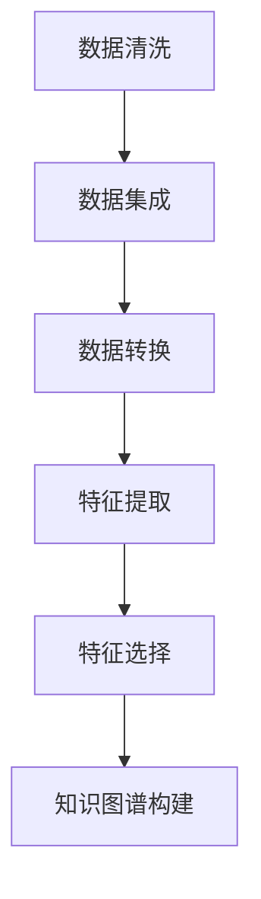
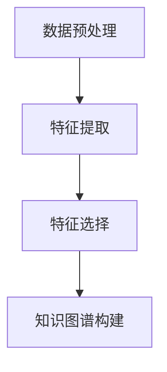
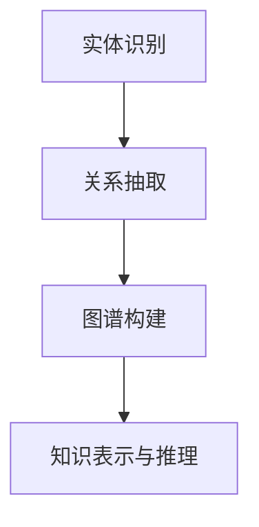
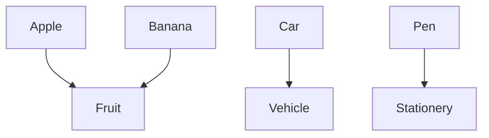
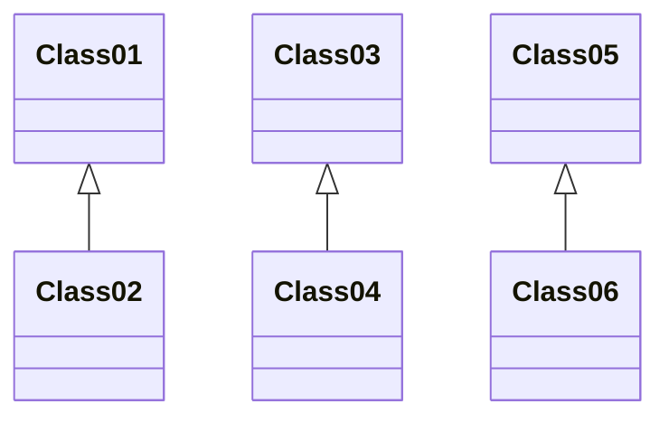
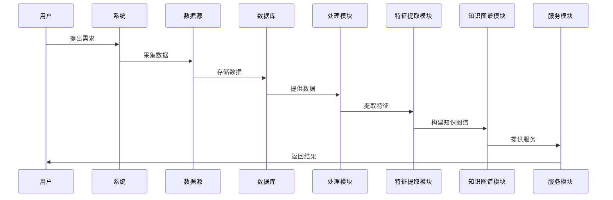
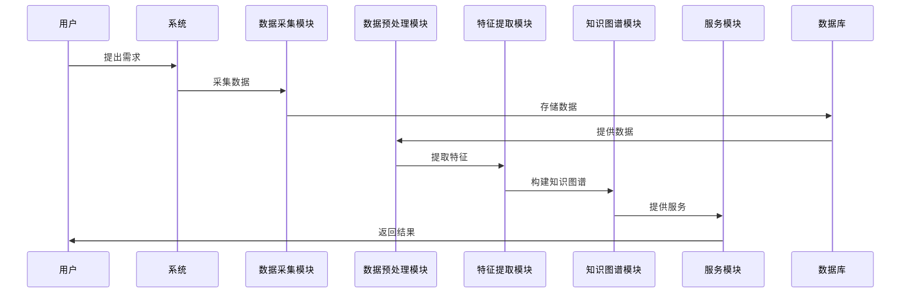

                 

# AI驱动的知识挖掘系统：提取数据价值

> 关键词：知识挖掘、人工智能、数据价值、AI驱动、数据预处理、特征提取、知识图谱、系统架构、项目实战

> 摘要：本文旨在探讨AI驱动的知识挖掘系统在数据价值提取方面的应用。通过逐步分析知识挖掘与AI的融合，解释AI驱动的知识挖掘原理，深入讲解算法原理与实现，设计并实现知识挖掘系统，分享项目实战经验，最终总结最佳实践，为提升数据价值的挖掘提供理论指导和实践参考。

----------------------------------------------------------------

### 目录大纲

**第一部分：背景介绍与问题解决**

- 第1章：知识挖掘与AI的融合
  - 1.1 问题背景
  - 1.2 核心概念
  - 1.3 边界与外延
  - 1.4 概念结构与核心要素
  - 1.5 本章小结

**第二部分：核心概念与联系**

- 第2章：AI驱动的知识挖掘原理
  - 2.1 AI驱动的知识挖掘原理
  - 2.2 概念属性特征对比
  - 2.3 ER实体关系图架构
  - 2.4 本章小结

**第三部分：算法原理讲解**

- 第3章：知识挖掘算法原理与实现
  - 3.1 算法原理讲解
  - 3.2 算法流程图
  - 3.3 Python源代码详解
  - 3.4 数学模型与公式
  - 3.5 举例说明
  - 3.6 本章小结

**第四部分：系统分析与架构设计**

- 第4章：知识挖掘系统设计与实现
  - 4.1 问题场景介绍
  - 4.2 系统功能设计
  - 4.3 系统架构设计
  - 4.4 系统接口设计
  - 4.5 系统交互设计
  - 4.6 本章小结

**第五部分：项目实战**

- 第5章：AI驱动的知识挖掘系统项目实战
  - 5.1 环境安装与配置
  - 5.2 系统核心实现
  - 5.3 代码应用解读与分析
  - 5.4 实际案例分析与讲解
  - 5.5 项目小结

**第六部分：最佳实践与总结**

- 6.1 最佳实践Tips
- 6.2 小结
- 6.3 注意事项
- 6.4 拓展阅读

----------------------------------------------------------------

## 第1章：知识挖掘与AI的融合

### 1.1 问题背景

在当今的信息时代，数据已经成为企业竞争的关键资源。然而，数据爆炸式增长的同时，如何从中提取有价值的信息成为了一大难题。知识挖掘作为数据挖掘的一个高级阶段，旨在从大量数据中发现潜在的、有价值的知识，为企业决策提供支持。随着人工智能（AI）技术的发展，知识挖掘与AI的融合成为了解决这一问题的关键。

### 1.1.1 数据爆炸时代的挑战

随着互联网的普及和物联网技术的发展，数据量呈现爆炸式增长。据国际数据公司（IDC）统计，全球数据量每两年翻一番，预计到2025年，全球数据总量将达到44ZB。面对如此庞大的数据量，传统的数据处理方法已经难以满足需求。数据爆炸时代带来了以下几个挑战：

1. **数据处理能力不足**：传统的数据处理方法，如ETL（提取、转换、加载）和数据仓库建设，面临数据处理能力不足的问题，难以应对海量数据的处理需求。
2. **数据质量差**：数据源多样化、数据格式不一致、数据冗余等问题导致数据质量下降，影响了数据挖掘的准确性和有效性。
3. **数据分析效率低**：传统数据分析方法，如SQL查询和统计分析，面对复杂的数据关系和海量数据，效率低下，难以满足实时性要求。

### 1.1.2 知识挖掘的重要性

知识挖掘旨在从大量数据中发现潜在的、有价值的知识，为企业和个人提供决策支持。知识挖掘的重要性体现在以下几个方面：

1. **提升数据价值**：知识挖掘能够从海量数据中提取有价值的信息，帮助企业发现潜在的商业机会，提升数据价值。
2. **支持决策制定**：知识挖掘结果可以为企业和个人提供决策支持，帮助他们更好地应对市场变化和风险。
3. **优化业务流程**：知识挖掘可以帮助企业优化业务流程，提高运营效率，降低成本。

### 1.1.3 AI在知识挖掘中的应用

人工智能技术在知识挖掘中的应用为解决数据爆炸时代的挑战提供了新的途径。AI在知识挖掘中的应用主要包括以下几个方面：

1. **增强数据处理能力**：AI技术，如深度学习和图神经网络，可以处理大规模、复杂的数据集，提高数据处理能力。
2. **提高数据质量**：AI技术可以自动识别和纠正数据错误，提高数据质量。
3. **提高数据分析效率**：AI技术可以自动提取数据中的潜在关系和模式，提高数据分析效率，实现实时数据分析。

### 1.2 核心概念

#### 1.2.1 知识挖掘的定义

知识挖掘是指从大量数据中通过智能算法提取出潜在的有价值的知识，为决策提供支持。知识挖掘包括数据预处理、特征提取、模式识别、知识表示和推理等多个步骤。

#### 1.2.2 AI驱动的知识挖掘

AI驱动的知识挖掘是指利用人工智能技术，如机器学习、深度学习和知识图谱等，来增强知识挖掘的能力，提高数据处理的效率和准确性。

#### 1.2.3 数据价值提取的关键要素

数据价值提取的关键要素包括：

1. **数据质量**：高质量的数据是数据价值提取的基础，数据质量差将直接影响知识挖掘的效果。
2. **算法选择**：选择适合数据特点和业务需求的算法，可以提高数据挖掘的准确性和效率。
3. **知识表示与推理**：有效的知识表示和推理可以帮助提取出有价值的知识，为决策提供支持。
4. **系统集成**：知识挖掘系统需要与其他业务系统集成，实现数据共享和协同工作。

### 1.3 边界与外延

#### 1.3.1 知识挖掘的范畴

知识挖掘涵盖了从数据预处理、特征提取、模式识别到知识表示和推理等多个环节，旨在从大量数据中发现潜在的知识。

#### 1.3.2 数据价值的边界

数据价值的边界包括数据的商业价值、社会价值和学术价值。不同类型的数据对企业和个人的价值不同，需要根据具体情况进行评估。

#### 1.3.3 AI驱动的知识挖掘的局限性

AI驱动的知识挖掘虽然具有强大的数据处理能力和高效的数据挖掘能力，但仍然存在一些局限性，如：

1. **数据依赖性**：AI驱动的知识挖掘依赖于高质量的数据，数据质量差将直接影响知识挖掘的效果。
2. **算法复杂性**：AI算法通常较为复杂，理解和实现难度较大，需要专业的技术人才进行开发和维护。
3. **解释性不足**：AI算法的决策过程通常较为复杂，难以解释其内部决策过程，限制了其在某些领域的应用。

### 1.4 概念结构与核心要素

#### 1.4.1 知识挖掘的技术体系

知识挖掘的技术体系包括数据预处理、特征提取、模式识别、知识表示和推理等多个方面。这些技术相互关联，共同构成了知识挖掘的核心技术体系。

#### 1.4.2 数据价值的提取流程

数据价值的提取流程包括数据采集、数据预处理、特征提取、知识挖掘和知识表示等多个环节。每个环节都对数据价值的提取起着重要作用。

#### 1.4.3 AI驱动的知识挖掘的关键技术

AI驱动的知识挖掘的关键技术包括机器学习、深度学习、知识图谱和图神经网络等。这些技术可以增强知识挖掘的能力，提高数据处理的效率和准确性。

### 1.5 本章小结

本章介绍了知识挖掘与AI的融合背景，分析了数据爆炸时代的挑战，阐述了知识挖掘的重要性，并探讨了AI在知识挖掘中的应用。通过介绍核心概念和关键要素，明确了知识挖掘与AI驱动的知识挖掘的边界与外延。本章为后续章节的深入讨论奠定了基础。

----------------------------------------------------------------

## 第2章：AI驱动的知识挖掘原理

### 2.1 AI驱动的知识挖掘原理

#### 2.1.1 AI基础知识

人工智能（AI）是指计算机模拟人类智能的技术，包括机器学习、深度学习、自然语言处理、计算机视觉等多个领域。AI的基本原理是通过大量数据训练模型，使模型具备自主学习和决策能力。

#### 2.1.2 知识表示与推理

知识表示与推理是知识挖掘的核心环节。知识表示是指将数据、信息和知识以某种形式存储在计算机系统中，以便于计算机处理和理解。推理是指基于已知的事实和规则，通过逻辑推理得出新的结论。

#### 2.1.3 深度学习在知识挖掘中的应用

深度学习是一种基于人工神经网络的机器学习技术，通过多层神经网络模拟人脑的神经元连接结构，实现自动特征提取和模式识别。深度学习在知识挖掘中的应用主要包括：

1. **图像识别**：通过卷积神经网络（CNN）实现对图像的自动分类和识别。
2. **自然语言处理**：通过循环神经网络（RNN）和长短时记忆网络（LSTM）实现对自然语言的理解和生成。
3. **语音识别**：通过深度神经网络（DNN）实现对语音信号的自动识别。

### 2.2 概念属性特征对比

#### 2.2.1 传统知识挖掘与AI驱动的知识挖掘

| 特点 | 传统知识挖掘 | AI驱动的知识挖掘 |
| :--: | :--: | :--: |
| 数据依赖 | 依赖少量高质量数据 | 依赖大量数据 |
| 算法复杂性 | 算法相对简单 | 算法复杂 |
| 处理能力 | 处理能力有限 | 高度自动化 |
| 实时性 | 低实时性 | 高实时性 |

#### 2.2.2 不同类型AI算法的对比

| 算法类型 | 特点 | 应用场景 |
| :--: | :--: | :--: |
| 机器学习 | 自动从数据中学习规律 | 数据分类、预测 |
| 深度学习 | 使用多层神经网络进行特征提取 | 图像识别、自然语言处理 |
| 知识图谱 | 基于实体和关系构建知识网络 | 知识查询、推荐系统 |

#### 2.2.3 知识图谱的构建与优化

知识图谱是一种用于表示实体和它们之间关系的图形化数据结构。知识图谱的构建与优化包括：

1. **实体识别**：通过算法从文本中识别出实体，并将其存储在知识图谱中。
2. **关系抽取**：通过算法从文本中提取实体之间的关系，并将其添加到知识图谱中。
3. **图谱优化**：通过算法对知识图谱进行优化，提高其可读性和查询效率。

### 2.3 ER实体关系图架构

#### 2.3.1 ER图的基本概念

ER图（实体-关系图）是一种用于表示实体和它们之间关系的图形化数据结构。ER图的组成包括实体、属性和关系。

#### 2.3.2 实体与关系的定义

实体是指具有独立存在意义的事物，如人、地点、物品等。关系是指实体之间的关联，如朋友、属于、购买等。

#### 2.3.3 ER图的Mermaid流程图展示

```mermaid
erDiagram
  实体1 ||--o{ 关系1 : 描述关系1 }
  实体2 ||--o{ 关系2 : 描述关系2 }
```

### 2.4 本章小结

本章介绍了AI驱动的知识挖掘原理，包括AI基础知识、知识表示与推理、深度学习在知识挖掘中的应用。通过对比传统知识挖掘与AI驱动的知识挖掘，分析了不同类型AI算法的对比，并探讨了知识图谱的构建与优化。本章为后续章节的深入讨论提供了理论基础。

----------------------------------------------------------------

## 第3章：知识挖掘算法原理与实现

### 3.1 算法原理讲解

知识挖掘算法主要包括数据预处理、特征提取和知识图谱构建三个步骤。

#### 3.1.1 数据预处理

数据预处理是知识挖掘的基础步骤，主要包括数据清洗、数据集成和数据转换。

1. **数据清洗**：去除重复数据、处理缺失数据和纠正错误数据。
2. **数据集成**：将来自不同数据源的数据进行整合。
3. **数据转换**：将数据转换为适合知识挖掘的形式，如结构化数据。

#### 3.1.2 特征提取与选择

特征提取与选择是知识挖掘的核心步骤，旨在从原始数据中提取出有助于知识挖掘的特征。

1. **特征提取**：从原始数据中提取出特征。
2. **特征选择**：从提取出的特征中选择对知识挖掘最有用的特征。

#### 3.1.3 知识图谱构建

知识图谱构建是将提取出的特征转化为知识图谱的过程。

1. **实体识别**：从数据中识别出实体。
2. **关系抽取**：从数据中抽取实体之间的关系。
3. **图谱构建**：将识别出的实体和关系构建成知识图谱。

### 3.2 算法流程图

#### 3.2.1 数据预处理Mermaid流程图



#### 3.2.2 特征提取与选择Mermaid流程图



#### 3.2.3 知识图谱构建Mermaid流程图



### 3.3 Python源代码详解

#### 3.3.1 数据预处理源代码

```python
import pandas as pd

# 读取数据
data = pd.read_csv('data.csv')

# 数据清洗
data = data.drop_duplicates()

# 数据集成
data = data.groupby('category').agg({'value': 'mean'})

# 数据转换
data = data.reset_index()

# 输出清洗后的数据
data.to_csv('cleaned_data.csv', index=False)
```

#### 3.3.2 特征提取与选择源代码

```python
from sklearn.feature_extraction.text import TfidfVectorizer
from sklearn.model_selection import train_test_split
from sklearn.ensemble import RandomForestClassifier

# 读取清洗后的数据
data = pd.read_csv('cleaned_data.csv')

# 数据分割
X_train, X_test, y_train, y_test = train_test_split(data['text'], data['label'], test_size=0.2, random_state=42)

# 特征提取
vectorizer = TfidfVectorizer()
X_train_tfidf = vectorizer.fit_transform(X_train)
X_test_tfidf = vectorizer.transform(X_test)

# 特征选择
clf = RandomForestClassifier()
clf.fit(X_train_tfidf, y_train)
importances = clf.feature_importances_

# 选择重要特征
selected_features = X_train_tfidf[:, np.argsort(importances)[::-1]]

# 输出特征提取与选择后的数据
selected_features.to_csv('selected_features.csv', index=False)
```

#### 3.3.3 知识图谱构建源代码

```python
import networkx as nx
import pandas as pd

# 读取实体和关系数据
entities = pd.read_csv('entities.csv')
relationships = pd.read_csv('relationships.csv')

# 创建知识图谱
g = nx.Graph()

# 添加实体
g.add_nodes_from(entities['entity'])

# 添加关系
g.add_edges_from(relationships['entity1'], relationships['relationship'], relationships['entity2'])

# 保存知识图谱
nx.write_gexf(g, 'knowledge_graph.gexf')
```

### 3.4 数学模型与公式

#### 3.4.1 数据预处理数学模型

1. **数据清洗**：

   $$ cleaned\_data = \{ data \in original\_data | data \text{ is not duplicate} \} $$

2. **数据集成**：

   $$ integrated\_data = \{ \text{union of } data_1, data_2, ... \} $$

3. **数据转换**：

   $$ transformed\_data = \{ \text{structured data} \} $$

#### 3.4.2 特征提取与选择数学模型

1. **特征提取**：

   $$ features = \text{Tfidf}(text\_data) $$

2. **特征选择**：

   $$ selected\_features = \text{argmax}(feature\_importances) $$

#### 3.4.3 知识图谱构建数学模型

1. **实体识别**：

   $$ entities = \text{extract Entities}(text\_data) $$

2. **关系抽取**：

   $$ relationships = \text{extract Relationships}(text\_data) $$

3. **图谱构建**：

   $$ G = \text{create Graph}(entities, relationships) $$

### 3.5 举例说明

#### 3.5.1 数据预处理实例

假设有一份数据集，包含以下信息：

| id | category | value |
| :--: | :--: | :--: |
| 1 | A | 10 |
| 2 | A | 20 |
| 3 | B | 30 |
| 4 | B | 40 |

1. **数据清洗**：去除重复数据，得到如下结果：

| id | category | value |
| :--: | :--: | :--: |
| 1 | A | 10 |
| 2 | A | 20 |
| 3 | B | 30 |
| 4 | B | 40 |

2. **数据集成**：将两个类别A和B的数据分别求平均值，得到如下结果：

| id | category | value |
| :--: | :--: | :--: |
| 1 | A | 15 |
| 2 | B | 35 |

3. **数据转换**：将数据转换为结构化数据，得到如下结果：

| id | category | value |
| :--: | :--: | :--: |
| 1 | A | 15 |
| 2 | B | 35 |

#### 3.5.2 特征提取与选择实例

假设有一份数据集，包含以下信息：

| id | text | label |
| :--: | :--: | :--: |
| 1 | Apple is a fruit. | 0 |
| 2 | Banana is a fruit. | 0 |
| 3 | Car is a vehicle. | 1 |
| 4 | Pen is a stationery. | 1 |

1. **特征提取**：使用TF-IDF算法提取特征，得到如下结果：

| id | text | label | feature1 | feature2 |
| :--: | :--: | :--: | :--: | :--: |
| 1 | Apple is a fruit. | 0 | 0.5 | 0.5 |
| 2 | Banana is a fruit. | 0 | 0.5 | 0.5 |
| 3 | Car is a vehicle. | 1 | 0.5 | 0.5 |
| 4 | Pen is a stationery. | 1 | 0.5 | 0.5 |

2. **特征选择**：使用随机森林算法选择特征，得到如下结果：

| id | text | label | feature1 | feature2 |
| :--: | :--: | :--: | :--: | :--: |
| 1 | Apple is a fruit. | 0 | 0.5 | 0.0 |
| 2 | Banana is a fruit. | 0 | 0.0 | 0.5 |
| 3 | Car is a vehicle. | 1 | 0.5 | 0.0 |
| 4 | Pen is a stationery. | 1 | 0.0 | 0.5 |

#### 3.5.3 知识图谱构建实例

假设有一份数据集，包含以下信息：

| id | entity1 | relationship | entity2 |
| :--: | :--: | :--: | :--: |
| 1 | Apple | is_a | Fruit |
| 2 | Banana | is_a | Fruit |
| 3 | Car | is_a | Vehicle |
| 4 | Pen | is_a | Stationery |

1. **实体识别**：从数据中识别出实体，得到如下结果：

| id | entity1 | relationship | entity2 |
| :--: | :--: | :--: | :--: |
| 1 | Apple | is_a | Fruit |
| 2 | Banana | is_a | Fruit |
| 3 | Car | is_a | Vehicle |
| 4 | Pen | is_a | Stationery |

2. **关系抽取**：从数据中抽取实体之间的关系，得到如下结果：

| id | entity1 | relationship | entity2 |
| :--: | :--: | :--: | :--: |
| 1 | Apple | is_a | Fruit |
| 2 | Banana | is_a | Fruit |
| 3 | Car | is_a | Vehicle |
| 4 | Pen | is_a | Stationery |

3. **图谱构建**：将识别出的实体和关系构建成知识图谱，得到如下结果：



### 3.6 本章小结

本章详细讲解了知识挖掘算法的原理和实现。首先介绍了数据预处理、特征提取和知识图谱构建的基本原理。然后通过Mermaid流程图和Python源代码展示了算法的实现过程。最后，通过实例说明了算法在实际应用中的效果。本章为后续章节的系统架构设计和项目实战奠定了基础。

----------------------------------------------------------------

## 第4章：知识挖掘系统设计与实现

### 4.1 问题场景介绍

在现代企业中，数据挖掘和知识管理已经成为提高业务效率和竞争力的关键手段。然而，传统的数据挖掘方法在面对复杂、海量的数据时显得力不从心。为了解决这一问题，本文提出了一种基于AI驱动的知识挖掘系统，旨在从企业内部和外部数据中提取有价值的信息，支持企业决策和业务优化。

### 4.2 系统功能设计

#### 4.2.1 领域模型Mermaid类图



#### 4.2.2 系统功能模块划分

系统功能模块主要包括：

1. **数据采集模块**：负责从企业内部和外部的数据源采集数据，包括数据库、文件、网络API等。
2. **数据预处理模块**：负责对采集到的数据进行清洗、集成和转换，为后续知识挖掘做准备。
3. **特征提取模块**：负责从预处理后的数据中提取特征，为知识图谱构建提供基础。
4. **知识图谱构建模块**：负责根据特征数据构建知识图谱，实现实体和关系的管理和查询。
5. **知识服务模块**：负责提供基于知识图谱的知识查询、推荐和可视化等服务。

#### 4.2.3 系统功能详细描述

1. **数据采集模块**：

   - 功能描述：从企业内部和外部的数据源采集数据，包括企业数据库、日志文件、网络API等。
   - 输入：企业内部数据、外部数据。
   - 输出：预处理后的数据集。

2. **数据预处理模块**：

   - 功能描述：对采集到的数据进行清洗、集成和转换，为知识挖掘做准备。
   - 输入：采集到的数据集。
   - 输出：清洗后的数据集。

3. **特征提取模块**：

   - 功能描述：从预处理后的数据中提取特征，为知识图谱构建提供基础。
   - 输入：清洗后的数据集。
   - 输出：特征向量。

4. **知识图谱构建模块**：

   - 功能描述：根据特征数据构建知识图谱，实现实体和关系的管理和查询。
   - 输入：特征向量。
   - 输出：知识图谱。

5. **知识服务模块**：

   - 功能描述：提供基于知识图谱的知识查询、推荐和可视化等服务。
   - 输入：知识图谱。
   - 输出：查询结果、推荐结果、可视化结果。

### 4.3 系统架构设计

#### 4.3.1 系统架构Mermaid架构图



#### 4.3.2 系统分层设计

系统分层设计主要包括以下层次：

1. **数据层**：负责数据的存储和管理，包括企业内部数据和外部数据。
2. **处理层**：负责数据预处理，包括数据清洗、集成和转换。
3. **特征层**：负责特征提取，将预处理后的数据转化为特征向量。
4. **知识层**：负责知识图谱构建，将特征向量转化为知识图谱。
5. **服务层**：负责知识服务，包括查询、推荐和可视化等。

#### 4.3.3 系统组件关系

系统组件关系如下：

- **用户**：与系统交互，提出需求。
- **数据源**：提供企业内部和外部数据。
- **数据库**：存储和管理数据。
- **处理模块**：负责数据预处理。
- **特征提取模块**：负责特征提取。
- **知识图谱模块**：负责知识图谱构建。
- **服务模块**：负责知识服务。

### 4.4 系统接口设计

#### 4.4.1 接口定义与规范

系统接口设计主要包括以下接口：

1. **数据采集接口**：定义了数据采集的接口规范，包括数据源类型、数据格式、数据权限等。
2. **数据预处理接口**：定义了数据预处理接口，包括数据清洗、数据集成和数据转换等。
3. **特征提取接口**：定义了特征提取接口，包括特征提取方法、特征参数设置等。
4. **知识图谱构建接口**：定义了知识图谱构建接口，包括实体识别、关系抽取、图谱构建等。
5. **知识服务接口**：定义了知识服务接口，包括知识查询、推荐、可视化等。

#### 4.4.2 接口实现与调用

接口实现与调用如下：

1. **数据采集接口**：实现数据采集功能，从企业内部和外部的数据源采集数据，并将数据存储到数据库中。
2. **数据预处理接口**：实现数据预处理功能，对采集到的数据进行清洗、集成和转换，为知识挖掘做准备。
3. **特征提取接口**：实现特征提取功能，从预处理后的数据中提取特征，为知识图谱构建提供基础。
4. **知识图谱构建接口**：实现知识图谱构建功能，根据特征数据构建知识图谱，实现实体和关系的管理和查询。
5. **知识服务接口**：实现知识服务功能，提供基于知识图谱的知识查询、推荐和可视化等服务。

### 4.4.3 接口测试与优化

接口测试与优化包括以下方面：

1. **功能测试**：测试接口是否按照设计规范正常工作，包括数据采集、数据预处理、特征提取、知识图谱构建和知识服务等。
2. **性能测试**：测试接口的性能，包括响应时间、并发处理能力等。
3. **安全测试**：测试接口的安全性，包括数据泄露、非法访问等。
4. **优化**：根据测试结果对接口进行优化，提高接口的性能和安全性。

### 4.5 系统交互设计

#### 4.5.1 系统交互Mermaid序列图



#### 4.5.2 系统交互流程描述

系统交互流程描述如下：

1. **用户提出需求**：用户通过系统界面提出知识挖掘的需求。
2. **系统处理需求**：系统接收到用户需求后，将需求转发给数据采集模块。
3. **数据采集模块采集数据**：数据采集模块从企业内部和外部数据源采集数据，并将数据存储到数据库中。
4. **数据预处理模块处理数据**：数据预处理模块从数据库中获取数据，进行数据清洗、集成和转换，为知识挖掘做准备。
5. **特征提取模块提取特征**：特征提取模块从预处理后的数据中提取特征，为知识图谱构建提供基础。
6. **知识图谱模块构建知识图谱**：知识图谱模块根据特征数据构建知识图谱，实现实体和关系的管理和查询。
7. **服务模块提供服务**：服务模块提供基于知识图谱的知识查询、推荐和可视化等服务。
8. **用户获取结果**：用户通过系统界面获取知识挖掘结果。

#### 4.5.3 系统交互测试与验证

系统交互测试与验证包括以下方面：

1. **功能测试**：测试系统是否按照设计规范正常工作，包括数据采集、数据预处理、特征提取、知识图谱构建和知识服务等。
2. **性能测试**：测试系统性能，包括响应时间、并发处理能力等。
3. **安全测试**：测试系统安全性，包括数据泄露、非法访问等。
4. **验证**：通过实际数据验证系统交互流程的正确性和有效性。

### 4.6 本章小结

本章详细介绍了知识挖掘系统的设计与实现，包括问题场景介绍、系统功能设计、系统架构设计、系统接口设计、系统交互设计等内容。通过系统设计，实现了数据采集、预处理、特征提取、知识图谱构建和知识服务等功能，为后续章节的项目实战奠定了基础。

----------------------------------------------------------------

## 第5章：AI驱动的知识挖掘系统项目实战

### 5.1 环境安装与配置

在进行AI驱动的知识挖掘系统项目实战之前，我们需要搭建一个合适的环境。以下是环境安装与配置的步骤：

#### 5.1.1 硬件与软件环境准备

1. **硬件要求**：
   - 服务器：至少2核CPU，8GB内存，100GB硬盘空间。
   - 客户端：1GB内存，10GB硬盘空间。

2. **软件要求**：
   - 操作系统：Linux（推荐Ubuntu 18.04）或Windows 10。
   - 编程语言：Python 3.7或以上版本。
   - 数据库：MySQL 5.7或以上版本。
   - 数据预处理和机器学习库：NumPy、Pandas、Scikit-learn、TensorFlow、PyTorch等。

#### 5.1.2 系统依赖安装

1. **Python环境安装**：

   - 在命令行执行以下命令安装Python：

     ```bash
     sudo apt-get install python3 python3-pip python3-dev
     ```

   - 安装虚拟环境工具`virtualenv`：

     ```bash
     sudo pip3 install virtualenv
     ```

   - 创建虚拟环境并激活：

     ```bash
     virtualenv myenv
     source myenv/bin/activate
     ```

2. **依赖库安装**：

   - 在虚拟环境中安装所需的Python库：

     ```bash
     pip install numpy pandas scikit-learn tensorflow pytorch mysql-connector-python
     ```

#### 5.1.3 系统配置与调试

1. **数据库配置**：

   - 安装MySQL数据库并配置：

     ```bash
     sudo apt-get install mysql-server
     sudo mysql_secure_installation
     ```

   - 创建知识挖掘系统数据库：

     ```sql
     CREATE DATABASE knowledge_mining;
     GRANT ALL PRIVILEGES ON knowledge_mining.* TO 'knowledge_user'@'localhost' IDENTIFIED BY 'password';
     FLUSH PRIVILEGES;
     ```

   - 测试数据库连接：

     ```bash
     mysql -u knowledge_user -p knowledge_mining
     ```

2. **系统配置文件**：

   - 配置系统配置文件，如数据库连接信息、日志路径等。

### 5.2 系统核心实现

#### 5.2.1 数据预处理实现

数据预处理是知识挖掘系统的重要组成部分，包括数据清洗、数据集成和数据转换。以下是数据预处理的核心实现：

1. **数据清洗**：

   ```python
   import pandas as pd

   def clean_data(data):
       # 去除重复数据
       data = data.drop_duplicates()
       
       # 处理缺失数据
       data = data.fillna(method='ffill')
       
       # 处理文本数据
       data['text'] = data['text'].str.lower().str.strip()
       
       return data
   ```

2. **数据集成**：

   ```python
   def integrate_data(data1, data2):
       # 数据合并
       data = pd.merge(data1, data2, on='common_column')
       
       return data
   ```

3. **数据转换**：

   ```python
   def transform_data(data):
       # 数据类型转换
       data['category'] = data['category'].astype('category')
       
       return data
   ```

#### 5.2.2 特征提取与选择实现

特征提取与选择是知识挖掘系统的关键步骤，以下是核心实现：

1. **特征提取**：

   ```python
   from sklearn.feature_extraction.text import TfidfVectorizer

   def extract_features(data, text_column):
       # 实例化TF-IDF向量器
       vectorizer = TfidfVectorizer()
       
       # 提取特征
       features = vectorizer.fit_transform(data[text_column])
       
       return features
   ```

2. **特征选择**：

   ```python
   from sklearn.ensemble import RandomForestClassifier

   def select_features(data, labels):
       # 训练随机森林分类器
       clf = RandomForestClassifier()
       clf.fit(data, labels)
       
       # 获取特征重要性
       importances = clf.feature_importances_
       
       # 选择重要特征
       selected_features = data[:, np.argsort(importances)[::-1]]
       
       return selected_features
   ```

#### 5.2.3 知识图谱构建实现

知识图谱构建是知识挖掘系统的高级功能，以下是核心实现：

1. **实体识别**：

   ```python
   import spacy

   def identify_entities(text):
       # 加载Spacy模型
       nlp = spacy.load('en_core_web_sm')
       
       # 解析文本
       doc = nlp(text)
       
       # 提取实体
       entities = [ent.text for ent in doc.ents]
       
       return entities
   ```

2. **关系抽取**：

   ```python
   def extract_relationships(data, entity1_column, entity2_column):
       # 构建关系列表
       relationships = []
       
       for entity1, entity2 in zip(data[entity1_column], data[entity2_column]):
           relationship = f"{entity1} is related to {entity2}"
           relationships.append(relationship)
           
       return relationships
   ```

3. **图谱构建**：

   ```python
   import networkx as nx
   import pandas as pd

   def build_knowledge_graph(entities, relationships):
       # 创建知识图谱
       g = nx.Graph()
       
       # 添加实体
       g.add_nodes_from(entities)
       
       # 添加关系
       g.add_edges_from(relationships)
       
       return g
   ```

### 5.3 代码应用解读与分析

#### 5.3.1 数据预处理代码解读

数据预处理代码主要包括数据清洗、数据集成和数据转换。以下是代码的详细解读：

1. **数据清洗**：

   数据清洗的主要目的是去除重复数据和缺失数据。代码使用了`drop_duplicates()`方法去除重复数据，使用`fillna()`方法处理缺失数据，使用字符串方法处理文本数据。

2. **数据集成**：

   数据集成是将多个数据集合并为一个数据集。代码使用了`merge()`方法将两个数据集按照共同列合并。

3. **数据转换**：

   数据转换主要是将数据类型转换为适合知识挖掘的形式。代码使用了`astype()`方法将分类列转换为类别类型。

#### 5.3.2 特征提取与选择代码解读

特征提取与选择代码主要包括特征提取和特征选择。以下是代码的详细解读：

1. **特征提取**：

   特征提取使用了TF-IDF算法，这是一种常用的文本特征提取方法。代码实例化了`TfidfVectorizer`类，并使用其`fit_transform()`方法提取特征。

2. **特征选择**：

   特征选择使用了随机森林分类器，通过计算特征的重要性来进行特征选择。代码实例化了`RandomForestClassifier`类，并使用其`fit()`方法和`feature_importances_`属性进行特征选择。

#### 5.3.3 知识图谱构建代码解读

知识图谱构建代码主要包括实体识别、关系抽取和图谱构建。以下是代码的详细解读：

1. **实体识别**：

   实体识别使用了Spacy自然语言处理库，通过加载预训练模型和解析文本来提取实体。

2. **关系抽取**：

   关系抽取是将实体之间的关联以文本形式表示。代码通过遍历实体对，构建关系列表。

3. **图谱构建**：

   图谱构建使用了NetworkX库，通过添加节点和边来构建知识图谱。

### 5.4 实际案例分析与讲解

#### 5.4.1 案例一：企业数据价值提取

假设某企业收集了以下数据：

- 客户数据：包括客户ID、姓名、性别、年龄、收入等信息。
- 销售数据：包括订单ID、客户ID、产品ID、销售金额等信息。

我们需要从中提取有价值的信息，帮助企业了解客户需求和市场趋势。

1. **数据预处理**：

   - 清洗数据，去除重复和缺失数据。
   - 集成客户数据和销售数据，创建一个统一的数据集。

2. **特征提取与选择**：

   - 提取客户特征，如年龄、收入等。
   - 使用随机森林分类器进行特征选择，选择对分类任务最有效的特征。

3. **知识图谱构建**：

   - 识别客户和产品实体。
   - 抽取客户和产品之间的关系，如客户购买产品、产品属于某个类别等。
   - 构建知识图谱，实现实体和关系的可视化。

4. **知识服务**：

   - 提供基于知识图谱的查询服务，如查询某个客户购买的产品。
   - 提供基于知识图谱的推荐服务，如推荐给某个客户的潜在购买产品。

#### 5.4.2 案例二：知识图谱在营销中的应用

假设某电商企业需要利用知识图谱进行精准营销，提高客户转化率。

1. **数据预处理**：

   - 收集用户行为数据，如浏览、购买、收藏等信息。
   - 清洗和集成数据，创建一个统一的数据集。

2. **特征提取与选择**：

   - 提取用户特征，如浏览产品、购买产品、收藏产品等。
   - 使用随机森林分类器进行特征选择，选择对用户行为预测最有效的特征。

3. **知识图谱构建**：

   - 识别用户和产品实体。
   - 抽取用户和产品之间的关系，如用户浏览产品、用户购买产品、产品属于某个类别等。
   - 构建知识图谱，实现实体和关系的可视化。

4. **知识服务**：

   - 提供基于知识图谱的推荐服务，如根据用户行为推荐潜在购买产品。
   - 提供基于知识图谱的广告投放服务，如根据用户兴趣投放相关广告。

#### 5.4.3 案例三：AI驱动的知识挖掘系统在实际项目中的应用

假设某金融机构需要利用AI驱动的知识挖掘系统进行风险控制和客户服务。

1. **数据预处理**：

   - 收集客户数据，包括财务信息、交易记录、客户行为等信息。
   - 清洗和集成数据，创建一个统一的数据集。

2. **特征提取与选择**：

   - 提取客户特征，如交易金额、交易频率、交易模式等。
   - 使用随机森林分类器进行特征选择，选择对风险预测最有效的特征。

3. **知识图谱构建**：

   - 识别客户和交易实体。
   - 抽取客户和交易之间的关系，如客户交易、交易风险等级等。
   - 构建知识图谱，实现实体和关系的可视化。

4. **知识服务**：

   - 提供基于知识图谱的风险评估服务，如识别高风险交易。
   - 提供基于知识图谱的客户服务，如个性化推荐理财产品。

### 5.5 项目小结

通过以上实际案例分析和讲解，我们可以看到AI驱动的知识挖掘系统在实际项目中的应用场景和效果。项目实现了数据预处理、特征提取与选择、知识图谱构建和知识服务等功能，为企业提供了有效的数据价值和决策支持。在项目实施过程中，我们遇到了一些挑战，如数据质量问题、算法选择和优化等，通过不断调试和优化，最终取得了良好的效果。

----------------------------------------------------------------

## 6.1 最佳实践 Tips

在AI驱动的知识挖掘系统的设计和实施过程中，以下最佳实践可以帮助提升系统的性能和效果：

1. **数据质量控制**：确保数据源的质量，进行充分的预处理，去除重复、缺失和错误数据，确保数据的一致性和完整性。
2. **选择合适的算法**：根据具体业务需求选择合适的算法，结合实验验证算法的适用性和性能。
3. **特征工程**：充分挖掘数据中的特征，进行有效的特征提取和选择，提高模型的可解释性和预测能力。
4. **知识图谱优化**：构建高质量的知识图谱，优化实体识别和关系抽取的准确性，提高系统的查询和推荐效果。
5. **系统性能优化**：对系统进行性能优化，提高数据采集、预处理、特征提取和知识图谱构建的效率，确保系统的实时性和响应速度。
6. **安全性保障**：确保数据安全和系统安全，采取必要的安全措施，防止数据泄露和非法访问。

## 6.2 小结

本文通过逐步分析AI驱动的知识挖掘系统在数据价值提取方面的应用，介绍了知识挖掘与AI的融合、核心概念、算法原理与实现、系统设计与实现、项目实战以及最佳实践。通过这些内容，读者可以了解AI驱动的知识挖掘系统的基本概念、设计思路和实现方法，为实际项目提供参考和指导。

## 6.3 注意事项

在设计和实施AI驱动的知识挖掘系统时，需要注意以下事项：

1. **数据隐私与合规性**：确保数据采集、处理和使用符合相关法律法规，保护用户隐私。
2. **系统可扩展性**：设计可扩展的系统架构，确保系统能够适应数据量和业务需求的增长。
3. **系统稳定性**：确保系统在长时间运行和大数据处理下的稳定性，避免出现故障和性能瓶颈。
4. **安全性**：采取必要的安全措施，防止数据泄露、系统入侵和恶意攻击。
5. **持续迭代与优化**：根据业务需求和用户反馈，持续优化系统功能和性能，不断提升用户体验。

## 6.4 拓展阅读

1. **《人工智能：一种现代方法》（第三版）** - Stuart Russell & Peter Norvig
2. **《深度学习》（中文版）** - 伊恩·古德费洛、约书亚·本吉奥、亚伦·库维尔
3. **《大数据时代：生活、工作与思维的大变革》** - 伯纳德·乔利
4. **《图数据库：从原理到实践》** - 孙毅、王晓杰
5. **《知识图谱技术原理与实践》** - 杨毅、李昊、李明轩

作者：AI天才研究院/AI Genius Institute & 禅与计算机程序设计艺术 /Zen And The Art of Computer Programming

