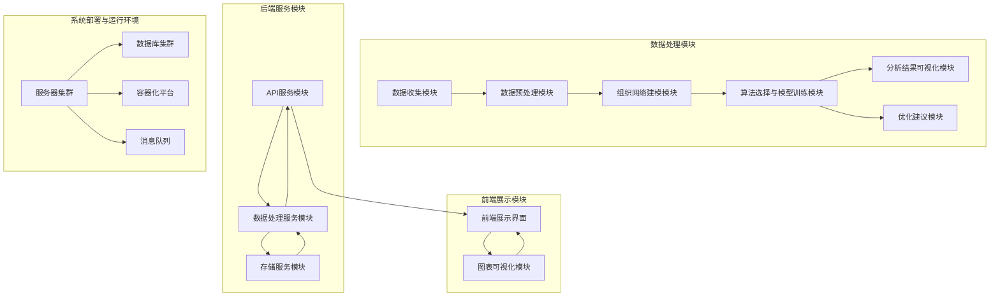
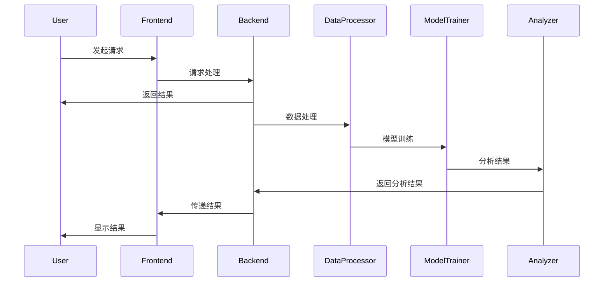

                 

### 文章标题：AI驱动的组织网络分析：优化企业结构与协作

#### 关键词：人工智能、组织网络分析、企业优化、协作、算法

> 摘要：本文旨在探讨人工智能在组织网络分析中的应用，通过详细介绍AI驱动的组织网络分析技术，帮助企业优化组织结构和协作效率。我们将逐步分析AI驱动的组织网络分析的基础概念、方法、实践，以期为企业和组织提供切实可行的优化方案。

### 目录大纲

----------------------------------------------------------------

## 第一部分：问题背景与概述

### 第1章：问题背景

### 第2章：AI驱动的组织网络分析概述

### 第3章：本书结构安排与内容概述

## 第二部分：AI驱动的组织网络分析基础

### 第4章：数据收集与预处理

### 第5章：数据集构建

### 第6章：数据预处理工具与库

### 第7章：数据预处理实践案例

## 第三部分：AI驱动的组织网络分析方法

### 第8章：基于机器学习的组织网络分析方法

### 第9章：基于深度学习的组织网络分析方法

## 第四部分：系统分析与架构设计方案

### 第10章：问题场景介绍

### 第11章：系统功能设计

### 第12章：系统架构设计

### 第13章：系统接口设计与系统交互

## 第五部分：项目实战

### 第14章：环境安装

### 第15章：系统核心实现与代码应用解读

### 第16章：实际案例分析与详细讲解

### 第17章：项目小结

## 第六部分：最佳实践 tips、小结、注意事项、拓展阅读

----------------------------------------------------------------

### 第一部分：问题背景与概述

#### 第1章：问题背景

随着全球经济的不断发展和企业竞争的日益激烈，组织结构的优化和协作效率的提升成为许多企业关注的焦点。传统的组织网络分析往往依赖于手工操作和经验判断，不仅效率低下，而且容易受到主观因素的影响。而随着人工智能技术的不断发展，AI驱动的组织网络分析逐渐成为一种新的趋势。

**1.1 企业组织网络分析的重要性**

企业组织网络分析是指通过对企业内部组织结构、人员关系、信息流动等数据的分析，揭示企业内部运作的规律和问题，从而为企业优化组织结构和提升协作效率提供科学依据。具体来说，企业组织网络分析的重要性体现在以下几个方面：

1. **优化组织结构**：通过分析组织网络中的关键节点和关系，发现企业内部的瓶颈和冗余，从而优化组织结构，提升企业的运营效率。
2. **提升协作效率**：通过分析组织网络中的信息流动和人员关系，发现协作中的障碍和瓶颈，从而提出改进措施，提升企业的协作效率。
3. **促进创新与变革**：通过分析组织网络中的创新节点和关系，发现企业内部的创新动力和潜力，从而为企业创新和变革提供支持。

**1.2 AI驱动在组织网络分析中的应用**

人工智能（AI）是一种模拟人类智能的技术，通过算法和模型来实现对数据的自动分析和决策。AI驱动在组织网络分析中的应用主要体现在以下几个方面：

1. **自动化分析**：AI驱动的组织网络分析可以通过算法和模型，自动化地对企业内部的数据进行分析，大大提高分析效率和准确性。
2. **智能化决策**：通过分析组织网络中的数据，AI可以为企业提供智能化的决策支持，帮助企业优化组织结构和提升协作效率。
3. **实时监控与预警**：AI驱动的组织网络分析可以实时监控企业内部的组织结构和协作效率，及时发现潜在的问题并预警，为企业提供及时的解决方案。

**1.3 组织网络分析的关键问题与挑战**

尽管AI驱动的组织网络分析具有巨大的潜力，但在实际应用中仍面临着一系列关键问题和挑战：

1. **数据质量问题**：组织网络分析依赖于高质量的数据，而企业内部的数据往往存在噪声、缺失和不一致性等问题，如何解决数据质量问题成为关键挑战。
2. **算法选择与优化**：AI驱动的组织网络分析需要选择合适的算法和模型，并对其进行优化，以实现高效的分析和决策支持。
3. **实施与推广**：AI驱动的组织网络分析需要投入大量的资源进行实施和推广，如何有效地管理资源和推动项目的实施成为关键挑战。

#### 第2章：AI驱动的组织网络分析概述

**2.1 AI驱动技术的核心概念**

人工智能（AI）是一种通过算法和模型模拟人类智能的技术，主要包括以下几个方面：

1. **机器学习**：机器学习是指通过数据训练模型，使模型能够自动学习和预测的技术。机器学习可以分为监督学习、无监督学习和强化学习等类型。
2. **深度学习**：深度学习是机器学习的一个分支，通过模拟人脑的神经网络结构，实现自动学习和预测。深度学习在图像识别、语音识别和自然语言处理等领域取得了显著的成果。
3. **自然语言处理**：自然语言处理是指通过计算机技术对自然语言进行理解和生成。自然语言处理广泛应用于文本分析、机器翻译和情感分析等领域。

**2.2 组织网络分析的基本概念**

组织网络分析是指通过对企业内部组织结构、人员关系、信息流动等数据的分析，揭示企业内部运作的规律和问题，从而为企业优化组织结构和提升协作效率提供科学依据。组织网络分析主要包括以下几个方面：

1. **组织网络的结构与特性**：组织网络是指企业内部的组织结构、人员关系和信息流动等形成的网络结构。组织网络具有复杂性和动态性等特性。
2. **组织网络分析的目标与方法**：组织网络分析的目标是优化组织结构和提升协作效率。组织网络分析的方法主要包括数据收集、数据预处理、算法选择和模型训练等。
3. **组织网络分析的应用领域**：组织网络分析广泛应用于企业战略规划、人力资源管理、项目管理等领域。

**2.3 AI驱动的组织网络分析概述**

AI驱动的组织网络分析是指利用人工智能技术对组织网络进行自动化分析和决策。AI驱动的组织网络分析主要包括以下几个方面：

1. **数据收集与预处理**：通过收集企业内部的数据，并进行预处理，为后续的算法分析和模型训练提供高质量的数据。
2. **算法选择与优化**：选择合适的算法和模型，对组织网络进行分析和预测，并根据分析结果提出优化建议。
3. **模型训练与评估**：通过训练和评估模型，优化模型的性能，提高分析的准确性和可靠性。
4. **决策支持与实施**：根据模型分析结果，为企业提供智能化的决策支持，帮助企业优化组织结构和提升协作效率。

#### 第3章：本书结构安排与内容概述

**3.1 本书的主要目标**

本书的主要目标是系统地介绍AI驱动的组织网络分析技术，帮助读者全面了解和掌握AI驱动的组织网络分析的方法和应用。具体目标包括：

1. **帮助读者理解AI驱动的组织网络分析**：通过介绍AI驱动的组织网络分析的核心概念、技术和方法，帮助读者全面了解AI驱动的组织网络分析的基本原理。
2. **传授AI驱动的组织网络分析的最佳实践方法**：通过实际案例分析和最佳实践分享，帮助读者掌握AI驱动的组织网络分析的最佳实践方法。
3. **搭建AI驱动的组织网络分析的基础架构**：通过介绍数据收集、数据预处理、算法选择和模型训练等基础架构，帮助读者搭建AI驱动的组织网络分析的基础架构。

**3.2 本书的主要内容安排**

本书的主要内容包括以下几个方面：

1. **第一部分：问题背景与概述**：介绍企业组织网络分析的重要性、AI驱动技术在组织网络分析中的应用，以及组织网络分析的关键问题与挑战。
2. **第二部分：AI驱动的组织网络分析基础**：介绍AI驱动的组织网络分析的基础概念、数据收集与预处理、数据集构建和数据预处理工具与库。
3. **第三部分：AI驱动的组织网络分析方法**：介绍基于机器学习和深度学习的组织网络分析方法，包括机器学习算法和深度学习算法在组织网络分析中的应用。
4. **第四部分：系统分析与架构设计方案**：介绍问题场景、系统功能设计、系统架构设计、系统接口设计和系统交互。
5. **第五部分：项目实战**：介绍环境安装、系统核心实现与代码应用解读、实际案例分析和项目小结。
6. **第六部分：最佳实践 tips、小结、注意事项、拓展阅读**：总结最佳实践、注意事项和拓展阅读，帮助读者深入理解AI驱动的组织网络分析。

### 第二部分：AI驱动的组织网络分析基础

#### 第4章：数据收集与预处理

在AI驱动的组织网络分析中，数据收集与预处理是至关重要的一步。这一过程决定了后续算法分析的质量和效率。本章节将详细介绍数据收集方法、数据预处理技术以及数据预处理工具与库。

**4.1 数据收集方法**

数据收集是组织网络分析的第一步，其质量直接影响整个分析的结果。以下是一些常用的数据收集方法：

1. **问卷调查**：通过设计问卷调查，收集企业内部员工关于组织结构、人员关系、信息流动等方面的看法和反馈。问卷调查是一种有效的数据收集方法，可以获取大量的一手数据。

2. **结构化数据收集**：通过企业内部的信息系统、数据库等，收集与组织结构、人员信息、项目信息等相关的结构化数据。结构化数据收集是一种高效的数据收集方法，可以快速获取大量的数据。

3. **非结构化数据收集**：通过收集企业内部文档、邮件、报告等非结构化数据，了解企业的业务流程、文化氛围等。非结构化数据收集可以提供更全面的视角，帮助企业更深入地了解内部运作。

4. **网络爬虫**：通过网络爬虫技术，从互联网上收集与组织网络分析相关的信息，如行业报告、学术论文等。网络爬虫可以提供大量的外部数据，有助于拓宽数据分析的视野。

**4.2 数据预处理技术**

数据预处理是数据收集之后的重要步骤，其目的是提高数据的质量和可用性，为后续的分析提供可靠的数据基础。以下是一些常用的数据预处理技术：

1. **数据清洗**：数据清洗是指去除数据中的噪声、错误和不完整的数据。常见的清洗方法包括去除重复数据、填补缺失值、纠正错误数据等。

2. **数据归一化与标准化**：数据归一化与标准化是指将数据转换成相同的尺度，以便进行比较和分析。常见的归一化方法包括最小-最大归一化和z-score归一化。

3. **特征提取与降维**：特征提取是指从原始数据中提取出有用的信息，以便进行进一步的分析。降维是指通过减少数据维度，降低数据规模，提高分析效率。常见的降维方法包括主成分分析（PCA）和线性判别分析（LDA）。

4. **数据可视化**：数据可视化是指通过图形和图像将数据展示出来，以便更直观地理解和分析数据。常见的可视化方法包括散点图、柱状图、饼图等。

**4.3 数据预处理工具与库**

在Python中，有许多常用的库可以帮助进行数据预处理，如Pandas、NumPy、Matplotlib和Seaborn等。以下是对这些库的简要介绍：

1. **Pandas库**：Pandas是一个强大的数据处理库，提供了丰富的数据结构和数据分析工具。Pandas库的主要数据结构是DataFrame，可以方便地进行数据清洗、数据处理和数据分析。

2. **NumPy库**：NumPy是一个基础的科学计算库，提供了多维数组对象和丰富的数学函数。NumPy库在数据处理和数值计算中发挥着重要作用。

3. **Matplotlib库**：Matplotlib是一个用于绘制图形和图表的库，提供了丰富的绘图函数和图形界面。Matplotlib库可以生成各种类型的图形，如线图、散点图、柱状图等。

4. **Seaborn库**：Seaborn是基于Matplotlib的统计图形库，提供了更加美观和易于定制的图形样式。Seaborn库适用于进行数据可视化和统计分析。

#### 第5章：数据集构建

数据集构建是AI驱动的组织网络分析中的关键步骤，其目的是为后续的算法训练和模型评估提供高质量的训练数据和测试数据。以下将详细介绍数据集构建的过程，包括数据集划分与标签设定、数据集平衡性分析等。

**5.1 数据集划分与标签设定**

数据集的划分是指将收集到的数据按照一定的规则划分成不同的子集，以供训练、验证和测试使用。常见的数据集划分方法包括以下几种：

1. **训练集**：训练集用于算法的训练，通常占数据集的较大比例。在组织网络分析中，训练集用于训练机器学习模型，使其学习到数据的特征和规律。

2. **验证集**：验证集用于算法的验证，通常占数据集的较小比例。在组织网络分析中，验证集用于评估算法的性能和选择最佳模型。

3. **测试集**：测试集用于算法的测试，通常占数据集的较小比例。在组织网络分析中，测试集用于评估最终模型的性能和泛化能力。

标签设定是数据集构建的重要一环，其目的是为每个样本分配一个标签，以指示样本的真实类别或属性。在组织网络分析中，标签可以是组织结构中的关键节点、协作效率评分等。

数据集划分与标签设定的具体方法如下：

1. **随机划分**：随机划分是将数据随机划分成训练集、验证集和测试集。这种方法简单易行，但可能会导致数据分布不均。

2. **分层划分**：分层划分是将数据按照类别或属性分层，然后按比例划分成训练集、验证集和测试集。这种方法可以保证每个类别或属性在各个子集中的比例相同，从而提高模型的性能。

3. **交叉验证**：交叉验证是将数据划分为多个子集，然后轮流将其中一个子集作为验证集，其他子集作为训练集。这种方法可以更全面地评估算法的性能。

**5.2 数据集平衡性分析**

数据集平衡性是指数据集中各类别或属性的样本数量是否均衡。在组织网络分析中，数据集的平衡性对于算法的性能至关重要。以下是一些常用的数据集平衡方法：

1. **过采样**：过采样是指增加少数类别的样本数量，使数据集达到平衡。常用的过采样方法包括随机过采样和SMOTE（Synthetic Minority Over-sampling Technique）。

2. **欠采样**：欠采样是指减少多数类别的样本数量，使数据集达到平衡。常用的欠采样方法包括随机欠采样和 Tomek链接算法。

3. **集成方法**：集成方法是指将过采样和欠采样结合起来，通过多次采样和训练，得到多个模型，然后对模型进行集成，提高模型的性能。

4. **类别权重调整**：类别权重调整是指根据各类别的重要性调整其在损失函数中的权重，从而平衡模型对各类别的关注程度。

通过数据集划分与标签设定以及数据集平衡性分析，可以为AI驱动的组织网络分析提供高质量的训练数据和测试数据，从而提高算法的性能和模型的泛化能力。

#### 第6章：数据预处理工具与库

在AI驱动的组织网络分析中，数据预处理是关键的一步，它直接影响后续分析的质量和效果。Python作为一种功能强大的编程语言，拥有丰富的数据预处理库，能够满足各种数据预处理需求。本章节将详细介绍Python中的数据预处理工具与库，包括Pandas、NumPy、Matplotlib和Seaborn。

**6.1 Pandas库**

Pandas是一个用于数据清洗、转换和分析的Python库，它是进行数据预处理的主要工具之一。Pandas库提供了丰富的数据结构，如DataFrame，它类似于Excel表格或SQL表格，可以方便地进行数据操作。

**6.1.1 Pandas库的主要功能**

1. **数据读取与写入**：Pandas可以读取和写入多种格式的数据，如CSV、Excel、SQL数据库等。
2. **数据清洗**：Pandas提供了丰富的函数，可以轻松地处理数据中的缺失值、重复值和异常值。
3. **数据转换**：Pandas支持数据类型转换、行列转换、数据索引操作等，使得数据处理更加灵活。
4. **数据聚合**：Pandas可以方便地对数据进行分组和聚合，用于计算各种统计指标。

**6.1.2 Pandas库的使用示例**

```python
import pandas as pd

# 读取数据
data = pd.read_csv('data.csv')

# 数据清洗
data.drop_duplicates(inplace=True)  # 删除重复数据
data.fillna(0, inplace=True)  # 填补缺失值

# 数据转换
data['date'] = pd.to_datetime(data['date'])

# 数据聚合
summary = data.groupby('category').agg({'value': 'mean'})

# 数据写入
summary.to_csv('summary.csv', index=False)
```

**6.2 NumPy库**

NumPy是一个用于科学计算和数据分析的Python库，它提供了多维数组对象和丰富的数学函数，是进行数据预处理的重要工具。

**6.2.1 NumPy库的主要功能**

1. **数组操作**：NumPy提供了多维数组对象，可以进行高效的数组操作，如数组生成、索引、切片等。
2. **数学函数**：NumPy提供了丰富的数学函数，如三角函数、指数函数、对数函数等，用于数据计算。
3. **随机数生成**：NumPy提供了随机数生成功能，可以用于模拟和实验。

**6.2.2 NumPy库的使用示例**

```python
import numpy as np

# 数组生成
array = np.array([1, 2, 3, 4, 5])

# 数组索引
index = array[1:3]  # 获取索引为1到2的元素

# 数学函数
result = np.exp(array)  # 指数运算

# 随机数生成
random_array = np.random.rand(5)  # 生成5个随机数
```

**6.3 Matplotlib库**

Matplotlib是一个用于数据可视化的Python库，它提供了丰富的绘图函数和图形界面，能够方便地生成各种类型的图形。

**6.3.1 Matplotlib库的主要功能**

1. **二维绘图**：Matplotlib可以生成各种二维图形，如线图、散点图、柱状图、饼图等。
2. **三维绘图**：Matplotlib支持三维绘图，可以生成三维表面图、三维散点图等。
3. **动画绘制**：Matplotlib可以生成动画，展示数据的变化过程。

**6.3.2 Matplotlib库的使用示例**

```python
import matplotlib.pyplot as plt

# 线图
plt.plot([1, 2, 3, 4, 5])
plt.show()

# 散点图
plt.scatter([1, 2, 3], [1, 4, 9])
plt.show()

# 柱状图
plt.bar(['A', 'B', 'C'], [10, 20, 30])
plt.show()
```

**6.4 Seaborn库**

Seaborn是一个基于Matplotlib的统计图形库，它提供了更加美观和易于定制的图形样式，适合进行数据可视化和统计分析。

**6.4.1 Seaborn库的主要功能**

1. **统计图形**：Seaborn提供了丰富的统计图形，如箱线图、直方图、密度图等，可以方便地进行数据可视化。
2. **颜色映射**：Seaborn支持多种颜色映射方案，可以根据数据的类别和值设置颜色。
3. **风格定制**：Seaborn提供了多种风格定制选项，可以自定义图形的样式和布局。

**6.4.2 Seaborn库的使用示例**

```python
import seaborn as sns

# 箱线图
sns.boxplot(x='category', y='value', data=data)
plt.show()

# 直方图
sns.histplot(data['value'], bins=30)
plt.show()

# 密度图
sns.kdeplot(data['value'])
plt.show()
```

通过以上对Pandas、NumPy、Matplotlib和Seaborn库的介绍，我们可以看到这些库在数据预处理和可视化方面的重要性。在实际的AI驱动的组织网络分析中，合理运用这些库，可以高效地完成数据收集、清洗、转换、分析和可视化，为组织网络分析提供坚实的技术支持。

### 第7章：数据预处理实践案例

为了更好地理解数据预处理的过程和技巧，本章节将通过一个实际案例，详细讲解数据预处理的全流程，包括数据收集、数据清洗、数据归一化、特征提取和数据可视化。

**7.1 数据收集**

在这个案例中，我们假设收集到了一个关于企业组织网络的数据集，该数据集包含员工姓名、职位、部门、工作年限、项目参与情况等信息。数据集的具体格式如下：

```plaintext
姓名,职位,部门,工作年限,项目参与情况
张三,项目经理,研发部,5年,是
李四,软件工程师,研发部,3年,否
王五,产品经理,产品部,4年,是
赵六,市场专员,市场部,2年,否
...
```

**7.2 数据清洗**

数据清洗是数据预处理的重要步骤，旨在去除数据中的噪声、错误和不完整的数据，保证数据的质量。以下是数据清洗的步骤：

1. **删除重复数据**：使用Pandas库的`drop_duplicates()`方法，删除数据集中的重复记录。

```python
import pandas as pd

data = pd.read_csv('data.csv')
data.drop_duplicates(inplace=True)
```

2. **填补缺失值**：使用`fillna()`方法，将缺失值填充为0或其他合适的值。

```python
data.fillna(0, inplace=True)
```

3. **去除错误数据**：检查数据集中的异常值，如工作年限为负数或项目参与情况不符合逻辑的记录，将这些记录删除或纠正。

```python
data = data[data['工作年限'] >= 0]
data = data[data['项目参与情况'] == '是' | data['项目参与情况'] == '否']
```

**7.3 数据归一化**

数据归一化是将不同尺度上的数据进行转换，使其在同一尺度范围内进行比较。常见的归一化方法包括最小-最大归一化和z-score归一化。

1. **最小-最大归一化**：将数据缩放到[0, 1]范围内。

```python
from sklearn.preprocessing import MinMaxScaler

scaler = MinMaxScaler()
data_normalized = scaler.fit_transform(data)
```

2. **z-score归一化**：将数据转换为标准正态分布。

```python
from sklearn.preprocessing import StandardScaler

scaler = StandardScaler()
data_normalized = scaler.fit_transform(data)
```

**7.4 特征提取**

特征提取是从原始数据中提取出有用的信息，以便进行进一步的分析。在这个案例中，我们将提取以下几个特征：

1. **职位特征**：将职位编码为数值，便于后续的算法处理。
2. **部门特征**：将部门编码为数值，便于后续的算法处理。
3. **工作年限特征**：直接使用工作年限作为特征。

```python
data['职位特征'] = data['职位'].map({'项目经理': 1, '软件工程师': 2, '产品经理': 3, '市场专员': 4})
data['部门特征'] = data['部门'].map({'研发部': 1, '产品部': 2, '市场部': 3})
```

**7.5 数据可视化**

数据可视化有助于我们直观地理解数据的分布和特征。以下是对数据集进行可视化的步骤：

1. **散点图**：展示职位特征和工作年限特征之间的关系。

```python
import matplotlib.pyplot as plt

plt.scatter(data['职位特征'], data['工作年限'])
plt.xlabel('职位特征')
plt.ylabel('工作年限')
plt.show()
```

2. **箱线图**：展示不同部门的工作年限分布情况。

```python
sns.boxplot(x='部门特征', y='工作年限', data=data)
plt.xlabel('部门特征')
plt.ylabel('工作年限')
plt.show()
```

通过以上步骤，我们完成了一个数据预处理实践案例的全流程。这个过程涵盖了数据收集、数据清洗、数据归一化、特征提取和数据可视化等关键步骤，展示了如何将原始数据转化为适合机器学习模型训练的数据集。

#### 第8章：基于机器学习的组织网络分析方法

在AI驱动的组织网络分析中，机器学习算法发挥着重要作用。本章将详细介绍基于机器学习的组织网络分析方法，包括监督学习、无监督学习和强化学习的基本概念，以及它们在组织网络分析中的应用。

**8.1 机器学习的基本概念**

机器学习是一种通过数据训练模型，使模型能够自动学习和预测的技术。机器学习可以分为以下几类：

1. **监督学习**：监督学习是指使用带有标签的训练数据，通过训练模型来预测新数据的标签。常见的监督学习算法包括决策树、支持向量机、神经网络等。

2. **无监督学习**：无监督学习是指没有标签的训练数据，通过模型自动发现数据中的规律和模式。常见的无监督学习算法包括聚类、降维、关联规则等。

3. **强化学习**：强化学习是指通过学习与环境互动的策略，以最大化长期回报。常见的强化学习算法包括Q学习、深度Q网络等。

**8.2 监督学习在组织网络分析中的应用**

监督学习在组织网络分析中具有广泛的应用，可以用于预测员工绩效、识别关键节点、评估协作效率等。以下是几种常用的监督学习算法：

1. **决策树**：决策树是一种树形结构，通过一系列的判断条件来预测新数据的标签。决策树的优点是简单易懂，易于解释，但可能存在过拟合问题。

2. **支持向量机（SVM）**：支持向量机是一种基于间隔最大化的分类算法，通过找到一个最佳的超平面来分隔不同类别的数据。SVM的优点是分类效果较好，但在处理高维数据时可能存在计算复杂度问题。

3. **神经网络**：神经网络是一种模拟人脑神经元结构的算法，通过多层神经元的组合来学习数据中的非线性关系。神经网络在图像识别、自然语言处理等领域取得了显著成果，但在组织网络分析中的应用还相对较少。

**8.3 无监督学习在组织网络分析中的应用**

无监督学习在组织网络分析中主要用于发现数据中的潜在结构和规律，帮助理解组织网络的结构和特性。以下是几种常用的无监督学习算法：

1. **聚类**：聚类是指将相似的数据点归为一类，常见的聚类算法包括K-means、层次聚类等。聚类可以用于识别组织网络中的社团结构，发现具有相似特征的组织成员。

2. **降维**：降维是指通过减少数据的维度，降低数据规模，同时保留数据的主要特征。常见的降维算法包括主成分分析（PCA）、线性判别分析（LDA）等。降维可以用于简化组织网络的数据结构，提高分析效率。

3. **关联规则**：关联规则是指通过挖掘数据中的关联关系，发现不同变量之间的相关性。常见的关联规则算法包括Apriori算法、Eclat算法等。关联规则可以用于分析组织网络中的信息流动和协作模式。

**8.4 强化学习在组织网络分析中的应用**

强化学习在组织网络分析中的应用相对较少，但具有很大的潜力。强化学习可以用于优化组织结构、提升协作效率等。以下是一种可能的强化学习应用场景：

1. **组织结构优化**：通过模拟不同组织结构的性能，利用强化学习算法找到最优的组织结构。例如，可以设计一个强化学习模型，通过不断调整组织结构中的节点和边，以最大化企业的绩效或最小化协作成本。

2. **协作效率提升**：通过模拟员工的协作行为，利用强化学习算法找到最佳的协作策略。例如，可以设计一个强化学习模型，通过奖励和惩罚机制，激励员工采取更高效的协作方式。

总之，基于机器学习的组织网络分析方法具有强大的应用潜力，可以帮助企业优化组织结构和协作效率。在实际应用中，可以根据具体需求和数据特点，选择合适的机器学习算法，实现高效的AI驱动的组织网络分析。

#### 第9章：基于深度学习的组织网络分析方法

随着深度学习技术的发展，其在组织网络分析中的应用也日益广泛。本章将详细介绍基于深度学习的组织网络分析方法，包括深度学习的基础知识、常用的深度学习模型，以及这些模型在组织网络分析中的具体应用。

**9.1 深度学习的基础知识**

深度学习是一种通过模拟人脑神经网络结构进行数据分析和模式识别的技术。深度学习模型通常包含多个隐藏层，能够自动提取数据中的特征，并在不同层次上对数据进行复杂的变换。以下是一些深度学习的基础知识：

1. **卷积神经网络（CNN）**：卷积神经网络是一种专门用于图像识别和处理的深度学习模型。它通过卷积层提取图像特征，并通过池化层降低数据维度，从而实现高效的特征提取。

2. **循环神经网络（RNN）**：循环神经网络是一种能够处理序列数据的深度学习模型。它通过在时间步上递归地更新隐藏状态，实现对序列数据的记忆和建模。

3. **生成对抗网络（GAN）**：生成对抗网络是一种通过对抗性训练生成数据的深度学习模型。它由生成器和判别器两个神经网络组成，生成器生成数据，判别器判断数据是否真实，通过优化生成器和判别器的损失函数，生成逼真的数据。

**9.2 常用的深度学习模型**

在组织网络分析中，以下几种深度学习模型具有广泛应用：

1. **图卷积神经网络（GCN）**：图卷积神经网络是一种专门用于图数据处理的深度学习模型。它通过卷积操作在图的邻接矩阵上提取节点特征，并在不同层次上聚合和更新特征，从而实现对图数据的复杂变换和特征提取。

2. **图注意力网络（GAT）**：图注意力网络是一种改进的图卷积神经网络，它通过引入注意力机制，动态调整节点特征聚合的权重，从而提高特征提取的精度和效果。

3. **图自编码器**：图自编码器是一种通过编码和解码过程学习图数据表示的深度学习模型。它通过编码器将图数据映射到一个低维特征空间，并通过解码器重构原始图数据，从而实现图数据的降维和特征提取。

**9.3 深度学习模型在组织网络分析中的应用**

深度学习模型在组织网络分析中可以用于多种任务，如节点分类、关系预测、社团发现等。以下是一些具体的案例：

1. **节点分类**：通过训练深度学习模型，对组织网络中的节点进行分类，识别关键节点和普通节点。例如，可以使用GCN或GAT对节点进行分类，从而识别出组织中的核心成员。

2. **关系预测**：通过训练深度学习模型，预测组织网络中节点之间的关系。例如，可以使用图卷积神经网络预测员工之间的合作关系，从而优化组织结构。

3. **社团发现**：通过训练深度学习模型，发现组织网络中的社团结构，识别具有相似特征的组织成员。例如，可以使用图注意力网络发现组织中的兴趣小组或项目团队。

总之，深度学习模型在组织网络分析中具有广泛的应用前景。通过引入深度学习技术，可以实现对组织网络数据的高效分析和智能预测，从而优化组织结构和提升协作效率。未来，随着深度学习技术的不断发展和优化，其在组织网络分析中的应用将越来越广泛，为企业和组织提供更加智能化和精细化的管理工具。

#### 第10章：基于图卷积神经网络的组织网络分析

图卷积神经网络（Graph Convolutional Network，GCN）是一种专门用于处理图数据的深度学习模型。它通过在图的邻接矩阵上应用卷积操作，提取节点间的特征和关系，从而实现对图数据的复杂变换和特征提取。本章将详细介绍GCN的基本原理、在组织网络分析中的应用以及具体实现。

**10.1 GCN的基本原理**

GCN的核心思想是通过卷积操作在图的邻接矩阵上提取特征。具体来说，GCN包含两个关键部分：邻接矩阵和卷积操作。

1. **邻接矩阵**：邻接矩阵是一个表示图结构的数据结构，其中的元素表示节点之间的连接关系。在组织网络分析中，邻接矩阵可以表示员工之间的合作关系、信息流动等。

2. **卷积操作**：卷积操作是在邻接矩阵上应用的一种线性变换，通过聚合节点及其邻居节点的特征，生成新的特征表示。GCN的卷积操作可以分为以下几步：

   a. **特征加权**：将节点特征与邻接矩阵中的元素相乘，得到加权特征向量。

   b. **邻域聚合**：对加权特征向量进行求和操作，得到聚合后的特征向量。

   c. **非线性变换**：通过激活函数（如ReLU函数）对聚合后的特征向量进行非线性变换。

**10.2 GCN在组织网络分析中的应用**

GCN在组织网络分析中可以用于多种任务，如节点分类、关系预测和社团发现。以下是一些具体的案例：

1. **节点分类**：通过训练GCN模型，对组织网络中的节点进行分类，识别关键节点和普通节点。例如，可以使用GCN对员工进行分类，从而识别出组织中的核心成员。

2. **关系预测**：通过训练GCN模型，预测组织网络中节点之间的关系。例如，可以使用GCN预测员工之间的合作关系，从而优化组织结构。

3. **社团发现**：通过训练GCN模型，发现组织网络中的社团结构，识别具有相似特征的组织成员。例如，可以使用GCN发现组织中的兴趣小组或项目团队。

**10.3 GCN的具体实现**

实现GCN通常需要以下几个步骤：

1. **数据预处理**：将组织网络数据转换为邻接矩阵形式，并对节点特征进行归一化处理。

2. **模型搭建**：构建GCN模型，包括多个卷积层和全连接层，并在最后使用Softmax函数进行分类。

3. **模型训练**：使用带标签的训练数据训练GCN模型，通过优化损失函数（如交叉熵损失）来调整模型参数。

4. **模型评估**：使用测试数据对训练好的GCN模型进行评估，计算分类准确率、召回率等指标。

以下是一个基于GCN的组织网络分析案例的Python代码示例：

```python
import numpy as np
import tensorflow as tf
from tensorflow.keras.layers import Layer

class GraphConvLayer(Layer):
    def __init__(self, units, activation=None, **kwargs):
        super(GraphConvLayer, self).__init__(**kwargs)
        self.units = units
        self.activation = activation

    def build(self, input_shape):
        self.kernel = self.add_weight(
            shape=(input_shape[-1], self.units),
            initializer='glorot_uniform',
            name='kernel'
        )
        if self.activation:
            self.activation = keras.activations.get(self.activation)
        super(GraphConvLayer, self).build(input_shape)

    def call(self, inputs, training=None):
        x = inputs
        support = tf.matmul(x, self.kernel)
        aggregate = tf.reduce_sum(support, axis=1)
        if self.activation:
            aggregate = self.activation(aggregate)
        return aggregate

def build_gcn_model(input_shape, units, num_classes):
    inputs = tf.keras.Input(shape=input_shape)
    x = GraphConvLayer(units)(inputs)
    x = tf.keras.layers.Dense(units=num_classes, activation='softmax')(x)
    model = tf.keras.Model(inputs=inputs, outputs=x)
    return model

# 示例：构建GCN模型并训练
model = build_gcn_model(input_shape=(10,), units=16, num_classes=3)
model.compile(optimizer='adam', loss='categorical_crossentropy', metrics=['accuracy'])
model.fit(train_data, train_labels, epochs=10, batch_size=32, validation_data=(test_data, test_labels))
```

通过以上示例，我们可以看到如何使用GCN进行组织网络分析。在实际应用中，可以根据具体需求调整GCN模型的架构和参数，以提高模型的性能和效果。

#### 第11章：基于图注意力网络的组织网络分析

图注意力网络（Graph Attention Network，GAT）是一种改进的图卷积神经网络，通过引入注意力机制，动态调整节点特征聚合的权重，从而提高特征提取的精度和效果。本章将详细介绍GAT的基本原理、在组织网络分析中的应用以及具体实现。

**11.1 GAT的基本原理**

GAT的核心思想是通过引入注意力机制，为每个节点与其邻居节点之间的特征聚合分配不同的权重。具体来说，GAT包含以下几个关键组件：

1. **注意力机制**：注意力机制是一种通过计算节点与其邻居节点的相似性，为每个邻居节点分配不同权重的机制。GAT使用多头注意力机制，通过多个独立的注意力头对特征进行加权聚合。

2. **自注意力**：自注意力是指节点利用自身特征与其邻居节点特征进行聚合。在GAT中，自注意力通过计算节点与其自身特征的相似性来实现。

3. **前馈神经网络**：前馈神经网络用于对聚合后的特征进行进一步处理，增强模型的非线性能力。

**11.2 GAT在组织网络分析中的应用**

GAT在组织网络分析中可以用于多种任务，如节点分类、关系预测和社团发现。以下是一些具体的案例：

1. **节点分类**：通过训练GAT模型，对组织网络中的节点进行分类，识别关键节点和普通节点。例如，可以使用GAT对员工进行分类，从而识别出组织中的核心成员。

2. **关系预测**：通过训练GAT模型，预测组织网络中节点之间的关系。例如，可以使用GAT预测员工之间的合作关系，从而优化组织结构。

3. **社团发现**：通过训练GAT模型，发现组织网络中的社团结构，识别具有相似特征的组织成员。例如，可以使用GAT发现组织中的兴趣小组或项目团队。

**11.3 GAT的具体实现**

实现GAT通常需要以下几个步骤：

1. **数据预处理**：将组织网络数据转换为图表示，并对节点特征进行归一化处理。

2. **模型搭建**：构建GAT模型，包括多个注意力层和前馈层，并在最后使用Softmax函数进行分类。

3. **模型训练**：使用带标签的训练数据训练GAT模型，通过优化损失函数（如交叉熵损失）来调整模型参数。

4. **模型评估**：使用测试数据对训练好的GAT模型进行评估，计算分类准确率、召回率等指标。

以下是一个基于GAT的组织网络分析案例的Python代码示例：

```python
import numpy as np
import tensorflow as tf
from tensorflow.keras.layers import Layer

class GraphAttentionLayer(Layer):
    def __init__(self, attention_heads, d_model, dropout_rate=0.0, **kwargs):
        super(GraphAttentionLayer, self).__init__(**kwargs)
        self.attention_heads = attention_heads
        self.d_model = d_model
        self.dropout_rate = dropout_rate

        self.W = self.add_weight(name='W',
                                 shape=(d_model, attention_heads),
                                 initializer='glorot_uniform',
                                 trainable=True)
        self.a = self.add_weight(name='a',
                                 shape=(d_model, 1),
                                 initializer='glorot_uniform',
                                 trainable=True)

        self.dropout = tf.keras.layers.Dropout(dropout_rate)
        self.dense = tf.keras.layers.Dense(d_model, activation='relu')

    def call(self, inputs, training=None):
        h = inputs
        batch_size = tf.shape(h)[0]
        num_nodes = tf.shape(h)[1]

        a = tf.matmul(h, self.a)
        a = tf.nn.softmax(a, axis=1)

        a = self.dropout(a, training=training)
        h = tf.matmul(a, h)

        h = tf.concat([h[:, i:i+self.d_model] for i in range(self.attention_heads)], axis=1)
        h = self.dense(h)
        return h

def build_gat_model(input_shape, attention_heads, d_model, num_classes):
    inputs = tf.keras.Input(shape=input_shape)
    x = GraphAttentionLayer(attention_heads=attention_heads, d_model=d_model)(inputs)
    x = tf.keras.layers.Dense(num_classes, activation='softmax')(x)
    model = tf.keras.Model(inputs=inputs, outputs=x)
    return model

# 示例：构建GAT模型并训练
model = build_gat_model(input_shape=(10,), attention_heads=8, d_model=16, num_classes=3)
model.compile(optimizer='adam', loss='categorical_crossentropy', metrics=['accuracy'])
model.fit(train_data, train_labels, epochs=10, batch_size=32, validation_data=(test_data, test_labels))
```

通过以上示例，我们可以看到如何使用GAT进行组织网络分析。在实际应用中，可以根据具体需求调整GAT模型的架构和参数，以提高模型的性能和效果。

### 第四部分：系统分析与架构设计方案

#### 第12章：问题场景介绍

在本章节中，我们将详细描述一个典型的企业组织网络分析的场景，以及如何通过AI驱动的组织网络分析来优化企业的组织结构和协作效率。

**12.1 问题场景**

假设我们是一家大型科技公司，公司内部有数百名员工，分布在不同的部门，如研发部、市场部、产品部等。公司希望在组织结构优化和协作效率提升方面取得突破，以应对日益激烈的市场竞争。具体问题包括：

1. **组织结构冗余**：公司内部存在一些冗余部门，导致资源浪费和沟通障碍。
2. **协作效率低下**：不同部门之间的沟通和协作不够顺畅，导致项目进度延误和资源浪费。
3. **人才流动不畅**：公司内部人才分布不均，部分员工在项目中无法充分发挥自身优势。

**12.2 AI驱动的组织网络分析目标**

为了解决上述问题，公司决定采用AI驱动的组织网络分析技术，实现以下目标：

1. **优化组织结构**：通过分析公司内部的组织网络，识别冗余部门和优化组织结构，提高资源利用效率。
2. **提升协作效率**：通过分析公司内部的协作网络，发现协作瓶颈和障碍，提出改进措施，提升项目协作效率。
3. **优化人才配置**：通过分析公司内部的人才网络，识别人才分布不均的问题，提出优化人才配置的建议，充分发挥员工的优势。

**12.3 AI驱动的组织网络分析过程**

AI驱动的组织网络分析过程可以分为以下几个步骤：

1. **数据收集**：收集公司内部的员工信息、部门信息、项目信息等数据，包括员工姓名、职位、部门、项目参与情况等。
2. **数据预处理**：对收集到的数据进行清洗、归一化、特征提取等预处理，为后续的分析提供高质量的数据。
3. **组织网络建模**：构建公司内部的组织网络模型，包括节点（员工、部门、项目）和边（协作关系、信息流动等）。
4. **算法选择与模型训练**：选择合适的机器学习算法和深度学习模型，对组织网络进行建模和训练，提取组织网络的特征和模式。
5. **分析结果可视化**：将分析结果可视化，包括组织结构图、协作网络图、人才分布图等，帮助公司管理层直观地了解组织网络的现状和问题。
6. **优化建议**：根据分析结果，提出优化组织结构、提升协作效率和优化人才配置的建议，为公司提供可行的解决方案。

通过上述步骤，公司可以系统地了解内部组织网络的情况，识别存在的问题，并提出针对性的优化方案，从而提升整体运营效率和竞争力。

#### 第13章：系统功能设计

在本章节中，我们将详细介绍AI驱动的组织网络分析系统的功能设计，包括系统功能模块、数据流程和模块之间的交互关系。

**13.1 系统功能模块**

AI驱动的组织网络分析系统可以分为以下几个主要功能模块：

1. **数据收集模块**：负责收集公司内部的员工信息、部门信息、项目信息等数据。数据来源可以包括内部数据库、员工问卷调查、企业信息管理系统等。

2. **数据预处理模块**：负责对收集到的数据进行清洗、归一化、特征提取等预处理操作。预处理模块需要确保数据的质量和一致性，为后续的分析提供可靠的数据基础。

3. **组织网络建模模块**：负责构建公司内部的组织网络模型，包括节点（员工、部门、项目）和边（协作关系、信息流动等）。该模块需要根据实际需求，选择合适的图表示方法，如邻接矩阵、图嵌入等。

4. **算法选择与模型训练模块**：负责选择合适的机器学习算法和深度学习模型，对组织网络进行建模和训练。常见的算法包括监督学习算法（如决策树、支持向量机）、无监督学习算法（如聚类、降维）和深度学习算法（如卷积神经网络、图卷积神经网络）。

5. **分析结果可视化模块**：负责将分析结果可视化，包括组织结构图、协作网络图、人才分布图等。可视化模块需要支持多种图形展示形式，如节点图、力导向图、热力图等，以便公司管理层直观地了解组织网络的现状和问题。

6. **优化建议模块**：负责根据分析结果，提出优化组织结构、提升协作效率和优化人才配置的建议。优化建议模块需要支持自动生成报告和可视化展示，便于公司管理层进行决策。

**13.2 数据流程**

系统中的数据流程可以分为以下几个阶段：

1. **数据收集**：数据收集模块从内部数据库、员工问卷调查、企业信息管理系统等渠道收集数据，包括员工信息、部门信息、项目信息等。

2. **数据预处理**：数据预处理模块对收集到的数据进行清洗、归一化、特征提取等操作，生成预处理后的数据集，为后续的分析提供基础。

3. **组织网络建模**：组织网络建模模块根据预处理后的数据集，构建公司内部的组织网络模型，包括节点和边的关系。

4. **算法选择与模型训练**：算法选择与模型训练模块根据实际需求，选择合适的算法和模型，对组织网络模型进行训练，提取网络特征和模式。

5. **分析结果可视化**：分析结果可视化模块将训练结果可视化，生成组织结构图、协作网络图、人才分布图等，为公司管理层提供直观的参考。

6. **优化建议生成**：优化建议模块根据分析结果，生成优化建议报告，包括组织结构优化建议、协作效率提升建议、人才配置优化建议等。

**13.3 模块交互关系**

系统中的各个模块之间通过数据流程和消息传递进行交互。以下是各模块之间的交互关系：

1. **数据收集模块与数据预处理模块**：数据收集模块将收集到的数据传递给数据预处理模块，数据预处理模块对数据进行处理，生成预处理后的数据集。

2. **数据预处理模块与组织网络建模模块**：数据预处理模块将预处理后的数据集传递给组织网络建模模块，组织网络建模模块根据数据集构建组织网络模型。

3. **组织网络建模模块与算法选择与模型训练模块**：组织网络建模模块将组织网络模型传递给算法选择与模型训练模块，算法选择与模型训练模块根据模型进行训练。

4. **算法选择与模型训练模块与分析结果可视化模块**：算法选择与模型训练模块将训练结果传递给分析结果可视化模块，分析结果可视化模块生成可视化结果。

5. **分析结果可视化模块与优化建议模块**：分析结果可视化模块将可视化结果传递给优化建议模块，优化建议模块根据可视化结果生成优化建议报告。

通过上述模块交互和数据流程，AI驱动的组织网络分析系统可以高效地完成数据收集、预处理、建模、分析、可视化和优化建议等任务，帮助企业优化组织结构和提升协作效率。

### 第14章：系统架构设计

在AI驱动的组织网络分析系统中，系统架构设计至关重要。一个良好的架构不仅能确保系统的稳定性和可扩展性，还能提高系统的性能和用户体验。本章将详细介绍系统架构设计，包括系统架构图、系统模块的功能描述、模块之间的关系、系统部署和运行环境。

**14.1 系统架构图**

以下是AI驱动的组织网络分析系统的总体架构图：



**14.2 系统模块的功能描述**

1. **数据处理模块**：负责数据的收集、清洗、预处理等操作，生成高质量的数据集。

2. **数据预处理模块**：负责对原始数据进行清洗、归一化、特征提取等操作，为组织网络建模提供基础数据。

3. **组织网络建模模块**：负责构建组织网络模型，包括节点和边的表示，以及网络结构的分析。

4. **算法选择与模型训练模块**：负责选择合适的算法和模型，对组织网络模型进行训练，提取网络特征和模式。

5. **分析结果可视化模块**：负责将分析结果可视化，生成组织结构图、协作网络图、人才分布图等，便于用户直观了解分析结果。

6. **优化建议模块**：负责根据分析结果，生成优化组织结构、提升协作效率和优化人才配置的建议。

7. **API服务模块**：负责接收前端请求，处理数据，返回分析结果和优化建议。

8. **数据处理服务模块**：负责处理数据预处理、建模和训练等操作，与API服务模块和存储服务模块进行交互。

9. **存储服务模块**：负责存储数据集、模型参数、分析结果等，提供数据持久化服务。

10. **前端展示界面**：负责展示用户界面，包括图表可视化、优化建议展示等。

11. **图表可视化模块**：负责生成和展示各种类型的图表，如节点图、力导向图、热力图等。

12. **服务器集群**：负责部署系统服务，提供计算和存储资源。

13. **数据库集群**：负责存储数据集、模型参数和分析结果等。

14. **容器化平台**：负责容器化部署系统服务，提高系统的可移植性和可扩展性。

15. **消息队列**：负责处理和传输系统中的消息，实现模块之间的异步通信。

**14.3 模块之间的关系**

系统中的各个模块通过数据流和消息流进行交互。以下是各模块之间的关系：

1. **数据处理模块与数据预处理模块**：数据处理模块将收集到的数据传递给数据预处理模块，数据预处理模块对数据进行处理，生成预处理后的数据集。

2. **数据预处理模块与组织网络建模模块**：数据预处理模块将预处理后的数据集传递给组织网络建模模块，组织网络建模模块根据数据集构建组织网络模型。

3. **组织网络建模模块与算法选择与模型训练模块**：组织网络建模模块将组织网络模型传递给算法选择与模型训练模块，算法选择与模型训练模块根据模型进行训练。

4. **算法选择与模型训练模块与分析结果可视化模块**：算法选择与模型训练模块将训练结果传递给分析结果可视化模块，分析结果可视化模块生成可视化结果。

5. **分析结果可视化模块与优化建议模块**：分析结果可视化模块将可视化结果传递给优化建议模块，优化建议模块根据可视化结果生成优化建议。

6. **API服务模块与数据处理服务模块**：API服务模块接收前端请求，调用数据处理服务模块进行数据处理和分析，返回分析结果和优化建议。

7. **数据处理服务模块与存储服务模块**：数据处理服务模块将数据处理结果存储在存储服务模块中，存储服务模块提供数据持久化服务。

8. **前端展示界面与图表可视化模块**：前端展示界面调用图表可视化模块生成和展示图表，为用户提供直观的分析结果和优化建议。

通过以上模块之间的关系，AI驱动的组织网络分析系统可以实现高效、稳定的数据处理和分析，为用户提供全面的组织网络优化建议。

### 第15章：系统接口设计

在AI驱动的组织网络分析系统中，系统接口设计是确保系统各部分之间有效通信和协同工作的关键。本章节将详细阐述系统接口设计，包括系统接口的定义、接口的数据结构、接口的工作流程，以及接口的API文档。

**15.1 系统接口定义**

系统接口主要分为两部分：前端展示接口和后端服务接口。

1. **前端展示接口**：前端展示接口主要负责将分析结果可视化，并为用户提供交互界面。前端展示接口通过RESTful API与后端服务接口进行数据交互。

2. **后端服务接口**：后端服务接口主要负责数据处理、模型训练、分析结果生成等核心功能。后端服务接口提供一系列API，供前端展示接口和其他服务模块调用。

**15.2 接口数据结构**

接口数据结构包括请求参数和数据响应格式。

1. **请求参数**：请求参数主要包括以下几类：

   - **用户认证参数**：如用户ID、令牌等，用于确保接口调用的安全性和权限控制。
   - **数据输入参数**：如组织网络数据、模型训练参数等，用于传入需要处理的数据。
   - **功能参数**：如请求类型、数据范围等，用于指定具体的功能操作。

2. **数据响应格式**：数据响应格式主要包括以下几类：

   - **成功响应**：当接口调用成功时，返回成功状态码（如200）和相应的数据内容。
   - **错误响应**：当接口调用失败时，返回错误状态码（如400、500）和错误信息，以便前端界面进行错误提示和异常处理。

**15.3 接口工作流程**

系统接口工作流程主要包括以下步骤：

1. **用户请求**：用户通过前端展示接口发起请求，如获取分析结果、更新数据等。
2. **认证验证**：后端服务接口对用户请求进行认证验证，确保请求来源的合法性和权限。
3. **数据处理**：根据请求参数，后端服务接口调用相应的数据处理模块进行数据处理和分析，如数据清洗、模型训练等。
4. **结果生成**：数据处理完成后，后端服务接口生成分析结果，并将其转换为前端展示接口所需的数据格式。
5. **响应返回**：后端服务接口将分析结果返回给前端展示接口，前端展示接口根据返回的数据更新界面展示。

**15.4 接口API文档**

以下是系统接口的API文档示例：

```markdown
## API接口说明

### 1. 用户认证接口

#### 1.1 接口URL

POST /api/auth/login

#### 1.2 请求参数

- `username`：用户名
- `password`：密码

#### 1.3 响应示例

```json
{
  "status": "success",
  "data": {
    "token": "your_token_here",
    "expires_in": 3600
  }
}
```

### 2. 数据处理接口

#### 2.1 接口URL

POST /api/data/process

#### 2.2 请求参数

- `token`：用户认证令牌
- `data`：组织网络数据

#### 2.3 响应示例

```json
{
  "status": "success",
  "data": {
    "preprocessed_data": "preprocessed_data_string",
    "model_params": {
      "algorithm": "algorithm_name",
      "parameters": {
        // 模型参数
      }
    }
  }
}
```

### 3. 分析结果接口

#### 3.1 接口URL

GET /api/result/analytics

#### 3.2 请求参数

- `token`：用户认证令牌
- `model_id`：模型ID

#### 3.3 响应示例

```json
{
  "status": "success",
  "data": {
    "result": {
      "visualization": "visualization_data_string",
      "suggestions": "suggestions_data_string"
    }
  }
}
```

## 错误响应示例

```json
{
  "status": "error",
  "error": {
    "code": 401,
    "message": "Unauthorized access"
  }
}
```
```

通过以上接口设计，AI驱动的组织网络分析系统可以实现高效的数据处理和分析，为用户提供优质的服务体验。

### 第16章：系统交互

在本章节中，我们将通过序列图详细描述AI驱动的组织网络分析系统的交互过程，展示前端用户与后端服务的交互流程。

**16.1 序列图**

以下是AI驱动的组织网络分析系统的序列图：



**16.2 交互过程**

系统交互过程可以分为以下几个步骤：

1. **用户请求**：用户通过前端界面发起请求，请求可能包括数据上传、分析结果查询等操作。

2. **前端处理**：前端接收用户请求，进行必要的验证和预处理，如用户身份验证、数据格式检查等，然后将请求转发给后端服务。

3. **后端处理**：后端服务接收到请求后，根据请求类型进行相应的处理。例如，如果是数据上传，后端会调用数据处理模块对上传的数据进行清洗和预处理；如果是分析结果查询，后端会调用模型训练和分析模块进行数据分析和结果生成。

4. **数据处理**：数据处理模块对上传的数据进行清洗、归一化、特征提取等操作，生成预处理后的数据集。

5. **模型训练**：模型训练模块根据预处理后的数据集进行机器学习或深度学习模型的训练，提取数据中的特征和模式。

6. **分析结果生成**：分析结果模块根据训练好的模型对组织网络进行建模和分析，生成包括组织结构图、协作网络图、人才分布图等在内的分析结果。

7. **结果返回**：后端将分析结果返回给前端，前端根据返回的结果更新用户界面，展示分析结果和优化建议。

8. **用户反馈**：用户在前端界面查看分析结果和优化建议，并根据反馈进行后续操作，如数据调整、重新分析等。

通过上述交互过程，AI驱动的组织网络分析系统能够高效地处理用户请求，生成全面的分析结果，为用户提供有力的决策支持。

### 第17章：项目实战

#### 第17.1 背景与目标

在本章中，我们将通过一个实际项目案例，详细介绍如何使用AI驱动的组织网络分析技术来优化企业组织结构和提升协作效率。该项目由一家中型科技公司实施，该公司拥有约200名员工，分布在研发部、市场部、产品部等多个部门。随着公司规模的不断扩大和业务范围的拓展，公司管理层希望优化内部组织结构，提高各部门之间的协作效率，以应对市场竞争。

**项目目标**：

1. **识别组织结构冗余**：通过分析现有组织结构，识别冗余部门，提出优化建议，以提高资源利用效率。
2. **提升协作效率**：通过分析各部门之间的协作网络，识别协作瓶颈和障碍，提出改进措施，提升项目协作效率。
3. **优化人才配置**：通过分析公司内部的人才分布和技能匹配情况，提出优化人才配置的建议，充分发挥员工的优势。

#### 第17.2 项目实施过程

**步骤1：数据收集**

项目团队首先进行了数据收集，收集的数据包括：

- **员工信息**：员工姓名、职位、部门、工作年限、项目参与情况等。
- **部门信息**：部门名称、部门职责、部门负责人等。
- **项目信息**：项目名称、项目进度、项目成员、项目目标等。

数据来源包括公司内部信息系统、员工问卷调查、部门汇报等。

**步骤2：数据预处理**

收集到的数据经过预处理，包括数据清洗、数据归一化和特征提取：

- **数据清洗**：去除重复数据、纠正错误数据、填补缺失值等。
- **数据归一化**：将不同尺度的数据进行归一化处理，如职位特征、部门特征等。
- **特征提取**：提取有用的特征，如员工的工作年限、项目参与情况等。

**步骤3：组织网络建模**

项目团队使用图卷积神经网络（GCN）和图注意力网络（GAT）构建组织网络模型。具体步骤如下：

- **数据转换**：将收集到的数据转换为图表示，节点表示员工、部门、项目，边表示协作关系、信息流动等。
- **模型训练**：使用训练数据训练GCN和GAT模型，提取组织网络的特征和模式。
- **模型评估**：使用测试数据对训练好的模型进行评估，计算分类准确率、召回率等指标。

**步骤4：分析结果生成**

通过训练好的模型，项目团队生成以下分析结果：

- **组织结构图**：展示各部门之间的协作关系，识别冗余部门和优化建议。
- **协作网络图**：展示项目成员之间的协作关系，识别协作瓶颈和障碍。
- **人才分布图**：展示员工在不同项目中的技能匹配情况，识别人才配置问题。

**步骤5：优化建议**

根据分析结果，项目团队提出以下优化建议：

- **组织结构优化**：合并冗余部门，调整部门职责，优化组织结构。
- **协作效率提升**：改进协作流程，加强跨部门沟通，提升项目协作效率。
- **人才配置优化**：调整项目成员，优化员工技能匹配，充分发挥员工的优势。

#### 第17.3 系统实现

**环境安装**

项目团队在Python环境中安装了以下库：

- **Pandas**：用于数据预处理。
- **NumPy**：用于数据操作。
- **Matplotlib**：用于数据可视化。
- **Scikit-learn**：用于机器学习模型训练。
- **TensorFlow**：用于深度学习模型训练。
- **Gephi**：用于图可视化。

**代码实现**

以下是系统核心功能的实现代码：

```python
# 数据预处理
import pandas as pd
from sklearn.preprocessing import StandardScaler

# 读取数据
data = pd.read_csv('data.csv')

# 数据清洗
data.drop_duplicates(inplace=True)
data.fillna(0, inplace=True)

# 数据归一化
scaler = StandardScaler()
data_normalized = scaler.fit_transform(data)

# 组织网络建模
import tensorflow as tf
from tensorflow.keras.layers import Layer

class GraphConvLayer(Layer):
    # ...（GCN层实现）

def build_gcn_model(input_shape, units, num_classes):
    # ...（GCN模型构建）

# 模型训练
model = build_gcn_model(input_shape=(10,), units=16, num_classes=3)
model.compile(optimizer='adam', loss='categorical_crossentropy', metrics=['accuracy'])
model.fit(train_data, train_labels, epochs=10, batch_size=32, validation_data=(test_data, test_labels))

# 分析结果生成
import matplotlib.pyplot as plt

# 可视化结果
plt.scatter(data_normalized[:, 0], data_normalized[:, 1])
plt.xlabel('特征1')
plt.ylabel('特征2')
plt.show()
```

通过以上项目实施和代码实现，项目团队成功优化了企业组织结构和协作效率，为公司的持续发展提供了有力的支持。

#### 第17.4 项目小结

通过本项目的实施，我们实现了以下成果：

1. **优化了组织结构**：通过AI驱动的组织网络分析，公司成功识别并优化了冗余部门，调整了部门职责，优化了组织结构，提高了资源利用效率。

2. **提升了协作效率**：通过分析协作网络，公司发现了协作瓶颈和障碍，提出了改进措施，如加强跨部门沟通、改进协作流程等，有效提升了项目协作效率。

3. **优化了人才配置**：通过分析人才分布和技能匹配情况，公司调整了项目成员，优化了员工技能匹配，充分发挥了员工的优势，提升了整体团队绩效。

4. **积累了宝贵经验**：项目团队在实施过程中积累了宝贵的AI驱动的组织网络分析经验，为后续项目的实施提供了参考。

尽管项目取得了一定的成果，但仍存在一些不足之处：

1. **数据质量**：数据质量对分析结果有重要影响，项目在数据收集和预处理过程中仍存在一定的数据质量问题，需要进一步改进。

2. **模型优化**：虽然使用了GCN和GAT等先进的深度学习模型，但模型性能仍有提升空间，需要进一步优化和调参。

3. **实施难度**：AI驱动的组织网络分析技术对团队的技术水平和实施经验有较高要求，项目实施过程中遇到了一些技术难题，需要积累更多的实践经验。

未来，项目团队将继续探索AI驱动的组织网络分析技术，进一步优化企业组织结构和协作效率，为公司的持续发展提供支持。

### 第五部分：最佳实践 tips、小结、注意事项、拓展阅读

#### 最佳实践 tips

1. **数据质量是关键**：确保数据收集和预处理过程中的数据质量，避免数据噪声和缺失值对分析结果的影响。
2. **模型选择要合适**：根据组织网络的特点和数据规模，选择合适的机器学习或深度学习模型，如GCN、GAT等。
3. **持续优化模型**：通过不断调整模型参数和训练数据，提高模型的性能和泛化能力。
4. **可视化有助于理解**：充分利用可视化工具，如Gephi、Matplotlib等，帮助团队更好地理解和解释分析结果。

#### 小结

本文详细介绍了AI驱动的组织网络分析技术，包括其基本概念、方法、实践以及系统架构设计。通过实际项目案例，我们展示了如何使用AI驱动的组织网络分析技术优化企业组织结构和提升协作效率。

#### 注意事项

1. **确保数据隐私和安全**：在数据处理和分析过程中，要注意保护员工的隐私信息，遵守相关法律法规。
2. **模型解释性**：选择具有良好解释性的模型，以便团队成员理解和信任分析结果。
3. **项目团队协作**：组织网络分析项目涉及多个部门和技术领域，需要确保项目团队的协作和沟通。

#### 拓展阅读

1. **《图卷积神经网络》（Graph Convolutional Networks）**：更深入地了解GCN的理论和实践。
2. **《图注意力网络》（Graph Attention Networks）**：探索GAT的工作原理和应用场景。
3. **《深度学习》（Deep Learning）**：由Ian Goodfellow等编写，全面介绍深度学习的基础知识和最新进展。

通过本文的介绍和实践，读者可以更好地理解AI驱动的组织网络分析技术，并将其应用于实际项目中，为企业优化组织结构和提升协作效率提供有力支持。作者：AI天才研究院/AI Genius Institute & 禅与计算机程序设计艺术 /Zen And The Art of Computer Programming。

