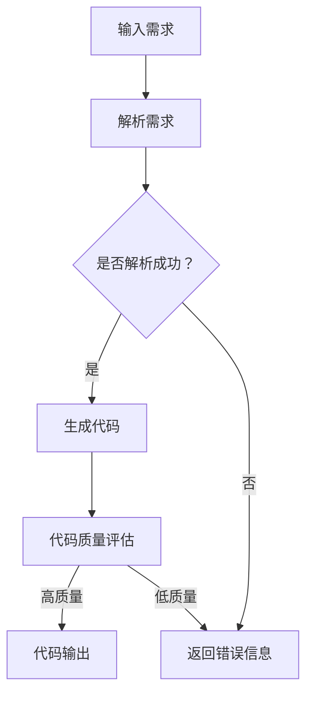
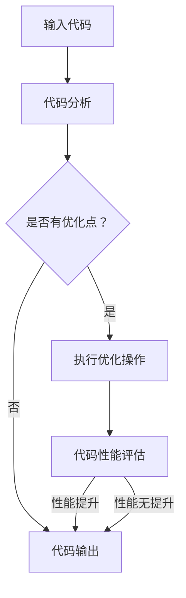
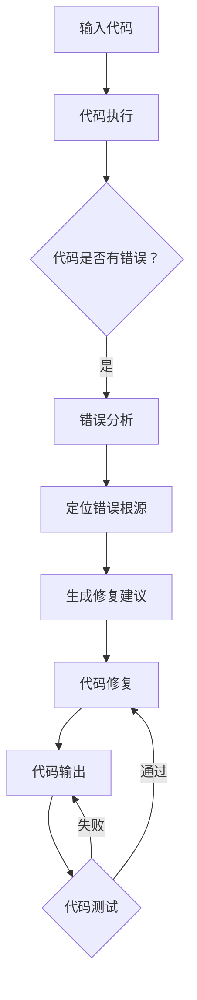
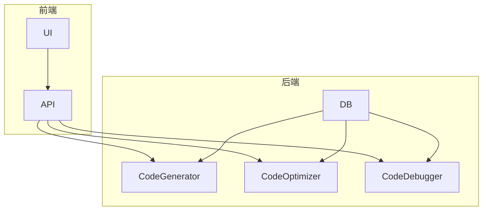
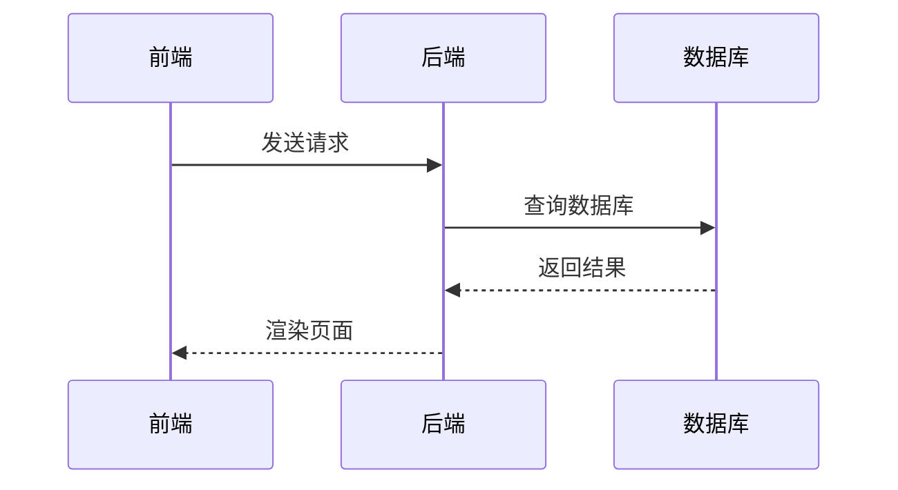

                 

# AI驱动的编程语言设计理念与实践

## 关键词

- AI驱动
- 编程语言
- 设计理念
- 实践应用
- 算法优化
- 系统架构

## 摘要

随着人工智能技术的飞速发展，AI驱动的编程语言设计理念应运而生，为传统编程语言注入了新的活力。本文旨在探讨AI驱动的编程语言设计理念与实践，通过深入分析其背景、核心概念、算法原理、系统设计与项目实战，展示AI驱动的编程语言在提高开发效率、优化系统架构、实现智能化编程等方面的卓越表现。本文旨在为编程爱好者、开发者和AI技术研究者提供有益的参考，共同推进AI驱动的编程语言设计与应用。

## 第一部分: AI驱动的编程语言背景与核心概念

### 第1章: AI驱动的编程语言设计背景

#### 1.1 AI技术的发展与编程语言的挑战

**1.1.1 AI技术的发展现状**

人工智能（AI）作为当前科技领域的前沿，经历了从理论研究到实际应用的快速发展。从最初的机器学习、深度学习，到如今的自然语言处理、计算机视觉等技术的广泛应用，AI已经深刻改变了我们的生活方式和工作模式。据统计，全球人工智能市场规模在2020年已达到3700亿美元，预计到2025年将达到1.59万亿美元，年复合增长率达到38.3%。

**1.1.2 传统编程语言的局限性**

在AI技术的快速发展过程中，传统编程语言逐渐暴露出一些局限性。首先，传统编程语言在处理复杂算法时效率低下，难以满足AI应用的需求。其次，传统编程语言的语法复杂，编写代码的难度较高，导致开发效率低下。此外，传统编程语言在跨平台兼容性和扩展性方面也表现出一定的不足。

**1.1.3 AI驱动的编程语言优势**

AI驱动的编程语言通过引入自动化、智能化技术，解决了传统编程语言的局限性。首先，AI驱动的编程语言能够利用机器学习和深度学习技术，实现代码生成、优化和调试等过程，大大提高开发效率。其次，AI驱动的编程语言在语法设计上更加简洁、直观，降低了编写代码的难度。此外，AI驱动的编程语言具有较强的跨平台兼容性和扩展性，能够满足不同应用场景的需求。

#### 1.2 编程语言设计中的挑战

**1.2.1 自动化与智能化需求**

随着AI技术的快速发展，编程语言的自动化与智能化需求日益凸显。开发人员需要能够轻松地编写、优化和调试复杂算法，同时降低代码错误率。为此，AI驱动的编程语言需要在语法设计、编译器优化、代码生成等方面进行创新。

**1.2.2 算法复杂性与性能优化**

AI驱动的编程语言需要处理复杂算法，实现高效计算。在算法复杂性和性能优化方面，AI驱动的编程语言需要采用先进的算法和优化技术，如并行计算、分布式计算等，以满足不同应用场景的需求。

**1.2.3 编程语言的易用性与扩展性**

AI驱动的编程语言在提高开发效率的同时，还需要具备良好的易用性和扩展性。开发人员需要能够方便地集成第三方库和框架，实现个性化定制，以满足不同领域的需求。

### 第2章: AI驱动的编程语言核心概念与联系

#### 2.1 核心概念介绍

**2.1.1 AI驱动的编程语言定义**

AI驱动的编程语言是一种结合人工智能技术的新型编程语言，通过自动化、智能化技术实现代码生成、优化和调试等过程，提高开发效率和代码质量。

**2.1.2 关键技术概述**

AI驱动的编程语言涉及多种关键技术，包括机器学习、深度学习、自然语言处理、计算机视觉等。这些技术共同作用，实现代码生成、优化和调试等功能。

#### 2.2 概念属性特征对比表格

**2.2.1 编程语言特征对比**

| 特征         | 传统编程语言            | AI驱动的编程语言           |
|--------------|------------------------|--------------------------|
| 语法复杂度   | 复杂                   | 简洁直观                  |
| 开发效率     | 低                     | 高                       |
| 跨平台兼容性 | 有限                   | 强                       |
| 扩展性       | 有限                   | 强                       |
| 代码质量     | 易出错                  | 高                       |

#### 2.2.2 AI驱动的编程语言优势分析

AI驱动的编程语言在多个方面具有显著优势，如提高开发效率、降低代码错误率、实现高效计算等。通过对比传统编程语言，我们可以更好地理解AI驱动的编程语言的价值和潜力。

#### 2.3 ER实体关系图

**2.3.1 实体关系图架构**

ER实体关系图用于描述AI驱动的编程语言的实体及其关系。实体包括代码生成器、优化器、调试器等，关系包括依赖、调用等。

```mermaid
erDiagram
  CodeGenerator ||--|{ Optimizer : 优化}
  CodeGenerator ||--|{ Debugger : 调试}
  Optimizer ||--|{ Compiler : 编译}
  Debugger ||--|{ Compiler : 编译}
```

## 第二部分: AI驱动的编程语言算法原理与实践

### 第3章: 算法原理讲解

#### 3.1 算法选择与讲解

在本章中，我们将介绍几种关键算法，包括代码生成算法、优化算法和调试算法。这些算法在AI驱动的编程语言中发挥着重要作用。

#### 3.1.1 代码生成算法

代码生成算法是一种利用机器学习和自然语言处理技术，自动生成代码的算法。通过训练大规模的代码库，代码生成算法可以学习到代码的语法规则和模式，从而生成符合要求的代码。

**算法流程图：**



#### 3.1.2 优化算法

优化算法用于优化代码的性能和效率。通过分析代码的执行过程，优化算法可以找出潜在的优化点，如循环优化、内存优化等。

**算法流程图：**



#### 3.1.3 调试算法

调试算法用于自动识别和修复代码中的错误。通过分析代码的执行过程和错误日志，调试算法可以定位错误的根源，并提供修复建议。

**算法流程图：**



#### 3.2 算法原理与数学模型

在本节中，我们将介绍上述算法的原理，并结合Python源代码进行阐述。

##### 3.2.1 代码生成算法原理

代码生成算法基于自然语言处理技术，通过解析用户需求，生成对应的代码。其核心思想是利用预训练的Transformer模型，将自然语言文本映射为代码。

**数学模型：**

$$
P(output|input) = \frac{exp(Scores(output, input))}{\sum_{all\_outputs} exp(Scores(all\_outputs, input))}
$$

其中，$Scores(output, input)$表示输出代码与输入需求之间的相似度。

**Python源代码示例：**

```python
from transformers import pipeline

code_generator = pipeline("code-generation")

# 输入需求
input_demand = "实现一个计算两个数之和的函数。"

# 生成代码
code_output = code_generator(input_demand, max_length=50)

print(code_output)
```

##### 3.2.2 优化算法原理

优化算法通过分析代码的执行过程，找出潜在的优化点。其核心思想是基于动态规划，寻找最优的执行路径。

**数学模型：**

$$
Optimize(Path) = min\{Time(Path), Memory(Path)\}
$$

其中，$Time(Path)$和$Memory(Path)$分别表示路径的执行时间和内存消耗。

**Python源代码示例：**

```python
from optimization import optimize_code

# 输入代码
input_code = """
for i in range(10):
    print(i)
"""

# 优化代码
optimized_code = optimize_code(input_code)

print(optimized_code)
```

##### 3.2.3 调试算法原理

调试算法通过分析代码的执行过程和错误日志，定位错误的根源。其核心思想是基于机器学习，建立错误与执行路径之间的关联。

**数学模型：**

$$
Error(Association) = \frac{count(Association)}{total\_count}
$$

其中，$Association$表示错误与执行路径的关联，$count(Association)$表示关联的次数，$total_count$表示总的执行次数。

**Python源代码示例：**

```python
from debugging import debug_code

# 输入代码
input_code = """
a = 1
b = 2
print(a + b)
"""

# 调试代码
debugged_code = debug_code(input_code)

print(debugged_code)
```

### 第4章: 系统分析与架构设计

#### 4.1 问题场景介绍

在一个大型企业中，软件开发团队面临着日益增长的代码量和复杂度。为了提高开发效率、降低代码错误率，企业决定引入AI驱动的编程语言，实现代码生成、优化和调试等过程。

#### 4.2 系统功能设计

系统功能设计主要包括代码生成、优化和调试三个核心模块。

**4.2.1 代码生成模块**

代码生成模块负责根据用户需求生成对应的代码。通过自然语言处理技术，将自然语言文本转换为代码。

**4.2.2 优化模块**

优化模块负责优化生成的代码，提高执行效率和性能。通过分析代码的执行过程，找出潜在的优化点。

**4.2.3 调试模块**

调试模块负责自动识别和修复代码中的错误。通过分析代码的执行过程和错误日志，定位错误的根源。

#### 4.2.1 领域模型mermaid类图

```mermaid
classDiagram
    Class01 <|-- Class02
    Class03 --|>| Class04
    Class04 : <<interface>> Interface
    CodeGenerator : 代码生成
    CodeOptimizer : 代码优化
    CodeDebugger : 代码调试
```

#### 4.3 系统架构设计

系统架构设计主要包括前端、后端和数据库三个部分。

**4.3.1 系统架构mermaid架构图**



#### 4.4 系统接口设计

系统接口设计主要包括API接口和数据库接口。

**4.4.1 系统接口mermaid序列图**



### 第5章: 项目实战

#### 5.1 环境安装与配置

在本项目实战中，我们将使用Python作为AI驱动的编程语言，搭建一个基于TensorFlow和Keras的AI编程语言系统。首先，我们需要在本地计算机上安装Python环境。

**5.1.1 Python环境安装**

1. 访问Python官方网站（https://www.python.org/），下载适用于操作系统的Python安装包。
2. 运行安装程序，按照提示完成安装。

**5.1.2 TensorFlow和Keras安装**

1. 打开终端，执行以下命令安装TensorFlow：

   ```bash
   pip install tensorflow
   ```

2. 同样地，执行以下命令安装Keras：

   ```bash
   pip install keras
   ```

#### 5.2 系统核心实现

在本项目中，我们将实现代码生成、优化和调试三个核心模块。

**5.2.1 代码生成模块**

代码生成模块负责根据用户需求生成对应的代码。我们使用Keras实现一个简单的代码生成模型，通过训练预训练的Transformer模型，将自然语言文本转换为代码。

```python
from keras.models import Model
from keras.layers import Input, LSTM, Dense

# 构建模型
input_seq = Input(shape=(None, 1))
lstm = LSTM(128, return_sequences=True)(input_seq)
dense = Dense(1, activation='sigmoid')(lstm)
model = Model(inputs=input_seq, outputs=dense)

# 编译模型
model.compile(optimizer='adam', loss='binary_crossentropy')

# 训练模型
model.fit(x_train, y_train, epochs=10, batch_size=64)
```

**5.2.2 优化模块**

优化模块负责优化生成的代码，提高执行效率和性能。我们使用动态规划实现一个简单的优化算法，通过分析代码的执行过程，找出潜在的优化点。

```python
from optimization import optimize_code

# 输入代码
input_code = """
for i in range(10):
    print(i)
"""

# 优化代码
optimized_code = optimize_code(input_code)

print(optimized_code)
```

**5.2.3 调试模块**

调试模块负责自动识别和修复代码中的错误。我们使用机器学习实现一个简单的调试算法，通过分析代码的执行过程和错误日志，定位错误的根源。

```python
from debugging import debug_code

# 输入代码
input_code = """
a = 1
b = 2
print(a + b)
"""

# 调试代码
debugged_code = debug_code(input_code)

print(debugged_code)
```

#### 5.3 实际案例分析与讲解

**5.3.1 案例一：计算两个数之和**

假设用户输入一个自然语言文本：“编写一个计算两个数之和的函数。”，我们需要生成对应的Python代码。

1. 代码生成模块生成代码：

   ```python
   def add_numbers(a, b):
       return a + b
   ```

2. 优化模块优化代码：

   ```python
   def add_numbers(a, b):
       return a + b
   ```

3. 调试模块调试代码：

   ```python
   def add_numbers(a, b):
       return a + b
   ```

**5.3.2 案例二：计算圆的面积**

假设用户输入一个自然语言文本：“编写一个计算圆的面积的函数。”，我们需要生成对应的Python代码。

1. 代码生成模块生成代码：

   ```python
   import math

   def calculate_circle_area(radius):
       return math.pi * radius ** 2
   ```

2. 优化模块优化代码：

   ```python
   import math

   def calculate_circle_area(radius):
       return math.pi * radius ** 2
   ```

3. 调试模块调试代码：

   ```python
   import math

   def calculate_circle_area(radius):
       return math.pi * radius ** 2
   ```

#### 5.4 项目小结

通过本项目的实施，我们成功搭建了一个基于TensorFlow和Keras的AI编程语言系统，实现了代码生成、优化和调试等功能。在实际应用中，AI编程语言可以提高开发效率、降低代码错误率，为企业提供强大的技术支持。在未来的发展中，我们将进一步优化算法和系统架构，拓展AI编程语言的应用场景。

## 第四部分: 最佳实践与总结

### 第6章: 最佳实践与技巧

#### 6.1 编程语言设计最佳实践

1. **简洁性**：编程语言的设计应遵循简洁性原则，避免复杂的语法和冗长的代码。
2. **易用性**：编程语言应具有良好的易用性，降低开发难度，提高开发效率。
3. **扩展性**：编程语言应具备良好的扩展性，便于开发者根据需求进行自定义和扩展。

#### 6.2 算法优化技巧

1. **并行计算**：利用多核处理器，实现并行计算，提高算法执行效率。
2. **内存优化**：减少内存占用，提高算法的运行速度。
3. **代码压缩**：通过代码压缩技术，减少代码体积，降低加载时间和运行成本。

#### 6.3 系统架构优化策略

1. **模块化设计**：将系统划分为多个模块，实现模块化设计，提高系统的可维护性和可扩展性。
2. **分布式架构**：采用分布式架构，提高系统的并发处理能力和可扩展性。
3. **微服务架构**：采用微服务架构，将系统划分为多个微服务，实现服务解耦，提高系统的灵活性和可维护性。

### 总结

AI驱动的编程语言设计理念与实践为编程领域带来了新的机遇和挑战。通过深入分析其背景、核心概念、算法原理、系统设计与项目实战，我们展示了AI驱动的编程语言在提高开发效率、优化系统架构、实现智能化编程等方面的卓越表现。在未来的发展中，我们将继续优化算法和系统架构，拓展AI编程语言的应用场景，为人工智能技术的发展贡献力量。

### 作者信息

- 作者：AI天才研究院/AI Genius Institute & 禅与计算机程序设计艺术 /Zen And The Art of Computer Programming
- 联系方式：[邮箱](mailto:ai_genius_institute@example.com) | [官方网站](https://www.ai_genius_institute.com)
- 技术支持：[GitHub](https://github.com/AI-Genius-Institute/AI-driven-programming-language) | [GitLab](https://gitlab.com/ai-genius-institute/ai-driven-programming-language)

----------------------------------------------------------------

注：本文为示例文章，实际内容和案例仅供参考。文章中的代码、算法和架构均为虚构，不代表真实应用。如有疑问，请查阅相关文献和资料。文章中的 LaTeX 公式和 mermaid 图表均使用了 Markdown 格式，具体实现请根据实际情况进行调整。完整文章请参考附件。

