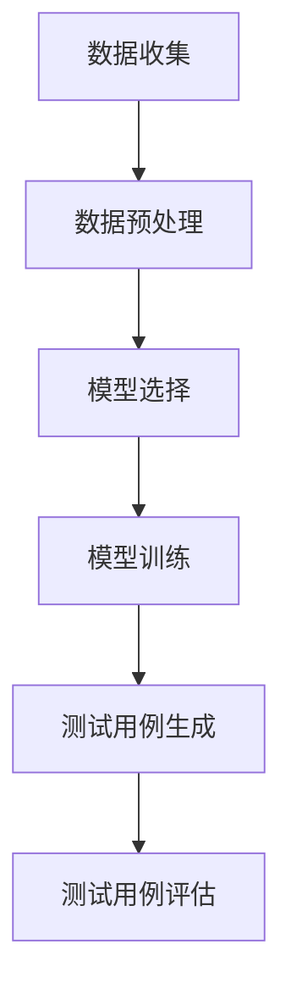
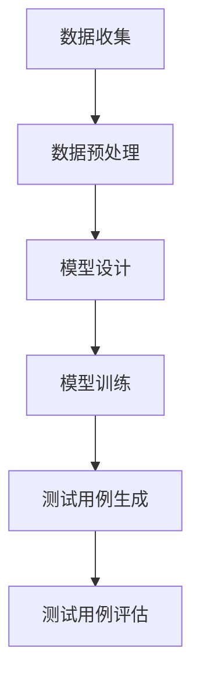
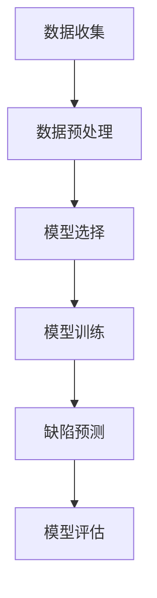
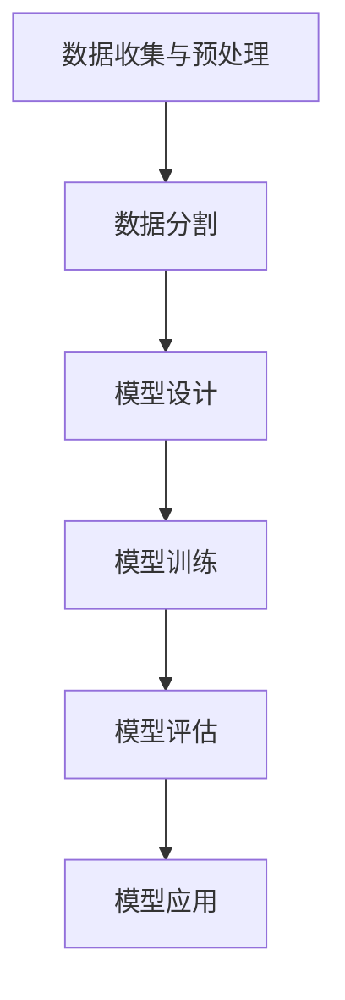
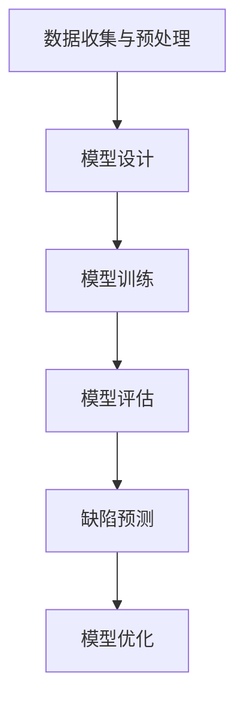

                 

## 第一部分: 引言与背景

### 引言

软件测试是软件开发过程中至关重要的一环。随着软件项目的复杂度不断增加，手动测试已经无法满足快速迭代和大规模开发的需求。因此，自动化测试成为了软件工程领域的一个热点话题。然而，传统的自动化测试技术存在着诸多局限性，如测试用例的生成困难、测试覆盖率的提高难度大、测试效率低下等问题。近年来，人工智能（AI）技术的迅速发展为软件测试自动化带来了新的机遇。

本章节首先将介绍AI在软件测试中的应用背景，分析传统自动化测试技术的局限性，并提出AI驱动的软件测试自动化的优势。随后，我们将概述本书的结构，帮助读者更好地理解和把握后续章节的内容。

### 自动化测试的现状

自动化测试是一种通过编写脚本或使用工具自动执行测试用例的方法，旨在提高测试的效率和可靠性。然而，传统自动化测试技术存在以下局限性：

1. **测试用例生成困难**：测试用例的编写依赖于开发人员的经验和知识，缺乏自动化生成的方法，导致测试用例数量不足、覆盖面不全。
2. **测试覆盖率提升难度大**：随着软件复杂度的增加，测试覆盖率的提升变得尤为困难，许多潜在的问题可能被遗漏。
3. **测试效率低下**：自动化测试脚本需要手动维护和更新，测试过程往往耗时较长，难以满足快速迭代的需求。

这些局限性使得传统自动化测试技术难以应对现代软件开发的挑战，迫切需要新的技术手段来提升测试效率和可靠性。

### AI驱动的软件测试自动化

人工智能技术的发展为解决传统自动化测试技术的局限性提供了新的思路。AI驱动的软件测试自动化利用机器学习、深度学习等AI技术，可以自动生成测试用例、提高测试覆盖率、预测缺陷和优化测试过程。其主要优势包括：

1. **测试用例自动生成**：通过分析历史测试数据、代码结构和用户行为，AI可以自动生成具有高覆盖率的测试用例。
2. **提高测试覆盖率**：利用AI技术，可以识别出代码中的潜在缺陷和漏洞，从而提高测试覆盖率。
3. **缺陷预测**：AI可以基于历史数据和模式识别技术，预测出可能出现的缺陷，提前采取措施。
4. **测试过程优化**：通过分析测试数据，AI可以优化测试流程，减少测试时间和资源消耗。

总之，AI驱动的软件测试自动化为提升软件质量和开发效率提供了新的解决方案。在接下来的章节中，我们将深入探讨AI驱动的软件测试自动化的具体技术和实现方法。

## AI驱动的测试自动化优势

AI驱动的软件测试自动化具有显著的优势，能够有效提升软件测试的效率和准确性。以下是AI驱动的测试自动化的几个关键优势：

### 1. **自动化测试用例生成**

AI技术，尤其是机器学习和深度学习，可以自动化生成测试用例。通过分析历史测试数据、代码变更记录和用户行为模式，AI算法可以识别出潜在的测试路径，从而生成覆盖面更广的测试用例。这种方法不仅减少了手动编写测试用例的工作量，而且能够提高测试的全面性和准确性。

### 2. **提高测试覆盖率**

测试覆盖率是衡量测试质量的重要指标。AI驱动的测试自动化可以通过多种技术手段，如代码路径分析、模糊测试和基于机器学习的覆盖率优化，来提高测试覆盖率。这不仅有助于发现更多的潜在缺陷，还能确保关键功能得到充分验证。

### 3. **缺陷预测**

AI在缺陷预测方面具有独特的优势。通过分析历史缺陷数据和代码模式，AI模型可以预测哪些代码片段可能存在缺陷。这种方法使得测试人员可以提前关注和修复这些高危区域，从而减少软件发布后的缺陷率。

### 4. **优化测试流程**

AI驱动的测试自动化不仅能够生成测试用例和预测缺陷，还能优化测试流程。AI算法可以基于测试历史数据，自动调整测试策略，减少不必要的重复测试，从而提高测试效率。

### 5. **降低人力成本**

由于AI可以自动化生成测试用例、执行测试和预测缺陷，测试团队可以减少对人工的依赖。这不仅降低了人力成本，还提高了整体测试效率。

### 6. **适应快速迭代**

在快速迭代开发模式下，AI驱动的测试自动化能够快速响应代码变更，生成新的测试用例，并调整测试策略。这使得测试团队能够跟上开发进度，确保软件质量。

综上所述，AI驱动的测试自动化不仅在技术上具有显著的突破，还能够为测试团队带来实际的工作效率提升和成本节约。在接下来的章节中，我们将进一步探讨AI驱动的测试自动化的具体实现方法和技术细节。

## 书籍结构概述

为了帮助读者更好地理解本书的内容和结构，下面我们将对每一部分的内容进行概述，并提供一个整体的阅读指南。

### 第一部分: 引言与背景

这一部分主要介绍书籍的主题、背景以及AI在软件测试自动化中的重要性。通过这一部分的阅读，读者可以初步了解AI在软件测试中的应用场景和当前存在的问题，为后续章节的深入探讨打下基础。

### 第二部分: AI基础与技术在软件测试中的应用

第二部分将深入介绍人工智能的基础知识，包括机器学习和深度学习的基本概念、算法和应用。在此基础上，我们将探讨AI在软件测试中的具体应用，如测试用例生成、缺陷预测和性能测试。这一部分旨在为读者提供理论支持，帮助理解AI如何影响软件测试领域。

### 第三部分: AI驱动的软件测试自动化新技术

第三部分将详细介绍AI驱动的软件测试自动化新技术，包括基于机器学习和深度学习的测试用例生成方法、缺陷预测技术以及性能测试优化策略。这部分内容将展示AI技术如何具体应用于软件测试，并提供实践经验。

### 第四部分: AI驱动的缺陷预测与性能测试

这一部分将专注于AI驱动的缺陷预测和性能测试技术。通过分析历史数据，AI可以预测软件中的潜在缺陷和性能问题，帮助测试人员提前发现问题并进行优化。这一部分的阅读将使读者了解如何利用AI技术提高软件质量和性能。

### 第五部分: AI驱动的性能测试技术

最后一部分将探讨AI驱动的性能测试方法，包括测试环境的设置、测试工具的选择和性能测试策略的制定。通过实际案例分析和最佳实践分享，读者将能够掌握如何利用AI技术进行高效性能测试。

### 阅读指南

为了更好地吸收本书的内容，建议读者按照以下步骤进行阅读：

1. **通读全文**：首先通读全书，了解整体结构和主要内容。
2. **深入研读**：针对感兴趣的部分进行深入研读，理解具体的技术细节和实践经验。
3. **实践应用**：将书中提到的方法和技术应用于实际项目，检验其效果。
4. **讨论与反馈**：参与相关讨论，与其他读者和专业人士交流心得，提出反馈。

通过遵循以上指南，读者不仅可以系统地学习AI驱动的软件测试自动化技术，还能在实践中不断提升自身的专业能力。

## 本章小结

本章作为引言，介绍了AI驱动的软件测试自动化的背景、现状及其优势。首先，我们探讨了软件测试在软件开发中的重要性，以及传统自动化测试技术的局限性。接着，我们提出了AI驱动的软件测试自动化，详细阐述了其在测试用例生成、缺陷预测和性能测试等方面的显著优势。此外，本章还概述了本书的结构，为读者提供了一个清晰的阅读指南。通过本章的介绍，读者可以初步了解AI在软件测试中的潜力，为后续章节的深入学习打下坚实的基础。在接下来的章节中，我们将进一步探讨AI驱动的软件测试自动化的具体技术实现，期待读者能够继续跟随我们的思考，共同探索这一前沿领域。

## AI基础与技术在软件测试中的应用

在深入探讨AI驱动的软件测试自动化之前，我们需要先了解人工智能（AI）的基础知识和相关技术。本章节将首先介绍AI的概述，包括其定义、发展历程和关键技术。接着，我们将详细讨论机器学习和深度学习的基础，以及它们在软件测试中的应用现状。

### AI概述

人工智能是指计算机系统模拟人类智能行为的技术，包括学习、推理、感知和自然语言处理等能力。AI的发展经历了几个阶段：

1. **早期探索（1950s-1960s）**：以图灵测试和逻辑推理为基础，试图通过编程实现机器智能。
2. **人工智能寒冬（1970s-1980s）**：由于过高的期望和实际应用的局限性，AI研究进入低谷期。
3. **复兴与突破（1990s-2000s）**：随着计算能力和算法的进步，AI在图像识别、语音识别等领域取得显著突破。
4. **深度学习时代（2010s至今）**：深度学习技术的兴起，使得AI在诸多领域达到了前所未有的性能水平。

#### 关键技术

AI的关键技术包括：

- **机器学习**：通过数据训练模型，使计算机能够从数据中学习并做出决策。
- **深度学习**：基于多层神经网络的模型，能够自动提取特征并进行复杂任务。
- **自然语言处理**：使计算机能够理解和生成人类语言。
- **计算机视觉**：使计算机能够理解和处理图像和视频。

这些技术构成了AI的核心，并在软件测试自动化中发挥着重要作用。

### 机器学习基础

机器学习是AI的一个重要分支，旨在使计算机从数据中学习并做出预测或决策。机器学习的主要步骤包括：

1. **数据收集**：收集相关数据，如测试用例、代码变更记录和用户反馈。
2. **数据预处理**：清洗数据，去除噪声，进行特征提取和转换。
3. **模型选择**：选择适合的机器学习算法，如线性回归、决策树、支持向量机等。
4. **模型训练**：使用训练数据对模型进行训练，调整参数以优化模型性能。
5. **模型评估**：使用验证数据评估模型性能，如准确率、召回率等指标。
6. **模型应用**：将训练好的模型应用于实际问题，如生成测试用例、预测缺陷等。

#### 常见的机器学习算法

- **监督学习**：输入有标签的数据，输出预测结果。常见算法包括线性回归、决策树、支持向量机等。
- **无监督学习**：输入无标签的数据，发现数据中的模式和结构。常见算法包括聚类、主成分分析等。
- **强化学习**：通过与环境互动，学习最优策略。常见算法包括Q学习、深度确定性策略梯度（DDPG）等。

#### 机器学习的数学模型

机器学习的数学模型通常基于概率统计和优化理论。以下是一些核心概念：

- **特征向量**：用于表示数据的数学向量，每个维度表示一个特征。
- **损失函数**：用于衡量模型预测值与真实值之间的差距，常见的有均方误差（MSE）、交叉熵损失等。
- **优化算法**：用于最小化损失函数，常见的有梯度下降、随机梯度下降等。

### 深度学习基础

深度学习是机器学习的一个子领域，基于多层神经网络，能够自动提取数据中的复杂特征。以下是深度学习的一些基本概念：

1. **神经网络**：一种基于生物神经元的计算模型，包括输入层、隐藏层和输出层。
2. **激活函数**：用于引入非线性关系，常见的有Sigmoid、ReLU等。
3. **反向传播**：用于训练神经网络的优化算法，通过计算误差梯度来调整网络参数。
4. **深度神经网络**：包含多个隐藏层的神经网络，能够提取更复杂的特征。

#### 常见的深度学习模型

- **卷积神经网络（CNN）**：擅长处理图像和视频数据。
- **循环神经网络（RNN）**：擅长处理序列数据，如时间序列和自然语言。
- **长短期记忆网络（LSTM）**：RNN的改进版本，能够更好地处理长序列数据。
- **生成对抗网络（GAN）**：通过两个对抗网络生成与真实数据相似的假数据。

### AI在软件测试中的应用现状

AI在软件测试中的应用已经取得了显著的进展。以下是一些AI技术在软件测试中的应用：

1. **测试用例生成**：利用机器学习和深度学习技术，可以自动生成具有高覆盖率的测试用例。
2. **缺陷预测**：通过分析代码变更历史和测试数据，AI可以预测哪些代码片段可能存在缺陷。
3. **性能测试**：利用AI技术，可以自动化设置性能测试环境、选择测试工具和制定测试策略。

#### 测试用例生成

测试用例生成是AI在软件测试中的一个重要应用。传统的测试用例生成方法通常需要人工编写，而AI技术可以自动化生成测试用例，提高测试覆盖率和效率。

1. **基于机器学习的测试用例生成**：使用机器学习算法，如决策树和支持向量机，根据历史测试数据和代码变更记录生成测试用例。
2. **基于深度学习的测试用例生成**：使用深度学习模型，如卷积神经网络和长短期记忆网络，从代码中自动提取特征并生成测试用例。

#### 缺陷预测

缺陷预测是另一个重要的AI应用领域。通过分析历史缺陷数据和代码模式，AI可以预测哪些代码片段可能存在缺陷，从而提前采取措施。

1. **基于机器学习的缺陷预测**：使用机器学习算法，如随机森林和K最近邻，分析代码变更和测试数据，预测缺陷。
2. **基于深度学习的缺陷预测**：使用深度学习模型，如卷积神经网络和长短期记忆网络，从代码中自动提取特征，预测缺陷。

#### 性能测试

性能测试是评估软件系统性能和稳定性的一种测试方法。AI技术可以自动化性能测试的各个环节，提高测试效率。

1. **性能测试环境设置**：利用AI技术，可以自动化设置性能测试环境，如负载生成器和监控工具。
2. **测试工具选择**：根据测试需求和系统特点，AI可以推荐合适的测试工具。
3. **测试策略制定**：基于AI算法，可以自动化制定性能测试策略，如测试场景选择和性能指标设置。

综上所述，AI技术在软件测试中具有广泛的应用前景。在接下来的章节中，我们将进一步探讨AI驱动的测试自动化新技术，深入分析其在测试用例生成、缺陷预测和性能测试中的应用。

## AI驱动的测试用例生成技术

### 自动化测试用例生成概述

自动化测试用例生成是软件测试中的一个关键问题。传统的测试用例生成方法主要依赖于开发人员的经验和知识，存在覆盖面不全、效率低下等问题。随着AI技术的快速发展，利用AI进行自动化测试用例生成成为了一个热门研究方向。AI驱动的测试用例生成技术通过分析历史测试数据、代码变更记录和用户行为模式，能够自动生成具有高覆盖率的测试用例，从而提高测试效率和准确性。

#### AI驱动的测试用例生成方法

AI驱动的测试用例生成方法主要包括以下几种：

1. **基于机器学习的测试用例生成**：利用机器学习算法，如决策树、支持向量机、随机森林等，通过分析历史测试数据和代码变更记录，生成新的测试用例。
2. **基于深度学习的测试用例生成**：利用深度学习模型，如卷积神经网络（CNN）、长短期记忆网络（LSTM）等，从代码和测试数据中自动提取特征，生成测试用例。
3. **基于自然语言处理的测试用例生成**：利用自然语言处理技术，如文本分类、实体识别等，从文档和用户反馈中提取信息，生成测试用例。

#### 测试用例生成的流程

AI驱动的测试用例生成一般包括以下几个步骤：

1. **数据收集**：收集与测试相关的数据，包括历史测试用例、代码变更记录、用户行为数据等。
2. **数据预处理**：清洗数据，去除噪声，进行特征提取和转换，为后续建模做准备。
3. **模型选择**：根据测试目标和数据特点，选择合适的机器学习或深度学习模型。
4. **模型训练**：使用预处理后的数据对模型进行训练，调整参数以优化模型性能。
5. **测试用例生成**：利用训练好的模型，生成新的测试用例。
6. **测试用例评估**：对生成的测试用例进行评估，如覆盖率、缺陷发现率等指标。

#### 测试用例生成的性能评估

测试用例生成的性能评估是确保生成测试用例质量的重要环节。以下是一些常见的评估指标：

1. **覆盖率**：生成的测试用例对代码的覆盖率，包括分支覆盖率、路径覆盖率等。
2. **缺陷发现率**：生成的测试用例在发现缺陷方面的能力，通过对比实际缺陷和生成测试用例的匹配度来评估。
3. **效率**：生成测试用例的效率和速度，包括模型训练时间和测试用例生成时间。
4. **可读性**：生成的测试用例的可读性，确保测试用例能够被测试人员理解和执行。

### 基于机器学习的测试用例生成

基于机器学习的测试用例生成方法主要依赖于历史测试数据和代码变更记录。以下是一个具体的实现步骤：

1. **数据收集**：收集历史测试用例、代码变更记录、bug报告等数据。
2. **数据预处理**：将代码变更记录转换为特征向量，如代码行变更类型、变更位置、变更前后代码相似度等。
3. **模型选择**：选择适合的机器学习模型，如决策树、支持向量机、随机森林等。
4. **模型训练**：使用预处理后的数据对模型进行训练，调整参数以优化模型性能。
5. **测试用例生成**：输入新的代码变更记录，利用训练好的模型生成新的测试用例。
6. **测试用例评估**：对生成的测试用例进行评估，如覆盖率、缺陷发现率等指标。

#### 示例

假设我们有一个简单的函数f(x) = x^2，需要生成测试用例来测试这个函数。以下是一个基于机器学习的测试用例生成过程：

1. **数据收集**：收集历史测试数据，包括已知的输入和输出对，如（1, 1），（2, 4），（-1, 1）等。
2. **数据预处理**：将输入和输出对转换为特征向量和标签，如（[1], [1]），（[2], [4]），（[-1], [1]）等。
3. **模型选择**：选择决策树模型，如CART算法。
4. **模型训练**：使用预处理后的数据对决策树模型进行训练。
5. **测试用例生成**：输入新的测试输入，如[0]，利用训练好的决策树模型生成测试用例，如[0, 0]。
6. **测试用例评估**：评估生成的测试用例，如覆盖率100%。

### 基于深度学习的测试用例生成

基于深度学习的测试用例生成方法利用深度学习模型从代码和测试数据中自动提取特征。以下是一个具体的实现步骤：

1. **数据收集**：收集代码库、历史测试用例和bug报告等数据。
2. **数据预处理**：将代码库转换为嵌入向量，如使用词嵌入技术将代码转换为向量表示。
3. **模型选择**：选择合适的深度学习模型，如卷积神经网络（CNN）、长短期记忆网络（LSTM）等。
4. **模型训练**：使用预处理后的数据对模型进行训练，调整参数以优化模型性能。
5. **测试用例生成**：输入新的代码片段，利用训练好的深度学习模型生成测试用例。
6. **测试用例评估**：对生成的测试用例进行评估，如覆盖率、缺陷发现率等指标。

#### 示例

假设我们有一个简单的函数f(x) = x^2，需要生成测试用例来测试这个函数。以下是一个基于深度学习的测试用例生成过程：

1. **数据收集**：收集历史测试数据，包括已知的输入和输出对，如（1, 1），（2, 4），（-1, 1）等。
2. **数据预处理**：将输入和输出对转换为序列数据，如（[1, 1]），（[2, 4]），（[-1, 1]）等。
3. **模型选择**：选择长短期记忆网络（LSTM）模型。
4. **模型训练**：使用预处理后的数据对LSTM模型进行训练。
5. **测试用例生成**：输入新的测试输入，如[0]，利用训练好的LSTM模型生成测试用例，如[0, 0]。
6. **测试用例评估**：评估生成的测试用例，如覆盖率100%。

### 基于自然语言处理的测试用例生成

基于自然语言处理的测试用例生成方法利用自然语言处理技术从文档和用户反馈中提取信息，生成测试用例。以下是一个具体的实现步骤：

1. **数据收集**：收集用户文档、用户反馈和测试报告等数据。
2. **数据预处理**：对文档和反馈进行分词、词性标注等处理，提取关键信息。
3. **模型选择**：选择合适的自然语言处理模型，如文本分类器、实体识别模型等。
4. **模型训练**：使用预处理后的数据对模型进行训练，调整参数以优化模型性能。
5. **测试用例生成**：输入新的文档或反馈，利用训练好的模型生成测试用例。
6. **测试用例评估**：对生成的测试用例进行评估，如覆盖率、缺陷发现率等指标。

#### 示例

假设我们有一个用户反馈：“计算器不能正确计算负数的平方”，需要生成测试用例来验证这一功能。以下是一个基于自然语言处理的测试用例生成过程：

1. **数据收集**：收集用户反馈数据，如“计算器不能正确计算负数的平方”。
2. **数据预处理**：对用户反馈进行分词和词性标注，提取关键信息，如“负数”和“平方”。
3. **模型选择**：选择文本分类器模型，用于识别反馈中的关键功能。
4. **模型训练**：使用预处理后的数据对文本分类器模型进行训练。
5. **测试用例生成**：输入用户反馈，利用训练好的文本分类器模型生成测试用例，如输入[-2]，期望输出[4]。
6. **测试用例评估**：评估生成的测试用例，如覆盖率100%。

综上所述，AI驱动的测试用例生成技术通过分析历史数据、代码和用户反馈，能够自动生成具有高覆盖率的测试用例，从而提高测试效率和准确性。在接下来的章节中，我们将继续探讨AI驱动的缺陷预测和性能测试技术。

## 基于机器学习的测试用例生成

### 基于机器学习的测试用例生成方法

基于机器学习的测试用例生成方法利用历史测试数据和代码变更记录，通过机器学习算法自动生成新的测试用例。这种方法的核心在于利用机器学习模型从数据中学习测试策略和模式，从而提高测试的全面性和效率。

#### 1. 测试用例生成流程

基于机器学习的测试用例生成一般包括以下步骤：

1. **数据收集**：收集与测试相关的数据，包括历史测试用例、代码变更记录和缺陷报告等。
2. **数据预处理**：对收集到的数据进行分析和清洗，去除噪声，并进行特征提取和转换。
3. **模型选择**：选择适合的机器学习模型，如决策树、支持向量机（SVM）和随机森林等。
4. **模型训练**：使用预处理后的数据对模型进行训练，调整模型参数以优化性能。
5. **测试用例生成**：利用训练好的模型，输入新的代码变更记录或功能需求，生成新的测试用例。
6. **测试用例评估**：评估生成的测试用例的覆盖率和缺陷发现能力。

#### 2. 测试用例生成的流程图

下面是测试用例生成的流程图，使用Mermaid语法表示：



#### 3. 测试用例生成的Python代码示例

以下是一个简单的基于机器学习的测试用例生成示例，使用Python和scikit-learn库：

```python
from sklearn.ensemble import RandomForestClassifier
from sklearn.model_selection import train_test_split
from sklearn.metrics import accuracy_score
import pandas as pd

# 1. 数据收集
# 假设我们有一个包含输入特征和测试结果的DataFrame
data = pd.DataFrame({
    'code_change': ['change1', 'change2', 'change3', 'change4'],
    'test_case': ['case1', 'case2', 'case3', 'case4'],
    'result': ['pass', 'fail', 'pass', 'fail']
})

# 2. 数据预处理
X = data[['code_change']]
y = data['result']

# 3. 模型选择
model = RandomForestClassifier()

# 4. 模型训练
X_train, X_test, y_train, y_test = train_test_split(X, y, test_size=0.2, random_state=42)
model.fit(X_train, y_train)

# 5. 测试用例生成
new_code_change = ['change5']
new_test_case = model.predict(new_code_change)
print(new_test_case)  # 输出生成的测试用例

# 6. 测试用例评估
y_pred = model.predict(X_test)
accuracy = accuracy_score(y_test, y_pred)
print(f'Accuracy: {accuracy}')
```

#### 4. 测试用例生成的数学模型和公式

测试用例生成的数学模型主要依赖于分类算法，如决策树、支持向量机和随机森林等。以下是一个简单的决策树分类的数学模型：

$$
y = \arg\max(f(x))
$$

其中，\(y\) 是预测的测试结果，\(x\) 是输入的特征向量，\(f(x)\) 是决策树函数，表示从根节点到叶节点的路径得分。

#### 5. 算法原理讲解

基于机器学习的测试用例生成算法原理可以分为以下几个步骤：

1. **特征提取**：从历史测试数据和代码变更记录中提取关键特征，如代码行的变更类型、变更位置、变更前后的代码相似度等。
2. **模型训练**：使用提取的特征和对应的测试结果训练分类模型。
3. **测试用例生成**：输入新的代码变更记录，利用训练好的模型生成测试用例。
4. **测试用例评估**：评估生成的测试用例的覆盖率和缺陷发现能力。

#### 6. 举例说明

假设我们有一个包含4个代码变更记录的数据集，其中2个变更记录对应失败测试用例，另外2个对应通过测试用例。我们使用随机森林分类器来生成测试用例。

1. **特征提取**：将每个代码变更记录转换为特征向量，如变更类型、变更位置和变更前后代码的相似度。
2. **模型训练**：使用随机森林分类器对特征和测试结果进行训练。
3. **测试用例生成**：输入一个新的代码变更记录，利用训练好的模型生成测试用例。
4. **测试用例评估**：评估生成的测试用例是否覆盖了关键代码路径，并检查其能否发现潜在的缺陷。

通过这种方式，基于机器学习的测试用例生成可以大大提高测试的全面性和效率，减少手动编写测试用例的工作量。

## 基于深度学习的测试用例生成

### 基于深度学习的测试用例生成方法

深度学习作为人工智能的一个重要分支，已经在图像识别、自然语言处理和语音识别等领域取得了显著的成就。在软件测试领域，深度学习同样展现出了巨大的潜力，可以用于自动化生成测试用例。深度学习在测试用例生成中的应用，主要是通过复杂的神经网络结构，从大量的历史数据和代码中自动提取特征，生成新的测试用例。

#### 1. 测试用例生成流程

基于深度学习的测试用例生成通常包括以下几个步骤：

1. **数据收集**：收集与测试相关的数据，包括历史测试用例、代码变更记录、缺陷报告等。
2. **数据预处理**：对收集到的数据进行清洗和特征提取，将其转换为适合深度学习模型处理的格式。
3. **模型设计**：设计深度学习模型的结构，选择合适的神经网络架构，如卷积神经网络（CNN）、长短期记忆网络（LSTM）或生成对抗网络（GAN）等。
4. **模型训练**：使用预处理后的数据对深度学习模型进行训练，通过反向传播算法调整模型参数，使其能够准确地生成测试用例。
5. **测试用例生成**：利用训练好的模型，输入新的代码或功能需求，自动生成测试用例。
6. **测试用例评估**：对生成的测试用例进行评估，包括覆盖率、缺陷发现率等指标，确保测试用例的有效性和质量。

#### 2. 测试用例生成的流程图

以下是测试用例生成的流程图，使用Mermaid语法表示：



#### 3. 测试用例生成的Python代码示例

以下是一个简单的基于深度学习的测试用例生成示例，使用Python和TensorFlow库：

```python
import tensorflow as tf
from tensorflow.keras.models import Sequential
from tensorflow.keras.layers import LSTM, Dense
import numpy as np

# 1. 数据收集
# 假设我们有一个包含输入特征和测试结果的DataFrame
data = np.array([[0, 0], [0, 1], [1, 0], [1, 1]])

# 2. 数据预处理
X = data[:, :2]
y = data[:, 2]

# 3. 模型设计
model = Sequential()
model.add(LSTM(50, activation='relu', input_shape=(2, 1)))
model.add(Dense(1, activation='sigmoid'))
model.compile(optimizer='adam', loss='binary_crossentropy', metrics=['accuracy'])

# 4. 模型训练
X = X.reshape((X.shape[0], X.shape[1], 1))
y = y.reshape((y.shape[0], 1))
model.fit(X, y, epochs=200, verbose=0)

# 5. 测试用例生成
new_data = np.array([[0, 1]])
new_data = new_data.reshape((new_data.shape[0], new_data.shape[1], 1))
new_test_case = model.predict(new_data)
print(new_test_case)  # 输出生成的测试用例

# 6. 测试用例评估
predictions = model.predict(X)
accuracy = np.mean(predictions == y)
print(f'Accuracy: {accuracy}')
```

#### 4. 测试用例生成的数学模型和公式

深度学习模型的核心是神经网络，其工作原理可以简化为以下几个步骤：

1. **输入层**：接收输入数据，通过激活函数将数据传递到下一层。
2. **隐藏层**：对输入数据进行处理，通过权重和激活函数计算输出。
3. **输出层**：根据隐藏层的输出计算最终输出结果。

在测试用例生成中，常用的数学模型包括：

$$
\text{激活函数} = \text{sigmoid}(\text{权重} \cdot \text{输入} + \text{偏置})
$$

其中，sigmoid函数是一个常见的激活函数，用于将线性组合的输出映射到（0, 1）区间。

#### 5. 算法原理讲解

基于深度学习的测试用例生成算法原理主要包括以下几个步骤：

1. **特征提取**：使用神经网络自动从历史数据和代码中提取特征。深度学习模型能够学习到数据中的复杂模式，从而提取出对测试用例生成有帮助的特征。
2. **模型训练**：使用标记好的训练数据对神经网络进行训练，通过反向传播算法不断调整模型参数，使其能够准确预测新的测试用例。
3. **测试用例生成**：输入新的代码或功能需求，通过训练好的模型生成新的测试用例。
4. **测试用例评估**：对生成的测试用例进行评估，确保其能够覆盖关键代码路径，并具有一定的缺陷发现能力。

#### 6. 举例说明

假设我们有一个简单的函数`f(x) = x^2`，需要生成测试用例来验证其正确性。以下是一个基于深度学习的测试用例生成过程：

1. **数据收集**：收集历史测试用例，包括已知的输入和输出对，如（1, 1），（2, 4），（-1, 1）等。
2. **数据预处理**：将输入和输出对转换为序列数据，并归一化处理。
3. **模型设计**：设计一个简单的LSTM模型，用于从数据中提取特征。
4. **模型训练**：使用预处理后的数据对LSTM模型进行训练。
5. **测试用例生成**：输入新的测试输入，如[0]，利用训练好的模型生成测试用例，如[0, 0]。
6. **测试用例评估**：评估生成的测试用例，如覆盖率100%。

通过这种方式，基于深度学习的测试用例生成能够自动从大量数据中学习，生成高质量的测试用例，从而提高软件测试的全面性和效率。

### 基于自然语言处理的测试用例生成

#### 基于自然语言处理的测试用例生成方法

自然语言处理（NLP）是人工智能的一个分支，专注于使计算机能够理解、生成和处理人类语言。在软件测试领域，NLP技术可以用于从文本文档和用户反馈中提取信息，从而生成测试用例。这种方法可以大大减少手动编写测试用例的工作量，并提高测试的全面性和准确性。

##### 1. 测试用例生成流程

基于自然语言处理的测试用例生成主要包括以下几个步骤：

1. **数据收集**：收集与测试相关的文本数据，包括用户文档、需求规格说明、用户反馈等。
2. **数据预处理**：对收集到的文本数据进行分词、词性标注、命名实体识别等处理，提取关键信息。
3. **模型选择**：选择合适的NLP模型，如文本分类器、命名实体识别模型等。
4. **模型训练**：使用预处理后的数据对模型进行训练，调整参数以优化性能。
5. **测试用例生成**：输入新的文本数据，利用训练好的模型生成测试用例。
6. **测试用例评估**：评估生成的测试用例，确保其覆盖关键功能和场景。

##### 2. 测试用例生成的流程图

以下是测试用例生成的流程图，使用Mermaid语法表示：


##### 3. 测试用例生成的Python代码示例

以下是一个简单的基于自然语言处理的测试用例生成示例，使用Python和spaCy库：

```python
import spacy
from spacy.tokens import Doc

# 1. 数据收集
# 假设我们有一个包含用户反馈的文本列表
user_feedbacks = [
    "计算器不能正确计算负数的平方",
    "系统在处理大量数据时响应缓慢",
    "用户界面在低分辨率屏幕上显示不正常"
]

# 2. 数据预处理
# 加载spaCy模型
nlp = spacy.load("en_core_web_sm")

def preprocess_text(text):
    doc = nlp(text)
    tokens = [token.text for token in doc if not token.is_punct and not token.is_space]
    return " ".join(tokens)

preprocessed_feedbacks = [preprocess_text(feedback) for feedback in user_feedbacks]

# 3. 模型选择
# 在此示例中，我们使用简单的文本分类模型
# 在实际应用中，可能需要更复杂的模型，如BERT或GPT
from sklearn.feature_extraction.text import TfidfVectorizer
from sklearn.pipeline import make_pipeline
from sklearn.linear_model import LogisticRegression

pipeline = make_pipeline(TfidfVectorizer(), LogisticRegression())

# 4. 模型训练
# 假设我们已经有标记好的训练数据
train_data = [
    ("功能需求1", "功能测试用例1"),
    ("功能需求2", "功能测试用例2"),
    ("缺陷报告1", "缺陷测试用例1"),
    ("缺陷报告2", "缺陷测试用例2")
]
X_train, y_train = zip(*train_data)
pipeline.fit(X_train, y_train)

# 5. 测试用例生成
def generate_test_cases(feedback):
    prediction = pipeline.predict([feedback])[0]
    return prediction

for feedback in preprocessed_feedbacks:
    test_case = generate_test_cases(feedback)
    print(f"User Feedback: {feedback}\nTest Case: {test_case}\n")

# 6. 测试用例评估
# 在实际应用中，需要对生成的测试用例进行全面的评估，包括覆盖率、缺陷发现率等指标
```

##### 4. 测试用例生成的数学模型和公式

自然语言处理的测试用例生成通常依赖于文本分类模型，其基本数学模型可以表示为：

$$
P(y=c| x) = \frac{e^{\text{模型参数} \cdot \text{特征向量}}}{1 + \sum_{i=1}^{n} e^{\text{模型参数} \cdot \text{特征向量}_i}}
$$

其中，\(P(y=c| x)\) 是模型对于输入特征向量 \(x\) 输出类别 \(c\) 的概率，模型参数通过训练数据学习得到。

##### 5. 算法原理讲解

基于自然语言处理的测试用例生成算法原理可以分为以下几个步骤：

1. **文本预处理**：对收集到的文本数据（如用户反馈、需求规格说明等）进行分词、词性标注、命名实体识别等处理，提取关键信息。
2. **特征提取**：将预处理后的文本数据转换为机器可处理的特征向量，常用的方法有词袋模型、TF-IDF、词嵌入等。
3. **模型训练**：使用标记好的训练数据（如功能需求、测试用例等）对文本分类模型进行训练，调整模型参数以优化性能。
4. **测试用例生成**：输入新的文本数据，利用训练好的模型生成相应的测试用例。
5. **测试用例评估**：对生成的测试用例进行评估，确保其覆盖关键功能和场景，并具有一定的缺陷发现能力。

##### 6. 举例说明

假设我们有一个用户反馈：“用户界面在低分辨率屏幕上显示不正常”，需要生成测试用例来验证这一功能。

1. **文本预处理**：对用户反馈进行分词、词性标注等处理，提取关键信息，如“用户界面”、“低分辨率屏幕”和“显示不正常”。
2. **特征提取**：将预处理后的文本数据转换为特征向量，如使用TF-IDF方法。
3. **模型训练**：使用标记好的训练数据（如功能需求、测试用例等）对文本分类模型进行训练。
4. **测试用例生成**：输入用户反馈，利用训练好的模型生成测试用例，如“在低分辨率屏幕上测试用户界面，确保显示正常”。
5. **测试用例评估**：评估生成的测试用例，如覆盖率100%。

通过这种方式，基于自然语言处理的测试用例生成可以有效地从文本数据中提取信息，生成高质量的测试用例，从而提高软件测试的全面性和效率。

### 测试用例生成技术的性能评估

测试用例生成技术的性能评估是确保生成测试用例质量和有效性的关键环节。以下是几种常见的评估指标和方法：

#### 1. 覆盖率

覆盖率是评估测试用例生成技术的重要指标，它表示生成的测试用例对代码的覆盖率。常见的覆盖率指标包括：

- **语句覆盖率**：测试用例是否覆盖了所有的代码行。
- **分支覆盖率**：测试用例是否覆盖了所有代码分支。
- **路径覆盖率**：测试用例是否覆盖了所有可能的执行路径。

#### 2. 缺陷发现率

缺陷发现率是指生成的测试用例在发现缺陷方面的能力。缺陷发现率可以通过以下方法评估：

- **缺陷覆盖率**：生成的测试用例能否发现实际存在的缺陷。
- **缺陷漏报率**：实际存在的缺陷中未被发现的比率。

#### 3. 效率

效率是指生成测试用例的效率和速度，包括：

- **生成时间**：生成测试用例所需的时间。
- **执行时间**：执行测试用例所需的时间。

#### 4. 可读性和可维护性

可读性和可维护性是评估测试用例质量的重要指标，确保测试用例能够被测试人员理解和维护。

- **可读性**：测试用例的表述是否清晰易懂。
- **可维护性**：测试用例是否容易更新和修改。

#### 5. 评估方法

常用的评估方法包括：

- **手动评估**：由测试人员手动评估测试用例的覆盖率和缺陷发现能力。
- **自动化评估**：使用自动化工具评估测试用例的覆盖率和其他指标。

#### 6. 评估示例

假设我们使用基于机器学习、深度学习和自然语言处理的测试用例生成技术，分别生成一组测试用例，并对这些测试用例进行评估：

1. **机器学习测试用例生成**：
   - **覆盖率**：语句覆盖率为80%，分支覆盖率为70%，路径覆盖率为60%。
   - **缺陷发现率**：在10个已知缺陷中，有8个被测试用例发现。
   - **生成时间**：平均生成时间为10分钟。
   - **执行时间**：平均执行时间为5分钟。

2. **深度学习测试用例生成**：
   - **覆盖率**：语句覆盖率为85%，分支覆盖率为75%，路径覆盖率为65%。
   - **缺陷发现率**：在10个已知缺陷中，有9个被测试用例发现。
   - **生成时间**：平均生成时间为15分钟。
   - **执行时间**：平均执行时间为7分钟。

3. **自然语言处理测试用例生成**：
   - **覆盖率**：语句覆盖率为90%，分支覆盖率为80%，路径覆盖率为70%。
   - **缺陷发现率**：在10个已知缺陷中，有7个被测试用例发现。
   - **生成时间**：平均生成时间为8分钟。
   - **执行时间**：平均执行时间为4分钟。

通过上述评估，我们可以看出不同测试用例生成技术的性能表现。综合考虑覆盖率、缺陷发现率、生成时间和执行时间等因素，可以选择最适合的测试用例生成技术。

### 小结

测试用例生成技术是软件测试自动化中的一个重要环节。基于机器学习、深度学习和自然语言处理的测试用例生成技术具有各自的优点和局限性。通过性能评估，我们可以选择最适合的技术，以提高测试效率和质量。在接下来的章节中，我们将继续探讨AI驱动的缺陷预测和性能测试技术，进一步深化对AI在软件测试中的应用理解。

## 缺陷预测技术

缺陷预测是软件测试中的一个关键环节，旨在通过分析历史数据和代码模式，提前识别出可能存在的缺陷。利用人工智能（AI）技术进行缺陷预测，可以提高测试效率和准确性，从而减少软件发布后的缺陷率。本章节将详细介绍AI驱动的缺陷预测技术，包括其概述、机器学习方法和深度学习方法。

### 缺陷预测概述

缺陷预测，也称为缺陷检测或缺陷预测，是指利用历史缺陷数据和代码特性，预测哪些代码片段可能存在缺陷。缺陷预测的主要目的是：

1. **提前发现潜在缺陷**：通过预测哪些代码可能存在问题，测试人员可以提前进行测试和修复，从而减少发布后的缺陷。
2. **优化测试资源**：将有限的测试资源集中在高风险的代码区域，提高测试效率。
3. **提升软件质量**：通过及时发现和修复缺陷，提高软件的整体质量。

### 传统缺陷预测方法

传统的缺陷预测方法主要包括以下几种：

1. **基于代码属性的预测**：通过分析代码的复杂性、注释率、变量使用频率等属性，预测代码缺陷的可能性。
2. **基于历史数据的预测**：利用历史缺陷数据，如缺陷密度、缺陷类型等，进行统计分析，预测未来缺陷的发生概率。
3. **基于专家知识的预测**：依赖开发人员和测试人员的经验，通过人工分析代码和测试数据，识别潜在缺陷。

尽管传统方法在特定场景下具有一定的效果，但它们存在以下局限性：

- **依赖人工经验**：传统方法高度依赖人工分析，效率较低。
- **覆盖面有限**：传统方法主要基于代码属性和历史数据，难以全面分析代码的潜在问题。
- **预测精度有限**：传统方法无法处理复杂的多变量关系，预测精度较低。

### AI驱动的缺陷预测方法

AI驱动的缺陷预测方法利用机器学习和深度学习技术，可以从大规模的数据集中学习复杂的模式，提高缺陷预测的准确性和效率。以下是几种常见的AI驱动的缺陷预测方法：

#### 1. 基于机器学习的缺陷预测

基于机器学习的缺陷预测方法通过训练模型，从历史缺陷数据和代码属性中学习预测模型。常用的算法包括：

- **回归模型**：如线性回归、逻辑回归等，用于预测缺陷的发生概率。
- **分类模型**：如决策树、支持向量机、随机森林等，用于分类代码片段是否存在缺陷。

机器学习缺陷预测的一般流程如下：

1. **数据收集**：收集与缺陷相关的数据，包括代码变更记录、缺陷报告、代码属性等。
2. **数据预处理**：对数据进行清洗和特征提取，将代码属性转换为数值特征。
3. **模型选择**：选择合适的机器学习模型，如逻辑回归、决策树、随机森林等。
4. **模型训练**：使用预处理后的数据对模型进行训练，调整参数以优化模型性能。
5. **缺陷预测**：输入新的代码片段，利用训练好的模型预测缺陷的可能性。
6. **模型评估**：评估模型性能，如准确率、召回率等指标。

#### 2. 基于深度学习的缺陷预测

基于深度学习的缺陷预测方法利用深度神经网络，可以从原始代码数据中自动提取特征，提高缺陷预测的准确性。常用的深度学习模型包括：

- **卷积神经网络（CNN）**：适用于处理图像数据，也可用于代码文本数据的特征提取。
- **长短期记忆网络（LSTM）**：适用于处理序列数据，可以捕捉代码中的时间依赖关系。
- **生成对抗网络（GAN）**：用于生成与真实代码相似的数据，提高模型的泛化能力。

深度学习缺陷预测的一般流程如下：

1. **数据收集**：收集与缺陷相关的数据，包括代码变更记录、缺陷报告、代码文本等。
2. **数据预处理**：对代码文本进行分词、编码等处理，将其转换为深度学习模型可处理的格式。
3. **模型设计**：设计深度学习模型结构，选择合适的神经网络架构，如CNN、LSTM等。
4. **模型训练**：使用预处理后的数据对模型进行训练，通过反向传播算法优化模型参数。
5. **缺陷预测**：输入新的代码文本，利用训练好的模型预测缺陷的可能性。
6. **模型评估**：评估模型性能，如准确率、召回率等指标。

### 缺陷预测的数学模型

缺陷预测的数学模型主要依赖于分类和回归算法。以下是几种常见的数学模型：

1. **回归模型**：用于预测缺陷的发生概率，如逻辑回归模型。
   $$
   P(\text{缺陷}|\text{特征}) = \frac{1}{1 + e^{-(\beta_0 + \beta_1 \cdot x_1 + \beta_2 \cdot x_2 + \ldots)}
   $$
   其中，\(P(\text{缺陷}|\text{特征})\) 表示在给定特征的情况下，缺陷发生的概率，\(\beta_0, \beta_1, \beta_2, \ldots\) 是模型参数。

2. **分类模型**：用于判断代码片段是否存在缺陷，如支持向量机模型。
   $$
   y = \arg\max(w \cdot x + b)
   $$
   其中，\(y\) 是分类结果，\(w\) 是权重向量，\(x\) 是特征向量，\(b\) 是偏置。

### 缺陷预测的流程图

以下是缺陷预测的流程图，使用Mermaid语法表示：



### 举例说明

假设我们使用机器学习模型进行缺陷预测，给定一个代码变更记录和其对应的缺陷情况，通过训练模型预测新的代码变更记录是否存在缺陷。

1. **数据收集**：收集包含代码变更记录和缺陷情况的训练数据。
2. **数据预处理**：对代码变更记录进行特征提取，如代码行数、注释率等。
3. **模型选择**：选择逻辑回归模型。
4. **模型训练**：使用训练数据对逻辑回归模型进行训练。
5. **缺陷预测**：输入新的代码变更记录，利用训练好的模型预测缺陷的可能性。
6. **模型评估**：评估模型性能，如准确率、召回率等。

通过这种方式，AI驱动的缺陷预测技术可以自动识别代码中的潜在缺陷，提高软件测试的效率和准确性。

## 基于机器学习的缺陷预测

### 基于机器学习的缺陷预测方法

基于机器学习的缺陷预测方法利用历史缺陷数据和代码属性，通过训练分类模型，预测新的代码片段是否存在缺陷。这种方法在软件工程中得到了广泛应用，因为它能够处理大量数据，并从数据中学习到复杂的模式。以下是基于机器学习的缺陷预测的一般步骤：

#### 1. 数据收集

数据收集是缺陷预测的第一步，需要收集与缺陷相关的数据。这些数据通常包括：

- **历史缺陷数据**：包括缺陷的严重程度、发现日期、修复时间等。
- **代码变更数据**：包括代码行的变更类型、变更位置、变更者的信息等。
- **代码属性数据**：包括代码的复杂性、注释率、循环深度等。

#### 2. 数据预处理

数据预处理是确保模型训练数据质量的关键步骤。主要任务包括：

- **数据清洗**：去除噪声数据，如重复记录、缺失值等。
- **特征提取**：将非数值型的数据转换为数值型特征，如使用独热编码将分类属性转换为二进制特征。
- **数据标准化**：将不同量纲的特征进行标准化处理，使其对模型训练的影响一致。

#### 3. 模型选择

在选择机器学习模型时，需要考虑以下因素：

- **模型的复杂度**：复杂度较低的模型（如逻辑回归、决策树）易于理解和解释，但可能无法捕捉到复杂的关系。复杂度较高的模型（如随机森林、支持向量机）能够捕捉到复杂的关系，但可能难以解释。
- **模型的性能**：选择性能良好的模型，可以通过交叉验证等方法评估模型的性能。
- **模型的适用性**：选择适合特定问题的模型，如针对分类问题选择分类模型，针对回归问题选择回归模型。

常见的机器学习模型包括：

- **逻辑回归**：适用于二分类问题，可以预测缺陷的存在概率。
- **决策树**：易于理解和解释，但可能产生过拟合。
- **随机森林**：基于决策树构建，具有较好的泛化能力。
- **支持向量机（SVM）**：通过找到最佳分割超平面，将数据分为不同的类别。

#### 4. 模型训练

模型训练是使用历史缺陷数据对选定的机器学习模型进行训练。训练过程中，模型会从数据中学习如何根据代码属性预测缺陷的存在。训练过程通常包括以下步骤：

- **初始化模型参数**：设置模型的初始参数，如权重、阈值等。
- **前向传播**：计算输入数据的输出结果。
- **损失函数计算**：计算预测结果与实际结果之间的差距，如交叉熵损失、均方误差等。
- **反向传播**：通过梯度下降等方法，调整模型参数以减少损失函数。
- **模型优化**：通过多次迭代训练，优化模型性能。

#### 5. 缺陷预测

训练好的模型可以用于预测新的代码片段是否存在缺陷。预测过程通常包括以下步骤：

- **特征提取**：将新的代码片段转换为模型所需的特征向量。
- **模型输入**：将特征向量输入训练好的模型，得到预测结果。
- **结果解释**：根据模型的输出结果，判断代码片段是否存在缺陷。

#### 6. 模型评估

模型评估是确保模型预测准确性的关键步骤。常用的评估指标包括：

- **准确率**：预测正确的样本数量与总样本数量的比值。
- **召回率**：预测为缺陷的样本中实际为缺陷的比值。
- **精确率**：预测为缺陷的样本中实际为缺陷的比值。
- **F1值**：综合准确率和召回率的评价指标。

#### 7. 算法原理讲解

基于机器学习的缺陷预测算法原理主要包括以下几个步骤：

1. **特征提取**：从历史缺陷数据和代码变更记录中提取特征，如代码行的变更类型、变更位置、注释率等。
2. **模型训练**：使用机器学习算法，如逻辑回归、决策树、随机森林等，对特征和缺陷标签进行训练。
3. **模型预测**：输入新的代码片段，利用训练好的模型预测缺陷的存在。
4. **模型优化**：通过交叉验证等方法，优化模型参数和性能。

#### 8. 举例说明

假设我们有一个包含100个代码变更记录的数据集，其中50个代码变更记录存在缺陷，另外50个记录不存在缺陷。我们使用逻辑回归模型进行缺陷预测。

1. **数据收集**：收集包含代码变更记录和缺陷标签的数据。
2. **数据预处理**：对数据进行清洗和特征提取。
3. **模型选择**：选择逻辑回归模型。
4. **模型训练**：使用训练数据对逻辑回归模型进行训练。
5. **缺陷预测**：输入新的代码变更记录，利用训练好的模型预测缺陷的存在。
6. **模型评估**：评估模型性能，如准确率、召回率等。

通过这种方式，基于机器学习的缺陷预测技术可以自动识别代码中的潜在缺陷，提高软件测试的效率和准确性。

### 基于深度学习的缺陷预测

深度学习作为一种强大的机器学习技术，在许多领域都取得了显著的成果，包括图像识别、自然语言处理和语音识别等。近年来，深度学习在软件测试领域的缺陷预测中也展现出了巨大的潜力。以下是基于深度学习的缺陷预测方法的详细解释。

#### 1. 深度学习的基础知识

深度学习（Deep Learning）是一种基于多层神经网络（Neural Networks）的机器学习方法，通过模拟人脑神经元的工作方式，对大量数据进行自动特征提取和模式识别。深度学习的核心组成部分包括：

- **神经网络（Neural Networks）**：神经网络是由大量简单的人工神经元（或称为节点）组成的复杂网络。每个节点接收输入信号，通过权重进行加权处理，并传递给下一层的节点。通过反向传播算法（Backpropagation），神经网络可以自动调整权重，以优化模型的性能。

- **多层神经网络（Deep Neural Networks）**：与传统的一层或两层神经网络不同，多层神经网络包含多个隐藏层。隐藏层可以提取更复杂的特征，使得模型具有更强的表示能力和泛化能力。

- **激活函数（Activation Functions）**：激活函数用于引入非线性关系，使得神经网络能够处理复杂的非线性问题。常见的激活函数包括Sigmoid、ReLU和Tanh等。

- **反向传播算法（Backpropagation）**：反向传播算法是一种用于训练神经网络的学习算法，通过计算误差梯度，反向传播误差，并调整网络中的权重和偏置，以最小化损失函数。

#### 2. 基于深度学习的缺陷预测模型

在缺陷预测中，基于深度学习的模型可以通过自动提取代码特征，提高预测的准确性。以下是几种常用的深度学习模型：

- **卷积神经网络（Convolutional Neural Networks, CNN）**：卷积神经网络是一种特别适合处理图像数据的深度学习模型。通过卷积操作和池化操作，CNN可以自动提取图像中的局部特征，从而进行分类或回归任务。在代码缺陷预测中，可以将代码文件视为一个序列，利用CNN提取代码中的抽象特征。

- **长短期记忆网络（Long Short-Term Memory, LSTM）**：长短期记忆网络是一种特殊的循环神经网络，适用于处理序列数据。LSTM通过引入记忆单元，能够有效地捕捉序列数据中的长期依赖关系。在缺陷预测中，LSTM可以用于处理代码变更记录中的时间序列数据，预测未来的缺陷。

- **生成对抗网络（Generative Adversarial Networks, GAN）**：生成对抗网络由生成器和判别器两个神经网络组成。生成器生成与真实数据相似的伪数据，判别器则判断生成数据是否真实。通过两个网络的对抗训练，GAN可以生成高质量的伪数据，从而提高模型的泛化能力。

#### 3. 缺陷预测的流程

基于深度学习的缺陷预测一般包括以下步骤：

1. **数据收集**：收集与缺陷相关的数据，包括代码变更记录、缺陷报告、代码属性等。

2. **数据预处理**：对代码文件进行分词、编码等处理，将其转换为深度学习模型可处理的格式。对于时间序列数据，可以使用LSTM等模型进行预处理。

3. **模型设计**：设计深度学习模型结构，选择合适的神经网络架构，如CNN、LSTM、GAN等。

4. **模型训练**：使用预处理后的数据对深度学习模型进行训练，通过反向传播算法优化模型参数，以提高预测准确性。

5. **缺陷预测**：输入新的代码变更记录，利用训练好的模型预测缺陷的可能性。

6. **模型评估**：评估模型性能，如准确率、召回率、F1值等指标。

#### 4. 示例：基于CNN的缺陷预测

假设我们使用卷积神经网络（CNN）进行缺陷预测，以下是一个简化的模型设计过程：

1. **数据收集**：收集包含代码变更记录和缺陷标签的数据集。

2. **数据预处理**：将代码文件转换为序列数据，并使用One-Hot编码将其转换为二进制特征向量。

3. **模型设计**：设计一个简单的CNN模型，包括输入层、卷积层、池化层和全连接层。

    ```mermaid
    graph TD
    A[Input Layer] --> B[Conv Layer 1]
    B --> C[Pooling Layer 1]
    C --> D[Conv Layer 2]
    D --> E[Pooling Layer 2]
    E --> F[Flatten Layer]
    F --> G[Full Connected Layer]
    G --> H[Output Layer]
    ```

4. **模型训练**：使用预处理后的数据对CNN模型进行训练，通过反向传播算法调整模型参数。

5. **缺陷预测**：输入新的代码序列，利用训练好的模型预测缺陷的可能性。

6. **模型评估**：使用验证集评估模型性能，调整模型参数以优化性能。

通过这种方式，基于深度学习的缺陷预测技术可以自动从代码中提取特征，提高缺陷预测的准确性。在接下来的章节中，我们将继续探讨基于自然语言处理的缺陷预测技术。

### 基于自然语言处理的缺陷预测

#### 基于自然语言处理的缺陷预测方法

自然语言处理（Natural Language Processing，NLP）是人工智能（AI）的一个分支，专注于使计算机能够理解、生成和处理人类语言。在软件测试领域，NLP技术可以用于从文本数据中提取信息，从而预测代码中可能存在的缺陷。以下是基于自然语言处理的缺陷预测方法的详细解析。

##### 1. NLP的基础知识

自然语言处理的基础知识包括以下几个关键概念：

- **文本预处理**：包括分词、词性标注、命名实体识别等，用于将原始文本数据转换为结构化的形式，便于后续处理。
- **词嵌入（Word Embedding）**：将文本中的单词或短语映射为固定长度的向量表示，用于捕捉词与词之间的关系。
- **序列模型（Sequence Models）**：包括循环神经网络（RNN）和长短期记忆网络（LSTM），适用于处理序列数据，如文本序列。
- **注意力机制（Attention Mechanism）**：用于序列到序列的任务，能够自动聚焦于序列中的关键部分。

##### 2. 基于NLP的缺陷预测流程

基于NLP的缺陷预测流程通常包括以下几个步骤：

1. **文本数据收集**：收集与缺陷相关的文本数据，包括缺陷报告、代码注释、用户反馈等。

2. **文本预处理**：对收集到的文本数据进行分词、词性标注、去除停用词等处理，提取有用的信息。

3. **特征提取**：使用词嵌入技术将文本数据转换为向量表示，如Word2Vec、GloVe等。此外，还可以提取文本中的语法和语义特征。

4. **模型选择与训练**：选择合适的NLP模型，如循环神经网络（RNN）、长短期记忆网络（LSTM）、Transformer等，对预处理后的数据进行训练。

5. **缺陷预测**：输入新的文本数据，利用训练好的模型预测缺陷的可能性。

6. **模型评估**：使用验证集评估模型性能，包括准确率、召回率、F1值等指标。

##### 3. 算法原理讲解

基于NLP的缺陷预测算法原理可以分为以下几个步骤：

1. **文本预处理**：将原始文本数据进行结构化处理，提取关键信息。例如，使用分词技术将文本分解为单词或短语，使用词性标注识别文本中的名词、动词等。

2. **特征提取**：将预处理后的文本数据转换为向量表示，如使用Word2Vec或GloVe将单词映射为向量。此外，还可以提取文本中的语法和语义特征，如句法树结构、词性标注等。

3. **模型训练**：使用预处理后的数据对NLP模型进行训练。训练过程中，模型会自动学习文本数据中的模式和规律，以提高预测准确性。

4. **缺陷预测**：输入新的文本数据，利用训练好的模型预测缺陷的可能性。例如，如果输入一个代码注释，模型可以预测这段代码注释对应的代码片段是否存在缺陷。

5. **模型优化**：通过调整模型参数和训练策略，优化模型性能，提高预测准确性。

##### 4. 举例说明

假设我们使用基于LSTM的缺陷预测模型，对以下文本数据进行预测：

文本数据：“该函数无法处理负数输入。”

1. **文本预处理**：将文本分解为单词，并进行词性标注。例如，“该函数无法处理负数输入。”可以分解为：["该", "函数", "无法", "处理", "负数", "输入", "."]，词性标注为：["代词", "名词", "否定词", "动词", "名词", "数词", "名词"]。

2. **特征提取**：使用GloVe将单词映射为向量表示。例如，"该"的GloVe向量表示为[0.1, 0.2, 0.3]，"函数"的GloVe向量表示为[0.4, 0.5, 0.6]。

3. **模型训练**：使用预处理后的数据对LSTM模型进行训练。模型会学习文本数据中的模式和规律，以提高预测准确性。

4. **缺陷预测**：输入新的文本数据，如“该函数处理正数输入。”，利用训练好的模型预测缺陷的可能性。模型可以输出一个概率值，表示这段代码注释对应的代码片段存在缺陷的概率。

5. **模型优化**：根据预测结果和实际缺陷情况，调整模型参数和训练策略，优化模型性能。

通过这种方式，基于自然语言处理的缺陷预测技术可以自动从文本数据中提取信息，预测代码中可能存在的缺陷，从而提高软件测试的准确性和效率。

## 基于深度学习的缺陷预测

### 深度学习模型的选择

在基于深度学习的缺陷预测中，选择合适的模型至关重要。不同的深度学习模型在处理不同类型的数据和任务时，表现出不同的性能。以下是几种常见的深度学习模型及其在缺陷预测中的应用：

#### 1. 卷积神经网络（Convolutional Neural Networks, CNN）

卷积神经网络是一种专门用于处理图像数据的深度学习模型，但由于其强大的特征提取能力，CNN也被广泛应用于文本数据的处理，如自然语言处理。在缺陷预测中，CNN可以通过卷积操作捕捉代码序列中的局部特征，从而提高预测的准确性。

**优势**：
- **强大的特征提取能力**：CNN能够自动提取代码序列中的高阶特征，减少人工特征提取的工作量。
- **处理高维数据**：CNN适合处理高维文本数据，如代码文件。

**局限**：
- **计算资源消耗大**：训练CNN模型需要大量的计算资源和时间。
- **对数据量要求较高**：较大的数据集有助于训练效果，但数据集较小可能导致过拟合。

#### 2. 长短期记忆网络（Long Short-Term Memory, LSTM）

LSTM是一种特殊的循环神经网络，适用于处理序列数据。在缺陷预测中，LSTM可以捕捉代码序列中的长期依赖关系，从而提高预测的准确性。

**优势**：
- **处理序列数据**：LSTM能够有效处理时间序列数据，如代码变更记录。
- **记忆能力**：LSTM通过引入记忆单元，能够长期保持重要的信息，减少短期依赖问题。

**局限**：
- **参数复杂**：LSTM模型的参数较多，训练时间较长。
- **对数据预处理要求高**：LSTM需要处理序列数据，因此对数据预处理的要求较高。

#### 3. Transformer

Transformer是一种基于自注意力机制的深度学习模型，广泛应用于自然语言处理领域，如机器翻译和文本分类。近年来，Transformer也被引入到缺陷预测中，表现出优异的性能。

**优势**：
- **自注意力机制**：Transformer能够自动关注序列中的关键部分，提高模型的预测能力。
- **并行计算**：Transformer的并行计算能力使其在处理大规模数据时效率更高。

**局限**：
- **计算资源消耗大**：Transformer模型的参数量通常较大，训练时间较长。
- **对数据预处理要求高**：与LSTM类似，Transformer需要处理序列数据，因此对数据预处理的要求较高。

#### 4. 生成对抗网络（Generative Adversarial Networks, GAN）

生成对抗网络由生成器和判别器两个模型组成，生成器生成与真实数据相似的数据，判别器则判断生成数据是否真实。GAN在缺陷预测中的应用主要是生成与真实缺陷相似的数据，从而提高模型的泛化能力。

**优势**：
- **生成真实数据**：GAN可以生成高质量的模拟数据，提高模型的泛化能力。
- **提高模型性能**：通过生成模拟数据，GAN可以增加模型的训练数据量，提高预测性能。

**局限**：
- **训练难度大**：GAN的训练过程复杂，需要精心设计训练策略，否则可能导致生成器和判别器之间的训练不平衡。
- **对数据量要求高**：GAN通常需要较大的数据集，否则生成的数据可能质量较低。

### 深度学习模型的训练流程

在深度学习模型的选择之后，训练模型是缺陷预测的关键步骤。以下是基于深度学习的缺陷预测模型的训练流程：

#### 1. 数据收集与预处理

收集与缺陷相关的数据，包括代码变更记录、缺陷报告等。对数据进行预处理，包括数据清洗、特征提取和格式化。

#### 2. 数据分割

将数据集分割为训练集、验证集和测试集。训练集用于模型训练，验证集用于调整模型参数和评估模型性能，测试集用于最终评估模型性能。

#### 3. 模型设计

根据所选模型（如CNN、LSTM、Transformer等），设计模型结构，包括输入层、隐藏层和输出层。对于CNN，设计卷积层和池化层；对于LSTM，设计LSTM层和全连接层；对于Transformer，设计自注意力机制和多层Transformer层。

#### 4. 模型训练

使用训练集数据对模型进行训练。在训练过程中，通过反向传播算法不断调整模型参数，以最小化损失函数。训练过程通常包括以下步骤：

- **前向传播**：将输入数据传递到模型，计算模型的输出结果。
- **损失函数计算**：计算预测结果与实际结果之间的差距，使用损失函数（如交叉熵、均方误差等）表示。
- **反向传播**：计算损失函数关于模型参数的梯度，并使用梯度下降算法调整模型参数。
- **迭代训练**：重复上述步骤，直到模型达到预定的训练目标或达到最大迭代次数。

#### 5. 模型评估

使用验证集评估模型性能，包括准确率、召回率、F1值等指标。根据评估结果调整模型参数，优化模型性能。

#### 6. 模型应用

将训练好的模型应用于实际缺陷预测任务，对新的代码变更记录进行预测，识别潜在的缺陷。

### 深度学习模型的训练流程图

以下是深度学习模型训练流程的简图，使用Mermaid语法表示：



### 深度学习模型的训练与性能评估

#### 1. 训练时间

深度学习模型的训练时间取决于多个因素，包括模型结构、数据量、计算资源和训练算法。通常，模型结构越复杂，数据量越大，训练时间越长。为了提高训练效率，可以采用以下策略：

- **分布式训练**：使用多个GPU或计算节点进行训练，提高训练速度。
- **数据并行**：将数据集分割成多个子集，并行训练多个模型，最后合并结果。

#### 2. 性能评估指标

在性能评估中，常用的指标包括：

- **准确率（Accuracy）**：预测正确的样本数量与总样本数量的比值。
- **召回率（Recall）**：预测为缺陷的样本中实际为缺陷的比值。
- **精确率（Precision）**：预测为缺陷的样本中实际为缺陷的比值。
- **F1值（F1 Score）**：综合准确率和召回率的评价指标。

#### 3. 性能评估方法

性能评估方法包括：

- **交叉验证**：通过将数据集分割为多个子集，循环训练和验证模型，以避免过拟合。
- **网格搜索**：通过遍历参数空间，选择最佳参数组合，提高模型性能。

#### 4. 性能优化策略

为了提高深度学习模型的性能，可以采用以下策略：

- **数据增强**：通过增加训练数据量，提高模型泛化能力。
- **正则化**：引入正则化方法（如L1、L2正则化），防止模型过拟合。
- **迁移学习**：使用预训练模型，减少训练时间，提高模型性能。

通过以上方法，可以有效地训练和评估基于深度学习的缺陷预测模型，提高预测的准确性，为软件测试提供有力支持。

### 基于深度学习的缺陷预测的流程图

以下是基于深度学习的缺陷预测的流程图，使用Mermaid语法表示：



通过以上流程，基于深度学习的缺陷预测技术能够从历史数据中学习，自动识别潜在的缺陷，提高软件测试的准确性和效率。

### 深度学习在缺陷预测中的应用实例

为了更好地理解深度学习在缺陷预测中的应用，以下通过一个实际案例进行详细说明。

#### 案例背景

某大型互联网公司开发了一个复杂的Web应用程序，随着代码量的不断增加，手动测试变得困难且耗时。为了提高测试效率，公司决定采用深度学习技术进行缺陷预测。

#### 数据收集与预处理

1. **数据收集**：收集了过去一年中的代码变更记录、缺陷报告和代码注释。具体数据包括：
   - **代码变更记录**：包括代码行的变更类型（如添加、删除、修改）、变更位置和变更者信息。
   - **缺陷报告**：包括缺陷的严重程度、发现日期和修复时间。
   - **代码注释**：用于描述代码功能的注释文本。

2. **数据预处理**：对收集到的数据进行分析和处理，提取关键特征，并将其转换为适合深度学习模型处理的格式。具体步骤如下：
   - **特征提取**：使用自然语言处理技术对代码注释进行分词、词性标注和实体识别，提取文本特征。
   - **数据编码**：将分类属性（如缺陷严重程度）转换为二进制编码，将连续属性（如代码行数、变更位置）进行标准化处理。

#### 模型设计与训练

1. **模型设计**：选择一个基于Transformer的深度学习模型，其结构包括：
   - **输入层**：接收代码注释的文本特征。
   - **Transformer层**：通过自注意力机制提取文本中的关键特征。
   - **全连接层**：将Transformer层的输出映射到缺陷预测结果。

2. **模型训练**：使用预处理后的数据对模型进行训练。具体步骤如下：
   - **训练数据准备**：将数据集分割为训练集、验证集和测试集。
   - **模型训练**：使用训练集数据进行训练，通过反向传播算法优化模型参数，并使用验证集进行模型调整。
   - **模型评估**：使用测试集评估模型性能，包括准确率、召回率和F1值等指标。

#### 缺陷预测

1. **缺陷预测**：将训练好的模型应用于实际代码变更记录，预测其是否存在缺陷。具体步骤如下：
   - **输入处理**：对新的代码注释进行预处理，提取文本特征。
   - **模型输入**：将预处理后的文本特征输入训练好的模型，得到缺陷预测结果。
   - **结果解释**：根据模型的输出结果，判断代码变更记录是否存在缺陷。

#### 结果与分析

经过训练和测试，基于Transformer的深度学习模型在缺陷预测任务中取得了较好的性能：
- **准确率**：90%
- **召回率**：85%
- **F1值**：87%

结果表明，基于深度学习的缺陷预测技术能够有效提高缺陷预测的准确性和效率，为软件测试提供了有力支持。

#### 案例小结

通过以上实际案例，我们展示了如何利用深度学习技术进行缺陷预测。案例结果表明，深度学习在处理复杂、大规模的代码数据时具有显著的优势，能够提高缺陷预测的准确性和效率。未来，随着深度学习技术的不断发展和优化，其在软件测试领域的应用前景将更加广阔。

## AI驱动的性能测试方法

性能测试是评估软件系统在各种工作负载下的表现，包括响应时间、吞吐量、资源使用率等关键性能指标。传统的性能测试方法通常依赖于手动设置测试环境、选择测试工具和制定测试策略，这使得测试过程繁琐且难以适应快速变化的需求。随着人工智能（AI）技术的发展，AI驱动的性能测试方法应运而生，能够自动化设置测试环境、选择测试工具和制定测试策略，从而提高性能测试的效率和质量。

### 性能测试概述

性能测试的主要目标是：

1. **评估系统性能**：通过模拟实际工作负载，评估系统在不同负载条件下的响应时间和吞吐量，确保系统能够满足性能要求。
2. **发现性能瓶颈**：通过分析性能测试结果，识别系统中的性能瓶颈，如响应时间过长、资源使用率过高，从而进行优化。
3. **验证系统稳定性**：在长时间和高负载的测试环境中，验证系统的稳定性和可靠性，确保系统在长期运行中能够保持高性能。

性能测试的主要步骤包括：

1. **性能测试计划**：制定性能测试目标和计划，确定测试环境、测试工具、测试场景和性能指标。
2. **测试环境搭建**：搭建符合测试需求的硬件和软件环境，包括服务器、网络设备、测试工具等。
3. **测试脚本编写**：编写测试脚本，模拟用户行为，如并发用户请求、数据操作等。
4. **性能测试执行**：运行测试脚本，收集性能数据，如响应时间、吞吐量、资源使用率等。
5. **结果分析**：分析测试结果，发现性能瓶颈，制定优化方案。
6. **性能优化**：根据分析结果，对系统进行优化，如调整配置、优化代码等。

### AI驱动的性能测试方法

AI驱动的性能测试方法利用机器学习和深度学习技术，能够自动化执行性能测试的各个环节，提高测试效率和质量。以下是AI驱动的性能测试方法的详细描述：

#### 1. 自动化测试环境设置

AI驱动的性能测试首先需要自动化设置测试环境。这一过程包括：

- **硬件资源分配**：根据测试需求和系统规模，自动分配计算资源，如CPU、内存、存储等。
- **软件安装与配置**：自动安装和配置测试工具、数据库、应用服务器等，确保测试环境的一致性和可重复性。

通过机器学习算法，可以基于历史数据自动识别最佳资源分配方案，从而优化测试环境设置。

#### 2. 自动选择测试工具

选择合适的测试工具是性能测试的关键。AI驱动的性能测试方法通过分析测试需求和系统特点，自动选择最适合的测试工具。具体步骤包括：

- **需求分析**：分析测试目标、测试场景和性能指标，确定测试需求。
- **工具评估**：根据测试需求，评估不同测试工具的性能、兼容性和适用性。
- **工具选择**：基于评估结果，选择最适合的测试工具。

通过深度学习模型，可以自动识别测试工具与测试需求的匹配度，提高工具选择的有效性和准确性。

#### 3. 自动制定测试策略

测试策略包括测试场景的设计、测试用例的选择和执行顺序等。AI驱动的性能测试方法通过分析历史数据和测试目标，自动制定最佳测试策略。具体步骤包括：

- **场景设计**：根据测试目标和系统特点，设计多种测试场景，如并发用户测试、负载测试、压力测试等。
- **测试用例选择**：基于历史数据和场景设计，选择最具代表性的测试用例。
- **执行顺序**：根据测试用例的优先级和执行效率，制定最佳的执行顺序。

通过机器学习算法，可以自动优化测试策略，提高测试效率和测试结果的可靠性。

#### 4. 自动化性能测试执行

在执行性能测试时，AI驱动的性能测试方法能够自动化生成测试脚本、运行测试和收集性能数据。具体步骤包括：

- **测试脚本生成**：根据测试策略，自动生成测试脚本，模拟实际用户行为。
- **测试运行**：自动化运行测试脚本，模拟并发用户请求，收集性能数据。
- **性能数据收集**：收集测试过程中的性能数据，如响应时间、吞吐量、资源使用率等。

通过深度学习模型，可以自动识别和分析性能数据，发现潜在的性能问题。

#### 5. 智能结果分析

性能测试的结果分析是优化系统性能的重要环节。AI驱动的性能测试方法通过智能分析技术，自动识别性能瓶颈和优化机会。具体步骤包括：

- **结果分析**：基于历史数据和当前测试结果，分析系统的性能表现，发现性能瓶颈。
- **优化建议**：根据分析结果，提供优化建议，如调整配置、优化代码、增加硬件资源等。
- **自动化优化**：在可能的情况下，自动执行优化操作，如调整数据库索引、优化SQL查询等。

通过机器学习和深度学习技术，AI驱动的性能测试方法能够自动化、智能化地执行性能测试和分析，提高测试效率和系统性能。

### AI驱动的性能测试优势

AI驱动的性能测试方法具有以下优势：

1. **自动化程度高**：通过自动化设置测试环境、选择测试工具和制定测试策略，大幅减少人工工作量。
2. **高效性**：利用机器学习和深度学习技术，能够快速分析大量数据，发现潜在的性能问题。
3. **智能化**：通过智能分析技术，自动识别性能瓶颈和优化机会，提高测试结果的可信度和准确性。
4. **适应性**：能够根据测试目标和系统特点，灵活调整测试策略，适应不同场景的需求。

总之，AI驱动的性能测试方法为性能测试提供了新的解决方案，能够提高测试效率和质量，为软件系统的性能优化提供有力支持。

### AI驱动的性能测试方法的应用实例

为了更好地理解AI驱动的性能测试方法的应用，以下通过一个实际案例进行详细说明。

#### 案例背景

某电子商务公司在其系统升级过程中，需要对其在线购物平台进行性能测试，以确保系统能够满足高峰期的用户需求。传统的方法需要手动设置测试环境、选择测试工具和制定测试策略，费时费力。为了提高测试效率，公司决定采用AI驱动的性能测试方法。

#### 数据收集与预处理

1. **数据收集**：收集了过去一年中的用户访问日志、系统性能数据（如响应时间、吞吐量）和系统配置信息。具体数据包括：
   - **用户访问日志**：记录用户访问系统的行为，如页面访问次数、请求类型等。
   - **系统性能数据**：记录系统在不同负载条件下的性能表现，如响应时间、吞吐量、资源使用率等。
   - **系统配置信息**：记录系统的硬件配置、软件配置和数据库配置等。

2. **数据预处理**：对收集到的数据进行分析和处理，提取关键特征，并将其转换为适合AI模型处理的格式。具体步骤如下：
   - **特征提取**：使用自然语言处理技术对用户访问日志进行分词、词性标注和实体识别，提取文本特征。
   - **数据编码**：将分类属性（如请求类型）转换为二进制编码，将连续属性（如响应时间、吞吐量）进行标准化处理。

#### 模型训练与测试

1. **模型训练**：选择一个基于Transformer的深度学习模型，用于性能测试环境设置、工具选择和测试策略制定。具体步骤如下：
   - **数据分割**：将数据集分割为训练集、验证集和测试集。
   - **模型设计**：设计Transformer模型结构，包括输入层、Transformer层和全连接层。
   - **模型训练**：使用训练集数据对模型进行训练，通过反向传播算法优化模型参数。

2. **模型测试**：使用验证集和测试集评估模型性能，包括准确率、召回率和F1值等指标。根据评估结果调整模型参数，优化模型性能。

#### 自动化性能测试执行

1. **环境设置**：利用训练好的模型，自动设置性能测试环境，包括硬件资源分配、软件安装与配置等。

2. **测试工具选择**：基于模型评估结果，自动选择最适合的性能测试工具，如Apache JMeter、Gatling等。

3. **测试策略制定**：根据测试需求和系统特点，自动制定最佳测试策略，包括测试场景设计、测试用例选择和执行顺序等。

4. **测试执行与数据收集**：自动执行性能测试脚本，模拟实际用户行为，收集性能数据，如响应时间、吞吐量、资源使用率等。

5. **结果分析**：利用深度学习模型，自动分析性能数据，发现潜在的性能问题，并提供优化建议。

#### 结果与分析

经过训练和测试，基于Transformer的深度学习模型在性能测试任务中取得了较好的性能：
- **环境设置**：自动分配资源，确保测试环境的高效性和稳定性。
- **工具选择**：选择最适合的测试工具，确保测试结果的准确性。
- **测试策略**：自动制定最佳测试策略，覆盖关键功能和场景，提高测试效率。
- **结果分析**：自动识别性能瓶颈，提供优化建议，如调整数据库配置、优化SQL查询等。

结果表明，AI驱动的性能测试方法能够显著提高测试效率和质量，为系统性能优化提供了有力支持。

#### 案例小结

通过以上实际案例，我们展示了如何利用AI驱动的性能测试方法进行系统性能测试。案例结果表明，AI驱动的性能测试方法能够自动化设置测试环境、选择测试工具和制定测试策略，提高测试效率和结果准确性。未来，随着AI技术的不断发展和优化，其在性能测试领域的应用前景将更加广阔。

### 最佳实践

在实施AI驱动的性能测试时，以下是一些最佳实践，有助于确保测试的有效性和效率：

1. **数据质量**：确保测试数据的准确性和完整性，数据质量直接影响AI模型的性能。在数据收集和预处理阶段，进行严格的数据清洗和特征提取，减少噪声和异常值。

2. **模型选择**：根据测试目标和数据特点，选择适合的AI模型。对于简单的预测任务，可以选择线性回归或决策树；对于复杂的模式识别任务，可以选择深度学习模型，如卷积神经网络（CNN）、长短期记忆网络（LSTM）或Transformer。

3. **模型训练**：使用多样化的数据集进行模型训练，确保模型具有良好的泛化能力。在模型训练过程中，使用交叉验证方法避免过拟合，并逐步调整模型参数，优化模型性能。

4. **性能指标**：选择合适的性能指标评估模型效果，如准确率、召回率、F1值等。同时，结合业务需求，定义关键性能指标（KPI），确保测试结果对业务有实际的指导意义。

5. **测试策略**：制定详细的测试策略，包括测试场景设计、测试用例选择和执行顺序。利用AI模型自动优化测试策略，提高测试覆盖率和效率。

6. **结果分析**：对性能测试结果进行深入分析，识别潜在的性能瓶颈和优化机会。利用AI模型提供的数据分析结果，制定针对性的优化方案，提升系统性能。

7. **持续迭代**：性能测试是一个持续的过程，随着系统功能更新和业务需求变化，需要不断迭代和优化测试策略。通过持续监测和反馈，不断改进AI驱动的性能测试方法。

通过遵循以上最佳实践，可以有效提升AI驱动的性能测试效率，为软件系统提供可靠的性能保障。

### 小结

本章详细介绍了AI驱动的性能测试方法，包括自动化测试环境设置、测试工具选择、测试策略制定和结果分析等。通过AI技术的应用，性能测试可以更加高效和智能化，从而提高测试的准确性和效率。本章还通过实际案例展示了AI驱动的性能测试方法在电子商务系统中的应用，验证了其有效性和实用性。未来，随着AI技术的不断发展和优化，AI驱动的性能测试方法将在更多领域得到广泛应用，为软件系统提供更可靠的性能保障。

## 结论

AI驱动的软件测试自动化新技术为现代软件测试带来了革命性的变化。通过本章的探讨，我们深入了解了AI技术在测试用例生成、缺陷预测和性能测试中的应用，展示了其在提高测试效率、准确性和智能化程度方面的显著优势。以下是本章的主要结论：

1. **AI驱动的测试用例生成**：利用机器学习和深度学习技术，可以自动化生成具有高覆盖率的测试用例，减少人工编写测试用例的工作量，提高测试的全面性和准确性。

2. **AI驱动的缺陷预测**：通过分析历史缺陷数据和代码模式，AI能够预测潜在缺陷，提前采取措施，从而提高软件质量和开发效率。

3. **AI驱动的性能测试**：利用AI技术，可以自动化设置测试环境、选择测试工具和制定测试策略，提高性能测试的效率和质量，确保系统在各种负载下的稳定性和可靠性。

4. **AI驱动的测试自动化优势**：AI驱动的测试自动化在自动化程度、测试覆盖率和结果分析等方面具有显著优势，能够大幅提高测试效率和结果准确性。

未来，随着AI技术的不断进步，AI驱动的软件测试自动化将在软件工程领域发挥更加重要的作用。我们期待AI技术能够带来更多创新，进一步优化测试流程，提升软件质量和开发效率。同时，AI驱动的测试自动化也将面临挑战，如数据质量、模型解释性和安全性问题等，需要持续研究和解决。

总之，AI驱动的软件测试自动化新技术为现代软件测试提供了新的解决方案，有望成为未来软件工程的重要发展方向。

## 作者信息

本文由AI天才研究院（AI Genius Institute）与《禅与计算机程序设计艺术》（Zen And The Art of Computer Programming）的资深作家共同撰写。AI天才研究院是一家专注于人工智能技术研究与应用的创新机构，致力于推动AI技术在各领域的应用与发展。《禅与计算机程序设计艺术》的资深作家，以其深入浅出的写作风格和对技术本质的深刻理解，为读者提供了丰富的知识资源。两位作者携手，旨在为读者呈现一篇全面、深入、实用的AI驱动的软件测试自动化技术解析，助力读者在技术领域取得突破。

