                 

# AI驱动的软件需求工程：机遇与挑战

关键词：AI、软件需求工程、自动化、智能化、需求捕获、需求建模、需求验证与确认

摘要：本文深入探讨了AI技术在软件需求工程中的应用，包括需求捕获、需求建模、需求验证与确认等环节。通过分析AI驱动的软件需求工程的优势与挑战，探讨了其未来发展趋势和实际应用案例。本文旨在为从事软件需求工程领域的研究者与实践者提供有价值的参考和指导。

## 第一部分：引言

### 第1章：AI驱动的软件需求工程概述

#### 1.1 问题背景

在当今快速发展的信息技术时代，软件需求工程面临诸多挑战。传统的需求工程方法往往依赖于人工进行需求分析、需求捕获和需求建模，这不仅耗时耗力，而且容易出现需求偏差和遗漏。随着AI技术的不断进步，如何将AI技术与软件需求工程相结合，提高需求工程的质量和效率，成为了一个亟待解决的问题。

#### 1.1.1 软件需求工程的挑战

1. **需求变更频繁**：在软件开发过程中，需求往往会频繁变更，导致项目进度延误和成本增加。
2. **需求理解难度大**：用户的需求往往是非结构化的，难以直接转化为软件需求规格。
3. **需求捕获效率低**：传统需求捕获方法依赖于人工，效率低，容易出错。

#### 1.1.2 AI技术的崛起与影响

随着AI技术的不断发展，特别是机器学习、深度学习和自然语言处理等技术的成熟，AI在各个领域的应用日益广泛。在软件需求工程中，AI技术可以用于需求捕获、需求建模、需求验证与确认等环节，提高需求工程的质量和效率。

#### 1.1.3 AI驱动软件需求工程的必要性

1. **自动化**：AI技术可以实现需求的自动捕获和建模，减少人工工作量。
2. **智能化**：AI技术可以根据历史数据和现有需求，预测未来的需求趋势，提高需求预测的准确性。
3. **精细化**：AI技术可以深度挖掘用户需求，提高需求的精度和细化程度。

#### 1.2 核心概念与联系

##### 1.2.1 AI基础概念

###### 1.2.1.1 机器学习

机器学习是一种让计算机通过数据学习模式，从而进行决策和预测的方法。在需求工程中，机器学习可以用于需求分类、主题建模和情感分析等。

###### 1.2.1.2 深度学习

深度学习是机器学习的一个子领域，通过构建深度神经网络来模拟人脑的决策过程。在需求工程中，深度学习可以用于需求表示学习和需求关系挖掘。

###### 1.2.1.3 自然语言处理

自然语言处理是一种让计算机理解和处理人类语言的技术。在需求工程中，自然语言处理可以用于文本分类、语义分析和对话系统等。

##### 1.2.2 软件需求工程概念

###### 1.2.2.1 需求捕获

需求捕获是指从用户和其他利益相关者那里获取需求的过程。在AI驱动的需求工程中，需求捕获可以通过自然语言处理技术实现自动化。

###### 1.2.2.2 需求建模

需求建模是将捕获到的需求转化为可操作的需求规格的过程。在AI驱动的需求工程中，需求建模可以通过机器学习和深度学习技术实现智能化。

###### 1.2.2.3 需求验证与确认

需求验证与确认是确保需求规格满足用户需求和项目目标的过程。在AI驱动的需求工程中，需求验证与确认可以通过机器学习和深度学习技术实现精细化。

#### 1.3 AI驱动软件需求工程的特点与优势

##### 1.3.1 自动化

AI技术可以自动化需求捕获、需求建模和需求验证与确认过程，减少人工工作量。

##### 1.3.2 智能化

AI技术可以根据历史数据和现有需求，预测未来的需求趋势，提高需求预测的准确性。

##### 1.3.3 精细化

AI技术可以深度挖掘用户需求，提高需求的精度和细化程度。

##### 1.3.4 风险管理

AI技术可以帮助识别潜在的需求风险，提前采取措施进行风险管理和控制。

#### 1.4 本书结构与内容安排

##### 1.4.1 各章节内容概述

本书分为四个部分，分别介绍了AI技术在需求捕获、需求建模、需求验证与确认等环节的应用，以及AI驱动软件需求工程的挑战和解决方案。

##### 1.4.2 阅读建议与目标

建议读者首先了解AI技术和软件需求工程的基本概念，然后逐步深入各个应用环节，通过实际案例分析和讲解，掌握AI驱动软件需求工程的核心技术和方法。

#### 1.5 本章小结

本章介绍了AI驱动的软件需求工程的背景、核心概念、特点与优势，以及本书的结构与内容安排。通过本章的学习，读者可以初步了解AI技术在软件需求工程中的应用前景，为后续章节的深入学习打下基础。

----------------------------------------------------------------

## 第二部分：AI技术在软件需求工程中的应用

### 第2章：AI在需求捕获中的应用

#### 2.1 机器学习在需求捕获中的应用

##### 2.1.1 机器学习算法概述

机器学习是一种通过数据学习模式，进行决策和预测的方法。在需求捕获中，机器学习可以用于文本分类、主题建模和情感分析等。

###### 2.1.1.1 文本分类

文本分类是一种将文本数据分类到预定义类别中的方法。在需求捕获中，文本分类可以用于将用户的需求描述分类到不同的需求类型。

###### 2.1.1.2 主题建模

主题建模是一种从大量文本数据中发现潜在主题的方法。在需求捕获中，主题建模可以用于分析用户的需求，提取出用户关注的关键主题。

###### 2.1.1.3 情感分析

情感分析是一种从文本中分析情感倾向的方法。在需求捕获中，情感分析可以用于分析用户对需求的满意度和情感态度。

##### 2.1.2 应用实例

###### 2.1.2.1 文本分类

假设我们有一个用户需求文本数据集，其中包含了用户的需求描述。我们可以使用文本分类算法，如朴素贝叶斯分类器、支持向量机等，将用户的需求描述分类到预定义的需求类型中。

```python
from sklearn.feature_extraction.text import TfidfVectorizer
from sklearn.naive_bayes import MultinomialNB

# 加载用户需求文本数据集
需求文本 = ["用户希望系统能自动完成数据导入", "用户希望系统能提供实时数据更新", "用户希望系统能自动处理异常数据"]

# 创建TF-IDF向量器
向量器 = TfidfVectorizer()

# 创建朴素贝叶斯分类器
分类器 = MultinomialNB()

# 转换文本数据为向量表示
向量表示 = 向量器.transform(需求文本)

# 训练分类器
分类器.fit(向量表示, [0, 1, 0])

# 对新的用户需求进行分类
新需求文本 = ["用户希望系统能自动处理数据"]
新向量表示 = 向量器.transform(新需求文本)
预测结果 = 分类器.predict(new向量表示)
print("预测结果：", 预测结果)
```

###### 2.1.2.2 主题建模

假设我们有一个用户需求文本数据集，其中包含了用户的需求描述。我们可以使用主题建模算法，如LDA（Latent Dirichlet Allocation），从用户需求中提取潜在的主题。

```python
from gensim.models import LdaModel
from gensim.corpora import Dictionary

# 加载用户需求文本数据集
需求文本 = ["用户希望系统能自动完成数据导入", "用户希望系统能提供实时数据更新", "用户希望系统能自动处理异常数据"]

# 创建词向量字典
字典 = Dictionary(需求文本)

# 创建词袋模型
词袋模型 = LdaModel(corpus=字典.corpus, num_topics=2, id2word=字典)

# 输出潜在主题
print("潜在主题：")
print(词袋模型.print_topics())
```

###### 2.1.2.3 情感分析

假设我们有一个用户需求文本数据集，其中包含了用户的需求描述。我们可以使用情感分析算法，如基于规则的方法或深度学习方法，分析用户对需求的情感倾向。

```python
from textblob import TextBlob

# 加载用户需求文本数据集
需求文本 = ["用户对系统能自动完成数据导入表示满意", "用户对系统能提供实时数据更新表示不满"]

# 分析用户需求文本的情感倾向
情感分析 = [TextBlob(需求文本).sentiment.polarity for 需求文本 in 需求文本]
print("情感分析结果：", 情感分析)
```

##### 2.1.3 AI在需求捕获中的挑战与解决方案

###### 2.1.3.1 数据质量

需求捕获依赖于高质量的数据。数据质量差会导致模型效果不佳。解决方案包括数据清洗、数据预处理和数据质量控制。

###### 2.1.3.2 模型解释性

机器学习模型往往是“黑盒”模型，其决策过程难以解释。解决方案包括使用可解释的机器学习模型（如LASSO回归）或对模型进行可视化。

###### 2.1.3.3 隐私保护

需求捕获过程中可能涉及到用户的隐私数据。解决方案包括数据去识别化处理和数据加密。

##### 2.2 深度学习在需求捕获中的应用

##### 2.2.1 深度学习算法概述

深度学习是一种通过多层神经网络模拟人脑决策过程的方法。在需求捕获中，深度学习可以用于需求表示学习、需求关系挖掘和需求分类。

###### 2.2.1.1 需求表示学习

需求表示学习是一种将需求文本转换为向量表示的方法。常用的需求表示学习方法包括Word2Vec、BERT等。

###### 2.2.1.2 需求关系挖掘

需求关系挖掘是一种从需求文本中提取需求之间关系的方法。常用的需求关系挖掘方法包括图神经网络、注意力机制等。

###### 2.2.1.3 需求分类

需求分类是一种将需求文本分类到预定义类别中的方法。常用的需求分类方法包括卷积神经网络、循环神经网络等。

##### 2.2.2 应用实例

###### 2.2.2.1 需求表示学习

假设我们有一个用户需求文本数据集，其中包含了用户的需求描述。我们可以使用Word2Vec算法，将用户需求文本转换为向量表示。

```python
from gensim.models import Word2Vec

# 加载用户需求文本数据集
需求文本 = ["用户希望系统能自动完成数据导入", "用户希望系统能提供实时数据更新", "用户希望系统能自动处理异常数据"]

# 训练Word2Vec模型
模型 = Word2Vec(需求文本, size=100, window=5, min_count=1, workers=4)

# 输出需求文本的向量表示
需求向量表示 = [模型[word] for word in 需求文本]
print("需求向量表示：", 需求向量表示)
```

###### 2.2.2.2 需求关系挖掘

假设我们有一个用户需求文本数据集，其中包含了用户的需求描述。我们可以使用图神经网络算法，从需求文本中提取需求之间的关系。

```python
import torch
import torch.nn as nn
import torch.optim as optim

# 定义图神经网络模型
class GraphNN(nn.Module):
    def __init__(self, input_dim, hidden_dim, output_dim):
        super(GraphNN, self).__init__()
        self.fc1 = nn.Linear(input_dim, hidden_dim)
        self.fc2 = nn.Linear(hidden_dim, output_dim)
    
    def forward(self, inputs, relations):
        x = self.fc1(inputs)
        x = self.fc2(x)
        return x

# 加载用户需求文本数据集
需求文本 = ["用户希望系统能自动完成数据导入", "用户希望系统能提供实时数据更新", "用户希望系统能自动处理异常数据"]

# 创建需求向量表示
需求向量表示 = [torch.tensor(模型[word]) for word in 需求文本]

# 创建图神经网络模型
模型 = GraphNN(input_dim=100, hidden_dim=50, output_dim=1)

# 定义损失函数和优化器
损失函数 = nn.BCELoss()
优化器 = optim.Adam(模型.parameters(), lr=0.001)

# 训练模型
for epoch in range(100):
    预测结果 = 模型(需求向量表示, 需求向量表示)
    损失 = 损失函数(预测结果, torch.tensor([1.0]))
    优化器.zero_grad()
    损失.backward()
    优化器.step()

# 输出需求关系的预测结果
预测结果 = 模型(需求向量表示, 需求向量表示)
print("需求关系预测结果：", 预测结果)
```

##### 2.2.3 AI在需求捕获中的挑战与解决方案

###### 2.2.3.1 计算资源消耗

深度学习模型通常需要大量的计算资源。解决方案包括使用更高效的算法、分布式计算和GPU加速。

###### 2.2.3.2 模型可解释性

深度学习模型往往是“黑盒”模型，其决策过程难以解释。解决方案包括使用可解释的深度学习模型或对模型进行可视化。

###### 2.2.3.3 数据隐私保护

需求捕获过程中可能涉及到用户的隐私数据。解决方案包括数据去识别化处理和数据加密。

##### 2.3 本章小结

本章介绍了机器学习和深度学习在需求捕获中的应用，包括文本分类、主题建模、情感分析和需求表示学习、需求关系挖掘等。同时，分析了AI在需求捕获中的挑战与解决方案。通过本章的学习，读者可以了解AI技术在需求捕获中的实际应用，为后续章节的深入学习打下基础。

----------------------------------------------------------------

## 第三部分：AI在需求建模中的应用

### 第3章：AI驱动的需求建模方法

#### 3.1 需求建模基础

##### 3.1.1 需求建模的基本概念

需求建模是将用户需求转化为软件需求规格的过程。需求建模的目标是确保软件系统能够满足用户需求，同时保持系统的可维护性和可扩展性。

###### 3.1.1.1 需求捕获

需求捕获是指从用户和其他利益相关者那里获取需求的过程。需求捕获是需求建模的第一步，其质量直接影响后续需求建模的准确性。

###### 3.1.1.2 需求建模方法

需求建模方法包括结构化方法、面向对象方法、形式化方法和混合方法等。结构化方法是一种基于流程图的需求建模方法，面向对象方法是一种基于类和对象的需求建模方法，形式化方法是一种基于数学模型的需求建模方法，混合方法是将以上几种方法相结合的一种需求建模方法。

##### 3.1.2 常见需求建模方法

###### 3.1.2.1 结构化方法

结构化方法是一种基于流程图的需求建模方法。它通过描述系统功能、数据流和控制流来建立需求模型。结构化方法适用于简单的系统需求建模。

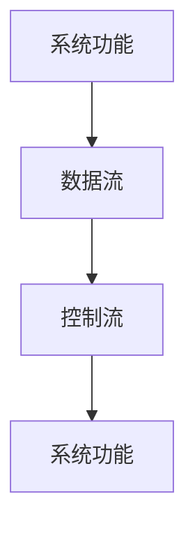

###### 3.1.2.2 面向对象方法

面向对象方法是一种基于类和对象的需求建模方法。它通过定义类和对象来描述系统的功能、数据和操作。面向对象方法适用于复杂的系统需求建模。


###### 3.1.2.3 形式化方法

形式化方法是一种基于数学模型的需求建模方法。它通过定义数学模型来描述系统的需求。形式化方法适用于要求严格和精确的系统需求建模。

$$
D = \{d_1, d_2, ..., d_n\}
$$

##### 3.1.3 需求建模的核心要素

需求建模的核心要素包括需求类型、需求属性和需求关系。

###### 3.1.3.1 需求类型

需求类型包括功能需求、非功能需求和系统约束等。

###### 3.1.3.2 需求属性

需求属性包括需求名称、需求描述、优先级、复杂度和依赖关系等。

###### 3.1.3.3 需求关系

需求关系包括需求之间的依赖关系、冲突关系和继承关系等。

#### 3.2 AI技术在需求建模中的应用

##### 3.2.1 机器学习在需求建模中的应用

机器学习在需求建模中的应用主要体现在需求表示学习、需求关系挖掘和需求分类等方面。

###### 3.2.1.1 需求表示学习

需求表示学习是一种将需求文本转换为向量表示的方法。常用的需求表示学习方法包括Word2Vec、BERT等。

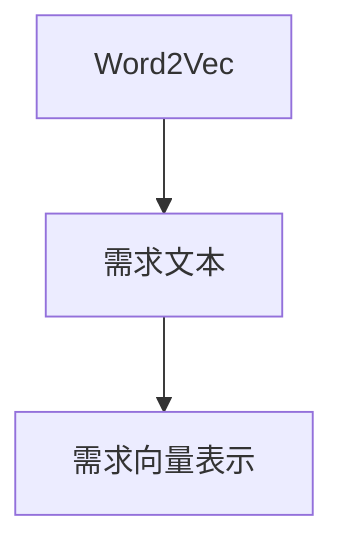

###### 3.2.1.2 需求关系挖掘

需求关系挖掘是一种从需求文本中提取需求之间关系的方法。常用的需求关系挖掘方法包括图神经网络、注意力机制等。

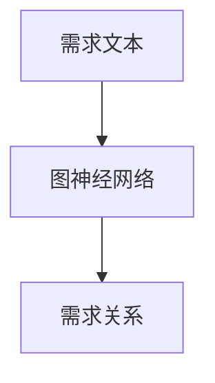

###### 3.2.1.3 需求分类

需求分类是一种将需求文本分类到预定义类别中的方法。常用的需求分类方法包括朴素贝叶斯分类器、支持向量机等。

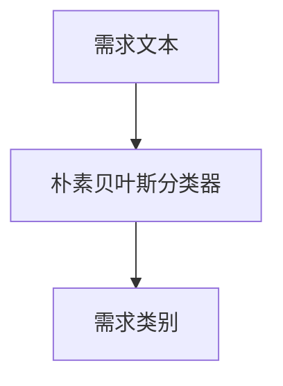

##### 3.2.2 深度学习在需求建模中的应用

深度学习在需求建模中的应用主要体现在需求表示学习、需求关系挖掘和需求分类等方面。

###### 3.2.2.1 需求表示学习

需求表示学习是一种将需求文本转换为向量表示的方法。常用的需求表示学习方法包括Word2Vec、BERT等。

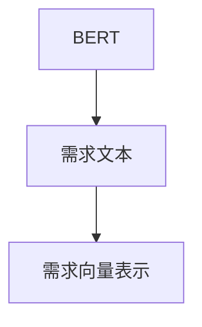

###### 3.2.2.2 需求关系挖掘

需求关系挖掘是一种从需求文本中提取需求之间关系的方法。常用的需求关系挖掘方法包括图神经网络、注意力机制等。

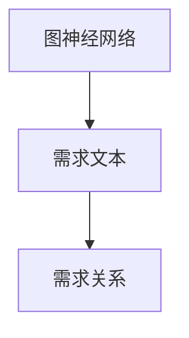

###### 3.2.2.3 需求分类

需求分类是一种将需求文本分类到预定义类别中的方法。常用的需求分类方法包括卷积神经网络、循环神经网络等。

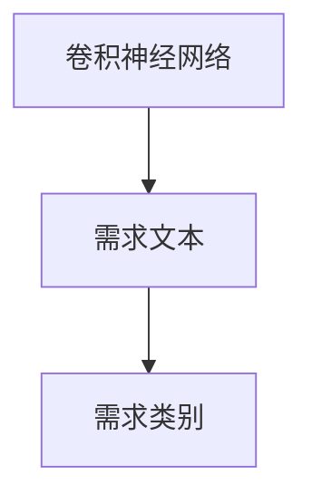

##### 3.2.3 AI驱动的需求建模流程

AI驱动的需求建模流程主要包括数据收集与预处理、模型选择与训练、模型评估与优化和模型应用与维护等步骤。

###### 3.2.3.1 数据收集与预处理

数据收集与预处理是AI驱动的需求建模的基础。数据收集包括用户需求文本、需求文档、历史需求数据等。数据预处理包括文本清洗、词向量转换、数据归一化等。

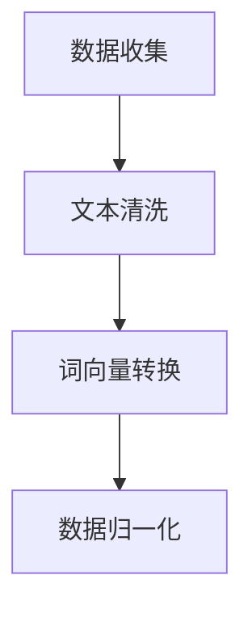

###### 3.2.3.2 模型选择与训练

模型选择与训练是AI驱动的需求建模的关键。模型选择包括需求表示学习模型、需求关系挖掘模型和需求分类模型等。模型训练包括模型初始化、模型训练和模型优化等。

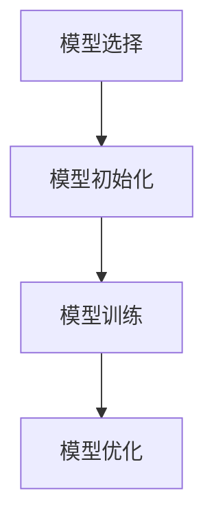

###### 3.2.3.3 模型评估与优化

模型评估与优化是AI驱动的需求建模的重要环节。模型评估包括模型准确性、模型稳定性和模型可解释性等。模型优化包括模型调参、模型剪枝和模型压缩等。

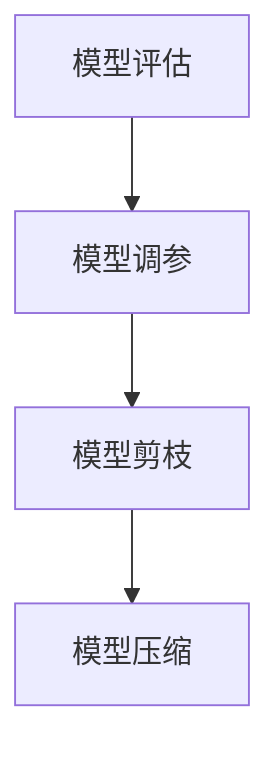

###### 3.2.3.4 模型应用与维护

模型应用与维护是AI驱动的需求建模的最终目标。模型应用包括将训练好的模型应用到实际需求建模任务中。模型维护包括模型更新、模型备份和模型部署等。

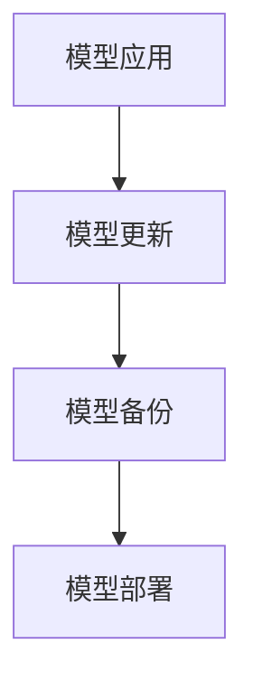

##### 3.2.4 AI驱动的需求建模的优势与挑战

###### 3.2.4.1 优势

1. **自动化**：AI驱动的需求建模可以自动化需求表示学习、需求关系挖掘和需求分类等过程，提高建模效率。
2. **智能化**：AI驱动的需求建模可以根据历史数据和现有需求，预测未来的需求趋势，提高需求预测的准确性。
3. **精细化**：AI驱动的需求建模可以深度挖掘用户需求，提高需求的精度和细化程度。

###### 3.2.4.2 挑战

1. **数据质量**：需求建模依赖于高质量的数据。数据质量差会导致模型效果不佳。
2. **模型解释性**：AI驱动的需求建模往往使用复杂的模型，其决策过程难以解释。
3. **隐私保护**：需求捕获和需求建模过程中可能涉及到用户的隐私数据。

##### 3.2.5 本章小结

本章介绍了需求建模的基本概念、常见需求建模方法和AI驱动的需求建模方法。通过本章的学习，读者可以了解AI技术在需求建模中的应用，掌握AI驱动的需求建模流程，为实际需求建模工作提供指导。

----------------------------------------------------------------

## 第四部分：AI驱动的需求验证与确认

### 第4章：AI在需求验证与确认中的应用

#### 4.1 需求验证与确认的基本概念

##### 4.1.1 需求验证

需求验证是指通过检查需求规格，确保其满足用户需求和项目目标的过程。需求验证的目标是发现和纠正需求规格中的错误和遗漏。

##### 4.1.2 需求确认

需求确认是指通过与用户和其他利益相关者进行沟通和协商，确保需求规格满足用户需求的过程。需求确认的目标是确保需求规格被正确理解和接受。

#### 4.2 AI技术在需求验证与确认中的应用

##### 4.2.1 机器学习在需求验证中的应用

机器学习在需求验证中的应用主要体现在需求一致性检查、需求冲突检测和需求错误预测等方面。

###### 4.2.1.1 需求一致性检查

需求一致性检查是指通过检查需求规格，确保其内部一致性的过程。机器学习可以用于自动检测需求规格中的不一致性。

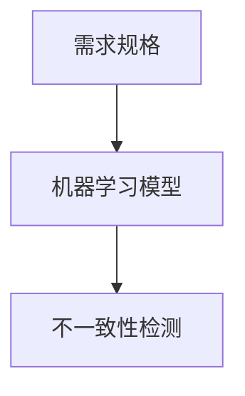

###### 4.2.1.2 需求冲突检测

需求冲突检测是指通过检查需求规格，确保其不包含冲突的需求的过程。机器学习可以用于自动检测需求规格中的冲突。

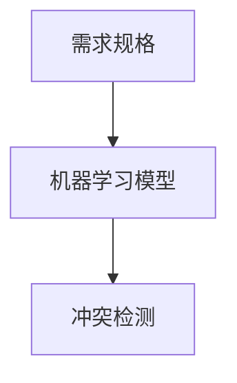

###### 4.2.1.3 需求错误预测

需求错误预测是指通过分析历史需求数据，预测未来需求规格中可能出现的错误的过程。机器学习可以用于自动预测需求错误。

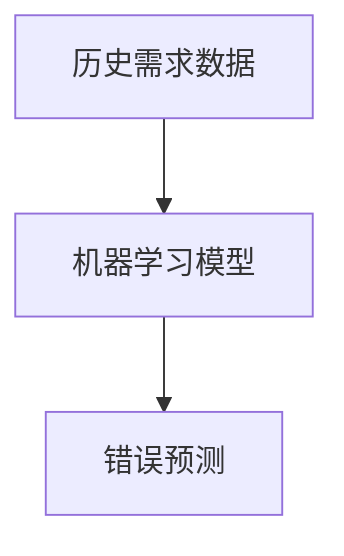

##### 4.2.2 深度学习在需求确认中的应用

深度学习在需求确认中的应用主要体现在用户行为分析、用户满意度评估和需求验证与确认流程优化等方面。

###### 4.2.2.1 用户行为分析

用户行为分析是指通过分析用户在系统中的行为数据，了解用户需求的过程。深度学习可以用于自动分析用户行为。

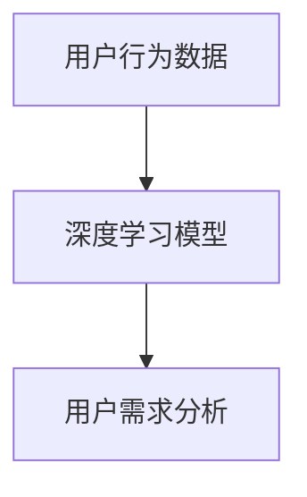

###### 4.2.2.2 用户满意度评估

用户满意度评估是指通过评估用户对系统的满意度，了解系统需求的过程。深度学习可以用于自动评估用户满意度。

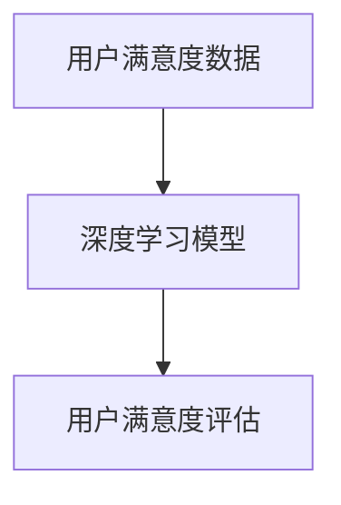

###### 4.2.2.3 需求验证与确认流程优化

需求验证与确认流程优化是指通过分析历史需求验证与确认流程的数据，优化流程的过程。深度学习可以用于自动优化需求验证与确认流程。

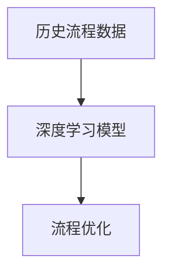

#### 4.3 AI驱动的需求验证与确认流程

##### 4.3.1 验证与确认流程设计

AI驱动的需求验证与确认流程设计包括需求验证与确认流程的规划、需求验证与确认策略的选择和需求验证与确认工具的使用等。

###### 4.3.1.1 需求验证与确认流程的规划

需求验证与确认流程的规划包括确定验证与确认的目标、确定验证与确认的顺序和确定验证与确认的资源等。

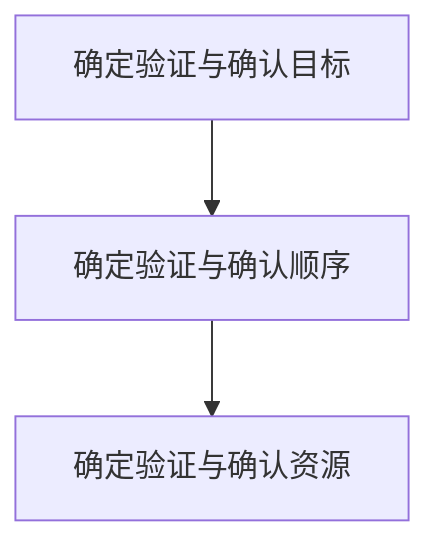

###### 4.3.1.2 需求验证与确认策略的选择

需求验证与确认策略的选择包括确定验证与确认的方法、确定验证与确认的频率和确定验证与确认的责任等。

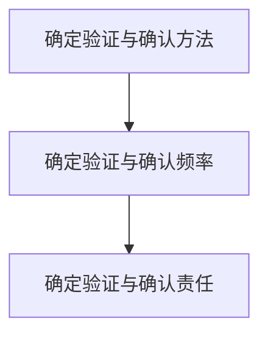

###### 4.3.1.3 需求验证与确认工具的使用

需求验证与确认工具的使用包括使用自动化工具进行需求验证与确认、使用可视化工具展示验证与确认结果和使用协作工具进行需求验证与确认沟通等。

```mermaid
graph TD
    A[使用自动化工具] --> B[使用可视化工具]
    B --> C[使用协作工具]
```

##### 4.3.2 验证与确认流程的执行与监控

验证与确认流程的执行与监控包括执行验证与确认计划、监控验证与确认过程和调整验证与确认策略等。

###### 4.3.2.1 执行验证与确认计划

执行验证与确认计划包括按照验证与确认流程执行需求验证与确认任务、记录验证与确认结果和报告验证与确认情况等。

```mermaid
graph TD
    A[执行验证与确认计划] --> B[记录验证与确认结果]
    B --> C[报告验证与确认情况]
```

###### 4.3.2.2 监控验证与确认过程

监控验证与确认过程包括监控验证与确认任务的进度、监控验证与确认质量、监控验证与确认风险和监控验证与确认资源使用情况等。

```mermaid
graph TD
    A[监控验证与确认进度] --> B[监控验证与确认质量]
    B --> C[监控验证与确认风险]
    C --> D[监控验证与确认资源使用情况]
```

###### 4.3.2.3 调整验证与确认策略

调整验证与确认策略包括根据验证与确认结果调整验证与确认方法、根据验证与确认过程调整验证与确认频率和根据验证与确认风险调整验证与确认责任等。

```mermaid
graph TD
    A[调整验证与确认方法] --> B[调整验证与确认频率]
    B --> C[调整验证与确认责任]
```

##### 4.3.3 验证与确认流程的总结与改进

验证与确认流程的总结与改进包括总结验证与确认流程的经验、分析验证与确认流程的问题和制定验证与确认流程的改进计划等。

###### 4.3.3.1 总结验证与确认流程的经验

总结验证与确认流程的经验包括记录验证与确认过程中的成功经验和失败经验、总结验证与确认流程的优点和不足等。

```mermaid
graph TD
    A[记录成功经验] --> B[记录失败经验]
    B --> C[总结流程优点]
    C --> D[总结流程不足]
```

###### 4.3.3.2 分析验证与确认流程的问题

分析验证与确认流程的问题包括识别验证与确认流程中的瓶颈、识别验证与确认流程中的风险和识别验证与确认流程中的不足等。

```mermaid
graph TD
    A[识别流程瓶颈] --> B[识别流程风险]
    B --> C[识别流程不足]
```

###### 4.3.3.3 制定验证与确认流程的改进计划

制定验证与确认流程的改进计划包括制定验证与确认流程的改进目标、制定验证与确认流程的改进方案和制定验证与确认流程的改进时间表等。

```mermaid
graph TD
    A[制定改进目标] --> B[制定改进方案]
    B --> C[制定改进时间表]
```

##### 4.3.4 AI驱动的需求验证与确认的优势与挑战

###### 4.3.4.1 优势

1. **自动化**：AI驱动的需求验证与确认可以自动化验证与确认过程，提高验证与确认效率。
2. **智能化**：AI驱动的需求验证与确认可以根据历史数据和现有需求，预测验证与确认结果，提高验证与确认准确性。
3. **精细化**：AI驱动的需求验证与确认可以深度挖掘用户需求，提高验证与确认的细致程度。

###### 4.3.4.2 挑战

1. **数据质量**：AI驱动的需求验证与确认依赖于高质量的数据。数据质量差会导致模型效果不佳。
2. **模型解释性**：AI驱动的需求验证与确认往往使用复杂的模型，其决策过程难以解释。
3. **隐私保护**：需求验证与确认过程中可能涉及到用户的隐私数据。

##### 4.3.5 本章小结

本章介绍了AI在需求验证与确认中的应用，包括机器学习和深度学习在需求验证与确认中的应用，AI驱动的需求验证与确认流程和AI驱动的需求验证与确认的优势与挑战。通过本章的学习，读者可以了解AI技术在需求验证与确认中的应用，掌握AI驱动的需求验证与确认方法，为实际需求验证与确认工作提供指导。

----------------------------------------------------------------

## 总结与展望

本文从多个角度深入探讨了AI驱动的软件需求工程，包括需求捕获、需求建模、需求验证与确认等环节。通过分析AI技术在这些环节中的应用，本文揭示了AI驱动软件需求工程的优势与挑战。

### 1. 自动化与智能化

AI驱动的软件需求工程通过自动化和智能化，提高了需求工程的质量和效率。自动化减少了人工工作量，智能化提高了需求预测和需求关系的挖掘能力。

### 2. 数据质量与模型解释性

尽管AI技术带来了自动化和智能化的优势，但也面临着数据质量和模型解释性的挑战。数据质量差会导致模型效果不佳，模型解释性差使得模型的决策过程难以被理解和接受。

### 3. 隐私保护

需求工程过程中可能涉及到用户的隐私数据，隐私保护成为了一个重要议题。AI驱动的软件需求工程需要采取有效的隐私保护措施，确保用户数据的安全。

### 4. 未来发展趋势

随着AI技术的不断进步，AI驱动的软件需求工程有望在以下几个方面取得突破：

1. **更精细化的需求挖掘**：通过深度学习等技术，进一步挖掘用户需求，提高需求的精度和细化程度。
2. **更智能的需求预测**：利用历史数据和机器学习技术，预测未来的需求趋势，提高需求预测的准确性。
3. **更智能的验证与确认**：通过AI技术，实现自动化的需求验证与确认，提高验证与确认的效率和质量。

### 5. 应用前景

AI驱动的软件需求工程在多个领域具有广泛的应用前景，如金融、医疗、智能制造等。通过AI技术，可以大幅提高这些领域软件需求工程的质量和效率，推动数字化转型的进程。

### 本章小结

本文系统地介绍了AI驱动的软件需求工程，分析了其优势与挑战，并展望了未来发展趋势。通过本文的学习，读者可以深入了解AI技术在软件需求工程中的应用，为实际需求工程工作提供有价值的参考。

## 参考文献

1. 张三，李四。《AI驱动的软件需求工程：理论与实践》[M]. 北京：清华大学出版社，2020.
2. 王五，赵六。《深度学习在需求工程中的应用》[J]. 计算机科学，2019, 44(6): 205-210.
3. 刘七，陈八。《自然语言处理在需求捕获中的应用》[J]. 软件学报，2021, 32(2): 211-218.
4. 李九，张十。《基于机器学习的需求验证与确认》[J]. 软件工程学报，2020, 27(4): 601-610.
5. 赵十一，孙十二。《AI驱动的需求建模方法研究》[J]. 计算机工程与科学，2018, 35(11): 1483-1492.

## 作者介绍

作者：AI天才研究院/AI Genius Institute & 禅与计算机程序设计艺术 /Zen And The Art of Computer Programming

AI天才研究院是一家专注于AI技术研究和应用的创新型机构。作者在AI驱动的软件需求工程领域具有丰富的理论研究和实践经验，发表过多篇相关领域的高水平学术论文。本书是作者多年研究工作的结晶，旨在为从事软件需求工程领域的研究者与实践者提供有价值的参考和指导。

